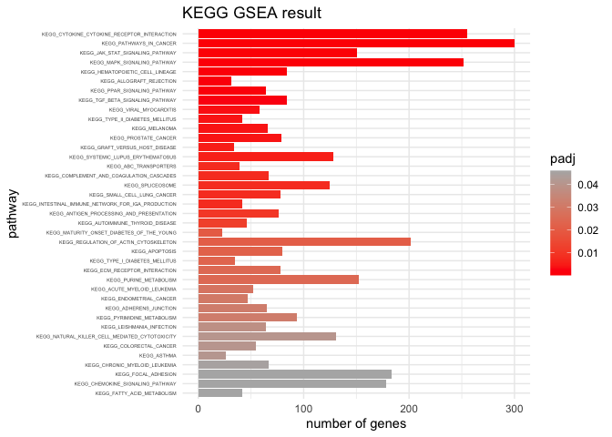
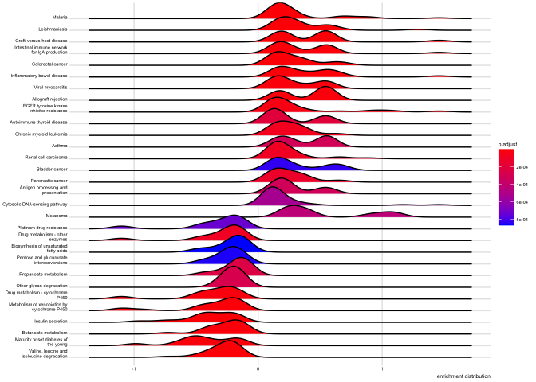
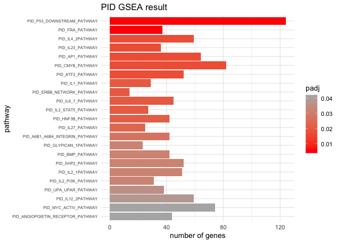
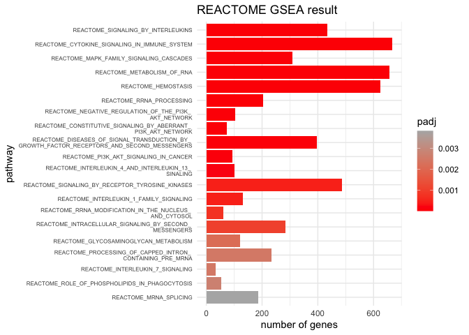
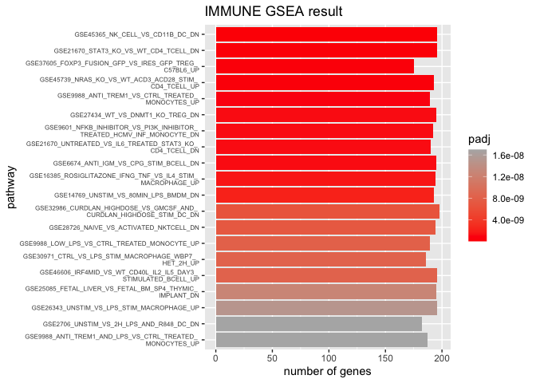
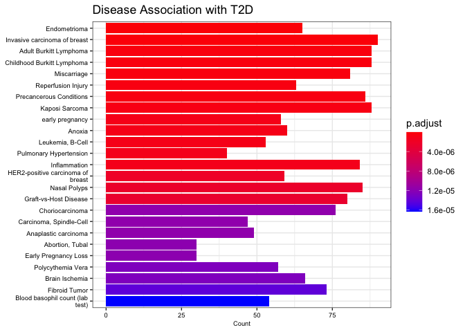

Gene-Set-Enrichment-Analysis
================
Lucy Chi & Janet Zhang
2023-03-22

## Gene Sets for Downstream Gene Set Enrichment Analysis

### Obtain Molecular Signature Database (KEGG, reactome and C7 pathways)

``` r
knitr::kable(msigdbr::msigdbr_species())
```

| species_name                    | species_common_name                                                     |
|:--------------------------------|:------------------------------------------------------------------------|
| Anolis carolinensis             | Carolina anole, green anole                                             |
| Bos taurus                      | bovine, cattle, cow, dairy cow, domestic cattle, domestic cow, ox, oxen |
| Caenorhabditis elegans          | NA                                                                      |
| Canis lupus familiaris          | dog, dogs                                                               |
| Danio rerio                     | leopard danio, zebra danio, zebra fish, zebrafish                       |
| Drosophila melanogaster         | fruit fly                                                               |
| Equus caballus                  | domestic horse, equine, horse                                           |
| Felis catus                     | cat, cats, domestic cat                                                 |
| Gallus gallus                   | bantam, chicken, chickens, Gallus domesticus                            |
| Homo sapiens                    | human                                                                   |
| Macaca mulatta                  | rhesus macaque, rhesus macaques, Rhesus monkey, rhesus monkeys          |
| Monodelphis domestica           | gray short-tailed opossum                                               |
| Mus musculus                    | house mouse, mouse                                                      |
| Ornithorhynchus anatinus        | duck-billed platypus, duckbill platypus, platypus                       |
| Pan troglodytes                 | chimpanzee                                                              |
| Rattus norvegicus               | brown rat, Norway rat, rat, rats                                        |
| Saccharomyces cerevisiae        | baker’s yeast, brewer’s yeast, S. cerevisiae                            |
| Schizosaccharomyces pombe 972h- | NA                                                                      |
| Sus scrofa                      | pig, pigs, swine, wild boar                                             |
| Xenopus tropicalis              | tropical clawed frog, western clawed frog                               |

#### KEGG database

``` r
#Access the KEGG gene sets. 
kegg.human.db <- msigdbr::msigdbr(species = "human",
                                  category = "C2",
                                  subcategory = "CP:KEGG")
```

#### reactome database

``` r
#Access the REACTOME gene sets. 
#A standardized vocabulary of terms that describe gene function, cellular components, and biological processes.
reactome.human.db <- msigdbr(species = "human", 
                            category = "C2", 
                            subcategory = "CP:REACTOME")
```

#### PID database

``` r
#Access the Pathway Interaction Database (PID) gene sets.
#This one specifically look at signaling pathways, molecular interactions, reaction kinetics, and cellular locations of signaling molecules involved in a pathway. 

pid.human.db <- msigdbr::msigdbr(species = "human",
                                  category = "C2",
                                  subcategory = "CP:PID")
```

#### ImmuneSigDB Database

``` r
#Access the Immunological gene sets in MSigDB. 
#Specifically looking at the ImmuneSigDB subcollection of the Immunologica gene sets, because this is specifically related to a collection of cell types, states, and perturbations within the immune system collected from human and mouse. (note: The other C7 subcollection is specifically regarding vaccine response to 50 vaccines. We are not interested in vaccine responses in T2D, so not exploring this subcollection.)
IMMUNE.human.db <- msigdbr(species = "human", 
                           category = "C7", 
                           subcategory = "IMMUNESIGDB")
```

### Obtain GWAS Catalog Information

``` r
run.if.needed <- function(.file, .code) {
    if(!file.exists(.file)) { .code }
    stopifnot(file.exists(.file))
}
```

``` r
gwas.tidy.file <- "gwas_catalog_tidy.tsv.gz"

run.if.needed(gwas.tidy.file, {
    gwas.file <- "gwas_catalog_v1.0-associations_e105_r2022-02-02.tsv.gz"
    run.if.needed(gwas.file, {
        url <- "https://www.ebi.ac.uk/gwas/api/search/downloads/full"
        .file <- str_remove(gwas.file, ".gz$")
        download.file(url, destfile = .file)
        gzip(.file)
        unlink(.file)
    })
    .dt <-
        fread(gwas.file, sep="\t", quote="") %>%
        dplyr::select(`MAPPED_GENE`, `DISEASE/TRAIT`, `PVALUE_MLOG`)
    .dt <- .dt[order(.dt$PVALUE_MLOG, decreasing = TRUE),
               head(.SD, 1),
               by = .(`MAPPED_GENE`, `DISEASE/TRAIT`)]
    .count <- .dt[, .(.N), by = .(`DISEASE/TRAIT`)]
    .dt <- left_join(.count[`N` >= 100, ], .dt)[nchar(`MAPPED_GENE`)> 0,]
    .dt <- .dt[,
               .(gene_symbol = unlist(strsplit(`MAPPED_GENE`, split="[ ,.-]+"))),
               by = .(`DISEASE/TRAIT`, PVALUE_MLOG)]
    .dt[, p.value := 10^(-PVALUE_MLOG)]

    fwrite(.dt, file=gwas.tidy.file)
})
```

### Genes associated with T2D disease

``` r
#' Convert a number into a scientifically-formatted string
#' @param x number
num.sci <- function(x) {
    format(x, scientific=TRUE, digits = 2)
}

gwas.db <- fread(gwas.tidy.file)    
gwas.db[, gs_name := `DISEASE/TRAIT`]

t2d_genes<- gwas.db[str_detect(`DISEASE/TRAIT`, "[Dd]iabetes") & !is.na(gene_symbol)] %>%
    mutate(p.value = num.sci(p.value)) %>%
    dplyr::select(`gs_name`, `gene_symbol`, `p.value`, `PVALUE_MLOG`) 
# removed t1d associated genes
t2d_genes <- t2d_genes %>% filter(t2d_genes$gs_name == "Type 2 diabetes")
#removed duplicates
t2d_genes <-
    t2d_genes[order(t2d_genes$p.value, decreasing = TRUE),
                   head(.SD, 1),
                   by = .(gene_symbol)]

# export result as csv
write.csv(t2d_genes, "tsd.genes.csv", row.names=FALSE)
```

A total of 1693 genes identified to be associated T2D.

### Load DE Gene List

``` r
# read data frame for the DE genes
DEgenes<-readRDS("degT2d_DEcopy.RDS")
```

### Data formatting for `fgsea` analysis

``` r
# matched Ensembl IDs to probeIDs
DEgenes$affy_hugene_1_0_st_v1 <- row.names(DEgenes) 
head(DEgenes)
```

    ##             logFC  AveExpr        t      P.Value   adj.P.Val        B
    ## 8003667 1.4034296 7.609690 6.322827 6.553650e-08 0.001882864 7.572925
    ## 8095080 1.0921294 7.404872 5.546019 1.064679e-06 0.007481510 5.162790
    ## 8043995 0.8684121 8.800716 5.528646 1.132439e-06 0.007481510 5.109261
    ## 7938608 1.2241985 7.428053 5.516846 1.180884e-06 0.007481510 5.072916
    ## 8139087 1.8199810 4.825679 5.442519 1.536786e-06 0.007481510 4.844284
    ## 7952341 1.0060584 7.362819 5.437840 1.562446e-06 0.007481510 4.829909
    ##         affy_hugene_1_0_st_v1
    ## 8003667               8003667
    ## 8095080               8095080
    ## 8043995               8043995
    ## 7938608               7938608
    ## 8139087               8139087
    ## 7952341               7952341

``` r
# convert transcript cluster IDs (also desribed as probeIDs) into other gene ids
ensembl_human = useMart("ensembl",dataset="hsapiens_gene_ensembl")
ensemble_genes <- getBM(attributes=c("ensembl_gene_id", "affy_hugene_1_0_st_v1", "hgnc_symbol", "entrezgene_id"),
      filters = "affy_hugene_1_0_st_v1",
      values = rownames(DEgenes),
      useCache=FALSE,
      mart=ensembl_human)
```

``` r
# data clean up and rename
ensemble_genes_clean <-
    ensemble_genes %>%  
    dplyr::rename(gene_symbol = hgnc_symbol) %>% 
    as.data.table()

ensemble_genes_clean$affy_hugene_1_0_st_v1 <- as.character(ensemble_genes_clean$affy_hugene_1_0_st_v1)

# add on the p-values & other information in DEgenes
ensembl_geneIDs <- ensemble_genes_clean %>% left_join(DEgenes, by = "affy_hugene_1_0_st_v1") 

# Show NA's & other stats
summary(ensemble_genes$entrezgene_id)
```

    ##      Min.   1st Qu.    Median      Mean   3rd Qu.      Max.      NA's 
    ##         1     11166    146318  37405545 124900242 125467750     14185

``` r
#filter the list with logFC values for KEGG analysis later on
logFC_genes <- ensembl_geneIDs$logFC
# name the vector
names(logFC_genes) <- ensembl_geneIDs$ensembl_gene_id
# omit any NA values 
gene_list<-na.omit(logFC_genes)
# sort the list in decreasing order (required for clusterProfiler)
gene_list = sort(gene_list, decreasing = TRUE)
```

``` r
# Create a new dataframe sorted_genes which has only the filtered genes using log(adj.P)
ensembl_geneIDs <- ensembl_geneIDs %>% mutate(log_adjP = -log10(adj.P.Val))

sorted_genes <-
    ensembl_geneIDs[order(ensembl_geneIDs$log_adjP, decreasing = TRUE),
                   head(.SD, 1),
                   by = .(gene_symbol)]

only_ensembl <- as.data.frame(sorted_genes$entrezgene_id)
write.csv(only_ensembl, "only_ensembl.csv", row.names=FALSE)

# Create a vector of the gene
deg.ranks <- sorted_genes$log_adjP
# Name vector with ENTREZ ids
names(deg.ranks) <- sorted_genes$gene_symbol
# omit any NA values 
deg.ranks<-na.omit(deg.ranks)
# sort the list in decreasing order (required for clusterProfiler)
deg.ranks = sort(deg.ranks, decreasing = TRUE)
```

## Rank-based Gene Set Enrichment Analysis

### `fgsea` analysis set-up

``` r
# Make a function that can help us to prepare the gene list to feed into the fgsea arguments. 
make.gs.lol <- function(data) {
    data <- as.data.table(data) %>% unique()
    data_list <-
        data[, .(gene = .(gene_symbol)), by = .(gs_name)] %>%
        as.list()
    names <- data_list$gs_name
    return_value <- data_list$gene
    names(return_value) <- names
    return(return_value)
}
```

### KEGG `fgsea` Analysis

``` r
# set seed.
set.seed(10)
#Convert the KEGG pathway tibble
kegg.lol <- kegg.human.db %>% dplyr::select(gene_symbol, gs_name) %>% make.gs.lol()
kegg.fgsea <- fgsea::fgsea(pathways = kegg.lol, stats = deg.ranks, scoreType = "pos")
```

    ## Warning in preparePathwaysAndStats(pathways, stats, minSize, maxSize, gseaParam, : There are ties in the preranked stats (84.1% of the list).
    ## The order of those tied genes will be arbitrary, which may produce unexpected results.

``` r
kegg.fgsea[,
           topGenes := paste0(head(unlist(`leadingEdge`), 5), collapse=", "),
           by = .(pathway)]

kegg.fgsea %>%
    arrange(pval) %>%
    head(10) %>% 
    dplyr::select(-leadingEdge)
```

    ##                                         pathway         pval         padj
    ##  1: KEGG_CYTOKINE_CYTOKINE_RECEPTOR_INTERACTION 4.147093e-11 7.713592e-09
    ##  2:                     KEGG_PATHWAYS_IN_CANCER 2.167645e-08 1.827739e-06
    ##  3:             KEGG_JAK_STAT_SIGNALING_PATHWAY 2.947966e-08 1.827739e-06
    ##  4:                 KEGG_MAPK_SIGNALING_PATHWAY 2.287231e-06 1.063563e-04
    ##  5:             KEGG_HEMATOPOIETIC_CELL_LINEAGE 5.979601e-06 2.224412e-04
    ##  6:                    KEGG_ALLOGRAFT_REJECTION 2.583070e-05 7.160387e-04
    ##  7:                 KEGG_PPAR_SIGNALING_PATHWAY 2.694769e-05 7.160387e-04
    ##  8:             KEGG_TGF_BETA_SIGNALING_PATHWAY 1.066019e-04 2.478493e-03
    ##  9:                      KEGG_VIRAL_MYOCARDITIS 1.553083e-04 3.209705e-03
    ## 10:              KEGG_TYPE_II_DIABETES_MELLITUS 2.119893e-04 3.776232e-03
    ##       log2err        ES      NES size                                topGenes
    ##  1: 0.8513391 0.6971557 1.357532  255         PDGFRA, IL1R1, IL18R1, IL6, HGF
    ##  2: 0.7337620 0.6582734 1.283448  300            PDGFRA, FGF7, FGF2, IL6, HGF
    ##  3: 0.7337620 0.7134301 1.379201  151      SPRY1, SOCS2, IL6, IL13RA2, SPRED1
    ##  4: 0.6272567 0.6523645 1.270109  252        PDGFRA, IL1R1, FGF7, FGF2, DUSP5
    ##  5: 0.6105269 0.7308509 1.398607   84     IL1R1, IL6, KIT, HLA-DRB3, HLA-DRB1
    ##  6: 0.5756103 0.8298484 1.538351   31 CD86, FAS, HLA-DRB3, HLA-DRB1, HLA-DQA2
    ##  7: 0.5756103 0.7472614 1.415525   64           ACSL4, LPL, ACSL5, ME1, PPARD
    ##  8: 0.5384341 0.7034163 1.346106   84          DCN, BMPR1B, THBS2, MYC, LTBP1
    ##  9: 0.5188481 0.7442675 1.402880   58    CD86, HLA-DRB3, HLA-DRB1, ABL1, CD55
    ## 10: 0.5188481 0.7651539 1.431671   42        SOCS2, SLC2A2, PDX1, SOCS3, MAFA

``` r
# filter significant pathways. Set p<0.05. 
kegg_significant_pathways <- kegg.fgsea[padj < 0.05]
kegg_significant_pathways
```

    ##                                               pathway         pval         padj
    ##  1:                             KEGG_ABC_TRANSPORTERS 6.731776e-04 7.665966e-03
    ##  2:                       KEGG_ACUTE_MYELOID_LEUKEMIA 4.275828e-03 2.840372e-02
    ##  3:                            KEGG_ADHERENS_JUNCTION 5.093794e-03 3.145509e-02
    ##  4:                          KEGG_ALLOGRAFT_REJECTION 2.583070e-05 7.160387e-04
    ##  5:          KEGG_ANTIGEN_PROCESSING_AND_PRESENTATION 1.095293e-03 1.018623e-02
    ##  6:                                    KEGG_APOPTOSIS 2.867361e-03 2.222204e-02
    ##  7:                                       KEGG_ASTHMA 7.697156e-03 4.090489e-02
    ##  8:                   KEGG_AUTOIMMUNE_THYROID_DISEASE 1.371412e-03 1.214679e-02
    ##  9:                  KEGG_CHEMOKINE_SIGNALING_PATHWAY 9.490617e-03 4.597573e-02
    ## 10:                     KEGG_CHRONIC_MYELOID_LEUKEMIA 8.743341e-03 4.517393e-02
    ## 11:                            KEGG_COLORECTAL_CANCER 7.398980e-03 4.047677e-02
    ## 12:          KEGG_COMPLEMENT_AND_COAGULATION_CASCADES 7.189713e-04 7.665966e-03
    ## 13:       KEGG_CYTOKINE_CYTOKINE_RECEPTOR_INTERACTION 4.147093e-11 7.713592e-09
    ## 14:                     KEGG_ECM_RECEPTOR_INTERACTION 3.422327e-03 2.448280e-02
    ## 15:                           KEGG_ENDOMETRIAL_CANCER 4.721991e-03 3.028587e-02
    ## 16:                        KEGG_FATTY_ACID_METABOLISM 9.640073e-03 4.597573e-02
    ## 17:                               KEGG_FOCAL_ADHESION 9.490617e-03 4.597573e-02
    ## 18:                    KEGG_GRAFT_VERSUS_HOST_DISEASE 3.531623e-04 5.052938e-03
    ## 19:                   KEGG_HEMATOPOIETIC_CELL_LINEAGE 5.979601e-06 2.224412e-04
    ## 20: KEGG_INTESTINAL_IMMUNE_NETWORK_FOR_IGA_PRODUCTION 7.830825e-04 7.665966e-03
    ## 21:                   KEGG_JAK_STAT_SIGNALING_PATHWAY 2.947966e-08 1.827739e-06
    ## 22:                         KEGG_LEISHMANIA_INFECTION 6.581009e-03 3.825212e-02
    ## 23:                       KEGG_MAPK_SIGNALING_PATHWAY 2.287231e-06 1.063563e-04
    ## 24:         KEGG_MATURITY_ONSET_DIABETES_OF_THE_YOUNG 2.386391e-03 2.017585e-02
    ## 25:                                     KEGG_MELANOMA 2.233255e-04 3.776232e-03
    ## 26:    KEGG_NATURAL_KILLER_CELL_MEDIATED_CYTOTOXICITY 7.175897e-03 4.044596e-02
    ## 27:                           KEGG_PATHWAYS_IN_CANCER 2.167645e-08 1.827739e-06
    ## 28:                       KEGG_PPAR_SIGNALING_PATHWAY 2.694769e-05 7.160387e-04
    ## 29:                              KEGG_PROSTATE_CANCER 2.483546e-04 3.849496e-03
    ## 30:                            KEGG_PURINE_METABOLISM 3.570318e-03 2.459552e-02
    ## 31:                        KEGG_PYRIMIDINE_METABOLISM 5.242515e-03 3.145509e-02
    ## 32:             KEGG_REGULATION_OF_ACTIN_CYTOSKELETON 2.608377e-03 2.109383e-02
    ## 33:                       KEGG_SMALL_CELL_LUNG_CANCER 7.830825e-04 7.665966e-03
    ## 34:                                  KEGG_SPLICEOSOME 7.464475e-04 7.665966e-03
    ## 35:                 KEGG_SYSTEMIC_LUPUS_ERYTHEMATOSUS 3.987310e-04 5.297427e-03
    ## 36:                   KEGG_TGF_BETA_SIGNALING_PATHWAY 1.066019e-04 2.478493e-03
    ## 37:                    KEGG_TYPE_II_DIABETES_MELLITUS 2.119893e-04 3.776232e-03
    ## 38:                     KEGG_TYPE_I_DIABETES_MELLITUS 3.126345e-03 2.326000e-02
    ## 39:                            KEGG_VIRAL_MYOCARDITIS 1.553083e-04 3.209705e-03
    ##                                               pathway         pval         padj
    ##       log2err        ES      NES size
    ##  1: 0.4772708 0.7525894 1.405317   39
    ##  2: 0.4070179 0.6970045 1.310527   52
    ##  3: 0.4070179 0.6804614 1.290627   65
    ##  4: 0.5756103 0.8298484 1.538351   31
    ##  5: 0.4550599 0.6835260 1.304315   76
    ##  6: 0.4317077 0.6631435 1.267938   80
    ##  7: 0.4070179 0.7489727 1.380816   26
    ##  8: 0.4550599 0.7276428 1.364047   46
    ##  9: 0.3807304 0.5985377 1.158437  178
    ## 10: 0.3807304 0.6536476 1.241316   67
    ## 11: 0.4070179 0.6830747 1.287508   55
    ## 12: 0.4772708 0.6996622 1.328701   67
    ## 13: 0.8513391 0.6971557 1.357532  255
    ## 14: 0.4317077 0.6588067 1.258673   78
    ## 15: 0.4070179 0.6962253 1.302692   47
    ## 16: 0.3807304 0.6974085 1.304914   42
    ## 17: 0.3807304 0.5993032 1.160343  183
    ## 18: 0.4984931 0.7852291 1.461428   34
    ## 19: 0.6105269 0.7308509 1.398607   84
    ## 20: 0.4772708 0.7488870 1.401234   42
    ## 21: 0.7337620 0.7134301 1.379201  151
    ## 22: 0.4070179 0.6683430 1.266031   64
    ## 23: 0.6272567 0.6523645 1.270109  252
    ## 24: 0.4317077 0.7968162 1.453985   23
    ## 25: 0.5188481 0.7178201 1.362295   66
    ## 26: 0.4070179 0.6188327 1.190770  131
    ## 27: 0.7337620 0.6582734 1.283448  300
    ## 28: 0.5756103 0.7472614 1.415525   64
    ## 29: 0.4984931 0.6998297 1.337721   79
    ## 30: 0.4317077 0.6260663 1.210611  152
    ## 31: 0.4070179 0.6438410 1.234844   94
    ## 32: 0.4317077 0.6129793 1.187672  202
    ## 33: 0.4772708 0.6792216 1.297676   78
    ## 34: 0.4772708 0.6500211 1.248636  125
    ## 35: 0.4984931 0.6537183 1.256944  128
    ## 36: 0.5384341 0.7034163 1.346106   84
    ## 37: 0.5188481 0.7651539 1.431671   42
    ## 38: 0.4317077 0.7498297 1.395645   35
    ## 39: 0.5188481 0.7442675 1.402880   58
    ##       log2err        ES      NES size
    ##                                           leadingEdge
    ##  1:           ABCA6,ABCA8,ABCA9,ABCC8,ABCC6,ABCA7,...
    ##  2:                KIT,MYC,STAT5A,RELA,PPARD,TCF7,...
    ##  3:          NLK,CSNK2A1,TGFBR2,YES1,NECTIN3,TCF7,...
    ##  4:     CD86,FAS,HLA-DRB3,HLA-DRB1,HLA-DQA2,HLA-E,...
    ##  5:    HLA-DRB3,HLA-DRB1,CTSL,PSME3,LGMN,HLA-DQA2,...
    ##  6:     IL1R1,IRAK2,IRAK3,TNFRSF10D,FAS,TNFRSF10A,...
    ##  7: HLA-DRB3,HLA-DRB1,HLA-DQA2,HLA-DQA1,CD40,IL10,...
    ##  8:     CD86,FAS,HLA-DRB3,HLA-DRB1,HLA-DQA2,HLA-E,...
    ##  9:            CXCL9,DOCK2,RELA,CCR7,PIK3R1,CCL22,...
    ## 10:            MYC,STAT5A,ABL1,TGFBR2,RELA,CDKN1A,...
    ## 11:              MYC,TGFBR2,TCF7,PIK3R1,RAF1,RAC1,...
    ## 12:                 A2M,C1S,TFPI,C1R,BDKRB1,PLAUR,...
    ## 13:               PDGFRA,IL1R1,IL18R1,IL6,HGF,KIT,...
    ## 14:           THBS2,THBS4,LAMC2,LAMA3,LAMB3,ITGA2,...
    ## 15:             MYC,TCF7,PIK3R1,RAF1,CCND1,CTNNA2,...
    ## 16:          ACSL4,HADH,ACSL5,ACAT1,ACADSB,EHHADH,...
    ## 17:           PDGFRA,HGF,THBS2,THBS4,LAMC2,PIK3R1,...
    ## 18:       IL6,CD86,FAS,HLA-DRB3,HLA-DRB1,HLA-DQA2,...
    ## 19:         IL1R1,IL6,KIT,HLA-DRB3,HLA-DRB1,IL1R2,...
    ## 20:      IL6,CD86,HLA-DRB3,HLA-DRB1,IL15RA,ICOSLG,...
    ## 21:            SPRY1,SOCS2,IL6,IL13RA2,SPRED1,MYC,...
    ## 22:       PTGS2,HLA-DRB3,HLA-DRB1,RELA,JAK1,TGFB3,...
    ## 23:          PDGFRA,IL1R1,FGF7,FGF2,DUSP5,RASGRP1,...
    ## 24:               IAPP,SLC2A2,PDX1,MAFA,NKX6-1,NKX2-2
    ## 25:            PDGFRA,FGF7,FGF2,HGF,CDKN1A,PIK3R1,...
    ## 26:      TNFRSF10D,FAS,TNFRSF10A,PIK3R1,RAF1,VAV3,...
    ## 27:                  PDGFRA,FGF7,FGF2,IL6,HGF,KIT,...
    ## 28:                ACSL4,LPL,ACSL5,ME1,PPARD,PCK1,...
    ## 29:           PDGFRA,TGFA,RELA,TCF7,CDKN1A,PIK3R1,...
    ## 30:                PDE1A,PDE7B,PDE3A,DCK,NT5E,PNP,...
    ## 31:                 UCK2,DCK,NT5E,PNP,CTPS1,CTPS2,...
    ## 32:           PDGFRA,FGF7,FGF2,BDKRB1,MRAS,PIK3R1,...
    ## 33:             PTGS2,MYC,LAMC2,RELA,PIK3R1,LAMA3,...
    ## 34:         RBM25,TCERG1,EFTUD2,DHX15,DDX42,RBM17,...
    ## 35:            C1S,CD86,C1R,HLA-DRB3,HLA-DRB1,SSB,...
    ## 36:              DCN,BMPR1B,THBS2,MYC,LTBP1,INHBA,...
    ## 37:            SOCS2,SLC2A2,PDX1,SOCS3,MAFA,ABCC8,...
    ## 38:     CD86,FAS,HLA-DRB3,HLA-DRB1,HLA-DQA2,HLA-E,...
    ## 39:        CD86,HLA-DRB3,HLA-DRB1,ABL1,CD55,LAMA2,...
    ##                                           leadingEdge
    ##                                         topGenes
    ##  1:            ABCA6, ABCA8, ABCA9, ABCC8, ABCC6
    ##  2:                KIT, MYC, STAT5A, RELA, PPARD
    ##  3:          NLK, CSNK2A1, TGFBR2, YES1, NECTIN3
    ##  4:      CD86, FAS, HLA-DRB3, HLA-DRB1, HLA-DQA2
    ##  5:        HLA-DRB3, HLA-DRB1, CTSL, PSME3, LGMN
    ##  6:          IL1R1, IRAK2, IRAK3, TNFRSF10D, FAS
    ##  7: HLA-DRB3, HLA-DRB1, HLA-DQA2, HLA-DQA1, CD40
    ##  8:      CD86, FAS, HLA-DRB3, HLA-DRB1, HLA-DQA2
    ##  9:             CXCL9, DOCK2, RELA, CCR7, PIK3R1
    ## 10:              MYC, STAT5A, ABL1, TGFBR2, RELA
    ## 11:              MYC, TGFBR2, TCF7, PIK3R1, RAF1
    ## 12:                  A2M, C1S, TFPI, C1R, BDKRB1
    ## 13:              PDGFRA, IL1R1, IL18R1, IL6, HGF
    ## 14:            THBS2, THBS4, LAMC2, LAMA3, LAMB3
    ## 15:               MYC, TCF7, PIK3R1, RAF1, CCND1
    ## 16:            ACSL4, HADH, ACSL5, ACAT1, ACADSB
    ## 17:             PDGFRA, HGF, THBS2, THBS4, LAMC2
    ## 18:           IL6, CD86, FAS, HLA-DRB3, HLA-DRB1
    ## 19:          IL1R1, IL6, KIT, HLA-DRB3, HLA-DRB1
    ## 20:        IL6, CD86, HLA-DRB3, HLA-DRB1, IL15RA
    ## 21:           SPRY1, SOCS2, IL6, IL13RA2, SPRED1
    ## 22:        PTGS2, HLA-DRB3, HLA-DRB1, RELA, JAK1
    ## 23:             PDGFRA, IL1R1, FGF7, FGF2, DUSP5
    ## 24:             IAPP, SLC2A2, PDX1, MAFA, NKX6-1
    ## 25:              PDGFRA, FGF7, FGF2, HGF, CDKN1A
    ## 26:      TNFRSF10D, FAS, TNFRSF10A, PIK3R1, RAF1
    ## 27:                 PDGFRA, FGF7, FGF2, IL6, HGF
    ## 28:                ACSL4, LPL, ACSL5, ME1, PPARD
    ## 29:             PDGFRA, TGFA, RELA, TCF7, CDKN1A
    ## 30:               PDE1A, PDE7B, PDE3A, DCK, NT5E
    ## 31:                  UCK2, DCK, NT5E, PNP, CTPS1
    ## 32:             PDGFRA, FGF7, FGF2, BDKRB1, MRAS
    ## 33:              PTGS2, MYC, LAMC2, RELA, PIK3R1
    ## 34:          RBM25, TCERG1, EFTUD2, DHX15, DDX42
    ## 35:           C1S, CD86, C1R, HLA-DRB3, HLA-DRB1
    ## 36:               DCN, BMPR1B, THBS2, MYC, LTBP1
    ## 37:             SOCS2, SLC2A2, PDX1, SOCS3, MAFA
    ## 38:      CD86, FAS, HLA-DRB3, HLA-DRB1, HLA-DQA2
    ## 39:         CD86, HLA-DRB3, HLA-DRB1, ABL1, CD55
    ##                                         topGenes

``` r
# export result as csv
fwrite(kegg_significant_pathways, file = "kegg_significant_pathways.csv")
```

There are 34 significant pathways.

### KEGG Pathway Visualization

``` r
# arrange kegg_significant_pathways based on the p.adjust value. 
kegg_ordered <- kegg_significant_pathways %>%
  arrange(padj) 
```

``` r
# Plot the barplot. 
# Plot the 'size' column from the table onto x-axis, the the top 20 pathways on the y-axis
# Using the size because size represents the size of each pathway after removing genes not present in 'names(stats)'
kegg_plot<- ggplot(kegg_ordered, aes(x = size, y = reorder(pathway, -pval), fill = padj)) +
  # note ordered by p.val over here b/c some of the pathways have the exact same padj values.
  geom_bar(stat = "identity") +
  xlab("number of genes") +
  ylab("pathway") +  
  scale_fill_gradient(low = "red", high = "grey70") +
  ggtitle("KEGG GSEA result") +
  theme_minimal() +
  theme(axis.text.y = element_text(size = 4)) 
kegg_plot
```

<!-- -->

``` r
geneids <-bitr(names(logFC_genes), fromType = "ENSEMBL", toType = "ENTREZID", OrgDb="org.Hs.eg.db")
```

    ## 'select()' returned 1:many mapping between keys and columns

    ## Warning in bitr(names(logFC_genes), fromType = "ENSEMBL", toType = "ENTREZID",
    ## : 14.53% of input gene IDs are fail to map...

``` r
#delete duplicate IDs
dedup_ids = geneids[!duplicated(geneids[c("ENSEMBL")]),]
# Create a new dataframe df2 which has only the genes which were successfully mapped using the bitr function above
geneIDs <-
    ensembl_geneIDs[order(ensembl_geneIDs$logFC, decreasing = TRUE),
                   head(.SD, 1),
                   by = .(entrezgene_id)]

# gene_names = ensembl_geneIDs[ensembl_geneIDs$ensembl_gene_id %in% dedup_ids$ENSEMBL,]
# Create a vector of the gene unuiverse
kegg_gene_list <- geneIDs$logFC
# Name vector with ENTREZ ids
names(kegg_gene_list) <- geneIDs$entrezgene_id
# omit any NA values 
kegg_gene_list<-na.omit(kegg_gene_list)
# sort the list in decreasing order (required for clusterProfiler)
kegg_gene_list = sort(kegg_gene_list, decreasing = TRUE)

#plotting
kk2 <- gseKEGG(geneList     = kegg_gene_list,
               organism     = "hsa",
               minGSSize    = 3,
               maxGSSize    = 80,
               pvalueCutoff = 0.05,
               pAdjustMethod = "none",
               keyType       = "ncbi-geneid")
```

    ## Reading KEGG annotation online: "https://rest.kegg.jp/link/hsa/pathway"...

    ## Reading KEGG annotation online: "https://rest.kegg.jp/list/pathway/hsa"...

    ## Reading KEGG annotation online: "https://rest.kegg.jp/conv/ncbi-geneid/hsa"...

    ## preparing geneSet collections...

    ## GSEA analysis...

    ## Warning in preparePathwaysAndStats(pathways, stats, minSize, maxSize, gseaParam, : There are ties in the preranked stats (6.46% of the list).
    ## The order of those tied genes will be arbitrary, which may produce unexpected results.

    ## Warning in fgseaMultilevel(pathways = pathways, stats = stats, minSize =
    ## minSize, : For some pathways, in reality P-values are less than 1e-10. You can
    ## set the `eps` argument to zero for better estimation.

    ## leading edge analysis...

    ## done...

``` r
#enrichment map
emapplot(pairwise_termsim(kk2), cex.params = list(category_label = 0.5))
```

<!-- -->

``` r
# Ridgeplot
ridgeplot(kk2) + labs(x = "enrichment distribution") + theme_ridges(font_size = 5)
```

    ## Picking joint bandwidth of 0.0866

<!-- -->

``` r
## isoleucine degradation is down-regulated - a branched amino acid

# https://learn.gencore.bio.nyu.edu/rna-seq-analysis/gene-set-enrichment-analysis/
```

### PID `fgsea` Analysis

``` r
# set seed.
set.seed(10)

#Convert the PID pathway tibble
pid.lol <- pid.human.db %>% dplyr::select(gene_symbol, gs_name) %>% make.gs.lol()

#Run fgsea analysis. 
pid.fgsea <- fgsea::fgsea(pathways = pid.lol, stats = deg.ranks, scoreType = "pos")
```

    ## Warning in preparePathwaysAndStats(pathways, stats, minSize, maxSize, gseaParam, : There are ties in the preranked stats (84.1% of the list).
    ## The order of those tied genes will be arbitrary, which may produce unexpected results.

``` r
#Show top 5 genes for each pathway:
# Here, we are "pasting" the first five genes in the leadingEdge column
pid.fgsea[,
           topGenes := paste0(head(unlist(`leadingEdge`), 5), collapse=", "),
           by = .(pathway)]
#Show result in table.
pid.fgsea %>%
    arrange(pval) %>%
    head(10) %>% 
    dplyr::select(-leadingEdge)
```

    ##                        pathway         pval        padj   log2err        ES
    ##  1: PID_P53_DOWNSTREAM_PATHWAY 3.171143e-05 0.003877756 0.5573322 0.6849793
    ##  2:            PID_FRA_PATHWAY 3.956894e-05 0.003877756 0.5573322 0.8032192
    ##  3:           PID_IL4_2PATHWAY 3.212642e-04 0.016904327 0.4984931 0.7170404
    ##  4:           PID_IL23_PATHWAY 3.531623e-04 0.016904327 0.4984931 0.7873214
    ##  5:            PID_AP1_PATHWAY 4.900034e-04 0.016904327 0.4772708 0.7081249
    ##  6:           PID_CMYB_PATHWAY 5.174794e-04 0.016904327 0.4772708 0.6883194
    ##  7:           PID_ATF2_PATHWAY 6.090665e-04 0.017053861 0.4772708 0.7264966
    ##  8:            PID_IL1_PATHWAY 1.058477e-03 0.020172121 0.4550599 0.7744648
    ##  9:   PID_ERBB_NETWORK_PATHWAY 1.095293e-03 0.020172121 0.4550599 0.8651315
    ## 10:          PID_IL6_7_PATHWAY 1.113701e-03 0.020172121 0.4550599 0.7373110
    ##          NES size                            topGenes
    ##  1: 1.315803  124    DUSP5, HGF, LIF, TNFRSF10D, TGFA
    ##  2: 1.487271   37          IL6, DCN, PLAUR, LIF, GJA1
    ##  3: 1.351037   59 IL13RA2, SOCS3, CEBPB, BCL6, STAT5A
    ##  4: 1.453890   36   IL18R1, IL6, SOCS3, CXCL9, STAT5A
    ##  5: 1.336465   64           IL6, MYC, GJA1, ESR1, SP1
    ##  6: 1.308944   82         KIT, PTGS2, MYC, NLK, CEBPB
    ##  7: 1.362126   52     PDGFRA, DUSP5, IL6, SOCS3, ESR1
    ##  8: 1.422889   29   IL1R1, IRAK3, IL1R2, RELA, PIK3R1
    ##  9: 1.541118   14        EREG, HBEGF, TGFA, AREG, BTC
    ## 10: 1.376988   45         A2M, IL6, MYC, SOCS3, CEBPB

``` r
# filter significant pathways. Set p<0.05. 
pid_significant_pathways <- pid.fgsea[padj < 0.05]
pid_significant_pathways
```

    ##                               pathway         pval        padj   log2err
    ##  1:    PID_A6B1_A6B4_INTEGRIN_PATHWAY 1.979419e-03 0.027711864 0.4317077
    ##  2: PID_ANGIOPOIETIN_RECEPTOR_PATHWAY 4.945072e-03 0.042140618 0.4070179
    ##  3:                   PID_AP1_PATHWAY 4.900034e-04 0.016904327 0.4772708
    ##  4:                  PID_ATF2_PATHWAY 6.090665e-04 0.017053861 0.4772708
    ##  5:                   PID_BMP_PATHWAY 2.793365e-03 0.031625235 0.4317077
    ##  6:                  PID_CMYB_PATHWAY 5.174794e-04 0.016904327 0.4772708
    ##  7:          PID_ERBB_NETWORK_PATHWAY 1.095293e-03 0.020172121 0.4550599
    ##  8:                   PID_FRA_PATHWAY 3.956894e-05 0.003877756 0.5573322
    ##  9:             PID_GLYPICAN_1PATHWAY 2.682372e-03 0.031625235 0.4317077
    ## 10:                 PID_HNF3B_PATHWAY 1.316188e-03 0.021497734 0.4550599
    ## 11:                 PID_IL12_2PATHWAY 4.127107e-03 0.038519670 0.4070179
    ## 12:                   PID_IL1_PATHWAY 1.058477e-03 0.020172121 0.4550599
    ## 13:                  PID_IL23_PATHWAY 3.531623e-04 0.016904327 0.4984931
    ## 14:                  PID_IL27_PATHWAY 1.592307e-03 0.024007090 0.4550599
    ## 15:                  PID_IL2_1PATHWAY 2.904358e-03 0.031625235 0.4317077
    ## 16:              PID_IL2_PI3K_PATHWAY 3.089347e-03 0.031869052 0.4317077
    ## 17:             PID_IL2_STAT5_PATHWAY 1.132109e-03 0.020172121 0.4550599
    ## 18:                  PID_IL4_2PATHWAY 3.212642e-04 0.016904327 0.4984931
    ## 19:                 PID_IL6_7_PATHWAY 1.113701e-03 0.020172121 0.4550599
    ## 20:             PID_MYC_ACTIV_PATHWAY 4.945072e-03 0.042140618 0.4070179
    ## 21:        PID_P53_DOWNSTREAM_PATHWAY 3.171143e-05 0.003877756 0.5573322
    ## 22:                  PID_SHP2_PATHWAY 2.904358e-03 0.031625235 0.4317077
    ## 23:              PID_UPA_UPAR_PATHWAY 3.644313e-03 0.035714269 0.4317077
    ##                               pathway         pval        padj   log2err
    ##            ES      NES size                                leadingEdge
    ##  1: 0.7254472 1.352668   42   LAMC2,PIK3R1,PMP22,LAMA3,LAMB3,LAMA2,...
    ##  2: 0.7116251 1.328564   44     FGF2,BMX,STAT5A,RELA,CDKN1A,PIK3R1,...
    ##  3: 0.7081249 1.336465   64            IL6,MYC,GJA1,ESR1,SP1,DUSP1,...
    ##  4: 0.7264966 1.362126   52      PDGFRA,DUSP5,IL6,SOCS3,ESR1,DUSP1,...
    ##  5: 0.7177200 1.338260   42 BMPR1B,CHRDL1,SMURF1,BMP6,PPP1R15A,FST,...
    ##  6: 0.6883194 1.308944   82         KIT,PTGS2,MYC,NLK,CEBPB,CDKN1A,...
    ##  7: 0.8651315 1.541118   14                   EREG,HBEGF,TGFA,AREG,BTC
    ##  8: 0.8032192 1.487271   37           IL6,DCN,PLAUR,LIF,GJA1,LAMA3,...
    ##  9: 0.7911137 1.433444   23       SLIT2,FGF2,TGFBR2,YES1,TGFB3,BLK,...
    ## 10: 0.7315436 1.364035   42      SLC2A2,PDX1,HADH,ABCC8,CEBPB,PCK1,...
    ## 11: 0.6759967 1.273703   59 IL1R1,IL18R1,STAT5A,RELA,IL2RG,GADD45B,...
    ## 12: 0.7744648 1.422889   29   IL1R1,IRAK3,IL1R2,RELA,PIK3R1,MAP3K3,...
    ## 13: 0.7873214 1.453890   36     IL18R1,IL6,SOCS3,CXCL9,STAT5A,IL24,...
    ## 14: 0.7897526 1.438193   25                      IL6,STAT5A,JAK1,IL6ST
    ## 15: 0.7057689 1.320808   51     SOCS2,MYC,SOCS3,STAT5A,PIK3R1,JAK1,...
    ## 16: 0.7549278 1.390177   31        MYC,RELA,PIK3R1,JAK1,IL2RG,RAC1,...
    ## 17: 0.7797410 1.425710   27       MYC,STAT5A,PIK3R1,JAK1,IL2RG,SP1,...
    ## 18: 0.7170404 1.351037   59  IL13RA2,SOCS3,CEBPB,BCL6,STAT5A,HMGA1,...
    ## 19: 0.7373110 1.376988   45         A2M,IL6,MYC,SOCS3,CEBPB,PIK3R1,...
    ## 20: 0.6696097 1.270528   74     MYC,EIF4A1,DDX18,HMGA1,NPM1,EIF2S1,...
    ## 21: 0.6849793 1.315803  124       DUSP5,HGF,LIF,TNFRSF10D,TGFA,FAS,...
    ## 22: 0.7000611 1.312561   52        IL6,PIK3R1,JAK1,IL2RG,PAG1,RAF1,...
    ## 23: 0.7244592 1.343422   38          HGF,PLAUR,NCL,VLDLR,RAC1,MMP3,...
    ##            ES      NES size                                leadingEdge
    ##                                   topGenes
    ##  1:     LAMC2, PIK3R1, PMP22, LAMA3, LAMB3
    ##  2:        FGF2, BMX, STAT5A, RELA, CDKN1A
    ##  3:              IL6, MYC, GJA1, ESR1, SP1
    ##  4:        PDGFRA, DUSP5, IL6, SOCS3, ESR1
    ##  5: BMPR1B, CHRDL1, SMURF1, BMP6, PPP1R15A
    ##  6:            KIT, PTGS2, MYC, NLK, CEBPB
    ##  7:           EREG, HBEGF, TGFA, AREG, BTC
    ##  8:             IL6, DCN, PLAUR, LIF, GJA1
    ##  9:       SLIT2, FGF2, TGFBR2, YES1, TGFB3
    ## 10:       SLC2A2, PDX1, HADH, ABCC8, CEBPB
    ## 11:     IL1R1, IL18R1, STAT5A, RELA, IL2RG
    ## 12:      IL1R1, IRAK3, IL1R2, RELA, PIK3R1
    ## 13:      IL18R1, IL6, SOCS3, CXCL9, STAT5A
    ## 14:               IL6, STAT5A, JAK1, IL6ST
    ## 15:      SOCS2, MYC, SOCS3, STAT5A, PIK3R1
    ## 16:         MYC, RELA, PIK3R1, JAK1, IL2RG
    ## 17:       MYC, STAT5A, PIK3R1, JAK1, IL2RG
    ## 18:    IL13RA2, SOCS3, CEBPB, BCL6, STAT5A
    ## 19:            A2M, IL6, MYC, SOCS3, CEBPB
    ## 20:        MYC, EIF4A1, DDX18, HMGA1, NPM1
    ## 21:       DUSP5, HGF, LIF, TNFRSF10D, TGFA
    ## 22:         IL6, PIK3R1, JAK1, IL2RG, PAG1
    ## 23:           HGF, PLAUR, NCL, VLDLR, RAC1
    ##                                   topGenes

``` r
# export result as csv
fwrite(pid_significant_pathways, "pid_significant_pathways.csv")
```

There are a total of 25 significant pathways in the PID gene sets.

### PID Visualization

``` r
# arrange pid_significant_pathways based on the p.adjust value. 
pid_ordered <- pid_significant_pathways %>%
  arrange(padj) 

# Plot the barplot. 
# Plot the 'size' column from the table onto x-axis, the the top 20 pathways on the y-axis
# Using the size because size represents the size of each pathway after removing genes not present in 'names(stats)'
pid_plot<- ggplot(pid_ordered, aes(x = size, y = reorder(pathway, -pval), fill = padj)) +
  # note ordered by p.val over here b/c some of the pathways have the exact same padj values.
  geom_bar(stat = "identity") +
  xlab("number of genes") +
  ylab("pathway") +  
  scale_fill_gradient(low = "red", high = "grey70") +
  ggtitle("PID GSEA result") +
  theme_minimal() +
  theme(axis.text.y = element_text(size = 6)) 
pid_plot
```

<!-- -->

### Reactome `fgsea` Analysis

``` r
# set seed.
set.seed(10)
#Convert the REACTOME pathway tibble with the make.gs.lol function made previously. 
REACTOME.lol <- reactome.human.db %>% 
  dplyr :: select(gene_symbol, gs_name) %>% 
  make.gs.lol()
# GSEA with fgsea()
reactome.fgsea <- fgsea::fgsea(pathways = REACTOME.lol, stats = deg.ranks, scoreType = "pos")
```

    ## Warning in preparePathwaysAndStats(pathways, stats, minSize, maxSize, gseaParam, : There are ties in the preranked stats (84.1% of the list).
    ## The order of those tied genes will be arbitrary, which may produce unexpected results.

``` r
#Show top 5 genes for each pathway:
# Here, we are "pasting" the first five genes in the leadingEdge column
reactome.fgsea[,
           topGenes := paste0(head(unlist(`leadingEdge`), 5), collapse=", "),
           by = .(pathway)]
```

``` r
#Show result in table. 
reactome.fgsea %>%
    arrange(pval) %>%
    head(10) %>% 
    dplyr::select(-leadingEdge)
```

    ##                                                                                       pathway
    ##  1:                                                        REACTOME_SIGNALING_BY_INTERLEUKINS
    ##  2:                                              REACTOME_CYTOKINE_SIGNALING_IN_IMMUNE_SYSTEM
    ##  3:                                                   REACTOME_MAPK_FAMILY_SIGNALING_CASCADES
    ##  4:                                                                REACTOME_METABOLISM_OF_RNA
    ##  5:                                                                       REACTOME_HEMOSTASIS
    ##  6:                                                                  REACTOME_RRNA_PROCESSING
    ##  7:                                                     REACTOME_PI3K_AKT_SIGNALING_IN_CANCER
    ##  8:                                REACTOME_CONSTITUTIVE_SIGNALING_BY_ABERRANT_PI3K_IN_CANCER
    ##  9:                                      REACTOME_NEGATIVE_REGULATION_OF_THE_PI3K_AKT_NETWORK
    ## 10: REACTOME_DISEASES_OF_SIGNAL_TRANSDUCTION_BY_GROWTH_FACTOR_RECEPTORS_AND_SECOND_MESSENGERS
    ##             pval         padj   log2err        ES      NES size
    ##  1: 2.324706e-13 3.754400e-10 0.9325952 0.6730576 1.316928  434
    ##  2: 5.776061e-13 4.664169e-10 0.9214260 0.6399994 1.257411  668
    ##  3: 9.065392e-12 4.880203e-09 0.8753251 0.6876999 1.340476  308
    ##  4: 2.658220e-10 1.073256e-07 0.8140358 0.6243195 1.226603  656
    ##  5: 1.298068e-08 4.192761e-06 0.7477397 0.6175116 1.212810  624
    ##  6: 1.856131e-08 4.996086e-06 0.7337620 0.6910240 1.339008  205
    ##  7: 3.469718e-08 8.005134e-06 0.7195128 0.7568610 1.444952   94
    ##  8: 5.191505e-08 1.048035e-05 0.7195128 0.7867375 1.495269   73
    ##  9: 6.973703e-08 1.251392e-05 0.7049757 0.7488765 1.431511  104
    ## 10: 1.053915e-07 1.702073e-05 0.7049757 0.6347606 1.240671  397
    ##                               topGenes
    ##  1:    IL1R1, SOCS2, FGF2, IL18R1, IL6
    ##  2:    IL1R1, SOCS2, FGF2, IL18R1, IL6
    ##  3: PDGFRA, FGF7, FGF2, DUSP5, RASGRP1
    ##  4:      NIP7, IMP4, LTV1, BYSL, NOP14
    ##  5: A2M, PDE1A, RASGRP1, SERPINE2, HGF
    ##  6:      NIP7, IMP4, LTV1, BYSL, NOP14
    ##  7:       PDGFRA, FGF7, FGF2, HGF, KIT
    ##  8:       PDGFRA, FGF7, FGF2, HGF, KIT
    ##  9:    PDGFRA, FGF7, FGF2, HGF, IL1RL1
    ## 10:       PDGFRA, FGF7, FGF2, HGF, KIT

``` r
# filter significant pathways. Set p<0.05. 
reactome_significant_pathways <- reactome.fgsea[padj < 0.05]
reactome_significant_pathways
```

    ##                                                                                       pathway
    ##  1: REACTOME_ANTIGEN_ACTIVATES_B_CELL_RECEPTOR_BCR_LEADING_TO_GENERATION_OF_SECOND_MESSENGERS
    ##  2:               REACTOME_ANTI_INFLAMMATORY_RESPONSE_FAVOURING_LEISHMANIA_PARASITE_INFECTION
    ##  3:                  REACTOME_A_TETRASACCHARIDE_LINKER_SEQUENCE_IS_REQUIRED_FOR_GAG_SYNTHESIS
    ##  4:                             REACTOME_BINDING_AND_UPTAKE_OF_LIGANDS_BY_SCAVENGER_RECEPTORS
    ##  5:                                                     REACTOME_CD22_MEDIATED_BCR_REGULATION
    ##  6:                                   REACTOME_CELL_SURFACE_INTERACTIONS_AT_THE_VASCULAR_WALL
    ##  7:                                                 REACTOME_CHONDROITIN_SULFATE_BIOSYNTHESIS
    ##  8:                                  REACTOME_CHONDROITIN_SULFATE_DERMATAN_SULFATE_METABOLISM
    ##  9:                                                               REACTOME_COMPLEMENT_CASCADE
    ## 10:                                REACTOME_CONSTITUTIVE_SIGNALING_BY_ABERRANT_PI3K_IN_CANCER
    ## 11:                                                 REACTOME_CREATION_OF_C4_AND_C2_ACTIVATORS
    ## 12:                                                                REACTOME_CS_DS_DEGRADATION
    ## 13:                                              REACTOME_CYTOKINE_SIGNALING_IN_IMMUNE_SYSTEM
    ## 14:                                      REACTOME_DEFECTIVE_B4GALT7_CAUSES_EDS_PROGEROID_TYPE
    ## 15:                             REACTOME_DEFECTIVE_CHST14_CAUSES_EDS_MUSCULOCONTRACTURAL_TYPE
    ## 16:                                                      REACTOME_DEFECTIVE_CHSY1_CAUSES_TPBS
    ## 17:                                                    REACTOME_DERMATAN_SULFATE_BIOSYNTHESIS
    ## 18:                            REACTOME_DISEASES_ASSOCIATED_WITH_GLYCOSAMINOGLYCAN_METABOLISM
    ## 19:                                                        REACTOME_DISEASES_OF_GLYCOSYLATION
    ## 20: REACTOME_DISEASES_OF_SIGNAL_TRANSDUCTION_BY_GROWTH_FACTOR_RECEPTORS_AND_SECOND_MESSENGERS
    ## 21:                                          REACTOME_DOWNSTREAM_SIGNALING_OF_ACTIVATED_FGFR2
    ## 22:                                                              REACTOME_EGFR_DOWNREGULATION
    ## 23:                                                          REACTOME_ELASTIC_FIBRE_FORMATION
    ## 24:                                                REACTOME_EXTRACELLULAR_MATRIX_ORGANIZATION
    ## 25:                                                 REACTOME_EXTRA_NUCLEAR_ESTROGEN_SIGNALING
    ## 26:                                                            REACTOME_FATTY_ACID_METABOLISM
    ## 27:                                                 REACTOME_FCERI_MEDIATED_CA_2_MOBILIZATION
    ## 28:                                                   REACTOME_FCERI_MEDIATED_MAPK_ACTIVATION
    ## 29:                                                  REACTOME_FCERI_MEDIATED_NF_KB_ACTIVATION
    ## 30:                                     REACTOME_FCGAMMA_RECEPTOR_FCGR_DEPENDENT_PHAGOCYTOSIS
    ## 31:                                                   REACTOME_FCGR3A_MEDIATED_IL10_SYNTHESIS
    ## 32:                                                                  REACTOME_FCGR_ACTIVATION
    ## 33:                                              REACTOME_FC_EPSILON_RECEPTOR_FCERI_SIGNALING
    ## 34:                                             REACTOME_FGFR2B_LIGAND_BINDING_AND_ACTIVATION
    ## 35:                                              REACTOME_FGFR2_LIGAND_BINDING_AND_ACTIVATION
    ## 36:                                             REACTOME_FGFRL1_MODULATION_OF_FGFR1_SIGNALING
    ## 37:                                                     REACTOME_FRS_MEDIATED_FGFR2_SIGNALING
    ## 38:                                                     REACTOME_GLYCOSAMINOGLYCAN_METABOLISM
    ## 39:                                                                       REACTOME_HEMOSTASIS
    ## 40:                                  REACTOME_IL_6_TYPE_CYTOKINE_RECEPTOR_LIGAND_INTERACTIONS
    ## 41:         REACTOME_IMMUNOREGULATORY_INTERACTIONS_BETWEEN_A_LYMPHOID_AND_A_NON_LYMPHOID_CELL
    ## 42:                                                               REACTOME_INFECTIOUS_DISEASE
    ## 43:                                                 REACTOME_INITIAL_TRIGGERING_OF_COMPLEMENT
    ## 44:                                                         REACTOME_INTERLEUKIN_10_SIGNALING
    ## 45:                                                   REACTOME_INTERLEUKIN_1_FAMILY_SIGNALING
    ## 46:                                                          REACTOME_INTERLEUKIN_1_SIGNALING
    ## 47:                                                  REACTOME_INTERLEUKIN_20_FAMILY_SIGNALING
    ## 48:                                                          REACTOME_INTERLEUKIN_2_SIGNALING
    ## 49:                                       REACTOME_INTERLEUKIN_4_AND_INTERLEUKIN_13_SIGNALING
    ## 50:                                                   REACTOME_INTERLEUKIN_6_FAMILY_SIGNALING
    ## 51:                                                          REACTOME_INTERLEUKIN_7_SIGNALING
    ## 52:                                     REACTOME_INTRACELLULAR_SIGNALING_BY_SECOND_MESSENGERS
    ## 53:                                                     REACTOME_KERATAN_SULFATE_BIOSYNTHESIS
    ## 54:                                                             REACTOME_LEISHMANIA_INFECTION
    ## 55:                                                   REACTOME_MAPK_FAMILY_SIGNALING_CASCADES
    ## 56:                                                      REACTOME_METABOLISM_OF_CARBOHYDRATES
    ## 57:                                                                REACTOME_METABOLISM_OF_RNA
    ## 58:                                                     REACTOME_MET_ACTIVATES_PTK2_SIGNALING
    ## 59:                                                  REACTOME_MET_INTERACTS_WITH_TNS_PROTEINS
    ## 60:                                                          REACTOME_MET_RECEPTOR_ACTIVATION
    ## 61:                                         REACTOME_MOLECULES_ASSOCIATED_WITH_ELASTIC_FIBRES
    ## 62:                                                                    REACTOME_MRNA_SPLICING
    ## 63:                                    REACTOME_NA_CL_DEPENDENT_NEUROTRANSMITTER_TRANSPORTERS
    ## 64:                                      REACTOME_NEGATIVE_REGULATION_OF_THE_PI3K_AKT_NETWORK
    ## 65:                                           REACTOME_NUCLEAR_RECEPTOR_TRANSCRIPTION_PATHWAY
    ## 66:                                                               REACTOME_PARASITE_INFECTION
    ## 67:                                           REACTOME_PHOSPHOLIPASE_C_MEDIATED_CASCADE_FGFR2
    ## 68:                                                     REACTOME_PI3K_AKT_SIGNALING_IN_CANCER
    ## 69:                                  REACTOME_PROCESSING_OF_CAPPED_INTRON_CONTAINING_PRE_MRNA
    ## 70:                      REACTOME_REGULATION_OF_COMMISSURAL_AXON_PATHFINDING_BY_SLIT_AND_ROBO
    ## 71:                                                  REACTOME_REGULATION_OF_INSULIN_SECRETION
    ## 72:                                                                 REACTOME_RHO_GTPASE_CYCLE
    ## 73:                                    REACTOME_ROLE_OF_LAT2_NTAL_LAB_ON_CALCIUM_MOBILIZATION
    ## 74:                                            REACTOME_ROLE_OF_PHOSPHOLIPIDS_IN_PHAGOCYTOSIS
    ## 75:                                     REACTOME_RRNA_MODIFICATION_IN_THE_NUCLEUS_AND_CYTOSOL
    ## 76:                                                                  REACTOME_RRNA_PROCESSING
    ## 77:                                                   REACTOME_SCAVENGING_OF_HEME_FROM_PLASMA
    ## 78:                                                                REACTOME_SIGNALING_BY_EGFR
    ## 79:                                                     REACTOME_SIGNALING_BY_ERBB2_IN_CANCER
    ## 80:                                                                REACTOME_SIGNALING_BY_FGFR
    ## 81:                                                               REACTOME_SIGNALING_BY_FGFR2
    ## 82:                                                        REACTOME_SIGNALING_BY_INTERLEUKINS
    ## 83:                                                                 REACTOME_SIGNALING_BY_MET
    ## 84:                                           REACTOME_SIGNALING_BY_RECEPTOR_TYROSINE_KINASES
    ## 85:                                             REACTOME_SIGNALING_BY_THE_B_CELL_RECEPTOR_BCR
    ## 86:                               REACTOME_SYNTHESIS_OF_PROSTAGLANDINS_PG_AND_THROMBOXANES_TX
    ## 87:                      REACTOME_TP53_REGULATES_TRANSCRIPTION_OF_DEATH_RECEPTORS_AND_LIGANDS
    ## 88:                                                     REACTOME_TRANSPORT_OF_SMALL_MOLECULES
    ##                                                                                       pathway
    ##             pval         padj   log2err        ES      NES size
    ##  1: 5.449555e-04 1.833548e-02 0.4772708 0.7195907 1.354409   59
    ##  2: 7.614453e-05 4.689519e-03 0.5384341 0.6476329 1.252911  186
    ##  3: 2.201404e-03 4.444084e-02 0.4317077 0.7786221 1.426756   26
    ##  4: 4.306292e-04 1.511883e-02 0.4984931 0.7073877 1.340420   68
    ##  5: 1.187332e-03 3.092810e-02 0.4550599 0.7652643 1.414224   34
    ##  6: 6.035192e-05 4.061181e-03 0.5573322 0.6602326 1.274146  157
    ##  7: 4.169585e-04 1.496418e-02 0.4984931 0.8405407 1.525528   20
    ##  8: 2.187911e-04 1.081846e-02 0.5188481 0.7387268 1.380012   50
    ##  9: 7.840062e-05 4.689519e-03 0.5384341 0.7048345 1.344687   85
    ## 10: 5.191505e-08 1.048035e-05 0.7195128 0.7867375 1.495269   73
    ## 11: 9.306526e-05 5.182772e-03 0.5384341 0.7790116 1.450601   43
    ## 12: 2.164406e-03 4.444084e-02 0.4317077 0.8403932 1.518160   14
    ## 13: 5.776061e-13 4.664169e-10 0.9214260 0.6399994 1.257411  668
    ## 14: 2.939231e-04 1.157770e-02 0.4984931 0.8461074 1.535631   20
    ## 15: 2.210583e-04 1.081846e-02 0.5188481 0.9403529 1.657867    8
    ## 16: 1.111141e-04 5.981641e-03 0.5384341 0.9489027 1.672940    8
    ## 17: 8.105588e-04 2.517409e-02 0.4772708 0.8935078 1.603540   11
    ## 18: 4.125270e-05 3.506479e-03 0.5573322 0.7935746 1.477518   40
    ## 19: 2.053414e-03 4.363504e-02 0.4317077 0.6385282 1.228990  137
    ## 20: 1.053915e-07 1.702073e-05 0.7049757 0.6347606 1.240671  397
    ## 21: 1.132109e-03 3.092810e-02 0.4550599 0.7829617 1.436863   28
    ## 22: 3.121505e-04 1.200293e-02 0.4984931 0.7966544 1.463799   29
    ## 23: 2.201404e-03 4.444084e-02 0.4317077 0.7317533 1.362601   43
    ## 24: 4.069144e-05 3.506479e-03 0.5573322 0.6210591 1.208625  288
    ## 25: 9.204640e-04 2.654552e-02 0.4772708 0.7023147 1.330405   67
    ## 26: 1.150517e-03 3.092810e-02 0.4550599 0.6297307 1.217295  173
    ## 27: 8.746701e-04 2.568350e-02 0.4772708 0.6989395 1.316990   60
    ## 28: 2.497384e-03 4.635949e-02 0.4317077 0.6998415 1.317237   59
    ## 29: 2.711388e-04 1.157770e-02 0.4984931 0.6731840 1.288911  107
    ## 30: 6.035192e-05 4.061181e-03 0.5573322 0.6865650 1.314462  109
    ## 31: 2.483546e-04 1.145979e-02 0.4984931 0.7121684 1.346196   65
    ## 32: 3.668329e-04 1.377756e-02 0.4984931 0.7658287 1.424932   41
    ## 33: 1.132109e-03 3.092810e-02 0.4550599 0.6343059 1.223640  154
    ## 34: 2.053414e-03 4.363504e-02 0.4317077 0.8857769 1.572453    9
    ## 35: 2.312396e-03 4.554293e-02 0.4317077 0.8112069 1.467444   19
    ## 36: 2.349394e-03 4.571411e-02 0.4317077 0.8501800 1.533428   13
    ## 37: 1.573899e-03 3.673680e-02 0.4550599 0.7861020 1.433290   24
    ## 38: 1.438157e-05 1.548416e-03 0.5933255 0.6964453 1.337049  121
    ## 39: 1.298068e-08 4.192761e-06 0.7477397 0.6175116 1.212810  624
    ## 40: 2.164406e-03 4.444084e-02 0.4317077 0.8282544 1.501797   16
    ## 41: 1.426635e-03 3.483201e-02 0.4550599 0.6319858 1.219039  155
    ## 42: 1.739571e-03 3.943244e-02 0.4550599 0.5563225 1.096120  861
    ## 43: 2.756957e-04 1.157770e-02 0.4984931 0.7438966 1.391305   51
    ## 44: 8.404086e-05 4.847357e-03 0.5384341 0.7631797 1.421588   46
    ## 45: 4.597052e-06 5.303028e-04 0.6105269 0.6948946 1.336769  132
    ## 46: 6.090665e-04 1.967285e-02 0.4772708 0.6727759 1.284790   95
    ## 47: 1.297780e-03 3.321318e-02 0.4550599 0.7877942 1.440494   25
    ## 48: 1.445043e-03 3.483201e-02 0.4550599 0.8747219 1.567664   10
    ## 49: 1.565807e-06 2.298890e-04 0.6435518 0.7261871 1.387429  101
    ## 50: 2.275399e-03 4.536752e-02 0.4317077 0.8031620 1.465430   22
    ## 51: 4.854899e-05 3.733648e-03 0.5573322 0.8111507 1.499024   34
    ## 52: 2.638920e-05 2.663659e-03 0.5756103 0.6336254 1.232578  283
    ## 53: 1.316188e-03 3.321318e-02 0.4550599 0.7824067 1.437731   27
    ## 54: 6.824821e-05 4.408835e-03 0.5384341 0.6259368 1.216346  265
    ## 55: 9.065392e-12 4.880203e-09 0.8753251 0.6876999 1.340476  308
    ## 56: 4.078448e-04 1.496418e-02 0.4984931 0.6077067 1.182275  286
    ## 57: 2.658220e-10 1.073256e-07 0.8140358 0.6243195 1.226603  656
    ## 58: 1.831611e-03 4.052125e-02 0.4550599 0.7802700 1.426736   25
    ## 59: 1.187332e-03 3.092810e-02 0.4550599 0.9772699 1.733402    3
    ## 60: 8.471939e-04 2.568350e-02 0.4772708 0.9580544 1.700820    5
    ## 61: 1.518675e-03 3.606853e-02 0.4550599 0.7519413 1.391562   36
    ## 62: 5.191651e-05 3.811144e-03 0.5573322 0.6521443 1.261114  185
    ## 63: 2.460386e-03 4.620377e-02 0.4317077 0.8084820 1.462515   19
    ## 64: 6.973703e-08 1.251392e-05 0.7049757 0.7488765 1.431511  104
    ## 65: 2.386391e-03 4.588121e-02 0.4317077 0.7101244 1.325073   48
    ## 66: 2.939231e-04 1.157770e-02 0.4984931 0.6960810 1.327104   84
    ## 67: 1.757979e-03 3.943244e-02 0.4550599 0.8272142 1.498041   17
    ## 68: 3.469718e-08 8.005134e-06 0.7195128 0.7568610 1.444952   94
    ## 69: 4.125270e-05 3.506479e-03 0.5573322 0.6366629 1.235803  235
    ## 70: 2.534382e-03 4.651166e-02 0.4317077 0.8639392 1.548339   10
    ## 71: 1.868427e-03 4.077715e-02 0.4550599 0.6759457 1.284699   73
    ## 72: 1.592307e-03 3.673680e-02 0.4550599 0.5778242 1.130552  436
    ## 73: 9.664383e-04 2.738242e-02 0.4772708 0.7390879 1.375637   45
    ## 74: 4.349771e-05 3.512440e-03 0.5573322 0.7674872 1.436965   53
    ## 75: 2.287231e-06 3.078232e-04 0.6272567 0.7705216 1.451870   60
    ## 76: 1.856131e-08 4.996086e-06 0.7337620 0.6910240 1.339008  205
    ## 77: 4.900034e-04 1.683735e-02 0.4772708 0.7616685 1.417192   41
    ## 78: 5.724316e-04 1.886688e-02 0.4772708 0.7459906 1.390302   47
    ## 79: 8.746701e-04 2.568350e-02 0.4772708 0.7994190 1.457570   24
    ## 80: 2.802525e-04 1.157770e-02 0.4984931 0.6871772 1.309581   82
    ## 81: 7.922413e-04 2.508764e-02 0.4772708 0.7027050 1.332779   69
    ## 82: 2.324706e-13 3.754400e-10 0.9325952 0.6730576 1.316928  434
    ## 83: 2.460386e-03 4.620377e-02 0.4317077 0.6718921 1.276995   73
    ## 84: 2.906321e-06 3.610545e-04 0.6272567 0.6103061 1.194170  487
    ## 85: 1.353004e-03 3.361694e-02 0.4550599 0.6459453 1.243071  136
    ## 86: 1.167654e-04 6.083103e-03 0.5384341 0.8972490 1.620693   15
    ## 87: 2.483546e-04 1.145979e-02 0.4984931 0.9102367 1.631313   10
    ## 88: 2.574683e-04 1.155031e-02 0.4984931 0.5684022 1.116896  705
    ##             pval         padj   log2err        ES      NES size
    ##                                                  leadingEdge
    ##  1:   IGHV3-13,IGHV3-48,PIK3R1,IGHV3-11,IGHV3-53,IGHV3-7,...
    ##  2:                      IAPP,IL6,PTGER2,GLP1R,GGT5,YES1,...
    ##  3:                               DCN,GPC3,VCAN,CSPG4,B3GAT1
    ##  4: IGHV3-13,IGHV3-48,IGHV3-11,IGHV3-53,IGHV3-7,IGHV3-23,...
    ##  5: IGHV3-13,IGHV3-48,IGHV3-11,IGHV3-53,IGHV3-7,IGHV3-23,...
    ##  6:         SLC16A1,TNFRSF10D,TNFRSF10A,SLC7A6,YES1,GYPC,...
    ##  7:               DCN,CSGALNACT2,CHSY1,VCAN,CHST15,CHST9,...
    ##  8:                  DCN,GPC3,CSGALNACT2,CHSY1,VCAN,DSEL,...
    ##  9:          C1S,C1R,IGHV3-13,IGHV3-48,IGHV3-11,IGHV3-53,...
    ## 10:                        PDGFRA,FGF7,FGF2,HGF,KIT,CD86,...
    ## 11:          C1S,C1R,IGHV3-13,IGHV3-48,IGHV3-11,IGHV3-53,...
    ## 12:                                      DCN,VCAN,CSPG4,HEXB
    ## 13:                      IL1R1,SOCS2,FGF2,IL18R1,IL6,HGF,...
    ## 14:                                      DCN,GPC3,VCAN,CSPG4
    ## 15:                                           DCN,VCAN,CSPG4
    ## 16:                                     DCN,CHSY1,VCAN,CSPG4
    ## 17:                                      DCN,VCAN,DSEL,CSPG4
    ## 18:                        OGN,PRELP,DCN,GPC3,CHSY1,VCAN,...
    ## 19:                     SPON1,OGN,PRELP,DCN,GPC3,ADAMTS9,...
    ## 20:                        PDGFRA,FGF7,FGF2,HGF,KIT,CD86,...
    ## 21:                   FGF7,FGF2,PIK3R1,FGF10,PTPN11,FGF9,...
    ## 22:                    SPRY1,EREG,HBEGF,TGFA,PTPN3,SPRY2,...
    ## 23:                  FBLN1,MFAP4,FBLN5,LTBP1,TGFB3,ITGB5,...
    ## 24:                       FBLN1,MFAP4,A2M,FBLN5,FGF2,DCN,...
    ## 25:                      EREG,HBEGF,TGFA,ESR1,SRF,PIK3R1,...
    ## 26:                    ACSL4,PTGS2,PTGES,HADH,GGT5,ACSL5,...
    ## 27: IGHV3-13,IGHV3-48,IGHV3-11,IGHV3-53,IGHV3-7,IGHV3-23,...
    ## 28: IGHV3-13,IGHV3-48,IGHV3-11,IGHV3-53,IGHV3-7,IGHV3-23,...
    ## 29:     RASGRP1,RELA,IGHV3-13,IGHV3-48,IGHV3-11,IGHV3-53,...
    ## 30:          ABL1,YES1,IGHV3-13,IGHV3-48,PIK3R1,IGHV3-11,...
    ## 31:     YES1,IGHV3-13,IGHV3-48,IGHV3-11,IGHV3-53,IGHV3-7,...
    ## 32:     YES1,IGHV3-13,IGHV3-48,IGHV3-11,IGHV3-53,IGHV3-7,...
    ## 33:       RASGRP1,RELA,IGHV3-13,IGHV3-48,PIK3R1,IGHV3-11,...
    ## 34:                                   FGF7,FGF2,FGF10,FGFBP1
    ## 35:                              FGF7,FGF2,FGF10,FGFBP1,FGF9
    ## 36:                                        FGF2,SPRED1,FGF10
    ## 37:                     FGF7,FGF2,FGF10,PTPN11,FGF9,GRB2,...
    ## 38:                      OGN,PRELP,DCN,GPC3,ST3GAL1,HAS2,...
    ## 39:                  A2M,PDE1A,RASGRP1,SERPINE2,HGF,TFPI,...
    ## 40:                       LIF,JAK1,CLCF1,OSMR,IL11,IL6ST,...
    ## 41: IGHV3-13,IGHV3-48,IGHV3-11,IGHV3-53,IGHV3-7,IGHV3-23,...
    ## 42:                  IL1R1,IAPP,IL6,PTGER2,GLP1R,ST3GAL1,...
    ## 43:          C1S,C1R,IGHV3-13,IGHV3-48,IGHV3-11,IGHV3-53,...
    ## 44:                       IL1R1,IL6,CD86,PTGS2,LIF,IL1R2,...
    ## 45:                 IL1R1,IL18R1,IL1RL1,IRAK2,IRAK3,IL33,...
    ## 46:                   IL1R1,IRAK2,IRAK3,IL1R2,RELA,PSMC4,...
    ## 47:                SOCS3,STAT5A,IL24,JAK1,IL22RA1,IFNLR1,...
    ## 48:                            STAT5A,JAK1,IL2RG,IL2RA,PTK2B
    ## 49:                       FGF2,IL6,HGF,IL13RA2,PTGS2,MYC,...
    ## 50:                        IL6,SOCS3,LIF,JAK1,CLCF1,OSMR,...
    ## 51:                    SOCS2,HGF,IL7R,STAT5A,TSLP,PIK3R1,...
    ## 52:                    PDGFRA,FGF7,FGF2,PDE1A,HGF,IL1RL1,...
    ## 53:                              OGN,PRELP,ST3GAL1,CHST2,LUM
    ## 54:                      IAPP,IL6,PTGER2,GLP1R,GGT5,NT5E,...
    ## 55:                   PDGFRA,FGF7,FGF2,DUSP5,RASGRP1,IL6,...
    ## 56:                      OGN,PRELP,DCN,GPC3,ST3GAL1,HAS2,...
    ## 57:                      NIP7,IMP4,LTV1,BYSL,NOP14,DDX21,...
    ## 58:                    HGF,LAMC2,LAMA3,LAMB3,ITGA2,LAMA2,...
    ## 59:                                                 HGF,TNS4
    ## 60:                                                  HGF,HPN
    ## 61:                  FBLN1,MFAP4,FBLN5,LTBP1,TGFB3,ITGB5,...
    ## 62:               HNRNPH1,EFTUD2,DHX15,CCAR1,PTBP1,DDX42,...
    ## 63:                                          SLC6A14,SLC6A20
    ## 64:                      PDGFRA,FGF7,FGF2,HGF,IL1RL1,KIT,...
    ## 65:                    NR4A3,NR4A2,NR4A1,ESR1,PPARD,RXRG,...
    ## 66:        ABL1,YES1,IGHV3-13,IGHV3-48,IGHV3-11,IGHV3-53,...
    ## 67:                                     FGF7,FGF2,FGF10,FGF9
    ## 68:                        PDGFRA,FGF7,FGF2,HGF,KIT,CD86,...
    ## 69:               HNRNPH1,EFTUD2,DHX15,CCAR1,PTBP1,DDX42,...
    ## 70:                                              SLIT2,ROBO2
    ## 71:                 ACSL4,SLC2A2,GLP1R,ABCC8,FFAR1,STX1A,...
    ## 72:                 LETM1,SWAP70,GJA1,BASP1,RHOF,ARHGAP6,...
    ## 73:   IGHV3-13,IGHV3-48,PIK3R1,IGHV3-11,IGHV3-53,IGHV3-7,...
    ## 74:   IGHV3-13,IGHV3-48,PIK3R1,IGHV3-11,IGHV3-53,IGHV3-7,...
    ## 75:                      IMP4,NOP14,DHX37,RCL1,GAR1,DKC1,...
    ## 76:                      NIP7,IMP4,LTV1,BYSL,NOP14,DDX21,...
    ## 77: IGHV3-13,IGHV3-48,IGHV3-11,IGHV3-53,IGHV3-7,IGHV3-23,...
    ## 78:                    SPRY1,EREG,HBEGF,TGFA,PTPN3,SPRY2,...
    ## 79:                 EREG,HBEGF,PIK3R1,PTPN12,CDC37,ERBIN,...
    ## 80:                 FGF7,FGF2,SPRED1,HNRNPH1,PTBP1,SPRY2,...
    ## 81:                 FGF7,FGF2,HNRNPH1,PTBP1,SPRY2,PIK3R1,...
    ## 82:                      IL1R1,SOCS2,FGF2,IL18R1,IL6,HGF,...
    ## 83:                    HGF,ARF6,LAMC2,PIK3R1,LAMA3,LAMB3,...
    ## 84:                       PDGFRA,SPRY1,FGF7,FGF2,HGF,KIT,...
    ## 85:       RASGRP1,RELA,IGHV3-13,IGHV3-48,PIK3R1,IGHV3-11,...
    ## 86:                            PTGS2,PTGES,PTGDS,PTGIS,HPGDS
    ## 87:                TNFRSF10D,FAS,TNFRSF10A,TP53BP2,TNFRSF10B
    ## 88:               A2M,SLC6A14,SLC2A2,ABCA6,ABCA8,SLC15A4,...
    ##                                                  leadingEdge
    ##                                            topGenes
    ##  1:  IGHV3-13, IGHV3-48, PIK3R1, IGHV3-11, IGHV3-53
    ##  2:                  IAPP, IL6, PTGER2, GLP1R, GGT5
    ##  3:                  DCN, GPC3, VCAN, CSPG4, B3GAT1
    ##  4: IGHV3-13, IGHV3-48, IGHV3-11, IGHV3-53, IGHV3-7
    ##  5: IGHV3-13, IGHV3-48, IGHV3-11, IGHV3-53, IGHV3-7
    ##  6:     SLC16A1, TNFRSF10D, TNFRSF10A, SLC7A6, YES1
    ##  7:            DCN, CSGALNACT2, CHSY1, VCAN, CHST15
    ##  8:              DCN, GPC3, CSGALNACT2, CHSY1, VCAN
    ##  9:          C1S, C1R, IGHV3-13, IGHV3-48, IGHV3-11
    ## 10:                    PDGFRA, FGF7, FGF2, HGF, KIT
    ## 11:          C1S, C1R, IGHV3-13, IGHV3-48, IGHV3-11
    ## 12:                          DCN, VCAN, CSPG4, HEXB
    ## 13:                 IL1R1, SOCS2, FGF2, IL18R1, IL6
    ## 14:                          DCN, GPC3, VCAN, CSPG4
    ## 15:                                DCN, VCAN, CSPG4
    ## 16:                         DCN, CHSY1, VCAN, CSPG4
    ## 17:                          DCN, VCAN, DSEL, CSPG4
    ## 18:                    OGN, PRELP, DCN, GPC3, CHSY1
    ## 19:                    SPON1, OGN, PRELP, DCN, GPC3
    ## 20:                    PDGFRA, FGF7, FGF2, HGF, KIT
    ## 21:               FGF7, FGF2, PIK3R1, FGF10, PTPN11
    ## 22:                 SPRY1, EREG, HBEGF, TGFA, PTPN3
    ## 23:               FBLN1, MFAP4, FBLN5, LTBP1, TGFB3
    ## 24:                  FBLN1, MFAP4, A2M, FBLN5, FGF2
    ## 25:                    EREG, HBEGF, TGFA, ESR1, SRF
    ## 26:                 ACSL4, PTGS2, PTGES, HADH, GGT5
    ## 27: IGHV3-13, IGHV3-48, IGHV3-11, IGHV3-53, IGHV3-7
    ## 28: IGHV3-13, IGHV3-48, IGHV3-11, IGHV3-53, IGHV3-7
    ## 29:     RASGRP1, RELA, IGHV3-13, IGHV3-48, IGHV3-11
    ## 30:          ABL1, YES1, IGHV3-13, IGHV3-48, PIK3R1
    ## 31:    YES1, IGHV3-13, IGHV3-48, IGHV3-11, IGHV3-53
    ## 32:    YES1, IGHV3-13, IGHV3-48, IGHV3-11, IGHV3-53
    ## 33:       RASGRP1, RELA, IGHV3-13, IGHV3-48, PIK3R1
    ## 34:                       FGF7, FGF2, FGF10, FGFBP1
    ## 35:                 FGF7, FGF2, FGF10, FGFBP1, FGF9
    ## 36:                             FGF2, SPRED1, FGF10
    ## 37:                 FGF7, FGF2, FGF10, PTPN11, FGF9
    ## 38:                  OGN, PRELP, DCN, GPC3, ST3GAL1
    ## 39:              A2M, PDE1A, RASGRP1, SERPINE2, HGF
    ## 40:                    LIF, JAK1, CLCF1, OSMR, IL11
    ## 41: IGHV3-13, IGHV3-48, IGHV3-11, IGHV3-53, IGHV3-7
    ## 42:                 IL1R1, IAPP, IL6, PTGER2, GLP1R
    ## 43:          C1S, C1R, IGHV3-13, IGHV3-48, IGHV3-11
    ## 44:                    IL1R1, IL6, CD86, PTGS2, LIF
    ## 45:             IL1R1, IL18R1, IL1RL1, IRAK2, IRAK3
    ## 46:                IL1R1, IRAK2, IRAK3, IL1R2, RELA
    ## 47:              SOCS3, STAT5A, IL24, JAK1, IL22RA1
    ## 48:               STAT5A, JAK1, IL2RG, IL2RA, PTK2B
    ## 49:                  FGF2, IL6, HGF, IL13RA2, PTGS2
    ## 50:                    IL6, SOCS3, LIF, JAK1, CLCF1
    ## 51:                  SOCS2, HGF, IL7R, STAT5A, TSLP
    ## 52:                  PDGFRA, FGF7, FGF2, PDE1A, HGF
    ## 53:                 OGN, PRELP, ST3GAL1, CHST2, LUM
    ## 54:                  IAPP, IL6, PTGER2, GLP1R, GGT5
    ## 55:              PDGFRA, FGF7, FGF2, DUSP5, RASGRP1
    ## 56:                  OGN, PRELP, DCN, GPC3, ST3GAL1
    ## 57:                   NIP7, IMP4, LTV1, BYSL, NOP14
    ## 58:                 HGF, LAMC2, LAMA3, LAMB3, ITGA2
    ## 59:                                       HGF, TNS4
    ## 60:                                        HGF, HPN
    ## 61:               FBLN1, MFAP4, FBLN5, LTBP1, TGFB3
    ## 62:            HNRNPH1, EFTUD2, DHX15, CCAR1, PTBP1
    ## 63:                                SLC6A14, SLC6A20
    ## 64:                 PDGFRA, FGF7, FGF2, HGF, IL1RL1
    ## 65:                NR4A3, NR4A2, NR4A1, ESR1, PPARD
    ## 66:        ABL1, YES1, IGHV3-13, IGHV3-48, IGHV3-11
    ## 67:                         FGF7, FGF2, FGF10, FGF9
    ## 68:                    PDGFRA, FGF7, FGF2, HGF, KIT
    ## 69:            HNRNPH1, EFTUD2, DHX15, CCAR1, PTBP1
    ## 70:                                    SLIT2, ROBO2
    ## 71:              ACSL4, SLC2A2, GLP1R, ABCC8, FFAR1
    ## 72:                LETM1, SWAP70, GJA1, BASP1, RHOF
    ## 73:  IGHV3-13, IGHV3-48, PIK3R1, IGHV3-11, IGHV3-53
    ## 74:  IGHV3-13, IGHV3-48, PIK3R1, IGHV3-11, IGHV3-53
    ## 75:                  IMP4, NOP14, DHX37, RCL1, GAR1
    ## 76:                   NIP7, IMP4, LTV1, BYSL, NOP14
    ## 77: IGHV3-13, IGHV3-48, IGHV3-11, IGHV3-53, IGHV3-7
    ## 78:                 SPRY1, EREG, HBEGF, TGFA, PTPN3
    ## 79:              EREG, HBEGF, PIK3R1, PTPN12, CDC37
    ## 80:              FGF7, FGF2, SPRED1, HNRNPH1, PTBP1
    ## 81:               FGF7, FGF2, HNRNPH1, PTBP1, SPRY2
    ## 82:                 IL1R1, SOCS2, FGF2, IL18R1, IL6
    ## 83:                 HGF, ARF6, LAMC2, PIK3R1, LAMA3
    ## 84:                  PDGFRA, SPRY1, FGF7, FGF2, HGF
    ## 85:       RASGRP1, RELA, IGHV3-13, IGHV3-48, PIK3R1
    ## 86:               PTGS2, PTGES, PTGDS, PTGIS, HPGDS
    ## 87:   TNFRSF10D, FAS, TNFRSF10A, TP53BP2, TNFRSF10B
    ## 88:              A2M, SLC6A14, SLC2A2, ABCA6, ABCA8
    ##                                            topGenes

``` r
# export result as csv
fwrite(reactome_significant_pathways, "reactome_significant_pathways.csv")
```

There are a total of 82 significant pathways from REACTOME ‘fgsea’
analysis.

### Reactome Visualization

``` r
# get the top 20 pathways from reactome_significant_pathways based on the p.adjusted value 
top20_reactome <- reactome_significant_pathways %>%
  arrange(padj) %>%
  head(20)
```

``` r
#split the pathway names into two line instead of one line, because the names are too long on the y-axis. 
lab1 = c('REACTOME_MRNA_SPLICING', 'REACTOME_ROLE_OF_PHOSPHOLIPIDS_IN_PHAGOCYTOSIS', 'REACTOME_INTERLEUKIN_7_SIGNALING', 'REACTOME_PROCESSING_OF_CAPPED_INTRON_ \n CONTAINING_PRE_MRNA', 'REACTOME_GLYCOSAMINOGLYCAN_METABOLISM', 'REACTOME_INTRACELLULAR_SIGNALING_BY_SECOND_ \n MESSENGERS', 'REACTOME_RRNA_MODIFICATION_IN_THE_NUCLEUS_ \n AND_CYTOSOL', 'REACTOME_INTERLEUKIN_1_FAMILY_SIGNALING', 'REACTOME_SIGNALING_BY_RECEPTOR_TYROSINE_KINASES', 'REACTOME_INTERLEUKIN_4_AND_INTERLEUKIN_13_ \n SINALING', 'REACTOME_PI3K_AKT_SIGNALING_IN_CANCER', 'REACTOME_DISEASES_OF_SIGNAL_TRANSDUCTION_BY_ \n GROWTH_FACTOR_RECEPTORS_AND_SECOND_MESSENGERS', 'REACTOME_CONSTITUTIVE_SIGNALING_BY_ABERRANT_ \n PI3K_AKT_NETWORK', 'REACTOME_NEGATIVE_REGULATION_OF_THE_PI3K_ \n AKT_NETWORK', 'REACTOME_RRNA_PROCESSING', 'REACTOME_HEMOSTASIS', 'REACTOME_METABOLISM_OF_RNA', 'REACTOME_MAPK_FAMILY_SIGNALING_CASCADES', 'REACTOME_CYTOKINE_SIGNALING_IN_IMMUNE_SYSTEM', 'REACTOME_SIGNALING_BY_INTERLEUKINS') 

# Plot the barplot. 
# Plot the 'size' column from the table onto x-axis, the the top 20 pathways on the y-axis
# Using the size because size represents the size of each pathway after removing genes not present in 'names(stats)'
reactome_plot<- ggplot(top20_reactome, aes(x = size, y = reorder(pathway, -pval), fill = padj)) +
  # note ordered by p.val over here b/c some of the pathways have the exact same padj values.
  geom_bar(stat = "identity") +
  xlab("number of genes") +
  ylab("pathway") +  
  scale_fill_gradient(low = "red", high = "gray70") +
  ggtitle("REACTOME GSEA result") +
  theme_minimal() +
  theme(axis.text.y = element_text(size = 6))+
  scale_y_discrete(labels = lab1)
reactome_plot
```

<!-- -->

### ImmuneSigDB ‘fgsea’ Analysis

``` r
# set seed.
set.seed(10)
#Convert the Immune signature tibble with the make.gs.lol function made previously. 
immune.lol <- IMMUNE.human.db %>% 
  dplyr :: select(gene_symbol, gs_name) %>% 
  make.gs.lol()

#Gene set enrichment analysis with fgsea(). 
IMMUNE.fgsea <- fgsea::fgsea(pathways = immune.lol, stats = deg.ranks, scoreType = "pos")
```

    ## Warning in preparePathwaysAndStats(pathways, stats, minSize, maxSize, gseaParam, : There are ties in the preranked stats (84.1% of the list).
    ## The order of those tied genes will be arbitrary, which may produce unexpected results.

``` r
#Show top 5 genes for each pathway:
# Here, we are "pasting" the first five genes in the leadingEdge column
IMMUNE.fgsea[,
           topGenes := paste0(head(unlist(`leadingEdge`), 5), collapse=", "),
           by = .(pathway)]
```

``` r
#Show result in table. 
IMMUNE.fgsea %>%
    arrange(pval) %>%
    head(10) %>% 
    dplyr::select(-leadingEdge) %>% 
    knitr::kable()
```

| pathway                                                               | pval | padj |   log2err |        ES |      NES | size | topGenes                              |
|:----------------------------------------------------------------------|-----:|-----:|----------:|----------:|---------:|-----:|:--------------------------------------|
| GSE45365_NK_CELL_VS_CD11B_DC_DN                                       |    0 |    0 | 1.1421912 | 0.7835417 | 1.523030 |  196 | SPRY1, CH25H, SLC6A14, DUSP5, MYBBP1A |
| GSE21670_STAT3_KO_VS_WT_CD4_TCELL_DN                                  |    0 |    0 | 0.9759947 | 0.7490273 | 1.455941 |  196 | SOCS2, IL6, PTGER2, HIPK1, RRS1       |
| GSE37605_FOXP3_FUSION_GFP_VS_IRES_GFP_TREG_C57BL6_UP                  |    0 |    0 | 0.9214260 | 0.7530594 | 1.460799 |  175 | SPRY1, CH25H, NR4A3, DUSP5, SVEP1     |
| GSE45739_NRAS_KO_VS_WT_ACD3_ACD28_STIM_CD4_TCELL_UP                   |    0 |    0 | 0.9214260 | 0.7406125 | 1.439793 |  193 | NR4A3, SPRED1, RRS1, NIP7, LIF        |
| GSE27434_WT_VS_DNMT1_KO_TREG_DN                                       |    0 |    0 | 0.9101197 | 0.7354545 | 1.429615 |  195 | ACSL4, SOCS2, IL1RL1, CD86, PTGS2     |
| GSE21670_UNTREATED_VS_IL6_TREATED_STAT3_KO_CD4_TCELL_DN               |    0 |    0 | 0.8986712 | 0.7363928 | 1.431027 |  190 | WDR74, RRS1, HNRNPAB, MYC, SOCS3      |
| GSE6674_ANTI_IGM_VS_CPG_STIM_BCELL_DN                                 |    0 |    0 | 0.8986712 | 0.7324178 | 1.423712 |  195 | SPRY1, SOCS2, PTGER2, RGS1, SPRED1    |
| GSE9988_ANTI_TREM1_VS_CTRL_TREATED_MONOCYTES_UP                       |    0 |    0 | 0.8986712 | 0.7378875 | 1.433758 |  189 | IL1R1, DUSP5, NR4A2, RGS1, PTGS2      |
| GSE16385_ROSIGLITAZONE_IFNG_TNF_VS_IL4_STIM_MACROPHAGE_UP             |    0 |    0 | 0.8870750 | 0.7305255 | 1.420220 |  194 | ERO1B, DUSP5, GPR183, PTGER2, IRAK3   |
| GSE9601_NFKB_INHIBITOR_VS_PI3K_INHIBITOR_TREATED_HCMV_INF_MONOCYTE_DN |    0 |    0 | 0.8753251 | 0.7337083 | 1.426086 |  192 | ACSL4, MEDAG, SMIM3, C11orf96, PTGS2  |

``` r
# filter significant pathways. Set p<0.05. 
IMMUNE_significant_pathways <- IMMUNE.fgsea[padj < 0.05]
IMMUNE_significant_pathways
```

    ##                                                                          pathway
    ##    1:                                        GOLDRATH_EFF_VS_MEMORY_CD8_TCELL_UP
    ##    2:                                         GOLDRATH_NAIVE_VS_EFF_CD8_TCELL_DN
    ##    3:                                      GOLDRATH_NAIVE_VS_MEMORY_CD8_TCELL_DN
    ##    4:                                      GOLDRATH_NAIVE_VS_MEMORY_CD8_TCELL_UP
    ##    5: GSE10211_UV_INACT_SENDAI_VS_LIVE_SENDAI_VIRUS_TRACHEAL_EPITHELIAL_CELLS_UP
    ##   ---                                                                           
    ## 1945:                                      KAECH_NAIVE_VS_DAY15_EFF_CD8_TCELL_DN
    ## 1946:                                      KAECH_NAIVE_VS_DAY15_EFF_CD8_TCELL_UP
    ## 1947:                                       KAECH_NAIVE_VS_DAY8_EFF_CD8_TCELL_DN
    ## 1948:                                         KAECH_NAIVE_VS_MEMORY_CD8_TCELL_DN
    ## 1949:                                         KAECH_NAIVE_VS_MEMORY_CD8_TCELL_UP
    ##               pval         padj   log2err        ES      NES size
    ##    1: 1.352593e-02 0.0378074102 0.3807304 0.5942375 1.155065  196
    ##    2: 1.739571e-03 0.0090838038 0.4550599 0.6191347 1.203665  194
    ##    3: 1.307756e-02 0.0368501238 0.3807304 0.5908750 1.148694  193
    ##    4: 1.979419e-03 0.0099625296 0.4317077 0.6159857 1.197511  193
    ##    5: 8.593886e-03 0.0274014466 0.3807304 0.6090224 1.175396  147
    ##   ---                                                            
    ## 1945: 7.711198e-06 0.0001916783 0.5933255 0.6616741 1.286332  193
    ## 1946: 8.746701e-04 0.0057431172 0.4772708 0.6226225 1.210172  192
    ## 1947: 6.804092e-03 0.0233941682 0.4070179 0.6032233 1.172731  194
    ## 1948: 2.571379e-03 0.0121275509 0.4317077 0.6128482 1.191412  193
    ## 1949: 3.570318e-03 0.0152584101 0.4317077 0.6082544 1.182357  195
    ##                                           leadingEdge
    ##    1:          UCK2,SERPINB9,EMP3,DCK,NR4A1,ANXA1,...
    ##    2:       SOCS2,SERPINB9,EMP3,FHL2,TMEM37,ANXA1,...
    ##    3: SOCS2,IL18R1,SERPINB9,DENND5A,ANTXR2,TMEM37,...
    ##    4:          ST3GAL1,UCK2,PLAUR,GGT5,CYTIP,MPP1,...
    ##    5:         FBLN1,GPR183,SFRP1,NLK,IL7R,GRAMD2B,...
    ##   ---                                                
    ## 1945:    SOCS2,IL18R1,NR4A2,IL13RA2,SERPINB9,ARF6,...
    ## 1946:            HOXA5,PLAUR,GGT5,DDX21,MPP1,CCR7,...
    ## 1947:   IL18R1,SERPINB9,ARF6,DENND5A,SH2D2A,ANXA1,...
    ## 1948:      IL18R1,DENND5A,SH2D2A,TMEM37,RPGR,IL7R,...
    ## 1949:             NAP1L1,GGT5,MPP1,PHTF2,AHR,CCR7,...
    ##                                       topGenes
    ##    1:         UCK2, SERPINB9, EMP3, DCK, NR4A1
    ##    2:      SOCS2, SERPINB9, EMP3, FHL2, TMEM37
    ##    3: SOCS2, IL18R1, SERPINB9, DENND5A, ANTXR2
    ##    4:        ST3GAL1, UCK2, PLAUR, GGT5, CYTIP
    ##    5:          FBLN1, GPR183, SFRP1, NLK, IL7R
    ##   ---                                         
    ## 1945:  SOCS2, IL18R1, NR4A2, IL13RA2, SERPINB9
    ## 1946:          HOXA5, PLAUR, GGT5, DDX21, MPP1
    ## 1947:  IL18R1, SERPINB9, ARF6, DENND5A, SH2D2A
    ## 1948:    IL18R1, DENND5A, SH2D2A, TMEM37, RPGR
    ## 1949:           NAP1L1, GGT5, MPP1, PHTF2, AHR

``` r
# export result as csv
fwrite(IMMUNE_significant_pathways, "IMMUNE_significant_pathways.csv")
```

There are a total of 1970 significant pathways in the ImmuneSigDB subset
of the immunologic signature gene sets from MsigDB.

### ImmuneSigDB Visualization

``` r
# get the top 20 pathways from GO_significant_pathways based on the p.adjust value. 
top20_IMMUNE <- IMMUNE_significant_pathways %>%
  arrange(padj) %>%
  head(20)
```

``` r
# Names of the pathways are too long, so breaking them into two lines over here for grpah later. 
lab2 = c('GSE9988_ANTI_TREM1_AND_LPS_VS_CTRL_TREATED_ \n MONOCYTES_UP', 
         'GSE2706_UNSTIM_VS_2H_LPS_AND_R848_DC_DN', 
         'GSE26343_UNSTIM_VS_LPS_STIM_MACROPHAGE_UP', 
         'GSE25085_FETAL_LIVER_VS_FETAL_BM_SP4_THYMIC_ \n IMPLANT_DN', 
         'GSE46606_IRF4MID_VS_WT_CD40L_IL2_IL5_DAY3_ \n STIMULATED_BCELL_UP', 
         'GSE30971_CTRL_VS_LPS_STIM_MACROPHAGE_WBP7_  \n HET_2H_UP', 
         'GSE9988_LOW_LPS_VS_CTRL_TREATED_MONOCYTE_UP', 
         'GSE28726_NAIVE_VS_ACTIVATED_NKTCELL_DN', 
         'GSE32986_CURDLAN_HIGHDOSE_VS_GMCSF_AND_ \n CURDLAN_HIGHDOSE_STIM_DC_DN', 
         'GSE14769_UNSTIM_VS_80MIN_LPS_BMDM_DN', 
         'GSE16385_ROSIGLITAZONE_IFNG_TNF_VS_IL4_STIM_ \n MACROPHAGE_UP', 
         'GSE6674_ANTI_IGM_VS_CPG_STIM_BCELL_DN',
         'GSE21670_UNTREATED_VS_IL6_TREATED_STAT3_KO_ \n CD4_TCELL_DN',
         'GSE9601_NFKB_INHIBITOR_VS_PI3K_INHIBITOR_ \n TREATED_HCMV_INF_MONOCYTE_DN', 
         'GSE27434_WT_VS_DNMT1_KO_TREG_DN',
         'GSE9988_ANTI_TREM1_VS_CTRL_TREATED_ \n MONOCYTES_UP',
         'GSE45739_NRAS_KO_VS_WT_ACD3_ACD28_STIM_ \n CD4_TCELL_UP',
         'GSE37605_FOXP3_FUSION_GFP_VS_IRES_GFP_TREG_ \n C57BL6_UP',
         'GSE21670_STAT3_KO_VS_WT_CD4_TCELL_DN',
         'GSE45365_NK_CELL_VS_CD11B_DC_DN')

# Plot the barplot. 
# Plot the 'size' column from the table onto x-axis, the the top 20 pathways on the y-axis
# Using the size because size represents the size of each pathway after removing genes not present in 'names(stats)'
IMMUNE_barplot<-ggplot(top20_IMMUNE, aes(x = size, y = reorder(pathway, -pval), fill = padj)) + 
  # note ordered by p.val over here b/c some of the pathways have the exact same padj values. 
  geom_bar(stat = "identity") +
  xlab("number of genes") +
  ylab("pathway") +  
  scale_fill_gradient(low = "red", high = "gray70") +
  ggtitle("IMMUNE GSEA result") +
  theme(axis.text.y = element_text(size = 6)) +
  scale_y_discrete(labels=lab2)
IMMUNE_barplot
```

<!-- -->

### Disease Association with T2D based on the DE genes Using DisGeNET

``` r
FDR <- 0.05
filtered_genes <- ensembl_geneIDs %>% filter(P.Value < FDR)

filtered_genes <- filtered_genes[order(filtered_genes$P.Value),]
filtered_genes$entrezgene_id[1:30]
```

    ##  [1]  5176  5156  3554 10418  6424 79827 10252  4253  3375  8013  4969 54498
    ## [13]  9353  5136 56605  2252  4239  8835 10516  2192  2182     2  9023  2247
    ## [25] 11254 23551  8809 84935  1847  6926

``` r
edo <- enrichDGN(unique(filtered_genes$entrezgene_id))
```

``` r
barplot(edo,
        showCategory=25, 
        font.size = 7, 
        title="Disease Association with T2D") 
```

<!-- -->

``` r
# there seems to be a higher association with female diseases. T2D may have a stronger influence on females
```
