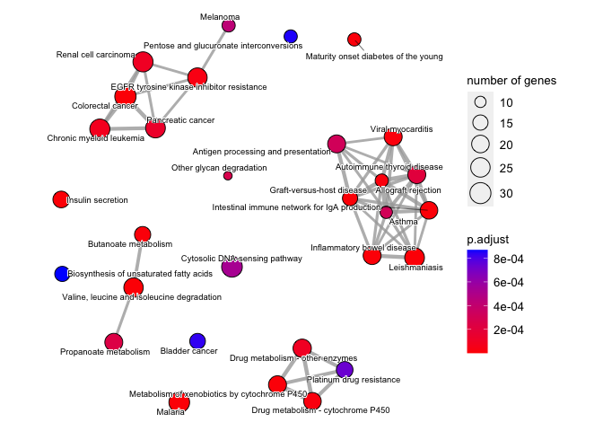
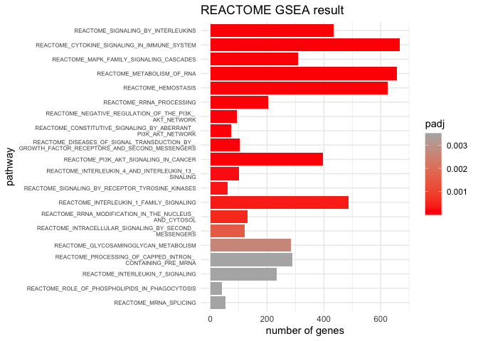
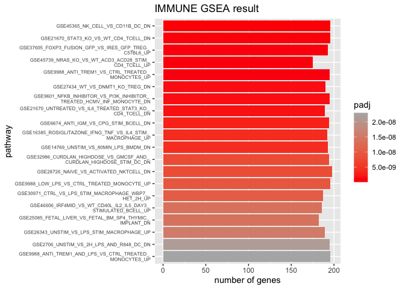

Gene-Set-Enrichment-Analysis
================
Lucy Chi & Janet Zhang
2023-03-22

## Gene Sets for Downstream Gene Set Enrichment Analysis

### Obtain Molecular Signature Database (KEGG, reactome and C7 pathways)

``` r
knitr::kable(msigdbr::msigdbr_species())
```

| species_name                    | species_common_name                                                     |
|:--------------------------------|:------------------------------------------------------------------------|
| Anolis carolinensis             | Carolina anole, green anole                                             |
| Bos taurus                      | bovine, cattle, cow, dairy cow, domestic cattle, domestic cow, ox, oxen |
| Caenorhabditis elegans          | NA                                                                      |
| Canis lupus familiaris          | dog, dogs                                                               |
| Danio rerio                     | leopard danio, zebra danio, zebra fish, zebrafish                       |
| Drosophila melanogaster         | fruit fly                                                               |
| Equus caballus                  | domestic horse, equine, horse                                           |
| Felis catus                     | cat, cats, domestic cat                                                 |
| Gallus gallus                   | bantam, chicken, chickens, Gallus domesticus                            |
| Homo sapiens                    | human                                                                   |
| Macaca mulatta                  | rhesus macaque, rhesus macaques, Rhesus monkey, rhesus monkeys          |
| Monodelphis domestica           | gray short-tailed opossum                                               |
| Mus musculus                    | house mouse, mouse                                                      |
| Ornithorhynchus anatinus        | duck-billed platypus, duckbill platypus, platypus                       |
| Pan troglodytes                 | chimpanzee                                                              |
| Rattus norvegicus               | brown rat, Norway rat, rat, rats                                        |
| Saccharomyces cerevisiae        | baker’s yeast, brewer’s yeast, S. cerevisiae                            |
| Schizosaccharomyces pombe 972h- | NA                                                                      |
| Sus scrofa                      | pig, pigs, swine, wild boar                                             |
| Xenopus tropicalis              | tropical clawed frog, western clawed frog                               |

#### KEGG database

``` r
#Access the KEGG gene sets. 
kegg.human.db <- msigdbr::msigdbr(species = "human",
                                  category = "C2",
                                  subcategory = "CP:KEGG")
```

#### reactome database

``` r
#Access the REACTOME gene sets. 
#A standardized vocabulary of terms that describe gene function, cellular components, and biological processes.
reactome.human.db <- msigdbr(species = "human", 
                            category = "C2", 
                            subcategory = "CP:REACTOME")
```

#### PID database

``` r
#Access the Pathway Interaction Database (PID) gene sets. This one specifically look at signaling pathways, molecular interactions, reaction kinetics, and cellular locations of signaling molecules involved in a pathway. 

pid.human.db <- msigdbr::msigdbr(species = "human",
                                  category = "C2",
                                  subcategory = "CP:PID")
```

#### ImmuneSigDB Database

``` r
#Access the C7 Immunological gene sets. 
#Specifically looking at the ImmuneSigDB subcollection of C7, because this is related to a collection of cell types, states, and perturbations within the immune system collected from human and mouse. (note: The other C7 subcollection is specifically regarding vaccine response to 50 vaccines. We are not interested in vaccine responses in T2D, so not exploring this subcollection.)
IMMUNE.human.db <- msigdbr(species = "human", 
                           category = "C7", 
                           subcategory = "IMMUNESIGDB")
```

### Obtain GWAS Catalog Information

``` r
run.if.needed <- function(.file, .code) {
    if(!file.exists(.file)) { .code }
    stopifnot(file.exists(.file))
}
```

``` r
gwas.tidy.file <- "gwas_catalog_tidy.tsv.gz"

run.if.needed(gwas.tidy.file, {
    gwas.file <- "gwas_catalog_v1.0-associations_e105_r2022-02-02.tsv.gz"
    run.if.needed(gwas.file, {
        url <- "https://www.ebi.ac.uk/gwas/api/search/downloads/full"
        .file <- str_remove(gwas.file, ".gz$")
        download.file(url, destfile = .file)
        gzip(.file)
        unlink(.file)
    })
    .dt <-
        fread(gwas.file, sep="\t", quote="") %>%
        dplyr::select(`MAPPED_GENE`, `DISEASE/TRAIT`, `PVALUE_MLOG`)
    .dt <- .dt[order(.dt$PVALUE_MLOG, decreasing = TRUE),
               head(.SD, 1),
               by = .(`MAPPED_GENE`, `DISEASE/TRAIT`)]
    .count <- .dt[, .(.N), by = .(`DISEASE/TRAIT`)]
    .dt <- left_join(.count[`N` >= 100, ], .dt)[nchar(`MAPPED_GENE`)> 0,]
    .dt <- .dt[,
               .(gene_symbol = unlist(strsplit(`MAPPED_GENE`, split="[ ,.-]+"))),
               by = .(`DISEASE/TRAIT`, PVALUE_MLOG)]
    .dt[, p.value := 10^(-PVALUE_MLOG)]

    fwrite(.dt, file=gwas.tidy.file)
})
```

### Genes associated with T2D disease

``` r
#' Convert a number into a scientifically-formatted string
#' @param x number
num.sci <- function(x) {
    format(x, scientific=TRUE, digits = 2)
}

gwas.db <- fread(gwas.tidy.file)    
gwas.db[, gs_name := `DISEASE/TRAIT`]

t2d_genes<- gwas.db[str_detect(`DISEASE/TRAIT`, "[Dd]iabetes") & !is.na(gene_symbol)] %>%
    mutate(p.value = num.sci(p.value)) %>%
    dplyr::select(`gs_name`, `gene_symbol`, `p.value`, `PVALUE_MLOG`) 
# removed t1d associated genes
t2d_genes <- t2d_genes %>% filter(t2d_genes$gs_name == "Type 2 diabetes")
#removed duplicates
t2d_genes <-
    t2d_genes[order(t2d_genes$p.value, decreasing = TRUE),
                   head(.SD, 1),
                   by = .(gene_symbol)]
## 1693 genes identified

# export result as csv
write.csv(t2d_genes, "tsd.genes.csv", row.names=FALSE)
```

### Load DE Gene List

``` r
# read data frame for the DE genes
DEgenes<-readRDS("degT2d_DEcopy.RDS")
```

### Data formatting for `fgsea` analysis

``` r
# matched Ensembl IDs to probeIDs
DEgenes$affy_hugene_1_0_st_v1 <- row.names(DEgenes) 
head(DEgenes)
```

    ##             logFC  AveExpr        t      P.Value   adj.P.Val        B
    ## 8003667 1.4034296 7.609690 6.316668 6.816466e-08 0.001958371 7.545931
    ## 8095080 1.0921294 7.404872 5.542533 1.090848e-06 0.007738258 5.146712
    ## 8043995 0.8684121 8.800716 5.529337 1.143097e-06 0.007738258 5.106089
    ## 7938608 1.2241985 7.428053 5.511468 1.217814e-06 0.007738258 5.051107
    ## 7952341 1.0060584 7.362819 5.435595 1.592742e-06 0.007738258 4.817966
    ## 8139087 1.8199810 4.825679 5.431479 1.616065e-06 0.007738258 4.805336
    ##         affy_hugene_1_0_st_v1
    ## 8003667               8003667
    ## 8095080               8095080
    ## 8043995               8043995
    ## 7938608               7938608
    ## 7952341               7952341
    ## 8139087               8139087

``` r
# convert transcript cluster IDs (also desribed as probeIDs) into other gene ids
ensembl_human = useMart("ensembl",dataset="hsapiens_gene_ensembl")
ensemble_genes <- getBM(attributes=c("ensembl_gene_id", "affy_hugene_1_0_st_v1", "hgnc_symbol", "entrezgene_id"),
      filters = "affy_hugene_1_0_st_v1",
      values = rownames(DEgenes),
      useCache=FALSE,
      mart=ensembl_human)
```

``` r
# data clean up and rename
ensemble_genes_clean <-
    ensemble_genes %>%  
    dplyr::rename(gene_symbol = hgnc_symbol) %>% 
    as.data.table()

ensemble_genes_clean$affy_hugene_1_0_st_v1 <- as.character(ensemble_genes_clean$affy_hugene_1_0_st_v1)

# add on the p-values & other information in DEgenes
ensembl_geneIDs <- ensemble_genes_clean %>% left_join(DEgenes, by = "affy_hugene_1_0_st_v1") 

# Show NA's & other stats
summary(ensemble_genes$entrezgene_id)
```

    ##      Min.   1st Qu.    Median      Mean   3rd Qu.      Max.      NA's 
    ##         1     11166    146318  37405545 124900242 125467750     14185

``` r
#filter the list with logFC values for KEGG analysis later on
logFC_genes <- ensembl_geneIDs$logFC
# name the vector
names(logFC_genes) <- ensembl_geneIDs$ensembl_gene_id
# omit any NA values 
gene_list<-na.omit(logFC_genes)
# sort the list in decreasing order (required for clusterProfiler)
gene_list = sort(gene_list, decreasing = TRUE)
```

``` r
# Create a new dataframe sorted_genes which has only the filtered genes using log(adj.P)
ensembl_geneIDs <- ensembl_geneIDs %>% mutate(log_adjP = -log10(adj.P.Val))

sorted_genes <-
    ensembl_geneIDs[order(ensembl_geneIDs$log_adjP, decreasing = TRUE),
                   head(.SD, 1),
                   by = .(gene_symbol)]

only_ensembl <- as.data.frame(sorted_genes$entrezgene_id)
write.csv(only_ensembl, "only_ensembl.csv", row.names=FALSE)

# Create a vector of the gene
deg.ranks <- sorted_genes$log_adjP
# Name vector with ENTREZ ids
names(deg.ranks) <- sorted_genes$gene_symbol
# omit any NA values 
deg.ranks<-na.omit(deg.ranks)
# sort the list in decreasing order (required for clusterProfiler)
deg.ranks = sort(deg.ranks, decreasing = TRUE)
```

## Rank-based Gene Set Enrichment Analysis

### `fgsea` analysis set-up

``` r
# Make a function that can help us to prepare the gene list to feed into the fgsea arguments. 
make.gs.lol <- function(data) {
    data <- as.data.table(data) %>% unique()
    data_list <-
        data[, .(gene = .(gene_symbol)), by = .(gs_name)] %>%
        as.list()
    names <- data_list$gs_name
    return_value <- data_list$gene
    names(return_value) <- names
    return(return_value)
}
```

### KEGG `fgsea` Analysis

``` r
# set seed.
set.seed(10)
#Convert the KEGG pathway tibble
kegg.lol <- kegg.human.db %>% dplyr::select(gene_symbol, gs_name) %>% make.gs.lol()
kegg.fgsea <- fgsea::fgsea(pathways = kegg.lol, stats = deg.ranks, scoreType = "pos")
```

    ## Warning in preparePathwaysAndStats(pathways, stats, minSize, maxSize, gseaParam, : There are ties in the preranked stats (84.06% of the list).
    ## The order of those tied genes will be arbitrary, which may produce unexpected results.

``` r
kegg.fgsea[,
           topGenes := paste0(head(unlist(`leadingEdge`), 5), collapse=", "),
           by = .(pathway)]

kegg.fgsea %>%
    arrange(pval) %>%
    head(10) %>% 
    dplyr::select(-leadingEdge)
```

    ##                                         pathway         pval         padj
    ##  1: KEGG_CYTOKINE_CYTOKINE_RECEPTOR_INTERACTION 9.407489e-11 1.749793e-08
    ##  2:                     KEGG_PATHWAYS_IN_CANCER 1.804212e-08 1.677917e-06
    ##  3:             KEGG_JAK_STAT_SIGNALING_PATHWAY 2.843616e-08 1.763042e-06
    ##  4:                 KEGG_MAPK_SIGNALING_PATHWAY 3.009503e-06 1.399419e-04
    ##  5:             KEGG_HEMATOPOIETIC_CELL_LINEAGE 8.961631e-06 3.333727e-04
    ##  6:                    KEGG_ALLOGRAFT_REJECTION 1.940800e-05 6.016481e-04
    ##  7:                 KEGG_PPAR_SIGNALING_PATHWAY 7.501648e-05 1.993295e-03
    ##  8:                      KEGG_VIRAL_MYOCARDITIS 8.968111e-05 2.063227e-03
    ##  9:             KEGG_TGF_BETA_SIGNALING_PATHWAY 9.983356e-05 2.063227e-03
    ## 10:                               KEGG_MELANOMA 1.666445e-04 3.047829e-03
    ##       log2err        ES      NES size                                topGenes
    ##  1: 0.8390889 0.6967663 1.350655  255         PDGFRA, IL1R1, IL18R1, IL6, HGF
    ##  2: 0.7337620 0.6591685 1.279391  300            PDGFRA, FGF7, FGF2, IL6, HGF
    ##  3: 0.7337620 0.7153785 1.376867  151      SPRY1, SOCS2, IL6, IL13RA2, SPRED1
    ##  4: 0.6272567 0.6548142 1.269122  252        PDGFRA, IL1R1, FGF7, FGF2, DUSP5
    ##  5: 0.5933255 0.7307650 1.392365   84     IL1R1, IL6, KIT, HLA-DRB3, HLA-DRB1
    ##  6: 0.5756103 0.8305163 1.533336   31 CD86, FAS, HLA-DRB3, HLA-DRB1, HLA-DQA2
    ##  7: 0.5384341 0.7483599 1.411618   64           ACSL4, LPL, ACSL5, ME1, PPARD
    ##  8: 0.5384341 0.7497239 1.407213   58    CD86, HLA-DRB3, HLA-DRB1, ABL1, CD55
    ##  9: 0.5384341 0.7069601 1.347009   84          DCN, BMPR1B, THBS2, MYC, LTBP1
    ## 10: 0.5188481 0.7193180 1.359351   66         PDGFRA, FGF7, FGF2, HGF, CDKN1A

``` r
# filter significant pathways. Set p<0.05. 
kegg_significant_pathways <- kegg.fgsea[padj < 0.05]
kegg_significant_pathways
```

    ##                                               pathway         pval         padj
    ##  1:                             KEGG_ABC_TRANSPORTERS 1.224148e-03 1.264953e-02
    ##  2:                       KEGG_ACUTE_MYELOID_LEUKEMIA 3.089347e-03 2.179191e-02
    ##  3:                            KEGG_ADHERENS_JUNCTION 5.837401e-03 3.619189e-02
    ##  4:                          KEGG_ALLOGRAFT_REJECTION 1.940800e-05 6.016481e-04
    ##  5:          KEGG_ANTIGEN_PROCESSING_AND_PRESENTATION 1.334596e-03 1.275413e-02
    ##  6:                                    KEGG_APOPTOSIS 2.275399e-03 1.840105e-02
    ##  7:                                       KEGG_ASTHMA 7.547702e-03 4.374318e-02
    ##  8:                   KEGG_AUTOIMMUNE_THYROID_DISEASE 1.665939e-03 1.475546e-02
    ##  9:                            KEGG_COLORECTAL_CANCER 7.996066e-03 4.374318e-02
    ## 10:          KEGG_COMPLEMENT_AND_COAGULATION_CASCADES 7.922413e-04 9.209805e-03
    ## 11:       KEGG_CYTOKINE_CYTOKINE_RECEPTOR_INTERACTION 9.407489e-11 1.749793e-08
    ## 12:                     KEGG_ECM_RECEPTOR_INTERACTION 4.275828e-03 2.840372e-02
    ## 13:                           KEGG_ENDOMETRIAL_CANCER 6.209205e-03 3.725523e-02
    ## 14:                    KEGG_GRAFT_VERSUS_HOST_DISEASE 7.189713e-04 8.915244e-03
    ## 15:                   KEGG_HEMATOPOIETIC_CELL_LINEAGE 8.961631e-06 3.333727e-04
    ## 16: KEGG_INTESTINAL_IMMUNE_NETWORK_FOR_IGA_PRODUCTION 9.480305e-04 1.037257e-02
    ## 17:                   KEGG_JAK_STAT_SIGNALING_PATHWAY 2.843616e-08 1.763042e-06
    ## 18:                       KEGG_MAPK_SIGNALING_PATHWAY 3.009503e-06 1.399419e-04
    ## 19:         KEGG_MATURITY_ONSET_DIABETES_OF_THE_YOUNG 2.275399e-03 1.840105e-02
    ## 20:                                     KEGG_MELANOMA 1.666445e-04 3.047829e-03
    ## 21:    KEGG_NATURAL_KILLER_CELL_MEDIATED_CYTOTOXICITY 7.846611e-03 4.374318e-02
    ## 22:                           KEGG_PATHWAYS_IN_CANCER 1.804212e-08 1.677917e-06
    ## 23:                       KEGG_PPAR_SIGNALING_PATHWAY 7.501648e-05 1.993295e-03
    ## 24:                              KEGG_PROSTATE_CANCER 1.802479e-04 3.047829e-03
    ## 25:                            KEGG_PURINE_METABOLISM 2.423389e-03 1.878126e-02
    ## 26:                        KEGG_PYRIMIDINE_METABOLISM 5.168154e-03 3.314747e-02
    ## 27:             KEGG_REGULATION_OF_ACTIN_CYTOSKELETON 3.163342e-03 2.179191e-02
    ## 28:                       KEGG_SMALL_CELL_LUNG_CANCER 1.371412e-03 1.275413e-02
    ## 29:                                  KEGG_SPLICEOSOME 5.449555e-04 7.797055e-03
    ## 30:                 KEGG_SYSTEMIC_LUPUS_ERYTHEMATOSUS 6.548601e-04 8.700284e-03
    ## 31:                   KEGG_TGF_BETA_SIGNALING_PATHWAY 9.983356e-05 2.063227e-03
    ## 32:                    KEGG_TYPE_II_DIABETES_MELLITUS 3.622760e-04 5.615279e-03
    ## 33:                     KEGG_TYPE_I_DIABETES_MELLITUS 2.978354e-03 2.179191e-02
    ## 34:                            KEGG_VIRAL_MYOCARDITIS 8.968111e-05 2.063227e-03
    ##                                               pathway         pval         padj
    ##       log2err        ES      NES size
    ##  1: 0.4550599 0.7505785 1.395799   39
    ##  2: 0.4317077 0.6991183 1.309008   52
    ##  3: 0.4070179 0.6807228 1.285649   65
    ##  4: 0.5756103 0.8305163 1.533336   31
    ##  5: 0.4550599 0.6824599 1.296661   76
    ##  6: 0.4317077 0.6663575 1.268547   80
    ##  7: 0.4070179 0.7513441 1.379633   26
    ##  8: 0.4550599 0.7218970 1.347642   46
    ##  9: 0.3807304 0.6837331 1.283305   55
    ## 10: 0.4772708 0.6988542 1.321510   67
    ## 11: 0.8390889 0.6967663 1.350655  255
    ## 12: 0.4070179 0.6595044 1.254538   78
    ## 13: 0.4070179 0.6970367 1.298790   47
    ## 14: 0.4772708 0.7809783 1.447523   34
    ## 15: 0.5933255 0.7307650 1.392365   84
    ## 16: 0.4772708 0.7489867 1.395549   42
    ## 17: 0.7337620 0.7153785 1.376867  151
    ## 18: 0.6272567 0.6548142 1.269122  252
    ## 19: 0.4317077 0.7939079 1.443017   23
    ## 20: 0.5188481 0.7193180 1.359351   66
    ## 21: 0.3807304 0.6206217 1.188968  131
    ## 22: 0.7337620 0.6591685 1.279391  300
    ## 23: 0.5384341 0.7483599 1.411618   64
    ## 24: 0.5188481 0.6988932 1.330127   79
    ## 25: 0.4317077 0.6265446 1.206178  152
    ## 26: 0.4070179 0.6477453 1.236896   94
    ## 27: 0.4317077 0.6118705 1.180229  202
    ## 28: 0.4550599 0.6809859 1.295401   78
    ## 29: 0.4772708 0.6533644 1.249572  125
    ## 30: 0.4772708 0.6557024 1.255220  128
    ## 31: 0.5384341 0.7069601 1.347009   84
    ## 32: 0.4984931 0.7634488 1.422495   42
    ## 33: 0.4317077 0.7483863 1.387202   35
    ## 34: 0.5384341 0.7497239 1.407213   58
    ##       log2err        ES      NES size
    ##                                           leadingEdge
    ##  1:           ABCA6,ABCA8,ABCA9,ABCC8,ABCC6,ABCA7,...
    ##  2:                KIT,MYC,STAT5A,RELA,PPARD,TCF7,...
    ##  3:          NLK,CSNK2A1,TGFBR2,YES1,NECTIN3,TCF7,...
    ##  4:     CD86,FAS,HLA-DRB3,HLA-DRB1,HLA-DQA2,HLA-E,...
    ##  5:    HLA-DRB3,HLA-DRB1,CTSL,PSME3,LGMN,HLA-DQA2,...
    ##  6:     IL1R1,IRAK2,IRAK3,TNFRSF10D,FAS,TNFRSF10A,...
    ##  7: HLA-DRB3,HLA-DRB1,HLA-DQA2,CD40,HLA-DQA1,IL10,...
    ##  8:     CD86,FAS,HLA-DRB3,HLA-DRB1,HLA-DQA2,HLA-E,...
    ##  9:              MYC,TGFBR2,TCF7,PIK3R1,RAF1,RAC1,...
    ## 10:                 A2M,C1S,TFPI,C1R,BDKRB1,PLAUR,...
    ## 11:               PDGFRA,IL1R1,IL18R1,IL6,HGF,KIT,...
    ## 12:           THBS2,THBS4,LAMC2,LAMA3,LAMB3,ITGA2,...
    ## 13:             MYC,TCF7,PIK3R1,RAF1,CCND1,CTNNA2,...
    ## 14:       IL6,CD86,FAS,HLA-DRB3,HLA-DRB1,HLA-DQA2,...
    ## 15:         IL1R1,IL6,KIT,HLA-DRB3,HLA-DRB1,IL1R2,...
    ## 16:      IL6,CD86,HLA-DRB3,HLA-DRB1,IL15RA,ICOSLG,...
    ## 17:            SPRY1,SOCS2,IL6,IL13RA2,SPRED1,MYC,...
    ## 18:          PDGFRA,IL1R1,FGF7,FGF2,DUSP5,RASGRP1,...
    ## 19:               IAPP,SLC2A2,PDX1,MAFA,NKX6-1,NKX2-2
    ## 20:            PDGFRA,FGF7,FGF2,HGF,CDKN1A,PIK3R1,...
    ## 21:      TNFRSF10D,FAS,TNFRSF10A,PIK3R1,RAF1,RAC1,...
    ## 22:                  PDGFRA,FGF7,FGF2,IL6,HGF,KIT,...
    ## 23:                ACSL4,LPL,ACSL5,ME1,PPARD,PCK1,...
    ## 24:           PDGFRA,TGFA,RELA,TCF7,CDKN1A,PIK3R1,...
    ## 25:                PDE1A,PDE7B,PDE3A,DCK,NT5E,PNP,...
    ## 26:                 UCK2,DCK,NT5E,PNP,CTPS1,CTPS2,...
    ## 27:           PDGFRA,FGF7,FGF2,BDKRB1,MRAS,PIK3R1,...
    ## 28:             PTGS2,MYC,RELA,LAMC2,PIK3R1,LAMA3,...
    ## 29:         RBM25,TCERG1,EFTUD2,DHX15,DDX42,RBM17,...
    ## 30:            C1S,CD86,C1R,HLA-DRB3,HLA-DRB1,SSB,...
    ## 31:              DCN,BMPR1B,THBS2,MYC,LTBP1,INHBA,...
    ## 32:            SOCS2,SLC2A2,PDX1,SOCS3,MAFA,ABCC8,...
    ## 33:     CD86,FAS,HLA-DRB3,HLA-DRB1,HLA-DQA2,HLA-E,...
    ## 34:         CD86,HLA-DRB3,HLA-DRB1,ABL1,CD55,RAC1,...
    ##                                           leadingEdge
    ##                                         topGenes
    ##  1:            ABCA6, ABCA8, ABCA9, ABCC8, ABCC6
    ##  2:                KIT, MYC, STAT5A, RELA, PPARD
    ##  3:          NLK, CSNK2A1, TGFBR2, YES1, NECTIN3
    ##  4:      CD86, FAS, HLA-DRB3, HLA-DRB1, HLA-DQA2
    ##  5:        HLA-DRB3, HLA-DRB1, CTSL, PSME3, LGMN
    ##  6:          IL1R1, IRAK2, IRAK3, TNFRSF10D, FAS
    ##  7: HLA-DRB3, HLA-DRB1, HLA-DQA2, CD40, HLA-DQA1
    ##  8:      CD86, FAS, HLA-DRB3, HLA-DRB1, HLA-DQA2
    ##  9:              MYC, TGFBR2, TCF7, PIK3R1, RAF1
    ## 10:                  A2M, C1S, TFPI, C1R, BDKRB1
    ## 11:              PDGFRA, IL1R1, IL18R1, IL6, HGF
    ## 12:            THBS2, THBS4, LAMC2, LAMA3, LAMB3
    ## 13:               MYC, TCF7, PIK3R1, RAF1, CCND1
    ## 14:           IL6, CD86, FAS, HLA-DRB3, HLA-DRB1
    ## 15:          IL1R1, IL6, KIT, HLA-DRB3, HLA-DRB1
    ## 16:        IL6, CD86, HLA-DRB3, HLA-DRB1, IL15RA
    ## 17:           SPRY1, SOCS2, IL6, IL13RA2, SPRED1
    ## 18:             PDGFRA, IL1R1, FGF7, FGF2, DUSP5
    ## 19:             IAPP, SLC2A2, PDX1, MAFA, NKX6-1
    ## 20:              PDGFRA, FGF7, FGF2, HGF, CDKN1A
    ## 21:      TNFRSF10D, FAS, TNFRSF10A, PIK3R1, RAF1
    ## 22:                 PDGFRA, FGF7, FGF2, IL6, HGF
    ## 23:                ACSL4, LPL, ACSL5, ME1, PPARD
    ## 24:             PDGFRA, TGFA, RELA, TCF7, CDKN1A
    ## 25:               PDE1A, PDE7B, PDE3A, DCK, NT5E
    ## 26:                  UCK2, DCK, NT5E, PNP, CTPS1
    ## 27:             PDGFRA, FGF7, FGF2, BDKRB1, MRAS
    ## 28:              PTGS2, MYC, RELA, LAMC2, PIK3R1
    ## 29:          RBM25, TCERG1, EFTUD2, DHX15, DDX42
    ## 30:           C1S, CD86, C1R, HLA-DRB3, HLA-DRB1
    ## 31:               DCN, BMPR1B, THBS2, MYC, LTBP1
    ## 32:             SOCS2, SLC2A2, PDX1, SOCS3, MAFA
    ## 33:      CD86, FAS, HLA-DRB3, HLA-DRB1, HLA-DQA2
    ## 34:         CD86, HLA-DRB3, HLA-DRB1, ABL1, CD55
    ##                                         topGenes

``` r
# export result as csv
fwrite(kegg_significant_pathways, file = "kegg_significant_pathways.csv")
```

There are 34 significant pathways.

### KEGG Pathway Visualization

``` r
# arrange kegg_significant_pathways based on the p.adjust value. 
kegg_ordered <- kegg_significant_pathways %>%
  arrange(padj) 
```

``` r
# Plot the barplot. 
# Plot the 'size' column from the table onto x-axis, the the top 20 pathways on the y-axis
# Using the size because size represents the size of each pathway after removing genes not present in 'names(stats)'
kegg_plot<- ggplot(kegg_ordered, aes(x = size, y = reorder(pathway, -pval), fill = padj)) +
  # note ordered by p.val over here b/c some of the pathways have the exact same padj values.
  geom_bar(stat = "identity") +
  xlab("number of genes") +
  ylab("pathway") +  
  scale_fill_gradient(low = "red", high = "grey70") +
  ggtitle("KEGG GSEA result") +
  theme_minimal() +
  theme(axis.text.y = element_text(size = 4)) 
kegg_plot
```

<!-- -->

``` r
geneids <-bitr(names(logFC_genes), fromType = "ENSEMBL", toType = "ENTREZID", OrgDb="org.Hs.eg.db")
```

    ## 'select()' returned 1:many mapping between keys and columns

    ## Warning in bitr(names(logFC_genes), fromType = "ENSEMBL", toType = "ENTREZID",
    ## : 14.53% of input gene IDs are fail to map...

``` r
#delete duplicate IDs
dedup_ids = geneids[!duplicated(geneids[c("ENSEMBL")]),]
# Create a new dataframe df2 which has only the genes which were successfully mapped using the bitr function above
geneIDs <-
    ensembl_geneIDs[order(ensembl_geneIDs$logFC, decreasing = TRUE),
                   head(.SD, 1),
                   by = .(entrezgene_id)]

# gene_names = ensembl_geneIDs[ensembl_geneIDs$ensembl_gene_id %in% dedup_ids$ENSEMBL,]
# Create a vector of the gene unuiverse
kegg_gene_list <- geneIDs$logFC
# Name vector with ENTREZ ids
names(kegg_gene_list) <- geneIDs$entrezgene_id
# omit any NA values 
kegg_gene_list<-na.omit(kegg_gene_list)
# sort the list in decreasing order (required for clusterProfiler)
kegg_gene_list = sort(kegg_gene_list, decreasing = TRUE)

#plotting
kk2 <- gseKEGG(geneList     = kegg_gene_list,
               organism     = "hsa",
               minGSSize    = 3,
               maxGSSize    = 80,
               pvalueCutoff = 0.05,
               pAdjustMethod = "none",
               keyType       = "ncbi-geneid")
```

    ## Reading KEGG annotation online: "https://rest.kegg.jp/link/hsa/pathway"...

    ## Reading KEGG annotation online: "https://rest.kegg.jp/list/pathway/hsa"...

    ## Reading KEGG annotation online: "https://rest.kegg.jp/conv/ncbi-geneid/hsa"...

    ## preparing geneSet collections...

    ## GSEA analysis...

    ## Warning in preparePathwaysAndStats(pathways, stats, minSize, maxSize, gseaParam, : There are ties in the preranked stats (6.46% of the list).
    ## The order of those tied genes will be arbitrary, which may produce unexpected results.

    ## Warning in fgseaMultilevel(pathways = pathways, stats = stats, minSize =
    ## minSize, : For some pathways, in reality P-values are less than 1e-10. You can
    ## set the `eps` argument to zero for better estimation.

    ## leading edge analysis...

    ## done...

``` r
#enrichment map
emapplot(pairwise_termsim(kk2), cex.params = list(category_label = 0.5))
```

<!-- -->

``` r
# Ridgeplot
ridgeplot(kk2) + labs(x = "enrichment distribution") + theme_ridges(font_size = 5)
```

    ## Picking joint bandwidth of 0.0866

<!-- -->

``` r
## isoleucine degradation is down-regulated - a branched amino acid

# https://learn.gencore.bio.nyu.edu/rna-seq-analysis/gene-set-enrichment-analysis/
```

### PID `fgsea` Analysis

``` r
# set seed.
set.seed(10)

#Convert the PID pathway tibble
pid.lol <- pid.human.db %>% dplyr::select(gene_symbol, gs_name) %>% make.gs.lol()

#Run fgsea analysis. 
pid.fgsea <- fgsea::fgsea(pathways = pid.lol, stats = deg.ranks, scoreType = "pos")
```

    ## Warning in preparePathwaysAndStats(pathways, stats, minSize, maxSize, gseaParam, : There are ties in the preranked stats (84.06% of the list).
    ## The order of those tied genes will be arbitrary, which may produce unexpected results.

``` r
#Show top 5 genes for each pathway:
# Here, we are "pasting" the first five genes in the leadingEdge column
pid.fgsea[,
           topGenes := paste0(head(unlist(`leadingEdge`), 5), collapse=", "),
           by = .(pathway)]
#Show result in table.
pid.fgsea %>%
    arrange(pval) %>%
    head(10) %>% 
    dplyr::select(-leadingEdge)
```

    ##                        pathway         pval        padj   log2err        ES
    ##  1:            PID_FRA_PATHWAY 2.303822e-05 0.004515491 0.5756103 0.8023801
    ##  2: PID_P53_DOWNSTREAM_PATHWAY 4.967149e-05 0.004867806 0.5573322 0.6861764
    ##  3:           PID_IL23_PATHWAY 2.346841e-04 0.014558480 0.5188481 0.7871140
    ##  4:           PID_CMYB_PATHWAY 3.713898e-04 0.014558480 0.4984931 0.6890352
    ##  5:           PID_IL4_2PATHWAY 3.713898e-04 0.014558480 0.4984931 0.7166957
    ##  6:   PID_ERBB_NETWORK_PATHWAY 7.281300e-04 0.018449999 0.4772708 0.8643236
    ##  7:          PID_IL6_7_PATHWAY 7.830825e-04 0.018449999 0.4772708 0.7404055
    ##  8:            PID_AP1_PATHWAY 8.105588e-04 0.018449999 0.4772708 0.7059267
    ##  9:           PID_ATF2_PATHWAY 8.471939e-04 0.018449999 0.4772708 0.7289722
    ## 10:      PID_IL2_STAT5_PATHWAY 1.058477e-03 0.020746157 0.4550599 0.7836311
    ##          NES size                            topGenes
    ##  1: 1.479735   37          IL6, DCN, PLAUR, LIF, GJA1
    ##  2: 1.312257  124    DUSP5, HGF, LIF, TNFRSF10D, TGFA
    ##  3: 1.447691   36   IL18R1, IL6, SOCS3, CXCL9, STAT5A
    ##  4: 1.304674   82         KIT, PTGS2, MYC, NLK, CEBPB
    ##  5: 1.344697   59 IL13RA2, SOCS3, CEBPB, STAT5A, BCL6
    ##  6: 1.533845   14        EREG, HBEGF, TGFA, AREG, BTC
    ##  7: 1.377068   45         A2M, IL6, MYC, SOCS3, CEBPB
    ##  8: 1.326665   64           IL6, MYC, GJA1, ESR1, SP1
    ##  9: 1.361092   52     PDGFRA, DUSP5, IL6, SOCS3, ESR1
    ## 10: 1.427296   27    MYC, STAT5A, PIK3R1, JAK1, IL2RG

``` r
# filter significant pathways. Set p<0.05. 
pid_significant_pathways <- pid.fgsea[padj < 0.05]
pid_significant_pathways
```

    ##                               pathway         pval        padj   log2err
    ##  1:    PID_A6B1_A6B4_INTEGRIN_PATHWAY 2.127409e-03 0.027798139 0.4317077
    ##  2: PID_ANGIOPOIETIN_RECEPTOR_PATHWAY 3.311333e-03 0.036056740 0.4317077
    ##  3:                   PID_AP1_PATHWAY 8.105588e-04 0.018449999 0.4772708
    ##  4:                  PID_ATF2_PATHWAY 8.471939e-04 0.018449999 0.4772708
    ##  5:                   PID_BMP_PATHWAY 5.168154e-03 0.045942710 0.4070179
    ##  6:                  PID_CMYB_PATHWAY 3.713898e-04 0.014558480 0.4984931
    ##  7:          PID_ERBB_NETWORK_PATHWAY 7.281300e-04 0.018449999 0.4772708
    ##  8:                   PID_FGF_PATHWAY 6.357927e-03 0.049846145 0.4070179
    ##  9:                   PID_FRA_PATHWAY 2.303822e-05 0.004515491 0.5756103
    ## 10:             PID_GLYPICAN_1PATHWAY 1.757979e-03 0.027798139 0.4550599
    ## 11:                 PID_HNF3B_PATHWAY 1.592307e-03 0.027798139 0.4550599
    ## 12:                 PID_IL12_2PATHWAY 4.201468e-03 0.039213699 0.4070179
    ## 13:                   PID_IL1_PATHWAY 1.942421e-03 0.027798139 0.4550599
    ## 14:                  PID_IL23_PATHWAY 2.346841e-04 0.014558480 0.5188481
    ## 15:                  PID_IL27_PATHWAY 2.090411e-03 0.027798139 0.4317077
    ## 16:                  PID_IL2_1PATHWAY 3.052349e-03 0.035191790 0.4317077
    ## 17:              PID_IL2_PI3K_PATHWAY 4.201468e-03 0.039213699 0.4070179
    ## 18:             PID_IL2_STAT5_PATHWAY 1.058477e-03 0.020746157 0.4550599
    ## 19:                  PID_IL4_2PATHWAY 3.713898e-04 0.014558480 0.4984931
    ## 20:                 PID_IL6_7_PATHWAY 7.830825e-04 0.018449999 0.4772708
    ## 21:             PID_INTEGRIN4_PATHWAY 5.391236e-03 0.045942710 0.4070179
    ## 22:             PID_MYC_ACTIV_PATHWAY 6.060483e-03 0.049493947 0.4070179
    ## 23:        PID_P53_DOWNSTREAM_PATHWAY 4.967149e-05 0.004867806 0.5573322
    ## 24:                  PID_SHP2_PATHWAY 2.941356e-03 0.035191790 0.4317077
    ## 25:              PID_UPA_UPAR_PATHWAY 3.904027e-03 0.039213699 0.4317077
    ##                               pathway         pval        padj   log2err
    ##            ES      NES size                                leadingEdge
    ##  1: 0.7282328 1.352307   42    LAMC2,PIK3R1,PMP22,LAMA3,LAMB3,RAC1,...
    ##  2: 0.7122873 1.324329   44     FGF2,BMX,STAT5A,RELA,CDKN1A,PIK3R1,...
    ##  3: 0.7059267 1.326665   64            IL6,MYC,GJA1,ESR1,SP1,DUSP1,...
    ##  4: 0.7289722 1.361092   52      PDGFRA,DUSP5,IL6,SOCS3,ESR1,DUSP1,...
    ##  5: 0.7124494 1.322998   42 BMPR1B,CHRDL1,SMURF1,BMP6,PPP1R15A,FST,...
    ##  6: 0.6890352 1.304674   82         KIT,PTGS2,MYC,NLK,CEBPB,CDKN1A,...
    ##  7: 0.8643236 1.533845   14                   EREG,HBEGF,TGFA,AREG,BTC
    ##  8: 0.6957207 1.294558   49       FGF2,HGF,PLAUR,PIK3R1,SPRY2,SSH1,...
    ##  9: 0.8023801 1.479735   37           IL6,DCN,PLAUR,LIF,GJA1,LAMA3,...
    ## 10: 0.7926685 1.430790   23       SLIT2,FGF2,TGFBR2,YES1,TGFB3,BLK,...
    ## 11: 0.7333204 1.361754   42      SLC2A2,PDX1,HADH,CEBPB,ABCC8,PCK1,...
    ## 12: 0.6779575 1.272014   59 IL1R1,IL18R1,STAT5A,RELA,IL2RG,GADD45B,...
    ## 13: 0.7763889 1.420846   29   IL1R1,IRAK3,IL1R2,RELA,PIK3R1,MAP3K3,...
    ## 14: 0.7871140 1.447691   36     IL18R1,IL6,SOCS3,CXCL9,STAT5A,IL24,...
    ## 15: 0.7903317 1.433748   25                      IL6,STAT5A,JAK1,IL6ST
    ## 16: 0.7073902 1.318375   51     SOCS2,MYC,SOCS3,STAT5A,PIK3R1,JAK1,...
    ## 17: 0.7572021 1.388838   31        MYC,RELA,PIK3R1,JAK1,IL2RG,RAC1,...
    ## 18: 0.7836311 1.427296   27       MYC,STAT5A,PIK3R1,JAK1,IL2RG,SP1,...
    ## 19: 0.7166957 1.344697   59 IL13RA2,SOCS3,CEBPB,STAT5A,BCL6,PIK3R1,...
    ## 20: 0.7404055 1.377068   45         A2M,IL6,MYC,SOCS3,CEBPB,PIK3R1,...
    ## 21: 0.8423894 1.479958   11        LAMC2,LAMA3,LAMB3,LAMA2,ITGA6,LAMA1
    ## 22: 0.6705514 1.266854   74     MYC,EIF4A1,DDX18,HMGA1,NPM1,EIF2S1,...
    ## 23: 0.6861764 1.312257  124       DUSP5,HGF,LIF,TNFRSF10D,TGFA,FAS,...
    ## 24: 0.7066609 1.319433   52        IL6,PIK3R1,JAK1,IL2RG,PAG1,RAF1,...
    ## 25: 0.7233623 1.335947   38          HGF,PLAUR,NCL,VLDLR,RAC1,MMP3,...
    ##            ES      NES size                                leadingEdge
    ##                                   topGenes
    ##  1:     LAMC2, PIK3R1, PMP22, LAMA3, LAMB3
    ##  2:        FGF2, BMX, STAT5A, RELA, CDKN1A
    ##  3:              IL6, MYC, GJA1, ESR1, SP1
    ##  4:        PDGFRA, DUSP5, IL6, SOCS3, ESR1
    ##  5: BMPR1B, CHRDL1, SMURF1, BMP6, PPP1R15A
    ##  6:            KIT, PTGS2, MYC, NLK, CEBPB
    ##  7:           EREG, HBEGF, TGFA, AREG, BTC
    ##  8:        FGF2, HGF, PLAUR, PIK3R1, SPRY2
    ##  9:             IL6, DCN, PLAUR, LIF, GJA1
    ## 10:       SLIT2, FGF2, TGFBR2, YES1, TGFB3
    ## 11:       SLC2A2, PDX1, HADH, CEBPB, ABCC8
    ## 12:     IL1R1, IL18R1, STAT5A, RELA, IL2RG
    ## 13:      IL1R1, IRAK3, IL1R2, RELA, PIK3R1
    ## 14:      IL18R1, IL6, SOCS3, CXCL9, STAT5A
    ## 15:               IL6, STAT5A, JAK1, IL6ST
    ## 16:      SOCS2, MYC, SOCS3, STAT5A, PIK3R1
    ## 17:         MYC, RELA, PIK3R1, JAK1, IL2RG
    ## 18:       MYC, STAT5A, PIK3R1, JAK1, IL2RG
    ## 19:    IL13RA2, SOCS3, CEBPB, STAT5A, BCL6
    ## 20:            A2M, IL6, MYC, SOCS3, CEBPB
    ## 21:      LAMC2, LAMA3, LAMB3, LAMA2, ITGA6
    ## 22:        MYC, EIF4A1, DDX18, HMGA1, NPM1
    ## 23:       DUSP5, HGF, LIF, TNFRSF10D, TGFA
    ## 24:         IL6, PIK3R1, JAK1, IL2RG, PAG1
    ## 25:           HGF, PLAUR, NCL, VLDLR, RAC1
    ##                                   topGenes

``` r
# export result as csv
fwrite(pid_significant_pathways, "pid_significant_pathways.csv")
```

There are a total of 25 significant pathways in the PID gene sets.

### PID Visualization

``` r
# arrange pid_significant_pathways based on the p.adjust value. 
pid_ordered <- pid_significant_pathways %>%
  arrange(padj) 

# Plot the barplot. 
# Plot the 'size' column from the table onto x-axis, the the top 20 pathways on the y-axis
# Using the size because size represents the size of each pathway after removing genes not present in 'names(stats)'
pid_plot<- ggplot(pid_ordered, aes(x = size, y = reorder(pathway, -pval), fill = padj)) +
  # note ordered by p.val over here b/c some of the pathways have the exact same padj values.
  geom_bar(stat = "identity") +
  xlab("number of genes") +
  ylab("pathway") +  
  scale_fill_gradient(low = "red", high = "grey70") +
  ggtitle("PID GSEA result") +
  theme_minimal() +
  theme(axis.text.y = element_text(size = 6)) 
pid_plot
```

<!-- -->

### Reactome `fgsea` Analysis

``` r
# set seed.
set.seed(10)
#Convert the REACTOME pathway tibble with the make.gs.lol function made previously. 
REACTOME.lol <- reactome.human.db %>% 
  dplyr :: select(gene_symbol, gs_name) %>% 
  make.gs.lol()
# GSEA with fgsea()
reactome.fgsea <- fgsea::fgsea(pathways = REACTOME.lol, stats = deg.ranks, scoreType = "pos")
```

    ## Warning in preparePathwaysAndStats(pathways, stats, minSize, maxSize, gseaParam, : There are ties in the preranked stats (84.06% of the list).
    ## The order of those tied genes will be arbitrary, which may produce unexpected results.

``` r
#Show top 5 genes for each pathway:
# Here, we are "pasting" the first five genes in the leadingEdge column
reactome.fgsea[,
           topGenes := paste0(head(unlist(`leadingEdge`), 5), collapse=", "),
           by = .(pathway)]
```

``` r
#Show result in table. 
reactome.fgsea %>%
    arrange(pval) %>%
    head(10) %>% 
    dplyr::select(-leadingEdge)
```

    ##                                                                                       pathway
    ##  1:                                                        REACTOME_SIGNALING_BY_INTERLEUKINS
    ##  2:                                              REACTOME_CYTOKINE_SIGNALING_IN_IMMUNE_SYSTEM
    ##  3:                                                   REACTOME_MAPK_FAMILY_SIGNALING_CASCADES
    ##  4:                                                                REACTOME_METABOLISM_OF_RNA
    ##  5:                                                                       REACTOME_HEMOSTASIS
    ##  6:                                                                  REACTOME_RRNA_PROCESSING
    ##  7:                                      REACTOME_NEGATIVE_REGULATION_OF_THE_PI3K_AKT_NETWORK
    ##  8:                                REACTOME_CONSTITUTIVE_SIGNALING_BY_ABERRANT_PI3K_IN_CANCER
    ##  9: REACTOME_DISEASES_OF_SIGNAL_TRANSDUCTION_BY_GROWTH_FACTOR_RECEPTORS_AND_SECOND_MESSENGERS
    ## 10:                                                     REACTOME_PI3K_AKT_SIGNALING_IN_CANCER
    ##             pval         padj   log2err        ES      NES size
    ##  1: 2.637807e-14 4.260058e-11 0.9759947 0.6763460 1.317370  434
    ##  2: 6.732594e-13 5.436570e-10 0.9214260 0.6425638 1.256683  668
    ##  3: 7.504489e-12 4.039917e-09 0.8753251 0.6881949 1.335421  308
    ##  4: 2.303797e-10 9.301582e-08 0.8266573 0.6266251 1.225513  656
    ##  5: 1.246404e-08 3.389671e-06 0.7477397 0.6174537 1.207161  624
    ##  6: 1.259320e-08 3.389671e-06 0.7477397 0.6945299 1.339838  205
    ##  7: 5.139330e-08 1.185717e-05 0.7195128 0.7473104 1.422359  104
    ##  8: 8.022362e-08 1.619514e-05 0.7049757 0.7859362 1.487411   73
    ##  9: 1.401628e-07 2.515144e-05 0.6901325 0.6347386 1.235028  397
    ## 10: 4.895747e-07 7.906632e-05 0.6594444 0.7526009 1.430640   94
    ##                               topGenes
    ##  1:    IL1R1, SOCS2, FGF2, IL18R1, IL6
    ##  2:    IL1R1, SOCS2, FGF2, IL18R1, IL6
    ##  3: PDGFRA, FGF7, FGF2, DUSP5, RASGRP1
    ##  4:      NIP7, IMP4, LTV1, BYSL, NOP14
    ##  5: A2M, PDE1A, RASGRP1, SERPINE2, HGF
    ##  6:      NIP7, IMP4, LTV1, BYSL, NOP14
    ##  7:       PDGFRA, FGF7, FGF2, HGF, KIT
    ##  8:       PDGFRA, FGF7, FGF2, HGF, KIT
    ##  9:       PDGFRA, FGF7, FGF2, HGF, KIT
    ## 10:       PDGFRA, FGF7, FGF2, HGF, KIT

``` r
# filter significant pathways. Set p<0.05. 
reactome_significant_pathways <- reactome.fgsea[padj < 0.05]
reactome_significant_pathways
```

    ##                                                                                       pathway
    ##  1: REACTOME_ANTIGEN_ACTIVATES_B_CELL_RECEPTOR_BCR_LEADING_TO_GENERATION_OF_SECOND_MESSENGERS
    ##  2:               REACTOME_ANTI_INFLAMMATORY_RESPONSE_FAVOURING_LEISHMANIA_PARASITE_INFECTION
    ##  3:                  REACTOME_A_TETRASACCHARIDE_LINKER_SEQUENCE_IS_REQUIRED_FOR_GAG_SYNTHESIS
    ##  4:                             REACTOME_BINDING_AND_UPTAKE_OF_LIGANDS_BY_SCAVENGER_RECEPTORS
    ##  5:                                                     REACTOME_CD22_MEDIATED_BCR_REGULATION
    ##  6:                                   REACTOME_CELL_SURFACE_INTERACTIONS_AT_THE_VASCULAR_WALL
    ##  7:                                                 REACTOME_CHONDROITIN_SULFATE_BIOSYNTHESIS
    ##  8:                                  REACTOME_CHONDROITIN_SULFATE_DERMATAN_SULFATE_METABOLISM
    ##  9:                                                               REACTOME_COMPLEMENT_CASCADE
    ## 10:                                REACTOME_CONSTITUTIVE_SIGNALING_BY_ABERRANT_PI3K_IN_CANCER
    ## 11:                                                 REACTOME_CREATION_OF_C4_AND_C2_ACTIVATORS
    ## 12:                                              REACTOME_CYTOKINE_SIGNALING_IN_IMMUNE_SYSTEM
    ## 13:                                      REACTOME_DEFECTIVE_B4GALT7_CAUSES_EDS_PROGEROID_TYPE
    ## 14:                             REACTOME_DEFECTIVE_CHST14_CAUSES_EDS_MUSCULOCONTRACTURAL_TYPE
    ## 15:                                                      REACTOME_DEFECTIVE_CHSY1_CAUSES_TPBS
    ## 16:                                                    REACTOME_DERMATAN_SULFATE_BIOSYNTHESIS
    ## 17:                            REACTOME_DISEASES_ASSOCIATED_WITH_GLYCOSAMINOGLYCAN_METABOLISM
    ## 18:                                                        REACTOME_DISEASES_OF_GLYCOSYLATION
    ## 19: REACTOME_DISEASES_OF_SIGNAL_TRANSDUCTION_BY_GROWTH_FACTOR_RECEPTORS_AND_SECOND_MESSENGERS
    ## 20:                                          REACTOME_DOWNSTREAM_SIGNALING_OF_ACTIVATED_FGFR2
    ## 21:                                                              REACTOME_EGFR_DOWNREGULATION
    ## 22:                                                          REACTOME_ELASTIC_FIBRE_FORMATION
    ## 23:                                                REACTOME_EXTRACELLULAR_MATRIX_ORGANIZATION
    ## 24:                                                 REACTOME_EXTRA_NUCLEAR_ESTROGEN_SIGNALING
    ## 25:            REACTOME_FACTORS_INVOLVED_IN_MEGAKARYOCYTE_DEVELOPMENT_AND_PLATELET_PRODUCTION
    ## 26:                                                            REACTOME_FATTY_ACID_METABOLISM
    ## 27:                                                 REACTOME_FCERI_MEDIATED_CA_2_MOBILIZATION
    ## 28:                                                   REACTOME_FCERI_MEDIATED_MAPK_ACTIVATION
    ## 29:                                                  REACTOME_FCERI_MEDIATED_NF_KB_ACTIVATION
    ## 30:                                     REACTOME_FCGAMMA_RECEPTOR_FCGR_DEPENDENT_PHAGOCYTOSIS
    ## 31:                                                   REACTOME_FCGR3A_MEDIATED_IL10_SYNTHESIS
    ## 32:                                                                  REACTOME_FCGR_ACTIVATION
    ## 33:                                              REACTOME_FC_EPSILON_RECEPTOR_FCERI_SIGNALING
    ## 34:                                                     REACTOME_GLYCOSAMINOGLYCAN_METABOLISM
    ## 35:                                                                       REACTOME_HEMOSTASIS
    ## 36:         REACTOME_IMMUNOREGULATORY_INTERACTIONS_BETWEEN_A_LYMPHOID_AND_A_NON_LYMPHOID_CELL
    ## 37:                                                               REACTOME_INFECTIOUS_DISEASE
    ## 38:                                                 REACTOME_INITIAL_TRIGGERING_OF_COMPLEMENT
    ## 39:                                                         REACTOME_INTERLEUKIN_10_SIGNALING
    ## 40:                                                   REACTOME_INTERLEUKIN_1_FAMILY_SIGNALING
    ## 41:                                                          REACTOME_INTERLEUKIN_1_SIGNALING
    ## 42:                                                  REACTOME_INTERLEUKIN_20_FAMILY_SIGNALING
    ## 43:                                       REACTOME_INTERLEUKIN_4_AND_INTERLEUKIN_13_SIGNALING
    ## 44:                                                   REACTOME_INTERLEUKIN_6_FAMILY_SIGNALING
    ## 45:                                                          REACTOME_INTERLEUKIN_7_SIGNALING
    ## 46:                                     REACTOME_INTRACELLULAR_SIGNALING_BY_SECOND_MESSENGERS
    ## 47:                                                     REACTOME_KERATAN_SULFATE_BIOSYNTHESIS
    ## 48:                                                             REACTOME_LEISHMANIA_INFECTION
    ## 49:                                                   REACTOME_MAPK_FAMILY_SIGNALING_CASCADES
    ## 50:                                                      REACTOME_METABOLISM_OF_CARBOHYDRATES
    ## 51:                                                                REACTOME_METABOLISM_OF_RNA
    ## 52:                                                     REACTOME_MET_ACTIVATES_PTK2_SIGNALING
    ## 53:                                                  REACTOME_MET_INTERACTS_WITH_TNS_PROTEINS
    ## 54:                                                          REACTOME_MET_RECEPTOR_ACTIVATION
    ## 55:                                         REACTOME_MOLECULES_ASSOCIATED_WITH_ELASTIC_FIBRES
    ## 56:                                                                    REACTOME_MRNA_SPLICING
    ## 57:                                      REACTOME_NEGATIVE_REGULATION_OF_THE_PI3K_AKT_NETWORK
    ## 58:                                           REACTOME_NUCLEAR_RECEPTOR_TRANSCRIPTION_PATHWAY
    ## 59:                                                               REACTOME_PARASITE_INFECTION
    ## 60:                                           REACTOME_PHOSPHOLIPASE_C_MEDIATED_CASCADE_FGFR2
    ## 61:                                                     REACTOME_PI3K_AKT_SIGNALING_IN_CANCER
    ## 62:                                                              REACTOME_PI_3K_CASCADE_FGFR2
    ## 63:                                  REACTOME_PROCESSING_OF_CAPPED_INTRON_CONTAINING_PRE_MRNA
    ## 64:                                               REACTOME_RAF_INDEPENDENT_MAPK1_3_ACTIVATION
    ## 65:                                                                 REACTOME_RHO_GTPASE_CYCLE
    ## 66:                                               REACTOME_ROLE_OF_ABL_IN_ROBO_SLIT_SIGNALING
    ## 67:                                    REACTOME_ROLE_OF_LAT2_NTAL_LAB_ON_CALCIUM_MOBILIZATION
    ## 68:                                            REACTOME_ROLE_OF_PHOSPHOLIPIDS_IN_PHAGOCYTOSIS
    ## 69:                                     REACTOME_RRNA_MODIFICATION_IN_THE_NUCLEUS_AND_CYTOSOL
    ## 70:                                                                  REACTOME_RRNA_PROCESSING
    ## 71:                                                   REACTOME_SCAVENGING_OF_HEME_FROM_PLASMA
    ## 72:                                                                REACTOME_SIGNALING_BY_EGFR
    ## 73:                                                     REACTOME_SIGNALING_BY_ERBB2_IN_CANCER
    ## 74:                                                                REACTOME_SIGNALING_BY_FGFR
    ## 75:                                                               REACTOME_SIGNALING_BY_FGFR2
    ## 76:                                                    REACTOME_SIGNALING_BY_FGFR2_IN_DISEASE
    ## 77:                                                        REACTOME_SIGNALING_BY_INTERLEUKINS
    ## 78:                                           REACTOME_SIGNALING_BY_RECEPTOR_TYROSINE_KINASES
    ## 79:                                             REACTOME_SIGNALING_BY_THE_B_CELL_RECEPTOR_BCR
    ## 80:                               REACTOME_SYNTHESIS_OF_PROSTAGLANDINS_PG_AND_THROMBOXANES_TX
    ## 81:                      REACTOME_TP53_REGULATES_TRANSCRIPTION_OF_DEATH_RECEPTORS_AND_LIGANDS
    ## 82:                                                     REACTOME_TRANSPORT_OF_SMALL_MOLECULES
    ##                                                                                       pathway
    ##             pval         padj   log2err        ES      NES size
    ##  1: 5.815903e-04 1.998443e-02 0.4772708 0.7185744 1.346833   59
    ##  2: 8.968111e-05 5.364259e-03 0.5384341 0.6486324 1.249305  186
    ##  3: 1.702755e-03 4.044043e-02 0.4550599 0.7777797 1.419645   26
    ##  4: 7.647650e-04 2.314605e-02 0.4772708 0.7088507 1.337481   68
    ##  5: 1.076885e-03 2.998568e-02 0.4550599 0.7659925 1.409881   34
    ##  6: 5.640654e-05 4.140753e-03 0.5573322 0.6594018 1.266959  157
    ##  7: 3.850604e-04 1.480649e-02 0.4984931 0.8400743 1.518834   20
    ##  8: 4.397429e-04 1.578189e-02 0.4984931 0.7387443 1.374370   50
    ##  9: 1.507739e-04 7.854831e-03 0.5188481 0.7055695 1.340333   85
    ## 10: 8.022362e-08 1.619514e-05 0.7049757 0.7859362 1.487411   73
    ## 11: 8.291281e-05 5.150161e-03 0.5384341 0.7796993 1.445965   43
    ## 12: 6.732594e-13 5.436570e-10 0.9214260 0.6425638 1.256683  668
    ## 13: 2.939231e-04 1.236013e-02 0.4984931 0.8445976 1.527012   20
    ## 14: 2.984799e-04 1.236013e-02 0.4984931 0.9402166 1.652063    8
    ## 15: 1.371705e-04 7.628448e-03 0.5188481 0.9488124 1.667167    8
    ## 16: 9.480305e-04 2.734052e-02 0.4772708 0.8930472 1.596842   11
    ## 17: 6.824821e-05 4.627450e-03 0.5384341 0.7912306 1.467121   40
    ## 18: 2.534382e-03 4.991496e-02 0.4317077 0.6367907 1.220257  137
    ## 19: 1.401628e-07 2.515144e-05 0.6901325 0.6347386 1.235028  397
    ## 20: 1.279372e-03 3.224484e-02 0.4550599 0.7852140 1.435381   28
    ## 21: 4.306292e-04 1.578189e-02 0.4984931 0.7982695 1.460994   29
    ## 22: 2.349394e-03 4.742839e-02 0.4317077 0.7327506 1.358898   43
    ## 23: 9.644941e-05 5.563064e-03 0.5384341 0.6217838 1.204626  288
    ## 24: 7.739238e-04 2.314605e-02 0.4772708 0.7034306 1.326879   67
    ## 25: 2.534382e-03 4.991496e-02 0.4317077 0.6177926 1.188628  168
    ## 26: 1.132109e-03 3.047260e-02 0.4550599 0.6287013 1.209960  173
    ## 27: 2.090411e-03 4.562181e-02 0.4317077 0.6979562 1.309615   60
    ## 28: 2.349394e-03 4.742839e-02 0.4317077 0.7006117 1.313165   59
    ## 29: 1.893169e-04 8.992552e-03 0.5188481 0.6759061 1.288526  107
    ## 30: 6.937626e-05 4.627450e-03 0.5384341 0.6890592 1.313532  109
    ## 31: 2.165238e-04 9.991027e-03 0.5188481 0.7124914 1.341113   65
    ## 32: 2.711388e-04 1.203374e-02 0.4984931 0.7662713 1.419935   41
    ## 33: 8.288763e-04 2.433882e-02 0.4772708 0.6369973 1.223431  154
    ## 34: 2.108349e-05 2.128114e-03 0.5756103 0.6948303 1.328127  121
    ## 35: 1.246404e-08 3.389671e-06 0.7477397 0.6174537 1.207161  624
    ## 36: 1.040070e-03 2.946864e-02 0.4550599 0.6350943 1.219654  155
    ## 37: 1.224148e-03 3.188709e-02 0.4550599 0.5594536 1.097226  861
    ## 38: 1.711790e-04 8.599310e-03 0.5188481 0.7447766 1.387170   51
    ## 39: 1.417049e-04 7.628448e-03 0.5188481 0.7615124 1.412703   46
    ## 40: 3.560145e-06 4.422796e-04 0.6272567 0.6962525 1.333511  132
    ## 41: 6.731776e-04 2.131729e-02 0.4772708 0.6742806 1.282115   95
    ## 42: 1.168925e-03 3.094776e-02 0.4550599 0.7911085 1.440926   25
    ## 43: 1.463132e-06 2.148144e-04 0.6435518 0.7266143 1.382278  101
    ## 44: 1.113701e-03 3.047260e-02 0.4550599 0.8048430 1.462715   22
    ## 45: 2.778544e-05 2.492971e-03 0.5756103 0.8117140 1.494036   34
    ## 46: 9.656318e-06 1.039664e-03 0.5933255 0.6351232 1.229962  283
    ## 47: 2.016416e-03 4.522934e-02 0.4317077 0.7817930 1.430989   27
    ## 48: 7.163235e-05 4.627450e-03 0.5384341 0.6267645 1.212509  265
    ## 49: 7.504489e-12 4.039917e-09 0.8753251 0.6881949 1.335421  308
    ## 50: 3.987310e-04 1.497560e-02 0.4984931 0.6098169 1.181080  286
    ## 51: 2.303797e-10 9.301582e-08 0.8266573 0.6266251 1.225513  656
    ## 52: 2.127409e-03 4.581020e-02 0.4317077 0.7794342 1.419663   25
    ## 53: 2.090411e-03 4.562181e-02 0.4317077 0.9768531 1.729139    3
    ## 54: 6.273839e-04 2.056033e-02 0.4772708 0.9578491 1.695833    5
    ## 55: 1.979419e-03 4.502481e-02 0.4317077 0.7509337 1.384091   36
    ## 56: 4.742648e-05 3.829688e-03 0.5573322 0.6556310 1.262264  185
    ## 57: 5.139330e-08 1.185717e-05 0.7195128 0.7473104 1.422359  104
    ## 58: 1.794795e-03 4.200860e-02 0.4550599 0.7123922 1.323854   48
    ## 59: 1.757135e-04 8.599310e-03 0.5188481 0.6968907 1.322970   84
    ## 60: 1.942421e-03 4.481444e-02 0.4550599 0.8269980 1.491863   17
    ## 61: 4.895747e-07 7.906632e-05 0.6594444 0.7526009 1.430640   94
    ## 62: 1.684347e-03 4.044043e-02 0.4550599 0.7987729 1.451683   22
    ## 63: 2.722694e-05 2.492971e-03 0.5756103 0.6399876 1.236715  235
    ## 64: 2.164406e-03 4.599363e-02 0.4317077 0.7938143 1.441709   23
    ## 65: 1.702755e-03 4.044043e-02 0.4550599 0.5823150 1.134178  436
    ## 66: 2.238401e-03 4.634638e-02 0.4317077 0.9355692 1.659266    6
    ## 67: 6.365426e-04 2.056033e-02 0.4772708 0.7417613 1.375011   45
    ## 68: 3.227267e-05 2.743177e-03 0.5573322 0.7697101 1.435124   53
    ## 69: 6.394366e-06 7.376358e-04 0.6105269 0.7711041 1.446867   60
    ## 70: 1.259320e-08 3.389671e-06 0.7477397 0.6945299 1.339838  205
    ## 71: 3.167074e-04 1.265468e-02 0.4984931 0.7626444 1.413215   41
    ## 72: 2.756957e-04 1.203374e-02 0.4984931 0.7478593 1.388110   47
    ## 73: 1.297780e-03 3.224484e-02 0.4550599 0.8013482 1.455433   24
    ## 74: 4.808447e-04 1.688183e-02 0.4984931 0.6915517 1.312280   82
    ## 75: 3.212642e-04 1.265468e-02 0.4984931 0.7067564 1.334747   69
    ## 76: 2.238401e-03 4.634638e-02 0.4317077 0.7342940 1.360680   41
    ## 77: 2.637807e-14 4.260058e-11 0.9759947 0.6763460 1.317370  434
    ## 78: 3.456624e-06 4.422796e-04 0.6272567 0.6109795 1.190072  487
    ## 79: 7.281300e-04 2.261404e-02 0.4772708 0.6483553 1.242233  136
    ## 80: 5.584529e-05 4.140753e-03 0.5573322 0.8956550 1.611675   15
    ## 81: 1.297780e-03 3.224484e-02 0.4550599 0.9099205 1.624931   10
    ## 82: 5.999077e-04 2.018440e-02 0.4772708 0.5705610 1.116014  705
    ##             pval         padj   log2err        ES      NES size
    ##                                                  leadingEdge
    ##  1:   IGHV3-13,IGHV3-48,PIK3R1,IGHV3-11,IGHV3-53,IGHV3-7,...
    ##  2:                      IAPP,IL6,PTGER2,GLP1R,GGT5,YES1,...
    ##  3:                               DCN,GPC3,VCAN,CSPG4,B3GAT1
    ##  4: IGHV3-13,IGHV3-48,IGHV3-11,IGHV3-53,IGHV3-7,IGHV3-23,...
    ##  5: IGHV3-13,IGHV3-48,IGHV3-11,IGHV3-53,IGHV3-7,IGHV3-23,...
    ##  6:         SLC16A1,TNFRSF10D,TNFRSF10A,SLC7A6,YES1,GYPC,...
    ##  7:               DCN,CSGALNACT2,CHSY1,VCAN,CHST15,CHST9,...
    ##  8:                  DCN,GPC3,CSGALNACT2,CHSY1,VCAN,DSEL,...
    ##  9:          C1S,C1R,IGHV3-13,IGHV3-48,IGHV3-11,IGHV3-53,...
    ## 10:                        PDGFRA,FGF7,FGF2,HGF,KIT,CD86,...
    ## 11:          C1S,C1R,IGHV3-13,IGHV3-48,IGHV3-11,IGHV3-53,...
    ## 12:                      IL1R1,SOCS2,FGF2,IL18R1,IL6,HGF,...
    ## 13:                                      DCN,GPC3,VCAN,CSPG4
    ## 14:                                           DCN,VCAN,CSPG4
    ## 15:                                     DCN,CHSY1,VCAN,CSPG4
    ## 16:                                      DCN,VCAN,DSEL,CSPG4
    ## 17:                        OGN,PRELP,DCN,GPC3,CHSY1,VCAN,...
    ## 18:                     SPON1,OGN,PRELP,DCN,GPC3,ADAMTS9,...
    ## 19:                        PDGFRA,FGF7,FGF2,HGF,KIT,CD86,...
    ## 20:                   FGF7,FGF2,PIK3R1,FGF10,GRB2,PTPN11,...
    ## 21:                    SPRY1,EREG,HBEGF,TGFA,PTPN3,SPRY2,...
    ## 22:                  FBLN1,MFAP4,FBLN5,LTBP1,TGFB3,ITGB5,...
    ## 23:                       FBLN1,MFAP4,A2M,FBLN5,FGF2,DCN,...
    ## 24:                      EREG,HBEGF,TGFA,ESR1,SRF,PIK3R1,...
    ## 25:                  ZFPM2,ABL1,KIF4A,DOCK2,DOCK4,TUBB2B,...
    ## 26:                    ACSL4,PTGS2,PTGES,HADH,GGT5,ACSL5,...
    ## 27: IGHV3-13,IGHV3-48,IGHV3-11,IGHV3-53,IGHV3-7,IGHV3-23,...
    ## 28: IGHV3-13,IGHV3-48,IGHV3-11,IGHV3-53,IGHV3-7,IGHV3-23,...
    ## 29:     RASGRP1,RELA,IGHV3-13,IGHV3-48,IGHV3-11,IGHV3-53,...
    ## 30:          ABL1,YES1,IGHV3-13,IGHV3-48,PIK3R1,IGHV3-11,...
    ## 31:     YES1,IGHV3-13,IGHV3-48,IGHV3-11,IGHV3-53,IGHV3-7,...
    ## 32:     YES1,IGHV3-13,IGHV3-48,IGHV3-11,IGHV3-53,IGHV3-7,...
    ## 33:       RASGRP1,RELA,IGHV3-13,IGHV3-48,PIK3R1,IGHV3-11,...
    ## 34:                      OGN,PRELP,DCN,GPC3,ST3GAL1,HAS2,...
    ## 35:                  A2M,PDE1A,RASGRP1,SERPINE2,HGF,TFPI,...
    ## 36: IGHV3-13,IGHV3-48,IGHV3-11,IGHV3-53,IGHV3-7,IGHV3-23,...
    ## 37:                  IL1R1,IAPP,IL6,PTGER2,ST3GAL1,GLP1R,...
    ## 38:          C1S,C1R,IGHV3-13,IGHV3-48,IGHV3-11,IGHV3-53,...
    ## 39:                       IL1R1,IL6,CD86,PTGS2,LIF,IL1R2,...
    ## 40:                 IL1R1,IL18R1,IL1RL1,IRAK2,IRAK3,IL33,...
    ## 41:                   IL1R1,IRAK2,IRAK3,IL1R2,RELA,PSMC4,...
    ## 42:                SOCS3,STAT5A,IL24,JAK1,IL22RA1,IFNLR1,...
    ## 43:                       FGF2,IL6,HGF,IL13RA2,PTGS2,MYC,...
    ## 44:                        IL6,SOCS3,LIF,JAK1,CLCF1,OSMR,...
    ## 45:                    SOCS2,HGF,IL7R,STAT5A,PIK3R1,TSLP,...
    ## 46:                       PDGFRA,FGF7,FGF2,PDE1A,HGF,KIT,...
    ## 47:                              OGN,PRELP,ST3GAL1,CHST2,LUM
    ## 48:                      IAPP,IL6,PTGER2,GLP1R,GGT5,NT5E,...
    ## 49:                   PDGFRA,FGF7,FGF2,DUSP5,RASGRP1,IL6,...
    ## 50:                      OGN,PRELP,DCN,GPC3,ST3GAL1,HAS2,...
    ## 51:                      NIP7,IMP4,LTV1,BYSL,NOP14,DHX37,...
    ## 52:                    HGF,LAMC2,LAMA3,LAMB3,ITGA2,LAMA2,...
    ## 53:                                                 HGF,TNS4
    ## 54:                                                  HGF,HPN
    ## 55:                  FBLN1,MFAP4,FBLN5,LTBP1,TGFB3,ITGB5,...
    ## 56:               HNRNPH1,EFTUD2,DHX15,CCAR1,PTBP1,DDX42,...
    ## 57:                      PDGFRA,FGF7,FGF2,HGF,KIT,IL1RL1,...
    ## 58:                    NR4A3,NR4A2,NR4A1,ESR1,PPARD,RXRG,...
    ## 59:        ABL1,YES1,IGHV3-13,IGHV3-48,IGHV3-11,IGHV3-53,...
    ## 60:                                     FGF7,FGF2,FGF10,FGF9
    ## 61:                        PDGFRA,FGF7,FGF2,HGF,KIT,CD86,...
    ## 62:                   FGF7,FGF2,PIK3R1,FGF10,GRB2,PTPN11,...
    ## 63:               HNRNPH1,EFTUD2,DHX15,CCAR1,PTBP1,DDX42,...
    ## 64:                     DUSP5,IL6,PEA15,JAK1,DUSP6,DUSP1,...
    ## 65:                 LETM1,SWAP70,GJA1,BASP1,RHOF,ARHGAP6,...
    ## 66:                                   SLIT2,ABL1,ABL2,CLASP2
    ## 67:   IGHV3-13,IGHV3-48,PIK3R1,IGHV3-11,IGHV3-53,IGHV3-7,...
    ## 68:   IGHV3-13,IGHV3-48,PIK3R1,IGHV3-11,IGHV3-53,IGHV3-7,...
    ## 69:                      IMP4,NOP14,DHX37,GAR1,RCL1,DKC1,...
    ## 70:                      NIP7,IMP4,LTV1,BYSL,NOP14,DHX37,...
    ## 71: IGHV3-13,IGHV3-48,IGHV3-11,IGHV3-53,IGHV3-7,IGHV3-23,...
    ## 72:                   SPRY1,EREG,HBEGF,TGFA,PTPN3,PIK3R1,...
    ## 73:                 EREG,HBEGF,PIK3R1,PTPN12,CDC37,ERBIN,...
    ## 74:                FGF7,FGF2,SPRED1,HNRNPH1,PTBP1,PIK3R1,...
    ## 75:                 FGF7,FGF2,HNRNPH1,PTBP1,PIK3R1,SPRY2,...
    ## 76:                 FGF7,FGF2,PIK3R1,POLR2A,FGF10,GTF2F1,...
    ## 77:                      IL1R1,SOCS2,FGF2,IL18R1,IL6,HGF,...
    ## 78:                       PDGFRA,SPRY1,FGF7,FGF2,HGF,KIT,...
    ## 79:       RASGRP1,RELA,IGHV3-13,IGHV3-48,PIK3R1,IGHV3-11,...
    ## 80:                            PTGS2,PTGES,PTGDS,PTGIS,HPGDS
    ## 81:                TNFRSF10D,FAS,TNFRSF10A,TP53BP2,TNFRSF10B
    ## 82:               A2M,SLC6A14,SLC2A2,ABCA6,ABCA8,SLC15A4,...
    ##                                                  leadingEdge
    ##                                            topGenes
    ##  1:  IGHV3-13, IGHV3-48, PIK3R1, IGHV3-11, IGHV3-53
    ##  2:                  IAPP, IL6, PTGER2, GLP1R, GGT5
    ##  3:                  DCN, GPC3, VCAN, CSPG4, B3GAT1
    ##  4: IGHV3-13, IGHV3-48, IGHV3-11, IGHV3-53, IGHV3-7
    ##  5: IGHV3-13, IGHV3-48, IGHV3-11, IGHV3-53, IGHV3-7
    ##  6:     SLC16A1, TNFRSF10D, TNFRSF10A, SLC7A6, YES1
    ##  7:            DCN, CSGALNACT2, CHSY1, VCAN, CHST15
    ##  8:              DCN, GPC3, CSGALNACT2, CHSY1, VCAN
    ##  9:          C1S, C1R, IGHV3-13, IGHV3-48, IGHV3-11
    ## 10:                    PDGFRA, FGF7, FGF2, HGF, KIT
    ## 11:          C1S, C1R, IGHV3-13, IGHV3-48, IGHV3-11
    ## 12:                 IL1R1, SOCS2, FGF2, IL18R1, IL6
    ## 13:                          DCN, GPC3, VCAN, CSPG4
    ## 14:                                DCN, VCAN, CSPG4
    ## 15:                         DCN, CHSY1, VCAN, CSPG4
    ## 16:                          DCN, VCAN, DSEL, CSPG4
    ## 17:                    OGN, PRELP, DCN, GPC3, CHSY1
    ## 18:                    SPON1, OGN, PRELP, DCN, GPC3
    ## 19:                    PDGFRA, FGF7, FGF2, HGF, KIT
    ## 20:                 FGF7, FGF2, PIK3R1, FGF10, GRB2
    ## 21:                 SPRY1, EREG, HBEGF, TGFA, PTPN3
    ## 22:               FBLN1, MFAP4, FBLN5, LTBP1, TGFB3
    ## 23:                  FBLN1, MFAP4, A2M, FBLN5, FGF2
    ## 24:                    EREG, HBEGF, TGFA, ESR1, SRF
    ## 25:                ZFPM2, ABL1, KIF4A, DOCK2, DOCK4
    ## 26:                 ACSL4, PTGS2, PTGES, HADH, GGT5
    ## 27: IGHV3-13, IGHV3-48, IGHV3-11, IGHV3-53, IGHV3-7
    ## 28: IGHV3-13, IGHV3-48, IGHV3-11, IGHV3-53, IGHV3-7
    ## 29:     RASGRP1, RELA, IGHV3-13, IGHV3-48, IGHV3-11
    ## 30:          ABL1, YES1, IGHV3-13, IGHV3-48, PIK3R1
    ## 31:    YES1, IGHV3-13, IGHV3-48, IGHV3-11, IGHV3-53
    ## 32:    YES1, IGHV3-13, IGHV3-48, IGHV3-11, IGHV3-53
    ## 33:       RASGRP1, RELA, IGHV3-13, IGHV3-48, PIK3R1
    ## 34:                  OGN, PRELP, DCN, GPC3, ST3GAL1
    ## 35:              A2M, PDE1A, RASGRP1, SERPINE2, HGF
    ## 36: IGHV3-13, IGHV3-48, IGHV3-11, IGHV3-53, IGHV3-7
    ## 37:               IL1R1, IAPP, IL6, PTGER2, ST3GAL1
    ## 38:          C1S, C1R, IGHV3-13, IGHV3-48, IGHV3-11
    ## 39:                    IL1R1, IL6, CD86, PTGS2, LIF
    ## 40:             IL1R1, IL18R1, IL1RL1, IRAK2, IRAK3
    ## 41:                IL1R1, IRAK2, IRAK3, IL1R2, RELA
    ## 42:              SOCS3, STAT5A, IL24, JAK1, IL22RA1
    ## 43:                  FGF2, IL6, HGF, IL13RA2, PTGS2
    ## 44:                    IL6, SOCS3, LIF, JAK1, CLCF1
    ## 45:                SOCS2, HGF, IL7R, STAT5A, PIK3R1
    ## 46:                  PDGFRA, FGF7, FGF2, PDE1A, HGF
    ## 47:                 OGN, PRELP, ST3GAL1, CHST2, LUM
    ## 48:                  IAPP, IL6, PTGER2, GLP1R, GGT5
    ## 49:              PDGFRA, FGF7, FGF2, DUSP5, RASGRP1
    ## 50:                  OGN, PRELP, DCN, GPC3, ST3GAL1
    ## 51:                   NIP7, IMP4, LTV1, BYSL, NOP14
    ## 52:                 HGF, LAMC2, LAMA3, LAMB3, ITGA2
    ## 53:                                       HGF, TNS4
    ## 54:                                        HGF, HPN
    ## 55:               FBLN1, MFAP4, FBLN5, LTBP1, TGFB3
    ## 56:            HNRNPH1, EFTUD2, DHX15, CCAR1, PTBP1
    ## 57:                    PDGFRA, FGF7, FGF2, HGF, KIT
    ## 58:                NR4A3, NR4A2, NR4A1, ESR1, PPARD
    ## 59:        ABL1, YES1, IGHV3-13, IGHV3-48, IGHV3-11
    ## 60:                         FGF7, FGF2, FGF10, FGF9
    ## 61:                    PDGFRA, FGF7, FGF2, HGF, KIT
    ## 62:                 FGF7, FGF2, PIK3R1, FGF10, GRB2
    ## 63:            HNRNPH1, EFTUD2, DHX15, CCAR1, PTBP1
    ## 64:                  DUSP5, IL6, PEA15, JAK1, DUSP6
    ## 65:                LETM1, SWAP70, GJA1, BASP1, RHOF
    ## 66:                       SLIT2, ABL1, ABL2, CLASP2
    ## 67:  IGHV3-13, IGHV3-48, PIK3R1, IGHV3-11, IGHV3-53
    ## 68:  IGHV3-13, IGHV3-48, PIK3R1, IGHV3-11, IGHV3-53
    ## 69:                  IMP4, NOP14, DHX37, GAR1, RCL1
    ## 70:                   NIP7, IMP4, LTV1, BYSL, NOP14
    ## 71: IGHV3-13, IGHV3-48, IGHV3-11, IGHV3-53, IGHV3-7
    ## 72:                 SPRY1, EREG, HBEGF, TGFA, PTPN3
    ## 73:              EREG, HBEGF, PIK3R1, PTPN12, CDC37
    ## 74:              FGF7, FGF2, SPRED1, HNRNPH1, PTBP1
    ## 75:              FGF7, FGF2, HNRNPH1, PTBP1, PIK3R1
    ## 76:               FGF7, FGF2, PIK3R1, POLR2A, FGF10
    ## 77:                 IL1R1, SOCS2, FGF2, IL18R1, IL6
    ## 78:                  PDGFRA, SPRY1, FGF7, FGF2, HGF
    ## 79:       RASGRP1, RELA, IGHV3-13, IGHV3-48, PIK3R1
    ## 80:               PTGS2, PTGES, PTGDS, PTGIS, HPGDS
    ## 81:   TNFRSF10D, FAS, TNFRSF10A, TP53BP2, TNFRSF10B
    ## 82:              A2M, SLC6A14, SLC2A2, ABCA6, ABCA8
    ##                                            topGenes

``` r
# export result as csv
fwrite(reactome_significant_pathways, "reactome_significant_pathways.csv")
```

There are a total of 82 significant pathways from REACTOME ‘fgsea’
analysis.

### Reactome Visualization

``` r
# get the top 20 pathways from reactome_significant_pathways based on the p.adjusted value. 
top20_reactome <- reactome_significant_pathways %>%
  arrange(padj) %>%
  head(20)
```

``` r
#split the pathway names into two line instead of one line, because the names are too long on the y-axis. 
lab1 = c('REACTOME_MRNA_SPLICING', 'REACTOME_ROLE_OF_PHOSPHOLIPIDS_IN_PHAGOCYTOSIS', 'REACTOME_INTERLEUKIN_7_SIGNALING', 'REACTOME_PROCESSING_OF_CAPPED_INTRON_ \n CONTAINING_PRE_MRNA', 'REACTOME_GLYCOSAMINOGLYCAN_METABOLISM', 'REACTOME_INTRACELLULAR_SIGNALING_BY_SECOND_ \n MESSENGERS', 'REACTOME_RRNA_MODIFICATION_IN_THE_NUCLEUS_ \n AND_CYTOSOL', 'REACTOME_INTERLEUKIN_1_FAMILY_SIGNALING', 'REACTOME_SIGNALING_BY_RECEPTOR_TYROSINE_KINASES', 'REACTOME_INTERLEUKIN_4_AND_INTERLEUKIN_13_ \n SINALING', 'REACTOME_PI3K_AKT_SIGNALING_IN_CANCER', 'REACTOME_DISEASES_OF_SIGNAL_TRANSDUCTION_BY_ \n GROWTH_FACTOR_RECEPTORS_AND_SECOND_MESSENGERS', 'REACTOME_CONSTITUTIVE_SIGNALING_BY_ABERRANT_ \n PI3K_AKT_NETWORK', 'REACTOME_NEGATIVE_REGULATION_OF_THE_PI3K_ \n AKT_NETWORK', 'REACTOME_RRNA_PROCESSING', 'REACTOME_HEMOSTASIS', 'REACTOME_METABOLISM_OF_RNA', 'REACTOME_MAPK_FAMILY_SIGNALING_CASCADES', 'REACTOME_CYTOKINE_SIGNALING_IN_IMMUNE_SYSTEM', 'REACTOME_SIGNALING_BY_INTERLEUKINS') 

# Plot the barplot. 
# Plot the 'size' column from the table onto x-axis, the the top 20 pathways on the y-axis
# Using the size because size represents the size of each pathway after removing genes not present in 'names(stats)'
reactome_plot<- ggplot(top20_reactome, aes(x = size, y = reorder(pathway, -pval), fill = padj)) +
  # note ordered by p.val over here b/c some of the pathways have the exact same padj values.
  geom_bar(stat = "identity") +
  xlab("number of genes") +
  ylab("pathway") +  
  scale_fill_gradient(low = "red", high = "gray70") +
  ggtitle("REACTOME GSEA result") +
  theme_minimal() +
  theme(axis.text.y = element_text(size = 6))+
  scale_y_discrete(labels = lab1)
reactome_plot
```

<!-- -->

### ImmuneSigDB ‘fgsea’ Analysis

``` r
# set seed.
set.seed(10)
#Convert the Immune signature tibble with the make.gs.lol function made previously. 
immune.lol <- IMMUNE.human.db %>% 
  dplyr :: select(gene_symbol, gs_name) %>% 
  make.gs.lol()

#Gene set enrichment analysis with fgsea(). 
IMMUNE.fgsea <- fgsea::fgsea(pathways = immune.lol, stats = deg.ranks, scoreType = "pos")
```

    ## Warning in preparePathwaysAndStats(pathways, stats, minSize, maxSize, gseaParam, : There are ties in the preranked stats (84.06% of the list).
    ## The order of those tied genes will be arbitrary, which may produce unexpected results.

``` r
#Show top 5 genes for each pathway:
# Here, we are "pasting" the first five genes in the leadingEdge column
IMMUNE.fgsea[,
           topGenes := paste0(head(unlist(`leadingEdge`), 5), collapse=", "),
           by = .(pathway)]
```

``` r
#Show result in table. 
IMMUNE.fgsea %>%
    arrange(pval) %>%
    head(10) %>% 
    dplyr::select(-leadingEdge) %>% 
    knitr::kable()
```

| pathway                                                               | pval | padj |   log2err |        ES |      NES | size | topGenes                              |
|:----------------------------------------------------------------------|-----:|-----:|----------:|----------:|---------:|-----:|:--------------------------------------|
| GSE45365_NK_CELL_VS_CD11B_DC_DN                                       |    0 |    0 | 1.1330899 | 0.7842535 | 1.517571 |  196 | SPRY1, CH25H, SLC6A14, DUSP5, MYBBP1A |
| GSE21670_STAT3_KO_VS_WT_CD4_TCELL_DN                                  |    0 |    0 | 0.9759947 | 0.7507471 | 1.452735 |  196 | SOCS2, IL6, PTGER2, HIPK1, RRS1       |
| GSE37605_FOXP3_FUSION_GFP_VS_IRES_GFP_TREG_C57BL6_UP                  |    0 |    0 | 0.9436322 | 0.7530230 | 1.454190 |  175 | SPRY1, CH25H, NR4A3, DUSP5, SVEP1     |
| GSE45739_NRAS_KO_VS_WT_ACD3_ACD28_STIM_CD4_TCELL_UP                   |    0 |    0 | 0.9325952 | 0.7416153 | 1.435246 |  193 | NR4A3, SPRED1, RRS1, NIP7, LIF        |
| GSE9988_ANTI_TREM1_VS_CTRL_TREATED_MONOCYTES_UP                       |    0 |    0 | 0.9101197 | 0.7386431 | 1.428779 |  189 | IL1R1, DUSP5, NR4A2, RGS1, PTGS2      |
| GSE27434_WT_VS_DNMT1_KO_TREG_DN                                       |    0 |    0 | 0.9101197 | 0.7354158 | 1.423113 |  195 | ACSL4, SOCS2, IL1RL1, CD86, PTGS2     |
| GSE9601_NFKB_INHIBITOR_VS_PI3K_INHIBITOR_TREATED_HCMV_INF_MONOCYTE_DN |    0 |    0 | 0.9101197 | 0.7365951 | 1.425243 |  192 | ACSL4, MEDAG, SMIM3, C11orf96, PTGS2  |
| GSE21670_UNTREATED_VS_IL6_TREATED_STAT3_KO_CD4_TCELL_DN               |    0 |    0 | 0.8986712 | 0.7366122 | 1.425015 |  190 | WDR74, RRS1, HNRNPAB, MYC, SOCS3      |
| GSE6674_ANTI_IGM_VS_CPG_STIM_BCELL_DN                                 |    0 |    0 | 0.8986712 | 0.7343123 | 1.420977 |  195 | SPRY1, SOCS2, PTGER2, RGS1, SPRED1    |
| GSE16385_ROSIGLITAZONE_IFNG_TNF_VS_IL4_STIM_MACROPHAGE_UP             |    0 |    0 | 0.8986712 | 0.7325407 | 1.417730 |  194 | ERO1B, DUSP5, GPR183, PTGER2, IRAK3   |

``` r
# filter significant pathways. Set p<0.05. 
IMMUNE_significant_pathways <- IMMUNE.fgsea[padj < 0.05]
IMMUNE_significant_pathways
```

    ##                                                                          pathway
    ##    1:                                        GOLDRATH_EFF_VS_MEMORY_CD8_TCELL_UP
    ##    2:                                         GOLDRATH_NAIVE_VS_EFF_CD8_TCELL_DN
    ##    3:                                      GOLDRATH_NAIVE_VS_MEMORY_CD8_TCELL_DN
    ##    4:                                      GOLDRATH_NAIVE_VS_MEMORY_CD8_TCELL_UP
    ##    5: GSE10211_UV_INACT_SENDAI_VS_LIVE_SENDAI_VIRUS_TRACHEAL_EPITHELIAL_CELLS_UP
    ##   ---                                                                           
    ## 1966:                                      KAECH_NAIVE_VS_DAY15_EFF_CD8_TCELL_DN
    ## 1967:                                      KAECH_NAIVE_VS_DAY15_EFF_CD8_TCELL_UP
    ## 1968:                                       KAECH_NAIVE_VS_DAY8_EFF_CD8_TCELL_DN
    ## 1969:                                         KAECH_NAIVE_VS_MEMORY_CD8_TCELL_DN
    ## 1970:                                         KAECH_NAIVE_VS_MEMORY_CD8_TCELL_UP
    ##               pval        padj   log2err        ES      NES size
    ##    1: 1.038735e-02 0.030486249 0.3807304 0.5980632 1.157283  196
    ##    2: 1.076885e-03 0.006150744 0.4550599 0.6223850 1.204539  194
    ##    3: 1.188191e-02 0.033500384 0.3807304 0.5927844 1.147214  193
    ##    4: 1.573899e-03 0.008157485 0.4550599 0.6174651 1.194978  193
    ##    5: 9.490617e-03 0.028648257 0.3807304 0.6091864 1.170503  147
    ##   ---                                                           
    ## 1966: 8.544820e-06 0.000190093 0.5933255 0.6584489 1.274294  193
    ## 1967: 6.640188e-04 0.004413506 0.4772708 0.6244911 1.208332  192
    ## 1968: 5.688679e-03 0.020230106 0.4070179 0.6064575 1.173713  194
    ## 1969: 2.090411e-03 0.010024098 0.4317077 0.6151088 1.190418  193
    ## 1970: 1.831611e-03 0.009022859 0.4550599 0.6120481 1.184382  195
    ##                                           leadingEdge
    ##    1:          UCK2,SERPINB9,EMP3,DCK,NR4A1,ANXA1,...
    ##    2:       SOCS2,SERPINB9,EMP3,FHL2,TMEM37,ANXA1,...
    ##    3: SOCS2,IL18R1,SERPINB9,DENND5A,ANTXR2,TMEM37,...
    ##    4:          ST3GAL1,UCK2,PLAUR,GGT5,CYTIP,MPP1,...
    ##    5:         FBLN1,GPR183,SFRP1,NLK,IL7R,GRAMD2B,...
    ##   ---                                                
    ## 1966:    SOCS2,IL18R1,NR4A2,IL13RA2,ARF6,SERPINB9,...
    ## 1967:            HOXA5,PLAUR,GGT5,DDX21,MPP1,CCR7,...
    ## 1968:   IL18R1,ARF6,SERPINB9,DENND5A,SH2D2A,ANXA1,...
    ## 1969:      IL18R1,DENND5A,SH2D2A,TMEM37,RPGR,IL7R,...
    ## 1970:             NAP1L1,GGT5,MPP1,PHTF2,AHR,CCR7,...
    ##                                       topGenes
    ##    1:         UCK2, SERPINB9, EMP3, DCK, NR4A1
    ##    2:      SOCS2, SERPINB9, EMP3, FHL2, TMEM37
    ##    3: SOCS2, IL18R1, SERPINB9, DENND5A, ANTXR2
    ##    4:        ST3GAL1, UCK2, PLAUR, GGT5, CYTIP
    ##    5:          FBLN1, GPR183, SFRP1, NLK, IL7R
    ##   ---                                         
    ## 1966:      SOCS2, IL18R1, NR4A2, IL13RA2, ARF6
    ## 1967:          HOXA5, PLAUR, GGT5, DDX21, MPP1
    ## 1968:  IL18R1, ARF6, SERPINB9, DENND5A, SH2D2A
    ## 1969:    IL18R1, DENND5A, SH2D2A, TMEM37, RPGR
    ## 1970:           NAP1L1, GGT5, MPP1, PHTF2, AHR

``` r
# export result as csv
fwrite(IMMUNE_significant_pathways, "IMMUNE_significant_pathways.csv")
```

There are a total of 1970 significant pathways in the ImmuneSigDB subset
of the immunologic signature gene sets from MsigDB.

### ImmuneSigDB Visualization

``` r
# get the top 20 pathways from GO_significant_pathways based on the p.adjust value. 
top20_IMMUNE <- IMMUNE_significant_pathways %>%
  arrange(padj) %>%
  head(20)
```

``` r
# Names of the pathways are too long, so breaking them into two lines over here for grpah later. 
lab2 = c('GSE9988_ANTI_TREM1_AND_LPS_VS_CTRL_TREATED_ \n MONOCYTES_UP', 
         'GSE2706_UNSTIM_VS_2H_LPS_AND_R848_DC_DN', 
         'GSE26343_UNSTIM_VS_LPS_STIM_MACROPHAGE_UP', 
         'GSE25085_FETAL_LIVER_VS_FETAL_BM_SP4_THYMIC_ \n IMPLANT_DN', 
         'GSE46606_IRF4MID_VS_WT_CD40L_IL2_IL5_DAY3_ \n STIMULATED_BCELL_UP', 
         'GSE30971_CTRL_VS_LPS_STIM_MACROPHAGE_WBP7_  \n HET_2H_UP', 
         'GSE9988_LOW_LPS_VS_CTRL_TREATED_MONOCYTE_UP', 
         'GSE28726_NAIVE_VS_ACTIVATED_NKTCELL_DN', 
         'GSE32986_CURDLAN_HIGHDOSE_VS_GMCSF_AND_ \n CURDLAN_HIGHDOSE_STIM_DC_DN', 
         'GSE14769_UNSTIM_VS_80MIN_LPS_BMDM_DN', 
         'GSE16385_ROSIGLITAZONE_IFNG_TNF_VS_IL4_STIM_ \n MACROPHAGE_UP', 
         'GSE6674_ANTI_IGM_VS_CPG_STIM_BCELL_DN',
         'GSE21670_UNTREATED_VS_IL6_TREATED_STAT3_KO_ \n CD4_TCELL_DN',
         'GSE9601_NFKB_INHIBITOR_VS_PI3K_INHIBITOR_ \n TREATED_HCMV_INF_MONOCYTE_DN', 
         'GSE27434_WT_VS_DNMT1_KO_TREG_DN',
         'GSE9988_ANTI_TREM1_VS_CTRL_TREATED_ \n MONOCYTES_UP',
         'GSE45739_NRAS_KO_VS_WT_ACD3_ACD28_STIM_ \n CD4_TCELL_UP',
         'GSE37605_FOXP3_FUSION_GFP_VS_IRES_GFP_TREG_ \n C57BL6_UP',
         'GSE21670_STAT3_KO_VS_WT_CD4_TCELL_DN',
         'GSE45365_NK_CELL_VS_CD11B_DC_DN')

# Plot the barplot. 
# Plot the 'size' column from the table onto x-axis, the the top 20 pathways on the y-axis
# Using the size because size represents the size of each pathway after removing genes not present in 'names(stats)'
IMMUNE_barplot<-ggplot(top20_IMMUNE, aes(x = size, y = reorder(pathway, -pval), fill = padj)) + 
  # note ordered by p.val over here b/c some of the pathways have the exact same padj values. 
  geom_bar(stat = "identity") +
  xlab("number of genes") +
  ylab("pathway") +  
  scale_fill_gradient(low = "red", high = "gray70") +
  ggtitle("IMMUNE GSEA result") +
  theme(axis.text.y = element_text(size = 6)) +
  scale_y_discrete(labels=lab2)
IMMUNE_barplot
```

<!-- -->

### Disease Association with T2D based on the DE genes Using DisGeNET

``` r
FDR <- 0.05
filtered_genes <- ensembl_geneIDs %>% filter(P.Value < FDR)

filtered_genes <- filtered_genes[order(filtered_genes$P.Value),]
filtered_genes$entrezgene_id[1:30]
```

    ##  [1]  5176  5156  3554 10418 79827  6424 10252  4253  3375  8013  4969 54498
    ## [13]  5136  9353  8835 56605  2252  4239  2182 10516  2192     2  9023  2247
    ## [25] 11254 23551  8809 84935  1847 10514

``` r
edo <- enrichDGN(unique(filtered_genes$entrezgene_id))

barplot(edo, showCategory=25, font.size = 7) 
```

<!-- -->

``` r
# there seems to be a higher association with female diseases. T2D may have a stronger influence on females
```
