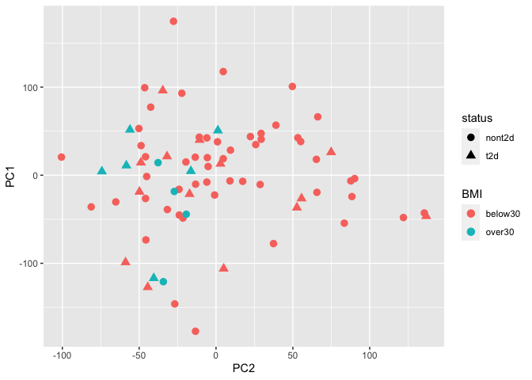
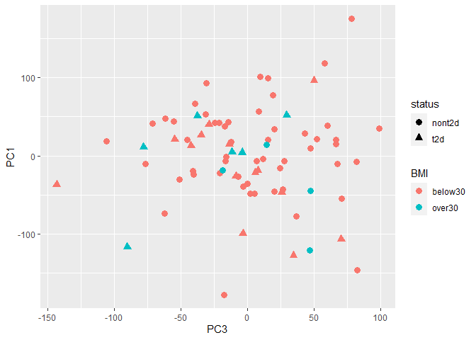
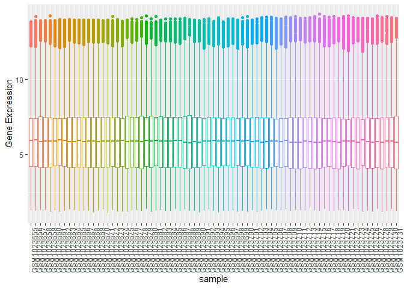

GSE41762 Regression Analysis
================
Cindy Zhang
2023-02-19

### Loading Data

``` r
eset <- getGEO("GSE41762", getGPL = FALSE)[[1]]
```

    ## Found 1 file(s)

    ## GSE41762_series_matrix.txt.gz

``` r
head(eset, 10)
```

    ## ExpressionSet (storageMode: lockedEnvironment)
    ## assayData: 10 features, 77 samples 
    ##   element names: exprs 
    ## protocolData: none
    ## phenoData
    ##   sampleNames: GSM1023655 GSM1023656 ... GSM1023731 (77 total)
    ##   varLabels: title geo_accession ... tissue:ch1 (40 total)
    ##   varMetadata: labelDescription
    ## featureData: none
    ## experimentData: use 'experimentData(object)'
    ##   pubMedIds: 23140642
    ## 25298321 
    ## Annotation: GPL6244

``` r
str(pData(eset))
```

    ## 'data.frame':    77 obs. of  40 variables:
    ##  $ title                  : chr  "human islets, ID1" "human islets, ID2" "human islets, ID3" "human islets, ID4" ...
    ##  $ geo_accession          : chr  "GSM1023655" "GSM1023656" "GSM1023657" "GSM1023658" ...
    ##  $ status                 : chr  "Public on Oct 23 2012" "Public on Oct 23 2012" "Public on Oct 23 2012" "Public on Oct 23 2012" ...
    ##  $ submission_date        : chr  "Oct 22 2012" "Oct 22 2012" "Oct 22 2012" "Oct 22 2012" ...
    ##  $ last_update_date       : chr  "Oct 23 2012" "Oct 23 2012" "Oct 23 2012" "Oct 23 2012" ...
    ##  $ type                   : chr  "RNA" "RNA" "RNA" "RNA" ...
    ##  $ channel_count          : chr  "1" "1" "1" "1" ...
    ##  $ source_name_ch1        : chr  "Islets from cadaver donor ID1" "Islets from cadaver donor ID2" "Islets from cadaver donor ID3" "Islets from cadaver donor ID4" ...
    ##  $ organism_ch1           : chr  "Homo sapiens" "Homo sapiens" "Homo sapiens" "Homo sapiens" ...
    ##  $ characteristics_ch1    : chr  "tissue: pancreatic islets" "tissue: pancreatic islets" "tissue: pancreatic islets" "tissue: pancreatic islets" ...
    ##  $ characteristics_ch1.1  : chr  "Sex: Male" "Sex: Male" "Sex: Female" "Sex: Female" ...
    ##  $ characteristics_ch1.2  : chr  "age: 69" "age: 56" "age: 46" "age: 62" ...
    ##  $ characteristics_ch1.3  : chr  "bmi: 24.7" "bmi: 24.7" "bmi: 23.9" "bmi: 27.7" ...
    ##  $ characteristics_ch1.4  : chr  "hba1c: 5.8" "status: Non-diabetic donor" "hba1c: 5.4" "status: Non-diabetic donor" ...
    ##  $ characteristics_ch1.5  : chr  "status: Non-diabetic donor" "" "status: Non-diabetic donor" "" ...
    ##  $ treatment_protocol_ch1 : chr  "The islets were cultured in CMRL 1066 (ICN Biomedicals, Costa Mesa, CA, USA) supplemented with 10 mM/l HEPES, 2"| __truncated__ "The islets were cultured in CMRL 1066 (ICN Biomedicals, Costa Mesa, CA, USA) supplemented with 10 mM/l HEPES, 2"| __truncated__ "The islets were cultured in CMRL 1066 (ICN Biomedicals, Costa Mesa, CA, USA) supplemented with 10 mM/l HEPES, 2"| __truncated__ "The islets were cultured in CMRL 1066 (ICN Biomedicals, Costa Mesa, CA, USA) supplemented with 10 mM/l HEPES, 2"| __truncated__ ...
    ##  $ molecule_ch1           : chr  "total RNA" "total RNA" "total RNA" "total RNA" ...
    ##  $ extract_protocol_ch1   : chr  "Total RNA was isolated with the AllPrep DNA/RNA Mini Kit (Qiagen, Hilden, Germany). RNA quality and concentrati"| __truncated__ "Total RNA was isolated with the AllPrep DNA/RNA Mini Kit (Qiagen, Hilden, Germany). RNA quality and concentrati"| __truncated__ "Total RNA was isolated with the AllPrep DNA/RNA Mini Kit (Qiagen, Hilden, Germany). RNA quality and concentrati"| __truncated__ "Total RNA was isolated with the AllPrep DNA/RNA Mini Kit (Qiagen, Hilden, Germany). RNA quality and concentrati"| __truncated__ ...
    ##  $ label_ch1              : chr  "biotin" "biotin" "biotin" "biotin" ...
    ##  $ label_protocol_ch1     : chr  "Briefly, 100-200 ng total RNA was processed as indicated by GeneChip® Expression 3’-Amplification Reagents Onec"| __truncated__ "Briefly, 100-200 ng total RNA was processed as indicated by GeneChip® Expression 3’-Amplification Reagents Onec"| __truncated__ "Briefly, 100-200 ng total RNA was processed as indicated by GeneChip® Expression 3’-Amplification Reagents Onec"| __truncated__ "Briefly, 100-200 ng total RNA was processed as indicated by GeneChip® Expression 3’-Amplification Reagents Onec"| __truncated__ ...
    ##  $ taxid_ch1              : chr  "9606" "9606" "9606" "9606" ...
    ##  $ hyb_protocol           : chr  "Following fragmentation, 10 ug of cRNA were hybridized onto the GeneChip® Human Gene 1.0 ST whole transcript ba"| __truncated__ "Following fragmentation, 10 ug of cRNA were hybridized onto the GeneChip® Human Gene 1.0 ST whole transcript ba"| __truncated__ "Following fragmentation, 10 ug of cRNA were hybridized onto the GeneChip® Human Gene 1.0 ST whole transcript ba"| __truncated__ "Following fragmentation, 10 ug of cRNA were hybridized onto the GeneChip® Human Gene 1.0 ST whole transcript ba"| __truncated__ ...
    ##  $ scan_protocol          : chr  "Scanning was carried out with the GeneChip® Scanner 3000 and image analysis was performed using GeneChip® Operating Software." "Scanning was carried out with the GeneChip® Scanner 3000 and image analysis was performed using GeneChip® Operating Software." "Scanning was carried out with the GeneChip® Scanner 3000 and image analysis was performed using GeneChip® Operating Software." "Scanning was carried out with the GeneChip® Scanner 3000 and image analysis was performed using GeneChip® Operating Software." ...
    ##  $ description            : chr  "Gene expression data from human pancreatic islets" "Gene expression data from human pancreatic islets" "Gene expression data from human pancreatic islets" "Gene expression data from human pancreatic islets" ...
    ##  $ data_processing        : chr  "The array data was summarized and normalized with Robust Multi-array Analysis (RMA) method using the software “"| __truncated__ "The array data was summarized and normalized with Robust Multi-array Analysis (RMA) method using the software “"| __truncated__ "The array data was summarized and normalized with Robust Multi-array Analysis (RMA) method using the software “"| __truncated__ "The array data was summarized and normalized with Robust Multi-array Analysis (RMA) method using the software “"| __truncated__ ...
    ##  $ platform_id            : chr  "GPL6244" "GPL6244" "GPL6244" "GPL6244" ...
    ##  $ contact_name           : chr  "Anders,,Rosengren" "Anders,,Rosengren" "Anders,,Rosengren" "Anders,,Rosengren" ...
    ##  $ contact_institute      : chr  "Lund University" "Lund University" "Lund University" "Lund University" ...
    ##  $ contact_address        : chr  "CRC 91-11 SUS" "CRC 91-11 SUS" "CRC 91-11 SUS" "CRC 91-11 SUS" ...
    ##  $ contact_city           : chr  "Malmo" "Malmo" "Malmo" "Malmo" ...
    ##  $ contact_zip/postal_code: chr  "SE-20502" "SE-20502" "SE-20502" "SE-20502" ...
    ##  $ contact_country        : chr  "Sweden" "Sweden" "Sweden" "Sweden" ...
    ##  $ supplementary_file     : chr  "ftp://ftp.ncbi.nlm.nih.gov/geo/samples/GSM1023nnn/GSM1023655/suppl/GSM1023655_1.CEL.gz" "ftp://ftp.ncbi.nlm.nih.gov/geo/samples/GSM1023nnn/GSM1023656/suppl/GSM1023656_2.CEL.gz" "ftp://ftp.ncbi.nlm.nih.gov/geo/samples/GSM1023nnn/GSM1023657/suppl/GSM1023657_3.CEL.gz" "ftp://ftp.ncbi.nlm.nih.gov/geo/samples/GSM1023nnn/GSM1023658/suppl/GSM1023658_4.CEL.gz" ...
    ##  $ data_row_count         : chr  "29096" "29096" "29096" "29096" ...
    ##  $ age:ch1                : chr  "69" "56" "46" "62" ...
    ##  $ bmi:ch1                : chr  "24.7" "24.7" "23.9" "27.7" ...
    ##  $ hba1c:ch1              : chr  "5.8" NA "5.4" NA ...
    ##  $ Sex:ch1                : chr  "Male" "Male" "Female" "Female" ...
    ##  $ status:ch1             : chr  "Non-diabetic donor" "Non-diabetic donor" "Non-diabetic donor" "Non-diabetic donor" ...
    ##  $ tissue:ch1             : chr  "pancreatic islets" "pancreatic islets" "pancreatic islets" "pancreatic islets" ...

``` r
head(pData(eset)[1:3,1:5]) %>% kable()
```

|            | title             | geo_accession | status                | submission_date | last_update_date |
|:-----------|:------------------|:--------------|:----------------------|:----------------|:-----------------|
| GSM1023655 | human islets, ID1 | GSM1023655    | Public on Oct 23 2012 | Oct 22 2012     | Oct 23 2012      |
| GSM1023656 | human islets, ID2 | GSM1023656    | Public on Oct 23 2012 | Oct 22 2012     | Oct 23 2012      |
| GSM1023657 | human islets, ID3 | GSM1023657    | Public on Oct 23 2012 | Oct 22 2012     | Oct 23 2012      |

### Data Wrangling

``` r
pData(eset) <- pData(eset) %>%
  mutate(sample_id = geo_accession) %>% 
  select("status:ch1",sample_id,"Sex:ch1", "bmi:ch1", "age:ch1") 
colnames(pData(eset)) <- c("statu","sample_id","sex","bmi","age")

pData(eset)$bmi %>% as.double()
```

    ##  [1] 24.7 24.7 23.9 27.7 17.6 28.4 21.1 27.0 29.0 26.1 26.1 29.4 26.8 26.2 28.4
    ## [16] 26.0 24.7 23.9 22.5 26.2 29.1 21.1 22.0 27.5 24.2 36.6 26.3 26.2 26.3 29.4
    ## [31] 24.5 27.8 28.4 26.1 26.2 27.0 24.8 24.5 22.5 23.1 22.9 21.5 20.1 23.4 23.5
    ## [46] 27.5 24.8 33.1 34.6 25.7 23.7 24.7 24.6 27.0 19.4 26.0 33.6 24.7 36.9 32.5
    ## [61] 25.3 28.7 34.2 25.7 23.9 33.4 24.8 24.9 26.3 23.2 22.5 24.9 30.5 24.5 24.2
    ## [76] 31.1 26.0

``` r
pData(eset)$age %>% as.double()
```

    ##  [1] 69 56 46 62 69 67 62 51 54 60 51 44 64 73 54 31 61 57 55 63 71 26 54 43 43
    ## [26] 59 61 57 59 61 49 54 64 69 52 54 51 32 41 74 46 68 69 54 59 56 62 75 57 53
    ## [51] 57 61 60 64 67 64 56 40 62 57 62 43 66 58 67 49 52 51 35 54 69 66 64 68 61
    ## [76] 40 65

``` r
pData(eset) <- pData(eset) %>% 
  mutate(status = case_when(
         grepl("Non-diabetic donor", statu) ~ "nont2d",
         grepl("Diabetic donor", statu) ~ "t2d")) %>%
  mutate(BMI = case_when(
    bmi >  30 ~ "over30",
    bmi < 30 ~ "below30"
  )) %>% 
  select(-c(bmi,statu))
```

### Arrange factor levels

``` r
pData(eset) <- pData(eset) %>% 
  mutate(BMI = fct_relevel(BMI, "below30", "over30")) %>% 
  mutate(status = as.factor(status))
```

### match ID between matrixes

``` r
identical(colnames(exprs(eset)), pData(eset)$sample_id)
```

    ## [1] TRUE

### Missing Values

- The missing data are found in sample ID 49 through 77

``` r
express <- exprs(eset) %>% 
  as.data.frame() 
#samples with missing values 
names(colSums(is.na(express))>0)
```

    ##  [1] "GSM1023655" "GSM1023656" "GSM1023657" "GSM1023658" "GSM1023659"
    ##  [6] "GSM1023660" "GSM1023661" "GSM1023662" "GSM1023663" "GSM1023664"
    ## [11] "GSM1023665" "GSM1023666" "GSM1023667" "GSM1023668" "GSM1023669"
    ## [16] "GSM1023670" "GSM1023671" "GSM1023672" "GSM1023673" "GSM1023674"
    ## [21] "GSM1023675" "GSM1023676" "GSM1023677" "GSM1023678" "GSM1023679"
    ## [26] "GSM1023680" "GSM1023681" "GSM1023682" "GSM1023683" "GSM1023684"
    ## [31] "GSM1023685" "GSM1023686" "GSM1023687" "GSM1023688" "GSM1023689"
    ## [36] "GSM1023690" "GSM1023691" "GSM1023692" "GSM1023693" "GSM1023694"
    ## [41] "GSM1023695" "GSM1023696" "GSM1023697" "GSM1023698" "GSM1023699"
    ## [46] "GSM1023700" "GSM1023701" "GSM1023702" "GSM1023703" "GSM1023704"
    ## [51] "GSM1023705" "GSM1023706" "GSM1023707" "GSM1023708" "GSM1023709"
    ## [56] "GSM1023710" "GSM1023711" "GSM1023712" "GSM1023713" "GSM1023714"
    ## [61] "GSM1023715" "GSM1023716" "GSM1023717" "GSM1023718" "GSM1023719"
    ## [66] "GSM1023720" "GSM1023721" "GSM1023722" "GSM1023723" "GSM1023724"
    ## [71] "GSM1023725" "GSM1023726" "GSM1023727" "GSM1023728" "GSM1023729"
    ## [76] "GSM1023730" "GSM1023731"

``` r
express <- na.omit(express)
```

### Combine data

``` r
# metaData
id <- colnames(express)
MetaData <- pData(eset) %>% 
  select(sample_id, status, BMI) %>% 
  mutate(samples = sample_id) %>% 
  filter(sample_id %in% id)

toLongerMeta <- function(expset) {
    stopifnot(class(expset) == "ExpressionSet")
    expressionMatrix <- longExpressionMatrix <- express %>% 
    as.data.frame() %>%
    rownames_to_column("gene") %>%
    pivot_longer(cols = !gene, 
                 values_to = "Expression",
                 names_to = "sample_id") %>%
    left_join(MetaData)
  return(expressionMatrix)
}

joint <- toLongerMeta(eset)
```

    ## Joining with `by = join_by(sample_id)`

``` r
head(joint, 3) %>% kable()
```

| gene    | sample_id  | Expression | status | BMI     | samples    |
|:--------|:-----------|-----------:|:-------|:--------|:-----------|
| 7896736 | GSM1023655 |   4.471944 | nont2d | below30 | GSM1023655 |
| 7896736 | GSM1023656 |   4.912165 | nont2d | below30 | GSM1023656 |
| 7896736 | GSM1023657 |   5.451896 | nont2d | below30 | GSM1023657 |

``` r
identical(MetaData$sample_id, colnames(express))
```

    ## [1] TRUE

## Perform PCA to analyze batch effect

``` r
pca_res <- prcomp(t(express), scale=TRUE)
autoplot(pca_res)
```

<!-- -->

``` r
autoplot(pca_res, loadings = TRUE, loadings.label = TRUE, x = 2, y = 3)
```

<!-- -->

``` r
autoplot(pca_res, loadings = TRUE, loadings.label = TRUE, x = 3, y = 4)
```

<!-- -->
\* No discernable batch effect is observed. Thus, can combine thedata
from both cohorts for the following study:

# Samples in each group

    ##          
    ##           nont2d t2d
    ##   below30     53  14
    ##   over30       4   6

### pivot data format

``` r
toLonger <- function(expressionMatrix) {
    expressionMatrix <- longExpressionMatrix <- expressionMatrix %>% 
    as.data.frame() %>%
    rownames_to_column("gene") %>%
    pivot_longer(cols = !gene, 
                 values_to = "Expression",
                 names_to = "sample_id") 
  return(expressionMatrix)
}

options(repr.plot.width = 30, repr.plot.height =2)

toLonger(express) %>% 
  ggplot(aes(x=sample_id, y= Expression, color=sample_id)) +
  geom_boxplot() + 
  theme(axis.text.x = element_text(angle = 90, hjust = 1),legend.position = "none") + 
  labs(x = "sample", y = "Gene Expression") 
```

<!-- -->
\# linear model

``` r
modm <- model.matrix(~BMI*status, MetaData)
lmFitEb <- eBayes(lmFit(express, modm))
```

### DE genes in obese vs. nonobese healthy samples

``` r
DEobH <- topTable(lmFitEb, number = Inf, adjust.method="BH", p.value = 0.05, coef= "BMIover30")

DEobH %>% kable()
```

|         |    logFC |  AveExpr |       t | P.Value | adj.P.Val |        B |
|:--------|---------:|---------:|--------:|--------:|----------:|---------:|
| 8105842 | 0.838843 | 3.723151 | 5.38427 |   7e-07 | 0.0215372 | 5.009532 |

### DE genes in obese vs. nonobese T2D samples

``` r
DEObT2d <- topTable(lmFitEb, number = Inf, adjust.method="BH", p.value = 0.05, coef= "BMIover30:statust2d") 
```

### DE genes in T2D vs. Healthy in nonobese samples

``` r
degT2dNonOb <- topTable(lmFitEb, number = Inf, adjust.method="BH", p.value = 0.05, coef= "statust2d")

degT2dNonOb %>% kable()
```

|         |      logFC |  AveExpr |         t |  P.Value | adj.P.Val |        B |
|:--------|-----------:|---------:|----------:|---------:|----------:|---------:|
| 8126324 |  1.7876132 | 6.871139 |  5.435329 | 6.00e-07 | 0.0084794 | 5.434372 |
| 7987405 | -0.8180883 | 6.938990 | -5.424617 | 6.00e-07 | 0.0084794 | 5.397516 |
| 8003667 |  1.0519296 | 7.607950 |  5.281525 | 1.10e-06 | 0.0084794 | 4.907905 |
| 8092083 | -1.1402907 | 7.542657 | -5.259422 | 1.20e-06 | 0.0084794 | 4.832737 |
| 8169504 |  1.4197096 | 5.804192 |  5.215783 | 1.50e-06 | 0.0084794 | 4.684705 |
| 8092081 | -0.6426602 | 5.205000 | -5.020353 | 3.20e-06 | 0.0153246 | 4.028178 |
| 8122457 |  0.4473233 | 6.351325 |  4.737638 | 9.60e-06 | 0.0344319 | 3.098696 |
| 7930413 |  0.4717516 | 8.707440 |  4.683055 | 1.18e-05 | 0.0344319 | 2.922250 |
| 8077270 | -0.9436999 | 6.612667 | -4.681199 | 1.19e-05 | 0.0344319 | 2.916268 |
| 7946757 | -0.2548382 | 6.529406 | -4.674108 | 1.22e-05 | 0.0344319 | 2.893426 |
| 8139087 |  1.3069289 | 4.833279 |  4.652862 | 1.32e-05 | 0.0344319 | 2.825087 |
| 8115355 | -1.1866442 | 6.787113 | -4.618620 | 1.51e-05 | 0.0344319 | 2.715284 |
| 8098246 |  1.0475308 | 5.734678 |  4.609555 | 1.56e-05 | 0.0344319 | 2.686287 |

### Examine DE genes in Obese vs. nonobese

``` r
modm <- model.matrix(~BMI, MetaData)
lmFitEb <- eBayes(lmFit(express, modm))
deGenesOb <- topTable(lmFitEb, number = Inf, adjust.method="BH", p.value = 0.05, coef= "BMIover30")
deGenesOb %>% kable()
```

|         |     logFC |  AveExpr |        t | P.Value | adj.P.Val |        B |
|:--------|----------:|---------:|---------:|--------:|----------:|---------:|
| 7948565 | 0.3073341 | 7.611851 | 5.207755 | 1.5e-06 | 0.0419908 | 4.513915 |

### Examine DE genes in T2D vs. nonT2D

``` r
modm <- model.matrix(~status, MetaData)
lmFitEb <- eBayes(lmFit(express, modm))
deGenesT2d <- topTable(lmFitEb, number = Inf, adjust.method="BH", p.value = 0.05, coef= "statust2d")
deGenesT2d %>% kable()
```

|         |      logFC |   AveExpr |         t |  P.Value | adj.P.Val |        B |
|:--------|-----------:|----------:|----------:|---------:|----------:|---------:|
| 8092083 | -1.0820364 |  7.542657 | -5.645397 | 2.00e-07 | 0.0070167 | 6.370124 |
| 8003667 |  0.9597603 |  7.607950 |  5.324140 | 9.00e-07 | 0.0113253 | 5.226567 |
| 7987405 | -0.7089442 |  6.938990 | -5.260069 | 1.20e-06 | 0.0113253 | 5.001737 |
| 8077270 | -0.9326136 |  6.612667 | -5.114337 | 2.10e-06 | 0.0152371 | 4.494733 |
| 8010903 | -0.3603214 |  7.370847 | -4.977567 | 3.60e-06 | 0.0175575 | 4.024777 |
| 8104570 | -0.7616175 |  8.660364 | -4.927781 | 4.40e-06 | 0.0175575 | 3.855194 |
| 7946757 | -0.2300417 |  6.529406 | -4.893138 | 5.10e-06 | 0.0175575 | 3.737676 |
| 8126244 | -0.5808755 |  6.313708 | -4.865161 | 5.70e-06 | 0.0175575 | 3.643064 |
| 8119338 | -0.6683442 |  8.113224 | -4.863912 | 5.70e-06 | 0.0175575 | 3.638847 |
| 8092081 | -0.5436832 |  5.205000 | -4.845625 | 6.10e-06 | 0.0175575 | 3.577155 |
| 7925342 | -0.6919304 | 10.563772 | -4.798467 | 7.30e-06 | 0.0191650 | 3.418603 |
| 8126324 |  1.3951374 |  6.871139 |  4.750079 | 8.80e-06 | 0.0211761 | 3.256725 |
| 8175234 |  0.6839326 |  5.431720 |  4.657215 | 1.26e-05 | 0.0278397 | 2.948426 |
| 7954377 | -0.7182084 | 13.118733 | -4.638354 | 1.36e-05 | 0.0278397 | 2.886197 |
| 8005814 | -0.2868982 |  7.471646 | -4.594438 | 1.60e-05 | 0.0306985 | 2.741824 |
| 7961022 |  0.2320599 | 10.683985 |  4.563856 | 1.80e-05 | 0.0323080 | 2.641724 |
| 8043995 |  0.5526693 |  8.726264 |  4.537746 | 1.99e-05 | 0.0335526 | 2.556544 |
| 7927803 | -0.6287643 |  7.426039 | -4.501160 | 2.28e-05 | 0.0363567 | 2.437640 |
| 8037374 |  0.4251982 |  8.150206 |  4.457912 | 2.68e-05 | 0.0404884 | 2.297771 |

### Saving relevant data for aim 2 gene enrichment analysis

saveRDS(degT2dNonOb, file = “ObvsNonObHealthy.RDS”)

saveRDS(deGenesT2d, file = “T2dvsNonT2d.RDS”)

- Note: Result can be loaded into Aim 2 analysis using the following
  code `readRDS("ObvsNonObHealthy.RDS")`
