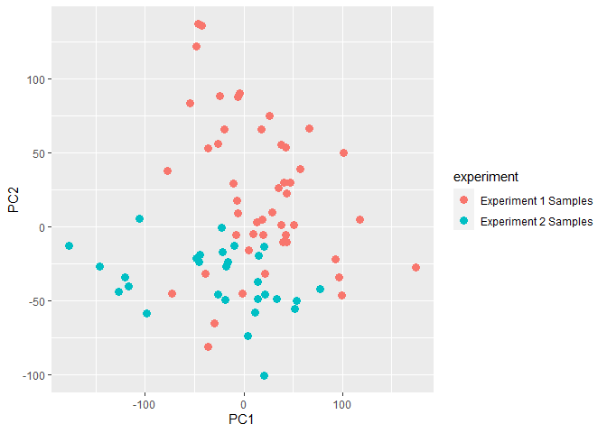
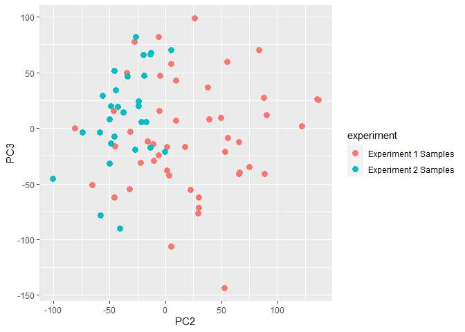
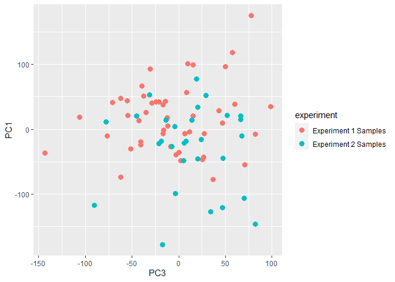
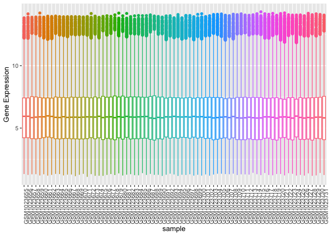

GSE41762 Regression Analysis
================
Cindy Zhang + edit
2023-02-19

### Loading Data

``` r
eset <- getGEO("GSE41762", getGPL = FALSE)[[1]]
```

    ## Found 1 file(s)

    ## GSE41762_series_matrix.txt.gz

``` r
# eset <- getGEO(filename = "~/Downloads/GSE41762_series_matrix.txt.gz", getGPL = FALSE)
head(eset, 10)
```

    ## ExpressionSet (storageMode: lockedEnvironment)
    ## assayData: 10 features, 77 samples 
    ##   element names: exprs 
    ## protocolData: none
    ## phenoData
    ##   sampleNames: GSM1023655 GSM1023656 ... GSM1023731 (77 total)
    ##   varLabels: title geo_accession ... tissue:ch1 (40 total)
    ##   varMetadata: labelDescription
    ## featureData: none
    ## experimentData: use 'experimentData(object)'
    ##   pubMedIds: 23140642
    ## 25298321 
    ## Annotation: GPL6244

``` r
str(pData(eset))
```

    ## 'data.frame':    77 obs. of  40 variables:
    ##  $ title                  : chr  "human islets, ID1" "human islets, ID2" "human islets, ID3" "human islets, ID4" ...
    ##  $ geo_accession          : chr  "GSM1023655" "GSM1023656" "GSM1023657" "GSM1023658" ...
    ##  $ status                 : chr  "Public on Oct 23 2012" "Public on Oct 23 2012" "Public on Oct 23 2012" "Public on Oct 23 2012" ...
    ##  $ submission_date        : chr  "Oct 22 2012" "Oct 22 2012" "Oct 22 2012" "Oct 22 2012" ...
    ##  $ last_update_date       : chr  "Oct 23 2012" "Oct 23 2012" "Oct 23 2012" "Oct 23 2012" ...
    ##  $ type                   : chr  "RNA" "RNA" "RNA" "RNA" ...
    ##  $ channel_count          : chr  "1" "1" "1" "1" ...
    ##  $ source_name_ch1        : chr  "Islets from cadaver donor ID1" "Islets from cadaver donor ID2" "Islets from cadaver donor ID3" "Islets from cadaver donor ID4" ...
    ##  $ organism_ch1           : chr  "Homo sapiens" "Homo sapiens" "Homo sapiens" "Homo sapiens" ...
    ##  $ characteristics_ch1    : chr  "tissue: pancreatic islets" "tissue: pancreatic islets" "tissue: pancreatic islets" "tissue: pancreatic islets" ...
    ##  $ characteristics_ch1.1  : chr  "Sex: Male" "Sex: Male" "Sex: Female" "Sex: Female" ...
    ##  $ characteristics_ch1.2  : chr  "age: 69" "age: 56" "age: 46" "age: 62" ...
    ##  $ characteristics_ch1.3  : chr  "bmi: 24.7" "bmi: 24.7" "bmi: 23.9" "bmi: 27.7" ...
    ##  $ characteristics_ch1.4  : chr  "hba1c: 5.8" "status: Non-diabetic donor" "hba1c: 5.4" "status: Non-diabetic donor" ...
    ##  $ characteristics_ch1.5  : chr  "status: Non-diabetic donor" "" "status: Non-diabetic donor" "" ...
    ##  $ treatment_protocol_ch1 : chr  "The islets were cultured in CMRL 1066 (ICN Biomedicals, Costa Mesa, CA, USA) supplemented with 10 mM/l HEPES, 2"| __truncated__ "The islets were cultured in CMRL 1066 (ICN Biomedicals, Costa Mesa, CA, USA) supplemented with 10 mM/l HEPES, 2"| __truncated__ "The islets were cultured in CMRL 1066 (ICN Biomedicals, Costa Mesa, CA, USA) supplemented with 10 mM/l HEPES, 2"| __truncated__ "The islets were cultured in CMRL 1066 (ICN Biomedicals, Costa Mesa, CA, USA) supplemented with 10 mM/l HEPES, 2"| __truncated__ ...
    ##  $ molecule_ch1           : chr  "total RNA" "total RNA" "total RNA" "total RNA" ...
    ##  $ extract_protocol_ch1   : chr  "Total RNA was isolated with the AllPrep DNA/RNA Mini Kit (Qiagen, Hilden, Germany). RNA quality and concentrati"| __truncated__ "Total RNA was isolated with the AllPrep DNA/RNA Mini Kit (Qiagen, Hilden, Germany). RNA quality and concentrati"| __truncated__ "Total RNA was isolated with the AllPrep DNA/RNA Mini Kit (Qiagen, Hilden, Germany). RNA quality and concentrati"| __truncated__ "Total RNA was isolated with the AllPrep DNA/RNA Mini Kit (Qiagen, Hilden, Germany). RNA quality and concentrati"| __truncated__ ...
    ##  $ label_ch1              : chr  "biotin" "biotin" "biotin" "biotin" ...
    ##  $ label_protocol_ch1     : chr  "Briefly, 100-200 ng total RNA was processed as indicated by GeneChip® Expression 3’-Amplification Reagents Onec"| __truncated__ "Briefly, 100-200 ng total RNA was processed as indicated by GeneChip® Expression 3’-Amplification Reagents Onec"| __truncated__ "Briefly, 100-200 ng total RNA was processed as indicated by GeneChip® Expression 3’-Amplification Reagents Onec"| __truncated__ "Briefly, 100-200 ng total RNA was processed as indicated by GeneChip® Expression 3’-Amplification Reagents Onec"| __truncated__ ...
    ##  $ taxid_ch1              : chr  "9606" "9606" "9606" "9606" ...
    ##  $ hyb_protocol           : chr  "Following fragmentation, 10 ug of cRNA were hybridized onto the GeneChip® Human Gene 1.0 ST whole transcript ba"| __truncated__ "Following fragmentation, 10 ug of cRNA were hybridized onto the GeneChip® Human Gene 1.0 ST whole transcript ba"| __truncated__ "Following fragmentation, 10 ug of cRNA were hybridized onto the GeneChip® Human Gene 1.0 ST whole transcript ba"| __truncated__ "Following fragmentation, 10 ug of cRNA were hybridized onto the GeneChip® Human Gene 1.0 ST whole transcript ba"| __truncated__ ...
    ##  $ scan_protocol          : chr  "Scanning was carried out with the GeneChip® Scanner 3000 and image analysis was performed using GeneChip® Operating Software." "Scanning was carried out with the GeneChip® Scanner 3000 and image analysis was performed using GeneChip® Operating Software." "Scanning was carried out with the GeneChip® Scanner 3000 and image analysis was performed using GeneChip® Operating Software." "Scanning was carried out with the GeneChip® Scanner 3000 and image analysis was performed using GeneChip® Operating Software." ...
    ##  $ description            : chr  "Gene expression data from human pancreatic islets" "Gene expression data from human pancreatic islets" "Gene expression data from human pancreatic islets" "Gene expression data from human pancreatic islets" ...
    ##  $ data_processing        : chr  "The array data was summarized and normalized with Robust Multi-array Analysis (RMA) method using the software “"| __truncated__ "The array data was summarized and normalized with Robust Multi-array Analysis (RMA) method using the software “"| __truncated__ "The array data was summarized and normalized with Robust Multi-array Analysis (RMA) method using the software “"| __truncated__ "The array data was summarized and normalized with Robust Multi-array Analysis (RMA) method using the software “"| __truncated__ ...
    ##  $ platform_id            : chr  "GPL6244" "GPL6244" "GPL6244" "GPL6244" ...
    ##  $ contact_name           : chr  "Anders,,Rosengren" "Anders,,Rosengren" "Anders,,Rosengren" "Anders,,Rosengren" ...
    ##  $ contact_institute      : chr  "Lund University" "Lund University" "Lund University" "Lund University" ...
    ##  $ contact_address        : chr  "CRC 91-11 SUS" "CRC 91-11 SUS" "CRC 91-11 SUS" "CRC 91-11 SUS" ...
    ##  $ contact_city           : chr  "Malmo" "Malmo" "Malmo" "Malmo" ...
    ##  $ contact_zip/postal_code: chr  "SE-20502" "SE-20502" "SE-20502" "SE-20502" ...
    ##  $ contact_country        : chr  "Sweden" "Sweden" "Sweden" "Sweden" ...
    ##  $ supplementary_file     : chr  "ftp://ftp.ncbi.nlm.nih.gov/geo/samples/GSM1023nnn/GSM1023655/suppl/GSM1023655_1.CEL.gz" "ftp://ftp.ncbi.nlm.nih.gov/geo/samples/GSM1023nnn/GSM1023656/suppl/GSM1023656_2.CEL.gz" "ftp://ftp.ncbi.nlm.nih.gov/geo/samples/GSM1023nnn/GSM1023657/suppl/GSM1023657_3.CEL.gz" "ftp://ftp.ncbi.nlm.nih.gov/geo/samples/GSM1023nnn/GSM1023658/suppl/GSM1023658_4.CEL.gz" ...
    ##  $ data_row_count         : chr  "29096" "29096" "29096" "29096" ...
    ##  $ age:ch1                : chr  "69" "56" "46" "62" ...
    ##  $ bmi:ch1                : chr  "24.7" "24.7" "23.9" "27.7" ...
    ##  $ hba1c:ch1              : chr  "5.8" NA "5.4" NA ...
    ##  $ Sex:ch1                : chr  "Male" "Male" "Female" "Female" ...
    ##  $ status:ch1             : chr  "Non-diabetic donor" "Non-diabetic donor" "Non-diabetic donor" "Non-diabetic donor" ...
    ##  $ tissue:ch1             : chr  "pancreatic islets" "pancreatic islets" "pancreatic islets" "pancreatic islets" ...

``` r
head(pData(eset)[1:3,1:5]) %>% kable()
```

|            | title             | geo_accession | status                | submission_date | last_update_date |
|:-----------|:------------------|:--------------|:----------------------|:----------------|:-----------------|
| GSM1023655 | human islets, ID1 | GSM1023655    | Public on Oct 23 2012 | Oct 22 2012     | Oct 23 2012      |
| GSM1023656 | human islets, ID2 | GSM1023656    | Public on Oct 23 2012 | Oct 22 2012     | Oct 23 2012      |
| GSM1023657 | human islets, ID3 | GSM1023657    | Public on Oct 23 2012 | Oct 22 2012     | Oct 23 2012      |

### Data Wrangling

``` r
pData(eset) <- pData(eset) %>%
  mutate(sample_id = geo_accession) %>% 
  select("status:ch1",sample_id,"Sex:ch1", "bmi:ch1", "age:ch1") 
colnames(pData(eset)) <- c("statu","sample_id","sex","bmi","age")

pData(eset)$bmi %>% as.double()
```

    ##  [1] 24.7 24.7 23.9 27.7 17.6 28.4 21.1 27.0 29.0 26.1 26.1 29.4 26.8 26.2 28.4
    ## [16] 26.0 24.7 23.9 22.5 26.2 29.1 21.1 22.0 27.5 24.2 36.6 26.3 26.2 26.3 29.4
    ## [31] 24.5 27.8 28.4 26.1 26.2 27.0 24.8 24.5 22.5 23.1 22.9 21.5 20.1 23.4 23.5
    ## [46] 27.5 24.8 33.1 34.6 25.7 23.7 24.7 24.6 27.0 19.4 26.0 33.6 24.7 36.9 32.5
    ## [61] 25.3 28.7 34.2 25.7 23.9 33.4 24.8 24.9 26.3 23.2 22.5 24.9 30.5 24.5 24.2
    ## [76] 31.1 26.0

``` r
pData(eset)$age %>% as.double()
```

    ##  [1] 69 56 46 62 69 67 62 51 54 60 51 44 64 73 54 31 61 57 55 63 71 26 54 43 43
    ## [26] 59 61 57 59 61 49 54 64 69 52 54 51 32 41 74 46 68 69 54 59 56 62 75 57 53
    ## [51] 57 61 60 64 67 64 56 40 62 57 62 43 66 58 67 49 52 51 35 54 69 66 64 68 61
    ## [76] 40 65

``` r
pData(eset) <- pData(eset) %>% 
  mutate(status = case_when(
         grepl("Non-diabetic donor", statu) ~ "nont2d",
         grepl("Diabetic donor", statu) ~ "t2d")) %>%
  mutate(BMI = case_when(
    bmi >  30 ~ "over30",
    bmi < 30 ~ "below30"
  )) %>% 
  select(-c(bmi,statu))
```

### Arrange factor levels

``` r
pData(eset) <- pData(eset) %>% 
  mutate(BMI = fct_relevel(BMI, "below30", "over30")) %>% 
  mutate(status = as.factor(status))
```

### match ID between matrices

``` r
identical(colnames(exprs(eset)), pData(eset)$sample_id)
```

    ## [1] TRUE

### Missing Values

- The missing data are found in sample ID 49 through 77

``` r
express <- exprs(eset) %>% 
  as.data.frame() 
#samples with missing values 
names(colSums(is.na(express))>0)
```

    ##  [1] "GSM1023655" "GSM1023656" "GSM1023657" "GSM1023658" "GSM1023659"
    ##  [6] "GSM1023660" "GSM1023661" "GSM1023662" "GSM1023663" "GSM1023664"
    ## [11] "GSM1023665" "GSM1023666" "GSM1023667" "GSM1023668" "GSM1023669"
    ## [16] "GSM1023670" "GSM1023671" "GSM1023672" "GSM1023673" "GSM1023674"
    ## [21] "GSM1023675" "GSM1023676" "GSM1023677" "GSM1023678" "GSM1023679"
    ## [26] "GSM1023680" "GSM1023681" "GSM1023682" "GSM1023683" "GSM1023684"
    ## [31] "GSM1023685" "GSM1023686" "GSM1023687" "GSM1023688" "GSM1023689"
    ## [36] "GSM1023690" "GSM1023691" "GSM1023692" "GSM1023693" "GSM1023694"
    ## [41] "GSM1023695" "GSM1023696" "GSM1023697" "GSM1023698" "GSM1023699"
    ## [46] "GSM1023700" "GSM1023701" "GSM1023702" "GSM1023703" "GSM1023704"
    ## [51] "GSM1023705" "GSM1023706" "GSM1023707" "GSM1023708" "GSM1023709"
    ## [56] "GSM1023710" "GSM1023711" "GSM1023712" "GSM1023713" "GSM1023714"
    ## [61] "GSM1023715" "GSM1023716" "GSM1023717" "GSM1023718" "GSM1023719"
    ## [66] "GSM1023720" "GSM1023721" "GSM1023722" "GSM1023723" "GSM1023724"
    ## [71] "GSM1023725" "GSM1023726" "GSM1023727" "GSM1023728" "GSM1023729"
    ## [76] "GSM1023730" "GSM1023731"

``` r
express <- na.omit(express)
```

### Combine data

``` r
# metaData
id <- colnames(express)
MetaData <- pData(eset) %>% 
  select(sample_id, status, BMI) %>% 
  mutate(samples = sample_id) %>% 
  filter(sample_id %in% id)

toLongerMeta <- function(expset) {
    stopifnot(class(expset) == "ExpressionSet")
    expressionMatrix <- longExpressionMatrix <- express %>% 
    as.data.frame() %>%
    rownames_to_column("gene") %>%
    pivot_longer(cols = !gene, 
                 values_to = "Expression",
                 names_to = "sample_id") %>%
    left_join(MetaData)
  return(expressionMatrix)
}

joint <- toLongerMeta(eset)
```

    ## Joining with `by = join_by(sample_id)`

``` r
head(joint, 3) %>% kable()
```

| gene    | sample_id  | Expression | status | BMI     | samples    |
|:--------|:-----------|-----------:|:-------|:--------|:-----------|
| 7896736 | GSM1023655 |   4.471944 | nont2d | below30 | GSM1023655 |
| 7896736 | GSM1023656 |   4.912165 | nont2d | below30 | GSM1023656 |
| 7896736 | GSM1023657 |   5.451896 | nont2d | below30 | GSM1023657 |

``` r
identical(MetaData$sample_id, colnames(express))
```

    ## [1] TRUE

``` r
experiment_labels <- c(rep("Experiment 1 Samples", 48), rep("Experiment 2 Samples", 29))
MetaData$experiment = experiment_labels
```

# SVD for data visualization and batch effect analysis

``` r
express_scaled <- scale(t(express), center = TRUE, scale = TRUE)
s <- svd(express_scaled)

loadings <- s$v[, 1:3]

scores <- express_scaled %*% loadings

pca_data <- as_tibble(scores) %>% rename(PC1 = V1, PC2 = V2, PC3 = V3) 
```

    ## Warning: The `x` argument of `as_tibble.matrix()` must have unique column names if
    ## `.name_repair` is omitted as of tibble 2.0.0.
    ## ℹ Using compatibility `.name_repair`.

``` r
pca_data$sample_id = colnames(express)

pca_data <- left_join(pca_data, MetaData, by = "sample_id")

ggplot(pca_data, aes(x=PC2, y=PC1, shape=status, color = BMI)) + geom_point(size=3)
```

<!-- -->

``` r
ggplot(pca_data, aes(x=PC3, y=PC2, shape=status, color = BMI)) + geom_point(size=3)
```

<!-- -->

``` r
ggplot(pca_data, aes(x=PC3, y=PC1, shape=status, color = BMI)) + geom_point(size=3)
```

<!-- -->

``` r
#geom_text(aes(label = sample_id), size=2, nudge_y = 0.05)

ggplot(pca_data, aes(x=PC1, y=PC2, color = experiment)) + geom_point(size=3)
```

<!-- -->

``` r
ggplot(pca_data, aes(x=PC2, y=PC3, color = experiment)) + geom_point(size=3)
```

<!-- -->

``` r
ggplot(pca_data, aes(x=PC3, y=PC1, color = experiment)) + geom_point(size=3)
```

<!-- --> -
Moderate batch effect was observed. Thus, for the following, only sample
1 to 48 are used in the analysis

``` r
meta <- pData(eset)[1:48,]
```

## samples in each group

    ##          
    ##           nont2d t2d
    ##   below30     38   8
    ##   over30       0   2

### pivot data format

``` r
toLonger <- function(expressionMatrix) {
    expressionMatrix <- longExpressionMatrix <- expressionMatrix %>% 
    as.data.frame() %>%
    rownames_to_column("gene") %>%
    pivot_longer(cols = !gene, 
                 values_to = "Expression",
                 names_to = "sample_id") 
  return(expressionMatrix)
}

options(repr.plot.width = 30, repr.plot.height =2)

toLonger(express[1:48]) %>% 
  ggplot(aes(x=sample_id, y= Expression, color=sample_id)) +
  geom_boxplot() + 
  theme(axis.text.x = element_text(angle = 90, hjust = 1),legend.position = "none") + 
  labs(x = "sample", y = "Gene Expression") 
```

<!-- -->

## linear models

``` r
modm <- model.matrix(~status, meta)
lmFitEb <- eBayes(lmFit(express[1:48], modm))
```

### DE genes in T2D vs. Healthy

``` r
degT2d <- topTable(lmFitEb, number = Inf, adjust.method="BH", p.value = 0.05, coef= "statust2d")

degT2d
```

    ##              logFC   AveExpr         t      P.Value   adj.P.Val        B
    ## 8003667  1.4034296  7.609690  6.316668 6.816466e-08 0.001958371 7.545931
    ## 8095080  1.0921294  7.404872  5.542533 1.090848e-06 0.007738258 5.146712
    ## 8043995  0.8684121  8.800716  5.529337 1.143097e-06 0.007738258 5.106089
    ## 7938608  1.2241985  7.428053  5.511468 1.217814e-06 0.007738258 5.051107
    ## 7952341  1.0060584  7.362819  5.435595 1.592742e-06 0.007738258 4.817966
    ## 8139087  1.8199810  4.825679  5.431479 1.616065e-06 0.007738258 4.805336
    ## 8097282  0.4422703  7.180575  5.191681 3.754117e-06 0.015407968 4.072531
    ## 7974090 -0.3208450  7.017336 -5.150541 4.334315e-06 0.015565609 3.947504
    ## 7954377 -0.9860317 13.168026 -5.059747 5.945901e-06 0.018906487 3.672402
    ## 8156848  0.4525494  5.989503  5.007422 7.129418e-06 0.018906487 3.514405
    ## 8162373  1.0805100  4.145303  4.888684 1.074268e-05 0.018906487 3.157492
    ## 8060745  0.7592937  7.389295  4.866765 1.158374e-05 0.018906487 3.091867
    ## 8057486  0.6875371  5.979573  4.858617 1.191261e-05 0.018906487 3.067493
    ## 8094301  0.8521473  6.236116  4.856260 1.200944e-05 0.018906487 3.060445
    ## 7957551  0.4128098  7.894260  4.846313 1.242669e-05 0.018906487 3.030710
    ## 7925342 -0.9183493 10.580120 -4.836417 1.285592e-05 0.018906487 3.001145
    ## 7983630  1.1136693  5.078156  4.822373 1.349017e-05 0.018906487 2.959217
    ## 8013341  1.0861145  6.458047  4.822010 1.350694e-05 0.018906487 2.958135
    ## 8174474  0.5682149  9.250684  4.806821 1.422836e-05 0.018906487 2.912832
    ## 7980908  0.7291552  7.659502  4.806547 1.424172e-05 0.018906487 2.912015
    ## 8073775  0.6971551  6.241825  4.805663 1.428490e-05 0.018906487 2.909379
    ## 7960947  0.7236753  8.602943  4.795339 1.479873e-05 0.018906487 2.878612
    ## 7934916  0.7052057  5.114955  4.788535 1.514722e-05 0.018906487 2.858347
    ## 8097256  0.9876548  8.676627  4.776308 1.579379e-05 0.018906487 2.821954
    ## 8169504  1.5416837  5.877320  4.727702 1.864291e-05 0.021424435 2.677558
    ## 8072705  0.6750977  6.029311  4.633032 2.571170e-05 0.027713676 2.397681
    ## 8044035  0.6692187  4.300792  4.609806 2.781276e-05 0.027713676 2.329303
    ## 7968351  1.4628981  6.965347  4.609796 2.781367e-05 0.027713676 2.329275
    ## 7930413  0.5404559  8.641569  4.608093 2.797413e-05 0.027713676 2.324267
    ## 8011640  0.3325868  7.301634  4.584496 3.029366e-05 0.028700154 2.254928
    ## 7966690  0.6166698  6.904903  4.577969 3.096780e-05 0.028700154 2.235770
    ## 8163202  0.6816564  4.965962  4.557823 3.314241e-05 0.028896752 2.176699
    ## 7987405 -0.8170092  7.011467 -4.557383 3.319154e-05 0.028896752 2.175410
    ## 7953603  0.7105924  8.916141  4.526602 3.681071e-05 0.029269989 2.085335
    ## 8131803  1.4591809  6.985941  4.520718 3.754516e-05 0.029269989 2.068142
    ## 8089145  0.8275136  6.164459  4.520626 3.755680e-05 0.029269989 2.067872
    ## 8059376  0.5983455  9.183299  4.519528 3.769543e-05 0.029269989 2.064666
    ## 8140556  0.8906217  5.793644  4.481526 4.281573e-05 0.032370944 1.953829
    ## 8010903 -0.4485769  7.397835 -4.462436 4.563829e-05 0.033136659 1.898278
    ## 8095110  0.7235535  5.934737  4.454038 4.693674e-05 0.033136659 1.873869
    ## 7939365  0.4368765  6.854069  4.451801 4.728865e-05 0.033136659 1.867370
    ## 8017964  0.3206475  4.013142  4.434252 5.014007e-05 0.033310587 1.816430
    ## 8055952  0.6653890  6.689935  4.429037 5.101924e-05 0.033310587 1.801308
    ## 8092083 -1.1414381  7.700726 -4.427922 5.120932e-05 0.033310587 1.798072
    ## 8017885  0.9210449  4.441656  4.417428 5.303093e-05 0.033310587 1.767664
    ## 7908924  0.5797284  6.081264  4.415716 5.333404e-05 0.033310587 1.762706
    ## 7997642  0.9378440  6.941388  4.399578 5.627580e-05 0.033533509 1.716002
    ## 8044021  1.5383049  6.234794  4.394790 5.717864e-05 0.033533509 1.702158
    ## 7972557  0.7105576  4.678574  4.394716 5.719255e-05 0.033533509 1.701946
    ## 8150428  0.6495879  6.413332  4.386149 5.884380e-05 0.033811648 1.677189
    ## 8122222  0.4288009  5.882662  4.379160 6.022516e-05 0.033926840 1.657007
    ## 8123446  0.7661964  5.292504  4.337859 6.905684e-05 0.037260062 1.538002
    ## 8096425 -0.4479530  5.769884 -4.333819 6.998543e-05 0.037260062 1.526387
    ## 7965410  0.9745456  8.174354  4.333614 7.003283e-05 0.037260062 1.525798
    ## 7974366  0.6570551  6.387726  4.301770 7.779709e-05 0.040014043 1.434383
    ## 8077786  0.4046297  6.839693  4.297680 7.885294e-05 0.040014043 1.422664
    ## 8172043  0.4997379  6.120234  4.295630 7.938742e-05 0.040014043 1.416791
    ## 8057599  0.5983282  8.791290  4.289507 8.100521e-05 0.040125513 1.399254
    ## 8175234  0.8963516  5.448293  4.282682 8.284607e-05 0.040341823 1.379720
    ## 7956878  0.6141048  4.986342  4.258204 8.978898e-05 0.042993957 1.309769
    ## 7908388  0.5748724  4.624798  4.252731 9.141711e-05 0.043055958 1.294151
    ## 8129573  0.4601562  5.273324  4.233266 9.744355e-05 0.045154084 1.238671
    ## 8109326  0.4960576  6.585574  4.219456 1.019516e-04 0.045947380 1.199374
    ## 7954469  0.4006514  7.710157  4.218252 1.023541e-04 0.045947380 1.195951
    ## 7967624  0.2741848  8.538114  4.200402 1.085054e-04 0.047959384 1.145246
    ## 7939492  0.4055110  7.649683  4.187603 1.131354e-04 0.049048490 1.108946
    ## 7904158  0.4330867  5.635643  4.184239 1.143839e-04 0.049048490 1.099413

``` r
dim(degT2d)
```

    ## [1] 67  6

### Saving relevant data for aim 2 gene enrichment analysis

``` r
saveRDS(degT2d, file = "t2d.RDS")
```

- Note: Result can be loaded into Aim 2 analysis using the following
  code `readRDS("t2d.RDS")`
