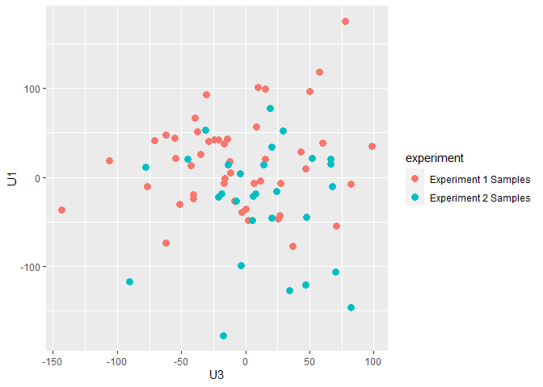

GSE41762 Regression Analysis
================
Cindy Zhang + edit
2023-02-19

### Loading Data

``` r
eset <- getGEO("GSE41762", getGPL = FALSE)[[1]]
```

    ## Found 1 file(s)

    ## GSE41762_series_matrix.txt.gz

``` r
# eset <- getGEO(filename = "~/Downloads/GSE41762_series_matrix.txt.gz", getGPL = FALSE)
head(eset, 10)
```

    ## ExpressionSet (storageMode: lockedEnvironment)
    ## assayData: 10 features, 77 samples 
    ##   element names: exprs 
    ## protocolData: none
    ## phenoData
    ##   sampleNames: GSM1023655 GSM1023656 ... GSM1023731 (77 total)
    ##   varLabels: title geo_accession ... tissue:ch1 (40 total)
    ##   varMetadata: labelDescription
    ## featureData: none
    ## experimentData: use 'experimentData(object)'
    ##   pubMedIds: 23140642
    ## 25298321 
    ## Annotation: GPL6244

``` r
str(pData(eset))
```

    ## 'data.frame':    77 obs. of  40 variables:
    ##  $ title                  : chr  "human islets, ID1" "human islets, ID2" "human islets, ID3" "human islets, ID4" ...
    ##  $ geo_accession          : chr  "GSM1023655" "GSM1023656" "GSM1023657" "GSM1023658" ...
    ##  $ status                 : chr  "Public on Oct 23 2012" "Public on Oct 23 2012" "Public on Oct 23 2012" "Public on Oct 23 2012" ...
    ##  $ submission_date        : chr  "Oct 22 2012" "Oct 22 2012" "Oct 22 2012" "Oct 22 2012" ...
    ##  $ last_update_date       : chr  "Oct 23 2012" "Oct 23 2012" "Oct 23 2012" "Oct 23 2012" ...
    ##  $ type                   : chr  "RNA" "RNA" "RNA" "RNA" ...
    ##  $ channel_count          : chr  "1" "1" "1" "1" ...
    ##  $ source_name_ch1        : chr  "Islets from cadaver donor ID1" "Islets from cadaver donor ID2" "Islets from cadaver donor ID3" "Islets from cadaver donor ID4" ...
    ##  $ organism_ch1           : chr  "Homo sapiens" "Homo sapiens" "Homo sapiens" "Homo sapiens" ...
    ##  $ characteristics_ch1    : chr  "tissue: pancreatic islets" "tissue: pancreatic islets" "tissue: pancreatic islets" "tissue: pancreatic islets" ...
    ##  $ characteristics_ch1.1  : chr  "Sex: Male" "Sex: Male" "Sex: Female" "Sex: Female" ...
    ##  $ characteristics_ch1.2  : chr  "age: 69" "age: 56" "age: 46" "age: 62" ...
    ##  $ characteristics_ch1.3  : chr  "bmi: 24.7" "bmi: 24.7" "bmi: 23.9" "bmi: 27.7" ...
    ##  $ characteristics_ch1.4  : chr  "hba1c: 5.8" "status: Non-diabetic donor" "hba1c: 5.4" "status: Non-diabetic donor" ...
    ##  $ characteristics_ch1.5  : chr  "status: Non-diabetic donor" "" "status: Non-diabetic donor" "" ...
    ##  $ treatment_protocol_ch1 : chr  "The islets were cultured in CMRL 1066 (ICN Biomedicals, Costa Mesa, CA, USA) supplemented with 10 mM/l HEPES, 2"| __truncated__ "The islets were cultured in CMRL 1066 (ICN Biomedicals, Costa Mesa, CA, USA) supplemented with 10 mM/l HEPES, 2"| __truncated__ "The islets were cultured in CMRL 1066 (ICN Biomedicals, Costa Mesa, CA, USA) supplemented with 10 mM/l HEPES, 2"| __truncated__ "The islets were cultured in CMRL 1066 (ICN Biomedicals, Costa Mesa, CA, USA) supplemented with 10 mM/l HEPES, 2"| __truncated__ ...
    ##  $ molecule_ch1           : chr  "total RNA" "total RNA" "total RNA" "total RNA" ...
    ##  $ extract_protocol_ch1   : chr  "Total RNA was isolated with the AllPrep DNA/RNA Mini Kit (Qiagen, Hilden, Germany). RNA quality and concentrati"| __truncated__ "Total RNA was isolated with the AllPrep DNA/RNA Mini Kit (Qiagen, Hilden, Germany). RNA quality and concentrati"| __truncated__ "Total RNA was isolated with the AllPrep DNA/RNA Mini Kit (Qiagen, Hilden, Germany). RNA quality and concentrati"| __truncated__ "Total RNA was isolated with the AllPrep DNA/RNA Mini Kit (Qiagen, Hilden, Germany). RNA quality and concentrati"| __truncated__ ...
    ##  $ label_ch1              : chr  "biotin" "biotin" "biotin" "biotin" ...
    ##  $ label_protocol_ch1     : chr  "Briefly, 100-200 ng total RNA was processed as indicated by GeneChip® Expression 3’-Amplification Reagents Onec"| __truncated__ "Briefly, 100-200 ng total RNA was processed as indicated by GeneChip® Expression 3’-Amplification Reagents Onec"| __truncated__ "Briefly, 100-200 ng total RNA was processed as indicated by GeneChip® Expression 3’-Amplification Reagents Onec"| __truncated__ "Briefly, 100-200 ng total RNA was processed as indicated by GeneChip® Expression 3’-Amplification Reagents Onec"| __truncated__ ...
    ##  $ taxid_ch1              : chr  "9606" "9606" "9606" "9606" ...
    ##  $ hyb_protocol           : chr  "Following fragmentation, 10 ug of cRNA were hybridized onto the GeneChip® Human Gene 1.0 ST whole transcript ba"| __truncated__ "Following fragmentation, 10 ug of cRNA were hybridized onto the GeneChip® Human Gene 1.0 ST whole transcript ba"| __truncated__ "Following fragmentation, 10 ug of cRNA were hybridized onto the GeneChip® Human Gene 1.0 ST whole transcript ba"| __truncated__ "Following fragmentation, 10 ug of cRNA were hybridized onto the GeneChip® Human Gene 1.0 ST whole transcript ba"| __truncated__ ...
    ##  $ scan_protocol          : chr  "Scanning was carried out with the GeneChip® Scanner 3000 and image analysis was performed using GeneChip® Operating Software." "Scanning was carried out with the GeneChip® Scanner 3000 and image analysis was performed using GeneChip® Operating Software." "Scanning was carried out with the GeneChip® Scanner 3000 and image analysis was performed using GeneChip® Operating Software." "Scanning was carried out with the GeneChip® Scanner 3000 and image analysis was performed using GeneChip® Operating Software." ...
    ##  $ description            : chr  "Gene expression data from human pancreatic islets" "Gene expression data from human pancreatic islets" "Gene expression data from human pancreatic islets" "Gene expression data from human pancreatic islets" ...
    ##  $ data_processing        : chr  "The array data was summarized and normalized with Robust Multi-array Analysis (RMA) method using the software “"| __truncated__ "The array data was summarized and normalized with Robust Multi-array Analysis (RMA) method using the software “"| __truncated__ "The array data was summarized and normalized with Robust Multi-array Analysis (RMA) method using the software “"| __truncated__ "The array data was summarized and normalized with Robust Multi-array Analysis (RMA) method using the software “"| __truncated__ ...
    ##  $ platform_id            : chr  "GPL6244" "GPL6244" "GPL6244" "GPL6244" ...
    ##  $ contact_name           : chr  "Anders,,Rosengren" "Anders,,Rosengren" "Anders,,Rosengren" "Anders,,Rosengren" ...
    ##  $ contact_institute      : chr  "Lund University" "Lund University" "Lund University" "Lund University" ...
    ##  $ contact_address        : chr  "CRC 91-11 SUS" "CRC 91-11 SUS" "CRC 91-11 SUS" "CRC 91-11 SUS" ...
    ##  $ contact_city           : chr  "Malmo" "Malmo" "Malmo" "Malmo" ...
    ##  $ contact_zip/postal_code: chr  "SE-20502" "SE-20502" "SE-20502" "SE-20502" ...
    ##  $ contact_country        : chr  "Sweden" "Sweden" "Sweden" "Sweden" ...
    ##  $ supplementary_file     : chr  "ftp://ftp.ncbi.nlm.nih.gov/geo/samples/GSM1023nnn/GSM1023655/suppl/GSM1023655_1.CEL.gz" "ftp://ftp.ncbi.nlm.nih.gov/geo/samples/GSM1023nnn/GSM1023656/suppl/GSM1023656_2.CEL.gz" "ftp://ftp.ncbi.nlm.nih.gov/geo/samples/GSM1023nnn/GSM1023657/suppl/GSM1023657_3.CEL.gz" "ftp://ftp.ncbi.nlm.nih.gov/geo/samples/GSM1023nnn/GSM1023658/suppl/GSM1023658_4.CEL.gz" ...
    ##  $ data_row_count         : chr  "29096" "29096" "29096" "29096" ...
    ##  $ age:ch1                : chr  "69" "56" "46" "62" ...
    ##  $ bmi:ch1                : chr  "24.7" "24.7" "23.9" "27.7" ...
    ##  $ hba1c:ch1              : chr  "5.8" NA "5.4" NA ...
    ##  $ Sex:ch1                : chr  "Male" "Male" "Female" "Female" ...
    ##  $ status:ch1             : chr  "Non-diabetic donor" "Non-diabetic donor" "Non-diabetic donor" "Non-diabetic donor" ...
    ##  $ tissue:ch1             : chr  "pancreatic islets" "pancreatic islets" "pancreatic islets" "pancreatic islets" ...

``` r
head(pData(eset)[1:3,1:5]) %>% kable()
```

|            | title             | geo_accession | status                | submission_date | last_update_date |
|:-----------|:------------------|:--------------|:----------------------|:----------------|:-----------------|
| GSM1023655 | human islets, ID1 | GSM1023655    | Public on Oct 23 2012 | Oct 22 2012     | Oct 23 2012      |
| GSM1023656 | human islets, ID2 | GSM1023656    | Public on Oct 23 2012 | Oct 22 2012     | Oct 23 2012      |
| GSM1023657 | human islets, ID3 | GSM1023657    | Public on Oct 23 2012 | Oct 22 2012     | Oct 23 2012      |

### Data Wrangling

``` r
pData(eset) <- pData(eset) %>%
  mutate(sample_id = geo_accession) %>% 
  select("status:ch1",sample_id,"Sex:ch1", "bmi:ch1", "age:ch1") 
colnames(pData(eset)) <- c("statu","sample_id","sex","bmi","age")
pData(eset)$bmi %>% as.double()
```

    ##  [1] 24.7 24.7 23.9 27.7 17.6 28.4 21.1 27.0 29.0 26.1 26.1 29.4 26.8 26.2 28.4
    ## [16] 26.0 24.7 23.9 22.5 26.2 29.1 21.1 22.0 27.5 24.2 36.6 26.3 26.2 26.3 29.4
    ## [31] 24.5 27.8 28.4 26.1 26.2 27.0 24.8 24.5 22.5 23.1 22.9 21.5 20.1 23.4 23.5
    ## [46] 27.5 24.8 33.1 34.6 25.7 23.7 24.7 24.6 27.0 19.4 26.0 33.6 24.7 36.9 32.5
    ## [61] 25.3 28.7 34.2 25.7 23.9 33.4 24.8 24.9 26.3 23.2 22.5 24.9 30.5 24.5 24.2
    ## [76] 31.1 26.0

``` r
pData(eset)$age %>% as.double()
```

    ##  [1] 69 56 46 62 69 67 62 51 54 60 51 44 64 73 54 31 61 57 55 63 71 26 54 43 43
    ## [26] 59 61 57 59 61 49 54 64 69 52 54 51 32 41 74 46 68 69 54 59 56 62 75 57 53
    ## [51] 57 61 60 64 67 64 56 40 62 57 62 43 66 58 67 49 52 51 35 54 69 66 64 68 61
    ## [76] 40 65

``` r
pData(eset) <- pData(eset) %>% 
  mutate(status = case_when(
         grepl("Non-diabetic donor", statu) ~ "nont2d",
         grepl("Diabetic donor", statu) ~ "t2d")) %>%
  mutate(BMI = case_when(
    bmi >  30 ~ "over30",
    bmi < 30 ~ "below30"
  )) %>% 
  select(-c(bmi,statu))
```

### Arrange Factor Levels

``` r
pData(eset) <- pData(eset) %>% 
  mutate(BMI = fct_relevel(BMI, "below30", "over30")) %>% 
  mutate(status = as.factor(status))
```

### match ID between matrices

``` r
identical(colnames(exprs(eset)), pData(eset)$sample_id)
```

    ## [1] TRUE

### Missing Values

- The missing data are found in sample ID 49 through 77

``` r
express <- exprs(eset) %>% 
  as.data.frame() 
#samples with missing values 
names(colSums(is.na(express))>0)
```

    ##  [1] "GSM1023655" "GSM1023656" "GSM1023657" "GSM1023658" "GSM1023659"
    ##  [6] "GSM1023660" "GSM1023661" "GSM1023662" "GSM1023663" "GSM1023664"
    ## [11] "GSM1023665" "GSM1023666" "GSM1023667" "GSM1023668" "GSM1023669"
    ## [16] "GSM1023670" "GSM1023671" "GSM1023672" "GSM1023673" "GSM1023674"
    ## [21] "GSM1023675" "GSM1023676" "GSM1023677" "GSM1023678" "GSM1023679"
    ## [26] "GSM1023680" "GSM1023681" "GSM1023682" "GSM1023683" "GSM1023684"
    ## [31] "GSM1023685" "GSM1023686" "GSM1023687" "GSM1023688" "GSM1023689"
    ## [36] "GSM1023690" "GSM1023691" "GSM1023692" "GSM1023693" "GSM1023694"
    ## [41] "GSM1023695" "GSM1023696" "GSM1023697" "GSM1023698" "GSM1023699"
    ## [46] "GSM1023700" "GSM1023701" "GSM1023702" "GSM1023703" "GSM1023704"
    ## [51] "GSM1023705" "GSM1023706" "GSM1023707" "GSM1023708" "GSM1023709"
    ## [56] "GSM1023710" "GSM1023711" "GSM1023712" "GSM1023713" "GSM1023714"
    ## [61] "GSM1023715" "GSM1023716" "GSM1023717" "GSM1023718" "GSM1023719"
    ## [66] "GSM1023720" "GSM1023721" "GSM1023722" "GSM1023723" "GSM1023724"
    ## [71] "GSM1023725" "GSM1023726" "GSM1023727" "GSM1023728" "GSM1023729"
    ## [76] "GSM1023730" "GSM1023731"

``` r
express <- na.omit(express)
```

### Combine Data

``` r
# metaData
id <- colnames(express)
MetaData <- pData(eset) %>% 
  select(sample_id, status, BMI) %>% 
  mutate(samples = sample_id) %>% 
  filter(sample_id %in% id)
toLongerMeta <- function(expset) {
    stopifnot(class(expset) == "ExpressionSet")
    expressionMatrix <- longExpressionMatrix <- express %>% 
    as.data.frame() %>%
    rownames_to_column("gene") %>%
    pivot_longer(cols = !gene, 
                 values_to = "Expression",
                 names_to = "sample_id") %>%
    left_join(MetaData)
  return(expressionMatrix)
}
joint <- toLongerMeta(eset)
```

    ## Joining with `by = join_by(sample_id)`

``` r
head(joint, 3) %>% kable()
```

| gene    | sample_id  | Expression | status | BMI     | samples    |
|:--------|:-----------|-----------:|:-------|:--------|:-----------|
| 7896736 | GSM1023655 |   4.471944 | nont2d | below30 | GSM1023655 |
| 7896736 | GSM1023656 |   4.912165 | nont2d | below30 | GSM1023656 |
| 7896736 | GSM1023657 |   5.451896 | nont2d | below30 | GSM1023657 |

``` r
identical(MetaData$sample_id, colnames(express))
```

    ## [1] TRUE

``` r
experiment_labels <- c(rep("Experiment 1 Samples", 48), rep("Experiment 2 Samples", 29))
MetaData$experiment = experiment_labels
```

## PCA to Evaluate Batch Effect

``` r
express_scaled <- scale(t(express), center = TRUE, scale = TRUE)
s <- svd(express_scaled)
loadings <- s$v[, 1:3]
scores <- express_scaled %*% loadings
pca_data <- as_tibble(scores) %>% rename(PC1 = V1, PC2 = V2, PC3 = V3) 
```

    ## Warning: The `x` argument of `as_tibble.matrix()` must have unique column names if
    ## `.name_repair` is omitted as of tibble 2.0.0.
    ## ℹ Using compatibility `.name_repair`.

``` r
pca_data$sample_id = colnames(express)
pca_data <- left_join(pca_data, MetaData, by = "sample_id")

ggplot(pca_data, aes(x=PC1, y=PC2, color = experiment)) + geom_point(size=3)
```

<!-- -->

``` r
ggplot(pca_data, aes(x=PC2, y=PC3, color = experiment)) + geom_point(size=3)
```

<!-- -->

``` r
ggplot(pca_data, aes(x=PC3, y=PC1, color = experiment)) + geom_point(size=3)
```

<!-- -->

### Since PCA showed a moderate batch effect, we decided to focus on the first 48 samples for GSEA analysis

``` r
experiment_labels <- c(rep("Experiment 1 Samples", 48), rep("Experiment 2 Samples", 29))
MetaData$experiment = experiment_labels

selected_genes <- MetaData %>% filter(experiment == "Experiment 1 Samples")

selected_modm <- model.matrix(~BMI*status, MetaData)
selected_lmFitEb <- eBayes(lmFit(express, selected_modm))

DEgenes <- topTable(selected_lmFitEb, number = Inf, coef= "statust2d")
DEgenes
```

    ##               logFC   AveExpr          t      P.Value   adj.P.Val           B
    ## 8126324  1.78761321  6.871139  5.4353294 6.094995e-07 0.008479442  5.43437211
    ## 7987405 -0.81808834  6.938990 -5.4246166 6.365888e-07 0.008479442  5.39751570
    ## 8003667  1.05192957  7.607950  5.2815248 1.134188e-06 0.008479442  4.90790468
    ## 8092083 -1.14029072  7.542657 -5.2594220 1.239325e-06 0.008479442  4.83273703
    ## 8169504  1.41970957  5.804192  5.2157831 1.475712e-06 0.008479442  4.68470478
    ## 8092081 -0.64266019  5.205000 -5.0203529 3.200400e-06 0.015324581  4.02817764
    ## 8122457  0.44732326  6.351325  4.7376376 9.577256e-06 0.034431932  3.09869594
    ## 7930413  0.47175159  8.707440  4.6830549 1.179353e-05 0.034431932  2.92224956
    ## 8077270 -0.94369992  6.612667 -4.6811990 1.187705e-05 0.034431932  2.91626817
    ## 7946757 -0.25483817  6.529405 -4.6741082 1.220150e-05 0.034431932  2.89342579
    ## 8139087  1.30692890  4.833279  4.6528616 1.322613e-05 0.034431932  2.82508709
    ## 8115355 -1.18664424  6.787113 -4.6186199 1.505589e-05 0.034431932  2.71528401
    ## 8098246  1.04753082  5.734678  4.6095554 1.558006e-05 0.034431932  2.68628645
    ## 8119338 -0.68920918  8.113224 -4.3459143 4.152786e-05 0.082787853  1.85622687
    ## 8013671 -0.39749276  4.352884 -4.3140951 4.664937e-05 0.082787853  1.75786458
    ## 8175234  0.70168800  5.431720  4.3012748 4.888097e-05 0.082787853  1.71834878
    ## 8005814 -0.30257541  7.471646 -4.2899514 5.093752e-05 0.082787853  1.68350215
    ## 7908924  0.44631559  6.007086  4.2789952 5.300678e-05 0.082787853  1.64983553
    ## 7952341  0.71981244  7.262465  4.2700809 5.475006e-05 0.082787853  1.62247969
    ## 8162373  0.77307136  4.099036  4.2327487 6.267118e-05 0.086707501  1.50827180
    ## 8068022  0.75606099  4.247311  4.2147227 6.688119e-05 0.086707501  1.45333399
    ## 8092970  1.19147033  8.151082  4.2099328 6.804497e-05 0.086707501  1.43875864
    ## 7904158  0.35164551  5.648286  4.2043971 6.941429e-05 0.086707501  1.42192601
    ## 8149065  0.30786354  3.430326  4.1821851 7.518070e-05 0.089997567  1.35451511
    ## 7918157 -0.45384056  6.690465 -4.1601167 8.136563e-05 0.090216759  1.28774777
    ## 8010903 -0.34593854  7.370847 -4.1561047 8.254148e-05 0.090216759  1.27563216
    ## 8043981  0.65239755  6.055078  4.1486027 8.478428e-05 0.090216759  1.25299550
    ## 8037374  0.45727606  8.150206  4.1383030 8.795928e-05 0.090252507  1.22195666
    ## 7929344 -0.64971341  6.600404 -4.1165105 9.505877e-05 0.090681794  1.15643464
    ## 8082928  0.80755367  5.900124  4.1073212 9.821495e-05 0.090681794  1.12886781
    ## 8175023  0.24232460  8.624284  4.1052182 9.895131e-05 0.090681794  1.12256421
    ## 7972336 -0.35253045  7.264628 -4.0994370 1.010030e-04 0.090681794  1.10524550
    ## 7906995  0.26036529  8.781814  4.0750034 1.101354e-04 0.095884581  1.03221234
    ## 8052872  0.63755240  7.714218  4.0362512 1.262680e-04 0.106002092  0.91692326
    ## 8109326  0.39962331  6.686798  4.0232851 1.321557e-04 0.106002092  0.87849886
    ## 8149835  0.35372339  5.778234  4.0191501 1.340883e-04 0.106002092  0.86626062
    ## 8013341  0.76375451  6.425454  4.0140376 1.365151e-04 0.106002092  0.85114054
    ## 8060745  0.53545633  7.416472  3.9978118 1.444997e-04 0.108648680  0.80323091
    ## 7897685  0.20404799  7.872948  3.9919618 1.474869e-04 0.108648680  0.78598699
    ## 8043995  0.56502626  8.726264  3.9709329 1.587220e-04 0.111305156  0.72413010
    ## 7951485  0.47444452  7.518207  3.9707172 1.588413e-04 0.111305156  0.72349683
    ## 8157949 -0.25951477  6.777879 -3.9351521 1.797496e-04 0.117874510  0.61934816
    ## 7923608  0.39528635  4.484403  3.9323808 1.814851e-04 0.117874510  0.61125753
    ## 7897227 -0.26131986  5.335853 -3.9313676 1.821236e-04 0.117874510  0.60830042
    ## 8063590 -0.73045348  6.346437 -3.9106617 1.956541e-04 0.117874510  0.54797282
    ## 7957072 -0.23373037  7.885420 -3.8996594 2.032301e-04 0.117874510  0.51599878
    ## 7996934  0.28138425  9.035526  3.8954880 2.061753e-04 0.117874510  0.50389112
    ## 7968351  0.99431709  6.965683  3.8952261 2.063615e-04 0.117874510  0.50313132
    ## 8173457 -0.39801889  6.652501 -3.8889794 2.108523e-04 0.117874510  0.48501604
    ## 8104570 -0.68790994  8.660364 -3.8854507 2.134303e-04 0.117874510  0.47479116
    ## 8044574  0.76242216  5.968856  3.8835490 2.148321e-04 0.117874510  0.46928333
    ## 7938231 -0.34297452  6.267509 -3.8791770 2.180884e-04 0.117874510  0.45662690
    ## 8044021  1.13744106  6.113710  3.8761429 2.203759e-04 0.117874510  0.44784897
    ## 8131583  0.33430889  7.405872  3.8693004 2.256193e-04 0.117874510  0.42806876
    ## 8180307  0.42672838  7.718481  3.8691591 2.257288e-04 0.117874510  0.42766054
    ## 7925452 -0.34791632  5.420595 -3.8636609 2.300303e-04 0.117874510  0.41178310
    ## 8112668 -0.46961599  7.915391 -3.8536185 2.380901e-04 0.117874510  0.38282032
    ## 8159876 -0.35059943  5.674509 -3.8487919 2.420593e-04 0.117874510  0.36891734
    ## 8097256  0.66003225  8.608748  3.8487821 2.420674e-04 0.117874510  0.36888913
    ## 8094938  0.57955444  7.490209  3.8387811 2.504943e-04 0.119945022  0.34011692
    ## 7930498  0.81546325  7.065008  3.8265052 2.612217e-04 0.122785282  0.30486601
    ## 8073775  0.46858301  6.211106  3.8176337 2.692459e-04 0.122785282  0.27943617
    ## 8163149 -0.37778902  8.229815 -3.8019068 2.840529e-04 0.122785282  0.23444967
    ## 7968199 -0.24360656  8.698719 -3.7968540 2.889731e-04 0.122785282  0.22002156
    ## 8180308  0.45291727  7.859169  3.7940728 2.917158e-04 0.122785282  0.21208536
    ## 8054135 -0.38425282  9.048116 -3.7926150 2.931634e-04 0.122785282  0.20792707
    ## 7914834  0.19767694 10.107187  3.7887495 2.970350e-04 0.122785282  0.19690583
    ## 8101637  0.40195353  3.712503  3.7885558 2.972303e-04 0.122785282  0.19635366
    ## 7909332  0.26761309  8.844856  3.7873879 2.984103e-04 0.122785282  0.19302543
    ## 7905544  0.53301719  6.151314  3.7829313 3.029546e-04 0.122785282  0.18033077
    ## 8110318  0.18747313 10.092759  3.7824616 3.034373e-04 0.122785282  0.17899356
    ## 8126244 -0.52113122  6.313708 -3.7742863 3.119586e-04 0.124480156  0.15573356
    ## 8054377  0.39182017  7.171351  3.7682458 3.184010e-04 0.125310413  0.13856841
    ## 8021623  1.11610764  5.864055  3.7480585 3.408645e-04 0.132338342  0.08133391
    ## 8072705  0.47415501  5.976392  3.7387870 3.516806e-04 0.134717111  0.05511525
    ## 7934916  0.47474683  5.049309  3.7323174 3.594210e-04 0.135161674  0.03684524
    ## 8174598  0.71906068  5.770014  3.7299858 3.622502e-04 0.135161674  0.03026591
    ## 8034217 -0.21595879  5.754127 -3.7155317 3.802681e-04 0.136259320 -0.01045947
    ## 7925342 -0.60397723 10.563772 -3.7012001 3.989742e-04 0.136259320 -0.05073635
    ## 8119088  0.29440289  8.188163  3.6937336 4.090637e-04 0.136259320 -0.07167898
    ## 7963142  0.39190183  5.939254  3.6927487 4.104126e-04 0.136259320 -0.07443923
    ## 8070097 -0.36818894  5.178834 -3.6879803 4.170034e-04 0.136259320 -0.08779695
    ## 7920291  0.48587212  8.864275  3.6841140 4.224211e-04 0.136259320 -0.09861913
    ## 7963280  0.38482389  7.327528  3.6837653 4.229130e-04 0.136259320 -0.09959478
    ## 7920258  0.36643416  8.331968  3.6814572 4.261828e-04 0.136259320 -0.10605131
    ## 8154100 -0.40479993  9.247124 -3.6813939 4.262728e-04 0.136259320 -0.10622843
    ## 8045171  0.21792097  8.933321  3.6768983 4.327120e-04 0.136259320 -0.11879640
    ## 7962194  0.29138911 10.268593  3.6760266 4.339713e-04 0.136259320 -0.12123213
    ## 7954377 -0.63878078 13.118733 -3.6754915 4.347460e-04 0.136259320 -0.12272712
    ## 7973149  0.33409814  5.111105  3.6751455 4.352475e-04 0.136259320 -0.12369352
    ## 7900540 -0.24616458  7.045122 -3.6720165 4.398091e-04 0.136259320 -0.13243222
    ## 8159521  0.33980618  6.668892  3.6715826 4.404453e-04 0.136259320 -0.13364373
    ## 8026513  0.26038266  8.583833  3.6711529 4.410761e-04 0.136259320 -0.13484327
    ## 8133036 -0.25089236  2.776021 -3.6659012 4.488558e-04 0.136391697 -0.14949640
    ## 8087419 -0.28129624  6.045320 -3.6644694 4.509993e-04 0.136391697 -0.15348900
    ## 8154163  0.41043891  7.742030  3.6582594 4.604096e-04 0.137787174 -0.17079344
    ## 7986359 -0.38839604  8.285105 -3.6491338 4.745776e-04 0.140563038 -0.19618672
    ## 7908072  0.79473511 10.023884  3.6411083 4.873791e-04 0.142881659 -0.21848327
    ## 8038683  0.31741620  4.874200  3.6353440 4.967758e-04 0.144165337 -0.23447758
    ## 7989313  0.33627174  2.752385  3.6295440 5.064041e-04 0.144618190 -0.25055342
    ## 8171876  0.42357598  6.084209  3.6283527 5.084037e-04 0.144618190 -0.25385338
    ## 8092095 -0.33374202  7.574142 -3.6239634 5.158355e-04 0.145293662 -0.26600496
    ## 8009353  0.28438103  8.706783  3.6186897 5.249013e-04 0.145538132 -0.28059191
    ## 7946860 -0.83625555  9.849208 -3.6175761 5.268349e-04 0.145538132 -0.28367013
    ## 7923086 -0.27730517  3.454218 -3.6143113 5.325428e-04 0.145713848 -0.29269135
    ## 8099246  0.22058880  8.725019  3.6074007 5.448192e-04 0.147666564 -0.31176862
    ## 8077786  0.29361404  6.832842  3.5998727 5.584979e-04 0.148408550 -0.33252179
    ## 7968265 -0.36961492  7.211228 -3.5993964 5.593742e-04 0.148408550 -0.33383385
    ## 8093839 -0.42423655  6.221246 -3.5961455 5.653904e-04 0.148408550 -0.34278599
    ## 8002547 -0.26649522  6.126440 -3.5946282 5.682193e-04 0.148408550 -0.34696229
    ## 8123446  0.52896703  5.246744  3.5893107 5.782401e-04 0.149665216 -0.36158953
    ## 7961022  0.21203757 10.683985  3.5850819 5.863285e-04 0.150403738 -0.37321108
    ## 8107673 -0.37105447  8.235112 -3.5741280 6.077825e-04 0.154527356 -0.40327150
    ## 8043504  0.49029091  5.625023  3.5641640 6.279426e-04 0.156650760 -0.43056074
    ## 8107897  0.30254579  7.222682  3.5627025 6.309524e-04 0.156650760 -0.43455909
    ## 8020702  0.36965538  4.361166  3.5619576 6.324918e-04 0.156650760 -0.43659654
    ## 8076355 -0.22172008  6.804457 -3.5589585 6.387252e-04 0.156842528 -0.44479645
    ## 8048489 -0.25194354  6.824194 -3.5541902 6.487563e-04 0.157438914 -0.45782423
    ## 8009326  0.24422663  5.100453  3.5526098 6.521138e-04 0.157438914 -0.46213959
    ## 8147543 -0.25015716  7.137068 -3.5440092 6.706760e-04 0.160571020 -0.48560021
    ## 7908917  0.49700854  8.443315  3.5241543 7.154578e-04 0.162581933 -0.53961017
    ## 8142618 -0.20118512  2.493329 -3.5215306 7.215830e-04 0.162581933 -0.54673152
    ## 8041149  0.32092185  9.138411  3.5204794 7.240511e-04 0.162581933 -0.54958388
    ## 8127756 -0.33529986  6.499061 -3.5186748 7.283065e-04 0.162581933 -0.55447883
    ## 8044813 -0.40674635  7.976595 -3.5185231 7.286653e-04 0.162581933 -0.55489022
    ## 8175195 -0.36114244  5.626182 -3.5166253 7.331682e-04 0.162581933 -0.56003597
    ## 7927803 -0.55867037  7.426039 -3.5158258 7.350730e-04 0.162581933 -0.56220312
    ## 8003116 -0.32179494  8.020961 -3.5144571 7.383449e-04 0.162581933 -0.56591249
    ## 8169263  0.85421620  4.952535  3.5125557 7.429132e-04 0.162581933 -0.57106405
    ## 7938608  0.72003214  7.400355  3.5099134 7.493059e-04 0.162581933 -0.57821964
    ## 8096425 -0.30789746  5.756516 -3.5081325 7.536437e-04 0.162581933 -0.58304013
    ## 8085164 -0.24498449  5.723811 -3.5068428 7.568001e-04 0.162581933 -0.58653017
    ## 8095574 -0.31064588  7.659845 -3.5031963 7.657922e-04 0.162581933 -0.59639303
    ## 8043484  0.29220708  5.538242  3.4990240 7.762047e-04 0.162581933 -0.60766913
    ## 7939365  0.29915829  6.836499  3.4939211 7.891220e-04 0.162581933 -0.62144779
    ## 7965410  0.71585760  8.047590  3.4927596 7.920904e-04 0.162581933 -0.62458204
    ## 7966397 -0.30675871  8.989080 -3.4923907 7.930353e-04 0.162581933 -0.62557725
    ## 8168316 -0.44871823  8.586830 -3.4890596 8.016171e-04 0.162581933 -0.63456152
    ## 7922474  0.42286935  6.426755  3.4854339 8.110574e-04 0.162581933 -0.64433332
    ## 7913776  0.18898788  5.862306  3.4846210 8.131883e-04 0.162581933 -0.64652319
    ## 7919326 -0.33886163  7.658610 -3.4840771 8.146170e-04 0.162581933 -0.64798823
    ## 8176174 -0.25350302  8.809015 -3.4836993 8.156107e-04 0.162581933 -0.64900568
    ## 7988687  0.29627197  7.829858  3.4827768 8.180424e-04 0.162581933 -0.65149015
    ## 8047606 -0.48748661  7.302057 -3.4797724 8.260089e-04 0.162581933 -0.65957774
    ## 8054580 -0.40762355  4.543651 -3.4768116 8.339317e-04 0.162581933 -0.66754345
    ## 8008564 -0.36804117  5.826772 -3.4755093 8.374392e-04 0.162581933 -0.67104555
    ## 7954055  0.30064072  5.989689  3.4741662 8.410710e-04 0.162581933 -0.67465634
    ## 7972557  0.49580952  4.590847  3.4719762 8.470251e-04 0.162581933 -0.68054202
    ## 8110392  0.17687372  9.193024  3.4711163 8.493740e-04 0.162581933 -0.68285238
    ## 8053735  0.38046296  5.406928  3.4688735 8.555288e-04 0.162581933 -0.68887601
    ## 8158987  0.54533570  6.977764  3.4675067 8.593005e-04 0.162581933 -0.69254579
    ## 7968670  0.18257248  9.822562  3.4654973 8.648739e-04 0.162581933 -0.69793898
    ## 8019669 -0.22527770  6.257236 -3.4651571 8.658209e-04 0.162581933 -0.69885190
    ## 7958031 -0.22853271  2.997146 -3.4592221 8.824999e-04 0.164637803 -0.71476720
    ## 8096511  0.41399670  5.282474  3.4556160 8.927819e-04 0.165287966 -0.72442811
    ## 7909164  0.67795521  8.546587  3.4524577 9.018799e-04 0.165287966 -0.73288336
    ## 8027854 -0.46927566  7.747740 -3.4492911 9.110897e-04 0.165287966 -0.74135546
    ## 8065485 -0.21944330  6.420511 -3.4491473 9.115101e-04 0.165287966 -0.74174013
    ## 7951429 -0.50005481  6.244524 -3.4480407 9.147507e-04 0.165287966 -0.74469925
    ## 7905548  0.48197201  4.857052  3.4458924 9.210732e-04 0.165390205 -0.75044233
    ## 8129273 -0.39409759  6.077075 -3.4378005 9.452607e-04 0.167333272 -0.77205210
    ## 7909285 -0.65473565  8.635916 -3.4346975 9.546938e-04 0.167333272 -0.78032921
    ## 8015396 -0.25903916  6.051833 -3.4342988 9.559122e-04 0.167333272 -0.78139226
    ## 8059565  0.32531472  5.510260  3.4305255 9.675169e-04 0.167333272 -0.79144950
    ## 8102532 -0.28696569  7.282722 -3.4295192 9.706342e-04 0.167333272 -0.79413035
    ## 8058258 -0.28663102  5.997040 -3.4290800 9.719976e-04 0.167333272 -0.79530019
    ## 8072113  0.20111385  7.727098  3.4288654 9.726647e-04 0.167333272 -0.79587195
    ## 8066247  0.56800496  7.422281  3.4177610 1.007767e-03 0.171322273 -0.82541375
    ## 8057599  0.42469282  8.688440  3.4177576 1.007778e-03 0.171322273 -0.82542258
    ## 8042381  0.30557005  8.160075  3.4142829 1.019006e-03 0.172211949 -0.83465269
    ## 8138776 -0.26060829  8.850164 -3.4075500 1.041098e-03 0.174916579 -0.85251874
    ## 7923635 -0.40041491  8.024478 -3.4014457 1.061517e-03 0.177310362 -0.86869525
    ## 8056327 -0.42471148  5.958443 -3.3901514 1.100296e-03 0.182725539 -0.89857082
    ## 8023766 -0.26531251  5.651675 -3.3831674 1.124940e-03 0.183796359 -0.91700923
    ## 8109663 -0.39691763  4.911395 -3.3821439 1.128595e-03 0.183796359 -0.91970927
    ## 7954006  0.20924257 10.550239  3.3819953 1.129127e-03 0.183796359 -0.92010118
    ## 8101366 -0.33721733  7.545764 -3.3801009 1.135924e-03 0.183796359 -0.92509649
    ## 8038725  0.30651560  6.485288  3.3753932 1.152984e-03 0.183796359 -0.93750200
    ## 8066161 -0.29352332  4.774629 -3.3753405 1.153176e-03 0.183796359 -0.93764080
    ## 8028916  0.20978590  7.652971  3.3749700 1.154529e-03 0.183796359 -0.93861667
    ## 8096875  0.61341270  5.528350  3.3704167 1.171280e-03 0.183796359 -0.95060267
    ## 8126382  0.30706489  6.303162  3.3662821 1.186688e-03 0.183796359 -0.96147628
    ## 8111430 -0.39284892  8.288411 -3.3660256 1.187650e-03 0.183796359 -0.96215053
    ## 8141768 -0.41404538  7.677254 -3.3658494 1.188312e-03 0.183796359 -0.96261373
    ## 8122440  0.29101104  8.607906  3.3638168 1.195966e-03 0.183796359 -0.96795505
    ## 7955469 -0.49370640  6.753233 -3.3637535 1.196205e-03 0.183796359 -0.96812136
    ## 7923837  0.60197159  5.686534  3.3618418 1.203448e-03 0.183796359 -0.97314318
    ## 8171472 -0.51810645  8.205614 -3.3591606 1.213676e-03 0.183796359 -0.98018262
    ## 8088671 -0.30253536  5.127041 -3.3588393 1.214907e-03 0.183796359 -0.98102591
    ## 8096602  0.32270414  3.886823  3.3572893 1.220863e-03 0.183796359 -0.98509341
    ## 8055377 -0.30471260  5.427654 -3.3564965 1.223920e-03 0.183796359 -0.98717339
    ## 8097011  0.29323365  3.600912  3.3553652 1.228294e-03 0.183796359 -0.99014080
    ## 8018400 -0.22050407  6.318913 -3.3522635 1.240364e-03 0.184496627 -0.99827279
    ## 8139021 -0.22774683  7.543259 -3.3507941 1.246120e-03 0.184496627 -1.00212327
    ## 8012464 -0.28621159  5.653883 -3.3492391 1.252240e-03 0.184496627 -1.00619672
    ## 7929032  0.38529478  6.966854  3.3446435 1.270490e-03 0.185847219 -1.01822764
    ## 7948881  0.28872542  8.874705  3.3414872 1.283170e-03 0.185847219 -1.02648375
    ## 8044035  0.41562982  4.200507  3.3411609 1.284487e-03 0.185847219 -1.02733696
    ## 7960427 -0.35387864  5.723874 -3.3404699 1.287281e-03 0.185847219 -1.02914345
    ## 7953761  0.22204611  3.049034  3.3380001 1.297316e-03 0.186359478 -1.03559854
    ## 8120011 -0.38535617  5.525691 -3.3333568 1.316381e-03 0.188087040 -1.04772482
    ## 8145799 -0.28447224  6.187066 -3.3318954 1.322436e-03 0.188087040 -1.05153886
    ## 7918768  0.43972242  6.090957  3.3267865 1.343809e-03 0.188728992 -1.06486303
    ## 8091411  0.45410419 11.713299  3.3254861 1.349301e-03 0.188728992 -1.06825214
    ## 8171313  0.27159830  4.860306  3.3251368 1.350780e-03 0.188728992 -1.06916222
    ## 8082058  0.32057421  4.399136  3.3244464 1.353707e-03 0.188728992 -1.07096099
    ## 8150428  0.40187281  6.410465  3.3230151 1.359795e-03 0.188728992 -1.07468934
    ## 8012166 -0.19261165  6.134714 -3.3210203 1.368322e-03 0.188913462 -1.07988358
    ## 7986383 -0.44901976  8.035153 -3.3189565 1.377197e-03 0.188913462 -1.08525501
    ## 8043480  0.38539536  5.412967  3.3173177 1.384283e-03 0.188913462 -1.08951859
    ## 7962487 -0.22925109  3.955962 -3.3153706 1.392747e-03 0.188913462 -1.09458216
    ## 7957665  0.48194144  7.620935  3.3148938 1.394827e-03 0.188913462 -1.09582184
    ## 8131803  0.94093787  6.895148  3.3135792 1.400577e-03 0.188913462 -1.09923916
    ## 8071597  0.12915695  5.654780  3.3102964 1.415033e-03 0.189971437 -1.10776842
    ## 7971602 -0.33376479  8.443901 -3.3055518 1.436173e-03 0.191418439 -1.12008468
    ## 8052622  0.24203563  8.935995  3.3035488 1.445187e-03 0.191418439 -1.12528041
    ## 8151384 -0.25750122  7.184984 -3.3026841 1.449095e-03 0.191418439 -1.12752267
    ## 7917037 -0.30807129 10.109464 -3.3011692 1.455964e-03 0.191418439 -1.13144985
    ## 8065416  0.29072906  5.970896  3.3004747 1.459124e-03 0.191418439 -1.13324996
    ## 8045539  0.65705584  5.968840  3.2968155 1.475879e-03 0.192233299 -1.14272935
    ## 7955179  0.42046038  9.325189  3.2961993 1.478718e-03 0.192233299 -1.14432493
    ## 7974080 -0.38152830  6.025587 -3.2892153 1.511257e-03 0.195578389 -1.16239379
    ## 7920123  0.32885458 12.215770  3.2867962 1.522683e-03 0.196173512 -1.16864599
    ## 7974425  0.26136184  6.272147  3.2834859 1.538451e-03 0.197320099 -1.17719605
    ## 8180271 -0.27331756  6.436468 -3.2783231 1.563349e-03 0.198863458 -1.19051847
    ## 8161563  0.27516893  5.439332  3.2773681 1.567996e-03 0.198863458 -1.19298093
    ## 7965040  0.32404566  8.833081  3.2763432 1.572997e-03 0.198863458 -1.19562326
    ## 7905553  0.53372138  5.544243  3.2752861 1.578172e-03 0.198863458 -1.19834803
    ## 8064418  0.39344736  7.813878  3.2694798 1.606877e-03 0.201596458 -1.21330245
    ## 7988767  0.33595276  3.724277  3.2671995 1.618284e-03 0.202076452 -1.21917011
    ## 7999520  0.23249569 10.105592  3.2655925 1.626369e-03 0.202076452 -1.22330353
    ## 8150722 -0.54136847  7.747822 -3.2645163 1.631804e-03 0.202076452 -1.22607085
    ## 7955694  0.27022945  7.557963  3.2628690 1.640157e-03 0.202239083 -1.23030530
    ## 8115907  0.27816425  7.258002  3.2606368 1.651539e-03 0.202772297 -1.23604073
    ## 7985959 -0.29658375  5.745974 -3.2567616 1.671476e-03 0.203715787 -1.24599119
    ## 8012475 -0.52869149  8.621058 -3.2563889 1.673405e-03 0.203715787 -1.24694764
    ## 7903753 -0.38230893  6.354573 -3.2543411 1.684042e-03 0.204145730 -1.25220170
    ## 8002470 -0.23965914  5.095605 -3.2496827 1.708478e-03 0.206237675 -1.26414504
    ## 7944164  0.77868215  5.989135  3.2462984 1.726438e-03 0.207533713 -1.27281384
    ## 7906904 -0.27957534  6.594051 -3.2437590 1.740030e-03 0.208087146 -1.27931413
    ## 7983630  0.61672096  5.085191  3.2427373 1.745527e-03 0.208087146 -1.28192855
    ## 8073022 -0.20740698  6.110508 -3.2386496 1.767683e-03 0.208549626 -1.29238190
    ## 8108475 -0.45960969  6.820479 -3.2381503 1.770408e-03 0.208549626 -1.29365811
    ## 8153678  0.26412903  7.561210  3.2378947 1.771804e-03 0.208549626 -1.29431138
    ## 7967202  0.24981237  6.508094  3.2366818 1.778443e-03 0.208549626 -1.29741053
    ## 8083360 -0.21677719  5.133301 -3.2315265 1.806923e-03 0.211028022 -1.31057450
    ## 7958414 -0.17518777  8.706126 -3.2288120 1.822090e-03 0.211937808 -1.31749956
    ## 7934553  0.18007008  6.661370  3.2272090 1.831102e-03 0.212127275 -1.32158698
    ## 7949377  0.29058557  9.629331  3.2232979 1.853267e-03 0.213832768 -1.33155361
    ## 8066266 -0.52035262  8.972719 -3.2198372 1.873089e-03 0.215255380 -1.34036524
    ## 8078971 -0.61378209  8.303821 -3.2113855 1.922335e-03 0.219125720 -1.36185529
    ## 8117447 -0.16159898  6.421765 -3.2106391 1.926741e-03 0.219125720 -1.36375094
    ## 8045497  0.23932186  3.128332  3.2095452 1.933217e-03 0.219125720 -1.36652906
    ## 7905831  0.16996330  6.659987  3.2088613 1.937276e-03 0.219125720 -1.36826530
    ## 7993588  0.40507886  6.224857  3.2069577 1.948615e-03 0.219543996 -1.37309698
    ## 7979757 -0.24553500  6.664011 -3.2053752 1.958090e-03 0.219749658 -1.37711210
    ## 7939492  0.27026067  7.625442  3.2020739 1.977993e-03 0.221119584 -1.38548340
    ## 8020220  0.25959279  8.476250  3.1991165 1.995983e-03 0.221881576 -1.39297708
    ## 7979710  0.39166491  7.150253  3.1984179 2.000255e-03 0.221881576 -1.39474659
    ## 8149122  0.15546575  5.446389  3.1944056 2.024956e-03 0.222900362 -1.40490339
    ## 8149132  0.15546575  5.446389  3.1944056 2.024956e-03 0.222900362 -1.40490339
    ## 7999936  0.17554593  5.306307  3.1919254 2.040368e-03 0.223739595 -1.41117721
    ## 8165496  0.37306653  6.899532  3.1861089 2.076942e-03 0.225495715 -1.42587617
    ## 8142061  0.30317149  7.054677  3.1850961 2.083373e-03 0.225495715 -1.42843349
    ## 8150206  0.21871347  8.787500  3.1838370 2.091394e-03 0.225495715 -1.43161200
    ## 7899829 -0.30025344  7.398464 -3.1835908 2.092966e-03 0.225495715 -1.43223354
    ## 8016708  0.23972420 10.383839  3.1831743 2.095627e-03 0.225495715 -1.43328454
    ## 8083743  0.48190637  5.507253  3.1817745 2.104595e-03 0.225615708 -1.43681672
    ## 7913768  0.56168255  6.602450  3.1802575 2.114354e-03 0.225819290 -1.44064319
    ## 8023382  0.22253289  9.155722  3.1779489 2.129287e-03 0.226570677 -1.44646379
    ## 7900365  0.25129258  6.199849  3.1767375 2.137162e-03 0.226570677 -1.44951670
    ## 7900555 -0.26917670  5.517545 -3.1719746 2.168390e-03 0.228533717 -1.46151214
    ## 7923824  0.23097270  7.718625  3.1714905 2.171587e-03 0.228533717 -1.46273053
    ## 8100231 -0.26071129  5.763607 -3.1682058 2.193401e-03 0.229430599 -1.47099401
    ## 7933640 -0.49149381  8.041940 -3.1678043 2.196081e-03 0.229430599 -1.47200380
    ## 7974542 -0.38082595  7.936091 -3.1654509 2.211854e-03 0.229609675 -1.47792012
    ## 8108301 -0.37627507  3.426622 -3.1648268 2.216055e-03 0.229609675 -1.47948851
    ## 7992518 -0.28044294  7.554280 -3.1639519 2.221956e-03 0.229609675 -1.48168676
    ## 8161580  0.27642680  5.464493  3.1615916 2.237948e-03 0.229609675 -1.48761477
    ## 8046160 -0.81039983  7.876478 -3.1599339 2.249245e-03 0.229609675 -1.49177631
    ## 8047596 -0.36316062  7.906325 -3.1588854 2.256417e-03 0.229609675 -1.49440768
    ## 7940421  1.23095125  6.663307  3.1578916 2.263236e-03 0.229609675 -1.49690125
    ## 8024255 -0.20665143  6.977477 -3.1573134 2.267211e-03 0.229609675 -1.49835167
    ## 7925705  0.19930237  6.870256  3.1559963 2.276292e-03 0.229609675 -1.50165485
    ## 7939102 -0.34550721  8.339046 -3.1557903 2.277715e-03 0.229609675 -1.50217152
    ## 8064900  0.25322194  3.843964  3.1511213 2.310198e-03 0.230332252 -1.51387252
    ## 7945781  0.24320189  7.341729  3.1494200 2.322142e-03 0.230332252 -1.51813280
    ## 7936596 -0.15848247  8.405182 -3.1491325 2.324166e-03 0.230332252 -1.51885271
    ## 8148317  0.41925365  8.574890  3.1489515 2.325441e-03 0.230332252 -1.51930577
    ## 7912374  0.22181538  9.231698  3.1472203 2.337670e-03 0.230332252 -1.52363893
    ## 8133818 -0.34080095  8.337821 -3.1469010 2.339931e-03 0.230332252 -1.52443773
    ## 8078405  0.28800402  8.234201  3.1467498 2.341003e-03 0.230332252 -1.52481605
    ## 8134351 -0.33401119  6.983571 -3.1425652 2.370850e-03 0.232249412 -1.53528119
    ## 8180359 -0.37773011  9.331300 -3.1412032 2.380641e-03 0.232249412 -1.53868532
    ## 8066786 -0.27530306  7.160325 -3.1395100 2.392865e-03 0.232249412 -1.54291540
    ## 7951928 -0.18011625  5.805641 -3.1372569 2.409223e-03 0.232249412 -1.54854174
    ## 8086077 -0.25376175  8.758778 -3.1358737 2.419316e-03 0.232249412 -1.55199429
    ## 7936925 -0.26184375  5.190772 -3.1358206 2.419705e-03 0.232249412 -1.55212677
    ## 8097647  0.24991377  9.223473  3.1350615 2.425261e-03 0.232249412 -1.55402081
    ## 7960559 -0.16938008  5.457594 -3.1345559 2.428969e-03 0.232249412 -1.55528236
    ## 7940431  1.26227009  6.650723  3.1332556 2.438529e-03 0.232249412 -1.55852604
    ## 8156199 -0.25627274  9.064604 -3.1328029 2.441866e-03 0.232249412 -1.55965500
    ## 8109563  0.23027712  5.276684  3.1295905 2.465665e-03 0.232249412 -1.56766305
    ## 8075406  0.20884801  8.122023  3.1286158 2.472929e-03 0.232249412 -1.57009148
    ## 7899018  0.18602201  8.497463  3.1283048 2.475251e-03 0.232249412 -1.57086631
    ## 7967900 -0.22775420  8.665307 -3.1277968 2.479048e-03 0.232249412 -1.57213180
    ## 8065334 -0.50844111  8.205302 -3.1274362 2.481746e-03 0.232249412 -1.57302989
    ## 8077323 -0.63198700  7.359133 -3.1263139 2.490162e-03 0.232280418 -1.57582469
    ## 7997332 -0.31436753  6.855009 -3.1240706 2.507066e-03 0.232542702 -1.58140894
    ## 8008784 -0.34290545  4.440330 -3.1237932 2.509162e-03 0.232542702 -1.58209904
    ## 7980485  0.44287718  4.521174  3.1204383 2.534661e-03 0.233958748 -1.59044423
    ## 8114787 -0.32005887  8.728512 -3.1196446 2.540728e-03 0.233958748 -1.59241751
    ## 8105995 -0.31236824 10.238154 -3.1160341 2.568501e-03 0.235760452 -1.60138905
    ## 8038695  0.25640514  5.474536  3.1136119 2.587290e-03 0.236728816 -1.60740337
    ## 8159109 -0.24400298  5.895395 -3.1114904 2.603853e-03 0.236963704 -1.61266828
    ## 7956819  0.26994117  5.786821  3.1111712 2.606353e-03 0.236963704 -1.61346019
    ## 8097335 -0.35940412  8.406220 -3.1052898 2.652829e-03 0.240428310 -1.62804070
    ## 8065868  0.20275438  9.864784  3.1011495 2.686008e-03 0.241202420 -1.63829246
    ## 8030007  0.31793269  7.194920  3.1002771 2.693049e-03 0.241202420 -1.64045131
    ## 8016300 -0.32749047  7.135289 -3.0994916 2.699402e-03 0.241202420 -1.64239462
    ## 8147687 -0.48807157  6.416789 -3.0986716 2.706050e-03 0.241202420 -1.64442294
    ## 8008566 -0.31645642  6.942516 -3.0977932 2.713188e-03 0.241202420 -1.64659532
    ## 8140556  0.53711800  5.694605  3.0971332 2.718562e-03 0.241202420 -1.64822713
    ## 8056047 -0.22713114  6.229396 -3.0966568 2.722448e-03 0.241202420 -1.64940503
    ## 8093950  0.31650773  5.351826  3.0949877 2.736103e-03 0.241202420 -1.65353042
    ## 7990582 -0.28385436  7.832779 -3.0948869 2.736930e-03 0.241202420 -1.65377947
    ## 7921623  0.17262437  2.231134  3.0922606 2.758550e-03 0.242189433 -1.66026706
    ## 8161568  0.26150118  5.369307  3.0905905 2.772383e-03 0.242189433 -1.66439063
    ## 7968703 -0.24909295  7.173153 -3.0904656 2.773419e-03 0.242189433 -1.66469869
    ## 7901765 -0.27107712  8.243087 -3.0863809 2.807533e-03 0.243602595 -1.67477646
    ## 8165735  0.28443161  5.201535  3.0854884 2.815039e-03 0.243602595 -1.67697702
    ## 8176306  0.28443161  5.201535  3.0854884 2.815039e-03 0.243602595 -1.67697702
    ## 8120552 -0.33246977  8.676134 -3.0843056 2.825014e-03 0.243731721 -1.67989264
    ## 7978272  0.16122448  5.881385  3.0832641 2.833826e-03 0.243759929 -1.68245933
    ## 8180266 -0.40559530  6.881559 -3.0805979 2.856498e-03 0.244775267 -1.68902655
    ## 7917674  0.28702017  8.291325  3.0790921 2.869378e-03 0.244775267 -1.69273382
    ## 7995806  0.32744171  7.389088  3.0783130 2.876063e-03 0.244775267 -1.69465136
    ## 8013042  0.34757071  8.584269  3.0778888 2.879709e-03 0.244775267 -1.69569536
    ## 7997962  0.38775829  6.990488  3.0746302 2.907860e-03 0.245721805 -1.70371079
    ## 8101507 -0.40576949  7.922865 -3.0744667 2.909280e-03 0.245721805 -1.70411296
    ## 7922130  0.72033310  6.387957  3.0717675 2.932802e-03 0.245721805 -1.71074716
    ## 8141803 -0.39761328  7.361141 -3.0717128 2.933281e-03 0.245721805 -1.71088157
    ## 8081241  0.31154133  7.374982  3.0716753 2.933609e-03 0.245721805 -1.71097374
    ## 8145782  0.24362554  8.328974  3.0703231 2.945462e-03 0.245997492 -1.71429564
    ## 8015908  0.21086260  8.846454  3.0690076 2.957036e-03 0.246248262 -1.71752603
    ## 8004497  0.20567118 10.312371  3.0654608 2.988454e-03 0.246645277 -1.72623101
    ## 8016285 -0.30726893  7.136807 -3.0653046 2.989845e-03 0.246645277 -1.72661415
    ## 8101118  0.24335918  3.413215  3.0643317 2.998521e-03 0.246645277 -1.72900059
    ## 7952577 -0.36439161  6.861341 -3.0632739 3.007980e-03 0.246645277 -1.73159453
    ## 8068202  0.23088471  7.265362  3.0631158 3.009397e-03 0.246645277 -1.73198230
    ## 8028756  0.16063319  9.148199  3.0626789 3.013313e-03 0.246645277 -1.73305336
    ## 7974249  0.17556022  8.847966  3.0609386 3.028962e-03 0.246720147 -1.73731889
    ## 8036763 -0.13572764  6.821063 -3.0606679 3.031403e-03 0.246720147 -1.73798215
    ## 8134420  0.66262598  5.014067  3.0594695 3.042231e-03 0.246901977 -1.74091813
    ## 7961514  0.65006710  7.158629  3.0574091 3.060932e-03 0.247719954 -1.74596405
    ## 8006634  0.34571884  7.117645  3.0542178 3.090108e-03 0.248623293 -1.75377425
    ## 8028325  0.22324492  7.686354  3.0537482 3.094424e-03 0.248623293 -1.75492312
    ## 8004510  0.26507328  9.668657  3.0533534 3.098056e-03 0.248623293 -1.75588874
    ## 7972661 -0.26865221  4.101252 -3.0505379 3.124073e-03 0.248784466 -1.76277263
    ## 7976443  0.41432838  6.909425  3.0504164 3.125200e-03 0.248784466 -1.76306973
    ## 7951259  0.91916670  7.933383  3.0503257 3.126042e-03 0.248784466 -1.76329142
    ## 8100478 -0.28866216  7.089949 -3.0493119 3.135465e-03 0.248845068 -1.76576877
    ## 8156549 -0.19720108  6.337518 -3.0480512 3.147220e-03 0.248977835 -1.76884868
    ## 8152668 -0.39641670  6.273573 -3.0472758 3.154470e-03 0.248977835 -1.77074245
    ## 7915485  0.26310881  9.020921  3.0439668 3.185586e-03 0.250378570 -1.77882034
    ## 8124469 -0.30571708  9.051316 -3.0435371 3.189647e-03 0.250378570 -1.77986863
    ## 7920027 -0.35544173  7.675314 -3.0425961 3.198558e-03 0.250393943 -1.78216437
    ## 7940441  1.21413601  6.496363  3.0410281 3.213458e-03 0.250876751 -1.78598841
    ## 8078461 -0.39304589  6.847021 -3.0391233 3.231645e-03 0.251048719 -1.79063194
    ## 8121704  0.15224705  9.689833  3.0389675 3.233137e-03 0.251048719 -1.79101166
    ## 7965746 -0.19185223  4.909589 -3.0369334 3.252671e-03 0.251277969 -1.79596743
    ## 8178903 -0.15191349  7.400196 -3.0358584 3.263040e-03 0.251277969 -1.79858573
    ## 7896761 -0.19333829  7.122228 -3.0337184 3.283772e-03 0.251277969 -1.80379553
    ## 8083136  0.21482125  7.955380  3.0334973 3.285921e-03 0.251277969 -1.80433370
    ## 8171493 -0.25081970  7.472977 -3.0311891 3.308433e-03 0.251277969 -1.80994957
    ## 7941296  0.22104847  8.046998  3.0304261 3.315906e-03 0.251277969 -1.81180513
    ## 8167201 -0.25820283  6.585882 -3.0298680 3.321382e-03 0.251277969 -1.81316228
    ## 8095080  0.57277525  7.246835  3.0291246 3.328690e-03 0.251277969 -1.81496977
    ## 8044804 -0.29338913  8.998821 -3.0291201 3.328733e-03 0.251277969 -1.81498058
    ## 7967331  0.23436274  7.876507  3.0289296 3.330609e-03 0.251277969 -1.81544385
    ## 7928695 -0.28826883  9.154626 -3.0287581 3.332297e-03 0.251277969 -1.81586067
    ## 8015366  0.31205457  7.344321  3.0256264 3.363276e-03 0.251398824 -1.82347026
    ## 8065607 -0.24473853  6.372624 -3.0256033 3.363506e-03 0.251398824 -1.82352637
    ## 8074695 -0.22185346  5.892949 -3.0252806 3.366713e-03 0.251398824 -1.82431009
    ## 8067270 -0.26201086  6.815619 -3.0232834 3.386628e-03 0.251398824 -1.82915950
    ## 8047288 -0.21203460  4.003857 -3.0230773 3.388689e-03 0.251398824 -1.82965977
    ## 8157012 -0.19643906  5.112531 -3.0228041 3.391423e-03 0.251398824 -1.83032279
    ## 8121685 -0.26026138  8.235354 -3.0224317 3.395153e-03 0.251398824 -1.83122666
    ## 8078110 -0.22669116  8.578628 -3.0203738 3.415836e-03 0.252280089 -1.83621985
    ## 8087433 -0.18273272  6.574644 -3.0193371 3.426299e-03 0.252404013 -1.83873423
    ## 8151824 -0.22991941  4.509844 -3.0184625 3.435149e-03 0.252408783 -1.84085493
    ## 7957570 -0.41689260  7.086733 -3.0174941 3.444973e-03 0.252484887 -1.84320245
    ## 8052979 -0.16165408  6.213696 -3.0157362 3.462873e-03 0.252943251 -1.84746233
    ## 7973067  0.34254836  9.566693  3.0143730 3.476813e-03 0.252943251 -1.85076463
    ## 8123609  0.36459503  7.151071  3.0124006 3.497076e-03 0.252943251 -1.85554054
    ## 8028266 -0.43072855  4.714578 -3.0112930 3.508503e-03 0.252943251 -1.85822151
    ## 7903092 -0.31192756  9.147572 -3.0112428 3.509021e-03 0.252943251 -1.85834296
    ## 8117685 -0.34113323  6.080029 -3.0111270 3.510217e-03 0.252943251 -1.85862307
    ## 8138542  0.24294454  4.109105  3.0101487 3.520344e-03 0.252943251 -1.86099033
    ## 7944530  0.20277855  7.416585  3.0097251 3.524737e-03 0.252943251 -1.86201516
    ## 7921099  0.26510943  5.590034  3.0089385 3.532907e-03 0.252943251 -1.86391767
    ## 8011678  0.16928358  2.949018  3.0082846 3.539712e-03 0.252943251 -1.86549912
    ## 7980265 -0.21345015  6.001805 -3.0074829 3.548073e-03 0.252943251 -1.86743756
    ## 8163202  0.41961071  4.859325  3.0049508 3.574599e-03 0.253379876 -1.87355754
    ## 8092358 -0.39996227  6.774380 -3.0043373 3.581054e-03 0.253379876 -1.87503986
    ## 8028770 -0.37003525  4.409168 -3.0023845 3.601672e-03 0.253379876 -1.87975618
    ## 7969665 -0.29122556  6.917199 -3.0017849 3.608024e-03 0.253379876 -1.88120386
    ## 8105987 -0.25290179  5.930164 -3.0017049 3.608873e-03 0.253379876 -1.88139694
    ## 7966448 -0.28989068  6.987043 -3.0009644 3.616734e-03 0.253379876 -1.88318450
    ## 8150889  0.31771644  4.201628  3.0002300 3.624547e-03 0.253379876 -1.88495696
    ## 7901342 -0.48320423  6.467224 -3.0002107 3.624752e-03 0.253379876 -1.88500353
    ## 8045604 -0.28424634  6.479273 -2.9983657 3.644449e-03 0.254138396 -1.88945492
    ## 8068220 -0.27192786  4.718820 -2.9960216 3.669617e-03 0.255273814 -1.89510731
    ## 8106336  0.33807498  4.593453  2.9942419 3.688832e-03 0.255325247 -1.89939651
    ## 8134680 -0.30801079  8.918077 -2.9933606 3.698383e-03 0.255325247 -1.90151990
    ## 7933092 -0.39487957  5.857302 -2.9920440 3.712692e-03 0.255325247 -1.90469096
    ## 8032076  0.19652855  7.449890  2.9907229 3.727102e-03 0.255325247 -1.90787182
    ## 7899927  0.18319434  5.213346  2.9903986 3.730647e-03 0.255325247 -1.90865243
    ## 8013465  0.20378815  6.065220  2.9903697 3.730964e-03 0.255325247 -1.90872220
    ## 7922976  0.83300295  8.449728  2.9902233 3.732565e-03 0.255325247 -1.90907454
    ## 7969533 -0.19661995  7.369223 -2.9881235 3.755607e-03 0.256126883 -1.91412746
    ## 8100109 -0.34130846  3.824331 -2.9875327 3.762114e-03 0.256126883 -1.91554874
    ## 8101659  0.80849701  7.454690  2.9854502 3.785133e-03 0.256443091 -1.92055643
    ## 8141263  0.48727488  6.226767  2.9843118 3.797771e-03 0.256443091 -1.92329283
    ## 7934898  0.63068297  5.729503  2.9824676 3.818329e-03 0.256443091 -1.92772417
    ## 7976216 -0.27227614  6.596696 -2.9824280 3.818772e-03 0.256443091 -1.92781935
    ## 8007949 -0.29073374  4.814617 -2.9818448 3.825295e-03 0.256443091 -1.92922022
    ## 8070665  0.23310827  7.606881  2.9814896 3.829272e-03 0.256443091 -1.93007329
    ## 8053984 -0.28821963  6.311506 -2.9809105 3.835766e-03 0.256443091 -1.93146393
    ## 7983123  0.22300906  6.239289  2.9804318 3.841142e-03 0.256443091 -1.93261347
    ## 8071332  0.18523530  8.847971  2.9799026 3.847093e-03 0.256443091 -1.93388399
    ## 8155849  0.53055322  9.660707  2.9780711 3.867752e-03 0.257191178 -1.93827950
    ## 8046792 -0.51040963  6.030355 -2.9773232 3.876219e-03 0.257191178 -1.94007404
    ## 7902512 -0.32020666  8.813272 -2.9761486 3.889551e-03 0.257481106 -1.94289159
    ## 7983734 -0.33440006  7.984163 -2.9747050 3.905993e-03 0.257975105 -1.94635296
    ## 8045289  0.23842541  8.845349  2.9723620 3.932817e-03 0.258675729 -1.95196843
    ## 7916584  0.46083564  9.764609  2.9722061 3.934608e-03 0.258675729 -1.95234209
    ## 7954065  0.53642117  7.081689  2.9663714 4.002177e-03 0.260677558 -1.96631034
    ## 7975268 -0.53400347  7.773166 -2.9661662 4.004573e-03 0.260677558 -1.96680132
    ## 8099581 -0.27098368  7.003975 -2.9651886 4.016005e-03 0.260677558 -1.96913952
    ## 8161169  0.17308272 10.041843  2.9651345 4.016639e-03 0.260677558 -1.96926897
    ## 8060977 -0.30982905  7.048062 -2.9646784 4.021983e-03 0.260677558 -1.97035953
    ## 8042487 -0.28539652  8.613929 -2.9635194 4.035595e-03 0.260677558 -1.97313061
    ## 8029423 -0.27792575  5.069269 -2.9630422 4.041211e-03 0.260677558 -1.97427117
    ## 7956152  0.22138057 10.256017  2.9626781 4.045501e-03 0.260677558 -1.97514127
    ## 7939376  0.23747659  7.992409  2.9625750 4.046717e-03 0.260677558 -1.97538785
    ## 8009476 -0.31601835  5.811733 -2.9616840 4.057236e-03 0.260770479 -1.97751687
    ## 8021001 -0.20535231  5.174089 -2.9601211 4.075750e-03 0.261375673 -1.98125038
    ## 8166157  0.48384963  4.697744  2.9554477 4.131576e-03 0.264365628 -1.99240494
    ## 8140061  0.20903223  9.039184  2.9546246 4.141481e-03 0.264410548 -1.99436815
    ## 8103646 -0.29726636  7.855783 -2.9507308 4.188639e-03 0.265389852 -2.00364981
    ## 8168794 -0.41152977  3.736722 -2.9498613 4.199237e-03 0.265389852 -2.00572113
    ## 8112558 -0.28470145 10.302387 -2.9489340 4.210566e-03 0.265389852 -2.00792950
    ## 8128522 -0.25386394  7.469452 -2.9485633 4.215103e-03 0.265389852 -2.00881212
    ## 7955250 -0.15200489  6.848477 -2.9477511 4.225060e-03 0.265389852 -2.01074590
    ## 8113413 -0.25037691  8.628304 -2.9477071 4.225600e-03 0.265389852 -2.01085077
    ## 8126432  0.17202929  1.650311  2.9473641 4.229811e-03 0.265389852 -2.01166706
    ## 8059376  0.36793185  9.093198  2.9471679 4.232223e-03 0.265389852 -2.01213421
    ## 8024062  0.21617085  7.241791  2.9462423 4.243614e-03 0.265389852 -2.01433706
    ## 8058462 -0.31333926  4.315934 -2.9457128 4.250142e-03 0.265389852 -2.01559682
    ## 8081202  0.19786654  2.323844  2.9440350 4.270893e-03 0.265389852 -2.01958806
    ## 8106170  0.28798816  5.741654  2.9436115 4.276145e-03 0.265389852 -2.02059526
    ## 7969959 -0.16054065  2.887679 -2.9435502 4.276906e-03 0.265389852 -2.02074098
    ## 7969559  0.19933721  9.683544  2.9427097 4.287349e-03 0.265416636 -2.02273936
    ## 8106633 -0.21749355  7.926504 -2.9420298 4.295814e-03 0.265416636 -2.02435560
    ## 7992789  0.33321314  9.545806  2.9400569 4.320466e-03 0.266366900 -2.02904397
    ## 7912166 -0.19444625  7.743026 -2.9385288 4.339649e-03 0.266800248 -2.03267357
    ## 7999981 -0.24476055  4.733890 -2.9380189 4.346067e-03 0.266800248 -2.03388440
    ## 8148276 -0.29982706  4.871698 -2.9366491 4.363354e-03 0.267290290 -2.03713627
    ## 8129573  0.30121146  5.188706  2.9351429 4.382436e-03 0.267888041 -2.04071088
    ## 8147573  0.20670308  5.464490  2.9314903 4.429029e-03 0.270161361 -2.04937300
    ## 7921144  0.23388855  6.142956  2.9301843 4.445800e-03 0.270609797 -2.05246821
    ## 7927631  0.43391049  4.645977  2.9284485 4.468179e-03 0.270890067 -2.05658017
    ## 8029521  0.19315272  7.282024  2.9280019 4.473955e-03 0.270890067 -2.05763797
    ## 7955502 -0.23462238  5.653103 -2.9274722 4.480813e-03 0.270890067 -2.05889228
    ## 8091757 -0.28708829  5.768377 -2.9263163 4.495813e-03 0.270890067 -2.06162884
    ## 8161693 -0.27620796  5.380054 -2.9256947 4.503899e-03 0.270890067 -2.06310005
    ## 7992639 -0.14486696  6.885519 -2.9251358 4.511180e-03 0.270890067 -2.06442275
    ## 7957260  0.61390813  7.969348  2.9245501 4.518823e-03 0.270890067 -2.06580866
    ## 8155699  0.16307563  7.839243  2.9240135 4.525835e-03 0.270890067 -2.06707806
    ## 8080082 -0.18365421  2.820698 -2.9210116 4.565249e-03 0.272395629 -2.07417664
    ## 8140534  0.42887175  5.914905  2.9204882 4.572154e-03 0.272395629 -2.07541392
    ## 8104693 -0.39847604  6.394678 -2.9198519 4.580561e-03 0.272395629 -2.07691760
    ## 8040045  0.22329309  6.583692  2.9192207 4.588913e-03 0.272395629 -2.07840893
    ## 8016789 -0.21904947  6.254629 -2.9147040 4.649100e-03 0.274461478 -2.08907380
    ## 8073007  0.22885819  6.297211  2.9135824 4.664159e-03 0.274461478 -2.09172018
    ## 8021653  0.33493709  7.421921  2.9132245 4.668974e-03 0.274461478 -2.09256446
    ## 8067029  0.19812259  5.702663  2.9129414 4.672784e-03 0.274461478 -2.09323204
    ## 7902441 -0.36287165  6.736263 -2.9123428 4.680854e-03 0.274461478 -2.09464397
    ## 7904755 -0.24949103  7.694342 -2.9116542 4.690151e-03 0.274461478 -2.09626766
    ## 8038952 -0.35693938  5.055419 -2.9116219 4.690588e-03 0.274461478 -2.09634385
    ## 8049752 -0.22374784  5.893658 -2.9089210 4.727225e-03 0.275533913 -2.10270984
    ## 7989985 -0.41090911  5.587631 -2.9078325 4.742064e-03 0.275533913 -2.10527402
    ## 8008768 -0.50003691  6.603483 -2.9072396 4.750165e-03 0.275533913 -2.10667045
    ## 8080028 -0.27527116  5.722167 -2.9063576 4.762241e-03 0.275533913 -2.10874745
    ## 8120967  0.52746770  7.297778  2.9049882 4.781044e-03 0.275533913 -2.11197100
    ## 8013131  0.17989841  4.081261  2.9036546 4.799422e-03 0.275533913 -2.11510932
    ## 8149749  0.38453598  8.283503  2.9028505 4.810535e-03 0.275533913 -2.11700103
    ## 8081590 -0.24971718  7.853448 -2.9019989 4.822330e-03 0.275533913 -2.11900400
    ## 8111455 -0.27735774 10.255507 -2.9018421 4.824504e-03 0.275533913 -2.11937277
    ## 8022640 -0.33580006  7.267636 -2.9018051 4.825017e-03 0.275533913 -2.11945958
    ## 7918622  0.37163970  6.827635  2.9003745 4.844902e-03 0.275533913 -2.12282333
    ## 8095110  0.42926656  5.857675  2.8996022 4.855667e-03 0.275533913 -2.12463847
    ## 7963157 -0.25121562  6.582373 -2.8990276 4.863691e-03 0.275533913 -2.12598876
    ## 8034873  0.23437798  4.709208  2.8979145 4.879271e-03 0.275533913 -2.12860414
    ## 8058295 -0.17431593  6.863175 -2.8967459 4.895675e-03 0.275533913 -2.13134873
    ## 8011516 -0.47608088  9.415546 -2.8965113 4.898976e-03 0.275533913 -2.13189983
    ## 7952739 -0.16347344  8.059118 -2.8948641 4.922201e-03 0.275533913 -2.13576698
    ## 8018864  0.31123772  6.931368  2.8939695 4.934857e-03 0.275533913 -2.13786649
    ## 8074925 -0.27356280 10.291936 -2.8939149 4.935630e-03 0.275533913 -2.13799468
    ## 8133961 -0.25223160  5.690643 -2.8935632 4.940614e-03 0.275533913 -2.13881986
    ## 8166659  0.24767032  3.262919  2.8929520 4.949288e-03 0.275533913 -2.14025386
    ## 8032509 -0.29191100  7.176987 -2.8927786 4.951751e-03 0.275533913 -2.14066065
    ## 7906564  0.21169562  9.199385  2.8925060 4.955626e-03 0.275533913 -2.14130016
    ## 8128818 -0.20623568  5.453460 -2.8923267 4.958176e-03 0.275533913 -2.14172072
    ## 7979984 -0.20796690  7.478526 -2.8910267 4.976701e-03 0.275533913 -2.14476950
    ## 8145532 -0.39411624  6.430071 -2.8908507 4.979213e-03 0.275533913 -2.14518202
    ## 8004534 -0.15049848  5.328088 -2.8906737 4.981742e-03 0.275533913 -2.14559707
    ## 8102440  0.30299833  5.970536  2.8905035 4.984175e-03 0.275533913 -2.14599615
    ## 8043360  0.20233433  5.218494  2.8893526 5.000651e-03 0.275533913 -2.14869398
    ## 8034643 -0.30470997  6.803738 -2.8892699 5.001837e-03 0.275533913 -2.14888779
    ## 8099467  0.90547714  7.629030  2.8889644 5.006220e-03 0.275533913 -2.14960373
    ## 8180300  0.24040406  6.854942  2.8870820 5.033304e-03 0.276494910 -2.15401389
    ## 8120838 -0.31310134  3.142455 -2.8859465 5.049708e-03 0.276866630 -2.15667318
    ## 7967624  0.16218951  8.566924  2.8848557 5.065512e-03 0.277204128 -2.15922699
    ## 7967993 -0.40473011  5.660479 -2.8838775 5.079723e-03 0.277453336 -2.16151649
    ## 7933982 -0.43400049  6.226516 -2.8823962 5.101314e-03 0.278103881 -2.16498238
    ## 7982533  0.17536094  3.718026  2.8816621 5.112044e-03 0.278161027 -2.16669934
    ## 7954029 -0.24353471  7.772508 -2.8803633 5.131081e-03 0.278361011 -2.16973649
    ## 7910694 -0.40218483  7.418417 -2.8800851 5.135167e-03 0.278361011 -2.17038697
    ## 8036151  0.25303877  6.022769  2.8787708 5.154511e-03 0.278361011 -2.17345890
    ## 8105084  1.39087014  7.485223  2.8786751 5.155923e-03 0.278361011 -2.17368264
    ## 7974090 -0.16358751  6.999209 -2.8781167 5.164164e-03 0.278361011 -2.17498739
    ## 7938951 -0.34026628  7.566023 -2.8733312 5.235289e-03 0.281666389 -2.18616158
    ## 7914809 -0.21727858  8.132852 -2.8721984 5.252257e-03 0.281997191 -2.18880458
    ## 8122816  0.27297053  3.555873  2.8712925 5.265863e-03 0.281997191 -2.19091750
    ## 8153167  0.19952418  5.108087  2.8709588 5.270884e-03 0.281997191 -2.19169591
    ## 8058552 -0.41829515  9.943316 -2.8696958 5.289924e-03 0.282214275 -2.19464069
    ## 8042259 -0.21048046  9.227618 -2.8693870 5.294587e-03 0.282214275 -2.19536033
    ## 8013348  0.13687394 11.574760  2.8682099 5.312405e-03 0.282639627 -2.19810388
    ## 8040985 -0.36600559  8.571419 -2.8659280 5.347101e-03 0.283653321 -2.20341951
    ## 7948997  0.17213489  8.681411  2.8645264 5.368515e-03 0.283653321 -2.20668288
    ## 8161255  0.20709295  7.144410  2.8645003 5.368914e-03 0.283653321 -2.20674356
    ## 8037197  0.63480511  7.609723  2.8643673 5.370950e-03 0.283653321 -2.20705317
    ## 8029580  0.22814852  6.936041  2.8637206 5.380862e-03 0.283655366 -2.20855848
    ## 8007803 -0.20504676  5.049404 -2.8623750 5.401538e-03 0.284108689 -2.21168943
    ## 8161654 -0.36791239  6.683217 -2.8616082 5.413354e-03 0.284108689 -2.21347330
    ## 8035793 -0.24218705  8.678409 -2.8602773 5.433919e-03 0.284108689 -2.21656848
    ## 7933194  0.60428838  7.396207  2.8583566 5.463722e-03 0.284108689 -2.22103312
    ## 8123678  0.30042778  7.128190  2.8576710 5.474397e-03 0.284108689 -2.22262632
    ## 7930194 -0.26661751  7.436492 -2.8555222 5.507978e-03 0.284108689 -2.22761737
    ## 8042503  0.18916536  8.021180  2.8551356 5.514040e-03 0.284108689 -2.22851509
    ## 7983763  0.23449871  8.548722  2.8550738 5.515010e-03 0.284108689 -2.22865867
    ## 8060205 -0.17831652  6.031698 -2.8549721 5.516606e-03 0.284108689 -2.22889469
    ## 8102050  0.25699355  7.615944  2.8546489 5.521681e-03 0.284108689 -2.22964512
    ## 7937772 -0.56396719  6.985230 -2.8539426 5.532786e-03 0.284108689 -2.23128465
    ## 8100227 -0.33999942  3.245349 -2.8538978 5.533491e-03 0.284108689 -2.23138863
    ## 8121392 -0.30539729  5.512891 -2.8538408 5.534387e-03 0.284108689 -2.23152082
    ## 7985560 -0.25643684  4.352592 -2.8535357 5.539192e-03 0.284108689 -2.23222891
    ## 8155148 -0.20267378  6.686270 -2.8526217 5.553609e-03 0.284108689 -2.23435000
    ## 7909527  0.22437650  6.419396  2.8517092 5.568036e-03 0.284108689 -2.23646701
    ## 7946365 -0.25069884  7.036701 -2.8513439 5.573820e-03 0.284108689 -2.23731419
    ## 8048081 -0.21772991  6.841899 -2.8508591 5.581507e-03 0.284108689 -2.23843864
    ## 8071953 -0.26132562  6.637427 -2.8507754 5.582835e-03 0.284108689 -2.23863271
    ## 7999406  0.18554603  4.991768  2.8501907 5.592120e-03 0.284108689 -2.23998862
    ## 8107470  0.15208633 12.364399  2.8498756 5.597129e-03 0.284108689 -2.24071908
    ## 7991587  0.18999156  7.613081  2.8489887 5.611252e-03 0.284226667 -2.24277507
    ## 7985777  0.21085693  6.213962  2.8477052 5.631749e-03 0.284226667 -2.24574976
    ## 7899957 -0.22611287  8.680635 -2.8472630 5.638826e-03 0.284226667 -2.24677424
    ## 7935011 -0.22515919  6.802452 -2.8466090 5.649309e-03 0.284226667 -2.24828933
    ## 8153409 -0.26804248  7.526378 -2.8463337 5.653726e-03 0.284226667 -2.24892695
    ## 8149762  0.39118228  6.942977  2.8460171 5.658811e-03 0.284226667 -2.24966033
    ## 8039484  0.58046262  8.347952  2.8443431 5.685765e-03 0.284790935 -2.25353636
    ## 8025551 -0.15026371  6.963578 -2.8425324 5.715053e-03 0.284790935 -2.25772685
    ## 8168107  0.22395639  4.323602  2.8419255 5.724901e-03 0.284790935 -2.25913100
    ## 8022655 -0.39270488  5.010945 -2.8418259 5.726518e-03 0.284790935 -2.25936137
    ## 8074522 -0.23286188  7.027164 -2.8417575 5.727629e-03 0.284790935 -2.25951955
    ## 7937876 -0.15879375  5.894100 -2.8410822 5.738610e-03 0.284790935 -2.26108170
    ## 7954419 -0.24742529  8.794896 -2.8410315 5.739434e-03 0.284790935 -2.26119881
    ## 7967107 -0.58315540  5.800401 -2.8387391 5.776859e-03 0.285843101 -2.26649896
    ## 8109712 -0.29013486  3.463313 -2.8385145 5.780537e-03 0.285843101 -2.26701803
    ## 7959786 -0.28381162  7.992577 -2.8378161 5.791991e-03 0.285917341 -2.26863204
    ## 8145566  0.18867764  2.605569  2.8365238 5.813238e-03 0.286473978 -2.27161767
    ## 8039017 -0.24369997  5.652874 -2.8358733 5.823960e-03 0.286510910 -2.27312009
    ## 8058570 -0.26483019  6.979065 -2.8342143 5.851388e-03 0.286943769 -2.27695071
    ## 8162610 -0.19746141  6.650173 -2.8322423 5.884144e-03 0.286943769 -2.28150151
    ## 8132897  0.24321864  7.961696  2.8316953 5.893261e-03 0.286943769 -2.28276356
    ## 8152946  0.23488130  5.532035  2.8314367 5.897574e-03 0.286943769 -2.28335988
    ## 7911591 -0.20136916  6.969122 -2.8313431 5.899136e-03 0.286943769 -2.28357576
    ## 8036304 -0.43111880  4.608426 -2.8305992 5.911566e-03 0.286943769 -2.28529148
    ## 7958524  0.15328133  3.144990  2.8302213 5.917890e-03 0.286943769 -2.28616293
    ## 8065612 -0.13909792  6.272548 -2.8302111 5.918060e-03 0.286943769 -2.28618638
    ## 8092523 -0.37302960  7.034339 -2.8299372 5.922647e-03 0.286943769 -2.28681793
    ## 7980908  0.38687836  7.537681  2.8268089 5.975272e-03 0.287891105 -2.29402760
    ## 7900911  0.21581615  6.481862  2.8250806 6.004528e-03 0.287891105 -2.29800794
    ## 8157700 -0.17392737  9.124400 -2.8239704 6.023392e-03 0.287891105 -2.30056391
    ## 8021286 -0.24867582  3.905498 -2.8235596 6.030385e-03 0.287891105 -2.30150929
    ## 8043377 -0.17793693  8.785847 -2.8232273 6.036048e-03 0.287891105 -2.30227411
    ## 7963946  0.25005460  5.170687  2.8231169 6.037931e-03 0.287891105 -2.30252821
    ## 7943892 -0.34504686  7.691515 -2.8231168 6.037931e-03 0.287891105 -2.30252830
    ## 8091422  0.32560312  8.445566  2.8222271 6.053121e-03 0.287891105 -2.30457553
    ## 8153175 -0.18535174  7.707854 -2.8213246 6.068565e-03 0.287891105 -2.30665159
    ## 7938748  0.14733783  6.509119  2.8208048 6.077477e-03 0.287891105 -2.30784710
    ## 7962904 -0.20924332 10.489766 -2.8201606 6.088537e-03 0.287891105 -2.30932843
    ## 8070579  0.88763321  8.961572  2.8196414 6.097465e-03 0.287891105 -2.31052219
    ## 8097307 -0.23662280  5.330937 -2.8192854 6.103594e-03 0.287891105 -2.31134066
    ## 8159850 -0.20290999  5.497260 -2.8190830 6.107081e-03 0.287891105 -2.31180594
    ## 8023228  0.11831432  8.352485  2.8182343 6.121722e-03 0.287891105 -2.31375646
    ## 8039695 -0.24506409  7.047495 -2.8175204 6.134061e-03 0.287891105 -2.31539677
    ## 7933707 -0.20807978  5.979420 -2.8173220 6.137496e-03 0.287891105 -2.31585277
    ## 8112902 -0.32810205  7.020536 -2.8172834 6.138165e-03 0.287891105 -2.31594147
    ## 8046124  0.67399220  5.772048  2.8171178 6.141032e-03 0.287891105 -2.31632193
    ## 7982663 -0.29217306  4.182917 -2.8170266 6.142612e-03 0.287891105 -2.31653147
    ## 8123685  0.16982365  3.095925  2.8159551 6.161201e-03 0.288292014 -2.31899265
    ## 8099107  0.31029858  7.089391  2.8151681 6.174886e-03 0.288462560 -2.32079980
    ## 8089145  0.47268250  6.048878  2.8141205 6.193146e-03 0.288675341 -2.32320471
    ## 8006183 -0.15735367  8.022351 -2.8126634 6.218629e-03 0.288675341 -2.32654887
    ## 7963988 -0.23333204  8.220232 -2.8123956 6.223322e-03 0.288675341 -2.32716322
    ## 8069450 -0.24629890  8.026163 -2.8115805 6.237628e-03 0.288675341 -2.32903310
    ## 8126486 -0.23687019  7.152742 -2.8115685 6.237840e-03 0.288675341 -2.32906070
    ## 8072015 -0.36904797  8.183690 -2.8114610 6.239728e-03 0.288675341 -2.32930716
    ## 8016215  0.14917740  5.971740  2.8100468 6.264629e-03 0.289219079 -2.33255036
    ## 8164580  0.40088286  7.191950  2.8091025 6.281306e-03 0.289219079 -2.33471499
    ## 8049847 -0.16882051  7.468381 -2.8090813 6.281681e-03 0.289219079 -2.33476368
    ## 8093590  0.13099485  7.777509  2.8063804 6.329610e-03 0.290571283 -2.34095207
    ## 8167673 -0.40475809  7.505091 -2.8057193 6.341392e-03 0.290571283 -2.34246611
    ## 8172722 -0.40475809  7.505091 -2.8057193 6.341392e-03 0.290571283 -2.34246611
    ## 8100977  0.38670837  7.946611  2.8043789 6.365344e-03 0.291204354 -2.34553508
    ## 8068593  0.33883399  9.419840  2.8036194 6.378952e-03 0.291362921 -2.34727338
    ## 7936798  0.76933259 11.509593  2.8024509 6.399940e-03 0.291857588 -2.34994720
    ## 7925229  0.23628609  8.468461  2.7976692 6.486490e-03 0.295015211 -2.36087960
    ## 7967660 -0.33514320  7.503260 -2.7970654 6.497494e-03 0.295015211 -2.36225892
    ## 8121510  0.35508666  8.561344  2.7969288 6.499987e-03 0.295015211 -2.36257104
    ## 8135849 -0.17775366  2.866954 -2.7957099 6.522263e-03 0.295559320 -2.36535483
    ## 8026300  0.32389696  6.908775  2.7931032 6.570136e-03 0.297259849 -2.37130492
    ## 8104601  0.21127096  7.591418  2.7920653 6.589287e-03 0.297657580 -2.37367285
    ## 7940914 -0.26088934  8.998474 -2.7907810 6.613055e-03 0.297934750 -2.37660190
    ## 8098177 -0.18545999  7.535183 -2.7900946 6.625790e-03 0.297934750 -2.37816689
    ## 8130176  0.20919192  5.779897  2.7898046 6.631178e-03 0.297934750 -2.37882805
    ## 8113483 -0.36895479  6.989213 -2.7894966 6.636904e-03 0.297934750 -2.37953006
    ## 7900201  0.16944696  8.426028  2.7885694 6.654168e-03 0.298243767 -2.38164319
    ## 8081001 -0.55473065  7.953327 -2.7856210 6.709343e-03 0.299946116 -2.38835916
    ## 7898725  0.78040536 12.175536  2.7854248 6.713030e-03 0.299946116 -2.38880591
    ## 8135211 -0.35205125  6.148548 -2.7835610 6.748142e-03 0.300460810 -2.39304821
    ## 8102619  0.18012795 11.975046  2.7830108 6.758541e-03 0.300460810 -2.39430025
    ## 8044008  0.24043475  5.026562  2.7827488 6.763497e-03 0.300460810 -2.39489635
    ## 7961230  0.42942132  9.715127  2.7825084 6.768047e-03 0.300460810 -2.39544317
    ## 8136067 -0.26750476  7.203458 -2.7820443 6.776840e-03 0.300460810 -2.39649881
    ## 7956631  0.21923131  6.250428  2.7779959 6.853987e-03 0.301875655 -2.40570171
    ## 8093685 -0.24278264  7.789120 -2.7779865 6.854168e-03 0.301875655 -2.40572321
    ## 8098924  0.18415866  7.230303  2.7776293 6.861012e-03 0.301875655 -2.40653454
    ## 8054479  0.52087762  8.537291  2.7775921 6.861727e-03 0.301875655 -2.40661920
    ## 8167815 -0.27796530  9.654315 -2.7769534 6.873983e-03 0.301875655 -2.40806986
    ## 7987536  0.13475352  7.460188  2.7766714 6.879402e-03 0.301875655 -2.40871047
    ## 7947740 -0.24196073  4.459296 -2.7762051 6.888369e-03 0.301875655 -2.40976923
    ## 7998784 -0.26963481  7.142763 -2.7756829 6.898424e-03 0.301875655 -2.41095490
    ## 7990545 -0.24425186  4.801720 -2.7746021 6.919279e-03 0.301875655 -2.41340841
    ## 8085786  0.20773028  2.748001  2.7745163 6.920937e-03 0.301875655 -2.41360312
    ## 8071758 -0.19205158  6.093992 -2.7743407 6.924332e-03 0.301875655 -2.41400174
    ## 7949465  0.18931226  8.245334  2.7725840 6.958375e-03 0.302142193 -2.41798766
    ## 7899528 -0.19529317  6.570341 -2.7717756 6.974091e-03 0.302142193 -2.41982112
    ## 7954469  0.22904673  7.654698  2.7709949 6.989300e-03 0.302142193 -2.42159132
    ## 8043431  0.42822123  5.018876  2.7708438 6.992249e-03 0.302142193 -2.42193411
    ## 8157246 -0.20160320  7.185810 -2.7699246 7.010201e-03 0.302142193 -2.42401773
    ## 8053599 -0.17692828  8.792849 -2.7697194 7.014214e-03 0.302142193 -2.42448280
    ## 7972157  0.68507979  8.606835  2.7694132 7.020208e-03 0.302142193 -2.42517686
    ## 8078650 -0.19182259  7.445582 -2.7686538 7.035092e-03 0.302142193 -2.42689767
    ## 8051275 -0.52521366  7.241659 -2.7683332 7.041384e-03 0.302142193 -2.42762407
    ## 7961142  0.39837954  5.434968  2.7677817 7.052220e-03 0.302142193 -2.42887350
    ## 8154316 -0.29328237  7.464010 -2.7677211 7.053412e-03 0.302142193 -2.42901074
    ## 8012282 -0.18714740  6.141707 -2.7675000 7.057760e-03 0.302142193 -2.42951151
    ## 8096753 -0.43695331 10.388084 -2.7669243 7.069095e-03 0.302142193 -2.43081532
    ## 8020551  0.33626846  6.433334  2.7664890 7.077678e-03 0.302142193 -2.43180113
    ## 7957161 -0.41545309  4.937484 -2.7656241 7.094759e-03 0.302422009 -2.43375941
    ## 8105991 -0.31192864 10.748771 -2.7648973 7.109141e-03 0.302586108 -2.43540450
    ## 8122222  0.25168413  5.809330  2.7637894 7.131117e-03 0.303072468 -2.43791173
    ## 8011640  0.18467232  7.317309  2.7602613 7.201511e-03 0.304622116 -2.44589030
    ## 7961215  0.26152708  4.226541  2.7598172 7.210417e-03 0.304622116 -2.44689410
    ## 8081710 -0.32938068  6.007305 -2.7589387 7.228064e-03 0.304622116 -2.44887924
    ## 8173444  0.21634574  4.362465  2.7584316 7.238268e-03 0.304622116 -2.45002483
    ## 8088560  0.53760498  7.801889  2.7581832 7.243271e-03 0.304622116 -2.45058596
    ## 8074227  0.14913955  6.865033  2.7580798 7.245355e-03 0.304622116 -2.45081960
    ## 8180342  0.11428926 10.937394  2.7571447 7.264223e-03 0.304622116 -2.45293150
    ## 8086482 -0.26937222  6.853944 -2.7569873 7.267404e-03 0.304622116 -2.45328705
    ## 8125649 -0.20525783  8.636315 -2.7558036 7.291362e-03 0.304622116 -2.45595941
    ## 8178917 -0.20525783  8.636315 -2.7558036 7.291362e-03 0.304622116 -2.45595941
    ## 8061373 -0.21750550  7.350516 -2.7557186 7.293085e-03 0.304622116 -2.45615133
    ## 8168391 -0.23836253  5.775079 -2.7556333 7.294814e-03 0.304622116 -2.45634382
    ## 8054862  0.19794215  7.840679  2.7542778 7.322351e-03 0.305328236 -2.45940297
    ## 8180341  0.11393841 10.868784  2.7532533 7.343228e-03 0.305754976 -2.46171438
    ## 8014768 -0.41606110  5.957810 -2.7520318 7.368189e-03 0.306275650 -2.46446925
    ## 8180336 -0.25052179  7.633858 -2.7509141 7.391095e-03 0.306275650 -2.46698900
    ## 8104621 -0.30549520 10.729761 -2.7503057 7.403592e-03 0.306275650 -2.46836035
    ## 7898549  0.27442851  8.100770  2.7500051 7.409774e-03 0.306275650 -2.46903787
    ## 8004111 -0.19567917  8.995858 -2.7496702 7.416666e-03 0.306275650 -2.46979246
    ## 7963826 -0.51200835  9.366952 -2.7494978 7.420216e-03 0.306275650 -2.47018094
    ## 7983512  0.25232447  8.006431  2.7490059 7.430356e-03 0.306275650 -2.47128932
    ## 7927936  0.28229390  9.938151  2.7476492 7.458384e-03 0.306828195 -2.47434510
    ## 8164131 -0.26624329  6.956837 -2.7470511 7.470771e-03 0.306828195 -2.47569196
    ## 8094476 -0.24634192  7.188089 -2.7464528 7.483181e-03 0.306828195 -2.47703892
    ## 8064502  0.23613088  8.478523  2.7461288 7.489909e-03 0.306828195 -2.47776823
    ## 8001197  0.30656814  5.906341  2.7453862 7.505352e-03 0.306828195 -2.47943981
    ## 7961339 -0.23175795  8.226507 -2.7439022 7.536298e-03 0.306828195 -2.48277878
    ## 8133167 -0.19619170  5.832582 -2.7438524 7.537338e-03 0.306828195 -2.48289077
    ## 8112560 -0.30818674 10.746615 -2.7437334 7.539826e-03 0.306828195 -2.48315855
    ## 8057486  0.40924479  5.828954  2.7437309 7.539878e-03 0.306828195 -2.48316418
    ## 8080511 -0.36430508  7.699200 -2.7420688 7.574691e-03 0.306992538 -2.48690191
    ## 8029006  0.23193342  6.789005  2.7416696 7.583075e-03 0.306992538 -2.48779940
    ## 8024120 -0.15693540  6.098996 -2.7416532 7.583420e-03 0.306992538 -2.48783640
    ## 8101340  0.21022264  9.309629  2.7399316 7.619673e-03 0.306992538 -2.49170566
    ## 8020164  0.25855077  6.191307  2.7390202 7.638930e-03 0.306992538 -2.49375329
    ## 8101816 -0.22736303  4.239417 -2.7386613 7.646524e-03 0.306992538 -2.49455934
    ## 7962199  0.12813605  2.082908  2.7383466 7.653191e-03 0.306992538 -2.49526629
    ## 8177544 -0.28881277  8.708777 -2.7381032 7.658349e-03 0.306992538 -2.49581284
    ## 8167412  0.14034750  8.664196  2.7379839 7.660878e-03 0.306992538 -2.49608069
    ## 8099084  0.14903023  7.431437  2.7373182 7.675008e-03 0.306992538 -2.49757539
    ## 7995834  0.30377235  6.342234  2.7369595 7.682633e-03 0.306992538 -2.49838092
    ## 7928600  0.16243188 11.679549  2.7367349 7.687410e-03 0.306992538 -2.49888512
    ## 7958216 -0.26995055  9.031464 -2.7365142 7.692106e-03 0.306992538 -2.49938040
    ## 7920852 -0.23030862  6.662637 -2.7364232 7.694043e-03 0.306992538 -2.49958467
    ## 8055171 -0.23670933  4.938305 -2.7358592 7.706061e-03 0.306992538 -2.50085060
    ## 8023656  0.17251867  8.952581  2.7354456 7.714884e-03 0.306992538 -2.50177868
    ## 8170602  0.27284492  5.561239  2.7348488 7.727633e-03 0.306998418 -2.50311785
    ## 8091780 -0.25997024  7.128574 -2.7324548 7.778963e-03 0.306998418 -2.50848696
    ## 8027674 -0.17848852  8.295525 -2.7320820 7.786984e-03 0.306998418 -2.50932270
    ## 8038735  0.21123634  5.754772  2.7319061 7.790771e-03 0.306998418 -2.50971702
    ## 8087691 -0.40348756  7.345298 -2.7318054 7.792941e-03 0.306998418 -2.50994280
    ## 7919872 -0.34162968  7.307886 -2.7311230 7.807653e-03 0.306998418 -2.51147220
    ## 7962000  0.23897886  5.156649  2.7310919 7.808324e-03 0.306998418 -2.51154189
    ## 8152506 -0.25069488  6.459799 -2.7310549 7.809123e-03 0.306998418 -2.51162492
    ## 8132725  0.20342331  6.484491  2.7285309 7.863771e-03 0.306998418 -2.51727918
    ## 7970194 -0.22870465  7.242521 -2.7282043 7.870868e-03 0.306998418 -2.51801055
    ## 8104609  0.17154756  6.123334  2.7281998 7.870967e-03 0.306998418 -2.51802080
    ## 8102643 -0.36854893  5.274306 -2.7274599 7.887066e-03 0.306998418 -2.51967736
    ## 7930980  0.18326006  5.906756  2.7272513 7.891611e-03 0.306998418 -2.52014431
    ## 8148737  0.10026099  7.806417  2.7269557 7.898055e-03 0.306998418 -2.52080604
    ## 8039109 -0.13724064  4.151518 -2.7260666 7.917463e-03 0.306998418 -2.52279570
    ## 7997642  0.53029907  6.956106  2.7258065 7.923151e-03 0.306998418 -2.52337788
    ## 8024485  0.35077439  8.121536  2.7257121 7.925215e-03 0.306998418 -2.52358899
    ## 7900878  0.16527638  6.045636  2.7249294 7.942355e-03 0.306998418 -2.52534024
    ## 8160889  0.41451891  5.824541  2.7247176 7.946997e-03 0.306998418 -2.52581393
    ## 8003771 -0.23971981  5.884335 -2.7245864 7.949876e-03 0.306998418 -2.52610747
    ## 8155525 -0.24172399  5.758173 -2.7234886 7.973991e-03 0.306998418 -2.52856248
    ## 8161368 -0.24172399  5.758173 -2.7234886 7.973991e-03 0.306998418 -2.52856248
    ## 7904482 -0.23177330  8.896715 -2.7232641 7.978933e-03 0.306998418 -2.52906464
    ## 8006325 -0.19468875  9.053777 -2.7228861 7.987255e-03 0.306998418 -2.52990966
    ## 8094278 -0.45442801  4.639252 -2.7218991 8.009029e-03 0.306998418 -2.53211603
    ## 8068902  0.19022174  7.511109  2.7218307 8.010538e-03 0.306998418 -2.53226872
    ## 7983054 -0.18955489  4.928640 -2.7215554 8.016622e-03 0.306998418 -2.53288410
    ## 8178802  0.37569001  6.806737  2.7212101 8.024259e-03 0.306998418 -2.53365571
    ## 7922870 -0.33152685  8.253299 -2.7211804 8.024915e-03 0.306998418 -2.53372202
    ## 8029368 -0.28491595  6.444517 -2.7199316 8.052591e-03 0.307317045 -2.53651208
    ## 8095187  0.25245041  5.576098  2.7186975 8.080025e-03 0.307317045 -2.53926816
    ## 8145636 -0.21662397  7.249017 -2.7184274 8.086042e-03 0.307317045 -2.53987129
    ## 8021783 -0.14163123  6.408001 -2.7182480 8.090039e-03 0.307317045 -2.54027173
    ## 7975506  0.20754933  6.818169  2.7176932 8.102415e-03 0.307317045 -2.54151039
    ## 8001464  0.18898251  4.179182  2.7173416 8.110267e-03 0.307317045 -2.54229523
    ## 7954465  0.21870394  4.619091  2.7171823 8.113825e-03 0.307317045 -2.54265061
    ## 8177669 -0.29869173 10.168201 -2.7169590 8.118818e-03 0.307317045 -2.54314904
    ## 7922707 -0.36088848  6.856351 -2.7144063 8.176085e-03 0.309077543 -2.54884375
    ## 8172504 -0.21168679  6.655374 -2.7130372 8.206954e-03 0.309589885 -2.55189644
    ## 8090433  0.30221315  6.480138  2.7128496 8.211190e-03 0.309589885 -2.55231450
    ## 8172425  0.48022363  6.669825  2.7116431 8.238492e-03 0.310212149 -2.55500332
    ## 8007397  0.16206882  9.476613  2.7111599 8.249449e-03 0.310218159 -2.55607990
    ## 8143221  0.15069311  4.429879  2.7077921 8.326190e-03 0.312694700 -2.56357925
    ## 8063386  0.17095051  7.442825  2.7059973 8.367354e-03 0.313608075 -2.56757283
    ## 8141872 -0.43745207  6.369111 -2.7049255 8.392023e-03 0.313608075 -2.56995661
    ## 8170024 -0.13971315  6.111828 -2.7047120 8.396945e-03 0.313608075 -2.57043131
    ## 7949719 -0.19059234  6.794400 -2.7038115 8.417734e-03 0.313608075 -2.57243340
    ## 7996807 -0.20147068  6.856632 -2.7037884 8.418268e-03 0.313608075 -2.57248474
    ## 7950197 -0.25068333  7.441147 -2.7032483 8.430759e-03 0.313608075 -2.57368522
    ## 8180111 -0.13984372  7.308897 -2.7026837 8.443836e-03 0.313608075 -2.57494002
    ## 7898809  0.35111207  7.359249  2.7023860 8.450740e-03 0.313608075 -2.57560169
    ## 8036813 -0.36041195  7.431194 -2.7011291 8.479939e-03 0.313608075 -2.57839407
    ## 8051135 -0.30890248  6.659916 -2.7010407 8.481997e-03 0.313608075 -2.57859048
    ## 8127399 -0.49847037  4.743776 -2.7009909 8.483155e-03 0.313608075 -2.57870100
    ## 8059854  0.23439569  7.889287  2.7009270 8.484642e-03 0.313608075 -2.57884285
    ## 7975292 -0.28610574  5.835753 -2.7005933 8.492415e-03 0.313608075 -2.57958413
    ## 8140113 -0.31085988  8.047235 -2.6991380 8.526383e-03 0.314458275 -2.58281541
    ## 8158627  0.23837034  6.986024  2.6979108 8.555124e-03 0.314748923 -2.58553913
    ## 8084232 -0.25045104  7.341534 -2.6978660 8.556175e-03 0.314748923 -2.58563856
    ## 8158028 -0.20040473  5.921770 -2.6967810 8.581661e-03 0.315282762 -2.58804574
    ## 8081548 -0.28959919  8.829596 -2.6953458 8.615481e-03 0.316121035 -2.59122884
    ## 7934753  0.15864361 11.674292  2.6943546 8.638910e-03 0.316576365 -2.59342643
    ## 8007867 -0.25766318  7.788133 -2.6931203 8.668164e-03 0.317243773 -2.59616201
    ## 8128698 -0.27857885  8.313395 -2.6923112 8.687390e-03 0.317542895 -2.59795465
    ## 8125638 -0.13923077  7.400144 -2.6907539 8.724504e-03 0.318124363 -2.60140377
    ## 7942118  0.20113107  5.341434  2.6907146 8.725444e-03 0.318124363 -2.60149093
    ## 8140915 -0.17216086  7.694393 -2.6900399 8.741569e-03 0.318308333 -2.60298468
    ## 8099025 -0.21399805  2.534750 -2.6888306 8.770540e-03 0.318383673 -2.60566133
    ## 7923812 -0.30768858  8.626264 -2.6887215 8.773158e-03 0.318383673 -2.60590282
    ## 7987192 -0.22381123  6.770190 -2.6884612 8.779408e-03 0.318383673 -2.60647883
    ## 8083523  0.17241005  8.964283  2.6881050 8.787966e-03 0.318383673 -2.60726698
    ## 8017927  0.17179419  3.738433  2.6864100 8.828793e-03 0.318945703 -2.61101622
    ## 7985786  0.14677258  4.970747  2.6862792 8.831953e-03 0.318945703 -2.61130559
    ## 8178811  0.37997509  6.896797  2.6860792 8.836783e-03 0.318945703 -2.61174785
    ## 8120215 -0.15775899  6.088776 -2.6852692 8.856370e-03 0.319251564 -2.61353856
    ## 8094599  0.23099827  7.905230  2.6826865 8.919090e-03 0.320802121 -2.61924574
    ## 8007850 -0.25371273  7.781450 -2.6825788 8.921716e-03 0.320802121 -2.61948377
    ## 8106784 -0.23061634  8.275157 -2.6813917 8.950686e-03 0.321441523 -2.62210530
    ## 7899096  0.21201575  7.005058  2.6777384 9.040386e-03 0.324039185 -2.63016760
    ## 8046048 -0.43983724  7.826126 -2.6775280 9.045577e-03 0.324039185 -2.63063164
    ## 7944537  0.14646831  5.816124  2.6758839 9.086233e-03 0.324102710 -2.63425685
    ## 8172154  0.12882003 11.620702  2.6749439 9.109551e-03 0.324102710 -2.63632862
    ## 8159642  0.29839856 10.461804  2.6748288 9.112409e-03 0.324102710 -2.63658217
    ## 7916570 -0.28911221  8.264516 -2.6745750 9.118718e-03 0.324102710 -2.63714162
    ## 8129728 -0.31143304  7.934897 -2.6743481 9.124361e-03 0.324102710 -2.63764159
    ## 8153449  0.15537703 10.759183  2.6742370 9.127124e-03 0.324102710 -2.63788634
    ## 8027860 -0.22605251  5.293699 -2.6742147 9.127679e-03 0.324102710 -2.63793545
    ## 7925823  0.19316303  8.835389  2.6735667 9.143815e-03 0.324102710 -2.63936305
    ## 8136341  0.15001809  7.820600  2.6718235 9.187351e-03 0.324102710 -2.64320194
    ## 7940824 -0.21825677  7.166298 -2.6715518 9.194153e-03 0.324102710 -2.64380006
    ## 7906930 -0.35708882  4.066041 -2.6713414 9.199423e-03 0.324102710 -2.64426317
    ## 8156164 -0.25134020  8.025285 -2.6708456 9.211856e-03 0.324102710 -2.64535459
    ## 8167912 -0.18062505  4.313333 -2.6707899 9.213253e-03 0.324102710 -2.64547711
    ## 8180406  0.19141815  6.270389  2.6707631 9.213926e-03 0.324102710 -2.64553615
    ## 8158214  0.11570416  7.127449  2.6702532 9.226731e-03 0.324102710 -2.64665844
    ## 7909271  0.68039393  6.409269  2.6702088 9.227846e-03 0.324102710 -2.64675605
    ## 8050813 -0.11614345  6.802523 -2.6684433 9.272309e-03 0.325266712 -2.65064010
    ## 8062927  0.54519368  7.879964  2.6677663 9.289410e-03 0.325318271 -2.65212893
    ## 8180123 -0.19855649  8.636040 -2.6673841 9.299079e-03 0.325318271 -2.65296944
    ## 7999920  0.82131975  9.942988  2.6670416 9.307749e-03 0.325318271 -2.65372232
    ## 8039642 -0.27440510  3.876447 -2.6643261 9.376757e-03 0.326966335 -2.65968978
    ## 8058670 -0.18100729  5.115627 -2.6632580 9.404027e-03 0.326966335 -2.66203562
    ## 8179228 -0.20043524  5.940149 -2.6631309 9.407278e-03 0.326966335 -2.66231476
    ## 8161648  0.22642963  7.879630  2.6630092 9.410391e-03 0.326966335 -2.66258201
    ## 8020411  0.21943053  7.705046  2.6622103 9.430848e-03 0.326966335 -2.66433603
    ## 7998655  0.11961082 11.766783  2.6621084 9.433459e-03 0.326966335 -2.66455956
    ## 7964852 -0.25349874  3.940067 -2.6620652 9.434566e-03 0.326966335 -2.66465440
    ## 8152606  0.25212390  7.203977  2.6610792 9.459880e-03 0.327448627 -2.66681855
    ## 7982086 -0.22726962  2.070213 -2.6603117 9.479627e-03 0.327737286 -2.66850265
    ## 7953291  0.21442454 10.136183  2.6598228 9.492225e-03 0.327778379 -2.66957516
    ## 8103240  0.29682216  7.942242  2.6593185 9.505233e-03 0.327833559 -2.67068115
    ## 8171105  0.27940187  3.681240  2.6577161 9.546682e-03 0.328058870 -2.67419483
    ## 8112388 -0.29000903  7.633239 -2.6576306 9.548900e-03 0.328058870 -2.67438238
    ## 8047097 -0.30038450 10.459168 -2.6568440 9.569309e-03 0.328058870 -2.67610635
    ## 8145570 -0.37268222  3.308159 -2.6561588 9.587123e-03 0.328058870 -2.67760804
    ## 7942964 -0.22082090  7.468517 -2.6556661 9.599949e-03 0.328058870 -2.67868746
    ## 8091243  0.23550654  4.058763  2.6554789 9.604826e-03 0.328058870 -2.67909750
    ## 8180418  0.16503432  8.875462  2.6549182 9.619448e-03 0.328058870 -2.68032570
    ## 8155514 -0.16362454  5.972079 -2.6549158 9.619513e-03 0.328058870 -2.68033111
    ## 7930264 -0.27675376  8.501773 -2.6547743 9.623206e-03 0.328058870 -2.68064101
    ## 8014706 -0.16934149  7.296859 -2.6540774 9.641414e-03 0.328058870 -2.68216709
    ## 8064904  0.47664153  5.614654  2.6539966 9.643527e-03 0.328058870 -2.68234401
    ## 7924309 -0.21728493  5.955956 -2.6532644 9.662697e-03 0.328058870 -2.68394722
    ## 8119915 -0.23343798  4.981962 -2.6531869 9.664729e-03 0.328058870 -2.68411692
    ## 8060611  0.20656032  7.011292  2.6529237 9.671628e-03 0.328058870 -2.68469297
    ## 7943803 -0.19195538  6.642302 -2.6518035 9.701048e-03 0.328668747 -2.68714473
    ## 7931204 -0.21289453  6.718447 -2.6512669 9.715169e-03 0.328759489 -2.68831886
    ## 8052331  0.20704009  8.421786  2.6502346 9.742386e-03 0.329292655 -2.69057694
    ## 8116983  0.19122602  6.425849  2.6484901 9.788540e-03 0.329577315 -2.69439137
    ## 7962842 -0.19688183  7.154578 -2.6484868 9.788627e-03 0.329577315 -2.69439860
    ## 7924029  0.43970750  7.937698  2.6484648 9.789210e-03 0.329577315 -2.69444665
    ## 7987385 -0.34586910  8.771449 -2.6481827 9.796694e-03 0.329577315 -2.69506341
    ## 7917771  0.24759125  8.617870  2.6474892 9.815110e-03 0.329810642 -2.69657896
    ## 8161446 -0.16372658  5.978237 -2.6459504 9.856087e-03 0.330432803 -2.69994093
    ## 8023528 -0.16609419  4.123984 -2.6454382 9.869761e-03 0.330432803 -2.70105961
    ## 8162870 -0.54097786  5.077304 -2.6450975 9.878866e-03 0.330432803 -2.70180364
    ## 8142036 -0.16936316  8.741392 -2.6450690 9.879630e-03 0.330432803 -2.70186606
    ## 8173607 -0.34757815  7.225965 -2.6434365 9.923367e-03 0.330877157 -2.70543000
    ## 8012918 -0.24074977  5.294215 -2.6431514 9.931022e-03 0.330877157 -2.70605211
    ## 8104124 -0.14458194  3.489674 -2.6430956 9.932522e-03 0.330877157 -2.70617393
    ## 8067178 -0.13165942  4.339821 -2.6424148 9.950828e-03 0.330877157 -2.70765948
    ## 7989335  0.20762182 11.380951  2.6421290 9.958523e-03 0.330877157 -2.70828311
    ## 8155214 -0.50754337  4.741479 -2.6415963 9.972877e-03 0.330877157 -2.70944508
    ## 8074991  0.27855871  7.197504  2.6409685 9.989820e-03 0.330877157 -2.71081437
    ## 8166824  0.16467608  3.100829  2.6407656 9.995303e-03 0.330877157 -2.71125702
    ## 8150588 -0.17867208  2.521884 -2.6405266 1.000176e-02 0.330877157 -2.71177810
    ## 8037621 -0.23216490  7.581919 -2.6398796 1.001927e-02 0.330877157 -2.71318889
    ## 8053741 -0.30763441  4.455182 -2.6398674 1.001960e-02 0.330877157 -2.71321551
    ## 8156126 -0.21221856  6.553968 -2.6393112 1.003467e-02 0.330922442 -2.71442793
    ## 8144917  0.31672304  5.784859  2.6389671 1.004401e-02 0.330922442 -2.71517802
    ## 7975772 -0.18174390  5.643028 -2.6384080 1.005919e-02 0.331043149 -2.71639659
    ## 8052233 -0.26907275  4.673842 -2.6371857 1.009246e-02 0.331757953 -2.71905951
    ## 7969861  0.30986286  6.040080  2.6365921 1.010866e-02 0.331910564 -2.72035263
    ## 7923119 -0.27885999  9.333353 -2.6360765 1.012274e-02 0.331993613 -2.72147551
    ## 8127854 -0.22379959  8.695050 -2.6355099 1.013824e-02 0.332122782 -2.72270926
    ## 8154295  0.70828988  6.239337  2.6344848 1.016634e-02 0.332245465 -2.72494074
    ## 8168387 -0.16545586  5.746603 -2.6342881 1.017173e-02 0.332245465 -2.72536878
    ## 8059525 -0.67416223  3.434409 -2.6340305 1.017881e-02 0.332245465 -2.72592950
    ## 7905974 -0.17194465  6.627753 -2.6334272 1.019539e-02 0.332245465 -2.72724216
    ## 8118945  0.29473069  7.503576  2.6328670 1.021082e-02 0.332245465 -2.72846103
    ## 7998643  0.21569340  6.265103  2.6328017 1.021262e-02 0.332245465 -2.72860307
    ## 8010050  0.19115109  7.654604  2.6322971 1.022653e-02 0.332245465 -2.72970076
    ## 8028705  0.16310676  8.725270  2.6314594 1.024967e-02 0.332245465 -2.73152260
    ## 7984124 -0.41510838  8.632152 -2.6313836 1.025176e-02 0.332245465 -2.73168737
    ## 8062284 -0.27144322  3.144188 -2.6305031 1.027613e-02 0.332245465 -2.73360171
    ## 8038954 -0.31754582  7.190004 -2.6298469 1.029433e-02 0.332245465 -2.73502790
    ## 8143433 -0.23088983  7.821107 -2.6296480 1.029985e-02 0.332245465 -2.73546024
    ## 8146336 -0.15528116  8.449071 -2.6296340 1.030024e-02 0.332245465 -2.73549073
    ## 7971218 -0.37370101  7.305222 -2.6294604 1.030506e-02 0.332245465 -2.73586793
    ## 8175420  0.21739376  9.158274  2.6285459 1.033050e-02 0.332245465 -2.73785503
    ## 8180343  0.10765744 10.861892  2.6283469 1.033604e-02 0.332245465 -2.73828738
    ## 8003243 -0.16056932  6.046497 -2.6279215 1.034790e-02 0.332245465 -2.73921149
    ## 7935169 -0.40279363  4.240917 -2.6270001 1.037362e-02 0.332245465 -2.74121253
    ## 8157101 -0.39798038  5.092830 -2.6265423 1.038642e-02 0.332245465 -2.74220661
    ## 7915543 -0.15901295  6.657080 -2.6262340 1.039505e-02 0.332245465 -2.74287585
    ## 7966690  0.30608545  6.856617  2.6261709 1.039681e-02 0.332245465 -2.74301280
    ## 8020508  0.22281607  8.879159  2.6260145 1.040120e-02 0.332245465 -2.74335244
    ## 7912155  0.26665094  7.071240  2.6257729 1.040797e-02 0.332245465 -2.74387692
    ## 8136289 -0.16411906  5.764650 -2.6237579 1.046459e-02 0.333526697 -2.74824924
    ## 8115895  0.16279062  8.445499  2.6235190 1.047132e-02 0.333526697 -2.74876746
    ## 8027018  0.11945872  8.190779  2.6220592 1.051254e-02 0.334154646 -2.75193335
    ## 8042601 -0.21412317  8.451903 -2.6218494 1.051848e-02 0.334154646 -2.75238819
    ## 8129985 -0.25197256  7.043613 -2.6215863 1.052593e-02 0.334154646 -2.75295860
    ## 8013431 -0.15055757  7.284558 -2.6208206 1.054763e-02 0.334350347 -2.75461820
    ## 8174513  0.36184632  5.065381  2.6200940 1.056827e-02 0.334350347 -2.75619280
    ## 8005707  0.22634032  7.521202  2.6196643 1.058049e-02 0.334350347 -2.75712385
    ## 7971535  0.22484745  3.193351  2.6193341 1.058989e-02 0.334350347 -2.75783922
    ## 8086505  0.12758576  7.798701  2.6191892 1.059401e-02 0.334350347 -2.75815304
    ## 8053775 -0.25710582  5.798403 -2.6189117 1.060192e-02 0.334350347 -2.75875404
    ## 7918008 -0.35193553  7.174537 -2.6173282 1.064715e-02 0.335050526 -2.76218323
    ## 8176253 -0.39997416  4.978606 -2.6173177 1.064745e-02 0.335050526 -2.76220577
    ## 7978776 -0.25950441  5.694603 -2.6162515 1.067800e-02 0.335639656 -2.76451382
    ## 7948167  0.26871073  5.318236  2.6147581 1.072092e-02 0.335639656 -2.76774508
    ## 8017688 -0.23343275  7.619344 -2.6146922 1.072282e-02 0.335639656 -2.76788752
    ## 7903803 -0.22878236 10.458986 -2.6143567 1.073249e-02 0.335639656 -2.76861315
    ## 7970922  0.16437887  2.292279  2.6141524 1.073838e-02 0.335639656 -2.76905519
    ## 8049990  0.27115268  7.290816  2.6138498 1.074711e-02 0.335639656 -2.76970957
    ## 8121525 -0.17540006  7.305026 -2.6137936 1.074873e-02 0.335639656 -2.76983111
    ## 7989146 -0.26273314  4.728285 -2.6132138 1.076548e-02 0.335639656 -2.77108482
    ## 8116494 -0.27820800  7.006355 -2.6130120 1.077131e-02 0.335639656 -2.77152116
    ## 8026568 -0.13778878  5.531490 -2.6120693 1.079860e-02 0.335832830 -2.77355895
    ## 8029831 -0.19513201  9.627236 -2.6101460 1.085448e-02 0.335832830 -2.77771461
    ## 8077103  0.19315691  7.265047  2.6101219 1.085518e-02 0.335832830 -2.77776655
    ## 7909782  0.26236730  7.195136  2.6094471 1.087485e-02 0.335832830 -2.77922413
    ## 8118086 -0.19561535  5.917660 -2.6089982 1.088795e-02 0.335832830 -2.78019336
    ## 8177947 -0.19561535  5.917660 -2.6089982 1.088795e-02 0.335832830 -2.78019336
    ## 7944989 -0.19524218  4.776164 -2.6084864 1.090290e-02 0.335832830 -2.78129850
    ## 8067040  0.22046121  6.790909  2.6080558 1.091550e-02 0.335832830 -2.78222807
    ## 8097973 -0.28976129  9.156027 -2.6079547 1.091846e-02 0.335832830 -2.78244617
    ## 8085689 -0.20009647  7.678076 -2.6074626 1.093288e-02 0.335832830 -2.78350849
    ## 8131263 -0.32739430  3.596107 -2.6071823 1.094109e-02 0.335832830 -2.78411335
    ## 8159249  0.11679515  7.603589  2.6067645 1.095335e-02 0.335832830 -2.78501487
    ## 8144742 -0.26257433  6.282803 -2.6063671 1.096503e-02 0.335832830 -2.78587223
    ## 7909954 -0.26143819  6.762854 -2.6058618 1.097989e-02 0.335832830 -2.78696235
    ## 7929533  0.31798228  2.555879  2.6058243 1.098099e-02 0.335832830 -2.78704321
    ## 8128079 -0.18715327  6.451225 -2.6053594 1.099468e-02 0.335832830 -2.78804608
    ## 7967794  0.17911094  8.442497  2.6047964 1.101128e-02 0.335832830 -2.78926016
    ## 8163002  0.32781124  6.885690  2.6044186 1.102243e-02 0.335832830 -2.79007501
    ## 8024798  0.17960207  7.601809  2.6039283 1.103691e-02 0.335832830 -2.79113206
    ## 8086961 -0.17185166  6.527847 -2.6036744 1.104442e-02 0.335832830 -2.79167925
    ## 8156935 -0.26203099  6.980274 -2.6034440 1.105124e-02 0.335832830 -2.79217588
    ## 7912706  0.32043680  7.114249  2.6033802 1.105313e-02 0.335832830 -2.79231347
    ## 7973660 -0.18767782  8.103633 -2.6033759 1.105326e-02 0.335832830 -2.79232275
    ## 8121768 -0.24031839  6.011112 -2.6030928 1.106164e-02 0.335832830 -2.79293291
    ## 8168604 -0.29870415  5.560145 -2.6028193 1.106974e-02 0.335832830 -2.79352228
    ## 8110604  0.17289061  4.957262  2.6018558 1.109834e-02 0.335886316 -2.79559844
    ## 8130422 -0.26904724  7.186319 -2.6017054 1.110281e-02 0.335886316 -2.79592239
    ## 8116818  0.30721926  5.777873  2.6015730 1.110674e-02 0.335886316 -2.79620776
    ## 8127072 -0.92259298  8.559545 -2.6008165 1.112926e-02 0.335886316 -2.79783718
    ## 8111922  0.15365800  4.350899  2.6007929 1.112996e-02 0.335886316 -2.79788810
    ## 8050031 -0.23074849  6.099448 -2.6003141 1.114423e-02 0.335964053 -2.79891910
    ## 7962112 -0.28109644  5.468510 -2.5996733 1.116336e-02 0.336187833 -2.80029876
    ## 7998774  0.14927005  9.728206  2.5989071 1.118626e-02 0.336525007 -2.80194828
    ## 7898713  0.71732913 11.976751  2.5979516 1.121489e-02 0.336990573 -2.80400461
    ## 8134904  0.20781920  7.495093  2.5976081 1.122520e-02 0.336990573 -2.80474373
    ## 8178439 -0.14301552  5.197100 -2.5966014 1.125545e-02 0.337062335 -2.80690913
    ## 8113234 -0.43365922 11.677923 -2.5965664 1.125651e-02 0.337062335 -2.80698444
    ## 8044333  0.20605057  9.738161  2.5950492 1.130225e-02 0.337062335 -2.81024683
    ## 8054519  0.20605057  9.738161  2.5950492 1.130225e-02 0.337062335 -2.81024683
    ## 8058824  0.22876597  6.425919  2.5945091 1.131858e-02 0.337062335 -2.81140795
    ## 8053551  0.23375670  6.280099  2.5942772 1.132559e-02 0.337062335 -2.81190625
    ## 8023133 -0.18476715  8.328598 -2.5941129 1.133057e-02 0.337062335 -2.81225944
    ## 8170971  0.19761299  8.271285  2.5936087 1.134584e-02 0.337062335 -2.81334301
    ## 8006345 -0.14539057  8.953760 -2.5934739 1.134993e-02 0.337062335 -2.81363270
    ## 8161373 -0.40872346  5.217608 -2.5932525 1.135664e-02 0.337062335 -2.81410834
    ## 8161554 -0.40872346  5.217608 -2.5932525 1.135664e-02 0.337062335 -2.81410834
    ## 7946853 -0.31589012  6.663313 -2.5926386 1.137528e-02 0.337135106 -2.81542724
    ## 8051998  0.16606531  9.453730  2.5923903 1.138283e-02 0.337135106 -2.81596066
    ## 8072302 -0.19375933  6.705734 -2.5920131 1.139430e-02 0.337135106 -2.81677066
    ## 7915425 -0.26006400  5.541814 -2.5906142 1.143694e-02 0.338048588 -2.81977452
    ## 8111887 -0.46358829  7.497322 -2.5895800 1.146855e-02 0.338559490 -2.82199422
    ## 8022666 -0.43319175  7.979182 -2.5892783 1.147779e-02 0.338559490 -2.82264178
    ## 8148955  0.20284376  8.553682  2.5883241 1.150705e-02 0.339069845 -2.82468891
    ## 8079170 -0.23442518  7.618580 -2.5879449 1.151870e-02 0.339069845 -2.82550229
    ## 7915682 -0.17199413  7.019658 -2.5870517 1.154618e-02 0.339324025 -2.82741802
    ## 7972217  0.42980227  7.193837  2.5868966 1.155095e-02 0.339324025 -2.82775062
    ## 7933164  0.11684019  9.722965  2.5860524 1.157699e-02 0.339741366 -2.82956042
    ## 8105631  0.19548463  7.514415  2.5851085 1.160616e-02 0.340249860 -2.83158346
    ## 7917875  0.35418809  8.726520  2.5840248 1.163973e-02 0.340886317 -2.83390555
    ## 7897449  0.30909085  8.046503  2.5835377 1.165485e-02 0.340981474 -2.83494886
    ## 7982938  0.21802913  5.931978  2.5827155 1.168041e-02 0.341361697 -2.83670976
    ## 7911301 -0.26664003  5.568449 -2.5823558 1.169161e-02 0.341361697 -2.83747997
    ## 8021905  0.14586571  6.796108  2.5815557 1.171655e-02 0.341735988 -2.83919296
    ## 8169004  0.17987520  2.887090  2.5811821 1.172822e-02 0.341735988 -2.83999262
    ## 8116848  0.24453538  8.095187  2.5798761 1.176907e-02 0.341916674 -2.84278718
    ## 8053214  0.13542346  8.737007  2.5797167 1.177407e-02 0.341916674 -2.84312816
    ## 8140085 -0.32646829  6.605869 -2.5792975 1.178721e-02 0.341916674 -2.84402484
    ## 8083471 -0.20743901  5.137488 -2.5790600 1.179467e-02 0.341916674 -2.84453285
    ## 8015460 -0.30950112 10.833943 -2.5789762 1.179730e-02 0.341916674 -2.84471222
    ## 8115918  0.17356574  8.729477  2.5784045 1.181526e-02 0.341916674 -2.84593482
    ## 8081740 -0.20770243 10.317131 -2.5783262 1.181773e-02 0.341916674 -2.84610233
    ## 7949172 -0.15472755  5.798297 -2.5760440 1.188969e-02 0.343652854 -2.85098059
    ## 7902074 -0.18151065  8.498186 -2.5746227 1.193472e-02 0.344607514 -2.85401707
    ## 7954997  0.33021988  8.542328  2.5739285 1.195676e-02 0.344897442 -2.85549959
    ## 7997072 -0.10958594  6.521651 -2.5722679 1.200965e-02 0.345748931 -2.85904444
    ## 8132318 -0.54404786  4.715814 -2.5722458 1.201035e-02 0.345748931 -2.85909160
    ## 7943760 -0.26479652  8.716902 -2.5707175 1.205921e-02 0.346709967 -2.86235248
    ## 8099029  0.16274807  6.979562  2.5700750 1.207981e-02 0.346709967 -2.86372303
    ## 7963261 -0.16353302  5.576384 -2.5699549 1.208366e-02 0.346709967 -2.86397913
    ## 8082767 -0.29654294  5.994771 -2.5696949 1.209201e-02 0.346709967 -2.86453351
    ## 8140500 -0.33208105  7.662165 -2.5690873 1.211153e-02 0.346923520 -2.86582906
    ## 8006123 -0.25485990 10.053709 -2.5654280 1.222971e-02 0.349411604 -2.87362627
    ## 8006377  0.15756526  9.286260  2.5651776 1.223784e-02 0.349411604 -2.87415940
    ## 8140878 -0.19372105  7.532860 -2.5649142 1.224639e-02 0.349411604 -2.87472043
    ## 7964997 -0.25662243  4.809184 -2.5644811 1.226047e-02 0.349411604 -2.87564240
    ## 8046502 -0.24452427  6.804029 -2.5644251 1.226229e-02 0.349411604 -2.87576167
    ## 8159373 -0.14906488  6.811636 -2.5641460 1.227136e-02 0.349411604 -2.87635574
    ## 8132055 -0.26171967  7.253262 -2.5629269 1.231109e-02 0.350084634 -2.87895027
    ## 8159627  0.17911401  5.195674  2.5626732 1.231937e-02 0.350084634 -2.87949010
    ## 8135218 -0.31856229  4.755238 -2.5610338 1.237301e-02 0.350474872 -2.88297728
    ## 8117773  0.15303074  5.843824  2.5605023 1.239044e-02 0.350474872 -2.88410729
    ## 8180003  0.35030877  6.749847  2.5601263 1.240279e-02 0.350474872 -2.88490663
    ## 8171802  0.25379663  7.766018  2.5600703 1.240463e-02 0.350474872 -2.88502573
    ## 7897745  0.25453627  7.948105  2.5596559 1.241825e-02 0.350474872 -2.88590673
    ## 8107356 -0.17609547  6.982502 -2.5596282 1.241916e-02 0.350474872 -2.88596548
    ## 8007794 -0.23937521  7.402394 -2.5595771 1.242084e-02 0.350474872 -2.88607413
    ## 8009493 -0.53578590  6.847341 -2.5590858 1.243702e-02 0.350474872 -2.88711841
    ## 8020254  0.18551648  8.283022  2.5589073 1.244289e-02 0.350474872 -2.88749760
    ## 8013570 -0.20664273  3.384519 -2.5578581 1.247751e-02 0.350820438 -2.88972695
    ## 7990027 -0.24126803  4.687990 -2.5577786 1.248014e-02 0.350820438 -2.88989582
    ## 7913154 -0.25029740  5.708018 -2.5574258 1.249180e-02 0.350820438 -2.89064520
    ## 8128329 -0.27464516  5.660212 -2.5566308 1.251811e-02 0.350921881 -2.89233358
    ## 7955589  0.25714442  7.340422  2.5562479 1.253080e-02 0.350921881 -2.89314667
    ## 8030899 -0.16614805  6.778301 -2.5562101 1.253205e-02 0.350921881 -2.89322684
    ## 8013157 -0.18691203  6.505584 -2.5557550 1.254715e-02 0.351002575 -2.89419297
    ## 8029331 -0.22561588  4.678807 -2.5552732 1.256316e-02 0.351108417 -2.89521574
    ## 7926345  0.12699315  6.190354  2.5545841 1.258608e-02 0.351313061 -2.89667816
    ## 7904469 -0.24774550  8.434772 -2.5541236 1.260142e-02 0.351313061 -2.89765538
    ## 7982022 -0.18230966  1.935647 -2.5539512 1.260716e-02 0.351313061 -2.89802111
    ## 8105937 -0.27296134  8.368738 -2.5524103 1.265863e-02 0.352405534 -2.90128958
    ## 8135341 -0.28386258  5.265123 -2.5510936 1.270277e-02 0.353256960 -2.90408126
    ## 8173629 -0.13854530  7.927002 -2.5502536 1.273099e-02 0.353256960 -2.90586144
    ## 7954090  0.41906393  8.801653  2.5501551 1.273430e-02 0.353256960 -2.90607016
    ## 8042107  0.15522092  9.830495  2.5500334 1.273840e-02 0.353256960 -2.90632811
    ## 8168045  0.16127217  6.726191  2.5494734 1.275726e-02 0.353310067 -2.90751459
    ## 8085431 -0.20747372  7.159692 -2.5489937 1.277343e-02 0.353310067 -2.90853080
    ## 7945956 -0.18579922  3.843301 -2.5488818 1.277721e-02 0.353310067 -2.90876775
    ## 7996239  0.22995106  3.668165  2.5481383 1.280232e-02 0.353664117 -2.91034248
    ## 8104856 -0.12229544  3.785671 -2.5466589 1.285242e-02 0.354055776 -2.91347461
    ## 8109062 -0.19263917  8.215513 -2.5463787 1.286193e-02 0.354055776 -2.91406762
    ## 8138442  0.12482255  7.029145  2.5461204 1.287070e-02 0.354055776 -2.91461415
    ## 7999008 -0.13747727  5.974623 -2.5458482 1.287995e-02 0.354055776 -2.91519031
    ## 7928429  0.46662193  8.345833  2.5458173 1.288100e-02 0.354055776 -2.91525562
    ## 8083538 -0.13485356  3.472402 -2.5449291 1.291123e-02 0.354055776 -2.91713476
    ## 7963333  0.35541216  6.939719  2.5443200 1.293199e-02 0.354055776 -2.91842313
    ## 8023261 -0.19874458  8.016635 -2.5434931 1.296023e-02 0.354055776 -2.92017189
    ## 8163775 -0.23847403  8.437423 -2.5428839 1.298107e-02 0.354055776 -2.92145979
    ## 7924977 -0.17387903  6.551933 -2.5425619 1.299209e-02 0.354055776 -2.92214041
    ## 8124756 -0.22884489  7.806133 -2.5425051 1.299404e-02 0.354055776 -2.92226064
    ## 8178358 -0.22884489  7.806133 -2.5425051 1.299404e-02 0.354055776 -2.92226064
    ## 8179664 -0.22884489  7.806133 -2.5425051 1.299404e-02 0.354055776 -2.92226064
    ## 7920285  0.40232293  4.361609  2.5422441 1.300298e-02 0.354055776 -2.92281217
    ## 8139367 -0.30064242  6.695193 -2.5422359 1.300327e-02 0.354055776 -2.92282965
    ## 7898167  0.84131917  9.772952  2.5419324 1.301368e-02 0.354055776 -2.92347104
    ## 7944418 -0.10928713  6.698954 -2.5405641 1.306070e-02 0.354998882 -2.92636208
    ## 7930031 -0.25737705  8.582431 -2.5397644 1.308825e-02 0.355411544 -2.92805119
    ## 8055952  0.34947546  6.626565  2.5390380 1.311332e-02 0.355493660 -2.92958498
    ## 8162827  0.12428406  8.601856  2.5389599 1.311602e-02 0.355493660 -2.92974999
    ## 7990231  0.13781396  7.186123  2.5381721 1.314327e-02 0.355896392 -2.93141311
    ## 8002381 -0.23212110  8.502083 -2.5371624 1.317826e-02 0.356507944 -2.93354393
    ## 8146685  0.28263132  7.369272  2.5359399 1.322074e-02 0.357320776 -2.93612305
    ## 8129522 -0.22510970  8.061100 -2.5345176 1.327032e-02 0.357355448 -2.93912215
    ## 8054930  0.18684162  8.728263  2.5339744 1.328930e-02 0.357355448 -2.94026727
    ## 7970084 -0.17005517  8.064294 -2.5334075 1.330914e-02 0.357355448 -2.94146224
    ## 8094638 -0.24172825  6.758996 -2.5333305 1.331183e-02 0.357355448 -2.94162441
    ## 7902367 -0.18490106  9.843635 -2.5326746 1.333482e-02 0.357355448 -2.94300653
    ## 7972367  0.21900415  3.042658  2.5322864 1.334844e-02 0.357355448 -2.94382437
    ## 7951335  0.27718932  3.118865  2.5321495 1.335325e-02 0.357355448 -2.94411280
    ## 8017867  0.19379472  4.997056  2.5318164 1.336495e-02 0.357355448 -2.94481450
    ## 7899029 -0.27711087  7.837726 -2.5317370 1.336774e-02 0.357355448 -2.94498162
    ## 8114300 -0.32012502  5.933438 -2.5315054 1.337588e-02 0.357355448 -2.94546952
    ## 8064842  0.14022986  5.634403  2.5313160 1.338254e-02 0.357355448 -2.94586840
    ## 8160417 -0.15281685  4.101537 -2.5307989 1.340075e-02 0.357355448 -2.94695727
    ## 8114119  0.34304322  6.562432  2.5304534 1.341292e-02 0.357355448 -2.94768472
    ## 7952408 -0.42598758  8.142120 -2.5302634 1.341962e-02 0.357355448 -2.94808483
    ## 8053313 -0.15212914  3.184491 -2.5297001 1.343951e-02 0.357355448 -2.94927068
    ## 8117646 -0.23942019  7.197006 -2.5291145 1.346021e-02 0.357355448 -2.95050326
    ## 7973448 -0.18174531  8.581155 -2.5288586 1.346926e-02 0.357355448 -2.95104173
    ## 7942135  0.23767191  6.588860  2.5285434 1.348042e-02 0.357355448 -2.95170497
    ## 7901748 -0.22553565  6.930210 -2.5284777 1.348274e-02 0.357355448 -2.95184313
    ## 8074458 -0.15325970  7.235537 -2.5282488 1.349085e-02 0.357355448 -2.95232477
    ## 7948037 -0.22375795  2.651768 -2.5279915 1.349997e-02 0.357355448 -2.95286601
    ## 8161499 -0.16200805  6.061643 -2.5274499 1.351919e-02 0.357355448 -2.95400535
    ## 7991214 -0.35003538  4.813874 -2.5272981 1.352459e-02 0.357355448 -2.95432472
    ## 8025328 -0.11313929  6.262338 -2.5271441 1.353006e-02 0.357355448 -2.95464854
    ## 8017964  0.17327465  3.964257  2.5268647 1.353999e-02 0.357355448 -2.95523611
    ## 8035517  0.23676006  6.106157  2.5263456 1.355846e-02 0.357355448 -2.95632781
    ## 8132218 -0.26235921  7.268948 -2.5262021 1.356357e-02 0.357355448 -2.95662936
    ## 8036820 -0.40351503  6.141166 -2.5258628 1.357565e-02 0.357355448 -2.95734268
    ## 8094911 -0.30827789  8.177288 -2.5255403 1.358715e-02 0.357355448 -2.95802065
    ## 7985898 -0.14388296  4.006778 -2.5253153 1.359518e-02 0.357355448 -2.95849356
    ## 8007228 -0.27411952 10.153565 -2.5249053 1.360982e-02 0.357372703 -2.95935543
    ## 8052399 -0.18389715  5.944569 -2.5243457 1.362982e-02 0.357372703 -2.96053133
    ## 8134219 -0.23892813  6.401557 -2.5239290 1.364473e-02 0.357372703 -2.96140678
    ## 8098620 -0.18203372  6.328101 -2.5239051 1.364559e-02 0.357372703 -2.96145706
    ## 8147228 -0.20649093  8.538784 -2.5234883 1.366052e-02 0.357437882 -2.96233257
    ## 8104727 -0.16630209  5.922816 -2.5216341 1.372713e-02 0.358853816 -2.96622639
    ## 8053064  0.16488330 10.199821  2.5212612 1.374056e-02 0.358878359 -2.96700920
    ## 7959500 -0.22091090  7.530314 -2.5203101 1.377486e-02 0.359128506 -2.96900533
    ## 7940259  0.21390826  4.429143  2.5199881 1.378650e-02 0.359128506 -2.96968095
    ## 7933010  0.21951515  8.279681  2.5199566 1.378763e-02 0.359128506 -2.96974704
    ## 7966046 -0.23111971  6.615584 -2.5188384 1.382810e-02 0.359508817 -2.97209289
    ## 8126860 -0.21517573  8.386784 -2.5182067 1.385101e-02 0.359508817 -2.97341761
    ## 8019772  0.18646527  9.228630  2.5182018 1.385119e-02 0.359508817 -2.97342788
    ## 8166705  0.17044409  6.972300  2.5179552 1.386014e-02 0.359508817 -2.97394498
    ## 7953150  0.19902524  6.741916  2.5176280 1.387203e-02 0.359508817 -2.97463100
    ## 8179713 -0.14415744  5.281187 -2.5174825 1.387732e-02 0.359508817 -2.97493604
    ## 8142084  0.17706174  9.005495  2.5161676 1.392519e-02 0.360424050 -2.97769199
    ## 8101622 -0.25450285 10.529099 -2.5154017 1.395314e-02 0.360456826 -2.97929673
    ## 8134318 -0.21611084  9.074293 -2.5151644 1.396182e-02 0.360456826 -2.97979398
    ## 7908496  0.14594603  2.184638  2.5151021 1.396409e-02 0.360456826 -2.97992449
    ## 8115600 -0.36258801  5.243110 -2.5145480 1.398436e-02 0.360656000 -2.98108508
    ## 8041913 -0.18228831  7.772676 -2.5131304 1.403634e-02 0.361428343 -2.98405346
    ## 8132118 -0.84618280  7.700535 -2.5128982 1.404487e-02 0.361428343 -2.98453949
    ## 8019273  0.17781226  9.139168  2.5127029 1.405205e-02 0.361428343 -2.98494830
    ## 8112564 -0.27739523  9.362202 -2.5123487 1.406508e-02 0.361439889 -2.98568975
    ## 8112469 -0.27725072  9.358464 -2.5112889 1.410412e-02 0.362119286 -2.98790726
    ## 8096116  0.37042392  8.049466  2.5108229 1.412132e-02 0.362237154 -2.98888214
    ## 7955535 -0.15907837  7.863497 -2.5100561 1.414967e-02 0.362408509 -2.99048608
    ## 7966259  0.14823992  8.289623  2.5099597 1.415323e-02 0.362408509 -2.99068755
    ## 8086985 -0.17358186  6.554645 -2.5091390 1.418363e-02 0.362555303 -2.99240375
    ## 8013965 -0.16038906  6.345751 -2.5091236 1.418420e-02 0.362555303 -2.99243594
    ## 7945146 -0.22090955  4.979627 -2.5078276 1.423233e-02 0.363283275 -2.99514485
    ## 8002312  0.24732368  7.791684  2.5073380 1.425055e-02 0.363283275 -2.99616794
    ## 7912692  0.16019308  4.623831  2.5073360 1.425062e-02 0.363283275 -2.99617198
    ## 8023843 -0.21031921  4.501378 -2.5063014 1.428918e-02 0.363943503 -2.99833329
    ## 8063893  0.15930832  9.061360  2.5055779 1.431621e-02 0.364308891 -2.99984430
    ## 7973458 -0.17448632  8.487515 -2.5047998 1.434533e-02 0.364527539 -3.00146894
    ## 7934690  0.12598462  6.576803  2.5046703 1.435018e-02 0.364527539 -3.00173928
    ## 8178324 -0.19392473  3.582143 -2.5040229 1.437445e-02 0.364821617 -3.00309070
    ## 7908692 -0.16164060  5.564144 -2.5022593 1.444077e-02 0.366181094 -3.00677035
    ## 8112491 -0.26622512  8.374520 -2.5018312 1.445690e-02 0.366267073 -3.00766331
    ## 7936706  0.12074396  8.955164  2.5008057 1.449563e-02 0.366590635 -3.00980176
    ## 7993274 -0.16120150  6.341870 -2.5007739 1.449683e-02 0.366590635 -3.00986796
    ## 7916493  0.24599204  8.948545  2.5001915 1.451887e-02 0.366590635 -3.01108221
    ## 8173041 -0.26038985  6.579411 -2.4998903 1.453028e-02 0.366590635 -3.01170995
    ## 7922200  0.20440978  4.327171  2.4998058 1.453347e-02 0.366590635 -3.01188594
    ## 8143070 -0.28330144  7.421912 -2.4990707 1.456136e-02 0.366914391 -3.01341802
    ## 8001507 -0.30771282  8.237770 -2.4987943 1.457185e-02 0.366914391 -3.01399376
    ## 8126681 -0.19176554  6.302200 -2.4980201 1.460129e-02 0.367333662 -3.01560667
    ## 8084694 -0.22137641 10.790898 -2.4970895 1.463674e-02 0.367348535 -3.01754466
    ## 8061136  0.16934561 12.359044  2.4970701 1.463748e-02 0.367348535 -3.01758520
    ## 8005865 -0.13417082  6.996758 -2.4969257 1.464299e-02 0.367348535 -3.01788581
    ## 7959070 -0.18684262  9.052748 -2.4966627 1.465303e-02 0.367348535 -3.01843332
    ## 8052413  0.19174723  5.951806  2.4961702 1.467184e-02 0.367499471 -3.01945860
    ## 8180246 -0.28517206  4.573528 -2.4953630 1.470272e-02 0.367946495 -3.02113866
    ## 8108905 -0.20968144  5.470462 -2.4950346 1.471530e-02 0.367946495 -3.02182210
    ## 8021984  0.16026306  8.788428  2.4945457 1.473404e-02 0.368094874 -3.02283936
    ## 8126943 -0.12647806  2.671748 -2.4933714 1.477916e-02 0.368901135 -3.02528196
    ## 7931899  0.16315624  7.759840  2.4924646 1.481408e-02 0.369170454 -3.02716768
    ## 8036357 -0.25737301  6.300122 -2.4924240 1.481565e-02 0.369170454 -3.02725202
    ## 8080956 -0.12744941  2.165197 -2.4920408 1.483043e-02 0.369218592 -3.02804875
    ## 8066716 -0.21102653  8.180032 -2.4915793 1.484825e-02 0.369251356 -3.02900800
    ## 8122818 -0.27243668  7.431660 -2.4906768 1.488315e-02 0.369251356 -3.03088349
    ## 7911559  0.22774470  8.774061  2.4904691 1.489119e-02 0.369251356 -3.03131496
    ## 8039939  0.22774470  8.774061  2.4904691 1.489119e-02 0.369251356 -3.03131496
    ## 8001531  0.51170919 10.373552  2.4902542 1.489952e-02 0.369251356 -3.03176153
    ## 7900699 -0.19948998  5.744025 -2.4900132 1.490886e-02 0.369251356 -3.03226215
    ## 8060484  0.16857152  6.730777  2.4895030 1.492866e-02 0.369423138 -3.03332193
    ## 7979961  0.15892703  2.169386  2.4888593 1.495366e-02 0.369480100 -3.03465887
    ## 7934334 -0.26025262  5.149936 -2.4887818 1.495668e-02 0.369480100 -3.03481979
    ## 7999291  0.14852625  5.153304  2.4879431 1.498932e-02 0.369806065 -3.03656102
    ## 8048763 -0.16738010  5.196508 -2.4876233 1.500179e-02 0.369806065 -3.03722484
    ## 8071086 -0.14974686  5.106962 -2.4874515 1.500849e-02 0.369806065 -3.03758155
    ## 8103025 -0.19872149  6.784334 -2.4862558 1.505519e-02 0.370587734 -3.04006268
    ## 8169028 -0.25913152  8.094977 -2.4858936 1.506937e-02 0.370587734 -3.04081411
    ## 8019924  0.20485150  7.622767  2.4855520 1.508274e-02 0.370587734 -3.04152271
    ## 8127079 -0.25968876  3.140565 -2.4853207 1.509181e-02 0.370587734 -3.04200246
    ## 7943297 -0.17655858  7.741697 -2.4845113 1.512357e-02 0.370737926 -3.04368112
    ## 7960984  0.15292677  4.022318  2.4845071 1.512373e-02 0.370737926 -3.04368974
    ## 8081206  0.14974150  2.390461  2.4836102 1.515899e-02 0.370894548 -3.04554911
    ## 8015376  0.20818263  6.069532  2.4835742 1.516041e-02 0.370894548 -3.04562379
    ## 7915955 -0.14710574  6.853785 -2.4833599 1.516885e-02 0.370894548 -3.04606807
    ## 8017885  0.44130584  4.328775  2.4815348 1.524088e-02 0.371830158 -3.04984985
    ## 7997230  0.17295311 10.469820  2.4814490 1.524427e-02 0.371830158 -3.05002742
    ## 8156848  0.21584770  5.917952  2.4810670 1.525939e-02 0.371830158 -3.05081868
    ## 8114425 -0.15812733  4.024066 -2.4808893 1.526643e-02 0.371830158 -3.05118683
    ## 8055281  0.16952163  6.078491  2.4807529 1.527183e-02 0.371830158 -3.05146916
    ## 8105828 -0.31677767  6.371225 -2.4798691 1.530688e-02 0.372209339 -3.05329923
    ## 8105153 -0.26917717  9.317462 -2.4797072 1.531331e-02 0.372209339 -3.05363446
    ## 8128867 -0.23285129  6.609777 -2.4785938 1.535759e-02 0.372884737 -3.05593890
    ## 8168456  0.13952347  3.619399  2.4782880 1.536977e-02 0.372884737 -3.05657170
    ## 8130394 -0.22317987  7.134673 -2.4780304 1.538004e-02 0.372884737 -3.05710453
    ## 8041179 -0.21519497  9.039762 -2.4770083 1.542084e-02 0.373416538 -3.05921900
    ## 8154394 -0.20511371  8.386919 -2.4767967 1.542930e-02 0.373416538 -3.05965654
    ## 8124498 -0.37757105  7.025756 -2.4761935 1.545343e-02 0.373416538 -3.06090389
    ## 7937135 -0.15481110  4.642569 -2.4759514 1.546313e-02 0.373416538 -3.06140447
    ## 7995631 -0.21904646  7.951611 -2.4752564 1.549100e-02 0.373416538 -3.06284133
    ## 8051197 -0.16319144  6.042501 -2.4752021 1.549318e-02 0.373416538 -3.06295362
    ## 8156084 -0.22090577  2.656879 -2.4749011 1.550527e-02 0.373416538 -3.06357580
    ## 8053417  0.23664142  7.442439  2.4748841 1.550595e-02 0.373416538 -3.06361094
    ## 8055294 -0.27079072  3.862189 -2.4738704 1.554671e-02 0.374084585 -3.06570557
    ## 8005407 -0.14166851  6.646634 -2.4734427 1.556394e-02 0.374185737 -3.06658919
    ## 7903742 -0.40676977  7.094914 -2.4730691 1.557900e-02 0.374234719 -3.06736095
    ## 7914750  0.16737984  6.246707  2.4719328 1.562489e-02 0.374254185 -3.06970745
    ## 8022623  0.15189996  6.476454  2.4717334 1.563296e-02 0.374254185 -3.07011922
    ## 8156945 -0.22417728  8.352636 -2.4712456 1.565271e-02 0.374254185 -3.07112630
    ## 8037767 -0.28279544  6.754911 -2.4710375 1.566114e-02 0.374254185 -3.07155571
    ## 8099051  0.20934067  8.401850  2.4704637 1.568441e-02 0.374254185 -3.07274002
    ## 8068644 -0.14895151  4.616999 -2.4704534 1.568482e-02 0.374254185 -3.07276121
    ## 8168215 -0.22147006  7.149990 -2.4700335 1.570187e-02 0.374254185 -3.07362783
    ## 8011245  0.21758857  8.047726  2.4695913 1.571984e-02 0.374254185 -3.07454010
    ## 7935660  0.24786931  7.026924  2.4694303 1.572639e-02 0.374254185 -3.07487227
    ## 7906671 -0.19155222  6.766723 -2.4685031 1.576415e-02 0.374254185 -3.07678472
    ## 8091600 -0.26095333  6.075137 -2.4684653 1.576569e-02 0.374254185 -3.07686278
    ## 8043572  0.13825291  4.373533  2.4681643 1.577797e-02 0.374254185 -3.07748352
    ## 7960261 -0.17681341  7.025676 -2.4679751 1.578569e-02 0.374254185 -3.07787358
    ## 7972021 -0.23326197  7.695391 -2.4674748 1.580612e-02 0.374254185 -3.07890505
    ## 7959574  0.15490309  7.736135  2.4673238 1.581229e-02 0.374254185 -3.07921631
    ## 8110450  0.16529187 10.674817  2.4669180 1.582888e-02 0.374254185 -3.08005296
    ## 8127094 -0.25110639  7.254559 -2.4668272 1.583260e-02 0.374254185 -3.08023997
    ## 8169617 -0.15403351 10.472807 -2.4666460 1.584001e-02 0.374254185 -3.08061349
    ## 7926708 -0.32730047  6.285250 -2.4666425 1.584016e-02 0.374254185 -3.08062076
    ## 7929373  0.23791069  3.362374  2.4666380 1.584034e-02 0.374254185 -3.08063007
    ## 8168868 -0.23592034  8.178801 -2.4654732 1.588809e-02 0.375073893 -3.08303011
    ## 7929562 -0.20228531  7.641648 -2.4648973 1.591175e-02 0.375313805 -3.08421649
    ## 8084524  0.13950826  5.422458  2.4645901 1.592438e-02 0.375313805 -3.08484919
    ## 8106403  0.26072899  9.140772  2.4642245 1.593943e-02 0.375360529 -3.08560223
    ## 8175169 -0.09933298  7.060850 -2.4633899 1.597383e-02 0.375862434 -3.08732078
    ## 8157105 -0.31268444  8.054139 -2.4626960 1.600247e-02 0.376228264 -3.08874899
    ## 8164398 -0.20325285  8.286515 -2.4623641 1.601619e-02 0.376242979 -3.08943227
    ## 8116577 -0.19937223  2.810499 -2.4619688 1.603254e-02 0.376319351 -3.09024560
    ## 7976556 -0.27446483  7.475260 -2.4603638 1.609909e-02 0.377572952 -3.09354749
    ## 8021418  0.21464672  6.910430  2.4594354 1.613769e-02 0.377592774 -3.09545643
    ## 8123562  0.22797212  8.049066  2.4589191 1.615920e-02 0.377592774 -3.09651784
    ## 7901931 -0.19482474  6.228788 -2.4587867 1.616472e-02 0.377592774 -3.09678995
    ## 8124022 -0.11130873  7.318177 -2.4587864 1.616473e-02 0.377592774 -3.09679072
    ## 8115487  0.22112261  5.367119  2.4584639 1.617819e-02 0.377592774 -3.09745357
    ## 7959807 -0.26767216  4.834845 -2.4584084 1.618050e-02 0.377592774 -3.09756766
    ## 7966810 -0.19694980  5.841295 -2.4581344 1.619194e-02 0.377592774 -3.09813062
    ## 7959234 -0.12529942  6.322211 -2.4571113 1.623471e-02 0.377785468 -3.10023294
    ## 7994967 -0.11647228  6.438988 -2.4559834 1.628197e-02 0.377785468 -3.10254950
    ## 8027856 -0.16648955  5.220373 -2.4555137 1.630170e-02 0.377785468 -3.10351403
    ## 7958158 -0.28589793  8.311279 -2.4553127 1.631014e-02 0.377785468 -3.10392656
    ## 8139165 -0.32362658  9.810947 -2.4552952 1.631088e-02 0.377785468 -3.10396266
    ## 7989647 -0.49382218  5.131162 -2.4550393 1.632163e-02 0.377785468 -3.10448798
    ## 8030078 -0.13948083  6.377095 -2.4548785 1.632840e-02 0.377785468 -3.10481800
    ## 7937438 -0.22012252  7.851128 -2.4543700 1.634980e-02 0.377785468 -3.10586171
    ## 7971015 -0.29333092  6.777471 -2.4538824 1.637035e-02 0.377785468 -3.10686252
    ## 8024582  0.15033232  5.027522  2.4531005 1.640335e-02 0.377785468 -3.10846683
    ## 7909175 -0.26298039  6.571471 -2.4530231 1.640662e-02 0.377785468 -3.10862546
    ## 7945162  0.22060264  7.093311  2.4529389 1.641018e-02 0.377785468 -3.10879835
    ## 7898750 -0.30500150  6.945417 -2.4528223 1.641511e-02 0.377785468 -3.10903753
    ## 8154721 -0.13577944  2.557207 -2.4525516 1.642655e-02 0.377785468 -3.10959268
    ## 7986239 -0.16243494  3.978068 -2.4523646 1.643446e-02 0.377785468 -3.10997634
    ## 8174119 -0.26595020  5.073675 -2.4518282 1.645718e-02 0.377785468 -3.11107639
    ## 7954436  0.26073351  4.961813  2.4518212 1.645747e-02 0.377785468 -3.11109066
    ## 7958398 -0.38287413  7.061338 -2.4517687 1.645969e-02 0.377785468 -3.11119825
    ## 8104369 -0.20509959  8.313751 -2.4516632 1.646417e-02 0.377785468 -3.11141465
    ## 7913852 -0.11562058  3.539185 -2.4512920 1.647990e-02 0.377785468 -3.11217570
    ## 8040712 -0.17752248  5.207670 -2.4510382 1.649067e-02 0.377785468 -3.11269602
    ## 7907249  0.20529564  4.266844  2.4507420 1.650325e-02 0.377785468 -3.11330324
    ## 8001133 -0.47907079  5.033515 -2.4506325 1.650790e-02 0.377785468 -3.11352769
    ## 7940051  0.13627172  8.795880  2.4504469 1.651579e-02 0.377785468 -3.11390809
    ## 8059413 -0.37370872  6.722495 -2.4495752 1.655288e-02 0.377795284 -3.11569465
    ## 8148059 -0.30456102  7.714998 -2.4492573 1.656642e-02 0.377795284 -3.11634594
    ## 7970513 -0.29816670  3.770723 -2.4489434 1.657980e-02 0.377795284 -3.11698898
    ## 8162388  0.18006712  2.382116  2.4487840 1.658660e-02 0.377795284 -3.11731563
    ## 8063078 -0.31251329 10.398888 -2.4484018 1.660291e-02 0.377795284 -3.11809849
    ## 8081903 -0.23152891  5.193390 -2.4482177 1.661077e-02 0.377795284 -3.11847543
    ## 8119492  0.18889286  7.759675  2.4481835 1.661224e-02 0.377795284 -3.11854546
    ## 7990774 -0.44018896  7.644577 -2.4473677 1.664712e-02 0.377795284 -3.12021604
    ## 8061154 -0.10295561  5.917090 -2.4471960 1.665447e-02 0.377795284 -3.12056763
    ## 8024888 -0.39349731  8.629118 -2.4470970 1.665872e-02 0.377795284 -3.12077039
    ## 7981486 -0.13108294  2.460168 -2.4461703 1.669845e-02 0.377795284 -3.12266721
    ## 8039719 -0.13607525  6.408192 -2.4459926 1.670608e-02 0.377795284 -3.12303087
    ## 8093494 -0.33709199  6.790924 -2.4458402 1.671262e-02 0.377795284 -3.12334285
    ## 7944623 -0.15950576  8.758509 -2.4458214 1.671343e-02 0.377795284 -3.12338136
    ## 8081779 -0.13703016  6.599041 -2.4450029 1.674862e-02 0.377795284 -3.12505601
    ## 8079693 -0.26581737  9.073681 -2.4446196 1.676512e-02 0.377795284 -3.12584006
    ## 7940869  0.16192788  6.023647  2.4442707 1.678016e-02 0.377795284 -3.12655376
    ## 8154758  0.15099499  3.683700  2.4441043 1.678734e-02 0.377795284 -3.12689411
    ## 8053484 -0.25906293  7.501314 -2.4439639 1.679339e-02 0.377795284 -3.12718124
    ## 7941732  0.13010169  7.284661  2.4439503 1.679398e-02 0.377795284 -3.12720904
    ## 7920875 -0.20681371  3.646775 -2.4438071 1.680016e-02 0.377795284 -3.12750201
    ## 8094301  0.39758903  6.104516  2.4431940 1.682664e-02 0.377795284 -3.12875557
    ## 8025199 -0.22797369  7.718205 -2.4431859 1.682699e-02 0.377795284 -3.12877220
    ## 8055992 -0.42862383  7.868011 -2.4430742 1.683181e-02 0.377795284 -3.12900046
    ## 8177931  0.54581372  5.682037  2.4422669 1.686674e-02 0.378040659 -3.13065077
    ## 7920205  0.56983261  4.938777  2.4420050 1.687809e-02 0.378040659 -3.13118595
    ## 7985829 -0.25494362  5.766707 -2.4419097 1.688222e-02 0.378040659 -3.13138076
    ## 8066745 -0.23706017  5.871674 -2.4407286 1.693348e-02 0.378893294 -3.13379405
    ## 8166289 -0.22619099  6.318716 -2.4402989 1.695217e-02 0.379016220 -3.13467184
    ## 8047339  0.15988220 10.770561  2.4393340 1.699419e-02 0.379038640 -3.13664218
    ## 7914489  0.12937382 10.592865  2.4389801 1.700963e-02 0.379038640 -3.13736491
    ## 7971866 -0.22152839  3.721348 -2.4383730 1.703614e-02 0.379038640 -3.13860421
    ## 7993126 -0.35387261  8.091615 -2.4383104 1.703888e-02 0.379038640 -3.13873195
    ## 7947590 -0.39848266  9.570516 -2.4378802 1.705769e-02 0.379038640 -3.13960995
    ## 8159969 -0.12425516  2.087486 -2.4378554 1.705877e-02 0.379038640 -3.13966047
    ## 8142981  0.35757388  8.201122  2.4378358 1.705963e-02 0.379038640 -3.13970060
    ## 8062211  0.24739207  9.582384  2.4377613 1.706289e-02 0.379038640 -3.13985252
    ## 8147373 -0.21198476  3.276523 -2.4375432 1.707244e-02 0.379038640 -3.14029762
    ## 8042356 -0.21249440  8.860438 -2.4371634 1.708907e-02 0.379038640 -3.14107260
    ## 8039655 -0.15531779  6.414685 -2.4368119 1.710448e-02 0.379038640 -3.14178979
    ## 7906810  0.19938799  7.155024  2.4366521 1.711149e-02 0.379038640 -3.14211578
    ## 8168146 -0.28000113  4.494344 -2.4355494 1.715993e-02 0.379735854 -3.14436474
    ## 8105338 -0.10195445  1.834812 -2.4349398 1.718675e-02 0.379735854 -3.14560757
    ## 7913805  0.14764390  6.152617  2.4345881 1.720225e-02 0.379735854 -3.14632468
    ## 8128001  0.19828437  4.521919  2.4344051 1.721032e-02 0.379735854 -3.14669772
    ## 8101260  0.27601715  6.841941  2.4342498 1.721717e-02 0.379735854 -3.14701430
    ## 7941401  0.20918404  5.432664  2.4335716 1.724711e-02 0.379735854 -3.14839647
    ## 8165665 -0.11071697 13.321737 -2.4334644 1.725185e-02 0.379735854 -3.14861484
    ## 7905035 -0.14274617  6.076270 -2.4333101 1.725867e-02 0.379735854 -3.14892920
    ## 8040223 -0.53532609  4.985108 -2.4331574 1.726542e-02 0.379735854 -3.14924039
    ## 8011823 -0.33892984  6.010248 -2.4328085 1.728085e-02 0.379735854 -3.14995120
    ## 8172708  0.20186746  5.581303  2.4326390 1.728836e-02 0.379735854 -3.15029645
    ## 7971484  0.12379542  2.064793  2.4321235 1.731119e-02 0.379946995 -3.15134647
    ## 7942123  0.31170973  8.744923  2.4318177 1.732476e-02 0.379954430 -3.15196943
    ## 8062174 -0.16837525 10.629772 -2.4314956 1.733905e-02 0.379961778 -3.15262520
    ## 8148020 -0.51553614  6.729133 -2.4312142 1.735154e-02 0.379961778 -3.15319818
    ## 8160935 -0.12988482  6.135740 -2.4303302 1.739085e-02 0.380377258 -3.15499784
    ## 8139433  0.16660507  4.850774  2.4301922 1.739700e-02 0.380377258 -3.15527880
    ## 7909642  0.16080455  5.371198  2.4298871 1.741058e-02 0.380384865 -3.15589970
    ## 8002792  0.17195100  6.288251  2.4292750 1.743788e-02 0.380691671 -3.15714538
    ## 8112014 -0.21722799  1.958196 -2.4281259 1.748922e-02 0.381260289 -3.15948306
    ## 8028806 -0.13758675  5.579655 -2.4279160 1.749861e-02 0.381260289 -3.15990986
    ## 7937982  0.20466524  2.944141  2.4278014 1.750374e-02 0.381260289 -3.16014287
    ## 8043071 -0.22240194  3.842156 -2.4266995 1.755313e-02 0.382043391 -3.16238335
    ## 8106722 -0.21564604  5.869793 -2.4264065 1.756628e-02 0.382043391 -3.16297900
    ## 8154981 -0.23646201  7.689263 -2.4254736 1.760823e-02 0.382665976 -3.16487514
    ## 7990987 -0.23484812  6.051360 -2.4245469 1.764998e-02 0.383173683 -3.16675787
    ## 8122879  0.18196346  2.781453  2.4243632 1.765827e-02 0.383173683 -3.16713093
    ## 7932867 -0.20839044  5.368464 -2.4227819 1.772974e-02 0.384048453 -3.17034208
    ## 8112519 -0.21903262  5.337912 -2.4224774 1.774354e-02 0.384048453 -3.17096020
    ## 8180319  0.31530965 10.041195  2.4218108 1.777377e-02 0.384048453 -3.17231328
    ## 7941039  0.15134999  6.578067  2.4217931 1.777457e-02 0.384048453 -3.17234910
    ## 7900538  0.18271909  7.155977  2.4217416 1.777691e-02 0.384048453 -3.17245379
    ## 8006779  0.19982104  6.627408  2.4217004 1.777878e-02 0.384048453 -3.17253738
    ## 8029671  0.12598003  6.618229  2.4211479 1.780388e-02 0.384125816 -3.17365848
    ## 8074399 -0.15580009  5.794090 -2.4209709 1.781193e-02 0.384125816 -3.17401754
    ## 8010295 -0.11866916  6.322106 -2.4206888 1.782476e-02 0.384125816 -3.17458992
    ## 7900888 -0.22534202  7.460097 -2.4201212 1.785060e-02 0.384125816 -3.17574129
    ## 7921873  0.24976333  4.698964  2.4200852 1.785224e-02 0.384125816 -3.17581426
    ## 8090823 -0.23229406  6.046433 -2.4197314 1.786837e-02 0.384125816 -3.17653181
    ## 8035863  0.22679036  4.393422  2.4193148 1.788738e-02 0.384125816 -3.17737667
    ## 8108080 -0.14865395  7.198299 -2.4192431 1.789065e-02 0.384125816 -3.17752194
    ## 8045587 -0.20832696  7.556948 -2.4189793 1.790270e-02 0.384125816 -3.17805692
    ## 7952914 -0.20077898  5.824211 -2.4182530 1.793590e-02 0.384180645 -3.17952915
    ## 8021768 -0.26133856  7.007263 -2.4180723 1.794417e-02 0.384180645 -3.17989545
    ## 7985522  0.22725667  4.703888  2.4174947 1.797063e-02 0.384180645 -3.18106607
    ## 7982552 -0.11498355  2.654966 -2.4171118 1.798818e-02 0.384180645 -3.18184188
    ## 8044882 -0.14767781  8.671642 -2.4166392 1.800987e-02 0.384180645 -3.18279929
    ## 8037331 -0.15736493  7.361397 -2.4165287 1.801495e-02 0.384180645 -3.18302323
    ## 7951662  0.35542117  7.938756  2.4163830 1.802164e-02 0.384180645 -3.18331830
    ## 8171653 -0.42717035  6.880895 -2.4159212 1.804287e-02 0.384180645 -3.18425359
    ## 8088680  0.19919636  7.399071  2.4158442 1.804642e-02 0.384180645 -3.18440960
    ## 7963134 -0.16467257  4.707429 -2.4155652 1.805926e-02 0.384180645 -3.18497464
    ## 8114443  0.18042762  8.095135  2.4145922 1.810410e-02 0.384180645 -3.18694466
    ## 8015387  0.39516071  7.585487  2.4145710 1.810508e-02 0.384180645 -3.18698757
    ## 8143397 -0.20594414  6.078254 -2.4142131 1.812160e-02 0.384180645 -3.18771207
    ## 8158372  0.13216296 10.094712  2.4141431 1.812483e-02 0.384180645 -3.18785380
    ## 8131326 -0.35959768  8.091974 -2.4139818 1.813228e-02 0.384180645 -3.18818021
    ## 8139270 -0.35062659  8.226279 -2.4137259 1.814411e-02 0.384180645 -3.18869817
    ## 8157214 -0.26675594  3.793950 -2.4137107 1.814481e-02 0.384180645 -3.18872892
    ## 8117018 -0.56096968  3.024728 -2.4136860 1.814595e-02 0.384180645 -3.18877879
    ## 8007212  0.14633802  6.238271  2.4132295 1.816707e-02 0.384344505 -3.18970259
    ## 7956878  0.33022656  4.903447  2.4125608 1.819804e-02 0.384606522 -3.19105554
    ## 8142464 -0.17279357  3.304482 -2.4123777 1.820653e-02 0.384606522 -3.19142576
    ## 8140620 -0.36460327  6.631221 -2.4119921 1.822441e-02 0.384606522 -3.19220570
    ## 7910591 -0.25823967  7.991151 -2.4118072 1.823300e-02 0.384606522 -3.19257976
    ## 8046380  0.40014367  8.757623  2.4111632 1.826292e-02 0.384955029 -3.19388191
    ## 7898161  0.15127925  7.847100  2.4104929 1.829412e-02 0.385329857 -3.19523716
    ## 8003075  0.20802254  5.133022  2.4097113 1.833054e-02 0.385597341 -3.19681678
    ## 7948310  0.13464736  3.299632  2.4093994 1.834510e-02 0.385597341 -3.19744704
    ## 8089627 -0.22891210  6.249416 -2.4093570 1.834708e-02 0.385597341 -3.19753272
    ## 8030437  0.11673434  8.972515  2.4080169 1.840975e-02 0.386631564 -3.20024003
    ## 8035980  0.31870905  8.492217  2.4069006 1.846209e-02 0.387275076 -3.20249409
    ## 7906863  0.13879098  8.372611  2.4065184 1.848004e-02 0.387275076 -3.20326564
    ## 8122637  0.22097325  6.507589  2.4063801 1.848654e-02 0.387275076 -3.20354492
    ## 8043393 -0.35944512  6.261806 -2.4061312 1.849824e-02 0.387275076 -3.20404718
    ## 8077731 -0.17553406  4.769747 -2.4059052 1.850888e-02 0.387275076 -3.20450332
    ## 8086330  0.26026368  7.712119  2.4056420 1.852127e-02 0.387275076 -3.20503451
    ## 8134122 -0.27947550  7.227614 -2.4047346 1.856404e-02 0.387887111 -3.20686545
    ## 7899884 -0.17366810  5.757301 -2.4042673 1.858610e-02 0.387889251 -3.20780803
    ## 8116272 -0.24464958  7.125260 -2.4041605 1.859114e-02 0.387889251 -3.20802349
    ## 8124492  0.34998079  8.521720  2.4028574 1.865279e-02 0.388731424 -3.21065109
    ## 7941587 -0.50624702  8.580003 -2.4023555 1.867659e-02 0.388731424 -3.21166292
    ## 7976350 -0.38096406  7.436534 -2.4021305 1.868726e-02 0.388731424 -3.21211630
    ## 7935116 -0.46164154 10.003084 -2.4021292 1.868733e-02 0.388731424 -3.21211908
    ## 8164235  0.12836130  7.343740  2.4017044 1.870750e-02 0.388731424 -3.21297503
    ## 8086419 -0.16727781  6.258356 -2.4015951 1.871269e-02 0.388731424 -3.21319526
    ## 8046461  0.34644863  6.839062  2.4005558 1.876213e-02 0.389476946 -3.21528919
    ## 8160321  0.22364698  4.495934  2.3999413 1.879142e-02 0.389735011 -3.21652693
    ## 8166402  0.12245173  9.353632  2.3995672 1.880927e-02 0.389735011 -3.21728026
    ## 7917433 -0.20284040  6.513220 -2.3992336 1.882521e-02 0.389735011 -3.21795214
    ## 7979223 -0.15044594  7.124654 -2.3991578 1.882883e-02 0.389735011 -3.21810461
    ## 8026198  0.13518376  6.315665  2.3975655 1.890505e-02 0.391030962 -3.22130964
    ## 8008547 -0.15798035  9.941939 -2.3968069 1.894146e-02 0.391289091 -3.22283600
    ## 8062286  0.14685748  7.862134  2.3967381 1.894477e-02 0.391289091 -3.22297453
    ## 8156761  0.13668614  8.169421  2.3961423 1.897341e-02 0.391599174 -3.22417293
    ## 7975482 -0.14015971  4.655847 -2.3951085 1.902320e-02 0.392015280 -3.22625171
    ## 8079964 -0.10267146  6.653932 -2.3950719 1.902497e-02 0.392015280 -3.22632528
    ## 8070567  0.31820117  6.963919  2.3948741 1.903450e-02 0.392015280 -3.22672287
    ## 7914904  0.16856738  8.009553  2.3942696 1.906369e-02 0.392162987 -3.22793801
    ## 8090678  0.11587424 10.154347  2.3941602 1.906898e-02 0.392162987 -3.22815791
    ## 7950796 -0.28987279  7.330515 -2.3936926 1.909159e-02 0.392286353 -3.22909768
    ## 8029377 -0.23456784  6.100827 -2.3934715 1.910228e-02 0.392286353 -3.22954192
    ## 8079662  0.16489440  8.002458  2.3924306 1.915272e-02 0.392634616 -3.23163301
    ## 8093336 -0.18807971  7.327886 -2.3923781 1.915527e-02 0.392634616 -3.23173857
    ## 7922137 -0.16581352  7.132961 -2.3922757 1.916024e-02 0.392634616 -3.23194432
    ## 8145055 -0.23400725  7.169186 -2.3910714 1.921876e-02 0.393332663 -3.23436245
    ## 8101158 -0.18331799 10.706279 -2.3910113 1.922169e-02 0.393332663 -3.23448311
    ## 8152096  0.12438414 11.119253  2.3904565 1.924871e-02 0.393441537 -3.23559683
    ## 8118367 -0.17707971  7.447780 -2.3900589 1.926809e-02 0.393441537 -3.23639488
    ## 8178136 -0.17707971  7.447780 -2.3900589 1.926809e-02 0.393441537 -3.23639488
    ## 8106252 -0.19577094 10.058515 -2.3889979 1.931990e-02 0.393860286 -3.23852379
    ## 7974270 -0.21605465  7.057933 -2.3888975 1.932481e-02 0.393860286 -3.23872533
    ## 7897527 -0.16675027  8.598993 -2.3885521 1.934171e-02 0.393860286 -3.23941817
    ## 7919067  0.17589164  4.296601  2.3882937 1.935436e-02 0.393860286 -3.23993645
    ## 7995128  0.20604110  5.342484  2.3882368 1.935714e-02 0.393860286 -3.24005046
    ## 8039859  0.14458280  4.082678  2.3879292 1.937221e-02 0.393879632 -3.24066736
    ## 8113358 -0.27681248  6.436130 -2.3875784 1.938941e-02 0.393879632 -3.24137081
    ## 7930790  0.74355527  9.080916  2.3870301 1.941632e-02 0.393879632 -3.24247025
    ## 8100338  0.14783953  4.975925  2.3864498 1.944484e-02 0.393879632 -3.24363346
    ## 7928630  0.14126986 11.790731  2.3859353 1.947016e-02 0.393879632 -3.24466468
    ## 8110472 -0.22764654  5.675122 -2.3858740 1.947317e-02 0.393879632 -3.24478752
    ## 8123717  0.21153696  5.732202  2.3857091 1.948129e-02 0.393879632 -3.24511796
    ## 8125936  0.84491658 11.159287  2.3852779 1.950254e-02 0.393879632 -3.24598180
    ## 7964548  0.18307627  6.720034  2.3851484 1.950892e-02 0.393879632 -3.24624120
    ## 7911355  0.18627377  6.779353  2.3851323 1.950972e-02 0.393879632 -3.24627351
    ## 7899943 -0.19467039  7.181506 -2.3850159 1.951546e-02 0.393879632 -3.24650678
    ## 7949603  0.16454658  7.462282  2.3843358 1.954904e-02 0.393879632 -3.24786902
    ## 8160332 -0.27122500  7.169080 -2.3841854 1.955647e-02 0.393879632 -3.24817031
    ## 7996677  0.14139358 10.113958  2.3840891 1.956123e-02 0.393879632 -3.24836320
    ## 8026292  0.22131159  8.019224  2.3840383 1.956374e-02 0.393879632 -3.24846481
    ## 8031568  0.14943023  6.046406  2.3834178 1.959444e-02 0.394221464 -3.24970736
    ## 8109975  0.14735740  4.531023  2.3828899 1.962059e-02 0.394362515 -3.25076422
    ## 7967386 -0.20330003  7.436038 -2.3825767 1.963612e-02 0.394362515 -3.25139109
    ## 8007730 -0.17428950  6.182579 -2.3823608 1.964683e-02 0.394362515 -3.25182319
    ## 7969493  0.35033840  3.570210  2.3821689 1.965636e-02 0.394362515 -3.25220726
    ## 8011212 -0.17113212  9.809670 -2.3810276 1.971310e-02 0.394983164 -3.25449103
    ## 8149269 -0.15330337  2.700795 -2.3809936 1.971479e-02 0.394983164 -3.25455900
    ## 7902965 -0.23547098  4.894278 -2.3802196 1.975335e-02 0.395479941 -3.25610707
    ## 8131374  0.14300976  8.045005  2.3794487 1.979182e-02 0.395844987 -3.25764860
    ## 8162283  0.16499464  5.748578  2.3792468 1.980191e-02 0.395844987 -3.25805231
    ## 8002939 -0.19628755  4.692730 -2.3786262 1.983295e-02 0.395844987 -3.25929294
    ## 8118069  0.50719300  5.799505  2.3784889 1.983982e-02 0.395844987 -3.25956723
    ## 8123362 -0.17311674  5.406982 -2.3784759 1.984047e-02 0.395844987 -3.25959328
    ## 7982889 -0.27745218  5.062385 -2.3780804 1.986028e-02 0.395965195 -3.26038366
    ## 8036699  0.61221123  8.924477  2.3769842 1.991527e-02 0.396564254 -3.26257386
    ## 7979196  0.22224829  8.540574  2.3769293 1.991803e-02 0.396564254 -3.26268354
    ## 8114628  0.14715259  8.866699  2.3765715 1.993601e-02 0.396564254 -3.26339820
    ## 8027323  0.27529120  4.448593  2.3763821 1.994554e-02 0.396564254 -3.26377652
    ## 8029784  0.10933000  5.475217  2.3751598 2.000710e-02 0.397249656 -3.26621700
    ## 8006392  0.14478232  9.929329  2.3747673 2.002691e-02 0.397249656 -3.26700052
    ## 8137826  0.11455812  7.804092  2.3747363 2.002847e-02 0.397249656 -3.26706245
    ## 8084146 -0.13946055 10.136804 -2.3744467 2.004310e-02 0.397249656 -3.26764052
    ## 8044745  0.18838342  9.197414  2.3743269 2.004915e-02 0.397249656 -3.26787948
    ## 8143766 -0.26905194  6.415388 -2.3726950 2.013176e-02 0.397425123 -3.27113546
    ## 7915718  0.13858122  6.186356  2.3724492 2.014423e-02 0.397425123 -3.27162568
    ## 7923189 -0.15751940  3.400906 -2.3722852 2.015255e-02 0.397425123 -3.27195272
    ## 8169640  0.15014899 10.425386  2.3722551 2.015408e-02 0.397425123 -3.27201264
    ## 7950983 -0.41243199  8.188761 -2.3714861 2.019316e-02 0.397425123 -3.27354615
    ## 8081620 -0.43168876  7.526882 -2.3714347 2.019577e-02 0.397425123 -3.27364849
    ## 8105220 -0.37535246  8.733583 -2.3714247 2.019628e-02 0.397425123 -3.27366854
    ## 8045009  0.19551257  6.271227  2.3713951 2.019778e-02 0.397425123 -3.27372747
    ## 7954132 -0.22891214  5.501511 -2.3707401 2.023112e-02 0.397425123 -3.27503306
    ## 7902738  0.14324894  3.058004  2.3707018 2.023307e-02 0.397425123 -3.27510950
    ## 8053662  0.26959497  5.040659  2.3697729 2.028044e-02 0.397425123 -3.27696048
    ## 8157804 -0.17016437  6.667297 -2.3696643 2.028598e-02 0.397425123 -3.27717684
    ## 7938777  0.18039531 11.213825  2.3696436 2.028704e-02 0.397425123 -3.27721817
    ## 8143697 -0.18263263  6.150370 -2.3693803 2.030049e-02 0.397425123 -3.27774270
    ## 7971243  0.17744514  4.742614  2.3689193 2.032406e-02 0.397425123 -3.27866113
    ## 8024572  0.23012747  5.354503  2.3686521 2.033773e-02 0.397425123 -3.27919315
    ## 8160024 -0.21465777  5.981506 -2.3685849 2.034117e-02 0.397425123 -3.27932713
    ## 7949264  0.16409771  6.759396  2.3684319 2.034900e-02 0.397425123 -3.27963186
    ## 7938053  0.15907732  2.522439  2.3680691 2.036758e-02 0.397425123 -3.28035421
    ## 8052125 -0.18902745  8.362337 -2.3677984 2.038146e-02 0.397425123 -3.28089329
    ## 8150419 -0.18610658  4.624803 -2.3672722 2.040846e-02 0.397425123 -3.28194082
    ## 8038993 -0.21182069  7.953170 -2.3672331 2.041046e-02 0.397425123 -3.28201865
    ## 8006148 -0.14989686  8.388830 -2.3666899 2.043837e-02 0.397425123 -3.28309993
    ## 8126402 -0.16365270  5.868967 -2.3661137 2.046801e-02 0.397425123 -3.28424658
    ## 8061919 -0.20691718  6.695584 -2.3658520 2.048148e-02 0.397425123 -3.28476730
    ## 7905444 -0.19095407  8.457480 -2.3656819 2.049024e-02 0.397425123 -3.28510565
    ## 8042705  0.16614683  6.733557  2.3652278 2.051364e-02 0.397425123 -3.28600900
    ## 8116980  0.24406491  5.335700  2.3652161 2.051425e-02 0.397425123 -3.28603235
    ## 8018966 -0.28934252  9.808264 -2.3647890 2.053629e-02 0.397425123 -3.28688181
    ## 8037205  0.36876677  6.692898  2.3646313 2.054443e-02 0.397425123 -3.28719549
    ## 7960642 -0.17112691  5.997165 -2.3645622 2.054800e-02 0.397425123 -3.28733284
    ## 7939723 -0.20855635  7.727458 -2.3645569 2.054827e-02 0.397425123 -3.28734332
    ## 7952805 -0.17807106  4.731076 -2.3645401 2.054914e-02 0.397425123 -3.28737680
    ## 8106514 -0.15978946  3.648846 -2.3644884 2.055181e-02 0.397425123 -3.28747960
    ## 8021169  0.28895200  6.624262  2.3644638 2.055308e-02 0.397425123 -3.28752862
    ## 7903425  0.98189844 10.706400  2.3638722 2.058366e-02 0.397425123 -3.28870497
    ## 7903440  0.98189844 10.706400  2.3638722 2.058366e-02 0.397425123 -3.28870497
    ## 7918134  0.98189844 10.706400  2.3638722 2.058366e-02 0.397425123 -3.28870497
    ## 7963263 -0.22324612  3.554743 -2.3625573 2.065178e-02 0.398472490 -3.29131868
    ## 7940565 -0.39364660  8.958634 -2.3620811 2.067649e-02 0.398657058 -3.29226479
    ## 7956097 -0.22583624  6.114460 -2.3618385 2.068909e-02 0.398657058 -3.29274686
    ## 7991581  0.17881193  8.099823  2.3613070 2.071673e-02 0.398922007 -3.29380277
    ## 8073470 -0.19332361  6.052430 -2.3606051 2.075327e-02 0.399197121 -3.29519684
    ## 8087547  0.25293435  5.740252  2.3604989 2.075881e-02 0.399197121 -3.29540768
    ## 8161442 -0.23962012  7.475061 -2.3596849 2.080127e-02 0.399746152 -3.29702398
    ## 7951339  0.21729508  2.146008  2.3593772 2.081734e-02 0.399787578 -3.29763479
    ## 7982054 -0.32113760  6.104518 -2.3589415 2.084012e-02 0.399957644 -3.29849964
    ## 8136647 -0.18301937  4.277410 -2.3580726 2.088560e-02 0.400255712 -3.30022372
    ## 8048014 -0.38308628  8.066073 -2.3580015 2.088933e-02 0.400255712 -3.30036492
    ## 7918813  0.14502564  9.717087  2.3578467 2.089744e-02 0.400255712 -3.30067202
    ## 7907058 -0.16480412  6.805925 -2.3572409 2.092922e-02 0.400597327 -3.30187366
    ## 7904843 -0.53348769  6.614581 -2.3567440 2.095532e-02 0.400829852 -3.30285915
    ## 8029360 -0.23695197  5.179045 -2.3557487 2.100769e-02 0.401564140 -3.30483255
    ## 7936463 -0.21749540  8.919229 -2.3545588 2.107045e-02 0.401748794 -3.30719103
    ## 8007429 -0.55873326  5.970811 -2.3544133 2.107813e-02 0.401748794 -3.30747922
    ## 8141283 -0.10528883  6.220351 -2.3543147 2.108335e-02 0.401748794 -3.30767474
    ## 8167897 -0.23567879  7.076970 -2.3541533 2.109187e-02 0.401748794 -3.30799449
    ## 8177788  0.14875069 10.991987  2.3539759 2.110125e-02 0.401748794 -3.30834583
    ## 8179103  0.14875069 10.991987  2.3539759 2.110125e-02 0.401748794 -3.30834583
    ## 7932453 -0.21812097  7.446746 -2.3535673 2.112287e-02 0.401894050 -3.30915531
    ## 8180232 -0.19353326  6.319239 -2.3524118 2.118411e-02 0.402080568 -3.31144368
    ## 8144880  0.33438738  7.088507  2.3519570 2.120825e-02 0.402080568 -3.31234409
    ## 7982757 -0.25698596  3.684972 -2.3517713 2.121812e-02 0.402080568 -3.31271173
    ## 8163185  0.21647856 10.772063  2.3516950 2.122217e-02 0.402080568 -3.31286284
    ## 8013915 -0.28553771  5.725056 -2.3514804 2.123358e-02 0.402080568 -3.31328759
    ## 8028112 -0.19209955  6.568886 -2.3514687 2.123420e-02 0.402080568 -3.31331069
    ## 8022674 -0.39166099  7.920819 -2.3513894 2.123842e-02 0.402080568 -3.31346779
    ## 8084064  0.35136846  8.815631  2.3510376 2.125714e-02 0.402080568 -3.31416399
    ## 7903414  0.99689404 11.153040  2.3510096 2.125863e-02 0.402080568 -3.31421929
    ## 7952830 -0.18380586  7.252740 -2.3497691 2.132475e-02 0.402869256 -3.31667377
    ## 7913801 -0.14268498  2.667912 -2.3494814 2.134012e-02 0.402869256 -3.31724292
    ## 8180283  0.13798859 10.575599  2.3493243 2.134851e-02 0.402869256 -3.31755367
    ## 7917304 -0.31140996  6.610899 -2.3490165 2.136496e-02 0.402869256 -3.31816229
    ## 8054131 -0.23207197  7.137594 -2.3487673 2.137829e-02 0.402869256 -3.31865506
    ## 7908397  0.25972425  4.039934  2.3486519 2.138446e-02 0.402869256 -3.31888334
    ## 8009277 -0.42081866  8.405281 -2.3480704 2.141560e-02 0.403123559 -3.32003293
    ## 8093360 -0.12586749  5.612633 -2.3475999 2.144082e-02 0.403123559 -3.32096308
    ## 7967117  0.31430952  5.703676  2.3472216 2.146112e-02 0.403123559 -3.32171065
    ## 7966189  0.13893357  5.273602  2.3470158 2.147217e-02 0.403123559 -3.32211743
    ## 7934945 -0.14738479  6.294247 -2.3468850 2.147919e-02 0.403123559 -3.32237585
    ## 7915563  0.24893836  6.630997  2.3467834 2.148465e-02 0.403123559 -3.32257669
    ## 8145418 -0.19889947  4.105216 -2.3465689 2.149618e-02 0.403123559 -3.32300048
    ## 8061579 -0.34742515  4.965994 -2.3462251 2.151467e-02 0.403187675 -3.32367975
    ## 8045381 -0.16071805  7.656119 -2.3459836 2.152767e-02 0.403187675 -3.32415684
    ## 8033319  0.20503636  6.172515  2.3449489 2.158343e-02 0.403968635 -3.32620038
    ## 7922353 -0.12536892  2.813036 -2.3444655 2.160952e-02 0.404109132 -3.32715473
    ## 8104592  0.12708730  5.951198  2.3442888 2.161906e-02 0.404109132 -3.32750363
    ## 8069252  0.16935988  6.379185  2.3435207 2.166060e-02 0.404622336 -3.32901988
    ## 7933750 -0.41161121  6.990161 -2.3429788 2.168995e-02 0.404796652 -3.33008915
    ## 8095736  0.48226505  7.739417  2.3427756 2.170096e-02 0.404796652 -3.33049014
    ## 8078397 -0.20160591  8.551413 -2.3422725 2.172825e-02 0.404796652 -3.33148263
    ## 8073343  0.19004652  8.055809  2.3421664 2.173401e-02 0.404796652 -3.33169202
    ## 8075600 -0.55502964  6.043560 -2.3414567 2.177257e-02 0.404796652 -3.33309181
    ## 7966135  0.23502001 10.690272  2.3414353 2.177373e-02 0.404796652 -3.33313397
    ## 8060303 -0.14572475  3.145455 -2.3409817 2.179841e-02 0.404796652 -3.33402857
    ## 7979158 -0.21792236  5.720873 -2.3407336 2.181192e-02 0.404796652 -3.33451776
    ## 8138735  0.30499597  5.804819  2.3405993 2.181923e-02 0.404796652 -3.33478242
    ## 8042867 -0.14438112  9.133661 -2.3403615 2.183219e-02 0.404796652 -3.33525126
    ## 8113773 -0.34750318  8.474251 -2.3401733 2.184244e-02 0.404796652 -3.33562222
    ## 8087576  0.18260599  7.359982  2.3399993 2.185194e-02 0.404796652 -3.33596535
    ## 8162254 -0.23191673  6.464537 -2.3398679 2.185911e-02 0.404796652 -3.33622429
    ## 8165021  0.14817083  6.327790  2.3397197 2.186719e-02 0.404796652 -3.33651634
    ## 7902476 -0.15255944  8.352696 -2.3389963 2.190670e-02 0.405266983 -3.33794183
    ## 7973820 -0.11311155  1.927180 -2.3381099 2.195521e-02 0.405731791 -3.33968809
    ## 8058837 -0.24943066  6.428784 -2.3376067 2.198279e-02 0.405731791 -3.34067929
    ## 8003773 -0.30367890  8.513314 -2.3374786 2.198981e-02 0.405731791 -3.34093144
    ## 8145942 -0.22134827  5.533769 -2.3374774 2.198988e-02 0.405731791 -3.34093383
    ## 8089203 -0.30361631  6.705725 -2.3372485 2.200244e-02 0.405731791 -3.34138464
    ## 7910997 -0.27644766  4.680278 -2.3360482 2.206840e-02 0.406685328 -3.34374761
    ## 8041422  0.39715625  7.621085  2.3357927 2.208246e-02 0.406685328 -3.34425042
    ## 8070141 -0.17421141  6.670431 -2.3351028 2.212047e-02 0.406976736 -3.34560802
    ## 8132387 -0.19344078  5.657969 -2.3349915 2.212662e-02 0.406976736 -3.34582713
    ## 8044927  0.11903355  6.861906  2.3345953 2.214848e-02 0.407118200 -3.34660659
    ## 8090343  0.18156325  5.558441  2.3342844 2.216564e-02 0.407173202 -3.34721803
    ## 7992865  0.29305463  4.344766  2.3338078 2.219198e-02 0.407396604 -3.34815542
    ## 7971541 -0.18347623  9.770740 -2.3335267 2.220753e-02 0.407421753 -3.34870827
    ## 8133085 -0.10628433  2.608696 -2.3332444 2.222316e-02 0.407448232 -3.34926336
    ## 8031821 -0.15976106  6.062892 -2.3329292 2.224062e-02 0.407508296 -3.34988315
    ## 8082035  0.26958657  4.667554  2.3321133 2.228586e-02 0.407708121 -3.35148689
    ## 8142405 -0.14991484  5.719161 -2.3318575 2.230007e-02 0.407708121 -3.35198970
    ## 7997372  0.16846810  2.932142  2.3317328 2.230699e-02 0.407708121 -3.35223470
    ## 8055980  0.35973581  4.923487  2.3314210 2.232432e-02 0.407708121 -3.35284749
    ## 7899519  0.09482398  8.024640  2.3311041 2.234195e-02 0.407708121 -3.35347011
    ## 7959408 -0.20873986  5.069925 -2.3310994 2.234221e-02 0.407708121 -3.35347934
    ## 7974900 -0.41549767  6.996780 -2.3309438 2.235086e-02 0.407708121 -3.35378497
    ## 8119661  0.13788267  7.310545  2.3304017 2.238105e-02 0.407733168 -3.35484992
    ## 8062251 -0.13065694  6.728768 -2.3303745 2.238256e-02 0.407733168 -3.35490326
    ## 8119529 -0.18640603  8.498522 -2.3301548 2.239481e-02 0.407733168 -3.35533490
    ## 8071147  0.18961594  6.022665  2.3298964 2.240922e-02 0.407737121 -3.35584238
    ## 8164587  0.10597849  8.354818  2.3284044 2.249258e-02 0.408957063 -3.35877155
    ## 7944275 -0.19599512  7.382696 -2.3277394 2.252982e-02 0.408957063 -3.36007648
    ## 8033025  0.12214249  6.816595  2.3273804 2.254995e-02 0.408957063 -3.36078096
    ## 7925726  0.15898527  3.182650  2.3270261 2.256983e-02 0.408957063 -3.36147608
    ## 7908388  0.30270005  4.565036  2.3268753 2.257829e-02 0.408957063 -3.36177181
    ## 8030220 -0.16979500  5.667639 -2.3265660 2.259567e-02 0.408957063 -3.36237863
    ## 8106448 -0.37617678  7.543982 -2.3263321 2.260881e-02 0.408957063 -3.36283730
    ## 8155323  0.20274705  4.215711  2.3262824 2.261161e-02 0.408957063 -3.36293482
    ## 8143494  0.11936207  3.096359  2.3261411 2.261955e-02 0.408957063 -3.36321200
    ## 7930380 -0.28339677  8.153470 -2.3259900 2.262805e-02 0.408957063 -3.36350832
    ## 8098581 -0.15588169  7.423269 -2.3258880 2.263379e-02 0.408957063 -3.36370823
    ## 7987960 -0.13590581  7.269220 -2.3256519 2.264708e-02 0.408957063 -3.36417130
    ## 7940000 -0.14032415  3.153004 -2.3251352 2.267619e-02 0.409225469 -3.36518431
    ## 8154934 -0.09815861  5.557654 -2.3242048 2.272869e-02 0.409832940 -3.36700789
    ## 8167656 -0.30855324  9.875941 -2.3235276 2.276697e-02 0.409832940 -3.36833493
    ## 8011214 -0.18986338  6.062726 -2.3233903 2.277473e-02 0.409832940 -3.36860390
    ## 7943690  0.22186308  7.542748  2.3233827 2.277516e-02 0.409832940 -3.36861880
    ## 8013660 -0.27902892  7.553092 -2.3232764 2.278118e-02 0.409832940 -3.36882694
    ## 8052382 -0.23256136  6.553217 -2.3218598 2.286148e-02 0.410669412 -3.37160135
    ## 8010638  0.13379150  8.156511  2.3218224 2.286360e-02 0.410669412 -3.37167461
    ## 8173503 -0.35592991  6.977236 -2.3217000 2.287056e-02 0.410669412 -3.37191439
    ## 8029311 -0.10287855  6.478798 -2.3212795 2.289445e-02 0.410841632 -3.37273756
    ## 8022045  0.35462972  7.034860  2.3207133 2.292665e-02 0.411162787 -3.37384588
    ## 7952884 -0.13735963  5.548705 -2.3202600 2.295247e-02 0.411184507 -3.37473289
    ## 7953949 -0.16584857  2.632150 -2.3201894 2.295649e-02 0.411184507 -3.37487111
    ## 8036072  0.13884289  4.883598  2.3195720 2.299169e-02 0.411399117 -3.37607910
    ## 7931168 -0.24223301  7.495417 -2.3190758 2.302003e-02 0.411399117 -3.37704983
    ## 7948229  0.27982506  7.506496  2.3190506 2.302146e-02 0.411399117 -3.37709906
    ## 8155516 -0.19751959  5.491052 -2.3188990 2.303012e-02 0.411399117 -3.37739552
    ## 8046201  0.13566634 10.140145  2.3186993 2.304154e-02 0.411399117 -3.37778607
    ## 7942679  0.14052335  6.660287  2.3184746 2.305439e-02 0.411399117 -3.37822558
    ## 7977868 -0.23590721  6.854538 -2.3175877 2.310517e-02 0.411834229 -3.37995977
    ## 7909529 -0.18117446  7.559705 -2.3174622 2.311236e-02 0.411834229 -3.38020499
    ## 8146092  0.55277461  4.488028  2.3172980 2.312178e-02 0.411834229 -3.38052603
    ## 8049097 -0.14236968  7.458177 -2.3163098 2.317851e-02 0.412438934 -3.38245734
    ## 8136516 -0.16136077  7.087187 -2.3162066 2.318444e-02 0.412438934 -3.38265894
    ## 8010161  0.24695982  7.605760  2.3151365 2.324602e-02 0.413278630 -3.38474947
    ## 7938066  0.14206765  4.604978  2.3143900 2.328907e-02 0.413766708 -3.38620732
    ## 8012423 -0.17798490  7.343341 -2.3141612 2.330228e-02 0.413766708 -3.38665409
    ## 7909990 -0.28686735  4.461347 -2.3138472 2.332041e-02 0.413832931 -3.38726700
    ## 7907970  0.25225031  6.660674  2.3134969 2.334066e-02 0.413936583 -3.38795082
    ## 8144378  0.15186623  8.517719  2.3126938 2.338715e-02 0.414505049 -3.38951824
    ## 8058350 -0.25627002  6.169346 -2.3124190 2.340307e-02 0.414531580 -3.39005452
    ## 7963670 -0.20415034  6.178236 -2.3119487 2.343034e-02 0.414689589 -3.39097201
    ## 8071823 -0.14651507  7.391958 -2.3117675 2.344086e-02 0.414689589 -3.39132553
    ## 8100532  0.13973828  7.757982  2.3112935 2.346839e-02 0.414908204 -3.39225014
    ## 8069998  0.12547392  7.974965  2.3107538 2.349977e-02 0.414908204 -3.39330264
    ## 8073259 -0.15771770  7.022940 -2.3106741 2.350440e-02 0.414908204 -3.39345808
    ## 7935968 -0.16070534  8.033912 -2.3105611 2.351098e-02 0.414908204 -3.39367851
    ## 7945595  0.40051646  6.567288  2.3099474 2.354672e-02 0.415283820 -3.39487493
    ## 8121649 -0.52706182  8.787151 -2.3094244 2.357722e-02 0.415566555 -3.39589434
    ## 7982985 -0.11427889  6.563738 -2.3083577 2.363953e-02 0.416409315 -3.39797293
    ## 8061129 -0.27602431  6.537418 -2.3079233 2.366495e-02 0.416429472 -3.39881932
    ## 8101701 -0.31147946  6.592090 -2.3078427 2.366966e-02 0.416429472 -3.39897614
    ## 7944793  0.13377491  2.960558  2.3072008 2.370727e-02 0.416582158 -3.40022641
    ## 8073612  0.17254981  6.765634  2.3071996 2.370734e-02 0.416582158 -3.40022869
    ## 8166184 -0.18636772  7.656503 -2.3062458 2.376332e-02 0.416996409 -3.40208595
    ## 8021707 -0.14309750  8.582191 -2.3060142 2.377693e-02 0.416996409 -3.40253671
    ## 8140504 -0.27121334  6.486003 -2.3057930 2.378993e-02 0.416996409 -3.40296727
    ## 7998878  0.18039849  7.467391  2.3056723 2.379704e-02 0.416996409 -3.40320226
    ## 7962930 -0.11971880  5.517734 -2.3055627 2.380348e-02 0.416996409 -3.40341559
    ## 7969703  0.17350382  9.928192  2.3046522 2.385711e-02 0.417476603 -3.40518735
    ## 8032770  0.10210668  6.796738  2.3046039 2.385996e-02 0.417476603 -3.40528125
    ## 8026163  0.26205230  8.650447  2.3042292 2.388206e-02 0.417608961 -3.40601012
    ## 8130939  0.14588382  6.129449  2.3023226 2.399481e-02 0.419325291 -3.40971775
    ## 7969153 -0.27073303  6.985657 -2.3020096 2.401336e-02 0.419394449 -3.41032619
    ## 7960654 -0.22400455  7.419487 -2.3006912 2.409165e-02 0.419984451 -3.41288810
    ## 8180284  0.13390754 10.841448  2.3003324 2.411300e-02 0.419984451 -3.41358514
    ## 7925954  0.16926864  8.153960  2.3003107 2.411429e-02 0.419984451 -3.41362727
    ## 7955829  0.10575709  6.487721  2.3002442 2.411825e-02 0.419984451 -3.41375641
    ## 8076292  0.17053074  3.075198  2.3002108 2.412023e-02 0.419984451 -3.41382123
    ## 8013015  0.18483692  6.623955  2.2983671 2.423022e-02 0.421296263 -3.41740122
    ## 7919051 -0.13931269  7.021655 -2.2983058 2.423388e-02 0.421296263 -3.41752006
    ## 7921076  0.23551315  7.609784  2.2982107 2.423957e-02 0.421296263 -3.41770477
    ## 7949754  0.16173119  6.887905  2.2976278 2.427444e-02 0.421647333 -3.41883603
    ## 7906784  0.12830232  2.282485  2.2963850 2.434894e-02 0.422685896 -3.42124707
    ## 8117288 -0.37786500 11.791066 -2.2959416 2.437557e-02 0.422892630 -3.42210696
    ## 8076077 -0.35111891 10.228461 -2.2953388 2.441182e-02 0.422906710 -3.42327583
    ## 7929816 -0.36631124 10.250660 -2.2950926 2.442663e-02 0.422906710 -3.42375305
    ## 8021301  0.44924928  7.112162  2.2950181 2.443112e-02 0.422906710 -3.42389760
    ## 8123598  0.32207160  9.956373  2.2949493 2.443526e-02 0.422906710 -3.42403100
    ## 8051949 -0.15334539  7.939024 -2.2944589 2.446481e-02 0.423163162 -3.42498158
    ## 8060418  0.21024470  7.266190  2.2942081 2.447993e-02 0.423169935 -3.42546758
    ## 8013179 -0.15638680  7.410788 -2.2937320 2.450866e-02 0.423411781 -3.42639010
    ## 7914038  0.12669646  2.826222  2.2931956 2.454107e-02 0.423616267 -3.42742937
    ## 8179709  0.24778758  5.946651  2.2930481 2.454999e-02 0.423616267 -3.42771519
    ## 8180390 -0.20670123  7.702634 -2.2926560 2.457370e-02 0.423770993 -3.42847462
    ## 8133360  0.29486513  8.519038  2.2922741 2.459682e-02 0.423915282 -3.42921427
    ## 8143643 -0.21232063  5.602394 -2.2918055 2.462522e-02 0.424068063 -3.43012169
    ## 7958761 -0.23530827  6.309461 -2.2916408 2.463521e-02 0.424068063 -3.43044060
    ## 8038633  0.59511716  9.255310  2.2912444 2.465926e-02 0.424155381 -3.43120800
    ## 8150864  0.12133707  6.261156  2.2910707 2.466981e-02 0.424155381 -3.43154428
    ## 7912157  0.24253786  9.346943  2.2899219 2.473967e-02 0.424940805 -3.43376768
    ## 8037430 -0.31750303  5.608677 -2.2893644 2.477362e-02 0.424940805 -3.43484620
    ## 7956930  0.11768636  7.771327  2.2888424 2.480546e-02 0.424940805 -3.43585584
    ## 8107307  0.19059671  5.048183  2.2887002 2.481414e-02 0.424940805 -3.43613095
    ## 8001070 -0.10672566  2.367984 -2.2886751 2.481567e-02 0.424940805 -3.43617944
    ## 8097282  0.19661998  7.170491  2.2884597 2.482882e-02 0.424940805 -3.43659602
    ## 8120273  0.15233498  6.075783  2.2884390 2.483008e-02 0.424940805 -3.43663598
    ## 8179364 -0.17398965  7.562429 -2.2883779 2.483382e-02 0.424940805 -3.43675421
    ## 8100026 -0.38032222  7.534524 -2.2878492 2.486614e-02 0.425240519 -3.43777658
    ## 8099388  0.15697767  6.809397  2.2866084 2.494212e-02 0.426033016 -3.44017488
    ## 8127425 -0.18679689 10.284897 -2.2865229 2.494736e-02 0.426033016 -3.44034008
    ## 8011861  0.18160409  6.927583  2.2863663 2.495696e-02 0.426033016 -3.44064268
    ## 8117890  0.14694777 10.958744  2.2859532 2.498232e-02 0.426212644 -3.44144092
    ## 7950332 -0.18212170  5.709381 -2.2852235 2.502716e-02 0.426357116 -3.44285045
    ## 8091037  0.21802655  6.804278  2.2851764 2.503006e-02 0.426357116 -3.44294146
    ## 8180316  0.30846789 10.078196  2.2850911 2.503531e-02 0.426357116 -3.44310625
    ## 8100827  0.70793389  4.828169  2.2841438 2.509365e-02 0.426692291 -3.44493552
    ## 8017766  0.62317123  7.400079  2.2837141 2.512015e-02 0.426692291 -3.44576498
    ## 8042519 -0.22467882  9.275349 -2.2832985 2.514581e-02 0.426692291 -3.44656722
    ## 8001104  0.25466714  5.491768  2.2831856 2.515278e-02 0.426692291 -3.44678514
    ## 7944667 -0.38631903  8.556629 -2.2831550 2.515467e-02 0.426692291 -3.44684417
    ## 8126428 -0.28022504  6.037020 -2.2831133 2.515724e-02 0.426692291 -3.44692459
    ## 8034694  0.27605907  3.793628  2.2830857 2.515895e-02 0.426692291 -3.44697798
    ## 8180318  0.31587423 10.078625  2.2826530 2.518570e-02 0.426893911 -3.44781292
    ## 7985308 -0.12696852  2.580731 -2.2816681 2.524668e-02 0.427675181 -3.44971305
    ## 8119161  0.17276648  7.031194  2.2806622 2.530909e-02 0.428422121 -3.45165289
    ## 8112687 -0.18577774  8.445896 -2.2799599 2.535275e-02 0.428422121 -3.45300694
    ## 7923043 -0.35811440  5.244267 -2.2798904 2.535707e-02 0.428422121 -3.45314089
    ## 7975354 -0.17070739  5.394337 -2.2796882 2.536966e-02 0.428422121 -3.45353059
    ## 8061075  0.13758806  8.881740  2.2795017 2.538127e-02 0.428422121 -3.45389007
    ## 8042827 -0.13473101  3.112029 -2.2793400 2.539134e-02 0.428422121 -3.45420172
    ## 8137414 -0.14073708  8.655446 -2.2792787 2.539516e-02 0.428422121 -3.45431986
    ## 8120222 -0.20011129  7.444350 -2.2788945 2.541911e-02 0.428430183 -3.45506032
    ## 8071649 -0.16253137  9.492623 -2.2787926 2.542546e-02 0.428430183 -3.45525663
    ## 7927146  0.21327061  8.638426  2.2784430 2.544727e-02 0.428546332 -3.45593012
    ## 8010082  0.29484697  3.269804  2.2778045 2.548715e-02 0.428555241 -3.45716016
    ## 7931977 -0.31336891  6.808230 -2.2777106 2.549302e-02 0.428555241 -3.45734091
    ## 8165911 -0.24909314  7.643187 -2.2776684 2.549566e-02 0.428555241 -3.45742228
    ## 8005994  0.10572982  8.225986  2.2774566 2.550890e-02 0.428555241 -3.45783019
    ## 7957298  0.26182867  6.005122  2.2771609 2.552740e-02 0.428555241 -3.45839960
    ## 8057887  0.24341857  8.116716  2.2770028 2.553730e-02 0.428555241 -3.45870399
    ## 8098423 -0.19936265  4.101899 -2.2766940 2.555664e-02 0.428629489 -3.45929865
    ## 8001211 -0.24858128  9.784687 -2.2757155 2.561801e-02 0.429012139 -3.46118217
    ## 8112020 -0.17557855  8.321119 -2.2756678 2.562100e-02 0.429012139 -3.46127393
    ## 7920278  0.20344302  4.800645  2.2755029 2.563136e-02 0.429012139 -3.46159118
    ## 8084634  0.16581288  9.834708  2.2753783 2.563919e-02 0.429012139 -3.46183107
    ## 7947624 -0.18329499  7.466722 -2.2746085 2.568759e-02 0.429352892 -3.46331222
    ## 7955533 -0.19469864  5.231632 -2.2744017 2.570061e-02 0.429352892 -3.46370993
    ## 7982088 -0.28789211  2.535388 -2.2743417 2.570438e-02 0.429352892 -3.46382532
    ## 8112033 -0.24924942  7.130414 -2.2732674 2.577211e-02 0.429764021 -3.46589140
    ## 8061471 -0.23105521  5.285870 -2.2730811 2.578388e-02 0.429764021 -3.46624973
    ## 7917741  0.10843464  9.362992  2.2730281 2.578722e-02 0.429764021 -3.46635146
    ## 8172369 -0.21600815  6.129358 -2.2728797 2.579660e-02 0.429764021 -3.46663692
    ## 7907104 -0.14112214  8.345038 -2.2727658 2.580379e-02 0.429764021 -3.46685587
    ## 7905283 -0.43812980  6.725447 -2.2721093 2.584530e-02 0.429818486 -3.46811771
    ## 8128795 -0.21890870  6.576337 -2.2717758 2.586641e-02 0.429818486 -3.46875855
    ## 8144802 -0.29224237  7.545412 -2.2716879 2.587198e-02 0.429818486 -3.46892756
    ## 7914563  0.15237198  9.000338  2.2716106 2.587687e-02 0.429818486 -3.46907601
    ## 7909967  0.19202498  9.990027  2.2712725 2.589829e-02 0.429818486 -3.46972569
    ## 7956539 -0.15259749  6.877647 -2.2711692 2.590484e-02 0.429818486 -3.46992413
    ## 8074789 -0.17400123  2.926234 -2.2702373 2.596399e-02 0.429818486 -3.47171436
    ## 8144774 -0.15026751  8.486359 -2.2701911 2.596692e-02 0.429818486 -3.47180300
    ## 7961175 -0.15652693  2.326884 -2.2697075 2.599766e-02 0.429818486 -3.47273170
    ## 8141829 -0.23512448  8.242880 -2.2694517 2.601394e-02 0.429818486 -3.47322279
    ## 8140984 -0.58126027  8.824279 -2.2694116 2.601649e-02 0.429818486 -3.47329982
    ## 7901535  0.21532048  6.417096  2.2687548 2.605832e-02 0.429818486 -3.47456081
    ## 8009552 -0.18569290  7.176918 -2.2686319 2.606615e-02 0.429818486 -3.47479661
    ## 8021013 -0.13824139  3.055087 -2.2684296 2.607905e-02 0.429818486 -3.47518487
    ## 8155554 -0.13860911  5.794726 -2.2683253 2.608571e-02 0.429818486 -3.47538505
    ## 8175708 -0.19291208  3.784038 -2.2683187 2.608613e-02 0.429818486 -3.47539778
    ## 8124695  0.16520014  5.709487  2.2682120 2.609294e-02 0.429818486 -3.47560253
    ## 8178326  0.16520014  5.709487  2.2682120 2.609294e-02 0.429818486 -3.47560253
    ## 7927658  0.12775936  8.297643  2.2681798 2.609499e-02 0.429818486 -3.47566441
    ## 7966172 -0.37796107  7.197447 -2.2680030 2.610627e-02 0.429818486 -3.47600357
    ## 7953689 -0.15111133  3.030052 -2.2670719 2.616577e-02 0.430108892 -3.47779004
    ## 8039584 -0.12496531  2.052103 -2.2670430 2.616762e-02 0.430108892 -3.47784542
    ## 7918294  0.23403890  5.630525  2.2670242 2.616883e-02 0.430108892 -3.47788153
    ## 8095364  0.40721777  4.467557  2.2665726 2.619773e-02 0.430337759 -3.47874772
    ## 7967473  0.11737662  9.142696  2.2660979 2.622814e-02 0.430591102 -3.47965801
    ## 8095728  0.28467125  5.480048  2.2657585 2.624990e-02 0.430644490 -3.48030883
    ## 8102006 -0.21643404  7.782378 -2.2655798 2.626137e-02 0.430644490 -3.48065146
    ## 8041713 -0.12141890  8.021982 -2.2649503 2.630179e-02 0.431061262 -3.48185807
    ## 7951271  0.55145065 11.095288  2.2641549 2.635295e-02 0.431211474 -3.48338247
    ## 8095832  0.22539774  1.980034  2.2640156 2.636191e-02 0.431211474 -3.48364938
    ## 8148070  0.34286948  6.011611  2.2637377 2.637981e-02 0.431211474 -3.48418180
    ## 8081890 -0.32130127  5.970575 -2.2637245 2.638066e-02 0.431211474 -3.48420703
    ## 8144953 -0.15278438  8.631126 -2.2636417 2.638600e-02 0.431211474 -3.48436580
    ## 8152367 -0.09290990  1.764254 -2.2626567 2.644954e-02 0.432004121 -3.48625245
    ## 8130191 -0.16003068  6.181660 -2.2621393 2.648297e-02 0.432304346 -3.48724315
    ## 7899504  0.18209034  7.183519  2.2611769 2.654525e-02 0.432724313 -3.48908539
    ## 8157485 -0.13020807  2.348611 -2.2610655 2.655246e-02 0.432724313 -3.48929864
    ## 8140668  0.33493824  5.679384  2.2609614 2.655921e-02 0.432724313 -3.48949795
    ## 8085774 -0.27442495  5.731853 -2.2606280 2.658082e-02 0.432724313 -3.49013584
    ## 7923034 -0.41670748  5.627703 -2.2605790 2.658400e-02 0.432724313 -3.49022963
    ## 7976830  0.16551055  2.797861  2.2598362 2.663223e-02 0.433263806 -3.49165090
    ## 7984276 -0.14384073  5.346702 -2.2589991 2.668666e-02 0.433619975 -3.49325200
    ## 8021150  0.21813238  6.462688  2.2588909 2.669370e-02 0.433619975 -3.49345885
    ## 8157516 -0.18632541  7.352105 -2.2588034 2.669940e-02 0.433619975 -3.49362620
    ## 8120943 -0.17005907  7.714178 -2.2581600 2.674132e-02 0.433783321 -3.49485633
    ## 8116372 -0.14681174  9.271909 -2.2579712 2.675363e-02 0.433783321 -3.49521721
    ## 8158976  0.63909394 11.172288  2.2577958 2.676508e-02 0.433783321 -3.49555263
    ## 8126750 -0.26907877  7.782390 -2.2577226 2.676985e-02 0.433783321 -3.49569241
    ## 7905754 -0.20078582  7.571593 -2.2574871 2.678523e-02 0.433787780 -3.49614255
    ## 7939093 -0.22012300  7.109167 -2.2561457 2.687294e-02 0.434688106 -3.49870576
    ## 7935528 -0.37220703  7.931870 -2.2561328 2.687378e-02 0.434688106 -3.49873030
    ## 8030128  0.25509357  7.783970  2.2559431 2.688621e-02 0.434688106 -3.49909261
    ## 8151341 -0.25027077  3.186830 -2.2555599 2.691133e-02 0.434849492 -3.49982460
    ## 7903119 -0.28237149 10.469820 -2.2549421 2.695186e-02 0.435259651 -3.50100434
    ## 7985757  0.14895952  8.016146  2.2539493 2.701711e-02 0.435567566 -3.50289973
    ## 8164428  0.16711382  8.480086  2.2531217 2.707161e-02 0.435567566 -3.50447906
    ## 7898057  0.20997690  6.332417  2.2530297 2.707768e-02 0.435567566 -3.50465465
    ## 8156861 -0.14439330  7.813847 -2.2529883 2.708040e-02 0.435567566 -3.50473350
    ## 8050367 -0.18828202  7.803255 -2.2527487 2.709620e-02 0.435567566 -3.50519061
    ## 8056426 -0.23687606  6.606622 -2.2522421 2.712964e-02 0.435567566 -3.50615701
    ## 8141898  0.18428691  6.488298  2.2521667 2.713462e-02 0.435567566 -3.50630093
    ## 7950420  0.13863582  6.306707  2.2519410 2.714953e-02 0.435567566 -3.50673140
    ## 8128737 -0.14085652  6.051008 -2.2518456 2.715583e-02 0.435567566 -3.50691325
    ## 8021275 -0.19905841  8.298334 -2.2518253 2.715717e-02 0.435567566 -3.50695195
    ## 8143327  0.14822983  7.269455  2.2515886 2.717283e-02 0.435567566 -3.50740349
    ## 8172043  0.24285404  6.079720  2.2514106 2.718460e-02 0.435567566 -3.50774291
    ## 7965166 -0.15219893  4.182198 -2.2511734 2.720029e-02 0.435567566 -3.50819521
    ## 8053107 -0.16473246  8.758023 -2.2509309 2.721635e-02 0.435567566 -3.50865750
    ## 7946933 -0.12531656  7.530210 -2.2509000 2.721839e-02 0.435567566 -3.50871634
    ## 7981240  0.20534286  2.773060  2.2507870 2.722588e-02 0.435567566 -3.50893182
    ## 7942381 -0.11124877  5.643588 -2.2507450 2.722866e-02 0.435567566 -3.50901184
    ## 7948085  0.12308228  2.602113  2.2494892 2.731196e-02 0.435989392 -3.51140519
    ## 7917019 -0.17997170  3.894083 -2.2492341 2.732891e-02 0.435989392 -3.51189125
    ## 8118990  0.14295986  5.380778  2.2491504 2.733448e-02 0.435989392 -3.51205078
    ## 7985416 -0.17351010  4.816585 -2.2487093 2.736381e-02 0.435989392 -3.51289098
    ## 7985457 -0.17351010  4.816585 -2.2487093 2.736381e-02 0.435989392 -3.51289098
    ## 7985688 -0.17351010  4.816585 -2.2487093 2.736381e-02 0.435989392 -3.51289098
    ## 7990941 -0.17351010  4.816585 -2.2487093 2.736381e-02 0.435989392 -3.51289098
    ## 8137202 -0.13799139  6.430500 -2.2483531 2.738752e-02 0.435989392 -3.51356951
    ## 7981740  0.29335517  6.178234  2.2482917 2.739161e-02 0.435989392 -3.51368636
    ## 8152244  0.12409060  2.299978  2.2477119 2.743024e-02 0.436302073 -3.51479055
    ## 8094520 -0.24641104  6.117849 -2.2475413 2.744162e-02 0.436302073 -3.51511543
    ## 8108050  0.14420942  5.883059  2.2470175 2.747658e-02 0.436521629 -3.51611252
    ## 8022747 -0.27739821  6.706394 -2.2468791 2.748582e-02 0.436521629 -3.51637596
    ## 8095246  0.16632488  3.901128  2.2458782 2.755275e-02 0.436808165 -3.51828095
    ## 8027770  0.14006746  6.846841  2.2454615 2.758066e-02 0.436808165 -3.51907376
    ## 8092177  0.27832247  9.315372  2.2453119 2.759068e-02 0.436808165 -3.51935826
    ## 8075798  0.13933960 10.260633  2.2449434 2.761539e-02 0.436808165 -3.52005934
    ## 8027650  0.14790705  9.397826  2.2446249 2.763676e-02 0.436808165 -3.52066506
    ## 7944382 -0.16744418  8.123320 -2.2445454 2.764209e-02 0.436808165 -3.52081615
    ## 8101141  0.14200849  4.753866  2.2445380 2.764259e-02 0.436808165 -3.52083030
    ## 7955119 -0.12545971  3.411226 -2.2443978 2.765201e-02 0.436808165 -3.52109701
    ## 7961059  0.13109886  2.737662  2.2443395 2.765592e-02 0.436808165 -3.52120782
    ## 8010061  0.24629821  7.159223  2.2443316 2.765645e-02 0.436808165 -3.52122275
    ## 8144569 -0.35343202  2.752023 -2.2441118 2.767122e-02 0.436808165 -3.52164072
    ## 8110708 -0.13063117  6.618664 -2.2438873 2.768631e-02 0.436808165 -3.52206774
    ## 8086540  0.27967138  6.455813  2.2435047 2.771204e-02 0.436974085 -3.52279500
    ## 8017402 -0.12829678  6.756118 -2.2432001 2.773254e-02 0.437057512 -3.52337411
    ## 8146500  0.27202289  8.020635  2.2427599 2.776218e-02 0.437115754 -3.52421065
    ## 8095380  0.41188969  4.420978  2.2425098 2.777904e-02 0.437115754 -3.52468595
    ## 8019437 -0.11150779  5.816398 -2.2424678 2.778188e-02 0.437115754 -3.52476586
    ## 7935056  0.12623387  2.000556  2.2420180 2.781222e-02 0.437323548 -3.52562050
    ## 7988093 -0.28699226  8.002626 -2.2418209 2.782553e-02 0.437323548 -3.52599501
    ## 8051963 -0.29352392  8.246908 -2.2414998 2.784722e-02 0.437425090 -3.52660492
    ## 7983391  0.10436146  2.196034  2.2409282 2.788586e-02 0.437564223 -3.52769053
    ## 8059955 -0.15548817  6.562638 -2.2407316 2.789916e-02 0.437564223 -3.52806391
    ## 7949327  0.10802634  3.693319  2.2406932 2.790176e-02 0.437564223 -3.52813688
    ## 8176219 -0.15938225  5.664534 -2.2403447 2.792536e-02 0.437695356 -3.52879862
    ## 7980246 -0.20783452  6.616978 -2.2395689 2.797795e-02 0.438268791 -3.53027134
    ## 8100076 -0.17221294  3.486894 -2.2393552 2.799245e-02 0.438268791 -3.53067706
    ## 7928330  0.13340503  4.545019  2.2390620 2.801236e-02 0.438337826 -3.53123351
    ## 8140168  0.17930887  2.972952  2.2388410 2.802738e-02 0.438337826 -3.53165295
    ## 7958379  0.14576761  8.787140  2.2372673 2.813449e-02 0.439729580 -3.53463830
    ## 8022914 -0.15676419  9.392338 -2.2369430 2.815661e-02 0.439729580 -3.53525311
    ## 7926670  0.12774353 10.018345  2.2368598 2.816228e-02 0.439729580 -3.53541089
    ## 7950005  0.17537546  5.958895  2.2366202 2.817864e-02 0.439731760 -3.53586531
    ## 8124307  0.16860355  4.002553  2.2364094 2.819304e-02 0.439731760 -3.53626487
    ## 8130372  0.15522654  3.067313  2.2360045 2.822070e-02 0.439911371 -3.53703241
    ## 8006984  0.12541815  9.363784  2.2357929 2.823517e-02 0.439911371 -3.53743356
    ## 8028219 -0.25696651  6.969565 -2.2354417 2.825920e-02 0.440047055 -3.53809906
    ## 7996022  0.28830073  6.040809  2.2350989 2.828268e-02 0.440174060 -3.53874881
    ## 8180317  0.30034713 10.048692  2.2346770 2.831159e-02 0.440308974 -3.53954814
    ## 8040211  0.20505180  7.777649  2.2344694 2.832582e-02 0.440308974 -3.53994144
    ## 7926205 -0.22018007  3.073413 -2.2343017 2.833732e-02 0.440308974 -3.54025901
    ## 8140356  0.19444448  5.852933  2.2339896 2.835875e-02 0.440403718 -3.54085034
    ## 8092134 -0.40833189  7.877383 -2.2337545 2.837489e-02 0.440416357 -3.54129555
    ## 8067946  0.13884103  3.744934  2.2331286 2.841792e-02 0.440845997 -3.54248084
    ## 7988753  0.13197426 10.170032  2.2317276 2.851443e-02 0.441641558 -3.54513278
    ## 7981720  0.24200926  5.891977  2.2316352 2.852080e-02 0.441641558 -3.54530757
    ## 7946749  0.17590720  5.481676  2.2314787 2.853160e-02 0.441641558 -3.54560372
    ## 8043666 -0.17516067  7.804036 -2.2311136 2.855681e-02 0.441641558 -3.54629454
    ## 8118061  0.69768205  6.090730  2.2310596 2.856054e-02 0.441641558 -3.54639672
    ## 8033899  0.11907653  9.247367  2.2309922 2.856520e-02 0.441641558 -3.54652418
    ## 8160238 -0.20181044  6.426157 -2.2306381 2.858968e-02 0.441641558 -3.54719410
    ## 8147837  0.20775859  4.996231  2.2300698 2.862900e-02 0.441641558 -3.54826893
    ## 8100125  0.10795416 10.790979  2.2297893 2.864842e-02 0.441641558 -3.54879936
    ## 7991216 -0.18672771  6.437044 -2.2295155 2.866739e-02 0.441641558 -3.54931701
    ## 7975956 -0.20881640  6.872497 -2.2295014 2.866837e-02 0.441641558 -3.54934366
    ## 7973756 -0.30512383  6.317649 -2.2288760 2.871174e-02 0.441641558 -3.55052595
    ## 8110415 -0.20919588  7.860211 -2.2288424 2.871408e-02 0.441641558 -3.55058945
    ## 7960716  0.12853061 10.110482  2.2286108 2.873016e-02 0.441641558 -3.55102736
    ## 8138277 -0.38602202  6.875018 -2.2283952 2.874514e-02 0.441641558 -3.55143486
    ## 7954527  0.33530825  7.523724  2.2282644 2.875423e-02 0.441641558 -3.55168202
    ## 8061227  0.19143344  5.950407  2.2281793 2.876014e-02 0.441641558 -3.55184272
    ## 8148003 -0.35637050 11.997771 -2.2281697 2.876080e-02 0.441641558 -3.55186087
    ## 8179224  0.51337841  6.340013  2.2281630 2.876127e-02 0.441641558 -3.55187362
    ## 8093413 -0.16084220  7.164540 -2.2276568 2.879648e-02 0.441945925 -3.55283007
    ## 7975121 -0.26300034  7.241272 -2.2267988 2.885624e-02 0.442626648 -3.55445093
    ## 8031441 -0.12407855  6.298300 -2.2260372 2.890937e-02 0.443061655 -3.55588916
    ## 7925413  0.24782534  6.985043  2.2259503 2.891544e-02 0.443061655 -3.55605321
    ## 7965840  0.19302953  4.380935  2.2254892 2.894766e-02 0.443255133 -3.55692389
    ## 7919659  0.11928145  7.421286  2.2252490 2.896446e-02 0.443255133 -3.55737727
    ## 8102230  0.16880192  2.756068  2.2250453 2.897871e-02 0.443255133 -3.55776170
    ## 8168016  0.26935857  3.881560  2.2248132 2.899495e-02 0.443255133 -3.55819978
    ## 7952290  0.29042351  5.683502  2.2242640 2.903343e-02 0.443255133 -3.55923626
    ## 8126058  0.20002121  7.467666  2.2242510 2.903433e-02 0.443255133 -3.55926066
    ## 7952436  0.22662286  6.131313  2.2242263 2.903607e-02 0.443255133 -3.55930732
    ## 8144726 -0.24050382 10.704007 -2.2232830 2.910225e-02 0.443423245 -3.56108690
    ## 7968711 -0.21935471  9.474634 -2.2227274 2.914130e-02 0.443423245 -3.56213474
    ## 8157281  0.17086976  4.331626  2.2224930 2.915778e-02 0.443423245 -3.56257674
    ## 8092328 -0.26846958  8.460619 -2.2223862 2.916530e-02 0.443423245 -3.56277817
    ## 7931403 -0.15502888  3.061895 -2.2222308 2.917623e-02 0.443423245 -3.56307107
    ## 8086125 -0.20391926  5.652584 -2.2220238 2.919081e-02 0.443423245 -3.56346141
    ## 8052826  0.20791743  3.320116  2.2219952 2.919282e-02 0.443423245 -3.56351526
    ## 8118207 -0.25681089  5.552361 -2.2215476 2.922436e-02 0.443423245 -3.56435901
    ## 8093943 -0.11418405  6.710578 -2.2215337 2.922534e-02 0.443423245 -3.56438523
    ## 8095628 -0.99581394  9.079331 -2.2212813 2.924314e-02 0.443423245 -3.56486101
    ## 8147145 -0.33131671  3.302125 -2.2210916 2.925652e-02 0.443423245 -3.56521852
    ## 8068100  0.11729571  3.057158  2.2209710 2.926503e-02 0.443423245 -3.56544569
    ## 8140840  0.51368558  7.506128  2.2209000 2.927005e-02 0.443423245 -3.56557961
    ## 7942812  0.20147854  4.729024  2.2206965 2.928442e-02 0.443423245 -3.56596308
    ## 7943218  0.17333000  8.372021  2.2203773 2.930696e-02 0.443423245 -3.56656442
    ## 7972665 -0.11412859  2.659749 -2.2203514 2.930879e-02 0.443423245 -3.56661322
    ## 8112622 -0.19753522  7.966416 -2.2202896 2.931316e-02 0.443423245 -3.56672964
    ## 7899851 -0.13377637  6.246952 -2.2201236 2.932489e-02 0.443423245 -3.56704230
    ## 8066619  0.34178600  7.359948  2.2188080 2.941805e-02 0.444424784 -3.56952016
    ## 8091562 -0.20842944  8.018428 -2.2187513 2.942207e-02 0.444424784 -3.56962686
    ## 8095760 -0.27426747  7.122070 -2.2179003 2.948246e-02 0.444923675 -3.57122886
    ## 7945130  0.12638830  6.112362  2.2173572 2.952107e-02 0.444923675 -3.57225100
    ## 8158714  0.20405942  8.162831  2.2172467 2.952893e-02 0.444923675 -3.57245894
    ## 8151308  0.10800218  2.196652  2.2171757 2.953398e-02 0.444923675 -3.57259265
    ## 7941795 -0.15910181  4.723963 -2.2170534 2.954268e-02 0.444923675 -3.57282263
    ## 7982060 -0.23650238  2.870126 -2.2168766 2.955527e-02 0.444923675 -3.57315537
    ## 8141273  0.13756562  7.656659  2.2167610 2.956350e-02 0.444923675 -3.57337283
    ## 8121193 -0.22847079  4.474208 -2.2157167 2.963795e-02 0.445387747 -3.57533724
    ## 7918064 -0.12691304  4.271530 -2.2153693 2.966275e-02 0.445387747 -3.57599049
    ## 7967544 -0.15984092  6.841795 -2.2153415 2.966474e-02 0.445387747 -3.57604278
    ## 8095221  0.17667495  9.096326  2.2152522 2.967111e-02 0.445387747 -3.57621055
    ## 7993807  0.27309314  7.432470  2.2150979 2.968214e-02 0.445387747 -3.57650077
    ## 7912852  0.16075745 10.968376  2.2150250 2.968735e-02 0.445387747 -3.57663786
    ## 8082046 -0.39701264  8.941312 -2.2146700 2.971273e-02 0.445535803 -3.57730510
    ## 7913824 -0.34789311  6.507875 -2.2143552 2.973525e-02 0.445614603 -3.57789691
    ## 7914153 -0.15669160  7.336240 -2.2141631 2.974900e-02 0.445614603 -3.57825791
    ## 7929958 -0.14732499  7.915083 -2.2136412 2.978639e-02 0.445750346 -3.57923877
    ## 7947462  0.20013842  5.788572  2.2136035 2.978909e-02 0.445750346 -3.57930955
    ## 8173506 -0.13003847  3.696032 -2.2132873 2.981177e-02 0.445857491 -3.57990378
    ## 7989476 -0.14292701  4.564154 -2.2123875 2.987638e-02 0.446404726 -3.58159396
    ## 8052753  0.51343525  3.221087  2.2123449 2.987944e-02 0.446404726 -3.58167396
    ## 8094625 -0.22341583  8.164114 -2.2117359 2.992324e-02 0.446826790 -3.58281764
    ## 7969916 -0.15157300  7.065503 -2.2108544 2.998674e-02 0.447476110 -3.58447257
    ## 8025586  0.12965490  7.332604  2.2107000 2.999788e-02 0.447476110 -3.58476233
    ## 8095744  0.56217469  7.839976  2.2102194 3.003256e-02 0.447477136 -3.58566428
    ## 8142079 -0.17420881  2.848057 -2.2098706 3.005775e-02 0.447477136 -3.58631880
    ## 7923762 -0.19906517  6.370074 -2.2094288 3.008968e-02 0.447477136 -3.58714757
    ## 8026861  0.24581997  6.985669  2.2092401 3.010333e-02 0.447477136 -3.58750153
    ## 7969774  0.20421934  3.008584  2.2091038 3.011319e-02 0.447477136 -3.58775717
    ## 8131496 -0.17669198  6.916472 -2.2089788 3.012224e-02 0.447477136 -3.58799163
    ## 8007673  0.16564525  4.784670  2.2087046 3.014210e-02 0.447477136 -3.58850592
    ## 8088247 -0.21063910  8.113345 -2.2086895 3.014319e-02 0.447477136 -3.58853437
    ## 8080853  0.14036968  3.886835  2.2082719 3.017345e-02 0.447477136 -3.58931736
    ## 7916898 -0.34246547  3.031036 -2.2079046 3.020009e-02 0.447477136 -3.59000602
    ## 8092968 -0.14021556  5.166400 -2.2078867 3.020139e-02 0.447477136 -3.59003965
    ## 8099193 -0.19700715  4.520582 -2.2078591 3.020339e-02 0.447477136 -3.59009138
    ## 8083933 -0.24780364  5.067351 -2.2076635 3.021759e-02 0.447477136 -3.59045816
    ## 7971486  0.18820075  4.044129  2.2076220 3.022060e-02 0.447477136 -3.59053593
    ## 7969114 -0.16186808  6.536193 -2.2072717 3.024604e-02 0.447477136 -3.59119255
    ## 8033795 -0.13844968  7.058621 -2.2072564 3.024715e-02 0.447477136 -3.59122115
    ## 8076909 -0.12641516  6.528221 -2.2068145 3.027927e-02 0.447721767 -3.59204936
    ## 8131292 -0.19497803  7.155614 -2.2064898 3.030289e-02 0.447819879 -3.59265780
    ## 7999217 -0.21819121  7.964806 -2.2062949 3.031708e-02 0.447819879 -3.59302312
    ## 8116649  0.17451195  6.881318  2.2057383 3.035762e-02 0.447822514 -3.59406584
    ## 8116653  0.17451195  6.881318  2.2057383 3.035762e-02 0.447822514 -3.59406584
    ## 8084206  0.23826954  7.871247  2.2056505 3.036402e-02 0.447822514 -3.59423028
    ## 8154727  0.15396719  9.872918  2.2051540 3.040023e-02 0.447888759 -3.59516017
    ## 7924756  0.20686838  8.353357  2.2051336 3.040172e-02 0.447888759 -3.59519842
    ## 8008802 -0.17552161  5.268354 -2.2049045 3.041844e-02 0.447888759 -3.59562750
    ## 8049512  0.17463073  8.843272  2.2046540 3.043674e-02 0.447888759 -3.59609658
    ## 8177130 -0.34862974  4.830776 -2.2045209 3.044646e-02 0.447888759 -3.59634568
    ## 7975932 -0.35569836  7.555248 -2.2040158 3.048339e-02 0.448126332 -3.59729133
    ## 7913319 -0.21275416  8.763113 -2.2036869 3.050745e-02 0.448126332 -3.59790703
    ## 8073766 -0.15670320  4.192086 -2.2031021 3.055029e-02 0.448126332 -3.59900158
    ## 7946579  0.32181756  4.665916  2.2030737 3.055237e-02 0.448126332 -3.59905458
    ## 8025933 -0.14179647  3.715339 -2.2027312 3.057748e-02 0.448126332 -3.59969547
    ## 7981046 -0.15582324  7.922097 -2.2027229 3.057809e-02 0.448126332 -3.59971101
    ## 7979307 -0.42129000  3.887752 -2.2023927 3.060232e-02 0.448126332 -3.60032883
    ## 7935679  0.15533872  3.782051  2.2023485 3.060556e-02 0.448126332 -3.60041148
    ## 8006445  0.23524969  5.199846  2.2022582 3.061219e-02 0.448126332 -3.60058050
    ## 8116956 -0.18161422  6.883089 -2.2021711 3.061859e-02 0.448126332 -3.60074336
    ## 8097096  0.20604639  8.155218  2.2014291 3.067311e-02 0.448595908 -3.60213112
    ## 8160365 -0.15547649  3.943995 -2.2013097 3.068190e-02 0.448595908 -3.60235446
    ## 8062852  0.16897858  7.330229  2.2010374 3.070193e-02 0.448660520 -3.60286358
    ## 8030035  0.15699160  7.969020  2.2006981 3.072692e-02 0.448797354 -3.60349798
    ## 8097449  0.27731827  6.116220  2.2001358 3.076836e-02 0.449174256 -3.60454899
    ## 8106512 -0.18537766  3.344303 -2.1996481 3.080434e-02 0.449427865 -3.60546050
    ## 7950683 -0.23258872  7.930545 -2.1994401 3.081970e-02 0.449427865 -3.60584922
    ## 8049487  0.20312900  6.445577  2.1991628 3.084019e-02 0.449427865 -3.60636730
    ## 8137228 -0.11531178  7.479040 -2.1990530 3.084830e-02 0.449427865 -3.60657246
    ## 8083576 -0.17559004  4.331934 -2.1985966 3.088206e-02 0.449524189 -3.60742514
    ## 8005449  0.30764998  6.798919  2.1985405 3.088621e-02 0.449524189 -3.60752996
    ## 7942914 -0.16709622  7.121680 -2.1981608 3.091431e-02 0.449705378 -3.60823905
    ## 7921821  0.31191868  6.800768  2.1975555 3.095916e-02 0.450040007 -3.60936943
    ## 7960947  0.36130892  8.459352  2.1974277 3.096864e-02 0.450040007 -3.60960810
    ## 8056784  0.14271287  5.565356  2.1969181 3.100646e-02 0.450361777 -3.61055954
    ## 8141843 -0.41223627  5.477222 -2.1963326 3.104996e-02 0.450765656 -3.61165235
    ## 7898677 -0.24042760  7.617426 -2.1959708 3.107686e-02 0.450913746 -3.61232755
    ## 8139207  0.50872098  9.098073  2.1957734 3.109155e-02 0.450913746 -3.61269580
    ## 7916422 -0.14525853  7.027312 -2.1952471 3.113074e-02 0.451254345 -3.61367773
    ## 8039977 -0.17190310  5.187917 -2.1950111 3.114833e-02 0.451281630 -3.61411803
    ## 7993458  0.15106959  8.123415  2.1946328 3.117654e-02 0.451462656 -3.61482358
    ## 8036865 -0.14057180  2.317759 -2.1941887 3.120968e-02 0.451495268 -3.61565172
    ## 8099200 -0.21062648  6.278539 -2.1940604 3.121926e-02 0.451495268 -3.61589089
    ## 7938301 -0.12965245  7.099374 -2.1939711 3.122593e-02 0.451495268 -3.61605750
    ## 7988124 -0.17574260  7.775091 -2.1936795 3.124772e-02 0.451583032 -3.61660110
    ## 7936100 -0.13321489  6.996472 -2.1929510 3.130222e-02 0.452143148 -3.61795903
    ## 7996759  0.13801284  3.935120  2.1926038 3.132823e-02 0.452291413 -3.61860621
    ## 8154359  0.16797631  9.280852  2.1921627 3.136128e-02 0.452327490 -3.61942809
    ## 8081657 -0.36879860  8.659718 -2.1921410 3.136291e-02 0.452327490 -3.61946856
    ## 8066493  0.52909326  9.547422  2.1919404 3.137796e-02 0.452327490 -3.61984221
    ## 7943842  0.16742010  6.779716  2.1917091 3.139531e-02 0.452350721 -3.62027310
    ## 8002121  0.53813460  8.141729  2.1911022 3.144090e-02 0.452427295 -3.62140371
    ## 8022952 -0.17198428  6.743875 -2.1910348 3.144597e-02 0.452427295 -3.62152922
    ## 7951838  0.16334718  8.337304  2.1906261 3.147670e-02 0.452427295 -3.62229022
    ## 8131927 -0.16958458  9.316720 -2.1905384 3.148330e-02 0.452427295 -3.62245354
    ## 8021914  0.21172789  6.592185  2.1904390 3.149077e-02 0.452427295 -3.62263853
    ## 8171708 -0.16198575  6.404757 -2.1902861 3.150228e-02 0.452427295 -3.62292327
    ## 7916843  0.12548954 10.607820  2.1901354 3.151363e-02 0.452427295 -3.62320381
    ## 7951284  0.65323934  8.129280  2.1898896 3.153214e-02 0.452427295 -3.62366140
    ## 8005747 -0.17797870  3.681503 -2.1897541 3.154236e-02 0.452427295 -3.62391364
    ## 8154130  0.13708399  3.669200  2.1893866 3.157006e-02 0.452440123 -3.62459764
    ## 7942647 -0.19766296  5.888091 -2.1893245 3.157475e-02 0.452440123 -3.62471320
    ## 8123246  0.42214442  6.071557  2.1888025 3.161415e-02 0.452445236 -3.62568463
    ## 7950628 -0.20784949  7.089532 -2.1885772 3.163117e-02 0.452445236 -3.62610393
    ## 8089851 -0.37168327  8.431795 -2.1884855 3.163810e-02 0.452445236 -3.62627453
    ## 8093278 -0.37168327  8.431795 -2.1884855 3.163810e-02 0.452445236 -3.62627453
    ## 7974533  0.15270837  7.370134  2.1876659 3.170008e-02 0.453106157 -3.62779914
    ## 8018993 -0.13704793  6.304657 -2.1869716 3.175268e-02 0.453586669 -3.62909026
    ## 8124038  0.15749331  4.676218  2.1868054 3.176528e-02 0.453586669 -3.62939926
    ## 7954729 -0.16750582  7.367175 -2.1862134 3.181019e-02 0.453806434 -3.63049968
    ## 8015759 -0.17189079  9.556252 -2.1861862 3.181226e-02 0.453806434 -3.63055026
    ## 8137596 -0.11629548  8.765349 -2.1851795 3.188878e-02 0.454672322 -3.63242128
    ## 7965471  0.11111757  8.291021  2.1846987 3.192538e-02 0.454968313 -3.63331437
    ## 7963212 -0.15708760  8.141210 -2.1831861 3.204077e-02 0.455412591 -3.63612359
    ## 8112139  0.18398811  9.835061  2.1826869 3.207893e-02 0.455412591 -3.63705018
    ## 8037023  0.20136492  6.895554  2.1826091 3.208488e-02 0.455412591 -3.63719456
    ## 8038200 -0.10919449  3.037715 -2.1823333 3.210599e-02 0.455412591 -3.63770660
    ## 8137010  0.13806850  4.078779  2.1823113 3.210767e-02 0.455412591 -3.63774730
    ## 8030946 -0.15748581  8.343502 -2.1822839 3.210977e-02 0.455412591 -3.63779812
    ## 8107005  0.16046420  9.055666  2.1822604 3.211157e-02 0.455412591 -3.63784190
    ## 7953532 -0.28212666  8.613429 -2.1818069 3.214630e-02 0.455412591 -3.63868338
    ## 7899265  0.40705433  8.201471  2.1817514 3.215055e-02 0.455412591 -3.63878633
    ## 7933129 -0.17515303  6.048848 -2.1815992 3.216222e-02 0.455412591 -3.63906874
    ## 8105267  0.39080580 10.062399  2.1813153 3.218399e-02 0.455412591 -3.63959545
    ## 7901513 -0.16294720  9.001927 -2.1812543 3.218867e-02 0.455412591 -3.63970857
    ## 8061324  0.10901334  9.016524  2.1811733 3.219488e-02 0.455412591 -3.63985885
    ## 8014757 -0.11265978  2.390777 -2.1809943 3.220862e-02 0.455412591 -3.64019097
    ## 8065412  0.27319364  4.645579  2.1807707 3.222579e-02 0.455412591 -3.64060565
    ## 7964985  0.17253018  4.033414  2.1805959 3.223921e-02 0.455412591 -3.64092993
    ## 7935521  0.17690415  6.908773  2.1802599 3.226503e-02 0.455412591 -3.64155295
    ## 8028955 -0.35540963  4.303372 -2.1802342 3.226701e-02 0.455412591 -3.64160061
    ## 8145889  0.16420443  8.155322  2.1801919 3.227026e-02 0.455412591 -3.64167902
    ## 8069541  0.22593063  3.654559  2.1801487 3.227358e-02 0.455412591 -3.64175921
    ## 7943577 -0.27478904  6.192903 -2.1793223 3.233718e-02 0.455998314 -3.64329134
    ## 8051864  0.26709098  4.857484  2.1791970 3.234683e-02 0.455998314 -3.64352367
    ## 7982751  0.19549471  2.757724  2.1788353 3.237471e-02 0.456167402 -3.64419395
    ## 8167482 -0.10966485  3.846448 -2.1780754 3.243334e-02 0.456394021 -3.64560205
    ## 8167562 -0.10966485  3.846448 -2.1780754 3.243334e-02 0.456394021 -3.64560205
    ## 7912347 -0.20487661  5.967738 -2.1780093 3.243845e-02 0.456394021 -3.64572455
    ## 8027819  0.21008837  6.253454  2.1773898 3.248633e-02 0.456843973 -3.64687227
    ## 8019010 -0.12969930  6.562828 -2.1771523 3.250470e-02 0.456878645 -3.64731209
    ## 8093145 -0.21372826  5.784560 -2.1763010 3.257063e-02 0.457581461 -3.64888860
    ## 7946380 -0.13488429  5.914342 -2.1750865 3.266488e-02 0.458681265 -3.65113654
    ## 7968417 -0.24932338  6.831442 -2.1748179 3.268575e-02 0.458750197 -3.65163356
    ## 8090690 -0.33058108  6.460543 -2.1745224 3.270874e-02 0.458789027 -3.65218039
    ## 8023061  0.25777605  5.338368  2.1743717 3.272046e-02 0.458789027 -3.65245905
    ## 7926565 -0.14244668  7.076316 -2.1734983 3.278849e-02 0.459079682 -3.65407461
    ## 7899244 -0.21634074  7.859458 -2.1734354 3.279339e-02 0.459079682 -3.65419100
    ## 8136235  0.39569969 13.058959  2.1733038 3.280365e-02 0.459079682 -3.65443427
    ## 8160784  0.16731755  2.960384  2.1732463 3.280814e-02 0.459079682 -3.65454059
    ## 7908178 -0.21176932  5.953263 -2.1730804 3.282108e-02 0.459079682 -3.65484739
    ## 8005225 -0.29658465  5.005877 -2.1726163 3.285732e-02 0.459145932 -3.65570560
    ## 8014650 -0.14249995  8.778509 -2.1725850 3.285976e-02 0.459145932 -3.65576336
    ## 8040541  0.14260444  3.718761  2.1724058 3.287376e-02 0.459145932 -3.65609473
    ## 7900510  0.21527551  7.646405  2.1720535 3.290130e-02 0.459293499 -3.65674590
    ## 8156838  0.14700887 10.231903  2.1718134 3.292007e-02 0.459293499 -3.65718954
    ## 8075332 -0.11110093  7.655585 -2.1715441 3.294115e-02 0.459293499 -3.65768727
    ## 7909801 -0.27730701  7.048323 -2.1713949 3.295283e-02 0.459293499 -3.65796292
    ## 8040080  0.64959642  7.250986  2.1709081 3.299097e-02 0.459293499 -3.65886238
    ## 8091340  0.08884070  2.019536  2.1707419 3.300400e-02 0.459293499 -3.65916951
    ## 8102171 -0.28992819  8.531578 -2.1706446 3.301162e-02 0.459293499 -3.65934910
    ## 7967072 -0.22905705  7.764739 -2.1705551 3.301865e-02 0.459293499 -3.65951452
    ## 8163548 -0.17690270  6.623384 -2.1704332 3.302821e-02 0.459293499 -3.65973961
    ## 7946697  0.14484183  8.065117  2.1695334 3.309887e-02 0.460012022 -3.66140137
    ## 8062658 -0.14618747  5.836408 -2.1691953 3.312546e-02 0.460012022 -3.66202567
    ## 8152764 -0.19107521  8.094863 -2.1690752 3.313491e-02 0.460012022 -3.66224733
    ## 7986637  0.24077380  3.050066  2.1689606 3.314392e-02 0.460012022 -3.66245887
    ## 8047854  0.18712974  7.384181  2.1684323 3.318552e-02 0.460028328 -3.66343406
    ## 8070720  0.14500078  6.021325  2.1683751 3.319003e-02 0.460028328 -3.66353956
    ## 8046646 -0.21120014  6.288199 -2.1683357 3.319313e-02 0.460028328 -3.66361231
    ## 7964145 -0.13768260  6.617442 -2.1677337 3.324060e-02 0.460464067 -3.66472321
    ## 8110932 -0.25750549  7.499821 -2.1672619 3.327784e-02 0.460631312 -3.66559358
    ## 8110971 -0.23958967  7.809614 -2.1671200 3.328905e-02 0.460631312 -3.66585541
    ## 8051814  0.15859221  8.037599  2.1667264 3.332015e-02 0.460631312 -3.66658128
    ## 7984524  0.33021400  6.573198  2.1665765 3.333201e-02 0.460631312 -3.66685787
    ## 8013159 -0.17606284  8.156388 -2.1665266 3.333595e-02 0.460631312 -3.66694977
    ## 7920707 -0.11204041  7.070511 -2.1663550 3.334953e-02 0.460631312 -3.66726630
    ## 8096781 -0.14007827  9.311689 -2.1655222 3.341548e-02 0.460631312 -3.66880174
    ## 8029129  0.19487138  9.980411  2.1654889 3.341812e-02 0.460631312 -3.66886310
    ## 8071020 -0.11982903  5.896590 -2.1653863 3.342626e-02 0.460631312 -3.66905229
    ## 8173621 -0.29639401  6.874234 -2.1649511 3.346077e-02 0.460631312 -3.66985440
    ## 7933976 -0.17134376  6.541116 -2.1648512 3.346870e-02 0.460631312 -3.67003845
    ## 7928369 -0.22423951  8.295695 -2.1647063 3.348020e-02 0.460631312 -3.67030554
    ## 8164766 -0.11490926  5.246588 -2.1645838 3.348993e-02 0.460631312 -3.67053127
    ## 8070961 -0.20879920  7.488391 -2.1643143 3.351134e-02 0.460631312 -3.67102781
    ## 8157828  0.14584542  7.085325  2.1643033 3.351222e-02 0.460631312 -3.67104818
    ## 8059097  0.11776371  7.171795  2.1639288 3.354198e-02 0.460631312 -3.67173808
    ## 8179926 -0.16655792  6.626185 -2.1635670 3.357077e-02 0.460631312 -3.67240470
    ## 8100754 -0.14748752  3.754395 -2.1635512 3.357202e-02 0.460631312 -3.67243371
    ## 8173892 -0.20023880  7.767438 -2.1631753 3.360195e-02 0.460631312 -3.67312614
    ## 7950162 -0.13355073  5.373907 -2.1631355 3.360512e-02 0.460631312 -3.67319934
    ## 7992147 -0.15913385  6.962265 -2.1630191 3.361439e-02 0.460631312 -3.67341371
    ## 7976567  0.41010835  6.877022  2.1629812 3.361741e-02 0.460631312 -3.67348355
    ## 8114354 -0.23403462  5.482728 -2.1629307 3.362144e-02 0.460631312 -3.67357652
    ## 8078450 -0.12783532  8.505839 -2.1624484 3.365989e-02 0.460663792 -3.67446458
    ## 8158147  0.15587403  6.566175  2.1624155 3.366251e-02 0.460663792 -3.67452522
    ## 8019842 -0.35097065  5.427388 -2.1622977 3.367191e-02 0.460663792 -3.67474203
    ## 7907904  0.13169827  7.624967  2.1615056 3.373516e-02 0.461181570 -3.67620009
    ## 7976642  0.22528845  5.004199  2.1612320 3.375704e-02 0.461181570 -3.67670364
    ## 7952046  0.35014613  7.587046  2.1610092 3.377485e-02 0.461181570 -3.67711356
    ## 7985587 -0.10108216  5.589964 -2.1609859 3.377672e-02 0.461181570 -3.67715643
    ## 8054796  0.15073713  5.010590  2.1606582 3.380294e-02 0.461181570 -3.67775935
    ## 7923596 -0.23919295  7.431974 -2.1604884 3.381655e-02 0.461181570 -3.67807187
    ## 8063156  0.14091991  6.622150  2.1604188 3.382212e-02 0.461181570 -3.67819993
    ## 7904853 -0.12732990  7.435203 -2.1599250 3.386169e-02 0.461502073 -3.67910814
    ## 8136795  0.26930840 12.975646  2.1592617 3.391491e-02 0.461757932 -3.68032804
    ## 8127549 -0.20632799  8.611760 -2.1592030 3.391963e-02 0.461757932 -3.68043602
    ## 7980233  0.30958412  6.477955  2.1589231 3.394211e-02 0.461757932 -3.68095050
    ## 7908879  0.11830550  5.128602  2.1588613 3.394708e-02 0.461757932 -3.68106421
    ## 8047852  0.10482317  2.139365  2.1586902 3.396083e-02 0.461757932 -3.68137870
    ## 7909681 -0.21889196  7.056385 -2.1583434 3.398872e-02 0.461918577 -3.68201631
    ## 7928291  0.17016072  6.512594  2.1577793 3.403412e-02 0.462083340 -3.68305299
    ## 8070257 -0.18404887  6.353618 -2.1577637 3.403538e-02 0.462083340 -3.68308174
    ## 8141016  0.38994774 10.068964  2.1575934 3.404909e-02 0.462083340 -3.68339455
    ## 7934101  0.14799888  7.032545  2.1571242 3.408692e-02 0.462288051 -3.68425679
    ## 7913667  0.17084416  6.919601  2.1570071 3.409636e-02 0.462288051 -3.68447177
    ## 8078286 -0.22367074  5.588122 -2.1567600 3.411630e-02 0.462340223 -3.68492576
    ## 8016646 -0.61252181 10.167007 -2.1561565 3.416503e-02 0.462440165 -3.68603412
    ## 7971727 -0.12609057  2.591539 -2.1560713 3.417192e-02 0.462440165 -3.68619062
    ## 8027312 -0.24300600  6.932474 -2.1559708 3.418004e-02 0.462440165 -3.68637517
    ## 7959251 -0.15695378  4.605081 -2.1558555 3.418937e-02 0.462440165 -3.68658696
    ## 8072160  0.12631232  6.711920  2.1556726 3.420415e-02 0.462440165 -3.68692269
    ## 8030782 -0.17999084  5.143847 -2.1553058 3.423384e-02 0.462623807 -3.68759623
    ## 8143127  0.22949880  5.379603  2.1548872 3.426774e-02 0.462864165 -3.68836458
    ## 8001932 -0.14982664  6.503733 -2.1543711 3.430958e-02 0.462950891 -3.68931185
    ## 7974316  0.24585720  6.899048  2.1543670 3.430991e-02 0.462950891 -3.68931943
    ## 8057689 -0.18427947  6.241518 -2.1540535 3.433534e-02 0.462950891 -3.68989465
    ## 8157216  0.23682990  8.906615  2.1539464 3.434404e-02 0.462950891 -3.69009120
    ## 8064766  0.17369440  7.472460  2.1537162 3.436273e-02 0.462950891 -3.69051353
    ## 8022996 -0.25038763  7.232415 -2.1534427 3.438495e-02 0.462950891 -3.69101528
    ## 8069340 -0.12898380  7.245639 -2.1533234 3.439464e-02 0.462950891 -3.69123416
    ## 8048381 -0.16638554  6.251064 -2.1532197 3.440307e-02 0.462950891 -3.69142427
    ## 8180349  0.18050706 10.535912  2.1527460 3.444160e-02 0.463252430 -3.69229315
    ## 8098058 -0.14433724  3.134927 -2.1514035 3.455100e-02 0.464305828 -3.69475443
    ## 7970793 -0.23537326  7.484935 -2.1512617 3.456257e-02 0.464305828 -3.69501436
    ## 7957551  0.19665985  7.816241  2.1510767 3.457768e-02 0.464305828 -3.69535356
    ## 7916393 -0.13768477  5.684016 -2.1508506 3.459614e-02 0.464305828 -3.69576774
    ## 8038202 -0.23899633  8.134056 -2.1507945 3.460072e-02 0.464305828 -3.69587055
    ## 8095819 -0.30334400  6.475260 -2.1500609 3.466071e-02 0.464811118 -3.69721473
    ## 8031857 -0.14771138  6.414204 -2.1498625 3.467695e-02 0.464811118 -3.69757822
    ## 7980358 -0.14605313  7.150196 -2.1496108 3.469756e-02 0.464811118 -3.69803915
    ## 8000244  0.20279002  7.411496  2.1494415 3.471143e-02 0.464811118 -3.69834930
    ## 8038949 -0.30223097  7.456886 -2.1493458 3.471927e-02 0.464811118 -3.69852460
    ## 8020814  0.18319161  8.136995  2.1489057 3.475535e-02 0.465077460 -3.69933055
    ## 8133809 -0.16045635  7.957560 -2.1483651 3.479972e-02 0.465434284 -3.70032026
    ## 7963366 -0.13817612  4.749658 -2.1481861 3.481442e-02 0.465434284 -3.70064797
    ## 8021528  0.15000143  7.577901  2.1475881 3.486357e-02 0.465764525 -3.70174235
    ## 7971208 -0.23260590  7.916811 -2.1474911 3.487155e-02 0.465764525 -3.70191989
    ## 8141311 -0.21208898  6.042640 -2.1470766 3.490566e-02 0.466003563 -3.70267848
    ## 8109821  0.09254346 12.882057  2.1467434 3.493310e-02 0.466153235 -3.70328797
    ## 8007799 -0.18317662  7.667243 -2.1456975 3.501936e-02 0.467087395 -3.70520102
    ## 8110123 -0.18181116  5.442830 -2.1450114 3.507605e-02 0.467210946 -3.70645553
    ## 7941243 -0.13854269  9.121608 -2.1448728 3.508751e-02 0.467210946 -3.70670878
    ## 7960828  0.12383909  3.448678  2.1446533 3.510567e-02 0.467210946 -3.70711012
    ## 8179322 -0.26342296 10.903768 -2.1446158 3.510877e-02 0.467210946 -3.70717857
    ## 7936134  0.15798203  7.105665  2.1444325 3.512394e-02 0.467210946 -3.70751369
    ## 7966345  0.12666559  8.298137  2.1443027 3.513468e-02 0.467210946 -3.70775085
    ## 8118310 -0.26107543 10.957000 -2.1441374 3.514838e-02 0.467210946 -3.70805305
    ## 8149865  0.15465860  4.446292  2.1439906 3.516054e-02 0.467210946 -3.70832129
    ## 7983350  0.13507890  8.711746  2.1437895 3.517721e-02 0.467210946 -3.70868883
    ## 8065541  0.18176578  5.434861  2.1434218 3.520770e-02 0.467210946 -3.70936066
    ## 8124955  0.14368800  5.532522  2.1429177 3.524953e-02 0.467210946 -3.71028146
    ## 8178517  0.14368800  5.532522  2.1429177 3.524953e-02 0.467210946 -3.71028146
    ## 8179773  0.14368800  5.532522  2.1429177 3.524953e-02 0.467210946 -3.71028146
    ## 8117640 -0.17793912  6.196453 -2.1425033 3.528395e-02 0.467210946 -3.71103826
    ## 7904050 -0.21032980  7.302291 -2.1423839 3.529388e-02 0.467210946 -3.71125648
    ## 7927964  0.36149312  8.823469  2.1422752 3.530292e-02 0.467210946 -3.71145493
    ## 8042040 -0.19205266  5.794675 -2.1420781 3.531931e-02 0.467210946 -3.71181489
    ## 8059186 -0.38441834  9.958595 -2.1418135 3.534132e-02 0.467210946 -3.71229797
    ## 8088480  0.10962163  6.468812  2.1417012 3.535067e-02 0.467210946 -3.71250299
    ## 7901227  0.12952383  2.622901  2.1416628 3.535387e-02 0.467210946 -3.71257311
    ## 8049667  0.14658511  3.901917  2.1411457 3.539694e-02 0.467565043 -3.71351700
    ## 7968297  0.14790951  9.602893  2.1405300 3.544828e-02 0.468028110 -3.71464075
    ## 8042843 -0.18385336  6.696236 -2.1400318 3.548987e-02 0.468120864 -3.71554967
    ## 7964575 -0.17788467  4.932613 -2.1397951 3.550965e-02 0.468120864 -3.71598150
    ## 7905571  0.26302728  5.522311  2.1397189 3.551602e-02 0.468120864 -3.71612051
    ## 8171747  0.14019511  9.795112  2.1396655 3.552048e-02 0.468120864 -3.71621801
    ## 8147724 -0.12702819  9.123223 -2.1391986 3.555953e-02 0.468170614 -3.71706955
    ## 8060988 -0.26448476  9.599022 -2.1391355 3.556480e-02 0.468170614 -3.71718459
    ## 8081582 -0.11878819  5.748066 -2.1390359 3.557314e-02 0.468170614 -3.71736633
    ## 7946029 -0.12231492  3.074026 -2.1385890 3.561056e-02 0.468448463 -3.71818115
    ## 8006531  0.27135145  9.086231  2.1380328 3.565719e-02 0.468847120 -3.71919523
    ## 8054075 -0.15238552  2.950807 -2.1376668 3.568790e-02 0.469036282 -3.71986245
    ## 7957649  0.23973195  6.959666  2.1374722 3.570423e-02 0.469036345 -3.72021699
    ## 8015357  0.11575374  4.388505  2.1369057 3.575183e-02 0.469447011 -3.72124946
    ## 7947890  0.25048191  2.262303  2.1353967 3.587887e-02 0.470735471 -3.72399809
    ## 7915902  0.19101272  4.380312  2.1353511 3.588272e-02 0.470735471 -3.72408122
    ## 8043791 -0.20725730  7.565863 -2.1347710 3.593167e-02 0.471162392 -3.72513726
    ## 8113299 -0.15033421  3.350317 -2.1343912 3.596375e-02 0.471347851 -3.72582874
    ## 8092532  0.08776488 11.275029  2.1341922 3.598057e-02 0.471347851 -3.72619095
    ## 8044849 -0.12845993  6.627222 -2.1339487 3.600116e-02 0.471347851 -3.72663412
    ## 7952526 -0.24825469  7.070380 -2.1338272 3.601144e-02 0.471347851 -3.72685521
    ## 7961626 -0.32948620  4.429492 -2.1334664 3.604197e-02 0.471397838 -3.72751168
    ## 8029392 -0.23674509  6.553429 -2.1333943 3.604807e-02 0.471397838 -3.72764288
    ## 8016245 -0.22242874  7.847583 -2.1331513 3.606865e-02 0.471452375 -3.72808500
    ## 7984408 -0.12914296  6.735358 -2.1326521 3.611096e-02 0.471706768 -3.72899306
    ## 8108713  0.53245828  4.586548  2.1325343 3.612095e-02 0.471706768 -3.72920735
    ## 8119000 -0.19799047  7.360673 -2.1322295 3.614681e-02 0.471804673 -3.72976167
    ## 8062880  0.09938653 10.156531  2.1320320 3.616358e-02 0.471804673 -3.73012087
    ## 8120883 -0.16366968  7.388926 -2.1317574 3.618690e-02 0.471804673 -3.73062016
    ## 7951521 -0.20074105  4.649630 -2.1316722 3.619414e-02 0.471804673 -3.73077506
    ## 8089785 -0.15847445  3.851353 -2.1308614 3.626309e-02 0.472176492 -3.73224905
    ## 8072883  0.14920639  6.974273  2.1308009 3.626823e-02 0.472176492 -3.73235893
    ## 8090852  0.20038444  6.159570  2.1305493 3.628966e-02 0.472176492 -3.73281625
    ## 7974653 -0.17143097  7.064285 -2.1304038 3.630205e-02 0.472176492 -3.73308074
    ## 8042413 -0.14202403  5.114922 -2.1302929 3.631150e-02 0.472176492 -3.73328218
    ## 7928959 -0.12468238 10.058337 -2.1301782 3.632127e-02 0.472176492 -3.73349056
    ## 8136641 -0.16439525  4.364438 -2.1297347 3.635909e-02 0.472454334 -3.73429640
    ## 8116932  0.13504405  5.180928  2.1294260 3.638543e-02 0.472582871 -3.73485718
    ## 8019088 -0.14432255  5.285807 -2.1289217 3.642849e-02 0.472928431 -3.73577312
    ## 8104746  0.26398504  4.718358  2.1285980 3.645616e-02 0.472965156 -3.73636100
    ## 8034227 -0.18413231  6.231769 -2.1284030 3.647284e-02 0.472965156 -3.73671505
    ## 8030993 -0.18352492  6.738242 -2.1283110 3.648071e-02 0.472965156 -3.73688213
    ## 7972003 -0.22202470  6.260245 -2.1278991 3.651596e-02 0.473208649 -3.73762991
    ## 7957608  0.51056171  5.074175  2.1274304 3.655611e-02 0.473515377 -3.73848069
    ## 8169073 -0.18560049  4.866304 -2.1272106 3.657496e-02 0.473546030 -3.73887975
    ## 7904726  0.23444413 11.385737  2.1263214 3.665127e-02 0.474320281 -3.74049316
    ## 8133896  0.12433835 12.151928  2.1259563 3.668264e-02 0.474376961 -3.74115546
    ## 8180409  0.09841854 11.805686  2.1258662 3.669039e-02 0.474376961 -3.74131895
    ## 8034783 -0.20267763  7.017503 -2.1255298 3.671932e-02 0.474376961 -3.74192902
    ## 7989516 -0.23497122  7.687379 -2.1255022 3.672170e-02 0.474376961 -3.74197906
    ## 8174474  0.24315162  9.147743  2.1251794 3.674948e-02 0.474522543 -3.74256450
    ## 8151432 -0.16058875  3.758747 -2.1248249 3.678002e-02 0.474703456 -3.74320729
    ## 7896754 -0.26146597  4.344225 -2.1237367 3.687388e-02 0.475701186 -3.74517976
    ## 7940066  0.12353729  8.381399  2.1235195 3.689264e-02 0.475712870 -3.74557331
    ## 8120679  0.17773074  3.632858  2.1233428 3.690790e-02 0.475712870 -3.74589342
    ## 8154916 -0.16773438  5.998727 -2.1227275 3.696112e-02 0.476185151 -3.74700834
    ## 8043209  0.11499047  8.526911  2.1224177 3.698793e-02 0.476313557 -3.74756946
    ## 8117667 -0.17479603  6.365019 -2.1220559 3.701926e-02 0.476313557 -3.74822465
    ## 8128459 -0.25085680  7.114236 -2.1212714 3.708730e-02 0.476313557 -3.74964524
    ## 7967109  0.13026235  7.303120  2.1211079 3.710148e-02 0.476313557 -3.74994110
    ## 7965231 -0.29391855  4.970474 -2.1210659 3.710514e-02 0.476313557 -3.75001724
    ## 8119689 -0.15847033  7.630472 -2.1210607 3.710559e-02 0.476313557 -3.75002667
    ## 8159415 -0.09396662  8.010969 -2.1208400 3.712475e-02 0.476313557 -3.75042602
    ## 8053733  0.14977967  7.830993  2.1208188 3.712659e-02 0.476313557 -3.75046453
    ## 8099965  0.12829877  6.755148  2.1207006 3.713686e-02 0.476313557 -3.75067840
    ## 7997179  0.16823056  6.298954  2.1207004 3.713687e-02 0.476313557 -3.75067868
    ## 8012226 -0.13814129  8.113055 -2.1205010 3.715421e-02 0.476323246 -3.75103970
    ## 8107270  0.14519870  2.995583  2.1201997 3.718041e-02 0.476398067 -3.75158499
    ## 8130374 -0.12331883  6.444607 -2.1200391 3.719437e-02 0.476398067 -3.75187548
    ## 8102305  0.13445520  4.020132  2.1197674 3.721802e-02 0.476398067 -3.75236709
    ## 8085116  0.11931457  5.713573  2.1196434 3.722881e-02 0.476398067 -3.75259147
    ## 8071411  0.17723716  4.872375  2.1193133 3.725757e-02 0.476398067 -3.75318873
    ## 7979811 -0.44641212  4.212201 -2.1192907 3.725954e-02 0.476398067 -3.75322952
    ## 8114273  0.11835571  3.377773  2.1189831 3.728635e-02 0.476528853 -3.75378599
    ## 8167965  0.28901495 10.459109  2.1179366 3.737769e-02 0.477026776 -3.75567824
    ## 8109001  0.11506733  3.639815  2.1179342 3.737790e-02 0.477026776 -3.75568259
    ## 8060030 -0.10409580  6.305877 -2.1178054 3.738915e-02 0.477026776 -3.75591549
    ## 8131550 -0.30923949  6.620881 -2.1177760 3.739173e-02 0.477026776 -3.75596869
    ## 7967034  0.47268566 12.189964  2.1171389 3.744744e-02 0.477363061 -3.75712011
    ## 8047952 -0.27858926  7.479558 -2.1170946 3.745132e-02 0.477363061 -3.75720019
    ## 7949320  0.27545073  6.033120  2.1164989 3.750349e-02 0.477620796 -3.75827669
    ## 8102247 -0.32449201  4.254847 -2.1163760 3.751426e-02 0.477620796 -3.75849872
    ## 8052742 -0.21571139  5.594719 -2.1162176 3.752815e-02 0.477620796 -3.75878500
    ## 7999304  0.12410846  7.835708  2.1159230 3.755399e-02 0.477620796 -3.75931715
    ## 8120135  0.13296539  3.831836  2.1154387 3.759650e-02 0.477620796 -3.76019194
    ## 8179221  0.61145695  6.351506  2.1153392 3.760523e-02 0.477620796 -3.76037150
    ## 7958197  0.14730532 11.648055  2.1152202 3.761569e-02 0.477620796 -3.76058647
    ## 7941761  0.21070969  7.307731  2.1151380 3.762291e-02 0.477620796 -3.76073489
    ## 8066091 -0.11773425  6.112274 -2.1150137 3.763384e-02 0.477620796 -3.76095939
    ## 7934505  0.13475783  3.641176  2.1149688 3.763778e-02 0.477620796 -3.76104046
    ## 8123825 -0.17302224  7.173661 -2.1145937 3.767077e-02 0.477828301 -3.76171770
    ## 8022310 -0.31032820  5.775467 -2.1140271 3.772063e-02 0.478249671 -3.76274039
    ## 7930927 -0.24807040  7.437949 -2.1137929 3.774126e-02 0.478300182 -3.76316311
    ## 7955078 -0.20882520  8.458207 -2.1133639 3.777908e-02 0.478568320 -3.76393728
    ## 8085784  0.15219157  2.975965  2.1127309 3.783494e-02 0.479064737 -3.76507943
    ## 7952426  0.13049095  6.178357  2.1125090 3.785454e-02 0.479101694 -3.76547964
    ## 8161919 -0.18880388  7.911484 -2.1119539 3.790361e-02 0.479201557 -3.76648091
    ## 7942774 -0.11631542  6.089284 -2.1113691 3.795536e-02 0.479201557 -3.76753544
    ## 8091039  0.11881232  5.578416  2.1110086 3.798729e-02 0.479201557 -3.76818529
    ## 7942896  0.12014155  2.698271  2.1109524 3.799227e-02 0.479201557 -3.76828667
    ## 8127065 -0.83147832  8.495449 -2.1108384 3.800238e-02 0.479201557 -3.76849220
    ## 7979862 -0.25489965  5.095235 -2.1106975 3.801486e-02 0.479201557 -3.76874608
    ## 7936529 -0.14371623  8.169017 -2.1106703 3.801728e-02 0.479201557 -3.76879514
    ## 7913972 -0.13694957  3.598922 -2.1105891 3.802447e-02 0.479201557 -3.76894145
    ## 8120602  0.19898076  7.420341  2.1102840 3.805154e-02 0.479201557 -3.76949127
    ## 8043363  0.26210197  8.797526  2.1101159 3.806646e-02 0.479201557 -3.76979419
    ## 8046060  0.09084902  1.858611  2.1098947 3.808610e-02 0.479201557 -3.77019280
    ## 8080773  0.14761344  8.059904  2.1096975 3.810362e-02 0.479201557 -3.77054817
    ## 8119466  0.10956151  6.161751  2.1096180 3.811069e-02 0.479201557 -3.77069148
    ## 7900585  0.07955217 11.210508  2.1095905 3.811313e-02 0.479201557 -3.77074098
    ## 8085374  0.13029977  8.406038  2.1095869 3.811345e-02 0.479201557 -3.77074752
    ## 8154333 -0.13474388  7.720412 -2.1094085 3.812930e-02 0.479201557 -3.77106878
    ## 8135436  0.21599186  4.535106  2.1085900 3.820212e-02 0.479906827 -3.77254303
    ## 8050255  0.15021974  7.998486  2.1080462 3.825057e-02 0.480305443 -3.77352224
    ## 7947434 -0.09255245  9.506528 -2.1075245 3.829710e-02 0.480679639 -3.77446148
    ## 8136790  0.15509123 13.285483  2.1068662 3.835589e-02 0.481106697 -3.77564639
    ## 7977933 -0.35667132 10.563706 -2.1067685 3.836462e-02 0.481106697 -3.77582217
    ## 8180204 -0.13514150  4.619468 -2.1060364 3.843009e-02 0.481717528 -3.77713936
    ## 8093683  0.13374291  3.357533  2.1054224 3.848508e-02 0.481814935 -3.77824379
    ## 8097120  0.09506939  2.151075  2.1053333 3.849307e-02 0.481814935 -3.77840397
    ## 8129231 -0.19972749  5.323807 -2.1052106 3.850407e-02 0.481814935 -3.77862472
    ## 7949765  0.13535707 10.011183  2.1051212 3.851208e-02 0.481814935 -3.77878542
    ## 7937934 -0.13202518  4.248526 -2.1045437 3.856389e-02 0.481814935 -3.77982377
    ## 7945954 -0.13202518  4.248526 -2.1045437 3.856389e-02 0.481814935 -3.77982377
    ## 8006736  0.13386056  7.138519  2.1045050 3.856737e-02 0.481814935 -3.77989335
    ## 7936856  0.21238981  7.190065  2.1044531 3.857203e-02 0.481814935 -3.77998663
    ## 7953626 -0.21046729  7.380151 -2.1038753 3.862394e-02 0.482219753 -3.78102535
    ## 8011732 -0.16030338  4.017370 -2.1035429 3.865383e-02 0.482219753 -3.78162261
    ## 8084478 -0.11580941  5.943529 -2.1035323 3.865479e-02 0.482219753 -3.78164181
    ## 8159385 -0.13484713  5.480057 -2.1018218 3.880893e-02 0.482536325 -3.78471458
    ## 8026047  0.22489719  8.883041  2.1016999 3.881993e-02 0.482536325 -3.78493349
    ## 8141374  0.44599630  8.306722  2.1014337 3.884397e-02 0.482536325 -3.78541134
    ## 8148194 -0.17379049  2.933364 -2.1012903 3.885693e-02 0.482536325 -3.78566894
    ## 7964436  0.13263271  4.944426  2.1012521 3.886037e-02 0.482536325 -3.78573737
    ## 7979721 -0.31100429  5.006946 -2.1012006 3.886503e-02 0.482536325 -3.78582990
    ## 7941236  0.14826289  7.018826  2.1010685 3.887697e-02 0.482536325 -3.78606698
    ## 8116610  0.18157394  7.070495  2.1009104 3.889127e-02 0.482536325 -3.78635088
    ## 8103622 -0.27387943  8.167721 -2.1008282 3.889871e-02 0.482536325 -3.78649851
    ## 7911260 -0.12631903  4.326102 -2.1006226 3.891730e-02 0.482536325 -3.78686740
    ## 8030914 -0.19140428  5.217205 -2.1002635 3.894981e-02 0.482536325 -3.78751199
    ## 7977016 -0.14222899  3.602030 -2.0999516 3.897806e-02 0.482536325 -3.78807166
    ## 8153819 -0.20253521  6.901649 -2.0999072 3.898208e-02 0.482536325 -3.78815126
    ## 8145470 -0.25716329  9.151106 -2.0996960 3.900122e-02 0.482536325 -3.78853023
    ## 8158424  0.12550212  7.968728  2.0995822 3.901155e-02 0.482536325 -3.78873454
    ## 8012099 -0.14699037  7.543257 -2.0995130 3.901782e-02 0.482536325 -3.78885870
    ## 7993433 -0.12798624  9.403445 -2.0994129 3.902690e-02 0.482536325 -3.78903826
    ## 7904226 -0.22041438  7.063694 -2.0992752 3.903939e-02 0.482536325 -3.78928523
    ## 7941707 -0.23515562  5.219248 -2.0991469 3.905103e-02 0.482536325 -3.78951540
    ## 7996772  0.16316110  6.750020  2.0991025 3.905506e-02 0.482536325 -3.78959493
    ## 8116651  0.21235506  6.701398  2.0990198 3.906256e-02 0.482536325 -3.78974330
    ## 7995055  0.11181411  7.980286  2.0990148 3.906302e-02 0.482536325 -3.78975230
    ## 7976808 -0.17860103  4.915595 -2.0988235 3.908039e-02 0.482536325 -3.79009549
    ## 7920146  0.17765640  3.035963  2.0987919 3.908326e-02 0.482536325 -3.79015208
    ## 7909626  0.12267861  2.640454  2.0985883 3.910175e-02 0.482557298 -3.79051723
    ## 7920297  0.38204357  8.029449  2.0980375 3.915183e-02 0.482785909 -3.79150495
    ## 8005446  0.18594630  5.286209  2.0980148 3.915389e-02 0.482785909 -3.79154552
    ## 8087739  0.15955871  6.531505  2.0976717 3.918511e-02 0.482963618 -3.79216068
    ## 8113429 -0.12398583  2.387233 -2.0974301 3.920711e-02 0.483027548 -3.79259382
    ## 8044880 -0.13993182  2.395039 -2.0971868 3.922927e-02 0.483093452 -3.79302994
    ## 7908481  0.15515501  2.607454  2.0963448 3.930605e-02 0.483610523 -3.79453867
    ## 8174543 -0.20683867  5.547756 -2.0961894 3.932024e-02 0.483610523 -3.79481716
    ## 7948798 -0.22324173  8.147718 -2.0958508 3.935116e-02 0.483610523 -3.79542365
    ## 8175609 -0.36561755  4.977395 -2.0953764 3.939453e-02 0.483610523 -3.79627346
    ## 7977058  0.17699141  9.612570  2.0953648 3.939558e-02 0.483610523 -3.79629413
    ## 8139131 -0.26880525  6.153680 -2.0953404 3.939781e-02 0.483610523 -3.79633788
    ## 8122365  0.40954100  6.498561  2.0953281 3.939894e-02 0.483610523 -3.79635985
    ## 7989243 -0.20919838  2.927261 -2.0952517 3.940593e-02 0.483610523 -3.79649669
    ## 8042335  0.10894042 11.051481  2.0949412 3.943433e-02 0.483752513 -3.79705267
    ## 8069764  0.12509940  3.337615  2.0945918 3.946632e-02 0.483938326 -3.79767828
    ## 7958826  0.11667851  2.321774  2.0936571 3.955201e-02 0.484535917 -3.79935138
    ## 8001535 -0.13932578  2.464170 -2.0935530 3.956157e-02 0.484535917 -3.79953773
    ## 8079346 -0.24758066  9.759787 -2.0935085 3.956565e-02 0.484535917 -3.79961737
    ## 8005978  0.14396765  7.626964  2.0930967 3.960347e-02 0.484792359 -3.80035423
    ## 8157890 -0.16155203  7.681353 -2.0921402 3.969142e-02 0.485252432 -3.80206517
    ## 7983239 -0.30022256  8.671409 -2.0921369 3.969172e-02 0.485252432 -3.80207112
    ## 7983256 -0.30022256  8.671409 -2.0921369 3.969172e-02 0.485252432 -3.80207112
    ## 8064277 -0.18019260  5.808082 -2.0914472 3.975525e-02 0.485822338 -3.80330447
    ## 8078529  0.11252280  3.488915  2.0909976 3.979671e-02 0.485975713 -3.80410823
    ## 8138862 -0.22302578  5.608450 -2.0909443 3.980163e-02 0.485975713 -3.80420365
    ## 8121927 -0.15312136  8.359762 -2.0900863 3.988086e-02 0.486400319 -3.80573708
    ## 7953483 -0.14231376  8.225495 -2.0900012 3.988872e-02 0.486400319 -3.80588912
    ## 7981722  0.28925032  7.985560  2.0897448 3.991243e-02 0.486400319 -3.80634722
    ## 7963698 -0.15725083  7.407623 -2.0894845 3.993651e-02 0.486400319 -3.80681226
    ## 8154217  0.14706816  2.555178  2.0894269 3.994184e-02 0.486400319 -3.80691519
    ## 7944082  0.30590745  6.562167  2.0888325 3.999688e-02 0.486400319 -3.80797691
    ## 8139891  0.17426798  9.835639  2.0886132 4.001720e-02 0.486400319 -3.80836857
    ## 8078227 -0.24951221  8.308518 -2.0878055 4.009213e-02 0.486400319 -3.80981069
    ## 8109752 -0.17119144  5.379469 -2.0876378 4.010770e-02 0.486400319 -3.81011004
    ## 7936242  0.23608550  7.126152  2.0875117 4.011942e-02 0.486400319 -3.81033521
    ## 8011724  0.17229908  4.854277  2.0874994 4.012056e-02 0.486400319 -3.81035709
    ## 7996891  0.18737628  9.559279  2.0872247 4.014609e-02 0.486400319 -3.81084746
    ## 7962236  0.12235639  2.385033  2.0870961 4.015804e-02 0.486400319 -3.81107697
    ## 7951325  0.13883286  8.781696  2.0869493 4.017170e-02 0.486400319 -3.81133899
    ## 8093826  0.13404856  6.887992  2.0867063 4.019430e-02 0.486400319 -3.81177260
    ## 8043835 -0.23029628  5.649833 -2.0865717 4.020682e-02 0.486400319 -3.81201270
    ## 8016033 -0.14753039  6.095204 -2.0865269 4.021100e-02 0.486400319 -3.81209273
    ## 7949650  0.16512011  6.763853  2.0864345 4.021960e-02 0.486400319 -3.81225757
    ## 8091737 -0.25723725  7.545018 -2.0863113 4.023107e-02 0.486400319 -3.81247743
    ## 7941714 -0.13313262  6.699104 -2.0862288 4.023876e-02 0.486400319 -3.81262461
    ## 8052438 -0.22335249  6.559785 -2.0861997 4.024147e-02 0.486400319 -3.81267651
    ## 7918634 -0.13305893  7.037149 -2.0861085 4.024995e-02 0.486400319 -3.81283909
    ## 7953603  0.34305146  8.812832  2.0860520 4.025522e-02 0.486400319 -3.81293996
    ## 8062134  0.11929806  4.320957  2.0859272 4.026685e-02 0.486400319 -3.81316263
    ## 8001423 -0.30664168  5.707137 -2.0855163 4.030516e-02 0.486400319 -3.81389541
    ## 8175254  0.13882588  5.031419  2.0854834 4.030823e-02 0.486400319 -3.81395412
    ## 8082368 -0.22161471  7.414536 -2.0853269 4.032283e-02 0.486400319 -3.81423320
    ## 8150687 -0.16993607  4.196026 -2.0852655 4.032856e-02 0.486400319 -3.81434279
    ## 8101174 -0.21536190  4.325182 -2.0849273 4.036013e-02 0.486400319 -3.81494576
    ## 7943530 -0.42485642  6.682996 -2.0849163 4.036116e-02 0.486400319 -3.81496543
    ## 7929692 -0.14628156  7.045494 -2.0849000 4.036267e-02 0.486400319 -3.81499442
    ## 8122336 -0.21713211  7.233635 -2.0846819 4.038305e-02 0.486400319 -3.81538342
    ## 8111915 -0.31073138  7.259348 -2.0841418 4.043354e-02 0.486400319 -3.81634623
    ## 8127193 -0.36076053  9.025164 -2.0837073 4.047419e-02 0.486400319 -3.81712054
    ## 7931728 -0.24182424  8.081374 -2.0833425 4.050836e-02 0.486400319 -3.81777073
    ## 8122396 -0.22233546  9.288148 -2.0832077 4.052098e-02 0.486400319 -3.81801080
    ## 8119926 -0.16041846  7.037701 -2.0827352 4.056528e-02 0.486400319 -3.81885266
    ## 7965760 -0.24199733  3.449380 -2.0825740 4.058040e-02 0.486400319 -3.81913985
    ## 7916167 -0.15238665  4.769451 -2.0823817 4.059845e-02 0.486400319 -3.81948233
    ## 8141791 -0.34145038  8.787487 -2.0819443 4.063952e-02 0.486400319 -3.82026130
    ## 8114572  0.28133316  8.116760  2.0819434 4.063960e-02 0.486400319 -3.82026295
    ## 7938000  0.15577481  3.594876  2.0817499 4.065778e-02 0.486400319 -3.82060744
    ## 8121159 -0.17561777  3.320707 -2.0815963 4.067222e-02 0.486400319 -3.82088100
    ## 8048703  0.16791100  8.643062  2.0815491 4.067666e-02 0.486400319 -3.82096508
    ## 7979548  0.15475412  5.278004  2.0815184 4.067954e-02 0.486400319 -3.82101961
    ## 7969426  0.10136580  2.224593  2.0813351 4.069678e-02 0.486400319 -3.82134603
    ## 8015685 -0.15247012  7.436523 -2.0813043 4.069968e-02 0.486400319 -3.82140092
    ## 7992071  0.23632762  6.141479  2.0812308 4.070659e-02 0.486400319 -3.82153172
    ## 7904930 -0.13944135  7.623203 -2.0811058 4.071835e-02 0.486400319 -3.82175420
    ## 8098291 -0.15400248  9.738836 -2.0804960 4.077577e-02 0.486400319 -3.82283967
    ## 8112312  0.14680200  8.295962  2.0804215 4.078278e-02 0.486400319 -3.82297221
    ## 7946426 -0.21477930  4.649164 -2.0803705 4.078759e-02 0.486400319 -3.82306291
    ## 8023968  0.16526474  7.506397  2.0800889 4.081414e-02 0.486400319 -3.82356409
    ## 8116128 -0.12323974  5.386608 -2.0799145 4.083058e-02 0.486400319 -3.82387439
    ## 8055249  0.15331449  8.851850  2.0796976 4.085105e-02 0.486400319 -3.82426033
    ## 8022986 -0.32708054 10.389396 -2.0796974 4.085107e-02 0.486400319 -3.82426073
    ## 8142403  0.08795726  1.923891  2.0796481 4.085571e-02 0.486400319 -3.82434830
    ## 8054166 -0.17424722  5.379083 -2.0793343 4.088534e-02 0.486400319 -3.82490663
    ## 8128977 -0.18780656  6.166521 -2.0792032 4.089772e-02 0.486400319 -3.82513979
    ## 8124859 -0.11172362  5.316283 -2.0785952 4.095518e-02 0.486400319 -3.82622108
    ## 8080013  0.13344649  7.629894  2.0782554 4.098733e-02 0.486400319 -3.82682530
    ## 7986195  0.26978265  5.836808  2.0779252 4.101858e-02 0.486400319 -3.82741232
    ## 7982812 -0.16497274  6.459821 -2.0778306 4.102755e-02 0.486400319 -3.82758062
    ## 8124855  0.21261141  5.892035  2.0777907 4.103133e-02 0.486400319 -3.82765156
    ## 8174092 -0.25594444  7.740557 -2.0777723 4.103307e-02 0.486400319 -3.82768424
    ## 7914270  0.31267769  8.484597  2.0777450 4.103565e-02 0.486400319 -3.82773271
    ## 7993680 -0.19388752  8.443494 -2.0777300 4.103707e-02 0.486400319 -3.82775932
    ## 8095299  0.30303715  3.576588  2.0777159 4.103841e-02 0.486400319 -3.82778443
    ## 8124144  0.14102365  9.653926  2.0774479 4.106381e-02 0.486400319 -3.82826084
    ## 8010946  0.13337409  7.358144  2.0774315 4.106536e-02 0.486400319 -3.82828997
    ## 8001818 -0.14359488  7.941721 -2.0773504 4.107305e-02 0.486400319 -3.82843419
    ## 8167645  0.13027382  5.800203  2.0770658 4.110003e-02 0.486400319 -3.82893983
    ## 7982036 -0.17520952  1.854985 -2.0770005 4.110623e-02 0.486400319 -3.82905589
    ## 8164438 -0.10118707  4.595107 -2.0764905 4.115464e-02 0.486400319 -3.82996218
    ## 8111269 -0.11750973  1.816145 -2.0764823 4.115542e-02 0.486400319 -3.82997675
    ## 7950669 -0.17549594  6.970509 -2.0762743 4.117518e-02 0.486400319 -3.83034634
    ## 7905968  0.10577099  7.160494  2.0762120 4.118110e-02 0.486400319 -3.83045697
    ## 7993624 -0.20328840  7.443567 -2.0761353 4.118839e-02 0.486400319 -3.83059327
    ## 8167835 -0.20599434  6.158604 -2.0759799 4.120315e-02 0.486400319 -3.83086921
    ## 8113403 -0.21854173  6.118552 -2.0759150 4.120933e-02 0.486400319 -3.83098450
    ## 7981919 -0.26544292  8.538824 -2.0755866 4.124056e-02 0.486400319 -3.83156775
    ## 7912343 -0.13829971  6.146691 -2.0755087 4.124797e-02 0.486400319 -3.83170608
    ## 8040090  0.16093542  6.826640  2.0754311 4.125535e-02 0.486400319 -3.83184394
    ## 7987772  0.18283960  8.161951  2.0753977 4.125853e-02 0.486400319 -3.83190319
    ## 7930629  0.10422808  2.490844  2.0749411 4.130201e-02 0.486713194 -3.83271404
    ## 8180239 -0.23729849  6.300633 -2.0746271 4.133193e-02 0.486866060 -3.83327146
    ## 8152215  0.24856122  9.183924  2.0740984 4.138235e-02 0.487052707 -3.83420999
    ## 8128356 -0.17150480  7.744624 -2.0738883 4.140240e-02 0.487052707 -3.83458280
    ## 7961245 -0.14897625  2.820784 -2.0737789 4.141285e-02 0.487052707 -3.83477701
    ## 8027128 -0.08892964  6.951802 -2.0737503 4.141559e-02 0.487052707 -3.83482785
    ## 8066051 -0.17621822  8.291609 -2.0726644 4.151938e-02 0.487817727 -3.83675435
    ## 7953520 -0.13199207  6.326064 -2.0726541 4.152037e-02 0.487817727 -3.83677265
    ## 8050079  0.16274068  7.637391  2.0719095 4.159168e-02 0.487817727 -3.83809320
    ## 8151764 -0.12990636  3.794096 -2.0717969 4.160247e-02 0.487817727 -3.83829287
    ## 7943376 -0.32562957  6.835084 -2.0715395 4.162715e-02 0.487817727 -3.83874929
    ## 7913787 -0.17895160  6.607933 -2.0714687 4.163394e-02 0.487817727 -3.83887473
    ## 8089875 -0.10708734  3.150080 -2.0712972 4.165039e-02 0.487817727 -3.83917881
    ## 8056491 -0.27544103  6.381673 -2.0712873 4.165134e-02 0.487817727 -3.83919623
    ## 8007919 -0.22254387  8.009713 -2.0712456 4.165534e-02 0.487817727 -3.83927018
    ## 7933178  0.18119371  6.308805  2.0710336 4.167569e-02 0.487817727 -3.83964601
    ## 8001007  0.30257156  8.240330  2.0708630 4.169207e-02 0.487817727 -3.83994841
    ## 7898249 -0.24874962  6.811884 -2.0706439 4.171312e-02 0.487817727 -3.84033682
    ## 7916862 -0.11476709 10.634469 -2.0705538 4.172177e-02 0.487817727 -3.84049635
    ## 8144758 -0.12348890  9.382542 -2.0703806 4.173842e-02 0.487817727 -3.84080338
    ## 7925876  0.19653690  7.987716  2.0702830 4.174781e-02 0.487817727 -3.84097632
    ## 8180403 -0.19110499  9.141216 -2.0702362 4.175231e-02 0.487817727 -3.84105925
    ## 7961151  0.14635221  2.879238  2.0694015 4.183264e-02 0.488405815 -3.84253804
    ## 8155547  0.10171783  5.971204  2.0690944 4.186222e-02 0.488405815 -3.84308186
    ## 8063427 -0.12747187  7.168078 -2.0690716 4.186442e-02 0.488405815 -3.84312232
    ## 8034408 -0.19353980  6.582666 -2.0685080 4.191877e-02 0.488405815 -3.84412039
    ## 8104723 -0.21879063  2.994038 -2.0681570 4.195265e-02 0.488405815 -3.84474186
    ## 8108949  0.10578810  5.608200  2.0681354 4.195473e-02 0.488405815 -3.84478004
    ## 8125134 -0.20434413  5.475360 -2.0678330 4.198394e-02 0.488405815 -3.84531536
    ## 8178650 -0.20434413  5.475360 -2.0678330 4.198394e-02 0.488405815 -3.84531536
    ## 8179848 -0.20434413  5.475360 -2.0678330 4.198394e-02 0.488405815 -3.84531536
    ## 8068549 -0.18003711  5.302961 -2.0673286 4.203270e-02 0.488405815 -3.84620815
    ## 7999253 -0.24487039  7.589772 -2.0673283 4.203273e-02 0.488405815 -3.84620870
    ## 8029347 -0.18209591  4.532898 -2.0670982 4.205498e-02 0.488405815 -3.84661583
    ## 8103789 -0.41455845  7.155475 -2.0670250 4.206207e-02 0.488405815 -3.84674539
    ## 8147693  0.11785715  5.926865  2.0669375 4.207054e-02 0.488405815 -3.84690024
    ## 7922793 -0.10813830  9.880357 -2.0668597 4.207807e-02 0.488405815 -3.84703793
    ## 7929012 -0.17096996  5.196733 -2.0668474 4.207926e-02 0.488405815 -3.84705969
    ## 7956894 -0.20360100  5.133169 -2.0667195 4.209164e-02 0.488405815 -3.84728589
    ## 7959023  0.13149156  9.019355  2.0665176 4.211120e-02 0.488435499 -3.84764318
    ## 7957759 -0.23819790  7.419953 -2.0661867 4.214327e-02 0.488610180 -3.84822860
    ## 7955721 -0.15120386  7.368356 -2.0658879 4.217223e-02 0.488740008 -3.84875702
    ## 7965873  0.16094895  3.578993  2.0657203 4.218849e-02 0.488740008 -3.84905335
    ## 7981728  0.49767913  5.860979  2.0654952 4.221033e-02 0.488795992 -3.84945146
    ## 7931405  0.11647017  7.590852  2.0646958 4.228799e-02 0.489369860 -3.85086495
    ## 7952882 -0.13777808  4.918680 -2.0646345 4.229396e-02 0.489369860 -3.85097334
    ## 8081959 -0.32572807  6.445744 -2.0635491 4.239960e-02 0.490394727 -3.85289147
    ## 8026398  0.15667957  3.523594  2.0632883 4.242502e-02 0.490491222 -3.85335218
    ## 7995258  0.22517733  7.316153  2.0629372 4.245926e-02 0.490557076 -3.85397256
    ## 7914103 -0.13405976  6.721149 -2.0625285 4.249915e-02 0.490557076 -3.85469438
    ## 7958828 -0.14561562  7.927398 -2.0624672 4.250514e-02 0.490557076 -3.85480266
    ## 8034349 -0.14448009  5.780857 -2.0623258 4.251895e-02 0.490557076 -3.85505240
    ## 8173583 -0.11952708  5.780485 -2.0623219 4.251933e-02 0.490557076 -3.85505923
    ## 7936144  0.10429178  5.640591  2.0621803 4.253316e-02 0.490557076 -3.85530930
    ## 8133549 -0.09946993  7.785021 -2.0619266 4.255796e-02 0.490600199 -3.85575732
    ## 8013068  0.13824668  6.344812  2.0617926 4.257105e-02 0.490600199 -3.85599380
    ## 7994109 -0.17837852  5.651528 -2.0615111 4.259858e-02 0.490644897 -3.85649076
    ## 7901229 -0.11749815  6.417787 -2.0610592 4.264282e-02 0.490644897 -3.85728857
    ## 8054611  0.27925906  8.892279  2.0609815 4.265043e-02 0.490644897 -3.85742567
    ## 8085081 -0.16797071  8.796734 -2.0609808 4.265049e-02 0.490644897 -3.85742680
    ## 7951178  0.18047614  4.462642  2.0608805 4.266032e-02 0.490644897 -3.85760387
    ## 7971122  0.15297259  4.015887  2.0603904 4.270835e-02 0.490877628 -3.85846881
    ## 8056968  0.13857668  4.698605  2.0603254 4.271473e-02 0.490877628 -3.85858345
    ## 8150565 -0.19981686  7.724701 -2.0598164 4.276466e-02 0.491255012 -3.85948141
    ## 8013473  0.16286231  5.493729  2.0593908 4.280646e-02 0.491538581 -3.86023209
    ## 7918955 -0.12424662  8.240411 -2.0588780 4.285687e-02 0.491920835 -3.86113653
    ## 7911444  0.09768896  7.329094  2.0581693 4.292661e-02 0.492482449 -3.86238596
    ## 8139632 -0.14414250  5.954702 -2.0578702 4.295608e-02 0.492482449 -3.86291328
    ## 7988163 -0.16251180  5.043441 -2.0578586 4.295722e-02 0.492482449 -3.86293366
    ## 8015337  0.29700653  5.348191  2.0571733 4.302480e-02 0.493060401 -3.86414130
    ## 7974207  0.10507270  7.725489  2.0569253 4.304928e-02 0.493063686 -3.86457828
    ## 8036707  0.13009458  5.273461  2.0567797 4.306365e-02 0.493063686 -3.86483482
    ## 8144036 -0.17017569  4.230440 -2.0564421 4.309701e-02 0.493063686 -3.86542959
    ## 8040292 -0.19771541  5.773745 -2.0563988 4.310129e-02 0.493063686 -3.86550587
    ## 7947561 -0.11252173  2.829259 -2.0561893 4.312200e-02 0.493063686 -3.86587489
    ## 7902104  0.23415724  6.139140  2.0561280 4.312806e-02 0.493063686 -3.86598283
    ## 7944096 -0.12484066  6.571753 -2.0557475 4.316569e-02 0.493297651 -3.86665286
    ## 8109528 -0.22207577  7.894859 -2.0552466 4.321528e-02 0.493668013 -3.86753483
    ## 8031632  0.15522832  7.274917  2.0546725 4.327219e-02 0.494121617 -3.86854559
    ## 8081786  0.17092577  7.240331  2.0541487 4.332416e-02 0.494475003 -3.86946745
    ## 7931519 -0.12110771  6.113445 -2.0537744 4.336133e-02 0.494475003 -3.87012607
    ## 8060897 -0.35225564  7.457909 -2.0537211 4.336662e-02 0.494475003 -3.87021981
    ## 8162533 -0.22864307  6.851598 -2.0536671 4.337198e-02 0.494475003 -3.87031470
    ## 8060103 -0.13193647  5.856117 -2.0531400 4.342438e-02 0.494741541 -3.87124199
    ## 8089993 -0.21833418  7.027672 -2.0530856 4.342980e-02 0.494741541 -3.87133778
    ## 7925201 -0.19130496  7.053223 -2.0524730 4.349077e-02 0.495171642 -3.87241506
    ## 7997909 -0.14616247  6.707665 -2.0523600 4.350203e-02 0.495171642 -3.87261376
    ## 8123728  0.16214884  6.589038  2.0518416 4.355370e-02 0.495444562 -3.87352535
    ## 8079796 -0.17448506  6.650356 -2.0516985 4.356797e-02 0.495444562 -3.87377681
    ## 7961438  0.13872326  5.047636  2.0516006 4.357774e-02 0.495444562 -3.87394892
    ## 7977606 -0.13754065  2.821599 -2.0511041 4.362729e-02 0.495758712 -3.87482152
    ## 8028563  0.14826572  6.552075  2.0509781 4.363988e-02 0.495758712 -3.87504300
    ## 7900030 -0.12474595  7.428195 -2.0503983 4.369783e-02 0.496220806 -3.87606174
    ## 7969288 -0.76451865 11.332463 -2.0500730 4.373037e-02 0.496253303 -3.87663321
    ## 8124459 -0.21805108  7.121864 -2.0499312 4.374457e-02 0.496253303 -3.87688238
    ## 7898535 -0.18312303  3.487927 -2.0498519 4.375251e-02 0.496253303 -3.87702175
    ## 7922051  0.12112959  9.089549  2.0489411 4.384377e-02 0.496893262 -3.87862109
    ## 8108603 -0.09588666  7.255215 -2.0487789 4.386004e-02 0.496893262 -3.87890599
    ## 8096744 -0.27002288  7.405998 -2.0486790 4.387006e-02 0.496893262 -3.87908127
    ## 7926638  0.17697978  2.875795  2.0485988 4.387811e-02 0.496893262 -3.87922215
    ## 7980403 -0.14475973  7.621316 -2.0481523 4.392295e-02 0.496921684 -3.88000600
    ## 8065517 -0.12434388  6.141743 -2.0479163 4.394666e-02 0.496921684 -3.88042020
    ## 7941702 -0.20342410  5.233884 -2.0478540 4.395292e-02 0.496921684 -3.88052947
    ## 7977761 -0.21993967  6.324759 -2.0477496 4.396341e-02 0.496921684 -3.88071273
    ## 8154870  0.17769353  5.149239  2.0474999 4.398852e-02 0.496921684 -3.88115080
    ## 7961580  0.29113802  6.467367  2.0474172 4.399684e-02 0.496921684 -3.88129593
    ## 8027377 -0.24048130  4.916418 -2.0472193 4.401675e-02 0.496921684 -3.88164321
    ## 8076403 -0.18019016  8.274517 -2.0471970 4.401899e-02 0.496921684 -3.88168231
    ## 7942520 -0.22008945  6.021154 -2.0465307 4.408610e-02 0.496925638 -3.88285122
    ## 8127872 -0.31813573  7.708023 -2.0464435 4.409488e-02 0.496925638 -3.88300416
    ## 8119444 -0.16777880  7.810829 -2.0463004 4.410931e-02 0.496925638 -3.88325509
    ## 8062237 -0.13222591  3.854364 -2.0462019 4.411924e-02 0.496925638 -3.88342789
    ## 8165862  0.08607950  1.806350  2.0461214 4.412735e-02 0.496925638 -3.88356891
    ## 7924172 -0.14561650  9.194918 -2.0458924 4.415045e-02 0.496925638 -3.88397049
    ## 8048022 -0.14604062  3.440390 -2.0458038 4.415940e-02 0.496925638 -3.88412597
    ## 8066303 -0.21334277  7.344541 -2.0453189 4.420835e-02 0.496925638 -3.88497601
    ## 7970676  0.17287276  6.577083  2.0452229 4.421805e-02 0.496925638 -3.88514430
    ## 8175924  0.12006149  7.902170  2.0451680 4.422360e-02 0.496925638 -3.88524057
    ## 8068522 -0.20072295  9.425384 -2.0451441 4.422602e-02 0.496925638 -3.88528255
    ## 8169969 -0.17782794  7.741347 -2.0450060 4.423997e-02 0.496925638 -3.88552457
    ## 8180230  0.11045245  8.073503  2.0448169 4.425909e-02 0.496925638 -3.88585605
    ## 8014037  0.14585471  7.673367  2.0447931 4.426149e-02 0.496925638 -3.88589775
    ## 8021584  0.31146465  4.047868  2.0445270 4.428841e-02 0.496959836 -3.88636409
    ## 8157264  0.14785140  7.516273  2.0441739 4.432414e-02 0.496959836 -3.88698275
    ## 7909708 -0.24738429  4.075780 -2.0441658 4.432496e-02 0.496959836 -3.88699699
    ## 8116904  0.14027952  2.823051  2.0440752 4.433413e-02 0.496959836 -3.88715574
    ## 7946288 -0.18979193  4.722587 -2.0438970 4.435218e-02 0.496959836 -3.88746788
    ## 7943749  0.17738048  5.505597  2.0436281 4.437943e-02 0.496959836 -3.88793905
    ## 8100557 -0.07849964  2.364947 -2.0435669 4.438562e-02 0.496959836 -3.88804614
    ## 8169389 -0.25834548  9.509177 -2.0427919 4.446424e-02 0.497646100 -3.88940352
    ## 8007493 -0.23471309  6.734515 -2.0422460 4.451968e-02 0.498072630 -3.89035936
    ## 7968734  0.16714747  6.394570  2.0412076 4.462532e-02 0.499003457 -3.89217695
    ## 7983953 -0.19261696  7.575752 -2.0410868 4.463762e-02 0.499003457 -3.89238834
    ## 8081503 -0.33921542  8.501193 -2.0408436 4.466239e-02 0.499086172 -3.89281378
    ## 8050894 -0.19389013  6.944034 -2.0405132 4.469608e-02 0.499268401 -3.89339192
    ## 8016371 -0.09854984  6.121557 -2.0402286 4.472511e-02 0.499268903 -3.89388975
    ## 7942611 -0.14298001  5.163724 -2.0400430 4.474404e-02 0.499268903 -3.89421435
    ## 7938685  0.12931946  9.048796  2.0399254 4.475605e-02 0.499268903 -3.89442005
    ## 7938213 -0.11312517  6.219395 -2.0396386 4.478533e-02 0.499268903 -3.89492163
    ## 8130867  0.41656155  8.632684  2.0393080 4.481912e-02 0.499268903 -3.89549979
    ## 7930274  0.16376458  2.824302  2.0392309 4.482700e-02 0.499268903 -3.89563451
    ## 8116520  0.07117921 12.582718  2.0391731 4.483290e-02 0.499268903 -3.89573551
    ## 7974380 -0.19976840  8.316902 -2.0391512 4.483515e-02 0.499268903 -3.89577392
    ## 8018937  0.13954265  6.984238  2.0386636 4.488502e-02 0.499618672 -3.89662630
    ## 8006214 -0.16557195  6.872553 -2.0384573 4.490614e-02 0.499618672 -3.89698691
    ## 8166140 -0.26666555  7.154936 -2.0383343 4.491873e-02 0.499618672 -3.89720178
    ## 8180348 -0.14651822  3.520281 -2.0381007 4.494266e-02 0.499661121 -3.89761016
    ## 8143684  0.21230979 10.423193  2.0375231 4.500186e-02 0.499661121 -3.89861927
    ## 7988625 -0.15539305  4.202762 -2.0374367 4.501073e-02 0.499661121 -3.89877023
    ## 8046116 -0.45198170 11.396280 -2.0372590 4.502896e-02 0.499661121 -3.89908077
    ## 7938762 -0.12897094  7.773183 -2.0369273 4.506301e-02 0.499661121 -3.89966016
    ## 8124846 -0.38942307  2.953833 -2.0368812 4.506774e-02 0.499661121 -3.89974061
    ## 8162183  0.18871536  4.011747  2.0367032 4.508603e-02 0.499661121 -3.90005153
    ## 7931473 -0.13830341  4.159949 -2.0366257 4.509399e-02 0.499661121 -3.90018686
    ## 7959282 -0.14128554  8.447472 -2.0365652 4.510021e-02 0.499661121 -3.90029258
    ## 8152053 -0.21398406  7.354206 -2.0364511 4.511193e-02 0.499661121 -3.90049181
    ## 8000932 -0.14556070  5.118119 -2.0363746 4.511980e-02 0.499661121 -3.90062546
    ## 8180240 -0.30768197  5.780252 -2.0361730 4.514053e-02 0.499661121 -3.90097750
    ## 8062728 -0.20614882  6.828434 -2.0358428 4.517449e-02 0.499661121 -3.90155389
    ## 8138258 -0.47532017  6.676636 -2.0355334 4.520635e-02 0.499661121 -3.90209414
    ## 8100382  0.26131118  7.637899  2.0355051 4.520926e-02 0.499661121 -3.90214351
    ## 7979694  0.10447103  9.806296  2.0354738 4.521248e-02 0.499661121 -3.90219816
    ## 8173217 -0.27779655  7.759750 -2.0354183 4.521820e-02 0.499661121 -3.90229505
    ## 8064351  0.10366556 10.239490  2.0342985 4.533365e-02 0.499987304 -3.90424911
    ## 8151747 -0.15312202  9.083867 -2.0342948 4.533404e-02 0.499987304 -3.90425561
    ## 8030171 -0.11729211 12.195864 -2.0342906 4.533447e-02 0.499987304 -3.90426301
    ## 8173825 -0.25407193  7.276937 -2.0340503 4.535928e-02 0.499987304 -3.90468222
    ## 8096821  0.12138123  7.506159  2.0339262 4.537210e-02 0.499987304 -3.90489867
    ## 7989347 -0.13345099  8.598778 -2.0338157 4.538351e-02 0.499987304 -3.90509142
    ## 7960744  0.30851828  7.995105  2.0337294 4.539243e-02 0.499987304 -3.90524188
    ## 8143759 -0.12699137  6.326756 -2.0335948 4.540634e-02 0.499987304 -3.90547671
    ## 8125671  0.13933542  7.820348  2.0334444 4.542189e-02 0.499987304 -3.90573902
    ## 8178939  0.13933542  7.820348  2.0334444 4.542189e-02 0.499987304 -3.90573902
    ## 7953518 -0.17157439  7.659854 -2.0332774 4.543915e-02 0.499987304 -3.90603020
    ## 8142497 -0.21445244  5.837180 -2.0327395 4.549481e-02 0.500199352 -3.90696813
    ## 8031414  0.12492302  5.782992  2.0326653 4.550250e-02 0.500199352 -3.90709757
    ## 8107208 -0.18277948  7.157773 -2.0325589 4.551352e-02 0.500199352 -3.90728309
    ## 7945666 -0.25652326 10.897932 -2.0324184 4.552806e-02 0.500199352 -3.90752786
    ## 8142087 -0.12853411  4.986305 -2.0322148 4.554917e-02 0.500239915 -3.90788289
    ## 8038069 -0.10384307  5.878825 -2.0319916 4.557230e-02 0.500275939 -3.90827180
    ## 8098084 -0.21585644  8.865938 -2.0318472 4.558727e-02 0.500275939 -3.90852351
    ## 8079140  0.17435858  8.997991  2.0312372 4.565058e-02 0.500779351 -3.90958648
    ## 8112376 -0.24534308  4.168773 -2.0305678 4.572014e-02 0.501084192 -3.91075275
    ## 7976778  0.11586675  4.967537  2.0301494 4.576365e-02 0.501084192 -3.91148131
    ## 7905515  0.11571388  4.783973  2.0299041 4.578918e-02 0.501084192 -3.91190847
    ## 8083594  0.32336979  4.757153  2.0296229 4.581847e-02 0.501084192 -3.91239812
    ## 7943984  0.13591810  6.000725  2.0296102 4.581979e-02 0.501084192 -3.91242033
    ## 7936408 -0.16518695  6.811516 -2.0294538 4.583609e-02 0.501084192 -3.91269265
    ## 8146955 -0.17698350  7.449259 -2.0292895 4.585321e-02 0.501084192 -3.91297862
    ## 7958819 -0.18512697  9.170691 -2.0292406 4.585830e-02 0.501084192 -3.91306369
    ## 8014702 -0.16170736  4.940094 -2.0291491 4.586785e-02 0.501084192 -3.91322306
    ## 8035905 -0.14036850  7.607974 -2.0288163 4.590256e-02 0.501084192 -3.91380237
    ## 8175696 -0.17421511  4.086322 -2.0287565 4.590880e-02 0.501084192 -3.91390640
    ## 8159379 -0.19386969  6.949865 -2.0284964 4.593594e-02 0.501084192 -3.91435899
    ## 8123651 -0.20591619  7.473943 -2.0284331 4.594255e-02 0.501084192 -3.91446915
    ## 8048978  0.09159566  2.059529  2.0284268 4.594321e-02 0.501084192 -3.91448020
    ## 8073062  0.39906213  6.701449  2.0282784 4.595870e-02 0.501084192 -3.91473833
    ## 7913242  0.12212786  7.959025  2.0280489 4.598268e-02 0.501084192 -3.91513773
    ## 8133095 -0.17303333  8.152469 -2.0280400 4.598360e-02 0.501084192 -3.91515315
    ## 7958532 -0.17865250  8.148736 -2.0279567 4.599231e-02 0.501084192 -3.91529809
    ## 8087145 -0.16602344  6.108791 -2.0277754 4.601126e-02 0.501100667 -3.91561358
    ## 7928471  0.12907203  8.232999  2.0270555 4.608657e-02 0.501730656 -3.91686574
    ## 8105577 -0.23299237  3.231153 -2.0264793 4.614693e-02 0.502197453 -3.91786776
    ## 8096808 -0.20682152  7.786431 -2.0263086 4.616482e-02 0.502201952 -3.91816455
    ## 8008817 -0.17185092  2.410847 -2.0257123 4.622737e-02 0.502541281 -3.91920102
    ## 8062478  0.11621891  3.345843  2.0256778 4.623100e-02 0.502541281 -3.91926113
    ## 7922637 -0.15293249  9.274982 -2.0254105 4.625906e-02 0.502553836 -3.91972567
    ## 8007620 -0.24590999 10.739038 -2.0253336 4.626714e-02 0.502553836 -3.91985928
    ## 8168557 -0.20769161  9.452054 -2.0250680 4.629504e-02 0.502587394 -3.92032078
    ## 8044258  0.12975591  9.471663  2.0249096 4.631170e-02 0.502587394 -3.92059610
    ## 8085255 -0.12085199  5.767427 -2.0248048 4.632271e-02 0.502587394 -3.92077808
    ## 7911568  0.11664150  8.679031  2.0246069 4.634352e-02 0.502610774 -3.92112189
    ## 7949532  0.16533384  6.972236  2.0244517 4.635985e-02 0.502610774 -3.92139157
    ## 7990244 -0.12810256  6.262448 -2.0241473 4.639189e-02 0.502633955 -3.92192034
    ## 7944185  0.14134237  4.138684  2.0240990 4.639698e-02 0.502633955 -3.92200429
    ## 7920238  0.12182771  3.450508  2.0231926 4.649250e-02 0.502719906 -3.92357825
    ## 8094372  0.12717972  6.154392  2.0226951 4.654500e-02 0.502719906 -3.92444188
    ## 8069983 -0.14462684  5.196818 -2.0226522 4.654953e-02 0.502719906 -3.92451641
    ## 8146157 -0.17192372  1.974360 -2.0225669 4.655854e-02 0.502719906 -3.92466446
    ## 8009432 -0.14257879  9.110935 -2.0225312 4.656230e-02 0.502719906 -3.92472635
    ## 7935647 -0.16627805  8.282339 -2.0225230 4.656318e-02 0.502719906 -3.92474067
    ## 8161945  0.33709591  7.306036  2.0224425 4.657168e-02 0.502719906 -3.92488037
    ## 8075263 -0.18948357  7.899132 -2.0221724 4.660021e-02 0.502719906 -3.92534904
    ## 7953351 -0.24616670  7.594791 -2.0219865 4.661986e-02 0.502719906 -3.92567169
    ## 8101862 -0.20994486  3.677865 -2.0219080 4.662817e-02 0.502719906 -3.92580795
    ## 7917232  0.15858435  8.652759  2.0218017 4.663941e-02 0.502719906 -3.92599234
    ## 7982068 -0.28672173  3.230862 -2.0215458 4.666648e-02 0.502719906 -3.92643643
    ## 8167270  0.10915955  7.810544  2.0212730 4.669535e-02 0.502719906 -3.92690962
    ## 7954969 -0.14400850  7.830606 -2.0211647 4.670682e-02 0.502719906 -3.92709743
    ## 7919251 -0.12606732  7.686410 -2.0210876 4.671499e-02 0.502719906 -3.92723126
    ## 7925662  0.09323331  3.805826  2.0210767 4.671615e-02 0.502719906 -3.92725021
    ## 7974687 -0.19753502  1.786486 -2.0206449 4.676189e-02 0.502719906 -3.92799897
    ## 8165676 -0.13608387 12.474485 -2.0205800 4.676878e-02 0.502719906 -3.92811167
    ## 8009602 -0.12474195  5.932575 -2.0203457 4.679361e-02 0.502719906 -3.92851784
    ## 8054281 -0.23672276  7.938487 -2.0201512 4.681425e-02 0.502719906 -3.92885520
    ## 8004024 -0.10352645  4.715610 -2.0199629 4.683423e-02 0.502719906 -3.92918155
    ## 8026868  0.12991719 11.591985  2.0197750 4.685418e-02 0.502719906 -3.92950738
    ## 7920114  0.11673082  7.021228  2.0197042 4.686171e-02 0.502719906 -3.92963019
    ## 7915015  0.16995965  9.403741  2.0195689 4.687607e-02 0.502719906 -3.92986467
    ## 8102214 -0.15945317  8.484749 -2.0193849 4.689562e-02 0.502719906 -3.93018362
    ## 8012054 -0.21578552  7.047425 -2.0193294 4.690152e-02 0.502719906 -3.93027984
    ## 8052731  0.15353752  4.550249  2.0191088 4.692497e-02 0.502719906 -3.93066217
    ## 7978428 -0.14684496  9.011994 -2.0190586 4.693030e-02 0.502719906 -3.93074913
    ## 8102894 -0.09827527  2.250937 -2.0186292 4.697598e-02 0.502719906 -3.93149319
    ## 8017186 -0.14224869  7.262858 -2.0181394 4.702813e-02 0.502719906 -3.93234177
    ## 7926486 -0.14213907  3.188490 -2.0177442 4.707025e-02 0.502719906 -3.93302643
    ## 8030980 -0.12857072 10.748400 -2.0176530 4.707997e-02 0.502719906 -3.93318442
    ## 8144153 -0.19258662  5.941162 -2.0174808 4.709833e-02 0.502719906 -3.93348261
    ## 8067206  0.13421424  7.358464  2.0173762 4.710949e-02 0.502719906 -3.93366371
    ## 8122734 -0.12892495  7.702937 -2.0172497 4.712298e-02 0.502719906 -3.93388277
    ## 8034521 -0.24240956  7.224450 -2.0171652 4.713200e-02 0.502719906 -3.93402908
    ## 8074030 -0.10239223  7.806040 -2.0165459 4.719813e-02 0.502719906 -3.93510132
    ## 7931152  0.10304419  4.535073  2.0163906 4.721474e-02 0.502719906 -3.93537025
    ## 7970810  0.17373562  9.055626  2.0161032 4.724546e-02 0.502719906 -3.93586763
    ## 7953516 -0.13028269  5.867932 -2.0158580 4.727169e-02 0.502719906 -3.93629205
    ## 8022970  0.10526593  3.565975  2.0157987 4.727803e-02 0.502719906 -3.93639459
    ## 8028277  0.13710863  2.454258  2.0156507 4.729387e-02 0.502719906 -3.93665075
    ## 8011341  0.12932066  2.814689  2.0154760 4.731257e-02 0.502719906 -3.93695302
    ## 8037389 -0.14115999  6.795323 -2.0154574 4.731456e-02 0.502719906 -3.93698517
    ## 8155455 -0.17007899  5.183551 -2.0153963 4.732111e-02 0.502719906 -3.93709097
    ## 8141748  0.19620095  5.238591  2.0153428 4.732684e-02 0.502719906 -3.93718358
    ## 7971838  0.13773813  4.875654  2.0153381 4.732734e-02 0.502719906 -3.93719157
    ## 8006229 -0.10253895  6.695074 -2.0153231 4.732895e-02 0.502719906 -3.93721767
    ## 7917276  0.40250686  6.470061  2.0151409 4.734846e-02 0.502719906 -3.93753276
    ## 8165345 -0.21197827  6.860424 -2.0151363 4.734896e-02 0.502719906 -3.93754083
    ## 8070876 -0.10863562  6.469509 -2.0146537 4.740069e-02 0.502719906 -3.93837558
    ## 8004255  0.19605524  6.412220  2.0146081 4.740558e-02 0.502719906 -3.93845453
    ## 8138805  0.17048884  5.391927  2.0146024 4.740619e-02 0.502719906 -3.93846442
    ## 8102984  0.14956757  8.587226  2.0145434 4.741252e-02 0.502719906 -3.93856639
    ## 8001030 -0.15783990  6.761824 -2.0144829 4.741901e-02 0.502719906 -3.93867102
    ## 7940358  0.13070165  4.896623  2.0140541 4.746503e-02 0.502719906 -3.93941266
    ## 8154225  0.29267871  3.780232  2.0139958 4.747128e-02 0.502719906 -3.93951333
    ## 8099008 -0.11910450  5.562036 -2.0138356 4.748849e-02 0.502719906 -3.93979037
    ## 8066953  0.12351207  6.217888  2.0138291 4.748920e-02 0.502719906 -3.93980171
    ## 7933145  0.10008405  2.292254  2.0136725 4.750601e-02 0.502719906 -3.94007232
    ## 8079839  0.11678233  5.480921  2.0136657 4.750674e-02 0.502719906 -3.94008413
    ## 8006440  0.27039074  4.668253  2.0136624 4.750710e-02 0.502719906 -3.94008986
    ## 8035581 -0.14698711  7.503970 -2.0136184 4.751183e-02 0.502719906 -3.94016590
    ## 7934936 -0.34373357  7.880631 -2.0134978 4.752479e-02 0.502719906 -3.94037447
    ## 8032525  0.11713871  6.922367  2.0132173 4.755495e-02 0.502836569 -3.94085934
    ## 7914498  0.12542499  3.071522  2.0130697 4.757082e-02 0.502836569 -3.94111450
    ## 7980702 -0.11773842  6.213166 -2.0128539 4.759404e-02 0.502896931 -3.94148741
    ## 8125825 -0.14117851  9.036412 -2.0126823 4.761251e-02 0.502907140 -3.94178398
    ## 7924342 -0.17241564  4.326340 -2.0122132 4.766304e-02 0.502975648 -3.94259461
    ## 8088903 -0.14416046  3.000780 -2.0122061 4.766380e-02 0.502975648 -3.94260681
    ## 8039569  0.08715140  7.513375  2.0121059 4.767459e-02 0.502975648 -3.94277992
    ## 8108163 -0.10934940  8.940749 -2.0119721 4.768902e-02 0.502975648 -3.94301123
    ## 7911038 -0.09978458  6.762638 -2.0117131 4.771695e-02 0.503085473 -3.94345859
    ## 7948782  0.11761101  7.621631  2.0114208 4.774848e-02 0.503233245 -3.94396343
    ## 8036010 -0.20655469  9.514596 -2.0109702 4.779713e-02 0.503561291 -3.94474171
    ## 8034806  0.15993506  7.920309  2.0099732 4.790492e-02 0.504338765 -3.94646295
    ## 8147785  0.09402506  7.505617  2.0096078 4.794448e-02 0.504338765 -3.94709364
    ## 8157671  0.12161512  3.074550  2.0092380 4.798455e-02 0.504338765 -3.94773187
    ## 8160405 -0.11988497  8.478766 -2.0092174 4.798678e-02 0.504338765 -3.94776738
    ## 7986214  0.12865756  7.695683  2.0091709 4.799182e-02 0.504338765 -3.94784766
    ## 8128111  0.13795074  8.820578  2.0091075 4.799868e-02 0.504338765 -3.94795691
    ## 7979806 -0.14708291  3.103916 -2.0088365 4.802808e-02 0.504338765 -3.94842463
    ## 7921259 -0.10961660  3.807572 -2.0087234 4.804034e-02 0.504338765 -3.94861961
    ## 8140468 -0.26500173  6.894354 -2.0084414 4.807094e-02 0.504338765 -3.94910618
    ## 8121277  0.30002026  6.474685  2.0082629 4.809031e-02 0.504338765 -3.94941396
    ## 8076113 -0.19743538  4.835384 -2.0082187 4.809512e-02 0.504338765 -3.94949027
    ## 7974566 -0.16492866  8.434688 -2.0076868 4.815291e-02 0.504338765 -3.95040762
    ## 8006409 -0.14590062  6.944194 -2.0076587 4.815596e-02 0.504338765 -3.95045595
    ## 8097435 -0.22548951  6.069097 -2.0074700 4.817647e-02 0.504338765 -3.95078131
    ## 7912595 -0.12118026  3.115697 -2.0073945 4.818469e-02 0.504338765 -3.95091158
    ## 7912610 -0.12118026  3.115697 -2.0073945 4.818469e-02 0.504338765 -3.95091158
    ## 8106709 -0.20877260  7.520174 -2.0072750 4.819769e-02 0.504338765 -3.95111761
    ## 7969414  0.27635426  7.899603  2.0071751 4.820855e-02 0.504338765 -3.95128975
    ## 8105302  0.19849371  5.516019  2.0066125 4.826980e-02 0.504338765 -3.95225960
    ## 7904907 -0.18292052  7.466918 -2.0063216 4.830150e-02 0.504338765 -3.95276096
    ## 8020762  0.30326020  4.177980  2.0060985 4.832581e-02 0.504338765 -3.95314529
    ## 7960764 -0.15608100  6.198623 -2.0060014 4.833641e-02 0.504338765 -3.95331268
    ## 7948039  0.11518102  2.186944  2.0059756 4.833923e-02 0.504338765 -3.95335721
    ## 7929258 -0.28490911  3.878637 -2.0059739 4.833941e-02 0.504338765 -3.95336008
    ## 7969129  0.18918194  7.388536  2.0058411 4.835389e-02 0.504338765 -3.95358890
    ## 7934326  0.12182107  8.808166  2.0057083 4.836838e-02 0.504338765 -3.95381773
    ## 7904082  0.14071563  5.376227  2.0055810 4.838227e-02 0.504338765 -3.95403698
    ## 8029688  0.14173597  6.085268  2.0054898 4.839222e-02 0.504338765 -3.95419407
    ## 8163525  0.14340505  7.295426  2.0053749 4.840477e-02 0.504338765 -3.95439204
    ## 8110734  0.12058392  6.733860  2.0053567 4.840676e-02 0.504338765 -3.95442345
    ## 7911045  0.11195815  3.501866  2.0052406 4.841943e-02 0.504338765 -3.95462333
    ## 8149380 -0.23057403  4.022412 -2.0049550 4.845064e-02 0.504338765 -3.95511534
    ## 7981084  0.11462959  4.124472  2.0049265 4.845375e-02 0.504338765 -3.95516440
    ## 8151572 -0.26404443  6.895192 -2.0047884 4.846885e-02 0.504338765 -3.95540228
    ## 7900624 -0.18202185  6.092600 -2.0046376 4.848533e-02 0.504338765 -3.95566193
    ## 8108470  0.12077813  4.871070  2.0043900 4.851241e-02 0.504347532 -3.95608823
    ## 7920687 -0.18311369  5.650967 -2.0042771 4.852476e-02 0.504347532 -3.95628257
    ## 8167234  0.32005380  7.678456  2.0041485 4.853884e-02 0.504347532 -3.95650412
    ## 8050875 -0.18865026  7.391529 -2.0035625 4.860300e-02 0.504628769 -3.95751274
    ## 8154892 -0.12884024  4.893141 -2.0033325 4.862822e-02 0.504628769 -3.95790872
    ## 8174576 -0.18394648  6.011069 -2.0033317 4.862831e-02 0.504628769 -3.95791010
    ## 8146957  0.73854350  7.649262  2.0032584 4.863634e-02 0.504628769 -3.95803617
    ## 7950082 -0.15331375  5.311087 -2.0029952 4.866520e-02 0.504628769 -3.95848914
    ## 8097841 -0.21828244  7.930746 -2.0028615 4.867986e-02 0.504628769 -3.95871910
    ## 7978132  0.18380076  7.708605  2.0027795 4.868886e-02 0.504628769 -3.95886017
    ## 7975224  0.16715610  9.380277  2.0024579 4.872417e-02 0.504812574 -3.95941353
    ## 7906728 -0.10980848  6.232535 -2.0016016 4.881827e-02 0.505323100 -3.96088645
    ## 8158625  0.14286717  5.832414  2.0012164 4.886066e-02 0.505323100 -3.96154886
    ## 8021496 -0.14577503  7.669717 -2.0011767 4.886502e-02 0.505323100 -3.96161707
    ## 8164596  0.11624816  8.686162  2.0007745 4.890931e-02 0.505323100 -3.96230859
    ## 8078300 -0.14602657  6.696686 -2.0006577 4.892218e-02 0.505323100 -3.96250934
    ## 7997264  0.36331133 12.720537  2.0004955 4.894005e-02 0.505323100 -3.96278809
    ## 7995069  0.17025373  9.439185  2.0003099 4.896051e-02 0.505323100 -3.96310708
    ## 8036420 -0.17966631  6.547695 -2.0000277 4.899163e-02 0.505323100 -3.96359204
    ## 8126279  0.12179328  4.266429  1.9997058 4.902715e-02 0.505323100 -3.96414517
    ## 7963713 -0.12863857  8.458440 -1.9995762 4.904147e-02 0.505323100 -3.96436792
    ## 8067864 -0.25711449  6.119822 -1.9995124 4.904851e-02 0.505323100 -3.96447744
    ## 8152278 -0.10559320  2.053860 -1.9994724 4.905293e-02 0.505323100 -3.96454628
    ## 8088219 -0.11502752  8.353487 -1.9994106 4.905975e-02 0.505323100 -3.96465243
    ## 7904254 -0.16825546 11.843226 -1.9989697 4.910847e-02 0.505323100 -3.96540984
    ## 8167508 -0.10257348  3.837239 -1.9987880 4.912856e-02 0.505323100 -3.96572195
    ## 8100574  0.08108381  1.777896  1.9986595 4.914277e-02 0.505323100 -3.96594259
    ## 8173671  0.15220425  3.572932  1.9985560 4.915422e-02 0.505323100 -3.96612037
    ## 7980096 -0.16634159  4.063776 -1.9983410 4.917802e-02 0.505323100 -3.96648963
    ## 7929388 -0.51032368  7.550960 -1.9982559 4.918743e-02 0.505323100 -3.96663564
    ## 7975661 -0.12545426  7.173116 -1.9982113 4.919237e-02 0.505323100 -3.96671223
    ## 7984380 -0.11975809  4.801611 -1.9982081 4.919272e-02 0.505323100 -3.96671778
    ## 8162676 -0.15875280  6.878914 -1.9981715 4.919678e-02 0.505323100 -3.96678063
    ## 8172022  0.22166317  7.743950  1.9981273 4.920167e-02 0.505323100 -3.96685660
    ## 7925089 -0.11435570  6.178301 -1.9980706 4.920794e-02 0.505323100 -3.96695380
    ## 8012896  0.24264094  7.894395  1.9980236 4.921316e-02 0.505323100 -3.96703466
    ## 8123062 -0.15588126  9.251384 -1.9975832 4.926194e-02 0.505442242 -3.96779056
    ## 7951093  0.15358706  5.910163  1.9974843 4.927291e-02 0.505442242 -3.96796047
    ## 8045153  0.14565461  3.265232  1.9973962 4.928268e-02 0.505442242 -3.96811164
    ## 7971573 -0.24655153  6.693743 -1.9971540 4.930954e-02 0.505442242 -3.96852740
    ## 7967082  0.12706638  2.544286  1.9971253 4.931273e-02 0.505442242 -3.96857667
    ## 8121257  0.29917291  6.694844  1.9967239 4.935727e-02 0.505700082 -3.96926543
    ## 7970567 -0.14299245  2.419289 -1.9965553 4.937599e-02 0.505700082 -3.96955481
    ## 8097928 -0.13832571  3.332651 -1.9963721 4.939634e-02 0.505700082 -3.96986914
    ## 8057578  0.38083593  7.108428  1.9962646 4.940829e-02 0.505700082 -3.97005359
    ## 8122732  0.19908241  7.139982  1.9955495 4.948781e-02 0.505913787 -3.97128022
    ## 8114209  0.21667428  4.163064  1.9954166 4.950259e-02 0.505913787 -3.97150805
    ## 8028600  0.15269396  6.856150  1.9953697 4.950781e-02 0.505913787 -3.97158847
    ## 8082607 -0.15080318  9.051337 -1.9952429 4.952193e-02 0.505913787 -3.97180596
    ## 8165575 -0.14532760  5.791984 -1.9952384 4.952243e-02 0.505913787 -3.97181364
    ## 8049478  0.12874802  7.336462  1.9950217 4.954656e-02 0.505913787 -3.97218519
    ## 7912473  0.17920594  8.206256  1.9948510 4.956558e-02 0.505913787 -3.97247791
    ## 7905536  0.12887377  5.831439  1.9948109 4.957004e-02 0.505913787 -3.97254662
    ## 8047577 -0.18952609  6.123575 -1.9944853 4.960634e-02 0.506104407 -3.97310482
    ## 8007141  0.07974544 12.676479  1.9942105 4.963699e-02 0.506237410 -3.97357599
    ## 8005134  0.12889616  6.264795  1.9940488 4.965503e-02 0.506241663 -3.97385307
    ## 8004699 -0.18766476  7.732080 -1.9937611 4.968715e-02 0.506389414 -3.97434618
    ## 8080926 -0.13447835 10.937725 -1.9933616 4.973176e-02 0.506664399 -3.97503063
    ## 8066210 -0.18690185  1.686658 -1.9931700 4.975318e-02 0.506702890 -3.97535891
    ## 8014825 -0.16868598  7.068235 -1.9922939 4.985120e-02 0.507497308 -3.97685963
    ## 8114767  0.11709485  7.786418  1.9921571 4.986651e-02 0.507497308 -3.97709381
    ## 8050160 -0.25438244  7.467203 -1.9919500 4.988972e-02 0.507553678 -3.97744852
    ## 7984470  0.10305869  9.087882  1.9910578 4.998977e-02 0.508391567 -3.97897597
    ## 8160718 -0.11972645  9.358663 -1.9907190 5.002781e-02 0.508429471 -3.97955574
    ## 8020825 -0.35802048  5.098889 -1.9906853 5.003159e-02 0.508429471 -3.97961337
    ## 7907849 -0.12623695  4.711200 -1.9904028 5.006333e-02 0.508429471 -3.98009683
    ## 8153474  0.16098418  7.706935  1.9902407 5.008155e-02 0.508429471 -3.98037424
    ## 7937020 -0.21926575  4.037199 -1.9902369 5.008198e-02 0.508429471 -3.98038081
    ## 7909841 -0.22344558  7.507386 -1.9898051 5.013054e-02 0.508671968 -3.98111942
    ## 7971642  0.20773123  2.279691  1.9897096 5.014128e-02 0.508671968 -3.98128277
    ## 7969204 -0.17396473  7.501429 -1.9895116 5.016357e-02 0.508683133 -3.98162149
    ## 8140579 -0.31246875  8.095438 -1.9893853 5.017779e-02 0.508683133 -3.98183759
    ## 8151768 -0.25311804  6.440875 -1.9890112 5.021993e-02 0.508930691 -3.98247731
    ## 7900833 -0.14497570  8.022532 -1.9886326 5.026261e-02 0.509183594 -3.98312472
    ## 7945014 -0.24345225  5.602789 -1.9879978 5.033422e-02 0.509729389 -3.98420983
    ## 8020919  0.15245045  6.069619  1.9877990 5.035667e-02 0.509777002 -3.98454957
    ## 8050565 -0.11637644  9.208873 -1.9875832 5.038105e-02 0.509844209 -3.98491849
    ## 8102076 -0.11290303  2.803449 -1.9874250 5.039893e-02 0.509845514 -3.98518880
    ## 8041967 -0.17645588  9.388794 -1.9867794 5.047194e-02 0.510151848 -3.98629179
    ## 7901592 -0.14580490  6.415244 -1.9864531 5.050888e-02 0.510151848 -3.98684926
    ## 8093128 -0.15459721  5.480483 -1.9862935 5.052695e-02 0.510151848 -3.98712184
    ## 8061035 -0.14894542  5.459974 -1.9862570 5.053108e-02 0.510151848 -3.98718411
    ## 7943047 -0.14085069  3.118746 -1.9859024 5.057127e-02 0.510151848 -3.98778972
    ## 7950951 -0.14085069  3.118746 -1.9859024 5.057127e-02 0.510151848 -3.98778972
    ## 8043581 -0.14085069  3.118746 -1.9859024 5.057127e-02 0.510151848 -3.98778972
    ## 8053785 -0.14085069  3.118746 -1.9859024 5.057127e-02 0.510151848 -3.98778972
    ## 7972247  0.08312308  4.344418  1.9851370 5.065809e-02 0.510603608 -3.98909656
    ## 8032804  0.12863226  8.122763  1.9851199 5.066003e-02 0.510603608 -3.98912571
    ## 7960221 -0.15445958  8.150541 -1.9849950 5.067421e-02 0.510603608 -3.98933891
    ## 8100943 -0.25029342  6.924426 -1.9847080 5.070681e-02 0.510603608 -3.98982890
    ## 8174985 -0.28610238  9.573358 -1.9846435 5.071414e-02 0.510603608 -3.98993900
    ## 8021685 -0.37482640  5.919304 -1.9845683 5.072268e-02 0.510603608 -3.99006725
    ## 8088476 -0.18446600  1.685841 -1.9841130 5.077445e-02 0.510787421 -3.99084424
    ## 8034565 -0.17219253  7.665678 -1.9836142 5.083121e-02 0.510787421 -3.99169524
    ## 8152211 -0.16060045  2.481610 -1.9836140 5.083123e-02 0.510787421 -3.99169549
    ## 7978626 -0.34679099  4.455453 -1.9835591 5.083748e-02 0.510787421 -3.99178922
    ## 7952036  0.15537454  7.717331  1.9834852 5.084590e-02 0.510787421 -3.99191536
    ## 8083673 -0.12697305  4.354893 -1.9834701 5.084762e-02 0.510787421 -3.99194101
    ## 8081462  0.11307251  2.724897  1.9825764 5.094948e-02 0.511631766 -3.99346515
    ## 7901982 -0.22934395  3.219092 -1.9813487 5.108969e-02 0.512860560 -3.99555796
    ## 8109484 -0.20018446  4.068832 -1.9811270 5.111505e-02 0.512935827 -3.99593569
    ## 8032530  0.12048938  8.173503  1.9808693 5.114453e-02 0.513052529 -3.99637480
    ## 7959025 -0.17800414  6.847248 -1.9804218 5.119578e-02 0.513227851 -3.99713728
    ## 8077879  0.12297297  5.664893  1.9803707 5.120162e-02 0.513227851 -3.99722418
    ## 8097288 -0.17343740  4.966185 -1.9802487 5.121560e-02 0.513227851 -3.99743203
    ## 8155503 -0.16826983  5.471636 -1.9796854 5.128019e-02 0.513436691 -3.99839150
    ## 8069744 -0.15985099  7.825936 -1.9795269 5.129837e-02 0.513436691 -3.99866135
    ## 8150076  0.19708795  7.069812  1.9793762 5.131567e-02 0.513436691 -3.99891799
    ## 8026013 -0.10312574  6.632856 -1.9793442 5.131934e-02 0.513436691 -3.99897245
    ## 8069700 -0.20269891  6.287575 -1.9791996 5.133594e-02 0.513436691 -3.99921864
    ## 7913918 -0.12527549  5.623180 -1.9791322 5.134367e-02 0.513436691 -3.99933326
    ## 8116253  0.12794809  5.014109  1.9786737 5.139635e-02 0.513784660 -4.00011388
    ## 8064790  0.18691578  5.203891  1.9783191 5.143711e-02 0.514013310 -4.00071734
    ## 7946807  0.11221582  9.998343  1.9781616 5.145523e-02 0.514015535 -4.00098534
    ## 7975889 -0.16025642  6.699545 -1.9773898 5.154409e-02 0.514556711 -4.00229861
    ## 7916356 -0.16890519  6.313954 -1.9773799 5.154522e-02 0.514556711 -4.00231532
    ## 7929282 -0.18752935  8.537690 -1.9772235 5.156324e-02 0.514557840 -4.00258138
    ## 8165669 -0.11975290 12.710396 -1.9769816 5.159113e-02 0.514564794 -4.00299290
    ## 8079368 -0.18980683  4.190644 -1.9767512 5.161770e-02 0.514564794 -4.00338468
    ## 8127496 -0.11147663  2.931771 -1.9766875 5.162506e-02 0.514564794 -4.00349309
    ## 8081429  0.13590649  3.892224  1.9765962 5.163558e-02 0.514564794 -4.00364827
    ## 8171537  0.15185050  3.473664  1.9760319 5.170073e-02 0.514932672 -4.00460778
    ## 8111993  0.19797212  4.651848  1.9759660 5.170835e-02 0.514932672 -4.00471981
    ## 8070489  0.11327858  7.517615  1.9757843 5.172934e-02 0.514963278 -4.00502874
    ## 7927926 -0.12144890  9.118248 -1.9751502 5.180266e-02 0.514987320 -4.00610635
    ## 8095335 -0.08144101  2.284116 -1.9750049 5.181947e-02 0.514987320 -4.00635326
    ## 7920082 -0.18685266  7.056311 -1.9747011 5.185465e-02 0.514987320 -4.00686952
    ## 8011774 -0.11387867  7.404520 -1.9744641 5.188209e-02 0.514987320 -4.00727213
    ## 8071136 -0.10231920  7.512481 -1.9744127 5.188805e-02 0.514987320 -4.00735952
    ## 7979743 -0.12123188  9.749494 -1.9743008 5.190102e-02 0.514987320 -4.00754965
    ## 8162404  0.14293657  4.089650  1.9742505 5.190685e-02 0.514987320 -4.00763506
    ## 8028194 -0.22465176  6.212129 -1.9742311 5.190909e-02 0.514987320 -4.00766796
    ## 8134429 -0.26256077  4.871012 -1.9741331 5.192046e-02 0.514987320 -4.00783443
    ## 8153903  0.11234994 12.220414  1.9738520 5.195305e-02 0.514987320 -4.00831189
    ## 8116780 -0.20593295  9.797619 -1.9738051 5.195849e-02 0.514987320 -4.00839151
    ## 8095986  0.42734751  9.276331  1.9737851 5.196081e-02 0.514987320 -4.00842552
    ## 8042942  0.21087644  6.915142  1.9736747 5.197362e-02 0.514987320 -4.00861296
    ## 8091048 -0.17366255 10.501510 -1.9735964 5.198271e-02 0.514987320 -4.00874601
    ## 8059776 -0.51980904  3.902177 -1.9733531 5.201094e-02 0.515089415 -4.00915907
    ## 8168408 -0.16896321  3.787262 -1.9727445 5.208164e-02 0.515435320 -4.01019237
    ## 7914296 -0.13019239  9.743022 -1.9727436 5.208175e-02 0.515435320 -4.01019393
    ## 7951309  0.15668630  3.479295  1.9723764 5.212445e-02 0.515507767 -4.01081731
    ## 8023267  0.25618978  8.284150  1.9723720 5.212496e-02 0.515507767 -4.01082466
    ## 7932000 -0.19360081  7.217709 -1.9720331 5.216439e-02 0.515610346 -4.01139980
    ## 8011375  0.11829630  5.947068  1.9719744 5.217122e-02 0.515610346 -4.01149944
    ## 8091446 -0.25825836  9.981046 -1.9716309 5.221122e-02 0.515828176 -4.01208225
    ## 8075322 -0.09108392  6.077214 -1.9711047 5.227255e-02 0.516100367 -4.01297498
    ## 7953032 -0.11850706  5.950074 -1.9710863 5.227470e-02 0.516100367 -4.01300629
    ## 8111387 -0.42002709  6.865902 -1.9707212 5.231728e-02 0.516177679 -4.01362543
    ## 8164217  0.20224986  8.882449  1.9707111 5.231846e-02 0.516177679 -4.01364266
    ## 7988283 -0.12808197  7.853826 -1.9702231 5.237543e-02 0.516454273 -4.01447017
    ## 8055130 -0.17287101  7.882824 -1.9701630 5.238245e-02 0.516454273 -4.01457209
    ## 7920971 -0.25685594  7.876848 -1.9698329 5.242101e-02 0.516657175 -4.01513165
    ## 8031933  0.21025934 10.039926  1.9692169 5.249305e-02 0.517189765 -4.01617580
    ## 8007976 -0.15260952  9.746388 -1.9687110 5.255229e-02 0.517576098 -4.01703321
    ## 7917503  0.56019421  7.115592  1.9683299 5.259694e-02 0.517576098 -4.01767896
    ## 8147479 -0.14159113  3.739724 -1.9682650 5.260455e-02 0.517576098 -4.01778886
    ## 8102862 -0.18148256  7.206323 -1.9678087 5.265807e-02 0.517576098 -4.01856184
    ## 8155268  0.19468247  7.697360  1.9675832 5.268452e-02 0.517576098 -4.01894366
    ## 7983527 -0.24098971  7.235631 -1.9675172 5.269227e-02 0.517576098 -4.01905545
    ## 8027908  0.10399268  7.281849  1.9674921 5.269522e-02 0.517576098 -4.01909802
    ## 8107706 -0.13708782  6.208713 -1.9672342 5.272550e-02 0.517576098 -4.01953468
    ## 8083214  0.13166586  7.051257  1.9665123 5.281035e-02 0.517576098 -4.02075681
    ## 7946228 -0.22346847  9.030818 -1.9664532 5.281730e-02 0.517576098 -4.02085691
    ## 8155442 -0.12941617  5.757837 -1.9659775 5.287329e-02 0.517576098 -4.02166211
    ## 7937518  0.11963805  7.050704  1.9659404 5.287766e-02 0.517576098 -4.02172485
    ## 8022870 -0.24275539  5.061061 -1.9659242 5.287956e-02 0.517576098 -4.02175222
    ## 8116227 -0.22219367  6.086226 -1.9657701 5.289771e-02 0.517576098 -4.02201300
    ## 8119722 -0.12718388  6.452671 -1.9654779 5.293214e-02 0.517576098 -4.02250748
    ## 8086498  0.14957752  7.977926  1.9653355 5.294892e-02 0.517576098 -4.02274832
    ## 8051785 -0.21818487  6.445158 -1.9653320 5.294933e-02 0.517576098 -4.02275428
    ## 8034482 -0.15268760  7.734492 -1.9651769 5.296762e-02 0.517576098 -4.02301662
    ## 8002283 -0.56451023  8.186936 -1.9651398 5.297199e-02 0.517576098 -4.02307938
    ## 8066776  0.09778939  7.477611  1.9650607 5.298133e-02 0.517576098 -4.02321326
    ## 7928872  0.10347560  6.513627  1.9650391 5.298388e-02 0.517576098 -4.02324983
    ## 8112521 -0.29114403  7.407196 -1.9650355 5.298429e-02 0.517576098 -4.02325580
    ## 8177527 -0.29114403  7.407196 -1.9650355 5.298429e-02 0.517576098 -4.02325580
    ## 8124057 -0.28952446  3.042858 -1.9649417 5.299537e-02 0.517576098 -4.02341462
    ## 7902043 -0.22048085  6.966171 -1.9647019 5.302366e-02 0.517576098 -4.02382020
    ## 7981785  0.14077261  2.489602  1.9645807 5.303796e-02 0.517576098 -4.02402513
    ## 8022283 -0.29078551  4.934845 -1.9645767 5.303844e-02 0.517576098 -4.02403193
    ## 8079237 -0.13699112  3.024032 -1.9645404 5.304272e-02 0.517576098 -4.02409327
    ## 7977784 -0.18375002  2.775292 -1.9644389 5.305470e-02 0.517576098 -4.02426491
    ## 8053278  0.14346705  6.249303  1.9632683 5.319309e-02 0.518548698 -4.02624407
    ## 8168843  0.10790413  9.476566  1.9631930 5.320200e-02 0.518548698 -4.02637140
    ## 7992594 -0.09586764  5.438480 -1.9628724 5.323996e-02 0.518548698 -4.02691316
    ## 8151592 -0.10516370  3.223272 -1.9626695 5.326399e-02 0.518548698 -4.02725600
    ## 8099760  0.32428338  6.228061  1.9625069 5.328325e-02 0.518548698 -4.02753073
    ## 7983940 -0.20291478  6.486795 -1.9624994 5.328414e-02 0.518548698 -4.02754341
    ## 8030582 -0.16455266  7.687345 -1.9624687 5.328779e-02 0.518548698 -4.02759536
    ## 7916969 -0.17569887  8.668361 -1.9622448 5.331433e-02 0.518548698 -4.02797358
    ## 7923810 -0.13636755  2.697067 -1.9621829 5.332167e-02 0.518548698 -4.02807819
    ## 7954293  0.20395296  8.666251  1.9619260 5.335214e-02 0.518548698 -4.02851218
    ## 7915733  0.10021253 10.700011  1.9618519 5.336094e-02 0.518548698 -4.02863736
    ## 8111788 -0.16426358  7.393207 -1.9617291 5.337551e-02 0.518548698 -4.02884483
    ## 8103684 -0.14065819  6.784247 -1.9616151 5.338904e-02 0.518548698 -4.02903728
    ## 7966488 -0.19367185  6.993768 -1.9614202 5.341218e-02 0.518598142 -4.02936644
    ## 8029353 -0.16165847  5.145108 -1.9609833 5.346409e-02 0.518926838 -4.03010432
    ## 8097116 -0.25748499  3.224044 -1.9605021 5.352131e-02 0.519142397 -4.03091666
    ## 7959294  0.09996417  7.090080  1.9603034 5.354496e-02 0.519142397 -4.03125214
    ## 7933484  0.12488082  4.358384  1.9601634 5.356162e-02 0.519142397 -4.03148845
    ## 8131444 -0.13362641  5.723458 -1.9601147 5.356742e-02 0.519142397 -4.03157059
    ## 8011112 -0.23339876  4.986984 -1.9600371 5.357665e-02 0.519142397 -4.03170152
    ## 7944803 -0.20617903  9.044126 -1.9596945 5.361747e-02 0.519362729 -4.03227982
    ## 8162455  0.13809785  7.849991  1.9593290 5.366103e-02 0.519458555 -4.03289646
    ## 8029958  0.15741180  9.653092  1.9593081 5.366352e-02 0.519458555 -4.03293179
    ## 8103362 -0.12279934  2.523729 -1.9587085 5.373506e-02 0.519975808 -4.03394329
    ## 8139198  0.11405459  7.695525  1.9581052 5.380711e-02 0.520297414 -4.03496073
    ## 8010897  0.14004818  6.660568  1.9580286 5.381626e-02 0.520297414 -4.03508984
    ## 8025011  0.10357049  3.646088  1.9576513 5.386138e-02 0.520297414 -4.03572600
    ## 8018902  0.10708226  4.669227  1.9575441 5.387421e-02 0.520297414 -4.03590682
    ## 8157674  0.11312341  3.490163  1.9573987 5.389160e-02 0.520297414 -4.03615187
    ## 8152465 -0.07943427 10.167720 -1.9572779 5.390605e-02 0.520297414 -4.03635540
    ## 7971222 -0.17228567  6.356734 -1.9572548 5.390882e-02 0.520297414 -4.03639444
    ## 8038225  0.09599198  6.522887  1.9572185 5.391317e-02 0.520297414 -4.03645568
    ## 8116346 -0.17149194  3.538084 -1.9566508 5.398116e-02 0.520691995 -4.03741235
    ## 7960771 -0.16419775  5.358996 -1.9564925 5.400014e-02 0.520691995 -4.03767918
    ## 7905744  0.17001976  3.967399  1.9561938 5.403594e-02 0.520691995 -4.03818234
    ## 7928882  0.16123390  5.978466  1.9558299 5.407961e-02 0.520691995 -4.03879552
    ## 8002018  0.14728154  3.108810  1.9557011 5.409507e-02 0.520691995 -4.03901237
    ## 7947450  0.12744496  6.150844  1.9552661 5.414731e-02 0.520691995 -4.03974507
    ## 8024740 -0.10769850  8.099367 -1.9551162 5.416533e-02 0.520691995 -4.03999748
    ## 7978570 -0.10645476  9.175073 -1.9550961 5.416774e-02 0.520691995 -4.04003137
    ## 7907092  0.11268569  9.549092  1.9547388 5.421069e-02 0.520691995 -4.04063287
    ## 8027793  0.14249244  8.901637  1.9546739 5.421851e-02 0.520691995 -4.04074223
    ## 7912675 -0.08817783  6.835586 -1.9543168 5.426147e-02 0.520691995 -4.04134341
    ## 8103437 -0.17862461  8.270410 -1.9542477 5.426979e-02 0.520691995 -4.04145970
    ## 8096385 -0.16252073  7.925827 -1.9541080 5.428661e-02 0.520691995 -4.04169484
    ## 7973350  0.10148088  2.185388  1.9540086 5.429858e-02 0.520691995 -4.04186211
    ## 8069348 -0.12500480  6.629694 -1.9534608 5.436458e-02 0.520691995 -4.04278398
    ## 8090546  0.09743795 10.701914  1.9533955 5.437246e-02 0.520691995 -4.04289394
    ## 8068494  0.14625939  4.647269  1.9533492 5.437804e-02 0.520691995 -4.04297182
    ## 7916564  0.21738978  9.032115  1.9531824 5.439816e-02 0.520691995 -4.04325243
    ## 7917082  0.13419594  2.464887  1.9531331 5.440411e-02 0.520691995 -4.04333549
    ## 7966223 -0.17232350  4.944357 -1.9531069 5.440727e-02 0.520691995 -4.04337956
    ## 8127507  0.11517224  3.620108  1.9528783 5.443486e-02 0.520691995 -4.04376414
    ## 7978492 -0.24561536  7.908287 -1.9527936 5.444507e-02 0.520691995 -4.04390651
    ## 8024864 -0.07814923  7.172254 -1.9527595 5.444920e-02 0.520691995 -4.04396395
    ## 7961111  0.24003279  4.184536  1.9527229 5.445361e-02 0.520691995 -4.04402550
    ## 8148467  0.12367284  7.703031  1.9526960 5.445686e-02 0.520691995 -4.04407073
    ## 8002660  0.16764447  6.884425  1.9526318 5.446461e-02 0.520691995 -4.04417876
    ## 8064868  0.17530458  7.177649  1.9524725 5.448384e-02 0.520691995 -4.04444658
    ## 8124380 -0.28448697  6.797788 -1.9524416 5.448758e-02 0.520691995 -4.04449856
    ## 7906746 -0.15988257  7.562231 -1.9523859 5.449430e-02 0.520691995 -4.04459223
    ## 7911902 -0.07768656  5.817504 -1.9523075 5.450379e-02 0.520691995 -4.04472425
    ## 7925434  0.16615844  4.713810  1.9520725 5.453219e-02 0.520691995 -4.04511943
    ## 8004201 -0.14364320  5.237281 -1.9520573 5.453401e-02 0.520691995 -4.04514486
    ## 8071061  0.17045529  4.263954  1.9518640 5.455739e-02 0.520742142 -4.04547000
    ## 8154574 -0.19986303  8.771263 -1.9516243 5.458638e-02 0.520845831 -4.04587303
    ## 8003635  0.13307100  5.186477  1.9513033 5.462523e-02 0.521043417 -4.04641265
    ## 7948267  0.18228545  6.403289  1.9509923 5.466289e-02 0.521229593 -4.04693544
    ## 7929478  0.24631228  3.896979  1.9506600 5.470314e-02 0.521405351 -4.04749378
    ## 8047780  0.18009785  3.405998  1.9505406 5.471762e-02 0.521405351 -4.04769450
    ## 7972177  0.12893176  5.615198  1.9503489 5.474086e-02 0.521453879 -4.04801662
    ## 7990138 -0.11728107  4.693071 -1.9495814 5.483400e-02 0.522026528 -4.04930595
    ## 7965565 -0.21123981  5.748573 -1.9494251 5.485299e-02 0.522026528 -4.04956857
    ## 7909568 -0.35151967  4.911070 -1.9494045 5.485549e-02 0.522026528 -4.04960310
    ## 8105663  0.19923771  6.485773  1.9491941 5.488106e-02 0.522096926 -4.04995652
    ## 7978644  0.31338044  9.619388  1.9487661 5.493309e-02 0.522418961 -4.05067520
    ## 8037835  0.18414149  7.386823  1.9480588 5.501917e-02 0.522816867 -4.05186256
    ## 8063437 -0.22431746  6.709757 -1.9476349 5.507082e-02 0.522816867 -4.05257403
    ## 8011850  0.11363594  9.582309  1.9475165 5.508526e-02 0.522816867 -4.05277277
    ## 8110478 -0.11585948  5.517367 -1.9475019 5.508704e-02 0.522816867 -4.05279722
    ## 8104758  0.24654939  4.164932  1.9473311 5.510787e-02 0.522816867 -4.05308387
    ## 7993898 -0.10319043  4.336004 -1.9472474 5.511807e-02 0.522816867 -4.05322421
    ## 7942417 -0.19080048  6.244139 -1.9472065 5.512306e-02 0.522816867 -4.05329290
    ## 7921900 -0.13879841  3.298882 -1.9470455 5.514271e-02 0.522816867 -4.05356310
    ## 8047300 -0.52011410  8.187386 -1.9467134 5.518325e-02 0.522816867 -4.05412020
    ## 7957106  0.08650633  8.739894  1.9466826 5.518700e-02 0.522816867 -4.05417177
    ## 7940959 -0.10413898  6.630778 -1.9463081 5.523275e-02 0.522816867 -4.05479995
    ## 8164833 -0.12370636  5.982668 -1.9462950 5.523436e-02 0.522816867 -4.05482202
    ## 7913415 -0.15932885  8.056417 -1.9461768 5.524880e-02 0.522816867 -4.05502022
    ## 8074640 -0.14196761  2.797597 -1.9461285 5.525470e-02 0.522816867 -4.05510117
    ## 8030067  0.20083480  6.183597  1.9461070 5.525733e-02 0.522816867 -4.05513722
    ## 8110158 -0.08051034  5.678302 -1.9460344 5.526620e-02 0.522816867 -4.05525896
    ## 8143772  0.34633814  7.865868  1.9458328 5.529086e-02 0.522816867 -4.05559705
    ## 8162086 -0.15569590  7.561800 -1.9457216 5.530445e-02 0.522816867 -4.05578342
    ## 8114111 -0.23709738  4.643092 -1.9455890 5.532068e-02 0.522816867 -4.05600589
    ## 8116418  0.38214483  7.544942  1.9448569 5.541032e-02 0.523214424 -4.05723311
    ## 8134463 -0.36979487 10.579233 -1.9447611 5.542206e-02 0.523214424 -4.05739365
    ## 8002845  0.36160298 12.717230  1.9446853 5.543135e-02 0.523214424 -4.05752061
    ## 7995787  0.34675024  6.258232  1.9445151 5.545222e-02 0.523214424 -4.05780591
    ## 7947425  0.10593096 11.723181  1.9445021 5.545381e-02 0.523214424 -4.05782767
    ## 8163958  0.16875061  4.048420  1.9439058 5.552696e-02 0.523324887 -4.05882678
    ## 7959322  0.12240794  7.076691  1.9437932 5.554078e-02 0.523324887 -4.05901538
    ## 7969651  0.13458600 10.085169  1.9436375 5.555991e-02 0.523324887 -4.05927627
    ## 7958860 -0.18082133  5.222248 -1.9435485 5.557083e-02 0.523324887 -4.05942530
    ## 8160213 -0.17719638  7.343969 -1.9435187 5.557449e-02 0.523324887 -4.05947522
    ## 8112478 -0.31049511  7.594445 -1.9434892 5.557812e-02 0.523324887 -4.05952462
    ## 8148548  0.18655288  6.142716  1.9433679 5.559302e-02 0.523324887 -4.05972785
    ## 7923489 -0.10517419  8.267640 -1.9425556 5.569290e-02 0.523864205 -4.06108803
    ## 8147990 -0.19821363  4.754229 -1.9425229 5.569693e-02 0.523864205 -4.06114287
    ## 7991546  0.29785620  4.979151  1.9420885 5.575041e-02 0.523864205 -4.06187001
    ## 7937979  0.11732065  3.463668  1.9420533 5.575474e-02 0.523864205 -4.06192890
    ## 8175438 -0.14728987  5.723519 -1.9417441 5.579284e-02 0.523864205 -4.06244645
    ## 8015163  0.08658219  2.398261  1.9416976 5.579857e-02 0.523864205 -4.06252429
    ## 8019599  0.08658219  2.398261  1.9416976 5.579857e-02 0.523864205 -4.06252429
    ## 8129095  0.18970061  9.916174  1.9415108 5.582160e-02 0.523864205 -4.06283692
    ## 7993776 -0.12825125  5.456312 -1.9410909 5.587340e-02 0.523864205 -4.06353955
    ## 7920128  0.25788712 10.474284  1.9407300 5.591795e-02 0.523864205 -4.06414331
    ## 8173338 -0.11898061  3.004487 -1.9406457 5.592836e-02 0.523864205 -4.06428434
    ## 8043476  0.30177105  4.961521  1.9406309 5.593018e-02 0.523864205 -4.06430904
    ## 8169412  0.18838838  7.534335  1.9406232 5.593113e-02 0.523864205 -4.06432192
    ## 7986601 -0.19251707  6.844719 -1.9406157 5.593206e-02 0.523864205 -4.06433449
    ## 7986739 -0.19251707  6.844719 -1.9406157 5.593206e-02 0.523864205 -4.06433449
    ## 7963689 -0.19879382  4.744086 -1.9404689 5.595019e-02 0.523864205 -4.06458003
    ## 7961767 -0.27150095  8.456963 -1.9403206 5.596852e-02 0.523864205 -4.06482809
    ## 8083183  0.17883293  9.076853  1.9401596 5.598842e-02 0.523864205 -4.06509736
    ## 8085475  0.16977426  6.388375  1.9400921 5.599676e-02 0.523864205 -4.06521026
    ## 8011200 -0.10319432  6.515850 -1.9397761 5.603584e-02 0.523928993 -4.06573866
    ## 8020955  0.19957843  5.523270  1.9396589 5.605034e-02 0.523928993 -4.06593461
    ## 8043459  0.20111697  5.872834  1.9395578 5.606284e-02 0.523928993 -4.06610356
    ## 8009275  0.11584852  4.390262  1.9394464 5.607663e-02 0.523928993 -4.06628987
    ## 8090715 -0.21595669  7.044864 -1.9392670 5.609885e-02 0.523966161 -4.06658987
    ## 7979400 -0.18532277  5.992370 -1.9390619 5.612424e-02 0.524032969 -4.06693262
    ## 8146307 -0.12459545  2.400414 -1.9387218 5.616638e-02 0.524256024 -4.06750102
    ## 7916018 -0.24823984  3.219852 -1.9376159 5.630360e-02 0.525366130 -4.06934888
    ## 8091530  0.08515388  3.233866  1.9370618 5.637245e-02 0.525829842 -4.07027437
    ## 8164781 -0.12447852  6.958304 -1.9369215 5.638990e-02 0.525829842 -4.07050862
    ## 8118863 -0.15800432  7.411637 -1.9366501 5.642366e-02 0.525973918 -4.07096176
    ## 7943288  0.08263133  8.560221  1.9364058 5.645406e-02 0.526086652 -4.07136964
    ## 8070896  0.10522909  5.339593  1.9362464 5.647391e-02 0.526100968 -4.07163578
    ## 8043621  0.12529957  6.289813  1.9359211 5.651443e-02 0.526245313 -4.07217887
    ## 8014008 -0.12737435  8.100515 -1.9358280 5.652604e-02 0.526245313 -4.07233429
    ## 8020384  0.11674426  3.625187  1.9348996 5.664182e-02 0.527042784 -4.07388337
    ## 8031344  0.21107738  6.262874  1.9348254 5.665109e-02 0.527042784 -4.07400718
    ## 7905099 -0.14750376  8.759742 -1.9346261 5.667598e-02 0.527042784 -4.07433971
    ## 8057480 -0.35385509  9.483149 -1.9344011 5.670409e-02 0.527042784 -4.07471497
    ## 7986229 -0.11944058  4.487289 -1.9343247 5.671363e-02 0.527042784 -4.07484241
    ## 7955348 -0.25169067  6.919034 -1.9340687 5.674564e-02 0.527042784 -4.07526940
    ## 7899153  0.12468478  8.102576  1.9339231 5.676384e-02 0.527042784 -4.07551219
    ## 7970864 -0.27689209  9.611276 -1.9337714 5.678282e-02 0.527042784 -4.07576519
    ## 8054846 -0.33770886  6.614174 -1.9335407 5.681169e-02 0.527042784 -4.07614983
    ## 8042993 -0.29633936  6.888322 -1.9334964 5.681723e-02 0.527042784 -4.07622369
    ## 8083320 -0.23267068  3.212607 -1.9334028 5.682894e-02 0.527042784 -4.07637972
    ## 8126446  0.16363402  6.676642  1.9333668 5.683345e-02 0.527042784 -4.07643973
    ## 8180251 -0.11885061  4.497183 -1.9332332 5.685018e-02 0.527042784 -4.07666242
    ## 8042953  0.20562164  7.952886  1.9326789 5.691962e-02 0.527504217 -4.07758630
    ## 7957277 -0.13253049  8.149142 -1.9324203 5.695205e-02 0.527504217 -4.07801733
    ## 7900228 -0.13014194 10.730129 -1.9323511 5.696073e-02 0.527504217 -4.07813256
    ## 8167099 -0.18888486  4.114777 -1.9322502 5.697339e-02 0.527504217 -4.07830083
    ## 8155881 -0.11004608  1.831097 -1.9320394 5.699984e-02 0.527579089 -4.07865205
    ## 8176245  0.10332335  8.436923  1.9318254 5.702670e-02 0.527657661 -4.07900847
    ## 8130674  0.16642115  6.250817  1.9314547 5.707327e-02 0.527865523 -4.07962612
    ## 8054308 -0.15026795  7.860819 -1.9312913 5.709379e-02 0.527865523 -4.07989818
    ## 7919780 -0.15958293  9.293866 -1.9312079 5.710428e-02 0.527865523 -4.08003717
    ## 8135804  0.09682225  3.211947  1.9306514 5.717427e-02 0.528266023 -4.08096381
    ## 8107520  0.24592352  6.601703  1.9304667 5.719751e-02 0.528266023 -4.08127129
    ## 8175232 -0.16935130  3.901462 -1.9304249 5.720277e-02 0.528266023 -4.08134090
    ## 8101511 -0.18783655  7.991221 -1.9297444 5.728849e-02 0.528770729 -4.08247374
    ## 7937217 -0.12117844  9.624622 -1.9296988 5.729423e-02 0.528770729 -4.08254949
    ## 8039593 -0.16480152  5.880547 -1.9293346 5.734016e-02 0.529024660 -4.08315563
    ## 7916282  0.16089089  7.055028  1.9288757 5.739807e-02 0.529060071 -4.08391921
    ## 7908758 -0.10145997  6.613289 -1.9287990 5.740776e-02 0.529060071 -4.08404680
    ## 8034940 -0.24869661  7.502711 -1.9284704 5.744926e-02 0.529060071 -4.08459346
    ## 7918857 -0.29631442  8.728151 -1.9283804 5.746064e-02 0.529060071 -4.08474316
    ## 8109926  0.58175999  6.245389  1.9283190 5.746839e-02 0.529060071 -4.08484524
    ## 8058927  0.15687708 10.925326  1.9281875 5.748501e-02 0.529060071 -4.08506394
    ## 7923347  0.27388134  7.835628  1.9281215 5.749335e-02 0.529060071 -4.08517364
    ## 8086530  0.10563437  8.159984  1.9280192 5.750629e-02 0.529060071 -4.08534387
    ## 8108631  0.27852491  5.214297  1.9279920 5.750973e-02 0.529060071 -4.08538910
    ## 8028652  0.20072394  6.877557  1.9277479 5.754061e-02 0.529174671 -4.08579502
    ## 8161488 -0.13501753  5.714541 -1.9275370 5.756730e-02 0.529178602 -4.08614571
    ## 7963121 -0.10045539  5.985039 -1.9270629 5.762732e-02 0.529178602 -4.08693372
    ## 7981538 -0.10388392  6.670330 -1.9270026 5.763496e-02 0.529178602 -4.08703405
    ## 8038874 -0.18769857  4.906450 -1.9269152 5.764603e-02 0.529178602 -4.08717930
    ## 8115064  0.10932561  2.535749  1.9266800 5.767584e-02 0.529178602 -4.08757015
    ## 8028924  0.11986053  6.329561  1.9262528 5.773002e-02 0.529178602 -4.08828015
    ## 7984704 -0.21397591  8.437569 -1.9261134 5.774770e-02 0.529178602 -4.08851171
    ## 8113071  0.12400505  6.907978  1.9260218 5.775933e-02 0.529178602 -4.08866393
    ## 8124262 -0.14127808 10.325143 -1.9260154 5.776015e-02 0.529178602 -4.08867462
    ## 8145005 -0.16877710  7.371945 -1.9256275 5.780939e-02 0.529178602 -4.08931901
    ## 8106827 -0.24969332  5.974521 -1.9254814 5.782795e-02 0.529178602 -4.08956171
    ## 8129482 -0.28699944  6.511241 -1.9254171 5.783612e-02 0.529178602 -4.08966849
    ## 8071185 -0.11592012  6.598847 -1.9253574 5.784371e-02 0.529178602 -4.08976761
    ## 7955663 -0.14629579  6.606652 -1.9251704 5.786748e-02 0.529178602 -4.09007826
    ## 8065630  0.21473032  3.496179  1.9249594 5.789430e-02 0.529178602 -4.09042864
    ## 7930470 -0.13097701 10.021479 -1.9249414 5.789660e-02 0.529178602 -4.09045856
    ## 8053171 -0.12691624  5.578565 -1.9244586 5.795802e-02 0.529178602 -4.09126010
    ## 8070396 -0.12802170  3.221418 -1.9244514 5.795894e-02 0.529178602 -4.09127212
    ## 7937335  0.32020224  6.897723  1.9243685 5.796949e-02 0.529178602 -4.09140975
    ## 7924096 -0.19765703  4.484827 -1.9243644 5.797001e-02 0.529178602 -4.09141657
    ## 8171029  0.10656579  8.351979  1.9243403 5.797308e-02 0.529178602 -4.09145652
    ## 8079598 -0.13984849  5.651894 -1.9243273 5.797473e-02 0.529178602 -4.09147813
    ## 7991467  0.12734311  2.479830  1.9242837 5.798029e-02 0.529178602 -4.09155055
    ## 8012212 -0.14836135  7.197867 -1.9242617 5.798309e-02 0.529178602 -4.09158709
    ## 8118345 -0.66719639  9.400472 -1.9231369 5.812647e-02 0.530318657 -4.09345383
    ## 7936661 -0.14843910 11.026839 -1.9228809 5.815915e-02 0.530409849 -4.09387860
    ## 8136293 -0.14442611  8.572214 -1.9227678 5.817358e-02 0.530409849 -4.09406610
    ## 8019954  0.24686755  6.391565  1.9225215 5.820504e-02 0.530409849 -4.09447470
    ## 7898176  0.71770910  9.911613  1.9221935 5.824695e-02 0.530409849 -4.09501869
    ## 8023561 -0.14922863 10.928934 -1.9221572 5.825159e-02 0.530409849 -4.09507895
    ## 7925087  0.08864153  2.011311  1.9221154 5.825694e-02 0.530409849 -4.09514835
    ## 8055153 -0.09842983  3.131373 -1.9220469 5.826570e-02 0.530409849 -4.09526190
    ## 8084717 -0.37356861  7.403548 -1.9218377 5.829245e-02 0.530485318 -4.09560882
    ## 7974816 -0.20589170  6.979376 -1.9213919 5.834950e-02 0.530836328 -4.09634797
    ## 8056518  0.28546585  3.773034  1.9210981 5.838712e-02 0.530912572 -4.09683505
    ## 8174509  0.12315777 10.296652  1.9210378 5.839484e-02 0.530912572 -4.09693488
    ## 7996919  0.10823764  8.165707  1.9205799 5.845353e-02 0.531278036 -4.09769389
    ## 7922456  0.17845987  4.535822  1.9203996 5.847664e-02 0.531320036 -4.09799260
    ## 8021470  0.27475984  6.493128  1.9199073 5.853981e-02 0.531681522 -4.09880830
    ## 8112342 -0.15527411  4.480736 -1.9198012 5.855344e-02 0.531681522 -4.09898415
    ## 8036830  0.11375806  5.453562  1.9193913 5.860609e-02 0.531991430 -4.09966309
    ## 8169995 -0.12671180  5.765836 -1.9191718 5.863430e-02 0.532055022 -4.10002667
    ## 8150157  0.09171933  1.782140  1.9189562 5.866202e-02 0.532055022 -4.10038372
    ## 8079719 -0.08714489  3.184185 -1.9186792 5.869765e-02 0.532055022 -4.10084233
    ## 8162931 -0.11996976  2.760122 -1.9186558 5.870067e-02 0.532055022 -4.10088117
    ## 8088535  0.12619575 10.114192  1.9184595 5.872592e-02 0.532055022 -4.10120604
    ## 7929201 -0.17913488  8.051705 -1.9183467 5.874044e-02 0.532055022 -4.10139281
    ## 8019754  0.14492705  7.523332  1.9182216 5.875655e-02 0.532055022 -4.10159991
    ## 7974725 -0.11406559  9.851386 -1.9181413 5.876689e-02 0.532055022 -4.10173289
    ## 8036004  0.11859456  6.219167  1.9178664 5.880231e-02 0.532055022 -4.10218792
    ## 7976037  0.11031964  4.024985  1.9178012 5.881071e-02 0.532055022 -4.10229578
    ## 8097472  0.12102385  4.816265  1.9177539 5.881680e-02 0.532055022 -4.10237406
    ## 8115828  0.08479318  2.262654  1.9171450 5.889532e-02 0.532539051 -4.10338161
    ## 8009951  0.21086270  6.520882  1.9169500 5.892050e-02 0.532539051 -4.10370434
    ## 8154848  0.30575264  9.951467  1.9169080 5.892592e-02 0.532539051 -4.10377384
    ## 8008350 -0.11149442  4.536562 -1.9164582 5.898401e-02 0.532896384 -4.10451789
    ## 8141241  0.14768587  8.191580  1.9161137 5.902852e-02 0.532932595 -4.10508757
    ## 8150592  0.15931330  7.700247  1.9158033 5.906866e-02 0.532932595 -4.10560089
    ## 7940307 -0.09147330  2.092967 -1.9156141 5.909315e-02 0.532932595 -4.10591379
    ## 7942879 -0.21930826  6.808239 -1.9155769 5.909796e-02 0.532932595 -4.10597525
    ## 8071212 -0.11930322  4.649866 -1.9155386 5.910291e-02 0.532932595 -4.10603848
    ## 8008646 -0.21216514  8.393533 -1.9155109 5.910649e-02 0.532932595 -4.10608431
    ## 7983616 -0.17273526  7.924068 -1.9154231 5.911786e-02 0.532932595 -4.10622951
    ## 8143040  0.14215834  6.725706  1.9147434 5.920590e-02 0.533345512 -4.10735301
    ## 8115147  0.29521649  8.188697  1.9146728 5.921505e-02 0.533345512 -4.10746965
    ## 7957167 -0.11512312  8.003759 -1.9144959 5.923798e-02 0.533345512 -4.10776202
    ## 7943956  0.08098583  1.963831  1.9143790 5.925315e-02 0.533345512 -4.10795524
    ## 8006812  0.12626723 10.731939  1.9143465 5.925736e-02 0.533345512 -4.10800897
    ## 8172119 -0.14753612  8.327962 -1.9141631 5.928114e-02 0.533345512 -4.10831187
    ## 7969166 -0.17704658  5.773732 -1.9140670 5.929362e-02 0.533345512 -4.10847065
    ## 8059748 -0.17338487  6.471898 -1.9138430 5.932270e-02 0.533440087 -4.10884080
    ## 8158406 -0.09295018  7.684206 -1.9129516 5.943851e-02 0.534314286 -4.11031303
    ## 7906443  0.12184210  3.269195  1.9122998 5.952333e-02 0.534831256 -4.11138924
    ## 7979658 -0.37080829 10.007665 -1.9122235 5.953325e-02 0.534831256 -4.11151509
    ## 8013521 -0.25754759  6.287181 -1.9116026 5.961415e-02 0.535189199 -4.11253989
    ## 8026122  0.10683633  8.608959  1.9115406 5.962224e-02 0.535189199 -4.11264226
    ## 8036444 -0.18912078  4.988988 -1.9108062 5.971805e-02 0.535189199 -4.11385398
    ## 8042830  0.29003081  9.269030  1.9104876 5.975966e-02 0.535189199 -4.11437954
    ## 7943736 -0.18254016  3.347627 -1.9102196 5.979467e-02 0.535189199 -4.11482143
    ## 8148824  0.09662534  7.665771  1.9102017 5.979702e-02 0.535189199 -4.11485104
    ## 8050591  0.13558509  6.385927  1.9101969 5.979764e-02 0.535189199 -4.11485890
    ## 7942174 -0.14241180  8.332892 -1.9101856 5.979912e-02 0.535189199 -4.11487754
    ## 7912196 -0.09796506  1.952876 -1.9101832 5.979943e-02 0.535189199 -4.11488153
    ## 8063536  0.15331285  5.044751  1.9099596 5.982867e-02 0.535189199 -4.11525028
    ## 7925531 -0.21274909  8.563899 -1.9098214 5.984674e-02 0.535189199 -4.11547813
    ## 8136863 -0.21004788  6.499060 -1.9097682 5.985370e-02 0.535189199 -4.11556587
    ## 8061247 -0.17460710  8.143964 -1.9096946 5.986332e-02 0.535189199 -4.11568717
    ## 8102162  0.13946755  7.346040  1.9094754 5.989201e-02 0.535189199 -4.11604863
    ## 7905067 -0.26139109  7.763105 -1.9093855 5.990377e-02 0.535189199 -4.11619675
    ## 7919627 -0.26139109  7.763105 -1.9093855 5.990377e-02 0.535189199 -4.11619675
    ## 8078350  0.18989039  7.821122  1.9092157 5.992600e-02 0.535189199 -4.11647672
    ## 8163896  0.14691541  8.521563  1.9091799 5.993069e-02 0.535189199 -4.11653567
    ## 7935535 -0.20397599  6.216576 -1.9091631 5.993289e-02 0.535189199 -4.11656334
    ## 7937363  0.10870578  6.773904  1.9090656 5.994566e-02 0.535189199 -4.11672414
    ## 7896937  0.09152407  6.314055  1.9088885 5.996887e-02 0.535191794 -4.11701611
    ## 7986132 -0.13419287  7.593721 -1.9085592 6.001201e-02 0.535191794 -4.11755864
    ## 7999233 -0.14796701  8.943462 -1.9085164 6.001763e-02 0.535191794 -4.11762931
    ## 8035886  0.08742646  7.345993  1.9084948 6.002046e-02 0.535191794 -4.11766490
    ## 7986323  0.15691626  9.733171  1.9082065 6.005827e-02 0.535362755 -4.11813990
    ## 7996785 -0.10829595  7.237447 -1.9080303 6.008139e-02 0.535402676 -4.11843014
    ## 8052143 -0.17214033  7.359905 -1.9078248 6.010837e-02 0.535477008 -4.11876878
    ## 8014974 -0.40782649  5.040566 -1.9074155 6.016212e-02 0.535657462 -4.11944294
    ## 7971461  0.28861183  7.648124  1.9073174 6.017500e-02 0.535657462 -4.11960438
    ## 8032871  0.13843042  7.381204  1.9072447 6.018456e-02 0.535657462 -4.11972420
    ## 7947396 -0.17267446  8.523960 -1.9070274 6.021312e-02 0.535745735 -4.12008209
    ## 8003087 -0.19103756  6.039417 -1.9067831 6.024525e-02 0.535864536 -4.12048434
    ## 8156054 -0.12446528  2.333261 -1.9066422 6.026378e-02 0.535864536 -4.12071628
    ## 8074856 -0.12753728  4.302458 -1.9062420 6.031644e-02 0.536070864 -4.12137505
    ## 8046012  0.09547422  2.177636  1.9061824 6.032430e-02 0.536070864 -4.12147326
    ## 8143459 -0.09341954  3.731528 -1.9058893 6.036290e-02 0.536160092 -4.12195568
    ## 8007530 -0.16908168  3.078897 -1.9058228 6.037166e-02 0.536160092 -4.12206511
    ## 7989195 -0.17911838  4.704670 -1.9054300 6.042343e-02 0.536341565 -4.12271144
    ## 8154367  0.17439388  4.218226  1.9045953 6.053358e-02 0.536341565 -4.12408464
    ## 8069868  0.13476566  4.144199  1.9044921 6.054721e-02 0.536341565 -4.12425438
    ## 7898585  0.12619731  7.694401  1.9044129 6.055768e-02 0.536341565 -4.12438469
    ## 8170076 -0.09979633  2.591684 -1.9038896 6.062684e-02 0.536341565 -4.12524522
    ## 8018156  0.18555251  4.424517  1.9038026 6.063835e-02 0.536341565 -4.12538830
    ## 7951545 -0.27775675  6.481531 -1.9037645 6.064338e-02 0.536341565 -4.12545092
    ## 8021664  0.16487765  2.857195  1.9036814 6.065437e-02 0.536341565 -4.12558753
    ## 8040463 -0.11886504  4.661104 -1.9034263 6.068812e-02 0.536341565 -4.12600684
    ## 7980923 -0.27522040  8.577119 -1.9034235 6.068849e-02 0.536341565 -4.12601147
    ## 7936419 -0.13665895  8.407515 -1.9032310 6.071398e-02 0.536341565 -4.12632800
    ## 8043059 -0.15488289  3.256104 -1.9032013 6.071791e-02 0.536341565 -4.12637681
    ## 8040774 -0.11269057  6.470784 -1.9030728 6.073492e-02 0.536341565 -4.12658793
    ## 8036602 -0.15843030 10.940593 -1.9028712 6.076162e-02 0.536341565 -4.12691924
    ## 8018189  0.10961735  5.819142  1.9027808 6.077360e-02 0.536341565 -4.12706785
    ## 8121002 -0.20231461  8.288811 -1.9027317 6.078011e-02 0.536341565 -4.12714856
    ## 8167150 -0.23627510  4.088820 -1.9026984 6.078452e-02 0.536341565 -4.12720323
    ## 8028908  0.14594708  6.767744  1.9026871 6.078602e-02 0.536341565 -4.12722179
    ## 7965673  0.10850315  5.824153  1.9025733 6.080110e-02 0.536341565 -4.12740880
    ## 8154836  0.15783138 11.997790  1.9025438 6.080502e-02 0.536341565 -4.12745734
    ## 8039120  0.10095273  5.411456  1.9025049 6.081017e-02 0.536341565 -4.12752120
    ## 8158664 -0.13182361  2.692093 -1.9022044 6.085001e-02 0.536341565 -4.12801490
    ## 8121349 -0.14372774  5.996348 -1.9021614 6.085572e-02 0.536341565 -4.12808557
    ## 8054486 -0.13027023  5.380818 -1.9020981 6.086413e-02 0.536341565 -4.12818968
    ## 8004905  0.13935878  5.758746  1.9020470 6.087090e-02 0.536341565 -4.12827355
    ## 8115675  0.10882437  1.922172  1.9017600 6.090899e-02 0.536341565 -4.12874508
    ## 7959131 -0.11004283  6.394772 -1.9016392 6.092503e-02 0.536341565 -4.12894343
    ## 8121312 -0.16347467  7.098461 -1.9015900 6.093155e-02 0.536341565 -4.12902417
    ## 8134263 -0.58218224 10.050444 -1.9015755 6.093348e-02 0.536341565 -4.12904798
    ## 7927186 -0.19933502  6.594563 -1.9012405 6.097799e-02 0.536568948 -4.12959826
    ## 8130505  0.15900791 10.342533  1.9005252 6.107309e-02 0.536595680 -4.13077262
    ## 8023189 -0.15080416  4.457927 -1.9004721 6.108016e-02 0.536595680 -4.13085988
    ## 8079058 -0.15217496  4.379110 -1.9003067 6.110218e-02 0.536595680 -4.13113143
    ## 7973629 -0.20311430  7.353038 -1.9003014 6.110288e-02 0.536595680 -4.13114013
    ## 8135587  0.28669244  9.166543  1.9002538 6.110921e-02 0.536595680 -4.13121815
    ## 8083775 -0.12817376  4.046041 -1.9002468 6.111015e-02 0.536595680 -4.13122970
    ## 8051777 -0.11443665  9.794612 -1.9002091 6.111516e-02 0.536595680 -4.13129150
    ## 8140258 -0.14888067  8.381562 -1.9000944 6.113044e-02 0.536595680 -4.13147990
    ## 8151942 -0.25292857  7.617296 -1.8994184 6.122051e-02 0.536998644 -4.13258922
    ## 8133504 -0.20779973  9.548242 -1.8994052 6.122227e-02 0.536998644 -4.13261083
    ## 8043465  0.25899129  4.880862  1.8992724 6.123998e-02 0.536998644 -4.13282872
    ## 8045216 -0.17478747  5.926678 -1.8990934 6.126385e-02 0.536998644 -4.13312240
    ## 7976488 -0.61147453  7.883190 -1.8990488 6.126981e-02 0.536998644 -4.13319559
    ## 8036224  0.17136179  7.625516  1.8987324 6.131203e-02 0.537185592 -4.13371459
    ## 8038624  0.21809329  6.140155  1.8986088 6.132853e-02 0.537185592 -4.13391732
    ## 8036079  0.11803000  7.684373  1.8982955 6.137037e-02 0.537286868 -4.13443110
    ## 8035304  0.20319334  5.904344  1.8981135 6.139469e-02 0.537286868 -4.13472948
    ## 8043413  0.12578046  7.417543  1.8979929 6.141082e-02 0.537286868 -4.13492733
    ## 8153937 -0.11854389  5.952025 -1.8978817 6.142568e-02 0.537286868 -4.13510960
    ## 8053231 -0.14109488  5.946639 -1.8976941 6.145077e-02 0.537286868 -4.13541722
    ## 7996377 -0.17687531  6.136900 -1.8976826 6.145230e-02 0.537286868 -4.13543603
    ## 8049542  0.21955095  3.971936  1.8973356 6.149873e-02 0.537529181 -4.13600483
    ## 7974771 -0.16534126  7.980744 -1.8969002 6.155703e-02 0.537875107 -4.13671849
    ## 7931810  0.24552124  8.204041  1.8962140 6.164899e-02 0.538426612 -4.13784277
    ## 8133571 -0.09359529  5.350295 -1.8960575 6.166999e-02 0.538426612 -4.13809927
    ## 8051605 -0.11188077  7.165288 -1.8960099 6.167637e-02 0.538426612 -4.13817712
    ## 7978542  0.15254584  8.652105  1.8956769 6.172106e-02 0.538653143 -4.13872267
    ## 8002344  0.10552965  8.635309  1.8950169 6.180972e-02 0.539009059 -4.13980347
    ## 8107321  0.24735974  9.062842  1.8949536 6.181822e-02 0.539009059 -4.13990703
    ## 8107164 -0.11676039  8.455335 -1.8947983 6.183911e-02 0.539009059 -4.14016144
    ## 7912863 -0.16740991  6.278490 -1.8946576 6.185803e-02 0.539009059 -4.14039176
    ## 8017212 -0.13361503  8.154939 -1.8946541 6.185849e-02 0.539009059 -4.14039739
    ## 8018038 -0.22892837  7.628926 -1.8945358 6.187441e-02 0.539009059 -4.14059116
    ## 7897378 -0.23054449  6.742132 -1.8942043 6.191901e-02 0.539016914 -4.14113363
    ## 8020844 -0.11678182  4.621914 -1.8941610 6.192485e-02 0.539016914 -4.14120461
    ## 8047059  0.13131073 10.165091  1.8941108 6.193160e-02 0.539016914 -4.14128669
    ## 8089652  0.10182491 11.295254  1.8939054 6.195926e-02 0.539094346 -4.14162287
    ## 8041467 -0.09725416  4.108087 -1.8937636 6.197837e-02 0.539097316 -4.14185498
    ## 7916789 -0.16193293  6.399598 -1.8933824 6.202973e-02 0.539273648 -4.14247860
    ## 7943729  0.15293425  4.289055  1.8932257 6.205086e-02 0.539273648 -4.14273497
    ## 8068018  0.09324048  2.340804  1.8930309 6.207713e-02 0.539273648 -4.14305369
    ## 8005153 -0.07386187  1.684332 -1.8929373 6.208975e-02 0.539273648 -4.14320671
    ## 8180384  0.11089567  7.339169  1.8928154 6.210620e-02 0.539273648 -4.14340611
    ## 8115584  0.12043655  6.280867  1.8927780 6.211126e-02 0.539273648 -4.14346738
    ## 7974245 -0.12414744  2.743775 -1.8924396 6.215695e-02 0.539507275 -4.14402085
    ## 8043020 -0.09115607  2.088351 -1.8921669 6.219378e-02 0.539637357 -4.14446672
    ## 8086729  0.14632554  4.774928  1.8920047 6.221569e-02 0.539637357 -4.14473185
    ## 8169717 -0.27067489  6.406395 -1.8916405 6.226494e-02 0.539637357 -4.14532740
    ## 8169624  0.13875312  6.474633  1.8915764 6.227360e-02 0.539637357 -4.14543210
    ## 7907966 -0.19565331  4.222720 -1.8914769 6.228706e-02 0.539637357 -4.14559469
    ## 8131614  0.22419994  9.196716  1.8913088 6.230981e-02 0.539637357 -4.14586955
    ## 8167603 -0.12821267  6.571692 -1.8911521 6.233101e-02 0.539637357 -4.14612556
    ## 8166632  0.22036651  8.303107  1.8911399 6.233266e-02 0.539637357 -4.14614549
    ## 8022872 -0.16769823  5.320835 -1.8910785 6.234098e-02 0.539637357 -4.14624595
    ## 8149307 -0.09858421  5.351062 -1.8908186 6.237617e-02 0.539713602 -4.14667062
    ## 7972946  0.23807259  6.742977  1.8906586 6.239785e-02 0.539713602 -4.14693214
    ## 7923889 -0.12984073  7.608638 -1.8905152 6.241728e-02 0.539713602 -4.14716636
    ## 7904000  0.11599050  6.813806  1.8902795 6.244922e-02 0.539713602 -4.14755141
    ## 8033996 -0.14648071  7.512856 -1.8901235 6.247038e-02 0.539713602 -4.14780632
    ## 7994769  0.11928307  5.805282  1.8900473 6.248071e-02 0.539713602 -4.14793068
    ## 8136612 -0.14980285  3.561595 -1.8899719 6.249094e-02 0.539713602 -4.14805387
    ## 8094251 -0.09041654  6.099640 -1.8899046 6.250007e-02 0.539713602 -4.14816388
    ## 8003484 -0.09244965  6.075166 -1.8895882 6.254302e-02 0.539922131 -4.14868066
    ## 8180407  0.09357863 11.598428  1.8891504 6.260246e-02 0.540043751 -4.14939547
    ## 7997525 -0.14301761  7.132624 -1.8889157 6.263435e-02 0.540043751 -4.14977860
    ## 8067722 -0.13769374  7.213744 -1.8888839 6.263868e-02 0.540043751 -4.14983061
    ## 8148040  0.16739805 11.158076  1.8885367 6.268588e-02 0.540043751 -4.15039729
    ## 8123524 -0.15245869  8.403728 -1.8884819 6.269334e-02 0.540043751 -4.15048677
    ## 8061831  0.08396882  4.779534  1.8884349 6.269974e-02 0.540043751 -4.15056358
    ## 7976828 -0.13319017  5.381561 -1.8883035 6.271762e-02 0.540043751 -4.15077804
    ## 8074632 -0.11140211  6.466642 -1.8879589 6.276452e-02 0.540043751 -4.15134041
    ## 8169186 -0.27284797  7.521547 -1.8879471 6.276612e-02 0.540043751 -4.15135963
    ## 7935776 -0.24015866  3.822704 -1.8877715 6.279003e-02 0.540043751 -4.15164612
    ## 8121370 -0.18550954  6.032291 -1.8877170 6.279746e-02 0.540043751 -4.15173510
    ## 8173287 -0.22535531  4.936033 -1.8876576 6.280555e-02 0.540043751 -4.15183197
    ## 8162669 -0.19326471  7.081649 -1.8875872 6.281515e-02 0.540043751 -4.15194691
    ## 8175583 -0.13326288  2.276202 -1.8875496 6.282027e-02 0.540043751 -4.15200820
    ## 7987981 -0.17126354  7.923623 -1.8869529 6.290161e-02 0.540426973 -4.15298159
    ## 8138545  0.19672315  8.954771  1.8866200 6.294704e-02 0.540426973 -4.15352451
    ## 7913869 -0.23352209  7.554672 -1.8864687 6.296769e-02 0.540426973 -4.15377122
    ## 7973371 -0.17056205  8.025288 -1.8864488 6.297041e-02 0.540426973 -4.15380367
    ## 7905308  0.13042230  4.504862  1.8864093 6.297581e-02 0.540426973 -4.15386817
    ## 8093096 -0.17168117  6.736162 -1.8863782 6.298004e-02 0.540426973 -4.15391876
    ## 8074059 -0.16782707  3.561246 -1.8862576 6.299652e-02 0.540426973 -4.15411546
    ## 8120937 -0.13739651  5.423946 -1.8861186 6.301550e-02 0.540428467 -4.15434207
    ## 7931187  0.10686247  9.134038  1.8859262 6.304179e-02 0.540492570 -4.15465572
    ## 8045637 -0.31921049  8.150051 -1.8853309 6.312320e-02 0.540954257 -4.15562619
    ## 8100251 -0.21607579  7.810165 -1.8852571 6.313330e-02 0.540954257 -4.15574648
    ## 7992682 -0.17080623  5.722717 -1.8849647 6.317331e-02 0.541135706 -4.15622289
    ## 7905700 -0.13865521  9.370958 -1.8842994 6.326445e-02 0.541754894 -4.15730689
    ## 8124388 -0.34815219  5.953207 -1.8839386 6.331392e-02 0.542016987 -4.15789459
    ## 8087308 -0.12101127  8.006608 -1.8836502 6.335349e-02 0.542194112 -4.15836422
    ## 8035007  0.14923083  7.737627  1.8835010 6.337396e-02 0.542207798 -4.15860711
    ## 7923976 -0.22276213  3.051401 -1.8830688 6.343332e-02 0.542353414 -4.15931092
    ## 8109344 -0.22849511  9.000442 -1.8828982 6.345676e-02 0.542353414 -4.15958863
    ## 7948744 -0.14150099 10.432009 -1.8828113 6.346869e-02 0.542353414 -4.15972998
    ## 7899849  0.15848929  6.757327  1.8827980 6.347053e-02 0.542353414 -4.15975174
    ## 7897236  0.13989817  6.165030  1.8824950 6.351218e-02 0.542353414 -4.16024484
    ## 8022767 -0.09417801  8.063060 -1.8823173 6.353662e-02 0.542353414 -4.16053405
    ## 7940409  0.15324469  5.860737  1.8821953 6.355341e-02 0.542353414 -4.16073272
    ## 7904086 -0.17354188  6.789293 -1.8821615 6.355805e-02 0.542353414 -4.16078761
    ## 7919226  0.10390245  8.129114  1.8820026 6.357992e-02 0.542353414 -4.16104616
    ## 8161739  0.16259662  4.046202  1.8818802 6.359677e-02 0.542353414 -4.16124534
    ## 8065550  0.14202412  5.686010  1.8817428 6.361569e-02 0.542353414 -4.16146893
    ## 8166195 -0.13378462  7.297890 -1.8817296 6.361751e-02 0.542353414 -4.16149036
    ## 7953749  0.10698753  3.662057  1.8812524 6.368326e-02 0.542570149 -4.16226669
    ## 8133904 -0.12551257  3.750165 -1.8811686 6.369480e-02 0.542570149 -4.16240297
    ## 8174648 -0.15513011  3.803390 -1.8810466 6.371163e-02 0.542570149 -4.16260151
    ## 8154178 -0.12701610  6.664004 -1.8808888 6.373338e-02 0.542570149 -4.16285803
    ## 7933090  0.11538097  1.961526  1.8807804 6.374834e-02 0.542570149 -4.16303430
    ## 7959164 -0.19245989  9.540991 -1.8807231 6.375624e-02 0.542570149 -4.16312750
    ## 8152248  0.13620432  2.633463  1.8800072 6.385509e-02 0.543250405 -4.16429160
    ## 8020149 -0.13839362  8.905492 -1.8797035 6.389705e-02 0.543446481 -4.16478523
    ## 8043449  0.16602148  5.408227  1.8790453 6.398808e-02 0.543473407 -4.16585491
    ## 7908766  0.14513481  8.397950  1.8790203 6.399153e-02 0.543473407 -4.16589544
    ## 8047518  0.14962002  9.443343  1.8788786 6.401115e-02 0.543473407 -4.16612570
    ## 8034544 -0.11371048  7.060994 -1.8788552 6.401439e-02 0.543473407 -4.16616369
    ## 8061068 -0.11437555  4.228447 -1.8787816 6.402458e-02 0.543473407 -4.16628329
    ## 7946013  0.12505157  3.848759  1.8786890 6.403740e-02 0.543473407 -4.16643379
    ## 8038086  0.08895536 12.547026  1.8786310 6.404544e-02 0.543473407 -4.16652805
    ## 8014956  0.29758653  7.496328  1.8785532 6.405622e-02 0.543473407 -4.16665444
    ## 8127364 -0.19674452  7.490680 -1.8784503 6.407046e-02 0.543473407 -4.16682153
    ## 7990391 -0.67727533  6.528528 -1.8781957 6.410574e-02 0.543505730 -4.16723500
    ## 8087778 -0.13220309  3.185969 -1.8781368 6.411391e-02 0.543505730 -4.16733077
    ## 8077712 -0.16417994  7.438493 -1.8780133 6.413103e-02 0.543505730 -4.16753131
    ## 7930008  0.17225876  8.520659  1.8774305 6.421188e-02 0.543936225 -4.16847770
    ## 7940002  0.13300038  5.502130  1.8773742 6.421969e-02 0.543936225 -4.16856909
    ## 8132062 -0.07702302  9.031186 -1.8772219 6.424084e-02 0.543954979 -4.16881640
    ## 8003578  0.12863573  4.753897  1.8769485 6.427881e-02 0.544074906 -4.16926026
    ## 7899932  0.12477290  4.970850  1.8767694 6.430369e-02 0.544074906 -4.16955094
    ## 8003401  0.13293288  7.750798  1.8767109 6.431181e-02 0.544074906 -4.16964578
    ## 8011599 -0.17591582  7.803816 -1.8764928 6.434213e-02 0.544171168 -4.16999978
    ## 8064857  0.15597642  9.843985  1.8754521 6.448696e-02 0.544676283 -4.17168831
    ## 8100131  0.10704816  3.783815  1.8752341 6.451733e-02 0.544676283 -4.17204190
    ## 8175706 -0.16357317  3.825988 -1.8752240 6.451875e-02 0.544676283 -4.17205834
    ## 7975136 -0.15092078  7.605907 -1.8747997 6.457789e-02 0.544676283 -4.17274640
    ## 8114455  0.12532467 10.768571  1.8746223 6.460264e-02 0.544676283 -4.17303408
    ## 8121043 -0.15714238  8.528235 -1.8746003 6.460571e-02 0.544676283 -4.17306972
    ## 8087748 -0.14935938  8.360604 -1.8745120 6.461803e-02 0.544676283 -4.17321289
    ## 8079772 -0.15369141  8.453674 -1.8744085 6.463246e-02 0.544676283 -4.17338059
    ## 8100179 -0.12595019  7.101398 -1.8743398 6.464206e-02 0.544676283 -4.17349209
    ## 7904361 -0.27674001  9.231203 -1.8743231 6.464439e-02 0.544676283 -4.17351912
    ## 7962242 -0.12948381  3.446083 -1.8742604 6.465314e-02 0.544676283 -4.17362075
    ## 8016725  0.11171688  8.468645  1.8740201 6.468669e-02 0.544676283 -4.17401029
    ## 8003953  0.12794624  9.989654  1.8737794 6.472031e-02 0.544676283 -4.17440038
    ## 7980496 -0.13891069  5.386536 -1.8736607 6.473690e-02 0.544676283 -4.17459286
    ## 8127743 -0.20679125  7.745927 -1.8736450 6.473910e-02 0.544676283 -4.17461829
    ## 8123494 -0.12597517  8.142815 -1.8736299 6.474120e-02 0.544676283 -4.17464267
    ## 8040690  0.13227669  5.422620  1.8735890 6.474693e-02 0.544676283 -4.17470908
    ## 8104725 -0.24414946  5.561381 -1.8735783 6.474842e-02 0.544676283 -4.17472641
    ## 8133938 -0.16295364  7.182194 -1.8734806 6.476207e-02 0.544676283 -4.17488461
    ## 8082597  0.13959540  3.780838  1.8726919 6.487241e-02 0.545221924 -4.17616260
    ## 8085486 -0.14255421  7.120700 -1.8726716 6.487525e-02 0.545221924 -4.17619540
    ## 7985690 -0.09571827  5.447555 -1.8725042 6.489869e-02 0.545221924 -4.17646661
    ## 8063242 -0.12439222  8.572256 -1.8724168 6.491093e-02 0.545221924 -4.17660810
    ## 8115168  0.11326427  8.652735  1.8721630 6.494648e-02 0.545221924 -4.17701918
    ## 7908694 -0.21479144  7.764335 -1.8720514 6.496213e-02 0.545221924 -4.17720000
    ## 8145818 -0.10034388  3.282104 -1.8720055 6.496856e-02 0.545221924 -4.17727424
    ## 8062371  0.12140192  8.569804  1.8719327 6.497876e-02 0.545221924 -4.17739213
    ## 8082965  0.13737552  6.734243  1.8716476 6.501875e-02 0.545398121 -4.17785382
    ## 8094701  0.13492259  6.114990  1.8708790 6.512663e-02 0.546143607 -4.17909804
    ## 8095886  0.17724647  2.763601  1.8705012 6.517970e-02 0.546390337 -4.17970939
    ## 8169291  0.58111769  6.443739  1.8703989 6.519409e-02 0.546390337 -4.17987494
    ## 7943424  0.12705842  9.139251  1.8697676 6.528288e-02 0.546853174 -4.18089626
    ## 8016562 -0.16164108  9.102971 -1.8695498 6.531354e-02 0.546853174 -4.18124858
    ## 7961102 -0.11549318  3.426022 -1.8694358 6.532960e-02 0.546853174 -4.18143302
    ## 7926021  0.10357887  7.399191  1.8693168 6.534635e-02 0.546853174 -4.18162543
    ## 8110499 -0.15708498  8.967827 -1.8690382 6.538561e-02 0.546853174 -4.18207597
    ## 8052380  0.15677954  4.195678  1.8689438 6.539891e-02 0.546853174 -4.18222865
    ## 8098348 -0.16849272  6.422033 -1.8689280 6.540113e-02 0.546853174 -4.18225413
    ## 7990457 -0.15909752  7.492559 -1.8689248 6.540158e-02 0.546853174 -4.18225929
    ## 8024019  0.12147556  9.906406  1.8681606 6.550938e-02 0.547384000 -4.18349483
    ## 8083854  0.11975017  8.220039  1.8679841 6.553429e-02 0.547384000 -4.18378001
    ## 7957271  0.13392982  5.295190  1.8677370 6.556919e-02 0.547384000 -4.18417935
    ## 7979367 -0.14409658  9.201388 -1.8674791 6.560563e-02 0.547384000 -4.18459609
    ## 8105456  0.21989019  5.530806  1.8674110 6.561526e-02 0.547384000 -4.18470619
    ## 8133582 -0.09004104  5.027799 -1.8671503 6.565211e-02 0.547384000 -4.18512733
    ## 8126770 -0.24795009  5.749917 -1.8671003 6.565919e-02 0.547384000 -4.18520822
    ## 8098904  0.10391489  8.094027  1.8670831 6.566161e-02 0.547384000 -4.18523592
    ## 7963421  0.25788713  6.354795  1.8670343 6.566851e-02 0.547384000 -4.18531475
    ## 7950086 -0.15764674  8.431387 -1.8670135 6.567147e-02 0.547384000 -4.18534846
    ## 8026926 -0.11326949  7.242915 -1.8669910 6.567465e-02 0.547384000 -4.18538480
    ## 8036176 -0.11412816  5.120495 -1.8667397 6.571020e-02 0.547521484 -4.18579072
    ## 7920000 -0.13360167  7.748335 -1.8658680 6.583366e-02 0.548391127 -4.18719846
    ## 8028309 -0.16481707  4.405513 -1.8653637 6.590517e-02 0.548715443 -4.18801256
    ## 8089729 -0.17738456  6.670783 -1.8653240 6.591079e-02 0.548715443 -4.18807655
    ## 8012466 -0.10515830  5.922571 -1.8645868 6.601546e-02 0.549259359 -4.18926633
    ## 8078984  0.08286210  7.557630  1.8641786 6.607346e-02 0.549259359 -4.18992487
    ## 8128075 -0.15334665  4.246118 -1.8641743 6.607408e-02 0.549259359 -4.18993181
    ## 8127662  0.16190953  3.581786  1.8639580 6.610483e-02 0.549259359 -4.19028070
    ## 8053690  0.26431031  5.358933  1.8639155 6.611088e-02 0.549259359 -4.19034928
    ## 7965941 -0.37979145  7.231597 -1.8638707 6.611726e-02 0.549259359 -4.19042164
    ## 7965935 -0.13231422  3.418832 -1.8638681 6.611763e-02 0.549259359 -4.19042586
    ## 8039498 -0.12656122  4.852482 -1.8637740 6.613101e-02 0.549259359 -4.19057758
    ## 7997733  0.12952953  6.783896  1.8635205 6.616709e-02 0.549259359 -4.19098644
    ## 8098195 -0.23298352  9.602897 -1.8635190 6.616730e-02 0.549259359 -4.19098890
    ## 8040578 -0.13498266  5.479335 -1.8625417 6.630653e-02 0.549697963 -4.19256453
    ## 8073194 -0.10127304  4.813148 -1.8625201 6.630961e-02 0.549697963 -4.19259936
    ## 8098437 -0.11183294  2.241921 -1.8625170 6.631006e-02 0.549697963 -4.19260445
    ## 7963750 -0.16589852  9.601610 -1.8624102 6.632528e-02 0.549697963 -4.19277656
    ## 8104901  0.37198996  4.922363  1.8623571 6.633286e-02 0.549697963 -4.19286221
    ## 7976239  0.11598764  5.779960  1.8623425 6.633494e-02 0.549697963 -4.19288568
    ## 8018439  0.17794143 10.744031  1.8620479 6.637697e-02 0.549865707 -4.19336039
    ## 8022856 -0.30653561  8.625195 -1.8619324 6.639346e-02 0.549865707 -4.19354663
    ## 7946478  0.14911083  8.127013  1.8617290 6.642250e-02 0.549920273 -4.19387431
    ## 8137675 -0.09393885  6.668403 -1.8612719 6.648779e-02 0.549920273 -4.19461074
    ## 8133155 -0.15937101  8.215140 -1.8612262 6.649433e-02 0.549920273 -4.19468439
    ## 8163509 -0.14415090  7.252746 -1.8611980 6.649836e-02 0.549920273 -4.19472987
    ## 8119620  0.18488035  5.038136  1.8611834 6.650045e-02 0.549920273 -4.19475338
    ## 7947266  0.12392648  2.489957  1.8610401 6.652093e-02 0.549920273 -4.19498416
    ## 8145272  0.13278974  7.319219  1.8609485 6.653404e-02 0.549920273 -4.19513179
    ## 7968577 -0.25012920  8.340561 -1.8607791 6.655826e-02 0.549962300 -4.19540462
    ## 7934459 -0.10510330  7.495002 -1.8603021 6.662652e-02 0.550367984 -4.19617269
    ## 8180337  0.17685340 10.368919  1.8597925 6.669951e-02 0.550812572 -4.19699315
    ## 8109039  0.08083596  2.318647  1.8582401 6.692229e-02 0.552372942 -4.19949134
    ## 7909494 -0.32044576  7.724373 -1.8582079 6.692691e-02 0.552372942 -4.19954311
    ## 8114030 -0.19331181  7.905287 -1.8575106 6.702718e-02 0.552560168 -4.20066454
    ## 8048705  0.11214445  5.174263  1.8572596 6.706331e-02 0.552560168 -4.20106818
    ## 8089954  0.21136414  7.398482  1.8572095 6.707052e-02 0.552560168 -4.20114871
    ## 8003180  0.12332336  8.278186  1.8571824 6.707443e-02 0.552560168 -4.20119236
    ## 8038668 -0.11852820  4.563385 -1.8571739 6.707564e-02 0.552560168 -4.20120590
    ## 7935780 -0.11724020  5.267167 -1.8570898 6.708776e-02 0.552560168 -4.20134113
    ## 7955156 -0.13591144  4.183468 -1.8569975 6.710106e-02 0.552560168 -4.20148960
    ## 8170196  0.14291008  4.553932  1.8569808 6.710346e-02 0.552560168 -4.20151645
    ## 8030563  0.15190931  4.901418  1.8565509 6.716539e-02 0.552911657 -4.20220735
    ## 8102707  0.11987912  3.132642  1.8561410 6.722451e-02 0.553088445 -4.20286621
    ## 8169419 -0.18408595  5.557898 -1.8559674 6.724955e-02 0.553088445 -4.20314515
    ## 8116484  0.08656580  7.547610  1.8559207 6.725628e-02 0.553088445 -4.20322011
    ## 8002729 -0.15187176 10.107443 -1.8557576 6.727983e-02 0.553088445 -4.20348228
    ## 8005313  0.10389895  7.861030  1.8557348 6.728312e-02 0.553088445 -4.20351892
    ## 8022570  0.17059337  2.857745  1.8555698 6.730694e-02 0.553126004 -4.20378400
    ## 8000425 -0.17330708  8.457334 -1.8552986 6.734611e-02 0.553143686 -4.20421956
    ## 7974461  0.19388519  7.487211  1.8552883 6.734760e-02 0.553143686 -4.20423621
    ## 8124594 -0.12016903  5.649911 -1.8548276 6.741419e-02 0.553468651 -4.20497614
    ## 8171491 -0.15071378  4.503699 -1.8547479 6.742570e-02 0.553468651 -4.20510397
    ## 8122703  0.29735383  5.599661  1.8543446 6.748405e-02 0.553721162 -4.20575170
    ## 7975995  0.11426863  5.864233  1.8540379 6.752844e-02 0.553721162 -4.20624398
    ## 7998434  0.15297272  6.507850  1.8540087 6.753267e-02 0.553721162 -4.20629092
    ## 8143154 -0.09004156  4.801471 -1.8538224 6.755965e-02 0.553721162 -4.20658995
    ## 8000948  0.09349805  7.618306  1.8537620 6.756841e-02 0.553721162 -4.20668695
    ## 8018922  0.14234579  7.031942  1.8537081 6.757620e-02 0.553721162 -4.20677332
    ## 8039664  0.12124108  6.602003  1.8536034 6.759137e-02 0.553721162 -4.20694135
    ## 8083333  0.12147309  9.121018  1.8532599 6.764117e-02 0.553814346 -4.20749267
    ## 8138361  0.14506001 10.224616  1.8528002 6.770785e-02 0.553814346 -4.20823025
    ## 8154622  0.14382950  3.775487  1.8527890 6.770948e-02 0.553814346 -4.20824829
    ## 7980098 -0.24785831  8.070140 -1.8527723 6.771191e-02 0.553814346 -4.20827508
    ## 8017736 -0.13835236  5.783616 -1.8525571 6.774314e-02 0.553814346 -4.20862026
    ## 7926189 -0.14194609  5.967662 -1.8524831 6.775388e-02 0.553814346 -4.20873899
    ## 7995583 -0.16760736  8.338982 -1.8524773 6.775472e-02 0.553814346 -4.20874828
    ## 8175998 -0.10145796  7.222447 -1.8524619 6.775696e-02 0.553814346 -4.20877296
    ## 8150225  0.19680457  8.132606  1.8523094 6.777911e-02 0.553837802 -4.20901757
    ## 8075483  0.21557873  6.918231  1.8520858 6.781159e-02 0.553945721 -4.20937625
    ## 8086465  0.16079070  2.691597  1.8511950 6.794113e-02 0.554723935 -4.21080459
    ## 8169808  0.11885875  4.372741  1.8510898 6.795644e-02 0.554723935 -4.21097321
    ## 8003840  0.11327060  7.738636  1.8509650 6.797460e-02 0.554723935 -4.21117312
    ## 8155602 -0.19526565  4.915603 -1.8508748 6.798775e-02 0.554723935 -4.21131784
    ## 8171587 -0.13373937  7.127573 -1.8507673 6.800340e-02 0.554723935 -4.21149011
    ## 8087210  0.09451242  8.441540  1.8504773 6.804565e-02 0.554744580 -4.21195484
    ## 8143307 -0.19156531  8.389720 -1.8501831 6.808853e-02 0.554744580 -4.21242632
    ## 7974257 -0.14781073  5.666303 -1.8500482 6.810820e-02 0.554744580 -4.21264242
    ## 7982350 -0.16385978  6.620304 -1.8498899 6.813129e-02 0.554744580 -4.21289598
    ## 7987139 -0.16385978  6.620304 -1.8498899 6.813129e-02 0.554744580 -4.21289598
    ## 8033207  0.12112527  5.057493  1.8498854 6.813194e-02 0.554744580 -4.21290313
    ## 8043512 -0.17645888  5.716449 -1.8498227 6.814109e-02 0.554744580 -4.21300368
    ## 7981059 -0.40992847  6.564131 -1.8496382 6.816802e-02 0.554806545 -4.21329924
    ## 8178115 -0.64575969  9.588023 -1.8491108 6.824502e-02 0.555275947 -4.21414389
    ## 8064191  0.08782050  8.082304  1.8488908 6.827716e-02 0.555380209 -4.21449619
    ## 7957476  0.16404210  3.098036  1.8482929 6.836459e-02 0.555893921 -4.21545351
    ## 8139889  0.21796100  9.001489  1.8481943 6.837902e-02 0.555893921 -4.21561131
    ## 8179351 -0.62852422  9.967016 -1.8479186 6.841937e-02 0.556064617 -4.21605261
    ## 8032106 -0.12522652  7.625915 -1.8476543 6.845806e-02 0.556128567 -4.21647553
    ## 7914791  0.17723774  9.504428  1.8474800 6.848360e-02 0.556128567 -4.21675451
    ## 8154135  0.28682846  8.005173  1.8474683 6.848531e-02 0.556128567 -4.21677315
    ## 7901601  0.07872609  9.071765  1.8473197 6.850708e-02 0.556148204 -4.21701094
    ## 7898939 -0.16876513  7.932688 -1.8471641 6.852989e-02 0.556176225 -4.21725993
    ## 8092726  0.33554081 10.398204  1.8466413 6.860657e-02 0.556641271 -4.21809628
    ## 8138857  0.15563276  7.384142  1.8464688 6.863187e-02 0.556689363 -4.21837206
    ## 8014361  0.11553996  3.084484  1.8459371 6.870996e-02 0.557165443 -4.21922243
    ## 8169687  0.13760248  4.795677  1.8454277 6.878483e-02 0.557615176 -4.22003681
    ## 8086908 -0.12913515  6.730278 -1.8450904 6.883444e-02 0.557829886 -4.22057590
    ## 7943513  0.12990325  2.733293  1.8447465 6.888505e-02 0.557829886 -4.22112546
    ## 8175647 -0.23720672  8.353525 -1.8446058 6.890577e-02 0.557829886 -4.22135029
    ## 8172656 -0.14032287  3.695755 -1.8443930 6.893711e-02 0.557829886 -4.22169028
    ## 8029399 -0.15131994  5.155821 -1.8443407 6.894482e-02 0.557829886 -4.22177389
    ## 8057719 -0.32492660  7.534660 -1.8441749 6.896925e-02 0.557829886 -4.22203875
    ## 7899310  0.14650475  7.349339  1.8441683 6.897022e-02 0.557829886 -4.22204930
    ## 8086255  0.10599752  3.796196  1.8441623 6.897111e-02 0.557829886 -4.22205889
    ## 8063697 -0.10656580  9.405608 -1.8439446 6.900321e-02 0.557829886 -4.22240671
    ## 7979870  0.12548751  5.022697  1.8438809 6.901260e-02 0.557829886 -4.22250852
    ## 8081055  0.14600961  9.048132  1.8436182 6.905135e-02 0.557829886 -4.22292808
    ## 7898881  0.13503600  8.317986  1.8434049 6.908282e-02 0.557829886 -4.22326872
    ## 7942342 -0.13762233  7.075575 -1.8433738 6.908741e-02 0.557829886 -4.22331841
    ## 7985016  0.16358817  6.552849  1.8433009 6.909817e-02 0.557829886 -4.22343476
    ## 8052925  0.10844320  9.014177  1.8430910 6.912916e-02 0.557829886 -4.22376996
    ## 8036689 -0.12038108  6.797921 -1.8429594 6.914858e-02 0.557829886 -4.22397997
    ## 8095390 -0.57776159  4.936094 -1.8427707 6.917646e-02 0.557829886 -4.22428122
    ## 8133600 -0.08736386  5.273206 -1.8424134 6.922927e-02 0.557829886 -4.22485163
    ## 8140009 -0.08736386  5.273206 -1.8424134 6.922927e-02 0.557829886 -4.22485163
    ## 7963479  0.09265617  4.360967  1.8423181 6.924336e-02 0.557829886 -4.22500377
    ## 8067033  0.11434463  5.645977  1.8423029 6.924561e-02 0.557829886 -4.22502806
    ## 8027621 -0.11417656 10.521559 -1.8422596 6.925201e-02 0.557829886 -4.22509712
    ## 8105434  0.20918078  6.852086  1.8422199 6.925789e-02 0.557829886 -4.22516057
    ## 7934961 -0.21181813  3.670077 -1.8419966 6.929091e-02 0.557939417 -4.22551681
    ## 8117382 -0.20594988  8.566452 -1.8417278 6.933069e-02 0.558103296 -4.22594572
    ## 7981439  0.12487723  7.663164  1.8410654 6.942880e-02 0.558240540 -4.22700252
    ## 7934920 -0.19229132  9.758837 -1.8408762 6.945684e-02 0.558240540 -4.22730427
    ## 8153920 -0.13896882  6.663810 -1.8408449 6.946149e-02 0.558240540 -4.22735428
    ## 8156573 -0.15479866  3.315783 -1.8408255 6.946436e-02 0.558240540 -4.22738515
    ## 8045323 -0.09907825  6.716199 -1.8406036 6.949728e-02 0.558240540 -4.22773918
    ## 8014723 -0.09888862  8.073925 -1.8403429 6.953595e-02 0.558240540 -4.22815486
    ## 8146118 -0.24284054  4.422837 -1.8403262 6.953842e-02 0.558240540 -4.22818141
    ## 8136961  0.12322372  3.656983  1.8400918 6.957322e-02 0.558240540 -4.22855520
    ## 8011713  0.22924640  7.765951  1.8400902 6.957345e-02 0.558240540 -4.22855772
    ## 8137448 -0.12384711  7.976562 -1.8398918 6.960291e-02 0.558240540 -4.22887401
    ## 8135422  0.09175713  7.378596  1.8397948 6.961733e-02 0.558240540 -4.22902874
    ## 8110678 -0.11962498  7.670309 -1.8395940 6.964715e-02 0.558240540 -4.22934876
    ## 8080419  0.11931314  9.136831  1.8395851 6.964848e-02 0.558240540 -4.22936297
    ## 8058333  0.17062009  8.603749  1.8395326 6.965628e-02 0.558240540 -4.22944665
    ## 8170998  0.10384735  8.355019  1.8394685 6.966580e-02 0.558240540 -4.22954872
    ## 8178287 -0.08733681  2.177454 -1.8393966 6.967650e-02 0.558240540 -4.22966345
    ## 8100870  0.15419494  4.668597  1.8393860 6.967806e-02 0.558240540 -4.22968019
    ## 7999120 -0.17520837  7.178686 -1.8391147 6.971840e-02 0.558408029 -4.23011261
    ## 7955168  0.12165172  1.887102  1.8389673 6.974032e-02 0.558427928 -4.23034747
    ## 7935627 -0.16210440  8.658712 -1.8387152 6.977784e-02 0.558572643 -4.23074921
    ## 7974125 -0.14760219  7.360818 -1.8381967 6.985504e-02 0.558879362 -4.23157520
    ## 8079759 -0.13692501  5.832278 -1.8381966 6.985506e-02 0.558879362 -4.23157543
    ## 7920664 -0.19009732  4.948988 -1.8380382 6.987865e-02 0.558907131 -4.23182766
    ## 7927529  0.34607026  4.028796  1.8379121 6.989744e-02 0.558907131 -4.23202844
    ## 8175360  0.11237315  9.092774  1.8375981 6.994425e-02 0.558985468 -4.23252849
    ## 8055279  0.15306139  3.731320  1.8375685 6.994866e-02 0.558985468 -4.23257562
    ## 8158164 -0.09128622  2.576694 -1.8370731 7.002258e-02 0.558985468 -4.23336443
    ## 8079107  0.10902594  5.435140  1.8370195 7.003058e-02 0.558985468 -4.23344981
    ## 8014551 -0.13861470  8.248096 -1.8369143 7.004628e-02 0.558985468 -4.23361723
    ## 8100292 -0.19398957  7.365637 -1.8368510 7.005574e-02 0.558985468 -4.23371801
    ## 7992775  0.10281135  6.816068  1.8367130 7.007634e-02 0.558985468 -4.23393761
    ## 8051427  0.10130041  7.635878  1.8366312 7.008856e-02 0.558985468 -4.23406784
    ## 7934966  0.10275528  5.726974  1.8364188 7.012030e-02 0.558985468 -4.23440592
    ## 8119169  0.12093165  7.259443  1.8363870 7.012504e-02 0.558985468 -4.23445641
    ## 7955729  0.09653499  6.753036  1.8361933 7.015400e-02 0.558985468 -4.23476474
    ## 7973444  0.13742855  4.306340  1.8361204 7.016490e-02 0.558985468 -4.23488079
    ## 8089478  0.14000835  4.020021  1.8360495 7.017549e-02 0.558985468 -4.23499349
    ## 8146393 -0.08662153  2.971527 -1.8358855 7.020002e-02 0.558985468 -4.23525444
    ## 8081212  0.11352457  2.432041  1.8358014 7.021260e-02 0.558985468 -4.23538821
    ## 7981724  0.40443749  6.297911  1.8357617 7.021854e-02 0.558985468 -4.23545137
    ## 8018494  0.16176186  7.280443  1.8353616 7.027843e-02 0.559307263 -4.23608796
    ## 8134992  0.14350391  7.931873  1.8351166 7.031512e-02 0.559336524 -4.23647764
    ## 8099340  0.12555996 10.219730  1.8350770 7.032104e-02 0.559336524 -4.23654056
    ## 7973056  0.12937763 10.027860  1.8343346 7.043232e-02 0.560066571 -4.23772103
    ## 7971526  0.16633809  3.468619  1.8340190 7.047967e-02 0.560150539 -4.23822274
    ## 8138988 -0.18296183  4.502233 -1.8340043 7.048187e-02 0.560150539 -4.23824607
    ## 7959882  0.09300761  9.034040  1.8336512 7.053489e-02 0.560373549 -4.23880738
    ## 8113006  0.12311695  2.731505  1.8335576 7.054894e-02 0.560373549 -4.23895608
    ## 8016402 -0.10726103  7.763355 -1.8322428 7.074665e-02 0.561637848 -4.24104485
    ## 7909561 -0.21449666  6.403231 -1.8322391 7.074721e-02 0.561637848 -4.24105076
    ## 8022692  0.41019934  3.769880  1.8320575 7.077455e-02 0.561699708 -4.24133914
    ## 7940147 -0.23283054  3.966465 -1.8316678 7.083327e-02 0.561796065 -4.24195803
    ## 7965467  0.10281586 12.263487  1.8315876 7.084536e-02 0.561796065 -4.24208535
    ## 7982129  0.10281586 12.263487  1.8315876 7.084536e-02 0.561796065 -4.24208535
    ## 7942985 -0.11018773  3.250334 -1.8312586 7.089495e-02 0.561857342 -4.24260757
    ## 7924996  0.16909092  8.038724  1.8312000 7.090379e-02 0.561857342 -4.24270061
    ## 8047465 -0.07429521  1.708514 -1.8310343 7.092878e-02 0.561857342 -4.24296354
    ## 7932637 -0.19033425  5.588024 -1.8310176 7.093131e-02 0.561857342 -4.24299014
    ## 8036318 -0.27400733  6.472488 -1.8306333 7.098932e-02 0.562020958 -4.24360010
    ## 8087985 -0.14317699  9.177437 -1.8306215 7.099109e-02 0.562020958 -4.24361873
    ## 8180270 -0.17827608  8.367480 -1.8298534 7.110714e-02 0.562784580 -4.24483733
    ## 8144112 -0.09567782  7.248212 -1.8294090 7.117436e-02 0.563028613 -4.24554232
    ## 8168205 -0.11151710  6.965800 -1.8293905 7.117716e-02 0.563028613 -4.24557167
    ## 8141950  0.27990722  5.026739  1.8291427 7.121466e-02 0.563164999 -4.24596457
    ## 8124440 -0.11432751  4.118696 -1.8288964 7.125196e-02 0.563164999 -4.24635515
    ## 8064432  0.12738998  5.795099  1.8286846 7.128403e-02 0.563164999 -4.24669086
    ## 7966517 -0.22481632  7.530717 -1.8286432 7.129031e-02 0.563164999 -4.24675653
    ## 8146908 -0.29067321  7.179665 -1.8285477 7.130478e-02 0.563164999 -4.24690793
    ## 8106280 -0.14871290  9.917055 -1.8284999 7.131202e-02 0.563164999 -4.24698363
    ## 7909628 -0.19302586  7.662769 -1.8281992 7.135761e-02 0.563370216 -4.24746038
    ## 8052585 -0.24668691  7.080585 -1.8278610 7.140890e-02 0.563620282 -4.24799631
    ## 8138466  0.23117530  8.984720  1.8275889 7.145020e-02 0.563791346 -4.24842750
    ## 7987928 -0.08105021  6.053009 -1.8269335 7.154974e-02 0.564366645 -4.24946574
    ## 7930775  0.16220744  2.228061  1.8268503 7.156240e-02 0.564366645 -4.24959763
    ## 8047174 -0.18489635  8.309299 -1.8264919 7.161689e-02 0.564461083 -4.25016527
    ## 8029107  0.10403861  6.171104  1.8263938 7.163182e-02 0.564461083 -4.25032064
    ## 8064557 -0.10811546  6.294495 -1.8263839 7.163331e-02 0.564461083 -4.25033623
    ## 7994280  0.25016762  7.943469  1.8262524 7.165333e-02 0.564463993 -4.25054456
    ## 8128123 -0.26251808  9.495050 -1.8260501 7.168412e-02 0.564551717 -4.25086486
    ## 8113124 -0.12258021  2.435951 -1.8257907 7.172361e-02 0.564676543 -4.25127552
    ## 7984190  0.12178467  7.783393  1.8253960 7.178374e-02 0.564676543 -4.25190033
    ## 8082688 -0.26185369  8.223286 -1.8253221 7.179499e-02 0.564676543 -4.25201717
    ## 8035177  0.10012765  8.743802  1.8250446 7.183730e-02 0.564676543 -4.25245638
    ## 7917850  0.17117572  7.662908  1.8246381 7.189931e-02 0.564676543 -4.25309963
    ## 7915207  0.18454437  9.594631  1.8244016 7.193540e-02 0.564676543 -4.25347371
    ## 7918426  0.36119659  5.807906  1.8242587 7.195722e-02 0.564676543 -4.25369985
    ## 8014264 -0.19567779  7.387584 -1.8241521 7.197350e-02 0.564676543 -4.25386843
    ## 8165630 -0.09830898  6.433171 -1.8240173 7.199408e-02 0.564676543 -4.25408160
    ## 8007427  0.16178491  6.545574  1.8239214 7.200874e-02 0.564676543 -4.25423330
    ## 8083739 -0.10105507  2.538011 -1.8238641 7.201749e-02 0.564676543 -4.25432390
    ## 8165334  0.14593409  5.784962  1.8237530 7.203448e-02 0.564676543 -4.25449975
    ## 7929882 -0.13913367  5.843432 -1.8237273 7.203840e-02 0.564676543 -4.25454029
    ## 8149069 -0.13591952  4.095681 -1.8236663 7.204773e-02 0.564676543 -4.25463678
    ## 8074897 -0.11949610  3.790685 -1.8235787 7.206112e-02 0.564676543 -4.25477533
    ## 7898521 -0.13297771  5.738596 -1.8234401 7.208231e-02 0.564676543 -4.25499447
    ## 8155192 -0.20031519  7.011674 -1.8234131 7.208643e-02 0.564676543 -4.25503711
    ## 8087254  0.16436596  9.551976  1.8233808 7.209138e-02 0.564676543 -4.25508827
    ## 7932964 -0.21214734  9.917912 -1.8233600 7.209456e-02 0.564676543 -4.25512113
    ## 7997680 -0.11927154  8.117624 -1.8232935 7.210473e-02 0.564676543 -4.25522622
    ## 8164870 -0.12086848  5.558981 -1.8232413 7.211271e-02 0.564676543 -4.25530878
    ## 7951565  0.10777843  4.110057  1.8230055 7.214880e-02 0.564749756 -4.25568161
    ## 8079869 -0.14939500  7.997512 -1.8222142 7.226998e-02 0.564749756 -4.25693229
    ## 7920057 -0.19567348  6.744730 -1.8221794 7.227531e-02 0.564749756 -4.25698732
    ## 7956026 -0.13376063  6.279043 -1.8221581 7.227858e-02 0.564749756 -4.25702098
    ## 8091656 -0.19701536  6.878528 -1.8220884 7.228926e-02 0.564749756 -4.25713109
    ## 8129901 -0.13283246  7.828689 -1.8218953 7.231887e-02 0.564749756 -4.25743624
    ## 7910427  0.18747267  9.321565  1.8218562 7.232486e-02 0.564749756 -4.25749803
    ## 8009995 -0.12576072  6.983083 -1.8217607 7.233951e-02 0.564749756 -4.25764887
    ## 8133590 -0.08891391  5.229765 -1.8216694 7.235351e-02 0.564749756 -4.25779314
    ## 8180225 -0.11501300  5.417364 -1.8215183 7.237669e-02 0.564749756 -4.25803181
    ## 8020347 -0.11131185  2.569596 -1.8214863 7.238160e-02 0.564749756 -4.25808231
    ## 7957140 -0.12584523  3.738287 -1.8213882 7.239665e-02 0.564749756 -4.25823729
    ## 8022514  0.12955913  6.144134  1.8212325 7.242056e-02 0.564749756 -4.25848325
    ## 8023688  0.30434654  2.795867  1.8210846 7.244327e-02 0.564749756 -4.25871692
    ## 7902883 -0.11779212  8.749685 -1.8210711 7.244533e-02 0.564749756 -4.25873812
    ## 8110982 -0.11309236  9.847713 -1.8210591 7.244718e-02 0.564749756 -4.25875712
    ## 8163614 -0.14050643  2.321093 -1.8210002 7.245623e-02 0.564749756 -4.25885024
    ## 7921552 -0.10877958  7.515397 -1.8208232 7.248342e-02 0.564808414 -4.25912973
    ## 7996654 -0.09249942  4.446554 -1.8205840 7.252017e-02 0.564906583 -4.25950738
    ## 8094148  0.11407192  6.981750  1.8204190 7.254554e-02 0.564906583 -4.25976798
    ## 7930872 -0.10042116  6.721886 -1.8203103 7.256225e-02 0.564906583 -4.25993958
    ## 8047161  0.30213216  6.814069  1.8201725 7.258344e-02 0.564906583 -4.26015707
    ## 8136187  0.37890284 12.343336  1.8201017 7.259433e-02 0.564906583 -4.26026885
    ## 7979444 -0.10352472  3.085780 -1.8199450 7.261844e-02 0.564919142 -4.26051619
    ## 7958253 -0.11366230  8.807505 -1.8198356 7.263527e-02 0.564919142 -4.26068886
    ## 8007471 -0.12711638  8.872013 -1.8184020 7.285618e-02 0.566458754 -4.26295085
    ## 7991469 -0.13550643  4.702177 -1.8182522 7.287929e-02 0.566458754 -4.26318705
    ## 8024228  0.14953011  8.136925  1.8180588 7.290915e-02 0.566458754 -4.26349213
    ## 7951351 -0.39037666  7.469643 -1.8178825 7.293637e-02 0.566458754 -4.26377007
    ## 7957737  0.14108778  8.101597  1.8178724 7.293794e-02 0.566458754 -4.26378609
    ## 7928679  0.15353071  5.771606  1.8177349 7.295917e-02 0.566458754 -4.26400289
    ## 7993872 -0.10066147 10.372335 -1.8176567 7.297124e-02 0.566458754 -4.26412611
    ## 8019885 -0.18543557  8.319177 -1.8174140 7.300875e-02 0.566596806 -4.26450876
    ## 7980069 -0.09421991  6.167786 -1.8169915 7.307408e-02 0.566950686 -4.26517483
    ## 8075310  0.46138569  7.577684  1.8167555 7.311059e-02 0.567070839 -4.26554676
    ## 7922301 -0.11293882  3.021665 -1.8166362 7.312904e-02 0.567070839 -4.26573467
    ## 8051119  0.11006553  8.511966  1.8163425 7.317453e-02 0.567134625 -4.26619760
    ## 8163193  0.10076969  2.232873  1.8163217 7.317774e-02 0.567134625 -4.26623029
    ## 8031346  0.10201775  4.226053  1.8160850 7.321441e-02 0.567134625 -4.26660328
    ## 7973012  0.12772017  3.144756  1.8160732 7.321623e-02 0.567134625 -4.26662183
    ## 8074464  0.12837672  8.910884  1.8157697 7.326327e-02 0.567323567 -4.26709998
    ## 8089472  0.17973226  4.289313  1.8156610 7.328012e-02 0.567323567 -4.26727117
    ## 7945944  0.08058283  7.891754  1.8153794 7.332378e-02 0.567456483 -4.26771465
    ## 8040522 -0.16006962  3.988533 -1.8151410 7.336077e-02 0.567456483 -4.26809011
    ## 8004861 -0.11355776  3.414984 -1.8150551 7.337411e-02 0.567456483 -4.26822540
    ## 7913976  0.11305106  2.434452  1.8149455 7.339112e-02 0.567456483 -4.26839794
    ## 7987163  0.24545882  5.028846  1.8147865 7.341580e-02 0.567456483 -4.26864827
    ## 7933078  0.13427238  2.300914  1.8147450 7.342224e-02 0.567456483 -4.26871361
    ## 7992181  0.14735167  6.502339  1.8145773 7.344828e-02 0.567456483 -4.26897755
    ## 8117170 -0.08001834  2.517044 -1.8145322 7.345530e-02 0.567456483 -4.26904862
    ## 8081431 -0.20858996 10.133805 -1.8143475 7.348399e-02 0.567525526 -4.26933930
    ## 8163491 -0.15385462  6.286984 -1.8140617 7.352842e-02 0.567622530 -4.26978919
    ## 8126135  0.11402756  9.625569  1.8139790 7.354128e-02 0.567622530 -4.26991934
    ## 7977482 -0.15829313  6.386334 -1.8135139 7.361363e-02 0.567622530 -4.27065125
    ## 7965398  0.10583452  2.870100  1.8133242 7.364315e-02 0.567622530 -4.27094966
    ## 8118314 -0.21591753  9.325160 -1.8133181 7.364409e-02 0.567622530 -4.27095917
    ## 7939072 -0.20376100  4.940161 -1.8131964 7.366305e-02 0.567622530 -4.27115075
    ## 8102342 -0.17017543  7.247546 -1.8129065 7.370820e-02 0.567622530 -4.27160670
    ## 7971661 -0.15936024  3.613893 -1.8128895 7.371084e-02 0.567622530 -4.27163338
    ## 8091552 -0.11129898  5.312829 -1.8127675 7.372986e-02 0.567622530 -4.27182533
    ## 8101226  0.10774974  2.071864  1.8124616 7.377754e-02 0.567622530 -4.27230639
    ## 7990191 -0.09097382  6.403252 -1.8124375 7.378130e-02 0.567622530 -4.27234433
    ## 7981283 -0.09091683  7.268077 -1.8124271 7.378292e-02 0.567622530 -4.27236065
    ## 7930714 -0.29572578  7.981865 -1.8123665 7.379237e-02 0.567622530 -4.27245602
    ## 7988091 -0.17970032  4.254217 -1.8122344 7.381298e-02 0.567622530 -4.27266374
    ## 8022976 -0.11953854  3.292027 -1.8122201 7.381521e-02 0.567622530 -4.27268623
    ## 8140196 -0.19547707  7.399747 -1.8121448 7.382695e-02 0.567622530 -4.27280458
    ## 8059111 -0.18058839  6.779637 -1.8121097 7.383242e-02 0.567622530 -4.27285971
    ## 7911458 -0.11930203  7.021089 -1.8119291 7.386060e-02 0.567687278 -4.27314367
    ## 8180267  0.12433335  6.732371  1.8116185 7.390909e-02 0.567908063 -4.27363201
    ## 8005029 -0.09298746  8.515156 -1.8114562 7.393443e-02 0.567950836 -4.27388701
    ## 7966929  0.11223567  7.642806  1.8113097 7.395732e-02 0.567974786 -4.27411729
    ## 7906400  0.25391717  6.587897  1.8108674 7.402645e-02 0.568189661 -4.27481247
    ## 7998898 -0.24057263  4.672972 -1.8106546 7.405972e-02 0.568189661 -4.27514673
    ## 8167210  0.11851565  4.709627  1.8104752 7.408779e-02 0.568189661 -4.27542858
    ## 7956105 -0.13258244  6.034049 -1.8104655 7.408931e-02 0.568189661 -4.27544385
    ## 8097066 -0.14458563  8.311762 -1.8104351 7.409407e-02 0.568189661 -4.27549164
    ## 8120719  0.20860331  4.692921  1.8103719 7.410396e-02 0.568189661 -4.27559090
    ## 8095376  0.24666328 11.114651  1.8100112 7.416041e-02 0.568421874 -4.27615743
    ## 8020806  0.15264609  4.676062  1.8098048 7.419275e-02 0.568421874 -4.27648168
    ## 8129181 -0.13905662  8.343244 -1.8097994 7.419360e-02 0.568421874 -4.27649018
    ## 8144656  0.12472038  4.293101  1.8095187 7.423758e-02 0.568598678 -4.27693098
    ## 7954613 -0.16438796  8.383865 -1.8093731 7.426040e-02 0.568598678 -4.27715956
    ## 8144712 -0.13911582  4.884067 -1.8092238 7.428380e-02 0.568598678 -4.27739391
    ## 7983773  0.19788688  6.795786  1.8090781 7.430665e-02 0.568598678 -4.27762264
    ## 8162311 -0.14629723  4.032478 -1.8089436 7.432774e-02 0.568598678 -4.27783376
    ## 8136709 -0.33425202  5.000786 -1.8088947 7.433542e-02 0.568598678 -4.27791058
    ## 7943176 -0.20389385  8.143877 -1.8084817 7.440025e-02 0.568630575 -4.27855886
    ## 7997352 -0.08742278  6.941059 -1.8084137 7.441091e-02 0.568630575 -4.27866546
    ## 8072360  0.15761874  6.158383  1.8082744 7.443280e-02 0.568630575 -4.27888418
    ## 8133187 -0.12640517  2.618457 -1.8082576 7.443544e-02 0.568630575 -4.27891057
    ## 7974366  0.24997807  6.285143  1.8081774 7.444803e-02 0.568630575 -4.27903630
    ## 7983335  0.16882883  8.369619  1.8081118 7.445834e-02 0.568630575 -4.27913934
    ## 8155521 -0.14731142  7.146308 -1.8079582 7.448248e-02 0.568663753 -4.27938037
    ## 8074931 -0.09925845  6.297283 -1.8075310 7.454964e-02 0.568966886 -4.28005053
    ## 8003733 -0.13510027  6.887926 -1.8074537 7.456179e-02 0.568966886 -4.28017176
    ## 8017283 -0.16475439  8.144136 -1.8071367 7.461167e-02 0.569196307 -4.28066898
    ## 8027956 -0.11000337  6.220208 -1.8068695 7.465372e-02 0.569206929 -4.28108793
    ## 8008736  0.10135141  4.839315  1.8067840 7.466720e-02 0.569206929 -4.28122211
    ## 7959563 -0.11909295  6.919526 -1.8066345 7.469073e-02 0.569206929 -4.28145642
    ## 7967736 -0.12490778  5.866716 -1.8066245 7.469231e-02 0.569206929 -4.28147213
    ## 8176255 -0.16068804  7.479829 -1.8063587 7.473419e-02 0.569375076 -4.28188889
    ## 8160546 -0.27549696  5.711155 -1.8061384 7.476893e-02 0.569488676 -4.28223432
    ## 7940177  0.12488607  4.065227  1.8056266 7.484965e-02 0.569952421 -4.28303649
    ## 7953594  0.14029098  7.891185  1.8051713 7.492152e-02 0.569984639 -4.28374990
    ## 8101844 -0.11829454  8.478468 -1.8051698 7.492175e-02 0.569984639 -4.28375219
    ## 7901175 -0.35677856  8.102710 -1.8049664 7.495388e-02 0.569984639 -4.28407089
    ## 8007885 -0.20961995  9.772878 -1.8048623 7.497033e-02 0.569984639 -4.28423397
    ## 7940018 -0.19361224  3.171908 -1.8046912 7.499737e-02 0.569984639 -4.28450201
    ## 8167218 -0.13375552  1.986775 -1.8045371 7.502173e-02 0.569984639 -4.28474337
    ## 8042701  0.12407489  6.884272  1.8045108 7.502589e-02 0.569984639 -4.28478461
    ## 8003233 -0.11565457  5.932083 -1.8044810 7.503061e-02 0.569984639 -4.28483129
    ## 8027169  0.14708567  8.383545  1.8044694 7.503244e-02 0.569984639 -4.28484942
    ## 7946659  0.13269603  5.212148  1.8043085 7.505789e-02 0.570027250 -4.28510147
    ## 8116313  0.14246120  4.566038  1.8040153 7.510427e-02 0.570228754 -4.28556057
    ## 8035842 -0.23450141  9.017871 -1.8036569 7.516100e-02 0.570443283 -4.28612171
    ## 7917649 -0.26986730  9.073016 -1.8035593 7.517646e-02 0.570443283 -4.28627458
    ## 7916489  0.11121683  5.035526  1.8033504 7.520955e-02 0.570443283 -4.28660158
    ## 7992219 -0.28916834  7.638782 -1.8033353 7.521194e-02 0.570443283 -4.28662525
    ## 7960124  0.07671171  8.187050  1.8027377 7.530667e-02 0.571010953 -4.28756047
    ## 8175442 -0.15398090  3.609720 -1.8023708 7.536488e-02 0.571227183 -4.28813460
    ## 7961962  0.13462737  3.927938  1.8023074 7.537495e-02 0.571227183 -4.28823387
    ## 7956743  0.07392888 12.083448  1.8018749 7.544361e-02 0.571455434 -4.28891036
    ## 8048995 -0.23640009  9.703797 -1.8018671 7.544485e-02 0.571455434 -4.28892254
    ## 8136807  0.11794100 13.645149  1.8016306 7.548243e-02 0.571478484 -4.28929255
    ## 7914525  0.07782736  9.782106  1.8015976 7.548767e-02 0.571478484 -4.28934414
    ## 8156610 -0.13747214  8.070566 -1.8012166 7.554825e-02 0.571724844 -4.28994001
    ## 8041031 -0.12472416  9.313082 -1.8011426 7.556002e-02 0.571724844 -4.29005572
    ## 7948612 -0.20846333  8.404841 -1.8009604 7.558899e-02 0.571793509 -4.29034054
    ## 7928937 -0.12638591  8.894092 -1.8007719 7.561898e-02 0.571793543 -4.29063518
    ## 7953128 -0.21855379  2.835124 -1.8005938 7.564733e-02 0.571793543 -4.29091361
    ## 8117630  0.19365905  6.615608  1.8005852 7.564870e-02 0.571793543 -4.29092709
    ## 8127391 -0.15816537  3.019660 -1.8003877 7.568015e-02 0.571880739 -4.29123575
    ## 7936439 -0.18689951  5.915001 -1.8002590 7.570065e-02 0.571885270 -4.29143697
    ## 7971184  0.10380344  6.859087  1.7999383 7.575175e-02 0.572120859 -4.29193815
    ## 7903827 -0.11257155  7.639317 -1.7997600 7.578017e-02 0.572130464 -4.29221675
    ## 7935882 -0.13909849  8.344374 -1.7995876 7.580767e-02 0.572130464 -4.29248619
    ## 8003758 -0.14766505  9.698826 -1.7995556 7.581276e-02 0.572130464 -4.29253611
    ## 8134257  0.26911219  7.591729  1.7992785 7.585697e-02 0.572188138 -4.29296908
    ## 7907773  0.10497539  9.241245  1.7992580 7.586024e-02 0.572188138 -4.29300102
    ## 7998542 -0.09535943  6.383041 -1.7989114 7.591556e-02 0.572455154 -4.29354243
    ## 7927708  0.11174802  3.808737  1.7985831 7.596800e-02 0.572663559 -4.29405513
    ## 7988833 -0.12876922  7.342903 -1.7983335 7.600789e-02 0.572663559 -4.29444493
    ## 7906372  0.12131409  4.101233  1.7982112 7.602743e-02 0.572663559 -4.29463583
    ## 8112724 -0.14152712  4.162914 -1.7980693 7.605012e-02 0.572663559 -4.29485744
    ## 8127534  0.18743825  5.389901  1.7980194 7.605809e-02 0.572663559 -4.29493526
    ## 7995739 -0.27137780  8.172543 -1.7979642 7.606693e-02 0.572663559 -4.29502148
    ## 8063211 -0.13380179  8.783868 -1.7978654 7.608273e-02 0.572663559 -4.29517570
    ## 8098414  0.10674602  9.615876  1.7976721 7.611366e-02 0.572746286 -4.29547744
    ## 7981377 -0.12224241  6.145006 -1.7969221 7.623373e-02 0.573295713 -4.29664777
    ## 8106107 -0.14529963  7.411750 -1.7967954 7.625404e-02 0.573295713 -4.29684551
    ## 8103542  0.10748328  2.506794  1.7967111 7.626755e-02 0.573295713 -4.29697704
    ## 7928489 -0.36722951  4.633727 -1.7966317 7.628028e-02 0.573295713 -4.29710085
    ## 8043028  0.17328627  3.443332  1.7965933 7.628644e-02 0.573295713 -4.29716088
    ## 8011193  0.23526575  6.629416  1.7958610 7.640391e-02 0.573731416 -4.29830296
    ## 7907271  0.22061223  4.199650  1.7954242 7.647406e-02 0.573731416 -4.29898412
    ## 8072279 -0.13419128  8.634265 -1.7954166 7.647528e-02 0.573731416 -4.29899599
    ## 7976128 -0.21277669  7.543868 -1.7953866 7.648009e-02 0.573731416 -4.29904267
    ## 8111925  0.09111292  2.723844  1.7952974 7.649442e-02 0.573731416 -4.29918171
    ## 8141206  0.26876211  8.923929  1.7950150 7.653981e-02 0.573731416 -4.29962202
    ## 7982010 -0.17786392  2.309848 -1.7949294 7.655358e-02 0.573731416 -4.29975550
    ## 7944435 -0.10708009  7.064143 -1.7949234 7.655453e-02 0.573731416 -4.29976471
    ## 8074606 -0.30945313  7.495180 -1.7948959 7.655896e-02 0.573731416 -4.29980764
    ## 8045341  0.14112495  3.145482  1.7947180 7.658757e-02 0.573731416 -4.30008496
    ## 8168366 -0.17636597  5.526097 -1.7946935 7.659151e-02 0.573731416 -4.30012314
    ## 7955981  0.10689408  3.025265  1.7946327 7.660129e-02 0.573731416 -4.30021785
    ## 7932610  0.14905899  2.751433  1.7946157 7.660403e-02 0.573731416 -4.30024438
    ## 8048701  0.13021934  4.617979  1.7943418 7.664809e-02 0.573911846 -4.30067116
    ## 8129615 -0.24578293  3.703073 -1.7941510 7.667880e-02 0.573931347 -4.30096841
    ## 8091723  0.33898616  6.389108  1.7938271 7.673097e-02 0.573931347 -4.30147306
    ## 8095826 -0.15242163  6.702371 -1.7937940 7.673630e-02 0.573931347 -4.30152460
    ## 8064396  0.10369232  5.246385  1.7937768 7.673908e-02 0.573931347 -4.30155146
    ## 7950469 -0.14027583  4.286496 -1.7937054 7.675058e-02 0.573931347 -4.30166270
    ## 7948433  0.10382752  3.747177  1.7932313 7.682701e-02 0.574353359 -4.30240118
    ## 8113796 -0.24668645  6.862885 -1.7925786 7.693232e-02 0.574721388 -4.30341747
    ## 7922590  0.11121529  5.852613  1.7922527 7.698494e-02 0.574721388 -4.30392476
    ## 8015031  0.18094103  5.752948  1.7921966 7.699401e-02 0.574721388 -4.30401215
    ## 8175052 -0.13168663  8.704007 -1.7921451 7.700233e-02 0.574721388 -4.30409232
    ## 8072962  0.10809033  6.306164  1.7921253 7.700553e-02 0.574721388 -4.30412310
    ## 7906613  0.20461916  5.585593  1.7918736 7.704621e-02 0.574721388 -4.30451484
    ## 8053737 -0.20079873  3.928233 -1.7918375 7.705203e-02 0.574721388 -4.30457096
    ## 7908499 -0.11139567  2.781858 -1.7917598 7.706460e-02 0.574721388 -4.30469190
    ## 8023908  0.10724911  2.994827  1.7917216 7.707078e-02 0.574721388 -4.30475140
    ## 8162019 -0.14838022  6.483095 -1.7916876 7.707628e-02 0.574721388 -4.30480432
    ## 8161618 -0.12747339  5.975854 -1.7914758 7.711053e-02 0.574827600 -4.30513389
    ## 8067199  0.10982946  2.859335  1.7912170 7.715239e-02 0.574990447 -4.30553642
    ## 8149877 -0.27053327  8.478541 -1.7905427 7.726157e-02 0.575307717 -4.30658530
    ## 7940654  0.63472894  6.496742  1.7904530 7.727612e-02 0.575307717 -4.30672490
    ## 7967881 -0.15929051  8.158317 -1.7904281 7.728015e-02 0.575307717 -4.30676361
    ## 7963534  0.15981087  5.793112  1.7903665 7.729014e-02 0.575307717 -4.30685944
    ## 8034304 -0.36429597  7.231514 -1.7901866 7.731929e-02 0.575307717 -4.30713910
    ## 8161964  0.20497793  5.378503  1.7900051 7.734872e-02 0.575307717 -4.30742130
    ## 8176675  0.07054143  2.287617  1.7899654 7.735516e-02 0.575307717 -4.30748305
    ## 8177180  0.07054143  2.287617  1.7899654 7.735516e-02 0.575307717 -4.30748305
    ## 8112331  0.12736282  8.995845  1.7893545 7.745429e-02 0.575853172 -4.30843274
    ## 7942489  0.13602288  4.489705  1.7891544 7.748679e-02 0.575853172 -4.30874378
    ## 7903592 -0.27739194 11.355625 -1.7891430 7.748863e-02 0.575853172 -4.30876142
    ## 8153037 -0.15847306  4.168629 -1.7889518 7.751969e-02 0.575935026 -4.30905858
    ## 7970441  0.11701729  5.636135  1.7885404 7.758655e-02 0.576282700 -4.30969774
    ## 8055323 -0.15275807  4.855377 -1.7883557 7.761659e-02 0.576356860 -4.30998480
    ## 8044450 -0.20915080  7.696468 -1.7880884 7.766007e-02 0.576455321 -4.31039993
    ## 8176667  0.11776143  5.520342  1.7876215 7.773606e-02 0.576455321 -4.31112503
    ## 8177191  0.11776143  5.520342  1.7876215 7.773606e-02 0.576455321 -4.31112503
    ## 7962058  0.15530892  4.833080  1.7873106 7.778672e-02 0.576455321 -4.31160792
    ## 8159220  0.16338230  6.686380  1.7872772 7.779215e-02 0.576455321 -4.31165973
    ## 8117372 -0.13188270  9.186372 -1.7872277 7.780022e-02 0.576455321 -4.31173663
    ## 8092682 -0.16113970 13.398605 -1.7871613 7.781103e-02 0.576455321 -4.31183958
    ## 8003611  0.13386808  7.816498  1.7870841 7.782362e-02 0.576455321 -4.31195947
    ## 8013515 -0.15214847  5.361490 -1.7868540 7.786114e-02 0.576455321 -4.31231679
    ## 8043043 -0.18214217  4.124958 -1.7867952 7.787072e-02 0.576455321 -4.31240799
    ## 7997726  0.13027949  6.417628  1.7867908 7.787144e-02 0.576455321 -4.31241487
    ## 7946446  0.17239760  5.051340  1.7867887 7.787178e-02 0.576455321 -4.31241809
    ## 8043438  0.13663888  7.682629  1.7866564 7.789336e-02 0.576455321 -4.31262347
    ## 7910369  0.12767384  5.184840  1.7864279 7.793064e-02 0.576455321 -4.31297806
    ## 8131707  0.13157303  3.260964  1.7864268 7.793082e-02 0.576455321 -4.31297981
    ## 7965245 -0.14646527  3.159814 -1.7860875 7.798620e-02 0.576716508 -4.31350635
    ## 7944739  0.10222816  3.325168  1.7857492 7.804146e-02 0.576836874 -4.31403123
    ## 8121916  0.19872580  4.650078  1.7857420 7.804264e-02 0.576836874 -4.31404244
    ## 7991406 -0.23138800  5.289223 -1.7847701 7.820156e-02 0.577862829 -4.31554990
    ## 8093219 -0.11916402  5.970526 -1.7841389 7.830490e-02 0.578475058 -4.31652839
    ## 7976073 -0.56726988  7.883459 -1.7839248 7.833998e-02 0.578475058 -4.31686028
    ## 8083978 -0.23978809  5.749126 -1.7837756 7.836445e-02 0.578475058 -4.31709161
    ## 8087224 -0.23329302  7.534537 -1.7837725 7.836495e-02 0.578475058 -4.31709635
    ## 8180408  0.08658534 11.613121  1.7833806 7.842921e-02 0.578758509 -4.31770366
    ## 8084921  0.11771061  4.233969  1.7832927 7.844364e-02 0.578758509 -4.31783988
    ## 8077160 -0.24403883  7.098498 -1.7829581 7.849855e-02 0.578946204 -4.31835825
    ## 8180411 -0.32723918 10.650742 -1.7828922 7.850938e-02 0.578946204 -4.31846046
    ## 8042117  0.13208880  3.175340  1.7827303 7.853595e-02 0.578993576 -4.31871118
    ## 7898663 -0.13109269  7.642357 -1.7820298 7.865108e-02 0.579693551 -4.31979617
    ## 8063315  0.14035379  7.873540  1.7819064 7.867136e-02 0.579694326 -4.31998715
    ## 8031732 -0.14841818  4.795811 -1.7815519 7.872969e-02 0.579814166 -4.32053605
    ## 8001496  0.07668561 10.396555  1.7814807 7.874140e-02 0.579814166 -4.32064619
    ## 8069863  0.09974710  5.032939  1.7814396 7.874817e-02 0.579814166 -4.32070988
    ## 8009324 -0.13475799  2.885686 -1.7808737 7.884136e-02 0.580249184 -4.32158575
    ## 8003802 -0.12589079  3.825893 -1.7808356 7.884764e-02 0.580249184 -4.32164479
    ## 7973946  0.12264401  2.791400  1.7803394 7.892943e-02 0.580702315 -4.32241249
    ## 8155591 -0.22599255  4.172363 -1.7799185 7.899886e-02 0.580875331 -4.32306357
    ## 8034108 -0.13079588  8.112401 -1.7798947 7.900279e-02 0.580875331 -4.32310039
    ## 7978801 -0.11000909  3.765823 -1.7797712 7.902319e-02 0.580875331 -4.32329151
    ## 8167623  0.13693123  4.991587  1.7796800 7.903823e-02 0.580875331 -4.32343246
    ## 8161632 -0.12649781  8.350598 -1.7795843 7.905404e-02 0.580875331 -4.32358051
    ## 7897460  0.13471154  7.367309  1.7793559 7.909177e-02 0.581003986 -4.32393381
    ## 7959893  0.12663498  5.428009  1.7791469 7.912630e-02 0.581109067 -4.32425697
    ## 7903401 -0.11907711  3.243237 -1.7788181 7.918065e-02 0.581240776 -4.32476528
    ## 7951910 -0.13599976  7.858326 -1.7786387 7.921032e-02 0.581240776 -4.32504263
    ## 7933840  0.14123524  3.103539  1.7783733 7.925421e-02 0.581240776 -4.32545272
    ## 8044204  0.09970295  2.912600  1.7782437 7.927567e-02 0.581240776 -4.32565309
    ## 8061706  0.09999773  7.960353  1.7781761 7.928687e-02 0.581240776 -4.32575762
    ## 8081645  0.31277521  6.103496  1.7781703 7.928782e-02 0.581240776 -4.32576653
    ## 8101952  0.13337976  5.233308  1.7781264 7.929508e-02 0.581240776 -4.32583436
    ## 7942328  0.12840953  5.608755  1.7780600 7.930609e-02 0.581240776 -4.32593704
    ## 8043470  0.20123066  4.657302  1.7777177 7.936277e-02 0.581299602 -4.32646592
    ## 7982056 -0.41022355  6.908973 -1.7777033 7.936515e-02 0.581299602 -4.32648813
    ## 8115164 -0.28300220  5.134497 -1.7773962 7.941604e-02 0.581299602 -4.32696257
    ## 8014316  0.11350415  5.303557  1.7773304 7.942695e-02 0.581299602 -4.32706421
    ## 7922737  0.07338045  2.837233  1.7772302 7.944357e-02 0.581299602 -4.32721905
    ## 7905085 -0.10881803  6.884423 -1.7768871 7.950046e-02 0.581299602 -4.32774889
    ## 7919614 -0.10881803  6.884423 -1.7768871 7.950046e-02 0.581299602 -4.32774889
    ## 8020308 -0.10937685  6.743539 -1.7767999 7.951493e-02 0.581299602 -4.32788359
    ## 8150908  0.11184150  9.616169  1.7766832 7.953430e-02 0.581299602 -4.32806384
    ## 8035465 -0.20976286  7.950787 -1.7766335 7.954255e-02 0.581299602 -4.32814053
    ## 8140170 -0.08999416  7.711852 -1.7765529 7.955593e-02 0.581299602 -4.32826508
    ## 7904106 -0.15663534  7.177468 -1.7765470 7.955691e-02 0.581299602 -4.32827416
    ## 8132943  0.10088697 10.293922  1.7758624 7.967062e-02 0.581628173 -4.32933110
    ## 7903227  0.19888622  5.335689  1.7758057 7.968004e-02 0.581628173 -4.32941858
    ## 7898448  0.09416288  4.629380  1.7757829 7.968384e-02 0.581628173 -4.32945382
    ## 7923778  0.09601595  7.345712  1.7755332 7.972535e-02 0.581628173 -4.32983922
    ## 8114546  0.14000151  5.460711  1.7754321 7.974216e-02 0.581628173 -4.32999521
    ## 8174972  0.13224372  4.978404  1.7754037 7.974689e-02 0.581628173 -4.33003905
    ## 8133042 -0.09182552  3.294754 -1.7751802 7.978407e-02 0.581628173 -4.33038396
    ## 8153664  0.12679476  7.074047  1.7749070 7.982953e-02 0.581628173 -4.33080544
    ## 8082523 -0.14044846  7.143689 -1.7747107 7.986222e-02 0.581628173 -4.33110828
    ## 7923967  0.16814492  7.088259  1.7746803 7.986729e-02 0.581628173 -4.33115522
    ## 8098940 -0.11217375  3.611633 -1.7746581 7.987098e-02 0.581628173 -4.33118945
    ## 8023401  0.32169385  5.093713  1.7745998 7.988069e-02 0.581628173 -4.33127941
    ## 7932094 -0.15823110  7.063741 -1.7744992 7.989744e-02 0.581628173 -4.33143451
    ## 8168650 -0.19228693  5.276194 -1.7744848 7.989984e-02 0.581628173 -4.33145672
    ## 7960863  0.17133117  5.949925  1.7744506 7.990555e-02 0.581628173 -4.33150956
    ## 8123342 -0.10307770  6.956730 -1.7741831 7.995012e-02 0.581805181 -4.33192207
    ## 8180203  0.11792616  7.005732  1.7739926 7.998187e-02 0.581888862 -4.33221581
    ## 8092455  0.12564203  4.338913  1.7738492 8.000579e-02 0.581915535 -4.33243701
    ## 7998211  0.10664406  6.594495  1.7736930 8.003185e-02 0.581957711 -4.33267787
    ## 8017827  0.19123404  3.529386  1.7733554 8.008817e-02 0.582195448 -4.33319826
    ## 8140037 -0.16360372  8.638754 -1.7732425 8.010703e-02 0.582195448 -4.33337240
    ## 8015262  0.14858190  5.613745  1.7731328 8.012533e-02 0.582195448 -4.33354139
    ## 8075052 -0.11694955  5.816847 -1.7729598 8.015423e-02 0.582258131 -4.33380805
    ## 8051030  0.18268000  7.488880  1.7718808 8.033463e-02 0.583421095 -4.33547069
    ## 7986755 -0.22689710  5.686181 -1.7715690 8.038682e-02 0.583652572 -4.33595092
    ## 8178205  0.19082242  5.477765  1.7712985 8.043211e-02 0.583833901 -4.33636746
    ## 7948330  0.11298820  3.584674  1.7708674 8.050436e-02 0.584158016 -4.33703135
    ## 8059578  0.12648856  4.804974  1.7707576 8.052276e-02 0.584158016 -4.33720033
    ## 7926366 -0.13881211  1.746038 -1.7705484 8.055785e-02 0.584158016 -4.33752242
    ## 8120275 -0.10696814  2.829245 -1.7703410 8.059265e-02 0.584158016 -4.33784171
    ## 8080918 -0.20901282  3.553605 -1.7703232 8.059563e-02 0.584158016 -4.33786906
    ## 8139977 -0.19406289  7.301054 -1.7703046 8.059876e-02 0.584158016 -4.33789777
    ## 8132349  0.09310287  2.843387  1.7698582 8.067369e-02 0.584202196 -4.33858472
    ## 8069174  0.12944391  6.850740  1.7697960 8.068413e-02 0.584202196 -4.33868037
    ## 8126482 -0.12122963  4.912338 -1.7696467 8.070922e-02 0.584202196 -4.33891020
    ## 8062705 -0.11926492  5.362244 -1.7696245 8.071294e-02 0.584202196 -4.33894430
    ## 8180355  0.09536318 11.632668  1.7695518 8.072516e-02 0.584202196 -4.33905623
    ## 8041360  0.16376270  7.314735  1.7693840 8.075335e-02 0.584202196 -4.33931435
    ## 8037959 -0.12319275  2.438357 -1.7693467 8.075961e-02 0.584202196 -4.33937163
    ## 8043131 -0.11874689  6.073114 -1.7691868 8.078650e-02 0.584202196 -4.33961774
    ## 8112081  0.15275584  8.851484  1.7691275 8.079646e-02 0.584202196 -4.33970887
    ## 8038117 -0.11002834  7.228142 -1.7688478 8.084351e-02 0.584202196 -4.34013915
    ## 7935425  0.15186806  7.246278  1.7687189 8.086519e-02 0.584202196 -4.34033736
    ## 8116439  0.25983155  7.097328  1.7686830 8.087124e-02 0.584202196 -4.34039258
    ## 8153459  0.09431236  6.158777  1.7686465 8.087737e-02 0.584202196 -4.34044865
    ## 8110018  0.13336291  5.504732  1.7685743 8.088953e-02 0.584202196 -4.34055980
    ## 7931500 -0.09617021  5.961111 -1.7684173 8.091595e-02 0.584246128 -4.34080115
    ## 8158993  0.17626203  2.651444  1.7682704 8.094068e-02 0.584277837 -4.34102698
    ## 7978595  0.19891824  7.577369  1.7678651 8.100896e-02 0.584496971 -4.34165014
    ## 7995033 -0.09595167  5.775086 -1.7678487 8.101173e-02 0.584496971 -4.34167540
    ## 7950042  0.16335154  6.213792  1.7672155 8.111849e-02 0.584889340 -4.34264861
    ## 8080896  0.16230440  7.301148  1.7672078 8.111978e-02 0.584889340 -4.34266039
    ## 8081105  0.13628811  3.736343  1.7671639 8.112718e-02 0.584889340 -4.34272783
    ## 8124134  0.14712016  7.897518  1.7669133 8.116948e-02 0.584929813 -4.34311297
    ## 8089062 -0.14346915 10.101819 -1.7668893 8.117352e-02 0.584929813 -4.34314972
    ## 7906041  0.08380314  8.907580  1.7666427 8.121515e-02 0.585083078 -4.34352861
    ## 8103106 -0.17917390  8.696183 -1.7661362 8.130072e-02 0.585353621 -4.34430660
    ## 8069511  0.14654658  4.550421  1.7660361 8.131763e-02 0.585353621 -4.34446035
    ## 7906652 -0.17735291  7.475740 -1.7659889 8.132563e-02 0.585353621 -4.34453294
    ## 8127999 -0.13917173  3.713194 -1.7659381 8.133420e-02 0.585353621 -4.34461086
    ## 8153411 -0.09709384  6.792052 -1.7654740 8.141269e-02 0.585771772 -4.34532345
    ## 8126259 -0.09922218  8.290673 -1.7647764 8.153081e-02 0.586179963 -4.34639438
    ## 8092541  0.23671386  9.248470  1.7647474 8.153571e-02 0.586179963 -4.34643880
    ## 8094596 -0.10208761  2.107866 -1.7646069 8.155953e-02 0.586179963 -4.34665453
    ## 8106931 -0.14838370  4.588895 -1.7645410 8.157068e-02 0.586179963 -4.34675555
    ## 8097628  0.11806731  4.227885  1.7644023 8.159419e-02 0.586179963 -4.34696842
    ## 8104139 -0.26011709  5.823108 -1.7640166 8.165960e-02 0.586179963 -4.34756022
    ## 8045946  0.11646200 10.041867  1.7639969 8.166294e-02 0.586179963 -4.34759045
    ## 8167577 -0.08755575  4.026262 -1.7639920 8.166377e-02 0.586179963 -4.34759795
    ## 8167584 -0.08755575  4.026262 -1.7639920 8.166377e-02 0.586179963 -4.34759795
    ## 7958211  0.16383621  7.026915  1.7639349 8.167346e-02 0.586179963 -4.34768555
    ## 7971933 -0.09993453  2.410993 -1.7635833 8.173313e-02 0.586461731 -4.34822495
    ## 8168117 -0.14946763  4.124810 -1.7634078 8.176292e-02 0.586528994 -4.34849406
    ## 8129937 -0.12809782  8.625231 -1.7630028 8.183171e-02 0.586709993 -4.34911512
    ## 8008321 -0.23300000  5.508629 -1.7629083 8.184778e-02 0.586709993 -4.34926013
    ## 8003850 -0.17572629  8.227274 -1.7628986 8.184941e-02 0.586709993 -4.34927487
    ## 8109120  0.12142753  5.660552  1.7625296 8.191215e-02 0.586905082 -4.34984061
    ## 8032749 -0.23446917  3.589252 -1.7624982 8.191749e-02 0.586905082 -4.34988874
    ## 8075709  0.19361937  4.934556  1.7623696 8.193936e-02 0.586915465 -4.35008592
    ## 8170286  0.12036033  3.130729  1.7620839 8.198798e-02 0.587117344 -4.35052390
    ## 7907439  0.11420145  9.871754  1.7619479 8.201113e-02 0.587134597 -4.35073229
    ## 7984453 -0.15790226  9.492734 -1.7618296 8.203127e-02 0.587134597 -4.35091357
    ## 8142945 -0.09564405  6.475030 -1.7615555 8.207795e-02 0.587322431 -4.35133363
    ## 8098021 -0.30692760  6.803203 -1.7613656 8.211030e-02 0.587407615 -4.35162456
    ## 8079274 -0.10518141  7.157562 -1.7608519 8.219787e-02 0.587585115 -4.35241146
    ## 8029280 -0.10542098  5.557016 -1.7608219 8.220299e-02 0.587585115 -4.35245744
    ## 8006540 -0.15990627  3.817707 -1.7607335 8.221806e-02 0.587585115 -4.35259275
    ## 8102800  0.23759791  9.885041  1.7606641 8.222990e-02 0.587585115 -4.35269900
    ## 7926117 -0.13632801  3.996511 -1.7606203 8.223737e-02 0.587585115 -4.35276611
    ## 8018082 -0.20800581  7.300212 -1.7604234 8.227098e-02 0.587670667 -4.35306771
    ## 8112803  0.17180152  8.266101  1.7603104 8.229026e-02 0.587670667 -4.35324064
    ## 7932160  0.14361064  8.935472  1.7601464 8.231827e-02 0.587724599 -4.35349183
    ## 7971850  0.10791874  5.414844  1.7599166 8.235751e-02 0.587805358 -4.35384363
    ## 8000582 -0.17067873  5.189553 -1.7598406 8.237050e-02 0.587805358 -4.35396000
    ## 7982290 -0.17687849  4.497672 -1.7594920 8.243007e-02 0.587958972 -4.35449362
    ## 7912145  0.19293104  5.193725  1.7593875 8.244794e-02 0.587958972 -4.35465357
    ## 8092691  0.16463463  8.128405  1.7593554 8.245342e-02 0.587958972 -4.35470261
    ## 7920697 -0.21280364  8.560914 -1.7590388 8.250757e-02 0.588092879 -4.35518716
    ## 7968898 -0.09812731  7.945062 -1.7590063 8.251314e-02 0.588092879 -4.35523692
    ## 8100756  0.11306418  3.529336  1.7587861 8.255080e-02 0.588187925 -4.35557373
    ## 7905329 -0.25563253  8.236468 -1.7585498 8.259126e-02 0.588187925 -4.35593528
    ## 8016099  0.12713311  8.830096  1.7584566 8.260723e-02 0.588187925 -4.35607795
    ## 8050658 -0.14058416  6.159961 -1.7584499 8.260836e-02 0.588187925 -4.35608808
    ## 7947338 -0.22837782  8.875109 -1.7581817 8.265432e-02 0.588369307 -4.35649845
    ## 7936050 -0.40258589  4.713540 -1.7574634 8.277745e-02 0.589099873 -4.35759683
    ## 8155946 -0.15376528  7.588578 -1.7570559 8.284737e-02 0.589451454 -4.35821974
    ## 8109486  0.13380739  5.544356  1.7568457 8.288347e-02 0.589562322 -4.35854116
    ## 8132660  0.11616163  6.917401  1.7564088 8.295853e-02 0.589945837 -4.35920888
    ## 7949619 -0.10544823  6.577802 -1.7561746 8.299879e-02 0.589945837 -4.35956675
    ## 8123558  0.15417610  5.306855  1.7561733 8.299899e-02 0.589945837 -4.35956860
    ## 8115210  0.18697574  7.879465  1.7557319 8.307491e-02 0.590339411 -4.36024299
    ## 7938063 -0.09204601  3.181483 -1.7556018 8.309729e-02 0.590347617 -4.36044167
    ## 8111757 -0.07793778  3.347658 -1.7554737 8.311934e-02 0.590347617 -4.36063734
    ## 8065738  0.11585436  8.653690  1.7553220 8.314546e-02 0.590347617 -4.36086910
    ## 8037267 -0.16716493  2.859629 -1.7552477 8.315826e-02 0.590347617 -4.36098260
    ## 7923662 -0.15245281  6.284567 -1.7549316 8.321270e-02 0.590351519 -4.36146528
    ## 8021668  0.10097069  3.890312  1.7548457 8.322750e-02 0.590351519 -4.36159642
    ## 8069668 -0.27143480  8.026761 -1.7547682 8.324086e-02 0.590351519 -4.36171475
    ## 7951679 -0.14197455  7.475005 -1.7547674 8.324100e-02 0.590351519 -4.36171605
    ## 7960910  0.14203956  4.815742  1.7544195 8.330096e-02 0.590546373 -4.36224704
    ## 8123181 -0.16473223  9.016726 -1.7542660 8.332744e-02 0.590546373 -4.36248145
    ## 8033332 -0.09441481  4.005858 -1.7541700 8.334399e-02 0.590546373 -4.36262791
    ## 7920744  0.10899756  5.821303  1.7541312 8.335070e-02 0.590546373 -4.36268721
    ## 7907146 -0.10482048  5.881185 -1.7533247 8.348992e-02 0.591077164 -4.36391781
    ## 8025124 -0.21623669  4.231000 -1.7533236 8.349012e-02 0.591077164 -4.36391959
    ## 8066294 -0.10737251  4.849585 -1.7532477 8.350322e-02 0.591077164 -4.36403529
    ## 7929168 -0.12474085  8.999247 -1.7531035 8.352814e-02 0.591077164 -4.36425526
    ## 8061368  0.12317166  7.285527  1.7530936 8.352986e-02 0.591077164 -4.36427043
    ## 8081135  0.11695225  9.833273  1.7528903 8.356500e-02 0.591077164 -4.36458048
    ## 7903908 -0.26536527  9.063090 -1.7528635 8.356963e-02 0.591077164 -4.36462136
    ## 8137637  0.12906375  4.903225  1.7523233 8.366307e-02 0.591592449 -4.36544523
    ## 8156633 -0.08518738  5.082489 -1.7516042 8.378760e-02 0.592015297 -4.36654159
    ## 8128638 -0.09477651  4.939375 -1.7514343 8.381704e-02 0.592015297 -4.36680052
    ## 8066925  0.14877266  5.086444  1.7511734 8.386227e-02 0.592015297 -4.36719817
    ## 8029617  0.12859344  6.900437  1.7511671 8.386336e-02 0.592015297 -4.36720773
    ## 8034890  0.11322328  3.535793  1.7511470 8.386684e-02 0.592015297 -4.36723837
    ## 8009008  0.11146277  8.251363  1.7511334 8.386921e-02 0.592015297 -4.36725918
    ## 8068361 -0.20043216  7.449887 -1.7510734 8.387960e-02 0.592015297 -4.36735048
    ## 8136645 -0.19233747  3.254818 -1.7509771 8.389632e-02 0.592015297 -4.36749735
    ## 8072272  0.13379411  5.727272  1.7508794 8.391325e-02 0.592015297 -4.36764610
    ## 7969370 -0.12860222  5.693255 -1.7507890 8.392894e-02 0.592015297 -4.36778383
    ## 8062023 -0.18674864  7.370769 -1.7506282 8.395685e-02 0.592066833 -4.36802891
    ## 7973433 -0.28966196  7.636024 -1.7497951 8.410153e-02 0.592643115 -4.36929777
    ## 8169022 -0.13431457  7.332949 -1.7497645 8.410686e-02 0.592643115 -4.36934450
    ## 7923173 -0.11056311  3.884908 -1.7495825 8.413850e-02 0.592643115 -4.36962159
    ## 8082254  0.09874191  6.726971  1.7495280 8.414796e-02 0.592643115 -4.36970449
    ## 8040336 -0.13712609  2.801224 -1.7491963 8.420566e-02 0.592643115 -4.37020955
    ## 8078999 -0.12765967  6.323226 -1.7489198 8.425378e-02 0.592643115 -4.37063047
    ## 7991034  0.19413843  8.154704  1.7489160 8.425445e-02 0.592643115 -4.37063629
    ## 8161558 -0.14574708  5.388879 -1.7487932 8.427583e-02 0.592643115 -4.37082324
    ## 8117304 -0.28432564  4.433853 -1.7487919 8.427605e-02 0.592643115 -4.37082514
    ## 8071920  0.09362871  9.867617  1.7486591 8.429917e-02 0.592643115 -4.37102725
    ## 8007607 -0.25635150  8.318513 -1.7484425 8.433690e-02 0.592643115 -4.37135688
    ## 8176570  0.14132424  6.757333  1.7483544 8.435225e-02 0.592643115 -4.37149103
    ## 8168432 -0.12977939  4.613044 -1.7483248 8.435740e-02 0.592643115 -4.37153597
    ## 7969192  0.10963842  4.946714  1.7483172 8.435872e-02 0.592643115 -4.37154754
    ## 7975410 -0.13775313  5.202997 -1.7482843 8.436446e-02 0.592643115 -4.37159762
    ## 8147206  0.20350294  8.026216  1.7482043 8.437840e-02 0.592643115 -4.37171937
    ## 8106573  0.33085569  6.532160  1.7480306 8.440868e-02 0.592643115 -4.37198371
    ## 8008778 -0.09542091  2.313947 -1.7480237 8.440987e-02 0.592643115 -4.37199407
    ## 8152648 -0.15161261  6.577687 -1.7476125 8.448160e-02 0.593001778 -4.37261975
    ## 8111151  0.15810537  4.675232  1.7474873 8.450344e-02 0.593010215 -4.37281018
    ## 7916130  0.14066867  8.540826  1.7470073 8.458722e-02 0.593110516 -4.37354006
    ## 7903162 -0.18266714  8.001061 -1.7469651 8.459459e-02 0.593110516 -4.37360431
    ## 8031737 -0.10140163  7.170241 -1.7469602 8.459545e-02 0.593110516 -4.37361178
    ## 8124534 -0.15775468  4.782774 -1.7468423 8.461604e-02 0.593110516 -4.37379097
    ## 8067017  0.12671538  9.572972  1.7468142 8.462095e-02 0.593110516 -4.37383378
    ## 8174105  0.11191166  3.804351  1.7463768 8.469738e-02 0.593501402 -4.37449866
    ## 8084794  0.16957698  6.696624  1.7460719 8.475070e-02 0.593730227 -4.37496215
    ## 8106193  0.14930965  7.747640  1.7459034 8.478017e-02 0.593791902 -4.37521819
    ## 7959080 -0.13246684  8.409876 -1.7456375 8.482672e-02 0.593809259 -4.37562236
    ## 7906467 -0.11950285  4.287840 -1.7455750 8.483764e-02 0.593809259 -4.37571719
    ## 8117888  0.10974633 10.675769  1.7454666 8.485664e-02 0.593809259 -4.37588204
    ## 8049044 -0.10665197  6.504470 -1.7454169 8.486533e-02 0.593809259 -4.37595745
    ## 8156688 -0.17637633  7.044762 -1.7448947 8.495681e-02 0.594218070 -4.37675078
    ## 8094259  0.10229419  7.868111  1.7448473 8.496512e-02 0.594218070 -4.37682277
    ## 8065730  0.12259957  8.041157  1.7446218 8.500465e-02 0.594349863 -4.37716527
    ## 8006030 -0.14087975  8.444827 -1.7444889 8.502796e-02 0.594368165 -4.37736710
    ## 7913682 -0.18266474  8.128987 -1.7442950 8.506197e-02 0.594455596 -4.37766154
    ## 7989224 -0.15347984 10.264053 -1.7441193 8.509279e-02 0.594455596 -4.37792829
    ## 7964577 -0.12167498  3.965645 -1.7440638 8.510254e-02 0.594455596 -4.37801258
    ## 7901804 -0.16152190  8.641642 -1.7438381 8.514216e-02 0.594553910 -4.37835527
    ## 7956159  0.12897021  6.487680  1.7437479 8.515800e-02 0.594553910 -4.37849221
    ## 8136801  0.15466322 13.214373  1.7436171 8.518096e-02 0.594569741 -4.37869069
    ## 8081612 -0.20908335  8.893800 -1.7427525 8.533294e-02 0.595032159 -4.38000283
    ## 7910913  0.13737614  6.130199  1.7427366 8.533573e-02 0.595032159 -4.38002686
    ## 7993112  0.11260683  2.965704  1.7426938 8.534326e-02 0.595032159 -4.38009183
    ## 8022424 -0.22209160  6.696197 -1.7426511 8.535077e-02 0.595032159 -4.38015658
    ## 8067862 -0.22209160  6.696197 -1.7426511 8.535077e-02 0.595032159 -4.38015658
    ## 8132667 -0.22177874  6.782387 -1.7424163 8.539210e-02 0.595101048 -4.38051289
    ## 7921431  0.11725520  3.517153  1.7423224 8.540861e-02 0.595101048 -4.38065525
    ## 7949615 -0.18397490  6.830690 -1.7421383 8.544102e-02 0.595101048 -4.38093448
    ## 8029476  0.12423346  5.828410  1.7418977 8.548340e-02 0.595101048 -4.38129941
    ## 7988838 -0.19096411  7.888566 -1.7418907 8.548464e-02 0.595101048 -4.38131008
    ## 8083221 -0.11894649  6.938086 -1.7418529 8.549129e-02 0.595101048 -4.38136735
    ## 8030374 -0.12494704  7.541551 -1.7417095 8.551657e-02 0.595101048 -4.38158488
    ## 7974835 -0.17325444  7.744347 -1.7416539 8.552636e-02 0.595101048 -4.38166911
    ## 8060505 -0.08300736  6.339211 -1.7406435 8.570457e-02 0.595508102 -4.38320082
    ## 7982074 -0.13921128  2.044666 -1.7405958 8.571299e-02 0.595508102 -4.38327306
    ## 7960898 -0.09746408  5.396093 -1.7404427 8.574003e-02 0.595508102 -4.38350516
    ## 7951796  0.09310816  3.059359  1.7404184 8.574432e-02 0.595508102 -4.38354200
    ## 7904394  0.14718619  2.993846  1.7403877 8.574973e-02 0.595508102 -4.38358846
    ## 8085412 -0.16881849  6.746655 -1.7402760 8.576947e-02 0.595508102 -4.38375775
    ## 7926259 -0.15548774  4.801471 -1.7401784 8.578670e-02 0.595508102 -4.38390558
    ## 8107574 -0.10110399  2.706149 -1.7400359 8.581188e-02 0.595508102 -4.38412149
    ## 8031573 -0.13228122  3.498647 -1.7399029 8.583538e-02 0.595508102 -4.38432295
    ## 7998367  0.09271242  6.484454  1.7398641 8.584226e-02 0.595508102 -4.38438187
    ## 7923875  0.10937127  5.225279  1.7396858 8.587377e-02 0.595508102 -4.38465186
    ## 7899375 -0.13361754  2.417102 -1.7396657 8.587732e-02 0.595508102 -4.38468229
    ## 8157383 -0.08081599  6.615879 -1.7396268 8.588421e-02 0.595508102 -4.38474132
    ## 8131427  0.10209410  7.318770  1.7395727 8.589377e-02 0.595508102 -4.38482323
    ## 8103360  0.24608907  4.546667  1.7394210 8.592060e-02 0.595508102 -4.38505299
    ## 8156873 -0.13685069  6.478282 -1.7389186 8.600951e-02 0.595508102 -4.38581376
    ## 7987027 -0.10258393  6.724913 -1.7388803 8.601630e-02 0.595508102 -4.38587182
    ## 8177046  0.18148752  7.114447  1.7388727 8.601764e-02 0.595508102 -4.38588332
    ## 8171111  0.10598778 10.987995  1.7388008 8.603037e-02 0.595508102 -4.38599216
    ## 8177003  0.10598778 10.987995  1.7388008 8.603037e-02 0.595508102 -4.38599216
    ## 7922756 -0.25010734  7.679027 -1.7387884 8.603257e-02 0.595508102 -4.38601093
    ## 8088285 -0.09741332  3.442645 -1.7385528 8.607430e-02 0.595508102 -4.38636764
    ## 7997336 -0.27760652  8.110375 -1.7385387 8.607680e-02 0.595508102 -4.38638901
    ## 8070933 -0.09758391  6.499756 -1.7382730 8.612388e-02 0.595508102 -4.38679122
    ## 7995629 -0.11524891  4.454301 -1.7382440 8.612901e-02 0.595508102 -4.38683503
    ## 8016909 -0.14309475  6.427189 -1.7379802 8.617579e-02 0.595508102 -4.38723435
    ## 8115490 -0.18594083  5.697702 -1.7378148 8.620512e-02 0.595508102 -4.38748459
    ## 8076365  0.10809046  8.002254  1.7377996 8.620782e-02 0.595508102 -4.38750768
    ## 7949410 -0.25817476  8.123618 -1.7377957 8.620851e-02 0.595508102 -4.38751353
    ## 7966686  0.10482775  3.108638  1.7376961 8.622618e-02 0.595508102 -4.38766430
    ## 8135033 -0.17618313  5.557539 -1.7376891 8.622742e-02 0.595508102 -4.38767483
    ## 8169750 -0.12762606  8.760526 -1.7369342 8.636144e-02 0.595578795 -4.38881697
    ## 8137232 -0.14985579  5.153290 -1.7369015 8.636724e-02 0.595578795 -4.38886633
    ## 8029273 -0.15954977  6.479370 -1.7368264 8.638059e-02 0.595578795 -4.38897999
    ## 8166613  0.11686426  4.459197  1.7367597 8.639244e-02 0.595578795 -4.38908087
    ## 8114239  0.10508866  4.688277  1.7367143 8.640050e-02 0.595578795 -4.38914947
    ## 8055361 -0.09648783  2.570963 -1.7365917 8.642230e-02 0.595578795 -4.38933491
    ## 8168998  0.17527318  4.195739  1.7364482 8.644781e-02 0.595578795 -4.38955194
    ## 8012539 -0.11669892  4.755190 -1.7363947 8.645732e-02 0.595578795 -4.38963280
    ## 7982271 -0.15478363  4.640126 -1.7363669 8.646226e-02 0.595578795 -4.38967483
    ## 7924388 -0.12487334  8.022160 -1.7363552 8.646435e-02 0.595578795 -4.38969261
    ## 7939240  0.13236932  3.902936  1.7363476 8.646569e-02 0.595578795 -4.38970398
    ## 8037453 -0.15447629  5.918583 -1.7356925 8.658225e-02 0.596160620 -4.39069445
    ## 8084382 -0.15598008  6.528406 -1.7356397 8.659166e-02 0.596160620 -4.39077433
    ## 7981514  0.20748271  5.258145  1.7352773 8.665618e-02 0.596461911 -4.39132193
    ## 7950391  0.20625826  7.730779  1.7348992 8.672357e-02 0.596751689 -4.39189335
    ## 7977955 -0.10929761  6.870036 -1.7348080 8.673982e-02 0.596751689 -4.39203113
    ## 8152703  0.18595644  6.595417  1.7345500 8.678583e-02 0.596902368 -4.39242092
    ## 8138547 -0.12487848  7.663674 -1.7343882 8.681470e-02 0.596902368 -4.39266537
    ## 8024708  0.10292030  6.351713  1.7342921 8.683184e-02 0.596902368 -4.39281051
    ## 7968307 -0.21273465  7.078824 -1.7342193 8.684483e-02 0.596902368 -4.39292043
    ## 7962516  0.23679865  9.337966  1.7340986 8.686637e-02 0.596907645 -4.39310274
    ## 8175256  0.11650871  6.418837  1.7339614 8.689087e-02 0.596933246 -4.39331004
    ## 7962183  0.19544508  6.618204  1.7338362 8.691323e-02 0.596944069 -4.39349909
    ## 7926170 -0.12363941  7.569682 -1.7331587 8.703428e-02 0.597614387 -4.39452194
    ## 7954098  0.09804855  3.884056  1.7330572 8.705243e-02 0.597614387 -4.39467517
    ## 8173059 -0.27075906  5.720070 -1.7326919 8.711776e-02 0.597898944 -4.39522647
    ## 8026780  0.11239786  7.033264  1.7324516 8.716077e-02 0.597898944 -4.39558914
    ## 8095545 -0.16882683  8.305389 -1.7323725 8.717494e-02 0.597898944 -4.39570858
    ## 8071595  0.10958590  5.391860  1.7323304 8.718247e-02 0.597898944 -4.39577203
    ## 7943195  0.14373908  4.800765  1.7321308 8.721820e-02 0.597898944 -4.39607313
    ## 8133531 -0.12571571  8.228611 -1.7320568 8.723146e-02 0.597898944 -4.39618480
    ## 8046279  0.13645055  6.777834  1.7319395 8.725247e-02 0.597898944 -4.39636178
    ## 7953924  0.11785396  3.182768  1.7318954 8.726036e-02 0.597898944 -4.39642826
    ## 8024537 -0.11372476  4.972684 -1.7317311 8.728981e-02 0.597958124 -4.39667618
    ## 8138459 -0.25649256  6.990877 -1.7316062 8.731220e-02 0.597968869 -4.39686454
    ## 7994252  0.27069355  6.403958  1.7314882 8.733336e-02 0.597971246 -4.39704257
    ## 8150195 -0.08703968  3.910513 -1.7312276 8.738008e-02 0.597986303 -4.39743553
    ## 7941822 -0.10164590  6.479284 -1.7310475 8.741239e-02 0.597986303 -4.39770707
    ## 8052121  0.09014174  3.075991  1.7308095 8.745511e-02 0.597986303 -4.39806599
    ## 8108708  0.18587887  5.396195  1.7307709 8.746203e-02 0.597986303 -4.39812416
    ## 8113157 -0.20016967  9.439336 -1.7306886 8.747682e-02 0.597986303 -4.39824833
    ## 8026895  0.09960142  8.380795  1.7306680 8.748050e-02 0.597986303 -4.39827928
    ## 8076056  0.11805656  8.353983  1.7305752 8.749717e-02 0.597986303 -4.39841923
    ## 8019280 -0.11371868  7.796110 -1.7305479 8.750207e-02 0.597986303 -4.39846035
    ## 7986293 -0.13231485  7.502765 -1.7303017 8.754630e-02 0.598100902 -4.39883152
    ## 8169009 -0.17708302  9.401936 -1.7302228 8.756047e-02 0.598100902 -4.39895047
    ## 8072894  0.10171040  6.277794  1.7300541 8.759077e-02 0.598165666 -4.39920461
    ## 7935572 -0.23427919  5.947930 -1.7295448 8.768236e-02 0.598391653 -4.39997216
    ## 8039645 -0.18005089  6.111602 -1.7295421 8.768283e-02 0.598391653 -4.39997611
    ## 8166006  0.12836202  3.217276  1.7295226 8.768635e-02 0.598391653 -4.40000560
    ## 8171373  0.13241796  6.275529  1.7293504 8.771732e-02 0.598460869 -4.40026498
    ## 8006336 -0.20528923  5.878470 -1.7289566 8.778821e-02 0.598802283 -4.40085820
    ## 8124527 -0.26242933  6.456988 -1.7288190 8.781298e-02 0.598829073 -4.40106538
    ## 7912672  0.11836076  5.203211  1.7285801 8.785602e-02 0.598850385 -4.40142519
    ## 8160319  0.08240712  2.594357  1.7285703 8.785779e-02 0.598850385 -4.40144004
    ## 7979031 -0.13205649  3.007410 -1.7283844 8.789128e-02 0.598936519 -4.40171984
    ## 8126358  0.11123975  3.051202  1.7282430 8.791676e-02 0.598968134 -4.40193275
    ## 8120382 -0.13738233  8.172906 -1.7278060 8.799558e-02 0.599362965 -4.40259069
    ## 7939590  0.11964972  7.265355  1.7274162 8.806593e-02 0.599641260 -4.40317747
    ## 8010924 -0.10863973  7.952027 -1.7273483 8.807818e-02 0.599641260 -4.40327956
    ## 8108981 -0.19603526  5.835387 -1.7269529 8.814959e-02 0.599985244 -4.40387453
    ## 7998103 -0.10597596  7.222588 -1.7265119 8.822929e-02 0.600113731 -4.40453794
    ## 7919384  0.11372277  4.887082  1.7263675 8.825541e-02 0.600113731 -4.40475525
    ## 8060339 -0.16656825  7.497654 -1.7263370 8.826092e-02 0.600113731 -4.40480105
    ## 7904166 -0.23786709  2.740583 -1.7260643 8.831025e-02 0.600113731 -4.40521122
    ## 8078260 -0.20392764  4.785626 -1.7260138 8.831938e-02 0.600113731 -4.40528711
    ## 8135319  0.10083089  6.967319  1.7259643 8.832834e-02 0.600113731 -4.40536154
    ## 8074196 -0.10084159  6.249352 -1.7259304 8.833448e-02 0.600113731 -4.40541260
    ## 7981945 -0.19060162  2.772341 -1.7258815 8.834333e-02 0.600113731 -4.40548610
    ## 7902308 -0.21077636  7.597256 -1.7257826 8.836124e-02 0.600113731 -4.40563487
    ## 8105331  0.12855915  2.510976  1.7256936 8.837735e-02 0.600113731 -4.40576869
    ## 7971216 -0.13360328  4.857898 -1.7253422 8.844097e-02 0.600403877 -4.40629690
    ## 8058182 -0.12946513  8.293447 -1.7251172 8.848174e-02 0.600538739 -4.40663514
    ## 7928354 -0.14252907  7.680821 -1.7248781 8.852509e-02 0.600647139 -4.40699454
    ## 7934068  0.07001010  1.936829  1.7247985 8.853953e-02 0.600647139 -4.40711425
    ## 8113354  0.09364535  1.873812  1.7243725 8.861680e-02 0.600902639 -4.40775440
    ## 8098671 -0.35626179  6.283124 -1.7243602 8.861902e-02 0.600902639 -4.40777282
    ## 7994692 -0.11628971  7.621038 -1.7240186 8.868102e-02 0.601024117 -4.40828598
    ## 8070905  0.11364589  5.067103  1.7237233 8.873465e-02 0.601024117 -4.40872961
    ## 8131111  0.15045616  8.749023  1.7236865 8.874134e-02 0.601024117 -4.40878495
    ## 8061666  0.16412068  4.627167  1.7236170 8.875396e-02 0.601024117 -4.40888927
    ## 7897416 -0.11697445  6.100396 -1.7236119 8.875490e-02 0.601024117 -4.40889699
    ## 8082816  0.11540229  9.445435  1.7235630 8.876377e-02 0.601024117 -4.40897035
    ## 8170882 -0.19154426 10.093139 -1.7233258 8.880688e-02 0.601024117 -4.40932663
    ## 7951807 -0.18508865  8.477371 -1.7232172 8.882662e-02 0.601024117 -4.40948965
    ## 8023882 -0.13859942  7.240897 -1.7231285 8.884275e-02 0.601024117 -4.40962286
    ## 7911359  0.12622869  8.468864  1.7228703 8.888971e-02 0.601024117 -4.41001059
    ## 7907222  0.33596679  7.495707  1.7228232 8.889828e-02 0.601024117 -4.41008129
    ## 8150287 -0.13642886  8.180212 -1.7226331 8.893287e-02 0.601024117 -4.41036663
    ## 8098006 -0.16260986  6.095738 -1.7223816 8.897864e-02 0.601024117 -4.41074413
    ## 7949277 -0.08299754  6.622470 -1.7223121 8.899130e-02 0.601024117 -4.41084843
    ## 8042168 -0.15319693  6.201427 -1.7222301 8.900623e-02 0.601024117 -4.41097153
    ## 8019263  0.13654329  9.053389  1.7221266 8.902508e-02 0.601024117 -4.41112690
    ## 8091241  0.21741151  9.027469  1.7220899 8.903177e-02 0.601024117 -4.41118195
    ## 7969096 -0.13911045  6.740059 -1.7220114 8.904606e-02 0.601024117 -4.41129971
    ## 8155574 -0.18250760  5.082770 -1.7219246 8.906187e-02 0.601024117 -4.41142994
    ## 7935588 -0.11088398  7.169438 -1.7219085 8.906481e-02 0.601024117 -4.41145416
    ## 7947496  0.25819410  5.126025  1.7218457 8.907625e-02 0.601024117 -4.41154836
    ## 8103413 -0.26188411  5.291538 -1.7215184 8.913592e-02 0.601151050 -4.41203948
    ## 8165974 -0.24685279  7.353748 -1.7214458 8.914915e-02 0.601151050 -4.41214837
    ## 8129861  0.13129597  9.358214  1.7213982 8.915784e-02 0.601151050 -4.41221983
    ## 8165156  0.11593492  6.888051  1.7211630 8.920072e-02 0.601180038 -4.41257255
    ## 8050497  0.14284473  5.410353  1.7211452 8.920399e-02 0.601180038 -4.41259937
    ## 8089013 -0.14765526  4.060938 -1.7208412 8.925945e-02 0.601272546 -4.41305522
    ## 8023591  0.12333912  4.288638  1.7207926 8.926833e-02 0.601272546 -4.41312818
    ## 7906175 -0.14179368  3.493840 -1.7206736 8.929004e-02 0.601272546 -4.41330651
    ## 7946340 -0.18183051  5.427020 -1.7206113 8.930143e-02 0.601272546 -4.41340002
    ## 8138834  0.15787640  7.990950  1.7203444 8.935017e-02 0.601459787 -4.41380019
    ## 8004394  0.11383140  5.373755  1.7200591 8.940230e-02 0.601569793 -4.41422790
    ## 8126387 -0.10670064  4.917328 -1.7199950 8.941402e-02 0.601569793 -4.41432406
    ## 7934442  0.08546657  4.499300  1.7197191 8.946447e-02 0.601569793 -4.41473760
    ## 7954312  0.10511848  3.856285  1.7196948 8.946891e-02 0.601569793 -4.41477401
    ## 7898084  0.10861978  5.922793  1.7195085 8.950298e-02 0.601569793 -4.41505320
    ## 7929858 -0.16350284  6.914513 -1.7194752 8.950908e-02 0.601569793 -4.41510315
    ## 8118861  0.18398581  3.911170  1.7193559 8.953090e-02 0.601569793 -4.41528188
    ## 8067167 -0.17187592  5.819331 -1.7193389 8.953402e-02 0.601569793 -4.41530742
    ## 7961489  0.15199036  8.635630  1.7191200 8.957407e-02 0.601698172 -4.41563531
    ## 8030641 -0.08930259  5.765653 -1.7189779 8.960009e-02 0.601732252 -4.41584823
    ## 7994582 -0.11728193  6.955925 -1.7186503 8.966010e-02 0.601792915 -4.41633906
    ## 8120082 -0.12563208  3.336934 -1.7185762 8.967367e-02 0.601792915 -4.41645003
    ## 8051989 -0.14456750  6.274316 -1.7185138 8.968510e-02 0.601792915 -4.41654349
    ## 8104680  0.13200651  8.242169  1.7183370 8.971751e-02 0.601792915 -4.41680836
    ## 8068145  0.08903405  5.394459  1.7182675 8.973024e-02 0.601792915 -4.41691232
    ## 8134339 -0.33210324 10.662610 -1.7182427 8.973480e-02 0.601792915 -4.41694960
    ## 8069620  0.11676765  7.727941  1.7180312 8.977357e-02 0.601888293 -4.41726624
    ## 7907492 -0.12678657  7.276927 -1.7179366 8.979092e-02 0.601888293 -4.41740791
    ## 8121936  0.25569350  4.104949  1.7174053 8.988841e-02 0.602354891 -4.41820332
    ## 8019517  0.10482318  3.837878  1.7173288 8.990246e-02 0.602354891 -4.41831786
    ## 7949364 -0.10040521  4.627972 -1.7167054 9.001699e-02 0.602973784 -4.41925093
    ## 8036902  0.15306666  7.230094  1.7165369 9.004796e-02 0.602973784 -4.41950302
    ## 8108161 -0.12257848  3.368303 -1.7164834 9.005780e-02 0.602973784 -4.41958305
    ## 7943605 -0.12064070  8.984337 -1.7161352 9.012184e-02 0.603147189 -4.42010400
    ## 8110112 -0.13584267  2.522515 -1.7160089 9.014509e-02 0.603147189 -4.42029299
    ## 8001784  0.20303842  4.646262  1.7160002 9.014668e-02 0.603147189 -4.42030592
    ## 8157450  0.26465564  3.888899  1.7157470 9.019328e-02 0.603318508 -4.42068465
    ## 8033740  0.16165794  5.593771  1.7156104 9.021844e-02 0.603346305 -4.42088899
    ## 8105040  0.29685561  8.940733  1.7151417 9.030477e-02 0.603634719 -4.42158980
    ## 8175589  0.15704125  4.545818  1.7150403 9.032345e-02 0.603634719 -4.42174135
    ## 8115580  0.07106695  7.579964  1.7149593 9.033838e-02 0.603634719 -4.42186244
    ## 8174103  0.19223597  9.630952  1.7148571 9.035724e-02 0.603634719 -4.42201534
    ## 7909441  0.25066716  8.597766  1.7148062 9.036662e-02 0.603634719 -4.42209139
    ## 8040111  0.11447266  2.942561  1.7146006 9.040453e-02 0.603680053 -4.42239866
    ## 8003171  0.10451141  8.133889  1.7141720 9.048362e-02 0.603680053 -4.42303930
    ## 8169061 -0.19688223  5.223096 -1.7140843 9.049980e-02 0.603680053 -4.42317027
    ## 8131013 -0.11432186  9.056712 -1.7140730 9.050190e-02 0.603680053 -4.42318725
    ## 8139919  0.11772042  5.385350  1.7140491 9.050631e-02 0.603680053 -4.42322298
    ## 8108847 -0.09220213  9.411512 -1.7140333 9.050922e-02 0.603680053 -4.42324651
    ## 8074237 -0.40498210  5.890340 -1.7139723 9.052049e-02 0.603680053 -4.42333773
    ## 8122261  0.09953611  2.894987  1.7137571 9.056023e-02 0.603804890 -4.42365921
    ## 8040238  0.13483594  7.585437  1.7135536 9.059782e-02 0.603915387 -4.42396321
    ## 8160663 -0.11097503  6.176800 -1.7131886 9.066528e-02 0.604030314 -4.42450840
    ## 8131965  0.11773583  6.210716  1.7131424 9.067382e-02 0.604030314 -4.42457738
    ## 7993467  0.10311060  5.783603  1.7131191 9.067813e-02 0.604030314 -4.42461223
    ## 7907232 -0.10702302  2.379634 -1.7129406 9.071115e-02 0.604110160 -4.42487883
    ## 8074003  0.07790229  7.824172  1.7122732 9.083466e-02 0.604787641 -4.42587535
    ## 7915504  0.13582985  8.990995  1.7121537 9.085679e-02 0.604787641 -4.42605376
    ## 8057620 -0.39050507  6.829806 -1.7120498 9.087603e-02 0.604787641 -4.42620876
    ## 8086372 -0.19295770  5.946882 -1.7117068 9.093959e-02 0.604872329 -4.42672074
    ## 8180245 -0.09634676  3.558961 -1.7116265 9.095446e-02 0.604872329 -4.42684050
    ## 7902317 -0.15697184  3.729410 -1.7115185 9.097450e-02 0.604872329 -4.42700177
    ## 7938370  0.13166196  8.565204  1.7113103 9.101310e-02 0.604872329 -4.42731241
    ## 7965060 -0.17633261  7.107684 -1.7112972 9.101553e-02 0.604872329 -4.42733195
    ## 8120756 -0.28757768  2.224778 -1.7111739 9.103840e-02 0.604872329 -4.42751589
    ## 7961602  0.14277299  4.157728  1.7111558 9.104175e-02 0.604872329 -4.42754284
    ## 8106303 -0.12339902  7.902887 -1.7110102 9.106877e-02 0.604872329 -4.42776013
    ## 8125959 -0.09912013  3.338580 -1.7109147 9.108649e-02 0.604872329 -4.42790257
    ## 8164644  0.08532261  4.872397  1.7107372 9.111944e-02 0.604872329 -4.42816735
    ## 7939930 -0.12143908  3.049803 -1.7107323 9.112034e-02 0.604872329 -4.42817461
    ## 7931389 -0.09195163  4.055053 -1.7105368 9.115665e-02 0.604893746 -4.42846626
    ## 8130438 -0.22881880  6.777814 -1.7103095 9.119887e-02 0.604893746 -4.42880530
    ## 8020779  0.16348686  9.217438  1.7100562 9.124594e-02 0.604893746 -4.42918298
    ## 8105487 -0.29518562  8.677049 -1.7100160 9.125341e-02 0.604893746 -4.42924292
    ## 8153536  0.09724549  8.850671  1.7097729 9.129859e-02 0.604893746 -4.42960528
    ## 8132092  0.10569535  5.815156  1.7097024 9.131171e-02 0.604893746 -4.42971043
    ## 8107066 -0.16238299  8.895487 -1.7096993 9.131230e-02 0.604893746 -4.42971513
    ## 8143441 -0.14185302  6.996390 -1.7095515 9.133977e-02 0.604893746 -4.42993536
    ## 8156718 -0.22579206  8.724065 -1.7095389 9.134212e-02 0.604893746 -4.42995419
    ## 7916643 -0.17052547  6.638778 -1.7094952 9.135025e-02 0.604893746 -4.43001933
    ## 8178086 -0.20504683  9.330769 -1.7092153 9.140234e-02 0.604893746 -4.43043657
    ## 8179324 -0.20504683  9.330769 -1.7092153 9.140234e-02 0.604893746 -4.43043657
    ## 8006170 -0.11186836  7.316319 -1.7091600 9.141262e-02 0.604893746 -4.43051888
    ## 8154527  0.14666723  5.718774  1.7091293 9.141833e-02 0.604893746 -4.43056461
    ## 7939150  0.15445665  7.123275  1.7089865 9.144492e-02 0.604930369 -4.43077747
    ## 8040614 -0.12528703  4.794796 -1.7087985 9.147993e-02 0.605022660 -4.43105763
    ## 7956200 -0.10298039  7.433005 -1.7085522 9.152581e-02 0.605186771 -4.43142457
    ## 8118242  0.10130779  5.018450  1.7082641 9.157950e-02 0.605372446 -4.43185374
    ## 7993181 -0.09613783  3.848407 -1.7081755 9.159603e-02 0.605372446 -4.43198585
    ## 8150002 -0.20945104  6.477227 -1.7079914 9.163036e-02 0.605460027 -4.43226004
    ## 8067944  0.11653583  2.555621  1.7078045 9.166522e-02 0.605532756 -4.43253840
    ## 7952398 -0.09368664  2.675869 -1.7075966 9.170401e-02 0.605532756 -4.43284799
    ## 7972805  0.13014781  6.341764  1.7075575 9.171130e-02 0.605532756 -4.43290615
    ## 8040927  0.07327549  8.700074  1.7074805 9.172567e-02 0.605532756 -4.43302080
    ## 7982046 -0.35033657  6.828167 -1.7072858 9.176202e-02 0.605633572 -4.43331073
    ## 8029413 -0.11345170  6.802687 -1.7070687 9.180257e-02 0.605655087 -4.43363397
    ## 8045931  0.09831044  3.551445  1.7070352 9.180882e-02 0.605655087 -4.43368373
    ## 7990511  0.11239508  7.959643  1.7068684 9.183999e-02 0.605655087 -4.43393211
    ## 7979455 -0.23032358  8.269015 -1.7068169 9.184961e-02 0.605655087 -4.43400874
    ## 8037794 -0.10010943  6.469550 -1.7065629 9.189709e-02 0.605829119 -4.43438683
    ## 7978824 -0.23197861  7.783750 -1.7063409 9.193860e-02 0.605963724 -4.43471721
    ## 7905077 -0.25831304  4.064104 -1.7060157 9.199943e-02 0.606225615 -4.43520112
    ## 7957627 -0.15366606  1.933276 -1.7058402 9.203227e-02 0.606302915 -4.43546215
    ## 8156112  0.12010505  5.514435  1.7051648 9.215874e-02 0.606434990 -4.43646670
    ## 7968658  0.15847390  7.717507  1.7051226 9.216666e-02 0.606434990 -4.43652953
    ## 8068413  0.09990321  5.745484  1.7047717 9.223242e-02 0.606434990 -4.43705122
    ## 8025058  0.15793117  7.890076  1.7047714 9.223249e-02 0.606434990 -4.43705171
    ## 7943958  0.10204113  2.972748  1.7047382 9.223872e-02 0.606434990 -4.43710111
    ## 8152355 -0.14214458  7.324168 -1.7046994 9.224599e-02 0.606434990 -4.43715879
    ## 8027778  0.15448577  8.531752  1.7045691 9.227043e-02 0.606434990 -4.43735252
    ## 8038213 -0.27178127  7.309976 -1.7043764 9.230657e-02 0.606434990 -4.43763893
    ## 8036430 -0.21442094  4.026648 -1.7043659 9.230855e-02 0.606434990 -4.43765461
    ## 7989975  0.11387881  7.008048  1.7043362 9.231412e-02 0.606434990 -4.43769876
    ## 8166509  0.23111211  4.175197  1.7042856 9.232362e-02 0.606434990 -4.43777400
    ## 8171844  0.23111211  4.175197  1.7042856 9.232362e-02 0.606434990 -4.43777400
    ## 7908351  0.28808421  6.625267  1.7042690 9.232672e-02 0.606434990 -4.43779854
    ## 7981346  0.11852279  4.950811  1.7038525 9.240491e-02 0.606499952 -4.43841757
    ## 8158123  0.10988223  7.090202  1.7038141 9.241212e-02 0.606499952 -4.43847463
    ## 8051028  0.26178106  4.974028  1.7037722 9.242000e-02 0.606499952 -4.43853703
    ## 8180282 -0.12657882  7.913604 -1.7037666 9.242105e-02 0.606499952 -4.43854532
    ## 7998843  0.15506107  7.037171  1.7033609 9.249727e-02 0.606721004 -4.43914809
    ## 8170992 -0.14082175  3.658382 -1.7031901 9.252938e-02 0.606721004 -4.43940188
    ## 8108040  0.10124964  4.307772  1.7031259 9.254145e-02 0.606721004 -4.43949726
    ## 8019778 -0.11579821  7.788633 -1.7029690 9.257094e-02 0.606721004 -4.43973020
    ## 8105432  0.07715228 12.301907  1.7026334 9.263408e-02 0.606721004 -4.44022873
    ## 8118826  0.11408558  8.298777  1.7025164 9.265609e-02 0.606721004 -4.44040240
    ## 8146460  0.15360784  2.662562  1.7024717 9.266452e-02 0.606721004 -4.44046891
    ## 8172395  0.14556890  4.021697  1.7023307 9.269105e-02 0.606721004 -4.44067822
    ## 8170353  0.09029564  5.710605  1.7022878 9.269912e-02 0.606721004 -4.44074190
    ## 8104632  0.08388817  2.200591  1.7022649 9.270343e-02 0.606721004 -4.44077586
    ## 8177834 -0.12391801  5.925719 -1.7022529 9.270570e-02 0.606721004 -4.44079375
    ## 8047815  0.15214864  7.638172  1.7022399 9.270815e-02 0.606721004 -4.44081309
    ## 8017840 -0.12761776  5.837959 -1.7017610 9.279835e-02 0.607044068 -4.44152399
    ## 8168303 -0.12901075  7.117138 -1.7017205 9.280599e-02 0.607044068 -4.44158415
    ## 8027254  0.11327753  5.672946  1.7013269 9.288019e-02 0.607044068 -4.44216836
    ## 8043055 -0.12357722  4.751395 -1.7012110 9.290204e-02 0.607044068 -4.44234031
    ## 7916747  0.13675829 10.400147  1.7011644 9.291084e-02 0.607044068 -4.44240950
    ## 8171561 -0.18638406  5.730571 -1.7011553 9.291255e-02 0.607044068 -4.44242298
    ## 8155397 -0.18148866  5.083841 -1.7010811 9.292655e-02 0.607044068 -4.44253310
    ## 8161388 -0.18148866  5.083841 -1.7010811 9.292655e-02 0.607044068 -4.44253310
    ## 8104788  0.19320324  7.925824  1.7003858 9.305779e-02 0.607285380 -4.44356454
    ## 8077450  0.08819732  8.981824  1.7001145 9.310905e-02 0.607285380 -4.44396705
    ## 8002492 -0.14713301  6.136136 -1.7000486 9.312149e-02 0.607285380 -4.44406468
    ## 7927710 -0.23392920  3.392274 -1.7000099 9.312882e-02 0.607285380 -4.44412219
    ## 8149825  0.33888579  8.774097  1.6998897 9.315154e-02 0.607285380 -4.44430040
    ## 8066609 -0.10450447  4.859150 -1.6997992 9.316864e-02 0.607285380 -4.44443454
    ## 7932548 -0.08458354  2.264920 -1.6997870 9.317095e-02 0.607285380 -4.44445272
    ## 8103538  0.10116963  2.145437  1.6997508 9.317778e-02 0.607285380 -4.44450628
    ## 7932554  0.21638094  7.875361  1.6997467 9.317857e-02 0.607285380 -4.44451246
    ## 8026564  0.10358198  7.322917  1.6997287 9.318197e-02 0.607285380 -4.44453909
    ## 8082153 -0.11369272  7.466147 -1.6994376 9.323702e-02 0.607285380 -4.44497067
    ## 8149485 -0.31998523  8.646472 -1.6992805 9.326675e-02 0.607285380 -4.44520367
    ## 8171052  0.09016623  6.002184  1.6992097 9.328014e-02 0.607285380 -4.44530851
    ## 8176972  0.09016623  6.002184  1.6992097 9.328014e-02 0.607285380 -4.44530851
    ## 7963052  0.12509792  5.270097  1.6991287 9.329547e-02 0.607285380 -4.44542863
    ## 8019699  0.07915623  5.888714  1.6990958 9.330169e-02 0.607285380 -4.44547735
    ## 7960134  0.15487695  5.952509  1.6988144 9.335498e-02 0.607494566 -4.44589449
    ## 7980003  0.15431626  5.606531  1.6981617 9.347863e-02 0.607602634 -4.44686157
    ## 7979663 -0.14833614  6.566249 -1.6980631 9.349733e-02 0.607602634 -4.44700768
    ## 7915130  0.12398240  9.210121  1.6979946 9.351032e-02 0.607602634 -4.44710916
    ## 7955845  0.09476529  5.003017  1.6977809 9.355085e-02 0.607602634 -4.44742572
    ## 8173912  0.15615860  7.601216  1.6977765 9.355170e-02 0.607602634 -4.44743232
    ## 8103535  0.16315294  7.854669  1.6976058 9.358407e-02 0.607602634 -4.44768508
    ## 7900354 -0.13362454  7.604004 -1.6974939 9.360530e-02 0.607602634 -4.44785078
    ## 8123336 -0.12262161  2.617474 -1.6974644 9.361091e-02 0.607602634 -4.44789455
    ## 7967588  0.09711693  7.000069  1.6974029 9.362258e-02 0.607602634 -4.44798561
    ## 8139917  0.13018591  5.026697  1.6971667 9.366742e-02 0.607602634 -4.44833536
    ## 8010071  0.10355571  5.469308  1.6970212 9.369505e-02 0.607602634 -4.44855076
    ## 8145702 -0.15643656  6.801881 -1.6968373 9.372998e-02 0.607602634 -4.44882300
    ## 8092392  0.11125459  5.788476  1.6966948 9.375705e-02 0.607602634 -4.44903394
    ## 8050908 -0.08478513 10.241330 -1.6966879 9.375838e-02 0.607602634 -4.44904428
    ## 8043278 -0.12490396  7.614646 -1.6966433 9.376685e-02 0.607602634 -4.44911022
    ## 8151056  0.12170187  6.565229  1.6966127 9.377267e-02 0.607602634 -4.44915559
    ## 7934651 -0.11461406  5.497502 -1.6966064 9.377385e-02 0.607602634 -4.44916479
    ## 7959002 -0.11701829  6.933345 -1.6965536 9.378391e-02 0.607602634 -4.44924309
    ## 8073341  0.13317831  2.572771  1.6963349 9.382548e-02 0.607602634 -4.44956679
    ## 8097645  0.15380111  3.209443  1.6962599 9.383974e-02 0.607602634 -4.44967777
    ## 8041048  0.19026319  7.893971  1.6962591 9.383989e-02 0.607602634 -4.44967890
    ## 7961091 -0.09976023  2.630515 -1.6961835 9.385426e-02 0.607602634 -4.44979078
    ## 8159142 -0.20248093  7.027501 -1.6961595 9.385884e-02 0.607602634 -4.44982637
    ## 7971950 -0.24748916  6.627444 -1.6959043 9.390737e-02 0.607602634 -4.45020389
    ## 7964701 -0.17327985 10.263072 -1.6958333 9.392089e-02 0.607602634 -4.45030904
    ## 8175269 -0.09569143  6.928925 -1.6955653 9.397191e-02 0.607602634 -4.45070556
    ## 8135661 -0.51592758  9.618923 -1.6955622 9.397249e-02 0.607602634 -4.45071010
    ## 7977615  0.32388528  9.783854  1.6954198 9.399961e-02 0.607602634 -4.45092079
    ## 8083092 -0.14711188  9.402989 -1.6952946 9.402345e-02 0.607602634 -4.45110593
    ## 7957052  0.09996420 10.340956  1.6952287 9.403601e-02 0.607602634 -4.45120353
    ## 8144481  0.12832582  4.106233  1.6950894 9.406255e-02 0.607602634 -4.45140956
    ## 8149169  0.12832582  4.106233  1.6950894 9.406255e-02 0.607602634 -4.45140956
    ## 8060803 -0.11163775  4.969254 -1.6950529 9.406949e-02 0.607602634 -4.45146343
    ## 7970844 -0.19484963  7.465420 -1.6940292 9.426473e-02 0.608726825 -4.45297711
    ## 7940735 -0.08262696  2.148338 -1.6936208 9.434271e-02 0.608978001 -4.45358073
    ## 7907633 -0.10011950  3.196145 -1.6933352 9.439727e-02 0.608978001 -4.45400281
    ## 8025183 -0.11854144  7.843024 -1.6933257 9.439909e-02 0.608978001 -4.45401688
    ## 7964757  0.23818420  6.181150  1.6932227 9.441877e-02 0.608978001 -4.45416904
    ## 7953878  0.14889196  4.547214  1.6931813 9.442669e-02 0.608978001 -4.45423024
    ## 7979351  0.11113173  6.225850  1.6931213 9.443815e-02 0.608978001 -4.45431884
    ## 7962226 -0.10500553  4.447532 -1.6930489 9.445200e-02 0.608978001 -4.45442586
    ## 8145555  0.16366211  6.599648  1.6928548 9.448911e-02 0.609080596 -4.45471259
    ## 8107814 -0.10262985  8.430286 -1.6919630 9.465979e-02 0.609926806 -4.45602972
    ## 7981215 -0.33783723  4.430146 -1.6919470 9.466285e-02 0.609926806 -4.45605326
    ## 7901309  0.12403667  8.032177  1.6912620 9.479413e-02 0.610473562 -4.45706457
    ## 8034744 -0.17108228  6.679163 -1.6910317 9.483829e-02 0.610473562 -4.45740441
    ## 7980535 -0.18736552 10.389338 -1.6908498 9.487319e-02 0.610473562 -4.45767280
    ## 8122552 -0.11523722  2.863097 -1.6908366 9.487572e-02 0.610473562 -4.45769231
    ## 8071564  0.14313606  4.912258  1.6903172 9.497543e-02 0.610473562 -4.45845865
    ## 8059801 -0.15593723  7.216349 -1.6902152 9.499502e-02 0.610473562 -4.45860913
    ## 8035628  0.14235683  6.797486  1.6901393 9.500960e-02 0.610473562 -4.45872109
    ## 8015545  0.08553859 10.077153  1.6899266 9.505047e-02 0.610473562 -4.45903484
    ## 8055604 -0.11737203  2.368729 -1.6898377 9.506756e-02 0.610473562 -4.45916594
    ## 8111584 -0.14663945  6.625645 -1.6896615 9.510143e-02 0.610473562 -4.45942584
    ## 8024013  0.20215305  6.915115  1.6895668 9.511963e-02 0.610473562 -4.45956545
    ## 7942569 -0.12272441  5.678217 -1.6894392 9.514417e-02 0.610473562 -4.45975359
    ## 7950762 -0.14537322  5.916783 -1.6891667 9.519660e-02 0.610473562 -4.46015540
    ## 7958396  0.10454051  4.075386  1.6890766 9.521393e-02 0.610473562 -4.46028820
    ## 8137271  0.10024444  5.767439  1.6888552 9.525654e-02 0.610473562 -4.46061449
    ## 8067543 -0.12285872  4.970347 -1.6884395 9.533659e-02 0.610473562 -4.46122722
    ## 8128894 -0.14471581  7.204344 -1.6883870 9.534671e-02 0.610473562 -4.46130458
    ## 8066451  0.09961224  5.923774  1.6883522 9.535342e-02 0.610473562 -4.46135595
    ## 7972737 -0.10877328  7.591624 -1.6882915 9.536511e-02 0.610473562 -4.46144530
    ## 8068512 -0.08993491  6.228788 -1.6882661 9.537001e-02 0.610473562 -4.46148281
    ## 7921834 -0.09995698  5.053341 -1.6882499 9.537313e-02 0.610473562 -4.46150664
    ## 7971511  0.12083767  5.668355  1.6882304 9.537689e-02 0.610473562 -4.46153539
    ## 7940005 -0.10177652  5.292598 -1.6882065 9.538150e-02 0.610473562 -4.46157066
    ## 8121803 -0.14652321  4.358564 -1.6881863 9.538538e-02 0.610473562 -4.46160032
    ## 8056102 -0.17674205  7.780742 -1.6881617 9.539013e-02 0.610473562 -4.46163666
    ## 7902754  0.11036559  3.041955  1.6881517 9.539206e-02 0.610473562 -4.46165138
    ## 8100701  0.10895900  2.465932  1.6881271 9.539680e-02 0.610473562 -4.46168761
    ## 8127180 -0.25540810  7.991907 -1.6881184 9.539847e-02 0.610473562 -4.46170037
    ## 8166408  0.11680643  4.634319  1.6880641 9.540894e-02 0.610473562 -4.46178042
    ## 7909425 -0.11982489  5.383830 -1.6880548 9.541072e-02 0.610473562 -4.46179405
    ## 8039166 -0.10935363  8.320398 -1.6878947 9.544160e-02 0.610473562 -4.46202999
    ## 8070584  0.26668980  6.241376  1.6875199 9.551389e-02 0.610473562 -4.46258214
    ## 7925048  0.08963875  8.655770  1.6873742 9.554200e-02 0.610473562 -4.46279671
    ## 8042391  0.13982896  4.696341  1.6873352 9.554953e-02 0.610473562 -4.46285417
    ## 8167742  0.14297849  2.864162  1.6872555 9.556490e-02 0.610473562 -4.46297148
    ## 8100737 -0.71090502  9.795091 -1.6872448 9.556697e-02 0.610473562 -4.46298723
    ## 8100746 -0.71090502  9.795091 -1.6872448 9.556697e-02 0.610473562 -4.46298723
    ## 7909946 -0.17082083  4.297424 -1.6871350 9.558817e-02 0.610473562 -4.46314896
    ## 8005757  0.06850051  1.803952  1.6869962 9.561497e-02 0.610473562 -4.46335339
    ## 8024898  0.11520514  7.244327  1.6869245 9.562881e-02 0.610473562 -4.46345891
    ## 7996241  0.09638737  6.894179  1.6869176 9.563014e-02 0.610473562 -4.46346908
    ## 8140478 -0.19128991  7.184268 -1.6867583 9.566093e-02 0.610473562 -4.46370374
    ## 8040576 -0.09997405  2.353292 -1.6867558 9.566140e-02 0.610473562 -4.46370733
    ## 8075633  0.16175592  4.750561  1.6864117 9.572789e-02 0.610754673 -4.46421390
    ## 8129666 -0.26030631  5.565724 -1.6862362 9.576183e-02 0.610754673 -4.46447234
    ## 8124162 -0.11095735  1.956407 -1.6861702 9.577459e-02 0.610754673 -4.46456948
    ## 7967060  0.08025277  9.052447  1.6859309 9.582086e-02 0.610754673 -4.46492158
    ## 8023547  0.09313269  1.771785  1.6858948 9.582786e-02 0.610754673 -4.46497482
    ## 7900508 -0.14190704  4.541789 -1.6858682 9.583300e-02 0.610754673 -4.46501394
    ## 7991086  0.06427300  1.863762  1.6857496 9.585594e-02 0.610765366 -4.46518839
    ## 8139264 -0.13437990  8.381864 -1.6854051 9.592263e-02 0.610773022 -4.46569538
    ## 8111772  0.21270718  8.057721  1.6853459 9.593409e-02 0.610773022 -4.46578248
    ## 8129627  0.13583800  3.049441  1.6852202 9.595843e-02 0.610773022 -4.46596740
    ## 8087119 -0.13021798  6.206869 -1.6852066 9.596105e-02 0.610773022 -4.46598729
    ## 8036110  0.19505913  6.044246  1.6851943 9.596343e-02 0.610773022 -4.46600539
    ## 8134589  0.12833613  7.896570  1.6850550 9.599042e-02 0.610809472 -4.46621034
    ## 8042086  0.11935097  7.721759  1.6844879 9.610034e-02 0.610987633 -4.46704448
    ## 7964089 -0.22216543  7.200461 -1.6844553 9.610665e-02 0.610987633 -4.46709232
    ## 7922472 -0.15246299  3.393158 -1.6844527 9.610716e-02 0.610987633 -4.46709622
    ## 8177706  0.12421051  5.489907  1.6843620 9.612475e-02 0.610987633 -4.46722958
    ## 8179009  0.12421051  5.489907  1.6843620 9.612475e-02 0.610987633 -4.46722958
    ## 8056572 -0.38980745  7.337774 -1.6839578 9.620316e-02 0.611176925 -4.46782379
    ## 7984569 -0.17908367  7.223668 -1.6839325 9.620807e-02 0.611176925 -4.46786100
    ## 8097955 -0.19447016  4.560526 -1.6838469 9.622468e-02 0.611176925 -4.46798680
    ## 7912349 -0.19418510  6.641142 -1.6836684 9.625934e-02 0.611176925 -4.46824919
    ## 8043030 -0.11169820  2.293906 -1.6836604 9.626090e-02 0.611176925 -4.46826101
    ## 7934393 -0.13649814  9.450313 -1.6832235 9.634576e-02 0.611309174 -4.46890313
    ## 7998940  0.09695461  5.503468  1.6831763 9.635493e-02 0.611309174 -4.46897248
    ## 8169965 -0.11334442  2.235913 -1.6831188 9.636610e-02 0.611309174 -4.46905694
    ## 8117343 -0.17526749  5.727855 -1.6830744 9.637473e-02 0.611309174 -4.46912214
    ## 7948829 -0.14226121  6.461158 -1.6830055 9.638812e-02 0.611309174 -4.46922337
    ## 7984255 -0.08243617  1.803429 -1.6826694 9.645346e-02 0.611588621 -4.46971717
    ## 8152628  0.09863891  9.625626  1.6820471 9.657456e-02 0.612124040 -4.47063126
    ## 8140239 -0.13102598  8.689784 -1.6819723 9.658912e-02 0.612124040 -4.47074112
    ## 7955464  0.15049668 10.776353  1.6819071 9.660182e-02 0.612124040 -4.47083689
    ## 8054412 -0.13315433  3.649217 -1.6817214 9.663798e-02 0.612213640 -4.47110952
    ## 8118564  0.17048257  5.584966  1.6816157 9.665858e-02 0.612213640 -4.47126477
    ## 7921773  0.18846283  6.668114  1.6813369 9.671290e-02 0.612316138 -4.47167402
    ## 8153704 -0.09422697  5.432349 -1.6813139 9.671739e-02 0.612316138 -4.47170781
    ## 8164002 -0.12109377  6.683724 -1.6809029 9.679753e-02 0.612341647 -4.47231108
    ## 8022728 -0.08802362  3.842914 -1.6807225 9.683271e-02 0.612341647 -4.47257577
    ## 8138370 -0.15041217  7.698778 -1.6804498 9.688594e-02 0.612341647 -4.47297596
    ## 8116335 -0.09818323  6.709109 -1.6804047 9.689474e-02 0.612341647 -4.47304213
    ## 8038587  0.09864315  5.149522  1.6803665 9.690220e-02 0.612341647 -4.47309822
    ## 7929744 -0.12817134  6.175581 -1.6803521 9.690501e-02 0.612341647 -4.47311932
    ## 7980690 -0.09588143  5.771270 -1.6803230 9.691069e-02 0.612341647 -4.47316200
    ## 8054004 -0.12096291  6.417446 -1.6802892 9.691728e-02 0.612341647 -4.47321154
    ## 8028552  0.11636124  7.386273  1.6801643 9.694169e-02 0.612341647 -4.47339491
    ## 7968029  0.13439471  4.385000  1.6801430 9.694584e-02 0.612341647 -4.47342615
    ## 7909142 -0.20903601  5.760454 -1.6800916 9.695587e-02 0.612341647 -4.47350145
    ## 7991283  0.31280334  5.872552  1.6799015 9.699300e-02 0.612441517 -4.47378028
    ## 8064581  0.11717847  7.637618  1.6797423 9.702412e-02 0.612503383 -4.47401387
    ## 8018511  0.09493900  7.198493  1.6794456 9.708211e-02 0.612660692 -4.47444899
    ## 8101616 -0.11141844  4.480029 -1.6793966 9.709169e-02 0.612660692 -4.47452080
    ## 7980720 -0.17850161  7.799155 -1.6790797 9.715367e-02 0.612810782 -4.47498548
    ## 7938263  0.09040190  7.420993  1.6790515 9.715918e-02 0.612810782 -4.47502679
    ## 8129963  0.16719619  6.758314  1.6789479 9.717946e-02 0.612810782 -4.47517876
    ## 7959482 -0.20140330  2.778319 -1.6783791 9.729081e-02 0.612847970 -4.47601252
    ## 8109677 -0.35047431  6.996155 -1.6782680 9.731257e-02 0.612847970 -4.47617532
    ## 8051926  0.09791844  5.181954  1.6782372 9.731862e-02 0.612847970 -4.47622053
    ## 7935553 -0.45567189  8.400187 -1.6782333 9.731936e-02 0.612847970 -4.47622613
    ## 8137537  0.09218709  5.782009  1.6781904 9.732777e-02 0.612847970 -4.47628902
    ## 8129590 -0.21200129  8.403438 -1.6781853 9.732878e-02 0.612847970 -4.47629655
    ## 8090162  0.15047116  8.345105  1.6780563 9.735406e-02 0.612847970 -4.47648563
    ## 7999423  0.14623819  6.594693  1.6779655 9.737185e-02 0.612847970 -4.47661867
    ## 7951966 -0.23390502  9.299257 -1.6779375 9.737734e-02 0.612847970 -4.47665968
    ## 8070799  0.09981766  8.076284  1.6777550 9.741312e-02 0.612916502 -4.47692709
    ## 7986329  0.09765378  7.810187  1.6776255 9.743850e-02 0.612916502 -4.47711677
    ## 8015712 -0.16457529  9.305183 -1.6775555 9.745223e-02 0.612916502 -4.47721931
    ## 8166657  0.14322047  4.095859  1.6772166 9.751871e-02 0.613139511 -4.47771568
    ## 7949995  0.12040494  7.545830  1.6771572 9.753037e-02 0.613139511 -4.47780272
    ## 7973754 -0.06808191  1.912714 -1.6770131 9.755865e-02 0.613183102 -4.47801372
    ## 8029969 -0.13940050  8.674370 -1.6762968 9.769935e-02 0.613860969 -4.47906259
    ## 8160968  0.14102576  9.186341  1.6762275 9.771296e-02 0.613860969 -4.47916399
    ## 8137223  0.11147395  2.170606  1.6761017 9.773768e-02 0.613860969 -4.47934811
    ## 8075691  0.07612387 12.335518  1.6757936 9.779828e-02 0.613860969 -4.47979914
    ## 8121140 -0.12558461  2.662157 -1.6757659 9.780374e-02 0.613860969 -4.47983974
    ## 8097957 -0.16289303  8.112095 -1.6757033 9.781604e-02 0.613860969 -4.47993124
    ## 7982066 -0.29672135  4.951261 -1.6756651 9.782357e-02 0.613860969 -4.47998725
    ## 8047086 -0.11846201  6.404196 -1.6752924 9.789690e-02 0.613860969 -4.48053250
    ## 8071646 -0.11227189  4.142934 -1.6752518 9.790490e-02 0.613860969 -4.48059197
    ## 8122537 -0.09699509  4.645580 -1.6752058 9.791395e-02 0.613860969 -4.48065928
    ## 7904164  0.11677094  2.553898  1.6751596 9.792304e-02 0.613860969 -4.48072679
    ## 8162394  0.24178951  3.240654  1.6751554 9.792386e-02 0.613860969 -4.48073292
    ## 8147986 -0.09383666  2.018207 -1.6748273 9.798849e-02 0.613860969 -4.48121293
    ## 8065202 -0.08534355  5.389616 -1.6747881 9.799621e-02 0.613860969 -4.48127023
    ## 8050608 -0.21176214  7.505407 -1.6746705 9.801939e-02 0.613860969 -4.48144234
    ## 8100298 -0.15027536  8.284851 -1.6745643 9.804031e-02 0.613860969 -4.48159761
    ## 8166049  0.11400093  7.939124  1.6744669 9.805952e-02 0.613860969 -4.48174012
    ## 7988286 -0.16688783  8.167188 -1.6743287 9.808676e-02 0.613860969 -4.48194218
    ## 8148220  0.21449930  4.890031  1.6743046 9.809150e-02 0.613860969 -4.48197738
    ## 7942875  0.11457993  9.290111  1.6742928 9.809383e-02 0.613860969 -4.48199462
    ## 8141882 -0.18140473  4.251199 -1.6740870 9.813442e-02 0.613981219 -4.48229555
    ## 8008310 -0.11960678  4.215183 -1.6739240 9.816658e-02 0.614048729 -4.48253394
    ## 8051396 -0.10787874  3.780139 -1.6735912 9.823226e-02 0.614195904 -4.48302048
    ## 7970146  0.10547692  6.459245  1.6735881 9.823286e-02 0.614195904 -4.48302495
    ## 7962139  0.13679329  3.231556  1.6724226 9.846315e-02 0.615215380 -4.48472803
    ## 7943917 -0.16026333  4.568589 -1.6722779 9.849177e-02 0.615215380 -4.48493940
    ## 8145776  0.12962084  4.938809  1.6722544 9.849642e-02 0.615215380 -4.48497373
    ## 7992967  0.13534949  6.915772  1.6720674 9.853343e-02 0.615215380 -4.48524692
    ## 8174983  0.24496284  4.579399  1.6720603 9.853482e-02 0.615215380 -4.48525720
    ## 8075217 -0.11893900  8.384908 -1.6719479 9.855708e-02 0.615215380 -4.48542144
    ## 8138789 -0.14884988  8.237067 -1.6718618 9.857412e-02 0.615215380 -4.48554714
    ## 7956856  0.15918301  5.359164  1.6718431 9.857783e-02 0.615215380 -4.48557450
    ## 7899424 -0.10984591  7.553191 -1.6716941 9.860732e-02 0.615215380 -4.48579205
    ## 7906235  0.08880433  8.897444  1.6716803 9.861005e-02 0.615215380 -4.48581217
    ## 7941136  0.09839242  8.172263  1.6713893 9.866770e-02 0.615344401 -4.48623713
    ## 8175330 -0.12387791  4.136540 -1.6710459 9.873575e-02 0.615344401 -4.48673842
    ## 8039025 -0.22471065  5.012970 -1.6709265 9.875941e-02 0.615344401 -4.48691260
    ## 7988789 -0.22059664  7.681309 -1.6709081 9.876307e-02 0.615344401 -4.48693955
    ## 8036557  0.21520925  5.240695  1.6707949 9.878551e-02 0.615344401 -4.48710477
    ## 8071691 -0.12892823  8.315788 -1.6707509 9.879423e-02 0.615344401 -4.48716889
    ## 8100068 -0.11879528  5.268555 -1.6707228 9.879981e-02 0.615344401 -4.48721000
    ## 8103867  0.10307151  4.271299  1.6706251 9.881919e-02 0.615344401 -4.48735261
    ## 8042119 -0.17308067  8.060311 -1.6704841 9.884716e-02 0.615344401 -4.48755831
    ## 8083246  0.34798590 12.401204  1.6704226 9.885936e-02 0.615344401 -4.48764803
    ## 8180276 -0.14200651  6.878903 -1.6703875 9.886633e-02 0.615344401 -4.48769933
    ## 7939950 -0.13095781  4.154505 -1.6700683 9.892968e-02 0.615485432 -4.48816497
    ## 8169174 -0.13019178  8.352745 -1.6700574 9.893184e-02 0.615485432 -4.48818083
    ## 8031744 -0.15375263  6.205590 -1.6696705 9.900869e-02 0.615604492 -4.48874529
    ## 7982753  0.08408504  6.254218  1.6696584 9.901110e-02 0.615604492 -4.48876298
    ## 7954382  0.17726392  8.607922  1.6696374 9.901526e-02 0.615604492 -4.48879351
    ## 8144213  0.17810573  4.284838  1.6690590 9.913023e-02 0.616185966 -4.48963701
    ## 8160346 -0.19400555  3.789627 -1.6687398 9.919373e-02 0.616315447 -4.49010244
    ## 8131414 -0.09322711  8.999439 -1.6687380 9.919409e-02 0.616315447 -4.49010508
    ## 7923958 -0.19772106  7.562876 -1.6683940 9.926256e-02 0.616315447 -4.49060655
    ## 7960054 -0.10096702  5.046723 -1.6682733 9.928658e-02 0.616315447 -4.49078237
    ## 8126674 -0.09929828  5.092509 -1.6681610 9.930895e-02 0.616315447 -4.49094605
    ## 8049299  0.28933380  7.649524  1.6679180 9.935735e-02 0.616315447 -4.49130016
    ## 8098547 -0.10915922  4.239949 -1.6679176 9.935745e-02 0.616315447 -4.49130086
    ## 8071516 -0.11486317  6.574675 -1.6678516 9.937058e-02 0.616315447 -4.49139690
    ## 7971731 -0.14972045  5.875947 -1.6678257 9.937574e-02 0.616315447 -4.49143463
    ## 8074978 -0.13394838  2.440493 -1.6676154 9.941767e-02 0.616315447 -4.49174116
    ## 8168436 -0.14541111  2.296977 -1.6675813 9.942447e-02 0.616315447 -4.49179085
    ## 8085033 -0.13519853  6.774160 -1.6674439 9.945186e-02 0.616315447 -4.49199098
    ## 8108954  0.15553976  7.614445  1.6673374 9.947309e-02 0.616315447 -4.49214611
    ## 8155802 -0.26608233  8.458920 -1.6673225 9.947605e-02 0.616315447 -4.49216773
    ## 7982358 -0.25480232  5.549393 -1.6671778 9.950492e-02 0.616315447 -4.49237858
    ## 8126173 -0.30388771  8.237707 -1.6671283 9.951479e-02 0.616315447 -4.49245066
    ## 7976840 -0.15824148  3.469876 -1.6668172 9.957688e-02 0.616315447 -4.49290376
    ## 8030706 -0.17529149  9.625522 -1.6667512 9.959005e-02 0.616315447 -4.49299990
    ## 7927955 -0.18335846  9.513802 -1.6666756 9.960515e-02 0.616315447 -4.49311000
    ## 8115234 -0.20908486  9.895446 -1.6662407 9.969199e-02 0.616315447 -4.49374314
    ## 8094609 -0.17248454  8.689011 -1.6661105 9.971802e-02 0.616315447 -4.49393278
    ## 8071662 -0.12605161  7.029482 -1.6661084 9.971843e-02 0.616315447 -4.49393579
    ## 7954196  0.26078802  9.063867  1.6660981 9.972048e-02 0.616315447 -4.49395071
    ## 8155121 -0.15416305  5.943801 -1.6659436 9.975137e-02 0.616315447 -4.49417571
    ## 8056363 -0.17072520  4.700384 -1.6658567 9.976874e-02 0.616315447 -4.49430217
    ## 7907213 -0.16992405  6.684794 -1.6657348 9.979310e-02 0.616315447 -4.49447953
    ## 7986757 -0.11888700  5.802860 -1.6657184 9.979639e-02 0.616315447 -4.49450343
    ## 8032484  0.11851604  8.174800  1.6654465 9.985077e-02 0.616315447 -4.49489912
    ## 8091764  0.16196531  8.486465  1.6653260 9.987487e-02 0.616315447 -4.49507445
    ## 7916822 -0.11107048  2.741012 -1.6651681 9.990648e-02 0.616315447 -4.49530425
    ## 7902203  0.10642302  5.225920  1.6650704 9.992602e-02 0.616315447 -4.49544633
    ## 8137089 -0.08888823  2.054416 -1.6647123 9.999772e-02 0.616315447 -4.49596724
    ## 8144699 -0.16400051  4.051432 -1.6646367 1.000129e-01 0.616315447 -4.49607730
    ## 7998823 -0.11403364  4.841307 -1.6646097 1.000183e-01 0.616315447 -4.49611647
    ## 7998841 -0.11403364  4.841307 -1.6646097 1.000183e-01 0.616315447 -4.49611647
    ## 8045974 -0.29386150  7.834285 -1.6643224 1.000758e-01 0.616315447 -4.49653436
    ## 8063458  0.24696018  5.446867  1.6641870 1.001030e-01 0.616315447 -4.49673130
    ## 8139699 -0.11043245  3.381175 -1.6639076 1.001590e-01 0.616315447 -4.49713753
    ## 7942228  0.09017884  6.526680  1.6637973 1.001811e-01 0.616315447 -4.49729787
    ## 7947570  0.10764473  6.212239  1.6636256 1.002156e-01 0.616315447 -4.49754750
    ## 7982256 -0.14272672  6.309984 -1.6633443 1.002720e-01 0.616315447 -4.49795639
    ## 7928308  0.24660646  8.424102  1.6632617 1.002886e-01 0.616315447 -4.49807650
    ## 8051411  0.18946175  3.976208  1.6632528 1.002904e-01 0.616315447 -4.49808946
    ## 7902977 -0.22742810  6.821314 -1.6631503 1.003110e-01 0.616315447 -4.49823843
    ## 7933071  0.19959834  2.712320  1.6631498 1.003111e-01 0.616315447 -4.49823911
    ## 8095362  0.22997541 11.654761  1.6630294 1.003353e-01 0.616315447 -4.49841412
    ## 8106477 -0.09182364  2.195304 -1.6629946 1.003422e-01 0.616315447 -4.49846468
    ## 8076757  0.09324865  5.942893  1.6629807 1.003450e-01 0.616315447 -4.49848489
    ## 7932433 -0.18481574  7.147052 -1.6628986 1.003615e-01 0.616315447 -4.49860419
    ## 8047771  0.15494330  7.327879  1.6628033 1.003807e-01 0.616315447 -4.49874254
    ## 7979414 -0.10770767  2.763244 -1.6627486 1.003917e-01 0.616315447 -4.49882216
    ## 8043782 -0.21111256  6.613692 -1.6627000 1.004014e-01 0.616315447 -4.49889266
    ## 8060196 -0.10853078  6.332308 -1.6626828 1.004049e-01 0.616315447 -4.49891768
    ## 8063408 -0.20310908  2.588480 -1.6625995 1.004216e-01 0.616315447 -4.49903873
    ## 7980688  0.08913352  2.143111  1.6623450 1.004728e-01 0.616315447 -4.49940853
    ## 7983191 -0.17851424  6.656757 -1.6623047 1.004809e-01 0.616315447 -4.49946694
    ## 7954104 -0.12227208  8.464146 -1.6622919 1.004834e-01 0.616315447 -4.49948554
    ## 7969675 -0.12757862  2.589026 -1.6622820 1.004854e-01 0.616315447 -4.49950001
    ## 8083447 -0.23278744  6.971180 -1.6622470 1.004925e-01 0.616315447 -4.49955086
    ## 8051571 -0.15023773  2.967895 -1.6620208 1.005380e-01 0.616315447 -4.49987937
    ## 8021312 -0.17393587  7.845084 -1.6618228 1.005778e-01 0.616315447 -4.50016688
    ## 8058450  0.08558202  2.977491  1.6617282 1.005968e-01 0.616315447 -4.50030430
    ## 7918878  0.11900187  3.707552  1.6617196 1.005986e-01 0.616315447 -4.50031684
    ## 8012696  0.09225398  2.892878  1.6617084 1.006008e-01 0.616315447 -4.50033310
    ## 7975416 -0.13017687  8.129086 -1.6617080 1.006009e-01 0.616315447 -4.50033360
    ## 7955646 -0.08509512 11.202845 -1.6616440 1.006138e-01 0.616315447 -4.50042653
    ## 7978712  0.15379470  6.146029  1.6615961 1.006234e-01 0.616315447 -4.50049612
    ## 7994928 -0.10265984  7.433001 -1.6614057 1.006618e-01 0.616315447 -4.50077266
    ## 8000738 -0.12410752  7.024387 -1.6613067 1.006817e-01 0.616315447 -4.50091640
    ## 7928551  0.15510767  8.812583  1.6612946 1.006841e-01 0.616315447 -4.50093391
    ## 8005501 -0.11454785  9.676395 -1.6610708 1.007292e-01 0.616315447 -4.50125883
    ## 8045287 -0.32128413  6.878887 -1.6609401 1.007556e-01 0.616315447 -4.50144858
    ## 8154363  0.15791775  8.644451  1.6607779 1.007882e-01 0.616315447 -4.50168396
    ## 8026250 -0.06921508  7.320522 -1.6606565 1.008127e-01 0.616315447 -4.50186011
    ## 8149067  0.10155883  2.777378  1.6606153 1.008210e-01 0.616315447 -4.50191987
    ## 7941610 -0.12609458  6.486140 -1.6603753 1.008694e-01 0.616315447 -4.50226821
    ## 7969300  0.10378458  4.857502  1.6601545 1.009140e-01 0.616315447 -4.50258865
    ## 7969306  0.10378458  4.857502  1.6601545 1.009140e-01 0.616315447 -4.50258865
    ## 7969312  0.10378458  4.857502  1.6601545 1.009140e-01 0.616315447 -4.50258865
    ## 7969318  0.10378458  4.857502  1.6601545 1.009140e-01 0.616315447 -4.50258865
    ## 7969324  0.10378458  4.857502  1.6601545 1.009140e-01 0.616315447 -4.50258865
    ## 7929732 -0.19678677  5.971306 -1.6600841 1.009282e-01 0.616315447 -4.50269072
    ## 8173269  0.10814757  7.821855  1.6600191 1.009413e-01 0.616315447 -4.50278511
    ## 8025563  0.07518610  6.770298  1.6598077 1.009840e-01 0.616315447 -4.50309164
    ## 8154416 -0.14085888  4.854789 -1.6596823 1.010093e-01 0.616315447 -4.50327357
    ## 8007100  0.20761414  9.265894  1.6596000 1.010259e-01 0.616315447 -4.50339301
    ## 8171901 -0.11046516  7.509022 -1.6593739 1.010716e-01 0.616315447 -4.50372091
    ## 7999754  0.12248673  6.551569  1.6593385 1.010787e-01 0.616315447 -4.50377229
    ## 7946439  0.10502564  8.803110  1.6591498 1.011169e-01 0.616315447 -4.50404593
    ## 7932326 -0.08937271  4.149883 -1.6590676 1.011335e-01 0.616315447 -4.50416505
    ## 7921119  0.17663026  4.405366  1.6588561 1.011762e-01 0.616315447 -4.50447173
    ## 7934731 -0.19643266  9.397626 -1.6588264 1.011822e-01 0.616315447 -4.50451485
    ## 8100007  0.08443580  4.399397  1.6588086 1.011858e-01 0.616315447 -4.50454057
    ## 7982090 -0.31956739  8.787686 -1.6586560 1.012167e-01 0.616315447 -4.50476191
    ## 8083094  0.15849404  6.626229  1.6586444 1.012190e-01 0.616315447 -4.50477868
    ## 8178727 -0.17707750  7.795839 -1.6585874 1.012306e-01 0.616315447 -4.50486135
    ## 8129363  0.10223947  8.638779  1.6585808 1.012319e-01 0.616315447 -4.50487088
    ## 8139622 -0.16758098  4.535894 -1.6581482 1.013194e-01 0.616603505 -4.50549786
    ## 8008662  0.09644185  6.268583  1.6581349 1.013221e-01 0.616603505 -4.50551723
    ## 7902660 -0.15182968  4.657006 -1.6578685 1.013761e-01 0.616670539 -4.50590323
    ## 7990086 -0.09539312  6.671164 -1.6575796 1.014346e-01 0.616670539 -4.50632180
    ## 7919394 -0.10191667  5.128354 -1.6575443 1.014417e-01 0.616670539 -4.50637291
    ## 7979387 -0.22463976  5.502141 -1.6575282 1.014450e-01 0.616670539 -4.50639633
    ## 7956876  0.10989163  3.467125  1.6574540 1.014600e-01 0.616670539 -4.50650377
    ## 8120239 -0.19701652  8.519463 -1.6574446 1.014619e-01 0.616670539 -4.50651734
    ## 7948502  0.11394691  2.413200  1.6571194 1.015279e-01 0.616940814 -4.50698856
    ## 7956658  0.26143468  8.310169  1.6568739 1.015777e-01 0.617112754 -4.50734403
    ## 8015821  0.14411260  5.557244  1.6566153 1.016301e-01 0.617301058 -4.50771862
    ## 8125360 -0.10075918  6.864717 -1.6563227 1.016895e-01 0.617420532 -4.50814228
    ## 8056983 -0.12705983  4.584651 -1.6563066 1.016928e-01 0.617420532 -4.50816551
    ## 7956668  0.13519287  8.301088  1.6556639 1.018234e-01 0.617642964 -4.50909585
    ## 8076072  0.10332607  5.904780  1.6556185 1.018326e-01 0.617642964 -4.50916155
    ## 7981309  0.15346413  5.260427  1.6556104 1.018342e-01 0.617642964 -4.50917333
    ## 7955450 -0.10629046  8.803841 -1.6555883 1.018387e-01 0.617642964 -4.50920528
    ## 8092265  0.09774543  9.328193  1.6554816 1.018604e-01 0.617642964 -4.50935972
    ## 8079279 -0.08399438  4.663133 -1.6553703 1.018830e-01 0.617642964 -4.50952068
    ## 7924476 -0.21831089  5.137620 -1.6553304 1.018911e-01 0.617642964 -4.50957843
    ## 7915444 -0.13332297  7.364676 -1.6551531 1.019272e-01 0.617642964 -4.50983508
    ## 8133192  0.07492957  9.111924  1.6550399 1.019503e-01 0.617642964 -4.50999885
    ## 8087925 -0.11525831  5.296222 -1.6550258 1.019531e-01 0.617642964 -4.51001923
    ## 8118667  0.11642777 10.394580  1.6549629 1.019659e-01 0.617642964 -4.51011018
    ## 8136065  0.10352529  6.776021  1.6545757 1.020447e-01 0.617990044 -4.51067027
    ## 7973446 -0.11014472  3.353055 -1.6543600 1.020886e-01 0.618025324 -4.51098222
    ## 8005959 -0.07673836  6.148076 -1.6543358 1.020936e-01 0.618025324 -4.51101719
    ## 7909992  0.09410474  8.766991  1.6542172 1.021177e-01 0.618041452 -4.51118883
    ## 7955043  0.16899818  5.256104  1.6537378 1.022154e-01 0.618429761 -4.51188187
    ## 8002104 -0.11308224  6.305601 -1.6536232 1.022388e-01 0.618429761 -4.51204767
    ## 8050060 -0.10947225  7.217946 -1.6535124 1.022614e-01 0.618429761 -4.51220775
    ## 7996455  0.09513860  7.685348  1.6533226 1.023001e-01 0.618429761 -4.51248218
    ## 7984562  0.10724655 11.642886  1.6531147 1.023425e-01 0.618429761 -4.51278258
    ## 8100834 -0.09962907  9.154260 -1.6530257 1.023607e-01 0.618429761 -4.51291117
    ## 7980338 -0.11555284  7.958566 -1.6529982 1.023663e-01 0.618429761 -4.51295102
    ## 7907769  0.17720775  5.364661  1.6529856 1.023689e-01 0.618429761 -4.51296911
    ## 8057933 -0.10877240  8.391405 -1.6529526 1.023756e-01 0.618429761 -4.51301690
    ## 7982018 -0.31437120  8.669144 -1.6526531 1.024368e-01 0.618669067 -4.51344962
    ## 7953450 -0.11438387  6.563590 -1.6524139 1.024856e-01 0.618789588 -4.51379522
    ## 8039923  0.09958653  8.804280  1.6523446 1.024998e-01 0.618789588 -4.51389537
    ## 7976804 -0.10931879  5.192536 -1.6517505 1.026213e-01 0.619185325 -4.51475343
    ## 8123463  0.10795637  8.073539  1.6517128 1.026290e-01 0.619185325 -4.51480792
    ## 8147483  0.07720969  9.748150  1.6517077 1.026300e-01 0.619185325 -4.51481523
    ## 8103822 -0.12275740  6.511224 -1.6510684 1.027609e-01 0.619769121 -4.51573831
    ## 7936949  0.11626319  8.284763  1.6510241 1.027699e-01 0.619769121 -4.51580221
    ## 8021966  0.16619130  6.975657  1.6505378 1.028696e-01 0.620239723 -4.51650410
    ## 8100758 -0.68863876  9.982936 -1.6500311 1.029734e-01 0.620735822 -4.51723523
    ## 8090490  0.08074030 10.393948  1.6498662 1.030073e-01 0.620809415 -4.51747306
    ## 7995539 -0.09504495  4.665287 -1.6493302 1.031173e-01 0.621342164 -4.51824623
    ## 7993148  0.09397442  7.833677  1.6490411 1.031767e-01 0.621511674 -4.51866311
    ## 7943620 -0.17286843  7.712580 -1.6488221 1.032217e-01 0.621511674 -4.51897890
    ## 8042062  0.15424940  3.248256  1.6487746 1.032314e-01 0.621511674 -4.51904740
    ## 8103399  0.27953813  7.519925  1.6486063 1.032660e-01 0.621511674 -4.51929004
    ## 8139887  0.09695560  6.311845  1.6485113 1.032855e-01 0.621511674 -4.51942697
    ## 8123606 -0.29112548  5.541992 -1.6484943 1.032890e-01 0.621511674 -4.51945145
    ## 8120315 -0.08349094  2.656942 -1.6484563 1.032968e-01 0.621511674 -4.51950613
    ## 7908593  0.09420291  3.067183  1.6482110 1.033473e-01 0.621552991 -4.51985976
    ## 8152759  0.15421778  7.420331  1.6481702 1.033557e-01 0.621552991 -4.51991859
    ## 8133610 -0.17888472  7.380950 -1.6481074 1.033686e-01 0.621552991 -4.52000904
    ## 8052798 -0.19201351  7.302909 -1.6479726 1.033963e-01 0.621589675 -4.52020330
    ## 8073943  0.10720896  7.010278  1.6478244 1.034268e-01 0.621642954 -4.52041684
    ## 7902615 -0.07024846  1.973760 -1.6474572 1.035025e-01 0.621967365 -4.52094601
    ## 8175539 -0.20664427  8.418104 -1.6472438 1.035464e-01 0.622101321 -4.52125333
    ## 8006715 -0.12589044  7.284493 -1.6469916 1.035984e-01 0.622283478 -4.52161664
    ## 7964828  0.15670832 10.256752  1.6467574 1.036467e-01 0.622443388 -4.52195396
    ## 8002322 -0.24894331  6.886499 -1.6463285 1.037351e-01 0.622714776 -4.52257145
    ## 8175098 -0.40647862  8.634200 -1.6463281 1.037352e-01 0.622714776 -4.52257204
    ## 7900639 -0.11137734  4.298783 -1.6461325 1.037756e-01 0.622826994 -4.52285369
    ## 8165817 -0.12616924  6.194548 -1.6458747 1.038288e-01 0.622913055 -4.52322474
    ## 7983594 -0.14891504  6.745477 -1.6458191 1.038403e-01 0.622913055 -4.52330481
    ## 8001858  0.08568878  2.535179  1.6455307 1.038999e-01 0.622913055 -4.52371989
    ## 8109149 -0.11293316  7.058380 -1.6455212 1.039018e-01 0.622913055 -4.52373349
    ## 7988327 -0.10124311  5.030945 -1.6454717 1.039121e-01 0.622913055 -4.52380477
    ## 8072626  0.31116851  8.701647  1.6454331 1.039200e-01 0.622913055 -4.52386026
    ## 7919923 -0.14154810  5.995317 -1.6450942 1.039901e-01 0.623098612 -4.52434784
    ## 7942279  0.10493783  6.845647  1.6449716 1.040154e-01 0.623098612 -4.52452428
    ## 8046340 -0.12146921  9.389844 -1.6449686 1.040160e-01 0.623098612 -4.52452861
    ## 7932067 -0.10203415  1.970419 -1.6447853 1.040539e-01 0.623195729 -4.52479225
    ## 8111892 -0.18050305  8.052710 -1.6443146 1.041513e-01 0.623649060 -4.52546924
    ## 7926715 -0.24229648  6.343372 -1.6439076 1.042356e-01 0.623939888 -4.52605452
    ## 7978710  0.11026221  3.354229  1.6438157 1.042547e-01 0.623939888 -4.52618665
    ## 8063171  0.12642043  2.640286  1.6437655 1.042651e-01 0.623939888 -4.52625880
    ## 8038962 -0.12690391  7.333038 -1.6433895 1.043430e-01 0.624276161 -4.52679927
    ## 8103094 -0.13705809  7.259431 -1.6432187 1.043784e-01 0.624285554 -4.52704481
    ## 8011875  0.08431552  9.535342  1.6431724 1.043880e-01 0.624285554 -4.52711139
    ## 8085138  0.14800717  5.187279  1.6429038 1.044437e-01 0.624346881 -4.52749729
    ## 8138728  0.10231639  4.210691  1.6428890 1.044468e-01 0.624346881 -4.52751866
    ## 7934269  0.08392236  4.016830  1.6426381 1.044989e-01 0.624346881 -4.52787916
    ## 7938890  0.10141059  6.787855  1.6423300 1.045628e-01 0.624346881 -4.52832178
    ## 8155062 -0.11411609  8.743566 -1.6423040 1.045682e-01 0.624346881 -4.52835909
    ## 8022378 -0.11010668  2.671568 -1.6421993 1.045900e-01 0.624346881 -4.52850952
    ## 8031884  0.09094114  6.152359  1.6421593 1.045983e-01 0.624346881 -4.52856688
    ## 8090395 -0.09447550  6.053871 -1.6421006 1.046105e-01 0.624346881 -4.52865129
    ## 8122986  0.11027519  9.254816  1.6420745 1.046159e-01 0.624346881 -4.52868868
    ## 8156923 -0.29940466  6.622228 -1.6420632 1.046183e-01 0.624346881 -4.52870495
    ## 7986763  0.13314537  2.916343  1.6419470 1.046424e-01 0.624346881 -4.52887189
    ## 7943197  0.11450806  3.461519  1.6418668 1.046591e-01 0.624346881 -4.52898695
    ## 8038670  0.11853627  5.811561  1.6417260 1.046883e-01 0.624391847 -4.52918919
    ## 7997414  0.12637265  7.559189  1.6410413 1.048307e-01 0.625111434 -4.53017223
    ## 8079124 -0.10982496  6.313584 -1.6409001 1.048601e-01 0.625156992 -4.53037500
    ## 7972888 -0.21974336  5.002998 -1.6406640 1.049093e-01 0.625252926 -4.53071374
    ## 8100127  0.09606353  3.125698  1.6406137 1.049197e-01 0.625252926 -4.53078598
    ## 8097058  0.15308915  4.912873  1.6399894 1.050498e-01 0.625686320 -4.53168181
    ## 7934653 -0.11118454  7.618950 -1.6397705 1.050955e-01 0.625686320 -4.53199581
    ## 7915084  0.12069851  9.104856  1.6397175 1.051065e-01 0.625686320 -4.53207171
    ## 7988444 -0.15281159  8.391566 -1.6396827 1.051138e-01 0.625686320 -4.53212175
    ## 8103188 -0.13070857  6.867876 -1.6396788 1.051146e-01 0.625686320 -4.53212726
    ## 8078665  0.17614941  6.599887  1.6396377 1.051231e-01 0.625686320 -4.53218618
    ## 8168274 -0.23333334  7.047487 -1.6393731 1.051783e-01 0.625885243 -4.53256573
    ## 8159609  0.11265554  7.621505  1.6392137 1.052116e-01 0.625953541 -4.53279431
    ## 8081758 -0.24186951  6.838316 -1.6390985 1.052357e-01 0.625966984 -4.53295952
    ## 8034416  0.14582797 10.502419  1.6386652 1.053261e-01 0.626335318 -4.53358070
    ## 7919589 -0.08990879  8.265427 -1.6385359 1.053532e-01 0.626335318 -4.53376612
    ## 8004086 -0.08926587  4.397033 -1.6383252 1.053972e-01 0.626335318 -4.53406806
    ## 8016825 -0.13704755  7.724388 -1.6382668 1.054094e-01 0.626335318 -4.53415170
    ## 8163383 -0.13611723  8.051529 -1.6382260 1.054179e-01 0.626335318 -4.53421027
    ## 8164155  0.10781597  9.901357  1.6381138 1.054414e-01 0.626335318 -4.53437102
    ## 8154531 -0.12320732  8.437303 -1.6380716 1.054502e-01 0.626335318 -4.53443144
    ## 8105633 -0.17075034  7.242182 -1.6378381 1.054990e-01 0.626381384 -4.53476607
    ## 7928671 -0.17296880  7.131196 -1.6378261 1.055015e-01 0.626381384 -4.53478335
    ## 8083129  0.10808373  4.158226  1.6376429 1.055399e-01 0.626479429 -4.53504579
    ## 8073135  0.12687640  7.424215  1.6374965 1.055705e-01 0.626531789 -4.53525547
    ## 8087790  0.12829875  6.695532  1.6372264 1.056270e-01 0.626648717 -4.53564239
    ## 8006509  0.10618084  4.422338  1.6370767 1.056584e-01 0.626648717 -4.53585689
    ## 7938528  0.12528084  8.864412  1.6370316 1.056678e-01 0.626648717 -4.53592138
    ## 8139500 -0.13464016  7.725974 -1.6369857 1.056774e-01 0.626648717 -4.53598714
    ## 8143708 -0.09131718  6.920649 -1.6368143 1.057134e-01 0.626732303 -4.53623263
    ## 8076176 -0.13627436  8.824700 -1.6366480 1.057482e-01 0.626809521 -4.53647073
    ## 8152976  0.11252751  3.277843  1.6365270 1.057736e-01 0.626830561 -4.53664403
    ## 8130401  0.11920115  2.571364  1.6361699 1.058484e-01 0.627144874 -4.53715522
    ## 7998820 -0.15297736  5.669358 -1.6359258 1.058996e-01 0.627258839 -4.53750461
    ## 8040742 -0.18988789  8.001188 -1.6358701 1.059113e-01 0.627258839 -4.53758440
    ## 8151457 -0.17378686  6.613934 -1.6356646 1.059545e-01 0.627269176 -4.53787848
    ## 8175369  0.14098587  6.225782  1.6356537 1.059567e-01 0.627269176 -4.53789408
    ## 7962197 -0.08887082  3.685263 -1.6355229 1.059842e-01 0.627302520 -4.53808132
    ## 8180278 -0.16161283  8.396353 -1.6351561 1.060612e-01 0.627629092 -4.53860607
    ## 7929831 -0.13724900  8.008514 -1.6349793 1.060984e-01 0.627719598 -4.53885898
    ## 7985317  0.36631431  6.127709  1.6345949 1.061792e-01 0.627858987 -4.53940878
    ## 8149955 -0.32339365  3.826996 -1.6343307 1.062347e-01 0.627858987 -4.53978663
    ## 7975167 -0.11446467  7.641859 -1.6342507 1.062516e-01 0.627858987 -4.53990104
    ## 8139121  0.11100323  3.700089  1.6341766 1.062672e-01 0.627858987 -4.54000708
    ## 8060395 -0.10270403  2.816249 -1.6341696 1.062686e-01 0.627858987 -4.54001707
    ## 8117732 -0.10042436  4.305605 -1.6340645 1.062907e-01 0.627858987 -4.54016730
    ## 8085676  0.07759553  4.294036  1.6339454 1.063158e-01 0.627858987 -4.54033762
    ## 7913694 -0.21294981  9.005924 -1.6337861 1.063493e-01 0.627858987 -4.54056531
    ## 8176673 -0.10104995  2.581784 -1.6336966 1.063682e-01 0.627858987 -4.54069333
    ## 8177184 -0.10104995  2.581784 -1.6336966 1.063682e-01 0.627858987 -4.54069333
    ## 8154793 -0.09773079  8.438276 -1.6336360 1.063810e-01 0.627858987 -4.54077996
    ## 8036045 -0.10098367  5.591000 -1.6336207 1.063842e-01 0.627858987 -4.54080182
    ## 7996211  0.09068162  6.068426  1.6334015 1.064303e-01 0.628002377 -4.54111503
    ## 8035398 -0.10090865  6.651802 -1.6328683 1.065427e-01 0.628536380 -4.54187702
    ## 7923317  0.09469069  5.686791  1.6326543 1.065879e-01 0.628624194 -4.54218283
    ## 8049435  0.20167009  7.181664  1.6324819 1.066242e-01 0.628624194 -4.54242904
    ## 8107127 -0.10205483  3.035095 -1.6323020 1.066622e-01 0.628624194 -4.54268609
    ## 7969428  0.09710385  9.790555  1.6322567 1.066717e-01 0.628624194 -4.54275070
    ## 7911017 -0.09724975  7.630470 -1.6322189 1.066797e-01 0.628624194 -4.54280481
    ## 7984188  0.10796726  2.808948  1.6321755 1.066889e-01 0.628624194 -4.54286681
    ## 8003322  0.15027776  6.983329  1.6318689 1.067536e-01 0.628740211 -4.54330455
    ## 7971350 -0.12135333  7.991717 -1.6318689 1.067536e-01 0.628740211 -4.54330460
    ## 8153328 -0.09115216  6.147627 -1.6317177 1.067855e-01 0.628740211 -4.54352056
    ## 7910907 -0.13839529  2.480958 -1.6316020 1.068100e-01 0.628740211 -4.54368571
    ## 8156569 -0.14131307  6.275191 -1.6315641 1.068180e-01 0.628740211 -4.54373988
    ## 7928589  0.11981040  8.621340  1.6312749 1.068791e-01 0.628971077 -4.54415274
    ## 7910261  0.08527065  5.932559  1.6309619 1.069453e-01 0.629187098 -4.54459948
    ## 7958692 -0.17337545  7.468736 -1.6308672 1.069653e-01 0.629187098 -4.54473463
    ## 7898184  0.57811698  8.732504  1.6306524 1.070108e-01 0.629187098 -4.54504125
    ## 8084589 -0.21290941  6.931529 -1.6305751 1.070271e-01 0.629187098 -4.54515152
    ## 8180272 -0.15044470  7.521964 -1.6304632 1.070508e-01 0.629187098 -4.54531121
    ## 8019765  0.13308652  8.804011  1.6304070 1.070627e-01 0.629187098 -4.54539134
    ## 8149148 -0.10314377  5.984598 -1.6302992 1.070855e-01 0.629187098 -4.54554516
    ## 8180269  0.17702660  7.535634  1.6302732 1.070910e-01 0.629187098 -4.54558228
    ## 7972269 -0.11307173  6.557177 -1.6301636 1.071142e-01 0.629194701 -4.54573856
    ## 8160857  0.07871779  7.878099  1.6299773 1.071537e-01 0.629199722 -4.54600434
    ## 7937667 -0.08059740  6.580500 -1.6299226 1.071653e-01 0.629199722 -4.54608235
    ## 8038655  0.08635658  5.377592  1.6298494 1.071808e-01 0.629199722 -4.54618681
    ## 8119974 -0.14335341  8.687369 -1.6296835 1.072159e-01 0.629277546 -4.54642348
    ## 7952768 -0.11756412  8.131938 -1.6290032 1.073602e-01 0.629989199 -4.54739347
    ## 7924526  0.15398034  7.799110  1.6289048 1.073810e-01 0.629989199 -4.54753374
    ## 8174271 -0.19084566  6.850018 -1.6287983 1.074036e-01 0.629993219 -4.54768565
    ## 7981192 -0.15536352  8.125867 -1.6286735 1.074301e-01 0.630019987 -4.54786359
    ## 8024429  0.09227854  6.913765  1.6284318 1.074814e-01 0.630046715 -4.54820801
    ## 8070538  0.12643376  6.825652  1.6283476 1.074993e-01 0.630046715 -4.54832796
    ## 8080617  0.11066048  3.663883  1.6283421 1.075005e-01 0.630046715 -4.54833583
    ## 7915775 -0.13536110  8.037297 -1.6278968 1.075951e-01 0.630261551 -4.54897042
    ## 8168875 -0.17589720  8.550744 -1.6278836 1.075979e-01 0.630261551 -4.54898923
    ## 7930777  0.47323240 11.433010  1.6278598 1.076030e-01 0.630261551 -4.54902310
    ## 7924207  0.20432781  6.634751  1.6275515 1.076685e-01 0.630458939 -4.54946234
    ## 8029856 -0.15725307  8.552343 -1.6274949 1.076805e-01 0.630458939 -4.54954301
    ## 8104463 -0.11667230  9.915127 -1.6273427 1.077129e-01 0.630519951 -4.54975978
    ## 8109843  0.13059907  4.725770  1.6270328 1.077788e-01 0.630602899 -4.55020114
    ## 8039280 -0.14819812  3.837565 -1.6269757 1.077910e-01 0.630602899 -4.55028245
    ## 8001971 -0.09089796  5.346803 -1.6269666 1.077929e-01 0.630602899 -4.55029538
    ## 7965677 -0.09851855  2.273580 -1.6267906 1.078304e-01 0.630693604 -4.55054594
    ## 8036324 -0.17915281  8.104667 -1.6264891 1.078946e-01 0.630868199 -4.55097531
    ## 8165686 -0.13021171 12.661670 -1.6264442 1.079042e-01 0.630868199 -4.55103912
    ## 8047965 -0.22850929  6.624224 -1.6262005 1.079561e-01 0.630998036 -4.55138609
    ## 7913655  0.18663944  8.877139  1.6260352 1.079913e-01 0.630998036 -4.55162140
    ## 8027886 -0.07523191  6.144501 -1.6260308 1.079923e-01 0.630998036 -4.55162762
    ## 7927745  0.08495762  2.167744  1.6258296 1.080351e-01 0.631120341 -4.55191400
    ## 8134452  0.11379182  6.702980  1.6256118 1.080816e-01 0.631166418 -4.55222391
    ## 7906140 -0.09502008  6.624323 -1.6255866 1.080870e-01 0.631166418 -4.55225981
    ## 7980327 -0.14948439  8.265919 -1.6254397 1.081183e-01 0.631221122 -4.55246883
    ## 7982084 -0.34463605  9.150551 -1.6253081 1.081464e-01 0.631242635 -4.55265596
    ## 8032761  0.09842830  7.738551  1.6251277 1.081849e-01 0.631242635 -4.55291270
    ## 7942453 -0.25463757  6.867007 -1.6251135 1.081879e-01 0.631242635 -4.55293280
    ## 8167228  0.11420305  5.219527  1.6249406 1.082248e-01 0.631329859 -4.55317881
    ## 8083166 -0.18208122  6.392242 -1.6247911 1.082568e-01 0.631346941 -4.55339149
    ## 8155707  0.18624006  9.217670  1.6247211 1.082717e-01 0.631346941 -4.55349101
    ## 8024966  0.11764395  8.196503  1.6245003 1.083189e-01 0.631493796 -4.55380497
    ## 8033825 -0.12164941  6.848290 -1.6242263 1.083774e-01 0.631586172 -4.55419457
    ## 8027805 -0.09123497  8.755495 -1.6239291 1.084410e-01 0.631586172 -4.55461715
    ## 8097513 -0.16095363  8.606126 -1.6239211 1.084427e-01 0.631586172 -4.55462855
    ## 8114526 -0.17693116  7.356147 -1.6237795 1.084730e-01 0.631586172 -4.55482980
    ## 7905079  0.13768541  9.735719  1.6237116 1.084875e-01 0.631586172 -4.55492625
    ## 7919619  0.13768541  9.735719  1.6237116 1.084875e-01 0.631586172 -4.55492625
    ## 7928365  0.09171198  2.121852  1.6237065 1.084886e-01 0.631586172 -4.55493357
    ## 8122756  0.19169944  5.291872  1.6235528 1.085215e-01 0.631599628 -4.55515194
    ## 7997502  0.15666689  4.465309  1.6234244 1.085490e-01 0.631599628 -4.55533450
    ## 8136061 -0.08854589  6.351196 -1.6233400 1.085670e-01 0.631599628 -4.55545446
    ## 8015323  0.26894008  5.921117  1.6232668 1.085827e-01 0.631599628 -4.55555850
    ## 8125295 -0.17790059  7.944473 -1.6231821 1.086008e-01 0.631599628 -4.55567877
    ## 8043251 -0.13804862  8.808097 -1.6230150 1.086366e-01 0.631679962 -4.55591630
    ## 7990902 -0.08341149  7.252626 -1.6226139 1.087226e-01 0.632051661 -4.55648606
    ## 8053341 -0.62353585 11.361753 -1.6223012 1.087896e-01 0.632313455 -4.55693026
    ## 7978866 -0.14194964  8.027536 -1.6216060 1.089387e-01 0.632627709 -4.55791732
    ## 8080198 -0.07202221  5.656251 -1.6215974 1.089406e-01 0.632627709 -4.55792958
    ## 7907702 -0.17145010  9.110214 -1.6214986 1.089618e-01 0.632627709 -4.55806991
    ## 8167592  0.08976459  3.588612  1.6213974 1.089835e-01 0.632627709 -4.55821347
    ## 8095412 -0.11734406  2.715178 -1.6213935 1.089844e-01 0.632627709 -4.55821910
    ## 8064637 -0.13386783  6.655325 -1.6213204 1.090001e-01 0.632627709 -4.55832275
    ## 8048112 -0.21242615  5.151603 -1.6212309 1.090193e-01 0.632627709 -4.55844991
    ## 7967863 -0.17651383  5.521588 -1.6212284 1.090198e-01 0.632627709 -4.55845340
    ## 8114287  0.19041832  6.722220  1.6209625 1.090770e-01 0.632831346 -4.55883075
    ## 8152551  0.10455133  3.877828  1.6207366 1.091255e-01 0.632985277 -4.55915140
    ## 7965322  0.18089251  7.387234  1.6204796 1.091808e-01 0.633177954 -4.55951606
    ## 8153273  0.08750518  4.861636  1.6199679 1.092908e-01 0.633625730 -4.56024181
    ## 8132503  0.21248816  8.898799  1.6198871 1.093082e-01 0.633625730 -4.56035642
    ## 8002051  0.08527826  6.477587  1.6197395 1.093400e-01 0.633625730 -4.56056573
    ## 7914628 -0.13933530  4.507272 -1.6197107 1.093462e-01 0.633625730 -4.56060657
    ## 8041808  0.09279966  9.065451  1.6194519 1.094019e-01 0.633820933 -4.56097366
    ## 8135378 -0.19232591  7.590502 -1.6192134 1.094533e-01 0.633990762 -4.56131181
    ## 7950524 -0.18422565  6.956308 -1.6183101 1.096481e-01 0.634965379 -4.56259210
    ## 8175039  0.12717222  6.046634  1.6182282 1.096658e-01 0.634965379 -4.56270821
    ## 7947681 -0.16099617  9.343785 -1.6179068 1.097352e-01 0.635068875 -4.56316357
    ## 8118696 -0.06893642  6.236128 -1.6179067 1.097352e-01 0.635068875 -4.56316359
    ## 7924773 -0.15910105  8.499905 -1.6177728 1.097641e-01 0.635068875 -4.56335331
    ## 8120675 -0.09307703  4.774860 -1.6177358 1.097721e-01 0.635068875 -4.56340571
    ## 8018502 -0.07400394  7.311991 -1.6175930 1.098029e-01 0.635119408 -4.56360795
    ## 8107859 -0.18456465  6.331489 -1.6173578 1.098538e-01 0.635229206 -4.56394113
    ## 7965431  0.12315366  3.918968  1.6173005 1.098661e-01 0.635229206 -4.56402221
    ## 7964642  0.11405002  5.940433  1.6171089 1.099076e-01 0.635340867 -4.56429360
    ## 7997381 -0.09413085  6.645940 -1.6167168 1.099924e-01 0.635582555 -4.56484875
    ## 8136849 -0.15571008  7.826282 -1.6167110 1.099936e-01 0.635582555 -4.56485699
    ## 7974402 -0.11491874  4.122876 -1.6161885 1.101067e-01 0.636108007 -4.56559654
    ## 7971903 -0.06599258  1.790370 -1.6157601 1.101995e-01 0.636484918 -4.56620286
    ## 7961595  0.12331565  2.913083  1.6156828 1.102162e-01 0.636484918 -4.56631224
    ## 8030429  0.10811900  6.460938  1.6155774 1.102391e-01 0.636488795 -4.56646126
    ## 8125780 -0.08325981  5.069885 -1.6151962 1.103217e-01 0.636751716 -4.56700058
    ## 7966293 -0.09491053  5.457260 -1.6151629 1.103289e-01 0.636751716 -4.56704764
    ## 7927597 -0.11148918  3.893858 -1.6150480 1.103539e-01 0.636767646 -4.56721018
    ## 7909350  0.19592162  3.250227  1.6149251 1.103805e-01 0.636792391 -4.56738394
    ## 7954100 -0.10985625  3.318198 -1.6147370 1.104213e-01 0.636792391 -4.56765005
    ## 7992742  0.10129090  2.791884  1.6146406 1.104422e-01 0.636792391 -4.56778624
    ## 7982050 -0.33631751  8.367473 -1.6146196 1.104468e-01 0.636792391 -4.56781597
    ## 8132642  0.09146068  7.662819  1.6142833 1.105198e-01 0.637085482 -4.56829142
    ## 7911730 -0.09062586  7.116637 -1.6141298 1.105532e-01 0.637106366 -4.56850851
    ## 8071272 -0.11962765  7.054793 -1.6140625 1.105678e-01 0.637106366 -4.56860365
    ## 7995697  0.19094487  6.280000  1.6137235 1.106414e-01 0.637402993 -4.56908279
    ## 7946454  0.19373408  4.934804  1.6135021 1.106896e-01 0.637552439 -4.56939567
    ## 8037301  0.15777383  6.263278  1.6129304 1.108139e-01 0.637573896 -4.57020337
    ## 8048432 -0.16887568  6.553074 -1.6129150 1.108173e-01 0.637573896 -4.57022515
    ## 8093332 -0.24171474  6.114362 -1.6126585 1.108731e-01 0.637573896 -4.57058749
    ## 8047215  0.11577446  2.220970  1.6126578 1.108733e-01 0.637573896 -4.57058838
    ## 8013061 -0.08644252  7.156608 -1.6125960 1.108867e-01 0.637573896 -4.57067568
    ## 7954717 -0.09986613  7.281968 -1.6125249 1.109022e-01 0.637573896 -4.57077614
    ## 8150797 -0.10917898  8.506011 -1.6124634 1.109156e-01 0.637573896 -4.57086304
    ## 7985039  0.14805963  5.734389  1.6123748 1.109349e-01 0.637573896 -4.57098807
    ## 8127396 -0.40860208  4.214106 -1.6123595 1.109382e-01 0.637573896 -4.57100968
    ## 8051928 -0.26412196  9.869035 -1.6122488 1.109623e-01 0.637573896 -4.57116599
    ## 7996468 -0.10065106  6.220289 -1.6122465 1.109629e-01 0.637573896 -4.57116935
    ## 8021365 -0.14485747  6.902112 -1.6121860 1.109760e-01 0.637573896 -4.57125468
    ## 7946025  0.11800412  2.767378  1.6120824 1.109986e-01 0.637573896 -4.57140096
    ## 8102751 -0.10524305  6.377040 -1.6120577 1.110040e-01 0.637573896 -4.57143583
    ## 8112998 -0.08411473  3.413536 -1.6116761 1.110872e-01 0.637818980 -4.57197459
    ## 8070655  0.09246971  9.378458  1.6116583 1.110911e-01 0.637818980 -4.57199969
    ## 8088828 -0.07880181  2.745764 -1.6114595 1.111344e-01 0.637927787 -4.57228033
    ## 7985285 -0.15317671  6.807450 -1.6112224 1.111862e-01 0.637927787 -4.57261492
    ## 8091875  0.11544090  3.185813  1.6111715 1.111973e-01 0.637927787 -4.57268675
    ## 8045167  0.12510474  4.853498  1.6111643 1.111988e-01 0.637927787 -4.57269691
    ## 8086949 -0.12615968  5.753911 -1.6107600 1.112871e-01 0.638205013 -4.57326746
    ## 7915787 -0.19909622  7.132225 -1.6106622 1.113085e-01 0.638205013 -4.57340540
    ## 8130952  0.10803377  9.671396  1.6106372 1.113139e-01 0.638205013 -4.57344069
    ## 8098870 -0.28776554  7.082944 -1.6104076 1.113641e-01 0.638205013 -4.57376453
    ## 8142692  0.08830040  3.325177  1.6104029 1.113651e-01 0.638205013 -4.57377127
    ## 8160151 -0.10087992  7.819937 -1.6102182 1.114055e-01 0.638205013 -4.57403175
    ## 8125139 -0.11782249  9.982693 -1.6100654 1.114389e-01 0.638205013 -4.57424723
    ## 8179851 -0.11782249  9.982693 -1.6100654 1.114389e-01 0.638205013 -4.57424723
    ## 7955887  0.09880726  4.386061  1.6100279 1.114471e-01 0.638205013 -4.57430018
    ## 7980213  0.09758430  3.787223  1.6095706 1.115471e-01 0.638599731 -4.57494495
    ## 7952673  0.28430049  3.952371  1.6095095 1.115605e-01 0.638599731 -4.57503114
    ## 8130824  0.10529310  5.734905  1.6091841 1.116317e-01 0.638662853 -4.57548975
    ## 7999387  0.17444969  7.830315  1.6090828 1.116539e-01 0.638662853 -4.57563259
    ## 7948211 -0.16158431  3.579354 -1.6090400 1.116632e-01 0.638662853 -4.57569294
    ## 8126240 -0.11961121  4.815608 -1.6089921 1.116737e-01 0.638662853 -4.57576040
    ## 8069553  0.16068193  8.742697  1.6088004 1.117157e-01 0.638662853 -4.57603064
    ## 8002262  0.11605807  6.217680  1.6087901 1.117180e-01 0.638662853 -4.57604515
    ## 8140269 -0.12517618  8.692191 -1.6085979 1.117601e-01 0.638662853 -4.57631596
    ## 7956007  0.12518662  4.749967  1.6084627 1.117897e-01 0.638662853 -4.57650644
    ## 7996423  0.08606411  6.900936  1.6081813 1.118514e-01 0.638662853 -4.57690291
    ## 7982008 -0.30113627  8.689912 -1.6080613 1.118777e-01 0.638662853 -4.57707200
    ## 7982032 -0.30113627  8.689912 -1.6080613 1.118777e-01 0.638662853 -4.57707200
    ## 7982038 -0.30113627  8.689912 -1.6080613 1.118777e-01 0.638662853 -4.57707200
    ## 8017106 -0.14372979  8.543161 -1.6080386 1.118827e-01 0.638662853 -4.57710396
    ## 8145293  0.27220943  5.899630  1.6079385 1.119046e-01 0.638662853 -4.57724497
    ## 8072153 -0.09752205  8.126479 -1.6076803 1.119613e-01 0.638662853 -4.57760862
    ## 8037251 -0.18156076  5.599971 -1.6076561 1.119666e-01 0.638662853 -4.57764265
    ## 8170811  0.16171173  2.935868  1.6075239 1.119956e-01 0.638662853 -4.57782885
    ## 8119243 -0.05717016  2.747058 -1.6073850 1.120261e-01 0.638662853 -4.57802453
    ## 8180357  0.14500028  8.854271  1.6069921 1.121124e-01 0.638662853 -4.57857762
    ## 8078134 -0.25889512  2.793632 -1.6068842 1.121361e-01 0.638662853 -4.57872961
    ## 8168438 -0.11834160  7.698471 -1.6068306 1.121479e-01 0.638662853 -4.57880498
    ## 7984989 -0.08996767  7.162976 -1.6067166 1.121729e-01 0.638662853 -4.57896547
    ## 8132439  0.11364270  4.280388  1.6066281 1.121924e-01 0.638662853 -4.57909006
    ## 8171032 -0.08577905  2.452999 -1.6065892 1.122009e-01 0.638662853 -4.57914478
    ## 8176243 -0.08577905  2.452999 -1.6065892 1.122009e-01 0.638662853 -4.57914478
    ## 7982048 -0.12634242  1.919058 -1.6064497 1.122316e-01 0.638662853 -4.57934119
    ## 8075009  0.10421346  8.094656  1.6063994 1.122426e-01 0.638662853 -4.57941186
    ## 8034696  0.11746587  5.623828  1.6063585 1.122516e-01 0.638662853 -4.57946945
    ## 7966234 -0.11298392  5.794642 -1.6060644 1.123163e-01 0.638662853 -4.57988332
    ## 8107474 -0.13475299  7.473272 -1.6059492 1.123417e-01 0.638662853 -4.58004547
    ## 8027543 -0.09350092  3.943527 -1.6059346 1.123449e-01 0.638662853 -4.58006592
    ## 8030944 -0.19018488  2.556691 -1.6057892 1.123769e-01 0.638662853 -4.58027052
    ## 8020129  0.09371806  8.735407  1.6057219 1.123917e-01 0.638662853 -4.58036522
    ## 8021183 -0.19609842 10.599709 -1.6056865 1.123995e-01 0.638662853 -4.58041496
    ## 8073214 -0.14051977  7.622039 -1.6056858 1.123996e-01 0.638662853 -4.58041593
    ## 7947694 -0.16775007  8.288726 -1.6055869 1.124214e-01 0.638662853 -4.58055505
    ## 8070771  0.13304038  6.767560  1.6055605 1.124272e-01 0.638662853 -4.58059225
    ## 8134407  0.10175252  6.415708  1.6055385 1.124321e-01 0.638662853 -4.58062319
    ## 8153258 -0.14446504  5.785791 -1.6054875 1.124433e-01 0.638662853 -4.58069490
    ## 7933821 -0.10832803  6.585127 -1.6053324 1.124775e-01 0.638662853 -4.58091312
    ## 8050846 -0.08961807  6.898845 -1.6053077 1.124829e-01 0.638662853 -4.58094783
    ## 7982058 -0.33008589  8.672547 -1.6049654 1.125583e-01 0.638695523 -4.58142911
    ## 7915238  0.08581090  5.631633  1.6048882 1.125753e-01 0.638695523 -4.58153769
    ## 8110399  0.09000016  7.149902  1.6047577 1.126041e-01 0.638695523 -4.58172119
    ## 8117225 -0.26144567  7.435183 -1.6046515 1.126275e-01 0.638695523 -4.58187046
    ## 8076668  0.19879893  6.837465  1.6046178 1.126350e-01 0.638695523 -4.58191792
    ## 8092187  0.09576238  3.110413  1.6045609 1.126475e-01 0.638695523 -4.58199795
    ## 8160040 -0.18871336  6.011976 -1.6045232 1.126558e-01 0.638695523 -4.58205084
    ## 7980271 -0.12604689  8.187506 -1.6043289 1.126987e-01 0.638695523 -4.58232396
    ## 8117045  0.13864636  4.562071  1.6040725 1.127552e-01 0.638695523 -4.58268441
    ## 8053901  0.08000846  8.968206  1.6040671 1.127564e-01 0.638695523 -4.58269201
    ## 8067055 -0.13777120  9.222810 -1.6040488 1.127605e-01 0.638695523 -4.58271771
    ## 8020889 -0.14730025  6.542786 -1.6037177 1.128336e-01 0.638695523 -4.58318300
    ## 8097373 -0.11737645  7.274083 -1.6035259 1.128759e-01 0.638695523 -4.58345244
    ## 8148461  0.10861193  2.968285  1.6035166 1.128780e-01 0.638695523 -4.58346550
    ## 8146837  0.35303026  4.465096  1.6034721 1.128878e-01 0.638695523 -4.58352806
    ## 7982028 -0.32964776  8.668553 -1.6032060 1.129466e-01 0.638695523 -4.58390184
    ## 7982064 -0.32964776  8.668553 -1.6032060 1.129466e-01 0.638695523 -4.58390184
    ## 7982078 -0.32964776  8.668553 -1.6032060 1.129466e-01 0.638695523 -4.58390184
    ## 7982092 -0.32964776  8.668553 -1.6032060 1.129466e-01 0.638695523 -4.58390184
    ## 7898627 -0.09570181  5.315653 -1.6031779 1.129528e-01 0.638695523 -4.58394140
    ## 8178790  0.10772934  6.456442  1.6029996 1.129922e-01 0.638695523 -4.58419181
    ## 7934959 -0.12287035  4.985876 -1.6029894 1.129945e-01 0.638695523 -4.58420607
    ## 8061685 -0.11786796  9.050675 -1.6029645 1.130000e-01 0.638695523 -4.58424106
    ## 7916045 -0.11613797  9.757678 -1.6028353 1.130286e-01 0.638713037 -4.58442257
    ## 7965123 -0.14007548  8.121328 -1.6026599 1.130673e-01 0.638713037 -4.58466890
    ## 8021695 -0.11112697  4.649710 -1.6025948 1.130817e-01 0.638713037 -4.58476031
    ## 8166667  0.11290135  4.070536  1.6025484 1.130920e-01 0.638713037 -4.58482544
    ## 8086517  0.12719325  9.195966  1.6022545 1.131570e-01 0.638846513 -4.58523809
    ## 7994874  0.10614564  6.835441  1.6021844 1.131726e-01 0.638846513 -4.58533660
    ## 7944035  0.07883684  5.097660  1.6020676 1.131984e-01 0.638846513 -4.58550055
    ## 8030113  0.10231775  8.254384  1.6020397 1.132046e-01 0.638846513 -4.58553962
    ## 7994620 -0.08689140  6.383688 -1.6018434 1.132481e-01 0.638878831 -4.58581521
    ## 7917338  0.12602795  7.960601  1.6017358 1.132719e-01 0.638878831 -4.58596627
    ## 7917000  0.11718020  3.908091  1.6017126 1.132770e-01 0.638878831 -4.58599875
    ## 8030768 -0.10765698  5.193086 -1.6016052 1.133008e-01 0.638887641 -4.58614953
    ## 8144931 -0.13957804 11.168463 -1.6009574 1.134444e-01 0.639140377 -4.58705844
    ## 8110518  0.11339431  4.680686  1.6009333 1.134498e-01 0.639140377 -4.58709237
    ## 8025500 -0.13426993  8.805787 -1.6009205 1.134526e-01 0.639140377 -4.58711027
    ## 8133176  0.10078989  8.768100  1.6008143 1.134762e-01 0.639140377 -4.58725928
    ## 8045148  0.14484498  6.764035  1.6007924 1.134810e-01 0.639140377 -4.58728988
    ## 8055284  0.14484498  6.764035  1.6007924 1.134810e-01 0.639140377 -4.58728988
    ## 8007569 -0.10486564  4.845906 -1.6007007 1.135014e-01 0.639140377 -4.58741865
    ## 7928147 -0.10708623  5.354604 -1.6004003 1.135680e-01 0.639390332 -4.58783985
    ## 8152617  0.34466864  7.757563  1.6001997 1.136126e-01 0.639515803 -4.58812123
    ## 8075886  0.10620867  5.123941  1.5998977 1.136796e-01 0.639692308 -4.58854474
    ## 8088952 -0.13269665  3.720937 -1.5997579 1.137107e-01 0.639692308 -4.58874072
    ## 8017010 -0.10530379  4.328804 -1.5997097 1.137214e-01 0.639692308 -4.58880823
    ## 8122327 -0.16395760  7.336240 -1.5996576 1.137330e-01 0.639692308 -4.58888128
    ## 8014023  0.13624201  4.876194  1.5994454 1.137801e-01 0.639725985 -4.58917868
    ## 8023308  0.10041249  5.202157  1.5992300 1.138280e-01 0.639725985 -4.58948064
    ## 8121142  0.11375607  2.577255  1.5991374 1.138486e-01 0.639725985 -4.58961040
    ## 8043022 -0.14837850  4.532963 -1.5990037 1.138784e-01 0.639725985 -4.58979776
    ## 7938179  0.11254755  4.558147  1.5989627 1.138875e-01 0.639725985 -4.58985522
    ## 7954208 -0.17616455  4.706433 -1.5988148 1.139204e-01 0.639725985 -4.59006240
    ## 7998351 -0.08811549  6.966688 -1.5987298 1.139393e-01 0.639725985 -4.59018159
    ## 8056734 -0.09445969  8.601678 -1.5987093 1.139439e-01 0.639725985 -4.59021020
    ## 7897987  0.13528141  3.030127  1.5986827 1.139498e-01 0.639725985 -4.59024754
    ## 8157691 -0.12464494  8.677292 -1.5985056 1.139892e-01 0.639725985 -4.59049558
    ## 8163023 -0.16787904  8.254416 -1.5983962 1.140136e-01 0.639725985 -4.59064892
    ## 8025990 -0.09948270  1.940391 -1.5983751 1.140183e-01 0.639725985 -4.59067841
    ## 8144701 -0.16619252  3.560457 -1.5982878 1.140377e-01 0.639725985 -4.59080078
    ## 8001800  0.26428674  8.064575  1.5982295 1.140507e-01 0.639725985 -4.59088241
    ## 7952388  0.12948460  5.203348  1.5977346 1.141610e-01 0.639963969 -4.59157549
    ## 8152922  0.08290347  1.952006  1.5977268 1.141627e-01 0.639963969 -4.59158648
    ## 7972018 -0.08238406  2.869551 -1.5976413 1.141818e-01 0.639963969 -4.59170611
    ## 7908595 -0.10941551  2.648876 -1.5974937 1.142147e-01 0.639963969 -4.59191278
    ## 8098121  0.15649792  7.995934  1.5974588 1.142225e-01 0.639963969 -4.59196163
    ## 8103695 -0.10331517  5.613623 -1.5974278 1.142294e-01 0.639963969 -4.59200504
    ## 8115836 -0.07554929  1.897798 -1.5973395 1.142490e-01 0.639963969 -4.59212861
    ## 7902282 -0.12652554  6.076951 -1.5969094 1.143450e-01 0.640376744 -4.59273077
    ## 7981732  0.19346987  4.682522  1.5966446 1.144041e-01 0.640504996 -4.59310126
    ## 8001841 -0.18483375  9.666793 -1.5966070 1.144125e-01 0.640504996 -4.59315384
    ## 8138939  0.16453342  4.926769  1.5962463 1.144931e-01 0.640727078 -4.59365864
    ## 8047441  0.24829601  3.491727  1.5962297 1.144968e-01 0.640727078 -4.59368175
    ## 8055965  0.12854305  4.173444  1.5959394 1.145617e-01 0.640882431 -4.59408792
    ## 7910923 -0.22507377  6.979087 -1.5958407 1.145837e-01 0.640882431 -4.59422595
    ## 8081878  0.24594004  7.803301  1.5957246 1.146097e-01 0.640882431 -4.59438841
    ## 8162652 -0.17423895  5.609831 -1.5957063 1.146138e-01 0.640882431 -4.59441390
    ## 7951686  0.40928033  5.514918  1.5955749 1.146432e-01 0.640922022 -4.59459769
    ## 8067662  0.10291316  6.073779  1.5952714 1.147111e-01 0.640937672 -4.59502208
    ## 7965964  0.14866389  8.921614  1.5952617 1.147132e-01 0.640937672 -4.59503571
    ## 8109141  0.08291967  8.247035  1.5951153 1.147460e-01 0.640937672 -4.59524035
    ## 8102127 -0.09808096  3.298536 -1.5950248 1.147663e-01 0.640937672 -4.59536686
    ## 8114991  0.11511844  4.226889  1.5949451 1.147841e-01 0.640937672 -4.59547833
    ## 8167772 -0.19536419  3.306669 -1.5947777 1.148216e-01 0.640937672 -4.59571239
    ## 7898407  0.09999303  3.699041  1.5947167 1.148353e-01 0.640937672 -4.59579768
    ## 8013399 -0.11364426  6.640795 -1.5946800 1.148435e-01 0.640937672 -4.59584894
    ## 8115812  0.13445260  5.083420  1.5946086 1.148595e-01 0.640937672 -4.59594868
    ## 7900438  0.13086826  5.554797  1.5945379 1.148753e-01 0.640937672 -4.59604758
    ## 8113614  0.14041562  4.408824  1.5944662 1.148914e-01 0.640937672 -4.59614781
    ## 7906085  0.12573111  8.007552  1.5943057 1.149273e-01 0.641013807 -4.59637209
    ## 8173549  0.12716031  3.519327  1.5936212 1.150808e-01 0.641638036 -4.59732847
    ## 7985662 -0.09593695  8.386326 -1.5935586 1.150948e-01 0.641638036 -4.59741588
    ## 7920426 -0.11621058  3.780566 -1.5934156 1.151269e-01 0.641638036 -4.59761555
    ## 8002266  0.09109732  8.964213  1.5933466 1.151424e-01 0.641638036 -4.59771195
    ## 7990971 -0.14331389  5.778113 -1.5933087 1.151509e-01 0.641638036 -4.59776486
    ## 8043833 -0.11879074  2.122276 -1.5928775 1.152477e-01 0.642053054 -4.59836710
    ## 7981730  0.28470305  6.776424  1.5925899 1.153123e-01 0.642288433 -4.59876862
    ## 8052022  0.15168039  9.357196  1.5923200 1.153730e-01 0.642380672 -4.59914533
    ## 8046804  0.11713314  7.568014  1.5922768 1.153827e-01 0.642380672 -4.59920572
    ## 8088895  0.10828378  6.174328  1.5922178 1.153960e-01 0.642380672 -4.59928806
    ## 7978107  0.09950444  6.075168  1.5912729 1.156086e-01 0.643262318 -4.60060652
    ## 8003656  0.08843697  5.456312  1.5912658 1.156102e-01 0.643262318 -4.60061649
    ## 7980773 -0.12952035  6.569655 -1.5911870 1.156279e-01 0.643262318 -4.60072636
    ## 8081067 -0.26895237  6.354009 -1.5910934 1.156490e-01 0.643262318 -4.60085697
    ## 7924069  0.22718112  4.685002  1.5909863 1.156731e-01 0.643262318 -4.60100638
    ## 7938834 -0.15880828  7.085463 -1.5908244 1.157096e-01 0.643262318 -4.60123212
    ## 7947015  0.07795807  9.550247  1.5908178 1.157111e-01 0.643262318 -4.60124131
    ## 8038326 -0.09230252  4.389511 -1.5905618 1.157688e-01 0.643275598 -4.60159830
    ## 8018095 -0.22064284  2.569848 -1.5905223 1.157777e-01 0.643275598 -4.60165336
    ## 8052703 -0.13601216  6.204500 -1.5905027 1.157821e-01 0.643275598 -4.60168076
    ## 7952307  0.15452863  4.617934  1.5903562 1.158151e-01 0.643275598 -4.60188501
    ## 7901993  0.16259597  6.211032  1.5901562 1.158602e-01 0.643275598 -4.60216380
    ## 8098287 -0.18398016  2.811808 -1.5901249 1.158673e-01 0.643275598 -4.60220747
    ## 7983661  0.21094062  2.456721  1.5899855 1.158987e-01 0.643275598 -4.60240175
    ## 8086494 -0.15712375  7.115874 -1.5898971 1.159187e-01 0.643275598 -4.60252497
    ## 8043602 -0.15713793  4.718493 -1.5897721 1.159469e-01 0.643275598 -4.60269919
    ## 8129649 -0.17092856  7.550167 -1.5897294 1.159565e-01 0.643275598 -4.60275875
    ## 8034202  0.09385368  7.295209  1.5897151 1.159598e-01 0.643275598 -4.60277870
    ## 8031047  0.15256707  8.363962  1.5894838 1.160120e-01 0.643441060 -4.60310108
    ## 8131519 -0.12859667  7.964658 -1.5890754 1.161042e-01 0.643658438 -4.60367002
    ## 7967967 -0.13238125  3.420630 -1.5890269 1.161152e-01 0.643658438 -4.60373763
    ## 8040792 -0.12090309  6.962131 -1.5889960 1.161222e-01 0.643658438 -4.60378066
    ## 7959078  0.12062454 10.566934  1.5888234 1.161612e-01 0.643658438 -4.60402116
    ## 7916219  0.11792277  7.559689  1.5888144 1.161632e-01 0.643658438 -4.60403365
    ## 8025179 -0.09603882  8.375623 -1.5885782 1.162166e-01 0.643771218 -4.60436265
    ## 8035939 -0.11733011  4.515869 -1.5885262 1.162284e-01 0.643771218 -4.60443516
    ## 8023216  0.10016133  4.656820  1.5882709 1.162861e-01 0.643780115 -4.60479059
    ## 7939056  0.15185535  3.118269  1.5880111 1.163449e-01 0.643780115 -4.60515236
    ## 8167476 -0.09776590  6.730345 -1.5880001 1.163474e-01 0.643780115 -4.60516778
    ## 8052916  0.11512641  4.139148  1.5879578 1.163570e-01 0.643780115 -4.60522664
    ## 8094759 -0.10717432  5.872085 -1.5879325 1.163627e-01 0.643780115 -4.60526178
    ## 8036835  0.11058400  6.014009  1.5879015 1.163697e-01 0.643780115 -4.60530498
    ## 7960896 -0.12064763  5.891971 -1.5877343 1.164076e-01 0.643780115 -4.60553776
    ## 7928328  0.13546637  1.692591  1.5874583 1.164701e-01 0.643780115 -4.60592197
    ## 8018177  0.07927298  6.146088  1.5872855 1.165092e-01 0.643780115 -4.60616245
    ## 8092312 -0.08499499  2.579584 -1.5872713 1.165124e-01 0.643780115 -4.60618223
    ## 8053648 -0.17045922  7.308243 -1.5872472 1.165179e-01 0.643780115 -4.60621583
    ## 7986503 -0.09280325  6.503808 -1.5872260 1.165227e-01 0.643780115 -4.60624521
    ## 7996761 -0.10720037  7.115315 -1.5871603 1.165376e-01 0.643780115 -4.60633672
    ## 7945892  0.16402736  6.424974  1.5870470 1.165633e-01 0.643780115 -4.60649442
    ## 8031778  0.09651788  4.982437  1.5870344 1.165661e-01 0.643780115 -4.60651191
    ## 8022247  0.10667719  2.422035  1.5864256 1.167042e-01 0.644418698 -4.60735893
    ## 8018324 -0.11183405  6.899194 -1.5860759 1.167835e-01 0.644675613 -4.60784536
    ## 8036473  0.09962803  6.207291  1.5859390 1.168146e-01 0.644675613 -4.60803570
    ## 7973018 -0.11516749  2.874009 -1.5859240 1.168180e-01 0.644675613 -4.60805658
    ## 8037298 -0.21522209  3.312842 -1.5856453 1.168813e-01 0.644901052 -4.60844415
    ## 8101126  0.40643913  3.614364  1.5855360 1.169061e-01 0.644914096 -4.60859601
    ## 8151240  0.09226321  4.827327  1.5851168 1.170014e-01 0.645315729 -4.60917875
    ## 7948444  0.47664460  7.552278  1.5847252 1.170904e-01 0.645682969 -4.60972305
    ## 8162631 -0.12529738  6.689023 -1.5843734 1.171705e-01 0.645839765 -4.61021188
    ## 8097480  0.13122148  8.737792  1.5843104 1.171848e-01 0.645839765 -4.61029947
    ## 8112476 -0.13181472  6.481212 -1.5842709 1.171938e-01 0.645839765 -4.61035437
    ## 8062326  0.09427645  7.681013  1.5840181 1.172514e-01 0.645839765 -4.61070544
    ## 7973336 -0.25153133  9.052863 -1.5839414 1.172688e-01 0.645839765 -4.61081205
    ## 7910198 -0.12892472  5.281770 -1.5838810 1.172826e-01 0.645839765 -4.61089597
    ## 7919612 -0.10065078  7.878724 -1.5838266 1.172950e-01 0.645839765 -4.61097146
    ## 7952785  0.21621912  4.777565  1.5835898 1.173489e-01 0.645839765 -4.61130030
    ## 8089489 -0.12034691  3.496812 -1.5835843 1.173502e-01 0.645839765 -4.61130802
    ## 8084627  0.14982471  3.072599  1.5835668 1.173542e-01 0.645839765 -4.61133224
    ## 7920252  0.14334670  4.893822  1.5834567 1.173793e-01 0.645839765 -4.61148523
    ## 7985053 -0.12982080  7.654151 -1.5834089 1.173902e-01 0.645839765 -4.61155161
    ## 8051464 -0.13142596  8.001634 -1.5833171 1.174111e-01 0.645839765 -4.61167910
    ## 8147447  0.08661952  9.088095  1.5831030 1.174599e-01 0.645850196 -4.61197629
    ## 8101699 -0.34120651  6.540109 -1.5830654 1.174685e-01 0.645850196 -4.61202849
    ## 7949373  0.09815794  6.772199  1.5830130 1.174804e-01 0.645850196 -4.61210126
    ## 8094391  0.22187591  3.052713  1.5825262 1.175915e-01 0.646337085 -4.61277692
    ## 8133273  0.13845323  8.314225  1.5822818 1.176473e-01 0.646398650 -4.61311610
    ## 8123961 -0.13054209  6.397521 -1.5822449 1.176557e-01 0.646398650 -4.61316738
    ## 8083409 -0.08124805  2.939141 -1.5821815 1.176702e-01 0.646398650 -4.61325526
    ## 8153021  0.14675692  7.085378  1.5820491 1.177005e-01 0.646441254 -4.61343907
    ## 8157038 -0.15942289  8.952729 -1.5816524 1.177911e-01 0.646534288 -4.61398933
    ## 8012344  0.11862566  6.420395  1.5815699 1.178099e-01 0.646534288 -4.61410376
    ## 8090988 -0.15779545  7.415538 -1.5815031 1.178252e-01 0.646534288 -4.61419642
    ## 8176931 -0.08011287  2.361873 -1.5814583 1.178355e-01 0.646534288 -4.61425860
    ## 8177403 -0.08011287  2.361873 -1.5814583 1.178355e-01 0.646534288 -4.61425860
    ## 7988380  0.10196722  6.147729  1.5812896 1.178740e-01 0.646534288 -4.61449260
    ## 8147796 -0.21412741  7.637766 -1.5812857 1.178749e-01 0.646534288 -4.61449794
    ## 8065256 -0.08555325  7.770481 -1.5810698 1.179243e-01 0.646631925 -4.61479735
    ## 8135568  0.08729022  7.909049  1.5809000 1.179632e-01 0.646631925 -4.61503282
    ## 8176109  0.09276985  7.457108  1.5808179 1.179819e-01 0.646631925 -4.61514664
    ## 8169811 -0.16736085  8.311606 -1.5808144 1.179828e-01 0.646631925 -4.61515152
    ## 8121553 -0.12074201  3.311586 -1.5806084 1.180299e-01 0.646747673 -4.61543714
    ## 8069503  0.17957935  5.684623  1.5804781 1.180597e-01 0.646747673 -4.61561769
    ## 7944716 -0.26349793  4.369988 -1.5804271 1.180714e-01 0.646747673 -4.61568837
    ## 7986340 -0.09681516  3.741729 -1.5802656 1.181084e-01 0.646826964 -4.61591223
    ## 7998233 -0.13951168  8.059181 -1.5801485 1.181352e-01 0.646850562 -4.61607453
    ## 8143054 -0.13937859  8.866719 -1.5795807 1.182654e-01 0.647439736 -4.61686131
    ## 8133074 -0.13345709  7.977894 -1.5792706 1.183365e-01 0.647602787 -4.61729093
    ## 8097521 -0.16131108  8.528953 -1.5792400 1.183435e-01 0.647602787 -4.61733328
    ## 8016891  0.10004658  8.402523  1.5791090 1.183736e-01 0.647602787 -4.61751484
    ## 8030736  0.09071097  6.324958  1.5788875 1.184244e-01 0.647602787 -4.61782158
    ## 8138882 -0.11131662  3.737511 -1.5788669 1.184291e-01 0.647602787 -4.61785013
    ## 7902365 -0.13138262  3.121467 -1.5787056 1.184662e-01 0.647602787 -4.61807342
    ## 7951447 -0.13286408  6.690855 -1.5785831 1.184943e-01 0.647602787 -4.61824300
    ## 7921012 -0.14269386  3.561355 -1.5785694 1.184974e-01 0.647602787 -4.61826210
    ## 8150032  0.10167673  3.771525  1.5785669 1.184980e-01 0.647602787 -4.61826552
    ## 8032863  0.10381245  9.500863  1.5783345 1.185514e-01 0.647700162 -4.61858730
    ## 8143038  0.18588858  7.881767  1.5782885 1.185620e-01 0.647700162 -4.61865098
    ## 8121298 -0.11521605  2.730794 -1.5781632 1.185907e-01 0.647700162 -4.61882435
    ## 8164630  0.08218738  6.485836  1.5780500 1.186168e-01 0.647700162 -4.61898106
    ## 8079588  0.07528645  1.937224  1.5778776 1.186564e-01 0.647700162 -4.61921972
    ## 8105878 -0.12675002  7.916026 -1.5778094 1.186721e-01 0.647700162 -4.61931415
    ## 8063014  0.09053395  4.877638  1.5775530 1.187310e-01 0.647700162 -4.61966892
    ## 8039353  0.08135154  4.373116  1.5775504 1.187316e-01 0.647700162 -4.61967261
    ## 7995263  0.16926738  6.618437  1.5775500 1.187317e-01 0.647700162 -4.61967314
    ## 8071559  0.16263654  8.123142  1.5774320 1.187589e-01 0.647700162 -4.61983634
    ## 7958620 -0.15021925  6.355956 -1.5773375 1.187806e-01 0.647700162 -4.61996710
    ## 8057736 -0.10358239  3.921578 -1.5772940 1.187906e-01 0.647700162 -4.62002732
    ## 8080084  0.07838721 10.355499  1.5771383 1.188265e-01 0.647700162 -4.62024272
    ## 7917322 -0.16986460  5.989367 -1.5771166 1.188314e-01 0.647700162 -4.62027274
    ## 8167910 -0.12155634  1.932326 -1.5769738 1.188643e-01 0.647756525 -4.62047038
    ## 7942613  0.11081568  6.290540  1.5767130 1.189244e-01 0.647893008 -4.62083110
    ## 8117522  0.10600316  7.451112  1.5766380 1.189417e-01 0.647893008 -4.62093478
    ## 7968999  0.09363152  6.619453  1.5763653 1.190045e-01 0.647893008 -4.62131190
    ## 8082444 -0.16414198  8.269586 -1.5763218 1.190145e-01 0.647893008 -4.62137210
    ## 8101893 -0.66971452  7.132981 -1.5763053 1.190183e-01 0.647893008 -4.62139484
    ## 8134024  0.12187620  4.302996  1.5762776 1.190247e-01 0.647893008 -4.62143315
    ## 7899134 -0.12923122  6.728219 -1.5759567 1.190987e-01 0.648091784 -4.62187689
    ## 8086148  0.11211884 11.720077  1.5759235 1.191063e-01 0.648091784 -4.62192273
    ## 8058627 -0.13904208  5.348374 -1.5754488 1.192158e-01 0.648406352 -4.62257895
    ## 7952601  0.17448761  8.960665  1.5754086 1.192251e-01 0.648406352 -4.62263454
    ## 8006477 -0.12716038  7.144078 -1.5752756 1.192558e-01 0.648406352 -4.62281829
    ## 7901311  0.10527454  5.567042  1.5751843 1.192769e-01 0.648406352 -4.62294451
    ## 8056201  0.18840555  7.835175  1.5751839 1.192770e-01 0.648406352 -4.62294503
    ## 8050089  0.09715099  9.131400  1.5748803 1.193471e-01 0.648664763 -4.62336457
    ## 8038309  0.11157669  4.772396  1.5746684 1.193960e-01 0.648733527 -4.62365731
    ## 8093462 -0.08947821  8.481131 -1.5745804 1.194164e-01 0.648733527 -4.62377880
    ## 8065992 -0.11935383  8.193087 -1.5744815 1.194392e-01 0.648733527 -4.62391540
    ## 8009792  0.08438876  2.084411  1.5744346 1.194501e-01 0.648733527 -4.62398023
    ## 7911241  0.15934661  4.185293  1.5740732 1.195336e-01 0.649064563 -4.62447931
    ## 7979574  0.09346632  7.634766  1.5732269 1.197295e-01 0.649890455 -4.62564780
    ## 8155250  0.09803025  7.623161  1.5731891 1.197382e-01 0.649890455 -4.62569992
    ## 8056966  0.10874805  8.957323  1.5731228 1.197536e-01 0.649890455 -4.62579146
    ## 7913211  0.09079236  5.339317  1.5728132 1.198253e-01 0.650025787 -4.62621865
    ## 8103372  0.18764577  2.809176  1.5726822 1.198556e-01 0.650025787 -4.62639943
    ## 8005809 -0.21944517  4.484652 -1.5726662 1.198593e-01 0.650025787 -4.62642149
    ## 7991126  0.10834191  7.886058  1.5726245 1.198690e-01 0.650025787 -4.62647903
    ## 8103879  0.10379621  2.515672  1.5725058 1.198965e-01 0.650052368 -4.62664288
    ## 8146754  0.09093140  2.161319  1.5723336 1.199364e-01 0.650107407 -4.62688036
    ## 8094441  0.31160574  7.895201  1.5722668 1.199519e-01 0.650107407 -4.62697256
    ## 8085094 -0.14083096  6.924619 -1.5720448 1.200034e-01 0.650227114 -4.62727879
    ## 8022110 -0.12696654  6.684053 -1.5718274 1.200539e-01 0.650227114 -4.62757867
    ## 8095688 -0.47302244  7.661866 -1.5718188 1.200559e-01 0.650227114 -4.62759049
    ## 8138454  0.10712279  7.333131  1.5717814 1.200646e-01 0.650227114 -4.62764210
    ## 8099218 -0.15055457  6.618694 -1.5713352 1.201681e-01 0.650581431 -4.62825733
    ## 8113691 -0.14853909  7.352739 -1.5713045 1.201753e-01 0.650581431 -4.62829966
    ## 7916834  0.09886623  2.719727  1.5709551 1.202565e-01 0.650782219 -4.62878136
    ## 7990674 -0.10665381  4.982738 -1.5708426 1.202826e-01 0.650782219 -4.62893642
    ## 7978932 -0.10885011  8.670981 -1.5708054 1.202912e-01 0.650782219 -4.62898764
    ## 8035801  0.11486908  6.421814  1.5707305 1.203086e-01 0.650782219 -4.62909087
    ## 8122982 -0.17210776  7.145637 -1.5705883 1.203417e-01 0.650782219 -4.62928685
    ## 8019211  0.09524992  9.554226  1.5705600 1.203483e-01 0.650782219 -4.62932581
    ## 7988342 -0.27539266  2.899000 -1.5700773 1.204606e-01 0.650788121 -4.62999091
    ## 8144488 -0.18520662  7.355781 -1.5700649 1.204635e-01 0.650788121 -4.63000811
    ## 8122317  0.08622914  9.849116  1.5699645 1.204868e-01 0.650788121 -4.63014637
    ## 8160377  0.07438550  3.274511  1.5698709 1.205086e-01 0.650788121 -4.63027532
    ## 8069822  0.10737481  3.702674  1.5698107 1.205226e-01 0.650788121 -4.63035828
    ## 7983828 -0.14192055  6.339007 -1.5697757 1.205308e-01 0.650788121 -4.63040647
    ## 8174189 -0.11034350  2.903919 -1.5697398 1.205391e-01 0.650788121 -4.63045588
    ## 7965094 -0.10537756  4.939080 -1.5695000 1.205950e-01 0.650788121 -4.63078617
    ## 8055135  0.24005112  4.504144  1.5692158 1.206612e-01 0.650788121 -4.63117755
    ## 7917052 -0.22748069  5.707467 -1.5691783 1.206699e-01 0.650788121 -4.63122917
    ## 8121749  0.24776441  8.220296  1.5691201 1.206835e-01 0.650788121 -4.63130934
    ## 7957452  0.10339093  3.921514  1.5688353 1.207498e-01 0.650788121 -4.63170140
    ## 8169868  0.15280906  7.595351  1.5687929 1.207597e-01 0.650788121 -4.63175980
    ## 8038981 -0.12348561  6.847040 -1.5687517 1.207693e-01 0.650788121 -4.63181653
    ## 8038792 -0.10200223  7.456474 -1.5687198 1.207768e-01 0.650788121 -4.63186046
    ## 7982070 -0.32609189  6.337872 -1.5686995 1.207815e-01 0.650788121 -4.63188838
    ## 7917050 -0.14797894  4.383111 -1.5686723 1.207878e-01 0.650788121 -4.63192575
    ## 7975815 -0.11155299  6.912681 -1.5686642 1.207897e-01 0.650788121 -4.63193690
    ## 8007745 -0.12936413  8.347473 -1.5686058 1.208033e-01 0.650788121 -4.63201733
    ## 8147313 -0.12840981  6.940768 -1.5685809 1.208092e-01 0.650788121 -4.63205164
    ## 7981943 -0.30153367  6.486785 -1.5684413 1.208417e-01 0.650788121 -4.63224371
    ## 8177116  0.14197740  4.232356  1.5683585 1.208610e-01 0.650788121 -4.63235767
    ## 8068938  0.08671384  7.709497  1.5682457 1.208874e-01 0.650788121 -4.63251294
    ## 7909283  0.12457126  3.724584  1.5682215 1.208930e-01 0.650788121 -4.63254631
    ## 7984952 -0.10337007  7.117339 -1.5679232 1.209626e-01 0.650888706 -4.63295680
    ## 8136177 -0.12971692  7.269820 -1.5678654 1.209761e-01 0.650888706 -4.63303633
    ## 7985044 -0.09675542  8.271820 -1.5678503 1.209797e-01 0.650888706 -4.63305711
    ## 7959772  0.07119833  5.876535  1.5674489 1.210734e-01 0.651146143 -4.63360926
    ## 8164496 -0.08066630  5.921396 -1.5673952 1.210859e-01 0.651146143 -4.63368308
    ## 8092905  0.10064419  8.300453  1.5673369 1.210996e-01 0.651146143 -4.63376328
    ## 8169115  0.09482806  3.296906  1.5671081 1.211530e-01 0.651146143 -4.63407798
    ## 8052698 -0.17038518  9.366223 -1.5670105 1.211759e-01 0.651146143 -4.63421221
    ## 8136161  0.18520281  3.994248  1.5668020 1.212246e-01 0.651146143 -4.63449899
    ## 8168984 -0.15544345  6.971675 -1.5667912 1.212271e-01 0.651146143 -4.63451379
    ## 8084818  0.11446578  8.112582  1.5667586 1.212348e-01 0.651146143 -4.63455856
    ## 8037853  0.09154261  8.138871  1.5667267 1.212422e-01 0.651146143 -4.63460243
    ## 8122699  0.14066357  8.252741  1.5666757 1.212542e-01 0.651146143 -4.63467257
    ## 8058161 -0.13591201  7.990790 -1.5663801 1.213233e-01 0.651231364 -4.63507903
    ## 8015806  0.12460613  5.210988  1.5663117 1.213393e-01 0.651231364 -4.63517304
    ## 8005847  0.14259834  8.348353  1.5662247 1.213597e-01 0.651231364 -4.63529254
    ## 8149811  0.08006712  6.846320  1.5660116 1.214096e-01 0.651231364 -4.63558546
    ## 8113761 -0.13152954  7.633117 -1.5659529 1.214233e-01 0.651231364 -4.63566614
    ## 8156056 -0.15053208  2.199710 -1.5659110 1.214331e-01 0.651231364 -4.63572376
    ## 7965108  0.08900511  2.719568  1.5658702 1.214427e-01 0.651231364 -4.63577983
    ## 8026341 -0.15552689  9.812878 -1.5657739 1.214653e-01 0.651231364 -4.63591218
    ## 7929497  0.09486859  3.723169  1.5656014 1.215057e-01 0.651231364 -4.63614919
    ## 7933772 -0.15306309  5.860500 -1.5655541 1.215167e-01 0.651231364 -4.63621414
    ## 8099696 -0.17436393  6.976576 -1.5655429 1.215194e-01 0.651231364 -4.63622955
    ## 8179481  0.30184538  7.260231  1.5651464 1.216123e-01 0.651607909 -4.63677432
    ## 7961546  0.21492251  8.712072  1.5648191 1.216891e-01 0.651890392 -4.63722379
    ## 7927827  0.12279644  3.867016  1.5647281 1.217104e-01 0.651890392 -4.63734881
    ## 8150689  0.17595904 11.186518  1.5645858 1.217438e-01 0.651947680 -4.63754422
    ## 8132964 -0.17483853  9.353699 -1.5644731 1.217703e-01 0.651967844 -4.63769903
    ## 7977438 -0.11156439  4.483524 -1.5641966 1.218352e-01 0.652019256 -4.63807862
    ## 8126369  0.09184399  1.987920  1.5640877 1.218607e-01 0.652019256 -4.63822805
    ## 8004266 -0.16971903  6.164633 -1.5640667 1.218656e-01 0.652019256 -4.63825685
    ## 8041888 -0.09469250  7.470839 -1.5640455 1.218706e-01 0.652019256 -4.63828602
    ## 7916185 -0.09665429  8.011126 -1.5639339 1.218968e-01 0.652038065 -4.63843921
    ## 7927513 -0.13794505  7.604230 -1.5637025 1.219512e-01 0.652118217 -4.63875678
    ## 8148158 -0.11103348  6.437547 -1.5636769 1.219572e-01 0.652118217 -4.63879195
    ## 8115732  0.12637362  4.123696  1.5634478 1.220111e-01 0.652284715 -4.63910633
    ## 8023165 -0.13956420  9.007318 -1.5632036 1.220685e-01 0.652470316 -4.63944148
    ## 7984626 -0.15466759  6.367693 -1.5629426 1.221299e-01 0.652636369 -4.63979957
    ## 7908639  0.16617285  6.793750  1.5626644 1.221953e-01 0.652636369 -4.64018116
    ## 7944111  0.08611733  3.656939  1.5626399 1.222011e-01 0.652636369 -4.64021482
    ## 7927889  0.11662564  8.477136  1.5626392 1.222013e-01 0.652636369 -4.64021578
    ## 7967127  0.12543233  6.535849  1.5623470 1.222701e-01 0.652636369 -4.64061650
    ## 7902306 -0.15238102  4.278615 -1.5618837 1.223792e-01 0.652636369 -4.64125172
    ## 7955613  0.31176956  9.825625  1.5618690 1.223827e-01 0.652636369 -4.64127187
    ## 7929719 -0.13794724  6.984636 -1.5618679 1.223829e-01 0.652636369 -4.64127336
    ## 8004081 -0.12270909  7.028102 -1.5618333 1.223911e-01 0.652636369 -4.64132076
    ## 8052947 -0.10281697  5.545452 -1.5616616 1.224315e-01 0.652636369 -4.64155623
    ## 7929334 -0.15108924  4.334380 -1.5615880 1.224489e-01 0.652636369 -4.64165704
    ## 7967700 -0.12535700  4.812039 -1.5614800 1.224744e-01 0.652636369 -4.64180519
    ## 8012383 -0.13323628  6.700142 -1.5614275 1.224867e-01 0.652636369 -4.64187714
    ## 8028030 -0.07390850  5.886656 -1.5613426 1.225068e-01 0.652636369 -4.64199347
    ## 8100760 -0.37154058  7.211243 -1.5613340 1.225088e-01 0.652636369 -4.64200523
    ## 7967322  0.15386649  3.693627  1.5613022 1.225163e-01 0.652636369 -4.64204884
    ## 8009040 -0.21854565  6.889292 -1.5610654 1.225722e-01 0.652636369 -4.64237338
    ## 7985349  0.10190594  7.468386  1.5609900 1.225899e-01 0.652636369 -4.64247668
    ## 7982016 -0.32077793  8.543327 -1.5609863 1.225908e-01 0.652636369 -4.64248170
    ## 7982024 -0.32077793  8.543327 -1.5609863 1.225908e-01 0.652636369 -4.64248170
    ## 7982030 -0.32077793  8.543327 -1.5609863 1.225908e-01 0.652636369 -4.64248170
    ## 8095343  0.10522151  2.480162  1.5609502 1.225993e-01 0.652636369 -4.64253114
    ## 7928411 -0.11367237  6.278461 -1.5608081 1.226329e-01 0.652693934 -4.64272582
    ## 7905510  0.12100508  5.132135  1.5604393 1.227199e-01 0.652799198 -4.64323108
    ## 8016457  0.08990949  4.570706  1.5600143 1.228203e-01 0.652799198 -4.64381322
    ## 8160088 -0.19744549  7.305806 -1.5600007 1.228235e-01 0.652799198 -4.64383182
    ## 8161865 -0.27590261  8.046037 -1.5599894 1.228262e-01 0.652799198 -4.64384734
    ## 8029937 -0.10712331  4.684000 -1.5599609 1.228330e-01 0.652799198 -4.64388632
    ## 7971937 -0.25390507  5.283882 -1.5597493 1.228830e-01 0.652799198 -4.64417604
    ## 7942820  0.13191361  6.014442  1.5596661 1.229026e-01 0.652799198 -4.64428995
    ## 7968361  0.07990633  2.445313  1.5596324 1.229106e-01 0.652799198 -4.64433611
    ## 7984517 -0.17503635  8.371456 -1.5596189 1.229138e-01 0.652799198 -4.64435458
    ## 8089659 -0.16861039  4.940528 -1.5595683 1.229258e-01 0.652799198 -4.64442396
    ## 7978021 -0.08077315  5.281309 -1.5595187 1.229375e-01 0.652799198 -4.64449181
    ## 7937150  0.10950302  6.042886  1.5593779 1.229708e-01 0.652799198 -4.64468463
    ## 7981947 -0.14290618  3.665148 -1.5593566 1.229758e-01 0.652799198 -4.64471367
    ## 7982098 -0.14290618  3.665148 -1.5593566 1.229758e-01 0.652799198 -4.64471367
    ## 7977371 -0.08299044  6.341922 -1.5592510 1.230008e-01 0.652799198 -4.64485833
    ## 7990029  0.17575960  5.017398  1.5591861 1.230162e-01 0.652799198 -4.64494712
    ## 8146334  0.10573449  6.965052  1.5587665 1.231155e-01 0.652856933 -4.64552136
    ## 8040639 -0.11577651  9.895591 -1.5587228 1.231258e-01 0.652856933 -4.64558115
    ## 7989849 -0.12137693  9.063111 -1.5587178 1.231270e-01 0.652856933 -4.64558807
    ## 8102249  0.09062797  3.033854  1.5586625 1.231401e-01 0.652856933 -4.64566373
    ## 7905198 -0.10462119  7.333419 -1.5585962 1.231558e-01 0.652856933 -4.64575439
    ## 7903565 -0.14088740  6.199681 -1.5585642 1.231634e-01 0.652856933 -4.64579821
    ## 7906576 -0.13579705  8.690830 -1.5584042 1.232013e-01 0.652937327 -4.64601708
    ## 7938519  0.10608719  4.905847  1.5580648 1.232817e-01 0.653180409 -4.64648136
    ## 8027566  0.13865472  7.991076  1.5579711 1.233039e-01 0.653180409 -4.64660963
    ## 8167125 -0.17562896  9.498422 -1.5579229 1.233154e-01 0.653180409 -4.64667553
    ## 7979698 -0.15738955  9.400138 -1.5576954 1.233693e-01 0.653338836 -4.64698666
    ## 8161906 -0.12765586  9.957669 -1.5575451 1.234050e-01 0.653338836 -4.64719217
    ## 7939839 -0.15191903  8.688117 -1.5574845 1.234193e-01 0.653338836 -4.64727502
    ## 8118822  0.12054953  2.814295  1.5573305 1.234559e-01 0.653338836 -4.64748565
    ## 8048847 -0.07646130  9.959630 -1.5573174 1.234590e-01 0.653338836 -4.64750354
    ## 8107111  0.06837837  1.879750  1.5570272 1.235279e-01 0.653547184 -4.64790030
    ## 8132913 -0.09154979  4.548951 -1.5568885 1.235608e-01 0.653547184 -4.64808979
    ## 8136140  0.08583144  6.393685  1.5568640 1.235666e-01 0.653547184 -4.64812329
    ## 8127563 -0.28804843  6.214773 -1.5564918 1.236550e-01 0.653743203 -4.64863197
    ## 7911862  0.08377658  7.977471  1.5564210 1.236718e-01 0.653743203 -4.64872875
    ## 8176469  0.10275121  2.477378  1.5564206 1.236719e-01 0.653743203 -4.64872929
    ## 8119132  0.08748589  4.854263  1.5561919 1.237263e-01 0.653910274 -4.64904186
    ## 8010983 -0.15954544  7.828488 -1.5559408 1.237860e-01 0.654034899 -4.64938492
    ## 8024358 -0.08309450  7.654648 -1.5558684 1.238032e-01 0.654034899 -4.64948377
    ## 7961422  0.10721894  4.133343  1.5557499 1.238314e-01 0.654034899 -4.64964566
    ## 7979671  0.06752416  7.354734  1.5556310 1.238597e-01 0.654034899 -4.64980811
    ## 8170179  0.19968484  5.030841  1.5554290 1.239077e-01 0.654034899 -4.65008395
    ## 8162529 -0.13150747  4.650902 -1.5553642 1.239231e-01 0.654034899 -4.65017239
    ## 8156571 -0.28477329  5.430783 -1.5552570 1.239487e-01 0.654034899 -4.65031884
    ## 8081362 -0.13730341  7.374991 -1.5552213 1.239572e-01 0.654034899 -4.65036759
    ## 8143268 -0.10629350  2.608799 -1.5551883 1.239650e-01 0.654034899 -4.65041261
    ## 7953735 -0.15090564  7.197593 -1.5551358 1.239775e-01 0.654034899 -4.65048431
    ## 7961363  0.15079831  5.865983  1.5547158 1.240776e-01 0.654439615 -4.65105779
    ## 8165711  0.12355232  5.577613  1.5544980 1.241295e-01 0.654439615 -4.65135512
    ## 7961652  0.14657736  4.435090  1.5544736 1.241353e-01 0.654439615 -4.65138837
    ## 7941272 -0.11771771 12.891350 -1.5542536 1.241877e-01 0.654439615 -4.65168862
    ## 8122966 -0.10426509  3.847589 -1.5542202 1.241957e-01 0.654439615 -4.65173417
    ## 8098705  0.06456024  8.426545  1.5541943 1.242018e-01 0.654439615 -4.65176950
    ## 7937813  0.09567029  7.084211  1.5540921 1.242262e-01 0.654439615 -4.65190904
    ## 8129134 -0.07048766  3.075247 -1.5539321 1.242644e-01 0.654439615 -4.65212729
    ## 7969693 -0.07247475  8.147715 -1.5539119 1.242692e-01 0.654439615 -4.65215486
    ## 8156024  0.10200018  3.964894  1.5538581 1.242820e-01 0.654439615 -4.65222832
    ## 8171139  0.06241109  7.596035  1.5535648 1.243520e-01 0.654532366 -4.65262849
    ## 8177029  0.06241109  7.596035  1.5535648 1.243520e-01 0.654532366 -4.65262849
    ## 8103023 -0.11345654  8.403234 -1.5534511 1.243791e-01 0.654532366 -4.65278352
    ## 8121489  0.11625495  9.446317  1.5530278 1.244802e-01 0.654532366 -4.65336093
    ## 8104825  0.14415633  8.475877  1.5530244 1.244810e-01 0.654532366 -4.65336547
    ## 7954711  0.14638751  7.403807  1.5529929 1.244886e-01 0.654532366 -4.65340848
    ## 8081826  0.37091399  6.969625  1.5526242 1.245766e-01 0.654532366 -4.65391122
    ## 8117485 -0.09676957  7.187011 -1.5525618 1.245916e-01 0.654532366 -4.65399628
    ## 8113701 -0.13184649  5.164381 -1.5525095 1.246041e-01 0.654532366 -4.65406761
    ## 8001394 -0.12756949  6.774440 -1.5524396 1.246208e-01 0.654532366 -4.65416295
    ## 7925745  0.10184257  2.550968  1.5523280 1.246474e-01 0.654532366 -4.65431497
    ## 8086216  0.17449312  2.325529  1.5523211 1.246491e-01 0.654532366 -4.65432443
    ## 8009796 -0.08839946  7.486583 -1.5520864 1.247052e-01 0.654532366 -4.65464429
    ## 7940153 -0.19223706  6.907860 -1.5518907 1.247521e-01 0.654532366 -4.65491107
    ## 7903369  0.09412978  8.962570  1.5518176 1.247696e-01 0.654532366 -4.65501074
    ## 8041383  0.25827950  8.237768  1.5517220 1.247924e-01 0.654532366 -4.65514099
    ## 8170671  0.09462008  4.818241  1.5516646 1.248062e-01 0.654532366 -4.65521911
    ## 7949553  0.11656078  4.981190  1.5516558 1.248083e-01 0.654532366 -4.65523115
    ## 8104443 -0.11430543  2.501592 -1.5514429 1.248592e-01 0.654532366 -4.65552129
    ## 8137215 -0.09305259  6.695418 -1.5514375 1.248605e-01 0.654532366 -4.65552858
    ## 8156341  0.12425038  4.625665  1.5512391 1.249080e-01 0.654532366 -4.65579888
    ## 7996546 -0.13391414  4.874270 -1.5512133 1.249142e-01 0.654532366 -4.65583398
    ## 8118127  0.10098610  6.159826  1.5509511 1.249770e-01 0.654532366 -4.65619122
    ## 8177967  0.10098610  6.159826  1.5509511 1.249770e-01 0.654532366 -4.65619122
    ## 8179249  0.10098610  6.159826  1.5509511 1.249770e-01 0.654532366 -4.65619122
    ## 8037816  0.09602813  7.331688  1.5508748 1.249953e-01 0.654532366 -4.65629512
    ## 8059350  0.13859057  6.891385  1.5507431 1.250269e-01 0.654532366 -4.65647452
    ## 8165032 -0.10144704  4.352421 -1.5507143 1.250338e-01 0.654532366 -4.65651374
    ## 7917576  0.10068665  3.712250  1.5505639 1.250698e-01 0.654532366 -4.65671848
    ## 8025998 -0.13370552  6.981808 -1.5504565 1.250956e-01 0.654532366 -4.65686474
    ## 8150901  0.10257217  5.602451  1.5504481 1.250976e-01 0.654532366 -4.65687615
    ## 7929243  0.10910812  8.170198  1.5503310 1.251257e-01 0.654532366 -4.65703562
    ## 8119076  0.09160653  2.511253  1.5503112 1.251304e-01 0.654532366 -4.65706264
    ## 7912239  0.09375917  5.839985  1.5502776 1.251385e-01 0.654532366 -4.65710837
    ## 7995242 -0.13907230  5.473131 -1.5502562 1.251436e-01 0.654532366 -4.65713743
    ## 7917902  0.13398890  3.137023  1.5502270 1.251506e-01 0.654532366 -4.65717718
    ## 7903632 -0.09012169  6.579502 -1.5499528 1.252164e-01 0.654532366 -4.65755047
    ## 8110169  0.11951658  9.498395  1.5499225 1.252237e-01 0.654532366 -4.65759174
    ## 8052374  0.11241818  3.028927  1.5499184 1.252247e-01 0.654532366 -4.65759730
    ## 7911486  0.09706326  7.529184  1.5498949 1.252303e-01 0.654532366 -4.65762932
    ## 8107798 -0.21104633  5.111192 -1.5498808 1.252337e-01 0.654532366 -4.65764855
    ## 7958749  0.14243472  7.520165  1.5492296 1.253901e-01 0.655230336 -4.65853467
    ## 8075162 -0.09037645  2.003059 -1.5489587 1.254552e-01 0.655236919 -4.65890326
    ## 8037018  0.08081030  6.773062  1.5489234 1.254636e-01 0.655236919 -4.65895130
    ## 8162502 -0.24784454  7.576537 -1.5489158 1.254655e-01 0.655236919 -4.65896163
    ## 8133372  0.08324673  6.885780  1.5487123 1.255144e-01 0.655236919 -4.65923839
    ## 7911215  0.10570320  3.357348  1.5487035 1.255165e-01 0.655236919 -4.65925039
    ## 8074972  0.08537265  4.012805  1.5486550 1.255282e-01 0.655236919 -4.65931633
    ## 8121794 -0.14547493  7.580033 -1.5484277 1.255828e-01 0.655240006 -4.65962551
    ## 8078380 -0.19788494  5.070891 -1.5483926 1.255913e-01 0.655240006 -4.65967325
    ## 8030969 -0.08816596  3.198678 -1.5482903 1.256159e-01 0.655240006 -4.65981231
    ## 8079740 -0.08290871  4.027091 -1.5481209 1.256566e-01 0.655240006 -4.66004266
    ## 8130013  0.12317218  5.767675  1.5479210 1.257048e-01 0.655240006 -4.66031448
    ## 8129783  0.08820577  8.922379  1.5478167 1.257299e-01 0.655240006 -4.66045629
    ## 7997662  0.10515155  7.002783  1.5477161 1.257541e-01 0.655240006 -4.66059301
    ## 8027760  0.12629900  6.063156  1.5476342 1.257738e-01 0.655240006 -4.66070432
    ## 8125857 -0.13370552  3.812824 -1.5475158 1.258023e-01 0.655240006 -4.66086536
    ## 8162047  0.10005958 11.418543  1.5474896 1.258086e-01 0.655240006 -4.66090095
    ## 8097690 -0.09734695  2.594720 -1.5474461 1.258191e-01 0.655240006 -4.66096004
    ## 8153684 -0.09095645  7.942796 -1.5474207 1.258252e-01 0.655240006 -4.66099460
    ## 8153939 -0.09095645  7.942796 -1.5474207 1.258252e-01 0.655240006 -4.66099460
    ## 8052828  0.10212413  4.846813  1.5472174 1.258742e-01 0.655376272 -4.66127087
    ## 8097080  0.14085300  5.322821  1.5467328 1.259910e-01 0.655630860 -4.66192938
    ## 8144392 -0.11236210  3.483967 -1.5467246 1.259930e-01 0.655630860 -4.66194041
    ## 8149245 -0.11236210  3.483967 -1.5467246 1.259930e-01 0.655630860 -4.66194041
    ## 8147469 -0.19699590  7.899846 -1.5466205 1.260181e-01 0.655630860 -4.66208195
    ## 8075192  0.08149769  2.363623  1.5464340 1.260631e-01 0.655630860 -4.66233523
    ## 8103904  0.12518560  4.469351  1.5463818 1.260757e-01 0.655630860 -4.66240616
    ## 8169158 -0.26060043  8.189712 -1.5462941 1.260969e-01 0.655630860 -4.66252528
    ## 8138770  0.09971260  6.101592  1.5462576 1.261057e-01 0.655630860 -4.66257484
    ## 8151149 -0.12325182  7.884037 -1.5459382 1.261828e-01 0.655732175 -4.66300860
    ## 8034199  0.13383185  5.197464  1.5459041 1.261910e-01 0.655732175 -4.66305488
    ## 7977117 -0.07877564  2.148924 -1.5458509 1.262039e-01 0.655732175 -4.66312715
    ## 8072328  0.11540180  6.206368  1.5457987 1.262165e-01 0.655732175 -4.66319801
    ## 7904364  0.15142792  7.362851  1.5453779 1.263181e-01 0.656141680 -4.66376934
    ## 7917996 -0.22280066  4.249165 -1.5451479 1.263737e-01 0.656286606 -4.66408145
    ## 8147371 -0.12071413  4.578013 -1.5450095 1.264072e-01 0.656286606 -4.66426932
    ## 7940377 -0.09165666  7.254901 -1.5449789 1.264146e-01 0.656286606 -4.66431080
    ## 8052669  0.14156091  6.372558  1.5446551 1.264929e-01 0.656383180 -4.66475023
    ## 8005512 -0.11055559  7.943243 -1.5445915 1.265083e-01 0.656383180 -4.66483658
    ## 8155770  0.12510496  8.414466  1.5444418 1.265445e-01 0.656383180 -4.66503962
    ## 8017143  0.12616026  6.796904  1.5444304 1.265472e-01 0.656383180 -4.66505510
    ## 7934729 -0.19228854  9.253046 -1.5443761 1.265604e-01 0.656383180 -4.66512876
    ## 7900531  0.10671039  6.048264  1.5441559 1.266137e-01 0.656383180 -4.66542748
    ## 8105714 -0.16617147  7.802635 -1.5440993 1.266274e-01 0.656383180 -4.66550432
    ## 8146401  0.08149470  3.461700  1.5440746 1.266334e-01 0.656383180 -4.66553783
    ## 8074106  0.11399794  5.988392  1.5440523 1.266388e-01 0.656383180 -4.66556804
    ## 8149733  0.18387650  7.922727  1.5439104 1.266731e-01 0.656442833 -4.66576047
    ## 8036406 -0.15805083  5.962929 -1.5437998 1.266999e-01 0.656463198 -4.66591041
    ## 8097692  0.28919399  8.081147  1.5435276 1.267659e-01 0.656686518 -4.66627958
    ## 8020029 -0.11170096  6.773116 -1.5433728 1.268034e-01 0.656743684 -4.66648954
    ## 7964248 -0.25198114  2.633106 -1.5432112 1.268426e-01 0.656743684 -4.66670858
    ## 8033162  0.11018580  7.920638  1.5431992 1.268455e-01 0.656743684 -4.66672489
    ## 8098512 -0.11417619  8.246571 -1.5426071 1.269891e-01 0.657259775 -4.66752743
    ## 8113504 -0.28649444  7.749667 -1.5425649 1.269993e-01 0.657259775 -4.66758455
    ## 8020804  0.07608237  2.250338  1.5424630 1.270241e-01 0.657259775 -4.66772265
    ## 8002711  0.13188335  9.629832  1.5424111 1.270367e-01 0.657259775 -4.66779302
    ## 7904927  0.10665664  4.908401  1.5422864 1.270669e-01 0.657297944 -4.66796189
    ## 7963721 -0.13015124  7.774719 -1.5420933 1.271138e-01 0.657422139 -4.66822353
    ## 8018352  0.11854573  5.685823  1.5417807 1.271898e-01 0.657696545 -4.66864706
    ## 8049969 -0.15363801  7.023508 -1.5416527 1.272209e-01 0.657738932 -4.66882036
    ## 7924760  0.14866593  5.963632  1.5414539 1.272692e-01 0.657765414 -4.66908968
    ## 8089026 -0.13121278  3.944909 -1.5414433 1.272718e-01 0.657765414 -4.66910404
    ## 8021243 -0.08851480  2.329627 -1.5411185 1.273507e-01 0.657934384 -4.66954374
    ## 7979365  0.14675018  4.381247  1.5410817 1.273597e-01 0.657934384 -4.66959355
    ## 8135716 -0.07014691  1.880806 -1.5410263 1.273732e-01 0.657934384 -4.66966863
    ## 8133112  0.09135278  3.981335  1.5406544 1.274636e-01 0.658179878 -4.67017202
    ## 7919584 -0.20087936  7.112367 -1.5406427 1.274665e-01 0.658179878 -4.67018796
    ## 7975284 -0.11478080  5.929530 -1.5403115 1.275471e-01 0.658477784 -4.67063611
    ## 8067969 -0.12445241  4.765030 -1.5400295 1.276158e-01 0.658527762 -4.67101771
    ## 8124518 -0.12171358  2.273742 -1.5400044 1.276219e-01 0.658527762 -4.67105174
    ## 8109222  0.09150345 11.159327  1.5399895 1.276256e-01 0.658527762 -4.67107191
    ## 8098637 -0.16037047  7.893698 -1.5397381 1.276868e-01 0.658560816 -4.67141200
    ## 8011671 -0.13932569  6.541306 -1.5395845 1.277243e-01 0.658560816 -4.67161986
    ## 7923177 -0.07823644  2.063168 -1.5395188 1.277403e-01 0.658560816 -4.67170869
    ## 8108693  0.27825040  7.673187  1.5390260 1.278605e-01 0.658560816 -4.67237514
    ## 8069487 -0.09190587  2.282601 -1.5388878 1.278942e-01 0.658560816 -4.67256202
    ## 8077528 -0.13639914  8.531254 -1.5388820 1.278956e-01 0.658560816 -4.67256981
    ## 8122256  0.14141760  6.549736  1.5388404 1.279058e-01 0.658560816 -4.67262606
    ## 7931239 -0.13082202  7.149057 -1.5387896 1.279182e-01 0.658560816 -4.67269478
    ## 8151475 -0.18292000  8.017340 -1.5386896 1.279426e-01 0.658560816 -4.67282995
    ## 8052418 -0.22149852  5.778492 -1.5386734 1.279465e-01 0.658560816 -4.67285186
    ## 8068866 -0.10907837  7.249074 -1.5385831 1.279686e-01 0.658560816 -4.67297398
    ## 7931914  0.10685940  4.393393  1.5383567 1.280239e-01 0.658560816 -4.67328007
    ## 7973743  0.11871232  4.449529  1.5383441 1.280269e-01 0.658560816 -4.67329700
    ## 7961239 -0.06777242  2.410735 -1.5382423 1.280518e-01 0.658560816 -4.67343471
    ## 8031495 -0.08291630  7.085596 -1.5379231 1.281298e-01 0.658560816 -4.67386599
    ## 8042811  0.09911259  5.633068  1.5378958 1.281365e-01 0.658560816 -4.67390292
    ## 7928748 -0.08683652  1.984789 -1.5377667 1.281680e-01 0.658560816 -4.67407738
    ## 8073088  0.12070113  4.281099  1.5377474 1.281727e-01 0.658560816 -4.67410340
    ## 8023415  0.21393300  8.088980  1.5377100 1.281819e-01 0.658560816 -4.67415407
    ## 8083463  0.17997969  3.262121  1.5376101 1.282063e-01 0.658560816 -4.67428903
    ## 7899562 -0.11987338  6.655202 -1.5375306 1.282258e-01 0.658560816 -4.67439643
    ## 8072411 -0.12194546  4.856429 -1.5374170 1.282535e-01 0.658560816 -4.67454987
    ## 8089128  0.09498238  8.959022  1.5374128 1.282546e-01 0.658560816 -4.67455551
    ## 8077376 -0.19965202  6.855727 -1.5374084 1.282556e-01 0.658560816 -4.67456149
    ## 8160504 -0.40840891  3.654293 -1.5373937 1.282592e-01 0.658560816 -4.67458136
    ## 8034772 -0.11046816  5.102281 -1.5373552 1.282687e-01 0.658560816 -4.67463339
    ## 8020141 -0.24972384  7.235290 -1.5372726 1.282889e-01 0.658560816 -4.67474495
    ## 8133623 -0.16017608  3.049403 -1.5371859 1.283101e-01 0.658560816 -4.67486205
    ## 8139975 -0.16017608  3.049403 -1.5371859 1.283101e-01 0.658560816 -4.67486205
    ## 7959146  0.11087698  9.870293  1.5371176 1.283268e-01 0.658560816 -4.67495428
    ## 7942542  0.12003830  3.783083  1.5370531 1.283426e-01 0.658560816 -4.67504143
    ## 7931081  0.10860333  9.432840  1.5369109 1.283774e-01 0.658574207 -4.67523346
    ## 7989073  0.12993896  4.100828  1.5367661 1.284128e-01 0.658574207 -4.67542898
    ## 7921936 -0.10306395  5.124995 -1.5367098 1.284266e-01 0.658574207 -4.67550498
    ## 8124553 -0.11563967  5.361341 -1.5366678 1.284369e-01 0.658574207 -4.67556168
    ## 8169459  0.12830466  4.917196  1.5365584 1.284637e-01 0.658594023 -4.67570938
    ## 7987315  0.16783120  5.155655  1.5364451 1.284914e-01 0.658618801 -4.67586240
    ## 8090938 -0.09947603  5.402869 -1.5359832 1.286046e-01 0.659051452 -4.67648590
    ## 8034605  0.09262638  8.232945  1.5359134 1.286217e-01 0.659051452 -4.67658013
    ## 7987470  0.19039153  2.314700  1.5356188 1.286939e-01 0.659304033 -4.67697776
    ## 7981737  0.16282614  6.827348  1.5354412 1.287375e-01 0.659409598 -4.67721738
    ## 7942674  0.11032667  7.159017  1.5353109 1.287695e-01 0.659424824 -4.67739320
    ## 8079037 -0.16017469  8.107685 -1.5352420 1.287864e-01 0.659424824 -4.67748617
    ## 8122131 -0.08523298  3.060564 -1.5349588 1.288559e-01 0.659428329 -4.67786816
    ## 8130185  0.08567966  6.295934  1.5348636 1.288793e-01 0.659428329 -4.67799662
    ## 7986567 -0.12697641  4.666501 -1.5347883 1.288978e-01 0.659428329 -4.67809822
    ## 7986633 -0.12697641  4.666501 -1.5347883 1.288978e-01 0.659428329 -4.67809822
    ## 8034393 -0.22952492  4.165548 -1.5346510 1.289315e-01 0.659428329 -4.67828331
    ## 8100699 -0.19555783  4.733153 -1.5346361 1.289351e-01 0.659428329 -4.67830350
    ## 8060675 -0.12131829  6.604081 -1.5345848 1.289477e-01 0.659428329 -4.67837266
    ## 8156506  0.07617093  6.347000  1.5340394 1.290818e-01 0.659756806 -4.67910803
    ## 8149774 -0.24523304  7.642749 -1.5339486 1.291041e-01 0.659756806 -4.67923047
    ## 8173007  0.14357754  3.767836  1.5337599 1.291505e-01 0.659756806 -4.67948481
    ## 8120441 -0.11315151  8.940011 -1.5337284 1.291582e-01 0.659756806 -4.67952726
    ## 8121062 -0.10342141  2.441095 -1.5336076 1.291879e-01 0.659756806 -4.67969014
    ## 8078185 -0.24179072  5.066786 -1.5335583 1.292001e-01 0.659756806 -4.67975653
    ## 8168447  0.10609633  7.192054  1.5335014 1.292141e-01 0.659756806 -4.67983325
    ## 8090533  0.11073192  7.612507  1.5333538 1.292504e-01 0.659756806 -4.68003213
    ## 8073332  0.15947860  2.871419  1.5333248 1.292575e-01 0.659756806 -4.68007116
    ## 8102998 -0.09712636  2.516218 -1.5332976 1.292642e-01 0.659756806 -4.68010791
    ## 8150266  0.11385567  8.206533  1.5331689 1.292959e-01 0.659756806 -4.68028135
    ## 7976826 -0.19439693  4.884091 -1.5330943 1.293142e-01 0.659756806 -4.68038175
    ## 7983969 -0.25591335  4.219901 -1.5330472 1.293258e-01 0.659756806 -4.68044521
    ## 7936064  0.09843672  9.345393  1.5328734 1.293687e-01 0.659756806 -4.68067948
    ## 7951077 -0.21753168  8.755256 -1.5327197 1.294065e-01 0.659756806 -4.68088644
    ## 7897964 -0.12378307  2.671638 -1.5326584 1.294216e-01 0.659756806 -4.68096909
    ## 8116579  0.10366553  7.108403  1.5326229 1.294303e-01 0.659756806 -4.68101687
    ## 7955441 -0.25639632  7.403370 -1.5325065 1.294590e-01 0.659756806 -4.68117359
    ## 7957633  0.10599718  9.387550  1.5324605 1.294703e-01 0.659756806 -4.68123554
    ## 7932826  0.16160283  6.793294  1.5324569 1.294712e-01 0.659756806 -4.68124044
    ## 7922525  0.11822473  5.766119  1.5323542 1.294966e-01 0.659768794 -4.68137880
    ## 8150509  0.32101655  8.862033  1.5318889 1.296113e-01 0.660186181 -4.68200530
    ## 8045398 -0.13033258  9.102588 -1.5317960 1.296342e-01 0.660186181 -4.68213037
    ## 8122174  0.13624763  9.622166  1.5317424 1.296474e-01 0.660186181 -4.68220263
    ## 8077851  0.11519464  5.171485  1.5315642 1.296914e-01 0.660292949 -4.68244243
    ## 8148304  0.12883652  8.472891  1.5314421 1.297215e-01 0.660329379 -4.68260683
    ## 7956697 -0.11831896  8.370819 -1.5308370 1.298709e-01 0.660799367 -4.68342108
    ## 8029884  0.08676946  9.049483  1.5307920 1.298820e-01 0.660799367 -4.68348171
    ## 8162848  0.09443996  5.286644  1.5307887 1.298828e-01 0.660799367 -4.68348610
    ## 7982012 -0.16591573  2.479621 -1.5304943 1.299556e-01 0.660972690 -4.68388219
    ## 8061364  0.07101095 12.275931  1.5304646 1.299629e-01 0.660972690 -4.68392209
    ## 7917728 -0.16379516  6.388427 -1.5302806 1.300084e-01 0.661087063 -4.68416968
    ## 8098995 -0.08713398  6.731052 -1.5300002 1.300778e-01 0.661322599 -4.68454681
    ## 8077353 -0.17604844  6.279504 -1.5297780 1.301327e-01 0.661484988 -4.68484560
    ## 7920903  0.07456977 11.644274  1.5294858 1.302050e-01 0.661608293 -4.68523844
    ## 8094460 -0.10133670  9.124543 -1.5294362 1.302173e-01 0.661608293 -4.68530512
    ## 7955989 -0.07677851  2.245419 -1.5294008 1.302261e-01 0.661608293 -4.68535269
    ## 7916135 -0.08946936  7.165203 -1.5292831 1.302552e-01 0.661639348 -4.68551092
    ## 8078386 -0.18095761  7.624041 -1.5290844 1.303044e-01 0.661645962 -4.68577797
    ## 8005697  0.08590702  5.617963  1.5290019 1.303249e-01 0.661645962 -4.68588892
    ## 7905559  0.09307413  5.389690  1.5289989 1.303256e-01 0.661645962 -4.68589297
    ## 8108757 -0.08068175  5.327336 -1.5288500 1.303625e-01 0.661646259 -4.68609309
    ## 8130142 -0.13159399  7.817564 -1.5287722 1.303818e-01 0.661646259 -4.68619763
    ## 8017150 -0.18334759  6.004011 -1.5286471 1.304128e-01 0.661646259 -4.68636568
    ## 7939314  0.17121510  8.429019  1.5283955 1.304751e-01 0.661646259 -4.68670370
    ## 7918593  0.15724933  9.476408  1.5283693 1.304816e-01 0.661646259 -4.68673893
    ## 7964646 -0.11240321  6.903656 -1.5283197 1.304939e-01 0.661646259 -4.68680554
    ## 8079305  0.08842404  6.576160  1.5282713 1.305059e-01 0.661646259 -4.68687064
    ## 8039180 -0.08210840  5.843138 -1.5282465 1.305121e-01 0.661646259 -4.68690394
    ## 8016546 -0.14165002  7.410871 -1.5281624 1.305329e-01 0.661646259 -4.68701688
    ## 8088425  0.22366743  6.273002  1.5278000 1.306228e-01 0.661785553 -4.68750364
    ## 8088151 -0.12520289  8.286392 -1.5277992 1.306230e-01 0.661785553 -4.68750474
    ## 8100984  0.14146352  5.778496  1.5276659 1.306561e-01 0.661785553 -4.68768376
    ## 8062964  0.10517567  7.954086  1.5276185 1.306679e-01 0.661785553 -4.68774744
    ## 8164153  0.07318697  5.297209  1.5275875 1.306756e-01 0.661785553 -4.68778905
    ## 7905517  0.11444692  6.406942  1.5274841 1.307013e-01 0.661798933 -4.68792794
    ## 8037309 -0.08714385  6.381479 -1.5271802 1.307767e-01 0.662039113 -4.68833594
    ## 8156599 -0.15306694  5.080854 -1.5271075 1.307948e-01 0.662039113 -4.68843354
    ## 8052834 -0.12524924  7.400793 -1.5269863 1.308249e-01 0.662074879 -4.68859624
    ## 8023696  0.24169428  3.693144  1.5267786 1.308765e-01 0.662211287 -4.68887501
    ## 8039713 -0.09303705  3.498415 -1.5266181 1.309164e-01 0.662211287 -4.68909043
    ## 7984016 -0.20257452  8.035978 -1.5265996 1.309210e-01 0.662211287 -4.68911524
    ## 8028158 -0.10154897  5.019452 -1.5264638 1.309548e-01 0.662265471 -4.68929748
    ## 8024204 -0.08129311  7.407413 -1.5262256 1.310140e-01 0.662301179 -4.68961704
    ## 8020903  0.10262757  8.662144  1.5261684 1.310282e-01 0.662301179 -4.68969385
    ## 8000897  0.22763047  6.609147  1.5260885 1.310481e-01 0.662301179 -4.68980105
    ## 8076128  0.12233197  9.372071  1.5257103 1.311422e-01 0.662301179 -4.69030830
    ## 7901577 -0.09437228  7.776746 -1.5256976 1.311454e-01 0.662301179 -4.69032546
    ## 7950906  0.16772908  8.319292  1.5255281 1.311876e-01 0.662301179 -4.69055275
    ## 8096669 -0.10946664  6.465787 -1.5255032 1.311938e-01 0.662301179 -4.69058616
    ## 7955943 -0.13715473  5.835977 -1.5252819 1.312489e-01 0.662301179 -4.69088287
    ## 7898875  0.06826678 11.411480  1.5250887 1.312970e-01 0.662301179 -4.69114201
    ## 8003991 -0.07815100  7.722083 -1.5250863 1.312976e-01 0.662301179 -4.69114521
    ## 8016088  0.06532138  7.079721  1.5249777 1.313247e-01 0.662301179 -4.69129078
    ## 7906284  0.10585334  4.795838  1.5248359 1.313600e-01 0.662301179 -4.69148087
    ## 8031328  0.07923952  4.824059  1.5248190 1.313642e-01 0.662301179 -4.69150353
    ## 7993114  0.07650967  6.000120  1.5248070 1.313672e-01 0.662301179 -4.69151963
    ## 8074944  0.10878926  6.445729  1.5247249 1.313877e-01 0.662301179 -4.69162962
    ## 8018982  0.08114808  7.270453  1.5245920 1.314208e-01 0.662301179 -4.69180787
    ## 8157036  0.08662334  3.900931  1.5245385 1.314342e-01 0.662301179 -4.69187951
    ## 8052945  0.07242433  2.137096  1.5243264 1.314871e-01 0.662301179 -4.69216378
    ## 8013858 -0.11023945  5.110542 -1.5243104 1.314911e-01 0.662301179 -4.69218523
    ## 8007435 -0.10880527  8.009980 -1.5241960 1.315196e-01 0.662301179 -4.69233852
    ## 8149262  0.06462276  1.898543  1.5241864 1.315220e-01 0.662301179 -4.69235141
    ## 7900488 -0.13795896  3.567919 -1.5241447 1.315324e-01 0.662301179 -4.69240727
    ## 8036479  0.10108279  7.033608  1.5240583 1.315540e-01 0.662301179 -4.69252313
    ## 7910651 -0.11459746  7.435925 -1.5240329 1.315603e-01 0.662301179 -4.69255708
    ## 8020239 -0.11023066  2.570870 -1.5238781 1.315989e-01 0.662301179 -4.69276452
    ## 7944850 -0.09394802  8.270328 -1.5238709 1.316007e-01 0.662301179 -4.69277414
    ## 8009746  0.12434647  5.837235  1.5238366 1.316093e-01 0.662301179 -4.69282010
    ## 7957560  0.10179875  6.989568  1.5237903 1.316209e-01 0.662301179 -4.69288211
    ## 8046790 -0.11485898  3.220310 -1.5237321 1.316354e-01 0.662301179 -4.69296013
    ## 8098576 -0.11861214  9.355434 -1.5236470 1.316566e-01 0.662301179 -4.69307411
    ## 8037179  0.10569460  5.839259  1.5235028 1.316926e-01 0.662301179 -4.69326727
    ## 8156194 -0.10492234  4.760842 -1.5234754 1.316995e-01 0.662301179 -4.69330402
    ## 7956783  0.13065035  3.172713  1.5231456 1.317819e-01 0.662510614 -4.69374570
    ## 8113232 -0.30902933  3.596262 -1.5230147 1.318146e-01 0.662510614 -4.69392100
    ## 8071489 -0.09038663  5.225179 -1.5225878 1.319213e-01 0.662510614 -4.69449257
    ## 7922268 -0.12343848  9.154227 -1.5225045 1.319422e-01 0.662510614 -4.69460409
    ## 8051422  0.10151352  5.855150  1.5225041 1.319423e-01 0.662510614 -4.69460467
    ## 7968789  0.16625803  7.024048  1.5222580 1.320038e-01 0.662510614 -4.69493405
    ## 8134252  0.09910024  2.087900  1.5220440 1.320574e-01 0.662510614 -4.69522046
    ## 8170027 -0.14399838  5.474964 -1.5220225 1.320628e-01 0.662510614 -4.69524924
    ## 7998280 -0.07231799  6.667027 -1.5219805 1.320733e-01 0.662510614 -4.69530545
    ## 8137709  0.22869621  7.774790  1.5219115 1.320906e-01 0.662510614 -4.69539775
    ## 8101925 -0.13051996  9.122251 -1.5217984 1.321189e-01 0.662510614 -4.69554905
    ## 7976000 -0.13816466  6.732842 -1.5217944 1.321199e-01 0.662510614 -4.69555447
    ## 8106210 -0.11474481  7.139073 -1.5217222 1.321380e-01 0.662510614 -4.69565105
    ## 8003800  0.11746620  4.582844  1.5216839 1.321475e-01 0.662510614 -4.69570228
    ## 8180279 -0.12943521  7.752829 -1.5214877 1.321967e-01 0.662510614 -4.69596476
    ## 8013574  0.12893371  6.358213  1.5213676 1.322268e-01 0.662510614 -4.69612548
    ## 8172580 -0.08394486  5.029284 -1.5213152 1.322399e-01 0.662510614 -4.69619558
    ## 7948192  0.11521261  9.064179  1.5212957 1.322448e-01 0.662510614 -4.69622166
    ## 7945521 -0.09701891  6.885878 -1.5212362 1.322597e-01 0.662510614 -4.69630127
    ## 7969835 -0.16150250  7.547344 -1.5210007 1.323187e-01 0.662510614 -4.69661621
    ## 7908812  0.09048532  6.696977  1.5209750 1.323252e-01 0.662510614 -4.69665056
    ## 7972289  0.12526218  2.898087  1.5209476 1.323321e-01 0.662510614 -4.69668723
    ## 8064175 -0.08083696  6.363846 -1.5209043 1.323429e-01 0.662510614 -4.69674511
    ## 8132413  0.11844795  2.270335  1.5207944 1.323705e-01 0.662510614 -4.69689215
    ## 8160521  0.14960821  7.133874  1.5204711 1.324516e-01 0.662510614 -4.69732444
    ## 8030813  0.09605109  3.694166  1.5204354 1.324605e-01 0.662510614 -4.69737214
    ## 7946635 -0.10174873  7.283307 -1.5203073 1.324927e-01 0.662510614 -4.69754340
    ## 8037152  0.08975007  8.327608  1.5202608 1.325043e-01 0.662510614 -4.69760553
    ## 8116537 -0.14516291  4.744049 -1.5200903 1.325471e-01 0.662510614 -4.69783353
    ## 7941936  0.14399692 10.972862  1.5200703 1.325521e-01 0.662510614 -4.69786016
    ## 8171892 -0.36112105  7.239397 -1.5200523 1.325567e-01 0.662510614 -4.69788432
    ## 8017259  0.10174252  3.731480  1.5199561 1.325808e-01 0.662510614 -4.69801279
    ## 8180345  0.06566489 10.268095  1.5198140 1.326165e-01 0.662510614 -4.69820280
    ## 8160419  0.11407569  3.263888  1.5197512 1.326323e-01 0.662510614 -4.69828674
    ## 8011131  0.09766588  6.678446  1.5197087 1.326430e-01 0.662510614 -4.69834351
    ## 8072007 -0.16305025  6.801155 -1.5195716 1.326774e-01 0.662510614 -4.69852669
    ## 8003077  0.13500318  5.547974  1.5194918 1.326975e-01 0.662510614 -4.69863339
    ## 8095402 -0.30589737  5.912720 -1.5194552 1.327066e-01 0.662510614 -4.69868225
    ## 7927519  0.08123500  9.498722  1.5194536 1.327070e-01 0.662510614 -4.69868431
    ## 7919580  0.10447129  4.339168  1.5193620 1.327301e-01 0.662510614 -4.69880677
    ## 7919596  0.10447129  4.339168  1.5193620 1.327301e-01 0.662510614 -4.69880677
    ## 7974689  0.12013295  6.535361  1.5191910 1.327730e-01 0.662510614 -4.69903523
    ## 8054872 -0.13277550  6.727696 -1.5191885 1.327737e-01 0.662510614 -4.69903856
    ## 7956166 -0.15642557  9.310602 -1.5191150 1.327921e-01 0.662510614 -4.69913667
    ## 8094789 -0.15466649  7.595612 -1.5190764 1.328018e-01 0.662510614 -4.69918826
    ## 8127087 -0.26323996  5.690806 -1.5190762 1.328019e-01 0.662510614 -4.69918857
    ## 7962274 -0.15611489  8.294937 -1.5187756 1.328775e-01 0.662674974 -4.69959014
    ## 8175151 -0.14423397  3.308887 -1.5187617 1.328810e-01 0.662674974 -4.69960858
    ## 8070279 -0.26126314  7.781574 -1.5186123 1.329186e-01 0.662747481 -4.69980824
    ## 7936833  0.14051279  7.323928  1.5184781 1.329523e-01 0.662800767 -4.69998739
    ## 8043687 -0.25285474  5.046134 -1.5177646 1.331320e-01 0.663555398 -4.70093995
    ## 8063793  0.10116658  4.010855  1.5176444 1.331623e-01 0.663555398 -4.70110041
    ## 8151512  0.14431259  6.342283  1.5174693 1.332064e-01 0.663555398 -4.70133408
    ## 8076169 -0.07367427  6.921704 -1.5173398 1.332390e-01 0.663555398 -4.70150688
    ## 8171516 -0.08162005  9.771264 -1.5173345 1.332404e-01 0.663555398 -4.70151393
    ## 8078448  0.15540975  3.386876  1.5172356 1.332653e-01 0.663555398 -4.70164598
    ## 7905664 -0.08722346  6.233767 -1.5172352 1.332654e-01 0.663555398 -4.70164640
    ## 7911532  0.09598478  8.672265  1.5169942 1.333262e-01 0.663595495 -4.70196796
    ## 8045835  0.40709997  5.602064  1.5169026 1.333493e-01 0.663595495 -4.70209020
    ## 7948814 -0.13532939  8.801201 -1.5167394 1.333904e-01 0.663595495 -4.70230791
    ## 8054740  0.09671271  6.246258  1.5166979 1.334009e-01 0.663595495 -4.70236328
    ## 8077370  0.08173604  6.357089  1.5166177 1.334211e-01 0.663595495 -4.70247021
    ## 7914630 -0.06749984  6.171441 -1.5165245 1.334447e-01 0.663595495 -4.70259460
    ## 8038577 -0.08172368  6.203536 -1.5164702 1.334584e-01 0.663595495 -4.70266692
    ## 8148501  0.19885867  8.171381  1.5164252 1.334697e-01 0.663595495 -4.70272698
    ## 8155169 -0.11956438  6.554168 -1.5163793 1.334813e-01 0.663595495 -4.70278821
    ## 8024070  0.08497151  6.596891  1.5161673 1.335348e-01 0.663654425 -4.70307093
    ## 8011499  0.11987515  4.812290  1.5161022 1.335513e-01 0.663654425 -4.70315775
    ## 7937971 -0.10276051  3.152694 -1.5160579 1.335625e-01 0.663654425 -4.70321680
    ## 7962312 -0.16835240  4.230865 -1.5158984 1.336028e-01 0.663739839 -4.70342949
    ## 7920271  0.13080628  5.540305  1.5154877 1.337065e-01 0.663912917 -4.70397693
    ## 7926410 -0.22225348  6.124395 -1.5154435 1.337177e-01 0.663912917 -4.70403584
    ## 7926451 -0.22225348  6.124395 -1.5154435 1.337177e-01 0.663912917 -4.70403584
    ## 8101934 -0.08903519  7.091519 -1.5153226 1.337483e-01 0.663912917 -4.70419703
    ## 8124020  0.11515805  5.475955  1.5153033 1.337531e-01 0.663912917 -4.70422266
    ## 8173009 -0.10067190  7.041356 -1.5151863 1.337827e-01 0.663945070 -4.70437860
    ## 7976766  0.11200630  6.753457  1.5150791 1.338098e-01 0.663964930 -4.70452146
    ## 8150714 -0.17269637  9.857836 -1.5148749 1.338615e-01 0.664106580 -4.70479359
    ## 8126646  0.08456508  7.894837  1.5146857 1.339094e-01 0.664229357 -4.70504563
    ## 8100519  0.11669629  3.158802  1.5145747 1.339375e-01 0.664254081 -4.70519356
    ## 8070757 -0.08529799  6.318669 -1.5144214 1.339763e-01 0.664289013 -4.70539769
    ## 8116297  0.10767945 10.647456  1.5142770 1.340128e-01 0.664289013 -4.70559005
    ## 8098204 -0.17437296 12.002779 -1.5142517 1.340192e-01 0.664289013 -4.70562368
    ## 8016444  0.11390578  5.364899  1.5141815 1.340370e-01 0.664289013 -4.70571717
    ## 8155864 -0.16781395  5.932109 -1.5140362 1.340738e-01 0.664294719 -4.70591076
    ## 7980636 -0.24564001  6.920025 -1.5139837 1.340871e-01 0.664294719 -4.70598061
    ## 8152477 -0.09366214 10.148594 -1.5139032 1.341075e-01 0.664294719 -4.70608789
    ## 8138116 -0.09070569  7.509467 -1.5136156 1.341804e-01 0.664444561 -4.70647073
    ## 7980316  0.33624059  7.973078  1.5134234 1.342291e-01 0.664444561 -4.70672667
    ## 8128043  0.10830218  3.756932  1.5134027 1.342344e-01 0.664444561 -4.70675423
    ## 8064500  0.06717423  1.878924  1.5132565 1.342715e-01 0.664444561 -4.70694879
    ## 8031489  0.07486228  6.484538  1.5131973 1.342865e-01 0.664444561 -4.70702766
    ## 8010702  0.06750028  7.122652  1.5131265 1.343044e-01 0.664444561 -4.70712180
    ## 8148512 -0.10619583  6.225801 -1.5129573 1.343473e-01 0.664444561 -4.70734698
    ## 8127498 -0.12023710  4.328399 -1.5128015 1.343869e-01 0.664444561 -4.70755432
    ## 7899377  0.07937438  8.615013  1.5126915 1.344148e-01 0.664444561 -4.70770072
    ## 7986394 -0.07925988  7.269634 -1.5126516 1.344249e-01 0.664444561 -4.70775381
    ## 8002347 -0.15786626 10.283114 -1.5125557 1.344493e-01 0.664444561 -4.70788135
    ## 8038505 -0.09682653  4.555291 -1.5124178 1.344843e-01 0.664444561 -4.70806489
    ## 8130183  0.06699155  2.965495  1.5123418 1.345036e-01 0.664444561 -4.70816594
    ## 8117241 -0.12047341  4.929651 -1.5122940 1.345157e-01 0.664444561 -4.70822962
    ## 7901036 -0.08899301  2.329113 -1.5122534 1.345260e-01 0.664444561 -4.70828359
    ## 8061982 -0.13220499  5.172031 -1.5121914 1.345418e-01 0.664444561 -4.70836601
    ## 8071566 -0.11957026  7.469985 -1.5121695 1.345474e-01 0.664444561 -4.70839523
    ## 8043040  0.09080255  3.571717  1.5121430 1.345541e-01 0.664444561 -4.70843035
    ## 8133309 -0.11391299  7.547252 -1.5114315 1.347349e-01 0.665063898 -4.70937662
    ## 7970111 -0.10605663  7.787429 -1.5113933 1.347446e-01 0.665063898 -4.70942738
    ## 7927173  0.15009531  6.239106  1.5113764 1.347489e-01 0.665063898 -4.70944986
    ## 8001317 -0.10081961  7.403528 -1.5111689 1.348017e-01 0.665210149 -4.70972574
    ## 7978917 -0.10818554  4.779162 -1.5110066 1.348430e-01 0.665299600 -4.70994143
    ## 7902493  0.12199510  6.430771  1.5108806 1.348751e-01 0.665330938 -4.71010887
    ## 7909730  0.09535257  4.162394  1.5107997 1.348957e-01 0.665330938 -4.71021648
    ## 8138566 -0.13751287  3.555483 -1.5105991 1.349467e-01 0.665468564 -4.71048306
    ## 7935142  0.29369679  3.206913  1.5104569 1.349829e-01 0.665532883 -4.71067200
    ## 8154476 -0.21280402  8.908850 -1.5099982 1.350998e-01 0.665862883 -4.71128135
    ## 8041759  0.10564668  5.811763  1.5099813 1.351041e-01 0.665862883 -4.71130386
    ## 8134856 -0.10689969  4.977596 -1.5099103 1.351222e-01 0.665862883 -4.71139810
    ## 8178188 -0.12348811  8.934052 -1.5098023 1.351497e-01 0.665862883 -4.71154153
    ## 8124636 -0.12686580  2.996933 -1.5096543 1.351875e-01 0.665862883 -4.71173810
    ## 8041781  0.16921057  9.889475  1.5094422 1.352416e-01 0.665862883 -4.71201987
    ## 8022508 -0.08785591  3.214705 -1.5093924 1.352542e-01 0.665862883 -4.71208590
    ## 7914648  0.10971887  7.661344  1.5093733 1.352591e-01 0.665862883 -4.71211127
    ## 8016283 -0.12436280  1.715920 -1.5092986 1.352782e-01 0.665862883 -4.71221051
    ## 8040053 -0.07369469  3.542281 -1.5091953 1.353045e-01 0.665862883 -4.71234766
    ## 7925062 -0.16392504  7.715906 -1.5091942 1.353048e-01 0.665862883 -4.71234915
    ## 8017133 -0.13821490  8.594758 -1.5089959 1.353554e-01 0.665997786 -4.71261237
    ## 8085120  0.09592911  4.474786  1.5087328 1.354226e-01 0.666214142 -4.71296160
    ## 8157173  0.07745160  3.382940  1.5085566 1.354676e-01 0.666321474 -4.71319555
    ## 7903867 -0.08565367  6.888044 -1.5081012 1.355839e-01 0.666591581 -4.71379976
    ## 8056545  0.09985139  9.322927  1.5079461 1.356236e-01 0.666591581 -4.71400558
    ## 8136727  0.07755428  5.121579  1.5078961 1.356363e-01 0.666591581 -4.71407185
    ## 8031908 -0.09111311  6.237448 -1.5078932 1.356371e-01 0.666591581 -4.71407581
    ## 7982574 -0.11336661  6.786940 -1.5078002 1.356609e-01 0.666591581 -4.71419912
    ## 7976187  0.09755262  2.327934  1.5076899 1.356891e-01 0.666591581 -4.71434547
    ## 8002087 -0.08252039  6.990497 -1.5075950 1.357133e-01 0.666591581 -4.71447127
    ## 7928119  0.11174926 10.073936  1.5073387 1.357789e-01 0.666591581 -4.71481128
    ## 8053869 -0.07383551  6.414441 -1.5073108 1.357860e-01 0.666591581 -4.71484829
    ## 8078153 -0.18954079  3.768058 -1.5073002 1.357887e-01 0.666591581 -4.71486230
    ## 8056930 -0.07734276  5.859756 -1.5072672 1.357972e-01 0.666591581 -4.71490602
    ## 7950864 -0.10738873  6.798196 -1.5072440 1.358031e-01 0.666591581 -4.71493680
    ## 8028104  0.08022079  5.500318  1.5071619 1.358241e-01 0.666591581 -4.71504566
    ## 8006999  0.10238569  7.304834  1.5069962 1.358665e-01 0.666636625 -4.71526537
    ## 8066214  0.22772335  9.366312  1.5069448 1.358797e-01 0.666636625 -4.71533360
    ## 7951672 -0.12906314  4.410859 -1.5067141 1.359388e-01 0.666736094 -4.71563942
    ## 7995813  0.18917236  8.771655  1.5066648 1.359514e-01 0.666736094 -4.71570475
    ## 8158204 -0.09846821  6.230467 -1.5065534 1.359799e-01 0.666736094 -4.71585237
    ## 7954985 -0.11873474  6.655454 -1.5065031 1.359928e-01 0.666736094 -4.71591909
    ## 8086341  0.07173422  4.950271  1.5063247 1.360385e-01 0.666808825 -4.71615555
    ## 7961083  0.20242184  4.025863  1.5061689 1.360784e-01 0.666808825 -4.71636202
    ## 8067409 -0.08263720  7.022478 -1.5060977 1.360967e-01 0.666808825 -4.71645631
    ## 8016787 -0.14651878  5.406720 -1.5060829 1.361005e-01 0.666808825 -4.71647598
    ## 7955797 -0.09987110  5.402660 -1.5058282 1.361658e-01 0.667014958 -4.71681341
    ## 8180281 -0.11607059  7.485144 -1.5055845 1.362283e-01 0.667207455 -4.71713637
    ## 8024282  0.12325853  7.703562  1.5054135 1.362722e-01 0.667308572 -4.71736290
    ## 8156897  0.12828469  9.296704  1.5049283 1.363967e-01 0.667560283 -4.71800538
    ## 8095723  0.08154109  2.400529  1.5047712 1.364370e-01 0.667560283 -4.71821348
    ## 8010086  0.10759344  8.024352  1.5047118 1.364523e-01 0.667560283 -4.71829205
    ## 8003583 -0.08239667  6.337590 -1.5044981 1.365072e-01 0.667560283 -4.71857504
    ## 8026063 -0.09494626  5.852492 -1.5044386 1.365225e-01 0.667560283 -4.71865383
    ## 8089596 -0.18561867  5.651181 -1.5044381 1.365226e-01 0.667560283 -4.71865448
    ## 7948879 -0.15533845  2.443543 -1.5044094 1.365300e-01 0.667560283 -4.71869246
    ## 8112121 -0.18329669  7.243698 -1.5044045 1.365312e-01 0.667560283 -4.71869887
    ## 8164100  0.15180086 10.687680  1.5043730 1.365393e-01 0.667560283 -4.71874057
    ## 8139411 -0.13826624  9.612014 -1.5043084 1.365559e-01 0.667560283 -4.71882607
    ## 7931268  0.12946116  8.189978  1.5041848 1.365877e-01 0.667602057 -4.71898975
    ## 7994152 -0.09791504  4.433868 -1.5039717 1.366425e-01 0.667621731 -4.71927172
    ## 8149438 -0.18379196  4.561037 -1.5039526 1.366474e-01 0.667621731 -4.71929704
    ## 8110616  0.06369621  1.959248  1.5038262 1.366799e-01 0.667621731 -4.71946434
    ## 8042958 -0.09843387  4.105425 -1.5038076 1.366847e-01 0.667621731 -4.71948889
    ## 8046426  0.12602580  6.399069  1.5031385 1.368569e-01 0.668342981 -4.72037409
    ## 8026991 -0.11351947  7.384092 -1.5030530 1.368789e-01 0.668342981 -4.72048720
    ## 8130087 -0.11235488  8.183917 -1.5025101 1.370187e-01 0.668701582 -4.72120512
    ## 8147864 -0.12227338  8.572462 -1.5023983 1.370475e-01 0.668701582 -4.72135301
    ## 7983987 -0.13643280  5.404054 -1.5022766 1.370789e-01 0.668701582 -4.72151388
    ## 8117861  0.07270812  5.805556  1.5021140 1.371208e-01 0.668701582 -4.72172880
    ## 8179080  0.07270812  5.805556  1.5021140 1.371208e-01 0.668701582 -4.72172880
    ## 7996883  0.09531693  5.745917  1.5020947 1.371258e-01 0.668701582 -4.72175437
    ## 8137466  0.10041651  2.501035  1.5020764 1.371305e-01 0.668701582 -4.72177857
    ## 8134470 -0.14815452  7.494151 -1.5020454 1.371385e-01 0.668701582 -4.72181955
    ## 8069168  0.11084474  6.989776  1.5016831 1.372320e-01 0.668993588 -4.72229837
    ## 8132406  0.07346603  8.290459  1.5015247 1.372728e-01 0.668993588 -4.72250767
    ## 8082797  0.10048651  4.546972  1.5014073 1.373031e-01 0.668993588 -4.72266278
    ## 8155414 -0.19886164  4.411543 -1.5013620 1.373148e-01 0.668993588 -4.72272267
    ## 8161384 -0.19886164  4.411543 -1.5013620 1.373148e-01 0.668993588 -4.72272267
    ## 8162531  0.22864384 11.236055  1.5011305 1.373746e-01 0.669171287 -4.72302851
    ## 8000957 -0.11036218  4.825034 -1.5009457 1.374223e-01 0.669290178 -4.72327252
    ## 8013588  0.06894278  9.493807  1.5006167 1.375073e-01 0.669442577 -4.72370709
    ## 8115524 -0.08140762 10.074493 -1.5005627 1.375213e-01 0.669442577 -4.72377844
    ## 8054227 -0.11841824  7.074134 -1.5005102 1.375348e-01 0.669442577 -4.72384781
    ## 8103238  0.13603441  2.626978  1.5003812 1.375682e-01 0.669442577 -4.72401809
    ## 7930804  0.72286701  9.458016  1.5003738 1.375701e-01 0.669442577 -4.72402792
    ## 8167874 -0.13773355  3.306597 -1.5002468 1.376029e-01 0.669488835 -4.72419549
    ## 7903389  0.11625829  5.331861  1.4998955 1.376938e-01 0.669817457 -4.72465929
    ## 8139828  0.08123116  6.121990  1.4994282 1.378147e-01 0.670112185 -4.72527608
    ## 7933228 -0.17831596  8.279430 -1.4993160 1.378438e-01 0.670112185 -4.72542419
    ## 8065252  0.10888252  4.687397  1.4990806 1.379047e-01 0.670112185 -4.72573473
    ## 8088911 -0.15456847  7.563110 -1.4990798 1.379049e-01 0.670112185 -4.72573585
    ## 8116247  0.12299059  6.349205  1.4989607 1.379357e-01 0.670112185 -4.72589288
    ## 7969881 -0.15571735  8.322062 -1.4989332 1.379429e-01 0.670112185 -4.72592916
    ## 8012150  0.07052777  8.345852  1.4989275 1.379444e-01 0.670112185 -4.72593673
    ## 7963206 -0.16814361  4.082656 -1.4988283 1.379701e-01 0.670112185 -4.72606759
    ## 7991386  0.10190066  8.788952  1.4987400 1.379929e-01 0.670112185 -4.72618410
    ## 8095230  0.10106701  9.723856  1.4986767 1.380093e-01 0.670112185 -4.72626753
    ## 8112258  0.08997300  2.532961  1.4986555 1.380148e-01 0.670112185 -4.72629555
    ## 8076431 -0.13909731  5.400903 -1.4985652 1.380382e-01 0.670112185 -4.72641461
    ## 7905999 -0.08209748  6.763884 -1.4982587 1.381177e-01 0.670112185 -4.72681885
    ## 7982082 -0.22679046  3.150310 -1.4982246 1.381266e-01 0.670112185 -4.72686385
    ## 8088384 -0.10499560  8.448318 -1.4981469 1.381467e-01 0.670112185 -4.72696632
    ## 8062796 -0.11416905  5.675272 -1.4980183 1.381801e-01 0.670112185 -4.72713586
    ## 8139996 -0.07100037  5.342825 -1.4979678 1.381932e-01 0.670112185 -4.72720242
    ## 7988412  0.10624541  3.309552  1.4979653 1.381938e-01 0.670112185 -4.72720573
    ## 8110649 -0.10100563  6.258123 -1.4979510 1.381975e-01 0.670112185 -4.72722461
    ## 8132847 -0.12557952  2.933273 -1.4978312 1.382286e-01 0.670128577 -4.72738249
    ## 7968556 -0.23084067  6.836523 -1.4977581 1.382475e-01 0.670128577 -4.72747882
    ## 8055978  0.10753747  7.575551  1.4975500 1.383016e-01 0.670206307 -4.72775319
    ## 8131379  0.10816906  6.559729  1.4974450 1.383288e-01 0.670206307 -4.72789163
    ## 7962185 -0.13328147  8.103826 -1.4974267 1.383336e-01 0.670206307 -4.72791564
    ## 7977294  0.13636770  6.086060  1.4971172 1.384140e-01 0.670482725 -4.72832361
    ## 7953873 -0.20005814  3.612737 -1.4969433 1.384591e-01 0.670510171 -4.72855268
    ## 8027074 -0.11667162  7.635020 -1.4969157 1.384663e-01 0.670510171 -4.72858910
    ## 7995346 -0.09246476  5.882140 -1.4964602 1.385847e-01 0.670970297 -4.72918909
    ## 8155754 -0.18480869  5.853325 -1.4961309 1.386703e-01 0.671010024 -4.72962291
    ## 8108620 -0.10447326  8.673111 -1.4961106 1.386756e-01 0.671010024 -4.72964954
    ## 8141846 -0.09895945  4.067563 -1.4960977 1.386790e-01 0.671010024 -4.72966663
    ## 8055194 -0.16245088  4.751625 -1.4960695 1.386863e-01 0.671010024 -4.72970374
    ## 8106354 -0.36613656  7.355032 -1.4955861 1.388121e-01 0.671241734 -4.73034025
    ## 7999317 -0.12339628  7.346687 -1.4955173 1.388300e-01 0.671241734 -4.73043070
    ## 7992996  0.11081728  3.534716  1.4952717 1.388940e-01 0.671241734 -4.73075410
    ## 8176286  0.11983684  5.597756  1.4952650 1.388957e-01 0.671241734 -4.73076284
    ## 8002211  0.10377525  5.916142  1.4951045 1.389375e-01 0.671241734 -4.73097410
    ## 8031511  0.09646367  6.527730  1.4950702 1.389465e-01 0.671241734 -4.73101929
    ## 8143850 -0.14201092  8.082396 -1.4950140 1.389611e-01 0.671241734 -4.73109324
    ## 7912743 -0.09618862  6.550197 -1.4949746 1.389714e-01 0.671241734 -4.73114512
    ## 7959102  0.24061888  8.094505  1.4948090 1.390145e-01 0.671241734 -4.73136302
    ## 7934299 -0.09406530  5.312072 -1.4947959 1.390179e-01 0.671241734 -4.73138020
    ## 7981013  0.07897039  5.083309  1.4947636 1.390263e-01 0.671241734 -4.73142265
    ## 8167163 -0.11074956  6.170209 -1.4947104 1.390402e-01 0.671241734 -4.73149264
    ## 8169467  0.09758506  2.757539  1.4946841 1.390471e-01 0.671241734 -4.73152731
    ## 8062119  0.20681152  6.411303  1.4945780 1.390747e-01 0.671241734 -4.73166693
    ## 8064438  0.07699832  9.436022  1.4945365 1.390856e-01 0.671241734 -4.73172156
    ## 8066279 -0.14085980  6.358194 -1.4944019 1.391206e-01 0.671241734 -4.73189855
    ## 7944401  0.09842030  7.493885  1.4943608 1.391314e-01 0.671241734 -4.73195268
    ## 7963137 -0.20928610  5.487959 -1.4941823 1.391779e-01 0.671319673 -4.73218751
    ## 7899101 -0.10339922  6.497061 -1.4939456 1.392397e-01 0.671319673 -4.73249879
    ## 7907486 -0.09549672  5.723831 -1.4938925 1.392536e-01 0.671319673 -4.73256861
    ## 7968866  0.11121030  2.996818  1.4938867 1.392551e-01 0.671319673 -4.73257627
    ## 7900710 -0.09490975  6.153847 -1.4938150 1.392738e-01 0.671319673 -4.73267054
    ## 8157074 -0.16122543  6.700608 -1.4937615 1.392877e-01 0.671319673 -4.73274081
    ## 8003700  0.07306652  7.823476  1.4933808 1.393871e-01 0.671528885 -4.73324141
    ## 8055202 -0.17673463  4.231530 -1.4933387 1.393981e-01 0.671528885 -4.73329678
    ## 8023941  0.08380988  6.874421  1.4932115 1.394314e-01 0.671528885 -4.73346395
    ## 8173924 -0.12017256  3.617632 -1.4930340 1.394778e-01 0.671528885 -4.73369733
    ## 8004763  0.09044483  6.166279  1.4929600 1.394971e-01 0.671528885 -4.73379456
    ## 8084889  0.11164369  5.047444  1.4929596 1.394972e-01 0.671528885 -4.73379510
    ## 8142270 -0.17204360  8.078565 -1.4929330 1.395041e-01 0.671528885 -4.73382996
    ## 8034905  0.09871607  3.062930  1.4927639 1.395483e-01 0.671528885 -4.73405229
    ## 7918747 -0.12560539  3.278195 -1.4926810 1.395700e-01 0.671528885 -4.73416119
    ## 7933237 -0.11024383  7.093186 -1.4926434 1.395798e-01 0.671528885 -4.73421058
    ## 7899220 -0.12214941  7.403352 -1.4925460 1.396053e-01 0.671528885 -4.73433852
    ## 7978174 -0.10855558  7.492905 -1.4925218 1.396116e-01 0.671528885 -4.73437031
    ## 7955117 -0.09564876  3.161457 -1.4923910 1.396458e-01 0.671581055 -4.73454224
    ## 8045291 -0.08975443  6.215367 -1.4922558 1.396812e-01 0.671596058 -4.73471989
    ## 7932786 -0.11123994  4.029121 -1.4920883 1.397250e-01 0.671596058 -4.73493987
    ## 8061966  0.08542166  9.374629  1.4920310 1.397400e-01 0.671596058 -4.73501515
    ## 8045007  0.06492948  1.945556  1.4919964 1.397491e-01 0.671596058 -4.73506055
    ## 7994308 -0.09651096  6.803932 -1.4918620 1.397843e-01 0.671596058 -4.73523717
    ## 7924969  0.08902057  7.162996  1.4918092 1.397981e-01 0.671596058 -4.73530650
    ## 7958275 -0.19747054  7.415206 -1.4917538 1.398126e-01 0.671596058 -4.73537928
    ## 8003357  0.15403993  7.143780  1.4905821 1.401196e-01 0.672864741 -4.73691751
    ## 8177083 -0.16019121  3.360016 -1.4904893 1.401440e-01 0.672864741 -4.73703931
    ## 7995382 -0.12968228  9.089814 -1.4903275 1.401864e-01 0.672864741 -4.73725155
    ## 7962760  0.11518230  7.480869  1.4902141 1.402161e-01 0.672864741 -4.73740030
    ## 8025474 -0.09367817  2.865761 -1.4901763 1.402261e-01 0.672864741 -4.73744994
    ## 7898602 -0.13128499  7.038064 -1.4901228 1.402401e-01 0.672864741 -4.73752010
    ## 8101228 -0.11551157  7.708232 -1.4900039 1.402713e-01 0.672864741 -4.73767611
    ## 7958017  0.12702312  2.500763  1.4900009 1.402721e-01 0.672864741 -4.73768004
    ## 7982020 -0.28376884  5.353655 -1.4898918 1.403007e-01 0.672864741 -4.73782314
    ## 7954926  0.08907820  3.631428  1.4898530 1.403109e-01 0.672864741 -4.73787404
    ## 7996430 -0.11254441  6.339760 -1.4896948 1.403525e-01 0.672951670 -4.73808161
    ## 7913705  0.09288661  5.053717  1.4895558 1.403890e-01 0.672986213 -4.73826392
    ## 8169083 -0.20660212  6.010959 -1.4894311 1.404217e-01 0.672986213 -4.73842737
    ## 7982040 -0.24226493  3.289065 -1.4892012 1.404821e-01 0.672986213 -4.73872890
    ## 7982042 -0.24226493  3.289065 -1.4892012 1.404821e-01 0.672986213 -4.73872890
    ## 7982044 -0.24226493  3.289065 -1.4892012 1.404821e-01 0.672986213 -4.73872890
    ## 8020930 -0.08783278  7.992352 -1.4891324 1.405002e-01 0.672986213 -4.73881915
    ## 7955129  0.09503212  4.495517  1.4888253 1.405809e-01 0.673054676 -4.73922175
    ## 7963009 -0.07781129  4.508929 -1.4888046 1.405864e-01 0.673054676 -4.73924890
    ## 7923712 -0.11730277  7.967776 -1.4886452 1.406283e-01 0.673054676 -4.73945779
    ## 7945864  0.09778333  6.817669  1.4885516 1.406529e-01 0.673054676 -4.73958048
    ## 8068105  0.11249697  7.749472  1.4885495 1.406535e-01 0.673054676 -4.73958321
    ## 8073015 -0.23890486  7.317681 -1.4884802 1.406717e-01 0.673054676 -4.73967409
    ## 8116130 -0.12381282  5.215928 -1.4884543 1.406785e-01 0.673054676 -4.73970794
    ## 8114006 -0.18387078  4.214660 -1.4880733 1.407788e-01 0.673089581 -4.74020729
    ## 8113059 -0.10450965  6.145282 -1.4879030 1.408236e-01 0.673089581 -4.74043033
    ## 8102720 -0.16191560  7.533955 -1.4878451 1.408388e-01 0.673089581 -4.74050625
    ## 7949898 -0.10437210  6.357430 -1.4877665 1.408595e-01 0.673089581 -4.74060920
    ## 8065392  0.08390388  1.895370  1.4876535 1.408893e-01 0.673089581 -4.74075722
    ## 8055404  0.09851418  6.635376  1.4876253 1.408967e-01 0.673089581 -4.74079420
    ## 8058512 -0.10675943  7.416917 -1.4875541 1.409155e-01 0.673089581 -4.74088750
    ## 8097478  0.06859874  2.020986  1.4873842 1.409602e-01 0.673089581 -4.74110996
    ## 7939893 -0.11487022  2.715939 -1.4873027 1.409817e-01 0.673089581 -4.74121675
    ## 7896961  0.08000252  7.230772  1.4872311 1.410006e-01 0.673089581 -4.74131047
    ## 8049317 -0.11059556  6.785860 -1.4871286 1.410276e-01 0.673089581 -4.74144466
    ## 7927215 -0.20912506  7.790895 -1.4869531 1.410739e-01 0.673089581 -4.74167449
    ## 7900426 -0.10784534  8.408943 -1.4869013 1.410875e-01 0.673089581 -4.74174229
    ## 7924119 -0.19344930  8.298771 -1.4868286 1.411067e-01 0.673089581 -4.74183755
    ## 8142718 -0.10147756  4.773107 -1.4866000 1.411670e-01 0.673089581 -4.74213682
    ## 8061668  0.10469828  5.870517  1.4865989 1.411673e-01 0.673089581 -4.74213826
    ## 8042568 -0.09529278  4.101562 -1.4865745 1.411737e-01 0.673089581 -4.74217021
    ## 8032127  0.09427712  8.486871  1.4865486 1.411806e-01 0.673089581 -4.74220408
    ## 8021645  0.10773608  3.302967  1.4863599 1.412303e-01 0.673089581 -4.74245107
    ## 8027348 -0.18276387  4.542209 -1.4862764 1.412524e-01 0.673089581 -4.74256039
    ## 7997533  0.12294795  7.070530  1.4862289 1.412649e-01 0.673089581 -4.74262248
    ## 8064808 -0.15438259  7.986540 -1.4860682 1.413073e-01 0.673089581 -4.74283287
    ## 8056798  0.06346997  7.921017  1.4860552 1.413108e-01 0.673089581 -4.74284987
    ## 8048478  0.08508180  7.861808  1.4860542 1.413110e-01 0.673089581 -4.74285116
    ## 8077441  0.17932823  9.381006  1.4859251 1.413451e-01 0.673089581 -4.74302002
    ## 7937007  0.09100391  4.092895  1.4857943 1.413797e-01 0.673089581 -4.74319122
    ## 7960865  0.24657313  8.140364  1.4857082 1.414024e-01 0.673089581 -4.74330381
    ## 8076046 -0.09801705  8.712951 -1.4856620 1.414146e-01 0.673089581 -4.74336430
    ## 8147351 -0.10730760  9.633413 -1.4856131 1.414275e-01 0.673089581 -4.74342826
    ## 7904448 -0.11113160  4.636908 -1.4855978 1.414316e-01 0.673089581 -4.74344834
    ## 8164742 -0.08206141  6.855214 -1.4855894 1.414338e-01 0.673089581 -4.74345923
    ## 7993935  0.10809785  5.347616  1.4855043 1.414563e-01 0.673089581 -4.74357055
    ## 8021824 -0.09800153  2.439721 -1.4854942 1.414589e-01 0.673089581 -4.74358378
    ## 8180398  0.09600787 11.209429  1.4854010 1.414836e-01 0.673095280 -4.74370569
    ## 8016494 -0.10125555  4.677946 -1.4852100 1.415340e-01 0.673141052 -4.74395558
    ## 8094936  0.10926026  3.439827  1.4851873 1.415400e-01 0.673141052 -4.74398521
    ## 8166945  0.11845782  4.560912  1.4849892 1.415924e-01 0.673213194 -4.74424435
    ## 7987012  0.11785687  5.681263  1.4845664 1.417042e-01 0.673213194 -4.74479719
    ## 7934810 -0.09929974  4.267377 -1.4844438 1.417367e-01 0.673213194 -4.74495738
    ## 8101210  0.14437925  6.106126  1.4843532 1.417607e-01 0.673213194 -4.74507587
    ## 8103979  0.12892275  8.359863  1.4843434 1.417632e-01 0.673213194 -4.74508860
    ## 8000906 -0.09370297  6.791064 -1.4842804 1.417799e-01 0.673213194 -4.74517099
    ## 8079189 -0.09005249  5.537593 -1.4842286 1.417936e-01 0.673213194 -4.74523878
    ## 8070073 -0.13831599  4.155773 -1.4837917 1.419093e-01 0.673213194 -4.74580968
    ## 7940046  0.08469757  6.892224  1.4837525 1.419197e-01 0.673213194 -4.74586098
    ## 7988426 -0.13421965  7.465213 -1.4836890 1.419365e-01 0.673213194 -4.74594390
    ## 8079401  0.09438425  4.293085  1.4836074 1.419581e-01 0.673213194 -4.74605054
    ## 8093298  0.09438425  4.293085  1.4836074 1.419581e-01 0.673213194 -4.74605054
    ## 8126212  0.07751794  6.312235  1.4835194 1.419815e-01 0.673213194 -4.74616550
    ## 8101814  0.08263278  3.509189  1.4833830 1.420176e-01 0.673213194 -4.74634364
    ## 8149673 -0.17308843  7.511028 -1.4833581 1.420242e-01 0.673213194 -4.74637617
    ## 8039524  0.08831528  7.348696  1.4833133 1.420361e-01 0.673213194 -4.74643475
    ## 8132417 -0.08599127  8.160122 -1.4832417 1.420551e-01 0.673213194 -4.74652827
    ## 8033190 -0.09633869  6.843820 -1.4832387 1.420559e-01 0.673213194 -4.74653217
    ## 7948155 -0.12406380  3.779090 -1.4830739 1.420995e-01 0.673213194 -4.74674743
    ## 7961269  0.08674821  4.570205  1.4830165 1.421148e-01 0.673213194 -4.74682243
    ## 8008289  0.12614131  6.870899  1.4829887 1.421222e-01 0.673213194 -4.74685879
    ## 7919606 -0.16541427  7.597089 -1.4829622 1.421292e-01 0.673213194 -4.74689334
    ## 7938989 -0.24996598  7.308337 -1.4829492 1.421326e-01 0.673213194 -4.74691033
    ## 7967789  0.08417879  6.827200  1.4826330 1.422165e-01 0.673213194 -4.74732324
    ## 8030831 -0.16231482  6.767999 -1.4825794 1.422307e-01 0.673213194 -4.74739319
    ## 8142102 -0.11823033  5.538040 -1.4824681 1.422603e-01 0.673213194 -4.74753858
    ## 7919055 -0.13967212  5.062181 -1.4824525 1.422644e-01 0.673213194 -4.74755896
    ## 8066384  0.07830962  3.376007  1.4823401 1.422942e-01 0.673213194 -4.74770568
    ## 7923360  0.08804941  5.967561  1.4823072 1.423030e-01 0.673213194 -4.74774868
    ## 8164062  0.09016216  5.193616  1.4823066 1.423031e-01 0.673213194 -4.74774945
    ## 8150877 -0.22199294  5.418628 -1.4822337 1.423225e-01 0.673213194 -4.74784465
    ## 8011759  0.10605220  9.030945  1.4820742 1.423648e-01 0.673213194 -4.74805275
    ## 7996331  0.08126578  3.920729  1.4820476 1.423719e-01 0.673213194 -4.74808748
    ## 7903970  0.13811962  3.478564  1.4820381 1.423744e-01 0.673213194 -4.74809991
    ## 8065444 -0.17636311  6.470585 -1.4819970 1.423853e-01 0.673213194 -4.74815360
    ## 7917599  0.09151976  6.314508  1.4818953 1.424123e-01 0.673213194 -4.74828632
    ## 7921583 -0.11146042 10.633421 -1.4817944 1.424391e-01 0.673213194 -4.74841798
    ## 8120165 -0.13666128  4.670683 -1.4817699 1.424456e-01 0.673213194 -4.74844990
    ## 8008933 -0.12669998  7.237874 -1.4816254 1.424840e-01 0.673283920 -4.74863851
    ## 8088866 -0.16440949  5.190052 -1.4811991 1.425974e-01 0.673650148 -4.74919480
    ## 7985924  0.08704111  7.151996  1.4811574 1.426084e-01 0.673650148 -4.74924914
    ## 8031720 -0.12434365  6.385751 -1.4810448 1.426384e-01 0.673680834 -4.74939603
    ## 8127408 -0.29291046  4.382719 -1.4804446 1.427981e-01 0.674319646 -4.75017882
    ## 7926889  0.13966074  2.350116  1.4803600 1.428206e-01 0.674319646 -4.75028908
    ## 8147012  0.14735518  6.559443  1.4802531 1.428490e-01 0.674343199 -4.75042846
    ## 7958015  0.14134603  3.701461  1.4800222 1.429105e-01 0.674522667 -4.75072953
    ## 8064601 -0.07157402  8.575328 -1.4798275 1.429624e-01 0.674622394 -4.75098336
    ## 8152750 -0.11010647  7.658748 -1.4797571 1.429812e-01 0.674622394 -4.75107511
    ## 8163733 -0.10260482  7.168090 -1.4796785 1.430021e-01 0.674622394 -4.75117758
    ## 7985620 -0.14633564  7.592336 -1.4791884 1.431327e-01 0.674842698 -4.75181614
    ## 8080923  0.10563800 10.130253  1.4790893 1.431592e-01 0.674842698 -4.75194532
    ## 7967067 -0.08922625  6.574539 -1.4790182 1.431781e-01 0.674842698 -4.75203800
    ## 8180339  0.08734379  7.533346  1.4789780 1.431888e-01 0.674842698 -4.75209029
    ## 7955110 -0.12726210  4.951068 -1.4787509 1.432494e-01 0.674842698 -4.75238612
    ## 8167249 -0.14470343  2.972719 -1.4787177 1.432583e-01 0.674842698 -4.75242935
    ## 8026900  0.08857931  4.888288  1.4786406 1.432789e-01 0.674842698 -4.75252985
    ## 7957806 -0.10407689  8.740755 -1.4784736 1.433234e-01 0.674842698 -4.75274728
    ## 8106776 -0.12215559  9.420402 -1.4784393 1.433326e-01 0.674842698 -4.75279197
    ## 8081256 -0.09006868  8.524641 -1.4784056 1.433416e-01 0.674842698 -4.75283585
    ## 8180323  0.10205892  8.978363  1.4783665 1.433520e-01 0.674842698 -4.75288678
    ## 7940891 -0.08666198  7.228775 -1.4783219 1.433640e-01 0.674842698 -4.75294489
    ## 8133477 -0.09594736  6.936688 -1.4782817 1.433747e-01 0.674842698 -4.75299721
    ## 7921228  0.10665791  7.524436  1.4781862 1.434002e-01 0.674842698 -4.75312159
    ## 8101916 -0.14018424  6.707551 -1.4781350 1.434138e-01 0.674842698 -4.75318820
    ## 7982096 -0.10605657  2.619714 -1.4780946 1.434246e-01 0.674842698 -4.75324085
    ## 7956162 -0.10730572  6.227404 -1.4780067 1.434481e-01 0.674842698 -4.75335523
    ## 8170009 -0.09819407  9.530247 -1.4776864 1.435337e-01 0.675134732 -4.75377219
    ## 7972567  0.10006230  6.128260  1.4773661 1.436193e-01 0.675399342 -4.75418913
    ## 8149907  0.06978567  6.676955  1.4772360 1.436541e-01 0.675399342 -4.75435849
    ## 8042257  0.22783261  4.572954  1.4772122 1.436605e-01 0.675399342 -4.75438939
    ## 8168900 -0.08999926  3.848135 -1.4770034 1.437163e-01 0.675551352 -4.75466108
    ## 7920047  0.07147086  8.699919  1.4769026 1.437433e-01 0.675567639 -4.75479228
    ## 8093476 -0.07986242  6.253044 -1.4767876 1.437741e-01 0.675601751 -4.75494191
    ## 7974047 -0.15331437  7.134314 -1.4763848 1.438819e-01 0.675997776 -4.75546580
    ## 7997453 -0.10579691  6.350442 -1.4762595 1.439154e-01 0.676044851 -4.75562875
    ## 8039680 -0.11978748  6.705287 -1.4757507 1.440517e-01 0.676425372 -4.75629032
    ## 7954071  0.10538176  5.569451  1.4755863 1.440958e-01 0.676425372 -4.75650407
    ## 7925257 -0.16842115  7.177480 -1.4754330 1.441369e-01 0.676425372 -4.75670338
    ## 8027390  0.10328811  8.296362  1.4753068 1.441707e-01 0.676425372 -4.75686730
    ## 8044735 -0.07319502  2.062436 -1.4752419 1.441881e-01 0.676425372 -4.75695169
    ## 8107909  0.11623851  5.571478  1.4751252 1.442194e-01 0.676425372 -4.75710331
    ## 8176517  0.05867795  4.718484  1.4750416 1.442419e-01 0.676425372 -4.75721197
    ## 8155550 -0.11450090  6.705483 -1.4750142 1.442492e-01 0.676425372 -4.75724768
    ## 8066536  0.09346553  4.446091  1.4749459 1.442676e-01 0.676425372 -4.75733636
    ## 7974621 -0.13157245  6.743086 -1.4748902 1.442825e-01 0.676425372 -4.75740877
    ## 8076677 -0.06838197  6.420855 -1.4748745 1.442867e-01 0.676425372 -4.75742915
    ## 7976189  0.10760202  9.985766  1.4747226 1.443275e-01 0.676425372 -4.75762644
    ## 7904211  0.15689792  6.125475  1.4746706 1.443414e-01 0.676425372 -4.75769407
    ## 8144528 -0.13682547  8.266129 -1.4745052 1.443858e-01 0.676425372 -4.75790889
    ## 8098714  0.11092856  6.661432  1.4744530 1.443999e-01 0.676425372 -4.75797674
    ## 7906107  0.11791589  5.581770  1.4744251 1.444073e-01 0.676425372 -4.75801294
    ## 8085749  0.07702638  2.352525  1.4742679 1.444496e-01 0.676425372 -4.75821723
    ## 8099537 -0.09564067  5.052596 -1.4742480 1.444549e-01 0.676425372 -4.75824304
    ## 8126954 -0.24544107  5.518544 -1.4742251 1.444611e-01 0.676425372 -4.75827278
    ## 7936762  0.08168967  8.664950  1.4741813 1.444728e-01 0.676425372 -4.75832969
    ## 8069399 -0.09987595  6.166966 -1.4741141 1.444909e-01 0.676425372 -4.75841689
    ## 8079198 -0.16807247  5.097133 -1.4733410 1.446987e-01 0.677250004 -4.75942077
    ## 8103202  0.08358482  3.575047  1.4732834 1.447142e-01 0.677250004 -4.75949546
    ## 7937415 -0.07324137  7.191887 -1.4729180 1.448125e-01 0.677599687 -4.75996971
    ## 8069444 -0.09838506  2.710626 -1.4727922 1.448463e-01 0.677605973 -4.76013302
    ## 8173358  0.06816932  2.136446  1.4726955 1.448723e-01 0.677605973 -4.76025843
    ## 7943314 -0.14336563  8.075847 -1.4726501 1.448846e-01 0.677605973 -4.76031730
    ## 7999478 -0.10114519  8.862846 -1.4722856 1.449827e-01 0.677954706 -4.76079023
    ## 7908779 -0.12246982  9.088390 -1.4721095 1.450302e-01 0.677968540 -4.76101867
    ## 8048715 -0.06663189  1.942624 -1.4720994 1.450329e-01 0.677968540 -4.76103173
    ## 8065082  0.10854860  4.096487  1.4720064 1.450579e-01 0.677975368 -4.76115236
    ## 8045224 -0.11170113  6.194463 -1.4718103 1.451108e-01 0.678112139 -4.76140676
    ## 8108472 -0.08628073  9.028742 -1.4715436 1.451827e-01 0.678337804 -4.76175260
    ## 7990564 -0.34517208  5.752586 -1.4713043 1.452472e-01 0.678505077 -4.76206275
    ## 8150906  0.18037846  8.629031  1.4711834 1.452798e-01 0.678505077 -4.76221954
    ## 8002865 -0.12983439  7.595003 -1.4710986 1.453027e-01 0.678505077 -4.76232939
    ## 7908125 -0.16491379  7.868086 -1.4710606 1.453130e-01 0.678505077 -4.76237868
    ## 8122827 -0.09264637  3.792990 -1.4707650 1.453928e-01 0.678570078 -4.76276185
    ## 7925755 -0.11939943  3.577302 -1.4706899 1.454130e-01 0.678570078 -4.76285909
    ## 7951297  0.27792936  4.950179  1.4706708 1.454182e-01 0.678570078 -4.76288393
    ## 8138030 -0.08128340  7.395672 -1.4706590 1.454214e-01 0.678570078 -4.76289916
    ## 8003875  0.17260353  7.570643  1.4704286 1.454836e-01 0.678750164 -4.76319772
    ## 7956242 -0.15133885  7.170022 -1.4703405 1.455074e-01 0.678750975 -4.76331188
    ## 8093916 -0.12239939  7.302451 -1.4701427 1.455608e-01 0.678877872 -4.76356814
    ## 8088491 -0.24146036  8.868312 -1.4700649 1.455819e-01 0.678877872 -4.76366894
    ## 7959751  0.07916761  8.750022  1.4692297 1.458077e-01 0.678964045 -4.76475055
    ## 8083324  0.09560488  7.300512  1.4691598 1.458266e-01 0.678964045 -4.76484102
    ## 8080168  0.08863638  6.244611  1.4691478 1.458298e-01 0.678964045 -4.76485654
    ## 8115873  0.21898311  8.873215  1.4687404 1.459401e-01 0.678964045 -4.76538387
    ## 8096718  0.09154228  7.494105  1.4684735 1.460124e-01 0.678964045 -4.76572924
    ## 8173174 -0.10817290  5.784656 -1.4684727 1.460126e-01 0.678964045 -4.76573036
    ## 7947138 -0.12294377  7.670453 -1.4683881 1.460355e-01 0.678964045 -4.76583978
    ## 8172028  0.10037850  7.092903  1.4683194 1.460541e-01 0.678964045 -4.76592866
    ## 7990818  0.14143132  3.640586  1.4682794 1.460649e-01 0.678964045 -4.76598046
    ## 8106720 -0.13951684  3.467895 -1.4682624 1.460695e-01 0.678964045 -4.76600239
    ## 8000917 -0.08302863  6.635671 -1.4682545 1.460717e-01 0.678964045 -4.76601260
    ## 8081375 -0.16220321  7.681107 -1.4682077 1.460844e-01 0.678964045 -4.76607326
    ## 8151209 -0.13560157  4.495421 -1.4681975 1.460871e-01 0.678964045 -4.76608639
    ## 7972190 -0.10462582  8.225555 -1.4680862 1.461173e-01 0.678964045 -4.76623035
    ## 7994781 -0.09998876  6.846308 -1.4680729 1.461209e-01 0.678964045 -4.76624757
    ## 8017776 -0.14110913  8.086717 -1.4680200 1.461352e-01 0.678964045 -4.76631609
    ## 8086368  0.13011073  3.587141  1.4679898 1.461434e-01 0.678964045 -4.76635509
    ## 7932209  0.13119758  6.359713  1.4678955 1.461690e-01 0.678964045 -4.76647711
    ## 8144894  0.10096215  8.303766  1.4677833 1.461994e-01 0.678964045 -4.76662221
    ## 8003503 -0.08308158  5.141241 -1.4677646 1.462045e-01 0.678964045 -4.76664647
    ## 8095894 -0.13605121  8.456767 -1.4677294 1.462140e-01 0.678964045 -4.76669197
    ## 7959014  0.09443508  2.164209  1.4677161 1.462176e-01 0.678964045 -4.76670912
    ## 7922414  0.20880904  8.332852  1.4676938 1.462237e-01 0.678964045 -4.76673804
    ## 8109049  0.08243576  2.230668  1.4676775 1.462281e-01 0.678964045 -4.76675904
    ## 8079677 -0.15551327  8.657486 -1.4676538 1.462345e-01 0.678964045 -4.76678975
    ## 8163839 -0.33007626  5.496551 -1.4676536 1.462346e-01 0.678964045 -4.76678998
    ## 7979131 -0.25232191  3.105872 -1.4676394 1.462384e-01 0.678964045 -4.76680834
    ## 7931031  0.06999980  6.363589  1.4675327 1.462673e-01 0.678988620 -4.76694629
    ## 8037788  0.10251219  6.861073  1.4672147 1.463536e-01 0.679126096 -4.76735752
    ## 7980958  0.11502784  9.846102  1.4671894 1.463605e-01 0.679126096 -4.76739023
    ## 8108629  0.12915576  4.051592  1.4670815 1.463898e-01 0.679126096 -4.76752983
    ## 7921420  0.10374799  3.276591  1.4669943 1.464134e-01 0.679126096 -4.76764255
    ## 7899417  0.07105290  6.471309  1.4669042 1.464379e-01 0.679126096 -4.76775902
    ## 8146482  0.09379803  6.931379  1.4669009 1.464388e-01 0.679126096 -4.76776328
    ## 8066262  0.19504921  7.472122  1.4667500 1.464797e-01 0.679206413 -4.76795830
    ## 7974109  0.16662220  6.173790  1.4665912 1.465229e-01 0.679231794 -4.76816360
    ## 8044700 -0.19637286  5.520438 -1.4664940 1.465493e-01 0.679231794 -4.76828929
    ## 8094340 -0.11683152  3.405805 -1.4663580 1.465862e-01 0.679231794 -4.76846501
    ## 8164067  0.09890845 10.296646  1.4663076 1.465999e-01 0.679231794 -4.76853014
    ## 7977951 -0.13936646  3.667970 -1.4661928 1.466311e-01 0.679231794 -4.76867845
    ## 8068788  0.10443078  3.922526  1.4660873 1.466598e-01 0.679231794 -4.76881480
    ## 7917974 -0.09984204  2.267077 -1.4659617 1.466939e-01 0.679231794 -4.76897708
    ## 8009631 -0.09786039  6.511168 -1.4659009 1.467104e-01 0.679231794 -4.76905557
    ## 8071274 -0.14046973  7.524546 -1.4657298 1.467570e-01 0.679231794 -4.76927662
    ## 8098379 -0.22786804  6.839581 -1.4656873 1.467685e-01 0.679231794 -4.76933159
    ## 7959891  0.11707308  4.488711  1.4655695 1.468006e-01 0.679231794 -4.76948371
    ## 7997808  0.14473038  5.597010  1.4654053 1.468452e-01 0.679231794 -4.76969578
    ## 8003926  0.08714050  5.181494  1.4653798 1.468521e-01 0.679231794 -4.76972868
    ## 7937251 -0.08914015  4.078262 -1.4653268 1.468666e-01 0.679231794 -4.76979720
    ## 8150928  0.10850911  7.873853  1.4653178 1.468690e-01 0.679231794 -4.76980877
    ## 7971905 -0.16096811  5.292387 -1.4652704 1.468819e-01 0.679231794 -4.76987005
    ## 7973936  0.14413862 10.047634  1.4651389 1.469177e-01 0.679231794 -4.77003973
    ## 7964660  0.10155020  4.669718  1.4649935 1.469573e-01 0.679231794 -4.77022759
    ## 8180294 -0.13858916  6.772638 -1.4649570 1.469672e-01 0.679231794 -4.77027469
    ## 8093053  0.12670903 10.279012  1.4648644 1.469924e-01 0.679231794 -4.77039418
    ## 8038078 -0.10224943 10.472796 -1.4648410 1.469988e-01 0.679231794 -4.77042447
    ## 7970241  0.24888778  8.089648  1.4648170 1.470053e-01 0.679231794 -4.77045545
    ## 7981798 -0.11911086  6.520854 -1.4647062 1.470355e-01 0.679260685 -4.77059851
    ## 8065084  0.09578312  4.839273  1.4645567 1.470762e-01 0.679260685 -4.77079138
    ## 7948367 -0.13780658  5.209088 -1.4645336 1.470825e-01 0.679260685 -4.77082130
    ## 7990211 -0.17855404  8.672592 -1.4642503 1.471597e-01 0.679507878 -4.77118691
    ## 8170213 -0.10659545  3.208420 -1.4641524 1.471864e-01 0.679521836 -4.77131322
    ## 8104281  0.07929003  5.294968  1.4639782 1.472339e-01 0.679631893 -4.77153807
    ## 7954021 -0.12563545  9.024558 -1.4636488 1.473237e-01 0.679937177 -4.77196297
    ## 8115681 -0.08657505  8.115372 -1.4631667 1.474552e-01 0.680434945 -4.77258482
    ## 8155896 -0.08053855  2.128150 -1.4629498 1.475144e-01 0.680491748 -4.77286461
    ## 8018305  0.12380930  7.686195  1.4628579 1.475395e-01 0.680491748 -4.77298300
    ## 7996908 -0.09733849  7.338718 -1.4627484 1.475694e-01 0.680491748 -4.77312421
    ## 8120585  0.06412771  8.721712  1.4626951 1.475840e-01 0.680491748 -4.77319293
    ## 7946436  0.10591403  3.550607  1.4626650 1.475922e-01 0.680491748 -4.77323172
    ## 7938629 -0.23293335  8.094598 -1.4625699 1.476182e-01 0.680491748 -4.77335440
    ## 8113008  0.11589431  4.994335  1.4624296 1.476565e-01 0.680491748 -4.77353527
    ## 8016431 -0.10173727  2.724431 -1.4624277 1.476570e-01 0.680491748 -4.77353762
    ## 8110980 -0.07305169  3.659911 -1.4621852 1.477233e-01 0.680688024 -4.77385025
    ## 8112649 -0.18640538  7.543373 -1.4620227 1.477677e-01 0.680783501 -4.77405966
    ## 8034901 -0.10350303  3.553089 -1.4619290 1.477933e-01 0.680792389 -4.77418045
    ## 8153336  0.07973648  5.780909  1.4617901 1.478313e-01 0.680858160 -4.77435941
    ## 8113301  0.09318765  2.602682  1.4616278 1.478757e-01 0.680946921 -4.77456853
    ## 8129309  0.16341302  3.036516  1.4613319 1.479566e-01 0.680946921 -4.77494971
    ## 7926207  0.08647473  9.309829  1.4613315 1.479568e-01 0.680946921 -4.77495023
    ## 8092228 -0.09611816  5.416178 -1.4612786 1.479712e-01 0.680946921 -4.77501833
    ## 7993451  0.30984124  5.099781  1.4610267 1.480402e-01 0.680946921 -4.77534282
    ## 7993586  0.30984124  5.099781  1.4610267 1.480402e-01 0.680946921 -4.77534282
    ## 7999594  0.30984124  5.099781  1.4610267 1.480402e-01 0.680946921 -4.77534282
    ## 7999750  0.30984124  5.099781  1.4610267 1.480402e-01 0.680946921 -4.77534282
    ## 7898112 -0.13776675  4.451475 -1.4608559 1.480869e-01 0.680965138 -4.77556278
    ## 8142452 -0.10386107  3.176965 -1.4607667 1.481114e-01 0.680965138 -4.77567765
    ## 8059213  0.08489998  3.957641  1.4607525 1.481153e-01 0.680965138 -4.77569585
    ## 8046283  0.12026151  5.463469  1.4606528 1.481426e-01 0.680981784 -4.77582430
    ## 7967685 -0.08275035  8.105890 -1.4604624 1.481947e-01 0.681112496 -4.77606935
    ## 7973898 -0.06114877  6.556366 -1.4600504 1.483077e-01 0.681522532 -4.77659977
    ## 8120194  0.10260264  4.490540  1.4598890 1.483519e-01 0.681545717 -4.77680742
    ## 7950544  0.08995061  7.925989  1.4598589 1.483601e-01 0.681545717 -4.77684614
    ## 7910054 -0.08379945  3.941649 -1.4597415 1.483924e-01 0.681584750 -4.77699733
    ## 8030133 -0.13339175  9.811971 -1.4593078 1.485113e-01 0.681926082 -4.77755522
    ## 8128322  0.10286365  8.512478  1.4592887 1.485166e-01 0.681926082 -4.77757987
    ## 8025347  0.09350999  5.899245  1.4592111 1.485379e-01 0.681926082 -4.77767968
    ## 8024518 -0.12888242  6.891818 -1.4589701 1.486041e-01 0.681998319 -4.77798969
    ## 7960850  0.16957261  6.738148  1.4589178 1.486184e-01 0.681998319 -4.77805694
    ## 8003478  0.07466831  6.753316  1.4588017 1.486503e-01 0.681998319 -4.77820622
    ## 8062492 -0.12254185  8.885081 -1.4587595 1.486619e-01 0.681998319 -4.77826051
    ## 7914245  0.08273342  7.144070  1.4585776 1.487119e-01 0.681998319 -4.77849442
    ## 8145652 -0.10401473  9.566867 -1.4584941 1.487348e-01 0.681998319 -4.77860183
    ## 8107259  0.10388165  9.299763  1.4583181 1.487832e-01 0.681998319 -4.77882803
    ## 7925130 -0.12148205  7.235513 -1.4582765 1.487946e-01 0.681998319 -4.77888154
    ## 7919314 -0.25055420  5.988265 -1.4581027 1.488424e-01 0.681998319 -4.77910503
    ## 8074569 -0.16137891  6.264124 -1.4579958 1.488718e-01 0.681998319 -4.77924242
    ## 8148728  0.10472939  9.295146  1.4579065 1.488963e-01 0.681998319 -4.77935722
    ## 8089407  0.06685516  2.882327  1.4579042 1.488969e-01 0.681998319 -4.77936010
    ## 8054702 -0.10585343  3.638592 -1.4578657 1.489076e-01 0.681998319 -4.77940967
    ## 7924712 -0.12420605  4.636110 -1.4578598 1.489092e-01 0.681998319 -4.77941725
    ## 7997048  0.10351422  8.088155  1.4578579 1.489097e-01 0.681998319 -4.77941967
    ## 7915995  0.07352766  8.316052  1.4576557 1.489653e-01 0.682040479 -4.77967946
    ## 7927028  0.08791511  4.957083  1.4576518 1.489664e-01 0.682040479 -4.77968451
    ## 7897277 -0.11555694  4.831600 -1.4572865 1.490669e-01 0.682391989 -4.78015391
    ## 7901858 -0.08231825  4.159301 -1.4571121 1.491149e-01 0.682397722 -4.78037790
    ## 8138708  0.11701808  4.331278  1.4571094 1.491157e-01 0.682397722 -4.78038145
    ## 7992917 -0.11818181  7.630508 -1.4569092 1.491708e-01 0.682517099 -4.78063860
    ## 8159441 -0.10144238  7.843407 -1.4567923 1.492030e-01 0.682517099 -4.78078875
    ## 7979328 -0.12369494  7.108139 -1.4567558 1.492130e-01 0.682517099 -4.78083553
    ## 8173941 -0.22759499  7.916150 -1.4564450 1.492987e-01 0.682717230 -4.78123473
    ## 8076272 -0.07759029 10.593056 -1.4564246 1.493043e-01 0.682717230 -4.78126098
    ## 8161004 -0.10371862  5.896801 -1.4557331 1.494950e-01 0.683134208 -4.78214868
    ## 7916775  0.14166550  3.136572  1.4556990 1.495043e-01 0.683134208 -4.78219235
    ## 7957790 -0.11006932  3.813207 -1.4556605 1.495150e-01 0.683134208 -4.78224184
    ## 8051547  0.09664247  5.664910  1.4556368 1.495215e-01 0.683134208 -4.78227224
    ## 8064375  0.17724484 10.120548  1.4555818 1.495367e-01 0.683134208 -4.78234281
    ## 8060325  0.10245926  5.615212  1.4555765 1.495381e-01 0.683134208 -4.78234962
    ## 7936322 -0.12268701  6.139915 -1.4554733 1.495666e-01 0.683155696 -4.78248208
    ## 7925550  0.09729123  7.989972  1.4553387 1.496038e-01 0.683216772 -4.78265481
    ## 7963614 -0.11889865  5.771837 -1.4552051 1.496406e-01 0.683276500 -4.78282615
    ## 8107458 -0.17787004  8.264747 -1.4550299 1.496890e-01 0.683346556 -4.78305093
    ## 8138670 -0.12162921  9.347847 -1.4549689 1.497059e-01 0.683346556 -4.78312920
    ## 8175562  0.11309670  3.122628  1.4548912 1.497273e-01 0.683346556 -4.78322895
    ## 8093624  0.09885296  6.137302  1.4547385 1.497695e-01 0.683393579 -4.78342478
    ## 8154844  0.07852572  2.551616  1.4545648 1.498175e-01 0.683393579 -4.78364754
    ## 8165903 -0.09742720  4.035923 -1.4545047 1.498341e-01 0.683393579 -4.78372462
    ## 7982127  0.07811471  4.748301  1.4544411 1.498517e-01 0.683393579 -4.78380626
    ## 7979529 -0.08056069  2.898826 -1.4543663 1.498724e-01 0.683393579 -4.78390210
    ## 7936578  0.13229489  8.324461  1.4543374 1.498804e-01 0.683393579 -4.78393925
    ## 8059949 -0.09057626  2.520586 -1.4542158 1.499140e-01 0.683438348 -4.78409513
    ## 7961097 -0.10984513  4.752356 -1.4538550 1.500137e-01 0.683560396 -4.78455766
    ## 8066382 -0.17974035  2.186303 -1.4537102 1.500538e-01 0.683560396 -4.78474335
    ## 7941127  0.07571133  7.726324  1.4536636 1.500667e-01 0.683560396 -4.78480301
    ## 7995417  0.15486216  6.928548  1.4535098 1.501093e-01 0.683560396 -4.78500016
    ## 8130173  0.14291230  5.836853  1.4534851 1.501161e-01 0.683560396 -4.78503178
    ## 8161575 -0.13277049  6.754637 -1.4534645 1.501218e-01 0.683560396 -4.78505826
    ## 8126296 -0.11886825  4.758141 -1.4534356 1.501298e-01 0.683560396 -4.78509523
    ## 7939971 -0.08792161  3.148422 -1.4534309 1.501311e-01 0.683560396 -4.78510126
    ## 8078805 -0.09773855  5.805691 -1.4532578 1.501790e-01 0.683670239 -4.78532311
    ## 8098690  0.09338004  2.969349  1.4527619 1.503163e-01 0.684187026 -4.78595846
    ## 8042588  0.11123552  8.697732  1.4526111 1.503581e-01 0.684249851 -4.78615162
    ## 7982514  0.16043049  4.225567  1.4523859 1.504205e-01 0.684249851 -4.78644010
    ## 7905731 -0.16385070  3.740372 -1.4523768 1.504231e-01 0.684249851 -4.78645169
    ## 8042986  0.09597079 13.449857  1.4523672 1.504257e-01 0.684249851 -4.78646404
    ## 8090866 -0.10750326  8.645816 -1.4521788 1.504779e-01 0.684249851 -4.78670521
    ## 7933582  0.07942390  9.441177  1.4521450 1.504873e-01 0.684249851 -4.78674857
    ## 8138489  0.21254660  6.299530  1.4521106 1.504969e-01 0.684249851 -4.78679260
    ## 8094226 -0.13821097  6.141585 -1.4518722 1.505630e-01 0.684330664 -4.78709781
    ## 7903507  0.15092224  7.248009  1.4516070 1.506365e-01 0.684330664 -4.78743729
    ## 8111118  0.07657379  3.421725  1.4514400 1.506829e-01 0.684330664 -4.78765116
    ## 8115327 -0.25870217 10.210930 -1.4513798 1.506996e-01 0.684330664 -4.78772810
    ## 8101874 -0.33028608  4.719183 -1.4512582 1.507334e-01 0.684330664 -4.78788383
    ## 8175811 -0.09437204  7.861326 -1.4511191 1.507720e-01 0.684330664 -4.78806174
    ## 8167893  0.10241588  4.483564  1.4510708 1.507854e-01 0.684330664 -4.78812355
    ## 8083071  0.10864962  5.421456  1.4508034 1.508597e-01 0.684330664 -4.78846570
    ## 8180402  0.06924428 10.340254  1.4507771 1.508670e-01 0.684330664 -4.78849938
    ## 8133300 -0.11564856  8.918484 -1.4507516 1.508741e-01 0.684330664 -4.78853195
    ## 7971039 -0.09613092  7.986524 -1.4505866 1.509199e-01 0.684330664 -4.78874312
    ## 7985080  0.09089734  6.042476  1.4504447 1.509594e-01 0.684330664 -4.78892458
    ## 7995907  0.10462415  4.142509  1.4504120 1.509685e-01 0.684330664 -4.78896645
    ## 8097128  0.12434668  8.070470  1.4504010 1.509715e-01 0.684330664 -4.78898044
    ## 7954012 -0.07624673  6.429830 -1.4503314 1.509909e-01 0.684330664 -4.78906955
    ## 7940679 -0.09964578  6.558179 -1.4503236 1.509930e-01 0.684330664 -4.78907953
    ## 8158009  0.09282718  6.732939  1.4502780 1.510057e-01 0.684330664 -4.78913782
    ## 8161938  0.12780644  3.878901  1.4502641 1.510096e-01 0.684330664 -4.78915552
    ## 7927363  0.09362254  6.336257  1.4502451 1.510148e-01 0.684330664 -4.78917982
    ## 7933327  0.09362254  6.336257  1.4502451 1.510148e-01 0.684330664 -4.78917982
    ## 7933423  0.09362254  6.336257  1.4502451 1.510148e-01 0.684330664 -4.78917982
    ## 7997827  0.09118254  5.645490  1.4500676 1.510642e-01 0.684446488 -4.78940693
    ## 8046169  0.12654926  7.778633  1.4498393 1.511277e-01 0.684626169 -4.78969878
    ## 7905505 -0.13379032  5.816124 -1.4496984 1.511669e-01 0.684695798 -4.78987892
    ## 8106516 -0.11987136  6.644147 -1.4494994 1.512223e-01 0.684838725 -4.79013337
    ## 8065344 -0.11307566  8.293566 -1.4493875 1.512535e-01 0.684871836 -4.79027641
    ## 7935361 -0.15015763  5.732196 -1.4492906 1.512804e-01 0.684886022 -4.79040024
    ## 8078991 -0.10942615  5.871003 -1.4491191 1.513282e-01 0.684994258 -4.79061941
    ## 7958410  0.16522099  8.246279  1.4487702 1.514254e-01 0.685234333 -4.79106520
    ## 7952988 -0.11270263  7.832624 -1.4486730 1.514524e-01 0.685234333 -4.79118938
    ## 7907160 -0.10193709 11.427157 -1.4486719 1.514528e-01 0.685234333 -4.79119088
    ## 8097934 -0.08949954  1.954096 -1.4484061 1.515268e-01 0.685346515 -4.79153040
    ## 7946781 -0.11466779  6.552244 -1.4483854 1.515326e-01 0.685346515 -4.79155687
    ## 8155596 -0.19456132  5.465665 -1.4483037 1.515554e-01 0.685346515 -4.79166126
    ## 8180297  0.04210731 12.791088  1.4482406 1.515730e-01 0.685346515 -4.79174179
    ## 8120932 -0.10218703  4.276335 -1.4479296 1.516597e-01 0.685630828 -4.79213900
    ## 8011077  0.06773132  9.551289  1.4477485 1.517102e-01 0.685720801 -4.79237018
    ## 7911078  0.09292351  7.158437  1.4476221 1.517455e-01 0.685720801 -4.79253158
    ## 8118915 -0.08951792  6.952010 -1.4474709 1.517877e-01 0.685720801 -4.79272467
    ## 8060850  0.14953056  7.650144  1.4474540 1.517924e-01 0.685720801 -4.79274625
    ## 7979426 -0.07164315  6.380187 -1.4474306 1.517990e-01 0.685720801 -4.79277607
    ## 8027285 -0.08203302  6.124479 -1.4473152 1.518312e-01 0.685749155 -4.79292344
    ## 8007108 -0.15877459  6.242501 -1.4472372 1.518530e-01 0.685749155 -4.79302302
    ## 7927033 -0.10009676  2.909226 -1.4471136 1.518875e-01 0.685769358 -4.79318069
    ## 7912496 -0.09099195  6.403282 -1.4469892 1.519222e-01 0.685769358 -4.79333949
    ## 8045157 -0.06302097  1.715732 -1.4468870 1.519508e-01 0.685769358 -4.79346991
    ## 8155418 -0.10488762  3.797051 -1.4467988 1.519754e-01 0.685769358 -4.79358247
    ## 8122045 -0.24852261  5.655962 -1.4467939 1.519768e-01 0.685769358 -4.79358876
    ## 8148261  0.07836320  2.568992  1.4466532 1.520161e-01 0.685839060 -4.79376830
    ## 8037535  0.11383995  6.240653  1.4464652 1.520687e-01 0.685959894 -4.79400820
    ## 8062981 -0.11342611  8.929143 -1.4463865 1.520907e-01 0.685959894 -4.79410850
    ## 7918323 -0.14407762  9.841779 -1.4459465 1.522137e-01 0.686066034 -4.79466981
    ## 7975976 -0.09956788  8.990769 -1.4459157 1.522223e-01 0.686066034 -4.79470909
    ## 7917516  0.23946214  7.715444  1.4458671 1.522359e-01 0.686066034 -4.79477097
    ## 8176923 -0.09036881  4.515554 -1.4458400 1.522435e-01 0.686066034 -4.79480565
    ## 8177410 -0.09036881  4.515554 -1.4458400 1.522435e-01 0.686066034 -4.79480565
    ## 8134347 -0.08619665  3.077126 -1.4456896 1.522856e-01 0.686066034 -4.79499733
    ## 7925611  0.09800594  7.521311  1.4454652 1.523484e-01 0.686066034 -4.79528348
    ## 7993310 -0.10661710  7.412130 -1.4452649 1.524045e-01 0.686066034 -4.79553889
    ## 8068130  0.08871383  2.858792  1.4452130 1.524190e-01 0.686066034 -4.79560497
    ## 7946011  0.10747344  4.406898  1.4451966 1.524236e-01 0.686066034 -4.79562590
    ## 8060722 -0.07225098  7.720289 -1.4451840 1.524271e-01 0.686066034 -4.79564194
    ## 8077299 -0.07748326  3.312378 -1.4451320 1.524417e-01 0.686066034 -4.79570823
    ## 8029086  0.43451540  7.382408  1.4449908 1.524812e-01 0.686066034 -4.79588820
    ## 7900197  0.13534936  2.873710  1.4449873 1.524822e-01 0.686066034 -4.79589267
    ## 8110427  0.10543352  5.858538  1.4449508 1.524925e-01 0.686066034 -4.79593925
    ## 7937079  0.11891476  9.216529  1.4446838 1.525673e-01 0.686066034 -4.79627947
    ## 7943943 -0.08136361  5.737530 -1.4446581 1.525745e-01 0.686066034 -4.79631219
    ## 8148867 -0.09645954  6.577919 -1.4446515 1.525763e-01 0.686066034 -4.79632060
    ## 8122125  0.08886256  2.512162  1.4446137 1.525869e-01 0.686066034 -4.79636885
    ## 8117965 -0.09930291  6.042638 -1.4442537 1.526879e-01 0.686066034 -4.79682755
    ## 8179149 -0.09930291  6.042638 -1.4442537 1.526879e-01 0.686066034 -4.79682755
    ## 7925759 -0.11830612  4.088121 -1.4441422 1.527191e-01 0.686066034 -4.79696950
    ## 8141363 -0.09536055  7.470668 -1.4440951 1.527323e-01 0.686066034 -4.79702959
    ## 8158431  0.12109126  5.977029  1.4439715 1.527670e-01 0.686066034 -4.79718697
    ## 8072603 -0.11692361  3.732073 -1.4439320 1.527781e-01 0.686066034 -4.79723733
    ## 8088820 -0.13951384  8.320847 -1.4438446 1.528026e-01 0.686066034 -4.79734866
    ## 7991638 -0.14711106  3.096568 -1.4437896 1.528180e-01 0.686066034 -4.79741863
    ## 8164967  0.11745020  7.071090  1.4437654 1.528248e-01 0.686066034 -4.79744952
    ## 8075555 -0.18579377  7.152386 -1.4437553 1.528277e-01 0.686066034 -4.79746228
    ## 8104650  0.07912764  2.069028  1.4437211 1.528373e-01 0.686066034 -4.79750595
    ## 8046922 -0.43325834  9.156319 -1.4436598 1.528545e-01 0.686066034 -4.79758390
    ## 8114920  0.14738715  7.279642  1.4434857 1.529033e-01 0.686178236 -4.79780565
    ## 8174351  0.09909497  5.368195  1.4432660 1.529650e-01 0.686312947 -4.79808531
    ## 7968798  0.13587312  5.184522  1.4432075 1.529815e-01 0.686312947 -4.79815988
    ## 8121949  0.19870318  6.008669  1.4430442 1.530273e-01 0.686312947 -4.79836774
    ## 8155167  0.11367988  5.351201  1.4430306 1.530311e-01 0.686312947 -4.79838498
    ## 8073562 -0.10807961  4.180882 -1.4428286 1.530879e-01 0.686312947 -4.79864220
    ## 8098041 -0.24089481  6.916846 -1.4427793 1.531018e-01 0.686312947 -4.79870493
    ## 8110606 -0.13211557  4.632222 -1.4427783 1.531020e-01 0.686312947 -4.79870623
    ## 8122279 -0.21546693  8.890202 -1.4425667 1.531615e-01 0.686312947 -4.79897544
    ## 7960158 -0.16100001  6.119757 -1.4425031 1.531794e-01 0.686312947 -4.79905636
    ## 7991159 -0.07988185  7.358105 -1.4422967 1.532374e-01 0.686312947 -4.79931896
    ## 7908376 -0.07591440  2.255907 -1.4422673 1.532457e-01 0.686312947 -4.79935647
    ## 8136291 -0.06313065  2.208823 -1.4422395 1.532535e-01 0.686312947 -4.79939183
    ## 7985130  0.10315750  4.192988  1.4422221 1.532584e-01 0.686312947 -4.79941391
    ## 8078187 -0.16521508  7.623060 -1.4421887 1.532678e-01 0.686312947 -4.79945645
    ## 8095508  0.09355090  3.028387  1.4420546 1.533055e-01 0.686374882 -4.79962706
    ## 7998637  0.11488361  8.696023  1.4418557 1.533615e-01 0.686481406 -4.79988000
    ## 8104201 -0.08174867  7.643881 -1.4417368 1.533949e-01 0.686481406 -4.80003129
    ## 8133072 -0.14461924  3.186742 -1.4416304 1.534249e-01 0.686481406 -4.80016663
    ## 8133108 -0.14461924  3.186742 -1.4416304 1.534249e-01 0.686481406 -4.80016663
    ## 8143562  0.09498875  3.012612  1.4415286 1.534535e-01 0.686502621 -4.80029600
    ## 8032507  0.07893861  2.482748  1.4410282 1.535944e-01 0.686571809 -4.80093222
    ## 8006744 -0.06741600  1.967157 -1.4409090 1.536280e-01 0.686571809 -4.80108379
    ## 8014435 -0.06741600  1.967157 -1.4409090 1.536280e-01 0.686571809 -4.80108379
    ## 8014648 -0.06741600  1.967157 -1.4409090 1.536280e-01 0.686571809 -4.80108379
    ## 8019647 -0.06741600  1.967157 -1.4409090 1.536280e-01 0.686571809 -4.80108379
    ## 8132646 -0.10708117  7.634909 -1.4408896 1.536335e-01 0.686571809 -4.80110843
    ## 7976055 -0.12168242  3.547258 -1.4408582 1.536423e-01 0.686571809 -4.80114834
    ## 7937798  0.11137179  4.431613  1.4407654 1.536685e-01 0.686571809 -4.80126637
    ## 8160441  0.13289948  6.704045  1.4406556 1.536995e-01 0.686571809 -4.80140595
    ## 8109507  0.09108933  4.218826  1.4406254 1.537080e-01 0.686571809 -4.80144428
    ## 8174199 -0.11511583  2.807728 -1.4404812 1.537486e-01 0.686646612 -4.80162752
    ## 7931346  0.21445136  2.912140  1.4403507 1.537854e-01 0.686681037 -4.80179344
    ## 7957861  0.08299781  3.793764  1.4402781 1.538059e-01 0.686681037 -4.80188566
    ## 8038571 -0.07060362  6.754556 -1.4401996 1.538280e-01 0.686681037 -4.80198536
    ## 8075276  0.07367670  6.960904  1.4400598 1.538675e-01 0.686750417 -4.80216303
    ## 7907719 -0.09572338  2.954410 -1.4397959 1.539419e-01 0.686969383 -4.80249820
    ## 7920594 -0.07810224  6.720107 -1.4397164 1.539644e-01 0.686969383 -4.80259918
    ## 8042976  0.06628745  1.755027  1.4395130 1.540218e-01 0.687000002 -4.80285750
    ## 8032751 -0.09019981  5.453791 -1.4395119 1.540221e-01 0.687000002 -4.80285895
    ## 7982712  0.13024958  6.849187  1.4393282 1.540740e-01 0.687000002 -4.80309224
    ## 8152119 -0.20860202  7.707583 -1.4392731 1.540895e-01 0.687000002 -4.80316218
    ## 8108422 -0.23223696  5.050818 -1.4391135 1.541346e-01 0.687000002 -4.80336483
    ## 8112202 -0.20223911  9.803844 -1.4391131 1.541347e-01 0.687000002 -4.80336540
    ## 8054995 -0.13544478  3.690174 -1.4390825 1.541434e-01 0.687000002 -4.80340418
    ## 8123388  0.10200675  4.531823  1.4390147 1.541625e-01 0.687000002 -4.80349030
    ## 8102362  0.19138064  6.461365  1.4386699 1.542599e-01 0.687263749 -4.80392796
    ## 8160431  0.19019164  4.415346  1.4386360 1.542695e-01 0.687263749 -4.80397106
    ## 7915926 -0.13152886  4.675009 -1.4384963 1.543090e-01 0.687287269 -4.80414830
    ## 8061389  0.08703115  3.971331  1.4383832 1.543410e-01 0.687287269 -4.80429182
    ## 8152213 -0.10774219  2.877126 -1.4380683 1.544301e-01 0.687287269 -4.80469151
    ## 8070574  0.32406175  7.224771  1.4380417 1.544376e-01 0.687287269 -4.80472527
    ## 8026610 -0.09047094  6.997041 -1.4379741 1.544567e-01 0.687287269 -4.80481100
    ## 8130163  0.08620720  6.464761  1.4378779 1.544839e-01 0.687287269 -4.80493297
    ## 8155572 -0.07488415  6.468698 -1.4378068 1.545041e-01 0.687287269 -4.80502328
    ## 7979904 -0.14351165  4.121959 -1.4376027 1.545618e-01 0.687287269 -4.80528210
    ## 8082120  0.10258978  8.568465  1.4375848 1.545669e-01 0.687287269 -4.80530482
    ## 7898988  0.12012493 10.129375  1.4375722 1.545705e-01 0.687287269 -4.80532079
    ## 7979691  0.13387244  3.466760  1.4375425 1.545789e-01 0.687287269 -4.80535850
    ## 7993179  0.06703138  2.072897  1.4374877 1.545944e-01 0.687287269 -4.80542804
    ## 7936406  0.15194553  6.395233  1.4374805 1.545964e-01 0.687287269 -4.80543708
    ## 7932788 -0.08671619  4.291144 -1.4371988 1.546762e-01 0.687287269 -4.80579441
    ## 8147883  0.13595139  8.531692  1.4370943 1.547058e-01 0.687287269 -4.80592692
    ## 8137257  0.16931569  5.857142  1.4370673 1.547135e-01 0.687287269 -4.80596107
    ## 8114593 -0.13310273  6.181977 -1.4369183 1.547557e-01 0.687287269 -4.80615001
    ## 7936641  0.11168394  6.985676  1.4368956 1.547621e-01 0.687287269 -4.80617878
    ## 8015236  0.11272397  6.258358  1.4368254 1.547820e-01 0.687287269 -4.80626783
    ## 8022471 -0.06821729  1.899488 -1.4367022 1.548169e-01 0.687287269 -4.80642398
    ## 8027592  0.08637569  9.712715  1.4366218 1.548397e-01 0.687287269 -4.80652585
    ## 8152522 -0.28932810 10.621581 -1.4364580 1.548862e-01 0.687287269 -4.80673350
    ## 8156982 -0.17732554  6.428575 -1.4364078 1.549004e-01 0.687287269 -4.80679721
    ## 8143270 -0.08314046  7.119679 -1.4362961 1.549321e-01 0.687287269 -4.80693869
    ## 8169519 -0.09999761  7.368366 -1.4362283 1.549513e-01 0.687287269 -4.80702460
    ## 7948249  0.23427906  7.645529  1.4362145 1.549552e-01 0.687287269 -4.80704217
    ## 8141595 -0.07645828  6.298083 -1.4361560 1.549718e-01 0.687287269 -4.80711633
    ## 8137208 -0.12198693  7.699722 -1.4361324 1.549785e-01 0.687287269 -4.80714623
    ## 8013616 -0.11476696  7.461370 -1.4361323 1.549785e-01 0.687287269 -4.80714637
    ## 7987403 -0.29437067  3.844234 -1.4360831 1.549925e-01 0.687287269 -4.80720864
    ## 8139458  0.14038285  5.341199  1.4358167 1.550681e-01 0.687386183 -4.80754614
    ## 7978366  0.09127129  5.620618  1.4358014 1.550724e-01 0.687386183 -4.80756560
    ## 8045535  0.11696626  3.459595  1.4357516 1.550866e-01 0.687386183 -4.80762872
    ## 7901948 -0.11328058  1.948874 -1.4355300 1.551495e-01 0.687558897 -4.80790940
    ## 8149258  0.12906625  7.244360  1.4354044 1.551851e-01 0.687586060 -4.80806852
    ## 8121009 -0.11020306  3.470494 -1.4353398 1.552035e-01 0.687586060 -4.80815024
    ## 8062844  0.09739188  6.877759  1.4351272 1.552639e-01 0.687747623 -4.80841957
    ## 8008493 -0.19435796  7.325750 -1.4345713 1.554218e-01 0.688200905 -4.80912336
    ## 7977445 -0.12279956  4.228203 -1.4345532 1.554270e-01 0.688200905 -4.80914623
    ## 8050702 -0.16921289  7.916811 -1.4344109 1.554675e-01 0.688200905 -4.80932643
    ## 8130495  0.11047323  2.707637  1.4343984 1.554710e-01 0.688200905 -4.80934222
    ## 7958724  0.09306860  5.659188  1.4343458 1.554860e-01 0.688200905 -4.80940882
    ## 7950409 -0.10036559  5.026534 -1.4341799 1.555332e-01 0.688233608 -4.80961884
    ## 7951165 -0.19038631  6.699376 -1.4341119 1.555525e-01 0.688233608 -4.80970490
    ## 7902553  0.24539400  5.934322  1.4339879 1.555878e-01 0.688233608 -4.80986173
    ## 8075910  0.10215968  6.905718  1.4338669 1.556222e-01 0.688233608 -4.81001491
    ## 8131919  0.31980625  6.782654  1.4338555 1.556255e-01 0.688233608 -4.81002924
    ## 8094739 -0.16295334  3.458104 -1.4337158 1.556652e-01 0.688233608 -4.81020598
    ## 8030630  0.08394568  7.927258  1.4335532 1.557115e-01 0.688233608 -4.81041180
    ## 8121429 -0.13346421  7.884514 -1.4335000 1.557267e-01 0.688233608 -4.81047910
    ## 7949674 -0.14447349  8.190788 -1.4333512 1.557690e-01 0.688233608 -4.81066731
    ## 8162264 -0.12061052  8.077930 -1.4332897 1.557865e-01 0.688233608 -4.81074503
    ## 7912582 -0.12364438  3.629838 -1.4332761 1.557904e-01 0.688233608 -4.81076223
    ## 8089007 -0.07825468  2.211634 -1.4331577 1.558242e-01 0.688233608 -4.81091203
    ## 7937707 -0.18097692  4.409019 -1.4331493 1.558266e-01 0.688233608 -4.81092264
    ## 8165478  0.09760135  6.259570  1.4331267 1.558330e-01 0.688233608 -4.81095118
    ## 8113666 -0.22935235  7.112216 -1.4330575 1.558527e-01 0.688233608 -4.81103868
    ## 8022653 -0.09103185  4.350455 -1.4328906 1.559003e-01 0.688337926 -4.81124984
    ## 8025375  0.08474394  5.704570  1.4326635 1.559650e-01 0.688472200 -4.81153690
    ## 7962559 -0.37890056  9.558820 -1.4326157 1.559786e-01 0.688472200 -4.81159733
    ## 8066345  0.13444760  2.810062  1.4323018 1.560681e-01 0.688761556 -4.81199422
    ## 8022007  0.08533967  4.159521  1.4319983 1.561547e-01 0.689011013 -4.81237780
    ## 8050924 -0.08077967  5.864933 -1.4319355 1.561726e-01 0.689011013 -4.81245710
    ## 8117219 -0.18413439  8.444190 -1.4317139 1.562359e-01 0.689111749 -4.81273719
    ## 8093456 -0.12079966  6.364783 -1.4316519 1.562536e-01 0.689111749 -4.81281543
    ## 7907907 -0.10184989  4.068661 -1.4315623 1.562792e-01 0.689111749 -4.81292869
    ## 7966003 -0.09294472  8.283243 -1.4313482 1.563403e-01 0.689111749 -4.81319915
    ## 7898276  0.10397454 10.368198  1.4313309 1.563452e-01 0.689111749 -4.81322096
    ## 8123584 -0.09930803  4.312961 -1.4312332 1.563732e-01 0.689111749 -4.81334443
    ## 7955433  0.08136293  3.497370  1.4311525 1.563962e-01 0.689111749 -4.81344641
    ## 8007462 -0.11978804  6.724259 -1.4311180 1.564061e-01 0.689111749 -4.81348996
    ## 8078319 -0.13461676  4.606948 -1.4310995 1.564113e-01 0.689111749 -4.81351323
    ## 8038393  0.10872472  5.710703  1.4309318 1.564593e-01 0.689128255 -4.81372514
    ## 8059081  0.09889031  4.776218  1.4309186 1.564631e-01 0.689128255 -4.81374181
    ## 8174444 -0.07523981  3.744776 -1.4308196 1.564913e-01 0.689147154 -4.81386676
    ## 7972442 -0.11297417  5.190680 -1.4306337 1.565445e-01 0.689275565 -4.81410154
    ## 7988970 -0.17109073  7.663952 -1.4305053 1.565812e-01 0.689331539 -4.81426362
    ## 7905060 -0.08492111  3.498880 -1.4302544 1.566529e-01 0.689450773 -4.81458032
    ## 8032249  0.08016642  5.792536  1.4300693 1.567059e-01 0.689450773 -4.81481404
    ## 8095566 -0.19024881  8.652977 -1.4298731 1.567621e-01 0.689450773 -4.81506167
    ## 8113421 -0.11442339  3.939323 -1.4298571 1.567666e-01 0.689450773 -4.81508182
    ## 8040467  0.10618540  2.907504  1.4298055 1.567814e-01 0.689450773 -4.81514688
    ## 8079613  0.08665683  2.446647  1.4297389 1.568004e-01 0.689450773 -4.81523090
    ## 8096249  0.16872593  2.211825  1.4297249 1.568045e-01 0.689450773 -4.81524862
    ## 8103326 -0.61153598  7.334051 -1.4297026 1.568109e-01 0.689450773 -4.81527679
    ## 7960340 -0.16379977  4.825429 -1.4296558 1.568243e-01 0.689450773 -4.81533583
    ## 8113369 -0.22333650  5.313207 -1.4292696 1.569349e-01 0.689687152 -4.81582313
    ## 7981111 -0.13451633  8.863618 -1.4292360 1.569445e-01 0.689687152 -4.81586541
    ## 8095646  0.07342818  2.914650  1.4292010 1.569545e-01 0.689687152 -4.81590958
    ## 7965224 -0.07414611  2.479325 -1.4288819 1.570459e-01 0.689687152 -4.81631203
    ## 8054834 -0.09266846  4.055548 -1.4288415 1.570575e-01 0.689687152 -4.81636303
    ## 8059689  0.13538768 10.797424  1.4288203 1.570636e-01 0.689687152 -4.81638972
    ## 8157139  0.11528645  8.170903  1.4287456 1.570850e-01 0.689687152 -4.81648392
    ## 8110990 -0.11126425  7.211709 -1.4287099 1.570952e-01 0.689687152 -4.81652893
    ## 8133233 -0.08658610  5.144780 -1.4286974 1.570988e-01 0.689687152 -4.81654472
    ## 7972733 -0.11118941  5.594514 -1.4286302 1.571181e-01 0.689687152 -4.81662945
    ## 8159786  0.10443243  7.385083  1.4281833 1.572463e-01 0.690077896 -4.81719295
    ## 7982102  0.07924756  4.940706  1.4279151 1.573232e-01 0.690077896 -4.81753094
    ## 7971386  0.10671664  4.748236  1.4277764 1.573630e-01 0.690077896 -4.81770579
    ## 8033151 -0.07932751  5.102415 -1.4277383 1.573740e-01 0.690077896 -4.81775383
    ## 7927265  0.06579568  1.889006  1.4277339 1.573752e-01 0.690077896 -4.81775937
    ## 7927517  0.06579568  1.889006  1.4277339 1.573752e-01 0.690077896 -4.81775937
    ## 7933595  0.06579568  1.889006  1.4277339 1.573752e-01 0.690077896 -4.81775937
    ## 7943162 -0.15709900  8.762650 -1.4275490 1.574283e-01 0.690205250 -4.81799228
    ## 8165406 -0.12202814  7.934821 -1.4274330 1.574616e-01 0.690246073 -4.81813855
    ## 7988644  0.09331713  4.114815  1.4272406 1.575169e-01 0.690382979 -4.81838094
    ## 8044563  0.09026948  4.695390  1.4271462 1.575440e-01 0.690396495 -4.81849984
    ## 8043630 -0.08424244  5.966970 -1.4268582 1.576268e-01 0.690653848 -4.81886262
    ## 7982187  0.10268621  5.120536  1.4267578 1.576556e-01 0.690674927 -4.81898903
    ## 8141180 -0.08128421  6.385660 -1.4265672 1.577104e-01 0.690751956 -4.81922910
    ## 7929911 -0.07028732  6.749685 -1.4264231 1.577519e-01 0.690751956 -4.81941052
    ## 8180417  0.07885509  9.306232  1.4263729 1.577663e-01 0.690751956 -4.81947370
    ## 8160557  0.14220918 10.853088  1.4263622 1.577694e-01 0.690751956 -4.81948719
    ## 8140020  0.08954071  8.055192  1.4262643 1.577975e-01 0.690769932 -4.81961040
    ## 8170702  0.14043694  4.628466  1.4261392 1.578335e-01 0.690822308 -4.81976797
    ## 7964347 -0.23790202  7.035492 -1.4259343 1.578925e-01 0.690918132 -4.82002580
    ## 8081458  0.09900800  2.914784  1.4258793 1.579083e-01 0.690918132 -4.82009509
    ## 8103254 -0.32908966  7.872082 -1.4257481 1.579461e-01 0.690918132 -4.82026021
    ## 7972055 -0.18068004  8.446363 -1.4256768 1.579666e-01 0.690918132 -4.82034992
    ## 7951159  0.13667730  3.828700  1.4255380 1.580066e-01 0.690918132 -4.82052457
    ## 8140403 -0.10677102  5.513465 -1.4254323 1.580370e-01 0.690918132 -4.82065764
    ## 8087182 -0.07756049  6.232181 -1.4254237 1.580395e-01 0.690918132 -4.82066840
    ## 8072454 -0.09919475  7.673338 -1.4253948 1.580478e-01 0.690918132 -4.82070483
    ## 8130151  0.09517595  2.997537  1.4251399 1.581212e-01 0.691060763 -4.82102545
    ## 8131703 -0.10640199  2.742693 -1.4250772 1.581393e-01 0.691060763 -4.82110439
    ## 7957032  0.14170963  8.209736  1.4249684 1.581707e-01 0.691060763 -4.82124130
    ## 7970301 -0.08073386  9.586749 -1.4249401 1.581788e-01 0.691060763 -4.82127681
    ## 8063729 -0.26473091  7.967513 -1.4247199 1.582423e-01 0.691060763 -4.82155384
    ## 8083415  0.54631857  7.110674  1.4247018 1.582475e-01 0.691060763 -4.82157653
    ## 7967212  0.12788147  4.754447  1.4246972 1.582488e-01 0.691060763 -4.82158231
    ## 7973032 -0.11860815  3.579764 -1.4244074 1.583324e-01 0.691320677 -4.82194681
    ## 8108633 -0.08223658  6.095615 -1.4242140 1.583882e-01 0.691363205 -4.82218996
    ## 8080001 -0.10798329  6.530469 -1.4240276 1.584420e-01 0.691363205 -4.82242435
    ## 8017235 -0.10908834  9.321030 -1.4240088 1.584474e-01 0.691363205 -4.82244799
    ## 7997735  0.09185626  6.257505  1.4239788 1.584561e-01 0.691363205 -4.82248567
    ## 7932792 -0.11413279  3.474076 -1.4238582 1.584909e-01 0.691363205 -4.82263721
    ## 8088548 -0.09585430  3.135921 -1.4237938 1.585094e-01 0.691363205 -4.82271816
    ## 8029693  0.24005809  6.894204  1.4237136 1.585326e-01 0.691363205 -4.82281904
    ## 8160682  0.12469583  7.439838  1.4237016 1.585361e-01 0.691363205 -4.82283409
    ## 7936096  0.08754472  5.293879  1.4236005 1.585653e-01 0.691363205 -4.82296116
    ## 8073072  0.08043395  6.273133  1.4232989 1.586524e-01 0.691363205 -4.82334012
    ## 8090664 -0.10306173  5.253385 -1.4232405 1.586692e-01 0.691363205 -4.82341347
    ## 7902687  0.23805859  7.743705  1.4231670 1.586905e-01 0.691363205 -4.82350581
    ## 8136471  0.18961966  6.605848  1.4231507 1.586952e-01 0.691363205 -4.82352633
    ## 7969935 -0.09262155  8.458324 -1.4230974 1.587106e-01 0.691363205 -4.82359338
    ## 8001651 -0.08945496  6.040453 -1.4230951 1.587112e-01 0.691363205 -4.82359618
    ## 7953670  0.09724720  2.750654  1.4230261 1.587312e-01 0.691363205 -4.82368286
    ## 8092638  0.07159055  2.044463  1.4229567 1.587512e-01 0.691363205 -4.82377008
    ## 8101780  0.15073465  3.376656  1.4228231 1.587898e-01 0.691426548 -4.82393788
    ## 7981718  0.29435974  5.016712  1.4225780 1.588607e-01 0.691630303 -4.82424576
    ## 8158492 -0.06960046  6.371791 -1.4221937 1.589719e-01 0.691993751 -4.82472838
    ## 8178712  0.08603178  5.570206  1.4220396 1.590165e-01 0.691993751 -4.82492180
    ## 8179935  0.08603178  5.570206  1.4220396 1.590165e-01 0.691993751 -4.82492180
    ## 8077652  0.09380553  9.243124  1.4218706 1.590654e-01 0.692037199 -4.82513391
    ## 8061946  0.07253564  6.522206  1.4218387 1.590746e-01 0.692037199 -4.82517407
    ## 7982845 -0.08846129  7.548033 -1.4216965 1.591158e-01 0.692085602 -4.82535256
    ## 7899737  0.11175888  9.971058  1.4215691 1.591527e-01 0.692085602 -4.82551240
    ## 8109179 -0.07588857  6.030914 -1.4215506 1.591580e-01 0.692085602 -4.82553562
    ## 8094679 -0.18405155  5.341312 -1.4212347 1.592495e-01 0.692378725 -4.82593209
    ## 8123129  0.08833148  8.056638  1.4210720 1.592967e-01 0.692478898 -4.82613625
    ## 8068391 -0.09764321  2.593505 -1.4209352 1.593363e-01 0.692546439 -4.82630787
    ## 7952781 -0.09518197  3.076218 -1.4206321 1.594242e-01 0.692796406 -4.82668801
    ## 7971165  0.10063559  4.974185  1.4205704 1.594420e-01 0.692796406 -4.82676539
    ## 8075130  0.07414182 10.061965  1.4203982 1.594920e-01 0.692908674 -4.82698143
    ## 7926385  0.09514581  9.035038  1.4201507 1.595638e-01 0.693115736 -4.82729173
    ## 8093112 -0.10611827  8.366227 -1.4200096 1.596047e-01 0.693188867 -4.82746873
    ## 7905929  0.14803844  7.542736  1.4197817 1.596709e-01 0.693371266 -4.82775437
    ## 7932214 -0.11914569  4.324979 -1.4196128 1.597199e-01 0.693479375 -4.82796607
    ## 8110858  0.10909193  7.608795  1.4194941 1.597544e-01 0.693524278 -4.82811490
    ## 8127156  0.09150676  3.180746  1.4190663 1.598786e-01 0.693817895 -4.82865092
    ## 8138997  0.07541381  4.870485  1.4190609 1.598802e-01 0.693817895 -4.82865772
    ## 7897422  0.14309813  4.813226  1.4189427 1.599146e-01 0.693817895 -4.82880579
    ## 8118548  0.27328317  7.199231  1.4187958 1.599573e-01 0.693817895 -4.82898983
    ## 8142136  0.09151095  7.209777  1.4186818 1.599904e-01 0.693817895 -4.82913265
    ## 8102950  0.16349962  7.599492  1.4186810 1.599907e-01 0.693817895 -4.82913367
    ## 8082846  0.07817474  4.621879  1.4186796 1.599911e-01 0.693817895 -4.82913549
    ## 7970139  0.09940705  5.287565  1.4183606 1.600838e-01 0.693875195 -4.82953503
    ## 7936871 -0.13180216 10.057000 -1.4183563 1.600851e-01 0.693875195 -4.82954038
    ## 7929612 -0.08406635  3.385073 -1.4183004 1.601013e-01 0.693875195 -4.82961035
    ## 8015906  0.07990181  2.502481  1.4182463 1.601171e-01 0.693875195 -4.82967812
    ## 8158686  0.08595199  8.397611  1.4182189 1.601250e-01 0.693875195 -4.82971242
    ## 8171352 -0.15949718  6.117587 -1.4180921 1.601619e-01 0.693930372 -4.82987118
    ## 8157300  0.10947613  8.059291  1.4179778 1.601952e-01 0.693936467 -4.83001432
    ## 8029375  0.09441396  4.678432  1.4178870 1.602216e-01 0.693936467 -4.83012801
    ## 8173917 -0.23036924  7.788605 -1.4178316 1.602378e-01 0.693936467 -4.83019738
    ## 8164196  0.10784802  4.353526  1.4177523 1.602609e-01 0.693936467 -4.83029672
    ## 8028872  0.09712052  6.657024  1.4176724 1.602841e-01 0.693936467 -4.83039670
    ## 7989323  0.16163403  8.233230  1.4174214 1.603572e-01 0.694148339 -4.83071090
    ## 7924190 -0.08947502  7.379815 -1.4171933 1.604237e-01 0.694307220 -4.83099640
    ## 7951217  0.25282193 10.869809  1.4170578 1.604631e-01 0.694307220 -4.83116591
    ## 8132984 -0.11081711  3.086476 -1.4170465 1.604664e-01 0.694307220 -4.83117999
    ## 7976818 -0.23953617  3.296370 -1.4168220 1.605318e-01 0.694485747 -4.83146090
    ## 8160276  0.17135046  4.932551  1.4166143 1.605924e-01 0.694643146 -4.83172077
    ## 7978704  0.07062850  2.221079  1.4161473 1.607286e-01 0.695127720 -4.83230489
    ## 8044915  0.11835579  6.056867  1.4157777 1.608365e-01 0.695343524 -4.83276705
    ## 7952132 -0.12500622  8.443159 -1.4156371 1.608775e-01 0.695343524 -4.83294281
    ## 7905826 -0.09922170  7.844554 -1.4155824 1.608935e-01 0.695343524 -4.83301114
    ## 7982094 -0.28060210  7.395893 -1.4155297 1.609089e-01 0.695343524 -4.83307700
    ## 8162140  0.12774182  5.812473  1.4152921 1.609783e-01 0.695343524 -4.83337402
    ## 8073311 -0.09184479  7.511045 -1.4151432 1.610218e-01 0.695343524 -4.83356013
    ## 7941709 -0.07045435  8.685587 -1.4150973 1.610352e-01 0.695343524 -4.83361747
    ## 8115287 -0.08667987  4.372181 -1.4150322 1.610542e-01 0.695343524 -4.83369878
    ## 7942626 -0.10039222  7.901909 -1.4149682 1.610729e-01 0.695343524 -4.83377881
    ## 8061605 -0.08063296  5.131047 -1.4149036 1.610918e-01 0.695343524 -4.83385955
    ## 8027258  0.13053648 10.008489  1.4148473 1.611083e-01 0.695343524 -4.83392989
    ## 8064879  0.11073469  7.800364  1.4146857 1.611555e-01 0.695343524 -4.83413177
    ## 8054254  0.08850676  4.213179  1.4146158 1.611760e-01 0.695343524 -4.83421912
    ## 7954692  0.09407468  5.348241  1.4146077 1.611783e-01 0.695343524 -4.83422925
    ## 7966368  0.07771013 11.291893  1.4143028 1.612675e-01 0.695343524 -4.83461007
    ## 8081316  0.06472694  9.318604  1.4142498 1.612830e-01 0.695343524 -4.83467634
    ## 8152041 -0.13340264  9.119863 -1.4142299 1.612888e-01 0.695343524 -4.83470119
    ## 8015349  0.28659032  9.995643  1.4142154 1.612931e-01 0.695343524 -4.83471921
    ## 8178193  0.29404691  7.696289  1.4141633 1.613083e-01 0.695343524 -4.83478426
    ## 7904737 -0.08910681  5.183385 -1.4140934 1.613288e-01 0.695343524 -4.83487162
    ## 8036676 -0.11672850  7.280201 -1.4140768 1.613336e-01 0.695343524 -4.83489238
    ## 8118963  0.08932644  6.299560  1.4140311 1.613470e-01 0.695343524 -4.83494935
    ## 8030982 -0.05742416  7.393440 -1.4139976 1.613568e-01 0.695343524 -4.83499129
    ## 8161326 -0.12533097  6.246589 -1.4139887 1.613594e-01 0.695343524 -4.83500230
    ## 7910416  0.13624691  6.754648  1.4137755 1.614218e-01 0.695413096 -4.83526864
    ## 8084982  0.11593677  6.890974  1.4137682 1.614239e-01 0.695413096 -4.83527769
    ## 7974895 -0.26356669  8.204006 -1.4136501 1.614585e-01 0.695457784 -4.83542515
    ## 7921806 -0.08311632  8.467354 -1.4132819 1.615664e-01 0.695635785 -4.83588477
    ## 8162936 -0.11815561  2.360772 -1.4132817 1.615664e-01 0.695635785 -4.83588496
    ## 8010139 -0.11406297  7.719387 -1.4132407 1.615784e-01 0.695635785 -4.83593619
    ## 8140151  0.09624702  7.391825  1.4131783 1.615967e-01 0.695635785 -4.83601404
    ## 8166127  0.07487714  3.871774  1.4127404 1.617250e-01 0.695804236 -4.83656047
    ## 8077815  0.16728491  4.855637  1.4126793 1.617429e-01 0.695804236 -4.83663670
    ## 8136388 -0.20691003  6.641204 -1.4126758 1.617440e-01 0.695804236 -4.83664107
    ## 7956593 -0.10951602 10.287328 -1.4126548 1.617501e-01 0.695804236 -4.83666730
    ## 8168638 -0.07749306  2.768501 -1.4126100 1.617633e-01 0.695804236 -4.83672322
    ## 8019939  0.12072490  6.159820  1.4125491 1.617811e-01 0.695804236 -4.83679922
    ## 8157976 -0.07678343  5.440075 -1.4120921 1.619152e-01 0.696271178 -4.83736919
    ## 8175457  0.07098348  2.816325  1.4119674 1.619518e-01 0.696271178 -4.83752472
    ## 7933947 -0.18180503  8.375438 -1.4119291 1.619630e-01 0.696271178 -4.83757250
    ## 8079867  0.11203210  5.201103  1.4118486 1.619867e-01 0.696271178 -4.83767287
    ## 8154128  0.08794976  2.508171  1.4117218 1.620239e-01 0.696327026 -4.83783100
    ## 7897774 -0.11186255  7.373989 -1.4116261 1.620520e-01 0.696343592 -4.83795030
    ## 7901662  0.10334672  7.866460  1.4112792 1.621539e-01 0.696494953 -4.83838279
    ## 8128247  0.10284037  5.945149  1.4112729 1.621557e-01 0.696494953 -4.83839064
    ## 7903703  0.08184382  9.188737  1.4112586 1.621599e-01 0.696494953 -4.83840851
    ## 7904974  0.13454232  9.214289  1.4110144 1.622317e-01 0.696573953 -4.83871279
    ## 7931353  0.12931745  6.483260  1.4110071 1.622338e-01 0.696573953 -4.83872196
    ## 7953775  0.09888147  4.459020  1.4109484 1.622511e-01 0.696573953 -4.83879504
    ## 8128606 -0.13490055  6.810453 -1.4106539 1.623376e-01 0.696774302 -4.83916209
    ## 7943126 -0.11677012  5.602472 -1.4104068 1.624103e-01 0.696774302 -4.83946988
    ## 8018102 -0.11509666  4.009339 -1.4103481 1.624276e-01 0.696774302 -4.83954303
    ## 8086503 -0.11654997  6.173498 -1.4101711 1.624796e-01 0.696774302 -4.83976344
    ## 8020179  0.10710801  9.798677  1.4100830 1.625056e-01 0.696774302 -4.83987319
    ## 8004247  0.08232686  8.735242  1.4099915 1.625325e-01 0.696774302 -4.83998717
    ## 8118932  0.07786532  6.090806  1.4099210 1.625532e-01 0.696774302 -4.84007499
    ## 8120860 -0.16701034  8.320858 -1.4098420 1.625765e-01 0.696774302 -4.84017334
    ## 8165808 -0.08494906  5.124603 -1.4098398 1.625771e-01 0.696774302 -4.84017615
    ## 8110147 -0.11985177  6.748303 -1.4097874 1.625926e-01 0.696774302 -4.84024136
    ## 8110417 -0.14293460  5.368482 -1.4097341 1.626083e-01 0.696774302 -4.84030778
    ## 8116710  0.06404946  8.119764  1.4096924 1.626205e-01 0.696774302 -4.84035964
    ## 8046518  0.19893280  5.852732  1.4096419 1.626354e-01 0.696774302 -4.84042256
    ## 8180237  0.08139801  9.252673  1.4095890 1.626510e-01 0.696774302 -4.84048840
    ## 8094778 -0.17860928 10.076065 -1.4095511 1.626621e-01 0.696774302 -4.84053564
    ## 8045736  0.19491771  6.986165  1.4094219 1.627002e-01 0.696774302 -4.84069638
    ## 8048749  0.20381585  8.302563  1.4093416 1.627238e-01 0.696774302 -4.84079646
    ## 8146448  0.10361072  7.449659  1.4093062 1.627343e-01 0.696774302 -4.84084050
    ## 8097445  0.06623935  2.147596  1.4091968 1.627665e-01 0.696808457 -4.84097668
    ## 8124684  0.13239830  4.965732  1.4089212 1.628477e-01 0.696950930 -4.84131967
    ## 8178177 -0.08660089  5.180556 -1.4087602 1.628951e-01 0.696950930 -4.84151997
    ## 8179440 -0.08660089  5.180556 -1.4087602 1.628951e-01 0.696950930 -4.84151997
    ## 8177478 -0.12396610  8.084288 -1.4087546 1.628968e-01 0.696950930 -4.84152700
    ## 7963289  0.10713186  4.214528  1.4085633 1.629532e-01 0.697088385 -4.84176499
    ## 7985963 -0.12922873  3.823419 -1.4084092 1.629987e-01 0.697104561 -4.84195676
    ## 7918569  0.10006694  6.165370  1.4083860 1.630055e-01 0.697104561 -4.84198566
    ## 7901357  0.10227973  7.534822  1.4080843 1.630945e-01 0.697381324 -4.84236089
    ## 8149315 -0.17555418  4.687571 -1.4078342 1.631683e-01 0.697593105 -4.84267193
    ## 7971913  0.15125747  3.558975  1.4076521 1.632221e-01 0.697683737 -4.84289847
    ## 8062971  0.06920424  7.495527  1.4075979 1.632381e-01 0.697683737 -4.84296580
    ## 8177554  0.06459058  2.776223  1.4072726 1.633342e-01 0.697990599 -4.84337031
    ## 8108749  0.14091583  4.875453  1.4071747 1.633631e-01 0.698010312 -4.84349195
    ## 7993339 -0.08865835  2.930927 -1.4069493 1.634297e-01 0.698035090 -4.84377210
    ## 7961285 -0.13549580  3.255989 -1.4069055 1.634426e-01 0.698035090 -4.84382659
    ## 8085052 -0.16709887  3.157046 -1.4068905 1.634471e-01 0.698035090 -4.84384514
    ## 8132589  0.11030527 10.962385  1.4068262 1.634661e-01 0.698035090 -4.84392508
    ## 8002102 -0.13889357  3.972042 -1.4064982 1.635630e-01 0.698102390 -4.84433266
    ## 7941565 -0.11106460  7.995251 -1.4064367 1.635812e-01 0.698102390 -4.84440915
    ## 8084092 -0.14338735  9.858169 -1.4063359 1.636110e-01 0.698102390 -4.84453429
    ## 8147516 -0.16224289  7.250937 -1.4062314 1.636420e-01 0.698102390 -4.84466420
    ## 8121943 -0.09449092  2.328474 -1.4062035 1.636502e-01 0.698102390 -4.84469887
    ## 8018818 -0.09352676  3.660399 -1.4061648 1.636617e-01 0.698102390 -4.84474692
    ## 8120428  0.08209422  9.476515  1.4061026 1.636801e-01 0.698102390 -4.84482412
    ## 8087596  0.06450190  5.602720  1.4059695 1.637195e-01 0.698102390 -4.84498951
    ## 8109597  0.11375561  8.419932  1.4059487 1.637256e-01 0.698102390 -4.84501534
    ## 8086607  0.19717558  5.934146  1.4059358 1.637294e-01 0.698102390 -4.84503136
    ## 8022251  0.08724972  8.973748  1.4058524 1.637541e-01 0.698102390 -4.84513488
    ## 8068062  0.11955759  8.770727  1.4057007 1.637990e-01 0.698102390 -4.84532334
    ## 7921868  0.14478318  3.727273  1.4056654 1.638095e-01 0.698102390 -4.84536716
    ## 8071676 -0.09173481  6.839692 -1.4055413 1.638462e-01 0.698102390 -4.84552129
    ## 8120067 -0.22893141  5.398164 -1.4055237 1.638514e-01 0.698102390 -4.84554312
    ## 8052355  0.20025610  7.819586  1.4054027 1.638873e-01 0.698102390 -4.84569331
    ## 8048870 -0.08684059  3.472844 -1.4053424 1.639051e-01 0.698102390 -4.84576817
    ## 8095870 -0.10913150  7.945884 -1.4052324 1.639377e-01 0.698102390 -4.84590481
    ## 8048319 -0.23697577  6.820679 -1.4051922 1.639496e-01 0.698102390 -4.84595465
    ## 8060063 -0.06380098  7.766074 -1.4051308 1.639678e-01 0.698102390 -4.84603086
    ## 7924731 -0.09890961  2.850523 -1.4049524 1.640207e-01 0.698138770 -4.84625230
    ## 8136656 -0.09321102  1.978615 -1.4048822 1.640415e-01 0.698138770 -4.84633949
    ## 8009755 -0.07777493  5.731778 -1.4047986 1.640663e-01 0.698138770 -4.84644325
    ## 8158568 -0.10320747  6.204252 -1.4044870 1.641586e-01 0.698138770 -4.84682989
    ## 8027521 -0.12276769  6.508259 -1.4044665 1.641647e-01 0.698138770 -4.84685532
    ## 8140814 -0.10880122  7.128376 -1.4044573 1.641675e-01 0.698138770 -4.84686677
    ## 8103812  0.13417024  4.020309  1.4043983 1.641849e-01 0.698138770 -4.84693990
    ## 8002802 -0.10288942  7.600176 -1.4042483 1.642294e-01 0.698138770 -4.84712601
    ## 7969366  0.07592035  2.154712  1.4041958 1.642450e-01 0.698138770 -4.84719115
    ## 8159963 -0.16007230  2.496199 -1.4041532 1.642577e-01 0.698138770 -4.84724407
    ## 8096680 -0.10309750  3.171601 -1.4041210 1.642672e-01 0.698138770 -4.84728394
    ## 8091735 -0.06882280  2.125859 -1.4040176 1.642979e-01 0.698138770 -4.84741220
    ## 8023644 -0.06221011  1.843955 -1.4038943 1.643345e-01 0.698138770 -4.84756515
    ## 8143110  0.07233680  5.120812  1.4038255 1.643549e-01 0.698138770 -4.84765053
    ## 8033818 -0.11016204  7.393062 -1.4038198 1.643566e-01 0.698138770 -4.84765761
    ## 8084165 -0.10490860  5.180186 -1.4037723 1.643707e-01 0.698138770 -4.84771652
    ## 8022338  0.12530500  8.438569  1.4037092 1.643894e-01 0.698138770 -4.84779482
    ## 8134621 -0.09486830  6.545015 -1.4036001 1.644218e-01 0.698173089 -4.84793008
    ## 8089234 -0.12992775  7.445488 -1.4034898 1.644546e-01 0.698209004 -4.84806688
    ## 8111220 -0.25864546  5.896984 -1.4031858 1.645449e-01 0.698489124 -4.84844378
    ## 8169541 -0.16548154  5.562614 -1.4029426 1.646171e-01 0.698692566 -4.84874517
    ## 8156116 -0.12462926  7.711623 -1.4028574 1.646425e-01 0.698696923 -4.84885088
    ## 7931822 -0.07858527  4.266724 -1.4023653 1.647888e-01 0.699214501 -4.84946065
    ## 7927179  0.09297801  5.938420  1.4019559 1.649106e-01 0.699628049 -4.84996791
    ## 8071168  0.10179956  5.734882  1.4013728 1.650842e-01 0.700227419 -4.85068996
    ## 7970455 -0.13568945  8.088181 -1.4012336 1.651256e-01 0.700227419 -4.85086231
    ## 8151842 -0.09263158  8.131100 -1.4010791 1.651717e-01 0.700227419 -4.85105361
    ## 7923753 -0.13904367  6.770146 -1.4010029 1.651944e-01 0.700227419 -4.85114802
    ## 7964033 -0.10082390  6.937014 -1.4009983 1.651957e-01 0.700227419 -4.85115364
    ## 8155930 -0.23014211  7.954527 -1.4009201 1.652191e-01 0.700227419 -4.85125047
    ## 8080894  0.08935477  2.720524  1.4009086 1.652225e-01 0.700227419 -4.85126469
    ## 8116662 -0.08327182  2.397334 -1.4007243 1.652774e-01 0.700356972 -4.85149286
    ## 7948123  0.08571327  3.207509  1.4005898 1.653175e-01 0.700423523 -4.85165926
    ## 8064430 -0.08410735  5.708474 -1.4002853 1.654083e-01 0.700704975 -4.85203610
    ## 8075142 -0.11086854  6.209792 -1.4001125 1.654599e-01 0.700819934 -4.85224981
    ## 7980700  0.29695091  9.986833  1.4000068 1.654914e-01 0.700831172 -4.85238062
    ## 7926061 -0.18140784  5.129792 -1.3999401 1.655113e-01 0.700831172 -4.85246308
    ## 8037408  0.09166608  5.489710  1.3998000 1.655531e-01 0.700836534 -4.85263649
    ## 8031629  0.11023495  6.773667  1.3997724 1.655613e-01 0.700836534 -4.85267052
    ## 8074261  0.07473049  7.294984  1.3995676 1.656225e-01 0.700976906 -4.85292392
    ## 8147848  0.15701580  6.630609  1.3994979 1.656433e-01 0.700976906 -4.85301003
    ## 7910618 -0.12408568  6.888670 -1.3992516 1.657169e-01 0.701097798 -4.85331465
    ## 8087883  0.06769381  3.227659  1.3992389 1.657207e-01 0.701097798 -4.85333038
    ## 8159971 -0.06899698  3.584237 -1.3989600 1.658040e-01 0.701187521 -4.85367511
    ## 7932796  0.18378733  7.494077  1.3989293 1.658132e-01 0.701187521 -4.85371305
    ## 7912303  0.07551587  7.842025  1.3989228 1.658151e-01 0.701187521 -4.85372109
    ## 8157151  0.09495043  4.164858  1.3986565 1.658947e-01 0.701205457 -4.85405024
    ## 8135705  0.11895843  4.263646  1.3986185 1.659061e-01 0.701205457 -4.85409723
    ## 7902038  0.10941523  7.061121  1.3986033 1.659106e-01 0.701205457 -4.85411599
    ## 8064216  0.19827313  4.616289  1.3985398 1.659296e-01 0.701205457 -4.85419452
    ## 8106017  0.14126254  3.852801  1.3982818 1.660068e-01 0.701205457 -4.85451330
    ## 7912898  0.08445562  7.346488  1.3982235 1.660242e-01 0.701205457 -4.85458531
    ## 8151332 -0.06044784  2.322658 -1.3981795 1.660373e-01 0.701205457 -4.85463968
    ## 8023554  0.09174214  3.140431  1.3981588 1.660436e-01 0.701205457 -4.85466535
    ## 8128472 -0.13230107  8.209859 -1.3979566 1.661041e-01 0.701205457 -4.85491514
    ## 8112971 -0.08388817  2.739812 -1.3978497 1.661360e-01 0.701205457 -4.85504714
    ## 7983777  0.09747293  2.837971  1.3978072 1.661488e-01 0.701205457 -4.85509970
    ## 8161114 -0.13334034  7.542084 -1.3977684 1.661604e-01 0.701205457 -4.85514761
    ## 8079919 -0.07678170  4.828756 -1.3977369 1.661698e-01 0.701205457 -4.85518645
    ## 7956785  0.10300148  8.949176  1.3976787 1.661872e-01 0.701205457 -4.85525833
    ## 7970381 -0.15643061  3.928481 -1.3975882 1.662143e-01 0.701205457 -4.85537021
    ## 7972826 -0.13028372  4.196864 -1.3975397 1.662288e-01 0.701205457 -4.85543006
    ## 7922229  0.18375640  4.979372  1.3975216 1.662343e-01 0.701205457 -4.85545241
    ## 7991714 -0.08468200  7.057316 -1.3974390 1.662590e-01 0.701206869 -4.85555445
    ## 7982333  0.08423975  4.894792  1.3973057 1.662989e-01 0.701272328 -4.85571909
    ## 8019828  0.08293275  3.728489  1.3967348 1.664700e-01 0.701890566 -4.85642381
    ## 7962240  0.10836040  6.778099  1.3965916 1.665129e-01 0.701892745 -4.85660066
    ## 7945663 -0.18913635  6.110930 -1.3963632 1.665814e-01 0.701892745 -4.85688251
    ## 8053975 -0.17168458  8.550533 -1.3963100 1.665974e-01 0.701892745 -4.85694814
    ## 8095680  0.34547361  9.347126  1.3962921 1.666027e-01 0.701892745 -4.85697017
    ## 8165723  0.07907017  4.625676  1.3962443 1.666171e-01 0.701892745 -4.85702925
    ## 8176297  0.07907017  4.625676  1.3962443 1.666171e-01 0.701892745 -4.85702925
    ## 8060353 -0.08369192  7.482926 -1.3961420 1.666478e-01 0.701919069 -4.85715544
    ## 7972561  0.20575904  3.427020  1.3958195 1.667445e-01 0.701979637 -4.85755327
    ## 8104131  0.13052902  3.548396  1.3957429 1.667675e-01 0.701979637 -4.85764772
    ## 7994683 -0.08118167  6.622003 -1.3956772 1.667872e-01 0.701979637 -4.85772885
    ## 8035993  0.07607467  6.543268  1.3955682 1.668200e-01 0.701979637 -4.85786328
    ## 8087409  0.06665593 11.681272  1.3955105 1.668373e-01 0.701979637 -4.85793449
    ## 8170850  0.07879680  7.975730  1.3954143 1.668662e-01 0.701979637 -4.85805312
    ## 7960438  0.09817675  4.165949  1.3953288 1.668918e-01 0.701979637 -4.85815852
    ## 7950764 -0.16730907  5.638014 -1.3953202 1.668944e-01 0.701979637 -4.85816909
    ## 8149627 -0.06851454  1.919906 -1.3953142 1.668962e-01 0.701979637 -4.85817649
    ## 7964976  0.08332660  6.535987  1.3952801 1.669065e-01 0.701979637 -4.85821856
    ## 7900546 -0.08324291  8.771389 -1.3951224 1.669538e-01 0.701999418 -4.85841300
    ## 7994267  0.07726875  5.667637  1.3950943 1.669623e-01 0.701999418 -4.85844767
    ## 8084834  0.06878481  2.035015  1.3950204 1.669845e-01 0.701999418 -4.85853874
    ## 8009526 -0.15891797  7.472890 -1.3948250 1.670432e-01 0.702143524 -4.85877963
    ## 8176951 -0.08213503  2.698224 -1.3946484 1.670963e-01 0.702264002 -4.85899741
    ## 8172460 -0.06948185  7.205974 -1.3945288 1.671322e-01 0.702305465 -4.85914475
    ## 7977003 -0.09718495  7.520093 -1.3944529 1.671551e-01 0.702305465 -4.85923828
    ## 8146024  0.21206726  5.363342  1.3941163 1.672563e-01 0.702613480 -4.85965312
    ## 7952305 -0.09509148  9.128563 -1.3940466 1.672773e-01 0.702613480 -4.85973900
    ## 7957966  0.07401805  3.665473  1.3938445 1.673381e-01 0.702766129 -4.85998795
    ## 8174893 -0.13121846  8.402793 -1.3936048 1.674102e-01 0.702836337 -4.86028327
    ## 8087234  0.11234116  7.070091  1.3933730 1.674800e-01 0.702836337 -4.86056877
    ## 8101207  0.08474483  6.051172  1.3933599 1.674840e-01 0.702836337 -4.86058487
    ## 8133231  0.08018966  2.399831  1.3933087 1.674994e-01 0.702836337 -4.86064787
    ## 7932285 -0.10563053  7.687637 -1.3932437 1.675190e-01 0.702836337 -4.86072795
    ## 7985364  0.07398494  5.521967  1.3932273 1.675239e-01 0.702836337 -4.86074815
    ## 8174794 -0.09673809  8.310827 -1.3931715 1.675407e-01 0.702836337 -4.86081693
    ## 7994858 -0.06541900  6.842662 -1.3931390 1.675505e-01 0.702836337 -4.86085687
    ## 7905606  0.08985626  5.136811  1.3929483 1.676080e-01 0.702888724 -4.86109164
    ## 7958577 -0.09820910  7.173314 -1.3928844 1.676272e-01 0.702888724 -4.86117032
    ## 8162216  0.07674834  5.782013  1.3928540 1.676364e-01 0.702888724 -4.86120783
    ## 7981573 -0.05744065  6.515821 -1.3924251 1.677657e-01 0.702983248 -4.86173568
    ## 7976200 -0.08159915 10.059569 -1.3924131 1.677693e-01 0.702983248 -4.86175048
    ## 7989387 -0.15098952  8.887031 -1.3923911 1.677759e-01 0.702983248 -4.86177752
    ## 8156450  0.09541532  2.442065  1.3923870 1.677772e-01 0.702983248 -4.86178263
    ## 7994615  0.08974001  4.676604  1.3923241 1.677961e-01 0.702983248 -4.86186003
    ## 7969772 -0.12013766  6.318863 -1.3922413 1.678211e-01 0.702983248 -4.86196196
    ## 8111286 -0.14045915  7.530012 -1.3922111 1.678302e-01 0.702983248 -4.86199910
    ## 7998033 -0.08935967  9.197985 -1.3921233 1.678567e-01 0.702991704 -4.86210715
    ## 8166438 -0.10955564  3.116149 -1.3919815 1.678995e-01 0.703068349 -4.86228159
    ## 8136095 -0.12258131  8.001817 -1.3918734 1.679321e-01 0.703102514 -4.86241464
    ## 7932530  0.11600269  7.293665  1.3917473 1.679701e-01 0.703159305 -4.86256970
    ## 8017310  0.06407277  1.790918  1.3914525 1.680591e-01 0.703344162 -4.86293229
    ## 8157144 -0.09283216  6.885837 -1.3914274 1.680667e-01 0.703344162 -4.86296318
    ## 8097991 -0.25927682  4.009238 -1.3913578 1.680877e-01 0.703344162 -4.86304884
    ## 7954551  0.05971764  3.807015  1.3912747 1.681128e-01 0.703346656 -4.86315096
    ## 7996569 -0.20064676  4.842758 -1.3911855 1.681398e-01 0.703356973 -4.86326068
    ## 8158059 -0.18472111  9.837041 -1.3909563 1.682090e-01 0.703544232 -4.86354255
    ## 8141580 -0.16113936  6.863677 -1.3908686 1.682355e-01 0.703552653 -4.86365038
    ## 7963631  0.09406892  6.006090  1.3906252 1.683091e-01 0.703757761 -4.86394951
    ## 8079746 -0.13026495  8.709524 -1.3904762 1.683541e-01 0.703843681 -4.86413266
    ## 8063380  0.11236809  5.083940  1.3901124 1.684641e-01 0.704201208 -4.86457979
    ## 7939087 -0.08814950  8.115906 -1.3899866 1.685022e-01 0.704257788 -4.86473433
    ## 8143633  0.30286672  5.274062  1.3897880 1.685623e-01 0.704406593 -4.86497844
    ## 7925701 -0.17815217  4.039097 -1.3893095 1.687072e-01 0.704792799 -4.86556610
    ## 7955448  0.07974307  2.139778  1.3892568 1.687231e-01 0.704792799 -4.86563084
    ## 8003846  0.09828943  5.022961  1.3892396 1.687283e-01 0.704792799 -4.86565198
    ## 8141517  0.07659639  7.337052  1.3890672 1.687806e-01 0.704794184 -4.86586374
    ## 7961507 -0.14567964  3.838938 -1.3888921 1.688336e-01 0.704794184 -4.86607871
    ## 8014100 -0.13056582  7.999521 -1.3888506 1.688462e-01 0.704794184 -4.86612964
    ## 8114249  0.09435096  5.495821  1.3887390 1.688800e-01 0.704794184 -4.86626666
    ## 8092957  0.11425341  3.923965  1.3886695 1.689011e-01 0.704794184 -4.86635196
    ## 8072009 -0.11214230  6.652027 -1.3884371 1.689715e-01 0.704794184 -4.86663729
    ## 8110861  0.10237921 10.356622  1.3883881 1.689864e-01 0.704794184 -4.86669740
    ## 8118535 -0.10875615  8.319042 -1.3883866 1.689868e-01 0.704794184 -4.86669926
    ## 8179472 -0.10875615  8.319042 -1.3883866 1.689868e-01 0.704794184 -4.86669926
    ## 8042468 -0.31069315 11.310826 -1.3882553 1.690266e-01 0.704794184 -4.86686033
    ## 7916274  0.10068593  8.059892  1.3881790 1.690498e-01 0.704794184 -4.86695405
    ## 8171297  0.13348890  7.074647  1.3881543 1.690573e-01 0.704794184 -4.86698437
    ## 8084955 -0.11167038  8.201960 -1.3880462 1.690901e-01 0.704794184 -4.86711695
    ## 8045514 -0.09707600  8.234376 -1.3880054 1.691024e-01 0.704794184 -4.86716702
    ## 8121547 -0.14944111  6.432927 -1.3879764 1.691112e-01 0.704794184 -4.86720266
    ## 7937200  0.09141574  7.663284  1.3878852 1.691389e-01 0.704794184 -4.86731457
    ## 8043747 -0.10217008  3.514924 -1.3878628 1.691457e-01 0.704794184 -4.86734198
    ## 7964596  0.19983639  3.991039  1.3875122 1.692521e-01 0.705135288 -4.86777207
    ## 8121363  0.05797313  1.982568  1.3872831 1.693217e-01 0.705322849 -4.86805310
    ## 7933080  0.13729215  5.745226  1.3870944 1.693790e-01 0.705436747 -4.86828449
    ## 7923271  0.08376306  4.200373  1.3870314 1.693981e-01 0.705436747 -4.86836178
    ## 8152252  0.09401140  4.297913  1.3866804 1.695048e-01 0.705778525 -4.86879207
    ## 8022295 -0.17299706  5.372635 -1.3864521 1.695742e-01 0.705960676 -4.86907193
    ## 7995712  0.09300164  4.188047  1.3863749 1.695977e-01 0.705960676 -4.86916664
    ## 8139840 -0.30855945  8.204177 -1.3862597 1.696327e-01 0.706004219 -4.86930786
    ## 8006786  0.13180063  6.307267  1.3861086 1.696786e-01 0.706093138 -4.86949298
    ## 8064208  0.05969774  7.957980  1.3855546 1.698472e-01 0.706692237 -4.87017172
    ## 8126839 -0.08833036 10.158464 -1.3853016 1.699242e-01 0.706803973 -4.87048169
    ## 8027032  0.07303217  6.817723  1.3852834 1.699298e-01 0.706803973 -4.87050396
    ## 7897737  0.10535243  6.413107  1.3850797 1.699918e-01 0.706803973 -4.87075342
    ## 7972601 -0.17440927  6.958974 -1.3850681 1.699953e-01 0.706803973 -4.87076761
    ## 8014115 -0.15076257  9.942442 -1.3850625 1.699971e-01 0.706803973 -4.87077452
    ## 8013305 -0.14060123  6.468186 -1.3845914 1.701406e-01 0.707185777 -4.87135121
    ## 8016168  0.08699623  6.424357  1.3845191 1.701626e-01 0.707185777 -4.87143973
    ## 8036373 -0.12960538  5.568517 -1.3845188 1.701627e-01 0.707185777 -4.87144020
    ## 7917954  0.18199612  6.210977  1.3843151 1.702248e-01 0.707341550 -4.87168954
    ## 8082118  0.11541708  2.628576  1.3840166 1.703159e-01 0.707512457 -4.87205481
    ## 7925950 -0.21248316  7.153343 -1.3839438 1.703381e-01 0.707512457 -4.87214387
    ## 7903049 -0.09790235  3.342218 -1.3839380 1.703398e-01 0.707512457 -4.87215101
    ## 7897691 -0.11824405  6.119744 -1.3838567 1.703646e-01 0.707513159 -4.87225046
    ## 8072575 -0.14712334  2.161010 -1.3832833 1.705397e-01 0.708137643 -4.87295193
    ## 8143702 -0.09237009  6.003999 -1.3831233 1.705885e-01 0.708238115 -4.87314757
    ## 8037755  0.08489552  4.269602  1.3827301 1.707086e-01 0.708502494 -4.87362837
    ## 8081219 -0.16219148  6.802900 -1.3827164 1.707128e-01 0.708502494 -4.87364516
    ## 8091861 -0.10017205  2.664057 -1.3826727 1.707262e-01 0.708502494 -4.87369855
    ## 8129214  0.10378007  6.697146  1.3825759 1.707558e-01 0.708522994 -4.87381696
    ## 8105151 -0.10485688  4.554444 -1.3824432 1.707963e-01 0.708588924 -4.87397914
    ## 8035648 -0.08132024  5.915756 -1.3822949 1.708417e-01 0.708634402 -4.87416045
    ## 8078382 -0.10495834  2.862004 -1.3822460 1.708566e-01 0.708634402 -4.87422018
    ## 7986863 -0.11648664  7.271453 -1.3820548 1.709151e-01 0.708769117 -4.87445386
    ## 8072529 -0.08679959  6.312365 -1.3819355 1.709516e-01 0.708769117 -4.87459965
    ## 7990700  0.10729168  6.330176  1.3818451 1.709792e-01 0.708769117 -4.87471014
    ## 8110587 -0.06874943  2.055983 -1.3817646 1.710039e-01 0.708769117 -4.87480849
    ## 8033789  0.09606059  7.172620  1.3816359 1.710432e-01 0.708769117 -4.87496562
    ## 8164304  0.07214595  7.541100  1.3815817 1.710598e-01 0.708769117 -4.87503186
    ## 8154765 -0.08833430  9.250454 -1.3815753 1.710618e-01 0.708769117 -4.87503971
    ## 8149555 -0.12528465  7.586741 -1.3813489 1.711311e-01 0.708840428 -4.87531631
    ## 7919940 -0.07764995  8.890133 -1.3812778 1.711528e-01 0.708840428 -4.87540307
    ## 8092348  0.14639268  6.648886  1.3812773 1.711530e-01 0.708840428 -4.87540374
    ## 7986520 -0.19140665  8.175497 -1.3811130 1.712033e-01 0.708916789 -4.87560436
    ## 7989501  0.29650052  8.047005  1.3809612 1.712498e-01 0.708916789 -4.87578974
    ## 8039131 -0.06877346  7.205115 -1.3808307 1.712898e-01 0.708916789 -4.87594913
    ## 7948328 -0.08859651  3.547632 -1.3808099 1.712962e-01 0.708916789 -4.87597454
    ## 7906154  0.08757882  3.655442  1.3808028 1.712983e-01 0.708916789 -4.87598313
    ## 7931439 -0.08288579  6.788526 -1.3805775 1.713674e-01 0.708916789 -4.87625824
    ## 8067860 -0.11204171  3.383847 -1.3805115 1.713876e-01 0.708916789 -4.87633886
    ## 7938880 -0.11851373  9.093754 -1.3804490 1.714068e-01 0.708916789 -4.87641517
    ## 8143905  0.10318887  7.859638  1.3803962 1.714230e-01 0.708916789 -4.87647963
    ## 8101723 -0.18436695  8.255246 -1.3803480 1.714377e-01 0.708916789 -4.87653845
    ## 7911170  0.08021760  4.531948  1.3803312 1.714429e-01 0.708916789 -4.87655893
    ## 8140445 -0.07005885  5.351246 -1.3801882 1.714867e-01 0.708965274 -4.87673342
    ## 7947322 -0.10933696  3.720040 -1.3800878 1.715175e-01 0.708965274 -4.87685599
    ## 8156192 -0.08974454  3.564789 -1.3799783 1.715511e-01 0.708965274 -4.87698962
    ## 8104611  0.09033750  2.680710  1.3799711 1.715533e-01 0.708965274 -4.87699845
    ## 8043036 -0.20604346  7.207167 -1.3795902 1.716702e-01 0.709240920 -4.87746313
    ## 7938687 -0.13097364 10.298428 -1.3795308 1.716884e-01 0.709240920 -4.87753570
    ## 8136078 -0.16376003  3.045142 -1.3794489 1.717135e-01 0.709240920 -4.87763554
    ## 8032392  0.12258193  8.169830  1.3793855 1.717330e-01 0.709240920 -4.87771293
    ## 7995783  0.18126015 10.935759  1.3793118 1.717556e-01 0.709240920 -4.87780281
    ## 7988227  0.06836077  4.242687  1.3792710 1.717681e-01 0.709240920 -4.87785249
    ## 7906128 -0.11689054  7.638291 -1.3790301 1.718421e-01 0.709395738 -4.87814635
    ## 7916443 -0.12970385  7.708299 -1.3789323 1.718722e-01 0.709395738 -4.87826561
    ## 7949808 -0.09788367  7.429415 -1.3789063 1.718801e-01 0.709395738 -4.87829735
    ## 8095907 -0.15190821  5.602503 -1.3788274 1.719044e-01 0.709395738 -4.87839358
    ## 8180404  0.11964821 11.158047  1.3783313 1.720568e-01 0.709904836 -4.87899839
    ## 7941087 -0.08444987  7.604728 -1.3782504 1.720817e-01 0.709904836 -4.87909696
    ## 7978544  0.12668024  6.659757  1.3780952 1.721294e-01 0.709904836 -4.87928610
    ## 8094165  0.12227592  7.250372  1.3780478 1.721440e-01 0.709904836 -4.87934388
    ## 8103877  0.07595141  3.003888  1.3779403 1.721771e-01 0.709904836 -4.87947490
    ## 7999384 -0.08318923  3.172280 -1.3779103 1.721863e-01 0.709904836 -4.87951150
    ## 8026361  0.12181786  7.008401  1.3778634 1.722007e-01 0.709904836 -4.87956862
    ## 8106494  0.12956519  7.099713  1.3777594 1.722327e-01 0.709925060 -4.87969538
    ## 8052072  0.09734282  3.778305  1.3776868 1.722551e-01 0.709925060 -4.87978379
    ## 8091867 -0.24172197  3.975018 -1.3774980 1.723131e-01 0.709981011 -4.88001380
    ## 7970887 -0.06566834  3.261119 -1.3774821 1.723181e-01 0.709981011 -4.88003321
    ## 8170235 -0.10550830  5.352751 -1.3770855 1.724401e-01 0.710382185 -4.88051629
    ## 7921955 -0.24291283  7.054506 -1.3766912 1.725616e-01 0.710395901 -4.88099641
    ## 7961820 -0.09707459  4.463394 -1.3765528 1.726042e-01 0.710395901 -4.88116487
    ## 8129558  0.28594863  5.546085  1.3764865 1.726247e-01 0.710395901 -4.88124562
    ## 8178338 -0.09088259  4.365442 -1.3764512 1.726355e-01 0.710395901 -4.88128858
    ## 7999440  0.10523162  5.102606  1.3764216 1.726447e-01 0.710395901 -4.88132467
    ## 7998825 -0.09839222  8.895838 -1.3763584 1.726642e-01 0.710395901 -4.88140159
    ## 8041813 -0.16471915  9.220179 -1.3762807 1.726881e-01 0.710395901 -4.88149611
    ## 8046333  0.18609202  8.270054  1.3762483 1.726981e-01 0.710395901 -4.88153563
    ## 7992845  0.10075036  6.821931  1.3761737 1.727211e-01 0.710395901 -4.88162639
    ## 7949060  0.10712711  9.177373  1.3761536 1.727273e-01 0.710395901 -4.88165086
    ## 7958466 -0.12170978  6.516317 -1.3761527 1.727276e-01 0.710395901 -4.88165201
    ## 8021147 -0.12222663  2.782515 -1.3760483 1.727597e-01 0.710395901 -4.88177897
    ## 8067839  0.19610058  6.290655  1.3760118 1.727710e-01 0.710395901 -4.88182347
    ## 7897509 -0.10464742  6.061099 -1.3759514 1.727896e-01 0.710395901 -4.88189697
    ## 7997976 -0.08735609  5.415872 -1.3754969 1.729299e-01 0.710870645 -4.88244998
    ## 7930378  0.08701086  4.287241  1.3753572 1.729730e-01 0.710892133 -4.88261995
    ## 8123780  0.06903873  2.600192  1.3753196 1.729846e-01 0.710892133 -4.88266564
    ## 8082886 -0.12168561  8.955081 -1.3751407 1.730398e-01 0.710971553 -4.88288321
    ## 7974214 -0.14457765  6.631871 -1.3750967 1.730534e-01 0.710971553 -4.88293677
    ## 8114581  0.05481723  1.755814  1.3748667 1.731244e-01 0.711161653 -4.88321647
    ## 8025964 -0.14904065  5.682274 -1.3747271 1.731675e-01 0.711207917 -4.88338622
    ## 7956648 -0.09061598  5.598817 -1.3746700 1.731852e-01 0.711207917 -4.88345569
    ## 8026712 -0.08893884  5.041176 -1.3745280 1.732291e-01 0.711225915 -4.88362828
    ## 8165094 -0.09683634  6.987512 -1.3744520 1.732525e-01 0.711225915 -4.88372067
    ## 8163063  0.17315564  7.251471  1.3743977 1.732693e-01 0.711225915 -4.88378664
    ## 7912928  0.07099886  9.008613  1.3741298 1.733521e-01 0.711225915 -4.88411228
    ## 8105318 -0.09274095  3.355417 -1.3741205 1.733550e-01 0.711225915 -4.88412358
    ## 8054092 -0.12373136  8.251011 -1.3741000 1.733614e-01 0.711225915 -4.88414861
    ## 8078818 -0.07952568  6.142877 -1.3740951 1.733629e-01 0.711225915 -4.88415450
    ## 8034401 -0.11123842  6.768371 -1.3739395 1.734110e-01 0.711297967 -4.88434366
    ## 7965200  0.17540142  7.684373  1.3738782 1.734299e-01 0.711297967 -4.88441812
    ## 7903028  0.09171348  2.515582  1.3737642 1.734652e-01 0.711341023 -4.88455663
    ## 7936083  0.11339029  7.046787  1.3736270 1.735076e-01 0.711413497 -4.88472330
    ## 8075308 -0.08247727  2.157709 -1.3734856 1.735514e-01 0.711418250 -4.88489510
    ## 8096004 -0.10741019  7.214274 -1.3733923 1.735803e-01 0.711418250 -4.88500852
    ## 7897714 -0.06734098  6.454204 -1.3733832 1.735831e-01 0.711418250 -4.88501951
    ## 7949672 -0.09570998  2.245559 -1.3730272 1.736933e-01 0.711731390 -4.88545195
    ## 7997197 -0.10062587  7.285909 -1.3729764 1.737090e-01 0.711731390 -4.88551368
    ## 8113641 -0.16535702  6.806685 -1.3728433 1.737502e-01 0.711798741 -4.88567529
    ## 7940775  0.18603903  6.244413  1.3727603 1.737760e-01 0.711802566 -4.88577609
    ## 7928444  0.14972413  7.727872  1.3724954 1.738580e-01 0.711810890 -4.88609774
    ## 8029029  0.08730758  8.520649  1.3724301 1.738782e-01 0.711810890 -4.88617692
    ## 8130891 -0.09674678  5.254853 -1.3722912 1.739213e-01 0.711810890 -4.88634558
    ## 8159111  0.08942961  8.264052  1.3721556 1.739633e-01 0.711810890 -4.88651020
    ## 8058091  0.08856917  6.540481  1.3720438 1.739980e-01 0.711810890 -4.88664583
    ## 7926531  0.10812261  8.609240  1.3719758 1.740191e-01 0.711810890 -4.88672835
    ## 7977507  0.16944898  9.922616  1.3719326 1.740325e-01 0.711810890 -4.88678079
    ## 8005857  0.08885089  8.073401  1.3718637 1.740538e-01 0.711810890 -4.88686438
    ## 7994813  0.09760081  5.776418  1.3718010 1.740733e-01 0.711810890 -4.88694051
    ## 8105179  0.23849835  4.081790  1.3716869 1.741087e-01 0.711810890 -4.88707902
    ## 8092702  0.11555396  3.222315  1.3716548 1.741186e-01 0.711810890 -4.88711792
    ## 8099670  0.09191933  7.222765  1.3716063 1.741337e-01 0.711810890 -4.88717674
    ## 7922324  0.06861747  3.304037  1.3715812 1.741415e-01 0.711810890 -4.88720725
    ## 8124502 -0.12898819  6.378347 -1.3715115 1.741631e-01 0.711810890 -4.88729177
    ## 8142646 -0.10233851  3.759605 -1.3715057 1.741649e-01 0.711810890 -4.88729887
    ## 7914500 -0.09725621  5.431886 -1.3714478 1.741829e-01 0.711810890 -4.88736910
    ## 8064926  0.08997103  3.803755  1.3713253 1.742209e-01 0.711810890 -4.88751766
    ## 7911237  0.09160886  4.062062  1.3712584 1.742416e-01 0.711810890 -4.88759879
    ## 8054414 -0.10745372 10.187293 -1.3711670 1.742700e-01 0.711810890 -4.88770968
    ## 8011293  0.09928903  7.531989  1.3711558 1.742735e-01 0.711810890 -4.88772334
    ## 8110491 -0.08859078  6.069464 -1.3696456 1.747428e-01 0.713626181 -4.88955411
    ## 7947548  0.07881468  2.294448  1.3695520 1.747719e-01 0.713643668 -4.88966753
    ## 7929990  0.10412013  6.832877  1.3692995 1.748505e-01 0.713862966 -4.88997338
    ## 8066459  0.12840124  5.567086  1.3691771 1.748886e-01 0.713869630 -4.89012167
    ## 8071234 -0.07353387  7.478377 -1.3690444 1.749299e-01 0.713869630 -4.89028235
    ## 8131140 -0.08851134  5.228360 -1.3690348 1.749328e-01 0.713869630 -4.89029397
    ## 8173862 -0.09411718  3.227781 -1.3689459 1.749605e-01 0.713869630 -4.89040171
    ## 8088371  0.10217019  3.994579  1.3688866 1.749790e-01 0.713869630 -4.89047355
    ## 8040616 -0.07433257  1.847806 -1.3687923 1.750084e-01 0.713869630 -4.89058773
    ## 8130408 -0.09844334  4.708209 -1.3685636 1.750796e-01 0.713869630 -4.89086460
    ## 8129105 -0.09968997  4.480535 -1.3685363 1.750881e-01 0.713869630 -4.89089769
    ## 8169645  0.07344093  8.333640  1.3684968 1.751004e-01 0.713869630 -4.89094544
    ## 7927405  0.10092825  4.509961  1.3684242 1.751230e-01 0.713869630 -4.89103340
    ## 7927207 -0.08636203  2.393872 -1.3683502 1.751461e-01 0.713869630 -4.89112295
    ## 7908730 -0.10127904  2.827351 -1.3683368 1.751503e-01 0.713869630 -4.89113920
    ## 7974404 -0.15431199  3.603854 -1.3682536 1.751762e-01 0.713874081 -4.89123996
    ## 8091637 -0.12485219 10.094102 -1.3680321 1.752452e-01 0.714054042 -4.89150796
    ## 8057990 -0.11147508  5.702546 -1.3677296 1.753396e-01 0.714256907 -4.89187410
    ## 8002904 -0.08417115  7.743858 -1.3676079 1.753775e-01 0.714256907 -4.89202137
    ## 8049197 -0.09878627  3.009091 -1.3669583 1.755802e-01 0.714256907 -4.89280710
    ## 8029340 -0.13849333  5.348538 -1.3668745 1.756064e-01 0.714256907 -4.89290853
    ## 8036170  0.08868103  4.712139  1.3668124 1.756258e-01 0.714256907 -4.89298358
    ## 8175336  0.07886939  3.444684  1.3667847 1.756344e-01 0.714256907 -4.89301708
    ## 8143733 -0.14679234  5.832316 -1.3667712 1.756386e-01 0.714256907 -4.89303337
    ## 8139782 -0.06989137  1.915845 -1.3666945 1.756626e-01 0.714256907 -4.89312611
    ## 7934997 -0.16427729  7.359096 -1.3666701 1.756702e-01 0.714256907 -4.89315563
    ## 7901720 -0.11690965  7.614073 -1.3666470 1.756774e-01 0.714256907 -4.89318364
    ## 8154365  0.12220260  4.473838  1.3665915 1.756948e-01 0.714256907 -4.89325065
    ## 8135697 -0.15764186  3.487388 -1.3665835 1.756972e-01 0.714256907 -4.89326033
    ## 8000600  0.07552834  6.169773  1.3662575 1.757991e-01 0.714256907 -4.89365453
    ## 8095009 -0.08774069  7.840309 -1.3660425 1.758663e-01 0.714256907 -4.89391442
    ## 8014485  0.10723366  7.525536  1.3660059 1.758778e-01 0.714256907 -4.89395862
    ## 8140530 -0.09325383  2.201157 -1.3659867 1.758838e-01 0.714256907 -4.89398181
    ## 7986509 -0.20666508  8.128075 -1.3659553 1.758936e-01 0.714256907 -4.89401976
    ## 7986512 -0.20666508  8.128075 -1.3659553 1.758936e-01 0.714256907 -4.89401976
    ## 7986527 -0.20666508  8.128075 -1.3659553 1.758936e-01 0.714256907 -4.89401976
    ## 8151496  0.17709169  6.496811  1.3659376 1.758991e-01 0.714256907 -4.89404121
    ## 8180194 -0.10152101  7.191416 -1.3657404 1.759608e-01 0.714256907 -4.89427951
    ## 8180288 -0.10152101  7.191416 -1.3657404 1.759608e-01 0.714256907 -4.89427951
    ## 8180293 -0.10152101  7.191416 -1.3657404 1.759608e-01 0.714256907 -4.89427951
    ## 7936590 -0.12127099  6.084288 -1.3657391 1.759612e-01 0.714256907 -4.89428098
    ## 8099091 -0.08693571  6.787949 -1.3657250 1.759656e-01 0.714256907 -4.89429806
    ## 8180193  0.05371856 13.316127  1.3656266 1.759964e-01 0.714256907 -4.89441702
    ## 8091648  0.06914538  9.954167  1.3655808 1.760107e-01 0.714256907 -4.89447231
    ## 8075481  0.08655465  2.273961  1.3655139 1.760316e-01 0.714256907 -4.89455315
    ## 8116740  0.07726924  7.222745  1.3653667 1.760777e-01 0.714256907 -4.89473099
    ## 8073152 -0.07104079  5.474401 -1.3653565 1.760808e-01 0.714256907 -4.89474325
    ## 7935228 -0.21912431  2.523208 -1.3653347 1.760877e-01 0.714256907 -4.89476967
    ## 7908159  0.10354498  4.244858  1.3651635 1.761412e-01 0.714256907 -4.89497644
    ## 7937476  0.10180975 11.408793  1.3650788 1.761677e-01 0.714256907 -4.89507870
    ## 7981874 -0.06785385  5.887599 -1.3650501 1.761767e-01 0.714256907 -4.89511338
    ## 8059538 -0.28710422  5.828502 -1.3650070 1.761902e-01 0.714256907 -4.89516550
    ## 8163147 -0.11417678  5.179500 -1.3650023 1.761917e-01 0.714256907 -4.89517113
    ## 7948274 -0.10484633  7.877383 -1.3649283 1.762149e-01 0.714256907 -4.89526055
    ## 8062623 -0.11981835  7.285257 -1.3647532 1.762697e-01 0.714307692 -4.89547199
    ## 8006239 -0.13893212  8.509185 -1.3647294 1.762771e-01 0.714307692 -4.89550067
    ## 8114778 -0.06765710  8.420623 -1.3646448 1.763036e-01 0.714314335 -4.89560286
    ## 7928750 -0.12187992  3.808990 -1.3644125 1.763764e-01 0.714439484 -4.89588332
    ## 8075921 -0.10282647  5.496997 -1.3643102 1.764084e-01 0.714439484 -4.89600689
    ## 8099813 -0.09450229  4.231457 -1.3643080 1.764091e-01 0.714439484 -4.89600945
    ## 8109503 -0.08641618  2.046438 -1.3640238 1.764982e-01 0.714557163 -4.89635250
    ## 8065547  0.09452000  2.904090  1.3639389 1.765248e-01 0.714557163 -4.89645504
    ## 8144089 -0.08955236  8.900340 -1.3639227 1.765299e-01 0.714557163 -4.89647450
    ## 8085730  0.06078165  1.744141  1.3638979 1.765377e-01 0.714557163 -4.89650451
    ## 8041711 -0.08897343  2.649570 -1.3636233 1.766237e-01 0.714747135 -4.89683586
    ## 8120088  0.10744913  3.924819  1.3634980 1.766630e-01 0.714747135 -4.89698698
    ## 8142232 -0.12903248  4.507391 -1.3634752 1.766702e-01 0.714747135 -4.89701452
    ## 8159566 -0.07265568  7.531782 -1.3634309 1.766841e-01 0.714747135 -4.89706801
    ## 8138401 -0.10327193  8.800568 -1.3633040 1.767239e-01 0.714807519 -4.89722109
    ## 7941203  0.08590965  5.353676  1.3630725 1.767965e-01 0.714919624 -4.89750032
    ## 8098463 -0.07808774  2.553726 -1.3630571 1.768014e-01 0.714919624 -4.89751894
    ## 7991088 -0.07434457  7.386983 -1.3629697 1.768288e-01 0.714929899 -4.89762433
    ## 8077817  0.08036198  5.455261  1.3628376 1.768703e-01 0.714996864 -4.89778357
    ## 8113130  0.15486191  5.308885  1.3624515 1.769915e-01 0.715343793 -4.89824915
    ## 7978260 -0.15253204  7.137036 -1.3624058 1.770059e-01 0.715343793 -4.89830430
    ## 7996341 -0.11152142  6.545729 -1.3621757 1.770782e-01 0.715535275 -4.89858167
    ## 8144658 -0.06107855  7.759735 -1.3618701 1.771742e-01 0.715822734 -4.89895003
    ## 8145122  0.14000516  9.721561  1.3616258 1.772510e-01 0.716032289 -4.89924435
    ## 8130962  0.06948739  7.761924  1.3610630 1.774281e-01 0.716513059 -4.89992243
    ## 7987511 -0.07782679  5.610131 -1.3609722 1.774566e-01 0.716513059 -4.90003179
    ## 7922343 -0.12792708  4.884164 -1.3609085 1.774767e-01 0.716513059 -4.90010842
    ## 7962608 -0.08827523  3.612099 -1.3609061 1.774774e-01 0.716513059 -4.90011133
    ## 7929664 -0.07733884  5.738225 -1.3607290 1.775332e-01 0.716513059 -4.90032460
    ## 8093440  0.09104127  6.691117  1.3606467 1.775591e-01 0.716513059 -4.90042373
    ## 8022902  0.12348584  5.357868  1.3605835 1.775790e-01 0.716513059 -4.90049986
    ## 8046695 -0.15617031  5.653542 -1.3604981 1.776059e-01 0.716513059 -4.90060269
    ## 8115623 -0.30688742  6.929262 -1.3604968 1.776063e-01 0.716513059 -4.90060421
    ## 8002592 -0.08816435  9.811846 -1.3603045 1.776669e-01 0.716513059 -4.90083577
    ## 8160953 -0.11648080  7.619523 -1.3602150 1.776951e-01 0.716513059 -4.90094344
    ## 8030978 -0.13596964  7.586715 -1.3602016 1.776993e-01 0.716513059 -4.90095958
    ## 7977440  0.13131130  5.653041  1.3601991 1.777001e-01 0.716513059 -4.90096262
    ## 8094393 -0.12157739  6.334191 -1.3601385 1.777192e-01 0.716513059 -4.90103557
    ## 7917645  0.03893997 13.913680  1.3598573 1.778078e-01 0.716612984 -4.90137394
    ## 7996174  0.08114976  6.561225  1.3597410 1.778445e-01 0.716612984 -4.90151398
    ## 7985418 -0.06267354  5.600901 -1.3596641 1.778687e-01 0.716612984 -4.90160642
    ## 7985459 -0.06267354  5.600901 -1.3596641 1.778687e-01 0.716612984 -4.90160642
    ## 7990928 -0.06267354  5.600901 -1.3596641 1.778687e-01 0.716612984 -4.90160642
    ## 8127690  0.13277263  5.355277  1.3594965 1.779215e-01 0.716670997 -4.90180815
    ## 7925174  0.13113666  8.398425  1.3594603 1.779330e-01 0.716670997 -4.90185173
    ## 8056257 -0.31836987  9.426827 -1.3593554 1.779660e-01 0.716703751 -4.90197791
    ## 8038126 -0.10362686  7.139342 -1.3589957 1.780795e-01 0.717026907 -4.90241053
    ## 7979755  0.12144759  2.312547  1.3589428 1.780962e-01 0.717026907 -4.90247414
    ## 8164883 -0.13856988 11.346390 -1.3587678 1.781515e-01 0.717148899 -4.90268470
    ## 8164165  0.14081651 12.050903  1.3586867 1.781770e-01 0.717151392 -4.90278214
    ## 8002020 -0.16190786  7.216583 -1.3582952 1.783007e-01 0.717530191 -4.90325288
    ## 8157283  0.08973627  9.210950  1.3582305 1.783211e-01 0.717530191 -4.90333061
    ## 8134018  0.06388998  3.315440  1.3580609 1.783747e-01 0.717618256 -4.90353449
    ## 7920795 -0.07672081  1.910962 -1.3580031 1.783930e-01 0.717618256 -4.90360393
    ## 8065370  0.10721479  4.138763  1.3579190 1.784195e-01 0.717624719 -4.90370504
    ## 8158242  0.07051196  7.406498  1.3577422 1.784754e-01 0.717630182 -4.90391749
    ## 8109570  0.05189265  1.800351  1.3577146 1.784842e-01 0.717630182 -4.90395071
    ## 8005233 -0.17194016  5.007612 -1.3576776 1.784958e-01 0.717630182 -4.90399511
    ## 8059770  0.10761716  6.251822  1.3573690 1.785934e-01 0.717823594 -4.90436594
    ## 8027947  0.06736288  5.581471  1.3573510 1.785991e-01 0.717823594 -4.90438759
    ## 7964759 -0.09566995  4.938041 -1.3572885 1.786189e-01 0.717823594 -4.90446269
    ## 8106962 -0.16512368  7.009854 -1.3570767 1.786859e-01 0.717885782 -4.90471705
    ## 8094968 -0.08194811  6.582569 -1.3570738 1.786868e-01 0.717885782 -4.90472054
    ## 8141535 -0.07446788  6.589871 -1.3569638 1.787216e-01 0.717885782 -4.90485266
    ## 8133976  0.12828939  3.545575  1.3568877 1.787457e-01 0.717885782 -4.90494401
    ## 8011924  0.07971554  5.654435  1.3568447 1.787593e-01 0.717885782 -4.90499574
    ## 7963970 -0.09935662  4.401097 -1.3566368 1.788251e-01 0.718049579 -4.90524529
    ## 8115344  0.08897840  3.929079  1.3564366 1.788885e-01 0.718203745 -4.90548569
    ## 8039740 -0.08891082  6.066876 -1.3561864 1.789677e-01 0.718332147 -4.90578611
    ## 8139788 -0.15496054  2.505619 -1.3561777 1.789705e-01 0.718332147 -4.90579646
    ## 7938100 -0.15163921  9.137557 -1.3559865 1.790310e-01 0.718444542 -4.90602596
    ## 8102311 -0.15635805  7.416960 -1.3557922 1.790926e-01 0.718444542 -4.90625916
    ## 7959205 -0.11896942  9.240989 -1.3557300 1.791123e-01 0.718444542 -4.90633378
    ## 7961844 -0.17154922  3.948835 -1.3557164 1.791166e-01 0.718444542 -4.90635009
    ## 8042310  0.11216869  7.895123  1.3556948 1.791235e-01 0.718444542 -4.90637610
    ## 8028117 -0.16233261  5.433896 -1.3554938 1.791872e-01 0.718563048 -4.90661723
    ## 8130027  0.12942367  3.487714  1.3554438 1.792031e-01 0.718563048 -4.90667724
    ## 8151376  0.08580485 10.860640  1.3552040 1.792791e-01 0.718609828 -4.90696487
    ## 7940185  0.07482538  2.356355  1.3551781 1.792873e-01 0.718609828 -4.90699602
    ## 7950442  0.08745995  4.006904  1.3551704 1.792898e-01 0.718609828 -4.90700522
    ## 8103975 -0.07914540  4.808786 -1.3547263 1.794307e-01 0.718991432 -4.90753781
    ## 7974341 -0.18489348  7.400859 -1.3546502 1.794548e-01 0.718991432 -4.90762908
    ## 8001385  0.09525238  2.371741  1.3545979 1.794714e-01 0.718991432 -4.90769177
    ## 7955277 -0.06334777 12.196331 -1.3545549 1.794851e-01 0.718991432 -4.90774336
    ## 8039820  0.08467396  5.173509  1.3544029 1.795333e-01 0.719084424 -4.90792554
    ## 8136940 -0.22520053  7.363650 -1.3542842 1.795710e-01 0.719135131 -4.90806783
    ## 8044161 -0.10059844 10.032418 -1.3538019 1.797243e-01 0.719648497 -4.90864599
    ## 7965022  0.09295363  8.288439  1.3535623 1.798004e-01 0.719852997 -4.90893301
    ## 8154221  0.04970992  1.731737  1.3533631 1.798637e-01 0.720006288 -4.90917174
    ## 7934145  0.05871210  6.551892  1.3532732 1.798923e-01 0.720020308 -4.90927935
    ## 8143385 -0.09069904  5.709373 -1.3531561 1.799296e-01 0.720069147 -4.90941972
    ## 8159992 -0.14228006  8.322693 -1.3530662 1.799582e-01 0.720083252 -4.90952737
    ## 7907601  0.10477261  4.527272  1.3527873 1.800469e-01 0.720337898 -4.90986132
    ## 8021919  0.07149348  7.040782  1.3526577 1.800881e-01 0.720358806 -4.91001652
    ## 7948115  0.08388457  4.282810  1.3525858 1.801110e-01 0.720358806 -4.91010267
    ## 8167924 -0.08821535  8.873978 -1.3524838 1.801435e-01 0.720358806 -4.91022474
    ## 8075016 -0.08437612  6.014615 -1.3524178 1.801645e-01 0.720358806 -4.91030380
    ## 7992987  0.07485558  8.337762  1.3523771 1.801775e-01 0.720358806 -4.91035258
    ## 7991562 -0.14511155  3.756146 -1.3522061 1.802319e-01 0.720476123 -4.91055717
    ## 8168723 -0.09031287  3.793918 -1.3514651 1.804680e-01 0.720947150 -4.91144395
    ## 8064108 -0.06910049  6.135294 -1.3513704 1.804982e-01 0.720947150 -4.91155723
    ## 8121739  0.09070253  5.887094  1.3513171 1.805152e-01 0.720947150 -4.91162110
    ## 7908204  0.12687586  4.140633  1.3512597 1.805335e-01 0.720947150 -4.91168965
    ## 7965156  0.10088135  4.507084  1.3512375 1.805406e-01 0.720947150 -4.91171629
    ## 7978123  0.09732081  7.791871  1.3512312 1.805425e-01 0.720947150 -4.91172375
    ## 7942771  0.11336250  5.037200  1.3511788 1.805593e-01 0.720947150 -4.91178646
    ## 8013633 -0.07066078  7.423815 -1.3511448 1.805701e-01 0.720947150 -4.91182718
    ## 8162934 -0.09640928  3.735619 -1.3510183 1.806105e-01 0.720947150 -4.91197846
    ## 8013312  0.09935686  5.986196  1.3510070 1.806141e-01 0.720947150 -4.91199201
    ## 7950699 -0.06516645  2.049180 -1.3508639 1.806597e-01 0.720947150 -4.91216308
    ## 8080320 -0.11849140  7.491329 -1.3508453 1.806657e-01 0.720947150 -4.91218540
    ## 8139055 -0.09293521  5.443909 -1.3507370 1.807002e-01 0.720947150 -4.91231490
    ## 8169638 -0.24751769  2.828121 -1.3507344 1.807010e-01 0.720947150 -4.91231797
    ## 7939524  0.05578171  8.441920  1.3505995 1.807441e-01 0.720963593 -4.91247931
    ## 8175016  0.13761591  5.955345  1.3505642 1.807553e-01 0.720963593 -4.91252147
    ## 8005955 -0.16903689  3.607750 -1.3502937 1.808417e-01 0.721207874 -4.91284487
    ## 7951652  0.10418824  7.061278  1.3500984 1.809040e-01 0.721285369 -4.91307831
    ## 7919243  0.07433676  3.312969  1.3499624 1.809475e-01 0.721285369 -4.91324090
    ## 7953218 -0.19327419  4.062335 -1.3498285 1.809903e-01 0.721285369 -4.91340094
    ## 8172520  0.07935777  7.288339  1.3498049 1.809978e-01 0.721285369 -4.91342914
    ## 7946073  0.06778531  3.672293  1.3497359 1.810198e-01 0.721285369 -4.91351151
    ## 8049567  0.09384980  7.569306  1.3496162 1.810581e-01 0.721285369 -4.91365460
    ## 8027604 -0.09584199  6.982776 -1.3495711 1.810725e-01 0.721285369 -4.91370847
    ## 7978833  0.06917476 11.031935  1.3495602 1.810760e-01 0.721285369 -4.91372149
    ## 7984289 -0.07961027 10.727132 -1.3492820 1.811649e-01 0.721285369 -4.91405380
    ## 8156371 -0.13923395  3.531963 -1.3492685 1.811692e-01 0.721285369 -4.91406991
    ## 8043034  0.07123178  2.345477  1.3492469 1.811761e-01 0.721285369 -4.91409572
    ## 7905299 -0.15588756  7.990553 -1.3491909 1.811940e-01 0.721285369 -4.91416271
    ## 8021181 -0.16751467 10.257050 -1.3491463 1.812083e-01 0.721285369 -4.91421590
    ## 8054676 -0.11089489 10.217427 -1.3491329 1.812126e-01 0.721285369 -4.91423199
    ## 7943263  0.11873777  7.273089  1.3488689 1.812970e-01 0.721377800 -4.91454723
    ## 8096917  0.08602216  2.084227  1.3488117 1.813153e-01 0.721377800 -4.91461550
    ## 8024829 -0.06956395  6.229985 -1.3487515 1.813346e-01 0.721377800 -4.91468740
    ## 8079217  0.11662478  6.639300  1.3484370 1.814352e-01 0.721377800 -4.91506298
    ## 8177964 -0.08962974  5.937422 -1.3484124 1.814431e-01 0.721377800 -4.91509230
    ## 8179246 -0.08962974  5.937422 -1.3484124 1.814431e-01 0.721377800 -4.91509230
    ## 8071375  0.09343159  3.514560  1.3484033 1.814460e-01 0.721377800 -4.91510319
    ## 8135250  0.06477413 10.653659  1.3483733 1.814556e-01 0.721377800 -4.91513894
    ## 8005829 -0.18438323  3.082860 -1.3483539 1.814618e-01 0.721377800 -4.91516211
    ## 7948836  0.08192976  7.309678  1.3479257 1.815989e-01 0.721435421 -4.91567322
    ## 8145097  0.11145724  3.661727  1.3478000 1.816392e-01 0.721435421 -4.91582322
    ## 8092067  0.19330223  6.796091  1.3477091 1.816683e-01 0.721435421 -4.91593170
    ## 8107330 -0.13888673  6.952838 -1.3476867 1.816755e-01 0.721435421 -4.91595846
    ## 7991640 -0.08415582  7.036622 -1.3476598 1.816841e-01 0.721435421 -4.91599056
    ## 7899627  0.21732086  8.579664  1.3475767 1.817107e-01 0.721435421 -4.91608968
    ## 8063566  0.08723567  8.073566  1.3475671 1.817138e-01 0.721435421 -4.91610115
    ## 8167654 -0.09456643  7.759641 -1.3475112 1.817317e-01 0.721435421 -4.91616789
    ## 8029744  0.06184748  6.593314  1.3473946 1.817691e-01 0.721435421 -4.91630699
    ## 8104378 -0.09512660  7.030765 -1.3473878 1.817712e-01 0.721435421 -4.91631505
    ## 8005155 -0.08690344  3.961417 -1.3472323 1.818211e-01 0.721435421 -4.91650059
    ## 7922910  0.09856841  2.801935  1.3468977 1.819284e-01 0.721435421 -4.91689961
    ## 7988050  0.07374201  5.179807  1.3468500 1.819437e-01 0.721435421 -4.91695659
    ## 8146945 -0.16487361  8.263323 -1.3468304 1.819500e-01 0.721435421 -4.91697992
    ## 7940118  0.09496187  6.671493  1.3467668 1.819704e-01 0.721435421 -4.91705575
    ## 7951089  0.11805867  5.277984  1.3467256 1.819836e-01 0.721435421 -4.91710482
    ## 8076734  0.11574511  5.718178  1.3467239 1.819841e-01 0.721435421 -4.91710689
    ## 8049540  0.16105602  4.869996  1.3466456 1.820093e-01 0.721435421 -4.91720029
    ## 7948588 -0.19857243  8.535385 -1.3465547 1.820384e-01 0.721435421 -4.91730869
    ## 7945101  0.08927055  7.102227  1.3465013 1.820556e-01 0.721435421 -4.91737237
    ## 8123802 -0.06940202  8.398714 -1.3464894 1.820594e-01 0.721435421 -4.91738650
    ## 8162006 -0.12962178  5.917676 -1.3464632 1.820678e-01 0.721435421 -4.91741773
    ## 8171684 -0.15570096  7.955546 -1.3463961 1.820893e-01 0.721435421 -4.91749777
    ## 7992867 -0.10944762  4.447152 -1.3463647 1.820994e-01 0.721435421 -4.91753511
    ## 7985402 -0.09990441  6.552189 -1.3463458 1.821055e-01 0.721435421 -4.91755771
    ## 8145780 -0.07690639  2.538243 -1.3462424 1.821386e-01 0.721435421 -4.91768097
    ## 8042576 -0.15763477  9.715598 -1.3461193 1.821782e-01 0.721435421 -4.91782770
    ## 7985767  0.09884680  7.433966  1.3459983 1.822170e-01 0.721435421 -4.91797187
    ## 8104928  0.13373852  3.343100  1.3458851 1.822533e-01 0.721435421 -4.91810674
    ## 7898793 -0.11781818  4.956621 -1.3458791 1.822553e-01 0.721435421 -4.91811400
    ## 8075956 -0.40489441  6.392771 -1.3458123 1.822767e-01 0.721435421 -4.91819356
    ## 8100603 -0.13795877  6.687050 -1.3457313 1.823028e-01 0.721435421 -4.91829010
    ## 8068180 -0.11805157  6.261106 -1.3457200 1.823064e-01 0.721435421 -4.91830348
    ## 7919578  0.10962808  5.081262  1.3456463 1.823301e-01 0.721435421 -4.91839133
    ## 8113050 -0.14367097  6.453115 -1.3453820 1.824150e-01 0.721530031 -4.91870629
    ## 8113342 -0.06799949  2.284386 -1.3452936 1.824434e-01 0.721530031 -4.91881157
    ## 8060334 -0.10274101  6.533556 -1.3452686 1.824514e-01 0.721530031 -4.91884130
    ## 8180356  0.07076317  9.690292  1.3452593 1.824544e-01 0.721530031 -4.91885242
    ## 8126450  0.10788241 11.090772  1.3450935 1.825077e-01 0.721547298 -4.91904984
    ## 8094686 -0.08854175  2.472596 -1.3450895 1.825090e-01 0.721547298 -4.91905471
    ## 7972682 -0.14998661  6.608694 -1.3448468 1.825870e-01 0.721581127 -4.91934368
    ## 7955606  0.08097092  7.140233  1.3448443 1.825879e-01 0.721581127 -4.91934667
    ## 8041447  0.13251709  8.865955  1.3447319 1.826240e-01 0.721581127 -4.91948047
    ## 8119829 -0.06737271  6.135867 -1.3446250 1.826584e-01 0.721581127 -4.91960776
    ## 8127346 -0.14836611  7.167869 -1.3444891 1.827021e-01 0.721581127 -4.91976964
    ## 8174761 -0.09806207  5.289252 -1.3443331 1.827523e-01 0.721581127 -4.91995534
    ## 8151931 -0.17718283  8.681009 -1.3442889 1.827665e-01 0.721581127 -4.92000788
    ## 7928558 -0.11920452  7.678654 -1.3442455 1.827805e-01 0.721581127 -4.92005956
    ## 8054437  0.10932415  6.503578  1.3440408 1.828464e-01 0.721581127 -4.92030328
    ## 7937959  0.07153339  2.475837  1.3440004 1.828594e-01 0.721581127 -4.92035129
    ## 8168546  0.06023681  2.403599  1.3437494 1.829402e-01 0.721581127 -4.92065005
    ## 8177704 -0.10438383  4.359357 -1.3435969 1.829893e-01 0.721581127 -4.92083140
    ## 8179007 -0.10438383  4.359357 -1.3435969 1.829893e-01 0.721581127 -4.92083140
    ## 7901732 -0.10006668  3.599126 -1.3435841 1.829935e-01 0.721581127 -4.92084666
    ## 7931417 -0.06537784  5.187924 -1.3435023 1.830198e-01 0.721581127 -4.92094396
    ## 8022100  0.11293385  3.868144  1.3434781 1.830276e-01 0.721581127 -4.92097286
    ## 8159734 -0.07167196  5.997092 -1.3434075 1.830504e-01 0.721581127 -4.92105680
    ## 8132243  0.12132936  2.945967  1.3432922 1.830875e-01 0.721581127 -4.92119399
    ## 7930663  0.07482593  5.865227  1.3432886 1.830887e-01 0.721581127 -4.92119822
    ## 8070010 -0.14483457  6.986048 -1.3431427 1.831357e-01 0.721581127 -4.92137174
    ## 7998668  0.07590019  6.021078  1.3431010 1.831491e-01 0.721581127 -4.92142137
    ## 7992795  0.07468033  7.852033  1.3429768 1.831892e-01 0.721581127 -4.92156905
    ## 8076436 -0.09660405  7.290923 -1.3429594 1.831948e-01 0.721581127 -4.92158979
    ## 7968370  0.09402008  6.181982  1.3429143 1.832093e-01 0.721581127 -4.92164342
    ## 7935778  0.10749055  2.503006  1.3428660 1.832249e-01 0.721581127 -4.92170084
    ## 8046099  0.21358862  5.646683  1.3428199 1.832398e-01 0.721581127 -4.92175563
    ## 7926443 -0.16239379  2.857603 -1.3428146 1.832415e-01 0.721581127 -4.92176197
    ## 7898833 -0.08116652  8.789650 -1.3427460 1.832636e-01 0.721581127 -4.92184355
    ## 8135080 -0.09216352  8.208340 -1.3427151 1.832736e-01 0.721581127 -4.92188034
    ## 7999160 -0.09674446  6.988134 -1.3426578 1.832921e-01 0.721581127 -4.92194846
    ## 8010832 -0.10823487  7.718201 -1.3426450 1.832962e-01 0.721581127 -4.92196363
    ## 7950810  0.17036048  5.330159  1.3424448 1.833608e-01 0.721736538 -4.92220171
    ## 8010084  0.14482378  5.838554  1.3422414 1.834264e-01 0.721749686 -4.92244350
    ## 8099591  0.07195899  2.804012  1.3421783 1.834467e-01 0.721749686 -4.92251840
    ## 8037856 -0.06732726  6.540710 -1.3420994 1.834722e-01 0.721749686 -4.92261227
    ## 8082250  0.09262413  3.824356  1.3420650 1.834833e-01 0.721749686 -4.92265308
    ## 7987840 -0.08839999  8.495332 -1.3419966 1.835054e-01 0.721749686 -4.92273435
    ## 8160981 -0.07098958  6.555966 -1.3419674 1.835148e-01 0.721749686 -4.92276915
    ## 7999404 -0.09751390  2.727661 -1.3417678 1.835793e-01 0.721830178 -4.92300633
    ## 8098938 -0.09825521  3.671289 -1.3417462 1.835862e-01 0.721830178 -4.92303194
    ## 8058518 -0.15487332  3.573484 -1.3416705 1.836107e-01 0.721830178 -4.92312186
    ## 7956892  0.07333677  4.203818  1.3415105 1.836624e-01 0.721856395 -4.92331201
    ## 8045142  0.09129756  9.757229  1.3414372 1.836861e-01 0.721856395 -4.92339910
    ## 7950606 -0.11619328  8.243920 -1.3414165 1.836927e-01 0.721856395 -4.92342362
    ## 8136965  0.09301222  4.342531  1.3411208 1.837883e-01 0.721871264 -4.92377488
    ## 7914354  0.08065402  7.379734  1.3410693 1.838049e-01 0.721871264 -4.92383604
    ## 7928019  0.13241510  7.174902  1.3409776 1.838346e-01 0.721871264 -4.92394494
    ## 8056728  0.09699698  8.539111  1.3409770 1.838348e-01 0.721871264 -4.92394571
    ## 7960878  0.11470848  6.440950  1.3408769 1.838671e-01 0.721871264 -4.92406455
    ## 8166576 -0.08419911  2.884610 -1.3408506 1.838756e-01 0.721871264 -4.92409583
    ## 8066567  0.10216819 10.008663  1.3405156 1.839840e-01 0.721871264 -4.92449357
    ## 7929988  0.06409305  6.430443  1.3404079 1.840188e-01 0.721871264 -4.92462143
    ## 8130641  0.08744205  4.736607  1.3403126 1.840496e-01 0.721871264 -4.92473452
    ## 8098745 -0.05836279  3.592976 -1.3401464 1.841034e-01 0.721871264 -4.92493183
    ## 8059343 -0.08676739  2.680995 -1.3400689 1.841285e-01 0.721871264 -4.92502374
    ## 7951593 -0.09863058  5.738006 -1.3400424 1.841371e-01 0.721871264 -4.92505525
    ## 8171865  0.18430874  9.441901  1.3399579 1.841644e-01 0.721871264 -4.92515556
    ## 8021484 -0.11455840  4.942021 -1.3397820 1.842214e-01 0.721871264 -4.92536423
    ## 7924823  0.07243797  6.556060  1.3397344 1.842368e-01 0.721871264 -4.92542078
    ## 7938652 -0.08520720  5.026396 -1.3397219 1.842408e-01 0.721871264 -4.92543551
    ## 7898211 -0.09516353  7.945649 -1.3396930 1.842502e-01 0.721871264 -4.92546982
    ## 8047172 -0.07593708  2.103012 -1.3396361 1.842686e-01 0.721871264 -4.92553741
    ## 8139909  0.11503664  3.254996  1.3396059 1.842784e-01 0.721871264 -4.92557319
    ## 8094960  0.08745903  6.542869  1.3395572 1.842942e-01 0.721871264 -4.92563093
    ## 7959148 -0.08257408  4.835158 -1.3394771 1.843201e-01 0.721871264 -4.92572601
    ## 8050557  0.13564430  7.977616  1.3393253 1.843693e-01 0.721871264 -4.92590606
    ## 8039010 -0.06431724 10.496266 -1.3392095 1.844068e-01 0.721871264 -4.92604342
    ## 7922482 -0.15512450  5.554891 -1.3390953 1.844438e-01 0.721871264 -4.92617885
    ## 8008598 -0.08431875  7.021415 -1.3389911 1.844776e-01 0.721871264 -4.92630241
    ## 8035234 -0.11417404  4.229455 -1.3389392 1.844944e-01 0.721871264 -4.92636396
    ## 7923972  0.12350300  3.837122  1.3389160 1.845019e-01 0.721871264 -4.92639154
    ## 7987466  0.09753141  5.666550  1.3388885 1.845108e-01 0.721871264 -4.92642413
    ## 8100768 -0.40672183  5.438723 -1.3388818 1.845130e-01 0.721871264 -4.92643202
    ## 7977497 -0.11418158  7.094466 -1.3388695 1.845170e-01 0.721871264 -4.92644669
    ## 8027341 -0.06545058  2.280368 -1.3388043 1.845381e-01 0.721871264 -4.92652398
    ## 7953284 -0.07124905  4.125001 -1.3385325 1.846263e-01 0.721871264 -4.92684622
    ## 7939879  0.12466799  3.342792  1.3385258 1.846284e-01 0.721871264 -4.92685421
    ## 8044080  0.08344491  3.863483  1.3385216 1.846298e-01 0.721871264 -4.92685920
    ## 8146216 -0.09047529 10.810266 -1.3384687 1.846469e-01 0.721871264 -4.92692181
    ## 7901883 -0.18750006  2.738567 -1.3384144 1.846646e-01 0.721871264 -4.92698622
    ## 7912102  0.11156225  5.949173  1.3383856 1.846739e-01 0.721871264 -4.92702034
    ## 8112888  0.13490669  4.957842  1.3383685 1.846795e-01 0.721871264 -4.92704066
    ## 8180305  0.09541404  8.166733  1.3380975 1.847674e-01 0.721871264 -4.92736181
    ## 7927801  0.12204832  5.672177  1.3379165 1.848261e-01 0.721871264 -4.92757632
    ## 7927784  0.06475084  6.264340  1.3378234 1.848563e-01 0.721871264 -4.92768664
    ## 7999112  0.07424278  6.886944  1.3377991 1.848642e-01 0.721871264 -4.92771547
    ## 8169790  0.10390207  2.342149  1.3377537 1.848789e-01 0.721871264 -4.92776921
    ## 7897322 -0.06637647  6.719188 -1.3376267 1.849202e-01 0.721871264 -4.92791973
    ## 7962935 -0.05644899  9.926354 -1.3375430 1.849474e-01 0.721871264 -4.92801891
    ## 7946330 -0.07475058  2.348133 -1.3374601 1.849743e-01 0.721871264 -4.92811708
    ## 7946323  0.07819286  3.034541  1.3373417 1.850127e-01 0.721871264 -4.92825729
    ## 8176677  0.13237092  5.463276  1.3372392 1.850460e-01 0.721871264 -4.92837877
    ## 8177178  0.13237092  5.463276  1.3372392 1.850460e-01 0.721871264 -4.92837877
    ## 8180292 -0.09405534  6.939566 -1.3371775 1.850661e-01 0.721871264 -4.92845184
    ## 8160879  0.10892645  4.856156  1.3371523 1.850743e-01 0.721871264 -4.92848163
    ## 7989493 -0.15414878  6.144009 -1.3369901 1.851270e-01 0.721871264 -4.92867378
    ## 8167430  0.07699505  6.282845  1.3369876 1.851278e-01 0.721871264 -4.92867668
    ## 8033248 -0.09070425  5.966429 -1.3369868 1.851281e-01 0.721871264 -4.92867770
    ## 7938055  0.09847440  3.638240  1.3368869 1.851605e-01 0.721871264 -4.92879599
    ## 7918681 -0.09137814  7.549435 -1.3367979 1.851894e-01 0.721871264 -4.92890134
    ## 8032576 -0.09293283  9.187937 -1.3367410 1.852079e-01 0.721871264 -4.92896875
    ## 7940622  0.06399504  2.593669  1.3366736 1.852298e-01 0.721871264 -4.92904848
    ## 8089830  0.09002325  7.507309  1.3365847 1.852588e-01 0.721871264 -4.92915382
    ## 8120378 -0.14257732  7.122687 -1.3365722 1.852628e-01 0.721871264 -4.92916852
    ## 8001235  0.06839690  3.830379  1.3364985 1.852868e-01 0.721871264 -4.92925580
    ## 8088020  0.27914001  6.419898  1.3364852 1.852911e-01 0.721871264 -4.92927153
    ## 8160670  0.21305525  9.114411  1.3364647 1.852978e-01 0.721871264 -4.92929581
    ## 8073548 -0.22590380  7.401083 -1.3364438 1.853046e-01 0.721871264 -4.92932063
    ## 8045210 -0.06748214  3.990434 -1.3363456 1.853365e-01 0.721897779 -4.92943686
    ## 7979269 -0.17781156  9.401153 -1.3361792 1.853906e-01 0.721953767 -4.92963376
    ## 7916075 -0.07583024  2.358334 -1.3361469 1.854011e-01 0.721953767 -4.92967203
    ## 8001693 -0.10764305  9.539419 -1.3360636 1.854282e-01 0.721961364 -4.92977053
    ## 8052054  0.07672194  2.462386  1.3358469 1.854988e-01 0.721969620 -4.93002703
    ## 8022927 -0.09518191  8.878914 -1.3357601 1.855270e-01 0.721969620 -4.93012973
    ## 8099541 -0.17191944  8.078368 -1.3357137 1.855421e-01 0.721969620 -4.93018467
    ## 8092251  0.12775483  7.353732  1.3357036 1.855454e-01 0.721969620 -4.93019651
    ## 8031659 -0.09179484  6.566876 -1.3356069 1.855769e-01 0.721969620 -4.93031095
    ## 7992439  0.07681755  5.894007  1.3355939 1.855811e-01 0.721969620 -4.93032639
    ## 8108927  0.11092349  8.613404  1.3354900 1.856149e-01 0.722003409 -4.93044926
    ## 7936108 -0.07336261  5.357304 -1.3351534 1.857246e-01 0.722274094 -4.93084740
    ## 8091733 -0.07038929  2.329597 -1.3351161 1.857367e-01 0.722274094 -4.93089156
    ## 8100001  0.10273473  5.404824  1.3350448 1.857599e-01 0.722274094 -4.93097584
    ## 8123405  0.07495508  4.474207  1.3347983 1.858403e-01 0.722321309 -4.93126732
    ## 8068363 -0.09810275  3.961236 -1.3347376 1.858600e-01 0.722321309 -4.93133905
    ## 8008609 -0.06728383  2.565635 -1.3346414 1.858914e-01 0.722321309 -4.93145287
    ## 7941382  0.06760639  8.159762  1.3346136 1.859005e-01 0.722321309 -4.93148568
    ## 8137474 -0.11482086  7.252685 -1.3345946 1.859067e-01 0.722321309 -4.93150814
    ## 8106763  0.06145497  1.997241  1.3345059 1.859356e-01 0.722321309 -4.93161304
    ## 8123579  0.08456288  3.998608  1.3344676 1.859481e-01 0.722321309 -4.93165832
    ## 8093130  0.09436704  7.708294  1.3341542 1.860503e-01 0.722620548 -4.93202867
    ## 8020527 -0.06938938  8.254136 -1.3339576 1.861144e-01 0.722772014 -4.93226107
    ## 8002556 -0.07409009  4.470809 -1.3335806 1.862375e-01 0.722988907 -4.93270650
    ## 7964119 -0.15274131  7.767514 -1.3335628 1.862433e-01 0.722988907 -4.93272747
    ## 7964937 -0.13401164  7.238363 -1.3335531 1.862464e-01 0.722988907 -4.93273899
    ## 7947531 -0.12811297  7.951683 -1.3332839 1.863343e-01 0.722988907 -4.93305700
    ## 8078920  0.10199717  4.343271  1.3331371 1.863823e-01 0.722988907 -4.93323033
    ## 8139314 -0.14018027  7.139979 -1.3331286 1.863850e-01 0.722988907 -4.93324036
    ## 7982703 -0.08438534  6.564552 -1.3330991 1.863947e-01 0.722988907 -4.93327519
    ## 8171229 -0.12050780  7.569720 -1.3330612 1.864071e-01 0.722988907 -4.93331994
    ## 7952069 -0.13862204  9.077842 -1.3330470 1.864117e-01 0.722988907 -4.93333679
    ## 8169365 -0.14122977  8.012488 -1.3330157 1.864219e-01 0.722988907 -4.93337368
    ## 7928855 -0.09080679  9.155235 -1.3327557 1.865069e-01 0.723159350 -4.93368066
    ## 8074780 -0.10112294  5.237659 -1.3327271 1.865162e-01 0.723159350 -4.93371442
    ## 7948741 -0.12536163  7.782132 -1.3325402 1.865773e-01 0.723257430 -4.93393514
    ## 7980381 -0.16992600  8.486497 -1.3323936 1.866252e-01 0.723257430 -4.93410811
    ## 8137964 -0.06544707  6.733470 -1.3323686 1.866334e-01 0.723257430 -4.93413766
    ## 7989596 -0.07914675  7.147264 -1.3322900 1.866591e-01 0.723257430 -4.93423047
    ## 7915827  0.07808995  8.357103  1.3322647 1.866674e-01 0.723257430 -4.93426028
    ## 8041636 -0.07254758  2.090604 -1.3319073 1.867843e-01 0.723384841 -4.93468203
    ## 8040815 -0.07764037  4.857047 -1.3317985 1.868199e-01 0.723384841 -4.93481045
    ## 8029136  0.08548238  5.279204  1.3317843 1.868245e-01 0.723384841 -4.93482724
    ## 8170294  0.06404615  1.962328  1.3317783 1.868265e-01 0.723384841 -4.93483430
    ## 7946728  0.07363396 10.426921  1.3317172 1.868465e-01 0.723384841 -4.93490632
    ## 8129071 -0.15352033  7.929406 -1.3316687 1.868624e-01 0.723384841 -4.93496363
    ## 8128565 -0.20904914  6.552856 -1.3315038 1.869163e-01 0.723384841 -4.93515806
    ## 8129179  0.07557811  2.625841  1.3314457 1.869353e-01 0.723384841 -4.93522663
    ## 7964522  0.07611531  9.064875  1.3314394 1.869374e-01 0.723384841 -4.93523402
    ## 8077351  0.10845164  6.176035  1.3313947 1.869521e-01 0.723384841 -4.93528682
    ## 8102779  0.10166752  2.527038  1.3312423 1.870019e-01 0.723475061 -4.93546650
    ## 7976850 -0.17012238  4.193604 -1.3311046 1.870470e-01 0.723475061 -4.93562890
    ## 8047286  0.14259407  5.976640  1.3310356 1.870696e-01 0.723475061 -4.93571027
    ## 8173673 -0.13957340  8.272520 -1.3309664 1.870923e-01 0.723475061 -4.93579192
    ## 8158167  0.35458943  9.577518  1.3309178 1.871082e-01 0.723475061 -4.93584921
    ## 8025633  0.06698687  6.274859  1.3308621 1.871265e-01 0.723475061 -4.93591486
    ## 8068660  0.08837562  2.622467  1.3307464 1.871644e-01 0.723524273 -4.93605129
    ## 7949948  0.08715278  7.263747  1.3304620 1.872576e-01 0.723726023 -4.93638655
    ## 7898732  0.18302391  4.063543  1.3304205 1.872712e-01 0.723726023 -4.93643545
    ## 8016094 -0.14201123  6.193062 -1.3302809 1.873169e-01 0.723726023 -4.93659996
    ## 7989128 -0.10577780  8.490956 -1.3302798 1.873173e-01 0.723726023 -4.93660137
    ## 7967711  0.07477684  6.320664  1.3300902 1.873795e-01 0.723846948 -4.93682479
    ## 7967039 -0.06702880  6.880394 -1.3300163 1.874037e-01 0.723846948 -4.93691181
    ## 8031906  0.08077378  4.564391  1.3298884 1.874457e-01 0.723846948 -4.93706260
    ## 8111327 -0.07925304  2.701771 -1.3298770 1.874494e-01 0.723846948 -4.93707596
    ## 8105229 -0.14769461  7.827962 -1.3296326 1.875296e-01 0.723984711 -4.93736394
    ## 7964846  0.10753937  4.273869  1.3293715 1.876153e-01 0.723984711 -4.93767142
    ## 8040413  0.07321775  2.332485  1.3293451 1.876239e-01 0.723984711 -4.93770256
    ## 7993341  0.07388506  8.960601  1.3292380 1.876591e-01 0.723984711 -4.93782865
    ## 7939884  0.06394080  3.401230  1.3291934 1.876738e-01 0.723984711 -4.93788124
    ## 8155630  0.11465640  5.997757  1.3291625 1.876839e-01 0.723984711 -4.93791764
    ## 8161377  0.11465640  5.997757  1.3291625 1.876839e-01 0.723984711 -4.93791764
    ## 7917080  0.09307272  6.667303  1.3291107 1.877009e-01 0.723984711 -4.93797860
    ## 7902934  0.07608112  3.238444  1.3288617 1.877827e-01 0.723984711 -4.93827177
    ## 7954559  0.13349164  7.533357  1.3288614 1.877828e-01 0.723984711 -4.93827212
    ## 7923659  0.06790652  9.126531  1.3288008 1.878027e-01 0.723984711 -4.93834353
    ## 8008277  0.07787773  5.679088  1.3287604 1.878160e-01 0.723984711 -4.93839106
    ## 8001348 -0.12520307  5.026031 -1.3287442 1.878213e-01 0.723984711 -4.93841018
    ## 8090591 -0.14393051  6.799025 -1.3286937 1.878379e-01 0.723984711 -4.93846959
    ## 7919929 -0.07116264  4.094861 -1.3283582 1.879481e-01 0.724299029 -4.93886447
    ## 8117510  0.07705932  8.046963  1.3281930 1.880024e-01 0.724299029 -4.93905887
    ## 7990020 -0.08602274  8.375130 -1.3281484 1.880171e-01 0.724299029 -4.93911136
    ## 7957954  0.06466923  2.068155  1.3281309 1.880228e-01 0.724299029 -4.93913195
    ## 8149389  0.08330995  7.523279  1.3280221 1.880586e-01 0.724299029 -4.93926002
    ## 7975453 -0.09247748  2.456895 -1.3279656 1.880772e-01 0.724299029 -4.93932652
    ## 7932727  0.16390755  4.472458  1.3278784 1.881059e-01 0.724299029 -4.93942913
    ## 8016870  0.10763410  7.271236  1.3278321 1.881211e-01 0.724299029 -4.93948357
    ## 8144625  0.07948721  5.326415  1.3277427 1.881505e-01 0.724315217 -4.93958878
    ## 8076690  0.07289319  7.322474  1.3274607 1.882433e-01 0.724503329 -4.93992043
    ## 8124416 -0.14157437  7.143986 -1.3274409 1.882498e-01 0.724503329 -4.93994380
    ## 8165692 -0.46756282  7.957123 -1.3273519 1.882791e-01 0.724519034 -4.94004850
    ## 7937878  0.07965510  4.470178  1.3271438 1.883476e-01 0.724685521 -4.94029319
    ## 8038477 -0.06030059  7.499791 -1.3270487 1.883789e-01 0.724708961 -4.94040504
    ## 7934097  0.08859626  2.816840  1.3268682 1.884384e-01 0.724779786 -4.94061724
    ## 7922351 -0.15362418  4.758744 -1.3265955 1.885282e-01 0.724779786 -4.94093778
    ## 8090972 -0.08098864  5.002597 -1.3263188 1.886194e-01 0.724779786 -4.94126307
    ## 8036351 -0.09785914  5.859206 -1.3262403 1.886452e-01 0.724779786 -4.94135528
    ## 8121418  0.07361785  7.369375  1.3262131 1.886542e-01 0.724779786 -4.94138728
    ## 7933446 -0.10463838  3.916229 -1.3262109 1.886549e-01 0.724779786 -4.94138987
    ## 8172056  0.08066882  5.427020  1.3260456 1.887094e-01 0.724779786 -4.94158405
    ## 7937996 -0.07195607  2.900832 -1.3259244 1.887494e-01 0.724779786 -4.94172646
    ## 7950626 -0.08738402  6.428911 -1.3258746 1.887658e-01 0.724779786 -4.94178495
    ## 7922330  0.10809985  7.216109  1.3258618 1.887700e-01 0.724779786 -4.94179999
    ## 7947867  0.09015266  9.180164  1.3258149 1.887855e-01 0.724779786 -4.94185518
    ## 8161610 -0.09022647  4.456381 -1.3257392 1.888105e-01 0.724779786 -4.94194412
    ## 7954291  0.07632897  2.482033  1.3256561 1.888378e-01 0.724779786 -4.94204162
    ## 8003889  0.09550063  3.527160  1.3255605 1.888694e-01 0.724779786 -4.94215400
    ## 8132592 -0.14014049  9.388342 -1.3255432 1.888751e-01 0.724779786 -4.94217431
    ## 7911108  0.17467170  5.125110  1.3254568 1.889036e-01 0.724779786 -4.94227573
    ## 8176553  0.09607632  4.067248  1.3253916 1.889251e-01 0.724779786 -4.94235241
    ## 8177048  0.09607632  4.067248  1.3253916 1.889251e-01 0.724779786 -4.94235241
    ## 7995354 -0.09357596  4.577387 -1.3252760 1.889633e-01 0.724779786 -4.94248806
    ## 7927482 -0.08335604  4.967508 -1.3252204 1.889816e-01 0.724779786 -4.94255344
    ## 8087640  0.06582510  6.460533  1.3251970 1.889894e-01 0.724779786 -4.94258090
    ## 8029117  0.09015851  5.269167  1.3251815 1.889945e-01 0.724779786 -4.94259912
    ## 8012949  0.21462423  3.544665  1.3251438 1.890069e-01 0.724779786 -4.94264334
    ## 8124280  0.10101725  4.261845  1.3251174 1.890156e-01 0.724779786 -4.94267439
    ## 8127767 -0.20314590  6.832852 -1.3250798 1.890280e-01 0.724779786 -4.94271846
    ## 8175263  0.07676408  3.902652  1.3248864 1.890919e-01 0.724927939 -4.94294560
    ## 7958425  0.09636303  3.507934  1.3247779 1.891277e-01 0.724968505 -4.94307293
    ## 8097098  0.14754581  8.345399  1.3246154 1.891814e-01 0.725000867 -4.94326372
    ## 8048249  0.07861203  5.898605  1.3245966 1.891876e-01 0.725000867 -4.94328575
    ## 8102912 -0.12086862  8.484621 -1.3245232 1.892119e-01 0.725000867 -4.94337198
    ## 8072266 -0.13386048  6.920546 -1.3243699 1.892625e-01 0.725098122 -4.94355180
    ## 7991695 -0.06461593  5.782098 -1.3241401 1.893384e-01 0.725292377 -4.94382150
    ## 8059211 -0.08803135  2.515347 -1.3238410 1.894373e-01 0.725530541 -4.94417249
    ## 8140280 -0.09776306  8.781610 -1.3237763 1.894587e-01 0.725530541 -4.94424835
    ## 8037651  0.06605084  6.840364  1.3237229 1.894764e-01 0.725530541 -4.94431098
    ## 8136973  0.09600812  4.310755  1.3234020 1.895825e-01 0.725673774 -4.94468735
    ## 7904717  0.08364639  4.816025  1.3233805 1.895896e-01 0.725673774 -4.94471264
    ## 8052307 -0.10953715  9.349587 -1.3233199 1.896097e-01 0.725673774 -4.94478364
    ## 8138888  0.14372804  4.984357  1.3233044 1.896148e-01 0.725673774 -4.94480184
    ## 8140070  0.07919705  7.595090  1.3232101 1.896460e-01 0.725696519 -4.94491242
    ## 7960362  0.13768200  5.254118  1.3230086 1.897127e-01 0.725855040 -4.94514869
    ## 7905047 -0.12680551  3.045712 -1.3229034 1.897475e-01 0.725891629 -4.94527204
    ## 7982299  0.10904243  4.773220  1.3226732 1.898237e-01 0.725902612 -4.94554188
    ## 8116906  0.06516291  2.504070  1.3226463 1.898326e-01 0.725902612 -4.94557343
    ## 8131324 -0.11168442  3.648700 -1.3224513 1.898972e-01 0.725902612 -4.94580192
    ## 8169709  0.10672416  9.124086  1.3224237 1.899064e-01 0.725902612 -4.94583430
    ## 8069838  0.12466555  5.124295  1.3224154 1.899091e-01 0.725902612 -4.94584408
    ## 8056060 -0.14253522  7.597534 -1.3223585 1.899280e-01 0.725902612 -4.94591077
    ## 8065351  0.12007243  3.679270  1.3223194 1.899409e-01 0.725902612 -4.94595649
    ## 7957534  0.08363213  2.691278  1.3222213 1.899734e-01 0.725902612 -4.94607146
    ## 8040036  0.12573439  9.103767  1.3222081 1.899778e-01 0.725902612 -4.94608691
    ## 8097443 -0.06850807  5.593015 -1.3219430 1.900656e-01 0.726141737 -4.94639752
    ## 8000884  0.13074772 10.137914  1.3217676 1.901238e-01 0.726199942 -4.94660305
    ## 7959986  0.08176093  6.301413  1.3217112 1.901425e-01 0.726199942 -4.94666908
    ## 8095535 -0.19037105  7.071728 -1.3216684 1.901567e-01 0.726199942 -4.94671929
    ## 8041987 -0.11682087  4.043511 -1.3215839 1.901847e-01 0.726210389 -4.94681823
    ## 8010454 -0.20159575  8.504369 -1.3213989 1.902461e-01 0.726291634 -4.94703488
    ## 8155376 -0.07011116  4.002922 -1.3212933 1.902811e-01 0.726291634 -4.94715856
    ## 7982026 -0.14082552  2.190029 -1.3212911 1.902818e-01 0.726291634 -4.94716113
    ## 7954460 -0.11956170  8.756884 -1.3208277 1.904356e-01 0.726656161 -4.94770365
    ## 8075401 -0.07766802  6.515850 -1.3207529 1.904604e-01 0.726656161 -4.94779124
    ## 7908022  0.13350139  8.898049  1.3207527 1.904605e-01 0.726656161 -4.94779143
    ## 8094342  0.08639539  7.036194  1.3206871 1.904823e-01 0.726656161 -4.94786824
    ## 7982504 -0.09154434  6.295543 -1.3206223 1.905038e-01 0.726656161 -4.94794407
    ## 8103452  0.08369463  2.573156  1.3204316 1.905671e-01 0.726765712 -4.94816728
    ## 8135064 -0.06801654  6.925642 -1.3203696 1.905877e-01 0.726765712 -4.94823979
    ## 8149707  0.06324059  7.742775  1.3202343 1.906327e-01 0.726765712 -4.94839814
    ## 8016259 -0.12391098  6.095445 -1.3201313 1.906669e-01 0.726765712 -4.94851863
    ## 8035859  0.10353585  6.714088  1.3200030 1.907095e-01 0.726765712 -4.94866878
    ## 8072088 -0.23906596  8.353459 -1.3198525 1.907596e-01 0.726765712 -4.94884489
    ## 8017555  0.07189612  7.079520  1.3198091 1.907740e-01 0.726765712 -4.94889556
    ## 7930205 -0.14490593  5.481732 -1.3197390 1.907973e-01 0.726765712 -4.94897761
    ## 7926609 -0.09477653 10.424467 -1.3197055 1.908084e-01 0.726765712 -4.94901675
    ## 8062319  0.07387150  6.874461  1.3195711 1.908531e-01 0.726765712 -4.94917395
    ## 7925446  0.11958395  5.653362  1.3195323 1.908660e-01 0.726765712 -4.94921940
    ## 7914603  0.09182385  8.845603  1.3195277 1.908675e-01 0.726765712 -4.94922479
    ## 7903719 -0.12414652  7.443674 -1.3194456 1.908948e-01 0.726765712 -4.94932078
    ## 7932550  0.10141503  4.840161  1.3194147 1.909051e-01 0.726765712 -4.94935686
    ## 8121212 -0.20632410  5.969189 -1.3192636 1.909554e-01 0.726765712 -4.94953362
    ## 8161415 -0.19280103  4.369266 -1.3192550 1.909582e-01 0.726765712 -4.94954362
    ## 8008038 -0.10248376  3.454513 -1.3192419 1.909626e-01 0.726765712 -4.94955891
    ## 8078603 -0.17725145  4.768453 -1.3189506 1.910595e-01 0.727038291 -4.94989952
    ## 7945156  0.08245971  2.431016  1.3188570 1.910906e-01 0.727060505 -4.95000892
    ## 7926875 -0.11094106  8.327088 -1.3187613 1.911225e-01 0.727085450 -4.95012082
    ## 8029728 -0.10405309  6.532903 -1.3186744 1.911514e-01 0.727099212 -4.95022239
    ## 8015412  0.13110708  8.806046  1.3185588 1.911899e-01 0.727149337 -4.95035750
    ## 8050102  0.09415408  6.679028  1.3183562 1.912574e-01 0.727309676 -4.95059430
    ## 8073941  0.08580764  6.135032  1.3182281 1.913000e-01 0.727333411 -4.95074397
    ## 7961873  0.07241864  2.488730  1.3181854 1.913143e-01 0.727333411 -4.95079382
    ## 7965918 -0.16418700  6.922125 -1.3180998 1.913428e-01 0.727345549 -4.95089381
    ## 7977119 -0.07788588  7.113458 -1.3178140 1.914380e-01 0.727505471 -4.95122769
    ## 8016261 -0.09348259  8.076860 -1.3177522 1.914586e-01 0.727505471 -4.95129984
    ## 8129410  0.08523983  3.357014  1.3177456 1.914608e-01 0.727505471 -4.95130761
    ## 8120333 -0.06213838  1.842131 -1.3175812 1.915156e-01 0.727617497 -4.95149965
    ## 8063382  0.16691529  6.297842  1.3174090 1.915730e-01 0.727739273 -4.95170065
    ## 8100664  0.08722977  3.187194  1.3172437 1.916281e-01 0.727852472 -4.95189369
    ## 8150691  0.08527978  2.942394  1.3169851 1.917144e-01 0.727904236 -4.95219566
    ## 8129313 -0.06371460  2.127223 -1.3168260 1.917675e-01 0.727904236 -4.95238132
    ## 7950003 -0.10367485  5.049644 -1.3168210 1.917692e-01 0.727904236 -4.95238722
    ## 8119386  0.10380772  4.543477  1.3167409 1.917959e-01 0.727904236 -4.95248065
    ## 7962375  0.16328701  6.933610  1.3167032 1.918085e-01 0.727904236 -4.95252463
    ## 8165995  0.08159624  8.697725  1.3166724 1.918187e-01 0.727904236 -4.95256063
    ## 7897978 -0.05938251  3.043581 -1.3166713 1.918191e-01 0.727904236 -4.95256190
    ## 7955142 -0.09750098  6.627171 -1.3161696 1.919866e-01 0.728221740 -4.95314732
    ## 8119670 -0.07338271  6.879500 -1.3161094 1.920067e-01 0.728221740 -4.95321758
    ## 7981249  0.05230371  8.468957  1.3160207 1.920364e-01 0.728221740 -4.95332106
    ## 7969438  0.16091187  7.790358  1.3159970 1.920442e-01 0.728221740 -4.95334863
    ## 8072374  0.09168215  5.190104  1.3159503 1.920599e-01 0.728221740 -4.95340322
    ## 8070863  0.07920647  4.943293  1.3159020 1.920760e-01 0.728221740 -4.95345948
    ## 8134712 -0.10797904  7.097075 -1.3158649 1.920884e-01 0.728221740 -4.95350280
    ## 8134564  0.10300452  5.061386  1.3158135 1.921056e-01 0.728221740 -4.95356268
    ## 8061445  0.11177007  5.292498  1.3154683 1.922209e-01 0.728563044 -4.95396535
    ## 8024219  0.07869141  9.270895  1.3150580 1.923581e-01 0.728653095 -4.95444365
    ## 8139201  0.11224189  6.847115  1.3150456 1.923623e-01 0.728653095 -4.95445812
    ## 8166096 -0.16560001  5.721721 -1.3148008 1.924442e-01 0.728653095 -4.95474350
    ## 7963054 -0.10485472 10.795339 -1.3147712 1.924541e-01 0.728653095 -4.95477798
    ## 8001529  0.12767201  7.346424  1.3147575 1.924587e-01 0.728653095 -4.95479394
    ## 8135763 -0.07279225  5.221429 -1.3146923 1.924805e-01 0.728653095 -4.95486991
    ## 8174644 -0.08584093  4.140635 -1.3146333 1.925002e-01 0.728653095 -4.95493867
    ## 8014214  0.09574104  6.741553  1.3145943 1.925133e-01 0.728653095 -4.95498416
    ## 8141946 -0.05433929  1.928426 -1.3145575 1.925256e-01 0.728653095 -4.95502702
    ## 8067822 -0.09787395  3.702250 -1.3143945 1.925802e-01 0.728653095 -4.95521700
    ## 8013112 -0.15555623  9.148617 -1.3143819 1.925844e-01 0.728653095 -4.95523164
    ## 8003066  0.16659252  5.563201  1.3143427 1.925975e-01 0.728653095 -4.95527729
    ## 7990952 -0.06733621  7.209490 -1.3143005 1.926116e-01 0.728653095 -4.95532645
    ## 8068231  0.09115726  4.966637  1.3142414 1.926314e-01 0.728653095 -4.95539537
    ## 8021344  0.07941790  6.871917  1.3141888 1.926490e-01 0.728653095 -4.95545660
    ## 7949227 -0.07717259  6.666929 -1.3141844 1.926505e-01 0.728653095 -4.95546180
    ## 7940391  0.06855996  5.683662  1.3137570 1.927936e-01 0.728884972 -4.95595962
    ## 8135015 -0.15762971  5.768279 -1.3136673 1.928237e-01 0.728884972 -4.95606405
    ## 7916781 -0.08856636  4.586085 -1.3135148 1.928748e-01 0.728884972 -4.95624168
    ## 7953812 -0.09837757  7.306705 -1.3134767 1.928876e-01 0.728884972 -4.95628598
    ## 8081465 -0.09929744  8.862109 -1.3134167 1.929077e-01 0.728884972 -4.95635584
    ## 7996041 -0.08512925  8.981151 -1.3132562 1.929615e-01 0.728884972 -4.95654274
    ## 8154846 -0.09837166  2.609004 -1.3131608 1.929935e-01 0.728884972 -4.95665383
    ## 8117020  0.09643929  7.847827  1.3131422 1.929997e-01 0.728884972 -4.95667546
    ## 8167640  0.07846934  4.212143  1.3131413 1.930000e-01 0.728884972 -4.95667657
    ## 7976863 -0.08022372  8.018649 -1.3131345 1.930023e-01 0.728884972 -4.95668443
    ## 7920317  0.05798077 10.719159  1.3130940 1.930159e-01 0.728884972 -4.95673161
    ## 8174710  0.15263118  9.915924  1.3130766 1.930217e-01 0.728884972 -4.95675183
    ## 7945767  0.11744639  8.399666  1.3128799 1.930877e-01 0.728884972 -4.95698076
    ## 8039078 -0.09967525  3.946468 -1.3128537 1.930964e-01 0.728884972 -4.95701125
    ## 7941214 -0.08629902  6.501409 -1.3128112 1.931107e-01 0.728884972 -4.95706080
    ## 7994093 -0.08863615  2.245499 -1.3127817 1.931206e-01 0.728884972 -4.95709511
    ## 7924058 -0.10093935  8.806531 -1.3127147 1.931431e-01 0.728884972 -4.95717311
    ## 8043468  0.22482916  3.586325  1.3125864 1.931861e-01 0.728951648 -4.95732240
    ## 8018814  0.08054218  3.520214  1.3124930 1.932175e-01 0.728973383 -4.95743108
    ## 8101587 -0.17776285  7.795039 -1.3123630 1.932611e-01 0.728973383 -4.95758235
    ## 7924445  0.08570316  3.789361  1.3123165 1.932767e-01 0.728973383 -4.95763641
    ## 7973034  0.08047951  2.644345  1.3122325 1.933049e-01 0.728973383 -4.95773418
    ## 8003156 -0.09049249  5.361587 -1.3121912 1.933188e-01 0.728973383 -4.95778216
    ## 7914557  0.08586860  5.258812  1.3116955 1.934852e-01 0.729278448 -4.95835871
    ## 7901477 -0.08250911  4.448267 -1.3116006 1.935171e-01 0.729278448 -4.95846907
    ## 8155497 -0.13689434  8.218689 -1.3115614 1.935303e-01 0.729278448 -4.95851462
    ## 7921449 -0.57663341 10.622895 -1.3115420 1.935368e-01 0.729278448 -4.95853717
    ## 7950307 -0.16377693  6.154888 -1.3115081 1.935482e-01 0.729278448 -4.95857659
    ## 7906061 -0.20628265  9.248156 -1.3113780 1.935919e-01 0.729278448 -4.95872795
    ## 7999591 -0.07447711  6.976465 -1.3113722 1.935939e-01 0.729278448 -4.95873460
    ## 7977273 -0.10201012  6.989263 -1.3113458 1.936027e-01 0.729278448 -4.95876533
    ## 7918394  0.12749803  6.176914  1.3111485 1.936690e-01 0.729414008 -4.95899465
    ## 7987165  0.11706924  6.742512  1.3110331 1.937079e-01 0.729414008 -4.95912890
    ## 8077777  0.10293389  3.591520  1.3109593 1.937327e-01 0.729414008 -4.95921461
    ## 7999447 -0.07504526  4.761755 -1.3108360 1.937741e-01 0.729414008 -4.95935792
    ## 7966570  0.08745141  8.209099  1.3107491 1.938034e-01 0.729414008 -4.95945894
    ## 8092457  0.09714223  9.364590  1.3107324 1.938090e-01 0.729414008 -4.95947836
    ## 8180280 -0.10967221  7.571474 -1.3107102 1.938164e-01 0.729414008 -4.95950413
    ## 7932881 -0.09424048  5.471699 -1.3105633 1.938659e-01 0.729504402 -4.95967481
    ## 7900962 -0.05857786  7.561429 -1.3102390 1.939750e-01 0.729701949 -4.96005155
    ## 8125445  0.10880815  3.329313  1.3101866 1.939926e-01 0.729701949 -4.96011253
    ## 8027241 -0.13731323  7.123242 -1.3100420 1.940413e-01 0.729701949 -4.96028041
    ## 8044462  0.07114042  8.209216  1.3100232 1.940476e-01 0.729701949 -4.96030222
    ## 7912629  0.09952044  5.500763  1.3099915 1.940583e-01 0.729701949 -4.96033911
    ## 7953763  0.08358612  5.918299  1.3099530 1.940713e-01 0.729701949 -4.96038380
    ## 8053057 -0.17286260  3.505491 -1.3098784 1.940964e-01 0.729701949 -4.96047048
    ## 7945786 -0.09020606  8.271681 -1.3096662 1.941678e-01 0.729701949 -4.96071684
    ## 7969390 -0.10656972  6.499124 -1.3096576 1.941707e-01 0.729701949 -4.96072687
    ## 8104823  0.09068021  2.819925  1.3096529 1.941723e-01 0.729701949 -4.96073237
    ## 8023462 -0.18430895  2.460051 -1.3094337 1.942462e-01 0.729799982 -4.96098686
    ## 7897561 -0.10486654  8.098027 -1.3094246 1.942492e-01 0.729799982 -4.96099738
    ## 7985253  0.09393287  5.472199  1.3093085 1.942884e-01 0.729851548 -4.96113220
    ## 8174228 -0.10779563  8.059333 -1.3092137 1.943203e-01 0.729876160 -4.96124227
    ## 8084814 -0.07039624  3.052858 -1.3089768 1.944002e-01 0.729958554 -4.96151718
    ## 8063043 -0.10774951  5.857027 -1.3089524 1.944084e-01 0.729958554 -4.96154545
    ## 8146579 -0.13168975  7.717990 -1.3087665 1.944710e-01 0.729958554 -4.96176120
    ## 8077688 -0.07751030  6.761205 -1.3085796 1.945341e-01 0.729958554 -4.96197806
    ## 7964739  0.07898818  8.087214  1.3085707 1.945371e-01 0.729958554 -4.96198841
    ## 8156240  0.07276285  4.324304  1.3084484 1.945784e-01 0.729958554 -4.96213036
    ## 7924686  0.10595814  7.979834  1.3082213 1.946550e-01 0.729958554 -4.96239381
    ## 8053944  0.11928468  6.224759  1.3081630 1.946747e-01 0.729958554 -4.96246143
    ## 7993223 -0.07647052  7.369806 -1.3079276 1.947541e-01 0.729958554 -4.96273443
    ## 8065372 -0.16330151  7.319050 -1.3079109 1.947597e-01 0.729958554 -4.96275378
    ## 7953428  0.10993875  5.858768  1.3078942 1.947654e-01 0.729958554 -4.96277320
    ## 8098654 -0.24637336  5.204996 -1.3076950 1.948326e-01 0.729958554 -4.96300415
    ## 8134077  0.07277816  2.405360  1.3076930 1.948333e-01 0.729958554 -4.96300645
    ## 8112174  0.09378051  6.001756  1.3076639 1.948432e-01 0.729958554 -4.96304028
    ## 7997942  0.06853293  5.651345  1.3076397 1.948513e-01 0.729958554 -4.96306823
    ## 7937330  0.13592832  8.361388  1.3076132 1.948603e-01 0.729958554 -4.96309907
    ## 7961381 -0.13172731  5.770244 -1.3075990 1.948651e-01 0.729958554 -4.96311547
    ## 8084986  0.06946232  9.340616  1.3075612 1.948778e-01 0.729958554 -4.96315932
    ## 8084122  0.10972028  6.457533  1.3074967 1.948996e-01 0.729958554 -4.96323405
    ## 7939070  0.06786882  1.984726  1.3074853 1.949035e-01 0.729958554 -4.96324730
    ## 7982252 -0.10863817  4.179358 -1.3074631 1.949110e-01 0.729958554 -4.96327306
    ## 8089299  0.08134937 10.413202  1.3073740 1.949410e-01 0.729958554 -4.96337630
    ## 7941148 -0.13590894  7.498293 -1.3073428 1.949516e-01 0.729958554 -4.96341253
    ## 8037444 -0.10596283  4.676483 -1.3073415 1.949520e-01 0.729958554 -4.96341402
    ## 8136591  0.09171412  6.339602  1.3072013 1.949994e-01 0.729991220 -4.96357651
    ## 8065817 -0.07354158  8.322239 -1.3071653 1.950116e-01 0.729991220 -4.96361829
    ## 7903321 -0.06789008  8.684636 -1.3069681 1.950782e-01 0.730145545 -4.96384683
    ## 7982531 -0.09321367  9.754373 -1.3065436 1.952217e-01 0.730177645 -4.96433873
    ## 8006865 -0.10257057  5.717138 -1.3065237 1.952284e-01 0.730177645 -4.96436170
    ## 7915101 -0.07054027  7.640050 -1.3064045 1.952688e-01 0.730177645 -4.96449987
    ## 7932086 -0.11203972  5.565328 -1.3063478 1.952879e-01 0.730177645 -4.96456548
    ## 7920810 -0.09551015  6.649937 -1.3063326 1.952931e-01 0.730177645 -4.96458314
    ## 8129089 -0.10886811  7.426982 -1.3061938 1.953401e-01 0.730177645 -4.96474388
    ## 8114805  0.07898398  4.692612  1.3061516 1.953543e-01 0.730177645 -4.96479278
    ## 8139460 -0.06309712  5.945155 -1.3060351 1.953937e-01 0.730177645 -4.96492765
    ## 7953166 -0.10812664  6.406664 -1.3059799 1.954124e-01 0.730177645 -4.96499165
    ## 7949746  0.12161120  8.200340  1.3058776 1.954471e-01 0.730177645 -4.96511013
    ## 8010664  0.08215782  7.678862  1.3058370 1.954608e-01 0.730177645 -4.96515712
    ## 8148198 -0.08884733  7.365446 -1.3058233 1.954654e-01 0.730177645 -4.96517296
    ## 8039462  0.08365454  3.795588  1.3058038 1.954720e-01 0.730177645 -4.96519554
    ## 8144571 -0.05551037  3.155427 -1.3057991 1.954736e-01 0.730177645 -4.96520097
    ## 8107578  0.08228243  8.164578  1.3057876 1.954775e-01 0.730177645 -4.96521430
    ## 8159235  0.06857689  4.363463  1.3057056 1.955053e-01 0.730177645 -4.96530922
    ## 8079138 -0.08994054  4.591286 -1.3055803 1.955477e-01 0.730177645 -4.96545431
    ## 8034342 -0.09763699  7.898866 -1.3055397 1.955614e-01 0.730177645 -4.96550131
    ## 7933509 -0.09650015  7.243365 -1.3054754 1.955832e-01 0.730177645 -4.96557576
    ## 8109438 -0.09293886  8.963376 -1.3054404 1.955951e-01 0.730177645 -4.96561634
    ## 7952869 -0.11031237  7.360174 -1.3052014 1.956760e-01 0.730319408 -4.96589290
    ## 7909745 -0.07178018  8.584341 -1.3051782 1.956839e-01 0.730319408 -4.96591984
    ## 8060379  0.06366495  9.288239  1.3050681 1.957212e-01 0.730363653 -4.96604718
    ## 8129835  0.08177623  2.732956  1.3049150 1.957731e-01 0.730407283 -4.96622440
    ## 8051666 -0.11401365  3.001862 -1.3048836 1.957837e-01 0.730407283 -4.96626074
    ## 7925028  0.08311701  6.569701  1.3047217 1.958386e-01 0.730517119 -4.96644805
    ## 8130032 -0.09232646  8.955896 -1.3045292 1.959039e-01 0.730665678 -4.96667074
    ## 8174288 -0.12040970  6.526581 -1.3041973 1.960164e-01 0.730665899 -4.96705469
    ## 8074642 -0.11054390  5.024082 -1.3041134 1.960449e-01 0.730665899 -4.96715168
    ## 7910520 -0.10169940  9.671935 -1.3040913 1.960524e-01 0.730665899 -4.96717726
    ## 8153457 -0.11351279  5.554277 -1.3040402 1.960697e-01 0.730665899 -4.96723633
    ## 7927799 -0.15964613  8.201139 -1.3039721 1.960928e-01 0.730665899 -4.96731513
    ## 8098412  0.12503612  3.919764  1.3039392 1.961040e-01 0.730665899 -4.96735321
    ## 8174554 -0.08742291  3.973335 -1.3039209 1.961102e-01 0.730665899 -4.96737433
    ## 7929061  0.10453133  3.138925  1.3038742 1.961261e-01 0.730665899 -4.96742834
    ## 8159275  0.08495551  4.246487  1.3037392 1.961719e-01 0.730665899 -4.96758444
    ## 7916616 -0.12518709  6.237609 -1.3036706 1.961951e-01 0.730665899 -4.96766372
    ## 8170695  0.10909020  6.899473  1.3036572 1.961997e-01 0.730665899 -4.96767926
    ## 8031617 -0.07827565  6.353299 -1.3035655 1.962308e-01 0.730665899 -4.96778524
    ## 8008702  0.08575531  6.571879  1.3035144 1.962482e-01 0.730665899 -4.96784429
    ## 7955140 -0.05066536  1.905195 -1.3034797 1.962600e-01 0.730665899 -4.96788445
    ## 7973580  0.09563897  5.944434  1.3032530 1.963369e-01 0.730769707 -4.96814645
    ## 7909525  0.09426477  2.929859  1.3032396 1.963415e-01 0.730769707 -4.96816196
    ## 7947609  0.06650168  7.163786  1.3031503 1.963718e-01 0.730769707 -4.96826509
    ## 7986068 -0.09752502  4.306352 -1.3030980 1.963896e-01 0.730769707 -4.96832561
    ## 8180304  0.09205106  5.601318  1.3029823 1.964289e-01 0.730821276 -4.96845928
    ## 7923131  0.10534598  6.251207  1.3027318 1.965140e-01 0.731043310 -4.96874873
    ## 8065911  0.09169500  4.646672  1.3023410 1.966469e-01 0.731442829 -4.96920018
    ## 7907445 -0.08884387  7.959669 -1.3020438 1.967479e-01 0.731674403 -4.96954341
    ## 8107119 -0.13323191  7.962768 -1.3018032 1.968298e-01 0.731674403 -4.96982123
    ## 7964785 -0.10141050  3.043394 -1.3017879 1.968350e-01 0.731674403 -4.96983891
    ## 8095773 -0.08879064 10.204092 -1.3017516 1.968474e-01 0.731674403 -4.96988079
    ## 8080128  0.10324861  4.854091  1.3017345 1.968532e-01 0.731674403 -4.96990047
    ## 8102307  0.06891436  2.013053  1.3016534 1.968808e-01 0.731674403 -4.96999416
    ## 7906742  0.06917801  6.009421  1.3015270 1.969238e-01 0.731674403 -4.97014007
    ## 7995755  0.11941668  8.525736  1.3015012 1.969326e-01 0.731674403 -4.97016985
    ## 8038919  0.10704973  6.850751  1.3014843 1.969383e-01 0.731674403 -4.97018937
    ## 7980537 -0.10736266  4.822029 -1.3012948 1.970028e-01 0.731805667 -4.97040807
    ## 8102024  0.07075585  7.634511  1.3009997 1.971033e-01 0.731805667 -4.97074857
    ## 8150352 -0.09302904  3.951635 -1.3009732 1.971124e-01 0.731805667 -4.97077923
    ## 8078155  0.07867760  4.592213  1.3009223 1.971297e-01 0.731805667 -4.97083786
    ## 8166094  0.07987632  3.325909  1.3008273 1.971621e-01 0.731805667 -4.97094756
    ## 7966089  0.11340457  4.918687  1.3008215 1.971640e-01 0.731805667 -4.97095422
    ## 8161755 -0.15815963 12.116780 -1.3008189 1.971649e-01 0.731805667 -4.97095723
    ## 8031176 -0.16057924  7.480922 -1.3006462 1.972238e-01 0.731805667 -4.97115641
    ## 8084303 -0.07171323  7.312855 -1.3006026 1.972386e-01 0.731805667 -4.97120673
    ## 8160722 -0.07145749  8.372685 -1.3005983 1.972401e-01 0.731805667 -4.97121174
    ## 7965484  0.07102048  4.789727  1.3005579 1.972538e-01 0.731805667 -4.97125827
    ## 7909689 -0.09756231  6.393819 -1.3004255 1.972990e-01 0.731853779 -4.97141104
    ## 7956613 -0.13839815 10.208924 -1.3003704 1.973178e-01 0.731853779 -4.97147456
    ## 8152701  0.11803217  6.280688  1.3001993 1.973761e-01 0.731975624 -4.97167186
    ## 7982550  0.07802269  3.485797  1.2999885 1.974480e-01 0.732126193 -4.97191494
    ## 7903455 -0.14197279  3.008943 -1.2999308 1.974677e-01 0.732126193 -4.97198147
    ## 8157308 -0.09620634  5.255047 -1.2997871 1.975167e-01 0.732213428 -4.97214713
    ## 7990894 -0.12227663  7.103876 -1.2995643 1.975927e-01 0.732386417 -4.97240402
    ## 8108359 -0.11876108  6.949509 -1.2995010 1.976143e-01 0.732386417 -4.97247702
    ## 7953914  0.07099735  2.769520  1.2993301 1.976726e-01 0.732436094 -4.97267397
    ## 8015049 -0.17177621  5.864873 -1.2992234 1.977090e-01 0.732436094 -4.97279685
    ## 8056489  0.09858041  3.829582  1.2992011 1.977167e-01 0.732436094 -4.97282264
    ## 7917182  0.27020688  7.590751  1.2991621 1.977300e-01 0.732436094 -4.97286750
    ## 7944791 -0.09933786  4.127286 -1.2990883 1.977552e-01 0.732436094 -4.97295259
    ## 8003810  0.09845692  6.180499  1.2987684 1.978644e-01 0.732619476 -4.97332115
    ## 7945952 -0.09269848  5.096316 -1.2987066 1.978855e-01 0.732619476 -4.97339229
    ## 7928318  0.08343155  7.678149  1.2986258 1.979132e-01 0.732619476 -4.97348544
    ## 8131815 -0.08292379  7.524336 -1.2985132 1.979516e-01 0.732619476 -4.97361507
    ## 8150830  0.11367554  8.834453  1.2984964 1.979574e-01 0.732619476 -4.97363444
    ## 8123006 -0.12220076  8.020875 -1.2984954 1.979577e-01 0.732619476 -4.97363557
    ## 7899023 -0.12869776  8.525908 -1.2982347 1.980468e-01 0.732791204 -4.97393583
    ## 7924405 -0.12401589  8.948445 -1.2982104 1.980551e-01 0.732791204 -4.97396381
    ## 8060805 -0.18545669 11.854912 -1.2981323 1.980818e-01 0.732795645 -4.97405376
    ## 7966301 -0.11525041  8.180503 -1.2979266 1.981522e-01 0.732933774 -4.97429063
    ## 8001455 -0.12184653  4.949108 -1.2978271 1.981862e-01 0.732933774 -4.97440512
    ## 8078272  0.17213479  8.235918  1.2977993 1.981957e-01 0.732933774 -4.97443715
    ## 8032909  0.08104186  8.339864  1.2974452 1.983168e-01 0.733287354 -4.97484472
    ## 8106730  0.10959944  7.167845  1.2970421 1.984548e-01 0.733703018 -4.97530852
    ## 7980576 -0.06630667  1.825845 -1.2969604 1.984828e-01 0.733712021 -4.97540252
    ## 8149228 -0.13100506  7.203614 -1.2966777 1.985796e-01 0.733934678 -4.97572768
    ## 8031956 -0.07967317  5.792273 -1.2966353 1.985941e-01 0.733934678 -4.97577645
    ## 7945730 -0.11279257  5.860285 -1.2964731 1.986497e-01 0.733966955 -4.97596305
    ## 8169352  0.13783729  7.212827  1.2964540 1.986562e-01 0.733966955 -4.97598506
    ## 8106189  0.12391831  6.561529  1.2963289 1.986991e-01 0.733966955 -4.97612886
    ## 8050443  0.10345695  7.152218  1.2962952 1.987106e-01 0.733966955 -4.97616762
    ## 7945371  0.16306601  8.995801  1.2960013 1.988114e-01 0.733966955 -4.97650554
    ## 8172415  0.04914444  3.748533  1.2959962 1.988131e-01 0.733966955 -4.97651146
    ## 8155510 -0.12756501  8.333206 -1.2959682 1.988227e-01 0.733966955 -4.97654359
    ## 7916384 -0.08839360  4.699069 -1.2958208 1.988732e-01 0.733966955 -4.97671303
    ## 7952517 -0.07835144  2.857354 -1.2958012 1.988800e-01 0.733966955 -4.97673552
    ## 8091799 -0.31128744  6.184590 -1.2957793 1.988875e-01 0.733966955 -4.97676078
    ## 8006706 -0.08120634  3.302271 -1.2957233 1.989067e-01 0.733966955 -4.97682508
    ## 7984364  0.18033131  8.607894  1.2957154 1.989094e-01 0.733966955 -4.97683419
    ## 8015078  0.07869037  3.400388  1.2954129 1.990132e-01 0.734199187 -4.97718188
    ## 8149208 -0.08990826  6.013922 -1.2953829 1.990234e-01 0.734199187 -4.97721630
    ## 8120826 -0.13998948  5.876998 -1.2952163 1.990806e-01 0.734315762 -4.97740771
    ## 8086467 -0.09511595  8.794899 -1.2950035 1.991536e-01 0.734325526 -4.97765222
    ## 7942809 -0.08900218  4.279057 -1.2950010 1.991545e-01 0.734325526 -4.97765513
    ## 8166876  0.10194258 10.753075  1.2949438 1.991741e-01 0.734325526 -4.97772085
    ## 8079407  0.09434672  4.814667  1.2948759 1.991974e-01 0.734325526 -4.97779879
    ## 8180227 -0.11841805  4.010961 -1.2947373 1.992450e-01 0.734325526 -4.97795803
    ## 7933758 -0.08494901  4.132121 -1.2947205 1.992508e-01 0.734325526 -4.97797737
    ## 8010328 -0.06232320  5.320228 -1.2946874 1.992622e-01 0.734325526 -4.97801530
    ## 7896859 -0.06604466  5.123871 -1.2944608 1.993400e-01 0.734439139 -4.97827561
    ## 8076836 -0.09702809  7.317732 -1.2943707 1.993709e-01 0.734439139 -4.97837904
    ## 7970388  0.07337774  3.808550  1.2942444 1.994143e-01 0.734439139 -4.97852408
    ## 8070689 -0.07721478  5.409528 -1.2941535 1.994456e-01 0.734439139 -4.97862838
    ## 8073623 -0.09140731  7.061650 -1.2941175 1.994579e-01 0.734439139 -4.97866971
    ## 8027024  0.04229877 11.038945  1.2940582 1.994783e-01 0.734439139 -4.97873788
    ## 7994572 -0.13176749  4.928342 -1.2940142 1.994934e-01 0.734439139 -4.97878830
    ## 8066031  0.09582452  6.844969  1.2939499 1.995155e-01 0.734439139 -4.97886214
    ## 8022277  0.08782604  5.750469  1.2938385 1.995538e-01 0.734439139 -4.97898999
    ## 7978376  0.09435317  6.145277  1.2938360 1.995547e-01 0.734439139 -4.97899287
    ## 7940486  0.07785888  9.442415  1.2935882 1.996399e-01 0.734439139 -4.97927727
    ## 8046373  0.09057543  5.321594  1.2934859 1.996751e-01 0.734439139 -4.97939470
    ## 7970681 -0.11344787  8.067711 -1.2934427 1.996899e-01 0.734439139 -4.97944425
    ## 8015572  0.08355382  5.630177  1.2933798 1.997116e-01 0.734439139 -4.97951646
    ## 8082788  0.07894061 10.392779  1.2932341 1.997617e-01 0.734439139 -4.97968355
    ## 8074577 -0.09051847  8.134937 -1.2931505 1.997904e-01 0.734439139 -4.97977951
    ## 7972890  0.10051140  6.723280  1.2929842 1.998477e-01 0.734439139 -4.97997025
    ## 8035435 -0.10345243  5.872416 -1.2929507 1.998592e-01 0.734439139 -4.98000868
    ## 8072133 -0.07360161  5.296472 -1.2929338 1.998650e-01 0.734439139 -4.98002815
    ## 8101359 -0.08734516  3.774700 -1.2929312 1.998659e-01 0.734439139 -4.98003109
    ## 8180410  0.05863031 10.227684  1.2928325 1.998999e-01 0.734439139 -4.98014424
    ## 7918753  0.08112627  2.397372  1.2928211 1.999038e-01 0.734439139 -4.98015740
    ## 8163716  0.09448617  4.266461  1.2927807 1.999177e-01 0.734439139 -4.98020376
    ## 7995421 -0.08281766  9.309917 -1.2927582 1.999255e-01 0.734439139 -4.98022952
    ## 8056860  0.11411096  6.818360  1.2927135 1.999408e-01 0.734439139 -4.98028076
    ## 8107429 -0.06883984  3.257879 -1.2926647 1.999576e-01 0.734439139 -4.98033669
    ## 8133070  0.18784564  8.174433  1.2924824 2.000204e-01 0.734452872 -4.98054578
    ## 7985431 -0.06790013  7.221300 -1.2923374 2.000704e-01 0.734452872 -4.98071202
    ## 8027272 -0.09462741  6.815458 -1.2922899 2.000867e-01 0.734452872 -4.98076652
    ## 8148941  0.05479466  6.761925  1.2922796 2.000903e-01 0.734452872 -4.98077835
    ## 7985134  0.07911266 10.333047  1.2922224 2.001100e-01 0.734452872 -4.98084395
    ## 7960331  0.09428742  4.894961  1.2922085 2.001148e-01 0.734452872 -4.98085983
    ## 8043993 -0.09426310  3.756360 -1.2920782 2.001597e-01 0.734523831 -4.98100924
    ## 7926807  0.10037625  7.003173  1.2918712 2.002310e-01 0.734691684 -4.98124645
    ## 8050240  0.11529188 10.755761  1.2917546 2.002712e-01 0.734745361 -4.98138014
    ## 8116502  0.08611772  5.814649  1.2913289 2.004180e-01 0.735189976 -4.98186795
    ## 7969286  0.08866070  5.220395  1.2911198 2.004901e-01 0.735338114 -4.98210742
    ## 7907859  0.10844731  8.235452  1.2909894 2.005351e-01 0.735338114 -4.98225685
    ## 8134599  0.07396812  7.156826  1.2909823 2.005375e-01 0.735338114 -4.98226495
    ## 8070811  0.06983917  8.974261  1.2908804 2.005727e-01 0.735338114 -4.98238167
    ## 7983413  0.09136297  4.750766  1.2908409 2.005863e-01 0.735338114 -4.98242697
    ## 8158539  0.08374298  5.342923  1.2904855 2.007090e-01 0.735693927 -4.98283392
    ## 8180029 -0.12479121  6.138898 -1.2902520 2.007896e-01 0.735728112 -4.98310118
    ## 8095161 -0.05524430  2.269996 -1.2902131 2.008030e-01 0.735728112 -4.98314572
    ## 7919645 -0.18022124  7.416747 -1.2902086 2.008046e-01 0.735728112 -4.98315093
    ## 7959087  0.10125473  4.699166  1.2901618 2.008207e-01 0.735728112 -4.98320444
    ## 8102065 -0.13990755  5.088093 -1.2899882 2.008807e-01 0.735854007 -4.98340318
    ## 7996837  0.10730477 11.016899  1.2899018 2.009106e-01 0.735869521 -4.98350206
    ## 8144951  0.13721463  9.436396  1.2897621 2.009588e-01 0.735952545 -4.98366198
    ## 8142930 -0.12897738  6.615114 -1.2896648 2.009925e-01 0.735981859 -4.98377331
    ## 8176471  0.10567593  3.204743  1.2894068 2.010817e-01 0.736080321 -4.98406853
    ## 7925763 -0.07284416  6.944132 -1.2891636 2.011657e-01 0.736080321 -4.98434670
    ## 8142740 -0.06690531  7.395742 -1.2891462 2.011718e-01 0.736080321 -4.98436664
    ## 7961320  0.06572213  5.840469  1.2890021 2.012216e-01 0.736080321 -4.98453137
    ## 8151471  0.12307672  7.988757  1.2888942 2.012589e-01 0.736080321 -4.98465484
    ## 8071063  0.11427970  2.991444  1.2888889 2.012608e-01 0.736080321 -4.98466093
    ## 7969914 -0.08040021  2.378333 -1.2887971 2.012925e-01 0.736080321 -4.98476581
    ## 8092959  0.08274443  8.642134  1.2887786 2.012989e-01 0.736080321 -4.98478699
    ## 7939329 -0.08102671  8.449457 -1.2887588 2.013058e-01 0.736080321 -4.98480964
    ## 8105077  0.16925460  6.177295  1.2887451 2.013105e-01 0.736080321 -4.98482530
    ## 8155747 -0.33416177  5.534375 -1.2884886 2.013993e-01 0.736080321 -4.98511861
    ## 8083994  0.06215665  1.803649  1.2884763 2.014035e-01 0.736080321 -4.98513268
    ## 8131203  0.09860419  3.018122  1.2884503 2.014125e-01 0.736080321 -4.98516236
    ## 8151191  0.08141101  2.909372  1.2883771 2.014379e-01 0.736080321 -4.98524604
    ## 8138147 -0.08465861  7.659141 -1.2883008 2.014643e-01 0.736080321 -4.98533330
    ## 8039246  0.09905632  4.268945  1.2882719 2.014743e-01 0.736080321 -4.98536639
    ## 8009561  0.06915623 10.805892  1.2882042 2.014977e-01 0.736080321 -4.98544375
    ## 7980309 -0.09143298  9.464102 -1.2881151 2.015286e-01 0.736080321 -4.98554558
    ## 7906688 -0.08890477  5.428323 -1.2880981 2.015345e-01 0.736080321 -4.98556503
    ## 8104129 -0.09365722  4.012665 -1.2880923 2.015365e-01 0.736080321 -4.98557160
    ## 7971415 -0.05753074  2.038424 -1.2880319 2.015574e-01 0.736080321 -4.98564063
    ## 8063923  0.09582732  6.082974  1.2878685 2.016140e-01 0.736096780 -4.98582736
    ## 7948685 -0.07069914  6.637667 -1.2878297 2.016274e-01 0.736096780 -4.98587175
    ## 8067248  0.11641472  5.322148  1.2877970 2.016388e-01 0.736096780 -4.98590909
    ## 8127526  0.15218144  9.948213  1.2877088 2.016693e-01 0.736114770 -4.98600985
    ## 8045277 -0.06792697  1.861429 -1.2873859 2.017812e-01 0.736287581 -4.98637877
    ## 8005157  0.12867782  6.430701  1.2873757 2.017848e-01 0.736287581 -4.98639048
    ## 8108370  0.22123399  9.257382  1.2873056 2.018091e-01 0.736287581 -4.98647049
    ## 7966666  0.08600681  7.072888  1.2872764 2.018192e-01 0.736287581 -4.98650383
    ## 8090840  0.09018061  8.668020  1.2869488 2.019328e-01 0.736608508 -4.98687804
    ## 7997135 -0.07652239  6.094941 -1.2867592 2.019985e-01 0.736638062 -4.98709452
    ## 8119408 -0.11896918  8.073715 -1.2867587 2.019987e-01 0.736638062 -4.98709518
    ## 7908508 -0.09004164  4.431896 -1.2867037 2.020178e-01 0.736638062 -4.98715793
    ## 7913385 -0.14384092  7.655042 -1.2865470 2.020722e-01 0.736742822 -4.98733685
    ## 7899462  0.22310962  8.176839  1.2863828 2.021291e-01 0.736857050 -4.98752429
    ## 8134180 -0.08530698  8.567135 -1.2860930 2.022297e-01 0.737046047 -4.98785504
    ## 7912198  0.07521256 12.449873  1.2860856 2.022323e-01 0.737046047 -4.98786346
    ## 8171449  0.23919640  6.004915  1.2859605 2.022758e-01 0.737110930 -4.98800630
    ## 7916425 -0.08157870  6.013714 -1.2857997 2.023316e-01 0.737139514 -4.98818972
    ## 7936041 -0.10968275  7.570869 -1.2857901 2.023349e-01 0.737139514 -4.98820067
    ## 8072729 -0.08421863  6.091447 -1.2857043 2.023647e-01 0.737154608 -4.98829857
    ## 8136893  0.06669457  5.100609  1.2852641 2.025177e-01 0.737418266 -4.98880074
    ## 8110055 -0.13334763  8.535017 -1.2852025 2.025391e-01 0.737418266 -4.98887101
    ## 8056041  0.12592213  8.489369  1.2851076 2.025721e-01 0.737418266 -4.98897929
    ## 8125220 -0.08100204  6.537454 -1.2850655 2.025867e-01 0.737418266 -4.98902721
    ## 8178699 -0.08100204  6.537454 -1.2850655 2.025867e-01 0.737418266 -4.98902721
    ## 8171435 -0.17787654  7.057377 -1.2849901 2.026129e-01 0.737418266 -4.98911321
    ## 7990806 -0.07808308  1.818286 -1.2849193 2.026375e-01 0.737418266 -4.98919393
    ## 8000716 -0.16026961  8.284258 -1.2849052 2.026424e-01 0.737418266 -4.98921001
    ## 8080093  0.06513438  7.470437  1.2847249 2.027051e-01 0.737553051 -4.98941561
    ## 7940667  0.11845292  8.100928  1.2842848 2.028583e-01 0.737975232 -4.98991734
    ## 8173261 -0.09397501  6.369359 -1.2842437 2.028726e-01 0.737975232 -4.98996411
    ## 8041886  0.09094826  4.209197  1.2839461 2.029761e-01 0.738194286 -4.99030324
    ## 8028744  0.10416511  3.533886  1.2838208 2.030198e-01 0.738194286 -4.99044600
    ## 8043498  0.14072022  1.986993  1.2838196 2.030202e-01 0.738194286 -4.99044746
    ## 7981490 -0.11467867  6.566890 -1.2837755 2.030355e-01 0.738194286 -4.99049765
    ## 8139921  0.09654850  4.480392  1.2833479 2.031845e-01 0.738205409 -4.99098474
    ## 7967707 -0.09773589  5.703301 -1.2831519 2.032528e-01 0.738205409 -4.99120792
    ## 7938172  0.08031843  2.960270  1.2831419 2.032563e-01 0.738205409 -4.99121938
    ## 8066598 -0.09752524  7.192535 -1.2830898 2.032744e-01 0.738205409 -4.99127871
    ## 8111677  0.16795159  7.052676  1.2830355 2.032934e-01 0.738205409 -4.99134051
    ## 8023437 -0.06267887  3.291181 -1.2830088 2.033027e-01 0.738205409 -4.99137091
    ## 7976336  0.10719401  7.340489  1.2828948 2.033424e-01 0.738205409 -4.99150067
    ## 8124691 -0.11383114  4.023481 -1.2828814 2.033471e-01 0.738205409 -4.99151593
    ## 8120210  0.08612404  5.587089  1.2827316 2.033993e-01 0.738205409 -4.99168655
    ## 8128683 -0.06046753  9.121229 -1.2827105 2.034067e-01 0.738205409 -4.99171057
    ## 8041804 -0.08116337  4.657581 -1.2826837 2.034160e-01 0.738205409 -4.99174102
    ## 8029489  0.13259516  7.215443  1.2825564 2.034604e-01 0.738205409 -4.99188591
    ## 7938975 -0.31235517  7.838696 -1.2825299 2.034696e-01 0.738205409 -4.99191615
    ## 7922297  0.10048838  4.544069  1.2825148 2.034749e-01 0.738205409 -4.99193327
    ## 7925250 -0.15898960  8.563615 -1.2824583 2.034946e-01 0.738205409 -4.99199755
    ## 8138797 -0.06910098  3.447885 -1.2823903 2.035183e-01 0.738205409 -4.99207497
    ## 8113502  0.08498654  4.806343  1.2823710 2.035250e-01 0.738205409 -4.99209692
    ## 8180289 -0.09751376  6.960964 -1.2823246 2.035412e-01 0.738205409 -4.99214978
    ## 8144184  0.06249360  8.107246  1.2821726 2.035943e-01 0.738205409 -4.99232271
    ## 8160435 -0.08007549  2.646369 -1.2821411 2.036053e-01 0.738205409 -4.99235863
    ## 8013509  0.07238920  6.019088  1.2819936 2.036567e-01 0.738205409 -4.99252640
    ## 8156404  0.07877119  6.727222  1.2819190 2.036828e-01 0.738205409 -4.99261135
    ## 8121895 -0.10853380  6.995981 -1.2819184 2.036830e-01 0.738205409 -4.99261199
    ## 8131705  0.13904225  7.293743  1.2817807 2.037311e-01 0.738205409 -4.99276864
    ## 8054449  0.11147427  7.323979  1.2816975 2.037601e-01 0.738205409 -4.99286324
    ## 8167690  0.08869154  4.980957  1.2816742 2.037682e-01 0.738205409 -4.99288974
    ## 8172719  0.08869154  4.980957  1.2816742 2.037682e-01 0.738205409 -4.99288974
    ## 7951752 -0.17765497  7.352605 -1.2816591 2.037735e-01 0.738205409 -4.99290699
    ## 8163825  0.12782872  5.300818  1.2816298 2.037837e-01 0.738205409 -4.99294032
    ## 8091511  0.08926380  3.741430  1.2811741 2.039429e-01 0.738595509 -4.99345855
    ## 8154733 -0.12645490  9.828994 -1.2810026 2.040028e-01 0.738595509 -4.99365356
    ## 7922908 -0.06500073  2.379915 -1.2809690 2.040146e-01 0.738595509 -4.99369170
    ## 8158554  0.07342358  6.836649  1.2809362 2.040260e-01 0.738595509 -4.99372902
    ## 8006668 -0.09888996  5.934056 -1.2809131 2.040341e-01 0.738595509 -4.99375530
    ## 7951612  0.08405787  5.500083  1.2808212 2.040662e-01 0.738595509 -4.99385978
    ## 8023545  0.06822497  2.097918  1.2808064 2.040714e-01 0.738595509 -4.99387660
    ## 7938563 -0.10161181  6.981221 -1.2806898 2.041121e-01 0.738649957 -4.99400912
    ## 8009727  0.10419940  8.255064  1.2804068 2.042111e-01 0.738915008 -4.99433080
    ## 7992887 -0.09390373  5.492589 -1.2802394 2.042696e-01 0.738962718 -4.99452101
    ## 7965884 -0.24081528  6.181044 -1.2802220 2.042757e-01 0.738962718 -4.99454078
    ## 8027368 -0.10381522  7.586183 -1.2801174 2.043123e-01 0.738973780 -4.99465969
    ## 8094946 -0.05332222  1.993832 -1.2800616 2.043319e-01 0.738973780 -4.99472309
    ## 8055688  0.17877936  8.329367  1.2799927 2.043560e-01 0.738973780 -4.99480132
    ## 7970262 -0.10458864  8.374337 -1.2798319 2.044122e-01 0.739032502 -4.99498403
    ## 8176427  0.08374428  5.266223  1.2797231 2.044503e-01 0.739032502 -4.99510757
    ## 8177114  0.08374428  5.266223  1.2797231 2.044503e-01 0.739032502 -4.99510757
    ## 8138007  0.09207321  7.964491  1.2794969 2.045295e-01 0.739032502 -4.99536452
    ## 8170060  0.06765631  3.514141  1.2794583 2.045430e-01 0.739032502 -4.99540835
    ## 8010673 -0.08021658  6.871870 -1.2794008 2.045632e-01 0.739032502 -4.99547368
    ## 8099758 -0.08630178  2.502647 -1.2793577 2.045782e-01 0.739032502 -4.99552260
    ## 8009685 -0.12209901  9.668607 -1.2793012 2.045980e-01 0.739032502 -4.99558676
    ## 7946292  0.09004972  5.647750  1.2792514 2.046154e-01 0.739032502 -4.99564324
    ## 7916229 -0.10515300  6.283794 -1.2792115 2.046294e-01 0.739032502 -4.99568857
    ## 8139203 -0.08022942  7.875657 -1.2790163 2.046978e-01 0.739128405 -4.99591022
    ## 8135224  0.08122005  3.561962  1.2789388 2.047250e-01 0.739128405 -4.99599822
    ## 8126939  0.06729748  2.528728  1.2788760 2.047470e-01 0.739128405 -4.99606945
    ## 8000799  0.12862591  4.139459  1.2787781 2.047813e-01 0.739128405 -4.99618062
    ## 8082827 -0.07944140  6.233894 -1.2787271 2.047991e-01 0.739128405 -4.99623849
    ## 8018849 -0.09637321  5.948794 -1.2786952 2.048103e-01 0.739128405 -4.99627476
    ## 7943867 -0.13454898  5.629355 -1.2786039 2.048423e-01 0.739150960 -4.99637831
    ## 8036389 -0.12797711  7.318210 -1.2785191 2.048721e-01 0.739165423 -4.99647458
    ## 8074647 -0.11269231  8.447346 -1.2784315 2.049028e-01 0.739183428 -4.99657402
    ## 7991835  0.08049479  8.728707  1.2781088 2.050159e-01 0.739343026 -4.99694013
    ## 8160647  0.07297644  7.505433  1.2779118 2.050850e-01 0.739343026 -4.99716363
    ## 7991860 -0.06306751  7.119986 -1.2777450 2.051435e-01 0.739343026 -4.99735275
    ## 8070295 -0.12006904  3.751336 -1.2775748 2.052033e-01 0.739343026 -4.99754585
    ## 8151906  0.08171528  5.075310  1.2775682 2.052056e-01 0.739343026 -4.99755330
    ## 8011110 -0.10622512  4.985961 -1.2775510 2.052116e-01 0.739343026 -4.99757277
    ## 8073816 -0.08546994  5.531099 -1.2775471 2.052130e-01 0.739343026 -4.99757725
    ## 7951144 -0.09102778  7.558487 -1.2775468 2.052131e-01 0.739343026 -4.99757761
    ## 8125805 -0.08377802  6.578242 -1.2774749 2.052383e-01 0.739343026 -4.99765909
    ## 7981266  0.07642544  6.536965  1.2773606 2.052784e-01 0.739343026 -4.99778866
    ## 7942910  0.08720884  2.472066  1.2772274 2.053252e-01 0.739343026 -4.99793973
    ## 8063449 -0.09578007  5.559964 -1.2771423 2.053551e-01 0.739343026 -4.99803624
    ## 7912520 -0.10148233  5.650211 -1.2771234 2.053618e-01 0.739343026 -4.99805767
    ## 7965606 -0.06316063  3.943095 -1.2769603 2.054190e-01 0.739343026 -4.99824255
    ## 7962085 -0.10055535  8.728653 -1.2768197 2.054684e-01 0.739343026 -4.99840185
    ## 8143461 -0.15363423  3.997520 -1.2768174 2.054692e-01 0.739343026 -4.99840447
    ## 7907135 -0.11973951  8.878776 -1.2767876 2.054797e-01 0.739343026 -4.99843829
    ## 8012416 -0.08020758  4.207954 -1.2767551 2.054911e-01 0.739343026 -4.99847517
    ## 8102410  0.12847647  8.184892  1.2767150 2.055052e-01 0.739343026 -4.99852053
    ## 8164210  0.09139898  6.725198  1.2767037 2.055092e-01 0.739343026 -4.99853335
    ## 7905428  0.08571974  8.475727  1.2766386 2.055320e-01 0.739343026 -4.99860709
    ## 7990333  0.07015606  3.991298  1.2766167 2.055397e-01 0.739343026 -4.99863191
    ## 7987584  0.10160603  7.395103  1.2763930 2.056184e-01 0.739343026 -4.99888540
    ## 8134730 -0.15496612  6.160649 -1.2763592 2.056302e-01 0.739343026 -4.99892375
    ## 7974372 -0.07918760  4.491688 -1.2762554 2.056667e-01 0.739343026 -4.99904136
    ## 8091469  0.08755039  3.061846  1.2762071 2.056837e-01 0.739343026 -4.99909612
    ## 7929689 -0.07714975  7.086632 -1.2761974 2.056871e-01 0.739343026 -4.99910708
    ## 7992197  0.06457285  6.207167  1.2761872 2.056907e-01 0.739343026 -4.99911858
    ## 8112437  0.08444498  2.333908  1.2761798 2.056933e-01 0.739343026 -4.99912697
    ## 7920335  0.07145178  2.138242  1.2760665 2.057332e-01 0.739393738 -4.99925534
    ## 7991828  0.06696188  6.540056  1.2756705 2.058724e-01 0.739801810 -4.99970388
    ## 8118174 -0.11188191  7.788794 -1.2755518 2.059142e-01 0.739802304 -4.99983831
    ## 8166349 -0.14199562  2.054998 -1.2754960 2.059339e-01 0.739802304 -4.99990149
    ## 7989725 -0.05815622  7.776010 -1.2753510 2.059849e-01 0.739802304 -5.00006559
    ## 8161242 -0.11803844  7.618729 -1.2752646 2.060153e-01 0.739802304 -5.00016340
    ## 7964592 -0.08460462  3.116530 -1.2752433 2.060228e-01 0.739802304 -5.00018760
    ## 7963020  0.08637237  5.433124  1.2752311 2.060271e-01 0.739802304 -5.00020140
    ## 8163086 -0.09131694  9.597968 -1.2750766 2.060815e-01 0.739888411 -5.00037620
    ## 8099255  0.07295200  5.328933  1.2749483 2.061266e-01 0.739888411 -5.00052149
    ## 7910466  0.07391578  4.001810  1.2749435 2.061283e-01 0.739888411 -5.00052689
    ## 7951140 -0.13331953  4.904596 -1.2747942 2.061809e-01 0.739932876 -5.00069593
    ## 8096461  0.06956529  5.180011  1.2747334 2.062023e-01 0.739932876 -5.00076467
    ## 7927606 -0.15302093  5.856085 -1.2746651 2.062264e-01 0.739932876 -5.00084192
    ## 8133959  0.08293541  2.971183  1.2746159 2.062437e-01 0.739932876 -5.00089769
    ## 8155200  0.11458564  3.767605  1.2744760 2.062930e-01 0.740017301 -5.00105599
    ## 7977478 -0.08193896  2.957342 -1.2743222 2.063472e-01 0.740050668 -5.00122995
    ## 8086141 -0.11698875  8.329768 -1.2743034 2.063538e-01 0.740050668 -5.00125125
    ## 7910140  0.09121479  3.729833  1.2740399 2.064467e-01 0.740291310 -5.00154927
    ## 8166784 -0.21952182 10.850164 -1.2738203 2.065241e-01 0.740299596 -5.00179761
    ## 8121347 -0.09157017  1.951037 -1.2737946 2.065332e-01 0.740299596 -5.00182664
    ## 8121031 -0.16274616  8.417228 -1.2737881 2.065355e-01 0.740299596 -5.00183402
    ## 7932449  0.07278105  2.156139  1.2737050 2.065648e-01 0.740299596 -5.00192800
    ## 8112329 -0.06091323  1.940390 -1.2735900 2.066054e-01 0.740299596 -5.00205801
    ## 8136930  0.08554780  4.161354  1.2733974 2.066733e-01 0.740299596 -5.00227581
    ## 8072314  0.10422840  5.301370  1.2733889 2.066763e-01 0.740299596 -5.00228541
    ## 8012843 -0.07766292  5.667742 -1.2733880 2.066766e-01 0.740299596 -5.00228637
    ## 8030360  0.16739660  8.293296  1.2733758 2.066809e-01 0.740299596 -5.00230019
    ## 7955906 -0.13080885  2.742072 -1.2732009 2.067427e-01 0.740428383 -5.00249793
    ## 8174779 -0.10316290 10.579190 -1.2730288 2.068034e-01 0.740553675 -5.00269250
    ## 8077668 -0.07863911  5.776259 -1.2729029 2.068479e-01 0.740620507 -5.00283477
    ## 8038804  0.08007503  6.572598  1.2727802 2.068912e-01 0.740683253 -5.00297337
    ## 8071119 -0.07308137  8.060493 -1.2725363 2.069773e-01 0.740739081 -5.00324891
    ## 8058535  0.08409111  4.162896  1.2725156 2.069846e-01 0.740739081 -5.00327235
    ## 7957960  0.10496246  3.786250  1.2723836 2.070313e-01 0.740739081 -5.00342149
    ## 8083030  0.10217236  7.061079  1.2723370 2.070477e-01 0.740739081 -5.00347405
    ## 8043570 -0.06767400  6.097603 -1.2722400 2.070820e-01 0.740739081 -5.00358369
    ## 8154953  0.08525054  4.761010  1.2722391 2.070823e-01 0.740739081 -5.00358469
    ## 8171034 -0.07259105  3.845149 -1.2721522 2.071130e-01 0.740739081 -5.00368289
    ## 8176955 -0.07259105  3.845149 -1.2721522 2.071130e-01 0.740739081 -5.00368289
    ## 8008195  0.07395713  4.230924  1.2720020 2.071661e-01 0.740836642 -5.00385246
    ## 8172806 -0.08481510  5.558648 -1.2719165 2.071963e-01 0.740852540 -5.00394905
    ## 8106814 -0.05515210  1.830551 -1.2716013 2.073077e-01 0.741096887 -5.00430490
    ## 8089818  0.10240440  4.816455  1.2714939 2.073457e-01 0.741096887 -5.00442621
    ## 8084397  0.07090939  6.354617  1.2714785 2.073512e-01 0.741096887 -5.00444354
    ## 7979808  0.08665263  4.660022  1.2713962 2.073803e-01 0.741096887 -5.00453651
    ## 7930450 -0.16429177  4.264857 -1.2713577 2.073939e-01 0.741096887 -5.00457993
    ## 7929247  0.09586467  8.483227  1.2712856 2.074194e-01 0.741096887 -5.00466133
    ## 8044731 -0.17563358  4.642047 -1.2711579 2.074646e-01 0.741103791 -5.00480543
    ## 8180332  0.04833779 12.075446  1.2709906 2.075238e-01 0.741103791 -5.00499419
    ## 7904429 -0.13774160  4.750314 -1.2709692 2.075314e-01 0.741103791 -5.00501840
    ## 7997168 -0.06409760  9.916789 -1.2708942 2.075579e-01 0.741103791 -5.00510304
    ## 8165639  0.06440649  6.281501  1.2708316 2.075801e-01 0.741103791 -5.00517363
    ## 7961208  0.11241578  7.799826  1.2707942 2.075933e-01 0.741103791 -5.00521586
    ## 7993453  0.12191900  6.372216  1.2707275 2.076169e-01 0.741103791 -5.00529114
    ## 7962146  0.10740571  7.247252  1.2706970 2.076277e-01 0.741103791 -5.00532550
    ## 8180229 -0.16971926  4.296751 -1.2704918 2.077004e-01 0.741168682 -5.00555700
    ## 8170302  0.09443918  2.868015  1.2704335 2.077210e-01 0.741168682 -5.00562273
    ## 7924910  0.09391202  7.258551  1.2702579 2.077832e-01 0.741168682 -5.00582080
    ## 8010785  0.10402005  3.271052  1.2702378 2.077903e-01 0.741168682 -5.00584352
    ## 8011832  0.08221911  8.589007  1.2701939 2.078059e-01 0.741168682 -5.00589308
    ## 8118005 -0.09444055  3.571053 -1.2701402 2.078249e-01 0.741168682 -5.00595354
    ## 8049729  0.09751916  6.293564  1.2701358 2.078265e-01 0.741168682 -5.00595855
    ## 8173922 -0.05762483  1.745997 -1.2700136 2.078698e-01 0.741199778 -5.00609632
    ## 8149652  0.07701299  6.077980  1.2698747 2.079190e-01 0.741199778 -5.00625297
    ## 8084002 -0.26713957  7.849949 -1.2698108 2.079417e-01 0.741199778 -5.00632507
    ## 8096335 -0.14640441  7.235141 -1.2697505 2.079630e-01 0.741199778 -5.00639300
    ## 8151219  0.09239834  3.494442  1.2697472 2.079642e-01 0.741199778 -5.00639674
    ## 8002264  0.08627089  2.284293  1.2695554 2.080322e-01 0.741258494 -5.00661299
    ## 7963590 -0.12983862  5.872735 -1.2695552 2.080323e-01 0.741258494 -5.00661322
    ## 7951372  0.19615065  8.594095  1.2694207 2.080799e-01 0.741336417 -5.00676477
    ## 8119423 -0.27156813  3.949163 -1.2691823 2.081645e-01 0.741490665 -5.00703350
    ## 8083757 -0.07554472  9.973784 -1.2690935 2.081960e-01 0.741490665 -5.00713354
    ## 8030557  0.08215975  5.675764  1.2690803 2.082007e-01 0.741490665 -5.00714836
    ## 8115831  0.14253344 10.367849  1.2685609 2.083850e-01 0.742055165 -5.00773356
    ## 7928529  0.08513662  4.952114  1.2684724 2.084164e-01 0.742075070 -5.00783325
    ## 8079637  0.05519689  6.467778  1.2680786 2.085563e-01 0.742372207 -5.00827678
    ## 8042066 -0.09716167  8.136858 -1.2679434 2.086043e-01 0.742372207 -5.00842903
    ## 8163348  0.06508951  2.371650  1.2678595 2.086341e-01 0.742372207 -5.00852343
    ## 8003444  0.12010911  6.422249  1.2677787 2.086628e-01 0.742372207 -5.00861444
    ## 8172573 -0.21221906  8.803412 -1.2677399 2.086766e-01 0.742372207 -5.00865806
    ## 7909965 -0.08904032  5.980443 -1.2677231 2.086826e-01 0.742372207 -5.00867701
    ## 8117881  0.09344390  7.907331  1.2676578 2.087058e-01 0.742372207 -5.00875047
    ## 7923907  0.06932250  4.157373  1.2676555 2.087066e-01 0.742372207 -5.00875305
    ## 7967255  0.10940103  8.291477  1.2673447 2.088171e-01 0.742642538 -5.00910291
    ## 8158240  0.12471102 10.800622  1.2672252 2.088596e-01 0.742642538 -5.00923736
    ## 7907749 -0.12203975  4.034011 -1.2671640 2.088813e-01 0.742642538 -5.00930620
    ## 7967056  0.11108587  8.414620  1.2671247 2.088953e-01 0.742642538 -5.00935049
    ## 8068810 -0.07371716  7.574483 -1.2670016 2.089391e-01 0.742642538 -5.00948890
    ## 7918517  0.15908765  8.492125  1.2669283 2.089652e-01 0.742642538 -5.00957143
    ## 8012006  0.08215690  6.031591  1.2668935 2.089775e-01 0.742642538 -5.00961054
    ## 7978558  0.13290176  8.143176  1.2668292 2.090004e-01 0.742642538 -5.00968286
    ## 7934196 -0.08557527 11.778476 -1.2667876 2.090152e-01 0.742642538 -5.00972975
    ## 8075505 -0.07487673  2.020681 -1.2666374 2.090687e-01 0.742665271 -5.00989866
    ## 8115948  0.10536457  6.845142  1.2665861 2.090869e-01 0.742665271 -5.00995639
    ## 8121365  0.08549698  5.807324  1.2664453 2.091370e-01 0.742665271 -5.01011473
    ## 8102408 -0.05273601  1.860879 -1.2663557 2.091689e-01 0.742665271 -5.01021548
    ## 8173437 -0.07916632  3.807808 -1.2663533 2.091698e-01 0.742665271 -5.01021816
    ## 7985087  0.06567104  2.005503  1.2663338 2.091767e-01 0.742665271 -5.01024013
    ## 8097857 -0.14991944  3.990344 -1.2662007 2.092241e-01 0.742711732 -5.01038975
    ## 8151215 -0.08599010  2.745703 -1.2661518 2.092415e-01 0.742711732 -5.01044475
    ## 7917597 -0.05944658  2.003524 -1.2660662 2.092720e-01 0.742712597 -5.01054096
    ## 7974814 -0.09102407  3.206722 -1.2660059 2.092935e-01 0.742712597 -5.01060876
    ## 8082289  0.09418987  6.344741  1.2658789 2.093387e-01 0.742781368 -5.01075154
    ## 8168781 -0.08007327  2.681241 -1.2657543 2.093831e-01 0.742847187 -5.01089166
    ## 8142554 -0.09546290  7.026676 -1.2656761 2.094109e-01 0.742854218 -5.01097949
    ## 8168976 -0.18046142  7.733156 -1.2655363 2.094607e-01 0.742921496 -5.01113660
    ## 7934544  0.08643811  7.313735  1.2654309 2.094983e-01 0.742921496 -5.01125508
    ## 7941639 -0.10855248  6.572114 -1.2654052 2.095075e-01 0.742921496 -5.01128397
    ## 8154731 -0.09367780  4.070420 -1.2653031 2.095439e-01 0.742958798 -5.01139866
    ## 8020088 -0.14324045  3.025100 -1.2651325 2.096047e-01 0.743082725 -5.01159034
    ## 8149718 -0.11350774  4.596333 -1.2648455 2.097070e-01 0.743353789 -5.01191273
    ## 8116760  0.11365778  8.545546  1.2646869 2.097636e-01 0.743462666 -5.01209094
    ## 7959604  0.09898954  7.270925  1.2644674 2.098419e-01 0.743569056 -5.01233739
    ## 7985569 -0.09201027  4.023770 -1.2644577 2.098454e-01 0.743569056 -5.01234836
    ## 7969671 -0.12614332  6.415419 -1.2642444 2.099215e-01 0.743746998 -5.01258781
    ## 8082643 -0.09816971  5.648213 -1.2640931 2.099755e-01 0.743846646 -5.01275770
    ## 8068633 -0.14686535  5.756642 -1.2638007 2.100799e-01 0.744083074 -5.01308592
    ## 7999889  0.07659913  8.453755  1.2636749 2.101248e-01 0.744083074 -5.01322705
    ## 8161166 -0.07098462  5.304915 -1.2636554 2.101318e-01 0.744083074 -5.01324898
    ## 8050790 -0.09296571  6.116196 -1.2636161 2.101458e-01 0.744083074 -5.01329309
    ## 7921625  0.07733020  3.416820  1.2633145 2.102536e-01 0.744372784 -5.01363144
    ## 8097327  0.06982397  3.236116  1.2629555 2.103819e-01 0.744663947 -5.01403418
    ## 7955331  0.08131298  7.574225  1.2628862 2.104067e-01 0.744663947 -5.01411191
    ## 8006083 -0.06693229  2.557323 -1.2626760 2.104818e-01 0.744663947 -5.01434768
    ## 8045795 -0.19532661  6.962624 -1.2625352 2.105322e-01 0.744663947 -5.01450554
    ## 8076749  0.07178602  7.078472  1.2624898 2.105484e-01 0.744663947 -5.01455643
    ## 8026982  0.07700837  8.327070  1.2624482 2.105633e-01 0.744663947 -5.01460311
    ## 8093035 -0.08838725  5.532334 -1.2624481 2.105634e-01 0.744663947 -5.01460327
    ## 8077914 -0.09321960  6.644811 -1.2624433 2.105651e-01 0.744663947 -5.01460862
    ## 8169665 -0.06756548  2.528891 -1.2624222 2.105726e-01 0.744663947 -5.01463222
    ## 7952400 -0.06658388  2.712169 -1.2623128 2.106118e-01 0.744663947 -5.01475494
    ## 8180296 -0.08777957  6.918180 -1.2622352 2.106395e-01 0.744663947 -5.01484196
    ## 7919971 -0.11508554  7.279697 -1.2621837 2.106579e-01 0.744663947 -5.01489961
    ## 8180320 -0.11870436  3.535244 -1.2621423 2.106728e-01 0.744663947 -5.01494605
    ## 8180199 -0.09740585  7.196529 -1.2619465 2.107428e-01 0.744819996 -5.01516550
    ## 8108447 -0.08954037  9.347027 -1.2613944 2.109406e-01 0.745204372 -5.01578422
    ## 7943398  0.14491440  8.270048  1.2613899 2.109422e-01 0.745204372 -5.01578927
    ## 8168412 -0.19050118  4.835263 -1.2613701 2.109492e-01 0.745204372 -5.01581140
    ## 7957386 -0.19371140  6.039575 -1.2612757 2.109831e-01 0.745204372 -5.01591716
    ## 7963869 -0.09809965  7.272249 -1.2612278 2.110002e-01 0.745204372 -5.01597087
    ## 7910001  0.10584990  8.868908  1.2611522 2.110273e-01 0.745204372 -5.01605552
    ## 8154512 -0.10953498  5.258650 -1.2611359 2.110332e-01 0.745204372 -5.01607381
    ## 7996685 -0.08469219  7.433753 -1.2610629 2.110593e-01 0.745205075 -5.01615551
    ## 7992568  0.05452301  6.760182  1.2609457 2.111013e-01 0.745206005 -5.01628678
    ## 7946986  0.08405691  2.465087  1.2608777 2.111257e-01 0.745206005 -5.01636298
    ## 7968915  0.08390247  6.770977  1.2608026 2.111526e-01 0.745206005 -5.01644700
    ## 7918149 -0.09421841  5.050608 -1.2607727 2.111633e-01 0.745206005 -5.01648052
    ## 8170921 -0.10415598  6.696312 -1.2604428 2.112816e-01 0.745385503 -5.01684991
    ## 8098508 -0.13933184  6.883472 -1.2603958 2.112985e-01 0.745385503 -5.01690253
    ## 8173928  0.12354308  1.896377  1.2602453 2.113524e-01 0.745385503 -5.01707102
    ## 7921970 -0.08752368  9.541832 -1.2601863 2.113736e-01 0.745385503 -5.01713700
    ## 8052091 -0.16501016  6.929238 -1.2601061 2.114024e-01 0.745385503 -5.01722678
    ## 8123137 -0.16586985  7.921434 -1.2600395 2.114263e-01 0.745385503 -5.01730128
    ## 7908041 -0.15574039  9.435195 -1.2600291 2.114300e-01 0.745385503 -5.01731301
    ## 7975760 -0.10723980  8.931596 -1.2599852 2.114458e-01 0.745385503 -5.01736216
    ## 8129317 -0.10799399 11.307748 -1.2599426 2.114610e-01 0.745385503 -5.01740973
    ## 8045169 -0.07858570  2.310416 -1.2597062 2.115459e-01 0.745385503 -5.01767436
    ## 7943562 -0.07429928  3.289418 -1.2596501 2.115660e-01 0.745385503 -5.01773711
    ## 7952386 -0.09314467  4.758921 -1.2592399 2.117133e-01 0.745385503 -5.01819595
    ## 8105411 -0.09640994  3.241726 -1.2590679 2.117751e-01 0.745385503 -5.01838833
    ## 7942476 -0.11195498  7.354190 -1.2590265 2.117900e-01 0.745385503 -5.01843462
    ## 8124632 -0.07055595  3.364546 -1.2588895 2.118392e-01 0.745385503 -5.01858784
    ## 8178285 -0.07055595  3.364546 -1.2588895 2.118392e-01 0.745385503 -5.01858784
    ## 8179589 -0.07055595  3.364546 -1.2588895 2.118392e-01 0.745385503 -5.01858784
    ## 8148333 -0.12664546  9.940450 -1.2588877 2.118399e-01 0.745385503 -5.01858986
    ## 8014925 -0.07362394  8.583064 -1.2588334 2.118593e-01 0.745385503 -5.01865050
    ## 8055206 -0.04836131  1.706877 -1.2588128 2.118668e-01 0.745385503 -5.01867358
    ## 8058695  0.14612916  5.966596  1.2588022 2.118706e-01 0.745385503 -5.01868545
    ## 7935951 -0.06469671  7.705332 -1.2587618 2.118851e-01 0.745385503 -5.01873062
    ## 8055702  0.15155199  6.889433  1.2586757 2.119160e-01 0.745385503 -5.01882685
    ## 8180370  0.07741549  6.982202  1.2585452 2.119629e-01 0.745385503 -5.01897274
    ## 8099368  0.05481434  3.569792  1.2585195 2.119722e-01 0.745385503 -5.01900155
    ## 8117429  0.10041989  3.242374  1.2585189 2.119724e-01 0.745385503 -5.01900213
    ## 8180247  0.10476011  5.533491  1.2584467 2.119983e-01 0.745385503 -5.01908283
    ## 7986603  0.08072222  3.427450  1.2583821 2.120216e-01 0.745385503 -5.01915510
    ## 7947744 -0.07345644  5.461312 -1.2582826 2.120574e-01 0.745385503 -5.01926634
    ## 8012309  0.06890027  5.312057  1.2582376 2.120735e-01 0.745385503 -5.01931657
    ## 7976832 -0.09021931  2.711917 -1.2582051 2.120852e-01 0.745385503 -5.01935293
    ## 7909104  0.09077908  6.246016  1.2582007 2.120868e-01 0.745385503 -5.01935786
    ## 7911209  0.10785696  3.740490  1.2581857 2.120922e-01 0.745385503 -5.01937465
    ## 8116658 -0.07392851  7.256244 -1.2580957 2.121246e-01 0.745385503 -5.01947521
    ## 7955107 -0.08846288  6.438443 -1.2580201 2.121518e-01 0.745385503 -5.01955964
    ## 8145770 -0.13159708  3.159497 -1.2578873 2.121996e-01 0.745385503 -5.01970809
    ## 7988175 -0.05772026  1.741892 -1.2578858 2.122001e-01 0.745385503 -5.01970971
    ## 7988206 -0.05772026  1.741892 -1.2578858 2.122001e-01 0.745385503 -5.01970971
    ## 7995492 -0.08581724  5.918154 -1.2577854 2.122362e-01 0.745389496 -5.01982195
    ## 8093304  0.08410439  4.818466  1.2577384 2.122531e-01 0.745389496 -5.01987437
    ## 7998374 -0.07285141  6.121139 -1.2574508 2.123566e-01 0.745661855 -5.02019565
    ## 8029385 -0.10522401  5.225652 -1.2572902 2.124145e-01 0.745773834 -5.02037512
    ## 8116952  0.26655352  7.017416  1.2570349 2.125064e-01 0.746005427 -5.02066021
    ## 8081192  0.05858584  2.639805  1.2568107 2.125871e-01 0.746148671 -5.02091047
    ## 8154233  0.13559605  5.598260  1.2567774 2.125991e-01 0.746148671 -5.02094769
    ## 7990757 -0.25829221  8.609446 -1.2563612 2.127491e-01 0.746457606 -5.02141230
    ## 8011462 -0.06937277  8.102299 -1.2563308 2.127601e-01 0.746457606 -5.02144615
    ## 8017019 -0.08730880  7.898782 -1.2563168 2.127651e-01 0.746457606 -5.02146176
    ## 7911276 -0.09723715  3.085372 -1.2559966 2.128806e-01 0.746618040 -5.02181907
    ## 7957275  0.10910655  7.667545  1.2559623 2.128929e-01 0.746618040 -5.02185742
    ## 8047257 -0.08763326  4.702839 -1.2559224 2.129073e-01 0.746618040 -5.02190185
    ## 8156826  0.12873126  9.219473  1.2558808 2.129223e-01 0.746618040 -5.02194830
    ## 7920244  0.35096446  5.884497  1.2558297 2.129408e-01 0.746618040 -5.02200534
    ## 8134789 -0.16563338  6.497068 -1.2557058 2.129855e-01 0.746683622 -5.02214356
    ## 8028380  0.06561690  9.400549  1.2555373 2.130463e-01 0.746745145 -5.02233152
    ## 8079383 -0.06556785  2.880460 -1.2554731 2.130694e-01 0.746745145 -5.02240308
    ## 8079931 -0.27584326  6.292873 -1.2553749 2.131048e-01 0.746745145 -5.02251259
    ## 7927106 -0.07461602  2.258559 -1.2552422 2.131527e-01 0.746745145 -5.02266054
    ## 8043861  0.11619065  9.528536  1.2552414 2.131530e-01 0.746745145 -5.02266146
    ## 8064384  0.07359167  5.669980  1.2552250 2.131590e-01 0.746745145 -5.02267978
    ## 8130464 -0.10725468  8.801456 -1.2548186 2.133057e-01 0.747058323 -5.02313291
    ## 7960728  0.15399844  8.156375  1.2547781 2.133203e-01 0.747058323 -5.02317799
    ## 8040477  0.13461065  5.765613  1.2547614 2.133264e-01 0.747058323 -5.02319668
    ## 8180275 -0.10770031  7.248341 -1.2545051 2.134189e-01 0.747223814 -5.02348232
    ## 8066275  0.07941669  2.547127  1.2544569 2.134364e-01 0.747223814 -5.02353604
    ## 8020419  0.11280745  4.073941  1.2542749 2.135021e-01 0.747223814 -5.02373887
    ## 7899069  0.08417533  3.419655  1.2542680 2.135046e-01 0.747223814 -5.02374656
    ## 7982076 -0.07014530  2.076224 -1.2542259 2.135198e-01 0.747223814 -5.02379345
    ## 7994052  0.08456415  6.142800  1.2541987 2.135297e-01 0.747223814 -5.02382379
    ## 7906919 -0.23444737 10.425783 -1.2539429 2.136221e-01 0.747417285 -5.02410870
    ## 8069026 -0.08927494  7.623147 -1.2539018 2.136370e-01 0.747417285 -5.02415452
    ## 8050474  0.07580435  7.326732  1.2536157 2.137405e-01 0.747688197 -5.02447319
    ## 8148658 -0.08925278  7.257739 -1.2534925 2.137850e-01 0.747738472 -5.02461040
    ## 7922992  0.07333034  3.323920  1.2533930 2.138210e-01 0.747738472 -5.02472114
    ## 7977592  0.07492160  2.517736  1.2532716 2.138649e-01 0.747738472 -5.02485640
    ## 7904923 -0.08637957  3.829310 -1.2532529 2.138717e-01 0.747738472 -5.02487717
    ## 7933842 -0.09962522  4.508729 -1.2532163 2.138850e-01 0.747738472 -5.02491796
    ## 8180311 -0.10512158 10.388006 -1.2529897 2.139670e-01 0.747886672 -5.02517026
    ## 8139943 -0.10980947  5.099297 -1.2529553 2.139794e-01 0.747886672 -5.02520850
    ## 8031748 -0.13223839  5.537784 -1.2528709 2.140099e-01 0.747902414 -5.02530239
    ## 8084217 -0.08283795  2.449205 -1.2527942 2.140377e-01 0.747908496 -5.02538777
    ## 8096459 -0.11648715  1.887961 -1.2527090 2.140686e-01 0.747925335 -5.02548261
    ## 7939494  0.07773074  3.966720  1.2524894 2.141481e-01 0.747943787 -5.02572700
    ## 7968242  0.08991529  8.516126  1.2524478 2.141632e-01 0.747943787 -5.02577335
    ## 8003158 -0.07446011  6.188624 -1.2520128 2.143208e-01 0.747943787 -5.02625727
    ## 8008511  0.09611435  5.844272  1.2519482 2.143442e-01 0.747943787 -5.02632916
    ## 8098506  0.08399994  3.467140  1.2518948 2.143636e-01 0.747943787 -5.02638853
    ## 8144281 -0.08693337  5.803117 -1.2518792 2.143692e-01 0.747943787 -5.02640585
    ## 8051696 -0.14192465  4.284696 -1.2518703 2.143724e-01 0.747943787 -5.02641576
    ## 7931140 -0.08962985  5.662624 -1.2517380 2.144204e-01 0.747943787 -5.02656294
    ## 8180295 -0.09093711  7.173289 -1.2516717 2.144444e-01 0.747943787 -5.02663659
    ## 8096938  0.09729003  6.707786  1.2516439 2.144545e-01 0.747943787 -5.02666754
    ## 8015914 -0.08515448  7.619061 -1.2515896 2.144742e-01 0.747943787 -5.02672793
    ## 8041961 -0.14133273  5.102052 -1.2515499 2.144886e-01 0.747943787 -5.02677213
    ## 8034330  0.09357251  2.860799  1.2514774 2.145149e-01 0.747943787 -5.02685270
    ## 7907657  0.08887675  7.129525  1.2513721 2.145531e-01 0.747943787 -5.02696982
    ## 8178011 -0.10703084  7.760371 -1.2513067 2.145768e-01 0.747943787 -5.02704245
    ## 7975408  0.06151944  2.137037  1.2512986 2.145798e-01 0.747943787 -5.02705155
    ## 8020724  0.06960019  3.772021  1.2512653 2.145918e-01 0.747943787 -5.02708849
    ## 8131925 -0.06954935  1.982680 -1.2512625 2.145928e-01 0.747943787 -5.02709163
    ## 8113278 -0.10412264  4.102482 -1.2512232 2.146071e-01 0.747943787 -5.02713536
    ## 7927669  0.09619782  8.096341  1.2512213 2.146078e-01 0.747943787 -5.02713740
    ## 8138765  0.07494959  4.125887  1.2510319 2.146765e-01 0.747943787 -5.02734799
    ## 7902023 -0.09715456  8.066534 -1.2509652 2.147007e-01 0.747943787 -5.02742216
    ## 8148018 -0.11804716  4.322139 -1.2509551 2.147044e-01 0.747943787 -5.02743339
    ## 8155393 -0.10459140  6.609752 -1.2508576 2.147397e-01 0.747943787 -5.02754169
    ## 8161451 -0.10459140  6.609752 -1.2508576 2.147397e-01 0.747943787 -5.02754169
    ## 8111796 -0.08409953  9.151952 -1.2508274 2.147507e-01 0.747943787 -5.02757530
    ## 7948379 -0.07150042  9.108478 -1.2506007 2.148330e-01 0.748079627 -5.02782715
    ## 7913665  0.12602144  6.817674  1.2505759 2.148420e-01 0.748079627 -5.02785478
    ## 8043583  0.09608510  5.573621  1.2505047 2.148678e-01 0.748079627 -5.02793380
    ## 8094899  0.05965249  1.971591  1.2503828 2.149121e-01 0.748143196 -5.02806934
    ## 8000467  0.07862990  6.231426  1.2501519 2.149960e-01 0.748344424 -5.02832581
    ## 8055909  0.06222542  1.834764  1.2500471 2.150341e-01 0.748386275 -5.02844221
    ## 8102371 -0.09434816  4.552106 -1.2498759 2.150963e-01 0.748504560 -5.02863230
    ## 8147439 -0.11741412  7.701129 -1.2496774 2.151684e-01 0.748504560 -5.02885270
    ## 8056693 -0.14988736  8.114566 -1.2496612 2.151743e-01 0.748504560 -5.02887079
    ## 8123038 -0.12272818  7.302049 -1.2496050 2.151947e-01 0.748504560 -5.02893311
    ## 7993737  0.07693576  3.883325  1.2495571 2.152121e-01 0.748504560 -5.02898631
    ## 7950067 -0.13368338  9.217647 -1.2495234 2.152244e-01 0.748504560 -5.02902371
    ## 8009301 -0.13565871  7.256238 -1.2493626 2.152829e-01 0.748513576 -5.02920230
    ## 7960900  0.12210235  2.615179  1.2493505 2.152873e-01 0.748513576 -5.02921575
    ## 7973303  0.08711556  4.053523  1.2493013 2.153051e-01 0.748513576 -5.02927027
    ## 8030997 -0.11607383  6.321335 -1.2491864 2.153469e-01 0.748568342 -5.02939788
    ## 8157933  0.10311245  6.769002  1.2490356 2.154018e-01 0.748630602 -5.02956522
    ## 8078834 -0.11594968  8.475507 -1.2489938 2.154170e-01 0.748630602 -5.02961156
    ## 7930894  0.15417581  6.838728  1.2489065 2.154487e-01 0.748650508 -5.02970852
    ## 8054532 -0.09428151 10.111535 -1.2487266 2.155142e-01 0.748787376 -5.02990812
    ## 8175724  0.07415055  4.451245  1.2484415 2.156180e-01 0.749017204 -5.03022441
    ## 7946031  0.08937889  4.053088  1.2482586 2.156845e-01 0.749017204 -5.03042728
    ## 8134036 -0.16669232  7.385745 -1.2482520 2.156869e-01 0.749017204 -5.03043458
    ## 7926674  0.06534190  6.450746  1.2482109 2.157019e-01 0.749017204 -5.03048021
    ## 7938669  0.07137480 10.588848  1.2481868 2.157107e-01 0.749017204 -5.03050696
    ## 8021832 -0.07313252  6.778250 -1.2480777 2.157504e-01 0.749064596 -5.03062793
    ## 7923707 -0.09895555  4.843433 -1.2476734 2.158977e-01 0.749339451 -5.03107622
    ## 8009014 -0.08533127  8.036524 -1.2476424 2.159090e-01 0.749339451 -5.03111064
    ## 8174556  0.07520121  4.153073  1.2475930 2.159270e-01 0.749339451 -5.03116540
    ## 7974479 -0.08502463  5.666217 -1.2475740 2.159339e-01 0.749339451 -5.03118641
    ## 8083709 -0.13540600  7.405175 -1.2472405 2.160555e-01 0.749409487 -5.03155607
    ## 8180314 -0.08693041  4.946814 -1.2471856 2.160755e-01 0.749409487 -5.03161692
    ## 8152333  0.12538902 10.917398  1.2471580 2.160856e-01 0.749409487 -5.03164755
    ## 8151101 -0.08671771  3.347603 -1.2470824 2.161131e-01 0.749409487 -5.03173131
    ## 8010583  0.07425516  6.111670  1.2469950 2.161450e-01 0.749409487 -5.03182813
    ## 8171786 -0.06314886  6.594635 -1.2469479 2.161622e-01 0.749409487 -5.03188036
    ## 8007846 -0.09573469  4.594626 -1.2468527 2.161969e-01 0.749409487 -5.03198588
    ## 8056943 -0.08634235  8.706322 -1.2468470 2.161990e-01 0.749409487 -5.03199218
    ## 8099649  0.08120021 10.000270  1.2468320 2.162044e-01 0.749409487 -5.03200873
    ## 7899087 -0.08967176  7.953014 -1.2468032 2.162149e-01 0.749409487 -5.03204066
    ## 7912638  0.15453768  5.428513  1.2465588 2.163041e-01 0.749628155 -5.03231147
    ## 8057463 -0.18723626  7.616849 -1.2463029 2.163975e-01 0.749743885 -5.03259493
    ## 8043900  0.11521248  6.284636  1.2463011 2.163981e-01 0.749743885 -5.03259684
    ## 7941408  0.07963822  4.169271  1.2462527 2.164158e-01 0.749743885 -5.03265042
    ## 7943738  0.07369226  2.210123  1.2461682 2.164466e-01 0.749760333 -5.03274400
    ## 7927854 -0.11873423  8.191143 -1.2460665 2.164838e-01 0.749798560 -5.03285663
    ## 8063914  0.07779924  6.306701  1.2459081 2.165416e-01 0.749908565 -5.03303209
    ## 8007757  0.06457364  5.930669  1.2457726 2.165911e-01 0.749961767 -5.03318204
    ## 8052087 -0.09168901  6.257320 -1.2457230 2.166092e-01 0.749961767 -5.03323692
    ## 7916120  0.07244284 10.194342  1.2453910 2.167305e-01 0.750005402 -5.03360448
    ## 7911718  0.08128639  5.722746  1.2453706 2.167380e-01 0.750005402 -5.03362700
    ## 7962884  0.26353977  7.791924  1.2453056 2.167617e-01 0.750005402 -5.03369894
    ## 8077663  0.07611725  9.362313  1.2452679 2.167755e-01 0.750005402 -5.03374067
    ## 7940110 -0.07456156  3.250956 -1.2452401 2.167857e-01 0.750005402 -5.03377144
    ## 7988258 -0.06092438  1.599180 -1.2452277 2.167902e-01 0.750005402 -5.03378513
    ## 8075375 -0.08077233  4.247559 -1.2451328 2.168249e-01 0.750005402 -5.03389017
    ## 8103206 -0.11344961  6.967812 -1.2451010 2.168365e-01 0.750005402 -5.03392533
    ## 8110347  0.07158278  5.556118  1.2450456 2.168568e-01 0.750005402 -5.03398669
    ## 8065537 -0.16199110  5.610253 -1.2447564 2.169625e-01 0.750191568 -5.03430666
    ## 8106727 -0.07815173  4.048567 -1.2447555 2.169628e-01 0.750191568 -5.03430759
    ## 8128767 -0.09436967  6.751658 -1.2446157 2.170140e-01 0.750278106 -5.03446227
    ## 7926821 -0.12064273  6.629408 -1.2444646 2.170692e-01 0.750325474 -5.03462942
    ## 8088415 -0.09440445  6.646432 -1.2442826 2.171358e-01 0.750325474 -5.03483067
    ## 7958960 -0.11917697  7.113133 -1.2441892 2.171700e-01 0.750325474 -5.03493395
    ## 7970096 -0.05087670  6.428496 -1.2441834 2.171721e-01 0.750325474 -5.03494037
    ## 8089112 -0.16990212  6.270975 -1.2441829 2.171723e-01 0.750325474 -5.03494088
    ## 8079311 -0.08087022  7.409578 -1.2441499 2.171844e-01 0.750325474 -5.03497733
    ## 7973918  0.09895995  8.080218  1.2439046 2.172741e-01 0.750386142 -5.03524853
    ## 8070912  0.06426151  6.167712  1.2438905 2.172793e-01 0.750386142 -5.03526419
    ## 8107532 -0.13088728  9.450617 -1.2438879 2.172803e-01 0.750386142 -5.03526704
    ## 8088602 -0.09638253  7.629828 -1.2437594 2.173273e-01 0.750402207 -5.03540912
    ## 8149612 -0.07267365  5.986743 -1.2437308 2.173378e-01 0.750402207 -5.03544067
    ## 7919898 -0.06421817  5.717637 -1.2436612 2.173633e-01 0.750402207 -5.03551764
    ## 8111989  0.10213264  6.124150  1.2435792 2.173933e-01 0.750415628 -5.03560821
    ## 7942781  0.06478138  2.577093  1.2432424 2.175167e-01 0.750594854 -5.03598040
    ## 8055214 -0.06674801  4.087924 -1.2431910 2.175355e-01 0.750594854 -5.03603720
    ## 8045972  0.07972606  3.231952  1.2431776 2.175404e-01 0.750594854 -5.03605204
    ## 8118498 -0.07961043  5.168847 -1.2430905 2.175723e-01 0.750594854 -5.03614829
    ## 8127698 -0.10016431  8.292180 -1.2430442 2.175893e-01 0.750594854 -5.03619938
    ## 7957549 -0.09383853  7.314748 -1.2430096 2.176020e-01 0.750594854 -5.03623759
    ## 8175288  0.12738101  6.318262  1.2428327 2.176668e-01 0.750728365 -5.03643300
    ## 7967622  0.07598243  3.353032  1.2426006 2.177519e-01 0.750889539 -5.03668938
    ## 7999952 -0.07259608  3.711718 -1.2425627 2.177658e-01 0.750889539 -5.03673124
    ## 7922121 -0.12660651  3.984719 -1.2423823 2.178320e-01 0.750991168 -5.03693044
    ## 8086352 -0.12786267  5.881138 -1.2422756 2.178711e-01 0.750991168 -5.03704825
    ## 8048707  0.07642928  5.342128  1.2422685 2.178737e-01 0.750991168 -5.03705608
    ## 7949275  0.09213867  6.738580  1.2421923 2.179017e-01 0.750997456 -5.03714024
    ## 8092748 -0.07145904  2.412179 -1.2420840 2.179414e-01 0.751034182 -5.03725979
    ## 8127360 -0.10892179  5.212929 -1.2420207 2.179646e-01 0.751034182 -5.03732962
    ## 8012924 -0.06847717  5.428372 -1.2418742 2.180184e-01 0.751048710 -5.03749138
    ## 7982284 -0.12425041  7.003040 -1.2418668 2.180211e-01 0.751048710 -5.03749957
    ## 8022418  0.10871632  8.795107  1.2417204 2.180748e-01 0.751103826 -5.03766109
    ## 8170633  0.12349226  4.697712  1.2416095 2.181155e-01 0.751103826 -5.03778349
    ## 8175773  0.12349226  4.697712  1.2416095 2.181155e-01 0.751103826 -5.03778349
    ## 8025951 -0.09091736  5.164995 -1.2412084 2.182628e-01 0.751366651 -5.03822605
    ## 7918936 -0.35927774  7.853370 -1.2411981 2.182666e-01 0.751366651 -5.03823738
    ## 7947553 -0.08354901  4.249339 -1.2411062 2.183004e-01 0.751366651 -5.03833877
    ## 7919825 -0.07234845  8.619463 -1.2410828 2.183089e-01 0.751366651 -5.03836457
    ## 8130406 -0.06528001  2.084205 -1.2410456 2.183226e-01 0.751366651 -5.03840562
    ## 8098470  0.15066500  7.505298  1.2409308 2.183648e-01 0.751419025 -5.03853230
    ## 8168602  0.11659214  4.492124  1.2408079 2.184099e-01 0.751419025 -5.03866775
    ## 8063444 -0.14867581  5.940882 -1.2407906 2.184163e-01 0.751419025 -5.03868683
    ## 7951004 -0.14906657  7.411841 -1.2405661 2.184988e-01 0.751559938 -5.03893445
    ## 8133219  0.08509590  9.002067  1.2405368 2.185096e-01 0.751559938 -5.03896669
    ## 8100318 -0.11708413  9.471576 -1.2402295 2.186226e-01 0.751850283 -5.03930553
    ## 8006690  0.09688365  8.368088  1.2401649 2.186463e-01 0.751850283 -5.03937672
    ## 8042346 -0.08934526  4.489124 -1.2400477 2.186894e-01 0.751908500 -5.03950589
    ## 7933537 -0.12317324  6.408265 -1.2398599 2.187585e-01 0.752056000 -5.03971284
    ## 8143803  0.06124404  5.808910  1.2396873 2.188220e-01 0.752184386 -5.03990310
    ## 7962367 -0.10410626  9.348341 -1.2394877 2.188955e-01 0.752346850 -5.04012299
    ## 7998174 -0.11634077  7.270161 -1.2392441 2.189852e-01 0.752404840 -5.04039133
    ## 8014342  0.07888692  3.599215  1.2388928 2.191145e-01 0.752404840 -5.04077824
    ## 8002403 -0.10890289  7.160387 -1.2387874 2.191534e-01 0.752404840 -5.04089435
    ## 8013776 -0.07691521  7.309234 -1.2386918 2.191886e-01 0.752404840 -5.04099961
    ## 8099826  0.08725257  3.067464  1.2386205 2.192149e-01 0.752404840 -5.04107808
    ## 8013109  0.10296184  7.220036  1.2386165 2.192163e-01 0.752404840 -5.04108253
    ## 7946815 -0.10455470  8.310907 -1.2386104 2.192186e-01 0.752404840 -5.04108916
    ## 8137118 -0.07387691  6.030150 -1.2385852 2.192279e-01 0.752404840 -5.04111692
    ## 7935746  0.09938489  8.754861  1.2385574 2.192381e-01 0.752404840 -5.04114757
    ## 8171823 -0.11797042  8.459464 -1.2385166 2.192532e-01 0.752404840 -5.04119252
    ## 8180388  0.07111349 10.618780  1.2384999 2.192593e-01 0.752404840 -5.04121083
    ## 8120758 -0.08692426  8.746414 -1.2384134 2.192912e-01 0.752404840 -5.04130613
    ## 8137517  0.08342090  4.848620  1.2383997 2.192962e-01 0.752404840 -5.04132115
    ## 8105739 -0.08383077  6.141728 -1.2383886 2.193003e-01 0.752404840 -5.04133340
    ## 8140433  0.13717390  6.415161  1.2383754 2.193052e-01 0.752404840 -5.04134794
    ## 7911138 -0.07594687  6.518957 -1.2381838 2.193758e-01 0.752537086 -5.04155886
    ## 7948476  0.09119540  8.974304  1.2381287 2.193961e-01 0.752537086 -5.04161944
    ## 7923978  0.14501320  5.373555  1.2379356 2.194673e-01 0.752614170 -5.04183199
    ## 8142171 -0.08505174  3.288130 -1.2379257 2.194710e-01 0.752614170 -5.04184287
    ## 8020037 -0.07928652  6.064920 -1.2377642 2.195305e-01 0.752728554 -5.04202055
    ## 8046512 -0.08395049  4.536240 -1.2376373 2.195773e-01 0.752799176 -5.04216012
    ## 8111127  0.12081263  4.232665  1.2372749 2.197111e-01 0.753041188 -5.04255883
    ## 8171240 -0.07392211  5.470694 -1.2371180 2.197690e-01 0.753041188 -5.04273137
    ## 8163972 -0.10223831  8.065193 -1.2370448 2.197960e-01 0.753041188 -5.04281186
    ## 7942989  0.09944039  3.758241  1.2368825 2.198560e-01 0.753041188 -5.04299033
    ## 7976578 -0.14060697  6.446978 -1.2368256 2.198769e-01 0.753041188 -5.04305284
    ## 8123507 -0.06397355  8.170187 -1.2368009 2.198861e-01 0.753041188 -5.04308002
    ## 8173181 -0.08506261  5.470469 -1.2367546 2.199032e-01 0.753041188 -5.04313096
    ## 7917946 -0.25760705  5.684450 -1.2367159 2.199175e-01 0.753041188 -5.04317348
    ## 8165947 -0.06467268  7.010190 -1.2366741 2.199329e-01 0.753041188 -5.04321946
    ## 7978534  0.08567569  2.757153  1.2366666 2.199357e-01 0.753041188 -5.04322765
    ## 7958913  0.21485950  5.381151  1.2366650 2.199363e-01 0.753041188 -5.04322939
    ## 7903884 -0.09235569  5.012863 -1.2365467 2.199800e-01 0.753101066 -5.04335944
    ## 8137783 -0.05585668  6.559159 -1.2364077 2.200313e-01 0.753187156 -5.04351225
    ## 8168357  0.15032869  7.700012  1.2362671 2.200833e-01 0.753194734 -5.04366679
    ## 7993281 -0.14587018  7.683431 -1.2362496 2.200897e-01 0.753194734 -5.04368604
    ## 7918487 -0.15898957  7.952018 -1.2360276 2.201718e-01 0.753194734 -5.04392990
    ## 8021946  0.08331911  5.038655  1.2359810 2.201890e-01 0.753194734 -5.04398118
    ## 8050352  0.06900445  5.180866  1.2359588 2.201972e-01 0.753194734 -5.04400551
    ## 8085393  0.10184754  4.811899  1.2359500 2.202005e-01 0.753194734 -5.04401525
    ## 8031682  0.09794517  3.859409  1.2358612 2.202333e-01 0.753194734 -5.04411277
    ## 8012823  0.05091539  7.616541  1.2357226 2.202846e-01 0.753194734 -5.04426507
    ## 8010915  0.09682874  7.378631  1.2357137 2.202878e-01 0.753194734 -5.04427477
    ## 7898371 -0.07488869  5.302233 -1.2355747 2.203392e-01 0.753194734 -5.04442749
    ## 7912861 -0.07488869  5.302233 -1.2355747 2.203392e-01 0.753194734 -5.04442749
    ## 7980115 -0.08729086  6.647948 -1.2355507 2.203481e-01 0.753194734 -5.04445388
    ## 8164006 -0.10576182  1.973583 -1.2353280 2.204305e-01 0.753386690 -5.04469846
    ## 8102594  0.07876445  2.990332  1.2352410 2.204627e-01 0.753407063 -5.04479399
    ## 8016159 -0.10313079  8.125035 -1.2350410 2.205367e-01 0.753436821 -5.04501355
    ## 8172379 -0.13428164  5.631968 -1.2350247 2.205427e-01 0.753436821 -5.04503148
    ## 8154254 -0.10401074  6.822224 -1.2350048 2.205501e-01 0.753436821 -5.04505326
    ## 8080621 -0.11982612  5.379521 -1.2349217 2.205809e-01 0.753452427 -5.04514460
    ## 7997880  0.06805499  5.963593  1.2347923 2.206287e-01 0.753457504 -5.04528655
    ## 8147877  0.08351840  3.128470  1.2347759 2.206348e-01 0.753457504 -5.04530455
    ## 8168280 -0.05548939 10.631076 -1.2344406 2.207590e-01 0.753706758 -5.04567266
    ## 8089259 -0.07771751  3.108898 -1.2344371 2.207603e-01 0.753706758 -5.04567641
    ## 7913883 -0.12756389  8.027199 -1.2340887 2.208894e-01 0.754023442 -5.04605879
    ## 8068353 -0.08167265  7.350530 -1.2340451 2.209055e-01 0.754023442 -5.04610661
    ## 8073397 -0.08265499  8.138370 -1.2338587 2.209746e-01 0.754169576 -5.04631105
    ## 7913835 -0.11278999  4.667500 -1.2337527 2.210138e-01 0.754172019 -5.04642728
    ## 7912133  0.08050639  4.758313  1.2336730 2.210434e-01 0.754172019 -5.04651479
    ## 8028963 -0.13629260  3.505768 -1.2336443 2.210540e-01 0.754172019 -5.04654619
    ## 8063115 -0.26852078  6.656947 -1.2335472 2.210901e-01 0.754189163 -5.04665272
    ## 8086028 -0.12890563  9.061033 -1.2333741 2.211542e-01 0.754189163 -5.04684253
    ## 8022410 -0.08913274  4.593871 -1.2333494 2.211634e-01 0.754189163 -5.04686957
    ## 7973098 -0.06463548  3.025986 -1.2333434 2.211656e-01 0.754189163 -5.04687615
    ## 8074909  0.06568079  6.566732  1.2332489 2.212007e-01 0.754189163 -5.04697983
    ## 7913001 -0.12457743  8.444169 -1.2331557 2.212352e-01 0.754189163 -5.04708194
    ## 7946516 -0.10263320  7.738132 -1.2330495 2.212746e-01 0.754189163 -5.04719843
    ## 8109750  0.10044401 11.072162  1.2329372 2.213163e-01 0.754189163 -5.04732151
    ## 8147564  0.08523604  3.134066  1.2328680 2.213420e-01 0.754189163 -5.04739736
    ## 7946107  0.08350100  4.056560  1.2327854 2.213726e-01 0.754189163 -5.04748786
    ## 8003228  0.06538255  2.346470  1.2327536 2.213844e-01 0.754189163 -5.04752269
    ## 7913156 -0.09252867  8.645058 -1.2327255 2.213949e-01 0.754189163 -5.04755350
    ## 8078252  0.09611195  6.882958  1.2327108 2.214003e-01 0.754189163 -5.04756967
    ## 8103932 -0.12761323  4.552676 -1.2326142 2.214362e-01 0.754221893 -5.04767555
    ## 8094056 -0.12473670  7.448638 -1.2324678 2.214905e-01 0.754317502 -5.04783591
    ## 8059729 -0.08721249  2.809684 -1.2320681 2.216389e-01 0.754516716 -5.04827378
    ## 8171917  0.09775306  5.224771  1.2318896 2.217053e-01 0.754516716 -5.04846938
    ## 7904287  0.07884126  4.776013  1.2318867 2.217063e-01 0.754516716 -5.04847247
    ## 8058708  0.07484830  3.839371  1.2318377 2.217245e-01 0.754516716 -5.04852615
    ## 8163000 -0.16782677  5.333652 -1.2318308 2.217271e-01 0.754516716 -5.04853371
    ## 8031762 -0.08495819  5.728782 -1.2317070 2.217731e-01 0.754516716 -5.04866928
    ## 8003465 -0.09737240  6.832315 -1.2316968 2.217769e-01 0.754516716 -5.04868046
    ## 8159255  0.09491510  6.754171  1.2316340 2.218002e-01 0.754516716 -5.04874929
    ## 8019964  0.11729204  4.612350  1.2315759 2.218218e-01 0.754516716 -5.04881293
    ## 8162276  0.07835613  8.693618  1.2315583 2.218284e-01 0.754516716 -5.04883212
    ## 7968928 -0.08474586  6.442871 -1.2315327 2.218379e-01 0.754516716 -5.04886021
    ## 8122660  0.11414155  6.243487  1.2313053 2.219224e-01 0.754688374 -5.04910914
    ## 8180231  0.08513830  5.865841  1.2312556 2.219409e-01 0.754688374 -5.04916357
    ## 8133223 -0.08763107  3.065873 -1.2310794 2.220064e-01 0.754821811 -5.04935642
    ## 7967287 -0.07241062  7.189785 -1.2308294 2.220994e-01 0.755048510 -5.04963007
    ## 8180274 -0.09561809  7.472452 -1.2307032 2.221463e-01 0.755048510 -5.04976810
    ## 8095137  0.06097224  2.045327  1.2306882 2.221519e-01 0.755048510 -5.04978455
    ## 8168062 -0.04978241  4.938769 -1.2304379 2.222451e-01 0.755112538 -5.05005844
    ## 8114964  0.25805485 12.042361  1.2300907 2.223743e-01 0.755112538 -5.05043818
    ## 8173848 -0.09459268  5.699181 -1.2298640 2.224587e-01 0.755112538 -5.05068609
    ## 8068570  0.09982829  2.750517  1.2298417 2.224671e-01 0.755112538 -5.05071054
    ## 8041592 -0.10343435  8.921471 -1.2297942 2.224848e-01 0.755112538 -5.05076250
    ## 8073890  0.14612214  7.798893  1.2297777 2.224909e-01 0.755112538 -5.05078055
    ## 8076547 -0.08755534  6.826187 -1.2297772 2.224911e-01 0.755112538 -5.05078106
    ## 7957159  0.09204360  3.790343  1.2296583 2.225354e-01 0.755112538 -5.05091107
    ## 8031057 -0.08102047  5.102567 -1.2295791 2.225649e-01 0.755112538 -5.05099758
    ## 8070269  0.05777606  8.889158  1.2294936 2.225967e-01 0.755112538 -5.05109113
    ## 8047443 -0.13032796  7.491076 -1.2294897 2.225982e-01 0.755112538 -5.05109537
    ## 8151217  0.05737228  1.771602  1.2294434 2.226154e-01 0.755112538 -5.05114599
    ## 8157193 -0.18636249  8.561407 -1.2294153 2.226259e-01 0.755112538 -5.05117666
    ## 8151989  0.06601895  2.901423  1.2293888 2.226358e-01 0.755112538 -5.05120572
    ## 8166585  0.15849547  3.204166  1.2293587 2.226470e-01 0.755112538 -5.05123859
    ## 8104449  0.09060135  9.779684  1.2292534 2.226863e-01 0.755112538 -5.05135372
    ## 8155696 -0.07647826  8.757810 -1.2292218 2.226980e-01 0.755112538 -5.05138825
    ## 8067382  0.09243940  9.250959  1.2291979 2.227069e-01 0.755112538 -5.05141434
    ## 7982004 -0.13616580  3.436301 -1.2291769 2.227148e-01 0.755112538 -5.05143723
    ## 8028192 -0.06986453  5.387444 -1.2291586 2.227216e-01 0.755112538 -5.05145725
    ## 8026533  0.06846650  5.639401  1.2290912 2.227467e-01 0.755112538 -5.05153094
    ## 7901969 -0.08542462  7.998938 -1.2290851 2.227490e-01 0.755112538 -5.05153764
    ## 7967418 -0.10055041  3.674363 -1.2288564 2.228343e-01 0.755191189 -5.05178753
    ## 7924895 -0.08159136  3.733644 -1.2288478 2.228375e-01 0.755191189 -5.05179689
    ## 8015868 -0.09933821  5.675632 -1.2288114 2.228511e-01 0.755191189 -5.05183674
    ## 8120151  0.08828037  3.351135  1.2285758 2.229389e-01 0.755333243 -5.05209411
    ## 8168565  0.07606919  2.804206  1.2285576 2.229457e-01 0.755333243 -5.05211395
    ## 8011945 -0.08792900  6.807337 -1.2284875 2.229718e-01 0.755333243 -5.05219053
    ## 8006453 -0.19773856  4.066717 -1.2284131 2.229996e-01 0.755337886 -5.05227185
    ## 8032137 -0.06671290  8.556374 -1.2283429 2.230258e-01 0.755337886 -5.05234848
    ## 8157679  0.09936345  3.236512  1.2281877 2.230837e-01 0.755441504 -5.05251804
    ## 8180309 -0.09966869  4.845162 -1.2281200 2.231090e-01 0.755441504 -5.05259191
    ## 7930120 -0.05732505  5.311250 -1.2280047 2.231520e-01 0.755498162 -5.05271780
    ## 8152148 -0.10320841  8.132986 -1.2278049 2.232266e-01 0.755563854 -5.05293597
    ## 8109618 -0.05788324  3.798206 -1.2277147 2.232603e-01 0.755563854 -5.05303451
    ## 8144228 -0.20144991  4.887265 -1.2277125 2.232611e-01 0.755563854 -5.05303690
    ## 8100202  0.15138356  3.972194  1.2276710 2.232766e-01 0.755563854 -5.05308214
    ## 8004957 -0.05759987  4.565678 -1.2274178 2.233712e-01 0.755794938 -5.05335859
    ## 7976084 -0.13695536  6.778081 -1.2272566 2.234314e-01 0.755909600 -5.05353445
    ## 7916541  0.08496092  5.232363  1.2271126 2.234852e-01 0.755955106 -5.05369161
    ## 8030844  0.10111003  4.664270  1.2270798 2.234975e-01 0.755955106 -5.05372741
    ## 8173755  0.11118410  5.115914  1.2269443 2.235481e-01 0.755971069 -5.05387520
    ## 8024584  0.06139351  7.261427  1.2268545 2.235817e-01 0.755971069 -5.05397322
    ## 7918048 -0.13955807  3.483190 -1.2267980 2.236028e-01 0.755971069 -5.05403485
    ## 8180324 -0.11213259  8.020307 -1.2267856 2.236075e-01 0.755971069 -5.05404840
    ## 8061539  0.06897283  4.921434  1.2266242 2.236678e-01 0.756075467 -5.05422444
    ## 8017421  0.08647901 10.041224  1.2264996 2.237144e-01 0.756075467 -5.05436037
    ## 8016508  0.06473139  8.642328  1.2264919 2.237173e-01 0.756075467 -5.05436879
    ## 8027117  0.09484887  7.074042  1.2261855 2.238319e-01 0.756209925 -5.05470283
    ## 8097415 -0.08880387  4.599281 -1.2261421 2.238481e-01 0.756209925 -5.05475019
    ## 8144857 -0.10510457  4.011671 -1.2261052 2.238619e-01 0.756209925 -5.05479043
    ## 8092199 -0.06363002  2.048861 -1.2261018 2.238632e-01 0.756209925 -5.05479412
    ## 8053388 -0.08196859  9.118461 -1.2260337 2.238887e-01 0.756209925 -5.05486839
    ## 7978391 -0.12664460  5.717694 -1.2257193 2.240063e-01 0.756518431 -5.05521113
    ## 8171535 -0.07083753  2.637334 -1.2256104 2.240471e-01 0.756567214 -5.05532986
    ## 8014969  0.07203786  6.865681  1.2252999 2.241634e-01 0.756666779 -5.05566822
    ## 8130732 -0.12360057  8.654669 -1.2252945 2.241654e-01 0.756666779 -5.05567406
    ## 8169154  0.10217465  4.267824  1.2252625 2.241774e-01 0.756666779 -5.05570890
    ## 8082667  0.06116405  7.199674  1.2251978 2.242016e-01 0.756666779 -5.05577945
    ## 8132214 -0.10066892  7.129353 -1.2251800 2.242083e-01 0.756666779 -5.05579885
    ## 8076307  0.07300262  8.238335  1.2250021 2.242749e-01 0.756754390 -5.05599260
    ## 8180290 -0.08972115  6.941684 -1.2248998 2.243133e-01 0.756754390 -5.05610412
    ## 8180291 -0.08972115  6.941684 -1.2248998 2.243133e-01 0.756754390 -5.05610412
    ## 8171890 -0.11057284  4.435210 -1.2248211 2.243428e-01 0.756765016 -5.05618985
    ## 8099302 -0.10118136  2.101062 -1.2245564 2.244420e-01 0.756801712 -5.05647813
    ## 8016628 -0.06150712  6.792382 -1.2244675 2.244753e-01 0.756801712 -5.05657490
    ## 7960172 -0.09316640  2.418823 -1.2244639 2.244766e-01 0.756801712 -5.05657884
    ## 7982248 -0.10594184  3.614738 -1.2243481 2.245201e-01 0.756801712 -5.05670495
    ## 8169231  0.08812420  4.134661  1.2242552 2.245549e-01 0.756801712 -5.05680606
    ## 8002629 -0.05645125  3.341129 -1.2242409 2.245603e-01 0.756801712 -5.05682168
    ## 7946015  0.11316894  3.580971  1.2241940 2.245778e-01 0.756801712 -5.05687269
    ## 8099570  0.13028651  8.094303  1.2241227 2.246046e-01 0.756801712 -5.05695028
    ## 8073330  0.07474884  2.784122  1.2240865 2.246182e-01 0.756801712 -5.05698972
    ## 8059470  0.11700806  6.200979  1.2240106 2.246466e-01 0.756801712 -5.05707238
    ## 7935027  0.09154022  8.404691  1.2239526 2.246684e-01 0.756801712 -5.05713552
    ## 8018377  0.08810736  5.398978  1.2238031 2.247245e-01 0.756801712 -5.05729819
    ## 8075969 -0.08638189  4.320454 -1.2237849 2.247313e-01 0.756801712 -5.05731796
    ## 7953409 -0.09063757  8.386818 -1.2237644 2.247390e-01 0.756801712 -5.05734027
    ## 8096839 -0.06557314  3.589029 -1.2236032 2.247995e-01 0.756801712 -5.05751570
    ## 8058373  0.10634334  8.348008  1.2235713 2.248115e-01 0.756801712 -5.05755042
    ## 8109969  0.08317091  5.155442  1.2235665 2.248132e-01 0.756801712 -5.05755563
    ## 8042720  0.08190398 10.849111  1.2235275 2.248279e-01 0.756801712 -5.05759813
    ## 7975191 -0.05950456  3.648097 -1.2234072 2.248730e-01 0.756801712 -5.05772896
    ## 7966621  0.14979975  6.147517  1.2233042 2.249117e-01 0.756801712 -5.05784104
    ## 8161346 -0.12072930  6.283436 -1.2232909 2.249167e-01 0.756801712 -5.05785557
    ## 8006005 -0.08733966  6.019712 -1.2232471 2.249332e-01 0.756801712 -5.05790319
    ## 8110894  0.08269697  9.058662  1.2231071 2.249857e-01 0.756833327 -5.05805544
    ## 7949540 -0.06526518  7.052926 -1.2229353 2.250502e-01 0.756833327 -5.05824230
    ## 7988077 -0.10601060  7.983998 -1.2229077 2.250606e-01 0.756833327 -5.05827239
    ## 8003857  0.16513864  5.391990  1.2227935 2.251035e-01 0.756833327 -5.05839661
    ## 8063442  0.09477520  4.335355  1.2226991 2.251390e-01 0.756833327 -5.05849918
    ## 8148715 -0.10208548  8.451197 -1.2226960 2.251401e-01 0.756833327 -5.05850256
    ## 8021565  0.05951412  6.648235  1.2226431 2.251600e-01 0.756833327 -5.05856013
    ## 7976506 -0.07475450  4.206506 -1.2226185 2.251692e-01 0.756833327 -5.05858681
    ## 7957373 -0.08706902  4.111330 -1.2225909 2.251796e-01 0.756833327 -5.05861690
    ## 7900216  0.07167571  9.507542  1.2225086 2.252106e-01 0.756848743 -5.05870639
    ## 8123621  0.07468465  8.942465  1.2223447 2.252722e-01 0.756958466 -5.05888459
    ## 7967493 -0.08499435  7.395418 -1.2222815 2.252959e-01 0.756958466 -5.05895325
    ## 8012605  0.09060284  5.786435  1.2221928 2.253293e-01 0.756981936 -5.05904964
    ## 8097236  0.07070261  2.896559  1.2220411 2.253863e-01 0.757003861 -5.05921450
    ## 7973770 -0.08490820  8.349155 -1.2220353 2.253885e-01 0.757003861 -5.05922085
    ## 8137566 -0.09320574  5.748637 -1.2218807 2.254466e-01 0.757062732 -5.05938887
    ## 8166663  0.17536225  6.551039  1.2217814 2.254840e-01 0.757062732 -5.05949678
    ## 7905490  0.08604595  5.351643  1.2217477 2.254966e-01 0.757062732 -5.05953336
    ## 7968254  0.08162267  8.370097  1.2217084 2.255114e-01 0.757062732 -5.05957606
    ## 8158057  0.07306472  3.302970  1.2215602 2.255672e-01 0.757156637 -5.05973711
    ## 8160033  0.13942449  9.443474  1.2214940 2.255921e-01 0.757156637 -5.05980906
    ## 8009075 -0.13745775  7.357001 -1.2212554 2.256819e-01 0.757369506 -5.06006824
    ## 8093453 -0.08062687  4.388218 -1.2211004 2.257402e-01 0.757471321 -5.06023659
    ## 8079742  0.09064111  2.655262  1.2210347 2.257649e-01 0.757471321 -5.06030792
    ## 7981032 -0.11188953 10.264743 -1.2209127 2.258109e-01 0.757536965 -5.06044041
    ## 8065280 -0.16249832  8.042086 -1.2208361 2.258397e-01 0.757545258 -5.06052357
    ## 7988603 -0.07965065  4.474253 -1.2206553 2.259078e-01 0.757667865 -5.06071985
    ## 8162421  0.08708214  7.304904  1.2205990 2.259290e-01 0.757667865 -5.06078100
    ## 7925432  0.12547308  2.215340  1.2202823 2.260483e-01 0.757882798 -5.06112476
    ## 8081158 -0.11112220  6.702602 -1.2202533 2.260593e-01 0.757882798 -5.06115627
    ## 7992998  0.06022935  7.092076  1.2201797 2.260870e-01 0.757882798 -5.06123619
    ## 8128936 -0.09555447  2.590931 -1.2201489 2.260986e-01 0.757882798 -5.06126962
    ## 8172244 -0.10849241  8.168330 -1.2200149 2.261491e-01 0.757886043 -5.06141502
    ## 7965510 -0.11416900  7.466208 -1.2199473 2.261746e-01 0.757886043 -5.06148837
    ## 8147691  0.08874854  3.325852  1.2199363 2.261787e-01 0.757886043 -5.06150024
    ## 7970907 -0.08764631  8.349555 -1.2194580 2.263591e-01 0.758322068 -5.06201916
    ## 7931561  0.06500885  6.462534  1.2194147 2.263754e-01 0.758322068 -5.06206614
    ## 8078147 -0.11556476  7.356734 -1.2193574 2.263970e-01 0.758322068 -5.06212822
    ## 8168345 -0.12490663  4.553534 -1.2193113 2.264144e-01 0.758322068 -5.06217825
    ## 7969596 -0.05973479  4.300953 -1.2191641 2.264700e-01 0.758419631 -5.06233786
    ## 8067836 -0.14662943  2.505934 -1.2190483 2.265137e-01 0.758477656 -5.06246351
    ## 8076509  0.08084621  5.534584  1.2189616 2.265464e-01 0.758498818 -5.06255752
    ## 8146130 -0.09431917  5.282432 -1.2187904 2.266110e-01 0.758566189 -5.06274306
    ## 7917593  0.07608317  5.395554  1.2187579 2.266233e-01 0.758566189 -5.06277826
    ## 8009784  0.07022572  8.037984  1.2186984 2.266457e-01 0.758566189 -5.06284280
    ## 8043244  0.07117545  5.150205  1.2185566 2.266993e-01 0.758645104 -5.06299657
    ## 8021152  0.08005779  3.353478  1.2184332 2.267459e-01 0.758645104 -5.06313024
    ## 8147375 -0.11473764  7.801771 -1.2182757 2.268054e-01 0.758645104 -5.06330090
    ## 8144121 -0.19879744  8.110050 -1.2182650 2.268094e-01 0.758645104 -5.06331255
    ## 8002301 -0.08963404  3.848831 -1.2181695 2.268455e-01 0.758645104 -5.06341605
    ## 8074371 -0.05706791  6.347587 -1.2181226 2.268632e-01 0.758645104 -5.06346685
    ## 7978956 -0.08739760  6.281466 -1.2181087 2.268685e-01 0.758645104 -5.06348194
    ## 8097013  0.07750143  3.981535  1.2180767 2.268806e-01 0.758645104 -5.06351662
    ## 8151707  0.07190725  2.495601  1.2176664 2.270356e-01 0.759075149 -5.06396102
    ## 8043456  0.08427717  2.403662  1.2174835 2.271048e-01 0.759182414 -5.06415914
    ## 8088106  0.10415300  9.976974  1.2173985 2.271369e-01 0.759182414 -5.06425123
    ## 7902891  0.11702331  7.272260  1.2173719 2.271470e-01 0.759182414 -5.06428000
    ## 8053584  0.08542465  5.849634  1.2171309 2.272381e-01 0.759393005 -5.06454097
    ## 8140443 -0.09184463  7.329878 -1.2170655 2.272628e-01 0.759393005 -5.06461171
    ## 8017344 -0.10246995  5.238182 -1.2168142 2.273579e-01 0.759571983 -5.06488382
    ## 7957890  0.15703102  7.070688  1.2167446 2.273842e-01 0.759571983 -5.06495908
    ## 7912136 -0.07849985  2.757741 -1.2167036 2.273998e-01 0.759571983 -5.06500346
    ## 7989937 -0.08024631  4.358308 -1.2165983 2.274396e-01 0.759571983 -5.06511746
    ## 8094688 -0.08891589  5.862043 -1.2165746 2.274486e-01 0.759571983 -5.06514306
    ## 8024331  0.11872073  6.746764  1.2164717 2.274875e-01 0.759613780 -5.06525442
    ## 8102592  0.07482952  3.190837  1.2162294 2.275793e-01 0.759831832 -5.06551662
    ## 8175393  0.13905499  5.448749  1.2160262 2.276562e-01 0.760000382 -5.06573639
    ## 8136578 -0.08342880  2.437963 -1.2158366 2.277280e-01 0.760151825 -5.06594148
    ## 7906527  0.05713659  4.130334  1.2156509 2.277984e-01 0.760291455 -5.06614241
    ## 8037579  0.06847816  7.306543  1.2153654 2.279066e-01 0.760291455 -5.06645111
    ## 8121632 -0.13568531  7.158319 -1.2153535 2.279111e-01 0.760291455 -5.06646395
    ## 7960357  0.08159393  9.819703  1.2153295 2.279202e-01 0.760291455 -5.06648987
    ## 7925436 -0.17607609  3.622536 -1.2152604 2.279464e-01 0.760291455 -5.06656454
    ## 8144042  0.10754865  4.906958  1.2152399 2.279542e-01 0.760291455 -5.06658679
    ## 8070900  0.07060250  4.886304  1.2152265 2.279593e-01 0.760291455 -5.06660120
    ## 8036252 -0.09853853  7.339780 -1.2151065 2.280048e-01 0.760291455 -5.06673096
    ## 8087513 -0.07298836  5.079889 -1.2149891 2.280493e-01 0.760291455 -5.06685782
    ## 7965357  0.14627214  7.889976  1.2149282 2.280724e-01 0.760291455 -5.06692363
    ## 7975989  0.09794637 11.189776  1.2148866 2.280882e-01 0.760291455 -5.06696866
    ## 7941537  0.10610728  7.171275  1.2148342 2.281081e-01 0.760291455 -5.06702526
    ## 8124998  0.05954432  6.004903  1.2148102 2.281172e-01 0.760291455 -5.06705122
    ## 8168855 -0.15086072  5.095766 -1.2147490 2.281404e-01 0.760291455 -5.06711731
    ## 8022711  0.14850851  8.715887  1.2146480 2.281787e-01 0.760330950 -5.06722645
    ## 7902810  0.11289188  6.484916  1.2145693 2.282085e-01 0.760342243 -5.06731147
    ## 7963965 -0.05499356  7.194106 -1.2144297 2.282615e-01 0.760384953 -5.06746232
    ## 8175638 -0.10312171  5.458198 -1.2143961 2.282743e-01 0.760384953 -5.06749868
    ## 8069859  0.10336805  2.810589  1.2141036 2.283853e-01 0.760545401 -5.06781456
    ## 7985442 -0.07920337  4.103514 -1.2139902 2.284283e-01 0.760545401 -5.06793705
    ## 7990914 -0.07920337  4.103514 -1.2139902 2.284283e-01 0.760545401 -5.06793705
    ## 7990963 -0.07920337  4.103514 -1.2139902 2.284283e-01 0.760545401 -5.06793705
    ## 8067812  0.08292991  7.152670  1.2138701 2.284740e-01 0.760563658 -5.06806682
    ## 7934719 -0.07959925  6.136255 -1.2137912 2.285039e-01 0.760563658 -5.06815193
    ## 8149153 -0.12710407  6.997702 -1.2136468 2.285588e-01 0.760563658 -5.06830793
    ## 8149157 -0.12710407  6.997702 -1.2136468 2.285588e-01 0.760563658 -5.06830793
    ## 8070782  0.09788851  5.608903  1.2136273 2.285662e-01 0.760563658 -5.06832900
    ## 7918533 -0.10011854  4.778042 -1.2135256 2.286048e-01 0.760604016 -5.06843871
    ## 7931181  0.09276121  6.707218  1.2134064 2.286501e-01 0.760634776 -5.06856746
    ## 8096331  0.11306104  7.447773  1.2133539 2.286700e-01 0.760634776 -5.06862411
    ## 8161503 -0.11965293  8.324477 -1.2132923 2.286935e-01 0.760634776 -5.06869063
    ## 8000411 -0.09023374  4.340004 -1.2131676 2.287408e-01 0.760704272 -5.06882517
    ## 8076193  0.11441115  4.540903  1.2128057 2.288784e-01 0.760968706 -5.06921568
    ## 8103311 -0.44208978  7.976211 -1.2127289 2.289076e-01 0.760968706 -5.06929860
    ## 7990916  0.07350890 11.744355  1.2126418 2.289407e-01 0.760968706 -5.06939253
    ## 7990965  0.07350890 11.744355  1.2126418 2.289407e-01 0.760968706 -5.06939253
    ## 7901385 -0.06348274  8.892118 -1.2125772 2.289653e-01 0.760968706 -5.06946225
    ## 7970542  0.09645596  4.327764  1.2125405 2.289793e-01 0.760968706 -5.06950183
    ## 8056568 -0.07367088  4.012766 -1.2123538 2.290503e-01 0.761116676 -5.06970320
    ## 8057377 -0.13092898  4.220040 -1.2121632 2.291228e-01 0.761167158 -5.06990874
    ## 8078262  0.08028976  7.918982  1.2121046 2.291451e-01 0.761167158 -5.06997201
    ## 7988132 -0.07087925  4.895520 -1.2120850 2.291526e-01 0.761167158 -5.06999314
    ## 8105523 -0.08665029  8.477975 -1.2120354 2.291715e-01 0.761167158 -5.07004661
    ## 8050007 -0.27595629  7.981263 -1.2119341 2.292100e-01 0.761207265 -5.07015588
    ## 8008263 -0.10806753  7.015848 -1.2117888 2.292653e-01 0.761301135 -5.07031250
    ## 8005247  0.07255463  6.178617  1.2116589 2.293148e-01 0.761301135 -5.07045254
    ## 7899517  0.08219616  2.317449  1.2116510 2.293178e-01 0.761301135 -5.07046105
    ## 8167575 -0.12948795  6.303379 -1.2114228 2.294047e-01 0.761440385 -5.07070699
    ## 8015665  0.06139501  6.546819  1.2114017 2.294127e-01 0.761440385 -5.07072981
    ## 7991762  0.07225883  6.269976  1.2110410 2.295501e-01 0.761706352 -5.07111844
    ## 7991766  0.07225883  6.269976  1.2110410 2.295501e-01 0.761706352 -5.07111844
    ## 8090511 -0.07147079  4.683529 -1.2109826 2.295724e-01 0.761706352 -5.07118144
    ## 8170891 -0.10109180 10.529269 -1.2108867 2.296089e-01 0.761739607 -5.07128473
    ## 7995477 -0.14324074  5.778313 -1.2106652 2.296934e-01 0.761790096 -5.07152328
    ## 8110676 -0.16387525  4.642435 -1.2106556 2.296970e-01 0.761790096 -5.07153362
    ## 8158298 -0.06653137  8.023030 -1.2106381 2.297037e-01 0.761790096 -5.07155254
    ## 8043474  0.10910572  8.015694  1.2103141 2.298272e-01 0.761792016 -5.07190143
    ## 7960068  0.09165783  6.621049  1.2102877 2.298373e-01 0.761792016 -5.07192993
    ## 8038716 -0.07959304  6.031150 -1.2101276 2.298984e-01 0.761792016 -5.07210226
    ## 8077123 -0.10413695  6.193466 -1.2100960 2.299104e-01 0.761792016 -5.07213628
    ## 8007084  0.06100995  6.354087  1.2098014 2.300229e-01 0.761792016 -5.07245350
    ## 7965812 -0.11558406  7.247412 -1.2097679 2.300356e-01 0.761792016 -5.07248953
    ## 8007848 -0.09627409  7.798131 -1.2096317 2.300876e-01 0.761792016 -5.07263606
    ## 8026679  0.08343189  7.883705  1.2096148 2.300941e-01 0.761792016 -5.07265429
    ## 7932186  0.08610684  5.025758  1.2095776 2.301083e-01 0.761792016 -5.07269433
    ## 8169385 -0.10995170  3.331072 -1.2095704 2.301110e-01 0.761792016 -5.07270212
    ## 7968344  0.16971020  6.496755  1.2094027 2.301750e-01 0.761792016 -5.07288259
    ## 7952056  0.09032443  4.000878  1.2092714 2.302252e-01 0.761792016 -5.07302383
    ## 8157839  0.09008770  3.089818  1.2092323 2.302401e-01 0.761792016 -5.07306585
    ## 7943779 -0.09922122  6.942516 -1.2092309 2.302406e-01 0.761792016 -5.07306746
    ## 8045198 -0.22929498  9.646484 -1.2092234 2.302435e-01 0.761792016 -5.07307553
    ## 8061883 -0.09665182  4.108563 -1.2090440 2.303120e-01 0.761792016 -5.07326852
    ## 7972713  0.16548147  7.081738  1.2089672 2.303414e-01 0.761792016 -5.07335115
    ## 7958895  0.13577955  5.722184  1.2089473 2.303489e-01 0.761792016 -5.07337248
    ## 8002618 -0.09023555  5.678739 -1.2088844 2.303730e-01 0.761792016 -5.07344018
    ## 8139903 -0.10208334  2.833995 -1.2088670 2.303796e-01 0.761792016 -5.07345889
    ## 7923965 -0.17872145  4.088077 -1.2087220 2.304350e-01 0.761792016 -5.07361481
    ## 8068697  0.26258825  5.756417  1.2086054 2.304796e-01 0.761792016 -5.07374028
    ## 8160792  0.08440818  5.214041  1.2085981 2.304824e-01 0.761792016 -5.07374805
    ## 8059716 -0.10059751  4.931369 -1.2085733 2.304918e-01 0.761792016 -5.07377472
    ## 8178552  0.07016847  6.903889  1.2085211 2.305118e-01 0.761792016 -5.07383089
    ## 8179808  0.07016847  6.903889  1.2085211 2.305118e-01 0.761792016 -5.07383089
    ## 8139737 -0.10705431  8.059134 -1.2083987 2.305586e-01 0.761792016 -5.07396246
    ## 7929487  0.09334348  4.125269  1.2083457 2.305788e-01 0.761792016 -5.07401949
    ## 8009705  0.07535032  5.126270  1.2082993 2.305966e-01 0.761792016 -5.07406937
    ## 7926936 -0.13089493  5.610696 -1.2082829 2.306028e-01 0.761792016 -5.07408697
    ## 8035935  0.09595719  4.459854  1.2080803 2.306803e-01 0.761792016 -5.07430478
    ## 8134644 -0.05950919  6.996725 -1.2079934 2.307135e-01 0.761792016 -5.07439819
    ## 8136459 -0.07722114  3.363318 -1.2079923 2.307140e-01 0.761792016 -5.07439936
    ## 8132819  0.08620455  3.774837  1.2079225 2.307407e-01 0.761792016 -5.07447445
    ## 8104656  0.08951510  4.931711  1.2079160 2.307432e-01 0.761792016 -5.07448142
    ## 8180373  0.11580683  7.521934  1.2078675 2.307617e-01 0.761792016 -5.07453353
    ## 8058346 -0.07447158  2.150124 -1.2076700 2.308373e-01 0.761792016 -5.07474581
    ## 8175578  0.07172194  3.645733  1.2075500 2.308832e-01 0.761792016 -5.07487477
    ## 8000856 -0.07544589  6.739157 -1.2074541 2.309199e-01 0.761792016 -5.07497777
    ## 8095260  0.11897704  5.228781  1.2074054 2.309385e-01 0.761792016 -5.07503014
    ## 7898957 -0.12488923  8.747764 -1.2073910 2.309440e-01 0.761792016 -5.07504557
    ## 8132915 -0.10473419  2.653693 -1.2073899 2.309444e-01 0.761792016 -5.07504674
    ## 8166956 -0.12515894  7.215606 -1.2073648 2.309540e-01 0.761792016 -5.07507366
    ## 7946067 -0.08233316  3.696006 -1.2073446 2.309618e-01 0.761792016 -5.07509538
    ## 8128316 -0.09956949  5.239337 -1.2073045 2.309771e-01 0.761792016 -5.07513851
    ## 8003089 -0.07632053  9.688938 -1.2072830 2.309854e-01 0.761792016 -5.07516158
    ## 8012852 -0.07176018  2.561507 -1.2072146 2.310115e-01 0.761792016 -5.07523506
    ## 8087830  0.11017115  9.349449  1.2071808 2.310245e-01 0.761792016 -5.07527136
    ## 7967091 -0.09518813  8.538774 -1.2071606 2.310322e-01 0.761792016 -5.07529311
    ## 8138310  0.24862059  6.116803  1.2070510 2.310742e-01 0.761792016 -5.07541075
    ## 7982152  0.11296427  6.766941  1.2068920 2.311350e-01 0.761792016 -5.07558151
    ## 7986661  0.11296427  6.766941  1.2068920 2.311350e-01 0.761792016 -5.07558151
    ## 7986943  0.11296427  6.766941  1.2068920 2.311350e-01 0.761792016 -5.07558151
    ## 7901071  0.08027300  2.640028  1.2068892 2.311361e-01 0.761792016 -5.07558458
    ## 8137715  0.07064795  6.410007  1.2066461 2.312292e-01 0.761884374 -5.07584557
    ## 8046500  0.09297211  5.346631  1.2064994 2.312854e-01 0.761884374 -5.07600316
    ## 7898413  0.07681265  4.797088  1.2064600 2.313005e-01 0.761884374 -5.07604546
    ## 7914334  0.09695952  8.331608  1.2063905 2.313272e-01 0.761884374 -5.07612003
    ## 7997346 -0.07950425  3.783763 -1.2063489 2.313431e-01 0.761884374 -5.07616468
    ## 8013500  0.05881373  6.950847  1.2063473 2.313437e-01 0.761884374 -5.07616642
    ## 7986186 -0.07225538  6.515029 -1.2063315 2.313498e-01 0.761884374 -5.07618341
    ## 8124331 -0.08779488  4.170306 -1.2060713 2.314495e-01 0.761904248 -5.07646270
    ## 7941302  0.09180260  7.317686  1.2060569 2.314550e-01 0.761904248 -5.07647805
    ## 8005634 -0.09335115  2.244847 -1.2060311 2.314649e-01 0.761904248 -5.07650584
    ## 8140386 -0.15080277  7.085872 -1.2058943 2.315174e-01 0.761904248 -5.07665264
    ## 8151066  0.08008142  8.559997  1.2058317 2.315414e-01 0.761904248 -5.07671980
    ## 8049620  0.08041020  6.274815  1.2058260 2.315435e-01 0.761904248 -5.07672586
    ## 7978208  0.06085443  8.497525  1.2057793 2.315614e-01 0.761904248 -5.07677597
    ## 8095800  0.09855709  7.677914  1.2057623 2.315680e-01 0.761904248 -5.07679426
    ## 7990736  0.07727240  7.570400  1.2054636 2.316825e-01 0.762119888 -5.07711469
    ## 7991395  0.10476136  5.333215  1.2054041 2.317053e-01 0.762119888 -5.07717849
    ## 8159900 -0.12219437  8.558580 -1.2053839 2.317131e-01 0.762119888 -5.07720016
    ## 8155096  0.08087455  8.239533  1.2050603 2.318373e-01 0.762379530 -5.07754728
    ## 8083599  0.08901783  4.427621  1.2049893 2.318645e-01 0.762379530 -5.07762343
    ## 7896917  0.08426003  6.492803  1.2049338 2.318858e-01 0.762379530 -5.07768285
    ## 8057929  0.10099952  2.615111  1.2048553 2.319160e-01 0.762379530 -5.07776710
    ## 8147994  0.09544938  7.970252  1.2048325 2.319247e-01 0.762379530 -5.07779151
    ## 8065880 -0.08176074  5.377074 -1.2043587 2.321067e-01 0.762869532 -5.07829946
    ## 8004464 -0.05795476  7.034589 -1.2042314 2.321556e-01 0.762869532 -5.07843588
    ## 8043500 -0.13053790  2.493404 -1.2042098 2.321639e-01 0.762869532 -5.07845904
    ## 7994570  0.09267995  4.628354  1.2041541 2.321853e-01 0.762869532 -5.07851872
    ## 8137483 -0.11913777  4.643417 -1.2040987 2.322065e-01 0.762869532 -5.07857805
    ## 8097813 -0.12079532  9.212277 -1.2039749 2.322541e-01 0.762900297 -5.07871067
    ## 7970317 -0.08659804  9.189140 -1.2039361 2.322690e-01 0.762900297 -5.07875224
    ## 7978351  0.07170745  4.787023  1.2038492 2.323024e-01 0.762922756 -5.07884533
    ## 8016336 -0.06640559  6.284175 -1.2037518 2.323399e-01 0.762942809 -5.07894973
    ## 7972069 -0.12912433  7.905440 -1.2036098 2.323944e-01 0.762942809 -5.07910178
    ## 8082242  0.09627184  3.147076  1.2035206 2.324288e-01 0.762942809 -5.07919739
    ## 8019486  0.10937981  5.862352  1.2033644 2.324888e-01 0.762942809 -5.07936468
    ## 8055239 -0.23039855  9.753538 -1.2032955 2.325153e-01 0.762942809 -5.07943842
    ## 7908488  0.16091867  3.402097  1.2031840 2.325582e-01 0.762942809 -5.07955778
    ## 7904450  0.05367885  2.164656  1.2031622 2.325666e-01 0.762942809 -5.07958119
    ## 7919195  0.05367885  2.164656  1.2031622 2.325666e-01 0.762942809 -5.07958119
    ## 8070629 -0.07935195  4.425549 -1.2031288 2.325794e-01 0.762942809 -5.07961699
    ## 8154841  0.09295978  4.734385  1.2031220 2.325820e-01 0.762942809 -5.07962417
    ## 8064613 -0.08473186  5.960662 -1.2029974 2.326300e-01 0.762942809 -5.07975764
    ## 8099144  0.07836102  4.621381  1.2029311 2.326555e-01 0.762942809 -5.07982862
    ## 8032491  0.07607186  7.055678  1.2027858 2.327114e-01 0.762942809 -5.07998411
    ## 8078933 -0.06577687  5.291839 -1.2027431 2.327279e-01 0.762942809 -5.08002990
    ## 8161458  0.08306502  5.653453  1.2027366 2.327304e-01 0.762942809 -5.08003684
    ## 8024995  0.07478676  7.062924  1.2027286 2.327334e-01 0.762942809 -5.08004534
    ## 8150155 -0.04637548  1.735267 -1.2026179 2.327760e-01 0.762995487 -5.08016388
    ## 8009241  0.19841549  7.870344  1.2024353 2.328463e-01 0.763115929 -5.08035929
    ## 8149521  0.49307061  7.014231  1.2023844 2.328659e-01 0.763115929 -5.08041370
    ## 8069150  0.09463498  7.327532  1.2022763 2.329075e-01 0.763165299 -5.08052939
    ## 8056113 -0.23893858  6.755341 -1.2020841 2.329816e-01 0.763320785 -5.08073503
    ## 7969567 -0.06543973  2.040010 -1.2019850 2.330197e-01 0.763358779 -5.08084103
    ## 8066347 -0.14925398  5.902150 -1.2018845 2.330584e-01 0.763398576 -5.08094854
    ## 7980605 -0.08555125  4.910682 -1.2016800 2.331372e-01 0.763425608 -5.08116725
    ## 8004880 -0.06398349  7.411401 -1.2015862 2.331734e-01 0.763425608 -5.08126763
    ## 7985873 -0.07250828  4.325546 -1.2015611 2.331831e-01 0.763425608 -5.08129444
    ## 7990033  0.10338406  6.942349  1.2014670 2.332193e-01 0.763425608 -5.08139511
    ## 7987642 -0.12014915  8.768062 -1.2013987 2.332457e-01 0.763425608 -5.08146816
    ## 8152812  0.07937477  7.049303  1.2013282 2.332728e-01 0.763425608 -5.08154353
    ## 8065163  0.10149421  1.861020  1.2012391 2.333072e-01 0.763425608 -5.08163877
    ## 7911619 -0.07002753 11.228400 -1.2011693 2.333341e-01 0.763425608 -5.08171336
    ## 7972334 -0.07264963  2.403127 -1.2010676 2.333733e-01 0.763425608 -5.08182206
    ## 8022974 -0.06620291  2.249624 -1.2009068 2.334353e-01 0.763425608 -5.08199396
    ## 8168079 -0.22727103  3.651019 -1.2008575 2.334544e-01 0.763425608 -5.08204670
    ## 7979085 -0.14556500  6.593374 -1.2008325 2.334640e-01 0.763425608 -5.08207336
    ## 7968195  0.07697416  2.684384  1.2007701 2.334880e-01 0.763425608 -5.08214003
    ## 7984263 -0.10533911 10.009944 -1.2006322 2.335413e-01 0.763425608 -5.08228741
    ## 8086600 -0.11175769  4.661505 -1.2006149 2.335480e-01 0.763425608 -5.08230596
    ## 8015642 -0.08740920  6.518378 -1.2004786 2.336005e-01 0.763425608 -5.08245158
    ## 8131869  0.05948222  7.990622  1.2003958 2.336325e-01 0.763425608 -5.08254005
    ## 8009382 -0.10459368  8.194278 -1.2001358 2.337329e-01 0.763425608 -5.08281782
    ## 7920337 -0.09538826  5.598926 -1.2001254 2.337369e-01 0.763425608 -5.08282893
    ## 8055948  0.06173467  1.965836  1.2000931 2.337493e-01 0.763425608 -5.08286339
    ## 7950140 -0.08065589  6.848105 -1.2000049 2.337834e-01 0.763425608 -5.08295761
    ## 8091910  0.37546448  6.307816  1.1999073 2.338211e-01 0.763425608 -5.08306186
    ## 8168968 -0.20241385  7.398531 -1.1998702 2.338354e-01 0.763425608 -5.08310140
    ## 8022085  0.06477838  5.472591  1.1998561 2.338409e-01 0.763425608 -5.08311656
    ## 8044304 -0.08676694 10.020676 -1.1998212 2.338543e-01 0.763425608 -5.08315375
    ## 7903935  0.06911095  3.361626  1.1997329 2.338884e-01 0.763425608 -5.08324802
    ## 8106743  0.28948572  7.668640  1.1995727 2.339503e-01 0.763425608 -5.08341910
    ## 7995479 -0.09937214  7.277311 -1.1995629 2.339541e-01 0.763425608 -5.08342958
    ## 8067007  0.10829304 11.036998  1.1994614 2.339933e-01 0.763425608 -5.08353791
    ## 7916022  0.06860320  8.504462  1.1994261 2.340070e-01 0.763425608 -5.08357568
    ## 7942769  0.08435087  4.511262  1.1994151 2.340112e-01 0.763425608 -5.08358736
    ## 8108217 -0.22611270  8.880081 -1.1994050 2.340151e-01 0.763425608 -5.08359812
    ## 8015575 -0.07797137  6.473306 -1.1993783 2.340254e-01 0.763425608 -5.08362670
    ## 8051215 -0.08854590  6.761564 -1.1993381 2.340409e-01 0.763425608 -5.08366955
    ## 8116994 -0.08131584  4.310342 -1.1992830 2.340622e-01 0.763425608 -5.08372840
    ## 7948159 -0.06693378  3.647673 -1.1991202 2.341252e-01 0.763425608 -5.08390216
    ## 8173160  0.06267048  2.387831  1.1990648 2.341466e-01 0.763425608 -5.08396131
    ## 7999718  0.08971918  8.669765  1.1989920 2.341747e-01 0.763425608 -5.08403894
    ## 7979689  0.07414001  3.192003  1.1989096 2.342066e-01 0.763425608 -5.08412687
    ## 7923378  0.08820599  9.684336  1.1988624 2.342248e-01 0.763425608 -5.08417728
    ## 8050425 -0.08883648  5.611528 -1.1988490 2.342300e-01 0.763425608 -5.08419162
    ## 8089926 -0.08902148  4.303536 -1.1988391 2.342338e-01 0.763425608 -5.08420217
    ## 8103745  0.08581387  5.552844  1.1988025 2.342480e-01 0.763425608 -5.08424118
    ## 8137433 -0.07728383  3.418920 -1.1987284 2.342766e-01 0.763425608 -5.08432021
    ## 7979813  0.16966115  8.907136  1.1987150 2.342818e-01 0.763425608 -5.08433456
    ## 8167261  0.04633450  3.716902  1.1986964 2.342890e-01 0.763425608 -5.08435441
    ## 7907464  0.10945231  3.837764  1.1986154 2.343204e-01 0.763441135 -5.08444086
    ## 7995976  0.07217823  7.255855  1.1984139 2.343983e-01 0.763463278 -5.08465582
    ## 7950119  0.09045735  8.374765  1.1983049 2.344405e-01 0.763463278 -5.08477202
    ## 8067798  0.07636409  7.038601  1.1982736 2.344526e-01 0.763463278 -5.08480547
    ## 7944913  0.07998810  3.779297  1.1981502 2.345003e-01 0.763463278 -5.08493701
    ## 8053325 -0.08053449  3.914876 -1.1981314 2.345076e-01 0.763463278 -5.08495710
    ## 8034263  0.07293684  5.112875  1.1980855 2.345254e-01 0.763463278 -5.08500608
    ## 8009299  0.09875042  4.025768  1.1980445 2.345412e-01 0.763463278 -5.08504977
    ## 8068039 -0.05336043  6.779593 -1.1979939 2.345608e-01 0.763463278 -5.08510369
    ## 7948918  0.08179419  4.993301  1.1979655 2.345718e-01 0.763463278 -5.08513394
    ## 7964687  0.08422572  2.956676  1.1978898 2.346011e-01 0.763463278 -5.08521472
    ## 7937287  0.07743271  8.313192  1.1978424 2.346195e-01 0.763463278 -5.08526530
    ## 8076239 -0.10409185  3.119681 -1.1977384 2.346597e-01 0.763467820 -5.08537610
    ## 8160487  0.06971673  8.519769  1.1977015 2.346740e-01 0.763467820 -5.08541550
    ## 8140995 -0.07212038  3.777600 -1.1975367 2.347378e-01 0.763546280 -5.08559116
    ## 7972577  0.12625116  8.999453  1.1974895 2.347561e-01 0.763546280 -5.08564149
    ## 7996345 -0.14557127  7.679850 -1.1974333 2.347779e-01 0.763546280 -5.08570136
    ## 8106325 -0.07526469  4.190166 -1.1973520 2.348094e-01 0.763562306 -5.08578805
    ## 7999965  0.07459492  4.008195  1.1969065 2.349819e-01 0.763712274 -5.08626270
    ## 8007071 -0.18774379  5.817035 -1.1968402 2.350076e-01 0.763712274 -5.08633334
    ## 8161319 -0.11568144  6.294601 -1.1968328 2.350105e-01 0.763712274 -5.08634124
    ## 7897295 -0.06106757  5.485420 -1.1968044 2.350215e-01 0.763712274 -5.08637146
    ## 8119235 -0.09643548  3.447399 -1.1968010 2.350228e-01 0.763712274 -5.08637509
    ## 7983811 -0.10521209  6.855383 -1.1966293 2.350894e-01 0.763712274 -5.08655799
    ## 8175267  0.06851200  4.841097  1.1965628 2.351152e-01 0.763712274 -5.08662882
    ## 8013812 -0.09859183  7.217453 -1.1965212 2.351313e-01 0.763712274 -5.08667320
    ## 8072355 -0.10237377  3.958293 -1.1962534 2.352352e-01 0.763712274 -5.08695834
    ## 7978335 -0.07899536  7.239986 -1.1962238 2.352467e-01 0.763712274 -5.08698993
    ## 7898916  0.07693414  5.141518  1.1961652 2.352694e-01 0.763712274 -5.08705227
    ## 7943437 -0.05468086  2.239606 -1.1960537 2.353126e-01 0.763712274 -5.08717105
    ## 7992347 -0.07396642  6.468637 -1.1959851 2.353392e-01 0.763712274 -5.08724403
    ## 7970287 -0.11085844  9.611551 -1.1959538 2.353514e-01 0.763712274 -5.08727740
    ## 8097553  0.08071721  4.004034  1.1959413 2.353562e-01 0.763712274 -5.08729070
    ## 8165398 -0.08351195  5.161631 -1.1959267 2.353619e-01 0.763712274 -5.08730625
    ## 8167774 -0.06495116  5.242892 -1.1958861 2.353777e-01 0.763712274 -5.08734948
    ## 7913896  0.15661831  5.925880  1.1958395 2.353957e-01 0.763712274 -5.08739900
    ## 7924117 -0.09127177  2.868751 -1.1958203 2.354032e-01 0.763712274 -5.08741945
    ## 7926158  0.07411282  6.667429  1.1957876 2.354159e-01 0.763712274 -5.08745425
    ## 7917472  0.07148132  9.412917  1.1956929 2.354526e-01 0.763712274 -5.08755509
    ## 7973968  0.08159644  3.375470  1.1955996 2.354888e-01 0.763712274 -5.08765440
    ## 8009515 -0.10341228  2.571802 -1.1955022 2.355266e-01 0.763712274 -5.08775800
    ## 7961295  0.10161484  2.390282  1.1954906 2.355312e-01 0.763712274 -5.08777040
    ## 8064978  0.15770532  8.493245  1.1954474 2.355479e-01 0.763712274 -5.08781632
    ## 8146967  0.12940111  3.733114  1.1954294 2.355549e-01 0.763712274 -5.08783546
    ## 7900340 -0.15517721  7.180517 -1.1953823 2.355732e-01 0.763712274 -5.08788566
    ## 8150860  0.15000885  6.843220  1.1952247 2.356344e-01 0.763824471 -5.08805335
    ## 8159667  0.08106869  6.084329  1.1950627 2.356973e-01 0.763871355 -5.08822572
    ## 8134613 -0.05808423  5.744258 -1.1950505 2.357020e-01 0.763871355 -5.08823865
    ## 7932498  0.06960663  5.665105  1.1949787 2.357299e-01 0.763875529 -5.08831499
    ## 8076826 -0.08077131  4.967592 -1.1945971 2.358782e-01 0.764253401 -5.08872090
    ## 8089060 -0.07880738  2.515002 -1.1944929 2.359187e-01 0.764253401 -5.08883165
    ## 8132851 -0.10720629  5.088989 -1.1944306 2.359429e-01 0.764253401 -5.08889792
    ## 7955865  0.06733835  4.464492  1.1944048 2.359529e-01 0.764253401 -5.08892538
    ## 8079392 -0.06330782  3.450262 -1.1942070 2.360298e-01 0.764416274 -5.08913567
    ## 8026915  0.06270711  6.937311  1.1940296 2.360988e-01 0.764443618 -5.08932425
    ## 8157800  0.10288418  3.176698  1.1939953 2.361122e-01 0.764443618 -5.08936074
    ## 8085000 -0.08186746  7.619080 -1.1939800 2.361181e-01 0.764443618 -5.08937696
    ## 8130073  0.07921040  6.490182  1.1938216 2.361797e-01 0.764556981 -5.08954537
    ## 8123920 -0.14338852  5.181156 -1.1936090 2.362624e-01 0.764738489 -5.08977124
    ## 7950030  0.06571328  3.105869  1.1933241 2.363733e-01 0.764968534 -5.09007400
    ## 7898357 -0.10030716  5.743545 -1.1930399 2.364839e-01 0.764968534 -5.09037585
    ## 8075211  0.09364786  6.202948  1.1930155 2.364934e-01 0.764968534 -5.09040177
    ## 8053668 -0.11215729  8.197631 -1.1930123 2.364947e-01 0.764968534 -5.09040519
    ## 8138773  0.06700027 10.011278  1.1929646 2.365132e-01 0.764968534 -5.09045577
    ## 7956826 -0.10364863  6.905998 -1.1929579 2.365158e-01 0.764968534 -5.09046289
    ## 8020740  0.05751844  3.522962  1.1929042 2.365367e-01 0.764968534 -5.09051993
    ## 8018708 -0.08608309  6.868859 -1.1928792 2.365465e-01 0.764968534 -5.09054653
    ## 8177938  0.07385843  4.256738  1.1926863 2.366216e-01 0.765063911 -5.09075138
    ## 8054557 -0.09679567 10.223463 -1.1926667 2.366292e-01 0.765063911 -5.09077215
    ## 7912481  0.07654651  8.116259  1.1925555 2.366725e-01 0.765117795 -5.09089017
    ## 8111512 -0.08155283  3.037337 -1.1923627 2.367477e-01 0.765274620 -5.09109493
    ## 8107671  0.15244904  7.860535  1.1920121 2.368843e-01 0.765625332 -5.09146696
    ## 8173204 -0.07690529  5.375518 -1.1918771 2.369369e-01 0.765625332 -5.09161023
    ## 8010260 -0.08034438  5.228503 -1.1918256 2.369570e-01 0.765625332 -5.09166491
    ## 8166565  0.06256427  3.397872  1.1917734 2.369774e-01 0.765625332 -5.09172034
    ## 7898653  0.05527498  7.509767  1.1916683 2.370183e-01 0.765625332 -5.09183181
    ## 7916112 -0.16333813  8.383872 -1.1916493 2.370258e-01 0.765625332 -5.09185195
    ## 8172280  0.07701066  7.856726  1.1915278 2.370732e-01 0.765625332 -5.09198089
    ## 8118721 -0.08922558  6.495509 -1.1915018 2.370833e-01 0.765625332 -5.09200842
    ## 8035838 -0.16071717  4.431141 -1.1914692 2.370960e-01 0.765625332 -5.09204307
    ## 8001048 -0.08548773  7.407364 -1.1911712 2.372123e-01 0.765914641 -5.09235912
    ## 8114215  0.09257157  6.245108  1.1909715 2.372902e-01 0.766080138 -5.09257085
    ## 8065637  0.08330406  8.392208  1.1908407 2.373412e-01 0.766158201 -5.09270951
    ## 8099506 -0.09634032  8.101329 -1.1907729 2.373677e-01 0.766158201 -5.09278140
    ## 8164554  0.07921482  7.523548  1.1904832 2.374808e-01 0.766169946 -5.09308852
    ## 7995803  0.15942357  5.367155  1.1904005 2.375131e-01 0.766169946 -5.09317612
    ## 8144412 -0.11151545  7.068005 -1.1903874 2.375183e-01 0.766169946 -5.09319010
    ## 8144414 -0.11151545  7.068005 -1.1903874 2.375183e-01 0.766169946 -5.09319010
    ## 7991485 -0.09495922  6.139569 -1.1903154 2.375464e-01 0.766169946 -5.09326636
    ## 8111739  0.09364184  3.447171  1.1902798 2.375603e-01 0.766169946 -5.09330411
    ## 7899289 -0.08668568  7.112600 -1.1902408 2.375755e-01 0.766169946 -5.09334544
    ## 7949482 -0.08998753  8.201077 -1.1902173 2.375847e-01 0.766169946 -5.09337033
    ## 8132838  0.10070369  4.721392  1.1899933 2.376722e-01 0.766366151 -5.09360769
    ## 8161270 -0.09806329  5.124664 -1.1898927 2.377115e-01 0.766406814 -5.09371420
    ## 7975779  0.23175933  9.391850  1.1896994 2.377871e-01 0.766487413 -5.09391903
    ## 8125563  0.08183801  4.288841  1.1896542 2.378047e-01 0.766487413 -5.09396685
    ## 8160011 -0.11554818  8.296078 -1.1896240 2.378165e-01 0.766487413 -5.09399887
    ## 7958677 -0.07773938  2.836495 -1.1895421 2.378485e-01 0.766504564 -5.09408557
    ## 7966379 -0.08621917  4.060054 -1.1893644 2.379180e-01 0.766642584 -5.09427385
    ## 8150126 -0.07690850  9.146674 -1.1891877 2.379871e-01 0.766779165 -5.09446088
    ## 7986675 -0.09307810  7.843612 -1.1888790 2.381079e-01 0.767059488 -5.09478775
    ## 7906348  0.07498029  3.883684  1.1888288 2.381275e-01 0.767059488 -5.09484084
    ## 8035494 -0.09225201  8.487980 -1.1887376 2.381632e-01 0.767088477 -5.09493740
    ## 8102368  0.09845848  4.577539  1.1885949 2.382191e-01 0.767182317 -5.09508841
    ## 7924184 -0.11483187  5.088500 -1.1883412 2.383184e-01 0.767416138 -5.09535688
    ## 8151756 -0.11683300  7.170293 -1.1882620 2.383494e-01 0.767429989 -5.09544069
    ## 8174692 -0.12571794  6.410781 -1.1881183 2.384057e-01 0.767473442 -5.09559273
    ## 8093272  0.07194199  2.655903  1.1880272 2.384413e-01 0.767473442 -5.09568906
    ## 7952484 -0.12551259  8.303560 -1.1878647 2.385050e-01 0.767473442 -5.09586099
    ## 7982375 -0.11149835  3.700585 -1.1877870 2.385354e-01 0.767473442 -5.09594313
    ## 8165538 -0.06436995  6.121878 -1.1877311 2.385573e-01 0.767473442 -5.09600225
    ## 8021468  0.07114975  4.937433  1.1877012 2.385690e-01 0.767473442 -5.09603386
    ## 7993848  0.05983154  4.793140  1.1876945 2.385716e-01 0.767473442 -5.09604092
    ## 7910680 -0.09003494  8.231438 -1.1876819 2.385766e-01 0.767473442 -5.09605427
    ## 7917120 -0.10398922  8.713370 -1.1874182 2.386799e-01 0.767677649 -5.09633315
    ## 7945680 -0.28119697  8.398954 -1.1873836 2.386935e-01 0.767677649 -5.09636975
    ## 8174304 -0.06194350  2.830579 -1.1871366 2.387903e-01 0.767878136 -5.09663084
    ## 8089285 -0.11050811  4.395966 -1.1870882 2.388093e-01 0.767878136 -5.09668200
    ## 8077499  0.29107857  5.536114  1.1868619 2.388980e-01 0.768013212 -5.09692116
    ## 8159350 -0.08064933  4.742947 -1.1868447 2.389048e-01 0.768013212 -5.09693932
    ## 7931079  0.13242427  4.581707  1.1866806 2.389691e-01 0.768061911 -5.09711276
    ## 8030569 -0.09109462  6.378876 -1.1866326 2.389880e-01 0.768061911 -5.09716348
    ## 8058566  0.07011235  2.479921  1.1866016 2.390001e-01 0.768061911 -5.09719619
    ## 8072798  0.06662780  5.314568  1.1863920 2.390824e-01 0.768217127 -5.09741771
    ## 8100615 -0.10166589  8.490385 -1.1863142 2.391129e-01 0.768217127 -5.09749981
    ## 8170859  0.21642356 10.150220  1.1862741 2.391286e-01 0.768217127 -5.09754220
    ## 8054090 -0.11023645  4.510315 -1.1860999 2.391970e-01 0.768226188 -5.09772621
    ## 8008629 -0.11821502  6.381695 -1.1860471 2.392178e-01 0.768226188 -5.09778200
    ## 8082583 -0.14863775  3.523287 -1.1860315 2.392239e-01 0.768226188 -5.09779845
    ## 7908841 -0.09505248  5.680554 -1.1858828 2.392822e-01 0.768226188 -5.09795546
    ## 8098549 -0.06445388  6.181167 -1.1857222 2.393453e-01 0.768226188 -5.09812506
    ## 7977749 -0.12397051  7.744026 -1.1856622 2.393689e-01 0.768226188 -5.09818836
    ## 8091342  0.07136702  4.639528  1.1855772 2.394023e-01 0.768226188 -5.09827817
    ## 7926506 -0.13790804  7.305732 -1.1855503 2.394128e-01 0.768226188 -5.09830654
    ## 7925509  0.12275904  5.674424  1.1855411 2.394164e-01 0.768226188 -5.09831627
    ## 8006590  0.07987787  3.273823  1.1855380 2.394177e-01 0.768226188 -5.09831957
    ## 7988442  0.06778218  2.909634  1.1855178 2.394256e-01 0.768226188 -5.09834085
    ## 8073513 -0.06790221  6.567775 -1.1851028 2.395886e-01 0.768579931 -5.09877886
    ## 7977978  0.07064429  6.045793  1.1850844 2.395959e-01 0.768579931 -5.09879833
    ## 8096032  0.07490546  6.158149  1.1849782 2.396376e-01 0.768579931 -5.09891034
    ## 8167449  0.07952229 10.214049  1.1849649 2.396428e-01 0.768579931 -5.09892439
    ## 8174375  0.09323462  5.151862  1.1846575 2.397637e-01 0.768648748 -5.09924870
    ## 8137833  0.07476512  7.194649  1.1844898 2.398297e-01 0.768648748 -5.09942565
    ## 7975457 -0.11491810  5.990405 -1.1844889 2.398300e-01 0.768648748 -5.09942662
    ## 7978187 -0.06320391  5.751797 -1.1844775 2.398345e-01 0.768648748 -5.09943866
    ## 7929132 -0.07535690  8.523129 -1.1844552 2.398433e-01 0.768648748 -5.09946215
    ## 7984862  0.07274077  5.333266  1.1844162 2.398586e-01 0.768648748 -5.09950326
    ## 8104492  0.09868872  5.138400  1.1843056 2.399021e-01 0.768648748 -5.09961991
    ## 8156043  0.20910920  7.757662  1.1842764 2.399136e-01 0.768648748 -5.09965072
    ## 8091141 -0.11473653  8.328382 -1.1841939 2.399460e-01 0.768648748 -5.09973770
    ## 7944970 -0.10716395  4.774443 -1.1841730 2.399543e-01 0.768648748 -5.09975977
    ## 8003210 -0.07968078  6.130938 -1.1841466 2.399647e-01 0.768648748 -5.09978759
    ## 8117071 -0.07325319  8.257048 -1.1840940 2.399854e-01 0.768648748 -5.09984305
    ## 8054790 -0.11045049  4.218162 -1.1839251 2.400518e-01 0.768698797 -5.10002118
    ## 7971513 -0.07036879  8.645774 -1.1839029 2.400605e-01 0.768698797 -5.10004450
    ## 8097461 -0.06826255  7.628103 -1.1838455 2.400831e-01 0.768698797 -5.10010502
    ## 8036436 -0.13571975  6.052892 -1.1837823 2.401080e-01 0.768698797 -5.10017163
    ## 8046628 -0.07125733  5.566635 -1.1836742 2.401506e-01 0.768727915 -5.10028566
    ## 8072678  0.24160172  8.890498  1.1835269 2.402086e-01 0.768727915 -5.10044085
    ## 7919642 -0.10504553  8.520798 -1.1834466 2.402402e-01 0.768727915 -5.10052551
    ## 8116846 -0.09669582  3.802685 -1.1833900 2.402625e-01 0.768727915 -5.10058521
    ## 7935401 -0.09405873  4.226402 -1.1833584 2.402749e-01 0.768727915 -5.10061848
    ## 7927233 -0.09157931  8.436471 -1.1833515 2.402776e-01 0.768727915 -5.10062576
    ## 8005628  0.12152941  5.942927  1.1831533 2.403557e-01 0.768800241 -5.10083463
    ## 8091698  0.06707323  5.119840  1.1831377 2.403619e-01 0.768800241 -5.10085108
    ## 8074432 -0.07562754  8.083477 -1.1830554 2.403943e-01 0.768800241 -5.10093770
    ## 8174141 -0.12357651  7.297880 -1.1830068 2.404134e-01 0.768800241 -5.10098892
    ## 8142538  0.08607408  2.620535  1.1828430 2.404779e-01 0.768800241 -5.10116146
    ## 8166607 -0.15683845  4.526832 -1.1827280 2.405233e-01 0.768800241 -5.10128261
    ## 8021228 -0.05574393  9.673928 -1.1827006 2.405341e-01 0.768800241 -5.10131145
    ## 8074061  0.09360658  8.304115  1.1825995 2.405739e-01 0.768800241 -5.10141801
    ## 7974255 -0.12437037  6.042170 -1.1825964 2.405751e-01 0.768800241 -5.10142120
    ## 8078173 -0.08664732  6.949558 -1.1824681 2.406257e-01 0.768800241 -5.10155636
    ## 7930680  0.07554193  2.303328  1.1824573 2.406300e-01 0.768800241 -5.10156772
    ## 7973584 -0.04920460  7.015363 -1.1824443 2.406351e-01 0.768800241 -5.10158136
    ## 8031999  0.15741802  9.161416  1.1823778 2.406613e-01 0.768800241 -5.10165145
    ## 8160452 -0.08192812  7.164675 -1.1823434 2.406749e-01 0.768800241 -5.10168766
    ## 7963851  0.08778100  3.724364  1.1820661 2.407842e-01 0.768913091 -5.10197964
    ## 7966181  0.05856907  1.962912  1.1820084 2.408070e-01 0.768913091 -5.10204031
    ## 8067899  0.08177373  2.540627  1.1819953 2.408122e-01 0.768913091 -5.10205417
    ## 8024754 -0.07789706  5.657477 -1.1819141 2.408442e-01 0.768913091 -5.10213959
    ## 8123467 -0.08891531  7.191007 -1.1816819 2.409358e-01 0.768913091 -5.10238401
    ## 7926239 -0.08054070  8.463813 -1.1815668 2.409812e-01 0.768913091 -5.10250509
    ## 8041542 -0.19562465  6.192300 -1.1815639 2.409824e-01 0.768913091 -5.10250820
    ## 8030925 -0.08168228  6.880345 -1.1814901 2.410115e-01 0.768913091 -5.10258586
    ## 8150219  0.09204971  7.078498  1.1814789 2.410159e-01 0.768913091 -5.10259763
    ## 8145201  0.07125707  7.848290  1.1814491 2.410277e-01 0.768913091 -5.10262892
    ## 8146159 -0.13162551  7.868555 -1.1813366 2.410721e-01 0.768913091 -5.10274737
    ## 8021546 -0.07814609  5.742605 -1.1813227 2.410776e-01 0.768913091 -5.10276195
    ## 7988987 -0.10401725  7.607552 -1.1812790 2.410948e-01 0.768913091 -5.10280795
    ## 8097753 -0.10558258  5.959356 -1.1811978 2.411269e-01 0.768913091 -5.10289336
    ## 8134745  0.06442608  5.307177  1.1811086 2.411621e-01 0.768913091 -5.10298719
    ## 7979800 -0.05503483  1.978655 -1.1810493 2.411855e-01 0.768913091 -5.10304959
    ## 7984077  0.05654457  1.962466  1.1810336 2.411917e-01 0.768913091 -5.10306608
    ## 7949021 -0.06274339  5.172105 -1.1810330 2.411920e-01 0.768913091 -5.10306671
    ## 8150529  0.09242086  4.618246  1.1809584 2.412214e-01 0.768921707 -5.10314519
    ## 8160472  0.06928601  6.932943  1.1806679 2.413361e-01 0.769202075 -5.10345064
    ## 8048926  0.13058125  5.733820  1.1804309 2.414298e-01 0.769415204 -5.10369984
    ## 7914127  0.17557767  9.751228  1.1802902 2.414854e-01 0.769427479 -5.10384775
    ## 7934026 -0.13673980  4.880868 -1.1802856 2.414872e-01 0.769427479 -5.10385257
    ## 7914516 -0.06005883  6.441712 -1.1801553 2.415387e-01 0.769506295 -5.10398957
    ## 8140709 -0.13659563  7.390702 -1.1797913 2.416826e-01 0.769879388 -5.10437207
    ## 8090295  0.06546886  7.574168  1.1797098 2.417149e-01 0.769896705 -5.10445771
    ## 8002481 -0.08790986  5.102838 -1.1795966 2.417597e-01 0.769905589 -5.10457668
    ## 8078196  0.09346683  4.551483  1.1795673 2.417713e-01 0.769905589 -5.10460748
    ## 7907649  0.05892144  4.388259  1.1794409 2.418212e-01 0.769950936 -5.10474023
    ## 8021540 -0.07699942  2.489431 -1.1793707 2.418490e-01 0.769950936 -5.10481400
    ## 8138995 -0.09723209  3.906804 -1.1793281 2.418659e-01 0.769950936 -5.10485876
    ## 8132580  0.08076211  9.753150  1.1788781 2.420440e-01 0.770432491 -5.10533130
    ## 7910727 -0.08398082  4.507688 -1.1788065 2.420723e-01 0.770437352 -5.10540646
    ## 7971620  0.09706096  8.785159  1.1786601 2.421303e-01 0.770500055 -5.10556020
    ## 7955361 -0.07976979  9.070579 -1.1784647 2.422077e-01 0.770500055 -5.10576532
    ## 7992670 -0.08245251  7.547953 -1.1784646 2.422077e-01 0.770500055 -5.10576543
    ## 7944554 -0.13086149  6.281789 -1.1784214 2.422248e-01 0.770500055 -5.10581075
    ## 7970448  0.07411638  4.221163  1.1784182 2.422261e-01 0.770500055 -5.10581414
    ## 8072610 -0.07981730  9.867401 -1.1779875 2.423968e-01 0.770957489 -5.10626610
    ## 8126574 -0.07327773  9.478977 -1.1778941 2.424338e-01 0.770989894 -5.10636411
    ## 8091678 -0.14652996  4.232773 -1.1774685 2.426025e-01 0.771176818 -5.10681053
    ## 8093665  0.07050153  5.469709  1.1774390 2.426142e-01 0.771176818 -5.10684149
    ## 8047763  0.19554783  6.422847  1.1774146 2.426239e-01 0.771176818 -5.10686705
    ## 7985238 -0.10234337  5.537310 -1.1773499 2.426496e-01 0.771176818 -5.10693493
    ## 7927775  0.07039520  7.169021  1.1772650 2.426832e-01 0.771176818 -5.10702389
    ## 8019071  0.06517073  5.359992  1.1772315 2.426965e-01 0.771176818 -5.10705903
    ## 7993774 -0.10462742  2.085064 -1.1772123 2.427041e-01 0.771176818 -5.10707914
    ## 7907611  0.10993761  6.979546  1.1770685 2.427612e-01 0.771176818 -5.10722999
    ## 7939900  0.10144473  3.562429  1.1770042 2.427867e-01 0.771176818 -5.10729737
    ## 7992893 -0.22619978  4.178159 -1.1767586 2.428841e-01 0.771176818 -5.10755481
    ## 8038653  0.08779558  4.829713  1.1767542 2.428859e-01 0.771176818 -5.10755946
    ## 7973214 -0.06866812  8.481987 -1.1766804 2.429152e-01 0.771176818 -5.10763683
    ## 7924908  0.07711349  4.678570  1.1764292 2.430149e-01 0.771176818 -5.10790006
    ## 8047910 -0.08484750  3.870610 -1.1764187 2.430190e-01 0.771176818 -5.10791103
    ## 8176821  0.07018264  3.236949  1.1763921 2.430296e-01 0.771176818 -5.10793893
    ## 8176867  0.07018264  3.236949  1.1763921 2.430296e-01 0.771176818 -5.10793893
    ## 8177449  0.07018264  3.236949  1.1763921 2.430296e-01 0.771176818 -5.10793893
    ## 7983132 -0.07874111  4.510128 -1.1763689 2.430388e-01 0.771176818 -5.10796322
    ## 8020086 -0.13635317  4.616661 -1.1762501 2.430860e-01 0.771176818 -5.10808774
    ## 7986248  0.09920400  7.161787  1.1761669 2.431191e-01 0.771176818 -5.10817491
    ## 8112746 -0.09034667  8.715231 -1.1761409 2.431294e-01 0.771176818 -5.10820216
    ## 8098261  0.06829973  2.362856  1.1760378 2.431703e-01 0.771176818 -5.10831008
    ## 7983502  0.05721727  9.449937  1.1759708 2.431969e-01 0.771176818 -5.10838027
    ## 7962918  0.08882256  6.475497  1.1758809 2.432327e-01 0.771176818 -5.10847451
    ## 8168458 -0.10679074  7.104594 -1.1758627 2.432399e-01 0.771176818 -5.10849353
    ## 7928909 -0.07241597  7.345303 -1.1757632 2.432794e-01 0.771176818 -5.10859771
    ## 8007865 -0.09542397  4.746730 -1.1757463 2.432861e-01 0.771176818 -5.10861540
    ## 8007883 -0.09542397  4.746730 -1.1757463 2.432861e-01 0.771176818 -5.10861540
    ## 8032518 -0.06286492  6.525808 -1.1756699 2.433165e-01 0.771176818 -5.10869548
    ## 8071373 -0.05503125  2.594807 -1.1755818 2.433515e-01 0.771176818 -5.10878776
    ## 8071545 -0.05503125  2.594807 -1.1755818 2.433515e-01 0.771176818 -5.10878776
    ## 8074744 -0.05503125  2.594807 -1.1755818 2.433515e-01 0.771176818 -5.10878776
    ## 7954010 -0.07570752  2.792213 -1.1754114 2.434192e-01 0.771281542 -5.10896612
    ## 8065903  0.10042591  4.312039  1.1753635 2.434383e-01 0.771281542 -5.10901626
    ## 8096098 -0.08020043  8.099292 -1.1751769 2.435124e-01 0.771298447 -5.10921161
    ## 8114583  0.07162545  7.407014  1.1751042 2.435414e-01 0.771298447 -5.10928777
    ## 8101957  0.19395621  5.324799  1.1750925 2.435460e-01 0.771298447 -5.10929994
    ## 8166797  0.07883447  7.969579  1.1750800 2.435510e-01 0.771298447 -5.10931305
    ## 8120279 -0.06604661  7.803265 -1.1749344 2.436089e-01 0.771345931 -5.10946550
    ## 8124394 -0.11585317  4.675540 -1.1749073 2.436197e-01 0.771345931 -5.10949383
    ## 8159259  0.08452085  5.903326  1.1746900 2.437061e-01 0.771464338 -5.10972121
    ## 8121681  0.09408325  3.784204  1.1746783 2.437108e-01 0.771464338 -5.10973349
    ## 7989132 -0.10502676  6.354837 -1.1744174 2.438146e-01 0.771707975 -5.11000650
    ## 8006562  0.07617282  6.477171  1.1742168 2.438944e-01 0.771839657 -5.11021633
    ## 8163426 -0.08801743  5.493926 -1.1741778 2.439099e-01 0.771839657 -5.11025705
    ## 8095834 -0.14857501  6.558564 -1.1741019 2.439402e-01 0.771850287 -5.11033646
    ## 8062693 -0.07092349  2.392473 -1.1738519 2.440397e-01 0.772080239 -5.11059792
    ## 8119237 -0.10076559  4.690163 -1.1737398 2.440843e-01 0.772136424 -5.11071511
    ## 7946109  0.07365102  2.833375  1.1735726 2.441509e-01 0.772262085 -5.11088993
    ## 7964246 -0.28137601  4.932819 -1.1734810 2.441874e-01 0.772292461 -5.11098567
    ## 7943049 -0.06578877  2.513795 -1.1733352 2.442455e-01 0.772388727 -5.11113807
    ## 7945182 -0.08240110 11.185684 -1.1731682 2.443121e-01 0.772388727 -5.11131267
    ## 8037079 -0.09740147  6.069018 -1.1731166 2.443326e-01 0.772388727 -5.11136657
    ## 8132245 -0.08634959  3.460619 -1.1731101 2.443352e-01 0.772388727 -5.11137333
    ## 8114658  0.10410340  8.574108  1.1730673 2.443523e-01 0.772388727 -5.11141807
    ## 8019083 -0.05431694  6.659236 -1.1729843 2.443854e-01 0.772408326 -5.11150480
    ## 7909027 -0.12987855  7.394455 -1.1728826 2.444259e-01 0.772414359 -5.11161109
    ## 8008029  0.07320622  6.137421  1.1728389 2.444433e-01 0.772414359 -5.11165671
    ## 7948107  0.09065156  2.972568  1.1725828 2.445455e-01 0.772414359 -5.11192430
    ## 7959267 -0.11481113  8.132006 -1.1725720 2.445498e-01 0.772414359 -5.11193562
    ## 8065089 -0.10794419  6.979655 -1.1724733 2.445891e-01 0.772414359 -5.11203867
    ## 8138596 -0.08113465  7.602974 -1.1724044 2.446166e-01 0.772414359 -5.11211063
    ## 8108287  0.07291808  5.297193  1.1723304 2.446462e-01 0.772414359 -5.11218794
    ## 8064188 -0.08287824  6.441472 -1.1723297 2.446464e-01 0.772414359 -5.11218864
    ## 8082560 -0.07263892  6.097678 -1.1722989 2.446587e-01 0.772414359 -5.11222083
    ## 8052762 -0.07615565 11.030474 -1.1722770 2.446675e-01 0.772414359 -5.11224374
    ## 7941685 -0.06734031  7.263587 -1.1721738 2.447086e-01 0.772414359 -5.11235145
    ## 8070467  0.21933516  7.765262  1.1721284 2.447268e-01 0.772414359 -5.11239891
    ## 7954503 -0.08920362  8.328212 -1.1721032 2.447368e-01 0.772414359 -5.11242516
    ## 8095297  0.04520336  1.978820  1.1719342 2.448042e-01 0.772542337 -5.11260160
    ## 7907537 -0.06568406  8.012100 -1.1718588 2.448343e-01 0.772552498 -5.11268036
    ## 7932742  0.10169769  2.785293  1.1717235 2.448883e-01 0.772638022 -5.11282157
    ## 7912162  0.06325691  5.489445  1.1716543 2.449160e-01 0.772640330 -5.11289379
    ## 8049071 -0.07173683  5.717457 -1.1715512 2.449571e-01 0.772685372 -5.11300142
    ## 8117714  0.07682769  3.216037  1.1714768 2.449868e-01 0.772694279 -5.11307910
    ## 8081997  0.06543636  3.672853  1.1713931 2.450203e-01 0.772714896 -5.11316646
    ## 8100578  0.09444669  4.418220  1.1711758 2.451071e-01 0.772782987 -5.11339323
    ## 8176478 -0.05661300  2.061161 -1.1710356 2.451631e-01 0.772782987 -5.11353943
    ## 8031827 -0.10616941  7.589620 -1.1710249 2.451674e-01 0.772782987 -5.11355066
    ## 8108420 -0.13937505  4.546380 -1.1710188 2.451698e-01 0.772782987 -5.11355700
    ## 8012450 -0.06892906  5.807713 -1.1709030 2.452161e-01 0.772782987 -5.11367783
    ## 7957458  0.30291746  3.921577  1.1707212 2.452887e-01 0.772782987 -5.11386741
    ## 8123695 -0.07484606  7.638282 -1.1707021 2.452964e-01 0.772782987 -5.11388735
    ## 8110721 -0.08721621  5.175956 -1.1706914 2.453006e-01 0.772782987 -5.11389852
    ## 8175572  0.09353038  2.465723  1.1706201 2.453291e-01 0.772782987 -5.11397285
    ## 8177694  0.07445981  3.148009  1.1705398 2.453612e-01 0.772782987 -5.11405657
    ## 8179003  0.07445981  3.148009  1.1705398 2.453612e-01 0.772782987 -5.11405657
    ## 8116162  0.09119567  6.561971  1.1705312 2.453647e-01 0.772782987 -5.11406553
    ## 8073680  0.22026665  3.016852  1.1701394 2.455214e-01 0.773110777 -5.11447415
    ## 8047503 -0.08493387  2.589202 -1.1700827 2.455440e-01 0.773110777 -5.11453324
    ## 8002999 -0.05686754  7.795242 -1.1700691 2.455495e-01 0.773110777 -5.11454738
    ## 7951235 -0.07492526  3.102622 -1.1696450 2.457191e-01 0.773560203 -5.11498938
    ## 7915347  0.08442571  6.595853  1.1694678 2.457900e-01 0.773590965 -5.11517401
    ## 7924553  0.06657595  7.697061  1.1694626 2.457921e-01 0.773590965 -5.11517944
    ## 7909011  0.13303744  6.911851  1.1694188 2.458097e-01 0.773590965 -5.11522511
    ## 8137244 -0.12297915  5.118756 -1.1690632 2.459521e-01 0.773850984 -5.11559559
    ## 8117561 -0.11948703  3.139349 -1.1689974 2.459784e-01 0.773850984 -5.11566407
    ## 8010426 -0.16524051  8.145545 -1.1688938 2.460199e-01 0.773850984 -5.11577194
    ## 8040488  0.09741958  3.206196  1.1686427 2.461205e-01 0.773850984 -5.11603344
    ## 8130209 -0.07548304  2.571144 -1.1686229 2.461284e-01 0.773850984 -5.11605411
    ## 8172813 -0.09425262  6.341275 -1.1685593 2.461539e-01 0.773850984 -5.11612025
    ## 8068216 -0.06275590  2.089099 -1.1685497 2.461577e-01 0.773850984 -5.11613029
    ## 8084541 -0.10958499  7.628477 -1.1685455 2.461594e-01 0.773850984 -5.11613464
    ## 8132250 -0.11031646  5.534016 -1.1684340 2.462041e-01 0.773850984 -5.11625073
    ## 8041487  0.09161804  7.376454  1.1684230 2.462085e-01 0.773850984 -5.11626223
    ## 7993371 -0.08852330 11.008390 -1.1683383 2.462425e-01 0.773850984 -5.11635034
    ## 7993511 -0.08852330 11.008390 -1.1683383 2.462425e-01 0.773850984 -5.11635034
    ## 7999791 -0.08852330 11.008390 -1.1683383 2.462425e-01 0.773850984 -5.11635034
    ## 8150978 -0.17800558  6.589247 -1.1682069 2.462951e-01 0.773865655 -5.11648710
    ## 8009176  0.05361801  7.392813  1.1681923 2.463010e-01 0.773865655 -5.11650236
    ## 7969613 -0.16519233  7.652277 -1.1679046 2.464163e-01 0.774037085 -5.11680174
    ## 8170531  0.09725173  4.554681  1.1678894 2.464224e-01 0.774037085 -5.11681752
    ## 7991779 -0.08422750  8.557282 -1.1678546 2.464364e-01 0.774037085 -5.11685377
    ## 8124040 -0.10594453  7.016304 -1.1676943 2.465007e-01 0.774154345 -5.11702053
    ## 8133434  0.06796691  9.894321  1.1674942 2.465809e-01 0.774209186 -5.11722868
    ## 8117567  0.07631361  3.222273  1.1674704 2.465905e-01 0.774209186 -5.11725344
    ## 7937485  0.08162494  7.786287  1.1673112 2.466544e-01 0.774209186 -5.11741906
    ## 7954206  0.05652752  1.960437  1.1672941 2.466612e-01 0.774209186 -5.11743686
    ## 7910676  0.09193758  5.734142  1.1672917 2.466622e-01 0.774209186 -5.11743933
    ## 8097015 -0.12138297  3.965511 -1.1672478 2.466798e-01 0.774209186 -5.11748501
    ## 8017393  0.06488960  7.080134  1.1671696 2.467112e-01 0.774223081 -5.11756632
    ## 8165653 -0.09125210 12.554576 -1.1669816 2.467866e-01 0.774294792 -5.11776182
    ## 8034974  0.10752481  5.065414  1.1669784 2.467879e-01 0.774294792 -5.11776516
    ## 7900350  0.19538881  3.125682  1.1668408 2.468432e-01 0.774338831 -5.11790822
    ## 8053427 -0.18364528  3.737295 -1.1668092 2.468559e-01 0.774338831 -5.11794111
    ## 8030677  0.07642162  4.674789  1.1665230 2.469708e-01 0.774383444 -5.11823862
    ## 8144516  0.07976686  7.013578  1.1665068 2.469773e-01 0.774383444 -5.11825545
    ## 8173179 -0.10496992  6.768191 -1.1665064 2.469775e-01 0.774383444 -5.11825588
    ## 8115677  0.07637852  2.486096  1.1664647 2.469942e-01 0.774383444 -5.11829921
    ## 7958331 -0.08901148  7.615070 -1.1664382 2.470049e-01 0.774383444 -5.11832676
    ## 8154153 -0.07247108  8.048661 -1.1661632 2.471153e-01 0.774546775 -5.11861249
    ## 8146198  0.12012870  7.693394  1.1661495 2.471208e-01 0.774546775 -5.11862676
    ## 8171260  0.08038292  2.598566  1.1660709 2.471524e-01 0.774546775 -5.11870839
    ## 8118613 -0.08323410  9.867835 -1.1659059 2.472187e-01 0.774546775 -5.11887980
    ## 8178225 -0.08323410  9.867835 -1.1659059 2.472187e-01 0.774546775 -5.11887980
    ## 8179525 -0.08323410  9.867835 -1.1659059 2.472187e-01 0.774546775 -5.11887980
    ## 8087746 -0.11729626  4.897513 -1.1657193 2.472937e-01 0.774609218 -5.11907367
    ## 8180285 -0.06676124  9.904477 -1.1656858 2.473072e-01 0.774609218 -5.11910852
    ## 8060094  0.06809033  7.034519  1.1656552 2.473195e-01 0.774609218 -5.11914031
    ## 8160383  0.07534519  2.462257  1.1654295 2.474103e-01 0.774714915 -5.11937469
    ## 8078091 -0.07138910  7.748279 -1.1654153 2.474160e-01 0.774714915 -5.11938945
    ## 7975613 -0.08072589  4.014518 -1.1651963 2.475041e-01 0.774714915 -5.11961686
    ## 7929003  0.07374955  3.758539  1.1651949 2.475046e-01 0.774714915 -5.11961831
    ## 8095341  0.08789635  6.988827  1.1651265 2.475321e-01 0.774714915 -5.11968926
    ## 7919751  0.10252380 10.780545  1.1650356 2.475687e-01 0.774714915 -5.11978361
    ## 7900597 -0.07528119  6.738022 -1.1650150 2.475770e-01 0.774714915 -5.11980501
    ## 8165709 -0.20179437  8.854860 -1.1649576 2.476001e-01 0.774714915 -5.11986460
    ## 8088669  0.13562682  4.760286  1.1649072 2.476204e-01 0.774714915 -5.11991693
    ## 8168534  0.07506108  3.233868  1.1649008 2.476229e-01 0.774714915 -5.11992353
    ## 8120360 -0.04971449  1.974642 -1.1645205 2.477760e-01 0.774818907 -5.12031830
    ## 8029193 -0.07294173  6.943698 -1.1643083 2.478615e-01 0.774818907 -5.12053848
    ## 8046759  0.06283379  9.965530  1.1642096 2.479012e-01 0.774818907 -5.12064085
    ## 8054758 -0.11164784  4.990431 -1.1642063 2.479026e-01 0.774818907 -5.12064432
    ## 7920217  0.08599906  6.087651  1.1641765 2.479145e-01 0.774818907 -5.12067519
    ## 8167749 -0.10239751  6.224454 -1.1641735 2.479158e-01 0.774818907 -5.12067832
    ## 8064462  0.07431531  2.313903  1.1641699 2.479172e-01 0.774818907 -5.12068208
    ## 7970858  0.10317142  6.600462  1.1641282 2.479340e-01 0.774818907 -5.12072530
    ## 8032553 -0.06090544  7.348233 -1.1641258 2.479349e-01 0.774818907 -5.12072774
    ## 8142120  0.12831068 10.490788  1.1641192 2.479376e-01 0.774818907 -5.12073465
    ## 8162624  0.10328433  7.390722  1.1640255 2.479754e-01 0.774818907 -5.12083186
    ## 8114203  0.06835263  2.080114  1.1639258 2.480155e-01 0.774818907 -5.12093520
    ## 8158890 -0.08368095  6.085156 -1.1638679 2.480388e-01 0.774818907 -5.12099528
    ## 8146647  0.18230539  3.029315  1.1638585 2.480426e-01 0.774818907 -5.12100504
    ## 8144874  0.07647826  3.731643  1.1638136 2.480607e-01 0.774818907 -5.12105157
    ## 7911341 -0.13352796  8.405913 -1.1636758 2.481163e-01 0.774833419 -5.12119454
    ## 7976154  0.10608461  4.866439  1.1636013 2.481463e-01 0.774833419 -5.12127172
    ## 8102745 -0.09867991  9.810607 -1.1635493 2.481672e-01 0.774833419 -5.12132569
    ## 8110841 -0.06325281  7.922410 -1.1634961 2.481887e-01 0.774833419 -5.12138078
    ## 8050423  0.10338462  4.791846  1.1634675 2.482002e-01 0.774833419 -5.12141050
    ## 8044440 -0.09239375  6.430331 -1.1633146 2.482618e-01 0.774941642 -5.12156903
    ## 8069633  0.06837578  7.717676  1.1629140 2.484234e-01 0.775062752 -5.12198421
    ## 7943526 -0.07589431  3.332969 -1.1627487 2.484901e-01 0.775062752 -5.12215551
    ## 8001764  0.06211116  9.583543  1.1627190 2.485020e-01 0.775062752 -5.12218624
    ## 7965038  0.07604464  4.776590  1.1625749 2.485602e-01 0.775062752 -5.12233554
    ## 8057713 -0.06957574  2.426048 -1.1625427 2.485732e-01 0.775062752 -5.12236893
    ## 7962201  0.07166197  2.435656  1.1625058 2.485881e-01 0.775062752 -5.12240717
    ## 7967874 -0.07651414  3.679358 -1.1621949 2.487135e-01 0.775062752 -5.12272914
    ## 8144410 -0.11925970  6.910104 -1.1621546 2.487298e-01 0.775062752 -5.12277095
    ## 8144600  0.09598572  3.228668  1.1621228 2.487426e-01 0.775062752 -5.12280384
    ## 8048505 -0.08152444  7.632221 -1.1620993 2.487521e-01 0.775062752 -5.12282824
    ## 8120579 -0.11893586  6.768270 -1.1620855 2.487577e-01 0.775062752 -5.12284252
    ## 8149705  0.07852694  6.629756  1.1620310 2.487797e-01 0.775062752 -5.12289898
    ## 8101990 -0.09143191  2.354228 -1.1620019 2.487915e-01 0.775062752 -5.12292911
    ## 7955063 -0.09951313  8.966827 -1.1619689 2.488048e-01 0.775062752 -5.12296329
    ## 8094144 -0.06825489  7.435934 -1.1618196 2.488651e-01 0.775062752 -5.12311783
    ## 7987225  0.09458534  9.060013  1.1617107 2.489090e-01 0.775062752 -5.12323054
    ## 8162803  0.08224568  6.479862  1.1616324 2.489407e-01 0.775062752 -5.12331161
    ## 8025982 -0.08303484  3.117912 -1.1615399 2.489780e-01 0.775062752 -5.12340740
    ## 8160439  0.08512428  4.181282  1.1615123 2.489892e-01 0.775062752 -5.12343591
    ## 8176815 -0.14111179  2.568575 -1.1614863 2.489997e-01 0.775062752 -5.12346291
    ## 8176941 -0.14111179  2.568575 -1.1614863 2.489997e-01 0.775062752 -5.12346291
    ## 8177393 -0.14111179  2.568575 -1.1614863 2.489997e-01 0.775062752 -5.12346291
    ## 7956759  0.16323067  6.685968  1.1614692 2.490066e-01 0.775062752 -5.12348061
    ## 7998931 -0.06859893  5.976769 -1.1614335 2.490210e-01 0.775062752 -5.12351757
    ## 8149809 -0.08659636  4.807072 -1.1614170 2.490277e-01 0.775062752 -5.12353461
    ## 8089000 -0.06695950  9.018988 -1.1613435 2.490574e-01 0.775062752 -5.12361064
    ## 7922807 -0.13145880  5.766791 -1.1613177 2.490678e-01 0.775062752 -5.12363740
    ## 7900609 -0.07303812  6.186057 -1.1611390 2.491400e-01 0.775062752 -5.12382229
    ## 8164464 -0.08762730  7.500134 -1.1611278 2.491445e-01 0.775062752 -5.12383388
    ## 8163255 -0.06449997  2.148738 -1.1611223 2.491468e-01 0.775062752 -5.12383959
    ## 8180211 -0.09289559  4.459820 -1.1610662 2.491694e-01 0.775062752 -5.12389759
    ## 8176933 -0.08619207  3.549541 -1.1609620 2.492116e-01 0.775062752 -5.12400545
    ## 8177401 -0.08619207  3.549541 -1.1609620 2.492116e-01 0.775062752 -5.12400545
    ## 8175299 -0.07422992  8.894843 -1.1609333 2.492232e-01 0.775062752 -5.12403515
    ## 7985695  0.13340616  8.197071  1.1608796 2.492449e-01 0.775062752 -5.12409067
    ## 7948105 -0.05447230  3.097600 -1.1607895 2.492813e-01 0.775092113 -5.12418386
    ## 7939934 -0.07416104  2.874240 -1.1606225 2.493488e-01 0.775218215 -5.12435664
    ## 8044818 -0.12999591  6.409183 -1.1605389 2.493826e-01 0.775239465 -5.12444313
    ## 8162132 -0.09950078  3.021988 -1.1603413 2.494625e-01 0.775333021 -5.12464743
    ## 7937175 -0.06999013  7.265640 -1.1602748 2.494895e-01 0.775333021 -5.12471621
    ## 8102567 -0.10315834  6.430894 -1.1602643 2.494937e-01 0.775333021 -5.12472705
    ## 8150112  0.05080211 10.633303  1.1598913 2.496446e-01 0.775623317 -5.12511274
    ## 7934278 -0.12683539  8.905061 -1.1597897 2.496858e-01 0.775623317 -5.12521776
    ## 7898209  0.10470610  7.362522  1.1597829 2.496885e-01 0.775623317 -5.12522473
    ## 8122860  0.15458176  6.052197  1.1596886 2.497267e-01 0.775623317 -5.12532220
    ## 7899394  0.07517083  6.011291  1.1596142 2.497568e-01 0.775623317 -5.12539915
    ## 7978838  0.08573157  6.732587  1.1595581 2.497795e-01 0.775623317 -5.12545707
    ## 8055969 -0.31326342  4.024158 -1.1594927 2.498060e-01 0.775623317 -5.12552466
    ## 7956229  0.23871970  7.097565  1.1594328 2.498303e-01 0.775623317 -5.12558656
    ## 7953341  0.13658372  7.523425  1.1593168 2.498772e-01 0.775623317 -5.12570645
    ## 7911176  0.07104804  2.562800  1.1592465 2.499057e-01 0.775623317 -5.12577908
    ## 8098167 -0.08377221  5.079666 -1.1592411 2.499079e-01 0.775623317 -5.12578467
    ## 8075529  0.06197901  7.364955  1.1591414 2.499483e-01 0.775623317 -5.12588772
    ## 8029321 -0.10356198  6.276270 -1.1590531 2.499841e-01 0.775623317 -5.12597892
    ## 7922174  0.20647187  6.252952  1.1590443 2.499876e-01 0.775623317 -5.12598803
    ## 8015890 -0.08379253  5.497318 -1.1590334 2.499921e-01 0.775623317 -5.12599928
    ## 8010770  0.08238936  6.862999  1.1587956 2.500884e-01 0.775721954 -5.12624486
    ## 8122176  0.09955373  5.608657  1.1587363 2.501124e-01 0.775721954 -5.12630607
    ## 7961371 -0.09315321  8.474850 -1.1587344 2.501132e-01 0.775721954 -5.12630808
    ## 7940210  0.06843305  3.052450  1.1586884 2.501319e-01 0.775721954 -5.12635559
    ## 8040247 -0.11065588  4.716401 -1.1586096 2.501638e-01 0.775737203 -5.12643691
    ## 8071547 -0.08420088  7.937062 -1.1584987 2.502087e-01 0.775744704 -5.12655145
    ## 7909144 -0.11261784  4.855157 -1.1584704 2.502202e-01 0.775744704 -5.12658062
    ## 8121095 -0.09474945  7.146040 -1.1583380 2.502739e-01 0.775827517 -5.12671741
    ## 8151032 -0.18918984  6.236968 -1.1582170 2.503229e-01 0.775895804 -5.12684224
    ## 8149322 -0.09038036  2.024805 -1.1580698 2.503827e-01 0.775969010 -5.12699424
    ## 8056361 -0.13639052  4.351089 -1.1579537 2.504297e-01 0.775969010 -5.12711402
    ## 7910915  0.12026754  5.987013  1.1579095 2.504477e-01 0.775969010 -5.12715964
    ## 8074748 -0.09084565  8.551417 -1.1578444 2.504741e-01 0.775969010 -5.12722682
    ## 8037614  0.09820262  6.724725  1.1577213 2.505240e-01 0.775969010 -5.12735384
    ## 8076382 -0.08446902  3.971092 -1.1576672 2.505460e-01 0.775969010 -5.12740969
    ## 8115814  0.10617657  7.040506  1.1576573 2.505500e-01 0.775969010 -5.12741988
    ## 7925364  0.12623987  8.104670  1.1575653 2.505873e-01 0.775969010 -5.12751479
    ## 7944656 -0.10109158  9.528456 -1.1575596 2.505896e-01 0.775969010 -5.12752070
    ## 8037737 -0.06390318  6.873553 -1.1572953 2.506969e-01 0.776217557 -5.12779336
    ## 8112666 -0.11390222  5.940390 -1.1571723 2.507469e-01 0.776251456 -5.12792021
    ## 8094026  0.09047949  8.567635  1.1570108 2.508125e-01 0.776251456 -5.12808683
    ## 8071713 -0.08393793  6.454049 -1.1569562 2.508346e-01 0.776251456 -5.12814309
    ## 8143294  0.05181910  2.208182  1.1568370 2.508830e-01 0.776251456 -5.12826603
    ## 8106429 -0.05979054  8.754195 -1.1567334 2.509251e-01 0.776251456 -5.12837277
    ## 8166925 -0.14094687  7.591378 -1.1567164 2.509320e-01 0.776251456 -5.12839037
    ## 8101031 -0.13106358  5.579589 -1.1566981 2.509395e-01 0.776251456 -5.12840924
    ## 7932962  0.11686211  4.639770  1.1566589 2.509554e-01 0.776251456 -5.12844968
    ## 8109226  0.06597535  6.845916  1.1565399 2.510037e-01 0.776251456 -5.12857233
    ## 7923731 -0.08354282  6.676654 -1.1565342 2.510060e-01 0.776251456 -5.12857817
    ## 7991540  0.14044503  4.768379  1.1565284 2.510084e-01 0.776251456 -5.12858412
    ## 8079005 -0.07910246  6.379395 -1.1564700 2.510321e-01 0.776251456 -5.12864431
    ## 8000590 -0.06838322  5.553654 -1.1561471 2.511634e-01 0.776573784 -5.12897719
    ## 7919208 -0.07791777  5.877472 -1.1559231 2.512544e-01 0.776680892 -5.12920797
    ## 7945875  0.08118425  7.189806  1.1558951 2.512658e-01 0.776680892 -5.12923677
    ## 7938299  0.11479285  4.077203  1.1558049 2.513025e-01 0.776680892 -5.12932972
    ## 7981217 -0.08816110  7.082985 -1.1557525 2.513238e-01 0.776680892 -5.12938369
    ## 7978911  0.07471310  4.485788  1.1556807 2.513530e-01 0.776680892 -5.12945774
    ## 7963353 -0.10704266  5.914559 -1.1556629 2.513602e-01 0.776680892 -5.12947598
    ## 7897286 -0.08643301  6.117148 -1.1555909 2.513895e-01 0.776687934 -5.12955021
    ## 8006958 -0.08097531  3.348270 -1.1553308 2.514953e-01 0.776841666 -5.12981805
    ## 8047217  0.07475553  9.260519  1.1552735 2.515186e-01 0.776841666 -5.12987707
    ## 8033352 -0.06933075  4.739263 -1.1552236 2.515390e-01 0.776841666 -5.12992846
    ## 8064098 -0.23119519  4.232236 -1.1551900 2.515526e-01 0.776841666 -5.12996305
    ## 8072122  0.06070457  8.400647  1.1548868 2.516760e-01 0.776841666 -5.13027516
    ## 7904713  0.10600529  5.198344  1.1547717 2.517229e-01 0.776841666 -5.13039365
    ## 7919129  0.10600529  5.198344  1.1547717 2.517229e-01 0.776841666 -5.13039365
    ## 8064100 -0.10980263  8.626949 -1.1547506 2.517315e-01 0.776841666 -5.13041537
    ## 8060758  0.10056295 10.736415  1.1547372 2.517369e-01 0.776841666 -5.13042924
    ## 8150356 -0.09233752  8.301024 -1.1546004 2.517926e-01 0.776841666 -5.13056998
    ## 7990620  0.05775356 12.110760  1.1545760 2.518026e-01 0.776841666 -5.13059512
    ## 8052204 -0.05791177  9.003532 -1.1545759 2.518026e-01 0.776841666 -5.13059526
    ## 8164665  0.10205774  8.114695  1.1544879 2.518385e-01 0.776841666 -5.13068581
    ## 8124922 -0.06510971  3.144166 -1.1544745 2.518439e-01 0.776841666 -5.13069962
    ## 8114476 -0.13661185  7.998247 -1.1544721 2.518449e-01 0.776841666 -5.13070202
    ## 8052803 -0.08671948  8.071605 -1.1541740 2.519663e-01 0.776885258 -5.13100876
    ## 7946033 -0.10657682  4.590498 -1.1541598 2.519721e-01 0.776885258 -5.13102342
    ## 8008718  0.07448689  2.849753  1.1541544 2.519743e-01 0.776885258 -5.13102897
    ## 8130916 -0.05142810  8.242849 -1.1541511 2.519756e-01 0.776885258 -5.13103228
    ## 7927706 -0.07358545  2.346609 -1.1540801 2.520046e-01 0.776885258 -5.13110541
    ## 7942372  0.05961102  4.769130  1.1540392 2.520213e-01 0.776885258 -5.13114748
    ## 8138602 -0.14234541  5.915300 -1.1539601 2.520535e-01 0.776888066 -5.13122886
    ## 8144082 -0.12502454  6.366859 -1.1538657 2.520919e-01 0.776888066 -5.13132591
    ## 8126627 -0.06251126  2.914739 -1.1538379 2.521033e-01 0.776888066 -5.13135454
    ## 8108078 -0.10335642  3.049681 -1.1537136 2.521539e-01 0.776946836 -5.13148230
    ## 7991459  0.08807661  6.403017  1.1536584 2.521764e-01 0.776946836 -5.13153912
    ## 8010778 -0.09265506  5.218424 -1.1535482 2.522214e-01 0.777001963 -5.13165247
    ## 8137680  0.11644256  6.186911  1.1533759 2.522916e-01 0.777105147 -5.13182957
    ## 7917591  0.09466654  4.329135  1.1533333 2.523090e-01 0.777105147 -5.13187333
    ## 8156228  0.08552290  9.929006  1.1532603 2.523388e-01 0.777113580 -5.13194842
    ## 8060080  0.11395306  3.060968  1.1530297 2.524328e-01 0.777282237 -5.13218545
    ## 8086842  0.07253645  7.721579  1.1529796 2.524533e-01 0.777282237 -5.13223696
    ## 7898570  0.11232683  8.988129  1.1529271 2.524747e-01 0.777282237 -5.13229094
    ## 8047187 -0.05284140  3.547486 -1.1527249 2.525572e-01 0.777331260 -5.13249874
    ## 8149399 -0.06016467  7.500599 -1.1526881 2.525722e-01 0.777331260 -5.13253653
    ## 8018107  0.07367239  7.124352  1.1524924 2.526521e-01 0.777331260 -5.13273757
    ## 8002762  0.07841062  7.479628  1.1524071 2.526869e-01 0.777331260 -5.13282524
    ## 8005265 -0.07139697  2.301965 -1.1523932 2.526926e-01 0.777331260 -5.13283956
    ## 7902290  0.15311404  5.652886  1.1523857 2.526957e-01 0.777331260 -5.13284724
    ## 7937039  0.07299743  5.403438  1.1523656 2.527039e-01 0.777331260 -5.13286787
    ## 7897210 -0.05560763  6.093899 -1.1520562 2.528302e-01 0.777331260 -5.13318565
    ## 8101728 -0.14163626  6.936095 -1.1518591 2.529107e-01 0.777331260 -5.13338808
    ## 7980146 -0.15234242 10.287308 -1.1518544 2.529126e-01 0.777331260 -5.13339292
    ## 8180222  0.08122619  2.655828  1.1517770 2.529442e-01 0.777331260 -5.13347239
    ## 7917695 -0.07491925  2.425401 -1.1516797 2.529840e-01 0.777331260 -5.13357226
    ## 8009145 -0.14804400  6.425250 -1.1516090 2.530129e-01 0.777331260 -5.13364481
    ## 7997582 -0.06438907  5.792041 -1.1515859 2.530223e-01 0.777331260 -5.13366852
    ## 8142671 -0.07411490  8.889866 -1.1515695 2.530290e-01 0.777331260 -5.13368535
    ## 8014063  0.17839628  4.448039  1.1515539 2.530354e-01 0.777331260 -5.13370140
    ## 7923141  0.07832839  6.320948  1.1515425 2.530400e-01 0.777331260 -5.13371309
    ## 7979982  0.07790158  5.666256  1.1515011 2.530570e-01 0.777331260 -5.13375557
    ## 8059339 -0.11696956  5.925992 -1.1514737 2.530682e-01 0.777331260 -5.13378372
    ## 8000263 -0.07465373  7.869055 -1.1514654 2.530716e-01 0.777331260 -5.13379227
    ## 8018620 -0.07493653  7.696917 -1.1513306 2.531266e-01 0.777331260 -5.13393059
    ## 8053009 -0.06586855  6.208888 -1.1513143 2.531333e-01 0.777331260 -5.13394733
    ## 8136869 -0.09556248  7.947135 -1.1512868 2.531446e-01 0.777331260 -5.13397557
    ## 8113037 -0.05683089  1.971382 -1.1512859 2.531449e-01 0.777331260 -5.13397645
    ## 7990652  0.12921251  5.639838  1.1512318 2.531670e-01 0.777331260 -5.13403198
    ## 8144498 -0.08130205  5.575114 -1.1509755 2.532718e-01 0.777508541 -5.13429500
    ## 8073096 -0.08996160  4.302184 -1.1508546 2.533213e-01 0.777508541 -5.13441907
    ## 8099918  0.07581856  5.872433  1.1507948 2.533457e-01 0.777508541 -5.13448038
    ## 8169806  0.08034285  6.653266  1.1507846 2.533499e-01 0.777508541 -5.13449084
    ## 8073733  0.07733617  7.029559  1.1507018 2.533838e-01 0.777508541 -5.13457582
    ## 8104070 -0.13152167  3.725073 -1.1506774 2.533938e-01 0.777508541 -5.13460090
    ## 8175490 -0.07698540  2.198497 -1.1506274 2.534142e-01 0.777508541 -5.13465215
    ## 7969222 -0.06311284  4.353389 -1.1503536 2.535262e-01 0.777738221 -5.13493292
    ## 7969477  0.09668737  5.098727  1.1501795 2.535975e-01 0.777738221 -5.13511148
    ## 7994260  0.06306531  5.730233  1.1501146 2.536240e-01 0.777738221 -5.13517803
    ## 7961420 -0.08709655  2.673058 -1.1500199 2.536628e-01 0.777738221 -5.13527509
    ## 7946001 -0.06313362  4.799999 -1.1499240 2.537021e-01 0.777738221 -5.13537345
    ## 8074927 -0.09741836  7.079563 -1.1499189 2.537042e-01 0.777738221 -5.13537873
    ## 7946401 -0.11954453  7.531665 -1.1498097 2.537488e-01 0.777738221 -5.13549057
    ## 7910229  0.05022029 11.299303  1.1498000 2.537528e-01 0.777738221 -5.13550052
    ## 8102039 -0.07949337  3.657244 -1.1497052 2.537917e-01 0.777738221 -5.13559775
    ## 7942064  0.14231599  6.918249  1.1496437 2.538168e-01 0.777738221 -5.13566081
    ## 8045319 -0.07934342  4.389834 -1.1495880 2.538397e-01 0.777738221 -5.13571791
    ## 8055234 -0.07934342  4.389834 -1.1495880 2.538397e-01 0.777738221 -5.13571791
    ## 8136589  0.11396849  6.503168  1.1495848 2.538410e-01 0.777738221 -5.13572119
    ## 7989473 -0.10125231  7.684888 -1.1493799 2.539249e-01 0.777878965 -5.13593112
    ## 8105463 -0.06202254  8.859678 -1.1492620 2.539732e-01 0.777878965 -5.13605195
    ## 8059714 -0.08723455  2.682667 -1.1492004 2.539984e-01 0.777878965 -5.13611508
    ## 7941425 -0.07724225  7.343813 -1.1491725 2.540099e-01 0.777878965 -5.13614359
    ## 7958346 -0.08861192  8.268650 -1.1491168 2.540327e-01 0.777878965 -5.13620071
    ## 8000941 -0.06777052  6.021703 -1.1490761 2.540494e-01 0.777878965 -5.13624239
    ## 8097126  0.08186007  3.889539  1.1489240 2.541117e-01 0.777919223 -5.13639820
    ## 8115476 -0.08699179  8.042535 -1.1488892 2.541259e-01 0.777919223 -5.13643379
    ## 8066921  0.07858861  5.588045  1.1488458 2.541437e-01 0.777919223 -5.13647826
    ## 8058658  0.07452580  2.180799  1.1485274 2.542743e-01 0.778160944 -5.13680439
    ## 8132070  0.07392167 10.300797  1.1485076 2.542824e-01 0.778160944 -5.13682465
    ## 7946019  0.06608846  3.335761  1.1484415 2.543095e-01 0.778160944 -5.13689229
    ## 8027996  0.08190390  9.136689  1.1483890 2.543311e-01 0.778160944 -5.13694608
    ## 8088908  0.12469055  3.709542  1.1483080 2.543643e-01 0.778179683 -5.13702898
    ## 8014047 -0.09954446  5.878743 -1.1480072 2.544877e-01 0.778474283 -5.13733687
    ## 8091883  0.05428560  1.868477  1.1477866 2.545782e-01 0.778550330 -5.13756266
    ## 7994576 -0.11977854  6.730268 -1.1477672 2.545862e-01 0.778550330 -5.13758251
    ## 8000465  0.10003692  3.197486  1.1477434 2.545959e-01 0.778550330 -5.13760690
    ## 8121405 -0.09183504  5.366215 -1.1476825 2.546209e-01 0.778550330 -5.13766917
    ## 8103755 -0.07775118  8.203719 -1.1476109 2.546503e-01 0.778557417 -5.13774250
    ## 8092035 -0.09563694  9.095371 -1.1475404 2.546793e-01 0.778563031 -5.13781462
    ## 8077192 -0.05432357  5.496781 -1.1471901 2.548231e-01 0.778919781 -5.13817290
    ## 8110629 -0.05510597  2.324365 -1.1469873 2.549064e-01 0.779071530 -5.13838037
    ## 8180277 -0.08147436  7.627984 -1.1467806 2.549913e-01 0.779071530 -5.13859166
    ## 7937942  0.07834488  3.508467  1.1467472 2.550050e-01 0.779071530 -5.13862584
    ## 8046213 -0.10981094  8.301102 -1.1467156 2.550180e-01 0.779071530 -5.13865813
    ## 8011734  0.05719989  5.288281  1.1466911 2.550281e-01 0.779071530 -5.13868320
    ## 8002289 -0.05973435  8.427423 -1.1466732 2.550354e-01 0.779071530 -5.13870148
    ## 8153652  0.06686717  7.977887  1.1463462 2.551698e-01 0.779276280 -5.13903573
    ## 7943411  0.08926211  2.897058  1.1463314 2.551759e-01 0.779276280 -5.13905091
    ## 7910111 -0.15819746  8.874845 -1.1463122 2.551838e-01 0.779276280 -5.13907055
    ## 8013268 -0.09371054  5.101752 -1.1460795 2.552795e-01 0.779361715 -5.13930839
    ## 8074958  0.10038737  3.474997  1.1460166 2.553054e-01 0.779361715 -5.13937266
    ## 8160317  0.06581011  4.721189  1.1460125 2.553071e-01 0.779361715 -5.13937684
    ## 8056343 -0.07337727  7.401245 -1.1459802 2.553203e-01 0.779361715 -5.13940976
    ## 8078958 -0.07464730  3.672025 -1.1459064 2.553507e-01 0.779371560 -5.13948517
    ## 8098958 -0.08285111  5.082165 -1.1456884 2.554404e-01 0.779562495 -5.13970793
    ## 8149350 -0.09240380  3.035336 -1.1453964 2.555605e-01 0.779733793 -5.14000620
    ## 8135271  0.09078541  4.313126  1.1452920 2.556035e-01 0.779733793 -5.14011278
    ## 8041826  0.06524244  6.653820  1.1452431 2.556236e-01 0.779733793 -5.14016278
    ## 7930074  0.09317130  7.273740  1.1452336 2.556275e-01 0.779733793 -5.14017240
    ## 8133788  0.12008785  8.207585  1.1452222 2.556322e-01 0.779733793 -5.14018403
    ## 8024347 -0.06072344  7.044723 -1.1449097 2.557609e-01 0.779843157 -5.14050317
    ## 7963758 -0.06653850  2.289521 -1.1448920 2.557681e-01 0.779843157 -5.14052121
    ## 8072436 -0.05421089  5.502933 -1.1448624 2.557803e-01 0.779843157 -5.14055146
    ## 7933084  0.12581493 10.929293  1.1448014 2.558054e-01 0.779843157 -5.14061368
    ## 8177068  0.06125799  1.949842  1.1447480 2.558274e-01 0.779843157 -5.14066817
    ## 8121727  0.06047511  3.287318  1.1447396 2.558309e-01 0.779843157 -5.14067677
    ## 8176947 -0.07212820  1.982397 -1.1444611 2.559456e-01 0.779885563 -5.14096100
    ## 8177387 -0.07212820  1.982397 -1.1444611 2.559456e-01 0.779885563 -5.14096100
    ## 8112596 -0.13752512  6.201290 -1.1444538 2.559486e-01 0.779885563 -5.14096848
    ## 8151532 -0.27026749  4.342508 -1.1444422 2.559534e-01 0.779885563 -5.14098027
    ## 8018295  0.06234246  2.796575  1.1442463 2.560341e-01 0.779925630 -5.14118021
    ## 8177782  0.08256694  8.024387  1.1442119 2.560483e-01 0.779925630 -5.14121529
    ## 8179097  0.08256694  8.024387  1.1442119 2.560483e-01 0.779925630 -5.14121529
    ## 8130522 -0.07306846  4.708616 -1.1441468 2.560751e-01 0.779925630 -5.14128172
    ## 8142345  0.13723807  6.882783  1.1440776 2.561036e-01 0.779929758 -5.14135227
    ## 8141342  0.08952500  2.950573  1.1438804 2.561849e-01 0.780094597 -5.14155342
    ## 8008074 -0.14182022  7.655790 -1.1436754 2.562695e-01 0.780229499 -5.14176256
    ## 7979416  0.08534365  6.313410  1.1436412 2.562835e-01 0.780229499 -5.14179736
    ## 8020382  0.07845361  2.605248  1.1433935 2.563857e-01 0.780418558 -5.14204994
    ## 8129271  0.08055512  2.284271  1.1431105 2.565024e-01 0.780418558 -5.14233844
    ## 7920165 -0.09103971  5.013204 -1.1430942 2.565092e-01 0.780418558 -5.14235507
    ## 8037315 -0.05749416  6.561920 -1.1430281 2.565365e-01 0.780418558 -5.14242247
    ## 8133106  0.17993910  8.843369  1.1429972 2.565492e-01 0.780418558 -5.14245399
    ## 7992973 -0.08276406  8.066062 -1.1429491 2.565691e-01 0.780418558 -5.14250298
    ## 8174891  0.07578955  5.452585  1.1429443 2.565710e-01 0.780418558 -5.14250784
    ## 7973114  0.09790004  4.262236  1.1429176 2.565820e-01 0.780418558 -5.14253505
    ## 8166580  0.09786284  6.557473  1.1428960 2.565909e-01 0.780418558 -5.14255705
    ## 7981525  0.05768599  7.036341  1.1428323 2.566173e-01 0.780418558 -5.14262204
    ## 8163956 -0.05137949  2.949662 -1.1425632 2.567283e-01 0.780621792 -5.14289624
    ## 7998267  0.06943604  7.924374  1.1425387 2.567384e-01 0.780621792 -5.14292113
    ## 8157231 -0.18144199  3.178370 -1.1423683 2.568088e-01 0.780753152 -5.14309477
    ## 8145361  0.24982641  7.678665  1.1422547 2.568557e-01 0.780785068 -5.14321051
    ## 8081867 -0.10023887 10.055635 -1.1422113 2.568737e-01 0.780785068 -5.14325472
    ## 8016468  0.05839257  5.248516  1.1421265 2.569087e-01 0.780808859 -5.14334103
    ## 8108579 -0.05086580  6.069358 -1.1419734 2.569719e-01 0.780809203 -5.14349694
    ## 7971590 -0.11365144  7.307702 -1.1419175 2.569950e-01 0.780809203 -5.14355387
    ## 8137044  0.08777359  5.359967  1.1419019 2.570015e-01 0.780809203 -5.14356977
    ## 8148841  0.06917777  7.599003  1.1418607 2.570185e-01 0.780809203 -5.14361176
    ## 7949490  0.07843566  6.474879  1.1417491 2.570646e-01 0.780809203 -5.14372538
    ## 7961983 -0.09902249  9.275423 -1.1417316 2.570718e-01 0.780809203 -5.14374321
    ## 7976451 -0.12902299  5.657604 -1.1416212 2.571175e-01 0.780818239 -5.14385556
    ## 8036787 -0.07459377  5.619274 -1.1415928 2.571292e-01 0.780818239 -5.14388443
    ## 7980523 -0.06683908  8.677968 -1.1411510 2.573118e-01 0.781188353 -5.14433411
    ## 7914141  0.09567959  7.188142  1.1411256 2.573224e-01 0.781188353 -5.14436003
    ## 7953100 -0.10956856  9.378629 -1.1411007 2.573326e-01 0.781188353 -5.14438530
    ## 8026954 -0.09501435  7.176560 -1.1409053 2.574135e-01 0.781340826 -5.14458413
    ## 7995312  0.06237180  2.085358  1.1408184 2.574494e-01 0.781340826 -5.14467251
    ## 8115939  0.09903631  5.198276  1.1407821 2.574644e-01 0.781340826 -5.14470954
    ## 8174527 -0.15802314  6.042787 -1.1407159 2.574918e-01 0.781341368 -5.14477685
    ## 8017621 -0.11316446  5.889175 -1.1402811 2.576718e-01 0.781691892 -5.14521909
    ## 8085556  0.08853867  6.483647  1.1402652 2.576783e-01 0.781691892 -5.14523523
    ## 8051573 -0.15027914  8.457528 -1.1402395 2.576890e-01 0.781691892 -5.14526134
    ## 8064415 -0.09108995  4.936507 -1.1398020 2.578701e-01 0.782158825 -5.14570613
    ## 8026729  0.04866474  8.628571  1.1396571 2.579301e-01 0.782234818 -5.14585343
    ## 8069987 -0.07374314  5.407329 -1.1396101 2.579496e-01 0.782234818 -5.14590123
    ## 8029188 -0.05784651  6.552400 -1.1394647 2.580098e-01 0.782328084 -5.14604895
    ## 8034420 -0.08916126  7.458534 -1.1394044 2.580348e-01 0.782328084 -5.14611025
    ## 8001449  0.07594462  6.489570  1.1393017 2.580774e-01 0.782374527 -5.14621459
    ## 7955170  0.06956165  6.573263  1.1391504 2.581401e-01 0.782477244 -5.14636833
    ## 8009380  0.10009859  5.933207  1.1390369 2.581871e-01 0.782477244 -5.14648362
    ## 8139100  0.07879312  2.546553  1.1389473 2.582243e-01 0.782477244 -5.14657459
    ## 7924817 -0.15001219  4.675260 -1.1389355 2.582292e-01 0.782477244 -5.14658659
    ## 8010780 -0.07239511  4.932224 -1.1388294 2.582731e-01 0.782477244 -5.14669432
    ## 8116607 -0.05955991  5.608936 -1.1388257 2.582747e-01 0.782477244 -5.14669810
    ## 8142019  0.07729185  7.809430  1.1386224 2.583590e-01 0.782568667 -5.14690452
    ## 8156132 -0.07882654  2.917969 -1.1386216 2.583593e-01 0.782568667 -5.14690542
    ## 7969050 -0.15804192  4.181945 -1.1385552 2.583869e-01 0.782569522 -5.14697280
    ## 8180386  0.06702408 10.617611  1.1384749 2.584202e-01 0.782570632 -5.14705430
    ## 8016390 -0.08011227  6.774531 -1.1384230 2.584417e-01 0.782570632 -5.14710706
    ## 8053004  0.11235211  6.319536  1.1381431 2.585578e-01 0.782839103 -5.14739119
    ## 7953835 -0.07566616  4.195988 -1.1378420 2.586828e-01 0.782839103 -5.14769679
    ## 8055277  0.05659493  1.903408  1.1377394 2.587254e-01 0.782839103 -5.14780088
    ## 7925587 -0.07975048  5.560218 -1.1376973 2.587428e-01 0.782839103 -5.14784361
    ## 8006940  0.10751204  6.905541  1.1375900 2.587874e-01 0.782839103 -5.14795246
    ## 7994541  0.05846947  5.495762  1.1375519 2.588032e-01 0.782839103 -5.14799116
    ## 8136179 -0.12234318  4.440565 -1.1375471 2.588052e-01 0.782839103 -5.14799594
    ## 7926283 -0.06286283  8.132707 -1.1375107 2.588203e-01 0.782839103 -5.14803296
    ## 7946142  0.13404867  7.024057  1.1374813 2.588325e-01 0.782839103 -5.14806275
    ## 8168468 -0.05375965  1.838737 -1.1374361 2.588513e-01 0.782839103 -5.14810863
    ## 8176280 -0.05375965  1.838737 -1.1374361 2.588513e-01 0.782839103 -5.14810863
    ## 8016433  0.07427077  5.862710  1.1374215 2.588573e-01 0.782839103 -5.14812336
    ## 8068136  0.07550063  5.219340  1.1372956 2.589097e-01 0.782877055 -5.14825116
    ## 8111136 -0.15650975  8.238886 -1.1371511 2.589697e-01 0.782877055 -5.14839769
    ## 7927169  0.16988228  5.608909  1.1369673 2.590460e-01 0.782877055 -5.14858405
    ## 8100808 -0.05723593  2.218571 -1.1368049 2.591135e-01 0.782877055 -5.14874874
    ## 8156575  0.09952941  7.970910  1.1366539 2.591763e-01 0.782877055 -5.14890182
    ## 7913938  0.06321416  5.829825  1.1366103 2.591944e-01 0.782877055 -5.14894598
    ## 8141795 -0.09709042  8.143113 -1.1365523 2.592185e-01 0.782877055 -5.14900482
    ## 7923221  0.06580608  5.826583  1.1364907 2.592441e-01 0.782877055 -5.14906728
    ## 7991809  0.10951857  6.188736  1.1362656 2.593377e-01 0.782877055 -5.14929541
    ## 8058693  0.08158512  2.758961  1.1362580 2.593409e-01 0.782877055 -5.14930309
    ## 8129037 -0.07680864  5.346661 -1.1361367 2.593913e-01 0.782877055 -5.14942606
    ## 8093993  0.08216445  7.778592  1.1360853 2.594127e-01 0.782877055 -5.14947808
    ## 7948375  0.07164605  3.208933  1.1359726 2.594596e-01 0.782877055 -5.14959233
    ## 8038150  0.06108496  5.820196  1.1359188 2.594819e-01 0.782877055 -5.14964680
    ## 8046836 -0.07095017  2.685247 -1.1359124 2.594846e-01 0.782877055 -5.14965330
    ## 8001329  0.09272300  5.321119  1.1359106 2.594854e-01 0.782877055 -5.14965515
    ## 7951660  0.07261198  6.432933  1.1359030 2.594885e-01 0.782877055 -5.14966278
    ## 8106761  0.11432729  2.360982  1.1358544 2.595087e-01 0.782877055 -5.14971206
    ## 8127686  0.09125907  3.420824  1.1357876 2.595365e-01 0.782877055 -5.14977968
    ## 7945979 -0.07979537  6.958801 -1.1356859 2.595788e-01 0.782877055 -5.14988272
    ## 8041582 -0.07237679  6.523734 -1.1356359 2.595996e-01 0.782877055 -5.14993341
    ## 7899882  0.09835406  3.777017  1.1356233 2.596049e-01 0.782877055 -5.14994614
    ## 7922804 -0.05810942  3.010069 -1.1356112 2.596099e-01 0.782877055 -5.14995843
    ## 8123910 -0.07637369  4.333319 -1.1355616 2.596305e-01 0.782877055 -5.15000862
    ## 8158544  0.07154329  7.131250  1.1355563 2.596328e-01 0.782877055 -5.15001401
    ## 7989069  0.10305650  5.368323  1.1355212 2.596474e-01 0.782877055 -5.15004957
    ## 8031570 -0.10230416  3.899157 -1.1355109 2.596516e-01 0.782877055 -5.15005996
    ## 8081951  0.11301328  1.818069  1.1354482 2.596778e-01 0.782877055 -5.15012351
    ## 8046524  0.05758228  6.144759  1.1354361 2.596828e-01 0.782877055 -5.15013578
    ## 8073544 -0.08748643  3.055836 -1.1354118 2.596929e-01 0.782877055 -5.15016032
    ## 8133874  0.13687887  7.056773  1.1353596 2.597146e-01 0.782877055 -5.15021321
    ## 8089873 -0.24919572  4.654045 -1.1351759 2.597911e-01 0.783025426 -5.15039922
    ## 7923905 -0.06174609  1.981164 -1.1350363 2.598492e-01 0.783118515 -5.15054060
    ## 8100990 -0.07707759  3.945181 -1.1347478 2.599694e-01 0.783164350 -5.15083257
    ## 8061504 -0.07378612  3.858922 -1.1347338 2.599752e-01 0.783164350 -5.15084677
    ## 8017829 -0.08619341  4.081632 -1.1347253 2.599788e-01 0.783164350 -5.15085538
    ## 8165183 -0.09422289  7.705638 -1.1347021 2.599884e-01 0.783164350 -5.15087885
    ## 7904796  0.07093823  4.643687  1.1346725 2.600008e-01 0.783164350 -5.15090882
    ## 8067121  0.05717692  4.637672  1.1345555 2.600495e-01 0.783165321 -5.15102720
    ## 8147830 -0.14567649  4.111569 -1.1345408 2.600556e-01 0.783165321 -5.15104203
    ## 7923503  0.05901773  9.590630  1.1341931 2.602005e-01 0.783467001 -5.15139390
    ## 7928062  0.04342810  1.820698  1.1341696 2.602103e-01 0.783467001 -5.15141767
    ## 7909888 -0.06768291  3.106956 -1.1339560 2.602993e-01 0.783501681 -5.15163370
    ## 8172914 -0.11931761  8.832565 -1.1338672 2.603364e-01 0.783501681 -5.15172352
    ## 8069135  0.11643129  5.373321  1.1338654 2.603371e-01 0.783501681 -5.15172539
    ## 8057394 -0.10124214  8.522241 -1.1337295 2.603938e-01 0.783501681 -5.15186282
    ## 8073949  0.10448658  8.078872  1.1337122 2.604010e-01 0.783501681 -5.15188030
    ## 8015240 -0.08738313  4.733757 -1.1336672 2.604198e-01 0.783501681 -5.15192582
    ## 7921364  0.06975280  2.578169  1.1335838 2.604545e-01 0.783501681 -5.15201011
    ## 7963386  0.07233219  4.765317  1.1335069 2.604866e-01 0.783501681 -5.15208784
    ## 8058127 -0.14162418  7.526493 -1.1334459 2.605121e-01 0.783501681 -5.15214955
    ## 8180213  0.08211840  4.747274  1.1334454 2.605123e-01 0.783501681 -5.15215006
    ## 8165024  0.07257895  5.954711  1.1333115 2.605681e-01 0.783501681 -5.15228543
    ## 8087337 -0.15437231  7.435626 -1.1331400 2.606397e-01 0.783501681 -5.15245874
    ## 8040695 -0.07583395  7.818383 -1.1331120 2.606514e-01 0.783501681 -5.15248706
    ## 8094872 -0.08751167  4.417782 -1.1331036 2.606549e-01 0.783501681 -5.15249553
    ## 8168393  0.06461988  5.717901  1.1329332 2.607260e-01 0.783501681 -5.15266779
    ## 8088436 -0.08990566  5.487476 -1.1329213 2.607310e-01 0.783501681 -5.15267977
    ## 7937089  0.06805536  6.640220  1.1328166 2.607747e-01 0.783501681 -5.15278561
    ## 8144721 -0.09038356  4.380783 -1.1327738 2.607925e-01 0.783501681 -5.15282883
    ## 8098159  0.06669626  2.897260  1.1326829 2.608305e-01 0.783501681 -5.15292070
    ## 7986736  0.06994710  3.930798  1.1325190 2.608989e-01 0.783501681 -5.15308626
    ## 7976814 -0.22066666  4.913893 -1.1325164 2.609000e-01 0.783501681 -5.15308887
    ## 7955702 -0.07446382  5.342059 -1.1325002 2.609068e-01 0.783501681 -5.15310527
    ## 8088348  0.07581651  8.284352  1.1324678 2.609203e-01 0.783501681 -5.15313801
    ## 8029219 -0.06676179  5.793064 -1.1324666 2.609208e-01 0.783501681 -5.15313919
    ## 8088772 -0.08653839  3.921620 -1.1323309 2.609775e-01 0.783501681 -5.15327625
    ## 8054769 -0.16024678  7.323864 -1.1322376 2.610165e-01 0.783501681 -5.15337055
    ## 7954787  0.07330057  6.985929  1.1322321 2.610188e-01 0.783501681 -5.15337610
    ## 8077770 -0.07495634  9.201503 -1.1322202 2.610237e-01 0.783501681 -5.15338813
    ## 7998002 -0.06166769  6.172282 -1.1322012 2.610316e-01 0.783501681 -5.15340722
    ## 8170260 -0.07456569  4.333968 -1.1321813 2.610400e-01 0.783501681 -5.15342734
    ## 8032212 -0.11233142  5.969703 -1.1320779 2.610832e-01 0.783549461 -5.15353174
    ## 8023605 -0.13103750  8.369240 -1.1319184 2.611498e-01 0.783667712 -5.15369288
    ## 8096733  0.12049374  8.835144  1.1318360 2.611843e-01 0.783689180 -5.15377607
    ## 7966568 -0.08371638  2.095823 -1.1317356 2.612262e-01 0.783733146 -5.15387736
    ## 7955787  0.08669165  8.105472  1.1313586 2.613838e-01 0.784019905 -5.15425798
    ## 7899911 -0.08348465  4.542225 -1.1313246 2.613981e-01 0.784019905 -5.15429229
    ## 8075693 -0.08181503  2.870824 -1.1312725 2.614198e-01 0.784019905 -5.15434483
    ## 7912937  0.05642894  5.406265  1.1312459 2.614309e-01 0.784019905 -5.15437164
    ## 8051793 -0.07721071  5.840959 -1.1310478 2.615138e-01 0.784107620 -5.15457151
    ## 7926766 -0.19200035 10.064171 -1.1310183 2.615261e-01 0.784107620 -5.15460133
    ## 8145365  0.18362985  6.039587  1.1309802 2.615421e-01 0.784107620 -5.15463972
    ## 8153868  0.07165101  6.590415  1.1307743 2.616282e-01 0.784185813 -5.15484748
    ## 7897522  0.08852453  4.273823  1.1307022 2.616584e-01 0.784185813 -5.15492017
    ## 7922108  0.07927126  5.751611  1.1306681 2.616726e-01 0.784185813 -5.15495454
    ## 8022803  0.08406656  7.729528  1.1306158 2.616946e-01 0.784185813 -5.15500738
    ## 8120124  0.08304819  3.696825  1.1305411 2.617258e-01 0.784185813 -5.15508271
    ## 8112615 -0.15600932  7.537754 -1.1304743 2.617538e-01 0.784185813 -5.15515009
    ## 7953012 -0.06460369  5.765775 -1.1304613 2.617592e-01 0.784185813 -5.15516317
    ## 8041000  0.08537057  8.524252  1.1301968 2.618699e-01 0.784415855 -5.15542982
    ## 7926805 -0.09554500  2.459226 -1.1301474 2.618906e-01 0.784415855 -5.15547964
    ## 8029458  0.07238895  5.890469  1.1300563 2.619287e-01 0.784439095 -5.15557146
    ## 8147244  0.08107980  4.728104  1.1299534 2.619719e-01 0.784439095 -5.15567525
    ## 7937868 -0.07254373  4.140007 -1.1299195 2.619861e-01 0.784439095 -5.15570943
    ## 8166398 -0.05765161  5.846171 -1.1297932 2.620389e-01 0.784439095 -5.15583667
    ## 8119782  0.06072760  4.360219  1.1296913 2.620816e-01 0.784439095 -5.15593939
    ## 8180302  0.09071697  7.451141  1.1296687 2.620911e-01 0.784439095 -5.15596214
    ## 8150163 -0.05708443  2.019276 -1.1296484 2.620996e-01 0.784439095 -5.15598260
    ## 8023755  0.07231967  2.284786  1.1296074 2.621168e-01 0.784439095 -5.15602397
    ## 7948397  0.11655567  5.447742  1.1294049 2.622016e-01 0.784539555 -5.15622799
    ## 7897648  0.05244756  7.441143  1.1293376 2.622298e-01 0.784539555 -5.15629582
    ## 8100798 -0.14972591  3.877301 -1.1292878 2.622507e-01 0.784539555 -5.15634592
    ## 8048139 -0.08162295  4.503227 -1.1292666 2.622596e-01 0.784539555 -5.15636731
    ## 7973613  0.06476728  5.283278  1.1290290 2.623592e-01 0.784755777 -5.15660664
    ## 8160260  0.11100358  4.734588  1.1289441 2.623948e-01 0.784780530 -5.15669214
    ## 8028950  0.07965697  3.382370  1.1286940 2.624996e-01 0.785012442 -5.15694397
    ## 8021440  0.07317385  4.661686  1.1284747 2.625916e-01 0.785036813 -5.15716481
    ## 8117746  0.10479136  5.132243  1.1284354 2.626081e-01 0.785036813 -5.15720438
    ## 8044143 -0.07566858  4.636531 -1.1284280 2.626112e-01 0.785036813 -5.15721185
    ## 7989696 -0.06240029  9.323144 -1.1284117 2.626181e-01 0.785036813 -5.15722823
    ## 8097252 -0.12365543  6.715248 -1.1282866 2.626706e-01 0.785036813 -5.15735417
    ## 8171311  0.10968490  2.755186  1.1282838 2.626717e-01 0.785036813 -5.15735699
    ## 8061416  0.07781422  6.462508  1.1281601 2.627237e-01 0.785084561 -5.15748153
    ## 8118544  0.08986908  4.676371  1.1279960 2.627925e-01 0.785084561 -5.15764662
    ## 8117192  0.04692915  1.835090  1.1279751 2.628013e-01 0.785084561 -5.15766767
    ## 8124183 -0.11284683  4.699372 -1.1279269 2.628215e-01 0.785084561 -5.15771615
    ## 7980580 -0.09329812  8.392199 -1.1278664 2.628469e-01 0.785084561 -5.15777702
    ## 8068898  0.09544709  9.312715  1.1278425 2.628570e-01 0.785084561 -5.15780113
    ## 8111974  0.06822715  8.523094  1.1277825 2.628821e-01 0.785084561 -5.15786150
    ## 7943442 -0.12879928  6.450344 -1.1276924 2.629200e-01 0.785084561 -5.15795215
    ## 8165690 -0.05109687 13.422549 -1.1276598 2.629336e-01 0.785084561 -5.15798492
    ## 8100474 -0.05460444  2.217084 -1.1275266 2.629896e-01 0.785169919 -5.15811888
    ## 8014199 -0.06910351  6.277744 -1.1274101 2.630385e-01 0.785177900 -5.15823612
    ## 8102468  0.07752442  6.160769  1.1273176 2.630773e-01 0.785177900 -5.15832910
    ## 8154012 -0.08387531  6.717667 -1.1273009 2.630844e-01 0.785177900 -5.15834590
    ## 8061529 -0.06760354  5.916117 -1.1272600 2.631016e-01 0.785177900 -5.15838707
    ## 8029642 -0.05555100  7.055687 -1.1271233 2.631590e-01 0.785267660 -5.15852449
    ## 8008819 -0.09242407  8.291600 -1.1270352 2.631960e-01 0.785296637 -5.15861315
    ## 8138865 -0.07054869  4.785392 -1.1268362 2.632796e-01 0.785363094 -5.15881315
    ## 8117849  0.07208212  6.377681  1.1267052 2.633347e-01 0.785363094 -5.15894484
    ## 8177760  0.07208212  6.377681  1.1267052 2.633347e-01 0.785363094 -5.15894484
    ## 8179070  0.07208212  6.377681  1.1267052 2.633347e-01 0.785363094 -5.15894484
    ## 8027448 -0.08818630  6.287635 -1.1266569 2.633550e-01 0.785363094 -5.15899339
    ## 7903972 -0.06144612  7.322117 -1.1263774 2.634725e-01 0.785422515 -5.15927437
    ## 8031669 -0.10170999  6.404398 -1.1263318 2.634916e-01 0.785422515 -5.15932012
    ## 7900446 -0.06231038  5.463765 -1.1262740 2.635160e-01 0.785422515 -5.15937824
    ## 8157021 -0.15013524  7.780468 -1.1262008 2.635468e-01 0.785422515 -5.15945182
    ## 7966183  0.10616278  6.924156  1.1261629 2.635627e-01 0.785422515 -5.15948989
    ## 8047538 -0.11575302  8.429910 -1.1260254 2.636205e-01 0.785422515 -5.15962799
    ## 8140532  0.05071173  1.965719  1.1260084 2.636277e-01 0.785422515 -5.15964513
    ## 8035318 -0.18616768  7.564686 -1.1259373 2.636576e-01 0.785422515 -5.15971646
    ## 8020802  0.05375778  2.245441  1.1259148 2.636671e-01 0.785422515 -5.15973912
    ## 8099393  0.11616486  4.044476  1.1258341 2.637010e-01 0.785422515 -5.15982016
    ## 7924325  0.04979976  1.781061  1.1258293 2.637030e-01 0.785422515 -5.15982500
    ## 8158725  0.10081733  8.112918  1.1257753 2.637257e-01 0.785422515 -5.15987924
    ## 8160308  0.07066669 11.739928  1.1257441 2.637389e-01 0.785422515 -5.15991058
    ## 7990616 -0.08928661  3.409793 -1.1256995 2.637576e-01 0.785422515 -5.15995533
    ## 7940175 -0.06647881  3.887554 -1.1255472 2.638217e-01 0.785531974 -5.16010829
    ## 8092596 -0.08090635  5.794345 -1.1254080 2.638803e-01 0.785550618 -5.16024814
    ## 8086417 -0.08459207  6.909509 -1.1253387 2.639095e-01 0.785550618 -5.16031764
    ## 8180331  0.04304103 12.076887  1.1253375 2.639100e-01 0.785550618 -5.16031890
    ## 8114023 -0.08471717  2.992746 -1.1251625 2.639837e-01 0.785653610 -5.16049458
    ## 7968883 -0.13544492  6.307169 -1.1251199 2.640016e-01 0.785653610 -5.16053730
    ## 8055314 -0.19684830  7.404991 -1.1250605 2.640266e-01 0.785653610 -5.16059701
    ## 8099121  0.05558271  8.231596  1.1248904 2.640983e-01 0.785784251 -5.16076771
    ## 7917739 -0.14713824  3.662957 -1.1248263 2.641253e-01 0.785784251 -5.16083200
    ## 8163882 -0.06276024 10.262085 -1.1246183 2.642129e-01 0.785934684 -5.16104079
    ## 8033635 -0.07441819  5.931070 -1.1245764 2.642305e-01 0.785934684 -5.16108277
    ## 7929541 -0.10311465  2.639089 -1.1243191 2.643389e-01 0.786110843 -5.16134089
    ## 8012079 -0.07505489  7.533989 -1.1242937 2.643497e-01 0.786110843 -5.16136645
    ## 8095504  0.06590003  3.774288  1.1242053 2.643869e-01 0.786110843 -5.16145509
    ## 7923942  0.06769931  5.337994  1.1241595 2.644062e-01 0.786110843 -5.16150102
    ## 8014144  0.07750184  4.883020  1.1241113 2.644266e-01 0.786110843 -5.16154939
    ## 8157153  0.14102542  7.295508  1.1240195 2.644653e-01 0.786144547 -5.16164146
    ## 7954653 -0.08156725  5.091363 -1.1236538 2.646195e-01 0.786385147 -5.16200815
    ## 8172658  0.07558739  2.959621  1.1236490 2.646215e-01 0.786385147 -5.16201292
    ## 8038540  0.05799184  6.423884  1.1236054 2.646399e-01 0.786385147 -5.16205666
    ## 7939374 -0.17365036  4.702501 -1.1235219 2.646751e-01 0.786385147 -5.16214042
    ## 7976554  0.06610241  3.243739  1.1235030 2.646831e-01 0.786385147 -5.16215929
    ## 8080810  0.10629104  6.701594  1.1233850 2.647328e-01 0.786425529 -5.16227759
    ## 8175755 -0.07146835  8.980214 -1.1232460 2.647915e-01 0.786425529 -5.16241688
    ## 7970325 -0.07394765  5.178680 -1.1232014 2.648103e-01 0.786425529 -5.16246166
    ## 8143341 -0.11952229  7.165720 -1.1231846 2.648174e-01 0.786425529 -5.16247848
    ## 8145887 -0.10463658  4.711422 -1.1231388 2.648367e-01 0.786425529 -5.16252436
    ## 8117547  0.08638916  5.953986  1.1230816 2.648609e-01 0.786425529 -5.16258170
    ## 8056184  0.21551765  8.634404  1.1229727 2.649069e-01 0.786440657 -5.16269081
    ## 8021154  0.06368230  6.409856  1.1229329 2.649237e-01 0.786440657 -5.16273071
    ## 8009761 -0.08578368  6.916059 -1.1226316 2.650508e-01 0.786440657 -5.16303250
    ## 8169928  0.09232429  5.353864  1.1225598 2.650812e-01 0.786440657 -5.16310448
    ## 7997228 -0.07244427  2.759364 -1.1225459 2.650870e-01 0.786440657 -5.16311835
    ## 7954511 -0.10529525  8.819298 -1.1224949 2.651086e-01 0.786440657 -5.16316943
    ## 8174239 -0.14020787  7.746760 -1.1224565 2.651248e-01 0.786440657 -5.16320787
    ## 8077858 -0.10083425  7.717326 -1.1224363 2.651333e-01 0.786440657 -5.16322810
    ## 8125072  0.13863630  7.223126  1.1224288 2.651365e-01 0.786440657 -5.16323567
    ## 8124942 -0.07874317  4.826584 -1.1223563 2.651671e-01 0.786440657 -5.16330822
    ## 8179762 -0.07874317  4.826584 -1.1223563 2.651671e-01 0.786440657 -5.16330822
    ## 8168735 -0.09899791  2.544069 -1.1221074 2.652722e-01 0.786671284 -5.16355745
    ## 8127419 -0.08076517  7.813922 -1.1219414 2.653424e-01 0.786746259 -5.16372372
    ## 7928685  0.06661569  3.415724  1.1219180 2.653523e-01 0.786746259 -5.16374712
    ## 8178435 -0.14646533 10.034567 -1.1217990 2.654026e-01 0.786814197 -5.16386627
    ## 8097459  0.19506546  4.377761  1.1216432 2.654685e-01 0.786893511 -5.16402223
    ## 7952315  0.06718566  2.109878  1.1216061 2.654841e-01 0.786893511 -5.16405933
    ## 7976726 -0.05428695  6.239291 -1.1212719 2.656254e-01 0.787038120 -5.16439376
    ## 8119882  0.08898574  4.578679  1.1212210 2.656470e-01 0.787038120 -5.16444469
    ## 7901563  0.09796428  2.705738  1.1211528 2.656758e-01 0.787038120 -5.16451289
    ## 7944869 -0.10085197  6.747865 -1.1211520 2.656762e-01 0.787038120 -5.16451375
    ## 8003566 -0.07117963  3.585398 -1.1211435 2.656797e-01 0.787038120 -5.16452224
    ## 8084648 -0.06860597  3.457685 -1.1211020 2.656973e-01 0.787038120 -5.16456371
    ## 8066027 -0.13662558  2.602039 -1.1210299 2.657278e-01 0.787047341 -5.16463586
    ## 8031615 -0.05203309  2.208465 -1.1208410 2.658077e-01 0.787126413 -5.16482480
    ## 8086150  0.07705165  7.312727  1.1208239 2.658149e-01 0.787126413 -5.16484194
    ## 8081460 -0.06073392  2.630291 -1.1207725 2.658367e-01 0.787126413 -5.16489329
    ## 8083301 -0.24623938 11.428605 -1.1203712 2.660065e-01 0.787548203 -5.16529461
    ## 7919984 -0.15699048  7.581596 -1.1201200 2.661129e-01 0.787747244 -5.16554568
    ## 8138531  0.03083623 13.445388  1.1200828 2.661286e-01 0.787747244 -5.16558281
    ## 7973036 -0.07122492  7.866922 -1.1199533 2.661835e-01 0.787828501 -5.16571231
    ## 8180362  0.10776945  8.345113  1.1197713 2.662605e-01 0.787875367 -5.16589413
    ## 8065889 -0.09639652  7.882341 -1.1197710 2.662607e-01 0.787875367 -5.16589442
    ## 8097910 -0.33979153  7.380085 -1.1196674 2.663046e-01 0.787875367 -5.16599802
    ## 8143597 -0.17876330  3.991626 -1.1196551 2.663098e-01 0.787875367 -5.16601027
    ## 8093858  0.13469543  5.774368  1.1195922 2.663364e-01 0.787875367 -5.16607311
    ## 7919566  0.08822860  4.167204  1.1194727 2.663871e-01 0.787944077 -5.16619254
    ## 8081028 -0.06108784  5.507078 -1.1194065 2.664151e-01 0.787945892 -5.16625864
    ## 7971998  0.07670895  8.580613  1.1191838 2.665095e-01 0.787950158 -5.16648106
    ## 7960889  0.08098483  6.697943  1.1190618 2.665612e-01 0.787950158 -5.16660289
    ## 7998466 -0.05195308  6.262818 -1.1190506 2.665660e-01 0.787950158 -5.16661407
    ## 7953765 -0.13132038  5.716053 -1.1190431 2.665691e-01 0.787950158 -5.16662154
    ## 7991367  0.06138025  7.440183  1.1190336 2.665732e-01 0.787950158 -5.16663112
    ## 7923394  0.07502601  8.596080  1.1189973 2.665886e-01 0.787950158 -5.16666733
    ## 7968970  0.07370611  2.682452  1.1189502 2.666085e-01 0.787950158 -5.16671437
    ## 8123864  0.06684708  4.971067  1.1188785 2.666389e-01 0.787958908 -5.16678592
    ## 7917634 -0.14949252  4.109466 -1.1186713 2.667268e-01 0.788073366 -5.16699282
    ## 8036276  0.07570636  7.410558  1.1185844 2.667637e-01 0.788073366 -5.16707958
    ## 8100210 -0.07389898  4.717777 -1.1185760 2.667672e-01 0.788073366 -5.16708797
    ## 8134117 -0.06921898  6.657376 -1.1185285 2.667874e-01 0.788073366 -5.16713537
    ## 8066590  0.07235504  5.212853  1.1182207 2.669180e-01 0.788378085 -5.16744258
    ## 7948103 -0.08233709  2.521694 -1.1181518 2.669472e-01 0.788383338 -5.16751129
    ## 7902787  0.12007042  7.600477  1.1180469 2.669917e-01 0.788433771 -5.16761596
    ## 8154057  0.05601724  2.154535  1.1178304 2.670836e-01 0.788624098 -5.16783196
    ## 8157090 -0.07136453  4.048497 -1.1176483 2.671609e-01 0.788677358 -5.16801363
    ## 7917976 -0.08696898  5.157127 -1.1176173 2.671741e-01 0.788677358 -5.16804449
    ## 8180226 -0.07613180  3.971020 -1.1175939 2.671840e-01 0.788677358 -5.16806781
    ## 8106168 -0.05697772  2.273927 -1.1174573 2.672421e-01 0.788767640 -5.16820411
    ## 7919574  0.09152550  2.520075  1.1173434 2.672904e-01 0.788829327 -5.16831765
    ## 7968962  0.05837449  2.994550  1.1172245 2.673409e-01 0.788897430 -5.16843627
    ## 8025895 -0.06451284  9.547744 -1.1170968 2.673952e-01 0.788924942 -5.16856353
    ## 8142770 -0.08698531  5.630507 -1.1170732 2.674052e-01 0.788924942 -5.16858703
    ## 8149084 -0.09115273  3.776539 -1.1168565 2.674973e-01 0.788993217 -5.16880309
    ## 8162187 -0.08228108  4.076870 -1.1168490 2.675005e-01 0.788993217 -5.16881053
    ## 7915846  0.09340402  8.121936  1.1167151 2.675574e-01 0.788993217 -5.16894405
    ## 8141922  0.06531889  3.584784  1.1167027 2.675627e-01 0.788993217 -5.16895636
    ## 8149534 -0.07745672 11.068267 -1.1166742 2.675748e-01 0.788993217 -5.16898472
    ## 8163257  0.12422208  7.025262  1.1166233 2.675964e-01 0.788993217 -5.16903549
    ## 8042558  0.08499625  5.815488  1.1165665 2.676206e-01 0.788993217 -5.16909212
    ## 8117077  0.06754856  2.188014  1.1165005 2.676486e-01 0.788994882 -5.16915781
    ## 7906017 -0.09057014  6.049008 -1.1160412 2.678439e-01 0.789199938 -5.16961541
    ## 7964658  0.12406917  5.533235  1.1159975 2.678625e-01 0.789199938 -5.16965895
    ## 8013243 -0.11787986  5.695870 -1.1159063 2.679013e-01 0.789199938 -5.16974978
    ## 8150846 -0.09198488  7.141135 -1.1158474 2.679264e-01 0.789199938 -5.16980845
    ## 7926484 -0.13698721  3.189770 -1.1157281 2.679772e-01 0.789199938 -5.16992727
    ## 8162492  0.08919563  3.820494  1.1156424 2.680136e-01 0.789199938 -5.17001258
    ## 7994350  0.06354144  6.167976  1.1156106 2.680271e-01 0.789199938 -5.17004421
    ## 8138381  0.36755705  7.125485  1.1156037 2.680301e-01 0.789199938 -5.17005110
    ## 8043902  0.09762774  7.068174  1.1155168 2.680670e-01 0.789199938 -5.17013757
    ## 8086689 -0.07406673  4.709667 -1.1154215 2.681076e-01 0.789199938 -5.17023245
    ## 8086222  0.06714273  4.567541  1.1153347 2.681446e-01 0.789199938 -5.17031891
    ## 8143437 -0.06892835  4.249794 -1.1152795 2.681681e-01 0.789199938 -5.17037388
    ## 8020847 -0.09452352  6.963580 -1.1152655 2.681740e-01 0.789199938 -5.17038774
    ## 8139896 -0.08595524  9.313966 -1.1152454 2.681826e-01 0.789199938 -5.17040774
    ## 8175315 -0.21769278  3.192517 -1.1152180 2.681943e-01 0.789199938 -5.17043503
    ## 8112157 -0.10000813  2.571442 -1.1152016 2.682013e-01 0.789199938 -5.17045142
    ## 8019877 -0.09555400  8.503950 -1.1151998 2.682020e-01 0.789199938 -5.17045312
    ## 8002421 -0.07406456  7.075091 -1.1151749 2.682126e-01 0.789199938 -5.17047794
    ## 8047765  0.07456305  3.566699  1.1149604 2.683039e-01 0.789387814 -5.17069138
    ## 7992956 -0.08235426  7.245390 -1.1146902 2.684190e-01 0.789645585 -5.17096024
    ## 8069848  0.08457562  5.124733  1.1144817 2.685079e-01 0.789770967 -5.17116766
    ## 7993185  0.07756657  9.333718  1.1144517 2.685206e-01 0.789770967 -5.17119749
    ## 8023549  0.06674345  6.173379  1.1143966 2.685441e-01 0.789770967 -5.17125227
    ## 8045229 -0.07142491  5.678738 -1.1142804 2.685937e-01 0.789835817 -5.17136789
    ## 8165890 -0.06050356  5.082878 -1.1141911 2.686317e-01 0.789866885 -5.17145668
    ## 8013362  0.06205456  2.428740  1.1137810 2.688066e-01 0.790300076 -5.17186441
    ## 8146709  0.05457521  1.890932  1.1135290 2.689140e-01 0.790489837 -5.17211489
    ## 8115871  0.19135797  5.296165  1.1134648 2.689414e-01 0.790489837 -5.17217867
    ## 8049959  0.06947074  5.093565  1.1134362 2.689536e-01 0.790489837 -5.17220717
    ## 8138487  0.16791046  6.428519  1.1132445 2.690354e-01 0.790649287 -5.17239762
    ## 8062409  0.06235129  7.443675  1.1130061 2.691372e-01 0.790867416 -5.17263450
    ## 7989277  0.13948618  8.569055  1.1128167 2.692180e-01 0.790968112 -5.17282264
    ## 8127051  0.08815118  6.957209  1.1127968 2.692265e-01 0.790968112 -5.17284238
    ## 8094717 -0.09691881  3.360414 -1.1127049 2.692657e-01 0.791002524 -5.17293367
    ## 8099924  0.07046687  7.621468  1.1125275 2.693415e-01 0.791144092 -5.17310980
    ## 7963588 -0.06844476  2.030187 -1.1124151 2.693895e-01 0.791204282 -5.17322148
    ## 8140211 -0.05543842  5.356245 -1.1122722 2.694505e-01 0.791264251 -5.17336336
    ## 8058340  0.10769041 10.068820  1.1121667 2.694956e-01 0.791264251 -5.17346807
    ## 8036913  0.10226918  7.118886  1.1120988 2.695246e-01 0.791264251 -5.17353545
    ## 7945204  0.10374436  9.240108  1.1120562 2.695428e-01 0.791264251 -5.17357777
    ## 8118093 -0.08396544  5.674468 -1.1118041 2.696505e-01 0.791264251 -5.17382792
    ## 8142444 -0.06038133  3.044347 -1.1117481 2.696745e-01 0.791264251 -5.17388355
    ## 8052861 -0.13902328  5.847309 -1.1115485 2.697598e-01 0.791264251 -5.17408160
    ## 7978019  0.06233410  2.512491  1.1114737 2.697918e-01 0.791264251 -5.17415579
    ## 8028227 -0.09749439  6.858179 -1.1114366 2.698076e-01 0.791264251 -5.17419254
    ## 8023646  0.06091865  6.016535  1.1114338 2.698088e-01 0.791264251 -5.17419534
    ## 8180220 -0.09069746  3.897386 -1.1114123 2.698180e-01 0.791264251 -5.17421671
    ## 8034722 -0.04891934  5.972488 -1.1113928 2.698264e-01 0.791264251 -5.17423608
    ## 7938544 -0.09224314  8.009015 -1.1113428 2.698477e-01 0.791264251 -5.17428562
    ## 8066417 -0.07008378 10.839991 -1.1112264 2.698975e-01 0.791264251 -5.17440113
    ## 7991927  0.06289535  6.396568  1.1110407 2.699769e-01 0.791264251 -5.17458528
    ## 8165492 -0.05178879  6.518890 -1.1110091 2.699904e-01 0.791264251 -5.17461657
    ## 8165637 -0.05178879  6.518890 -1.1110091 2.699904e-01 0.791264251 -5.17461657
    ## 8017810  0.07473709  9.105659  1.1109849 2.700008e-01 0.791264251 -5.17464056
    ## 8046078 -0.12692522  4.326785 -1.1109600 2.700114e-01 0.791264251 -5.17466528
    ## 7925741 -0.06130743  5.143879 -1.1109369 2.700213e-01 0.791264251 -5.17468823
    ## 7997593  0.11244527  5.507956  1.1106820 2.701304e-01 0.791264251 -5.17494099
    ## 8169947  0.06987995  2.691819  1.1106339 2.701509e-01 0.791264251 -5.17498858
    ## 8098688  0.06657373  3.693873  1.1104700 2.702211e-01 0.791264251 -5.17515107
    ## 8111122 -0.07924540  2.799977 -1.1104436 2.702324e-01 0.791264251 -5.17517731
    ## 8063723  0.07178756  5.318606  1.1104342 2.702364e-01 0.791264251 -5.17518657
    ## 8003571 -0.08947712  4.317623 -1.1103607 2.702679e-01 0.791264251 -5.17525942
    ## 7988414 -0.30354378  9.968994 -1.1103525 2.702714e-01 0.791264251 -5.17526760
    ## 8068214 -0.08290922  3.492692 -1.1102284 2.703245e-01 0.791264251 -5.17539059
    ## 7942877  0.10530762  5.281444  1.1099635 2.704379e-01 0.791264251 -5.17565299
    ## 8014861  0.06137894  1.953559  1.1099214 2.704560e-01 0.791264251 -5.17569474
    ## 7997164 -0.08270852  2.674240 -1.1096904 2.705549e-01 0.791264251 -5.17592358
    ## 8023481 -0.08830366 11.002248 -1.1096880 2.705560e-01 0.791264251 -5.17592600
    ## 8121461 -0.06329352  8.738043 -1.1096260 2.705825e-01 0.791264251 -5.17598734
    ## 8057034  0.06867036  9.108682  1.1094902 2.706407e-01 0.791264251 -5.17612191
    ## 8075828 -0.07372686  7.162391 -1.1094722 2.706484e-01 0.791264251 -5.17613969
    ## 7998136  0.08398785  6.393262  1.1093274 2.707104e-01 0.791264251 -5.17628306
    ## 8178090 -0.11753521  8.561204 -1.1092203 2.707564e-01 0.791264251 -5.17638918
    ## 8179326 -0.11753521  8.561204 -1.1092203 2.707564e-01 0.791264251 -5.17638918
    ## 8124848 -0.13623289  9.835201 -1.1091959 2.707668e-01 0.791264251 -5.17641331
    ## 8179704 -0.13623289  9.835201 -1.1091959 2.707668e-01 0.791264251 -5.17641331
    ## 8159519  0.07736988  6.986637  1.1091752 2.707757e-01 0.791264251 -5.17643386
    ## 7972418  0.10133859  1.958653  1.1091091 2.708040e-01 0.791264251 -5.17649928
    ## 8015511  0.06526478  5.486140  1.1090582 2.708258e-01 0.791264251 -5.17654966
    ## 8171350  0.09913167  5.293826  1.1088691 2.709069e-01 0.791264251 -5.17673681
    ## 7997059  0.07110225  7.756347  1.1088186 2.709286e-01 0.791264251 -5.17678686
    ## 7965508 -0.14498782  6.285535 -1.1087961 2.709382e-01 0.791264251 -5.17680910
    ## 8049199 -0.10311534  8.463730 -1.1087875 2.709419e-01 0.791264251 -5.17681764
    ## 8134965  0.06603233  6.143314  1.1087553 2.709557e-01 0.791264251 -5.17684949
    ## 8060765 -0.07465648  5.168297 -1.1086919 2.709829e-01 0.791264251 -5.17691225
    ## 7979281 -0.12112767  5.733546 -1.1085307 2.710520e-01 0.791264251 -5.17707177
    ## 8149116  0.06265120  4.526331  1.1085238 2.710550e-01 0.791264251 -5.17707859
    ## 8149126  0.06265120  4.526331  1.1085238 2.710550e-01 0.791264251 -5.17707859
    ## 8149137  0.06265120  4.526331  1.1085238 2.710550e-01 0.791264251 -5.17707859
    ## 8146357  0.09480325  7.254787  1.1084344 2.710933e-01 0.791264251 -5.17716705
    ## 7943552 -0.06043350  8.903987 -1.1083385 2.711345e-01 0.791264251 -5.17726192
    ## 7981011 -0.15365596  4.900538 -1.1083013 2.711504e-01 0.791264251 -5.17729874
    ## 7911750  0.06849487  6.488123  1.1081861 2.711999e-01 0.791264251 -5.17741270
    ## 8112883  0.07670064  6.574399  1.1081817 2.712018e-01 0.791264251 -5.17741708
    ## 7901426 -0.09540347  6.784172 -1.1079432 2.713041e-01 0.791264251 -5.17765297
    ## 8124406  0.10165608  7.388760  1.1079149 2.713163e-01 0.791264251 -5.17768095
    ## 8024623  0.07643873  8.075373  1.1079126 2.713173e-01 0.791264251 -5.17768328
    ## 8013309  0.07382198  4.563558  1.1079032 2.713213e-01 0.791264251 -5.17769252
    ## 7916944 -0.05988599  5.313891 -1.1079011 2.713222e-01 0.791264251 -5.17769465
    ## 8148196  0.11051588  5.846863  1.1078496 2.713443e-01 0.791264251 -5.17774553
    ## 7914764 -0.07087580  7.260626 -1.1077163 2.714015e-01 0.791264251 -5.17787738
    ## 8099850  0.09473401  3.349507  1.1076684 2.714221e-01 0.791264251 -5.17792469
    ## 8047784 -0.10706686  7.415735 -1.1076582 2.714264e-01 0.791264251 -5.17793480
    ## 7911278  0.08227878  4.053722  1.1076329 2.714373e-01 0.791264251 -5.17795980
    ## 7931928  0.05282717  1.839781  1.1075542 2.714711e-01 0.791264251 -5.17803761
    ## 7927732 -0.11680092  8.544796 -1.1074700 2.715073e-01 0.791264251 -5.17812090
    ## 7926817  0.09578701  4.743873  1.1073803 2.715458e-01 0.791264251 -5.17820961
    ## 8091352  0.09258169  5.825900  1.1073206 2.715714e-01 0.791264251 -5.17826854
    ## 8059710 -0.20075426  3.035332 -1.1072998 2.715803e-01 0.791264251 -5.17828911
    ## 7910752 -0.09361212  6.630497 -1.1072671 2.715944e-01 0.791264251 -5.17832149
    ## 8124500 -0.09721105  3.400101 -1.1071024 2.716652e-01 0.791264251 -5.17848429
    ## 7951479  0.05362744  4.033443  1.1070933 2.716690e-01 0.791264251 -5.17849321
    ## 8049670  0.05774726  7.617519  1.1070751 2.716769e-01 0.791264251 -5.17851125
    ## 8140424  0.05381954  5.866966  1.1070664 2.716806e-01 0.791264251 -5.17851985
    ## 8093039 -0.07455460  8.943944 -1.1069936 2.717119e-01 0.791264251 -5.17859178
    ## 7928064  0.05780705  6.719996  1.1068563 2.717709e-01 0.791264251 -5.17872748
    ## 8037762 -0.07679732  6.730277 -1.1067709 2.718076e-01 0.791264251 -5.17881181
    ## 8032755 -0.05212893  7.686372 -1.1066978 2.718390e-01 0.791264251 -5.17888407
    ## 8136248 -0.07004963  8.595992 -1.1065534 2.719011e-01 0.791264251 -5.17902673
    ## 8075026  0.05681308  3.459247  1.1065245 2.719135e-01 0.791264251 -5.17905526
    ## 8104141  0.06055469  5.627054  1.1064736 2.719354e-01 0.791264251 -5.17910556
    ## 8144577 -0.07302633  5.317618 -1.1064111 2.719623e-01 0.791264251 -5.17916728
    ## 8027260  0.09966044  7.086491  1.1063394 2.719931e-01 0.791264251 -5.17923813
    ## 8101992  0.09304181  8.441462  1.1062041 2.720513e-01 0.791264251 -5.17937170
    ## 8019716 -0.10398415  6.998502 -1.1061410 2.720784e-01 0.791264251 -5.17943398
    ## 8122277 -0.09137827  3.523995 -1.1061238 2.720858e-01 0.791264251 -5.17945098
    ## 8151679  0.08468063  4.769155  1.1061012 2.720955e-01 0.791264251 -5.17947329
    ## 8017521  0.07710970  5.766054  1.1060817 2.721039e-01 0.791264251 -5.17949258
    ## 8022404  0.06302125  6.835358  1.1060584 2.721139e-01 0.791264251 -5.17951556
    ## 8117614  0.06464596  4.842307  1.1060199 2.721305e-01 0.791264251 -5.17955361
    ## 7943498 -0.13549428  5.476695 -1.1060089 2.721352e-01 0.791264251 -5.17956442
    ## 7925609 -0.06115363  2.129603 -1.1059733 2.721505e-01 0.791264251 -5.17959961
    ## 8031293  0.12085711  4.407357  1.1059616 2.721556e-01 0.791264251 -5.17961121
    ## 7910396  0.08611009  3.374469  1.1059539 2.721589e-01 0.791264251 -5.17961873
    ## 8038899  0.07560715  4.215406  1.1059288 2.721697e-01 0.791264251 -5.17964356
    ## 8143387  0.06127684  9.981662  1.1058940 2.721846e-01 0.791264251 -5.17967789
    ## 8017831  0.07491345  6.432567  1.1058417 2.722071e-01 0.791264251 -5.17972952
    ## 7911701 -0.04218032  6.046763 -1.1058138 2.722191e-01 0.791264251 -5.17975709
    ## 8032473  0.06375970  5.942112  1.1056767 2.722781e-01 0.791355621 -5.17989241
    ## 8018558 -0.08593784  8.702441 -1.1056115 2.723062e-01 0.791357152 -5.17995680
    ## 8052592  0.07666426  3.145371  1.1055196 2.723457e-01 0.791392049 -5.18004752
    ## 8159965 -0.15661033  3.531986 -1.1053346 2.724254e-01 0.791461593 -5.18023010
    ## 8045155  0.05729495  2.315430  1.1053224 2.724306e-01 0.791461593 -5.18024212
    ## 7903404  0.13760586  6.690573  1.1052720 2.724523e-01 0.791461593 -5.18029188
    ## 8034589  0.08132381  8.795313  1.1050559 2.725453e-01 0.791557082 -5.18050506
    ## 7942596 -0.17067885  8.488527 -1.1050355 2.725541e-01 0.791557082 -5.18052519
    ## 8126248 -0.15633230  6.696751 -1.1049405 2.725950e-01 0.791557082 -5.18061889
    ## 8091503  0.06100069  2.949193  1.1048699 2.726254e-01 0.791557082 -5.18068853
    ## 8130038 -0.07777366  7.151425 -1.1048257 2.726445e-01 0.791557082 -5.18073211
    ## 8061647 -0.06077912  5.980553 -1.1047763 2.726658e-01 0.791557082 -5.18078087
    ## 8044530 -0.06664276  2.506041 -1.1046626 2.727147e-01 0.791557082 -5.18089304
    ## 7902700  0.07863419  3.224572  1.1045701 2.727546e-01 0.791557082 -5.18098420
    ## 7962479 -0.20165762  3.151124 -1.1045026 2.727837e-01 0.791557082 -5.18105080
    ## 7906950 -0.09382889  3.553994 -1.1044737 2.727961e-01 0.791557082 -5.18107929
    ## 8060134 -0.12955569  8.672328 -1.1044299 2.728150e-01 0.791557082 -5.18112249
    ## 8150249 -0.06419427  4.686708 -1.1044256 2.728168e-01 0.791557082 -5.18112666
    ## 7982309 -0.09665968  6.517041 -1.1043640 2.728434e-01 0.791557082 -5.18118743
    ## 8119184 -0.06012529  7.055031 -1.1042678 2.728848e-01 0.791597437 -5.18128229
    ## 8121757 -0.09201574  7.170050 -1.1041632 2.729299e-01 0.791614224 -5.18138536
    ## 8031792 -0.07368054  5.677599 -1.1040845 2.729638e-01 0.791614224 -5.18146300
    ## 8117533  0.09102102  5.153186  1.1039187 2.730353e-01 0.791614224 -5.18162643
    ## 8116548  0.08077667  6.441746  1.1039072 2.730402e-01 0.791614224 -5.18163773
    ## 8127656  0.06667728  2.564148  1.1037044 2.731277e-01 0.791614224 -5.18183756
    ## 7992032  0.06169148  5.269929  1.1036635 2.731453e-01 0.791614224 -5.18187791
    ## 7938078  0.06974900  4.636431  1.1036634 2.731454e-01 0.791614224 -5.18187795
    ## 8133741  0.07987923  5.940801  1.1035132 2.732101e-01 0.791614224 -5.18202598
    ## 8086218 -0.08151863  1.846833 -1.1035085 2.732122e-01 0.791614224 -5.18203062
    ## 7975971 -0.11250280  5.157137 -1.1034491 2.732378e-01 0.791614224 -5.18208910
    ## 8067948 -0.09362948  3.681212 -1.1033854 2.732653e-01 0.791614224 -5.18215187
    ## 7968514 -0.09003951  3.144597 -1.1033650 2.732741e-01 0.791614224 -5.18217200
    ## 7975238 -0.10040612  6.056254 -1.1033408 2.732845e-01 0.791614224 -5.18219582
    ## 8018908  0.06599998  3.657211  1.1033355 2.732868e-01 0.791614224 -5.18220109
    ## 8030094  0.18893571  6.405532  1.1032958 2.733039e-01 0.791614224 -5.18224012
    ## 7986411 -0.09743734  8.015945 -1.1031333 2.733740e-01 0.791635000 -5.18240022
    ## 7999093  0.08144697  4.948523  1.1031076 2.733851e-01 0.791635000 -5.18242548
    ## 8170324  0.06765269  2.317642  1.1030876 2.733938e-01 0.791635000 -5.18244520
    ## 8149248 -0.14616868  4.558903 -1.1029495 2.734533e-01 0.791727742 -5.18258118
    ## 8144703  0.07234185  6.406988  1.1026803 2.735696e-01 0.791984446 -5.18284631
    ## 8094169  0.08987805  7.256308  1.1023830 2.736979e-01 0.792160058 -5.18313890
    ## 7985444 -0.07776039  6.625778 -1.1023247 2.737231e-01 0.792160058 -5.18319632
    ## 7907032 -0.08473217  3.513732 -1.1022973 2.737349e-01 0.792160058 -5.18322325
    ## 7986160 -0.06380082  7.567906 -1.1022585 2.737517e-01 0.792160058 -5.18326148
    ## 8035855 -0.10458512  4.603272 -1.1022205 2.737681e-01 0.792160058 -5.18329884
    ## 7961798 -0.14009828  6.240838 -1.1020935 2.738230e-01 0.792169893 -5.18342386
    ## 7935639  0.06882356  6.869941  1.1020850 2.738266e-01 0.792169893 -5.18343222
    ## 7995580  0.05516616  8.496837  1.1020118 2.738583e-01 0.792181650 -5.18350427
    ## 7946078  0.06755748  3.940811  1.1018405 2.739323e-01 0.792315917 -5.18367277
    ## 7899253  0.06429445  7.345243  1.1016743 2.740041e-01 0.792443814 -5.18383621
    ## 8046824 -0.08341297  3.329048 -1.1015506 2.740576e-01 0.792518774 -5.18395797
    ## 7971419  0.07238554  5.000493  1.1014790 2.740885e-01 0.792528500 -5.18402839
    ## 8105146 -0.09998288  5.554507 -1.1012389 2.741923e-01 0.792704853 -5.18426450
    ## 7943349  0.12648560  7.410257  1.1012102 2.742047e-01 0.792704853 -5.18429263
    ## 8124129  0.09416864  5.788164  1.1009966 2.742971e-01 0.792841753 -5.18450267
    ## 8115806 -0.06414413  7.830142 -1.1009731 2.743072e-01 0.792841753 -5.18452576
    ## 7935859  0.10582536  2.038193  1.1008335 2.743676e-01 0.792882402 -5.18466301
    ## 8133540 -0.11556727  8.640296 -1.1007492 2.744041e-01 0.792882402 -5.18474585
    ## 8140249 -0.11556727  8.640296 -1.1007492 2.744041e-01 0.792882402 -5.18474585
    ## 7974387  0.07156659  8.274303  1.1005950 2.744708e-01 0.792952289 -5.18489743
    ## 8001067 -0.13688506  7.489009 -1.1005657 2.744835e-01 0.792952289 -5.18492617
    ## 7916984 -0.15837332  3.325864 -1.1003151 2.745920e-01 0.793149870 -5.18517246
    ## 8000632 -0.08848108  5.604700 -1.1002756 2.746090e-01 0.793149870 -5.18521120
    ## 8067709  0.05081567  6.466083  1.1001820 2.746496e-01 0.793149870 -5.18530319
    ## 8039759  0.06198302  6.440052  1.1001526 2.746623e-01 0.793149870 -5.18533211
    ## 7991106  0.08483846  5.539011  1.1000106 2.747238e-01 0.793180702 -5.18547158
    ## 7976512 -0.07916983  4.761622 -1.1000004 2.747282e-01 0.793180702 -5.18548161
    ## 8137240  0.12447680  4.777010  1.0998003 2.748148e-01 0.793284513 -5.18567811
    ## 8045525 -0.07104012  2.680114 -1.0997240 2.748479e-01 0.793284513 -5.18575301
    ## 8139778 -0.06438770  3.782608 -1.0996756 2.748688e-01 0.793284513 -5.18580055
    ## 8079377 -0.07478857  3.878307 -1.0994945 2.749473e-01 0.793284513 -5.18597835
    ## 8072876 -0.16364889  9.350496 -1.0994822 2.749526e-01 0.793284513 -5.18599041
    ## 8149592 -0.07358204  4.406493 -1.0994431 2.749695e-01 0.793284513 -5.18602879
    ## 7935058  0.19099967  8.277818  1.0994222 2.749786e-01 0.793284513 -5.18604935
    ## 7953943  0.10360179  8.608265  1.0993993 2.749885e-01 0.793284513 -5.18607178
    ## 8070255 -0.14865966  2.482463 -1.0992936 2.750343e-01 0.793284513 -5.18617558
    ## 7987099  0.05597171  6.420932  1.0992185 2.750669e-01 0.793284513 -5.18624927
    ## 8138956  0.06048645  2.079758  1.0991906 2.750790e-01 0.793284513 -5.18627671
    ## 7928531  0.11536732  5.637998  1.0991338 2.751036e-01 0.793284513 -5.18633237
    ## 7929901  0.08224240  6.214360  1.0990887 2.751231e-01 0.793284513 -5.18637664
    ## 8042978  0.30066267  6.732887  1.0984398 2.754045e-01 0.793902853 -5.18701331
    ## 7902382 -0.09057945  9.557268 -1.0984181 2.754139e-01 0.793902853 -5.18703464
    ## 8032926 -0.07693638  7.075548 -1.0984029 2.754205e-01 0.793902853 -5.18704950
    ## 8000013 -0.10147188  6.165354 -1.0983083 2.754615e-01 0.793913145 -5.18714234
    ## 8036969 -0.04578856  4.978945 -1.0982636 2.754809e-01 0.793913145 -5.18718619
    ## 7961173  0.18200386  2.539488  1.0981707 2.755212e-01 0.793913145 -5.18727728
    ## 8050128 -0.09493428  9.494318 -1.0981399 2.755346e-01 0.793913145 -5.18730747
    ## 8060813 -0.11100110  6.675059 -1.0978775 2.756484e-01 0.794041587 -5.18756469
    ## 8048889  0.09541990  6.252454  1.0978691 2.756521e-01 0.794041587 -5.18757299
    ## 7903171 -0.10187254  6.382216 -1.0977740 2.756933e-01 0.794041587 -5.18766618
    ## 7970428 -0.09228059  5.763509 -1.0977724 2.756940e-01 0.794041587 -5.18766777
    ## 8100675 -0.06263686  2.679783 -1.0977187 2.757173e-01 0.794041587 -5.18772038
    ## 7898858  0.08283911  4.480909  1.0976053 2.757666e-01 0.794103817 -5.18783158
    ## 8026587 -0.06781181  4.842647 -1.0974505 2.758338e-01 0.794217762 -5.18798331
    ## 8089249  0.08862521 11.304115  1.0973447 2.758797e-01 0.794270320 -5.18808690
    ## 7910138 -0.08551831  2.726643 -1.0972209 2.759335e-01 0.794304672 -5.18820821
    ## 8082075  0.09293434  8.606692  1.0971899 2.759469e-01 0.794304672 -5.18823858
    ## 8114415  0.07569560  4.190105  1.0971223 2.759763e-01 0.794309614 -5.18830482
    ## 8061772 -0.06984335 11.224119 -1.0970432 2.760106e-01 0.794328946 -5.18838233
    ## 7927062 -0.09595013  6.997109 -1.0969265 2.760614e-01 0.794395346 -5.18849671
    ## 7977609 -0.06543093  3.406393 -1.0966617 2.761764e-01 0.794596552 -5.18875603
    ## 7954243  0.09994431  7.454745  1.0965737 2.762147e-01 0.794596552 -5.18884222
    ## 7981990 -0.25291734  6.743055 -1.0965297 2.762338e-01 0.794596552 -5.18888528
    ## 7911049  0.05789263  3.839421  1.0963983 2.762909e-01 0.794596552 -5.18901394
    ## 7962481 -0.05699942  3.273649 -1.0963854 2.762965e-01 0.794596552 -5.18902654
    ## 8001552  0.06215272  7.310298  1.0963016 2.763329e-01 0.794596552 -5.18910861
    ## 8132347 -0.07765196  3.489453 -1.0962865 2.763395e-01 0.794596552 -5.18912340
    ## 7945069 -0.07374381  5.102271 -1.0962565 2.763525e-01 0.794596552 -5.18915281
    ## 8142435  0.06179178  3.100089  1.0961896 2.763816e-01 0.794600622 -5.18921827
    ## 7914326  0.07518266  5.717978  1.0960518 2.764415e-01 0.794693339 -5.18935314
    ## 8073752 -0.07984385  6.737453 -1.0954774 2.766914e-01 0.795032096 -5.18991518
    ## 8067743 -0.05811388  6.036485 -1.0954701 2.766946e-01 0.795032096 -5.18992234
    ## 7968154  0.15044994  4.821892  1.0953766 2.767352e-01 0.795032096 -5.19001379
    ## 7982326  0.07397030  7.650166  1.0953213 2.767593e-01 0.795032096 -5.19006790
    ## 7944931  0.09037613  5.221911  1.0953060 2.767660e-01 0.795032096 -5.19008289
    ## 8158952  0.02934309 13.441456  1.0952892 2.767733e-01 0.795032096 -5.19009934
    ## 8014376 -0.09882457  6.979978 -1.0952884 2.767737e-01 0.795032096 -5.19010014
    ## 8026388  0.09602723  4.496629  1.0952721 2.767808e-01 0.795032096 -5.19011609
    ## 8050236 -0.08656218  3.700946 -1.0951357 2.768401e-01 0.795123072 -5.19024945
    ## 8177560 -0.10965202  7.774554 -1.0948606 2.769598e-01 0.795265835 -5.19051842
    ## 8032070  0.06269916  5.676260  1.0948336 2.769716e-01 0.795265835 -5.19054484
    ## 7995829  0.14685357  6.041699  1.0948308 2.769728e-01 0.795265835 -5.19054761
    ## 8141533 -0.10779120  3.949220 -1.0946396 2.770561e-01 0.795425391 -5.19073452
    ## 8129837  0.10573327  6.842133  1.0943193 2.771956e-01 0.795673754 -5.19104755
    ## 8147461 -0.09433768  8.601434 -1.0943139 2.771980e-01 0.795673754 -5.19105292
    ## 8132270  0.07288884  4.285216  1.0942265 2.772361e-01 0.795689051 -5.19113832
    ## 7913206 -0.08160908  5.818913 -1.0941745 2.772587e-01 0.795689051 -5.19118911
    ## 7911114  0.06937905  5.800814  1.0940540 2.773112e-01 0.795742687 -5.19130681
    ## 8011680  0.08275615  5.014075  1.0940045 2.773328e-01 0.795742687 -5.19135521
    ## 7899870 -0.07760013  6.848427 -1.0939085 2.773746e-01 0.795783220 -5.19144897
    ## 8166712 -0.05755980  6.414274 -1.0936400 2.774917e-01 0.796039549 -5.19171125
    ## 8070789  0.06470186  6.842382  1.0932629 2.776561e-01 0.796366802 -5.19207949
    ## 7953569 -0.06715174  7.392831 -1.0932243 2.776730e-01 0.796366802 -5.19211726
    ## 8169904 -0.09836202  6.591402 -1.0931091 2.777232e-01 0.796366802 -5.19222971
    ## 8090505  0.05666495  5.063582  1.0930392 2.777537e-01 0.796366802 -5.19229789
    ## 7947481  0.09646699  4.432996  1.0930109 2.777661e-01 0.796366802 -5.19232554
    ## 8115838 -0.07515925  3.442987 -1.0929397 2.777971e-01 0.796366802 -5.19239505
    ## 8094901  0.05461562  3.217931  1.0929336 2.777998e-01 0.796366802 -5.19240099
    ## 8053549  0.08302295  2.789841  1.0927614 2.778749e-01 0.796470011 -5.19256904
    ## 7979583  0.06560677  3.665715  1.0927241 2.778912e-01 0.796470011 -5.19260552
    ## 8126931 -0.05707439  2.346158 -1.0926329 2.779310e-01 0.796473182 -5.19269452
    ## 7905576  0.09399060  3.904018  1.0923896 2.780372e-01 0.796473182 -5.19293188
    ## 8059680 -0.08797481  3.483903 -1.0923889 2.780375e-01 0.796473182 -5.19293254
    ## 7904314 -0.09443192  6.472423 -1.0923857 2.780390e-01 0.796473182 -5.19293573
    ## 8083779 -0.17859550  7.609502 -1.0923796 2.780416e-01 0.796473182 -5.19294159
    ## 7933263 -0.11980276  5.627211 -1.0922833 2.780837e-01 0.796473182 -5.19303559
    ## 8045814  0.09607925  5.446264  1.0922770 2.780864e-01 0.796473182 -5.19304174
    ## 7944525 -0.12572824  5.085087 -1.0917872 2.783003e-01 0.796628025 -5.19351941
    ## 8036908  0.06889974  6.348754  1.0916661 2.783532e-01 0.796628025 -5.19363752
    ## 8038458  0.06355007  6.937330  1.0916238 2.783717e-01 0.796628025 -5.19367876
    ## 8108192  0.08999636  5.673303  1.0915937 2.783849e-01 0.796628025 -5.19370806
    ## 8000692  0.08265906 10.056960  1.0915000 2.784258e-01 0.796628025 -5.19379942
    ## 8160756 -0.06655999  9.081028 -1.0914565 2.784448e-01 0.796628025 -5.19384190
    ## 8152715  0.07269157  4.420644  1.0914467 2.784491e-01 0.796628025 -5.19385138
    ## 7973135  0.06639981  3.663669  1.0912606 2.785304e-01 0.796628025 -5.19403278
    ## 7939465  0.08677232 10.154282  1.0911318 2.785868e-01 0.796628025 -5.19415837
    ## 8105348 -0.25145667  7.132642 -1.0911187 2.785925e-01 0.796628025 -5.19417110
    ## 8170307  0.06152362  4.436015  1.0911088 2.785968e-01 0.796628025 -5.19418076
    ## 8034821  0.06223027  6.857403  1.0911018 2.785999e-01 0.796628025 -5.19418756
    ## 8044669  0.05941614  7.590490  1.0910331 2.786299e-01 0.796628025 -5.19425448
    ## 8096688 -0.10748156  6.881685 -1.0909875 2.786499e-01 0.796628025 -5.19429899
    ## 7932451 -0.05636231  2.282523 -1.0909664 2.786591e-01 0.796628025 -5.19431949
    ## 8114083 -0.08805167  9.796702 -1.0909105 2.786835e-01 0.796628025 -5.19437397
    ## 8092654  0.07019209  4.079193  1.0908447 2.787123e-01 0.796628025 -5.19443809
    ## 7997982 -0.09860052  7.128817 -1.0907233 2.787654e-01 0.796628025 -5.19455634
    ## 8140420 -0.08201616  6.669216 -1.0906290 2.788066e-01 0.796628025 -5.19464824
    ## 7958800  0.07031664  8.028798  1.0906220 2.788097e-01 0.796628025 -5.19465507
    ## 7917906  0.06569068 11.099695  1.0905991 2.788197e-01 0.796628025 -5.19467733
    ## 8083229  0.06558800  3.183857  1.0905933 2.788223e-01 0.796628025 -5.19468300
    ## 8169145 -0.15789245  6.281608 -1.0904807 2.788715e-01 0.796628025 -5.19479267
    ## 8026698 -0.07717960  8.482164 -1.0904628 2.788794e-01 0.796628025 -5.19481016
    ## 8065963  0.08218654  9.199341  1.0904142 2.789006e-01 0.796628025 -5.19485747
    ## 8058530 -0.07702865  2.954182 -1.0903810 2.789151e-01 0.796628025 -5.19488973
    ## 7979963 -0.06287704  5.090748 -1.0903761 2.789173e-01 0.796628025 -5.19489454
    ## 8081032 -0.07964158  3.571740 -1.0900962 2.790398e-01 0.796628025 -5.19516715
    ## 7914887  0.06088929  9.277598  1.0900691 2.790517e-01 0.796628025 -5.19519354
    ## 8081880  0.08206069  4.599557  1.0900514 2.790594e-01 0.796628025 -5.19521072
    ## 7984215 -0.08179564  2.252635 -1.0900338 2.790671e-01 0.796628025 -5.19522789
    ## 8144230 -0.11720739  5.109108 -1.0900116 2.790768e-01 0.796628025 -5.19524950
    ## 7973850 -0.11375363  5.620776 -1.0899748 2.790929e-01 0.796628025 -5.19528526
    ## 8157125  0.05217880  9.157197  1.0898953 2.791277e-01 0.796628025 -5.19536272
    ## 8010405 -0.06810705  6.706687 -1.0898865 2.791316e-01 0.796628025 -5.19537128
    ## 8025429  0.10080553 10.615825  1.0898686 2.791394e-01 0.796628025 -5.19538869
    ## 8007250 -0.06908846  7.705134 -1.0898069 2.791664e-01 0.796628025 -5.19544873
    ## 7978222  0.07581112  5.678889  1.0896528 2.792339e-01 0.796673166 -5.19559879
    ## 8173349  0.06778334  4.378440  1.0895997 2.792571e-01 0.796673166 -5.19565042
    ## 8179564 -0.07527082  5.690882 -1.0895808 2.792654e-01 0.796673166 -5.19566881
    ## 7995438  0.09821527  4.597472  1.0889277 2.795515e-01 0.797178540 -5.19630426
    ## 8180207 -0.07184479  7.282381 -1.0888908 2.795677e-01 0.797178540 -5.19634016
    ## 8106181  0.06882735  8.895970  1.0888355 2.795919e-01 0.797178540 -5.19639390
    ## 8122887  0.05087087  3.915438  1.0887949 2.796098e-01 0.797178540 -5.19643343
    ## 8032197  0.05999018  7.151304  1.0886410 2.796772e-01 0.797178540 -5.19658307
    ## 8111099  0.12847122 10.414859  1.0886275 2.796831e-01 0.797178540 -5.19659621
    ## 8125859  0.06885117  7.252670  1.0885687 2.797089e-01 0.797178540 -5.19665333
    ## 8173551 -0.08686480  7.391890 -1.0885232 2.797289e-01 0.797178540 -5.19669763
    ## 8082916  0.10278208  4.460594  1.0884922 2.797424e-01 0.797178540 -5.19672772
    ## 8071804  0.10780241  7.299804  1.0884114 2.797779e-01 0.797178540 -5.19680631
    ## 7922717  0.11704026  7.194386  1.0883711 2.797955e-01 0.797178540 -5.19684545
    ## 8164314  0.07369486  8.019530  1.0881813 2.798788e-01 0.797178540 -5.19702994
    ## 8113660 -0.09017341  8.660429 -1.0881809 2.798790e-01 0.797178540 -5.19703039
    ## 8117589  0.09161897  4.164622  1.0880905 2.799186e-01 0.797178540 -5.19711818
    ## 8142899 -0.05811152  6.830749 -1.0880885 2.799195e-01 0.797178540 -5.19712014
    ## 8053263 -0.06705186  4.844373 -1.0880315 2.799445e-01 0.797178540 -5.19717555
    ## 8126760 -0.13705514  8.772781 -1.0880140 2.799521e-01 0.797178540 -5.19719255
    ## 8154379 -0.06937082  3.434485 -1.0879935 2.799612e-01 0.797178540 -5.19721251
    ## 8180312  0.07444027  9.788587  1.0879738 2.799698e-01 0.797178540 -5.19723159
    ## 8073682  0.07043882  4.397460  1.0878631 2.800184e-01 0.797181001 -5.19733921
    ## 8044532  0.06879941  3.086591  1.0878356 2.800304e-01 0.797181001 -5.19736596
    ## 8109044  0.06332683  3.258584  1.0876625 2.801064e-01 0.797181001 -5.19753410
    ## 8073430 -0.07679556  9.262890 -1.0876569 2.801089e-01 0.797181001 -5.19753959
    ## 8048283  0.08053501  5.290227  1.0876020 2.801329e-01 0.797181001 -5.19759290
    ## 8149849 -0.07396050  3.955578 -1.0875810 2.801422e-01 0.797181001 -5.19761334
    ## 8103524 -0.05826663  8.310426 -1.0875292 2.801649e-01 0.797181001 -5.19766358
    ## 7992732  0.09361074  5.853943  1.0871288 2.803407e-01 0.797309965 -5.19805252
    ## 8027748  0.15644631  8.610823  1.0870769 2.803634e-01 0.797309965 -5.19810288
    ## 8064859  0.07697896  4.703062  1.0870147 2.803908e-01 0.797309965 -5.19816334
    ## 8180301  0.08870732  7.377043  1.0869367 2.804250e-01 0.797309965 -5.19823907
    ## 7975607  0.09065274  5.856691  1.0868721 2.804534e-01 0.797309965 -5.19830175
    ## 8064575  0.05718986  5.757733  1.0868043 2.804832e-01 0.797309965 -5.19836759
    ## 8102350 -0.07719290  6.156362 -1.0867507 2.805067e-01 0.797309965 -5.19841961
    ## 8139113  0.07809162  3.482477  1.0867016 2.805283e-01 0.797309965 -5.19846728
    ## 8013696 -0.08429775  8.861586 -1.0866773 2.805390e-01 0.797309965 -5.19849091
    ## 8174149 -0.06247534  3.916703 -1.0866688 2.805427e-01 0.797309965 -5.19849913
    ## 8032088  0.07111671  6.859922  1.0865731 2.805848e-01 0.797309965 -5.19859205
    ## 7986563 -0.06426506  2.784027 -1.0864542 2.806370e-01 0.797309965 -5.19870741
    ## 8142230 -0.08106981  3.650539 -1.0864318 2.806468e-01 0.797309965 -5.19872916
    ## 8088478  0.10383887  8.986977  1.0862648 2.807202e-01 0.797309965 -5.19889118
    ## 8033571  0.06704952  5.554947  1.0862537 2.807251e-01 0.797309965 -5.19890198
    ## 8127688 -0.06201431  1.786965 -1.0862445 2.807291e-01 0.797309965 -5.19891091
    ## 7927056  0.06415820  2.286105  1.0862399 2.807312e-01 0.797309965 -5.19891535
    ## 8123274 -0.09527062  8.097552 -1.0862149 2.807421e-01 0.797309965 -5.19893960
    ## 7942798 -0.05660373  6.024157 -1.0860930 2.807957e-01 0.797309965 -5.19905792
    ## 7901087  0.08553764  5.185769  1.0858939 2.808833e-01 0.797309965 -5.19925106
    ## 8162601  0.06381014  5.556945  1.0858552 2.809003e-01 0.797309965 -5.19928854
    ## 8132813  0.06160214  3.088648  1.0858450 2.809048e-01 0.797309965 -5.19929850
    ## 8013177 -0.05795480  2.098363 -1.0858225 2.809147e-01 0.797309965 -5.19932032
    ## 8011339 -0.05768857  3.551678 -1.0857048 2.809664e-01 0.797309965 -5.19943449
    ## 8059731 -0.06408275  8.025142 -1.0856542 2.809887e-01 0.797309965 -5.19948357
    ## 8028984  0.08181858  4.752594  1.0856408 2.809946e-01 0.797309965 -5.19949653
    ## 8174664  0.20511762  3.970736  1.0855860 2.810187e-01 0.797309965 -5.19954967
    ## 8075635  0.21836930  5.776672  1.0855740 2.810239e-01 0.797309965 -5.19956130
    ## 8066489  0.07643573  4.985302  1.0855349 2.810411e-01 0.797309965 -5.19959920
    ## 8171024 -0.13372088  5.299206 -1.0855313 2.810427e-01 0.797309965 -5.19960276
    ## 7934095  0.05366701  2.019389  1.0851877 2.811939e-01 0.797638776 -5.19993584
    ## 8089295 -0.09114379  3.720847 -1.0850620 2.812492e-01 0.797638776 -5.20005776
    ## 8109407  0.07823780  7.960500  1.0849983 2.812772e-01 0.797638776 -5.20011943
    ## 7990417  0.05742772  9.747414  1.0849464 2.813001e-01 0.797638776 -5.20016975
    ## 8017476 -0.11274964  5.927751 -1.0849266 2.813088e-01 0.797638776 -5.20018895
    ## 8123303 -0.14468089  6.004780 -1.0848483 2.813433e-01 0.797638776 -5.20026481
    ## 8052443 -0.10361163  8.963473 -1.0848262 2.813530e-01 0.797638776 -5.20028624
    ## 7903239 -0.09252334  7.585396 -1.0845432 2.814776e-01 0.797737124 -5.20056043
    ## 8096415 -0.24497557  7.598780 -1.0845052 2.814943e-01 0.797737124 -5.20059728
    ## 8039362 -0.06484078  5.843382 -1.0844437 2.815214e-01 0.797737124 -5.20065687
    ## 8099471 -0.06434205  3.262965 -1.0844239 2.815301e-01 0.797737124 -5.20067605
    ## 8036589 -0.07511531  1.994040 -1.0843226 2.815747e-01 0.797737124 -5.20077419
    ## 8155563  0.10384172  5.521757  1.0842838 2.815918e-01 0.797737124 -5.20081174
    ## 8113094 -0.06927245  5.983466 -1.0842580 2.816032e-01 0.797737124 -5.20083674
    ## 8080804 -0.07952747  6.970984 -1.0842430 2.816098e-01 0.797737124 -5.20085132
    ## 7963427  0.30586824  6.854833  1.0839405 2.817431e-01 0.797990148 -5.20114425
    ## 7933659 -0.08116984  7.671880 -1.0839141 2.817547e-01 0.797990148 -5.20116979
    ## 8106689  0.09796938  5.391801  1.0838327 2.817905e-01 0.798013060 -5.20124860
    ## 7923772 -0.11574610  3.923177 -1.0836686 2.818629e-01 0.798139173 -5.20140746
    ## 8154779  0.10447202  5.006032  1.0833487 2.820039e-01 0.798317761 -5.20171711
    ## 8121319 -0.08857952  6.546977 -1.0832906 2.820295e-01 0.798317761 -5.20177336
    ## 8142194 -0.15151944  9.038607 -1.0832348 2.820541e-01 0.798317761 -5.20182741
    ## 7953243  0.06452785  8.974499  1.0832127 2.820639e-01 0.798317761 -5.20184880
    ## 8172654 -0.10531896  5.449260 -1.0832104 2.820649e-01 0.798317761 -5.20185096
    ## 7908371 -0.07243768  3.365756 -1.0830293 2.821448e-01 0.798465229 -5.20202626
    ## 8061542  0.05829882  9.309858  1.0828306 2.822324e-01 0.798553047 -5.20221844
    ## 8154386  0.09101124  3.703126  1.0827544 2.822660e-01 0.798553047 -5.20229221
    ## 7954063  0.10753823 10.556983  1.0826510 2.823116e-01 0.798553047 -5.20239217
    ## 8005305  0.07676490  6.338600  1.0826144 2.823278e-01 0.798553047 -5.20242754
    ## 8136839  0.10781742  3.915424  1.0826133 2.823283e-01 0.798553047 -5.20242865
    ## 8029551  0.05853198  6.169456  1.0825809 2.823426e-01 0.798553047 -5.20245999
    ## 8126542 -0.09170648  6.593577 -1.0824244 2.824116e-01 0.798629598 -5.20261129
    ## 7941460  0.07663136  9.395396  1.0823182 2.824585e-01 0.798629598 -5.20271407
    ## 7981781  0.12433634  3.329410  1.0822376 2.824941e-01 0.798629598 -5.20279194
    ## 8062034 -0.08272855  7.608890 -1.0821513 2.825322e-01 0.798629598 -5.20287541
    ## 8155487  0.16168926  7.003446  1.0820247 2.825880e-01 0.798629598 -5.20299773
    ## 8161423  0.16168926  7.003446  1.0820247 2.825880e-01 0.798629598 -5.20299773
    ## 8161455  0.16168926  7.003446  1.0820247 2.825880e-01 0.798629598 -5.20299773
    ## 8088919 -0.13592235  8.023216 -1.0819601 2.826166e-01 0.798629598 -5.20306023
    ## 8153346 -0.06250425  6.284068 -1.0818902 2.826474e-01 0.798629598 -5.20312777
    ## 8021453 -0.09713537 10.658439 -1.0817935 2.826902e-01 0.798629598 -5.20322125
    ## 8180389  0.06527322 10.608824  1.0817883 2.826924e-01 0.798629598 -5.20322624
    ## 8162929  0.09311492  3.074975  1.0817640 2.827032e-01 0.798629598 -5.20324979
    ## 8083494 -0.13422930  4.520954 -1.0816280 2.827633e-01 0.798720712 -5.20338119
    ## 7918474 -0.10255221  8.767772 -1.0814477 2.828429e-01 0.798800805 -5.20355541
    ## 7928661 -0.07081203  3.530508 -1.0814076 2.828606e-01 0.798800805 -5.20359414
    ## 8003619 -0.06411735  4.954952 -1.0813750 2.828750e-01 0.798800805 -5.20362563
    ## 7913571  0.06270336 10.133471  1.0810495 2.830189e-01 0.798967529 -5.20394004
    ## 7948127  0.07194913  2.419875  1.0810486 2.830193e-01 0.798967529 -5.20394097
    ## 8028286 -0.10667350  7.552634 -1.0810048 2.830386e-01 0.798967529 -5.20398320
    ## 8007797  0.11497527 11.095347  1.0809897 2.830453e-01 0.798967529 -5.20399782
    ## 8035380 -0.06398228  4.758794 -1.0807588 2.831474e-01 0.799175907 -5.20422078
    ## 8122038 -0.12956432  7.122684 -1.0806969 2.831748e-01 0.799175907 -5.20428058
    ## 7938702 -0.10600132  6.997456 -1.0806217 2.832080e-01 0.799191269 -5.20435321
    ## 8047788 -0.07673207  4.328706 -1.0804227 2.832960e-01 0.799276322 -5.20454531
    ## 8115865  0.06635074  8.394158  1.0804183 2.832980e-01 0.799276322 -5.20454956
    ## 8085145  0.06532299  7.087290  1.0803561 2.833255e-01 0.799276322 -5.20460960
    ## 8035782 -0.11247037  5.488437 -1.0803019 2.833494e-01 0.799276322 -5.20466188
    ## 7993146  0.07229674  2.813020  1.0801442 2.834192e-01 0.799394644 -5.20481409
    ## 8050801 -0.09765796  2.305641 -1.0796632 2.836321e-01 0.799653424 -5.20527822
    ## 8067983 -0.08174398  4.438799 -1.0795974 2.836612e-01 0.799653424 -5.20534162
    ## 8154872  0.05105820  9.336402  1.0795919 2.836636e-01 0.799653424 -5.20534693
    ## 7905862 -0.06899165  5.157748 -1.0795462 2.836839e-01 0.799653424 -5.20539101
    ## 7943156  0.08544737  2.695028  1.0794987 2.837049e-01 0.799653424 -5.20543685
    ## 7964076 -0.07406920  8.025012 -1.0794762 2.837149e-01 0.799653424 -5.20545855
    ## 8046360  0.07804188  4.880857  1.0794016 2.837479e-01 0.799653424 -5.20553050
    ## 8096830 -0.06037235  3.056916 -1.0793426 2.837740e-01 0.799653424 -5.20558744
    ## 8159036 -0.06079191  5.543753 -1.0793093 2.837887e-01 0.799653424 -5.20561949
    ## 8062190  0.08324121  5.516151  1.0793025 2.837918e-01 0.799653424 -5.20562607
    ## 8042513 -0.07857809  6.202487 -1.0792092 2.838331e-01 0.799653424 -5.20571603
    ## 8040753 -0.06818451  9.059847 -1.0790514 2.839030e-01 0.799653424 -5.20586822
    ## 8051812 -0.14268677  2.370283 -1.0790172 2.839181e-01 0.799653424 -5.20590116
    ## 8040419 -0.07790859  4.951099 -1.0789400 2.839523e-01 0.799653424 -5.20597561
    ## 7978666 -0.07662233  8.101770 -1.0789386 2.839530e-01 0.799653424 -5.20597695
    ## 7969796 -0.07142901 11.309577 -1.0788232 2.840041e-01 0.799653424 -5.20608815
    ## 7975787 -0.04758671  6.431948 -1.0788041 2.840125e-01 0.799653424 -5.20610658
    ## 7993071  0.05777296  8.036533  1.0787445 2.840389e-01 0.799653424 -5.20616405
    ## 8068894  0.09239516  4.605308  1.0787416 2.840402e-01 0.799653424 -5.20616678
    ## 8107518 -0.07060912  2.271827 -1.0786078 2.840995e-01 0.799653424 -5.20629577
    ## 8138224  0.12837633  8.818661  1.0785933 2.841059e-01 0.799653424 -5.20630974
    ## 8045585 -0.03910333  1.958477 -1.0785093 2.841432e-01 0.799653424 -5.20639070
    ## 7933261 -0.10927506  2.728100 -1.0783832 2.841991e-01 0.799653424 -5.20651223
    ## 7933572 -0.10927506  2.728100 -1.0783832 2.841991e-01 0.799653424 -5.20651223
    ## 8174887  0.06134163  2.065471  1.0783658 2.842068e-01 0.799653424 -5.20652901
    ## 7912040  0.05862288  7.002983  1.0782706 2.842490e-01 0.799693757 -5.20662066
    ## 7900181  0.07239224  2.819396  1.0781883 2.842855e-01 0.799718120 -5.20669997
    ## 7945462  0.06474124  6.723286  1.0780654 2.843399e-01 0.799776920 -5.20681834
    ## 8043310 -0.09382309  8.872023 -1.0780156 2.843620e-01 0.799776920 -5.20686633
    ## 8028190 -0.06743366  5.260710 -1.0777545 2.844778e-01 0.799997749 -5.20711780
    ## 8143955 -0.08294175  4.784211 -1.0777130 2.844962e-01 0.799997749 -5.20715776
    ## 8023361 -0.07904213  4.222477 -1.0774277 2.846228e-01 0.800275382 -5.20743248
    ## 7930025 -0.06258584  3.963504 -1.0773269 2.846675e-01 0.800322754 -5.20752946
    ## 7916880  0.09865687  4.245456  1.0771177 2.847604e-01 0.800402896 -5.20773088
    ## 7911720  0.05711802  6.816172  1.0770803 2.847770e-01 0.800402896 -5.20776685
    ## 8055639  0.06697118  2.290050  1.0770744 2.847796e-01 0.800402896 -5.20777253
    ## 8136971  0.07515515  2.946413  1.0769678 2.848270e-01 0.800457644 -5.20787516
    ## 8052554 -0.09499059  4.844523 -1.0768040 2.848996e-01 0.800583599 -5.20803269
    ## 7922994 -0.06228847  3.294411 -1.0766502 2.849680e-01 0.800697304 -5.20818074
    ## 7914940  0.07855374  9.751947  1.0765145 2.850282e-01 0.800788251 -5.20831122
    ## 8120501  0.04792942  4.631196  1.0764003 2.850789e-01 0.800810156 -5.20842107
    ## 8036503  0.06944029  5.107167  1.0763715 2.850918e-01 0.800810156 -5.20844882
    ## 8043322  0.08561144  6.756838  1.0762081 2.851644e-01 0.800888594 -5.20860596
    ## 8022170  0.03324055 12.285011  1.0761379 2.851955e-01 0.800888594 -5.20867342
    ## 8059832 -0.07209984  4.595980 -1.0760379 2.852400e-01 0.800888594 -5.20876963
    ## 8165700 -0.11476348  9.186871 -1.0759926 2.852601e-01 0.800888594 -5.20881311
    ## 8063839 -0.04794639  6.193719 -1.0759410 2.852830e-01 0.800888594 -5.20886276
    ## 8176163 -0.04544556  5.419486 -1.0759322 2.852869e-01 0.800888594 -5.20887122
    ## 7981427  0.08868200  7.705504  1.0756778 2.854000e-01 0.801127733 -5.20911575
    ## 7964907  0.07509562  4.111490  1.0753888 2.855285e-01 0.801410095 -5.20939348
    ## 8052882  0.08070157  5.208707  1.0752799 2.855769e-01 0.801467756 -5.20949814
    ## 7944603  0.05502215  5.235932  1.0751574 2.856314e-01 0.801528730 -5.20961582
    ## 8076563  0.04705736  8.117835  1.0751056 2.856545e-01 0.801528730 -5.20966559
    ## 8109995 -0.07082922  2.809796 -1.0748147 2.857839e-01 0.801670092 -5.20994504
    ## 7905512  0.07291815  6.056630  1.0747799 2.857994e-01 0.801670092 -5.20997847
    ## 8114080  0.09531977  4.854901  1.0747725 2.858027e-01 0.801670092 -5.20998556
    ## 8024078 -0.05133520  6.965487 -1.0746284 2.858668e-01 0.801670092 -5.21012396
    ## 7982154 -0.12975168  8.072457 -1.0745243 2.859132e-01 0.801670092 -5.21022396
    ## 8012138 -0.07032012  2.564127 -1.0745078 2.859205e-01 0.801670092 -5.21023980
    ## 8152255  0.08391025  9.621465  1.0744187 2.859601e-01 0.801670092 -5.21032534
    ## 8034608  0.05055239  6.813896  1.0743554 2.859883e-01 0.801670092 -5.21038613
    ## 7946128 -0.05837206  6.911432 -1.0742656 2.860283e-01 0.801670092 -5.21047229
    ## 8058666 -0.10239793  2.512011 -1.0742170 2.860499e-01 0.801670092 -5.21051891
    ## 8083227 -0.07908709  3.608278 -1.0741315 2.860880e-01 0.801670092 -5.21060102
    ## 7908728 -0.08552687  4.788283 -1.0741151 2.860953e-01 0.801670092 -5.21061679
    ## 8030351  0.04322068 12.657094  1.0740538 2.861226e-01 0.801670092 -5.21067564
    ## 7910134  0.06739392  5.818002  1.0740135 2.861406e-01 0.801670092 -5.21071429
    ## 8113699 -0.09048725  4.235909 -1.0739414 2.861727e-01 0.801670092 -5.21078344
    ## 7984631 -0.08656276  4.417120 -1.0738167 2.862282e-01 0.801670092 -5.21090312
    ## 7969058 -0.07678184  5.356137 -1.0738162 2.862284e-01 0.801670092 -5.21090361
    ## 8095078 -0.06264558  3.202801 -1.0738044 2.862337e-01 0.801670092 -5.21091495
    ## 8070169  0.08029014  6.619015  1.0738014 2.862350e-01 0.801670092 -5.21091778
    ## 8047213  0.10339786  3.049630  1.0736965 2.862818e-01 0.801722864 -5.21101847
    ## 8045529 -0.08244667  2.240863 -1.0735714 2.863375e-01 0.801800819 -5.21113852
    ## 8061064 -0.09176022  3.652017 -1.0734754 2.863803e-01 0.801842418 -5.21123059
    ## 7950294  0.06994400  6.943297  1.0732164 2.864957e-01 0.802087459 -5.21147903
    ## 8174442  0.06395837  3.245079  1.0729134 2.866308e-01 0.802306781 -5.21176954
    ## 8056151  0.09219347  4.710869  1.0729032 2.866354e-01 0.802306781 -5.21177941
    ## 8151445 -0.04951451  2.195463 -1.0728131 2.866755e-01 0.802306781 -5.21186579
    ## 8093906 -0.13944107  7.595634 -1.0727430 2.867068e-01 0.802306781 -5.21193293
    ## 7974337 -0.08342721  2.329515 -1.0727271 2.867138e-01 0.802306781 -5.21194815
    ## 8058914  0.06395043  8.715951  1.0726649 2.867416e-01 0.802306781 -5.21200782
    ## 7964413 -0.07977598  7.342858 -1.0725284 2.868025e-01 0.802398945 -5.21213862
    ## 8122242 -0.09357793  7.317815 -1.0723668 2.868746e-01 0.802441332 -5.21229354
    ## 8064866 -0.11841951  5.488195 -1.0722921 2.869079e-01 0.802441332 -5.21236512
    ## 8046084  0.11284511  3.957479  1.0721801 2.869579e-01 0.802441332 -5.21247244
    ## 8055682  0.06332338  2.598308  1.0720615 2.870108e-01 0.802441332 -5.21258606
    ## 8135464 -0.05518993  9.926397 -1.0720227 2.870281e-01 0.802441332 -5.21262321
    ## 8011009  0.06649706  2.569191  1.0719714 2.870510e-01 0.802441332 -5.21267238
    ## 8034122 -0.06413257  3.508616 -1.0719642 2.870542e-01 0.802441332 -5.21267929
    ## 8152314  0.07278328  4.080269  1.0719008 2.870825e-01 0.802441332 -5.21274003
    ## 8102875  0.07495924  5.572670  1.0718115 2.871224e-01 0.802441332 -5.21282560
    ## 7954036  0.06322870  7.960684  1.0717896 2.871322e-01 0.802441332 -5.21284652
    ## 8089255 -0.08049433  2.712950 -1.0717752 2.871386e-01 0.802441332 -5.21286029
    ## 8069146  0.09217657  5.080933  1.0717434 2.871528e-01 0.802441332 -5.21289078
    ## 7942277  0.06466951  2.608610  1.0716088 2.872129e-01 0.802512995 -5.21301965
    ## 8068020  0.08193575  2.642486  1.0713979 2.873070e-01 0.802512995 -5.21322163
    ## 7989491  0.07186447  6.172101  1.0713402 2.873328e-01 0.802512995 -5.21327694
    ## 8102037 -0.08280134  3.321343 -1.0713353 2.873350e-01 0.802512995 -5.21328162
    ## 8095043  0.08880673  5.010487  1.0713178 2.873428e-01 0.802512995 -5.21329834
    ## 8066256  0.13007652  6.367956  1.0713107 2.873460e-01 0.802512995 -5.21330518
    ## 7952986 -0.10779630  5.210892 -1.0712466 2.873746e-01 0.802514924 -5.21336654
    ## 8103431 -0.06062478  6.844936 -1.0711111 2.874352e-01 0.802605946 -5.21349626
    ## 7997676 -0.06211509  5.313736 -1.0708659 2.875447e-01 0.802703724 -5.21373090
    ## 7957404 -0.10499149  6.982920 -1.0708246 2.875631e-01 0.802703724 -5.21377039
    ## 8097903  0.11379232  5.379411  1.0708175 2.875663e-01 0.802703724 -5.21377723
    ## 8094772  0.07893664  3.585656  1.0707691 2.875880e-01 0.802703724 -5.21382352
    ## 8139721  0.11191596  3.385831  1.0707201 2.876099e-01 0.802703724 -5.21387048
    ## 8168731  0.09630998  3.855209  1.0705966 2.876651e-01 0.802717762 -5.21398865
    ## 8175344  0.05889669  3.464916  1.0705589 2.876819e-01 0.802717762 -5.21402469
    ## 8168580 -0.08861765  8.011799 -1.0704696 2.877219e-01 0.802717762 -5.21411016
    ## 8136954 -0.16724833  7.575278 -1.0704588 2.877267e-01 0.802717762 -5.21412047
    ## 7928549  0.09830331  3.973946  1.0702594 2.878158e-01 0.802817053 -5.21431115
    ## 8075776  0.07599171  3.487688  1.0702542 2.878182e-01 0.802817053 -5.21431619
    ## 8051775 -0.07195319  2.217591 -1.0700883 2.878923e-01 0.802945961 -5.21447481
    ## 8173340 -0.07635290  7.329294 -1.0697044 2.880641e-01 0.803214210 -5.21484197
    ## 8164008 -0.10832906  5.254886 -1.0696712 2.880789e-01 0.803214210 -5.21487367
    ## 7910790  0.11528851  9.107103  1.0696384 2.880936e-01 0.803214210 -5.21490497
    ## 8061481 -0.06936026  3.978982 -1.0696233 2.881003e-01 0.803214210 -5.21491941
    ## 8058509 -0.13225574  7.190565 -1.0695289 2.881426e-01 0.803254127 -5.21500973
    ## 7906597 -0.06858802  4.886504 -1.0693082 2.882413e-01 0.803442692 -5.21522059
    ## 8012304 -0.09199598  9.172431 -1.0692528 2.882662e-01 0.803442692 -5.21527361
    ## 7934244  0.05225192  7.308948  1.0691396 2.883168e-01 0.803484549 -5.21538170
    ## 8039453 -0.06396633  5.771244 -1.0689374 2.884073e-01 0.803484549 -5.21557490
    ## 8154868  0.08386194  4.308670  1.0688669 2.884389e-01 0.803484549 -5.21564231
    ## 8114812  0.06133467  3.003265  1.0688512 2.884460e-01 0.803484549 -5.21565727
    ## 8014420 -0.10140674  6.936189 -1.0688340 2.884537e-01 0.803484549 -5.21567370
    ## 8107646  0.06438097  5.688790  1.0688133 2.884629e-01 0.803484549 -5.21569346
    ## 8100599 -0.04918674  3.404803 -1.0687077 2.885102e-01 0.803484549 -5.21579432
    ## 7998722  0.17471769  7.154146  1.0686239 2.885478e-01 0.803484549 -5.21587439
    ## 7977613  0.08114022  3.284401  1.0685957 2.885604e-01 0.803484549 -5.21590137
    ## 8006063 -0.05218108  5.964859 -1.0685947 2.885609e-01 0.803484549 -5.21590233
    ## 8155327  0.11103257  8.417433  1.0682831 2.887004e-01 0.803665752 -5.21619982
    ## 7934896  0.18920861  4.691383  1.0682659 2.887081e-01 0.803665752 -5.21621622
    ## 8156088 -0.08679548  5.103200 -1.0682612 2.887103e-01 0.803665752 -5.21622078
    ## 8142663 -0.09673582  9.606225 -1.0680412 2.888088e-01 0.803665752 -5.21643074
    ## 8066475  0.06962685  4.609239  1.0680348 2.888117e-01 0.803665752 -5.21643690
    ## 8065196 -0.08326567  6.734234 -1.0680238 2.888167e-01 0.803665752 -5.21644740
    ## 8126442 -0.08990658  7.601992 -1.0680124 2.888218e-01 0.803665752 -5.21645825
    ## 8157058  0.13018079  5.788009  1.0678020 2.889161e-01 0.803704097 -5.21665911
    ## 8046757  0.07858752  2.672837  1.0678014 2.889163e-01 0.803704097 -5.21665966
    ## 8083749 -0.12776195  7.208316 -1.0677945 2.889195e-01 0.803704097 -5.21666628
    ## 8070171  0.08480948  5.393321  1.0675822 2.890146e-01 0.803721180 -5.21686883
    ## 7900183 -0.08825435  7.550056 -1.0674883 2.890567e-01 0.803721180 -5.21695846
    ## 8134678  0.07065201  2.354297  1.0673274 2.891289e-01 0.803721180 -5.21711192
    ## 8037898  0.06076940  5.606901  1.0673147 2.891346e-01 0.803721180 -5.21712405
    ## 8063129 -0.08441952  4.567180 -1.0673047 2.891391e-01 0.803721180 -5.21713361
    ## 8114136  0.05184970  1.923626  1.0672219 2.891762e-01 0.803721180 -5.21721262
    ## 8163271  0.13808517  6.194611  1.0671746 2.891974e-01 0.803721180 -5.21725769
    ## 8062064  0.06256035  5.537982  1.0670462 2.892551e-01 0.803721180 -5.21738017
    ## 8068369 -0.08530403  3.855638 -1.0669679 2.892902e-01 0.803721180 -5.21745482
    ## 7902223  0.08467641  4.628632  1.0669329 2.893059e-01 0.803721180 -5.21748825
    ## 7979943 -0.06287245  6.740190 -1.0669186 2.893123e-01 0.803721180 -5.21750185
    ## 7944216 -0.08472328 10.876631 -1.0668510 2.893426e-01 0.803721180 -5.21756631
    ## 7942998 -0.07334629  3.022243 -1.0668028 2.893643e-01 0.803721180 -5.21761227
    ## 7922104 -0.05188204  7.832583 -1.0668010 2.893651e-01 0.803721180 -5.21761401
    ## 8016980  0.06636631  2.477985  1.0665756 2.894663e-01 0.803721180 -5.21782893
    ## 7965800  0.05378333  2.457005  1.0665204 2.894910e-01 0.803721180 -5.21788154
    ## 7904867 -0.08288273  1.599737 -1.0664329 2.895303e-01 0.803721180 -5.21796497
    ## 7904946 -0.08288273  1.599737 -1.0664329 2.895303e-01 0.803721180 -5.21796497
    ## 7984261  0.10944822  3.683492  1.0663898 2.895497e-01 0.803721180 -5.21800599
    ## 8145136  0.11287697  8.386331  1.0663812 2.895535e-01 0.803721180 -5.21801417
    ## 8043552  0.06208401  5.566147  1.0663356 2.895740e-01 0.803721180 -5.21805768
    ## 8073296 -0.06833878  5.832629 -1.0662928 2.895932e-01 0.803721180 -5.21809843
    ## 8179814  0.07179910  4.988860  1.0662589 2.896085e-01 0.803721180 -5.21813080
    ## 8100655  0.07717290  2.874497  1.0662103 2.896303e-01 0.803721180 -5.21817712
    ## 7922523  0.09728501  7.382046  1.0662055 2.896324e-01 0.803721180 -5.21818170
    ## 7986629 -0.05307493  3.741526 -1.0660727 2.896921e-01 0.803721180 -5.21830817
    ## 7997137 -0.07652012  3.086479 -1.0660589 2.896983e-01 0.803721180 -5.21832137
    ## 7978056  0.04987244  4.983230  1.0659872 2.897305e-01 0.803721180 -5.21838971
    ## 7919303  0.09150300  5.036296  1.0658773 2.897799e-01 0.803721180 -5.21849440
    ## 8180334  0.04140045 12.106492  1.0657793 2.898239e-01 0.803721180 -5.21858777
    ## 7898799 -0.15501293  6.477829 -1.0656158 2.898973e-01 0.803721180 -5.21874351
    ## 7914094  0.08200218  6.779797  1.0655673 2.899191e-01 0.803721180 -5.21878965
    ## 7942091 -0.05008258  6.746362 -1.0655610 2.899220e-01 0.803721180 -5.21879569
    ## 8016366  0.05672980  7.975709  1.0654814 2.899577e-01 0.803721180 -5.21887151
    ## 8028004 -0.06097229  7.312054 -1.0654430 2.899750e-01 0.803721180 -5.21890803
    ## 8086057 -0.06029421  8.206837 -1.0654426 2.899752e-01 0.803721180 -5.21890845
    ## 7945460  0.07539909  7.320349  1.0654005 2.899941e-01 0.803721180 -5.21894854
    ## 8105989 -0.10933461  5.745301 -1.0652878 2.900447e-01 0.803721180 -5.21905586
    ## 7933933 -0.11713230  9.952665 -1.0651563 2.901039e-01 0.803721180 -5.21918111
    ## 7901336 -0.11685135  7.403539 -1.0651534 2.901052e-01 0.803721180 -5.21918387
    ## 7939910  0.07245379  3.809978  1.0650995 2.901294e-01 0.803721180 -5.21923516
    ## 8025041  0.05380932  7.129323  1.0650667 2.901441e-01 0.803721180 -5.21926633
    ## 8070871 -0.06557593  3.618331 -1.0650423 2.901551e-01 0.803721180 -5.21928963
    ## 7970696  0.08095549  8.440796  1.0650392 2.901565e-01 0.803721180 -5.21929250
    ## 7955019 -0.08452009  7.588483 -1.0649202 2.902100e-01 0.803791982 -5.21940584
    ## 8152867 -0.13277481  8.646702 -1.0647816 2.902724e-01 0.803887149 -5.21953778
    ## 8010313  0.07348232  6.339440  1.0647152 2.903022e-01 0.803892363 -5.21960098
    ## 8052626 -0.07719789  7.596011 -1.0646182 2.903459e-01 0.803935716 -5.21969330
    ## 8000346  0.09263320  5.137623  1.0644788 2.904086e-01 0.804012915 -5.21982590
    ## 8137054  0.06081184  8.764065  1.0644318 2.904297e-01 0.804012915 -5.21987065
    ## 7963577 -0.08595733  9.091412 -1.0643082 2.904853e-01 0.804089367 -5.21998822
    ## 8103998 -0.08574324  6.980038 -1.0641811 2.905425e-01 0.804170258 -5.22010917
    ## 8109426 -0.09381481  4.396060 -1.0639829 2.906317e-01 0.804232332 -5.22029765
    ## 8055137 -0.09315264  3.016175 -1.0639815 2.906324e-01 0.804232332 -5.22029900
    ## 7918902  0.15061734  6.676896  1.0639447 2.906489e-01 0.804232332 -5.22033402
    ## 8074591 -0.06809078  4.295139 -1.0637787 2.907237e-01 0.804252946 -5.22049188
    ## 8124437 -0.07614523  5.423264 -1.0636985 2.907598e-01 0.804252946 -5.22056807
    ## 7986501  0.07706936  3.044785  1.0636597 2.907773e-01 0.804252946 -5.22060502
    ## 8160016 -0.07052790  9.034622 -1.0636312 2.907901e-01 0.804252946 -5.22063206
    ## 8061715 -0.06901451  8.664748 -1.0636172 2.907964e-01 0.804252946 -5.22064536
    ## 8040440 -0.09299043  5.531676 -1.0634243 2.908833e-01 0.804290930 -5.22082882
    ## 7966996  0.08319645 10.827190  1.0634010 2.908938e-01 0.804290930 -5.22085097
    ## 8044605  0.29905682  5.432009  1.0634003 2.908941e-01 0.804290930 -5.22085163
    ## 8153424  0.10997032  4.650243  1.0632870 2.909451e-01 0.804354561 -5.22095927
    ## 7905629  0.06867911  3.513019  1.0630267 2.910624e-01 0.804542027 -5.22120663
    ## 7930276  0.10828220  9.117187  1.0630122 2.910689e-01 0.804542027 -5.22122044
    ## 8148327  0.06832985  4.905119  1.0627766 2.911751e-01 0.804758155 -5.22144434
    ## 8060772 -0.09200209  9.262437 -1.0625123 2.912942e-01 0.804895180 -5.22169534
    ## 7915286 -0.09517392 10.507859 -1.0624561 2.913196e-01 0.804895180 -5.22174874
    ## 7996954 -0.09854111  7.496791 -1.0624002 2.913448e-01 0.804895180 -5.22180182
    ## 8025285 -0.05791028  5.367414 -1.0623743 2.913565e-01 0.804895180 -5.22182647
    ## 8110966 -0.15258962  7.632913 -1.0622451 2.914147e-01 0.804895180 -5.22194909
    ## 7982927 -0.06992719  6.036782 -1.0622260 2.914234e-01 0.804895180 -5.22196730
    ## 7972650 -0.17949834  7.237712 -1.0621953 2.914372e-01 0.804895180 -5.22199643
    ## 7932909 -0.07733123  4.083082 -1.0621409 2.914617e-01 0.804895180 -5.22204805
    ## 8060790  0.09254943  4.869315  1.0621041 2.914783e-01 0.804895180 -5.22208302
    ## 8135048 -0.11295412  4.400353 -1.0619808 2.915340e-01 0.804895180 -5.22220011
    ## 8095163 -0.08123234  8.747310 -1.0619700 2.915388e-01 0.804895180 -5.22221036
    ## 7970031  0.06592814  5.367506  1.0619211 2.915609e-01 0.804895180 -5.22225678
    ## 7986701 -0.12596016  8.248023 -1.0618080 2.916119e-01 0.804958599 -5.22236406
    ## 8040113  0.13369071  6.778992  1.0617018 2.916598e-01 0.805005861 -5.22246493
    ## 7947156 -0.27889428  5.900843 -1.0616459 2.916850e-01 0.805005861 -5.22251795
    ## 8000823 -0.13783599  8.709698 -1.0613430 2.918217e-01 0.805195584 -5.22280535
    ## 7993815 -0.16689675  6.070019 -1.0613303 2.918275e-01 0.805195584 -5.22281743
    ## 8030860 -0.07863383  3.666555 -1.0613073 2.918379e-01 0.805195584 -5.22283925
    ## 8003313  0.07597672  3.905582  1.0611777 2.918964e-01 0.805279708 -5.22296222
    ## 7974564 -0.08143085  2.744693 -1.0609298 2.920083e-01 0.805432187 -5.22319732
    ## 8036954 -0.08491494  2.491834 -1.0608849 2.920286e-01 0.805432187 -5.22323990
    ## 7924663 -0.06921721  6.283962 -1.0608387 2.920494e-01 0.805432187 -5.22328371
    ## 8039730 -0.06380208  7.354084 -1.0608070 2.920638e-01 0.805432187 -5.22331385
    ## 8064319 -0.06766648  2.377688 -1.0605366 2.921859e-01 0.805691667 -5.22357022
    ## 8059345 -0.17385391 10.481051 -1.0604274 2.922353e-01 0.805750405 -5.22367376
    ## 8019541  0.10113099  4.410990  1.0603317 2.922785e-01 0.805792240 -5.22376443
    ## 8048171 -0.13049413  6.427647 -1.0602088 2.923341e-01 0.805799356 -5.22388098
    ## 8028940 -0.06273043  6.087520 -1.0602019 2.923372e-01 0.805799356 -5.22388750
    ## 8027556 -0.06412845  7.285124 -1.0600620 2.924004e-01 0.805896354 -5.22402010
    ## 7945226  0.09903222  5.324122  1.0596449 2.925890e-01 0.806261610 -5.22441525
    ## 7959298  0.06729082  6.823735  1.0594562 2.926743e-01 0.806261610 -5.22459404
    ## 8042917 -0.06616338  6.084662 -1.0594213 2.926901e-01 0.806261610 -5.22462709
    ## 7948141 -0.06886819  3.544960 -1.0594059 2.926971e-01 0.806261610 -5.22464169
    ## 8149986 -0.07572176  7.872540 -1.0594044 2.926977e-01 0.806261610 -5.22464308
    ## 8007023 -0.07106583  8.092498 -1.0593898 2.927043e-01 0.806261610 -5.22465687
    ## 7929956  0.05273147  2.291445  1.0592499 2.927676e-01 0.806261610 -5.22478935
    ## 7977655  0.06785012  4.661411  1.0591624 2.928072e-01 0.806261610 -5.22487221
    ## 8164034 -0.05630551  6.805258 -1.0590692 2.928494e-01 0.806261610 -5.22496045
    ## 7955777  0.07166368  7.852245  1.0589932 2.928838e-01 0.806261610 -5.22503248
    ## 8035941 -0.05541256  4.613165 -1.0588738 2.929378e-01 0.806261610 -5.22514545
    ## 8085999  0.06016063  9.146661  1.0588234 2.929606e-01 0.806261610 -5.22519320
    ## 8121613  0.07899213  7.912022  1.0587550 2.929916e-01 0.806261610 -5.22525799
    ## 7904137 -0.09579126  8.832526 -1.0587459 2.929957e-01 0.806261610 -5.22526656
    ## 7981859 -0.06496024  5.173612 -1.0586742 2.930282e-01 0.806261610 -5.22533445
    ## 8111129  0.06687424  7.762760  1.0586733 2.930286e-01 0.806261610 -5.22533527
    ## 7940996 -0.07448228 10.407511 -1.0586604 2.930344e-01 0.806261610 -5.22534749
    ## 7943319  0.21078780  5.949966  1.0586523 2.930381e-01 0.806261610 -5.22535514
    ## 8036867  0.04873402  6.325912  1.0585529 2.930831e-01 0.806308265 -5.22544926
    ## 8172698  0.06286209  5.220424  1.0583911 2.931564e-01 0.806432594 -5.22560238
    ## 8105504  0.07541412  6.999017  1.0582090 2.932388e-01 0.806444173 -5.22577466
    ## 7968272  0.05356513  8.030115  1.0581530 2.932642e-01 0.806444173 -5.22582761
    ## 7897661 -0.07395820  7.084465 -1.0581046 2.932861e-01 0.806444173 -5.22587337
    ## 8103644  0.08550435  3.672783  1.0580279 2.933208e-01 0.806444173 -5.22594594
    ## 8116996 -0.06641911  4.255268 -1.0579992 2.933338e-01 0.806444173 -5.22597307
    ## 8152734 -0.05536789  2.515465 -1.0578820 2.933869e-01 0.806444173 -5.22608398
    ## 8060320 -0.06824522  2.868839 -1.0577356 2.934533e-01 0.806444173 -5.22622241
    ## 8147112  0.07990595  6.014983  1.0577327 2.934546e-01 0.806444173 -5.22622519
    ## 8167428 -0.07799374  3.872551 -1.0575217 2.935502e-01 0.806444173 -5.22642463
    ## 8096457  0.06698423  2.431555  1.0574830 2.935678e-01 0.806444173 -5.22646129
    ## 8067955  0.11439121  8.971493  1.0573948 2.936077e-01 0.806444173 -5.22654463
    ## 7940171 -0.07073024  2.953086 -1.0572155 2.936890e-01 0.806444173 -5.22671408
    ## 7976576  0.07228335  2.711338  1.0571889 2.937010e-01 0.806444173 -5.22673924
    ## 8174977 -0.07618955  4.330458 -1.0571013 2.937408e-01 0.806444173 -5.22682203
    ## 8074349 -0.06260828  8.124618 -1.0571010 2.937409e-01 0.806444173 -5.22682230
    ## 8098554  0.05429678  2.367156  1.0570943 2.937439e-01 0.806444173 -5.22682864
    ## 8101063  0.08408657  2.321067  1.0570533 2.937625e-01 0.806444173 -5.22686743
    ## 8006602 -0.13313864  3.324473 -1.0569095 2.938278e-01 0.806444173 -5.22700335
    ## 7926563 -0.04344108  1.942623 -1.0566880 2.939282e-01 0.806444173 -5.22721256
    ## 8152821 -0.05599565  2.783462 -1.0566151 2.939613e-01 0.806444173 -5.22728145
    ## 7967727  0.06224040  5.479888  1.0565778 2.939782e-01 0.806444173 -5.22731668
    ## 8139873 -0.08260569  4.656284 -1.0565588 2.939869e-01 0.806444173 -5.22733470
    ## 8152242 -0.06027977  2.030817 -1.0564216 2.940491e-01 0.806444173 -5.22746423
    ## 8157027 -0.13474638  5.368374 -1.0564087 2.940549e-01 0.806444173 -5.22747643
    ## 7947676 -0.06827468  5.980412 -1.0563831 2.940665e-01 0.806444173 -5.22750058
    ## 7991209  0.07799243  8.738591  1.0562968 2.941057e-01 0.806444173 -5.22758215
    ## 7977736 -0.09803611  7.614730 -1.0562475 2.941281e-01 0.806444173 -5.22762864
    ## 7930919  0.07146618  5.290770  1.0562226 2.941394e-01 0.806444173 -5.22765223
    ## 7964834  0.18768119  8.244133  1.0562058 2.941470e-01 0.806444173 -5.22766807
    ## 8007537  0.06177012  6.000332  1.0561870 2.941556e-01 0.806444173 -5.22768585
    ## 8015247  0.06998664  5.786082  1.0560986 2.941957e-01 0.806444173 -5.22776931
    ## 8005110 -0.07516695  6.756395 -1.0560440 2.942205e-01 0.806444173 -5.22782083
    ## 8151605  0.11611414  6.304658  1.0559975 2.942416e-01 0.806444173 -5.22786472
    ## 8151613  0.11611414  6.304658  1.0559975 2.942416e-01 0.806444173 -5.22786472
    ## 8151617  0.11611414  6.304658  1.0559975 2.942416e-01 0.806444173 -5.22786472
    ## 8151621  0.11611414  6.304658  1.0559975 2.942416e-01 0.806444173 -5.22786472
    ## 8151625  0.11611414  6.304658  1.0559975 2.942416e-01 0.806444173 -5.22786472
    ## 8122807  0.13313823  7.703485  1.0559558 2.942605e-01 0.806444173 -5.22790408
    ## 7898805 -0.13649001  6.086311 -1.0558889 2.942909e-01 0.806444173 -5.22796729
    ## 7917697  0.07170557  5.336830  1.0558790 2.942954e-01 0.806444173 -5.22797665
    ## 7984813 -0.13782360  6.185944 -1.0558436 2.943114e-01 0.806444173 -5.22801001
    ## 8011407  0.12373296  9.130494  1.0556134 2.944160e-01 0.806475778 -5.22822737
    ## 7947528 -0.08380594  5.040571 -1.0556090 2.944180e-01 0.806475778 -5.22823149
    ## 7962327 -0.12279317  8.260226 -1.0555389 2.944498e-01 0.806475778 -5.22829769
    ## 7977511 -0.10487429  6.811340 -1.0554339 2.944975e-01 0.806475778 -5.22839678
    ## 8118007 -0.06133950  6.435120 -1.0552487 2.945816e-01 0.806475778 -5.22857151
    ## 8177885 -0.06133950  6.435120 -1.0552487 2.945816e-01 0.806475778 -5.22857151
    ## 8179205 -0.06133950  6.435120 -1.0552487 2.945816e-01 0.806475778 -5.22857151
    ## 7960464  0.14988265  5.756182  1.0551606 2.946217e-01 0.806475778 -5.22865465
    ## 7929065 -0.20461775  7.436598 -1.0550779 2.946593e-01 0.806475778 -5.22873268
    ## 7907549  0.07168054  4.925545  1.0550076 2.946912e-01 0.806475778 -5.22879892
    ## 8053330  0.16178439 13.101427  1.0550021 2.946937e-01 0.806475778 -5.22880414
    ## 8135856 -0.07094085  7.986031 -1.0549480 2.947183e-01 0.806475778 -5.22885518
    ## 7925440 -0.08192844  4.063473 -1.0549312 2.947259e-01 0.806475778 -5.22887106
    ## 7938396  0.09696469  6.976062  1.0548631 2.947569e-01 0.806475778 -5.22893527
    ## 8022912 -0.06713642  6.146924 -1.0546813 2.948395e-01 0.806475778 -5.22910672
    ## 7992458 -0.07057331  5.585543 -1.0546356 2.948603e-01 0.806475778 -5.22914976
    ## 8126531 -0.06532457  6.232241 -1.0545778 2.948866e-01 0.806475778 -5.22920432
    ## 8072960  0.06689097  2.385843  1.0544720 2.949347e-01 0.806475778 -5.22930410
    ## 8109350 -0.09031513  6.518889 -1.0544046 2.949653e-01 0.806475778 -5.22936764
    ## 8102560 -0.14077516  4.467098 -1.0543877 2.949730e-01 0.806475778 -5.22938351
    ## 8105908  0.15145583  9.829653  1.0543737 2.949793e-01 0.806475778 -5.22939673
    ## 8005679 -0.13103669  6.084669 -1.0543593 2.949859e-01 0.806475778 -5.22941036
    ## 8043324 -0.08608587  9.225000 -1.0543356 2.949967e-01 0.806475778 -5.22943262
    ## 8053622 -0.08608587  9.225000 -1.0543356 2.949967e-01 0.806475778 -5.22943262
    ## 8161238  0.07695589  8.121245  1.0542612 2.950305e-01 0.806491614 -5.22950281
    ## 7933379 -0.11740299  5.622222 -1.0539458 2.951740e-01 0.806649059 -5.22980009
    ## 8027437  0.15071649  5.539176  1.0537451 2.952653e-01 0.806649059 -5.22998918
    ## 7948148 -0.12370978  3.182470 -1.0537449 2.952654e-01 0.806649059 -5.22998934
    ## 8094156 -0.08444441  5.081632 -1.0537348 2.952700e-01 0.806649059 -5.22999890
    ## 8028279  0.06734640  2.220025  1.0536781 2.952958e-01 0.806649059 -5.23005230
    ## 7979412 -0.15888845  5.202734 -1.0536746 2.952974e-01 0.806649059 -5.23005559
    ## 8045275 -0.13512696  3.852493 -1.0536480 2.953095e-01 0.806649059 -5.23008063
    ## 7900407  0.06377528  2.432981  1.0536108 2.953264e-01 0.806649059 -5.23011569
    ## 8030015  0.11983039  7.175952  1.0535631 2.953481e-01 0.806649059 -5.23016065
    ## 7978331 -0.05839806  5.221487 -1.0535114 2.953717e-01 0.806649059 -5.23020937
    ## 8093330  0.09988309  5.022194  1.0534558 2.953970e-01 0.806649059 -5.23026173
    ## 8092409  0.09114059  9.258848  1.0533343 2.954522e-01 0.806679945 -5.23037612
    ## 8037272 -0.13322858  5.186795 -1.0531710 2.955266e-01 0.806679945 -5.23053001
    ## 7978103 -0.06886074  3.302041 -1.0531685 2.955278e-01 0.806679945 -5.23053236
    ## 7964484 -0.06950326  5.837945 -1.0531385 2.955414e-01 0.806679945 -5.23056059
    ## 8154973 -0.06383984  4.212487 -1.0530906 2.955632e-01 0.806679945 -5.23060567
    ## 7906819  0.06209928  9.723248  1.0529279 2.956373e-01 0.806679945 -5.23075888
    ## 8082133 -0.10757663  7.406361 -1.0529151 2.956431e-01 0.806679945 -5.23077092
    ## 8180205  0.05291285  2.594003  1.0529136 2.956438e-01 0.806679945 -5.23077229
    ## 7966213 -0.06857029  7.383708 -1.0528760 2.956610e-01 0.806679945 -5.23080777
    ## 7946041 -0.06248267  4.447216 -1.0527768 2.957062e-01 0.806706905 -5.23090115
    ## 7982564  0.09769769  7.604097  1.0525575 2.958060e-01 0.806706905 -5.23110749
    ## 8068651 -0.21684465  8.418191 -1.0524441 2.958577e-01 0.806706905 -5.23121425
    ## 8014437 -0.09859485  6.943724 -1.0522450 2.959485e-01 0.806706905 -5.23140165
    ## 8018761 -0.17055515  6.587075 -1.0522110 2.959639e-01 0.806706905 -5.23143360
    ## 8180372 -0.17055515  6.587075 -1.0522110 2.959639e-01 0.806706905 -5.23143360
    ## 7925728 -0.08758637  4.409468 -1.0521982 2.959698e-01 0.806706905 -5.23144562
    ## 8059071  0.09613534  7.403267  1.0521742 2.959807e-01 0.806706905 -5.23146820
    ## 8115122  0.08606105  5.453256  1.0521391 2.959967e-01 0.806706905 -5.23150129
    ## 8061847  0.07591468  4.124683  1.0520999 2.960146e-01 0.806706905 -5.23153813
    ## 7934885 -0.06575886  7.069483 -1.0520594 2.960331e-01 0.806706905 -5.23157628
    ## 7963313  0.08675648  5.747451  1.0520082 2.960564e-01 0.806706905 -5.23162440
    ## 8022118 -0.13137122  7.969872 -1.0519625 2.960772e-01 0.806706905 -5.23166736
    ## 8010848 -0.06145597  7.422604 -1.0518787 2.961154e-01 0.806706905 -5.23174618
    ## 8114938 -0.16438422  6.700455 -1.0518430 2.961317e-01 0.806706905 -5.23177979
    ## 8109830 -0.09872025  7.067964 -1.0518094 2.961470e-01 0.806706905 -5.23181135
    ## 8020100 -0.06068183  8.519491 -1.0518068 2.961482e-01 0.806706905 -5.23181382
    ## 8087453 -0.05703882  5.903036 -1.0515687 2.962568e-01 0.806901282 -5.23203779
    ## 8103873  0.11859491  6.285554  1.0515272 2.962757e-01 0.806901282 -5.23207680
    ## 7917972  0.05794106  2.584884  1.0514169 2.963260e-01 0.806916819 -5.23218049
    ## 7922627  0.07585375  3.677568  1.0513575 2.963531e-01 0.806916819 -5.23223633
    ## 8021374  0.07474929  4.687069  1.0513300 2.963657e-01 0.806916819 -5.23226223
    ## 8173039  0.04905587  1.866282  1.0511832 2.964326e-01 0.806955645 -5.23240017
    ## 8174594  0.06906494  2.656081  1.0511543 2.964458e-01 0.806955645 -5.23242735
    ## 7985266 -0.11727233  4.287771 -1.0511140 2.964642e-01 0.806955645 -5.23246522
    ## 7926150  0.06861679  6.799028  1.0510216 2.965064e-01 0.806958469 -5.23255203
    ## 7966072 -0.06896074  7.903601 -1.0509886 2.965214e-01 0.806958469 -5.23258305
    ## 7913582 -0.07565635  7.027293 -1.0508923 2.965654e-01 0.806979238 -5.23267357
    ## 8056303 -0.13630794  5.354583 -1.0508051 2.966052e-01 0.806979238 -5.23275548
    ## 8045816 -0.09821589  8.568380 -1.0507661 2.966230e-01 0.806979238 -5.23279219
    ## 7951341  0.08641172  3.904652  1.0507258 2.966414e-01 0.806979238 -5.23283008
    ## 7951497 -0.07948942  7.404855 -1.0505981 2.966997e-01 0.807061306 -5.23294998
    ## 8046238  0.05230085  3.764320  1.0504828 2.967523e-01 0.807128109 -5.23305832
    ## 8175947 -0.11338478  7.326717 -1.0502507 2.968583e-01 0.807276627 -5.23327630
    ## 7946211 -0.05977102  6.006329 -1.0502402 2.968631e-01 0.807276627 -5.23328622
    ## 8036133  0.07713022  5.333599  1.0501193 2.969183e-01 0.807350319 -5.23339972
    ## 8053842  0.05473486  6.596932  1.0500054 2.969704e-01 0.807415471 -5.23350674
    ## 8004485  0.06295615  7.650513  1.0498040 2.970624e-01 0.807430620 -5.23369582
    ## 7925500  0.14896074  6.344258  1.0497300 2.970962e-01 0.807430620 -5.23376521
    ## 8020495 -0.12041919  6.837592 -1.0497283 2.970970e-01 0.807430620 -5.23376681
    ## 7923798 -0.07601667 10.534702 -1.0496870 2.971158e-01 0.807430620 -5.23380561
    ## 8015152 -0.10562395  5.215053 -1.0496241 2.971446e-01 0.807430620 -5.23386465
    ## 8019604 -0.10562395  5.215053 -1.0496241 2.971446e-01 0.807430620 -5.23386465
    ## 8112731  0.19690086  6.258841  1.0491548 2.973591e-01 0.807864288 -5.23430506
    ## 8117922  0.05278065  6.731269  1.0491118 2.973788e-01 0.807864288 -5.23434543
    ## 7902435  0.08504379  8.865313  1.0490905 2.973885e-01 0.807864288 -5.23436542
    ## 7956423 -0.07021573  4.371066 -1.0489279 2.974629e-01 0.807989834 -5.23451792
    ## 8104298  0.05867690  9.151497  1.0488572 2.974952e-01 0.808001273 -5.23458423
    ## 8037433 -0.08686598  5.865889 -1.0486265 2.976007e-01 0.808134052 -5.23480060
    ## 7972180 -0.08999978  7.826665 -1.0486090 2.976088e-01 0.808134052 -5.23481706
    ## 8150685 -0.05953567  2.191859 -1.0485070 2.976554e-01 0.808134052 -5.23491272
    ## 7905589  0.04806853  7.954145  1.0482962 2.977519e-01 0.808134052 -5.23511037
    ## 8134907  0.06196883  6.089840  1.0482126 2.977902e-01 0.808134052 -5.23518872
    ## 8087481  0.06391609  5.768097  1.0481223 2.978315e-01 0.808134052 -5.23527331
    ## 7948696  0.06067442  8.921639  1.0481112 2.978366e-01 0.808134052 -5.23528374
    ## 7905746  0.07369952  4.278612  1.0480790 2.978513e-01 0.808134052 -5.23531389
    ## 8126394  0.06617676  9.195090  1.0479777 2.978977e-01 0.808134052 -5.23540888
    ## 8060526  0.07109297  4.428017  1.0478519 2.979553e-01 0.808134052 -5.23552675
    ## 8177273  0.08553440  5.146849  1.0477680 2.979937e-01 0.808134052 -5.23560541
    ## 8104022 -0.17432628  6.457703 -1.0477057 2.980222e-01 0.808134052 -5.23566377
    ## 8060447  0.06233777  5.151213  1.0476114 2.980654e-01 0.808134052 -5.23575212
    ## 8096682 -0.15962387  5.274307 -1.0474251 2.981507e-01 0.808134052 -5.23592667
    ## 8080781 -0.11301618  8.165357 -1.0473984 2.981630e-01 0.808134052 -5.23595168
    ## 7962831 -0.08300998  8.310347 -1.0473226 2.981977e-01 0.808134052 -5.23602266
    ## 7960143 -0.05281930  6.989867 -1.0473043 2.982061e-01 0.808134052 -5.23603983
    ## 8044109  0.08378200  6.939878  1.0472860 2.982145e-01 0.808134052 -5.23605693
    ## 8052719  0.08961825  5.416869  1.0472798 2.982173e-01 0.808134052 -5.23606273
    ## 7984641 -0.05773307  8.983946 -1.0472459 2.982328e-01 0.808134052 -5.23609444
    ## 8149330 -0.08743587 11.021401 -1.0472316 2.982394e-01 0.808134052 -5.23610783
    ## 8066343 -0.07024181  2.566982 -1.0472191 2.982451e-01 0.808134052 -5.23611958
    ## 8124634  0.07183059  3.142146  1.0470890 2.983047e-01 0.808134052 -5.23624142
    ## 7914878 -0.16022942  4.192637 -1.0470864 2.983059e-01 0.808134052 -5.23624382
    ## 8154729  0.11418856  6.947445  1.0470694 2.983137e-01 0.808134052 -5.23625978
    ## 8045453 -0.05677669  2.956317 -1.0469730 2.983579e-01 0.808134052 -5.23635001
    ## 8005751  0.07925729  5.151547  1.0469709 2.983588e-01 0.808134052 -5.23635200
    ## 8011797  0.06058741  5.276890  1.0467845 2.984443e-01 0.808134052 -5.23652656
    ## 8049532  0.13538205  4.938142  1.0467695 2.984512e-01 0.808134052 -5.23654058
    ## 7926900 -0.07392768  6.511730 -1.0467076 2.984795e-01 0.808134052 -5.23659854
    ## 8140650  0.16727386  6.454277  1.0465741 2.985407e-01 0.808134052 -5.23672345
    ## 8088830  0.06948147  8.344193  1.0465547 2.985496e-01 0.808134052 -5.23674165
    ## 8022340 -0.05706536  2.257878 -1.0465500 2.985518e-01 0.808134052 -5.23674607
    ## 7937990  0.14589239  4.464253  1.0464397 2.986023e-01 0.808134052 -5.23684927
    ## 7937993  0.14589239  4.464253  1.0464397 2.986023e-01 0.808134052 -5.23684927
    ## 7918913 -0.10557136  6.145304 -1.0462774 2.986768e-01 0.808134052 -5.23700119
    ## 7928491 -0.09668639  7.893289 -1.0462515 2.986887e-01 0.808134052 -5.23702543
    ## 7978389  0.10221431  5.592777  1.0462192 2.987035e-01 0.808134052 -5.23705561
    ## 7967641 -0.11955285  6.658415 -1.0460913 2.987621e-01 0.808134052 -5.23717527
    ## 8067834  0.04880119  1.706525  1.0460861 2.987645e-01 0.808134052 -5.23718011
    ## 8180252 -0.07817450  4.663674 -1.0460375 2.987868e-01 0.808134052 -5.23722558
    ## 8126434  0.06166735  2.127391  1.0460294 2.987905e-01 0.808134052 -5.23723318
    ## 8015189 -0.05727182  6.134495 -1.0459742 2.988158e-01 0.808134052 -5.23728480
    ## 8019585 -0.05727182  6.134495 -1.0459742 2.988158e-01 0.808134052 -5.23728480
    ## 8101224  0.07938909  8.501792  1.0459722 2.988168e-01 0.808134052 -5.23728670
    ## 7914643  0.07488568  4.828845  1.0459194 2.988410e-01 0.808134052 -5.23733610
    ## 7965403  0.20323144  6.704079  1.0458646 2.988661e-01 0.808134052 -5.23738736
    ## 8087568  0.06250177  5.814082  1.0457990 2.988962e-01 0.808139351 -5.23744870
    ## 8024808 -0.05650513  5.640512 -1.0455635 2.990043e-01 0.808332427 -5.23766897
    ## 8046346  0.06755270  8.601513  1.0454900 2.990380e-01 0.808332427 -5.23773769
    ## 7956114  0.11057005  7.721498  1.0454322 2.990646e-01 0.808332427 -5.23779174
    ## 8104930  0.10108870  5.054452  1.0453488 2.991029e-01 0.808332427 -5.23786972
    ## 8138553  0.10760344  7.610208  1.0453369 2.991083e-01 0.808332427 -5.23788082
    ## 7954690 -0.07605595  3.669347 -1.0452318 2.991566e-01 0.808386740 -5.23797905
    ## 8068083 -0.06220430  5.564112 -1.0450860 2.992235e-01 0.808487181 -5.23811536
    ## 8128714 -0.07970843  3.078542 -1.0448332 2.993396e-01 0.808487181 -5.23835167
    ## 8054045 -0.07659603  7.068086 -1.0447615 2.993726e-01 0.808487181 -5.23841867
    ## 8096081  0.06501140  9.511819  1.0447190 2.993921e-01 0.808487181 -5.23845835
    ## 8110084  0.07184942  5.128250  1.0446569 2.994206e-01 0.808487181 -5.23851633
    ## 8046488  0.06619293  3.695653  1.0446166 2.994391e-01 0.808487181 -5.23855406
    ## 8068139  0.06075654  3.010590  1.0446033 2.994452e-01 0.808487181 -5.23856646
    ## 7920228  0.07416689  4.418519  1.0446022 2.994457e-01 0.808487181 -5.23856745
    ## 7897172 -0.07175094  9.061946 -1.0445620 2.994642e-01 0.808487181 -5.23860505
    ## 8101778 -0.05893020  3.072698 -1.0445382 2.994751e-01 0.808487181 -5.23862727
    ## 8021043 -0.07571370  3.748734 -1.0443631 2.995556e-01 0.808532196 -5.23879087
    ## 7912086  0.08537517  7.788991  1.0443417 2.995654e-01 0.808532196 -5.23881086
    ## 7976681 -0.04824926  5.941938 -1.0443182 2.995762e-01 0.808532196 -5.23883280
    ## 8071671 -0.10824668  7.817914 -1.0441930 2.996338e-01 0.808611568 -5.23894976
    ## 8174646  0.07587006  2.990950  1.0441187 2.996679e-01 0.808619714 -5.23901913
    ## 7922773  0.14449930  7.155947  1.0440639 2.996931e-01 0.808619714 -5.23907026
    ## 8109802 -0.09637111  9.336455 -1.0438381 2.997969e-01 0.808823848 -5.23928110
    ## 8003808 -0.06950627  4.320755 -1.0436518 2.998826e-01 0.808945768 -5.23945504
    ## 7948113 -0.07159049  6.888986 -1.0435884 2.999117e-01 0.808945768 -5.23951422
    ## 8013331 -0.06904931  6.409881 -1.0435562 2.999266e-01 0.808945768 -5.23954431
    ## 7994269 -0.05573682  6.140729 -1.0434489 2.999759e-01 0.808953302 -5.23964446
    ## 8144669 -0.09999539 10.428572 -1.0433698 3.000123e-01 0.808953302 -5.23971823
    ## 8159476 -0.05085270  6.610128 -1.0433229 3.000339e-01 0.808953302 -5.23976198
    ## 8053610 -0.05072803  8.532930 -1.0433052 3.000420e-01 0.808953302 -5.23977849
    ## 8061094 -0.19519645 11.129657 -1.0432415 3.000713e-01 0.808956415 -5.23983794
    ## 8141371  0.07820565  4.833129  1.0430966 3.001380e-01 0.809009017 -5.23997316
    ## 8043105  0.08101329  9.681287  1.0428405 3.002558e-01 0.809009017 -5.24021205
    ## 8138337  0.09188622  3.129160  1.0428192 3.002656e-01 0.809009017 -5.24023193
    ## 7896736 -0.14133188  4.683214 -1.0427887 3.002797e-01 0.809009017 -5.24026042
    ## 8023933 -0.14133188  4.683214 -1.0427887 3.002797e-01 0.809009017 -5.24026042
    ## 8054771 -0.14233057  9.541817 -1.0427538 3.002958e-01 0.809009017 -5.24029297
    ## 7976812 -0.18776412  5.162610 -1.0427425 3.003010e-01 0.809009017 -5.24030350
    ## 7921471 -0.04927120  1.954600 -1.0427096 3.003161e-01 0.809009017 -5.24033414
    ## 8027053 -0.05848702  7.255122 -1.0424805 3.004216e-01 0.809095590 -5.24054777
    ## 8139859 -0.10421400  8.409540 -1.0424341 3.004430e-01 0.809095590 -5.24059110
    ## 7965486 -0.09611624  4.961716 -1.0423941 3.004614e-01 0.809095590 -5.24062839
    ## 8105121 -0.11330090  4.902326 -1.0423216 3.004948e-01 0.809095590 -5.24069599
    ## 7896798  0.05227849  6.552789  1.0422616 3.005224e-01 0.809095590 -5.24075190
    ## 7931159  0.07684953  5.577811  1.0420586 3.006159e-01 0.809095590 -5.24094114
    ## 8039511  0.06821769  7.166296  1.0420448 3.006222e-01 0.809095590 -5.24095398
    ## 7927560 -0.08415578  8.574477 -1.0419849 3.006498e-01 0.809095590 -5.24100983
    ## 7927060  0.05315153  2.144477  1.0419363 3.006722e-01 0.809095590 -5.24105507
    ## 7915229 -0.12575438  7.238837 -1.0419173 3.006810e-01 0.809095590 -5.24107284
    ## 7925821 -0.06610658  2.511129 -1.0418953 3.006911e-01 0.809095590 -5.24109333
    ## 8171295  0.07253838  4.862282  1.0418713 3.007022e-01 0.809095590 -5.24111571
    ## 8036365  0.07126091  5.017671  1.0418449 3.007143e-01 0.809095590 -5.24114030
    ## 8172561 -0.05933927  6.615008 -1.0416701 3.007949e-01 0.809202769 -5.24130319
    ## 7979927 -0.06150250  4.062692 -1.0416362 3.008105e-01 0.809202769 -5.24133477
    ## 8145977  0.06613847  7.326056  1.0415282 3.008603e-01 0.809213713 -5.24143542
    ## 8022393  0.08582733  7.640866  1.0415051 3.008709e-01 0.809213713 -5.24145687
    ## 7920470 -0.05410382  2.019600 -1.0413952 3.009216e-01 0.809274292 -5.24155932
    ## 8038877 -0.08624990  5.730165 -1.0412518 3.009877e-01 0.809311482 -5.24169280
    ## 8164013 -0.07037281  7.333426 -1.0412195 3.010025e-01 0.809311482 -5.24172288
    ## 8062137 -0.06468143  5.859447 -1.0411218 3.010476e-01 0.809311482 -5.24181393
    ## 7931681  0.19441045  3.657399  1.0410712 3.010710e-01 0.809311482 -5.24186108
    ## 7997940  0.12350896  7.386183  1.0409439 3.011297e-01 0.809311482 -5.24197958
    ## 8033445 -0.06130937  4.610939 -1.0408779 3.011601e-01 0.809311482 -5.24204105
    ## 8019570  0.05228752  4.844212  1.0408727 3.011625e-01 0.809311482 -5.24204586
    ## 7980051  0.06881333  6.721784  1.0407137 3.012358e-01 0.809311482 -5.24219386
    ## 8131881 -0.09672272  5.743542 -1.0406100 3.012837e-01 0.809311482 -5.24229043
    ## 8135323  0.06303094  7.056474  1.0405240 3.013233e-01 0.809311482 -5.24237049
    ## 8084345 -0.05867393 10.066001 -1.0405235 3.013236e-01 0.809311482 -5.24237096
    ## 8057959 -0.12689279  6.944941 -1.0405108 3.013294e-01 0.809311482 -5.24238274
    ## 8077944 -0.09428208  6.366959 -1.0403762 3.013916e-01 0.809311482 -5.24250807
    ## 8066962  0.07562456  4.122346  1.0403756 3.013918e-01 0.809311482 -5.24250863
    ## 8043218 -0.05827930  8.130604 -1.0403399 3.014083e-01 0.809311482 -5.24254180
    ## 8155847  0.09551990  3.912015  1.0402576 3.014463e-01 0.809311482 -5.24261841
    ## 8099099  0.09371954  6.844562  1.0401950 3.014751e-01 0.809311482 -5.24267660
    ## 7972287  0.07271341  2.738396  1.0401437 3.014989e-01 0.809311482 -5.24272440
    ## 8172110  0.08884863  7.063251  1.0400859 3.015255e-01 0.809311482 -5.24277811
    ## 8133754 -0.06946602  8.403234 -1.0400414 3.015460e-01 0.809311482 -5.24281952
    ## 8073546  0.06184309  6.280745  1.0400388 3.015473e-01 0.809311482 -5.24282196
    ## 8060627 -0.07987735  8.839069 -1.0399490 3.015887e-01 0.809311482 -5.24290554
    ## 8019875 -0.04539744  1.766715 -1.0399299 3.015975e-01 0.809311482 -5.24292330
    ## 8026339  0.11205717  7.665433  1.0397123 3.016980e-01 0.809311482 -5.24312570
    ## 7987916  0.04295280  6.882311  1.0396881 3.017092e-01 0.809311482 -5.24314821
    ## 8167441  0.06419424  4.243833  1.0396369 3.017328e-01 0.809311482 -5.24319580
    ## 8171879  0.09150289  6.629721  1.0396358 3.017333e-01 0.809311482 -5.24319685
    ## 7990269 -0.10113135  6.710104 -1.0396128 3.017439e-01 0.809311482 -5.24321818
    ## 8062123 -0.06168382  5.660955 -1.0395946 3.017523e-01 0.809311482 -5.24323510
    ## 7978739 -0.05722788  8.172031 -1.0394845 3.018032e-01 0.809372291 -5.24333747
    ## 8013191  0.10689634  8.784304  1.0393632 3.018592e-01 0.809379117 -5.24345031
    ## 8149264  0.07968880  6.788008  1.0393201 3.018792e-01 0.809379117 -5.24349041
    ## 8072494 -0.04793883  6.153356 -1.0392961 3.018902e-01 0.809379117 -5.24351271
    ## 8025918 -0.06961526  5.111164 -1.0391508 3.019573e-01 0.809459365 -5.24364774
    ## 7921237  0.05302914  3.784940  1.0390095 3.020227e-01 0.809459365 -5.24377910
    ## 7992614  0.04686093  6.626398  1.0389872 3.020329e-01 0.809459365 -5.24379979
    ## 8107554 -0.06834514  4.555505 -1.0389829 3.020350e-01 0.809459365 -5.24380384
    ## 7937483  0.10311429  6.284538  1.0389264 3.020610e-01 0.809459365 -5.24385632
    ## 7935810 -0.07572721  9.320103 -1.0387988 3.021200e-01 0.809541919 -5.24397492
    ## 8109990 -0.07377415  4.899435 -1.0386785 3.021756e-01 0.809575546 -5.24408669
    ## 8097586 -0.09833409  7.289722 -1.0386497 3.021889e-01 0.809575546 -5.24411343
    ## 8014167  0.06317931  3.496384  1.0384533 3.022798e-01 0.809587273 -5.24429594
    ## 7905530 -0.05276206  3.640942 -1.0383746 3.023161e-01 0.809587273 -5.24436902
    ## 8148642 -0.08277259  6.598716 -1.0383503 3.023274e-01 0.809587273 -5.24439159
    ## 8140686 -0.09727376  3.744806 -1.0382501 3.023737e-01 0.809587273 -5.24448466
    ## 8144512  0.05391450  2.056029  1.0382490 3.023742e-01 0.809587273 -5.24448568
    ## 7984008 -0.14129358  5.401327 -1.0382171 3.023890e-01 0.809587273 -5.24451529
    ## 8108199  0.06756812  5.668598  1.0381189 3.024344e-01 0.809587273 -5.24460650
    ## 7946115 -0.06506283  3.791094 -1.0380972 3.024444e-01 0.809587273 -5.24462665
    ## 8157018  0.05057855  3.431332  1.0380332 3.024740e-01 0.809587273 -5.24468608
    ## 7954173  0.05620061  9.562656  1.0380146 3.024826e-01 0.809587273 -5.24470335
    ## 8084971 -0.07916680  8.928699 -1.0379700 3.025033e-01 0.809587273 -5.24474481
    ## 7990827  0.07540289  4.057946  1.0378798 3.025450e-01 0.809623500 -5.24482854
    ## 7940643 -0.09971649  7.748950 -1.0376843 3.026355e-01 0.809739720 -5.24501006
    ## 8123765 -0.05385772  2.107704 -1.0375420 3.027013e-01 0.809739720 -5.24514210
    ## 8148951  0.06613046  5.715296  1.0375206 3.027112e-01 0.809739720 -5.24516198
    ## 8038109  0.06789756  6.903382  1.0373476 3.027913e-01 0.809739720 -5.24532249
    ## 8151401 -0.08654916  9.200178 -1.0372919 3.028171e-01 0.809739720 -5.24537423
    ## 8147305 -0.09813636  4.475831 -1.0372863 3.028196e-01 0.809739720 -5.24537937
    ## 8161288  0.07074575  4.817169  1.0371832 3.028674e-01 0.809739720 -5.24547506
    ## 8154763  0.19018517  4.760164  1.0371650 3.028758e-01 0.809739720 -5.24549198
    ## 8094499 -0.10324302  4.892434 -1.0371411 3.028869e-01 0.809739720 -5.24551410
    ## 8071196  0.06912599  4.669310  1.0371338 3.028903e-01 0.809739720 -5.24552094
    ## 7937936  0.07968560  4.336071  1.0371161 3.028985e-01 0.809739720 -5.24553733
    ## 8150204  0.08599528  8.178079  1.0369995 3.029524e-01 0.809750530 -5.24564550
    ## 7995322  0.10578434  7.907892  1.0369856 3.029589e-01 0.809750530 -5.24565838
    ## 8091118  0.08434006  3.259500  1.0368957 3.030005e-01 0.809786448 -5.24574175
    ## 7952897 -0.06136950  6.009882 -1.0367116 3.030858e-01 0.809871985 -5.24591252
    ## 8169792  0.07624078  3.421886  1.0367049 3.030889e-01 0.809871985 -5.24591875
    ## 8032782 -0.06230235  5.875766 -1.0365928 3.031408e-01 0.809907371 -5.24602268
    ## 7996034  0.05959315  5.983373  1.0365546 3.031585e-01 0.809907371 -5.24605813
    ## 8132130  0.06831330  5.370306  1.0364496 3.032072e-01 0.809962094 -5.24615555
    ## 7905258 -0.05627018  7.082565 -1.0363512 3.032527e-01 0.809985270 -5.24624670
    ## 7901856 -0.06877155  5.164574 -1.0362708 3.032900e-01 0.809985270 -5.24632131
    ## 8099253  0.08392531  5.347305  1.0362483 3.033004e-01 0.809985270 -5.24634213
    ## 7990632  0.11138390  6.650843  1.0361313 3.033547e-01 0.810019693 -5.24645061
    ## 8070330  0.05700729  7.949453  1.0359620 3.034331e-01 0.810019693 -5.24660752
    ## 7966150  0.10525842  5.875082  1.0359152 3.034548e-01 0.810019693 -5.24665088
    ## 8001656 -0.08577922  3.134885 -1.0358469 3.034865e-01 0.810019693 -5.24671417
    ## 7900214  0.09086568  2.494147  1.0358314 3.034937e-01 0.810019693 -5.24672850
    ## 8146896 -0.15147123  2.857536 -1.0357736 3.035205e-01 0.810019693 -5.24678213
    ## 8149324  0.11733927  6.779253  1.0356766 3.035655e-01 0.810019693 -5.24687198
    ## 7989708  0.04726147  7.516480  1.0356408 3.035820e-01 0.810019693 -5.24690512
    ## 8137798  0.08430982  7.671127  1.0356257 3.035891e-01 0.810019693 -5.24691916
    ## 7904168 -0.05061947  2.265535 -1.0355749 3.036126e-01 0.810019693 -5.24696622
    ## 7918716 -0.07012623  4.742313 -1.0355515 3.036235e-01 0.810019693 -5.24698786
    ## 8126952  0.05521983 10.475671  1.0354689 3.036618e-01 0.810046705 -5.24706441
    ## 8094439  0.08444143  3.645827  1.0352807 3.037491e-01 0.810204323 -5.24723871
    ## 8129254 -0.10535171 10.370163 -1.0351668 3.038019e-01 0.810270012 -5.24734418
    ## 8157381 -0.09267514  5.410888 -1.0350853 3.038398e-01 0.810295420 -5.24741974
    ## 8000899 -0.05117196  7.320297 -1.0349444 3.039051e-01 0.810295420 -5.24755020
    ## 7939546 -0.10850755  8.696687 -1.0347784 3.039822e-01 0.810295420 -5.24770387
    ## 8017102 -0.07517767  4.258697 -1.0346464 3.040434e-01 0.810295420 -5.24782605
    ## 8122840  0.05677005  4.173207  1.0346202 3.040556e-01 0.810295420 -5.24785031
    ## 8105579  0.09156969  3.516091  1.0345303 3.040973e-01 0.810295420 -5.24793354
    ## 7930614 -0.07889917  8.337683 -1.0344980 3.041123e-01 0.810295420 -5.24796342
    ## 8007134  0.05658766  5.617519  1.0344937 3.041143e-01 0.810295420 -5.24796739
    ## 8115481  0.05051245  3.668045  1.0344859 3.041179e-01 0.810295420 -5.24797462
    ## 8030974  0.09595529  5.887257  1.0344466 3.041362e-01 0.810295420 -5.24801095
    ## 8019149 -0.07516498  8.381990 -1.0343723 3.041707e-01 0.810295420 -5.24807976
    ## 8123819  0.10283510  6.467524  1.0343594 3.041766e-01 0.810295420 -5.24809163
    ## 8113064 -0.08383079  8.625600 -1.0343564 3.041781e-01 0.810295420 -5.24809448
    ## 8123313  0.05528395  2.095698  1.0341747 3.042625e-01 0.810445070 -5.24826262
    ## 7950012 -0.05769291  5.444839 -1.0340307 3.043293e-01 0.810501477 -5.24839578
    ## 8142110  0.05360047  9.630105  1.0339861 3.043501e-01 0.810501477 -5.24843710
    ## 8162868  0.05850630  6.438228  1.0339469 3.043683e-01 0.810501477 -5.24847337
    ## 7969243 -0.11970834  6.659367 -1.0337627 3.044538e-01 0.810654109 -5.24864367
    ## 7947926  0.06624401  2.386600  1.0335400 3.045573e-01 0.810783130 -5.24884961
    ## 8089606 -0.10916718  5.200685 -1.0335091 3.045717e-01 0.810783130 -5.24887824
    ## 8080344 -0.06036504  5.605796 -1.0334284 3.046092e-01 0.810783130 -5.24895289
    ## 8095616  0.09178080  3.350478  1.0334156 3.046151e-01 0.810783130 -5.24896472
    ## 7956426  0.07337634  5.048620  1.0333120 3.046633e-01 0.810833658 -5.24906047
    ## 8104599 -0.06270944  2.401549 -1.0332533 3.046906e-01 0.810833658 -5.24911474
    ## 8170662  0.07146771  7.745655  1.0330919 3.047656e-01 0.810937603 -5.24926388
    ## 8017599  0.19173224  9.135493  1.0330478 3.047861e-01 0.810937603 -5.24930464
    ## 7905037 -0.09700496  5.472992 -1.0328946 3.048574e-01 0.810937906 -5.24944630
    ## 7898675  0.05365982  2.348142  1.0328784 3.048649e-01 0.810937906 -5.24946127
    ## 8078905  0.07289664 10.980818  1.0328655 3.048709e-01 0.810937906 -5.24947316
    ## 7953967 -0.06568835  3.096245 -1.0326808 3.049568e-01 0.811091276 -5.24964381
    ## 8021416 -0.05137743  2.100334 -1.0325052 3.050385e-01 0.811128214 -5.24980609
    ## 8133008 -0.04178119  1.613342 -1.0323823 3.050956e-01 0.811128214 -5.24991956
    ## 8092185 -0.07288661  2.768625 -1.0323807 3.050964e-01 0.811128214 -5.24992109
    ## 8161507 -0.08232588  2.739303 -1.0323593 3.051064e-01 0.811128214 -5.24994085
    ## 8137739 -0.06506039  6.974682 -1.0323475 3.051118e-01 0.811128214 -5.24995169
    ## 8039316 -0.05754512  7.563275 -1.0321477 3.052048e-01 0.811233088 -5.25013624
    ## 7981373 -0.06128850  2.522741 -1.0321326 3.052118e-01 0.811233088 -5.25015021
    ## 8094704 -0.05913169  9.936807 -1.0320807 3.052360e-01 0.811233088 -5.25019809
    ## 8126016 -0.05770411  2.133809 -1.0319360 3.053033e-01 0.811267205 -5.25033172
    ## 7908459  0.21360790  6.623119  1.0319083 3.053162e-01 0.811267205 -5.25035732
    ## 8117120 -0.09830274  8.805842 -1.0318712 3.053335e-01 0.811267205 -5.25039159
    ## 8124273 -0.07503813  9.271885 -1.0317427 3.053934e-01 0.811351120 -5.25051022
    ## 7977454  0.06000183  9.497426  1.0316156 3.054525e-01 0.811433283 -5.25062752
    ## 8171338  0.06874011  2.931089  1.0315322 3.054914e-01 0.811461443 -5.25070451
    ## 8061224  0.06268248  2.765330  1.0313795 3.055625e-01 0.811477816 -5.25084546
    ## 8139158 -0.09322245  5.955966 -1.0312849 3.056066e-01 0.811477816 -5.25093275
    ## 8105189 -0.09726132  4.472033 -1.0312769 3.056103e-01 0.811477816 -5.25094010
    ## 8095539  0.07961554  8.675482  1.0312764 3.056105e-01 0.811477816 -5.25094058
    ## 8107094  0.06407991  6.900545  1.0311952 3.056483e-01 0.811503260 -5.25101551
    ## 8036563 -0.05878330  5.526057 -1.0310864 3.056990e-01 0.811562751 -5.25111582
    ## 8049657 -0.08754668  7.391927 -1.0309849 3.057463e-01 0.811613373 -5.25120951
    ## 8026315 -0.07912476  8.162900 -1.0308945 3.057884e-01 0.811650156 -5.25129286
    ## 8113879 -0.09506931  6.592031 -1.0307483 3.058566e-01 0.811756079 -5.25142776
    ## 8167945  0.05277387  2.128501  1.0303928 3.060223e-01 0.811977362 -5.25175556
    ## 8104166 -0.06955988  9.678089 -1.0302963 3.060673e-01 0.811977362 -5.25184454
    ## 8081107  0.05085531  2.475305  1.0302896 3.060704e-01 0.811977362 -5.25185064
    ## 8113097 -0.11010981  5.440343 -1.0302441 3.060916e-01 0.811977362 -5.25189265
    ## 8124606  0.05082508  2.582172  1.0302241 3.061009e-01 0.811977362 -5.25191102
    ## 8124994  0.06235020  6.968284  1.0302057 3.061095e-01 0.811977362 -5.25192804
    ## 8016806  0.08949071  5.910988  1.0300957 3.061608e-01 0.811984498 -5.25202939
    ## 7962250 -0.11888519  7.198274 -1.0300787 3.061687e-01 0.811984498 -5.25204507
    ## 8029065 -0.08246213  8.676408 -1.0296916 3.063493e-01 0.812075744 -5.25240182
    ## 8076387 -0.04828437  6.502224 -1.0296390 3.063739e-01 0.812075744 -5.25245028
    ## 7969143 -0.07227161  5.973437 -1.0295971 3.063934e-01 0.812075744 -5.25248884
    ## 8139003  0.05690791  8.584994  1.0295123 3.064330e-01 0.812075744 -5.25256699
    ## 7993257  0.05949627  2.440261  1.0293370 3.065148e-01 0.812075744 -5.25272847
    ## 8124630  0.06775968  3.686617  1.0293339 3.065163e-01 0.812075744 -5.25273135
    ## 8178283  0.06775968  3.686617  1.0293339 3.065163e-01 0.812075744 -5.25273135
    ## 8179587  0.06775968  3.686617  1.0293339 3.065163e-01 0.812075744 -5.25273135
    ## 8108013  0.09507043  5.497496  1.0293234 3.065211e-01 0.812075744 -5.25274097
    ## 8108403  0.06191450  9.586318  1.0292032 3.065773e-01 0.812075744 -5.25285167
    ## 8050336  0.08535390  7.841582  1.0291172 3.066174e-01 0.812075744 -5.25293086
    ## 8121390  0.07534073  2.376269  1.0290987 3.066260e-01 0.812075744 -5.25294788
    ## 7978449 -0.08226003  8.826622 -1.0290912 3.066295e-01 0.812075744 -5.25295482
    ## 8105583  0.06681317  2.423730  1.0288763 3.067299e-01 0.812075744 -5.25315267
    ## 7901010 -0.09463866  4.584432 -1.0288320 3.067506e-01 0.812075744 -5.25319348
    ## 7991542 -0.09290528  4.969603 -1.0286260 3.068468e-01 0.812075744 -5.25338306
    ## 7901911  0.06732469  3.681557  1.0286059 3.068562e-01 0.812075744 -5.25340162
    ## 7979980  0.08647572  5.186505  1.0285225 3.068951e-01 0.812075744 -5.25347833
    ## 8088047 -0.07324530  5.531243 -1.0284882 3.069111e-01 0.812075744 -5.25350991
    ## 8086572  0.07459807  7.575952  1.0284824 3.069139e-01 0.812075744 -5.25351527
    ## 8172086  0.10628129  7.753461  1.0283762 3.069635e-01 0.812075744 -5.25361296
    ## 8169898  0.07600278  5.416015  1.0282786 3.070091e-01 0.812075744 -5.25370278
    ## 8142876 -0.08336915  3.282559 -1.0282637 3.070161e-01 0.812075744 -5.25371655
    ## 8040632  0.06203935  5.852617  1.0281790 3.070556e-01 0.812075744 -5.25379441
    ## 8027414  0.07183250  4.918283  1.0281753 3.070573e-01 0.812075744 -5.25379781
    ## 8160274 -0.07611321  2.645414 -1.0281321 3.070775e-01 0.812075744 -5.25383757
    ## 8157270  0.06461080  9.350903  1.0281113 3.070872e-01 0.812075744 -5.25385670
    ## 8055173 -0.05928316  5.957763 -1.0279773 3.071499e-01 0.812075744 -5.25397998
    ## 7990755  0.08284955  1.924248  1.0278685 3.072008e-01 0.812075744 -5.25408009
    ## 8130783  0.07357884  3.730308  1.0278368 3.072156e-01 0.812075744 -5.25410926
    ## 8168098  0.05289441  3.196260  1.0278362 3.072158e-01 0.812075744 -5.25410977
    ## 7993335  0.06928634  2.660369  1.0277863 3.072392e-01 0.812075744 -5.25415567
    ## 8090898  0.09711909  7.915623  1.0277003 3.072794e-01 0.812075744 -5.25423473
    ## 8126347 -0.06276559  5.021630 -1.0276652 3.072958e-01 0.812075744 -5.25426701
    ## 8165077  0.06348513  7.622523  1.0276644 3.072961e-01 0.812075744 -5.25426775
    ## 8162744  0.12181860  5.839994  1.0276309 3.073118e-01 0.812075744 -5.25429861
    ## 7950597  0.06930969  8.034547  1.0276141 3.073197e-01 0.812075744 -5.25431403
    ## 7911267 -0.06431663  3.120545 -1.0276075 3.073228e-01 0.812075744 -5.25432014
    ## 8089911  0.10594709  6.025979  1.0275278 3.073600e-01 0.812075744 -5.25439342
    ## 7959880  0.12280331  7.834302  1.0275039 3.073712e-01 0.812075744 -5.25441539
    ## 8138741  0.07818686  5.159671  1.0272335 3.074976e-01 0.812075744 -5.25466390
    ## 7960544 -0.09238836  5.427697 -1.0272179 3.075050e-01 0.812075744 -5.25467833
    ## 8167957 -0.09224678  4.786893 -1.0272152 3.075063e-01 0.812075744 -5.25468081
    ## 7974335  0.11126924  3.044746  1.0272092 3.075090e-01 0.812075744 -5.25468629
    ## 7997801  0.06415148  6.492963  1.0271277 3.075472e-01 0.812075744 -5.25476124
    ## 7952179  0.04774778  7.605030  1.0271100 3.075554e-01 0.812075744 -5.25477743
    ## 7971246 -0.07064285  7.310494 -1.0270245 3.075955e-01 0.812075744 -5.25485609
    ## 7932584 -0.09763494  5.447256 -1.0269406 3.076347e-01 0.812075744 -5.25493313
    ## 8028645  0.06026881  7.642504  1.0268443 3.076797e-01 0.812075744 -5.25502162
    ## 8060604  0.07140034  6.615791  1.0268037 3.076987e-01 0.812075744 -5.25505890
    ## 8090091  0.06672123  9.129415  1.0267856 3.077072e-01 0.812075744 -5.25507559
    ## 7950731 -0.08351704  9.359797 -1.0267424 3.077275e-01 0.812075744 -5.25511531
    ## 8078896  0.08179230  3.382842  1.0267401 3.077285e-01 0.812075744 -5.25511736
    ## 8074817  0.07242125  6.912074  1.0265261 3.078287e-01 0.812075744 -5.25531398
    ## 8016932 -0.06681256  4.794520 -1.0264578 3.078606e-01 0.812075744 -5.25537668
    ## 8048175 -0.09969619  7.406530 -1.0264566 3.078612e-01 0.812075744 -5.25537779
    ## 7928534 -0.08408628  5.401390 -1.0264452 3.078666e-01 0.812075744 -5.25538830
    ## 8132849 -0.12748247  4.558479 -1.0262181 3.079729e-01 0.812075744 -5.25559689
    ## 8025053  0.05275449  6.082576  1.0261869 3.079875e-01 0.812075744 -5.25562550
    ## 8092404 -0.06097798  6.189671 -1.0261741 3.079935e-01 0.812075744 -5.25563729
    ## 8059012  0.06983472  4.214886  1.0261488 3.080053e-01 0.812075744 -5.25566048
    ## 8005458 -0.13658552  7.201469 -1.0260375 3.080574e-01 0.812075744 -5.25576270
    ## 7961418  0.15245701  4.329362  1.0259778 3.080854e-01 0.812075744 -5.25581750
    ## 7966631  0.06256303  5.363181  1.0259079 3.081182e-01 0.812075744 -5.25588172
    ## 8077877 -0.07405901  4.605909 -1.0259066 3.081188e-01 0.812075744 -5.25588288
    ## 8175217  0.13734901  6.065001  1.0258894 3.081268e-01 0.812075744 -5.25589867
    ## 8115368 -0.06417806  4.338415 -1.0258475 3.081465e-01 0.812075744 -5.25593717
    ## 8092800 -0.17969331  5.756330 -1.0258472 3.081466e-01 0.812075744 -5.25593742
    ## 8097626  0.06820356  6.440854  1.0257818 3.081772e-01 0.812075744 -5.25599743
    ## 8098242  0.07247777  4.384247  1.0256186 3.082537e-01 0.812075744 -5.25614722
    ## 8079334 -0.08350360  7.002694 -1.0255978 3.082634e-01 0.812075744 -5.25616632
    ## 7945498  0.05755313  6.440006  1.0255601 3.082811e-01 0.812075744 -5.25620090
    ## 8108424 -0.06528566 10.331247 -1.0255151 3.083022e-01 0.812075744 -5.25624221
    ## 8151871 -0.10573453  4.329171 -1.0253227 3.083923e-01 0.812075744 -5.25641877
    ## 8078960 -0.07707433  3.513716 -1.0252613 3.084211e-01 0.812075744 -5.25647515
    ## 8101357  0.08384594  4.302226  1.0252073 3.084464e-01 0.812075744 -5.25652471
    ## 8170241  0.05773570  2.988203  1.0251553 3.084708e-01 0.812075744 -5.25657241
    ## 8170244  0.05773570  2.988203  1.0251553 3.084708e-01 0.812075744 -5.25657241
    ## 8036808  0.06288071  9.346636  1.0251251 3.084849e-01 0.812075744 -5.25660006
    ## 7965956 -0.07472447  6.835795 -1.0250767 3.085077e-01 0.812075744 -5.25664451
    ## 8158708  0.05749286  6.442349  1.0250220 3.085333e-01 0.812075744 -5.25669465
    ## 8012518 -0.08764728  5.214922 -1.0250004 3.085434e-01 0.812075744 -5.25671451
    ## 7997700 -0.12101468  4.255664 -1.0249880 3.085492e-01 0.812075744 -5.25672582
    ## 8101489  0.09569179  6.339117  1.0248060 3.086346e-01 0.812198654 -5.25689276
    ## 8027473  0.06306877  7.902152  1.0247548 3.086586e-01 0.812198654 -5.25693975
    ## 8087380 -0.07156733  8.534580 -1.0247044 3.086822e-01 0.812198654 -5.25698599
    ## 8180273 -0.07970793  7.537302 -1.0245756 3.087426e-01 0.812198654 -5.25710405
    ## 8170420  0.09979068  6.807240  1.0244749 3.087899e-01 0.812198654 -5.25719642
    ## 8106978 -0.11457824  4.488085 -1.0244224 3.088145e-01 0.812198654 -5.25724454
    ## 8044739  0.03781874  1.705674  1.0244036 3.088233e-01 0.812198654 -5.25726175
    ## 8029098  0.32105697 10.191329  1.0243817 3.088336e-01 0.812198654 -5.25728179
    ## 7970727 -0.08066212  6.875828 -1.0243460 3.088503e-01 0.812198654 -5.25731460
    ## 8167573 -0.08547852  7.223957 -1.0241909 3.089231e-01 0.812246707 -5.25745672
    ## 8029236 -0.06180420  6.087358 -1.0240680 3.089807e-01 0.812246707 -5.25756934
    ## 8028791 -0.12383142  9.973034 -1.0240313 3.089980e-01 0.812246707 -5.25760300
    ## 8021712 -0.07009840  6.233403 -1.0240284 3.089994e-01 0.812246707 -5.25760570
    ## 8132692  0.10085003  3.227094  1.0239666 3.090284e-01 0.812246707 -5.25766232
    ## 8060330  0.05505144  6.894442  1.0239373 3.090421e-01 0.812246707 -5.25768911
    ## 8109912  0.15278930  5.877429  1.0238853 3.090665e-01 0.812246707 -5.25773681
    ## 8112890 -0.08470795  8.122079 -1.0237385 3.091354e-01 0.812301680 -5.25787131
    ## 8072316 -0.06057895  5.728185 -1.0237202 3.091440e-01 0.812301680 -5.25788802
    ## 8035201  0.05601444  6.000902  1.0235723 3.092134e-01 0.812302912 -5.25802355
    ## 7971013  0.10572305  3.683838  1.0234959 3.092493e-01 0.812302912 -5.25809352
    ## 8029301  0.08245065  5.904077  1.0234394 3.092758e-01 0.812302912 -5.25814529
    ## 8091550 -0.12310117  5.651140 -1.0234298 3.092803e-01 0.812302912 -5.25815404
    ## 7931863  0.06087658  7.136694  1.0234182 3.092858e-01 0.812302912 -5.25816474
    ## 7924230  0.05602148  7.074718  1.0229355 3.095125e-01 0.812762668 -5.25860674
    ## 8169463 -0.07397600  5.097742 -1.0228812 3.095381e-01 0.812762668 -5.25865645
    ## 7976292  0.05885864  5.743689  1.0228648 3.095457e-01 0.812762668 -5.25867142
    ## 7904414 -0.14069494  4.066952 -1.0226627 3.096407e-01 0.812937738 -5.25885642
    ## 8161852 -0.12207216  2.207258 -1.0224479 3.097417e-01 0.813005638 -5.25905299
    ## 8109201 -0.05891430  7.872831 -1.0224452 3.097429e-01 0.813005638 -5.25905543
    ## 8174086 -0.09465531  8.552229 -1.0224270 3.097515e-01 0.813005638 -5.25907208
    ## 8114158  0.04165954 10.917098  1.0223421 3.097914e-01 0.813036210 -5.25914983
    ## 7913727 -0.05128756  4.626879 -1.0221983 3.098590e-01 0.813110499 -5.25928139
    ## 8058147 -0.14802218  8.145383 -1.0220901 3.099099e-01 0.813110499 -5.25938037
    ## 8019643  0.14798070  5.806943  1.0220414 3.099328e-01 0.813110499 -5.25942490
    ## 7993337  0.08983704  4.303246  1.0220411 3.099329e-01 0.813110499 -5.25942518
    ## 8013089 -0.07070094  3.880749 -1.0218923 3.100029e-01 0.813219831 -5.25956128
    ## 7920757 -0.06517207  5.086967 -1.0217029 3.100920e-01 0.813318152 -5.25973445
    ## 8101427 -0.07751452  2.779326 -1.0216922 3.100970e-01 0.813318152 -5.25974422
    ## 8001233 -0.08492503  3.221301 -1.0215375 3.101698e-01 0.813339898 -5.25988569
    ## 8132493 -0.06150276  3.709347 -1.0215337 3.101716e-01 0.813339898 -5.25988919
    ## 8174670 -0.08050588  3.638095 -1.0213584 3.102541e-01 0.813339898 -5.26004939
    ## 8093126 -0.08541936  4.128241 -1.0213047 3.102794e-01 0.813339898 -5.26009855
    ## 7920100 -0.05711351  4.182404 -1.0212882 3.102871e-01 0.813339898 -5.26011362
    ## 8005576 -0.04601498  6.250879 -1.0211872 3.103347e-01 0.813339898 -5.26020595
    ## 8136987  0.09977621  6.997160  1.0211796 3.103382e-01 0.813339898 -5.26021284
    ## 8114845  0.09398190  6.451154  1.0211627 3.103462e-01 0.813339898 -5.26022830
    ## 8032996  0.09568985  7.470786  1.0211331 3.103601e-01 0.813339898 -5.26025531
    ## 8156529  0.06787742  4.373318  1.0210204 3.104132e-01 0.813384982 -5.26035839
    ## 8042960 -0.04002676  1.822869 -1.0208757 3.104813e-01 0.813384982 -5.26049058
    ## 7932311  0.08978108  8.636404  1.0208654 3.104861e-01 0.813384982 -5.26049994
    ## 8115884 -0.09508422  4.549930 -1.0208560 3.104905e-01 0.813384982 -5.26050853
    ## 8071355 -0.06822501  5.452528 -1.0207389 3.105457e-01 0.813437895 -5.26061553
    ## 7990092 -0.09265955  6.705894 -1.0206929 3.105674e-01 0.813437895 -5.26065760
    ## 7911839  0.05604706  5.806534  1.0206151 3.106040e-01 0.813459643 -5.26072863
    ## 7948109 -0.05530741  3.391535 -1.0204246 3.106937e-01 0.813507406 -5.26090264
    ## 8175436  0.07040222  4.852701  1.0204123 3.106995e-01 0.813507406 -5.26091385
    ## 8042970  0.07577746  3.384375  1.0203960 3.107072e-01 0.813507406 -5.26092873
    ## 8019376  0.06980891  8.089402  1.0203064 3.107494e-01 0.813507891 -5.26101062
    ## 7984019 -0.07579482  5.334372 -1.0201912 3.108036e-01 0.813507891 -5.26111576
    ## 8154285 -0.06223618  3.512291 -1.0200519 3.108693e-01 0.813507891 -5.26124296
    ## 8093086 -0.05863474  8.015493 -1.0200439 3.108731e-01 0.813507891 -5.26125027
    ## 8151711 -0.10117560  7.847241 -1.0200201 3.108843e-01 0.813507891 -5.26127200
    ## 8085813  0.08738227  3.674813  1.0199866 3.109001e-01 0.813507891 -5.26130259
    ## 7957092 -0.08957834  4.477015 -1.0199272 3.109281e-01 0.813507891 -5.26135681
    ## 7906720  0.13776420  5.702160  1.0198795 3.109505e-01 0.813507891 -5.26140037
    ## 7938812 -0.07618433  6.325571 -1.0197969 3.109895e-01 0.813507891 -5.26147577
    ## 8069208 -0.08340123  7.619650 -1.0197502 3.110115e-01 0.813507891 -5.26151835
    ## 7979565 -0.09044166  7.817336 -1.0197346 3.110188e-01 0.813507891 -5.26153259
    ## 7930208 -0.16776286  9.132022 -1.0195783 3.110925e-01 0.813626522 -5.26167522
    ## 7983926  0.04495257  1.819130  1.0194096 3.111721e-01 0.813734626 -5.26182922
    ## 8180330  0.04020924 12.020840  1.0193705 3.111905e-01 0.813734626 -5.26186485
    ## 8032834 -0.15212010  6.428320 -1.0193033 3.112222e-01 0.813743450 -5.26192618
    ## 8150578  0.08960199  6.441075  1.0192388 3.112526e-01 0.813748924 -5.26198502
    ## 7954701 -0.09450739  4.838310 -1.0190790 3.113279e-01 0.813789426 -5.26213077
    ## 8131143  0.08022720  5.518416  1.0190166 3.113574e-01 0.813789426 -5.26218773
    ## 8055666  0.06730890  2.243982  1.0190117 3.113597e-01 0.813789426 -5.26219220
    ## 7943715  0.09737698  7.560955  1.0189491 3.113893e-01 0.813789426 -5.26224931
    ## 8097685 -0.07196243  4.606017 -1.0188414 3.114400e-01 0.813789426 -5.26234748
    ## 8108912  0.12057698  6.370131  1.0188143 3.114528e-01 0.813789426 -5.26237222
    ## 7929596 -0.05893825  8.215264 -1.0187778 3.114700e-01 0.813789426 -5.26240547
    ## 7998083 -0.04829088  5.756228 -1.0187256 3.114947e-01 0.813789426 -5.26245310
    ## 8151730 -0.24784780  6.499830 -1.0186633 3.115241e-01 0.813792201 -5.26250989
    ## 7920382  0.07310045  6.592082  1.0184590 3.116205e-01 0.813912405 -5.26269615
    ## 7912535 -0.13614947  5.795183 -1.0183648 3.116649e-01 0.813912405 -5.26278197
    ## 8010614  0.07830141  6.099325  1.0182819 3.117041e-01 0.813912405 -5.26285761
    ## 7990712  0.07158923  5.003334  1.0182708 3.117093e-01 0.813912405 -5.26286773
    ## 7900087  0.06593026  6.446779  1.0182657 3.117117e-01 0.813912405 -5.26287236
    ## 7990253 -0.06317809  9.212355 -1.0180650 3.118065e-01 0.814079981 -5.26305528
    ## 8168569  0.04865940  2.871093  1.0180097 3.118326e-01 0.814079981 -5.26310562
    ## 8177096  0.08221933  3.327539  1.0178256 3.119195e-01 0.814179202 -5.26327339
    ## 8105495  0.15498913  4.194806  1.0178092 3.119273e-01 0.814179202 -5.26328830
    ## 8040171  0.04986385  1.888681  1.0177268 3.119662e-01 0.814181268 -5.26336338
    ## 8013049  0.06213408  5.649269  1.0175648 3.120427e-01 0.814181268 -5.26351095
    ## 8008052  0.09296720  5.740276  1.0175537 3.120480e-01 0.814181268 -5.26352108
    ## 8115765 -0.06314860  9.054899 -1.0174863 3.120798e-01 0.814181268 -5.26358246
    ## 8019183  0.06091795 13.120423  1.0174746 3.120853e-01 0.814181268 -5.26359311
    ## 8025076  0.06226082  4.958178  1.0173079 3.121641e-01 0.814181268 -5.26374486
    ## 8084812 -0.06605989  3.635194 -1.0172295 3.122011e-01 0.814181268 -5.26381627
    ## 8180329  0.03956762 12.023276  1.0172254 3.122031e-01 0.814181268 -5.26382005
    ## 8097030  0.07070468  3.752941  1.0171442 3.122415e-01 0.814181268 -5.26389400
    ## 8039062 -0.11197254  3.733006 -1.0171398 3.122435e-01 0.814181268 -5.26389794
    ## 8173373 -0.06252563  5.678177 -1.0170244 3.122981e-01 0.814181268 -5.26400303
    ## 8146863  0.17052230  6.995480  1.0169179 3.123484e-01 0.814181268 -5.26409999
    ## 8093230 -0.06845796  7.639079 -1.0169174 3.123486e-01 0.814181268 -5.26410041
    ## 7923534  0.06324214  5.797615  1.0168764 3.123680e-01 0.814181268 -5.26413776
    ## 7958931  0.06109752  5.689069  1.0168591 3.123762e-01 0.814181268 -5.26415354
    ## 8012951  0.16677649  5.646107  1.0168190 3.123952e-01 0.814181268 -5.26419002
    ## 8066029 -0.04502953  2.057124 -1.0167353 3.124348e-01 0.814181268 -5.26426621
    ## 8042195 -0.19630886  6.089552 -1.0167013 3.124508e-01 0.814181268 -5.26429711
    ## 8103092  0.06994074  5.101492  1.0166681 3.124665e-01 0.814181268 -5.26432731
    ## 8122658  0.06026386  2.483977  1.0165411 3.125266e-01 0.814263924 -5.26444290
    ## 7962358  0.07361356  6.469435  1.0162571 3.126609e-01 0.814496933 -5.26470123
    ## 8112647 -0.05406840  1.562968 -1.0162321 3.126727e-01 0.814496933 -5.26472399
    ## 7969776 -0.03823009  7.580806 -1.0160379 3.127646e-01 0.814586375 -5.26490070
    ## 8146427 -0.10368196  3.149095 -1.0160260 3.127702e-01 0.814586375 -5.26491147
    ## 8010212  0.06292260  6.617147  1.0159692 3.127971e-01 0.814586375 -5.26496316
    ## 7915277  0.05941706  5.489282  1.0158293 3.128633e-01 0.814586375 -5.26509036
    ## 7975455  0.11557278  5.045851  1.0157552 3.128983e-01 0.814586375 -5.26515770
    ## 8098822 -0.04148508  6.416495 -1.0156771 3.129353e-01 0.814586375 -5.26522876
    ## 8147992  0.10170335  3.710736  1.0155623 3.129896e-01 0.814586375 -5.26533307
    ## 7926934  0.07813870  4.009572  1.0155497 3.129956e-01 0.814586375 -5.26534453
    ## 8052866  0.04814748  7.959930  1.0155436 3.129985e-01 0.814586375 -5.26535007
    ## 8031207  0.08427071  3.657322  1.0154315 3.130516e-01 0.814586375 -5.26545204
    ## 8129392 -0.15072337  6.515955 -1.0152897 3.131187e-01 0.814586375 -5.26558093
    ## 7956076  0.07492879  7.680600  1.0152658 3.131300e-01 0.814586375 -5.26560263
    ## 7982854 -0.11910167  6.518100 -1.0152302 3.131469e-01 0.814586375 -5.26563497
    ## 7943580 -0.06933904  7.781791 -1.0152058 3.131584e-01 0.814586375 -5.26565710
    ## 7940114  0.05506529  2.396122  1.0151975 3.131624e-01 0.814586375 -5.26566466
    ## 8057554 -0.06864525  9.668713 -1.0151331 3.131929e-01 0.814586375 -5.26572320
    ## 8180400  0.24845605  6.307403  1.0150633 3.132259e-01 0.814586375 -5.26578662
    ## 7913978  0.06505731  6.728197  1.0149434 3.132827e-01 0.814586375 -5.26589555
    ## 7967463 -0.06681745  5.575745 -1.0148547 3.133247e-01 0.814586375 -5.26597613
    ## 8159581  0.05513601  4.013254  1.0148226 3.133400e-01 0.814586375 -5.26600535
    ## 7945829 -0.10874294  5.193046 -1.0147048 3.133957e-01 0.814586375 -5.26611228
    ## 7934477 -0.06655308  7.349330 -1.0145755 3.134570e-01 0.814586375 -5.26622976
    ## 8022356 -0.10081754  8.241183 -1.0145484 3.134698e-01 0.814586375 -5.26625434
    ## 7973618 -0.07134999  7.411671 -1.0144431 3.135198e-01 0.814586375 -5.26635004
    ## 8148147  0.08229920  3.675238  1.0143836 3.135479e-01 0.814586375 -5.26640400
    ## 7918751  0.05625621  4.104648  1.0142152 3.136278e-01 0.814586375 -5.26655693
    ## 8010092 -0.06985064  7.236170 -1.0141706 3.136489e-01 0.814586375 -5.26659738
    ## 8009666  0.05887828  5.281597  1.0141518 3.136578e-01 0.814586375 -5.26661445
    ## 8024056  0.07322031  6.773432  1.0141501 3.136586e-01 0.814586375 -5.26661602
    ## 8072131 -0.03804142  1.733796 -1.0141305 3.136679e-01 0.814586375 -5.26663383
    ## 8153876 -0.04296777  6.101295 -1.0140597 3.137015e-01 0.814586375 -5.26669807
    ## 7941608 -0.06632685  5.380570 -1.0140330 3.137142e-01 0.814586375 -5.26672238
    ## 7973826 -0.07666762  6.710468 -1.0139000 3.137772e-01 0.814586375 -5.26684304
    ## 7941917 -0.06514800  6.055395 -1.0138621 3.137951e-01 0.814586375 -5.26687742
    ## 8045768  0.06362507  7.213095  1.0138114 3.138192e-01 0.814586375 -5.26692345
    ## 7954488  0.10371401  3.789457  1.0138104 3.138197e-01 0.814586375 -5.26692440
    ## 8031807  0.05894430  6.114346  1.0137215 3.138618e-01 0.814586375 -5.26700505
    ## 8152962 -0.09043986  5.688079 -1.0136578 3.138920e-01 0.814586375 -5.26706282
    ## 8155453  0.14216798  4.222185  1.0135760 3.139309e-01 0.814586375 -5.26713710
    ## 8161375  0.14216798  4.222185  1.0135760 3.139309e-01 0.814586375 -5.26713710
    ## 8068014 -0.05277305  2.161957 -1.0135503 3.139430e-01 0.814586375 -5.26716040
    ## 8090737 -0.07237694  6.556098 -1.0135392 3.139483e-01 0.814586375 -5.26717052
    ## 8129848 -0.05770077  3.052251 -1.0134151 3.140072e-01 0.814586375 -5.26728305
    ## 7921862 -0.11987729  3.863527 -1.0134100 3.140096e-01 0.814586375 -5.26728769
    ## 8142687 -0.09822047  6.402019 -1.0133813 3.140232e-01 0.814586375 -5.26731376
    ## 8002992 -0.06179075  4.758099 -1.0133475 3.140393e-01 0.814586375 -5.26734441
    ## 8112007 -0.13605460  7.247139 -1.0133467 3.140396e-01 0.814586375 -5.26734513
    ## 8043407  0.05967383  4.835285  1.0132259 3.140969e-01 0.814638404 -5.26745466
    ## 8015252  0.06382209  5.910909  1.0131849 3.141164e-01 0.814638404 -5.26749190
    ## 8147580 -0.08559802  7.045922 -1.0129974 3.142054e-01 0.814730827 -5.26766191
    ## 8046997  0.07056426  8.693140  1.0129903 3.142088e-01 0.814730827 -5.26766840
    ## 8172158  0.06762492  8.549924  1.0129118 3.142460e-01 0.814731560 -5.26773958
    ## 8040286  0.05058474  2.220660  1.0128702 3.142658e-01 0.814731560 -5.26777730
    ## 7917530  0.16182366  6.065062  1.0126657 3.143628e-01 0.814909717 -5.26796272
    ## 8071466 -0.07407189  7.354307 -1.0125985 3.143947e-01 0.814918826 -5.26802359
    ## 8092750 -0.08756840  5.828502 -1.0124255 3.144769e-01 0.815058233 -5.26818041
    ## 8175311  0.11557535  4.248581  1.0120226 3.146682e-01 0.815413772 -5.26854551
    ## 7915949 -0.05339335  5.994835 -1.0119961 3.146808e-01 0.815413772 -5.26856953
    ## 7942793  0.06684915  4.740994  1.0119015 3.147258e-01 0.815413772 -5.26865523
    ## 8019930  0.06563377 11.344888  1.0118977 3.147276e-01 0.815413772 -5.26865867
    ## 7973611 -0.08197061  4.651362 -1.0115418 3.148967e-01 0.815706459 -5.26898103
    ## 8138842  0.04986585  5.215385  1.0115405 3.148973e-01 0.815706459 -5.26898221
    ## 8169439 -0.08286631  4.249567 -1.0113641 3.149812e-01 0.815789374 -5.26914193
    ## 7951604 -0.05406329  2.726067 -1.0113537 3.149861e-01 0.815789374 -5.26915137
    ## 7971124  0.08770658  5.537045  1.0112686 3.150266e-01 0.815820544 -5.26922837
    ## 8136259 -0.06345325  8.984617 -1.0109831 3.151623e-01 0.816035196 -5.26948680
    ## 7952309 -0.05898993  3.519181 -1.0109189 3.151929e-01 0.816035196 -5.26954493
    ## 8021372  0.13429160  3.178215  1.0109151 3.151947e-01 0.816035196 -5.26954836
    ## 7966332 -0.07806234  7.991591 -1.0107570 3.152699e-01 0.816107171 -5.26969149
    ## 8060501  0.08349312  4.809854  1.0107372 3.152793e-01 0.816107171 -5.26970934
    ## 7969955 -0.07679971  3.818424 -1.0106146 3.153376e-01 0.816172160 -5.26982031
    ## 8101322 -0.20041288  3.642731 -1.0105650 3.153612e-01 0.816172160 -5.26986516
    ## 8074364 -0.06285873  5.176316 -1.0104846 3.153995e-01 0.816197693 -5.26993794
    ## 8098214  0.10971028  5.105868  1.0102902 3.154920e-01 0.816291739 -5.27011377
    ## 7906339  0.06480210  3.554619  1.0102801 3.154968e-01 0.816291739 -5.27012293
    ## 7915261 -0.06803972  7.875376 -1.0100986 3.155831e-01 0.816291739 -5.27028702
    ## 8121622  0.10732824  4.674543  1.0100862 3.155890e-01 0.816291739 -5.27029822
    ## 8049246  0.08871814  6.021751  1.0100554 3.156037e-01 0.816291739 -5.27032614
    ## 8149216 -0.10453055  7.002656 -1.0100500 3.156063e-01 0.816291739 -5.27033100
    ## 8146717 -0.09386387  7.584336 -1.0098729 3.156906e-01 0.816436306 -5.27049113
    ## 8073875 -0.05199366  6.947694 -1.0096165 3.158127e-01 0.816601426 -5.27072294
    ## 7997374 -0.05215800  3.114972 -1.0095895 3.158255e-01 0.816601426 -5.27074731
    ## 7921909 -0.07116040  3.330101 -1.0095201 3.158586e-01 0.816601426 -5.27081006
    ## 7927280  0.07042257  3.364957  1.0094767 3.158793e-01 0.816601426 -5.27084930
    ## 8002882 -0.07662397  5.053646 -1.0093472 3.159409e-01 0.816601426 -5.27096626
    ## 8179731  0.07082228 12.226431  1.0093252 3.159514e-01 0.816601426 -5.27098618
    ## 7922462 -0.08589306  8.554847 -1.0093210 3.159534e-01 0.816601426 -5.27098995
    ## 8152582  0.13322950  4.837259  1.0090833 3.160667e-01 0.816820661 -5.27120474
    ## 7910640 -0.07466319  7.507731 -1.0089745 3.161185e-01 0.816881160 -5.27130303
    ## 7915204 -0.08132437  4.554592 -1.0089001 3.161540e-01 0.816899307 -5.27137024
    ## 8148517  0.05987784  5.821795  1.0088378 3.161837e-01 0.816902617 -5.27142656
    ## 8150842  0.05631880  5.285291  1.0087016 3.162486e-01 0.816906480 -5.27154951
    ## 7938313  0.07978041 10.172383  1.0086712 3.162631e-01 0.816906480 -5.27157701
    ## 8148385  0.06413522  4.756506  1.0086557 3.162705e-01 0.816906480 -5.27159102
    ## 8071194  0.09663158  4.270454  1.0083209 3.164301e-01 0.817065284 -5.27189326
    ## 8165309  0.06157532  9.817507  1.0081796 3.164975e-01 0.817065284 -5.27202087
    ## 8171172 -0.26199619  7.483401 -1.0081567 3.165084e-01 0.817065284 -5.27204149
    ## 7903111 -0.06294676  2.427356 -1.0081456 3.165137e-01 0.817065284 -5.27205157
    ## 8074845 -0.10569733  6.788353 -1.0081199 3.165259e-01 0.817065284 -5.27207470
    ## 7930311 -0.06988988  6.877901 -1.0081049 3.165331e-01 0.817065284 -5.27208830
    ## 8049195  0.07400198  6.988452  1.0080752 3.165473e-01 0.817065284 -5.27211510
    ## 7901495 -0.06495433  2.681208 -1.0080496 3.165595e-01 0.817065284 -5.27213820
    ## 7950036  0.07194840  6.081074  1.0077906 3.166830e-01 0.817200188 -5.27237188
    ## 8149097  0.19444472  6.838081  1.0077650 3.166952e-01 0.817200188 -5.27239504
    ## 8140035 -0.11373247  2.424000 -1.0077611 3.166971e-01 0.817200188 -5.27239849
    ## 8168779  0.09586346  5.224524  1.0076340 3.167577e-01 0.817235235 -5.27251315
    ## 8115274  0.05972043  3.718898  1.0076134 3.167675e-01 0.817235235 -5.27253175
    ## 7965721 -0.12075125  4.535642 -1.0075330 3.168060e-01 0.817244351 -5.27260435
    ## 8007497  0.05332237  2.364299  1.0073684 3.168845e-01 0.817244351 -5.27275279
    ## 8060660  0.06647449  6.263512  1.0073187 3.169082e-01 0.817244351 -5.27279759
    ## 7902808  0.18463308  5.552297  1.0072728 3.169301e-01 0.817244351 -5.27283903
    ## 8108182 -0.07643129  4.840371 -1.0072618 3.169353e-01 0.817244351 -5.27284889
    ## 7969060 -0.09186306  9.889713 -1.0071803 3.169743e-01 0.817244351 -5.27292244
    ## 7952392  0.04898646  2.698400  1.0070984 3.170134e-01 0.817244351 -5.27299624
    ## 8151935  0.04172025 11.419557  1.0070713 3.170263e-01 0.817244351 -5.27302071
    ## 8020241  0.05367280  8.123130  1.0070414 3.170406e-01 0.817244351 -5.27304770
    ## 8085967  0.07462150  5.606223  1.0070101 3.170555e-01 0.817244351 -5.27307590
    ## 8143279 -0.10966062  8.658125 -1.0068733 3.171209e-01 0.817280155 -5.27319924
    ## 8127130 -0.07317488  3.849993 -1.0067870 3.171621e-01 0.817280155 -5.27327702
    ## 8151421  0.06629246  2.629064  1.0067295 3.171895e-01 0.817280155 -5.27332887
    ## 7972810 -0.07936145  7.903036 -1.0066664 3.172197e-01 0.817280155 -5.27338576
    ## 7991665  0.05746855  2.473098  1.0066272 3.172384e-01 0.817280155 -5.27342110
    ## 8086283 -0.04895705  3.946386 -1.0066217 3.172410e-01 0.817280155 -5.27342606
    ## 8106141  0.08005307  7.897009  1.0065255 3.172870e-01 0.817280155 -5.27351272
    ## 7913663  0.07077302  2.803414  1.0065045 3.172970e-01 0.817280155 -5.27353164
    ## 8072584  0.10510640  6.980689  1.0062549 3.174163e-01 0.817452041 -5.27375655
    ## 8098263 -0.08684049  5.721670 -1.0062176 3.174341e-01 0.817452041 -5.27379021
    ## 8008868 -0.13900265  4.083780 -1.0061288 3.174765e-01 0.817452041 -5.27387020
    ## 8151074 -0.09402582  5.570230 -1.0061267 3.174775e-01 0.817452041 -5.27387210
    ## 8161892  0.08472497  4.817527  1.0059926 3.175416e-01 0.817483225 -5.27399290
    ## 7906898  0.07757581  5.345250  1.0059822 3.175466e-01 0.817483225 -5.27400219
    ## 8139758  0.08069991 10.275903  1.0058926 3.175894e-01 0.817520317 -5.27408296
    ## 8010017  0.06304003  6.691194  1.0057920 3.176375e-01 0.817568417 -5.27417357
    ## 7972044 -0.09547729  8.090260 -1.0056447 3.177079e-01 0.817568417 -5.27430618
    ## 8180322  0.11212297  4.941791  1.0056215 3.177190e-01 0.817568417 -5.27432711
    ## 8065433  0.06267309  9.364690  1.0056154 3.177219e-01 0.817568417 -5.27433257
    ## 8045332  0.08432704  6.889501  1.0054230 3.178140e-01 0.817613370 -5.27450583
    ## 7955112  0.06084843  6.459887  1.0054030 3.178235e-01 0.817613370 -5.27452378
    ## 8078772  0.06089294  4.375340  1.0054003 3.178248e-01 0.817613370 -5.27452621
    ## 7929674  0.07012290  4.322487  1.0053201 3.178632e-01 0.817638909 -5.27459846
    ## 7990436  0.05249585  9.125462  1.0052189 3.179116e-01 0.817690162 -5.27468952
    ## 7927425  0.03533571  5.299563  1.0050855 3.179754e-01 0.817757839 -5.27480958
    ## 7983771 -0.13509305  4.273469 -1.0049966 3.180179e-01 0.817757839 -5.27488954
    ## 7938681  0.06973477  5.302694  1.0049355 3.180471e-01 0.817757839 -5.27494457
    ## 7974314 -0.10728483  3.664838 -1.0049259 3.180517e-01 0.817757839 -5.27495319
    ## 7904480 -0.10117225  3.384245 -1.0046681 3.181751e-01 0.817855663 -5.27518512
    ## 7904963 -0.10117225  3.384245 -1.0046681 3.181751e-01 0.817855663 -5.27518512
    ## 8159554 -0.06594243  7.168501 -1.0045937 3.182107e-01 0.817855663 -5.27525203
    ## 8030470 -0.07245699  7.681083 -1.0045437 3.182346e-01 0.817855663 -5.27529706
    ## 7912004  0.05127447  6.453744  1.0045117 3.182500e-01 0.817855663 -5.27532585
    ## 8145568  0.05946902  5.924317  1.0044895 3.182606e-01 0.817855663 -5.27534578
    ## 8074057 -0.08957459  4.739572 -1.0043183 3.183426e-01 0.817993171 -5.27549980
    ## 8043187 -0.13851616 10.465846 -1.0040677 3.184625e-01 0.818035877 -5.27572511
    ## 8066981  0.09963449  5.892192  1.0039262 3.185303e-01 0.818035877 -5.27585236
    ## 8071907 -0.07774441  4.888224 -1.0038914 3.185470e-01 0.818035877 -5.27588357
    ## 7932528  0.07007193  2.998418  1.0038422 3.185705e-01 0.818035877 -5.27592784
    ## 8171392 -0.21359697  7.256894 -1.0037832 3.185988e-01 0.818035877 -5.27598085
    ## 8039769  0.07170285  5.551182  1.0037194 3.186294e-01 0.818035877 -5.27603821
    ## 7916725 -0.09967327  3.695556 -1.0036968 3.186402e-01 0.818035877 -5.27605851
    ## 7965681 -0.08826089  6.317890 -1.0036583 3.186586e-01 0.818035877 -5.27609307
    ## 7953321  0.06866457  8.112078  1.0036318 3.186713e-01 0.818035877 -5.27611689
    ## 8074307  0.06288857  6.046458  1.0036302 3.186721e-01 0.818035877 -5.27611834
    ## 7981951  0.12545268  6.290445  1.0035909 3.186909e-01 0.818035877 -5.27615369
    ## 8040725  0.06183245  4.614560  1.0035702 3.187009e-01 0.818035877 -5.27617232
    ## 7980080 -0.12485674  6.699475 -1.0033600 3.188016e-01 0.818136932 -5.27636120
    ## 8119198 -0.05769062  8.132253 -1.0033389 3.188117e-01 0.818136932 -5.27638011
    ## 8180253 -0.06900764  3.540899 -1.0032330 3.188624e-01 0.818136932 -5.27647527
    ## 8089647 -0.11054644  7.165030 -1.0031862 3.188849e-01 0.818136932 -5.27651730
    ## 7972001 -0.06109971  3.634439 -1.0031357 3.189091e-01 0.818136932 -5.27656271
    ## 8079590 -0.06998299  5.154700 -1.0030619 3.189445e-01 0.818136932 -5.27662899
    ## 7945418 -0.10873503  7.584651 -1.0030436 3.189532e-01 0.818136932 -5.27664536
    ## 8045425 -0.07965600  6.970733 -1.0029929 3.189775e-01 0.818136932 -5.27669095
    ## 8085768  0.08791656  5.615916  1.0029198 3.190126e-01 0.818136932 -5.27675655
    ## 7998297 -0.07552443  6.813053 -1.0028939 3.190250e-01 0.818136932 -5.27677986
    ## 8139947 -0.06894472  7.058853 -1.0026102 3.191610e-01 0.818350471 -5.27703458
    ## 8160394  0.04467040  3.512436  1.0026014 3.191652e-01 0.818350471 -5.27704246
    ## 8081995  0.07028653  5.130099  1.0024087 3.192577e-01 0.818514446 -5.27721548
    ## 8099142  0.05728427  4.153250  1.0023443 3.192885e-01 0.818517251 -5.27727326
    ## 8170393  0.05935957  6.259262  1.0022868 3.193162e-01 0.818517251 -5.27732492
    ## 7927641  0.04427381  1.989767  1.0022283 3.193442e-01 0.818517251 -5.27737743
    ## 8017480  0.07201419  4.205836  1.0021366 3.193882e-01 0.818556888 -5.27745965
    ## 8115978  0.07815927  7.750427  1.0019154 3.194944e-01 0.818702428 -5.27765820
    ## 8020139 -0.19306596  7.678668 -1.0018536 3.195240e-01 0.818702428 -5.27771360
    ## 8162884 -0.38705604  9.086593 -1.0017995 3.195500e-01 0.818702428 -5.27776220
    ## 8060533  0.06661493  6.394459  1.0017808 3.195590e-01 0.818702428 -5.27777893
    ## 8025697  0.08086236  9.131409  1.0015556 3.196671e-01 0.818906331 -5.27798091
    ## 8102608 -0.04406652  1.824813 -1.0012011 3.198373e-01 0.819153737 -5.27829885
    ## 7956623 -0.07096403  7.209104 -1.0010794 3.198958e-01 0.819153737 -5.27840795
    ## 8050071 -0.12779806  7.576756 -1.0009515 3.199572e-01 0.819153737 -5.27852261
    ## 8098712  0.09766859  6.335145  1.0009463 3.199597e-01 0.819153737 -5.27852724
    ## 7976146 -0.10380207  2.254809 -1.0008639 3.199993e-01 0.819153737 -5.27860110
    ## 8149353  0.06270124  2.775080  1.0008559 3.200031e-01 0.819153737 -5.27860827
    ## 8149377  0.06270124  2.775080  1.0008559 3.200031e-01 0.819153737 -5.27860827
    ## 8031690 -0.07638342  8.297133 -1.0008553 3.200034e-01 0.819153737 -5.27860877
    ## 8125687 -0.06005447  6.445982 -1.0008000 3.200299e-01 0.819153737 -5.27865834
    ## 7989735  0.06702920  8.868603  1.0007574 3.200504e-01 0.819153737 -5.27869655
    ## 7980113  0.10417579  3.823321  1.0007016 3.200773e-01 0.819153737 -5.27874660
    ## 8169447 -0.07154230  4.243289 -1.0005094 3.201696e-01 0.819317101 -5.27891880
    ## 8111533 -0.11966309  8.143630 -1.0001690 3.203332e-01 0.819662802 -5.27922374
    ## 8033159 -0.07050605  6.274842 -1.0000727 3.203795e-01 0.819708248 -5.27930998
    ## 7906205  0.07680478  5.848973  0.9998006 3.205104e-01 0.819969966 -5.27955361
    ## 8117140  0.05279663  8.162307  0.9997240 3.205472e-01 0.819991259 -5.27962224
    ## 8140955 -0.08393841  8.057034 -0.9996351 3.205900e-01 0.820027661 -5.27970185
    ## 7998072  0.04906329  6.889558  0.9992633 3.207688e-01 0.820274032 -5.28003457
    ## 8149365  0.06266326  7.143561  0.9991973 3.208006e-01 0.820274032 -5.28009363
    ## 8042972 -0.09478189  5.751306 -0.9991945 3.208020e-01 0.820274032 -5.28009618
    ## 8082431  0.06076951 10.880025  0.9988936 3.209468e-01 0.820274032 -5.28036536
    ## 8070239 -0.06987882  7.284425 -0.9988891 3.209489e-01 0.820274032 -5.28036937
    ## 7977214 -0.04788221  2.623450 -0.9988258 3.209794e-01 0.820274032 -5.28042601
    ## 8051993 -0.15674466  7.243035 -0.9988028 3.209905e-01 0.820274032 -5.28044661
    ## 8005785  0.08231116  6.616485  0.9987490 3.210164e-01 0.820274032 -5.28049476
    ## 7909140 -0.06607741  2.905603 -0.9987372 3.210221e-01 0.820274032 -5.28050532
    ## 8098344 -0.07875503  4.090446 -0.9986063 3.210851e-01 0.820274032 -5.28062231
    ## 7934979 -0.28702977  7.653650 -0.9985811 3.210972e-01 0.820274032 -5.28064490
    ## 8099967 -0.07691829  9.873601 -0.9985807 3.210974e-01 0.820274032 -5.28064527
    ## 8172156  0.08588100  5.727017  0.9984846 3.211437e-01 0.820274032 -5.28073115
    ## 8029710  0.05602803  7.767662  0.9984357 3.211673e-01 0.820274032 -5.28077489
    ## 8126705 -0.06284165  2.629264 -0.9983739 3.211970e-01 0.820274032 -5.28083020
    ## 8136786  0.05164535  2.068196  0.9983734 3.211973e-01 0.820274032 -5.28083063
    ## 8001780  0.06728184  2.425767  0.9983193 3.212233e-01 0.820274032 -5.28087902
    ## 7991478 -0.06513962  5.698171 -0.9983043 3.212305e-01 0.820274032 -5.28089240
    ## 8115734  0.08507448  6.425123  0.9981137 3.213224e-01 0.820274032 -5.28106281
    ## 7970763 -0.19247868  6.807942 -0.9980881 3.213347e-01 0.820274032 -5.28108566
    ## 7978536 -0.07711225  2.055621 -0.9980322 3.213616e-01 0.820274032 -5.28113566
    ## 8109826  0.05581489  2.031896  0.9979617 3.213956e-01 0.820274032 -5.28119869
    ## 7996943  0.08621673  4.385504  0.9978152 3.214662e-01 0.820274032 -5.28132954
    ## 8161467 -0.05537712  3.717679 -0.9976873 3.215278e-01 0.820274032 -5.28144389
    ## 7920303  0.07670735  5.327382  0.9976519 3.215449e-01 0.820274032 -5.28147547
    ## 8052119  0.05544681  2.378639  0.9975572 3.215905e-01 0.820274032 -5.28156013
    ## 8106098 -0.14490122  9.479666 -0.9975257 3.216057e-01 0.820274032 -5.28158827
    ## 8003348  0.05375575  6.591192  0.9974782 3.216286e-01 0.820274032 -5.28163071
    ## 8019655 -0.09154391  7.007088 -0.9974420 3.216461e-01 0.820274032 -5.28166303
    ## 8122600 -0.09332419  8.755402 -0.9974089 3.216620e-01 0.820274032 -5.28169255
    ## 8084929 -0.05998728  4.864796 -0.9973928 3.216698e-01 0.820274032 -5.28170701
    ## 7977854 -0.11146835  6.525213 -0.9973700 3.216808e-01 0.820274032 -5.28172733
    ## 8014903  0.17646189  5.230248  0.9973038 3.217127e-01 0.820274032 -5.28178643
    ## 7985001 -0.06677190  5.254814 -0.9972901 3.217193e-01 0.820274032 -5.28179871
    ## 7985259 -0.07992365  9.154828 -0.9971560 3.217840e-01 0.820274032 -5.28191850
    ## 7946105 -0.07955754  3.452824 -0.9971555 3.217842e-01 0.820274032 -5.28191894
    ## 8081233  0.07847840  2.937642  0.9971440 3.217897e-01 0.820274032 -5.28192917
    ## 8147777 -0.09550091  6.693956 -0.9971232 3.217998e-01 0.820274032 -5.28194777
    ## 8149793 -0.06537087  8.883750 -0.9971231 3.217998e-01 0.820274032 -5.28194785
    ## 7979044 -0.08866193  6.799324 -0.9969086 3.219033e-01 0.820414368 -5.28213943
    ## 8048712  0.05899774  6.359869  0.9968905 3.219120e-01 0.820414368 -5.28215552
    ## 8062873  0.05598892  7.135980  0.9965859 3.220590e-01 0.820624976 -5.28242750
    ## 8057742  0.14547115  6.854633  0.9965524 3.220751e-01 0.820624976 -5.28245733
    ## 7981895 -0.06806281  5.910800 -0.9965195 3.220910e-01 0.820624976 -5.28248674
    ## 7905817 -0.08816324  6.862820 -0.9964405 3.221291e-01 0.820624976 -5.28255719
    ## 8128888 -0.07335445  2.619319 -0.9964232 3.221374e-01 0.820624976 -5.28257265
    ## 7942551 -0.09540805  3.530302 -0.9962393 3.222262e-01 0.820724159 -5.28273680
    ## 8019559  0.05724199  5.567156  0.9961968 3.222467e-01 0.820724159 -5.28277474
    ## 7990810 -0.07539141  7.000007 -0.9961360 3.222760e-01 0.820724159 -5.28282891
    ## 8110022 -0.05630962 11.275390 -0.9961058 3.222906e-01 0.820724159 -5.28285589
    ## 7975045  0.08484316  8.325357  0.9960029 3.223403e-01 0.820777876 -5.28294766
    ## 8127532  0.07584871  5.368983  0.9959351 3.223730e-01 0.820788477 -5.28300814
    ## 8003298  0.11095807  8.732575  0.9958583 3.224101e-01 0.820810140 -5.28307664
    ## 8059249 -0.05421274  6.045228 -0.9957063 3.224835e-01 0.820875748 -5.28321224
    ## 8061406  0.09480569  6.313287  0.9956866 3.224930e-01 0.820875748 -5.28322978
    ## 8065566 -0.06617519  5.640110 -0.9953797 3.226413e-01 0.821132673 -5.28350344
    ## 8023063 -0.04559509 10.635956 -0.9953340 3.226633e-01 0.821132673 -5.28354420
    ## 7911287 -0.07106331  4.241471 -0.9952807 3.226891e-01 0.821132673 -5.28359170
    ## 8006655 -0.06486028  6.824782 -0.9952153 3.227207e-01 0.821132673 -5.28365000
    ## 8078898  0.05868781  7.929014  0.9951526 3.227510e-01 0.821132673 -5.28370590
    ## 8132345 -0.07589823  1.622419 -0.9950023 3.228236e-01 0.821132673 -5.28383988
    ## 8007388 -0.07003500  4.031103 -0.9949798 3.228345e-01 0.821132673 -5.28385993
    ## 8055862  0.04609792  8.341707  0.9948611 3.228919e-01 0.821132673 -5.28396571
    ## 7918900 -0.08607448  5.375341 -0.9948608 3.228920e-01 0.821132673 -5.28396593
    ## 8136844 -0.06553478  3.068988 -0.9948232 3.229102e-01 0.821132673 -5.28399948
    ## 8093013 -0.04427956  6.784246 -0.9947789 3.229316e-01 0.821132673 -5.28403889
    ## 7933561 -0.07126301  7.317245 -0.9947046 3.229675e-01 0.821132673 -5.28410508
    ## 7934411 -0.08648628  6.710218 -0.9947014 3.229690e-01 0.821132673 -5.28410795
    ## 8106278 -0.11263423  2.701212 -0.9946496 3.229941e-01 0.821132673 -5.28415414
    ## 8068857 -0.06502837  8.362780 -0.9945824 3.230266e-01 0.821142557 -5.28421397
    ## 8012110 -0.06322604 10.673640 -0.9943991 3.231152e-01 0.821238351 -5.28437729
    ## 8009334 -0.09139734  5.919669 -0.9943862 3.231214e-01 0.821238351 -5.28438872
    ## 7976967 -0.05672761  6.570007 -0.9941835 3.232195e-01 0.821295652 -5.28456928
    ## 8129193  0.08427525  5.187852  0.9941145 3.232528e-01 0.821295652 -5.28463072
    ## 7974914  0.09331506  4.533715  0.9940099 3.233034e-01 0.821295652 -5.28472382
    ## 7990400 -0.04672196  6.741776 -0.9939645 3.233254e-01 0.821295652 -5.28476427
    ## 8131069 -0.06564060  5.930675 -0.9938456 3.233829e-01 0.821295652 -5.28487013
    ## 7998749  0.05652512  6.795090  0.9937977 3.234061e-01 0.821295652 -5.28491274
    ## 7969569 -0.05720779  4.906442 -0.9937532 3.234276e-01 0.821295652 -5.28495235
    ## 8169701 -0.08470471  7.239002 -0.9937500 3.234292e-01 0.821295652 -5.28495522
    ## 8088905 -0.06800823  6.802534 -0.9937469 3.234306e-01 0.821295652 -5.28495791
    ## 8101810  0.08544353  3.763362  0.9935295 3.235358e-01 0.821295652 -5.28515142
    ## 7941621  0.07915055  8.460851  0.9934492 3.235747e-01 0.821295652 -5.28522288
    ## 8122670  0.07210905  3.871206  0.9932837 3.236548e-01 0.821295652 -5.28537013
    ## 7964718  0.08509192  5.008889  0.9932746 3.236592e-01 0.821295652 -5.28537825
    ## 7909478  0.09257017  6.910249  0.9932590 3.236668e-01 0.821295652 -5.28539210
    ## 8027482 -0.05888221  3.580644 -0.9931896 3.237004e-01 0.821295652 -5.28545385
    ## 8161697  0.06988604  3.655523  0.9931790 3.237055e-01 0.821295652 -5.28546332
    ## 8068713  0.15661103  7.139154  0.9931783 3.237058e-01 0.821295652 -5.28546389
    ## 7957205  0.09674803  4.312214  0.9931720 3.237089e-01 0.821295652 -5.28546953
    ## 8172453 -0.06763888  7.942867 -0.9931695 3.237101e-01 0.821295652 -5.28547170
    ## 8005260 -0.04436803  6.751782 -0.9931580 3.237157e-01 0.821295652 -5.28548201
    ## 8164896 -0.07521498  7.342839 -0.9930504 3.237678e-01 0.821344399 -5.28557770
    ## 7952750 -0.11229170  2.042223 -0.9928883 3.238463e-01 0.821344399 -5.28572189
    ## 8169432  0.07065915  4.015785  0.9928488 3.238654e-01 0.821344399 -5.28575696
    ## 8025672 -0.12121465  8.536195 -0.9926842 3.239451e-01 0.821344399 -5.28590336
    ## 7970973 -0.10681635  4.164661 -0.9926587 3.239575e-01 0.821344399 -5.28592602
    ## 8043441  0.12797383  4.449359  0.9926190 3.239767e-01 0.821344399 -5.28596136
    ## 8039698 -0.06541004  6.326762 -0.9925935 3.239890e-01 0.821344399 -5.28598401
    ## 8180192  0.02782406 13.838586  0.9925896 3.239909e-01 0.821344399 -5.28598746
    ## 7947248 -0.08509913  3.706414 -0.9924811 3.240435e-01 0.821344399 -5.28608393
    ## 8107232  0.07346272  3.740142  0.9924701 3.240488e-01 0.821344399 -5.28609367
    ## 8148315  0.09116662  5.894050  0.9924669 3.240504e-01 0.821344399 -5.28609654
    ## 8085253 -0.06670627  5.195896 -0.9923969 3.240843e-01 0.821344399 -5.28615879
    ## 8041420  0.07292561  3.171208  0.9921719 3.241933e-01 0.821344399 -5.28635875
    ## 8086370 -0.04232007  1.988325 -0.9920387 3.242579e-01 0.821344399 -5.28647714
    ## 8147652 -0.04172458  1.808899 -0.9920324 3.242609e-01 0.821344399 -5.28648272
    ## 8039635 -0.06253429  3.689587 -0.9920198 3.242670e-01 0.821344399 -5.28649391
    ## 8055643  0.10604040  2.944985  0.9919987 3.242773e-01 0.821344399 -5.28651271
    ## 8015706  0.04563804  5.431991  0.9919947 3.242792e-01 0.821344399 -5.28651625
    ## 8173245 -0.07589757  5.193660 -0.9919918 3.242806e-01 0.821344399 -5.28651881
    ## 8144557  0.06306875  6.740049  0.9919097 3.243204e-01 0.821344399 -5.28659178
    ## 8093425 -0.06197496  6.658808 -0.9918790 3.243353e-01 0.821344399 -5.28661901
    ## 8079615 -0.06403172  3.664104 -0.9917173 3.244137e-01 0.821442508 -5.28676271
    ## 8175177 -0.09110764  6.838840 -0.9916812 3.244312e-01 0.821442508 -5.28679480
    ## 7929511  0.09963226  5.105188  0.9915810 3.244797e-01 0.821452140 -5.28688373
    ## 7905058 -0.09306335  5.236616 -0.9915448 3.244973e-01 0.821452140 -5.28691590
    ## 8010550  0.05695795  6.661890  0.9914682 3.245345e-01 0.821452140 -5.28698396
    ## 7999427  0.06422532  4.467068  0.9913948 3.245700e-01 0.821452140 -5.28704909
    ## 8034084 -0.06809433  8.564501 -0.9912322 3.246489e-01 0.821452140 -5.28719355
    ## 8104119  0.07612026  8.083178  0.9912119 3.246588e-01 0.821452140 -5.28721154
    ## 7961964 -0.10014667  7.932587 -0.9911844 3.246721e-01 0.821452140 -5.28723597
    ## 7923426 -0.12159100  5.980580 -0.9911693 3.246794e-01 0.821452140 -5.28724937
    ## 8081198  0.04532459  2.393860  0.9910058 3.247587e-01 0.821452140 -5.28739447
    ## 8121532  0.04784335  3.650501  0.9909752 3.247736e-01 0.821452140 -5.28742166
    ## 7974811  0.08841168  2.747657  0.9909712 3.247756e-01 0.821452140 -5.28742527
    ## 8138598  0.05785130  2.342855  0.9909659 3.247781e-01 0.821452140 -5.28742993
    ## 8145490  0.05199854  6.914109  0.9908846 3.248176e-01 0.821454562 -5.28750212
    ## 7937948  0.06614924  3.471506  0.9908237 3.248471e-01 0.821454562 -5.28755618
    ## 8084923  0.06214114  4.076583  0.9907872 3.248648e-01 0.821454562 -5.28758858
    ## 7922018 -0.08352819  5.374470 -0.9906477 3.249325e-01 0.821553385 -5.28771234
    ## 7925170  0.08807211  4.291976  0.9905736 3.249685e-01 0.821555118 -5.28777810
    ## 7942300  0.06360459  5.649615  0.9905285 3.249904e-01 0.821555118 -5.28781815
    ## 8137334 -0.05478423  5.782004 -0.9904123 3.250468e-01 0.821557774 -5.28792119
    ## 8151784  0.06274268  7.013217  0.9903039 3.250994e-01 0.821557774 -5.28801739
    ## 8073379 -0.07326520  7.234885 -0.9903020 3.251003e-01 0.821557774 -5.28801910
    ## 8113443 -0.08708381  4.798137 -0.9902907 3.251058e-01 0.821557774 -5.28802911
    ## 8162825 -0.08239704  5.424641 -0.9901399 3.251790e-01 0.821645667 -5.28816283
    ## 8155537 -0.05839499  5.105034 -0.9900462 3.252246e-01 0.821645667 -5.28824598
    ## 8114010  0.09252324  7.167198  0.9899773 3.252580e-01 0.821645667 -5.28830702
    ## 8085370  0.13097662  7.906091  0.9899477 3.252724e-01 0.821645667 -5.28833334
    ## 8130539  0.05197872  4.774169  0.9899246 3.252836e-01 0.821645667 -5.28835381
    ## 7970672 -0.07497174  3.922741 -0.9898310 3.253291e-01 0.821688023 -5.28843683
    ## 7946610  0.05845432 11.814171  0.9896862 3.253994e-01 0.821688023 -5.28856516
    ## 8130129 -0.15686891  8.816006 -0.9894173 3.255300e-01 0.821688023 -5.28880353
    ## 7932614  0.07256144  2.994246  0.9893960 3.255404e-01 0.821688023 -5.28882244
    ## 7939988 -0.12174756  2.544473 -0.9893706 3.255528e-01 0.821688023 -5.28884496
    ## 8061222 -0.06315238  4.896596 -0.9893493 3.255631e-01 0.821688023 -5.28886383
    ## 8016018  0.06415636  9.471091  0.9893245 3.255751e-01 0.821688023 -5.28888574
    ## 8028656 -0.05326184  6.059217 -0.9892878 3.255930e-01 0.821688023 -5.28891828
    ## 8055872 -0.06225227  4.376568 -0.9892553 3.256088e-01 0.821688023 -5.28894713
    ## 8149161 -0.09731487  7.003220 -0.9892243 3.256239e-01 0.821688023 -5.28897462
    ## 8149210 -0.09731487  7.003220 -0.9892243 3.256239e-01 0.821688023 -5.28897462
    ## 8081456  0.05453349  2.161061  0.9891409 3.256644e-01 0.821688023 -5.28904851
    ## 8107920 -0.08769728  7.517254 -0.9889922 3.257366e-01 0.821688023 -5.28918019
    ## 8113651  0.05249642  6.883724  0.9889229 3.257703e-01 0.821688023 -5.28924162
    ## 8046685 -0.05128552  7.920695 -0.9889118 3.257757e-01 0.821688023 -5.28925146
    ## 7920980 -0.05864265  3.858857 -0.9888510 3.258053e-01 0.821688023 -5.28930530
    ## 8083852 -0.05049471  2.098399 -0.9888387 3.258113e-01 0.821688023 -5.28931625
    ## 8172800  0.06838116  3.433712  0.9887395 3.258595e-01 0.821688023 -5.28940405
    ## 8139800  0.03361824  2.838817  0.9887073 3.258752e-01 0.821688023 -5.28943264
    ## 8035829  0.06478375 11.998594  0.9886681 3.258942e-01 0.821688023 -5.28946731
    ## 7948088  0.09326874  7.248711  0.9886264 3.259145e-01 0.821688023 -5.28950427
    ## 8006608  0.06957143  3.954481  0.9885880 3.259332e-01 0.821688023 -5.28953825
    ## 7916372 -0.07312690 11.833711 -0.9885366 3.259582e-01 0.821688023 -5.28958375
    ## 7968052 -0.09253919  3.089141 -0.9882803 3.260829e-01 0.821830582 -5.28981073
    ## 8161513  0.07718624  5.032389  0.9882557 3.260948e-01 0.821830582 -5.28983250
    ## 7913138  0.07045615  5.113072  0.9881366 3.261527e-01 0.821830582 -5.28993789
    ## 7970691  0.06938683  4.721536  0.9880095 3.262146e-01 0.821830582 -5.29005048
    ## 8083998 -0.04374555  1.942119 -0.9880081 3.262153e-01 0.821830582 -5.29005165
    ## 8167526 -0.04512010  3.376100 -0.9877349 3.263482e-01 0.821830582 -5.29029342
    ## 8081820  0.10074471  5.332704  0.9876202 3.264041e-01 0.821830582 -5.29039497
    ## 8068280  0.06784194  8.166213  0.9875369 3.264446e-01 0.821830582 -5.29046863
    ## 8073032  0.06616729  7.583853  0.9874594 3.264824e-01 0.821830582 -5.29053718
    ## 8124088 -0.10796112  7.928719 -0.9874589 3.264826e-01 0.821830582 -5.29053763
    ## 7935510 -0.09139152  6.101593 -0.9874509 3.264865e-01 0.821830582 -5.29054470
    ## 8129218  0.05509264  6.746048  0.9874456 3.264891e-01 0.821830582 -5.29054940
    ## 7897966  0.07438451  4.673279  0.9874254 3.264989e-01 0.821830582 -5.29056725
    ## 8049088 -0.05181609  6.901297 -0.9873267 3.265470e-01 0.821830582 -5.29065458
    ## 8001147  0.07886990  7.579144  0.9872442 3.265872e-01 0.821830582 -5.29072753
    ## 7898975  0.05494439  8.336707  0.9872112 3.266032e-01 0.821830582 -5.29075669
    ## 8163452 -0.07170197  7.389190 -0.9871466 3.266347e-01 0.821830582 -5.29081383
    ## 7988763  0.06978299  5.362729  0.9871416 3.266371e-01 0.821830582 -5.29081831
    ## 8117408 -0.11730012  6.253413 -0.9871148 3.266502e-01 0.821830582 -5.29084201
    ## 7956018  0.06406076  6.054892  0.9870659 3.266740e-01 0.821830582 -5.29088518
    ## 7960259 -0.06986096  2.566912 -0.9870628 3.266755e-01 0.821830582 -5.29088796
    ## 8122142  0.13314816  5.035964  0.9870602 3.266768e-01 0.821830582 -5.29089026
    ## 8032284 -0.07093502  7.416389 -0.9869904 3.267108e-01 0.821830582 -5.29095196
    ## 8174496 -0.06285899  7.251730 -0.9869772 3.267172e-01 0.821830582 -5.29096369
    ## 7946332  0.05114801  3.039478  0.9869314 3.267395e-01 0.821830582 -5.29100419
    ## 7992891 -0.14989335  3.279708 -0.9868316 3.267881e-01 0.821830582 -5.29109239
    ## 8170479  0.07432818  7.584491  0.9867600 3.268230e-01 0.821830582 -5.29115565
    ## 8105218 -0.04268945  1.886853 -0.9867525 3.268266e-01 0.821830582 -5.29116227
    ## 7979999 -0.08016873  4.726012 -0.9866669 3.268684e-01 0.821830582 -5.29123800
    ## 7964535 -0.08313926  5.798484 -0.9866562 3.268736e-01 0.821830582 -5.29124744
    ## 8144496 -0.06622720  5.708275 -0.9865989 3.269015e-01 0.821830582 -5.29129806
    ## 8173362  0.07131545  2.180757  0.9864646 3.269670e-01 0.821861063 -5.29141678
    ## 7965900  0.05241062  3.277100  0.9863609 3.270175e-01 0.821861063 -5.29150838
    ## 8020549  0.07699027  5.716003  0.9863355 3.270299e-01 0.821861063 -5.29153089
    ## 7943191 -0.08494040  2.296173 -0.9863266 3.270342e-01 0.821861063 -5.29153869
    ## 8075542 -0.08704348  7.655792 -0.9862763 3.270587e-01 0.821861063 -5.29158318
    ## 8066960  0.05657026  2.900710  0.9862219 3.270853e-01 0.821861063 -5.29163125
    ## 7987145  0.14133277  6.041762  0.9861451 3.271227e-01 0.821883225 -5.29169908
    ## 8102321 -0.05863922  8.065380 -0.9860524 3.271679e-01 0.821924900 -5.29178098
    ## 7923929  0.29948880  9.001332  0.9859501 3.272177e-01 0.821978279 -5.29187131
    ## 8048673 -0.05787228  6.099519 -0.9857609 3.273100e-01 0.822138248 -5.29203848
    ## 8136889  0.08738752  5.771729  0.9856191 3.273792e-01 0.822240025 -5.29216366
    ## 8094408 -0.07983086  6.962273 -0.9855132 3.274308e-01 0.822297856 -5.29225715
    ## 8096663 -0.06672271  9.534355 -0.9854073 3.274825e-01 0.822355782 -5.29235070
    ## 8152453 -0.10283547  6.490674 -0.9847390 3.278087e-01 0.823058649 -5.29294050
    ## 8167895  0.07581157  3.467656  0.9847163 3.278197e-01 0.823058649 -5.29296046
    ## 8131719 -0.04670260  3.819832 -0.9846552 3.278496e-01 0.823061671 -5.29301441
    ## 8014073  0.05668349  8.466646  0.9845871 3.278828e-01 0.823073233 -5.29307449
    ## 7989611 -0.08968264  8.341600 -0.9844645 3.279427e-01 0.823133435 -5.29318259
    ## 8152133 -0.08814827  8.872162 -0.9844206 3.279641e-01 0.823133435 -5.29322132
    ## 8116707  0.07895098  3.673232  0.9842008 3.280715e-01 0.823292889 -5.29341520
    ## 8108478  0.06765008 10.242014  0.9841716 3.280857e-01 0.823292889 -5.29344093
    ## 7925904 -0.05584460  5.478531 -0.9840993 3.281211e-01 0.823292889 -5.29350471
    ## 7901854 -0.06362781  2.960379 -0.9840240 3.281578e-01 0.823292889 -5.29357109
    ## 8121214  0.12580575  3.270964  0.9839671 3.281856e-01 0.823292889 -5.29362119
    ## 8155665  0.08468522  4.061315  0.9839361 3.282007e-01 0.823292889 -5.29364853
    ## 8092707  0.08575670  5.762375  0.9838565 3.282396e-01 0.823292889 -5.29371871
    ## 7954963  0.09767585  6.800829  0.9838024 3.282661e-01 0.823292889 -5.29376642
    ## 7922889 -0.14791686  9.623951 -0.9837626 3.282855e-01 0.823292889 -5.29380148
    ## 7998427  0.06133706  5.578131  0.9836336 3.283486e-01 0.823379119 -5.29391518
    ## 7999079 -0.06737466  6.874745 -0.9835724 3.283785e-01 0.823382257 -5.29396911
    ## 7972979  0.06133173  1.959377  0.9834786 3.284243e-01 0.823385388 -5.29405179
    ## 8123800 -0.10397467  5.559024 -0.9834526 3.284371e-01 0.823385388 -5.29407470
    ## 8092241 -0.07730562  5.267795 -0.9833480 3.284882e-01 0.823441716 -5.29416686
    ## 7999360  0.06982427 11.443927  0.9832425 3.285398e-01 0.823499159 -5.29425980
    ## 8053406  0.10500778  8.315753  0.9830060 3.286554e-01 0.823666839 -5.29446814
    ## 7976810 -0.18078011  4.397775 -0.9829658 3.286750e-01 0.823666839 -5.29450348
    ## 8149725  0.06578950  5.289867  0.9829077 3.287035e-01 0.823666839 -5.29455467
    ## 8157123  0.06936983  3.201596  0.9828250 3.287439e-01 0.823666839 -5.29462749
    ## 8066542  0.05656338  3.299200  0.9828125 3.287500e-01 0.823666839 -5.29463848
    ## 7955423 -0.03599062  1.753072 -0.9827028 3.288037e-01 0.823671982 -5.29473514
    ## 8126093 -0.12278922  3.619990 -0.9826814 3.288141e-01 0.823671982 -5.29475394
    ## 7938925 -0.06067214  3.838685 -0.9824615 3.289217e-01 0.823671982 -5.29494750
    ## 7915466 -0.06444468  5.755702 -0.9823492 3.289767e-01 0.823671982 -5.29504640
    ## 8059799  0.06232710  2.405530  0.9822908 3.290053e-01 0.823671982 -5.29509778
    ## 8081799  0.06712128  3.891282  0.9822430 3.290287e-01 0.823671982 -5.29513989
    ## 8148000  0.06552346  4.907988  0.9819431 3.291754e-01 0.823671982 -5.29540375
    ## 8025828  0.09610862  9.868496  0.9819356 3.291791e-01 0.823671982 -5.29541034
    ## 8093518 -0.06216939  5.936321 -0.9818683 3.292120e-01 0.823671982 -5.29546953
    ## 8114489  0.05768157  4.578389  0.9816951 3.292968e-01 0.823671982 -5.29562190
    ## 8093829 -0.07761354  5.543658 -0.9816600 3.293140e-01 0.823671982 -5.29565278
    ## 7959052 -0.05053127  6.678503 -0.9814726 3.294058e-01 0.823671982 -5.29581757
    ## 8037071 -0.09773465  9.623670 -0.9814258 3.294287e-01 0.823671982 -5.29585874
    ## 8031084  0.06110797  7.186532  0.9814205 3.294313e-01 0.823671982 -5.29586341
    ## 8108399 -0.07505817  4.735770 -0.9813943 3.294441e-01 0.823671982 -5.29588641
    ## 8055151  0.05993584 11.641595  0.9812815 3.294994e-01 0.823671982 -5.29598563
    ## 7951224  0.04847957  3.744112  0.9812580 3.295109e-01 0.823671982 -5.29600632
    ## 7969177 -0.06316096  8.738474 -0.9811660 3.295560e-01 0.823671982 -5.29608720
    ## 7934968 -0.08035379  3.409554 -0.9811100 3.295834e-01 0.823671982 -5.29613641
    ## 8173148 -0.07478045  6.692295 -0.9810453 3.296151e-01 0.823671982 -5.29619331
    ## 8135967 -0.08582906  5.705309 -0.9809603 3.296568e-01 0.823671982 -5.29626797
    ## 7967868  0.04439711  1.956763  0.9808161 3.297274e-01 0.823671982 -5.29639473
    ## 7899005  0.05561941 10.088463  0.9807879 3.297413e-01 0.823671982 -5.29641952
    ## 8120206  0.06033365  3.618498  0.9807502 3.297597e-01 0.823671982 -5.29645261
    ## 8172032 -0.10113022  3.965607 -0.9806802 3.297940e-01 0.823671982 -5.29651415
    ## 8144416 -0.10124385  6.975460 -0.9805242 3.298705e-01 0.823671982 -5.29665119
    ## 8144418 -0.10124385  6.975460 -0.9805242 3.298705e-01 0.823671982 -5.29665119
    ## 8144490 -0.10124385  6.975460 -0.9805242 3.298705e-01 0.823671982 -5.29665119
    ## 8144492 -0.10124385  6.975460 -0.9805242 3.298705e-01 0.823671982 -5.29665119
    ## 7933075  0.06134871  6.994819  0.9804287 3.299173e-01 0.823671982 -5.29673510
    ## 8154785 -0.07806252  8.945764 -0.9802841 3.299882e-01 0.823671982 -5.29686216
    ## 7988440 -0.07119478  2.474259 -0.9802478 3.300060e-01 0.823671982 -5.29689399
    ## 8161171  0.08646061  4.497809  0.9802426 3.300086e-01 0.823671982 -5.29689856
    ## 7952319 -0.05565046  3.662711 -0.9801974 3.300307e-01 0.823671982 -5.29693829
    ## 7899323  0.05962787  6.318049  0.9801853 3.300367e-01 0.823671982 -5.29694896
    ## 8111216  0.05434740  7.164973  0.9801425 3.300577e-01 0.823671982 -5.29698652
    ## 8042144  0.07518011  7.503489  0.9800412 3.301073e-01 0.823671982 -5.29707549
    ## 8103376 -0.05461466  2.487902 -0.9799567 3.301488e-01 0.823671982 -5.29714966
    ## 7986741  0.06115385  3.923604  0.9798550 3.301987e-01 0.823671982 -5.29723900
    ## 7941444  0.05032165  5.150161  0.9798416 3.302053e-01 0.823671982 -5.29725077
    ## 8180363  0.09565828  8.329874  0.9797615 3.302446e-01 0.823671982 -5.29732109
    ## 7995442  0.06422101  3.097016  0.9797193 3.302652e-01 0.823671982 -5.29735812
    ## 7970975 -0.07262104  3.826997 -0.9796921 3.302786e-01 0.823671982 -5.29738198
    ## 7921930 -0.09248394  3.824076 -0.9796316 3.303083e-01 0.823671982 -5.29743512
    ## 7970390 -0.14600892  2.433379 -0.9795065 3.303696e-01 0.823671982 -5.29754490
    ## 8067842 -0.14600892  2.433379 -0.9795065 3.303696e-01 0.823671982 -5.29754490
    ## 7941743  0.07442377  6.172144  0.9794601 3.303924e-01 0.823671982 -5.29758560
    ## 8168081  0.06621155  2.627408  0.9792935 3.304742e-01 0.823671982 -5.29773183
    ## 8013804 -0.05737776  7.478121 -0.9791740 3.305328e-01 0.823671982 -5.29783664
    ## 8027320  0.05394328  4.619442  0.9791601 3.305396e-01 0.823671982 -5.29784885
    ## 7977801  0.09540675  2.881213  0.9791588 3.305403e-01 0.823671982 -5.29785001
    ## 8176921  0.08385883  7.849545  0.9791246 3.305571e-01 0.823671982 -5.29788004
    ## 8177424  0.08385883  7.849545  0.9791246 3.305571e-01 0.823671982 -5.29788004
    ## 8007363 -0.05228065  5.544298 -0.9790840 3.305770e-01 0.823671982 -5.29791562
    ## 8124648  0.06941437  3.239588  0.9790749 3.305815e-01 0.823671982 -5.29792360
    ## 8178293  0.06941437  3.239588  0.9790749 3.305815e-01 0.823671982 -5.29792360
    ## 8179593  0.06941437  3.239588  0.9790749 3.305815e-01 0.823671982 -5.29792360
    ## 8051528  0.06543234  7.143411  0.9790545 3.305915e-01 0.823671982 -5.29794150
    ## 8012837  0.08346013  5.201325  0.9789718 3.306321e-01 0.823671982 -5.29801407
    ## 8037750  0.07238714  4.161115  0.9789562 3.306397e-01 0.823671982 -5.29802773
    ## 8170249 -0.05715504  4.070458 -0.9788937 3.306705e-01 0.823671982 -5.29808261
    ## 8175550 -0.05715504  4.070458 -0.9788937 3.306705e-01 0.823671982 -5.29808261
    ## 8153069  0.06029244  2.149398  0.9788404 3.306966e-01 0.823671982 -5.29812931
    ## 7995895  0.09702118 10.899339  0.9788384 3.306976e-01 0.823671982 -5.29813109
    ## 8124588  0.05389735  3.793759  0.9788271 3.307031e-01 0.823671982 -5.29814096
    ## 8114797  0.09767594  6.450400  0.9788173 3.307080e-01 0.823671982 -5.29814959
    ## 8177280  0.08946839  3.516737  0.9788135 3.307098e-01 0.823671982 -5.29815295
    ## 8016866  0.07024081  4.982532  0.9787857 3.307235e-01 0.823671982 -5.29817731
    ## 8159808  0.05100794  5.377137  0.9786541 3.307881e-01 0.823671982 -5.29829275
    ## 8131381  0.07950503  3.392720  0.9785233 3.308523e-01 0.823671982 -5.29840741
    ## 8112435  0.06574941  6.543115  0.9785091 3.308593e-01 0.823671982 -5.29841990
    ## 7998679  0.05424904  6.784210  0.9784686 3.308792e-01 0.823671982 -5.29845538
    ## 8005574 -0.09308210  5.393172 -0.9784659 3.308805e-01 0.823671982 -5.29845777
    ## 7907079  0.07277985  5.927053  0.9784368 3.308948e-01 0.823671982 -5.29848329
    ## 8180328 -0.05871857  6.950838 -0.9784217 3.309023e-01 0.823671982 -5.29849654
    ## 7919157  0.04407862  5.312831  0.9783630 3.309311e-01 0.823672289 -5.29854792
    ## 8105517  0.05492088  4.560328  0.9782955 3.309642e-01 0.823683541 -5.29860715
    ## 7951437  0.08439024  6.603801  0.9779865 3.311161e-01 0.823895951 -5.29887798
    ## 8008965  0.18558628  4.257491  0.9779435 3.311372e-01 0.823895951 -5.29891567
    ## 8169049 -0.09049982  8.072874 -0.9779381 3.311399e-01 0.823895951 -5.29892040
    ## 8084488  0.06283305  9.234653  0.9777701 3.312224e-01 0.823895951 -5.29906756
    ## 7924092  0.07221953  7.556310  0.9777616 3.312266e-01 0.823895951 -5.29907504
    ## 7899841 -0.08104026  6.242457 -0.9777094 3.312522e-01 0.823895951 -5.29912075
    ## 8024238  0.10622566 10.759548  0.9776864 3.312636e-01 0.823895951 -5.29914095
    ## 8075550  0.07672277  4.833618  0.9775094 3.313506e-01 0.823895951 -5.29929601
    ## 8080578 -0.08519978  4.654584 -0.9775085 3.313510e-01 0.823895951 -5.29929681
    ## 8166314 -0.05815303  3.074013 -0.9774414 3.313840e-01 0.823895951 -5.29935554
    ## 8064739 -0.05944419  6.190365 -0.9771820 3.315116e-01 0.823895951 -5.29958273
    ## 8170400 -0.07576083  5.527725 -0.9771520 3.315263e-01 0.823895951 -5.29960896
    ## 8117172  0.06160389  5.811269  0.9771223 3.315409e-01 0.823895951 -5.29963496
    ## 7899615  0.16996456  9.000249  0.9770858 3.315589e-01 0.823895951 -5.29966698
    ## 8170298  0.06140962  6.289465  0.9770840 3.315598e-01 0.823895951 -5.29966849
    ## 7911422  0.05281349  8.786913  0.9769319 3.316346e-01 0.823895951 -5.29980172
    ## 7923164  0.05643443  3.022470  0.9769199 3.316405e-01 0.823895951 -5.29981220
    ## 7924085 -0.08567168  3.907280 -0.9769128 3.316440e-01 0.823895951 -5.29981839
    ## 8021714 -0.05188540  4.913258 -0.9768626 3.316687e-01 0.823895951 -5.29986235
    ## 8104663  0.14936763  8.094033  0.9768249 3.316873e-01 0.823895951 -5.29989540
    ## 8121118 -0.07633443  6.645799 -0.9767866 3.317061e-01 0.823895951 -5.29992889
    ## 8155024 -0.08983449  4.036170 -0.9767825 3.317081e-01 0.823895951 -5.29993244
    ## 8100015  0.05702417  4.852513  0.9767803 3.317092e-01 0.823895951 -5.29993438
    ## 7994609 -0.06770820  6.531211 -0.9766860 3.317556e-01 0.823908235 -5.30001695
    ## 7961026 -0.13739628  3.391488 -0.9765059 3.318442e-01 0.823908235 -5.30017454
    ## 7932678  0.04945592 11.003030  0.9763779 3.319072e-01 0.823908235 -5.30028659
    ## 8075981  0.07362668  5.114121  0.9762160 3.319869e-01 0.823908235 -5.30042824
    ## 7907394  0.05383839  2.252296  0.9760979 3.320450e-01 0.823908235 -5.30053151
    ## 8160297  0.10713537  7.835170  0.9760346 3.320762e-01 0.823908235 -5.30058688
    ## 8011990  0.07530943  4.483921  0.9757422 3.322202e-01 0.823908235 -5.30084262
    ## 8066579  0.07432721  4.847879  0.9755525 3.323136e-01 0.823908235 -5.30100843
    ## 7979551 -0.06056286  8.990113 -0.9754601 3.323591e-01 0.823908235 -5.30108918
    ## 7903281 -0.07306019  8.150765 -0.9754492 3.323645e-01 0.823908235 -5.30109873
    ## 8030416  0.04527347  6.641477  0.9753214 3.324275e-01 0.823908235 -5.30121042
    ## 7914898  0.05906581  7.506655  0.9753135 3.324314e-01 0.823908235 -5.30121734
    ## 8117720  0.09009860  4.489145  0.9751781 3.324981e-01 0.823908235 -5.30133574
    ## 8103881  0.05725097  7.584056  0.9751365 3.325186e-01 0.823908235 -5.30137204
    ## 8089701 -0.09901705  7.810938 -0.9751050 3.325341e-01 0.823908235 -5.30139957
    ## 8099539 -0.09754673  3.161195 -0.9749859 3.325928e-01 0.823908235 -5.30150367
    ## 8090291  0.08244609  6.362581  0.9749415 3.326147e-01 0.823908235 -5.30154247
    ## 8085287  0.09628521  4.811797  0.9748910 3.326396e-01 0.823908235 -5.30158659
    ## 8083445 -0.16331683  4.524837 -0.9748755 3.326472e-01 0.823908235 -5.30160008
    ## 8179028  0.05623198  7.410245  0.9747817 3.326934e-01 0.823908235 -5.30168201
    ## 7995017 -0.06033836  7.786160 -0.9747519 3.327081e-01 0.823908235 -5.30170806
    ## 8069818  0.06265816  3.380587  0.9747371 3.327154e-01 0.823908235 -5.30172097
    ## 8155673  0.11209878  5.666852  0.9747165 3.327256e-01 0.823908235 -5.30173903
    ## 7958130  0.08268451 12.361231  0.9747137 3.327270e-01 0.823908235 -5.30174143
    ## 8113623  0.05563836  8.747665  0.9746301 3.327682e-01 0.823908235 -5.30181443
    ## 7991564 -0.04965196  1.865192 -0.9745919 3.327870e-01 0.823908235 -5.30184781
    ## 8056043  0.05241893  2.243035  0.9745181 3.328234e-01 0.823908235 -5.30191225
    ## 8012839  0.05759217  2.738413  0.9745008 3.328320e-01 0.823908235 -5.30192741
    ## 7935230 -0.08454962  9.929442 -0.9744701 3.328471e-01 0.823908235 -5.30195418
    ## 8018803  0.05648536  8.557440  0.9744314 3.328662e-01 0.823908235 -5.30198803
    ## 7992646  0.06873786 10.237509  0.9744168 3.328734e-01 0.823908235 -5.30200079
    ## 7993831 -0.05619389  2.644611 -0.9743646 3.328991e-01 0.823908235 -5.30204632
    ## 8070389  0.05637077  7.045719  0.9743470 3.329078e-01 0.823908235 -5.30206169
    ## 8007454 -0.08305196  6.076095 -0.9743176 3.329223e-01 0.823908235 -5.30208741
    ## 8039829  0.04808003  4.543214  0.9742764 3.329426e-01 0.823908235 -5.30212337
    ## 8180208  0.06682745  4.336232  0.9742427 3.329592e-01 0.823908235 -5.30215274
    ## 8090674 -0.08331105  3.346139 -0.9741807 3.329898e-01 0.823908235 -5.30220691
    ## 8025142  0.07111584  7.487358  0.9741777 3.329913e-01 0.823908235 -5.30220952
    ## 7921110  0.06849932  7.855331  0.9740343 3.330620e-01 0.823908235 -5.30233470
    ## 7905185 -0.08396376  8.166186 -0.9740315 3.330635e-01 0.823908235 -5.30233719
    ## 7953418  0.06414827  5.781571  0.9738444 3.331557e-01 0.823908235 -5.30250042
    ## 7950471 -0.05694780  5.112290 -0.9737308 3.332118e-01 0.823908235 -5.30259963
    ## 8167726 -0.05589974  2.157317 -0.9736487 3.332523e-01 0.823908235 -5.30267125
    ## 8111019 -0.14968820  5.946939 -0.9736101 3.332714e-01 0.823908235 -5.30270489
    ## 8119067  0.05618691  7.870836  0.9735925 3.332801e-01 0.823908235 -5.30272031
    ## 8163402  0.05890824  9.879791  0.9734943 3.333285e-01 0.823908235 -5.30280592
    ## 7929256 -0.19150786  4.518151 -0.9733865 3.333817e-01 0.823908235 -5.30290002
    ## 8008201 -0.05512086  6.503021 -0.9732858 3.334314e-01 0.823908235 -5.30298783
    ## 7929779 -0.13889694  5.081294 -0.9732457 3.334513e-01 0.823908235 -5.30302283
    ## 7970945 -0.05000621  2.284703 -0.9730415 3.335521e-01 0.823908235 -5.30320091
    ## 7981235 -0.06597483  4.680369 -0.9730247 3.335603e-01 0.823908235 -5.30321552
    ## 8091458  0.04470093  9.534979  0.9729461 3.335992e-01 0.823908235 -5.30328412
    ## 8041225 -0.09625419  6.599950 -0.9729320 3.336062e-01 0.823908235 -5.30329641
    ## 8132043 -0.06352094  2.927340 -0.9727251 3.337083e-01 0.823908235 -5.30347675
    ## 8137485 -0.15831746  8.065286 -0.9727251 3.337083e-01 0.823908235 -5.30347677
    ## 7974481  0.05874993  8.820845  0.9726763 3.337324e-01 0.823908235 -5.30351929
    ## 7961306  0.05178959  5.903115  0.9725929 3.337736e-01 0.823908235 -5.30359203
    ## 7994235 -0.06383289  5.205135 -0.9725601 3.337899e-01 0.823908235 -5.30362065
    ## 8124194  0.07906349  4.567999  0.9725354 3.338020e-01 0.823908235 -5.30364211
    ## 8033002 -0.07124549  7.665604 -0.9724801 3.338294e-01 0.823908235 -5.30369037
    ## 8096538 -0.05038198  8.190251 -0.9724099 3.338641e-01 0.823908235 -5.30375155
    ## 8055592  0.08103546  4.103097  0.9723808 3.338784e-01 0.823908235 -5.30377684
    ## 8031768  0.09801606  6.565523  0.9723276 3.339047e-01 0.823908235 -5.30382320
    ## 8098762 -0.08045952  9.139945 -0.9723068 3.339150e-01 0.823908235 -5.30384139
    ## 8074730 -0.06966394  6.170166 -0.9722804 3.339280e-01 0.823908235 -5.30386435
    ## 8151585 -0.04697353  1.775892 -0.9722608 3.339377e-01 0.823908235 -5.30388143
    ## 8078066  0.08105007  4.756904  0.9722228 3.339565e-01 0.823908235 -5.30391454
    ## 7965846 -0.09320367  7.338468 -0.9721318 3.340015e-01 0.823908235 -5.30399384
    ## 8153002 -0.11235777  9.142888 -0.9721016 3.340164e-01 0.823908235 -5.30402020
    ## 7955578 -0.05268560  6.130158 -0.9720799 3.340271e-01 0.823908235 -5.30403904
    ## 8034021  0.05489147  8.908579  0.9720581 3.340379e-01 0.823908235 -5.30405806
    ## 7984253  0.07179818  5.821839  0.9720558 3.340390e-01 0.823908235 -5.30406002
    ## 8077204  0.04855439  5.286203  0.9719316 3.341004e-01 0.823908235 -5.30416821
    ## 8039533 -0.07241003  3.813617 -0.9719229 3.341047e-01 0.823908235 -5.30417579
    ## 7954124 -0.06832254  6.635828 -0.9718602 3.341357e-01 0.823908235 -5.30423046
    ## 7910638  0.07556340  7.164175  0.9718389 3.341463e-01 0.823908235 -5.30424900
    ## 7966266 -0.07663047  5.005463 -0.9717319 3.341992e-01 0.823908235 -5.30434223
    ## 8057416 -0.07135437  3.143129 -0.9717239 3.342031e-01 0.823908235 -5.30434915
    ## 8100476 -0.08482141  3.025210 -0.9716428 3.342432e-01 0.823908235 -5.30441976
    ## 7973732  0.05817899  6.881727  0.9716389 3.342451e-01 0.823908235 -5.30442315
    ## 7910217  0.06102373  5.566418  0.9716351 3.342471e-01 0.823908235 -5.30442652
    ## 8026468  0.14814316  4.660219  0.9715146 3.343066e-01 0.823908235 -5.30453142
    ## 8148049  0.08657870  6.811962  0.9714280 3.343494e-01 0.823908235 -5.30460680
    ## 7973414  0.07131011  7.674169  0.9713944 3.343661e-01 0.823908235 -5.30463610
    ## 7986444  0.06248655  5.437595  0.9713877 3.343694e-01 0.823908235 -5.30464194
    ## 7923974 -0.15771948  4.650226 -0.9713817 3.343723e-01 0.823908235 -5.30464710
    ## 8161484  0.09348668  5.520296  0.9711147 3.345044e-01 0.823908235 -5.30487953
    ## 7945678 -0.06406637  6.704551 -0.9710504 3.345363e-01 0.823908235 -5.30493553
    ## 8063583  0.04126528  6.132608  0.9710267 3.345480e-01 0.823908235 -5.30495611
    ## 8016552  0.05915832  9.985077  0.9710135 3.345545e-01 0.823908235 -5.30496761
    ## 7953547 -0.06685414  7.129893 -0.9709613 3.345803e-01 0.823908235 -5.30501308
    ## 8135734  0.11498229  4.563947  0.9709235 3.345990e-01 0.823908235 -5.30504596
    ## 8012893  0.06145112  3.997250  0.9707973 3.346615e-01 0.823908235 -5.30515575
    ## 7910494 -0.06276642  8.930935 -0.9706963 3.347115e-01 0.823908235 -5.30524364
    ## 7961503  0.05693612  2.694560  0.9706853 3.347169e-01 0.823908235 -5.30525322
    ## 8067094 -0.04995243  6.799212 -0.9706813 3.347189e-01 0.823908235 -5.30525665
    ## 7989915  0.08040283  7.354681  0.9706317 3.347434e-01 0.823908235 -5.30529981
    ## 7902850  0.06420875  3.283721  0.9705896 3.347643e-01 0.823908235 -5.30533648
    ## 8126452 -0.09125495  6.874556 -0.9705435 3.347871e-01 0.823908235 -5.30537656
    ## 7986836  0.07423823  3.475982  0.9704053 3.348555e-01 0.823908235 -5.30549680
    ## 7954481  0.05786307  6.838775  0.9703617 3.348771e-01 0.823908235 -5.30553465
    ## 7915284  0.20103039  3.530743  0.9703195 3.348980e-01 0.823908235 -5.30557140
    ## 8126145 -0.05573512  3.702993 -0.9703041 3.349056e-01 0.823908235 -5.30558479
    ## 7902227  0.08599791  8.986108  0.9702778 3.349186e-01 0.823908235 -5.30560762
    ## 8117207 -0.07748590  6.044431 -0.9702687 3.349231e-01 0.823908235 -5.30561552
    ## 7967193 -0.05780084  5.113332 -0.9702557 3.349296e-01 0.823908235 -5.30562688
    ## 7952382  0.07768343  4.237799  0.9701885 3.349628e-01 0.823908235 -5.30568528
    ## 7899675 -0.05369162  6.782734 -0.9701619 3.349760e-01 0.823908235 -5.30570840
    ## 7904452 -0.08990952  4.128375 -0.9700768 3.350182e-01 0.823908235 -5.30578239
    ## 7994187 -0.09956888  7.171488 -0.9700193 3.350467e-01 0.823908235 -5.30583242
    ## 8105645  0.03800443  1.717886  0.9699172 3.350972e-01 0.823908235 -5.30592121
    ## 8122464 -0.11902015  7.590469 -0.9697839 3.351632e-01 0.823908235 -5.30603702
    ## 8087624  0.04625944  6.661596  0.9697016 3.352040e-01 0.823908235 -5.30610857
    ## 8035779 -0.07629708  9.015049 -0.9696559 3.352267e-01 0.823908235 -5.30614828
    ## 8049682  0.07742298  6.626865  0.9696471 3.352310e-01 0.823908235 -5.30615593
    ## 8133089  0.06418589  6.380118  0.9696067 3.352511e-01 0.823908235 -5.30619110
    ## 7911331 -0.12345103  4.867983 -0.9695681 3.352701e-01 0.823908235 -5.30622457
    ## 7924463 -0.12345103  4.867983 -0.9695681 3.352701e-01 0.823908235 -5.30622457
    ## 7927089 -0.12345103  4.867983 -0.9695681 3.352701e-01 0.823908235 -5.30622457
    ## 7945347 -0.12345103  4.867983 -0.9695681 3.352701e-01 0.823908235 -5.30622457
    ## 7998115 -0.12345103  4.867983 -0.9695681 3.352701e-01 0.823908235 -5.30622457
    ## 8031997 -0.12345103  4.867983 -0.9695681 3.352701e-01 0.823908235 -5.30622457
    ## 8102530 -0.12345103  4.867983 -0.9695681 3.352701e-01 0.823908235 -5.30622457
    ## 8137668 -0.12345103  4.867983 -0.9695681 3.352701e-01 0.823908235 -5.30622457
    ## 8068883  0.05675446  7.069496  0.9694950 3.353064e-01 0.823926858 -5.30628815
    ## 7927694 -0.10612153  7.064158 -0.9693172 3.353945e-01 0.824072832 -5.30644260
    ## 8092468  0.04977574  7.624466  0.9692578 3.354239e-01 0.824074675 -5.30649420
    ## 7914917  0.08410341  8.025149  0.9691513 3.354767e-01 0.824098947 -5.30658672
    ## 8083968 -0.14351385  6.281374 -0.9691222 3.354912e-01 0.824098947 -5.30661206
    ## 8115840 -0.05550907  6.773363 -0.9689331 3.355849e-01 0.824257319 -5.30677629
    ## 7948364 -0.12307023  5.515761 -0.9688764 3.356130e-01 0.824257319 -5.30682553
    ## 7938286  0.07419515  8.239560  0.9686659 3.357174e-01 0.824438974 -5.30700824
    ## 8052149  0.07474820  8.414833  0.9686115 3.357444e-01 0.824438974 -5.30705554
    ## 7916926  0.07812424  4.722779  0.9684329 3.358329e-01 0.824490668 -5.30721054
    ## 8045455 -0.06495227 10.268909 -0.9683884 3.358550e-01 0.824490668 -5.30724918
    ## 7933733 -0.10557334  5.692244 -0.9683211 3.358884e-01 0.824490668 -5.30730755
    ## 8137986 -0.05112618  7.594699 -0.9682949 3.359014e-01 0.824490668 -5.30733032
    ## 7958455 -0.08191157  6.822108 -0.9682797 3.359089e-01 0.824490668 -5.30734349
    ## 8152374  0.03726863  2.065456  0.9680768 3.360096e-01 0.824660303 -5.30751963
    ## 8077595  0.06129326  6.587455  0.9680247 3.360354e-01 0.824660303 -5.30756477
    ## 8000924  0.05800568  6.917396  0.9679588 3.360682e-01 0.824670174 -5.30762199
    ## 7968835 -0.10943449  8.258752 -0.9678580 3.361182e-01 0.824722512 -5.30770946
    ## 8113469 -0.08507950 10.688142 -0.9677824 3.361557e-01 0.824731783 -5.30777497
    ## 7956088 -0.08414390  8.710405 -0.9677230 3.361852e-01 0.824731783 -5.30782658
    ## 7949273  0.06696675  4.588999  0.9676515 3.362207e-01 0.824731783 -5.30788858
    ## 7932860 -0.07987490  6.581364 -0.9676190 3.362368e-01 0.824731783 -5.30791673
    ## 8052010 -0.08116427  7.584704 -0.9675299 3.362810e-01 0.824769848 -5.30799399
    ## 7950555 -0.11719241  7.436402 -0.9672718 3.364092e-01 0.825013744 -5.30821781
    ## 8164649 -0.05628438  5.195487 -0.9671096 3.364898e-01 0.825140911 -5.30835847
    ## 8013989 -0.14996670  5.937256 -0.9669977 3.365453e-01 0.825206730 -5.30845544
    ## 7931683 -0.08070696  7.836656 -0.9667660 3.366604e-01 0.825418500 -5.30865624
    ## 8029779  0.06426751  5.122171  0.9666727 3.367068e-01 0.825461759 -5.30873712
    ## 8137435  0.06896683  3.275575  0.9665121 3.367866e-01 0.825470994 -5.30887627
    ## 8122858 -0.04349231  2.087688 -0.9663371 3.368736e-01 0.825470994 -5.30902788
    ## 7963061  0.07016189  5.717976  0.9663219 3.368811e-01 0.825470994 -5.30904098
    ## 8114363  0.18210866  3.158906  0.9663150 3.368845e-01 0.825470994 -5.30904698
    ## 8044541  0.05116067  4.264387  0.9663074 3.368883e-01 0.825470994 -5.30905356
    ## 7975344 -0.06900749  9.848166 -0.9662737 3.369051e-01 0.825470994 -5.30908277
    ## 7986569 -0.11350484  8.306427 -0.9661698 3.369567e-01 0.825470994 -5.30917272
    ## 8145334 -0.04981948  2.866345 -0.9660168 3.370328e-01 0.825470994 -5.30930527
    ## 8180241  0.05898427  4.673860  0.9658901 3.370958e-01 0.825470994 -5.30941496
    ## 7924386 -0.05965167  6.515102 -0.9658009 3.371401e-01 0.825470994 -5.30949218
    ## 7939992  0.05797963  4.330905  0.9658005 3.371403e-01 0.825470994 -5.30949252
    ## 8114843  0.10679047  4.375057  0.9657284 3.371762e-01 0.825470994 -5.30955489
    ## 8004842  0.04989679  6.279516  0.9656451 3.372176e-01 0.825470994 -5.30962700
    ## 8038885 -0.06918268  5.153953 -0.9655926 3.372437e-01 0.825470994 -5.30967247
    ## 8116113 -0.04264098  6.510551 -0.9655482 3.372658e-01 0.825470994 -5.30971088
    ## 7929550  0.05633649  6.783670  0.9655223 3.372787e-01 0.825470994 -5.30973329
    ## 8091879 -0.05207373  1.711513 -0.9654343 3.373225e-01 0.825470994 -5.30980948
    ## 8137558  0.07215851  6.643686  0.9654312 3.373240e-01 0.825470994 -5.30981215
    ## 8146105 -0.07172132  3.346151 -0.9652736 3.374024e-01 0.825470994 -5.30994851
    ## 8036686  0.06561919  6.842117  0.9652720 3.374032e-01 0.825470994 -5.30994996
    ## 8118158  0.09488868  4.872990  0.9652547 3.374118e-01 0.825470994 -5.30996491
    ## 8177996  0.09488868  4.872990  0.9652547 3.374118e-01 0.825470994 -5.30996491
    ## 8179276  0.09488868  4.872990  0.9652547 3.374118e-01 0.825470994 -5.30996491
    ## 8076978 -0.04352094  5.960557 -0.9651916 3.374432e-01 0.825470994 -5.31001953
    ## 8048725  0.06592886  2.964758  0.9651421 3.374679e-01 0.825470994 -5.31006232
    ## 8004184  0.10329149  5.821209  0.9650822 3.374976e-01 0.825470994 -5.31011411
    ## 8124639 -0.03681064  2.346257 -0.9650133 3.375320e-01 0.825470994 -5.31017374
    ## 8103736  0.06028179  3.316355  0.9649820 3.375475e-01 0.825470994 -5.31020079
    ## 7941104 -0.08549210  9.722920 -0.9648866 3.375950e-01 0.825470994 -5.31028334
    ## 8064003  0.05774785  5.671302  0.9648840 3.375963e-01 0.825470994 -5.31028555
    ## 8114780  0.09268600  5.832943  0.9647828 3.376467e-01 0.825470994 -5.31037313
    ## 7905569  0.03988446  2.082435  0.9645854 3.377449e-01 0.825470994 -5.31054378
    ## 8008113 -0.06001772  9.164050 -0.9645193 3.377779e-01 0.825470994 -5.31060095
    ## 8000537 -0.13921739  6.730897 -0.9644743 3.378003e-01 0.825470994 -5.31063991
    ## 8098146 -0.08140070  3.068683 -0.9643722 3.378511e-01 0.825470994 -5.31072812
    ## 8079149 -0.08383309  5.553699 -0.9643721 3.378511e-01 0.825470994 -5.31072821
    ## 7936552  0.05785969  5.096504  0.9643494 3.378624e-01 0.825470994 -5.31074783
    ## 8162472  0.06467610  6.897548  0.9643469 3.378637e-01 0.825470994 -5.31075000
    ## 8017173 -0.06856864  6.392777 -0.9643348 3.378697e-01 0.825470994 -5.31076048
    ## 8074806  0.06203921  6.637924  0.9643084 3.378829e-01 0.825470994 -5.31078329
    ## 8080674 -0.05182981  2.835898 -0.9642970 3.378886e-01 0.825470994 -5.31079319
    ## 7992379  0.05547533  7.272523  0.9642354 3.379192e-01 0.825475709 -5.31084641
    ## 8171193  0.08559338  3.113126  0.9639765 3.380482e-01 0.825495825 -5.31107015
    ## 7943124 -0.09027579  4.924776 -0.9639738 3.380495e-01 0.825495825 -5.31107244
    ## 7965359 -0.09716431  9.338891 -0.9639073 3.380827e-01 0.825495825 -5.31112993
    ## 7941501  0.05173503  9.254190  0.9639041 3.380843e-01 0.825495825 -5.31113271
    ## 7992136 -0.05601209  6.062144 -0.9638588 3.381069e-01 0.825495825 -5.31117188
    ## 7963739  0.06998539  3.696981  0.9638360 3.381182e-01 0.825495825 -5.31119158
    ## 7960594 -0.07873954  9.550574 -0.9638151 3.381286e-01 0.825495825 -5.31120961
    ## 8076300  0.07771941  4.160196  0.9637379 3.381670e-01 0.825506623 -5.31127627
    ## 8176076 -0.06466926  6.223853 -0.9636168 3.382274e-01 0.825506623 -5.31138096
    ## 8027184  0.06113987  6.467136  0.9635638 3.382538e-01 0.825506623 -5.31142668
    ## 8112302  0.07277456  8.498560  0.9635490 3.382612e-01 0.825506623 -5.31143950
    ## 7916783 -0.04302427  2.152893 -0.9634606 3.383053e-01 0.825506623 -5.31151586
    ## 7993606 -0.09519777  3.692774 -0.9634516 3.383098e-01 0.825506623 -5.31152364
    ## 7999206 -0.05733273  4.213258 -0.9633791 3.383459e-01 0.825506623 -5.31158623
    ## 8178826 -0.17770698  6.017883 -0.9632873 3.383916e-01 0.825506623 -5.31166548
    ## 8180022 -0.17770698  6.017883 -0.9632873 3.383916e-01 0.825506623 -5.31166548
    ## 8123520  0.07978511  5.133038  0.9630844 3.384928e-01 0.825513408 -5.31184073
    ## 8138613  0.11066159  5.607813  0.9630664 3.385018e-01 0.825513408 -5.31185621
    ## 8010057 -0.05115672  2.521858 -0.9630275 3.385212e-01 0.825513408 -5.31188985
    ## 8001547  0.11781395  7.974044  0.9629941 3.385378e-01 0.825513408 -5.31191868
    ## 7994371 -0.11441709  6.607752 -0.9628903 3.385896e-01 0.825513408 -5.31200828
    ## 8095356 -0.09997193  3.047110 -0.9627070 3.386810e-01 0.825513408 -5.31216642
    ## 7941260  0.05972782  6.544322  0.9626981 3.386854e-01 0.825513408 -5.31217413
    ## 8022439 -0.04988896  1.762026 -0.9626834 3.386928e-01 0.825513408 -5.31218684
    ## 8110685  0.07763314  7.245110  0.9626093 3.387297e-01 0.825513408 -5.31225074
    ## 7947268  0.08814568  4.912084  0.9625439 3.387624e-01 0.825513408 -5.31230721
    ## 8002027  0.05896267  4.686413  0.9625149 3.387768e-01 0.825513408 -5.31233226
    ## 8030753  0.05240709  5.374598  0.9624636 3.388024e-01 0.825513408 -5.31237651
    ## 7917896  0.07730857  7.227313  0.9624403 3.388140e-01 0.825513408 -5.31239659
    ## 8170468 -0.07592032  7.043022 -0.9624283 3.388200e-01 0.825513408 -5.31240693
    ## 8135216 -0.10074542  3.734177 -0.9624175 3.388254e-01 0.825513408 -5.31241626
    ## 7969995 -0.06286178  5.356189 -0.9620640 3.390018e-01 0.825869316 -5.31272120
    ## 8001111  0.07925858  8.399862  0.9620096 3.390290e-01 0.825869316 -5.31276816
    ## 8131512  0.08467897  5.104503  0.9618627 3.391023e-01 0.825958144 -5.31289482
    ## 8049187  0.06359149  6.123411  0.9618213 3.391229e-01 0.825958144 -5.31293049
    ## 8061940  0.07036281  7.072584  0.9616634 3.392018e-01 0.826041252 -5.31306664
    ## 8144226 -0.10730935  2.634474 -0.9615115 3.392776e-01 0.826041252 -5.31319758
    ## 8146986  0.14999388  6.420688  0.9614683 3.392992e-01 0.826041252 -5.31323478
    ## 8136811  0.08674001  6.182361  0.9614458 3.393104e-01 0.826041252 -5.31325420
    ## 8105862  0.06383049  7.394367  0.9614075 3.393296e-01 0.826041252 -5.31328725
    ## 8177462  0.06383049  7.394367  0.9614075 3.393296e-01 0.826041252 -5.31328725
    ## 8035600  0.05718682  6.965747  0.9612279 3.394193e-01 0.826075310 -5.31344204
    ## 7908861 -0.10936454  3.512392 -0.9612037 3.394314e-01 0.826075310 -5.31346288
    ## 8124430 -0.05182101  5.807858 -0.9609694 3.395484e-01 0.826075310 -5.31366477
    ## 7996498 -0.05495593  4.958141 -0.9609278 3.395692e-01 0.826075310 -5.31370058
    ## 7900931  0.05835569  8.201261  0.9609043 3.395809e-01 0.826075310 -5.31372079
    ## 7932508  0.06001726  2.340074  0.9608896 3.395883e-01 0.826075310 -5.31373349
    ## 8074157 -0.05506445  8.516304 -0.9608413 3.396124e-01 0.826075310 -5.31377512
    ## 8099130 -0.07727861  3.914995 -0.9608089 3.396286e-01 0.826075310 -5.31380302
    ## 8117727 -0.05739627  3.997124 -0.9607761 3.396450e-01 0.826075310 -5.31383128
    ## 8075850  0.06040108  4.002489  0.9607420 3.396620e-01 0.826075310 -5.31386064
    ## 8035506 -0.06138256  7.552227 -0.9607010 3.396825e-01 0.826075310 -5.31389597
    ## 8119609 -0.06660827  9.066177 -0.9606381 3.397139e-01 0.826075310 -5.31395010
    ## 8169683 -0.07128195  8.203185 -0.9606313 3.397174e-01 0.826075310 -5.31395599
    ## 8157203  0.04774675  8.268251  0.9604382 3.398139e-01 0.826172619 -5.31412228
    ## 7905986 -0.08320619  8.447911 -0.9603974 3.398342e-01 0.826172619 -5.31415736
    ## 8078270 -0.05567333 11.259775 -0.9602791 3.398934e-01 0.826172619 -5.31425920
    ## 8027932  0.06540656  8.938034  0.9602520 3.399070e-01 0.826172619 -5.31428260
    ## 8071981  0.06846055  7.568391  0.9602119 3.399270e-01 0.826172619 -5.31431709
    ## 8148748  0.05117024  5.755399  0.9602061 3.399299e-01 0.826172619 -5.31432211
    ## 8168466 -0.05061827  2.451984 -0.9600869 3.399895e-01 0.826247560 -5.31442471
    ## 8096661  0.07638494  6.384527  0.9598490 3.401085e-01 0.826466744 -5.31462943
    ## 8087907  0.05682337  5.538943  0.9595161 3.402750e-01 0.826769662 -5.31491588
    ## 7994647  0.06586001  5.777572  0.9594660 3.403000e-01 0.826769662 -5.31495892
    ## 7903393  0.10428534  6.073629  0.9594272 3.403195e-01 0.826769662 -5.31499229
    ## 7934568 -0.03862888  1.785616 -0.9591990 3.404337e-01 0.826814917 -5.31518862
    ## 8002029 -0.05908035  6.137189 -0.9591802 3.404431e-01 0.826814917 -5.31520471
    ## 8109086  0.05873639  5.512900  0.9591787 3.404438e-01 0.826814917 -5.31520606
    ## 7907655  0.13039314  5.281545  0.9591600 3.404532e-01 0.826814917 -5.31522215
    ## 7905147 -0.09249888  4.647553 -0.9588927 3.405870e-01 0.827069947 -5.31545199
    ## 7997257 -0.07374136  7.384874 -0.9587542 3.406563e-01 0.827154403 -5.31557103
    ## 8162082  0.10067741  4.207206  0.9585393 3.407639e-01 0.827154403 -5.31575575
    ## 8057732 -0.05970711  5.424949 -0.9584783 3.407945e-01 0.827154403 -5.31580818
    ## 7986642 -0.04770663  5.752180 -0.9583738 3.408468e-01 0.827154403 -5.31589797
    ## 8060986  0.05173753  2.168530  0.9583566 3.408555e-01 0.827154403 -5.31591275
    ## 7946328  0.15958764  3.068585  0.9582341 3.409168e-01 0.827154403 -5.31601795
    ## 8072587 -0.15899432  7.031305 -0.9582004 3.409337e-01 0.827154403 -5.31604693
    ## 8129947 -0.05146942  4.001238 -0.9581616 3.409531e-01 0.827154403 -5.31608022
    ## 8087634  0.04559117  7.481770  0.9581213 3.409733e-01 0.827154403 -5.31611483
    ## 8110327  0.05456473  6.524672  0.9580917 3.409881e-01 0.827154403 -5.31614030
    ## 8169697 -0.04059185  1.937056 -0.9580359 3.410161e-01 0.827154403 -5.31618823
    ## 8180333  0.03866064 12.020524  0.9580072 3.410305e-01 0.827154403 -5.31621290
    ## 7898483 -0.06412579  6.822428 -0.9579800 3.410441e-01 0.827154403 -5.31623620
    ## 8174933  0.05494575  2.284830  0.9579500 3.410591e-01 0.827154403 -5.31626203
    ## 7997569  0.05690474  6.999422  0.9579461 3.410611e-01 0.827154403 -5.31626539
    ## 8158418  0.03734670  7.054240  0.9577571 3.411558e-01 0.827154403 -5.31642769
    ## 8125463 -0.08541386  5.756410 -0.9575965 3.412363e-01 0.827154403 -5.31656552
    ## 8095395 -0.18728656  3.879654 -0.9575485 3.412603e-01 0.827154403 -5.31660677
    ## 7970595 -0.11532339  3.487127 -0.9575432 3.412630e-01 0.827154403 -5.31661133
    ## 8024497  0.05061372  6.795429  0.9574500 3.413097e-01 0.827154403 -5.31669134
    ## 8118995  0.06626667  5.449303  0.9574298 3.413198e-01 0.827154403 -5.31670868
    ## 8159078 -0.05101674  7.249314 -0.9573273 3.413712e-01 0.827154403 -5.31679668
    ## 8130462  0.22661445  5.404472  0.9572899 3.413900e-01 0.827154403 -5.31682876
    ## 8062821 -0.12546363  2.435811 -0.9572665 3.414017e-01 0.827154403 -5.31684888
    ## 7964203 -0.08154156  7.914627 -0.9571426 3.414638e-01 0.827154403 -5.31695515
    ## 7941961  0.05944284  7.090462  0.9570351 3.415177e-01 0.827154403 -5.31704743
    ## 8051234  0.05214044  2.117476  0.9569873 3.415417e-01 0.827154403 -5.31708841
    ## 7942592 -0.11445616  5.662827 -0.9569700 3.415504e-01 0.827154403 -5.31710324
    ## 7897632 -0.05002863  5.912316 -0.9569510 3.415599e-01 0.827154403 -5.31711961
    ## 7942267 -0.05860058  6.943579 -0.9569448 3.415630e-01 0.827154403 -5.31712493
    ## 8117321 -0.10514868  6.410827 -0.9568933 3.415889e-01 0.827154403 -5.31716907
    ## 7984155 -0.07184177  8.233832 -0.9568325 3.416194e-01 0.827154403 -5.31722125
    ## 8108134  0.07990407  8.221179  0.9568226 3.416243e-01 0.827154403 -5.31722978
    ## 8137112 -0.06771970  6.912979 -0.9566344 3.417187e-01 0.827154403 -5.31739120
    ## 8025488 -0.07862761  4.766952 -0.9565462 3.417630e-01 0.827154403 -5.31746685
    ## 7995040  0.07542847  7.272795  0.9565434 3.417644e-01 0.827154403 -5.31746920
    ## 8072636 -0.06022461  5.140942 -0.9563908 3.418410e-01 0.827154403 -5.31760009
    ## 8014700  0.06420762  5.593779  0.9563554 3.418587e-01 0.827154403 -5.31763047
    ## 8177628 -0.10839321  6.887023 -0.9563034 3.418848e-01 0.827154403 -5.31767503
    ## 8133057 -0.10203912  5.909193 -0.9562416 3.419158e-01 0.827154403 -5.31772802
    ## 8049906 -0.04803152  5.880142 -0.9562181 3.419276e-01 0.827154403 -5.31774819
    ## 7952927 -0.06885553  7.168828 -0.9560333 3.420204e-01 0.827154403 -5.31790661
    ## 7942824  0.05932753 11.935819  0.9560301 3.420220e-01 0.827154403 -5.31790937
    ## 7965335  0.10201538  8.180173  0.9560143 3.420299e-01 0.827154403 -5.31792285
    ## 7986517 -0.13533394  8.198947 -0.9558965 3.420891e-01 0.827154403 -5.31802385
    ## 7986522 -0.13533394  8.198947 -0.9558965 3.420891e-01 0.827154403 -5.31802385
    ## 8129039  0.12588609  6.624272  0.9558957 3.420895e-01 0.827154403 -5.31802452
    ## 7943193 -0.08922859  4.222154 -0.9558584 3.421082e-01 0.827154403 -5.31805653
    ## 8129069 -0.13271962  3.234904 -0.9556809 3.421973e-01 0.827154403 -5.31820859
    ## 8053480  0.07528856  6.531191  0.9556045 3.422357e-01 0.827154403 -5.31827411
    ## 8077513  0.06325128  8.747498  0.9555661 3.422550e-01 0.827154403 -5.31830697
    ## 7925043 -0.08350398  7.967140 -0.9554901 3.422931e-01 0.827154403 -5.31837207
    ## 8176692 -0.05673784  2.829208 -0.9554356 3.423205e-01 0.827154403 -5.31841878
    ## 8177195 -0.05673784  2.829208 -0.9554356 3.423205e-01 0.827154403 -5.31841878
    ## 8165843  0.04582103  3.996035  0.9554349 3.423209e-01 0.827154403 -5.31841937
    ## 8158317 -0.10989268  8.586678 -0.9553866 3.423451e-01 0.827154403 -5.31846073
    ## 7946812  0.09054486 11.454812  0.9553468 3.423651e-01 0.827154403 -5.31849490
    ## 8118137  0.06436466  5.072777  0.9553300 3.423736e-01 0.827154403 -5.31850925
    ## 8081407 -0.12322078  5.902042 -0.9552865 3.423954e-01 0.827154403 -5.31854651
    ## 8071371 -0.07118141  3.367838 -0.9552156 3.424310e-01 0.827154403 -5.31860723
    ## 8071543 -0.07118141  3.367838 -0.9552156 3.424310e-01 0.827154403 -5.31860723
    ## 8074746 -0.07118141  3.367838 -0.9552156 3.424310e-01 0.827154403 -5.31860723
    ## 8013525 -0.04392428  1.874809 -0.9551697 3.424541e-01 0.827154403 -5.31864654
    ## 8157841 -0.06136005  2.356550 -0.9551063 3.424859e-01 0.827154403 -5.31870085
    ## 8048141 -0.05493269  5.521088 -0.9550881 3.424951e-01 0.827154403 -5.31871647
    ## 7999171  0.07002238  5.579200  0.9548762 3.426016e-01 0.827154403 -5.31889791
    ## 8013384  0.08898098  5.868746  0.9547933 3.426432e-01 0.827154403 -5.31896888
    ## 8103875  0.05762110  2.938757  0.9547717 3.426541e-01 0.827154403 -5.31898737
    ## 8121273  0.10949998  4.657447  0.9547436 3.426682e-01 0.827154403 -5.31901142
    ## 7957273  0.05544917  2.121809  0.9547030 3.426886e-01 0.827154403 -5.31904612
    ## 8166355  0.09576675  5.933296  0.9546161 3.427323e-01 0.827154403 -5.31912051
    ## 7952011  0.07057269  4.988892  0.9544209 3.428304e-01 0.827154403 -5.31928758
    ## 8094550 -0.11802557  6.868605 -0.9543612 3.428604e-01 0.827154403 -5.31933868
    ## 8085372 -0.06554959  4.977912 -0.9543097 3.428863e-01 0.827154403 -5.31938279
    ## 7998055 -0.05148861  5.596153 -0.9543021 3.428902e-01 0.827154403 -5.31938931
    ## 8141425 -0.05148952  7.370776 -0.9542043 3.429393e-01 0.827154403 -5.31947294
    ## 8033813  0.05502109  6.540876  0.9541523 3.429655e-01 0.827154403 -5.31951743
    ## 8020451 -0.07482587  2.695280 -0.9540150 3.430345e-01 0.827154403 -5.31963494
    ## 8112335 -0.08103435  4.491780 -0.9539286 3.430780e-01 0.827154403 -5.31970883
    ## 8167220 -0.06492086  4.521252 -0.9539209 3.430818e-01 0.827154403 -5.31971536
    ## 8067203  0.06518828  4.889117  0.9539170 3.430838e-01 0.827154403 -5.31971869
    ## 7947093  0.05183766  4.659078  0.9538997 3.430925e-01 0.827154403 -5.31973353
    ## 7912802  0.08126943  3.628913  0.9538996 3.430925e-01 0.827154403 -5.31973358
    ## 8010949 -0.04578288  9.500006 -0.9538221 3.431316e-01 0.827154403 -5.31979994
    ## 7985605 -0.07471365  7.985806 -0.9537006 3.431927e-01 0.827154403 -5.31990377
    ## 8075363 -0.06427723  3.797916 -0.9536373 3.432245e-01 0.827154403 -5.31995795
    ## 8163712  0.04916712  2.092909  0.9536227 3.432319e-01 0.827154403 -5.31997044
    ## 8161478  0.08779311  5.581537  0.9536053 3.432406e-01 0.827154403 -5.31998533
    ## 7954240  0.06096448  2.409902  0.9535880 3.432493e-01 0.827154403 -5.32000010
    ## 8088472  0.05599669  3.281098  0.9535635 3.432617e-01 0.827154403 -5.32002105
    ## 7906797  0.06194342  5.618874  0.9535381 3.432744e-01 0.827154403 -5.32004272
    ## 7948667  0.15746497  8.301366  0.9535168 3.432851e-01 0.827154403 -5.32006095
    ## 7978706  0.07204097  6.063072  0.9534887 3.432993e-01 0.827154403 -5.32008502
    ## 7905918 -0.05378082  5.112111 -0.9533848 3.433516e-01 0.827211015 -5.32017386
    ## 8033809 -0.12017809  3.981810 -0.9532163 3.434364e-01 0.827345948 -5.32031789
    ## 7996012  0.04962630  9.229319  0.9528027 3.436446e-01 0.827778092 -5.32067130
    ## 7957673  0.07105620  4.095020  0.9526950 3.436988e-01 0.827839345 -5.32076332
    ## 7973970  0.06686948  4.972795  0.9524969 3.437986e-01 0.828010206 -5.32093252
    ## 7976844 -0.07374430  5.926016 -0.9519387 3.440798e-01 0.828520087 -5.32140916
    ## 7990452  0.09144932  6.158484  0.9519294 3.440845e-01 0.828520087 -5.32141705
    ## 7911793  0.09923311  6.541341  0.9519050 3.440968e-01 0.828520087 -5.32143793
    ## 8104394  0.07778583  5.987084  0.9516887 3.442058e-01 0.828653076 -5.32162254
    ## 8101253 -0.07532545  4.290937 -0.9515736 3.442639e-01 0.828653076 -5.32172075
    ## 7964736  0.04725241  5.008665  0.9515581 3.442717e-01 0.828653076 -5.32173401
    ## 7898574 -0.07485512 10.563903 -0.9515485 3.442765e-01 0.828653076 -5.32174218
    ## 7949798  0.05575709  7.868290  0.9514608 3.443207e-01 0.828653076 -5.32181697
    ## 8035896 -0.09834960  6.464349 -0.9514404 3.443310e-01 0.828653076 -5.32183439
    ## 8160422 -0.05208753  3.016263 -0.9513836 3.443597e-01 0.828653076 -5.32188288
    ## 8085206  0.05662584  6.445245  0.9511115 3.444969e-01 0.828653076 -5.32211494
    ## 8041508 -0.15870732  9.887643 -0.9510653 3.445202e-01 0.828653076 -5.32215439
    ## 8103309 -0.09275294  2.795877 -0.9509807 3.445629e-01 0.828653076 -5.32222655
    ## 7981385 -0.07156686  3.390023 -0.9508307 3.446385e-01 0.828653076 -5.32235447
    ## 7939296  0.11656026  2.615791  0.9507657 3.446713e-01 0.828653076 -5.32240986
    ## 7921462  0.05564924  5.803615  0.9506945 3.447072e-01 0.828653076 -5.32247053
    ## 8000638 -0.12178301  9.231276 -0.9506837 3.447127e-01 0.828653076 -5.32247973
    ## 8177229 -0.11970436  3.669796 -0.9506551 3.447271e-01 0.828653076 -5.32250415
    ## 8039771 -0.08819246  5.962267 -0.9506394 3.447350e-01 0.828653076 -5.32251751
    ## 8129097 -0.10038846  5.531464 -0.9506311 3.447392e-01 0.828653076 -5.32252461
    ## 7988177 -0.05449776  5.070079 -0.9506128 3.447484e-01 0.828653076 -5.32254019
    ## 7956251  0.07704957  6.381950  0.9505762 3.447669e-01 0.828653076 -5.32257139
    ## 8100145 -0.07966940  6.999103 -0.9505657 3.447722e-01 0.828653076 -5.32258036
    ## 7996879  0.04710474  2.713905  0.9504395 3.448359e-01 0.828653076 -5.32268791
    ## 8058063 -0.12779233  5.201685 -0.9503835 3.448641e-01 0.828653076 -5.32273563
    ## 8090448  0.07612314  7.960115  0.9503683 3.448718e-01 0.828653076 -5.32274861
    ## 7990729  0.06796189  6.286920  0.9503496 3.448813e-01 0.828653076 -5.32276457
    ## 7970473  0.08589179  7.184390  0.9502310 3.449412e-01 0.828653076 -5.32286565
    ## 8174610 -0.16552624  6.456627 -0.9500959 3.450093e-01 0.828653076 -5.32298070
    ## 7965523 -0.06798451  6.350377 -0.9500460 3.450345e-01 0.828653076 -5.32302321
    ## 8060893  0.11139193  2.360265  0.9499909 3.450624e-01 0.828653076 -5.32307021
    ## 7931393  0.06359592  9.309558  0.9499593 3.450783e-01 0.828653076 -5.32309712
    ## 8173647 -0.09280109  5.609943 -0.9499247 3.450958e-01 0.828653076 -5.32312660
    ## 7906374 -0.06157887  3.803832 -0.9499051 3.451056e-01 0.828653076 -5.32314325
    ## 8097687  0.05943593  5.068690  0.9498797 3.451185e-01 0.828653076 -5.32316487
    ## 7943795 -0.06856493  7.149939 -0.9498704 3.451232e-01 0.828653076 -5.32317284
    ## 8175747 -0.04951892  5.191614 -0.9498515 3.451327e-01 0.828653076 -5.32318890
    ## 8045933  0.06921410  7.179664  0.9497561 3.451809e-01 0.828699502 -5.32327017
    ## 7975876  0.05782318  4.473620  0.9495488 3.452856e-01 0.828835101 -5.32344677
    ## 8180233 -0.06632486  4.323080 -0.9494499 3.453355e-01 0.828835101 -5.32353090
    ## 7899192  0.05846324  7.378705  0.9494408 3.453402e-01 0.828835101 -5.32353871
    ## 8002891  0.06910008  5.286723  0.9493479 3.453871e-01 0.828835101 -5.32361781
    ## 8085665  0.07842612  6.323949  0.9493402 3.453910e-01 0.828835101 -5.32362435
    ## 8016540  0.06949946  5.105938  0.9493016 3.454105e-01 0.828835101 -5.32365719
    ## 8045808  0.07311486  2.856672  0.9491848 3.454695e-01 0.828907546 -5.32375667
    ## 8077993  0.10329534  8.881156  0.9489847 3.455706e-01 0.829080861 -5.32392694
    ## 8123876 -0.05363231  3.613987 -0.9488745 3.456263e-01 0.829145272 -5.32402074
    ## 7935270 -0.13417944  6.136137 -0.9486837 3.457227e-01 0.829248526 -5.32418302
    ## 8084219 -0.09023194  8.257927 -0.9486751 3.457271e-01 0.829248526 -5.32419036
    ## 7903490 -0.04633885  5.221159 -0.9485387 3.457961e-01 0.829344758 -5.32430645
    ## 8085716 -0.06715835  8.326943 -0.9483208 3.459062e-01 0.829510783 -5.32449172
    ## 8026035 -0.07431627  5.003204 -0.9482293 3.459525e-01 0.829510783 -5.32456957
    ## 8116722 -0.09186712  5.023002 -0.9481946 3.459700e-01 0.829510783 -5.32459908
    ## 8152666 -0.09215426  3.659372 -0.9481734 3.459808e-01 0.829510783 -5.32461712
    ## 7901338  0.07515425  2.868947  0.9479043 3.461169e-01 0.829534839 -5.32484586
    ## 8060528  0.06865304  5.067275  0.9479022 3.461180e-01 0.829534839 -5.32484769
    ## 7969228 -0.08673611  8.775838 -0.9478297 3.461546e-01 0.829534839 -5.32490930
    ## 8000616 -0.05457953  6.474302 -0.9478251 3.461570e-01 0.829534839 -5.32491324
    ## 8176865  0.12550465  6.649199  0.9477657 3.461870e-01 0.829534839 -5.32496372
    ## 8177460  0.12550465  6.649199  0.9477657 3.461870e-01 0.829534839 -5.32496372
    ## 7973080 -0.07485130  5.289712 -0.9477540 3.461929e-01 0.829534839 -5.32497365
    ## 8058855  0.06099243  5.418930  0.9475451 3.462986e-01 0.829718941 -5.32515120
    ## 8005471  0.05951695 11.876667  0.9474698 3.463367e-01 0.829741009 -5.32521516
    ## 8083144 -0.08149758  2.188887 -0.9472226 3.464618e-01 0.829794907 -5.32542516
    ## 8138504 -0.11585134  6.496161 -0.9471816 3.464826e-01 0.829794907 -5.32546003
    ## 8180405  0.07775470  6.856217  0.9471229 3.465124e-01 0.829794907 -5.32550993
    ## 8141035 -0.08657896  9.233386 -0.9470520 3.465482e-01 0.829794907 -5.32557012
    ## 8047736  0.07875849  7.315528  0.9469572 3.465962e-01 0.829794907 -5.32565062
    ## 8084360 -0.05891165  8.074823 -0.9468550 3.466480e-01 0.829794907 -5.32573745
    ## 7922008  0.06858583  8.769035  0.9468229 3.466642e-01 0.829794907 -5.32576467
    ## 8180380 -0.05964231  3.900337 -0.9468002 3.466757e-01 0.829794907 -5.32578395
    ## 8019796 -0.08555147  8.293735 -0.9467777 3.466871e-01 0.829794907 -5.32580302
    ## 8037931  0.04998999  5.290297  0.9466859 3.467336e-01 0.829794907 -5.32588099
    ## 7961960 -0.10038365  3.299698 -0.9466568 3.467483e-01 0.829794907 -5.32590569
    ## 8167601 -0.11406290  6.389257 -0.9466380 3.467579e-01 0.829794907 -5.32592171
    ## 8106025 -0.09058642  7.721484 -0.9466289 3.467625e-01 0.829794907 -5.32592938
    ## 8087852  0.07857023  6.158877  0.9466267 3.467636e-01 0.829794907 -5.32593123
    ## 7989218 -0.09686129  4.489493 -0.9465647 3.467950e-01 0.829800976 -5.32598389
    ## 7975632 -0.10304321  7.656524 -0.9464838 3.468360e-01 0.829814486 -5.32605257
    ## 7905464 -0.10121230  5.132323 -0.9464395 3.468584e-01 0.829814486 -5.32609016
    ## 8172084 -0.06171710  1.887250 -0.9462516 3.469536e-01 0.829973081 -5.32624961
    ## 7924897 -0.04652115  5.608498 -0.9461080 3.470264e-01 0.830078082 -5.32637150
    ## 8133209  0.05305690  5.230269  0.9458802 3.471418e-01 0.830282113 -5.32656479
    ## 7912882 -0.11367129  3.150791 -0.9458257 3.471695e-01 0.830282113 -5.32661104
    ## 7960815 -0.05007474  2.067644 -0.9453861 3.473923e-01 0.830652417 -5.32698382
    ## 7979957  0.04868478  3.818624  0.9452956 3.474382e-01 0.830652417 -5.32706058
    ## 8017704 -0.13710253  7.166345 -0.9451087 3.475330e-01 0.830652417 -5.32721900
    ## 7929932 -0.05509978  5.814260 -0.9449999 3.475882e-01 0.830652417 -5.32731123
    ## 8061404  0.06548425  4.621123  0.9449606 3.476081e-01 0.830652417 -5.32734453
    ## 8176494  0.03584271  4.073813  0.9446976 3.477416e-01 0.830652417 -5.32756740
    ## 8062213 -0.07129646  7.609294 -0.9446819 3.477495e-01 0.830652417 -5.32758068
    ## 8067727 -0.04758982  6.689908 -0.9446668 3.477572e-01 0.830652417 -5.32759352
    ## 8050656  0.06759459  3.459884  0.9445992 3.477915e-01 0.830652417 -5.32765078
    ## 8010287  0.07369848  6.179171  0.9445975 3.477924e-01 0.830652417 -5.32765220
    ## 7951853 -0.06476830  4.422402 -0.9445611 3.478108e-01 0.830652417 -5.32768301
    ## 8083937  0.05712891  2.123874  0.9445224 3.478305e-01 0.830652417 -5.32771586
    ## 8164060  0.05968476 12.545050  0.9444840 3.478500e-01 0.830652417 -5.32774835
    ## 7916727 -0.14910084  7.223279 -0.9443646 3.479106e-01 0.830652417 -5.32784952
    ## 8077503 -0.06553371  5.135319 -0.9443500 3.479180e-01 0.830652417 -5.32786186
    ## 8014603 -0.09576540  6.887963 -0.9442756 3.479558e-01 0.830652417 -5.32792490
    ## 8121850  0.08363266  5.651379  0.9441285 3.480304e-01 0.830652417 -5.32804941
    ## 8147697  0.14672464  6.897718  0.9440958 3.480470e-01 0.830652417 -5.32807713
    ## 8180200 -0.08234494  7.416341 -0.9440349 3.480779e-01 0.830652417 -5.32812869
    ## 8107868  0.06352075 10.617292  0.9440052 3.480930e-01 0.830652417 -5.32815381
    ## 8138363  0.06327165  3.349017  0.9439516 3.481203e-01 0.830652417 -5.32819924
    ## 7953181  0.04876241  4.327186  0.9439380 3.481272e-01 0.830652417 -5.32821076
    ## 8152553 -0.07144603  8.183949 -0.9439166 3.481380e-01 0.830652417 -5.32822884
    ## 8177261 -0.08610954  3.629077 -0.9439062 3.481433e-01 0.830652417 -5.32823771
    ## 7946903 -0.08854241  6.717542 -0.9439053 3.481438e-01 0.830652417 -5.32823842
    ## 7970033 -0.15146228  8.078649 -0.9438709 3.481612e-01 0.830652417 -5.32826751
    ## 8068151 -0.06403027  5.083408 -0.9437740 3.482104e-01 0.830652417 -5.32834958
    ## 7903876 -0.04179476  2.151348 -0.9436720 3.482623e-01 0.830652417 -5.32843595
    ## 8024712 -0.06131929  6.032526 -0.9436625 3.482671e-01 0.830652417 -5.32844395
    ## 7919133 -0.06686352  3.605207 -0.9436430 3.482770e-01 0.830652417 -5.32846048
    ## 8020197  0.06570360  3.489112  0.9436220 3.482876e-01 0.830652417 -5.32847821
    ## 7969565  0.06382163  2.203500  0.9436053 3.482961e-01 0.830652417 -5.32849235
    ## 7915252  0.06077578  6.826295  0.9434570 3.483714e-01 0.830652417 -5.32861784
    ## 7965976  0.08754148  5.966863  0.9434489 3.483756e-01 0.830652417 -5.32862470
    ## 7976836 -0.06063100  2.327386 -0.9434432 3.483785e-01 0.830652417 -5.32862958
    ## 8104117 -0.04552318  2.232145 -0.9433464 3.484277e-01 0.830652417 -5.32871149
    ## 7908543 -0.11259371  9.070463 -0.9433006 3.484509e-01 0.830652417 -5.32875017
    ## 8158637 -0.06253288  5.615130 -0.9432644 3.484693e-01 0.830652417 -5.32878083
    ## 8170965  0.05883931  6.618704  0.9431723 3.485161e-01 0.830652417 -5.32885878
    ## 8176149  0.05883931  6.618704  0.9431723 3.485161e-01 0.830652417 -5.32885878
    ## 7994559 -0.13971698  6.657809 -0.9431526 3.485262e-01 0.830652417 -5.32887545
    ## 8176415  0.07267433  2.622048  0.9430272 3.485898e-01 0.830652417 -5.32898147
    ## 7989883 -0.15840942  3.098250 -0.9430245 3.485912e-01 0.830652417 -5.32898380
    ## 8132705  0.05895236  3.404176  0.9429956 3.486059e-01 0.830652417 -5.32900824
    ## 8067125  0.10316495  5.259969  0.9429573 3.486254e-01 0.830652417 -5.32904059
    ## 8152079  0.05422204 11.743626  0.9428446 3.486827e-01 0.830720013 -5.32913590
    ## 8143610  0.09578405  6.850267  0.9427190 3.487465e-01 0.830803292 -5.32924215
    ## 8108483 -0.06063172  4.714450 -0.9426272 3.487932e-01 0.830810572 -5.32931978
    ## 7898856  0.08594840  6.439984  0.9425650 3.488248e-01 0.830810572 -5.32937235
    ## 7905374  0.04553182  7.956502  0.9425423 3.488363e-01 0.830810572 -5.32939150
    ## 8144315 -0.06704189  4.889085 -0.9423579 3.489301e-01 0.830964995 -5.32954737
    ## 8007605 -0.07471912  1.919717 -0.9420614 3.490809e-01 0.831230833 -5.32979800
    ## 8069517  0.06511730  4.145048  0.9420247 3.490996e-01 0.831230833 -5.32982898
    ## 8125316  0.05364466  5.393024  0.9418111 3.492083e-01 0.831314296 -5.33000946
    ## 8178749  0.05364466  5.393024  0.9418111 3.492083e-01 0.831314296 -5.33000946
    ## 8064007  0.05461624  8.366293  0.9417817 3.492232e-01 0.831314296 -5.33003432
    ## 8052016  0.08725148  5.644601  0.9416752 3.492774e-01 0.831314296 -5.33012429
    ## 8152656 -0.06844860  7.859461 -0.9415446 3.493439e-01 0.831314296 -5.33023458
    ## 7939068  0.08261757  9.515330  0.9413990 3.494180e-01 0.831314296 -5.33035751
    ## 8054192 -0.08632012  5.928599 -0.9413629 3.494364e-01 0.831314296 -5.33038800
    ## 8063497 -0.06612464  4.192270 -0.9413565 3.494396e-01 0.831314296 -5.33039338
    ## 7997427 -0.11163051  8.523372 -0.9411945 3.495221e-01 0.831314296 -5.33053020
    ## 7910010 -0.07031257  2.773726 -0.9411844 3.495273e-01 0.831314296 -5.33053874
    ## 8101657 -0.05591787  5.927428 -0.9411800 3.495295e-01 0.831314296 -5.33054241
    ## 8110666 -0.14311738  5.286421 -0.9411001 3.495701e-01 0.831314296 -5.33060985
    ## 8000930 -0.10327891  2.683046 -0.9410902 3.495752e-01 0.831314296 -5.33061820
    ## 8105801 -0.08076115  8.625192 -0.9409701 3.496363e-01 0.831314296 -5.33071959
    ## 7902474 -0.07372705  4.679865 -0.9408603 3.496923e-01 0.831314296 -5.33081226
    ## 8060949 -0.07334903  7.504018 -0.9408580 3.496934e-01 0.831314296 -5.33081421
    ## 8091676  0.08141865  4.153804  0.9407242 3.497616e-01 0.831314296 -5.33092709
    ## 7898998 -0.09365219  4.996365 -0.9407194 3.497640e-01 0.831314296 -5.33093114
    ## 8129108 -0.06272336  5.716070 -0.9406743 3.497870e-01 0.831314296 -5.33096919
    ## 7950862  0.10750612  4.227360  0.9406184 3.498154e-01 0.831314296 -5.33101635
    ## 8093807  0.05247521  6.783714  0.9405753 3.498374e-01 0.831314296 -5.33105278
    ## 8015039  0.06647893  9.405981  0.9405585 3.498460e-01 0.831314296 -5.33106691
    ## 8003719  0.04896626  6.561615  0.9405130 3.498692e-01 0.831314296 -5.33110532
    ## 8107044  0.34787047  6.123290  0.9404957 3.498780e-01 0.831314296 -5.33111990
    ## 7930482 -0.07196610  7.140706 -0.9404664 3.498929e-01 0.831314296 -5.33114458
    ## 8149165 -0.09413156  7.080598 -0.9404213 3.499159e-01 0.831314296 -5.33118270
    ## 8149167 -0.09413156  7.080598 -0.9404213 3.499159e-01 0.831314296 -5.33118270
    ## 7987534  0.03905118  1.822794  0.9400701 3.500948e-01 0.831642702 -5.33147885
    ## 8173890 -0.05909349  2.483036 -0.9399996 3.501308e-01 0.831642702 -5.33153835
    ## 8058388 -0.15404984  2.800861 -0.9399303 3.501661e-01 0.831642702 -5.33159678
    ## 7963646 -0.07213545  8.097492 -0.9399228 3.501699e-01 0.831642702 -5.33160308
    ## 7925419  0.06569981  4.126748  0.9398125 3.502261e-01 0.831707489 -5.33169607
    ## 8020375  0.05172478  2.384692  0.9397069 3.502800e-01 0.831766610 -5.33178511
    ## 8133215 -0.12563021  5.964756 -0.9395784 3.503455e-01 0.831831370 -5.33189337
    ## 8133122  0.07603666  7.201910  0.9394938 3.503886e-01 0.831831370 -5.33196470
    ## 7979108 -0.07034059  6.180086 -0.9394336 3.504193e-01 0.831831370 -5.33201539
    ## 7981098  0.05017735  4.269559  0.9391948 3.505411e-01 0.831831370 -5.33221662
    ## 8173766 -0.09651839  7.171682 -0.9391144 3.505821e-01 0.831831370 -5.33228433
    ## 8023187 -0.03730141  1.857275 -0.9391051 3.505869e-01 0.831831370 -5.33229220
    ## 8121255  0.05364591  2.293594  0.9390956 3.505917e-01 0.831831370 -5.33230016
    ## 7972936 -0.06974965  6.055986 -0.9390130 3.506338e-01 0.831831370 -5.33236973
    ## 7960894  0.06364526  8.057635  0.9390099 3.506354e-01 0.831831370 -5.33237234
    ## 8043375 -0.18374733  8.806945 -0.9389651 3.506583e-01 0.831831370 -5.33241014
    ## 8103005  0.10213176  5.873535  0.9389580 3.506619e-01 0.831831370 -5.33241606
    ## 7904131  0.06706589  5.329904  0.9389320 3.506752e-01 0.831831370 -5.33243801
    ## 7945896  0.06873682  5.045210  0.9389154 3.506837e-01 0.831831370 -5.33245200
    ## 8100523 -0.05534263  2.912380 -0.9388550 3.507145e-01 0.831835739 -5.33250283
    ## 8104760  0.06086780 10.272615  0.9386933 3.507970e-01 0.831952094 -5.33263905
    ## 8071357 -0.06496105  4.869615 -0.9386177 3.508356e-01 0.831952094 -5.33270269
    ## 7926728 -0.13921682  7.692499 -0.9385886 3.508504e-01 0.831952094 -5.33272714
    ## 8094986 -0.06543988  3.415100 -0.9384760 3.509079e-01 0.831983888 -5.33282193
    ## 8100454  0.05092484  1.963261  0.9384489 3.509217e-01 0.831983888 -5.33284479
    ## 8144072  0.06165821  3.768443  0.9381355 3.510817e-01 0.832185715 -5.33310853
    ## 7962029  0.04817211  4.058845  0.9380920 3.511039e-01 0.832185715 -5.33314518
    ## 8136662 -0.08968209  4.362261 -0.9380817 3.511092e-01 0.832185715 -5.33315387
    ## 7978239  0.04567998  6.982478  0.9380024 3.511497e-01 0.832185715 -5.33322056
    ## 8047272  0.08103889  9.602337  0.9379985 3.511517e-01 0.832185715 -5.33322388
    ## 8019857 -0.07545247  3.560313 -0.9376355 3.513370e-01 0.832539774 -5.33352923
    ## 8168362 -0.06608650  5.556971 -0.9375488 3.513813e-01 0.832539774 -5.33360212
    ## 7901696 -0.06070882  6.116826 -0.9372632 3.515273e-01 0.832539774 -5.33384236
    ## 7965671 -0.07975006  2.511990 -0.9372601 3.515289e-01 0.832539774 -5.33384496
    ## 8173615 -0.07929581  8.686431 -0.9372165 3.515511e-01 0.832539774 -5.33388158
    ## 8047487  0.07561396  5.520091  0.9371643 3.515778e-01 0.832539774 -5.33392545
    ## 8163105 -0.07821951  2.827871 -0.9370623 3.516300e-01 0.832539774 -5.33401126
    ## 8170097 -0.08230017  8.896544 -0.9370317 3.516456e-01 0.832539774 -5.33403698
    ## 7928766  0.06876717  4.942345  0.9370190 3.516521e-01 0.832539774 -5.33404763
    ## 8053713  0.07540340  7.664296  0.9369905 3.516666e-01 0.832539774 -5.33407157
    ## 8180387  0.05467414 10.651881  0.9369378 3.516936e-01 0.832539774 -5.33411587
    ## 7981290  0.07710664  9.100700  0.9369312 3.516969e-01 0.832539774 -5.33412144
    ## 7900405 -0.05032058  2.225020 -0.9369135 3.517060e-01 0.832539774 -5.33413626
    ## 7925448  0.05959060  3.325912  0.9369096 3.517080e-01 0.832539774 -5.33413959
    ## 7984588  0.08825325  6.616400  0.9368494 3.517388e-01 0.832539774 -5.33419019
    ## 7929653 -0.06841603  6.241511 -0.9366695 3.518307e-01 0.832539774 -5.33434134
    ## 7914938  0.16752173  5.269506  0.9366620 3.518346e-01 0.832539774 -5.33434767
    ## 8128553 -0.11909352  5.631240 -0.9365915 3.518706e-01 0.832539774 -5.33440685
    ## 8146839 -0.04743978  3.556488 -0.9365634 3.518850e-01 0.832539774 -5.33443047
    ## 7949371 -0.05694976  6.202980 -0.9364927 3.519211e-01 0.832539774 -5.33448986
    ## 7952445 -0.08000180  6.805521 -0.9364195 3.519586e-01 0.832539774 -5.33455142
    ## 7976322 -0.14294956 10.415868 -0.9363489 3.519947e-01 0.832539774 -5.33461071
    ## 7927153  0.07593560  4.661115  0.9363371 3.520007e-01 0.832539774 -5.33462056
    ## 8115445 -0.04822313  3.652740 -0.9362811 3.520293e-01 0.832539774 -5.33466765
    ## 8001149 -0.06199044  9.646986 -0.9362629 3.520386e-01 0.832539774 -5.33468292
    ## 8023906 -0.05353812  1.994329 -0.9362256 3.520577e-01 0.832539774 -5.33471429
    ## 7971311 -0.06517976  5.110718 -0.9359910 3.521777e-01 0.832539774 -5.33491124
    ## 8125321  0.05117783  6.102217  0.9359332 3.522073e-01 0.832539774 -5.33495979
    ## 8023596  0.06631965  3.512642  0.9357953 3.522779e-01 0.832539774 -5.33507559
    ## 7968260  0.06435359  7.010134  0.9357948 3.522781e-01 0.832539774 -5.33507595
    ## 8001750 -0.05344023  6.494379 -0.9356844 3.523346e-01 0.832539774 -5.33516869
    ## 8099713  0.07745895  3.759425  0.9356777 3.523380e-01 0.832539774 -5.33517426
    ## 8148325  0.08210086  5.264593  0.9356330 3.523609e-01 0.832539774 -5.33521180
    ## 8021368  0.15622801  4.877569  0.9355951 3.523803e-01 0.832539774 -5.33524363
    ## 8079224  0.08879217  5.453372  0.9355696 3.523934e-01 0.832539774 -5.33526505
    ## 7942439  0.05764432  6.020611  0.9355142 3.524217e-01 0.832539774 -5.33531154
    ## 7954061  0.07927611  6.292769  0.9354675 3.524456e-01 0.832539774 -5.33535073
    ## 8172445  0.06512712  2.427202  0.9354596 3.524497e-01 0.832539774 -5.33535736
    ## 8162449 -0.08542062  6.817154 -0.9354392 3.524601e-01 0.832539774 -5.33537449
    ## 8166098  0.08221264  7.833728  0.9354390 3.524602e-01 0.832539774 -5.33537460
    ## 7991153 -0.08279878  3.540735 -0.9353606 3.525003e-01 0.832550486 -5.33544040
    ## 8043347 -0.07477176  4.354904 -0.9353170 3.525227e-01 0.832550486 -5.33547704
    ## 7905631 -0.10599498  8.363807 -0.9352348 3.525647e-01 0.832561309 -5.33554594
    ## 7930299  0.10382486  4.403767  0.9351720 3.525969e-01 0.832561309 -5.33559866
    ## 8005745  0.05077020  2.216333  0.9351382 3.526142e-01 0.832561309 -5.33562702
    ## 8087839 -0.04976873  5.270100 -0.9350660 3.526512e-01 0.832580138 -5.33568756
    ## 8055143 -0.09440317  4.687864 -0.9347958 3.527896e-01 0.832838471 -5.33591425
    ## 7968236 -0.10507960  6.099610 -0.9346063 3.528866e-01 0.832999157 -5.33607315
    ## 7914923  0.07479551  6.374906  0.9345464 3.529173e-01 0.833003105 -5.33612334
    ## 8132292  0.05218699  8.551411  0.9344004 3.529921e-01 0.833111245 -5.33624576
    ## 7969794 -0.07772232  2.789360 -0.9342598 3.530642e-01 0.833158848 -5.33636362
    ## 8076223 -0.11337457  6.926437 -0.9342478 3.530703e-01 0.833158848 -5.33637363
    ## 7925561 -0.12353928  4.967342 -0.9340938 3.531492e-01 0.833226374 -5.33650274
    ## 8117422  0.05976494  4.781617  0.9339840 3.532055e-01 0.833226374 -5.33659472
    ## 8088889 -0.08524397  6.304207 -0.9339635 3.532160e-01 0.833226374 -5.33661193
    ## 8032208  0.07090089  4.662130  0.9339089 3.532440e-01 0.833226374 -5.33665768
    ## 7933632 -0.08444658  3.703577 -0.9338890 3.532542e-01 0.833226374 -5.33667433
    ## 8143108  0.05441142  2.814185  0.9338525 3.532729e-01 0.833226374 -5.33670492
    ## 7982080 -0.04854970  1.807225 -0.9337863 3.533068e-01 0.833237986 -5.33676036
    ## 7902913 -0.09143520  5.327817 -0.9335987 3.534030e-01 0.833396390 -5.33691749
    ## 7919568 -0.08283907  5.955346 -0.9335124 3.534473e-01 0.833432433 -5.33698983
    ## 8118556  0.10884930  5.643989  0.9334055 3.535021e-01 0.833486353 -5.33707932
    ## 7963863  0.07530213  2.730696  0.9333546 3.535282e-01 0.833486353 -5.33712192
    ## 8168058  0.04610073  6.644927  0.9332365 3.535888e-01 0.833511993 -5.33722084
    ## 8035884  0.07809572  5.661100  0.9332203 3.535971e-01 0.833511993 -5.33723440
    ## 7899600  0.08299475  4.518315  0.9331088 3.536543e-01 0.833514225 -5.33732775
    ## 8153776  0.05183122  8.529685  0.9331053 3.536561e-01 0.833514225 -5.33733065
    ## 7942007 -0.07983234  6.715185 -0.9330079 3.537060e-01 0.833563666 -5.33741222
    ## 7913237 -0.08594556  9.976816 -0.9328554 3.537843e-01 0.833646353 -5.33753982
    ## 7898739  0.06104833  6.547010  0.9328264 3.537992e-01 0.833646353 -5.33756413
    ## 7911993  0.06332858  8.123978  0.9326557 3.538867e-01 0.833717045 -5.33770694
    ## 7918792  0.04283571  5.167547  0.9324494 3.539926e-01 0.833717045 -5.33787953
    ## 7975081  0.08067998  6.050285  0.9323943 3.540209e-01 0.833717045 -5.33792565
    ## 8106986 -0.08691709  9.826006 -0.9323882 3.540241e-01 0.833717045 -5.33793077
    ## 8073909 -0.04780940  8.023998 -0.9323344 3.540517e-01 0.833717045 -5.33797574
    ## 8157520 -0.06285806  2.529860 -0.9323235 3.540572e-01 0.833717045 -5.33798485
    ## 8146324 -0.06937797  2.660633 -0.9323116 3.540634e-01 0.833717045 -5.33799488
    ## 7930954 -0.07021858  4.558499 -0.9323096 3.540644e-01 0.833717045 -5.33799650
    ## 8022994  0.05625150  2.161681  0.9322068 3.541172e-01 0.833717045 -5.33808246
    ## 7898355  0.13582768  4.187783  0.9321062 3.541688e-01 0.833717045 -5.33816661
    ## 8176679 -0.06359837  2.830516 -0.9320622 3.541914e-01 0.833717045 -5.33820344
    ## 8177212 -0.06359837  2.830516 -0.9320622 3.541914e-01 0.833717045 -5.33820344
    ## 7948314 -0.07272387  5.260652 -0.9319551 3.542464e-01 0.833717045 -5.33829296
    ## 8140166 -0.06972019  4.075010 -0.9319342 3.542572e-01 0.833717045 -5.33831047
    ## 8166563 -0.04942121  1.994494 -0.9319200 3.542645e-01 0.833717045 -5.33832233
    ## 7977965 -0.14719922  9.318866 -0.9314489 3.545064e-01 0.834218214 -5.33871613
    ## 8142763 -0.12633722  2.478891 -0.9313141 3.545757e-01 0.834301511 -5.33882881
    ## 8006968 -0.06023135  4.856975 -0.9312670 3.545999e-01 0.834301511 -5.33886815
    ## 8156339 -0.04258917  1.721548 -0.9308195 3.548299e-01 0.834774268 -5.33924195
    ## 8143534  0.06220949  4.884432  0.9307455 3.548680e-01 0.834795438 -5.33930376
    ## 7944365 -0.06803740  6.743156 -0.9306249 3.549300e-01 0.834816895 -5.33940445
    ## 8014160 -0.05799310  4.722438 -0.9306147 3.549352e-01 0.834816895 -5.33941296
    ## 8112310 -0.05921800  2.535518 -0.9305283 3.549796e-01 0.834827468 -5.33948512
    ## 8062948  0.07674895  5.866940  0.9304780 3.550055e-01 0.834827468 -5.33952708
    ## 8063534 -0.10257970  2.042203 -0.9304364 3.550269e-01 0.834827468 -5.33956179
    ## 8111998  0.07921510  4.692791  0.9302361 3.551299e-01 0.834930335 -5.33972898
    ## 8076339 -0.06666107  7.513338 -0.9302128 3.551419e-01 0.834930335 -5.33974848
    ## 8156058  0.05494145  4.990713  0.9300982 3.552008e-01 0.834930335 -5.33984411
    ## 8080509 -0.07170580  3.072755 -0.9300967 3.552016e-01 0.834930335 -5.33984538
    ## 7906954  0.06836173  8.707664  0.9300689 3.552159e-01 0.834930335 -5.33986857
    ## 8058335  0.06486594  8.969224  0.9298838 3.553111e-01 0.834993798 -5.34002297
    ## 8168083  0.07581459  5.217346  0.9298530 3.553270e-01 0.834993798 -5.34004869
    ## 8014081  0.07451761  8.891553  0.9297840 3.553625e-01 0.834993798 -5.34010631
    ## 8140782 -0.14528419  8.508107 -0.9297173 3.553968e-01 0.834993798 -5.34016189
    ## 8040980  0.05525552  3.757472  0.9296647 3.554239e-01 0.834993798 -5.34020577
    ## 7997724 -0.07630287  4.104468 -0.9296602 3.554262e-01 0.834993798 -5.34020957
    ## 7942553 -0.06549624 10.431258 -0.9296210 3.554464e-01 0.834993798 -5.34024221
    ## 8034286  0.04191421  7.526398  0.9295344 3.554910e-01 0.835009646 -5.34031450
    ## 8060997 -0.11407846  5.874105 -0.9294561 3.555313e-01 0.835009646 -5.34037979
    ## 8058866 -0.06847252  4.118891 -0.9293908 3.555649e-01 0.835009646 -5.34043426
    ## 7985066  0.05289736  4.896803  0.9293821 3.555694e-01 0.835009646 -5.34044151
    ## 7986428 -0.06419617  5.354601 -0.9292382 3.556434e-01 0.835115327 -5.34056148
    ## 8113551 -0.07659561  6.718775 -0.9290487 3.557410e-01 0.835163898 -5.34071949
    ## 8122856 -0.08323744  4.108273 -0.9290329 3.557491e-01 0.835163898 -5.34073264
    ## 8142096 -0.05882488  5.937552 -0.9289600 3.557867e-01 0.835163898 -5.34079335
    ## 7915743 -0.05564445  5.335892 -0.9289594 3.557870e-01 0.835163898 -5.34079385
    ## 7939936 -0.05497098  2.822101 -0.9288619 3.558372e-01 0.835163898 -5.34087517
    ## 8083457  0.05734632  8.373791  0.9287402 3.558999e-01 0.835163898 -5.34097659
    ## 8151279  0.05203321  2.640391  0.9286789 3.559315e-01 0.835163898 -5.34102766
    ## 8168737 -0.05510640  2.757825 -0.9286637 3.559393e-01 0.835163898 -5.34104034
    ## 8074108 -0.07164739  6.758166 -0.9286507 3.559460e-01 0.835163898 -5.34105114
    ## 8166072  0.07025649 11.896090  0.9286241 3.559597e-01 0.835163898 -5.34107331
    ## 7977476  0.05937480  3.906496  0.9285217 3.560124e-01 0.835163898 -5.34115862
    ## 8146649  0.05359073  8.672024  0.9285207 3.560130e-01 0.835163898 -5.34115948
    ## 8058104  0.09388676  2.416962  0.9283971 3.560766e-01 0.835245083 -5.34126244
    ## 8052581 -0.10489476  2.019068 -0.9282148 3.561705e-01 0.835355540 -5.34141424
    ## 8090256  0.05570595  8.890528  0.9281753 3.561909e-01 0.835355540 -5.34144720
    ## 7924508 -0.13309258  8.225413 -0.9281335 3.562125e-01 0.835355540 -5.34148203
    ## 7968632 -0.05228975  3.417707 -0.9280365 3.562625e-01 0.835355540 -5.34156277
    ## 7970702 -0.04878950  2.054710 -0.9279397 3.563123e-01 0.835355540 -5.34164336
    ## 8169378  0.05412351  3.951846  0.9278372 3.563652e-01 0.835355540 -5.34172867
    ## 8143887  0.05785701  5.411048  0.9277982 3.563853e-01 0.835355540 -5.34176122
    ## 7991155  0.05442173  2.088514  0.9277747 3.563974e-01 0.835355540 -5.34178071
    ## 8051746  0.07129288  6.128192  0.9277404 3.564151e-01 0.835355540 -5.34180934
    ## 7991049 -0.06285626  6.190919 -0.9277202 3.564255e-01 0.835355540 -5.34182610
    ## 8177092  0.06951018  3.472134  0.9276773 3.564477e-01 0.835355540 -5.34186186
    ## 7935144  0.04182256  1.789591  0.9275968 3.564891e-01 0.835355540 -5.34192879
    ## 8033912 -0.07111475  7.437932 -0.9275598 3.565082e-01 0.835355540 -5.34195964
    ## 7945475 -0.06418404  6.065331 -0.9274095 3.565857e-01 0.835355540 -5.34208471
    ## 7976876 -0.10794802  9.432461 -0.9273342 3.566246e-01 0.835355540 -5.34214739
    ## 7993017  0.08924062  6.031621  0.9272238 3.566815e-01 0.835355540 -5.34223925
    ## 8014369  0.07966200  6.070230  0.9272078 3.566898e-01 0.835355540 -5.34225255
    ## 7944300 -0.06171867  2.296123 -0.9271875 3.567002e-01 0.835355540 -5.34226946
    ## 8132992  0.08585453  6.403060  0.9271596 3.567146e-01 0.835355540 -5.34229262
    ## 8168674  0.11984860  8.937975  0.9271099 3.567403e-01 0.835355540 -5.34233400
    ## 8097811  0.07362284  6.384319  0.9270531 3.567696e-01 0.835355540 -5.34238124
    ## 8069836  0.05873272  2.680003  0.9270471 3.567726e-01 0.835355540 -5.34238620
    ## 8070615  0.09673039  6.906850  0.9270087 3.567925e-01 0.835355540 -5.34241819
    ## 7937612  0.11040043  5.984387  0.9267596 3.569210e-01 0.835573747 -5.34262536
    ## 8065067  0.04824417  2.715591  0.9267153 3.569438e-01 0.835573747 -5.34266217
    ## 7970597 -0.06529749  5.724267 -0.9266393 3.569831e-01 0.835597550 -5.34272542
    ## 8153609 -0.04090739  6.594509 -0.9264760 3.570674e-01 0.835637886 -5.34286119
    ## 8061426  0.06990128  3.886975  0.9263957 3.571088e-01 0.835637886 -5.34292792
    ## 8008139  0.05132750  9.671505  0.9263952 3.571091e-01 0.835637886 -5.34292835
    ## 8166179  0.06486540  6.602400  0.9263370 3.571391e-01 0.835637886 -5.34297667
    ## 8088468 -0.07197618  3.135236 -0.9263241 3.571458e-01 0.835637886 -5.34298741
    ## 8173208 -0.05955078  6.335091 -0.9261162 3.572531e-01 0.835785333 -5.34316018
    ## 8139085 -0.06396698  5.678902 -0.9260894 3.572670e-01 0.835785333 -5.34318251
    ## 8041900  0.10857992  4.984137  0.9259477 3.573401e-01 0.835803271 -5.34330025
    ## 8160912  0.09097359  5.536620  0.9259011 3.573642e-01 0.835803271 -5.34333895
    ## 8178508 -0.07255139  4.992504 -0.9257889 3.574221e-01 0.835803271 -5.34343219
    ## 7911351  0.06321704  6.570737  0.9257548 3.574397e-01 0.835803271 -5.34346049
    ## 8175543 -0.05881655  4.232259 -0.9257522 3.574411e-01 0.835803271 -5.34346266
    ## 8149296  0.06163837  5.970892  0.9257365 3.574492e-01 0.835803271 -5.34347567
    ## 8018343  0.06473622  6.774917  0.9254585 3.575928e-01 0.836071049 -5.34370659
    ## 7991465 -0.07024173  3.661342 -0.9253914 3.576275e-01 0.836084136 -5.34376236
    ## 7912056  0.04651354  5.668687  0.9253038 3.576727e-01 0.836113882 -5.34383508
    ## 7909890  0.05843652  6.345931  0.9252207 3.577157e-01 0.836113882 -5.34390409
    ## 7910674 -0.17091458  3.366195 -0.9251738 3.577399e-01 0.836113882 -5.34394303
    ## 8101757 -0.09541388  7.181433 -0.9250251 3.578167e-01 0.836113882 -5.34406640
    ## 8157731  0.04862804  5.885445  0.9249890 3.578354e-01 0.836113882 -5.34409636
    ## 8124716 -0.05419199  4.223851 -0.9249483 3.578564e-01 0.836113882 -5.34413014
    ## 8179628 -0.05419199  4.223851 -0.9249483 3.578564e-01 0.836113882 -5.34413014
    ## 8179617  0.11474533  5.112791  0.9248899 3.578867e-01 0.836113882 -5.34417866
    ## 8008132  0.06618431  8.232924  0.9248599 3.579021e-01 0.836113882 -5.34420352
    ## 8057954  0.07569176  4.026674  0.9247811 3.579429e-01 0.836141071 -5.34426893
    ## 8131581  0.12644314  4.687817  0.9247146 3.579773e-01 0.836153473 -5.34432416
    ## 8053882  0.06231516  6.671374  0.9245801 3.580468e-01 0.836239352 -5.34443572
    ## 8167871 -0.05765194  2.493379 -0.9245053 3.580855e-01 0.836239352 -5.34449779
    ## 7989245  0.06003995  4.557298  0.9243646 3.581582e-01 0.836239352 -5.34461450
    ## 7963410  0.16436147  7.385017  0.9243479 3.581669e-01 0.836239352 -5.34462839
    ## 7925033  0.06443490  5.193329  0.9241866 3.582503e-01 0.836239352 -5.34476214
    ## 8147049 -0.14821754  9.341246 -0.9241744 3.582566e-01 0.836239352 -5.34477229
    ## 7947052 -0.06347529  4.598142 -0.9240288 3.583319e-01 0.836239352 -5.34489298
    ## 8157905  0.05853198  5.845481  0.9239804 3.583570e-01 0.836239352 -5.34493310
    ## 8099633 -0.16638983  6.485828 -0.9239514 3.583720e-01 0.836239352 -5.34495716
    ## 8164848 -0.09703083  5.218353 -0.9239137 3.583915e-01 0.836239352 -5.34498843
    ## 8158112 -0.05052293  9.104216 -0.9239040 3.583965e-01 0.836239352 -5.34499645
    ## 8156759  0.07414995  2.751658  0.9238983 3.583995e-01 0.836239352 -5.34500122
    ## 8096314 -0.06563820  8.498064 -0.9238248 3.584375e-01 0.836239352 -5.34506210
    ## 8173308  0.03725690  1.849200  0.9237714 3.584651e-01 0.836239352 -5.34510642
    ## 8127822 -0.09662449  4.946329 -0.9237315 3.584858e-01 0.836239352 -5.34513952
    ## 7986947 -0.06122604  5.181502 -0.9235974 3.585552e-01 0.836239352 -5.34525065
    ## 8066985 -0.04763858  4.963039 -0.9235222 3.585941e-01 0.836239352 -5.34531298
    ## 8174889  0.06073211  5.090205  0.9234670 3.586227e-01 0.836239352 -5.34535872
    ## 8046553 -0.04003304  2.026331 -0.9234492 3.586319e-01 0.836239352 -5.34537345
    ## 7992716  0.06033116  5.904710  0.9234066 3.586539e-01 0.836239352 -5.34540878
    ## 7971996 -0.06442623  3.662719 -0.9233586 3.586788e-01 0.836239352 -5.34544851
    ## 8048110 -0.05006033  2.022642 -0.9233213 3.586981e-01 0.836239352 -5.34547941
    ## 7918911 -0.08044870  5.270123 -0.9232679 3.587257e-01 0.836239352 -5.34552365
    ## 7912112  0.06489475  8.381438  0.9232022 3.587597e-01 0.836239352 -5.34557810
    ## 7980401 -0.07749772  2.524010 -0.9231968 3.587625e-01 0.836239352 -5.34558259
    ## 8178199  0.18847313  6.781833  0.9230731 3.588266e-01 0.836239352 -5.34568505
    ## 8179489  0.18847313  6.781833  0.9230731 3.588266e-01 0.836239352 -5.34568505
    ## 8098556 -0.07688346  6.714608 -0.9230683 3.588291e-01 0.836239352 -5.34568901
    ## 8032601  0.06446471  6.280274  0.9230065 3.588611e-01 0.836246164 -5.34574025
    ## 8015432  0.05464487  6.604236  0.9228752 3.589291e-01 0.836294019 -5.34584901
    ## 7930818  0.06444450  4.159493  0.9228213 3.589570e-01 0.836294019 -5.34589362
    ## 8107200  0.04847134  2.690591  0.9227982 3.589689e-01 0.836294019 -5.34591275
    ## 8120249  0.04602896 13.168707  0.9226693 3.590357e-01 0.836381788 -5.34601952
    ## 8083469 -0.13601548  4.437491 -0.9224433 3.591528e-01 0.836463656 -5.34620662
    ## 8165610  0.06211970  5.704602  0.9224342 3.591575e-01 0.836463656 -5.34621414
    ## 7972867 -0.08699921  7.832092 -0.9224328 3.591582e-01 0.836463656 -5.34621527
    ## 7911235 -0.06523888  3.512793 -0.9221737 3.592925e-01 0.836608847 -5.34642978
    ## 8147715  0.05580029  3.337818  0.9221631 3.592980e-01 0.836608847 -5.34643854
    ## 8025728  0.06774887  7.107378  0.9221368 3.593116e-01 0.836608847 -5.34646028
    ## 8093294 -0.08420665  3.582488 -0.9220366 3.593635e-01 0.836608847 -5.34654316
    ## 7917942 -0.08858894  3.953913 -0.9220315 3.593662e-01 0.836608847 -5.34654738
    ## 8037888 -0.07357895  6.031427 -0.9219066 3.594309e-01 0.836683484 -5.34665073
    ## 7992895 -0.09430183  4.053571 -0.9218573 3.594565e-01 0.836683484 -5.34669153
    ## 7933312  0.09095146  5.191301  0.9217776 3.594978e-01 0.836711915 -5.34675750
    ## 8095435  0.05594289  2.471180  0.9216570 3.595603e-01 0.836738227 -5.34685727
    ## 8069610  0.05994024  3.849262  0.9216383 3.595700e-01 0.836738227 -5.34687271
    ## 7944341  0.06477934  5.430725  0.9215873 3.595965e-01 0.836738227 -5.34691492
    ## 7992460  0.07503924  6.602216  0.9214748 3.596548e-01 0.836753772 -5.34700789
    ## 7935180 -0.06655104  8.702627 -0.9213303 3.597297e-01 0.836753772 -5.34712744
    ## 8088954 -0.07910738  2.795630 -0.9212649 3.597637e-01 0.836753772 -5.34718153
    ## 7967028  0.14293178  4.449751  0.9212553 3.597686e-01 0.836753772 -5.34718943
    ## 7932883  0.09698232  6.374716  0.9212547 3.597689e-01 0.836753772 -5.34718988
    ## 8163437  0.04196725  5.451098  0.9211091 3.598445e-01 0.836753772 -5.34731032
    ## 8028737 -0.06241658  2.963116 -0.9209515 3.599262e-01 0.836753772 -5.34744056
    ## 8023822  0.04697675  4.211120  0.9208751 3.599658e-01 0.836753772 -5.34750368
    ## 7936882  0.07280452  6.420344  0.9208530 3.599773e-01 0.836753772 -5.34752196
    ## 8081405 -0.04326899  4.365754 -0.9208472 3.599803e-01 0.836753772 -5.34752672
    ## 7956046 -0.08567266  7.140108 -0.9208301 3.599892e-01 0.836753772 -5.34754085
    ## 7945974  0.05064378  4.065653  0.9207433 3.600342e-01 0.836753772 -5.34761260
    ## 8126566  0.06499375  5.397663  0.9206889 3.600625e-01 0.836753772 -5.34765757
    ## 8125887  0.04864796  6.590956  0.9206791 3.600676e-01 0.836753772 -5.34766567
    ## 8046588 -0.05432817  2.756735 -0.9206526 3.600813e-01 0.836753772 -5.34768755
    ## 8106929 -0.04535480  2.210163 -0.9206434 3.600861e-01 0.836753772 -5.34769514
    ## 7912283  0.05743644  7.126403  0.9206199 3.600983e-01 0.836753772 -5.34771457
    ## 8046527 -0.07503664  4.495815 -0.9204868 3.601674e-01 0.836804114 -5.34782452
    ## 8079842 -0.08088680  7.283946 -0.9204659 3.601782e-01 0.836804114 -5.34784179
    ## 8147752 -0.04064002  2.042079 -0.9203344 3.602465e-01 0.836845350 -5.34795043
    ## 7993825 -0.08806397  6.470536 -0.9202424 3.602942e-01 0.836845350 -5.34802639
    ## 8175297  0.04569811  1.757211  0.9202393 3.602959e-01 0.836845350 -5.34802900
    ## 8171418 -0.08988433  7.846755 -0.9200032 3.604184e-01 0.836845350 -5.34822393
    ## 7950753 -0.08703943  7.087770 -0.9199787 3.604311e-01 0.836845350 -5.34824417
    ## 7906194 -0.05513705  4.840294 -0.9198929 3.604757e-01 0.836845350 -5.34831501
    ## 8101852 -0.05193272  2.791082 -0.9198782 3.604833e-01 0.836845350 -5.34832715
    ## 8046020 -0.10879612  4.074920 -0.9198751 3.604849e-01 0.836845350 -5.34832969
    ## 8166999 -0.05971705  6.484052 -0.9198129 3.605172e-01 0.836845350 -5.34838101
    ## 8174281 -0.06501340  2.948582 -0.9198000 3.605240e-01 0.836845350 -5.34839173
    ## 7999496 -0.06750842  8.495706 -0.9197828 3.605329e-01 0.836845350 -5.34840594
    ## 8032730  0.04528098 11.918713  0.9196582 3.605976e-01 0.836845350 -5.34850877
    ## 8152626 -0.05584053  2.353362 -0.9196550 3.605993e-01 0.836845350 -5.34851138
    ## 8160835 -0.06273839  6.970783 -0.9196032 3.606262e-01 0.836845350 -5.34855414
    ## 7899057 -0.03551893  8.640897 -0.9195538 3.606519e-01 0.836845350 -5.34859495
    ## 8043502 -0.12872619  2.551602 -0.9195342 3.606620e-01 0.836845350 -5.34861106
    ## 8049942  0.04986588  5.959505  0.9193460 3.607598e-01 0.836917086 -5.34876642
    ## 7956524 -0.05667563  8.357672 -0.9193409 3.607625e-01 0.836917086 -5.34877062
    ## 8103853  0.06632768  5.479780  0.9193065 3.607803e-01 0.836917086 -5.34879896
    ## 8164105 -0.05814411  6.980237 -0.9191969 3.608372e-01 0.836945809 -5.34888936
    ## 7915594  0.09259187  7.134677  0.9191706 3.608509e-01 0.836945809 -5.34891112
    ## 8146458 -0.06306370  2.756556 -0.9190664 3.609051e-01 0.837003783 -5.34899704
    ## 8038163  0.06093224  5.949559  0.9188755 3.610043e-01 0.837103253 -5.34915450
    ## 7920210 -0.07688345  3.421220 -0.9188718 3.610062e-01 0.837103253 -5.34915757
    ## 8078378 -0.08513168  6.284948 -0.9188097 3.610385e-01 0.837110473 -5.34920873
    ## 7912646 -0.07874544  7.505625 -0.9184708 3.612147e-01 0.837202837 -5.34948821
    ## 8111670  0.06248540  4.043928  0.9184230 3.612396e-01 0.837202837 -5.34952758
    ## 8053751 -0.04821647  2.426581 -0.9183359 3.612849e-01 0.837202837 -5.34959940
    ## 8161405 -0.04821647  2.426581 -0.9183359 3.612849e-01 0.837202837 -5.34959940
    ## 8062748 -0.06398483  6.974539 -0.9183236 3.612912e-01 0.837202837 -5.34960950
    ## 7914139 -0.06282487  3.503156 -0.9183039 3.613015e-01 0.837202837 -5.34962572
    ## 7983500  0.07057931  2.731692  0.9182815 3.613132e-01 0.837202837 -5.34964422
    ## 8065016  0.09275009  8.688926  0.9182084 3.613512e-01 0.837202837 -5.34970443
    ## 8123637 -0.12095989  5.894931 -0.9182083 3.613512e-01 0.837202837 -5.34970456
    ## 8071049 -0.09640149  3.629188 -0.9181727 3.613697e-01 0.837202837 -5.34973386
    ## 7900051 -0.07001725  7.442255 -0.9180490 3.614341e-01 0.837235281 -5.34983578
    ## 7940822  0.07636206  4.566904  0.9179489 3.614862e-01 0.837235281 -5.34991828
    ## 7912280  0.06650729  4.041116  0.9179335 3.614942e-01 0.837235281 -5.34993096
    ## 7953200 -0.09190460  9.676157 -0.9178261 3.615500e-01 0.837235281 -5.35001941
    ## 7972444  0.06030327  8.797751  0.9178197 3.615534e-01 0.837235281 -5.35002472
    ## 7937230  0.04905590  4.284636  0.9178083 3.615593e-01 0.837235281 -5.35003408
    ## 8041957 -0.05296330  2.174644 -0.9177281 3.616010e-01 0.837235281 -5.35010016
    ## 7944478 -0.06143375  4.446858 -0.9175725 3.616820e-01 0.837235281 -5.35022835
    ## 8160622  0.06639986 10.070723  0.9175437 3.616970e-01 0.837235281 -5.35025207
    ## 8155530  0.08191364  6.194647  0.9175044 3.617175e-01 0.837235281 -5.35028442
    ## 7983360 -0.08451056 11.852561 -0.9175007 3.617194e-01 0.837235281 -5.35028748
    ## 8141757 -0.04234125  6.190127 -0.9174737 3.617334e-01 0.837235281 -5.35030968
    ## 8004043  0.05787147  4.925218  0.9173599 3.617926e-01 0.837288526 -5.35040336
    ## 8049722  0.07784481  5.771273  0.9172118 3.618698e-01 0.837288526 -5.35052536
    ## 8064302 -0.07929140  8.980618 -0.9172109 3.618702e-01 0.837288526 -5.35052605
    ## 7947947 -0.06553968  4.143916 -0.9172056 3.618730e-01 0.837288526 -5.35053045
    ## 7958759  0.06670528  4.577120  0.9171252 3.619149e-01 0.837317947 -5.35059664
    ## 8111821  0.04645747  3.359251  0.9168784 3.620434e-01 0.837431866 -5.35079978
    ## 7967318  0.09337155  4.591575  0.9168706 3.620474e-01 0.837431866 -5.35080619
    ## 8034344 -0.06999407  5.618497 -0.9168407 3.620630e-01 0.837431866 -5.35083075
    ## 8020664  0.04019594  1.733366  0.9168067 3.620807e-01 0.837431866 -5.35085874
    ## 8173605 -0.06280835  3.033334 -0.9166378 3.621687e-01 0.837490011 -5.35099775
    ## 8018297  0.06000016  6.890525  0.9165866 3.621953e-01 0.837490011 -5.35103982
    ## 7933929  0.05703167  2.315692  0.9165654 3.622064e-01 0.837490011 -5.35105728
    ## 7925161 -0.04269963  8.722600 -0.9165346 3.622224e-01 0.837490011 -5.35108264
    ## 8062599  0.07792582  4.637288  0.9163415 3.623230e-01 0.837522971 -5.35124147
    ## 8075971 -0.04912991  7.130062 -0.9162908 3.623494e-01 0.837522971 -5.35128311
    ## 7954143 -0.05988640  3.932727 -0.9162892 3.623503e-01 0.837522971 -5.35128444
    ## 8117520  0.04126079  1.819089  0.9162834 3.623533e-01 0.837522971 -5.35128924
    ## 8045281 -0.06653833  2.045025 -0.9160184 3.624914e-01 0.837774746 -5.35150715
    ## 8149142 -0.06465074  4.524384 -0.9159430 3.625307e-01 0.837798194 -5.35156915
    ## 8137707  0.09055541  8.187069  0.9157443 3.626343e-01 0.837933842 -5.35173248
    ## 7968035  0.09470376  6.867538  0.9156992 3.626578e-01 0.837933842 -5.35176951
    ## 8008723 -0.06387858  4.835322 -0.9156427 3.626872e-01 0.837933842 -5.35181594
    ## 7904281 -0.05345790  2.815183 -0.9155745 3.627228e-01 0.837933842 -5.35187200
    ## 8160712  0.06842248  2.684291  0.9155213 3.627505e-01 0.837933842 -5.35191572
    ## 7938561  0.07110119  4.891437  0.9153122 3.628595e-01 0.837933842 -5.35208753
    ## 8062962 -0.07253303  3.886944 -0.9152507 3.628917e-01 0.837933842 -5.35213809
    ## 7924499 -0.11261061  6.237313 -0.9151587 3.629396e-01 0.837933842 -5.35221366
    ## 8112855 -0.10288143  2.041609 -0.9151347 3.629521e-01 0.837933842 -5.35223333
    ## 8131942 -0.08320723  5.002634 -0.9150464 3.629982e-01 0.837933842 -5.35230592
    ## 8073992  0.05168328  6.791307  0.9149545 3.630461e-01 0.837933842 -5.35238135
    ## 8161476  0.13161022  7.899311  0.9148840 3.630829e-01 0.837933842 -5.35243931
    ## 8180352 -0.05659740  4.415683 -0.9148441 3.631037e-01 0.837933842 -5.35247203
    ## 7971367 -0.03880013  2.503901 -0.9148212 3.631157e-01 0.837933842 -5.35249086
    ## 8103460  0.05785294  4.302975  0.9147885 3.631327e-01 0.837933842 -5.35251765
    ## 8006746 -0.09491097  6.879292 -0.9147035 3.631771e-01 0.837933842 -5.35258750
    ## 8026830 -0.05357591  5.529132 -0.9147027 3.631775e-01 0.837933842 -5.35258814
    ## 8140850  0.09614184  5.118664  0.9146843 3.631871e-01 0.837933842 -5.35260324
    ## 8097062 -0.07792556  4.176299 -0.9146685 3.631954e-01 0.837933842 -5.35261624
    ## 7979473 -0.06983563  9.293055 -0.9146183 3.632216e-01 0.837933842 -5.35265742
    ## 7917240 -0.09887536  8.726562 -0.9145984 3.632319e-01 0.837933842 -5.35267373
    ## 7960709 -0.03891566  6.828944 -0.9145922 3.632352e-01 0.837933842 -5.35267882
    ## 7995681  0.18207603  7.697986  0.9145442 3.632602e-01 0.837933842 -5.35271824
    ## 8098465  0.05680358  2.851755  0.9144640 3.633021e-01 0.837963085 -5.35278405
    ## 7971965  0.11835472  3.997070  0.9143581 3.633574e-01 0.838009794 -5.35287104
    ## 7974164 -0.12498720  4.625907 -0.9143135 3.633806e-01 0.838009794 -5.35290763
    ## 7995793  0.11985352  8.567113  0.9141719 3.634546e-01 0.838057033 -5.35302385
    ## 8102406 -0.05844769  1.879598 -0.9141625 3.634595e-01 0.838057033 -5.35303154
    ## 8008834 -0.08074789 10.947741 -0.9140826 3.635012e-01 0.838085947 -5.35309710
    ## 8091546  0.08104229  4.196469  0.9138226 3.636369e-01 0.838295224 -5.35331035
    ## 8170464 -0.03660950  1.756963 -0.9137813 3.636585e-01 0.838295224 -5.35334427
    ## 8097780  0.06743302  2.834104  0.9137411 3.636795e-01 0.838295224 -5.35337721
    ## 8034698  0.07279841  5.338700  0.9136500 3.637271e-01 0.838337693 -5.35345197
    ## 8064111 -0.03803937  5.975387 -0.9134704 3.638209e-01 0.838361522 -5.35359923
    ## 7975770  0.05814853  2.149042  0.9133315 3.638935e-01 0.838361522 -5.35371313
    ## 8178676 -0.07819018 10.171049 -0.9132885 3.639159e-01 0.838361522 -5.35374835
    ## 8050495 -0.06744880  3.142463 -0.9132852 3.639176e-01 0.838361522 -5.35375105
    ## 7940020  0.07320209  4.961657  0.9132790 3.639209e-01 0.838361522 -5.35375613
    ## 8036242 -0.05918901  7.583395 -0.9132622 3.639296e-01 0.838361522 -5.35376988
    ## 7966268 -0.06188142  7.951940 -0.9131869 3.639690e-01 0.838361522 -5.35383168
    ## 8066848 -0.10830433  6.610449 -0.9131833 3.639709e-01 0.838361522 -5.35383457
    ## 8040018 -0.05977315  6.743258 -0.9130963 3.640163e-01 0.838398749 -5.35390590
    ## 7960848  0.03951091  1.811669  0.9130407 3.640454e-01 0.838398749 -5.35395147
    ## 7962951 -0.07915861  6.717704 -0.9128048 3.641687e-01 0.838581033 -5.35414475
    ## 7965787  0.04039696  2.124959  0.9127776 3.641829e-01 0.838581033 -5.35416709
    ## 8006112  0.08241421  8.441103  0.9126410 3.642543e-01 0.838678211 -5.35427898
    ## 7900957  0.05529769  4.933102  0.9123664 3.643979e-01 0.838941525 -5.35450389
    ## 8134376 -0.12467158  5.342213 -0.9121189 3.645273e-01 0.839096107 -5.35470659
    ## 8083063 -0.08294249  7.483166 -0.9121102 3.645319e-01 0.839096107 -5.35471369
    ## 8106479 -0.08058634 10.125160 -0.9120205 3.645788e-01 0.839096107 -5.35478715
    ## 8081204  0.04702077  2.503351  0.9120147 3.645819e-01 0.839096107 -5.35479192
    ## 7930487  0.05334241  2.986413  0.9118536 3.646661e-01 0.839222832 -5.35492379
    ## 7936996  0.05837172  3.855628  0.9117237 3.647341e-01 0.839311965 -5.35503008
    ## 7924682 -0.05568365  6.171298 -0.9115725 3.648132e-01 0.839371172 -5.35515386
    ## 8174263  0.05098090  5.249337  0.9114636 3.648702e-01 0.839371172 -5.35524296
    ## 8053458 -0.03578692  7.989700 -0.9114356 3.648848e-01 0.839371172 -5.35526581
    ## 7941746  0.05796294  6.423391  0.9113939 3.649067e-01 0.839371172 -5.35530000
    ## 8095441 -0.04495677  2.214596 -0.9113574 3.649258e-01 0.839371172 -5.35532985
    ## 8115066  0.07538931  3.622142  0.9113396 3.649351e-01 0.839371172 -5.35534440
    ## 8149590 -0.09809444  3.970140 -0.9112042 3.650060e-01 0.839464480 -5.35545513
    ## 7962083  0.07042402  5.597573  0.9111504 3.650341e-01 0.839464480 -5.35549911
    ## 7966876  0.08653025  4.537350  0.9109395 3.651446e-01 0.839594692 -5.35567167
    ## 7926096  0.05015625  7.543144  0.9109307 3.651492e-01 0.839594692 -5.35567886
    ## 7947228 -0.06937423  2.654683 -0.9104682 3.653914e-01 0.839917473 -5.35605690
    ## 8033734  0.06449818  3.261721  0.9104452 3.654034e-01 0.839917473 -5.35607571
    ## 8036981  0.08035762  5.652976  0.9104275 3.654127e-01 0.839917473 -5.35609023
    ## 8020898 -0.07688297  8.012258 -0.9103464 3.654552e-01 0.839917473 -5.35615650
    ## 8089527  0.04322446  9.283380  0.9102538 3.655037e-01 0.839917473 -5.35623212
    ## 8151238  0.08472825  4.101172  0.9102266 3.655179e-01 0.839917473 -5.35625435
    ## 8068460  0.05784288  8.315680  0.9101510 3.655576e-01 0.839917473 -5.35631616
    ## 8069153  0.05438432  5.929988  0.9101330 3.655670e-01 0.839917473 -5.35633082
    ## 8125941  0.08147040  8.632500  0.9100612 3.656046e-01 0.839917473 -5.35638948
    ## 8032789 -0.10624972  7.353232 -0.9100504 3.656103e-01 0.839917473 -5.35639835
    ## 7918449 -0.05248842  4.403769 -0.9099676 3.656537e-01 0.839917473 -5.35646599
    ## 8161509 -0.09361487  9.969601 -0.9099507 3.656625e-01 0.839917473 -5.35647981
    ## 8000501 -0.13568324  6.729580 -0.9098511 3.657147e-01 0.839917473 -5.35656114
    ## 8150014 -0.07650450  7.865899 -0.9098400 3.657205e-01 0.839917473 -5.35657020
    ## 8022801 -0.06553464  2.198735 -0.9098135 3.657344e-01 0.839917473 -5.35659188
    ## 8160823  0.06449594  5.780805  0.9097698 3.657573e-01 0.839917473 -5.35662751
    ## 8051273  0.06782780  3.340493  0.9096786 3.658051e-01 0.839960099 -5.35670198
    ## 7927294  0.05736375  3.007762  0.9095757 3.658591e-01 0.840016912 -5.35678606
    ## 8099668 -0.08645214  5.159438 -0.9094188 3.659413e-01 0.840077390 -5.35691415
    ## 8022745  0.05519508  2.438536  0.9093520 3.659764e-01 0.840077390 -5.35696867
    ## 7965150 -0.08684782  2.509513 -0.9092695 3.660196e-01 0.840077390 -5.35703603
    ## 8091009  0.06331853  8.650869  0.9092679 3.660205e-01 0.840077390 -5.35703736
    ## 8106767 -0.04381127  1.888750 -0.9092466 3.660316e-01 0.840077390 -5.35705471
    ## 8012958  0.04373016  6.311771  0.9091832 3.660649e-01 0.840086541 -5.35710643
    ## 8166805 -0.08706333 10.912627 -0.9090281 3.661462e-01 0.840093257 -5.35723304
    ## 8117600  0.06672445  5.133420  0.9089844 3.661692e-01 0.840093257 -5.35726871
    ## 7943709 -0.05445485  2.428927 -0.9089352 3.661950e-01 0.840093257 -5.35730889
    ## 8157233 -0.10520169  8.365297 -0.9088773 3.662253e-01 0.840093257 -5.35735612
    ## 7903010 -0.05517254  6.518099 -0.9088673 3.662306e-01 0.840093257 -5.35736428
    ## 8120876 -0.08138628  3.731251 -0.9088432 3.662432e-01 0.840093257 -5.35738394
    ## 8045857  0.08578579  4.431517  0.9085794 3.663816e-01 0.840299369 -5.35759914
    ## 8023708 -0.08252888  4.410930 -0.9084951 3.664259e-01 0.840299369 -5.35766789
    ## 8059244 -0.08140778  8.287771 -0.9084445 3.664524e-01 0.840299369 -5.35770913
    ## 8037053 -0.36993069  8.520274 -0.9083843 3.664840e-01 0.840299369 -5.35775826
    ## 7987310 -0.14349147  8.215256 -0.9083678 3.664927e-01 0.840299369 -5.35777172
    ## 8151766  0.06554653  2.871542  0.9083375 3.665086e-01 0.840299369 -5.35779641
    ## 8124391 -0.11826209  6.302611 -0.9081389 3.666128e-01 0.840419939 -5.35795830
    ## 7966534  0.02873702 12.235594  0.9081258 3.666197e-01 0.840419939 -5.35796898
    ## 8156706 -0.11445888 10.871484 -0.9080336 3.666681e-01 0.840463835 -5.35804415
    ## 7999419  0.07033977  7.009997  0.9078715 3.667532e-01 0.840519608 -5.35817635
    ## 8157092  0.09328939  8.378538  0.9078657 3.667563e-01 0.840519608 -5.35818107
    ## 7956987  0.10455455  3.798689  0.9078142 3.667833e-01 0.840519608 -5.35822300
    ## 7987439  0.06223353  5.836970  0.9077444 3.668200e-01 0.840519608 -5.35827992
    ## 8138065 -0.07992052  5.389721 -0.9077087 3.668387e-01 0.840519608 -5.35830898
    ## 8004521  0.05147181 10.002948  0.9072121 3.670995e-01 0.841050227 -5.35871357
    ## 7901691  0.05502534  4.549391  0.9071275 3.671440e-01 0.841084982 -5.35878247
    ## 7929593  0.04427504 12.650292  0.9070022 3.672098e-01 0.841102270 -5.35888450
    ## 7997025 -0.12345910  7.603764 -0.9070017 3.672101e-01 0.841102270 -5.35888491
    ## 8021866  0.04764427  6.139361  0.9068371 3.672966e-01 0.841116534 -5.35901890
    ## 7956551 -0.05733751  5.740332 -0.9067858 3.673236e-01 0.841116534 -5.35906071
    ## 8072344 -0.09363424  3.398201 -0.9067695 3.673321e-01 0.841116534 -5.35907395
    ## 8174201 -0.11869103 10.876005 -0.9067319 3.673519e-01 0.841116534 -5.35910459
    ## 8135718  0.06142804  7.850679  0.9067072 3.673649e-01 0.841116534 -5.35912466
    ## 7930956 -0.06544128  9.194349 -0.9066556 3.673920e-01 0.841116534 -5.35916666
    ## 8034075 -0.04948197  6.891930 -0.9062183 3.676219e-01 0.841575827 -5.35952252
    ## 8104305  0.08546981  5.403980  0.9061274 3.676697e-01 0.841618231 -5.35959650
    ## 7961654 -0.07990974  8.266399 -0.9059724 3.677512e-01 0.841737740 -5.35972256
    ## 8147541 -0.03943756  2.553435 -0.9058745 3.678027e-01 0.841788516 -5.35980217
    ## 8093256  0.07646138 10.772933  0.9058031 3.678403e-01 0.841790999 -5.35986027
    ## 7996051  0.05458950  8.743179  0.9056228 3.679351e-01 0.841790999 -5.36000688
    ## 8173135 -0.06118160  5.380454 -0.9056073 3.679433e-01 0.841790999 -5.36001951
    ## 7930304  0.09710689  8.498183  0.9055719 3.679619e-01 0.841790999 -5.36004830
    ## 8153430  0.05122179  6.462667  0.9055505 3.679732e-01 0.841790999 -5.36006570
    ## 8035803  0.07003035  5.763347  0.9054944 3.680027e-01 0.841790999 -5.36011126
    ## 7972253  0.06715738  3.941655  0.9054454 3.680284e-01 0.841790999 -5.36015107
    ## 8144582  0.05754721  2.511993  0.9054270 3.680382e-01 0.841790999 -5.36016609
    ## 8158671  0.14045120  9.096871  0.9051266 3.681963e-01 0.842079806 -5.36041025
    ## 8112439 -0.10074300  6.862972 -0.9050077 3.682588e-01 0.842079806 -5.36050682
    ## 7948418  0.07021542  4.802914  0.9049793 3.682738e-01 0.842079806 -5.36052994
    ## 8079229 -0.07233778  5.853696 -0.9049643 3.682817e-01 0.842079806 -5.36054208
    ## 8096077 -0.06533354  5.764720 -0.9048051 3.683655e-01 0.842152099 -5.36067146
    ## 8052056  0.06213422  2.513432  0.9047929 3.683719e-01 0.842152099 -5.36068133
    ## 7942779  0.12135544  5.408478  0.9046833 3.684297e-01 0.842153670 -5.36077038
    ## 8147970 -0.05571758  7.638182 -0.9046680 3.684377e-01 0.842153670 -5.36078282
    ## 8155203  0.04482084  8.632871  0.9046105 3.684680e-01 0.842153670 -5.36082952
    ## 7988623  0.07940721  4.032285  0.9045690 3.684899e-01 0.842153670 -5.36086325
    ## 8013923 -0.07589627  7.808041 -0.9042090 3.686795e-01 0.842408432 -5.36115555
    ## 8054467  0.07377040  7.684467  0.9042051 3.686815e-01 0.842408432 -5.36115866
    ## 8014241 -0.09458988  5.181807 -0.9041903 3.686893e-01 0.842408432 -5.36117069
    ## 8171195  0.05435066  2.497932  0.9041087 3.687323e-01 0.842439665 -5.36123693
    ## 8127977  0.06898742  8.474385  0.9039167 3.688335e-01 0.842515757 -5.36139279
    ## 8135821  0.06121331  4.391377  0.9039093 3.688374e-01 0.842515757 -5.36139880
    ## 7959012  0.11034130  4.345259  0.9037284 3.689327e-01 0.842515757 -5.36154558
    ## 7967879 -0.05224370  7.368283 -0.9037108 3.689420e-01 0.842515757 -5.36155984
    ## 8038967 -0.09202238  7.917856 -0.9036732 3.689618e-01 0.842515757 -5.36159039
    ## 7907012  0.05559773  3.443234  0.9035829 3.690094e-01 0.842515757 -5.36166361
    ## 8004532 -0.07021788  4.135931 -0.9035340 3.690352e-01 0.842515757 -5.36170328
    ## 7969609 -0.04964283  3.050513 -0.9035082 3.690488e-01 0.842515757 -5.36172427
    ## 7915184  0.10347582  5.085387  0.9034587 3.690748e-01 0.842515757 -5.36176436
    ## 7997188  0.12071261  2.751161  0.9034422 3.690836e-01 0.842515757 -5.36177782
    ## 8172195 -0.09711702  2.140513 -0.9034335 3.690882e-01 0.842515757 -5.36178487
    ## 8074070  0.06242658  6.502588  0.9032703 3.691742e-01 0.842541880 -5.36191720
    ## 8143725  0.03944066  8.305213  0.9032525 3.691836e-01 0.842541880 -5.36193164
    ## 8001876  0.07651741  8.592984  0.9032449 3.691876e-01 0.842541880 -5.36193782
    ## 8005328  0.04206900  5.256932  0.9031349 3.692456e-01 0.842570595 -5.36202697
    ## 8143035  0.05298601 10.836228  0.9031098 3.692588e-01 0.842570595 -5.36204737
    ## 7944179  0.06118006  4.623103  0.9029486 3.693438e-01 0.842697593 -5.36217803
    ## 8093756  0.06484196  5.005795  0.9027501 3.694486e-01 0.842869607 -5.36233899
    ## 8165661 -0.03518809 13.460308 -0.9025788 3.695389e-01 0.842931747 -5.36247779
    ## 8091327 -0.14651577  8.406274 -0.9025499 3.695542e-01 0.842931747 -5.36250123
    ## 7936115 -0.07789038  6.212032 -0.9024000 3.696333e-01 0.842931747 -5.36262273
    ## 7996945  0.06444089  2.235043  0.9023479 3.696608e-01 0.842931747 -5.36266494
    ## 8034395 -0.08802839  4.906798 -0.9023356 3.696673e-01 0.842931747 -5.36267490
    ## 8128626 -0.05827463  6.845530 -0.9023286 3.696709e-01 0.842931747 -5.36268054
    ## 8078312 -0.08166660  5.469292 -0.9023092 3.696812e-01 0.842931747 -5.36269626
    ## 8106818  0.07567037  5.032454  0.9021303 3.697756e-01 0.843080105 -5.36284117
    ## 8031499 -0.04067659  6.519082 -0.9019902 3.698495e-01 0.843181825 -5.36295466
    ## 7976838 -0.03941326  1.793126 -0.9019114 3.698911e-01 0.843209687 -5.36301844
    ## 8024001  0.05469950  8.064675  0.9017368 3.699833e-01 0.843304772 -5.36315988
    ## 7975676 -0.06735668  4.601692 -0.9017212 3.699915e-01 0.843304772 -5.36317244
    ## 7933209 -0.05003079  4.804395 -0.9015382 3.700882e-01 0.843458160 -5.36332063
    ## 8154449 -0.06448804  5.620635 -0.9014028 3.701597e-01 0.843511138 -5.36343023
    ## 7951397 -0.11318952  4.645677 -0.9012133 3.702598e-01 0.843511138 -5.36358356
    ## 8103011  0.08168616  7.541197  0.9011704 3.702825e-01 0.843511138 -5.36361831
    ## 8005894 -0.05311486  4.813815 -0.9009604 3.703934e-01 0.843511138 -5.36378821
    ## 7951859 -0.04023462  5.269012 -0.9009580 3.703946e-01 0.843511138 -5.36379013
    ## 7923231 -0.04530088  1.899508 -0.9008805 3.704356e-01 0.843511138 -5.36385284
    ## 8017675  0.06941810  8.128185  0.9007901 3.704834e-01 0.843511138 -5.36392594
    ## 7930561 -0.24695524  7.096121 -0.9007734 3.704922e-01 0.843511138 -5.36393949
    ## 8019392 -0.08467387  7.500766 -0.9007485 3.705053e-01 0.843511138 -5.36395958
    ## 8173414  0.05463816  4.440277  0.9007164 3.705223e-01 0.843511138 -5.36398556
    ## 8079532 -0.03421861  6.914500 -0.9006395 3.705630e-01 0.843511138 -5.36404778
    ## 8037144  0.06224811  7.576058  0.9006025 3.705825e-01 0.843511138 -5.36407767
    ## 8109629 -0.05596336  5.737361 -0.9006001 3.705838e-01 0.843511138 -5.36407963
    ## 7933204  0.13119478 10.230181  0.9005357 3.706179e-01 0.843511138 -5.36413173
    ## 7950064 -0.07200597  4.605084 -0.9004687 3.706532e-01 0.843511138 -5.36418585
    ## 8073511  0.09119897  5.383908  0.9004283 3.706746e-01 0.843511138 -5.36421856
    ## 8162729  0.06870979  6.132877  0.9004276 3.706750e-01 0.843511138 -5.36421909
    ## 7957819 -0.06497180  3.973381 -0.9003975 3.706909e-01 0.843511138 -5.36424341
    ## 8055297 -0.06503994  4.225184 -0.9003186 3.707326e-01 0.843511138 -5.36430720
    ## 8037991 -0.04444401  6.226388 -0.9002396 3.707744e-01 0.843511138 -5.36437113
    ## 8022502 -0.07361670  2.911916 -0.9001612 3.708158e-01 0.843511138 -5.36443446
    ## 8131967  0.06617615  3.717089  0.9001099 3.708429e-01 0.843511138 -5.36447590
    ## 8121712  0.06380728  5.102987  0.9000070 3.708974e-01 0.843511138 -5.36455908
    ## 8069808 -0.06987351  3.661537 -0.8999517 3.709266e-01 0.843511138 -5.36460376
    ## 8089462 -0.07725539  3.691130 -0.8998802 3.709644e-01 0.843511138 -5.36466158
    ## 8121134 -0.05168065  2.309564 -0.8997348 3.710413e-01 0.843511138 -5.36477905
    ## 8048523 -0.05429377  7.580328 -0.8997042 3.710575e-01 0.843511138 -5.36480372
    ## 7911323  0.05144010  3.338749  0.8996573 3.710823e-01 0.843511138 -5.36484166
    ## 8031984  0.05144010  3.338749  0.8996573 3.710823e-01 0.843511138 -5.36484166
    ## 8139421 -0.04718336  9.526436 -0.8996227 3.711006e-01 0.843511138 -5.36486958
    ## 8111930 -0.06553810  4.783367 -0.8995281 3.711507e-01 0.843511138 -5.36494602
    ## 7976425 -0.06223594  6.234044 -0.8995211 3.711543e-01 0.843511138 -5.36495163
    ## 8136938 -0.11183387  2.906885 -0.8994441 3.711951e-01 0.843511138 -5.36501385
    ## 8143599 -0.11183387  2.906885 -0.8994441 3.711951e-01 0.843511138 -5.36501385
    ## 7976080  0.06541679  3.536842  0.8994304 3.712024e-01 0.843511138 -5.36502495
    ## 8146900 -0.07933802  3.868302 -0.8993513 3.712442e-01 0.843511138 -5.36508878
    ## 8154563  0.07070556  6.228375  0.8992744 3.712849e-01 0.843511138 -5.36515089
    ## 7988990 -0.24848198  5.766520 -0.8992631 3.712909e-01 0.843511138 -5.36516002
    ## 8111864  0.18898432  5.567376  0.8992401 3.713030e-01 0.843511138 -5.36517856
    ## 8020354 -0.10789477  3.636759 -0.8991390 3.713565e-01 0.843511138 -5.36526020
    ## 8139695 -0.05359295  2.989593 -0.8990749 3.713905e-01 0.843511138 -5.36531198
    ## 7955297  0.05046164  5.584508  0.8990595 3.713986e-01 0.843511138 -5.36532444
    ## 8029624 -0.05393093  7.087315 -0.8990330 3.714126e-01 0.843511138 -5.36534578
    ## 8001981  0.06602858  6.012028  0.8990048 3.714276e-01 0.843511138 -5.36536859
    ## 8162777  0.06326720  5.377947  0.8988971 3.714846e-01 0.843511138 -5.36545549
    ## 8101449  0.07480237  5.487102  0.8988644 3.715019e-01 0.843511138 -5.36548193
    ## 8095484  0.05851780  2.955330  0.8988635 3.715024e-01 0.843511138 -5.36548266
    ## 8102450  0.05394615  2.847245  0.8987990 3.715365e-01 0.843511138 -5.36553472
    ## 8133335  0.05814883  6.741431  0.8986939 3.715922e-01 0.843511138 -5.36561954
    ## 7990090  0.09202861 10.547645  0.8986631 3.716085e-01 0.843511138 -5.36564440
    ## 8043639 -0.06700537  5.388117 -0.8986171 3.716328e-01 0.843511138 -5.36568149
    ## 8121483  0.04437631  1.984695  0.8986071 3.716381e-01 0.843511138 -5.36568959
    ## 8021924 -0.09338390  7.586771 -0.8983268 3.717866e-01 0.843781324 -5.36591569
    ## 7944825 -0.06421086  4.996510 -0.8981358 3.718878e-01 0.843944320 -5.36606979
    ## 7998629 -0.06155784  6.001855 -0.8980769 3.719189e-01 0.843948440 -5.36611728
    ## 8025126  0.05420059  5.085977  0.8979197 3.720022e-01 0.844070690 -5.36624400
    ## 8064864  0.06124384  2.265161  0.8978205 3.720548e-01 0.844123288 -5.36632399
    ## 8056837  0.10049284  6.510383  0.8976153 3.721635e-01 0.844303357 -5.36648943
    ## 8071312  0.05819946  6.617523  0.8972858 3.723382e-01 0.844336614 -5.36675498
    ## 8173299 -0.08885436  5.429301 -0.8972150 3.723757e-01 0.844336614 -5.36681202
    ## 8047563  0.08950656  2.952903  0.8971869 3.723906e-01 0.844336614 -5.36683466
    ## 7999468  0.08429331  9.627263  0.8971210 3.724255e-01 0.844336614 -5.36688772
    ## 8131286  0.04799378  7.177274  0.8968927 3.725466e-01 0.844336614 -5.36707164
    ## 8054020 -0.05221715  5.278351 -0.8968915 3.725472e-01 0.844336614 -5.36707262
    ## 8089795 -0.07412393  9.813989 -0.8968794 3.725537e-01 0.844336614 -5.36708238
    ## 8059838 -0.05335284  4.999088 -0.8967485 3.726231e-01 0.844336614 -5.36718776
    ## 8065359  0.14976729  7.551068  0.8966910 3.726536e-01 0.844336614 -5.36723408
    ## 8076219 -0.09275971  6.133253 -0.8966743 3.726624e-01 0.844336614 -5.36724752
    ## 7903980  0.06978633  5.562569  0.8966392 3.726810e-01 0.844336614 -5.36727579
    ## 8009227  0.05928549  9.891103  0.8965985 3.727026e-01 0.844336614 -5.36730859
    ## 8030823 -0.09395905  5.057830 -0.8965637 3.727211e-01 0.844336614 -5.36733656
    ## 7959657  0.04973934  7.067594  0.8965168 3.727459e-01 0.844336614 -5.36737432
    ## 8082238  0.08112031  3.127855  0.8964818 3.727645e-01 0.844336614 -5.36740252
    ## 7944722  0.09113563  6.754938  0.8964635 3.727743e-01 0.844336614 -5.36741727
    ## 8083839  0.15562422  6.638698  0.8964318 3.727911e-01 0.844336614 -5.36744276
    ## 8079079 -0.10434149  6.726217 -0.8963604 3.728289e-01 0.844336614 -5.36750020
    ## 8054943  0.05852186  2.349298  0.8963586 3.728299e-01 0.844336614 -5.36750169
    ## 8155501 -0.05496360  5.115448 -0.8962707 3.728765e-01 0.844336614 -5.36757240
    ## 8065510  0.06125223  7.510891  0.8962247 3.729009e-01 0.844336614 -5.36760948
    ## 7932608 -0.05167128  3.129083 -0.8961675 3.729313e-01 0.844336614 -5.36765548
    ## 8049237  0.15735809  4.628932  0.8961658 3.729322e-01 0.844336614 -5.36765683
    ## 8177851 -0.04903419  6.245283 -0.8961564 3.729372e-01 0.844336614 -5.36766442
    ## 8179167 -0.04903419  6.245283 -0.8961564 3.729372e-01 0.844336614 -5.36766442
    ## 7959123  0.07078378  8.099158  0.8961468 3.729423e-01 0.844336614 -5.36767216
    ## 8112159 -0.05772978  3.963932 -0.8960341 3.730021e-01 0.844350988 -5.36776286
    ## 8096533 -0.06804056  5.401482 -0.8960241 3.730074e-01 0.844350988 -5.36777092
    ## 7995344  0.06614348  6.978914  0.8959374 3.730534e-01 0.844351094 -5.36784068
    ## 7946082  0.06313461  4.366616  0.8959132 3.730662e-01 0.844351094 -5.36786009
    ## 7945031  0.06339746  2.096417  0.8956087 3.732279e-01 0.844610017 -5.36810507
    ## 8007643 -0.04179388  2.306286 -0.8955870 3.732394e-01 0.844610017 -5.36812254
    ## 8116504  0.05920756  5.194746  0.8955122 3.732791e-01 0.844612327 -5.36818269
    ## 7897128  0.05400266  5.521144  0.8954254 3.733252e-01 0.844612327 -5.36825245
    ## 8172220  0.06853713  4.354237  0.8953810 3.733488e-01 0.844612327 -5.36828820
    ## 8129099 -0.06752303  9.999284 -0.8953636 3.733580e-01 0.844612327 -5.36830218
    ## 8124181 -0.04073753  1.782882 -0.8952254 3.734314e-01 0.844690517 -5.36841331
    ## 8117608 -0.04724179  4.271848 -0.8951433 3.734751e-01 0.844690517 -5.36847931
    ## 8135847  0.07752988  2.796313  0.8951324 3.734808e-01 0.844690517 -5.36848803
    ## 8003804  0.05937260  4.190173  0.8949817 3.735609e-01 0.844757184 -5.36860918
    ## 8091043  0.06640442  3.377350  0.8949662 3.735691e-01 0.844757184 -5.36862162
    ## 8060308  0.06266509  3.469864  0.8948809 3.736144e-01 0.844793233 -5.36869022
    ## 8097017 -0.07771802  7.693125 -0.8947009 3.737101e-01 0.844899941 -5.36883483
    ## 7946023 -0.05415016  3.069435 -0.8946163 3.737550e-01 0.844899941 -5.36890277
    ## 7984892  0.05435869  5.275149  0.8945556 3.737873e-01 0.844899941 -5.36895161
    ## 7986687 -0.08106714  6.738420 -0.8945170 3.738078e-01 0.844899941 -5.36898261
    ## 8122263  0.05003313  1.892923  0.8945153 3.738087e-01 0.844899941 -5.36898393
    ## 8053797  0.22161458  7.109744  0.8943391 3.739023e-01 0.845007287 -5.36912547
    ## 8162645 -0.04219192  9.020993 -0.8943153 3.739150e-01 0.845007287 -5.36914461
    ## 8085628  0.08826731  7.730223  0.8941897 3.739818e-01 0.845030495 -5.36924549
    ## 8020647  0.05679947  6.626383  0.8941853 3.739841e-01 0.845030495 -5.36924899
    ## 7914996 -0.06225572  8.459386 -0.8939153 3.741276e-01 0.845139656 -5.36946578
    ## 7901710  0.09239443  2.033289  0.8939085 3.741312e-01 0.845139656 -5.36947122
    ## 7938291  0.18127004  7.871426  0.8938804 3.741462e-01 0.845139656 -5.36949384
    ## 7944033  0.06075622  2.274731  0.8938731 3.741501e-01 0.845139656 -5.36949964
    ## 8132922  0.05314202  7.137840  0.8936784 3.742536e-01 0.845163598 -5.36965592
    ## 8018258  0.05982721  5.764299  0.8936610 3.742629e-01 0.845163598 -5.36966991
    ## 7949340  0.05436525  5.855380  0.8936179 3.742858e-01 0.845163598 -5.36970453
    ## 7965723  0.09638706  7.565009  0.8934104 3.743962e-01 0.845163598 -5.36987102
    ## 7930454 -0.09339726 10.207316 -0.8933266 3.744407e-01 0.845163598 -5.36993824
    ## 7959850  0.06041335  5.850978  0.8933163 3.744462e-01 0.845163598 -5.36994652
    ## 8060101 -0.08316274  5.690611 -0.8932463 3.744835e-01 0.845163598 -5.37000265
    ## 8037502  0.05318388  6.278423  0.8931614 3.745286e-01 0.845163598 -5.37007074
    ## 7897370 -0.05482191  9.001302 -0.8931313 3.745447e-01 0.845163598 -5.37009494
    ## 8139915 -0.05711417  2.850746 -0.8930435 3.745914e-01 0.845163598 -5.37016535
    ## 8105063  0.06544501  5.077466  0.8930390 3.745938e-01 0.845163598 -5.37016893
    ## 7910905  0.05699921  2.327245  0.8930342 3.745963e-01 0.845163598 -5.37017279
    ## 7908777  0.10377143 10.546801  0.8930186 3.746046e-01 0.845163598 -5.37018530
    ## 7957351 -0.16682722  4.214826 -0.8930024 3.746133e-01 0.845163598 -5.37019832
    ## 7934074  0.05169186  4.981777  0.8929718 3.746295e-01 0.845163598 -5.37022282
    ## 7969472 -0.05883484  5.066081 -0.8928711 3.746831e-01 0.845163598 -5.37030360
    ## 8058542 -0.04705428  3.206083 -0.8928389 3.747003e-01 0.845163598 -5.37032943
    ## 8143749 -0.04539630  6.297317 -0.8927928 3.747248e-01 0.845163598 -5.37036637
    ## 7989887  0.04538789  5.680165  0.8927654 3.747394e-01 0.845163598 -5.37038834
    ## 7953651  0.07154218  7.844790  0.8927473 3.747490e-01 0.845163598 -5.37040284
    ## 7933176 -0.05290513  4.833686 -0.8926908 3.747791e-01 0.845165048 -5.37044812
    ## 8172531 -0.08549330  7.923751 -0.8925541 3.748518e-01 0.845262802 -5.37055771
    ## 7988921 -0.08647052  7.405478 -0.8923937 3.749373e-01 0.845389067 -5.37068630
    ## 7951596  0.05833298  4.776684  0.8923248 3.749740e-01 0.845405481 -5.37074155
    ## 8051187  0.10964561  7.392700  0.8918952 3.752028e-01 0.845773529 -5.37108574
    ## 8083569  0.09580304  9.273443  0.8918744 3.752138e-01 0.845773529 -5.37110236
    ## 8114647 -0.05279920  5.184879 -0.8918207 3.752424e-01 0.845773529 -5.37114539
    ## 8032224  0.04279810  7.676970  0.8917954 3.752559e-01 0.845773529 -5.37116564
    ## 7910383 -0.06320776  2.763268 -0.8917271 3.752923e-01 0.845773529 -5.37122036
    ## 7964625 -0.03488572  1.683224 -0.8916773 3.753188e-01 0.845773529 -5.37126026
    ## 7982597  0.14045546 10.232964  0.8915466 3.753885e-01 0.845773529 -5.37136494
    ## 7982805  0.06105348  6.367143  0.8914650 3.754319e-01 0.845773529 -5.37143021
    ## 7957499 -0.05607929  2.976705 -0.8914608 3.754342e-01 0.845773529 -5.37143364
    ## 7940857 -0.06272667  9.752979 -0.8913086 3.755153e-01 0.845773529 -5.37155544
    ## 8180254 -0.04841098  6.990846 -0.8912535 3.755447e-01 0.845773529 -5.37159953
    ## 7971361  0.07636624  7.775295  0.8912459 3.755487e-01 0.845773529 -5.37160565
    ## 8133021  0.05776896  4.180658  0.8911485 3.756006e-01 0.845773529 -5.37168361
    ## 8139804  0.05776896  4.180658  0.8911485 3.756006e-01 0.845773529 -5.37168361
    ## 7915565 -0.09465544  2.295496 -0.8911219 3.756148e-01 0.845773529 -5.37170491
    ## 7919604 -0.05916882  4.735529 -0.8910577 3.756490e-01 0.845773529 -5.37175628
    ## 8143365 -0.07884582  2.315981 -0.8910250 3.756665e-01 0.845773529 -5.37178245
    ## 8138157  0.06033244  4.775311  0.8910238 3.756671e-01 0.845773529 -5.37178339
    ## 8024768 -0.05052301  6.025133 -0.8908930 3.757368e-01 0.845864188 -5.37188802
    ## 7986010 -0.08031198 10.197953 -0.8907413 3.758178e-01 0.845928450 -5.37200947
    ## 7924465  0.05325676  5.110326  0.8906585 3.758619e-01 0.845928450 -5.37207565
    ## 8055208 -0.05217269  7.135987 -0.8906184 3.758832e-01 0.845928450 -5.37210772
    ## 8121112 -0.09582180  4.954296 -0.8906116 3.758869e-01 0.845928450 -5.37211320
    ## 8012220  0.05781936  5.127764  0.8905634 3.759126e-01 0.845928450 -5.37215172
    ## 8129880 -0.06520005  9.684823 -0.8903995 3.760000e-01 0.846006524 -5.37228283
    ## 7907960 -0.05841456  2.093485 -0.8903880 3.760062e-01 0.846006524 -5.37229205
    ## 8130628 -0.08658306  6.149210 -0.8902789 3.760644e-01 0.846071186 -5.37237928
    ## 8105067  0.07324023  6.487823  0.8901226 3.761477e-01 0.846121104 -5.37250422
    ## 7914342  0.11393411  4.682457  0.8901039 3.761577e-01 0.846121104 -5.37251917
    ## 7942791  0.02728668 13.690012  0.8900717 3.761749e-01 0.846121104 -5.37254493
    ## 8035765 -0.10281183  5.975352 -0.8899167 3.762576e-01 0.846240857 -5.37266882
    ## 8096489 -0.07802042  9.578490 -0.8895122 3.764735e-01 0.846660190 -5.37299209
    ## 7948326  0.07010890  2.809697  0.8893633 3.765530e-01 0.846685829 -5.37311105
    ## 8060796 -0.05470359  6.077237 -0.8893344 3.765684e-01 0.846685829 -5.37313409
    ## 8178586  0.06128832  4.995420  0.8892795 3.765977e-01 0.846685829 -5.37317798
    ## 8083032  0.04399825 13.145930  0.8892573 3.766096e-01 0.846685829 -5.37319566
    ## 8178295 -0.23629661  7.237390 -0.8891739 3.766541e-01 0.846685829 -5.37326230
    ## 8075817 -0.04651920  6.824565 -0.8891596 3.766617e-01 0.846685829 -5.37327369
    ## 8058568  0.05707717  2.846206  0.8889833 3.767559e-01 0.846831270 -5.37341451
    ## 7939640  0.08434369  2.605179  0.8888879 3.768068e-01 0.846879476 -5.37349064
    ## 7939237 -0.09520187  5.194524 -0.8885987 3.769613e-01 0.847126914 -5.37372152
    ## 8167347  0.06604079  6.264865  0.8885466 3.769892e-01 0.847126914 -5.37376312
    ## 7922598 -0.10782255  3.892736 -0.8885163 3.770054e-01 0.847126914 -5.37378732
    ## 8121886 -0.05357862  8.391567 -0.8883462 3.770963e-01 0.847233925 -5.37392302
    ## 8151917 -0.07400888  6.247993 -0.8883168 3.771120e-01 0.847233925 -5.37394651
    ## 8125443 -0.07796029  2.648323 -0.8880450 3.772572e-01 0.847484985 -5.37416333
    ## 7947129  0.06135969  6.053995  0.8879435 3.773115e-01 0.847484985 -5.37424425
    ## 7948420 -0.14363745  9.359924 -0.8878418 3.773658e-01 0.847484985 -5.37432534
    ## 7967636 -0.11299396  4.872802 -0.8878099 3.773829e-01 0.847484985 -5.37435083
    ## 7953021  0.04533019  7.395066  0.8877763 3.774009e-01 0.847484985 -5.37437765
    ## 8007707 -0.07667412  5.289492 -0.8877697 3.774044e-01 0.847484985 -5.37438284
    ## 8011322 -0.06970710  3.545199 -0.8877214 3.774302e-01 0.847484985 -5.37442138
    ## 7977456 -0.03419819  3.696469 -0.8874280 3.775871e-01 0.847770983 -5.37465526
    ## 8091032  0.06621869  6.086494  0.8872432 3.776860e-01 0.847901016 -5.37480257
    ## 7957497  0.04867748  2.264369  0.8872094 3.777040e-01 0.847901016 -5.37482952
    ## 8048752  0.04859381  6.914887  0.8871197 3.777520e-01 0.847942526 -5.37490103
    ## 8078225 -0.11507898  4.356238 -0.8869399 3.778482e-01 0.848012273 -5.37504426
    ## 8141239  0.06775311  2.986816  0.8867326 3.779591e-01 0.848012273 -5.37520935
    ## 7902036  0.10630719  6.826072  0.8867165 3.779677e-01 0.848012273 -5.37522218
    ## 8003861 -0.05732066  4.882504 -0.8866748 3.779901e-01 0.848012273 -5.37525541
    ## 8089029 -0.06788737  7.624608 -0.8866693 3.779930e-01 0.848012273 -5.37525977
    ## 7956301 -0.12185361  7.138196 -0.8866629 3.779964e-01 0.848012273 -5.37526488
    ## 7975799  0.05488197  5.285413  0.8865938 3.780334e-01 0.848012273 -5.37531990
    ## 8001099 -0.11029641  7.795510 -0.8865789 3.780414e-01 0.848012273 -5.37533178
    ## 8091922 -0.07943137  3.963766 -0.8865369 3.780639e-01 0.848012273 -5.37536521
    ## 7969003 -0.05969595 11.139000 -0.8865100 3.780783e-01 0.848012273 -5.37538666
    ## 8086595  0.06433176  5.270918  0.8862791 3.782019e-01 0.848219601 -5.37557051
    ## 7949956 -0.04189662  4.725667 -0.8862111 3.782383e-01 0.848219601 -5.37562460
    ## 8023984 -0.06342282  6.807608 -0.8861719 3.782593e-01 0.848219601 -5.37565586
    ## 8092886  0.09550816  2.647676  0.8861007 3.782974e-01 0.848223066 -5.37571250
    ## 8035880  0.09877851  6.815317  0.8859770 3.783636e-01 0.848223066 -5.37581094
    ## 8063011  0.06760740  4.200953  0.8859614 3.783720e-01 0.848223066 -5.37582340
    ## 7988400 -0.04788779  5.298179 -0.8858428 3.784355e-01 0.848223066 -5.37591772
    ## 8042109  0.10853163  4.972366  0.8856817 3.785218e-01 0.848223066 -5.37604593
    ## 8176460  0.06414716  5.873502  0.8856431 3.785425e-01 0.848223066 -5.37607662
    ## 8101467 -0.06479389  6.478719 -0.8855781 3.785773e-01 0.848223066 -5.37612832
    ## 8156263 -0.04613194  9.668738 -0.8853893 3.786785e-01 0.848223066 -5.37627853
    ## 8011011 -0.03807679 11.170940 -0.8853386 3.787056e-01 0.848223066 -5.37631883
    ## 7996318 -0.05076539  6.891190 -0.8853352 3.787074e-01 0.848223066 -5.37632155
    ## 8022243 -0.04550736  3.891742 -0.8853195 3.787159e-01 0.848223066 -5.37633405
    ## 7997863 -0.05603466  6.459970 -0.8852516 3.787522e-01 0.848223066 -5.37638802
    ## 8073858 -0.05247537  4.801660 -0.8852460 3.787552e-01 0.848223066 -5.37639249
    ## 8141133 -0.04831230  9.544380 -0.8852046 3.787774e-01 0.848223066 -5.37642543
    ## 7932744 -0.06712532  4.303336 -0.8851841 3.787884e-01 0.848223066 -5.37644172
    ## 8008716  0.06136103  6.394158  0.8850586 3.788557e-01 0.848223066 -5.37654149
    ## 7991815  0.21327267  7.598408  0.8850039 3.788850e-01 0.848223066 -5.37658498
    ## 8151369 -0.05763186  5.680380 -0.8849946 3.788899e-01 0.848223066 -5.37659233
    ## 7988705  0.06107604  3.015386  0.8849697 3.789033e-01 0.848223066 -5.37661219
    ## 7918606  0.04649012  5.568257  0.8848440 3.789707e-01 0.848223066 -5.37671204
    ## 8001373  0.05754104  4.674224  0.8848380 3.789739e-01 0.848223066 -5.37671684
    ## 8013262 -0.06496672  7.174488 -0.8848053 3.789914e-01 0.848223066 -5.37674286
    ## 7992863 -0.05711239  5.358098 -0.8847611 3.790151e-01 0.848223066 -5.37677795
    ## 8122803 -0.08403080  2.536565 -0.8847594 3.790160e-01 0.848223066 -5.37677930
    ## 7944560 -0.08302736  9.527690 -0.8847362 3.790284e-01 0.848223066 -5.37679771
    ## 8081030 -0.06627094  3.698903 -0.8847362 3.790285e-01 0.848223066 -5.37679774
    ## 7998336  0.05129899  5.962214  0.8846466 3.790765e-01 0.848264500 -5.37686895
    ## 7905116  0.07753602  6.518041  0.8844765 3.791677e-01 0.848308172 -5.37700409
    ## 7899790 -0.06699736  4.934277 -0.8844462 3.791839e-01 0.848308172 -5.37702818
    ## 8155332 -0.06547398  7.729866 -0.8843615 3.792294e-01 0.848308172 -5.37709551
    ## 8089230  0.11240470 10.495915  0.8843085 3.792578e-01 0.848308172 -5.37713758
    ## 8082100 -0.10411568  7.529159 -0.8842852 3.792703e-01 0.848308172 -5.37715610
    ## 7909898 -0.06689956  8.173715 -0.8842798 3.792732e-01 0.848308172 -5.37716036
    ## 8043155  0.09526035  5.682062  0.8841257 3.793558e-01 0.848426987 -5.37728276
    ## 8135990  0.06830238  6.008500  0.8838077 3.795264e-01 0.848657469 -5.37753530
    ## 8051707 -0.04666286  8.237546 -0.8837562 3.795541e-01 0.848657469 -5.37757616
    ## 8054712 -0.21984387  4.798605 -0.8837252 3.795707e-01 0.848657469 -5.37760077
    ## 8089727 -0.06121399  2.583651 -0.8835843 3.796463e-01 0.848657469 -5.37771264
    ## 7957956  0.05090456  2.461475  0.8835554 3.796618e-01 0.848657469 -5.37773557
    ## 7915170  0.05726677  6.928680  0.8835450 3.796674e-01 0.848657469 -5.37774383
    ## 8149383 -0.05418457  5.726895 -0.8835098 3.796863e-01 0.848657469 -5.37777174
    ## 8113274 -0.12323402  2.569231 -0.8834932 3.796952e-01 0.848657469 -5.37778493
    ## 8012591  0.05649462  4.669767  0.8833187 3.797889e-01 0.848800757 -5.37792339
    ## 8069161  0.05603173  6.040406  0.8832333 3.798347e-01 0.848837238 -5.37799119
    ## 7961483 -0.07296115  5.068233 -0.8830630 3.799261e-01 0.848975419 -5.37812623
    ## 8078310 -0.06541546  2.632306 -0.8829232 3.800012e-01 0.849038471 -5.37823714
    ## 8018791  0.11558948  4.303944  0.8827969 3.800690e-01 0.849038471 -5.37833731
    ## 8002152  0.06737980  7.171076  0.8827280 3.801060e-01 0.849038471 -5.37839197
    ## 7960817 -0.03331406  1.745491 -0.8827079 3.801168e-01 0.849038471 -5.37840790
    ## 8164843 -0.06887493  5.936500 -0.8825959 3.801769e-01 0.849038471 -5.37849668
    ## 8164357 -0.04304562  5.575205 -0.8825830 3.801839e-01 0.849038471 -5.37850694
    ## 8162147 -0.09083613  8.129895 -0.8825359 3.802092e-01 0.849038471 -5.37854427
    ## 8088065 -0.05771072  7.465411 -0.8825113 3.802224e-01 0.849038471 -5.37856379
    ## 8144786 -0.09472321 11.359167 -0.8824857 3.802361e-01 0.849038471 -5.37858405
    ## 8039054 -0.07493827  5.904821 -0.8824602 3.802498e-01 0.849038471 -5.37860428
    ## 8047865 -0.06576484  7.533510 -0.8822315 3.803727e-01 0.849208110 -5.37878559
    ## 8057561  0.05272708  2.964216  0.8822088 3.803849e-01 0.849208110 -5.37880359
    ## 8131867 -0.13347652  4.811375 -0.8818612 3.805717e-01 0.849490391 -5.37907900
    ## 8081194  0.04538815  2.292657  0.8818578 3.805735e-01 0.849490391 -5.37908164
    ## 7957688  0.04976442  2.848287  0.8817644 3.806237e-01 0.849490391 -5.37915563
    ## 8139299  0.06235176  8.775104  0.8817062 3.806550e-01 0.849490391 -5.37920173
    ## 8081065 -0.05839593  2.233111 -0.8816001 3.807120e-01 0.849490391 -5.37928578
    ## 7902617 -0.05145245  4.152204 -0.8815628 3.807321e-01 0.849490391 -5.37931535
    ## 8064407  0.05236400  5.782284  0.8814435 3.807962e-01 0.849490391 -5.37940982
    ## 8101774  0.05979873 12.063010  0.8814394 3.807985e-01 0.849490391 -5.37941310
    ## 8106602 -0.07398032  7.034131 -0.8814076 3.808156e-01 0.849490391 -5.37943828
    ## 7986977  0.08852357  9.223031  0.8813986 3.808204e-01 0.849490391 -5.37944539
    ## 8027222  0.05739070  5.964806  0.8813140 3.808659e-01 0.849490391 -5.37951232
    ## 8087935 -0.09381166  7.931765 -0.8813043 3.808711e-01 0.849490391 -5.37952006
    ## 8132856  0.05152836  1.914628  0.8812584 3.808958e-01 0.849490391 -5.37955634
    ## 7968851  0.05806893  4.505307  0.8811359 3.809616e-01 0.849561128 -5.37965331
    ## 8151213 -0.04255706  2.072480 -0.8810374 3.810146e-01 0.849561128 -5.37973128
    ## 7954645 -0.04933897  6.293043 -0.8810243 3.810217e-01 0.849561128 -5.37974167
    ## 7971345  0.06022283  4.304961  0.8809795 3.810458e-01 0.849561128 -5.37977711
    ## 7956978  0.04770205  7.362113  0.8808709 3.811042e-01 0.849562756 -5.37986311
    ## 7992656 -0.04641487  6.687917 -0.8808682 3.811056e-01 0.849562756 -5.37986520
    ## 8000284 -0.06520735  8.674034 -0.8807150 3.811881e-01 0.849680616 -5.37998646
    ## 7909146 -0.08259494  4.079630 -0.8805707 3.812657e-01 0.849783275 -5.38010061
    ## 7957835 -0.20167640  4.546240 -0.8804615 3.813244e-01 0.849783275 -5.38018694
    ## 7983252  0.05996023  4.367695  0.8804366 3.813379e-01 0.849783275 -5.38020671
    ## 8081564  0.05615630  3.841340  0.8802942 3.814145e-01 0.849783275 -5.38031929
    ## 7908775 -0.08568827  3.193702 -0.8802815 3.814213e-01 0.849783275 -5.38032933
    ## 8133345  0.07528902  9.551709  0.8802691 3.814280e-01 0.849783275 -5.38033916
    ## 8061562  0.08040800  6.542051  0.8802300 3.814491e-01 0.849783275 -5.38037009
    ## 8139776 -0.04725874  2.038940 -0.8801897 3.814708e-01 0.849783275 -5.38040196
    ## 8150197 -0.12647420  7.918589 -0.8800292 3.815572e-01 0.849909845 -5.38052887
    ## 7912292 -0.06803683  8.818460 -0.8799511 3.815992e-01 0.849914171 -5.38059056
    ## 8086698  0.07190597  8.811496  0.8799092 3.816217e-01 0.849914171 -5.38062370
    ## 7954899 -0.16534347  9.979244 -0.8798564 3.816502e-01 0.849914171 -5.38066548
    ## 8075061  0.06921339  2.875534  0.8796711 3.817500e-01 0.849914171 -5.38081193
    ## 7927681 -0.17473920  8.094386 -0.8796165 3.817794e-01 0.849914171 -5.38085506
    ## 8094190 -0.09867607  5.790833 -0.8795946 3.817911e-01 0.849914171 -5.38087232
    ## 8025395  0.05374636 11.916059  0.8795273 3.818274e-01 0.849914171 -5.38092553
    ## 7942693  0.04950280  6.481085  0.8794650 3.818609e-01 0.849914171 -5.38097474
    ## 7966746 -0.05191075  8.039245 -0.8793901 3.819013e-01 0.849914171 -5.38103390
    ## 8127509  0.04856526  2.186022  0.8793365 3.819301e-01 0.849914171 -5.38107625
    ## 7964927 -0.26492999  9.174595 -0.8792401 3.819821e-01 0.849914171 -5.38115243
    ## 8090044 -0.04925454  5.608244 -0.8792233 3.819912e-01 0.849914171 -5.38116573
    ## 8161174  0.07495244  8.406605  0.8791917 3.820082e-01 0.849914171 -5.38119067
    ## 7909545  0.09482402  5.378367  0.8791004 3.820573e-01 0.849914171 -5.38126277
    ## 8065798 -0.08492332  6.626475 -0.8790176 3.821019e-01 0.849914171 -5.38132813
    ## 8163013 -0.07043463  5.827729 -0.8788576 3.821882e-01 0.849914171 -5.38145451
    ## 7934301 -0.05552910  8.412831 -0.8788281 3.822041e-01 0.849914171 -5.38147779
    ## 7985037  0.06794391  3.302645  0.8788093 3.822142e-01 0.849914171 -5.38149265
    ## 8109236 -0.05522727  4.548407 -0.8786428 3.823040e-01 0.849914171 -5.38162412
    ## 7984298 -0.08449068  7.463091 -0.8786213 3.823155e-01 0.849914171 -5.38164108
    ## 8055645 -0.05244178  7.918178 -0.8785960 3.823291e-01 0.849914171 -5.38166099
    ## 8107985  0.04834688  5.347787  0.8785719 3.823422e-01 0.849914171 -5.38168007
    ## 8146637 -0.05108283  9.597951 -0.8785698 3.823433e-01 0.849914171 -5.38168172
    ## 7920737 -0.05316089  7.682838 -0.8785679 3.823443e-01 0.849914171 -5.38168318
    ## 8147101  0.05694292  6.632738  0.8785462 3.823560e-01 0.849914171 -5.38170034
    ## 8072777  0.07686030  7.015858  0.8785413 3.823587e-01 0.849914171 -5.38170422
    ## 7936884 -0.05748374  6.559094 -0.8784999 3.823810e-01 0.849914171 -5.38173689
    ## 8031466 -0.04214109  6.727067 -0.8784879 3.823874e-01 0.849914171 -5.38174632
    ## 8120717  0.07092468  5.167372  0.8783508 3.824614e-01 0.850012774 -5.38185458
    ## 7958352 -0.10024218  6.195372 -0.8782166 3.825337e-01 0.850056326 -5.38196047
    ## 8103235 -0.06086851  5.443127 -0.8782047 3.825401e-01 0.850056326 -5.38196986
    ## 8035539 -0.04675597  5.724092 -0.8779957 3.826528e-01 0.850119132 -5.38213472
    ## 8081427 -0.08493673  4.004311 -0.8778975 3.827058e-01 0.850119132 -5.38221216
    ## 8160559 -0.09725245  6.541254 -0.8777860 3.827659e-01 0.850119132 -5.38230012
    ## 7914235 -0.06086785  9.255366 -0.8777408 3.827903e-01 0.850119132 -5.38233572
    ## 8062782  0.05088379  5.470059  0.8776631 3.828322e-01 0.850119132 -5.38239701
    ## 7992877 -0.05619452  6.675651 -0.8776480 3.828404e-01 0.850119132 -5.38240894
    ## 7911337 -0.14821091 10.641016 -0.8775705 3.828822e-01 0.850119132 -5.38247005
    ## 7973871 -0.14821091 10.641016 -0.8775705 3.828822e-01 0.850119132 -5.38247005
    ## 8165696 -0.14821091 10.641016 -0.8775705 3.828822e-01 0.850119132 -5.38247005
    ## 7964262  0.04967479 10.722441  0.8775226 3.829080e-01 0.850119132 -5.38250780
    ## 8090214 -0.08107962  7.023139 -0.8774419 3.829515e-01 0.850119132 -5.38257138
    ## 8043433  0.06124824  7.526156  0.8774096 3.829690e-01 0.850119132 -5.38259691
    ## 7994386 -0.05356742  7.291142 -0.8773366 3.830084e-01 0.850119132 -5.38265441
    ## 8135114 -0.05218775  7.811443 -0.8772541 3.830529e-01 0.850119132 -5.38271948
    ## 8166826 -0.08362257  9.200308 -0.8772167 3.830731e-01 0.850119132 -5.38274890
    ## 8093137 -0.05278565  3.247036 -0.8772029 3.830805e-01 0.850119132 -5.38275979
    ## 8065469 -0.06698173  8.740572 -0.8771820 3.830918e-01 0.850119132 -5.38277628
    ## 8147654  0.08143907  9.770237  0.8771649 3.831010e-01 0.850119132 -5.38278973
    ## 8007420  0.06761096  5.056412  0.8769449 3.832198e-01 0.850134957 -5.38296313
    ## 7943051  0.08023758  3.380634  0.8768199 3.832873e-01 0.850134957 -5.38306161
    ## 8174195 -0.09055816  4.498373 -0.8768101 3.832925e-01 0.850134957 -5.38306930
    ## 7927323 -0.07037978  8.449454 -0.8767656 3.833166e-01 0.850134957 -5.38310437
    ## 7924549  0.10838643  5.914805  0.8767355 3.833328e-01 0.850134957 -5.38312809
    ## 8049963  0.10838643  5.914805  0.8767355 3.833328e-01 0.850134957 -5.38312809
    ## 7991661  0.08484754  5.959206  0.8767198 3.833413e-01 0.850134957 -5.38314048
    ## 8102352  0.05921913  4.889658  0.8767132 3.833449e-01 0.850134957 -5.38314566
    ## 8112728  0.04474648 10.240433  0.8765361 3.834405e-01 0.850251484 -5.38328513
    ## 8165271  0.06010172  5.827537  0.8765062 3.834566e-01 0.850251484 -5.38330864
    ## 8044737 -0.10141671  3.266625 -0.8763910 3.835189e-01 0.850323877 -5.38339940
    ## 7998952 -0.06060245  4.917044 -0.8762376 3.836017e-01 0.850376828 -5.38352015
    ## 7931469 -0.04414686  6.364638 -0.8762306 3.836055e-01 0.850376828 -5.38352564
    ## 8085772  0.03967394  1.865712  0.8761220 3.836641e-01 0.850376828 -5.38361116
    ## 8053731 -0.04664372  6.180038 -0.8760994 3.836763e-01 0.850376828 -5.38362894
    ## 7909610  0.10610581  6.076142  0.8760728 3.836907e-01 0.850376828 -5.38364991
    ## 8115849  0.06556651  5.396041  0.8759489 3.837577e-01 0.850386494 -5.38374744
    ## 8045583 -0.04431759  2.042519 -0.8759244 3.837709e-01 0.850386494 -5.38376671
    ## 8081838  0.12788520  6.617877  0.8758229 3.838257e-01 0.850386494 -5.38384658
    ## 8055478  0.05699096  5.387976  0.8757867 3.838453e-01 0.850386494 -5.38387508
    ## 7934161 -0.05342106  5.616407 -0.8757310 3.838754e-01 0.850386494 -5.38391891
    ## 7926898  0.04754196  2.141917  0.8756957 3.838945e-01 0.850386494 -5.38394668
    ## 7921667  0.09775033  5.197764  0.8756812 3.839023e-01 0.850386494 -5.38395804
    ## 7995525  0.04249246  6.026734  0.8756075 3.839421e-01 0.850409205 -5.38401606
    ## 7985997 -0.04523019  6.235986 -0.8754281 3.840391e-01 0.850558331 -5.38415714
    ## 7929947  0.07720183  5.336354  0.8753400 3.840867e-01 0.850564483 -5.38422644
    ## 8123488 -0.05454020  5.200874 -0.8752274 3.841476e-01 0.850564483 -5.38431501
    ## 8034712  0.06617147  5.600562  0.8751956 3.841648e-01 0.850564483 -5.38434001
    ## 7989659  0.07349260  2.960174  0.8751801 3.841731e-01 0.850564483 -5.38435220
    ## 8177750 -0.05280685  4.699492 -0.8750436 3.842469e-01 0.850564483 -5.38445950
    ## 8179060 -0.05280685  4.699492 -0.8750436 3.842469e-01 0.850564483 -5.38445950
    ## 8097447 -0.08641089  4.508700 -0.8750397 3.842491e-01 0.850564483 -5.38446264
    ## 8066117 -0.15060074  7.971233 -0.8748528 3.843501e-01 0.850649855 -5.38460951
    ## 7911435  0.05461215  6.149653  0.8747906 3.843838e-01 0.850649855 -5.38465845
    ## 8127666  0.04080411  2.834852  0.8747428 3.844096e-01 0.850649855 -5.38469598
    ## 7986820 -0.07290833  4.523347 -0.8745919 3.844912e-01 0.850649855 -5.38481457
    ## 8175434  0.05335496  4.964911  0.8745676 3.845044e-01 0.850649855 -5.38483364
    ## 7933252 -0.11123791  6.777381 -0.8744215 3.845834e-01 0.850649855 -5.38494845
    ## 8081081  0.09243756  5.624076  0.8743982 3.845960e-01 0.850649855 -5.38496681
    ## 7923700 -0.04232813  5.733370 -0.8742912 3.846539e-01 0.850649855 -5.38505086
    ## 7980955 -0.07157315  7.220129 -0.8742867 3.846564e-01 0.850649855 -5.38505441
    ## 7956271 -0.05461985  2.793550 -0.8742503 3.846761e-01 0.850649855 -5.38508297
    ## 8165881 -0.04473194  5.296871 -0.8742075 3.846992e-01 0.850649855 -5.38511659
    ## 7924443  0.06496307  5.781063  0.8741443 3.847334e-01 0.850649855 -5.38516624
    ## 7937560  0.04695514  5.488710  0.8741369 3.847374e-01 0.850649855 -5.38517202
    ## 8073705  0.04387999  6.643047  0.8740995 3.847576e-01 0.850649855 -5.38520139
    ## 8055941  0.06579970  5.062886  0.8740975 3.847587e-01 0.850649855 -5.38520297
    ## 7915074 -0.11044685  2.951329 -0.8740926 3.847614e-01 0.850649855 -5.38520685
    ## 7952406 -0.07087010  3.829039 -0.8739768 3.848241e-01 0.850722912 -5.38529777
    ## 8016590 -0.07745649  7.086926 -0.8738434 3.848963e-01 0.850779171 -5.38540253
    ## 8067858 -0.06042404  2.554141 -0.8735706 3.850439e-01 0.850779171 -5.38561668
    ## 7976669 -0.05908299  5.763095 -0.8735641 3.850474e-01 0.850779171 -5.38562175
    ## 7967654 -0.03940271  1.831572 -0.8735112 3.850761e-01 0.850779171 -5.38566333
    ## 8060594 -0.06276920  5.652521 -0.8735063 3.850787e-01 0.850779171 -5.38566715
    ## 8165945  0.07647308  4.417673  0.8733595 3.851582e-01 0.850779171 -5.38578239
    ## 8066195  0.04904863  9.055572  0.8732733 3.852049e-01 0.850779171 -5.38585000
    ## 8045531 -0.04967052  1.935438 -0.8732321 3.852272e-01 0.850779171 -5.38588235
    ## 8050873  0.04032202  2.297490  0.8731829 3.852539e-01 0.850779171 -5.38592092
    ## 8116664 -0.06601270  8.004037 -0.8731139 3.852912e-01 0.850779171 -5.38597506
    ## 7971899  0.07423679  5.170762  0.8730775 3.853109e-01 0.850779171 -5.38600360
    ## 8096536  0.08448718  2.283205  0.8730227 3.853406e-01 0.850779171 -5.38604661
    ## 8014298 -0.05277543  3.847078 -0.8729694 3.853695e-01 0.850779171 -5.38608845
    ## 8009417  0.05161053  9.619401  0.8729244 3.853939e-01 0.850779171 -5.38612375
    ## 8000131 -0.12441901  8.204311 -0.8727908 3.854663e-01 0.850779171 -5.38622853
    ## 8146625  0.04068133  3.058066  0.8727749 3.854749e-01 0.850779171 -5.38624095
    ## 7980296 -0.04646881 11.213943 -0.8727576 3.854843e-01 0.850779171 -5.38625455
    ## 7982072 -0.13816743  5.265379 -0.8727096 3.855102e-01 0.850779171 -5.38629218
    ## 7947894  0.05526309  9.002862  0.8725497 3.855969e-01 0.850779171 -5.38641757
    ## 8106919  0.04261310  2.049926  0.8724597 3.856457e-01 0.850779171 -5.38648810
    ## 7935834  0.05871856  5.700280  0.8724492 3.856513e-01 0.850779171 -5.38649632
    ## 8080142  0.08160795  4.092403  0.8723946 3.856809e-01 0.850779171 -5.38653915
    ## 8156103 -0.05480107  3.447099 -0.8723059 3.857290e-01 0.850779171 -5.38660864
    ## 7925996 -0.06960339  8.083044 -0.8722564 3.857558e-01 0.850779171 -5.38664746
    ## 8038367  0.05439305  5.136910  0.8721374 3.858204e-01 0.850779171 -5.38674073
    ## 8121416 -0.17433053  3.880853 -0.8720385 3.858740e-01 0.850779171 -5.38681822
    ## 8110755  0.09535088  7.498994  0.8719265 3.859347e-01 0.850779171 -5.38690601
    ## 8112918 -0.08085401  6.692358 -0.8718942 3.859522e-01 0.850779171 -5.38693132
    ## 8124650 -0.23696309  7.517294 -0.8718665 3.859672e-01 0.850779171 -5.38695302
    ## 8115074  0.03949074  1.923815  0.8717887 3.860094e-01 0.850779171 -5.38701393
    ## 8040163 -0.06793235  8.340287 -0.8717257 3.860436e-01 0.850779171 -5.38706328
    ## 8105970  0.08897811  8.300705  0.8717193 3.860470e-01 0.850779171 -5.38706829
    ## 7900192 -0.05389936  7.153444 -0.8716338 3.860934e-01 0.850779171 -5.38713529
    ## 8118644  0.08811732 10.237425  0.8716036 3.861098e-01 0.850779171 -5.38715891
    ## 8178253  0.08811732 10.237425  0.8716036 3.861098e-01 0.850779171 -5.38715891
    ## 8179544  0.08811732 10.237425  0.8716036 3.861098e-01 0.850779171 -5.38715891
    ## 8081073 -0.05193928  7.369688 -0.8714730 3.861806e-01 0.850779171 -5.38726121
    ## 8074082  0.04109627  6.616978  0.8714686 3.861830e-01 0.850779171 -5.38726468
    ## 8003859 -0.13532013  2.196996 -0.8714252 3.862065e-01 0.850779171 -5.38729864
    ## 8030076  0.06908932  3.551916  0.8713890 3.862262e-01 0.850779171 -5.38732700
    ## 8180262 -0.06754071  8.026394 -0.8713831 3.862294e-01 0.850779171 -5.38733158
    ## 7919155  0.11891909  7.592382  0.8713578 3.862431e-01 0.850779171 -5.38735143
    ## 7919405  0.11891909  7.592382  0.8713578 3.862431e-01 0.850779171 -5.38735143
    ## 8001064  0.05785478  3.142435  0.8713197 3.862637e-01 0.850779171 -5.38738121
    ## 8074153 -0.06188924  5.719674 -0.8713055 3.862715e-01 0.850779171 -5.38739234
    ## 7922291 -0.04882781  2.921029 -0.8712759 3.862875e-01 0.850779171 -5.38741552
    ## 8170280 -0.06591173  2.489770 -0.8712495 3.863018e-01 0.850779171 -5.38743617
    ## 7925749 -0.06085716  4.550548 -0.8712114 3.863225e-01 0.850779171 -5.38746604
    ## 8023380 -0.05561612  3.133233 -0.8711995 3.863290e-01 0.850779171 -5.38747536
    ## 7985221 -0.10932764  6.427646 -0.8711526 3.863544e-01 0.850779171 -5.38751209
    ## 8062041 -0.09769342  7.863207 -0.8711207 3.863717e-01 0.850779171 -5.38753705
    ## 8072979  0.06776907  8.604104  0.8710843 3.863914e-01 0.850779171 -5.38756548
    ## 8069872 -0.05852674  4.111709 -0.8710057 3.864341e-01 0.850779171 -5.38762704
    ## 8160295  0.07414569  4.859725  0.8709790 3.864486e-01 0.850779171 -5.38764791
    ## 7987572  0.09733446 10.669838  0.8707750 3.865593e-01 0.850900468 -5.38780755
    ## 8096897  0.06381083  3.683289  0.8707683 3.865629e-01 0.850900468 -5.38781278
    ## 8171725 -0.11677019  6.095786 -0.8707029 3.865984e-01 0.850913431 -5.38786397
    ## 8079153  0.06595734  8.391507  0.8702570 3.868405e-01 0.850993758 -5.38821281
    ## 7997520 -0.06057110  9.368324 -0.8702401 3.868497e-01 0.850993758 -5.38822600
    ## 7950724 -0.03790392  1.671112 -0.8701924 3.868756e-01 0.850993758 -5.38826330
    ## 8135235  0.06091095  8.457862  0.8698888 3.870405e-01 0.850993758 -5.38850066
    ## 7913357  0.06289614  9.450170  0.8698514 3.870608e-01 0.850993758 -5.38852987
    ## 8037563  0.07728530  6.746141  0.8697724 3.871037e-01 0.850993758 -5.38859165
    ## 7930861 -0.06958629  5.356377 -0.8697488 3.871165e-01 0.850993758 -5.38861010
    ## 8039034 -0.05830520  7.089370 -0.8696832 3.871521e-01 0.850993758 -5.38866131
    ## 7916667 -0.06896604  3.696997 -0.8696652 3.871619e-01 0.850993758 -5.38867540
    ## 7974695 -0.08878456  4.147801 -0.8696569 3.871665e-01 0.850993758 -5.38868193
    ## 8011188 -0.05403184  6.532497 -0.8695901 3.872027e-01 0.850993758 -5.38873407
    ## 8043945  0.08667110  8.623641  0.8695446 3.872274e-01 0.850993758 -5.38876964
    ## 7920141  0.05266352  5.231192  0.8695278 3.872366e-01 0.850993758 -5.38878277
    ## 8109526 -0.04393339  2.327106 -0.8694672 3.872695e-01 0.850993758 -5.38883011
    ## 8103226  0.08831144  4.997920  0.8694606 3.872731e-01 0.850993758 -5.38883530
    ## 7995655 -0.07621847  9.418843 -0.8694431 3.872826e-01 0.850993758 -5.38884893
    ## 8114225  0.03755331  9.478872  0.8693506 3.873329e-01 0.850993758 -5.38892125
    ## 7951131 -0.09611229  3.936603 -0.8693503 3.873330e-01 0.850993758 -5.38892147
    ## 8146527 -0.05835374  3.716154 -0.8693471 3.873348e-01 0.850993758 -5.38892399
    ## 7923917 -0.06125380  4.870598 -0.8692932 3.873640e-01 0.850993758 -5.38896605
    ## 8151413  0.06037730  6.807728  0.8692735 3.873747e-01 0.850993758 -5.38898143
    ## 8148621 -0.05992250  5.655108 -0.8692443 3.873906e-01 0.850993758 -5.38900429
    ## 7906417 -0.07299885  5.441040 -0.8690917 3.874736e-01 0.850993758 -5.38912346
    ## 7977435 -0.06030182  4.710432 -0.8690274 3.875085e-01 0.850993758 -5.38917370
    ## 8156971 -0.05592047  2.688475 -0.8690184 3.875134e-01 0.850993758 -5.38918067
    ## 7942816 -0.02903521  1.710592 -0.8689253 3.875640e-01 0.850993758 -5.38925341
    ## 8066072  0.06821088  2.967159  0.8688593 3.875999e-01 0.850993758 -5.38930491
    ## 7917604 -0.06025956  7.593371 -0.8688210 3.876207e-01 0.850993758 -5.38933485
    ## 7934178 -0.06575302  9.911494 -0.8687814 3.876422e-01 0.850993758 -5.38936574
    ## 8026217 -0.04652632  7.055171 -0.8686647 3.877057e-01 0.850993758 -5.38945688
    ## 8179258  0.05874878  4.991151  0.8686466 3.877155e-01 0.850993758 -5.38947099
    ## 8127128  0.04543284  7.123668  0.8685496 3.877683e-01 0.850993758 -5.38954670
    ## 8149218 -0.08907529  7.023003 -0.8684818 3.878052e-01 0.850993758 -5.38959964
    ## 8149220 -0.08907529  7.023003 -0.8684818 3.878052e-01 0.850993758 -5.38959964
    ## 8149222 -0.08907529  7.023003 -0.8684818 3.878052e-01 0.850993758 -5.38959964
    ## 8149224 -0.08907529  7.023003 -0.8684818 3.878052e-01 0.850993758 -5.38959964
    ## 8149226 -0.08907529  7.023003 -0.8684818 3.878052e-01 0.850993758 -5.38959964
    ## 8006542 -0.06246582 10.241425 -0.8684766 3.878080e-01 0.850993758 -5.38960371
    ## 8074388 -0.08516654  7.941572 -0.8684126 3.878428e-01 0.850993758 -5.38965359
    ## 7991425  0.05174204  2.724867  0.8683756 3.878629e-01 0.850993758 -5.38968251
    ## 8006845  0.05668899 10.094570  0.8683564 3.878733e-01 0.850993758 -5.38969748
    ## 8049042  0.07042220  3.619992  0.8683460 3.878790e-01 0.850993758 -5.38970557
    ## 7922309 -0.08032816  7.539286 -0.8682289 3.879427e-01 0.851066525 -5.38979697
    ## 8171216 -0.04851886  5.057329 -0.8681546 3.879831e-01 0.851066525 -5.38985494
    ## 7938800  0.06890466  3.617247  0.8680922 3.880170e-01 0.851066525 -5.38990360
    ## 8100095 -0.05901744  4.085028 -0.8679927 3.880712e-01 0.851066525 -5.38998121
    ## 8131996  0.11640814  6.329507  0.8679824 3.880768e-01 0.851066525 -5.38998930
    ## 8088126 -0.07891936  2.660555 -0.8679583 3.880899e-01 0.851066525 -5.39000805
    ## 8127500 -0.06540421  3.967411 -0.8679001 3.881216e-01 0.851071017 -5.39005346
    ## 8027304 -0.08774846  5.930445 -0.8677282 3.882151e-01 0.851122891 -5.39018753
    ## 8041570 -0.03616974  6.506713 -0.8676256 3.882709e-01 0.851122891 -5.39026750
    ## 8144878  0.06503962  3.138545  0.8676247 3.882714e-01 0.851122891 -5.39026825
    ## 7939215 -0.08388804  6.011788 -0.8676020 3.882838e-01 0.851122891 -5.39028588
    ## 7957253  0.14473685  5.255636  0.8675844 3.882933e-01 0.851122891 -5.39029962
    ## 8103374 -0.07379947  2.820913 -0.8674954 3.883418e-01 0.851164143 -5.39036902
    ## 7901187 -0.05687670  5.623778 -0.8673161 3.884394e-01 0.851197444 -5.39050879
    ## 8031973  0.04885825  7.597729  0.8673130 3.884411e-01 0.851197444 -5.39051117
    ## 8110886  0.09220179  8.115041  0.8673042 3.884459e-01 0.851197444 -5.39051806
    ## 8046848  0.03916471  9.224709  0.8671220 3.885451e-01 0.851349881 -5.39066006
    ## 8080676  0.05618440  7.860313  0.8670667 3.885752e-01 0.851350926 -5.39070315
    ## 8102988  0.06895888  4.731861  0.8669938 3.886149e-01 0.851373004 -5.39075998
    ## 8102482 -0.08144563  9.342321 -0.8667921 3.887247e-01 0.851513406 -5.39091712
    ## 8132988 -0.04342525  1.658898 -0.8666588 3.887973e-01 0.851513406 -5.39102091
    ## 8069841 -0.05213820  2.678608 -0.8666286 3.888137e-01 0.851513406 -5.39104442
    ## 7908003 -0.07903785  5.152686 -0.8665779 3.888414e-01 0.851513406 -5.39108391
    ## 8105144 -0.10040860  5.106970 -0.8665217 3.888720e-01 0.851513406 -5.39112764
    ## 8118890 -0.05593568  5.150955 -0.8664616 3.889047e-01 0.851513406 -5.39117448
    ## 8151030 -0.11958269  3.179503 -0.8664489 3.889116e-01 0.851513406 -5.39118438
    ## 8160803 -0.07953146  2.878647 -0.8664115 3.889320e-01 0.851513406 -5.39121347
    ## 7921677  0.06763822  3.671673  0.8663863 3.889457e-01 0.851513406 -5.39123307
    ## 8174755  0.05063728  4.528665  0.8663032 3.889910e-01 0.851523565 -5.39129785
    ## 7990892 -0.05801827  3.395573 -0.8662690 3.890096e-01 0.851523565 -5.39132441
    ## 7999588  0.14842119  4.153853  0.8661888 3.890534e-01 0.851554397 -5.39138688
    ## 8024687 -0.07954433  6.777332 -0.8659728 3.891711e-01 0.851747141 -5.39155500
    ## 7923440 -0.07326536  2.077662 -0.8657723 3.892804e-01 0.851910128 -5.39171104
    ## 7991357  0.06921032  9.227988  0.8657274 3.893048e-01 0.851910128 -5.39174598
    ## 7930703 -0.06730746  8.831473 -0.8655994 3.893746e-01 0.851939722 -5.39184549
    ## 8029988 -0.07234488  3.487859 -0.8655938 3.893777e-01 0.851939722 -5.39184991
    ## 7901212 -0.09870927  6.233656 -0.8653931 3.894871e-01 0.852072851 -5.39200600
    ## 8042769  0.05053063  4.019067  0.8653255 3.895239e-01 0.852072851 -5.39205853
    ## 8135909 -0.06140042  5.342659 -0.8653110 3.895319e-01 0.852072851 -5.39206987
    ## 8010963 -0.08358279  3.716164 -0.8652314 3.895753e-01 0.852072851 -5.39213175
    ## 7906993  0.07431233  5.630017  0.8652102 3.895868e-01 0.852072851 -5.39214821
    ## 8122071  0.04826940  3.852423  0.8649080 3.897516e-01 0.852157043 -5.39238313
    ## 7958842  0.11968480  4.040132  0.8648613 3.897771e-01 0.852157043 -5.39241947
    ## 7912784 -0.04522385  5.659968 -0.8648269 3.897959e-01 0.852157043 -5.39244623
    ## 7967933 -0.05649908  6.931683 -0.8648083 3.898060e-01 0.852157043 -5.39246068
    ## 7962238 -0.07881713  3.791887 -0.8647543 3.898355e-01 0.852157043 -5.39250263
    ## 7983779 -0.05649925  3.449316 -0.8646674 3.898829e-01 0.852157043 -5.39257017
    ## 8151211 -0.03584539  1.625927 -0.8646649 3.898843e-01 0.852157043 -5.39257212
    ## 8001830 -0.05817417  8.423743 -0.8646530 3.898908e-01 0.852157043 -5.39258138
    ## 8149104 -0.05078131  3.978186 -0.8646503 3.898922e-01 0.852157043 -5.39258346
    ## 8021480  0.05324966  2.372155  0.8645369 3.899541e-01 0.852227384 -5.39267153
    ## 7944335 -0.06685171  4.483526 -0.8644419 3.900060e-01 0.852275896 -5.39274537
    ## 8023914 -0.04047137  7.293011 -0.8642866 3.900907e-01 0.852396286 -5.39286602
    ## 7909236  0.08486843  8.971151  0.8641451 3.901679e-01 0.852407648 -5.39297589
    ## 8078384  0.05224711  2.247848  0.8640801 3.902034e-01 0.852407648 -5.39302641
    ## 8093961 -0.05740261  7.602454 -0.8639910 3.902521e-01 0.852407648 -5.39309560
    ## 8048120  0.06612111  8.567447  0.8639373 3.902814e-01 0.852407648 -5.39313731
    ## 8145914  0.05341820  7.156245  0.8639069 3.902980e-01 0.852407648 -5.39316092
    ## 8036341 -0.08876596  6.520935 -0.8638478 3.903303e-01 0.852407648 -5.39320678
    ## 8158829 -0.08365647  9.179271 -0.8637885 3.903626e-01 0.852407648 -5.39325281
    ## 8175844 -0.04942576  9.006246 -0.8637479 3.903848e-01 0.852407648 -5.39328433
    ## 7968132 -0.05592901  8.163578 -0.8637118 3.904045e-01 0.852407648 -5.39331237
    ## 8150175 -0.06939588  7.790977 -0.8636844 3.904195e-01 0.852407648 -5.39333362
    ## 8023871 -0.06767456  7.668057 -0.8636793 3.904223e-01 0.852407648 -5.39333760
    ## 7918050  0.06543315 10.714042  0.8636094 3.904604e-01 0.852426185 -5.39339184
    ## 8137464 -0.15500070  7.252183 -0.8634456 3.905499e-01 0.852462619 -5.39351898
    ## 8107750 -0.05991389  9.550285 -0.8634219 3.905628e-01 0.852462619 -5.39353731
    ## 8019737  0.05143965  9.603184  0.8634158 3.905661e-01 0.852462619 -5.39354204
    ## 8136610 -0.06172979  2.426231 -0.8633172 3.906200e-01 0.852515413 -5.39361855
    ## 8045919 -0.05173045  9.629028 -0.8629458 3.908229e-01 0.852706513 -5.39390668
    ## 8134374 -0.08166840  5.399790 -0.8628402 3.908807e-01 0.852706513 -5.39398859
    ## 7907790 -0.06753902  7.857901 -0.8628258 3.908885e-01 0.852706513 -5.39399976
    ## 8090237 -0.06184143  8.376385 -0.8627889 3.909087e-01 0.852706513 -5.39402838
    ## 7977803 -0.05783418  9.236501 -0.8626695 3.909739e-01 0.852706513 -5.39412095
    ## 8131096  0.06571060  5.434987  0.8626425 3.909887e-01 0.852706513 -5.39414186
    ## 8076344  0.06382618  7.376457  0.8625418 3.910438e-01 0.852706513 -5.39421998
    ## 8117987 -0.04022637  6.531067 -0.8624626 3.910871e-01 0.852706513 -5.39428138
    ## 7914748 -0.06686415  4.599615 -0.8624150 3.911131e-01 0.852706513 -5.39431825
    ## 7989759 -0.04654040  6.952635 -0.8623971 3.911229e-01 0.852706513 -5.39433214
    ## 8117628  0.06645340  3.305316  0.8623952 3.911239e-01 0.852706513 -5.39433357
    ## 8135902 -0.11054264  4.866606 -0.8622193 3.912200e-01 0.852706513 -5.39446991
    ## 7924055 -0.06445909  6.249985 -0.8622158 3.912220e-01 0.852706513 -5.39447267
    ## 8084788 -0.07492918  4.774442 -0.8622098 3.912253e-01 0.852706513 -5.39447730
    ## 7911333 -0.05858371  8.461761 -0.8621622 3.912513e-01 0.852706513 -5.39451419
    ## 8069470 -0.05858371  8.461761 -0.8621622 3.912513e-01 0.852706513 -5.39451419
    ## 8151234  0.04634512  6.014319  0.8621413 3.912627e-01 0.852706513 -5.39453040
    ## 7976261  0.05553127  1.968581  0.8621280 3.912700e-01 0.852706513 -5.39454064
    ## 8018975 -0.11605928  9.686324 -0.8621240 3.912722e-01 0.852706513 -5.39454378
    ## 8064967 -0.05255316  7.656335 -0.8619945 3.913430e-01 0.852706513 -5.39464411
    ## 7954965  0.05525127  2.353016  0.8619464 3.913693e-01 0.852706513 -5.39468136
    ## 7955963  0.04942273  4.447679  0.8618393 3.914279e-01 0.852706513 -5.39476432
    ## 8065080 -0.06498227  2.539133 -0.8618236 3.914365e-01 0.852706513 -5.39477650
    ## 8136336 -0.26258414  9.376259 -0.8618047 3.914468e-01 0.852706513 -5.39479111
    ## 8169006  0.05967887  5.714123  0.8617490 3.914773e-01 0.852706513 -5.39483427
    ## 8077198  0.06833307  4.622838  0.8617215 3.914923e-01 0.852706513 -5.39485555
    ## 8159687  0.06354594  8.292043  0.8616547 3.915289e-01 0.852706513 -5.39490733
    ## 7954245 -0.06065317  7.028210 -0.8616368 3.915386e-01 0.852706513 -5.39492114
    ## 8036591  0.19817738 10.316243  0.8614075 3.916641e-01 0.852850357 -5.39509875
    ## 8054866 -0.06205539  4.495118 -0.8613596 3.916903e-01 0.852850357 -5.39513582
    ## 8045336  0.11614501  6.472969  0.8613533 3.916937e-01 0.852850357 -5.39514065
    ## 7980578  0.03182419  1.681190  0.8612673 3.917408e-01 0.852855439 -5.39520727
    ## 7968197 -0.06927150  2.559610 -0.8611953 3.917802e-01 0.852855439 -5.39526297
    ## 8131871 -0.08177435  8.124102 -0.8611863 3.917851e-01 0.852855439 -5.39526993
    ## 7927367  0.05937211  5.513558  0.8610543 3.918574e-01 0.852884129 -5.39537213
    ## 8070215 -0.08185507  6.251591 -0.8610343 3.918683e-01 0.852884129 -5.39538758
    ## 8048257  0.04450294  6.562223  0.8608827 3.919513e-01 0.852884129 -5.39550493
    ## 8002919  0.05399226  9.240065  0.8608430 3.919730e-01 0.852884129 -5.39553566
    ## 8142971  0.05105172  6.670659  0.8608313 3.919794e-01 0.852884129 -5.39554466
    ## 8008754 -0.07653601  6.952500 -0.8607969 3.919983e-01 0.852884129 -5.39557134
    ## 7920196 -0.07588333  3.126928 -0.8607826 3.920061e-01 0.852884129 -5.39558236
    ## 7945958  0.05448075  4.132444  0.8605775 3.921184e-01 0.853013418 -5.39574104
    ## 8067950  0.06390143  2.854810  0.8605579 3.921291e-01 0.853013418 -5.39575622
    ## 8007505 -0.05557905  8.260826 -0.8604276 3.922005e-01 0.853013418 -5.39585695
    ## 8079733 -0.05596817  6.078204 -0.8604044 3.922132e-01 0.853013418 -5.39587492
    ## 7944827  0.05801384  3.267732  0.8604030 3.922140e-01 0.853013418 -5.39587602
    ## 8107198  0.05326149  4.589357  0.8603233 3.922576e-01 0.853043763 -5.39593765
    ## 8112881 -0.06117069  2.310361 -0.8601921 3.923295e-01 0.853135426 -5.39603907
    ## 8103079 -0.06549696  7.256534 -0.8599572 3.924581e-01 0.853350649 -5.39622066
    ## 8037231 -0.12783742  3.178895 -0.8597467 3.925735e-01 0.853536828 -5.39638335
    ## 8064676  0.05460367  7.275339  0.8595540 3.926791e-01 0.853576946 -5.39653223
    ## 7906786 -0.06093209  4.606771 -0.8595203 3.926975e-01 0.853576946 -5.39655830
    ## 8002216 -0.03652611  1.808826 -0.8594688 3.927258e-01 0.853576946 -5.39659807
    ## 7919168 -0.07793150  8.265172 -0.8594590 3.927311e-01 0.853576946 -5.39660560
    ## 8042431  0.12302994  2.997108  0.8593339 3.927997e-01 0.853576946 -5.39670224
    ## 8066530  0.05338389  2.709348  0.8593184 3.928082e-01 0.853576946 -5.39671427
    ## 8038416 -0.04851651  7.479257 -0.8592043 3.928707e-01 0.853576946 -5.39680237
    ## 7976544 -0.04880191  4.356358 -0.8591992 3.928736e-01 0.853576946 -5.39680633
    ## 8079988  0.05164951  5.885519  0.8591854 3.928811e-01 0.853576946 -5.39681692
    ## 7946280  0.06391094  2.996760  0.8591465 3.929024e-01 0.853576946 -5.39684702
    ## 8033097 -0.06109674  6.561637 -0.8590839 3.929367e-01 0.853576946 -5.39689534
    ## 7945774 -0.06347988  4.725627 -0.8590626 3.929484e-01 0.853576946 -5.39691181
    ## 8085571 -0.05604165  7.769865 -0.8587159 3.931385e-01 0.853837731 -5.39717946
    ## 8041561  0.11011789  7.735329  0.8587000 3.931472e-01 0.853837731 -5.39719170
    ## 7941769 -0.06391178  7.422941 -0.8585175 3.932473e-01 0.853837731 -5.39733254
    ## 8043203  0.04945194  7.828806  0.8584584 3.932798e-01 0.853837731 -5.39737816
    ## 8150099 -0.18463489  7.836736 -0.8583926 3.933159e-01 0.853837731 -5.39742895
    ## 8177955  0.06470098  6.553243  0.8583840 3.933206e-01 0.853837731 -5.39743557
    ## 8145281  0.13575846  7.585027  0.8582965 3.933686e-01 0.853837731 -5.39750309
    ## 8031152  0.06298085 10.967304  0.8582824 3.933763e-01 0.853837731 -5.39751395
    ## 8116591  0.04611140  7.045045  0.8582744 3.933807e-01 0.853837731 -5.39752017
    ## 7899939 -0.06081591  6.789141 -0.8582428 3.933980e-01 0.853837731 -5.39754447
    ## 7901418  0.06017514  9.447712  0.8582107 3.934157e-01 0.853837731 -5.39756926
    ## 8040483  0.05232066  2.500205  0.8579996 3.935315e-01 0.853837731 -5.39773213
    ## 7928171  0.05001006  9.540972  0.8579840 3.935400e-01 0.853837731 -5.39774409
    ## 8034615  0.08272204  6.934014  0.8579707 3.935473e-01 0.853837731 -5.39775435
    ## 8107996 -0.16198526  7.347858 -0.8579347 3.935671e-01 0.853837731 -5.39778218
    ## 7917910  0.05796734  3.979954  0.8579013 3.935855e-01 0.853837731 -5.39780794
    ## 8096075 -0.03498372  1.804151 -0.8578961 3.935883e-01 0.853837731 -5.39781189
    ## 8000676 -0.12156529  8.227282 -0.8578685 3.936034e-01 0.853837731 -5.39783319
    ## 8005877  0.07167383  7.218508  0.8576006 3.937505e-01 0.853992016 -5.39803973
    ## 7948656 -0.05169701  9.941719 -0.8575948 3.937537e-01 0.853992016 -5.39804421
    ## 8096635  0.07975844  8.639847  0.8575012 3.938051e-01 0.853992016 -5.39811640
    ## 8115847 -0.16004958  7.035247 -0.8574776 3.938180e-01 0.853992016 -5.39813453
    ## 7948101  0.07089319  2.636345  0.8573579 3.938837e-01 0.853992016 -5.39822679
    ## 8102389 -0.07114694  4.228561 -0.8572850 3.939238e-01 0.853992016 -5.39828299
    ## 7985310  0.03774133  7.013002  0.8572386 3.939493e-01 0.853992016 -5.39831877
    ## 7942326 -0.07258506  4.073489 -0.8572309 3.939535e-01 0.853992016 -5.39832472
    ## 7907211  0.07389839  7.000898  0.8571970 3.939721e-01 0.853992016 -5.39835080
    ## 8137040  0.07182212  2.892766  0.8571223 3.940131e-01 0.853992016 -5.39840839
    ## 8014057  0.04996049  2.503249  0.8570831 3.940346e-01 0.853992016 -5.39843854
    ## 8035408 -0.04975946  5.829490 -0.8570801 3.940363e-01 0.853992016 -5.39844084
    ## 8145529  0.07664849  5.035303  0.8570351 3.940610e-01 0.853992016 -5.39847550
    ## 8029507  0.04888467  7.658486  0.8569460 3.941100e-01 0.854033723 -5.39854418
    ## 7982868  0.09594837  6.711980  0.8568148 3.941820e-01 0.854076207 -5.39864520
    ## 7967210 -0.09447619  5.840326 -0.8566905 3.942503e-01 0.854076207 -5.39874092
    ## 8046428 -0.07899941  7.108281 -0.8565530 3.943258e-01 0.854076207 -5.39884682
    ## 8106976 -0.06858601  7.462706 -0.8565466 3.943294e-01 0.854076207 -5.39885179
    ## 7941478  0.06487417  8.146463  0.8563472 3.944389e-01 0.854076207 -5.39900529
    ## 8156452 -0.04539850  8.177299 -0.8563318 3.944474e-01 0.854076207 -5.39901713
    ## 8105353 -0.06421668 10.213685 -0.8562936 3.944684e-01 0.854076207 -5.39904654
    ## 8151054  0.06607962  4.380954  0.8561229 3.945622e-01 0.854076207 -5.39917788
    ## 8043682  0.06217568  7.541828  0.8561172 3.945654e-01 0.854076207 -5.39918231
    ## 8131438  0.05231562  7.055103  0.8560914 3.945795e-01 0.854076207 -5.39920213
    ## 8072645  0.05182374  8.189780  0.8560843 3.945834e-01 0.854076207 -5.39920762
    ## 8012598  0.05590148  4.375682  0.8560611 3.945962e-01 0.854076207 -5.39922549
    ## 8135497 -0.08925029  7.806153 -0.8559814 3.946400e-01 0.854076207 -5.39928680
    ## 8064451  0.06740174  4.799131  0.8559759 3.946430e-01 0.854076207 -5.39929106
    ## 8125123 -0.11150510  6.080606 -0.8559477 3.946585e-01 0.854076207 -5.39931272
    ## 8050687  0.08147423  4.140806  0.8559366 3.946646e-01 0.854076207 -5.39932128
    ## 7992737  0.05305514  7.713689  0.8559120 3.946781e-01 0.854076207 -5.39934016
    ## 7916248  0.06413091  4.595609  0.8558763 3.946978e-01 0.854076207 -5.39936767
    ## 8054465 -0.07142932  5.434291 -0.8557901 3.947452e-01 0.854076207 -5.39943399
    ## 8060503 -0.09519660  8.909767 -0.8556793 3.948061e-01 0.854076207 -5.39951917
    ## 8160900 -0.06722435  3.460500 -0.8556248 3.948360e-01 0.854076207 -5.39956108
    ## 7940698  0.05068886  6.642899  0.8556176 3.948400e-01 0.854076207 -5.39956663
    ## 8055312  0.05139998  2.129933  0.8556030 3.948480e-01 0.854076207 -5.39957788
    ## 8136181  0.05217914  3.093293  0.8555993 3.948501e-01 0.854076207 -5.39958076
    ## 8123936  0.07697103  7.080158  0.8555436 3.948807e-01 0.854076207 -5.39962361
    ## 8033043 -0.05504733  5.417255 -0.8554446 3.949352e-01 0.854076207 -5.39969972
    ## 7921637  0.06192533  4.307107  0.8553602 3.949816e-01 0.854076207 -5.39976462
    ## 8074773  0.05378429  6.888830  0.8552421 3.950466e-01 0.854076207 -5.39985544
    ## 7928545  0.05571267  4.102829  0.8551974 3.950711e-01 0.854076207 -5.39988977
    ## 7932492 -0.06659701  3.791446 -0.8551785 3.950815e-01 0.854076207 -5.39990434
    ## 8031899  0.07536339  8.870612  0.8551665 3.950881e-01 0.854076207 -5.39991350
    ## 8140398 -0.05328500  8.612941 -0.8551319 3.951072e-01 0.854076207 -5.39994015
    ## 8006459  0.04907779  4.134084  0.8551090 3.951198e-01 0.854076207 -5.39995776
    ## 8150089 -0.05010842 11.301502 -0.8550716 3.951403e-01 0.854076207 -5.39998644
    ## 8113602  0.07595302  5.408257  0.8548613 3.952560e-01 0.854204366 -5.40014811
    ## 8005586  0.05778339  4.739604  0.8548015 3.952889e-01 0.854204366 -5.40019403
    ## 7951614 -0.05354727  9.086813 -0.8547964 3.952917e-01 0.854204366 -5.40019797
    ## 7932109  0.04534846  8.796606  0.8547477 3.953185e-01 0.854204366 -5.40023536
    ## 8128052 -0.06608199  7.932779 -0.8546183 3.953898e-01 0.854294061 -5.40033482
    ## 8104319  0.06313095  5.263257  0.8544286 3.954942e-01 0.854455440 -5.40048057
    ## 8133900  0.06138781  3.380681  0.8543557 3.955343e-01 0.854464436 -5.40053655
    ## 7948912 -0.06399448  5.386229 -0.8543129 3.955578e-01 0.854464436 -5.40056937
    ## 8000192 -0.06588018  8.179486 -0.8542306 3.956032e-01 0.854467778 -5.40063262
    ## 7955248 -0.05657665  3.227706 -0.8542021 3.956189e-01 0.854467778 -5.40065449
    ## 8129476 -0.05595134  2.929656 -0.8539779 3.957423e-01 0.854624588 -5.40082660
    ## 8141737  0.06321527  4.375147  0.8539152 3.957768e-01 0.854624588 -5.40087473
    ## 8040549 -0.08012928  4.634015 -0.8538644 3.958048e-01 0.854624588 -5.40091371
    ## 8107131  0.05247876  3.121067  0.8538541 3.958105e-01 0.854624588 -5.40092161
    ## 8015257  0.06914079  5.757026  0.8537264 3.958808e-01 0.854690107 -5.40101969
    ## 8070777  0.06504636  6.954122  0.8536910 3.959003e-01 0.854690107 -5.40104681
    ## 7965767 -0.08724219  2.077658 -0.8536164 3.959414e-01 0.854714576 -5.40110405
    ## 8108251  0.04890587  4.152369  0.8534792 3.960170e-01 0.854789103 -5.40120937
    ## 8090364 -0.07799840  4.872180 -0.8534457 3.960354e-01 0.854789103 -5.40123502
    ## 8094032  0.05586352  6.168521  0.8530919 3.962304e-01 0.855142780 -5.40150644
    ## 8104607 -0.05392749  2.462042 -0.8529791 3.962926e-01 0.855142780 -5.40159292
    ## 8166769 -0.14326671  3.430050 -0.8529052 3.963333e-01 0.855142780 -5.40164960
    ## 7947076 -0.05153268  5.149341 -0.8528673 3.963542e-01 0.855142780 -5.40167869
    ## 8161747 -0.05212712 10.432796 -0.8527940 3.963946e-01 0.855142780 -5.40173486
    ## 8115300  0.05146742  3.636818  0.8526196 3.964907e-01 0.855142780 -5.40186856
    ## 8026496  0.05685716  4.589748  0.8526081 3.964971e-01 0.855142780 -5.40187736
    ## 8063369  0.03750361  9.175281  0.8526065 3.964980e-01 0.855142780 -5.40187862
    ## 8134098 -0.05996257  8.174154 -0.8525875 3.965084e-01 0.855142780 -5.40189318
    ## 8013354 -0.09427837  5.162750 -0.8525229 3.965440e-01 0.855142780 -5.40194264
    ## 7940749 -0.05174512  4.423865 -0.8525172 3.965472e-01 0.855142780 -5.40194704
    ## 7980477  0.11360788  4.499102  0.8524426 3.965883e-01 0.855142780 -5.40200424
    ## 8038288 -0.05025167  5.756621 -0.8523176 3.966573e-01 0.855142780 -5.40210001
    ## 8138155  0.06850390  4.798740  0.8522926 3.966710e-01 0.855142780 -5.40211916
    ## 8024896 -0.08241311  5.812998 -0.8522920 3.966714e-01 0.855142780 -5.40211961
    ## 8028084 -0.13616104  8.790332 -0.8522845 3.966755e-01 0.855142780 -5.40212539
    ## 8021993 -0.05730429  3.072383 -0.8520852 3.967854e-01 0.855215226 -5.40227800
    ## 7990815 -0.07483950  7.484510 -0.8520615 3.967985e-01 0.855215226 -5.40229622
    ## 7957338  0.09810843  5.277113  0.8520459 3.968071e-01 0.855215226 -5.40230815
    ## 7963201  0.03254649  1.928673  0.8520076 3.968282e-01 0.855215226 -5.40233745
    ## 7932023  0.05696125  7.605830  0.8518180 3.969328e-01 0.855376492 -5.40248267
    ## 8054945  0.04504492  7.466793  0.8515575 3.970765e-01 0.855508181 -5.40268215
    ## 7925672  0.09445170  6.459696  0.8515263 3.970938e-01 0.855508181 -5.40270602
    ## 7935006  0.05814121  5.758741  0.8514557 3.971327e-01 0.855508181 -5.40276004
    ## 8000811 -0.05278633  8.376110 -0.8514187 3.971531e-01 0.855508181 -5.40278836
    ## 7926596 -0.08267156  7.995285 -0.8513139 3.972110e-01 0.855508181 -5.40286857
    ## 8157227  0.04970575  2.605597  0.8512751 3.972324e-01 0.855508181 -5.40289831
    ## 8036025  0.08388813  3.362395  0.8512079 3.972695e-01 0.855508181 -5.40294971
    ## 8135576  0.08487040 10.093074  0.8512066 3.972702e-01 0.855508181 -5.40295074
    ## 8109585 -0.03861472  5.743634 -0.8508489 3.974677e-01 0.855508181 -5.40322440
    ## 7985482 -0.05760477  6.706759 -0.8507887 3.975009e-01 0.855508181 -5.40327043
    ## 8063473  0.04671075 12.175817  0.8507730 3.975096e-01 0.855508181 -5.40328247
    ## 8156309  0.08190552  7.206746  0.8506592 3.975724e-01 0.855508181 -5.40336949
    ## 7969271 -0.05754828  8.752072 -0.8506476 3.975788e-01 0.855508181 -5.40337833
    ## 8022043 -0.06551557  6.535515 -0.8506105 3.975993e-01 0.855508181 -5.40340674
    ## 8022022 -0.05393700  7.559368 -0.8504708 3.976765e-01 0.855508181 -5.40351353
    ## 8065421  0.05276393  4.863495  0.8504684 3.976778e-01 0.855508181 -5.40351539
    ## 8163084 -0.05128778  3.575217 -0.8504571 3.976840e-01 0.855508181 -5.40352402
    ## 8086799  0.04873868  5.083500  0.8504420 3.976924e-01 0.855508181 -5.40353558
    ## 8136658 -0.08319812  3.822002 -0.8504118 3.977091e-01 0.855508181 -5.40355869
    ## 7911096 -0.11956454  5.906934 -0.8503734 3.977303e-01 0.855508181 -5.40358802
    ## 8007651 -0.04329561  5.128476 -0.8503337 3.977522e-01 0.855508181 -5.40361837
    ## 8146687 -0.11259054  5.159706 -0.8503278 3.977554e-01 0.855508181 -5.40362284
    ## 8140730  0.07119903  7.746216  0.8502945 3.977739e-01 0.855508181 -5.40364832
    ## 7944763  0.06780974  3.271933  0.8502906 3.977760e-01 0.855508181 -5.40365128
    ## 8141526 -0.04497632  6.166015 -0.8502524 3.977971e-01 0.855508181 -5.40368049
    ## 8054792  0.05819075  4.850215  0.8500975 3.978827e-01 0.855508181 -5.40379892
    ## 8146941  0.05912366  6.132531  0.8500701 3.978978e-01 0.855508181 -5.40381984
    ## 8148580 -0.04871868  4.477866 -0.8500559 3.979057e-01 0.855508181 -5.40383073
    ## 8127932 -0.04802195  3.869542 -0.8499542 3.979619e-01 0.855508181 -5.40390841
    ## 7962689  0.05928567  6.047512  0.8499459 3.979664e-01 0.855508181 -5.40391473
    ## 7955810  0.05505959  9.509316  0.8498979 3.979930e-01 0.855508181 -5.40395144
    ## 8130009  0.07071499  8.435921  0.8498351 3.980277e-01 0.855508181 -5.40399943
    ## 8002533 -0.05679959  6.380607 -0.8497941 3.980504e-01 0.855508181 -5.40403077
    ## 8151587  0.12326668  6.881050  0.8497530 3.980731e-01 0.855508181 -5.40406218
    ## 8165860 -0.11732281  2.386900 -0.8497239 3.980891e-01 0.855508181 -5.40408437
    ## 8006119  0.06031439  5.983379  0.8497149 3.980941e-01 0.855508181 -5.40409126
    ## 8163807 -0.03704548  5.946351 -0.8496471 3.981316e-01 0.855508181 -5.40414301
    ## 7981488 -0.06584057  7.017411 -0.8496139 3.981499e-01 0.855508181 -5.40416840
    ## 7915919  0.05828902  5.058492  0.8495543 3.981829e-01 0.855508181 -5.40421394
    ## 8144422 -0.05739780  5.511751 -0.8494960 3.982151e-01 0.855508181 -5.40425843
    ## 8162462 -0.05613382  9.730998 -0.8494948 3.982158e-01 0.855508181 -5.40425940
    ## 7997239 -0.12354442  6.693897 -0.8494427 3.982446e-01 0.855508181 -5.40429916
    ## 7950299  0.06845994  4.465806  0.8491952 3.983814e-01 0.855738126 -5.40448814
    ## 8156196 -0.05214881  5.797664 -0.8490449 3.984645e-01 0.855831248 -5.40460292
    ## 8154209  0.07270161  4.113046  0.8489461 3.985192e-01 0.855831248 -5.40467832
    ## 8001102  0.08179912  5.922723  0.8489455 3.985195e-01 0.855831248 -5.40467875
    ## 8061186 -0.06823628  9.993309 -0.8489014 3.985439e-01 0.855831248 -5.40471246
    ## 8148474  0.07745258  4.922730  0.8487908 3.986050e-01 0.855898524 -5.40479679
    ## 8039257  0.07498829  5.923929  0.8486565 3.986793e-01 0.855977961 -5.40489931
    ## 7986442  0.12479675  5.267304  0.8484880 3.987726e-01 0.855977961 -5.40502787
    ## 7994161  0.09318842  7.621369  0.8484855 3.987739e-01 0.855977961 -5.40502977
    ## 8180242  0.05146879  4.143644  0.8484828 3.987754e-01 0.855977961 -5.40503182
    ## 8130988 -0.06910152  8.704049 -0.8484547 3.987910e-01 0.855977961 -5.40505327
    ## 8113914 -0.07276263  8.639369 -0.8482448 3.989071e-01 0.856053134 -5.40521337
    ## 8135277 -0.07336260  8.491635 -0.8481079 3.989829e-01 0.856053134 -5.40531773
    ## 8113881 -0.05885961  7.318421 -0.8480524 3.990136e-01 0.856053134 -5.40536006
    ## 7976069 -0.06393436  5.064695 -0.8479737 3.990571e-01 0.856053134 -5.40542007
    ## 7898007 -0.03966451  3.772586 -0.8479538 3.990682e-01 0.856053134 -5.40543525
    ## 7912575 -0.03966451  3.772586 -0.8479538 3.990682e-01 0.856053134 -5.40543525
    ## 8136918  0.08564224  7.974297  0.8479499 3.990703e-01 0.856053134 -5.40543824
    ## 8128618 -0.09467424  2.813140 -0.8479379 3.990770e-01 0.856053134 -5.40544739
    ## 8040231  0.06180054  5.225312  0.8478133 3.991460e-01 0.856053134 -5.40554239
    ## 8032480  0.05945831  7.485279  0.8477785 3.991652e-01 0.856053134 -5.40556890
    ## 7902721 -0.04477265  2.719336 -0.8476997 3.992089e-01 0.856053134 -5.40562896
    ## 8090934 -0.08790338  3.263491 -0.8475288 3.993035e-01 0.856053134 -5.40575919
    ## 8147750  0.05948029  2.863675  0.8474823 3.993292e-01 0.856053134 -5.40579463
    ## 7994535 -0.05576074  6.211431 -0.8474619 3.993405e-01 0.856053134 -5.40581014
    ## 8122805 -0.03425564  1.899649 -0.8473879 3.993815e-01 0.856053134 -5.40586652
    ## 7975863 -0.04819323  8.037070 -0.8473559 3.993992e-01 0.856053134 -5.40589094
    ## 7975154  0.04803751  2.421167  0.8473079 3.994258e-01 0.856053134 -5.40592749
    ## 7968890 -0.05117322  7.265991 -0.8472864 3.994377e-01 0.856053134 -5.40594390
    ## 7987565 -0.06458255  5.296368 -0.8472832 3.994395e-01 0.856053134 -5.40594632
    ## 8035553  0.05421018  8.810733  0.8472289 3.994695e-01 0.856053134 -5.40598767
    ## 8115302  0.04743566  4.181222  0.8472132 3.994782e-01 0.856053134 -5.40599964
    ## 7940493 -0.05079862  5.630585 -0.8472072 3.994815e-01 0.856053134 -5.40600416
    ## 8112894 -0.11135560  4.365029 -0.8471061 3.995375e-01 0.856083821 -5.40608117
    ## 7997839 -0.04871972  5.662214 -0.8470248 3.995826e-01 0.856083821 -5.40614310
    ## 8014189  0.04067411  7.404092  0.8469845 3.996049e-01 0.856083821 -5.40617380
    ## 8090630 -0.05475878  7.640864 -0.8469262 3.996372e-01 0.856083821 -5.40621824
    ## 8148640  0.05516892  6.170673  0.8469124 3.996448e-01 0.856083821 -5.40622869
    ## 7994026 -0.12145595  8.202987 -0.8467594 3.997296e-01 0.856095343 -5.40634519
    ## 7901967  0.11403624  6.111279  0.8467404 3.997401e-01 0.856095343 -5.40635964
    ## 7992854  0.03832670  6.614797  0.8467196 3.997517e-01 0.856095343 -5.40637553
    ## 7928306 -0.13488403  4.208548 -0.8465450 3.998484e-01 0.856095343 -5.40650839
    ## 8022320 -0.11878825  6.787559 -0.8465225 3.998609e-01 0.856095343 -5.40652556
    ## 8026638  0.07510583  7.075787  0.8464887 3.998796e-01 0.856095343 -5.40655128
    ## 7973865 -0.07313457  5.084070 -0.8464731 3.998883e-01 0.856095343 -5.40656311
    ## 8077226 -0.05089016  6.082912 -0.8463234 3.999712e-01 0.856095343 -5.40667707
    ## 8158902  0.06926324  5.175753  0.8461660 4.000585e-01 0.856095343 -5.40679679
    ## 7939411  0.08329652  6.236100  0.8461637 4.000597e-01 0.856095343 -5.40679855
    ## 8165046  0.06934519  7.653071  0.8461276 4.000798e-01 0.856095343 -5.40682602
    ## 8159624  0.03766570  6.373267  0.8460260 4.001361e-01 0.856095343 -5.40690330
    ## 8018694  0.03828776  8.024605  0.8459877 4.001573e-01 0.856095343 -5.40693243
    ## 8180268 -0.06406873 10.546102 -0.8459668 4.001689e-01 0.856095343 -5.40694837
    ## 8023314 -0.06892058  5.400385 -0.8458679 4.002238e-01 0.856095343 -5.40702357
    ## 8069057 -0.06139592  8.254251 -0.8458225 4.002489e-01 0.856095343 -5.40705810
    ## 7896756  0.06580984  4.830452  0.8457731 4.002763e-01 0.856095343 -5.40709566
    ## 8097507 -0.05678511  7.625911 -0.8456339 4.003535e-01 0.856095343 -5.40720149
    ## 8141328  0.22553184  7.491305  0.8455399 4.004057e-01 0.856095343 -5.40727302
    ## 7933086  0.03443938  1.939411  0.8454840 4.004367e-01 0.856095343 -5.40731549
    ## 8044733  0.06455171  3.936482  0.8454656 4.004469e-01 0.856095343 -5.40732945
    ## 8030383 -0.12023254  7.856680 -0.8454476 4.004569e-01 0.856095343 -5.40734318
    ## 8122717 -0.05548258  6.146165 -0.8454203 4.004720e-01 0.856095343 -5.40736392
    ## 7961710 -0.16921048  7.923901 -0.8453949 4.004861e-01 0.856095343 -5.40738322
    ## 7903988 -0.05234475  8.206970 -0.8453409 4.005160e-01 0.856095343 -5.40742425
    ## 8026579  0.04779549  6.197391  0.8452946 4.005417e-01 0.856095343 -5.40745947
    ## 8025169  0.05004449  4.704292  0.8452334 4.005757e-01 0.856095343 -5.40750600
    ## 8081288  0.14893787  7.800101  0.8452329 4.005760e-01 0.856095343 -5.40750636
    ## 7984932 -0.10284303  8.746174 -0.8452055 4.005911e-01 0.856095343 -5.40752714
    ## 8043283 -0.08101783  7.359570 -0.8451734 4.006090e-01 0.856095343 -5.40755157
    ## 8126371 -0.07184922  7.669029 -0.8451326 4.006316e-01 0.856095343 -5.40758254
    ## 7915500 -0.05797440  7.038683 -0.8450715 4.006655e-01 0.856095343 -5.40762896
    ## 8017597 -0.04045411  3.303332 -0.8450605 4.006716e-01 0.856095343 -5.40763739
    ## 7957503 -0.07188396  3.876106 -0.8450332 4.006868e-01 0.856095343 -5.40765813
    ## 8150866 -0.06257683  3.892952 -0.8450217 4.006931e-01 0.856095343 -5.40766684
    ## 8116070  0.08975731  7.126885  0.8449127 4.007536e-01 0.856134748 -5.40774961
    ## 8048551 -0.04002423  5.722376 -0.8448811 4.007712e-01 0.856134748 -5.40777368
    ## 7994362  0.07638876  7.982724  0.8446197 4.009162e-01 0.856328740 -5.40797218
    ## 8139832 -0.12475528  6.429308 -0.8445380 4.009616e-01 0.856328740 -5.40803423
    ## 8054064 -0.15377507  5.927739 -0.8444964 4.009847e-01 0.856328740 -5.40806582
    ## 7944042 -0.03910540  9.300267 -0.8444582 4.010059e-01 0.856328740 -5.40809480
    ## 8088546 -0.07080111  3.414591 -0.8444490 4.010110e-01 0.856328740 -5.40810185
    ## 8000310 -0.04255815  6.882511 -0.8442826 4.011034e-01 0.856376785 -5.40822819
    ## 8133860 -0.11577540  8.282640 -0.8442631 4.011142e-01 0.856376785 -5.40824297
    ## 8018379  0.05106631  6.529944  0.8442474 4.011230e-01 0.856376785 -5.40825490
    ## 7934434 -0.06077676  4.000955 -0.8441342 4.011858e-01 0.856391270 -5.40834081
    ## 7933619 -0.04389986  8.001752 -0.8441264 4.011901e-01 0.856391270 -5.40834670
    ## 7982052 -0.19102639  5.798042 -0.8440741 4.012192e-01 0.856391270 -5.40838641
    ## 7932721 -0.07498817  4.087261 -0.8439851 4.012686e-01 0.856403592 -5.40845396
    ## 7925790  0.06287501  2.562486  0.8439564 4.012846e-01 0.856403592 -5.40847576
    ## 8050278  0.04732477 12.369951  0.8438005 4.013711e-01 0.856413611 -5.40859404
    ## 8105647 -0.07735023  6.792451 -0.8437916 4.013761e-01 0.856413611 -5.40860080
    ## 8037608  0.03873235  6.609558  0.8437869 4.013787e-01 0.856413611 -5.40860434
    ## 8117620 -0.07378597  3.922795 -0.8437060 4.014236e-01 0.856431010 -5.40866575
    ## 7959386 -0.04547397  4.665701 -0.8436649 4.014464e-01 0.856431010 -5.40869690
    ## 8041223 -0.04900857  5.296642 -0.8433750 4.016075e-01 0.856697283 -5.40891678
    ## 8009006 -0.04924075  2.656454 -0.8432819 4.016593e-01 0.856697283 -5.40898742
    ## 8107850 -0.05360425  3.945930 -0.8432793 4.016607e-01 0.856697283 -5.40898939
    ## 8122740 -0.06648982  5.683352 -0.8431100 4.017548e-01 0.856834284 -5.40911770
    ## 8055424  0.06134788  2.932841  0.8429673 4.018341e-01 0.856858856 -5.40922588
    ## 8063057 -0.03742153  6.511533 -0.8429371 4.018509e-01 0.856858856 -5.40924878
    ## 7960088  0.04058015  7.927894  0.8428428 4.019033e-01 0.856858856 -5.40932028
    ## 8020760 -0.05692668  5.388860 -0.8428113 4.019208e-01 0.856858856 -5.40934416
    ## 8002969 -0.04672716  6.024053 -0.8427797 4.019384e-01 0.856858856 -5.40936812
    ## 7897154  0.03905067  6.338852  0.8427674 4.019452e-01 0.856858856 -5.40937742
    ## 8021245 -0.09469372  4.935230 -0.8426945 4.019858e-01 0.856881676 -5.40943266
    ## 7967987 -0.05326771  8.219610 -0.8426135 4.020308e-01 0.856893627 -5.40949399
    ## 7963244 -0.06230858  8.139345 -0.8425450 4.020689e-01 0.856893627 -5.40954593
    ## 7915032  0.04906822  5.791342  0.8424661 4.021128e-01 0.856893627 -5.40960568
    ## 8016735 -0.05262227  4.676106 -0.8423866 4.021570e-01 0.856893627 -5.40966590
    ## 8138824 -0.07507681 10.014434 -0.8422955 4.022076e-01 0.856893627 -5.40973493
    ## 7929315  0.05415093  6.280806  0.8422883 4.022116e-01 0.856893627 -5.40974035
    ## 8162664  0.06282329  5.125050  0.8422585 4.022282e-01 0.856893627 -5.40976291
    ## 8088700 -0.05434700  9.096994 -0.8421883 4.022673e-01 0.856893627 -5.40981612
    ## 7973306 -0.08037645  8.272659 -0.8421471 4.022902e-01 0.856893627 -5.40984728
    ## 8145634 -0.04442261  2.024000 -0.8421151 4.023080e-01 0.856893627 -5.40987156
    ## 8105409 -0.13561776  2.336361 -0.8420945 4.023195e-01 0.856893627 -5.40988717
    ## 8055222 -0.03443291  3.664852 -0.8418474 4.024569e-01 0.857000612 -5.41007423
    ## 8072206  0.05977754  9.222960  0.8418360 4.024632e-01 0.857000612 -5.41008282
    ## 8164481 -0.04206526  7.215183 -0.8418342 4.024642e-01 0.857000612 -5.41008417
    ## 7958726  0.05092648  5.349090  0.8417897 4.024890e-01 0.857000612 -5.41011789
    ## 8005132 -0.05330143  6.930442 -0.8413662 4.027247e-01 0.857381734 -5.41043842
    ## 7948839  0.06663361  9.559376  0.8413608 4.027277e-01 0.857381734 -5.41044245
    ## 8173360  0.08433843  3.910559  0.8411899 4.028228e-01 0.857503716 -5.41057177
    ## 7951046 -0.10130033  6.305685 -0.8411507 4.028447e-01 0.857503716 -5.41060144
    ## 8069795  0.05797210  3.087639  0.8410068 4.029248e-01 0.857610650 -5.41071024
    ## 8087250 -0.05148650  5.623806 -0.8407646 4.030596e-01 0.857689875 -5.41089335
    ## 8144982 -0.06160714  6.818559 -0.8407418 4.030723e-01 0.857689875 -5.41091060
    ## 8065693 -0.04124293  6.531858 -0.8407401 4.030733e-01 0.857689875 -5.41091193
    ## 8177951 -0.06419579  5.762116 -0.8406267 4.031365e-01 0.857689875 -5.41099766
    ## 8144420 -0.09312868  6.838151 -0.8406183 4.031411e-01 0.857689875 -5.41100397
    ## 8144494 -0.09312868  6.838151 -0.8406183 4.031411e-01 0.857689875 -5.41100397
    ## 7902448  0.05200012 11.971352  0.8405218 4.031949e-01 0.857740756 -5.41107694
    ## 8057677 -0.12800188  9.713607 -0.8404156 4.032540e-01 0.857752923 -5.41115717
    ## 7912567 -0.04072753  3.735072 -0.8404043 4.032603e-01 0.857752923 -5.41116572
    ## 7959818  0.05232740  3.903494  0.8403349 4.032990e-01 0.857771706 -5.41121820
    ## 7983564 -0.05342581  3.650081 -0.8399949 4.034884e-01 0.857823456 -5.41147502
    ## 8144117  0.08841492  1.983882  0.8399610 4.035073e-01 0.857823456 -5.41150066
    ## 8089677  0.10235448  7.533813  0.8399605 4.035076e-01 0.857823456 -5.41150103
    ## 7958011  0.09917954  5.648427  0.8399191 4.035306e-01 0.857823456 -5.41153228
    ## 7989309 -0.07389147  3.359816 -0.8398985 4.035421e-01 0.857823456 -5.41154785
    ## 8169085 -0.04866636  8.615429 -0.8398890 4.035474e-01 0.857823456 -5.41155503
    ## 7938072 -0.06414415  3.536043 -0.8397708 4.036133e-01 0.857823456 -5.41164432
    ## 7942261 -0.04696960  5.589787 -0.8397239 4.036394e-01 0.857823456 -5.41167969
    ## 8175432 -0.15322131  4.271138 -0.8397147 4.036446e-01 0.857823456 -5.41168666
    ## 8012326  0.04376994  5.077634  0.8395734 4.037233e-01 0.857823456 -5.41179335
    ## 8035714  0.05666351  5.943630  0.8395282 4.037486e-01 0.857823456 -5.41182751
    ## 7930376  0.06319650  5.893915  0.8394562 4.037887e-01 0.857823456 -5.41188183
    ## 7949668 -0.05043799  5.067169 -0.8394319 4.038022e-01 0.857823456 -5.41190014
    ## 7948316 -0.04223337  3.748070 -0.8394032 4.038182e-01 0.857823456 -5.41192182
    ## 8081343  0.06250149  6.959269  0.8393303 4.038589e-01 0.857823456 -5.41197690
    ## 7958000 -0.05628938  7.916015 -0.8393243 4.038622e-01 0.857823456 -5.41198141
    ## 8126934  0.04476490  2.360777  0.8392510 4.039031e-01 0.857823456 -5.41203672
    ## 7901687 -0.07250478  7.229061 -0.8391675 4.039496e-01 0.857823456 -5.41209972
    ## 7905733 -0.07659429  8.814249 -0.8389626 4.040639e-01 0.857823456 -5.41225431
    ## 8147891  0.03088609  2.782397  0.8388932 4.041026e-01 0.857823456 -5.41230673
    ## 8173752  0.04333217  3.094937  0.8388568 4.041230e-01 0.857823456 -5.41233419
    ## 8154414 -0.04390785  2.040560 -0.8388236 4.041415e-01 0.857823456 -5.41235921
    ## 7994518 -0.05263306  8.290369 -0.8386286 4.042502e-01 0.857823456 -5.41250629
    ## 8089289  0.02990699  1.654370  0.8386265 4.042514e-01 0.857823456 -5.41250782
    ## 8008087 -0.07341529  9.361537 -0.8386035 4.042642e-01 0.857823456 -5.41252519
    ## 8130370 -0.10943992  2.855009 -0.8385991 4.042667e-01 0.857823456 -5.41252853
    ## 7927307  0.05996316  5.479928  0.8385950 4.042690e-01 0.857823456 -5.41253160
    ## 7922823 -0.07243017  9.455990 -0.8385903 4.042716e-01 0.857823456 -5.41253514
    ## 7959777 -0.06772362  7.801003 -0.8385884 4.042727e-01 0.857823456 -5.41253662
    ## 8154223 -0.04655935  1.731490 -0.8385807 4.042770e-01 0.857823456 -5.41254241
    ## 8059985  0.07620050  5.397324  0.8384005 4.043775e-01 0.857823456 -5.41267825
    ## 8175155 -0.05483263  3.875553 -0.8383870 4.043850e-01 0.857823456 -5.41268846
    ## 8053890  0.03560611 10.202686  0.8383680 4.043956e-01 0.857823456 -5.41270275
    ## 8041940  0.08146121  4.927008  0.8383441 4.044090e-01 0.857823456 -5.41272079
    ## 8137225 -0.04505577  8.209247 -0.8383099 4.044281e-01 0.857823456 -5.41274659
    ## 8156356 -0.03722205  1.876618 -0.8382217 4.044773e-01 0.857823456 -5.41281304
    ## 8056376 -0.14084248  5.750710 -0.8381989 4.044900e-01 0.857823456 -5.41283028
    ## 8049784 -0.04093734  8.578796 -0.8381711 4.045055e-01 0.857823456 -5.41285121
    ## 8096301 -0.19116652 12.038325 -0.8381709 4.045056e-01 0.857823456 -5.41285137
    ## 7933638 -0.14043266  5.023773 -0.8381494 4.045177e-01 0.857823456 -5.41286761
    ## 8145793 -0.14461757  9.191782 -0.8379573 4.046248e-01 0.857987397 -5.41301231
    ## 8012953  0.11322646  7.500412  0.8378588 4.046799e-01 0.858028276 -5.41308659
    ## 8035080 -0.05991013  4.645009 -0.8377939 4.047161e-01 0.858028276 -5.41313548
    ## 8044353 -0.05255427  4.800804 -0.8376402 4.048019e-01 0.858028276 -5.41325124
    ## 7948117  0.05955602  3.814317  0.8375812 4.048348e-01 0.858028276 -5.41329573
    ## 8151816  0.13507113  9.447638  0.8374431 4.049120e-01 0.858028276 -5.41339973
    ## 7967656  0.08196605  3.316678  0.8374248 4.049222e-01 0.858028276 -5.41341348
    ## 8149277 -0.06390419  3.256988 -0.8373184 4.049816e-01 0.858028276 -5.41349363
    ## 8097476  0.06025379  5.346609  0.8372910 4.049969e-01 0.858028276 -5.41351425
    ## 7925504 -0.05544031  5.631065 -0.8372051 4.050449e-01 0.858028276 -5.41357894
    ## 7996947 -0.04557586 10.070609 -0.8371883 4.050543e-01 0.858028276 -5.41359158
    ## 7924853 -0.04291264  6.826791 -0.8370795 4.051150e-01 0.858028276 -5.41367346
    ## 7986665  0.04474410  8.884077  0.8370508 4.051310e-01 0.858028276 -5.41369508
    ## 7906307  0.08528480  6.912261  0.8370129 4.051522e-01 0.858028276 -5.41372364
    ## 7908610 -0.17782214  3.311286 -0.8370089 4.051545e-01 0.858028276 -5.41372664
    ## 7968270 -0.08018088  9.089034 -0.8369847 4.051680e-01 0.858028276 -5.41374488
    ## 8086313  0.06473933  2.561377  0.8368996 4.052155e-01 0.858028276 -5.41380889
    ## 8003217  0.05083628  7.227484  0.8368966 4.052172e-01 0.858028276 -5.41381115
    ## 7931281 -0.07974949  5.953241 -0.8368512 4.052426e-01 0.858028276 -5.41384534
    ## 8049961 -0.08072955  8.822086 -0.8368390 4.052494e-01 0.858028276 -5.41385454
    ## 8032974  0.05378090  8.595806  0.8367715 4.052871e-01 0.858028276 -5.41390532
    ## 7933437 -0.10763808  5.542307 -0.8367486 4.052999e-01 0.858028276 -5.41392253
    ## 7984985  0.12115857  5.396209  0.8367315 4.053094e-01 0.858028276 -5.41393539
    ## 8165295 -0.11373011  4.322293 -0.8365956 4.053854e-01 0.858028276 -5.41403765
    ## 7912012  0.03474603  6.745883  0.8365864 4.053906e-01 0.858028276 -5.41404460
    ## 8133006  0.05185306  1.975263  0.8365192 4.054281e-01 0.858028276 -5.41409518
    ## 8018816  0.06633249  7.765617  0.8364841 4.054477e-01 0.858028276 -5.41412152
    ## 8149820 -0.05001076  6.147780 -0.8364792 4.054505e-01 0.858028276 -5.41412525
    ## 7928363  0.04528439  2.148796  0.8362857 4.055586e-01 0.858193955 -5.41427080
    ## 8014812  0.05004415  5.521852  0.8362262 4.055919e-01 0.858201148 -5.41431556
    ## 8063739 -0.04166728  5.133218 -0.8360329 4.056999e-01 0.858366558 -5.41446089
    ## 7942032  0.05713937  9.272392  0.8358978 4.057755e-01 0.858463144 -5.41456245
    ## 7981726  0.09208960  2.512591  0.8356775 4.058987e-01 0.858568015 -5.41472806
    ## 7948306  0.07011235  3.149979  0.8356094 4.059368e-01 0.858568015 -5.41477921
    ## 8138084 -0.06501840  3.237022 -0.8355112 4.059917e-01 0.858568015 -5.41485304
    ## 7918275 -0.07558728  7.355244 -0.8354988 4.059986e-01 0.858568015 -5.41486234
    ## 8065009  0.04808666  3.230067  0.8354751 4.060119e-01 0.858568015 -5.41488015
    ## 8023935  0.04736374  2.423141  0.8354552 4.060230e-01 0.858568015 -5.41489507
    ## 7926168  0.03254628  1.831979  0.8354183 4.060436e-01 0.858568015 -5.41492279
    ## 8053560  0.06676642  4.130493  0.8353817 4.060641e-01 0.858568015 -5.41495029
    ## 8118981  0.06118262  4.830187  0.8352918 4.061144e-01 0.858611201 -5.41501785
    ## 8092073  0.07776432  6.667716  0.8350914 4.062266e-01 0.858615037 -5.41516842
    ## 8107992 -0.05764833  7.095266 -0.8350836 4.062309e-01 0.858615037 -5.41517422
    ## 8144514 -0.07425921  3.810298 -0.8350632 4.062424e-01 0.858615037 -5.41518959
    ## 8006834 -0.06213649  4.921749 -0.8349102 4.063279e-01 0.858615037 -5.41530444
    ## 7922752  0.10656670  5.821727  0.8349083 4.063290e-01 0.858615037 -5.41530592
    ## 8180361 -0.05746137  6.432090 -0.8349078 4.063293e-01 0.858615037 -5.41530628
    ## 8009844 -0.07316583  7.432748 -0.8348797 4.063450e-01 0.858615037 -5.41532735
    ## 8016808  0.06652805  4.910890  0.8348613 4.063553e-01 0.858615037 -5.41534118
    ## 7903188  0.13772740  7.727762  0.8346825 4.064554e-01 0.858635615 -5.41547540
    ## 7907053 -0.06311700  4.686622 -0.8346789 4.064574e-01 0.858635615 -5.41547812
    ## 7927981  0.05006662  7.884339  0.8346501 4.064735e-01 0.858635615 -5.41549974
    ## 7958200 -0.09082496  6.193351 -0.8346303 4.064846e-01 0.858635615 -5.41551459
    ## 7954490  0.03364827  1.903978  0.8345237 4.065443e-01 0.858650892 -5.41559458
    ## 7947189  0.05755445  5.346526  0.8345014 4.065568e-01 0.858650892 -5.41561138
    ## 8149347  0.05717303  2.675199  0.8344572 4.065815e-01 0.858650892 -5.41564450
    ## 7932834 -0.05567198  6.609531 -0.8343402 4.066470e-01 0.858726154 -5.41573233
    ## 8033605  0.05603140  5.622731  0.8341726 4.067409e-01 0.858761599 -5.41585804
    ## 7971858  0.06005253 10.489375  0.8341610 4.067474e-01 0.858761599 -5.41586676
    ## 8045257 -0.03665013  3.633934 -0.8341501 4.067535e-01 0.858761599 -5.41587497
    ## 8048024 -0.04996414  2.211820 -0.8340915 4.067863e-01 0.858767699 -5.41591888
    ## 8173600 -0.13819978  8.331556 -0.8340052 4.068346e-01 0.858772249 -5.41598363
    ## 8010184  0.12307497  4.614306  0.8339810 4.068482e-01 0.858772249 -5.41600184
    ## 8180243  0.05411353  3.717550  0.8338238 4.069362e-01 0.858788612 -5.41611968
    ## 7975068 -0.05850098  7.553250 -0.8338213 4.069377e-01 0.858788612 -5.41612161
    ## 7944832 -0.04541521  2.306078 -0.8338070 4.069456e-01 0.858788612 -5.41613229
    ## 7935421  0.04657714  6.635565  0.8337471 4.069792e-01 0.858796386 -5.41617724
    ## 8164336  0.06107132  6.922620  0.8336107 4.070556e-01 0.858855546 -5.41627949
    ## 7932418  0.05080974  2.849643  0.8335408 4.070948e-01 0.858855546 -5.41633191
    ## 8133293 -0.07020550  4.006280 -0.8335370 4.070969e-01 0.858855546 -5.41633478
    ## 8051569 -0.04453466  1.954944 -0.8334207 4.071620e-01 0.858929849 -5.41642190
    ## 8089185  0.08413013  4.383862  0.8331815 4.072961e-01 0.859149624 -5.41660122
    ## 8153838  0.04750084  5.889763  0.8329844 4.074066e-01 0.859280769 -5.41674887
    ## 8148930  0.06165227  6.997025  0.8329637 4.074182e-01 0.859280769 -5.41676435
    ## 8019074  0.05593903  5.898179  0.8328824 4.074637e-01 0.859280769 -5.41682526
    ## 7899486  0.06458982  7.137632  0.8328403 4.074873e-01 0.859280769 -5.41685679
    ## 7946680 -0.04654596  8.448976 -0.8327564 4.075344e-01 0.859280769 -5.41691968
    ## 7908968  0.04453218  4.267928  0.8327504 4.075378e-01 0.859280769 -5.41692415
    ## 7902909 -0.05245755  4.956125 -0.8326409 4.075991e-01 0.859325971 -5.41700615
    ## 7934295  0.03462062  1.818928  0.8326055 4.076190e-01 0.859325971 -5.41703269
    ## 7896817  0.06970548  6.256755  0.8324090 4.077292e-01 0.859495213 -5.41717982
    ## 7979931  0.05246239  8.372324  0.8321360 4.078823e-01 0.859557481 -5.41738420
    ## 8120163  0.04665417  2.877033  0.8320254 4.079444e-01 0.859557481 -5.41746694
    ## 7937696 -0.08729615  5.822617 -0.8319731 4.079737e-01 0.859557481 -5.41750607
    ## 8014142 -0.09229923  2.816564 -0.8319443 4.079899e-01 0.859557481 -5.41752766
    ## 7965675  0.12157212  5.002827  0.8318962 4.080168e-01 0.859557481 -5.41756361
    ## 8075343  0.06777171  8.390458  0.8318789 4.080266e-01 0.859557481 -5.41757656
    ## 8005755  0.06177586  2.357828  0.8318444 4.080459e-01 0.859557481 -5.41760240
    ## 7999834 -0.04730033 11.868046 -0.8318074 4.080667e-01 0.859557481 -5.41763003
    ## 7957177  0.07434970 10.092679  0.8317818 4.080811e-01 0.859557481 -5.41764923
    ## 8042874  0.05315783  5.894218  0.8317600 4.080933e-01 0.859557481 -5.41766552
    ## 7919776 -0.05952644  2.270113 -0.8317585 4.080941e-01 0.859557481 -5.41766667
    ## 7941457  0.06034773  7.223715  0.8317054 4.081239e-01 0.859557481 -5.41770639
    ## 7927474  0.04409258  4.649819  0.8316338 4.081641e-01 0.859557481 -5.41775993
    ## 7991224  0.05293082  5.147011  0.8316097 4.081776e-01 0.859557481 -5.41777795
    ## 8170402 -0.06197142  4.978906 -0.8314396 4.082731e-01 0.859597845 -5.41790518
    ## 8175616 -0.06197142  4.978906 -0.8314396 4.082731e-01 0.859597845 -5.41790518
    ## 7976053  0.06968928  4.042990  0.8314091 4.082902e-01 0.859597845 -5.41792796
    ## 8141750  0.04629981  4.957680  0.8313623 4.083165e-01 0.859597845 -5.41796296
    ## 8159439 -0.05664867  5.802300 -0.8312071 4.084036e-01 0.859676007 -5.41807903
    ## 8073585  0.04791079  4.863745  0.8311896 4.084134e-01 0.859676007 -5.41809212
    ## 8015635  0.08251542  6.632458  0.8309614 4.085415e-01 0.859882679 -5.41826270
    ## 8135955  0.06579479  9.324291  0.8308602 4.085983e-01 0.859939232 -5.41833829
    ## 7946561  0.06874240  3.493156  0.8307413 4.086651e-01 0.860016723 -5.41842712
    ## 8036720 -0.05562206  8.707352 -0.8306844 4.086971e-01 0.860021087 -5.41846971
    ## 8094751  0.05177254  3.793897  0.8303677 4.088750e-01 0.860187215 -5.41870626
    ## 7968331  0.03615165 10.397125  0.8303659 4.088760e-01 0.860187215 -5.41870760
    ## 8035901 -0.03558931  1.772238 -0.8303456 4.088874e-01 0.860187215 -5.41872272
    ## 8162466  0.03390937  7.748433  0.8302789 4.089249e-01 0.860187215 -5.41877260
    ## 8075863  0.08443831  5.121481  0.8302773 4.089258e-01 0.860187215 -5.41877377
    ## 7965842  0.09064505  6.201922  0.8301789 4.089810e-01 0.860235178 -5.41884725
    ## 8115099 -0.18034086  8.922289 -0.8301301 4.090084e-01 0.860235178 -5.41888366
    ## 7949412 -0.05665489  7.911954 -0.8300144 4.090735e-01 0.860308949 -5.41897005
    ## 8132962 -0.08025005  3.480096 -0.8299580 4.091052e-01 0.860312638 -5.41901217
    ## 8106096  0.02494708 13.566719  0.8298789 4.091496e-01 0.860343195 -5.41907124
    ## 8180346  0.08048099  8.991025  0.8296920 4.092547e-01 0.860485366 -5.41921072
    ## 8028607  0.07204012  5.608568  0.8295393 4.093405e-01 0.860485366 -5.41932464
    ## 7940451 -0.07348857  7.351526 -0.8295376 4.093414e-01 0.860485366 -5.41932592
    ## 8116445 -0.04380300  5.636179 -0.8295370 4.093418e-01 0.860485366 -5.41932638
    ## 8067588  0.05493129  5.238920  0.8294922 4.093670e-01 0.860485366 -5.41935984
    ## 8025051  0.05702513  6.879432  0.8294006 4.094185e-01 0.860530591 -5.41942814
    ## 7981317 -0.06674222  6.423946 -0.8292241 4.095177e-01 0.860676241 -5.41955981
    ## 8175153 -0.07086232  5.195889 -0.8291403 4.095649e-01 0.860711105 -5.41962233
    ## 8175775  0.05114735  4.252502  0.8290283 4.096278e-01 0.860711105 -5.41970584
    ## 8013450 -0.11102054  7.703003 -0.8289231 4.096870e-01 0.860711105 -5.41978429
    ## 8146703  0.05508475  4.674210  0.8288372 4.097353e-01 0.860711105 -5.41984831
    ## 8132034  0.10146911  2.907259  0.8288282 4.097404e-01 0.860711105 -5.41985506
    ## 8131944  0.07874297  6.369789  0.8287950 4.097590e-01 0.860711105 -5.41987978
    ## 7938816 -0.08784308  9.105793 -0.8287847 4.097649e-01 0.860711105 -5.41988749
    ## 8123989 -0.05160907  8.713935 -0.8287116 4.098060e-01 0.860711105 -5.41994197
    ## 8059650  0.09670190  5.815449  0.8286600 4.098350e-01 0.860711105 -5.41998041
    ## 7912257 -0.06361308  8.830248 -0.8286149 4.098604e-01 0.860711105 -5.42001404
    ## 7912625  0.05822765  2.790347  0.8284697 4.099421e-01 0.860711105 -5.42012225
    ## 7907700 -0.06880329  5.056669 -0.8284425 4.099574e-01 0.860711105 -5.42014251
    ## 8025498  0.15937055  8.576999  0.8284403 4.099586e-01 0.860711105 -5.42014414
    ## 8168685  0.05108613  2.197991  0.8284172 4.099716e-01 0.860711105 -5.42016135
    ## 8180198 -0.07268912  5.264866 -0.8283957 4.099837e-01 0.860711105 -5.42017738
    ## 7933665  0.05681494  4.065930  0.8282498 4.100658e-01 0.860820594 -5.42028610
    ## 8027233  0.04304426  7.177625  0.8280283 4.101904e-01 0.860922578 -5.42045106
    ## 7970251 -0.06373506  4.047663 -0.8279742 4.102209e-01 0.860922578 -5.42049136
    ## 7964260  0.06859898  4.412432  0.8279668 4.102251e-01 0.860922578 -5.42049687
    ## 8000156 -0.11012817  8.838073 -0.8279030 4.102610e-01 0.860922578 -5.42054437
    ## 8005733  0.07486374  7.253877  0.8278481 4.102919e-01 0.860922578 -5.42058528
    ## 8106019  0.03643202  2.741247  0.8278440 4.102942e-01 0.860922578 -5.42058832
    ## 8005836  0.05685708  5.252261  0.8277651 4.103386e-01 0.860952891 -5.42064706
    ## 7992756  0.15509722  2.971402  0.8273810 4.105549e-01 0.861343803 -5.42093301
    ## 7936835  0.06792855  4.771612  0.8272478 4.106299e-01 0.861392285 -5.42103215
    ## 8061303 -0.05074076  7.736752 -0.8271873 4.106640e-01 0.861392285 -5.42107713
    ## 8044764 -0.04705231  4.763133 -0.8271803 4.106679e-01 0.861392285 -5.42108238
    ## 8055680 -0.04704396  2.393066 -0.8271117 4.107066e-01 0.861393959 -5.42113344
    ## 8045083  0.04089335  7.702960  0.8270303 4.107524e-01 0.861393959 -5.42119399
    ## 8180327 -0.04424889  6.720469 -0.8270192 4.107587e-01 0.861393959 -5.42120224
    ## 8145820  0.03341074  1.995831  0.8269077 4.108215e-01 0.861430368 -5.42128521
    ## 7970806  0.05418090  4.984032  0.8268252 4.108680e-01 0.861430368 -5.42134652
    ## 8109973  0.06444552  3.301604  0.8266196 4.109838e-01 0.861430368 -5.42149942
    ## 8039937  0.07274464  5.794403  0.8265762 4.110083e-01 0.861430368 -5.42153168
    ## 8141066  0.15450645  7.879704  0.8265516 4.110222e-01 0.861430368 -5.42155001
    ## 8104652 -0.03910814  1.925191 -0.8265384 4.110296e-01 0.861430368 -5.42155977
    ## 7906952 -0.05782105  2.452596 -0.8265340 4.110321e-01 0.861430368 -5.42156308
    ## 8090565  0.11511835  6.419464  0.8265201 4.110399e-01 0.861430368 -5.42157339
    ## 8070557  0.07345124  8.047347  0.8264219 4.110953e-01 0.861430368 -5.42164642
    ## 7897803 -0.08571175  8.097312 -0.8263525 4.111343e-01 0.861430368 -5.42169798
    ## 8091537 -0.06710292  4.117487 -0.8263380 4.111426e-01 0.861430368 -5.42170882
    ## 7997491 -0.22268647  8.280192 -0.8262417 4.111968e-01 0.861430368 -5.42178033
    ## 7984014 -0.06946460  5.228903 -0.8262391 4.111983e-01 0.861430368 -5.42178228
    ## 7920220  0.05508699  4.399693  0.8262037 4.112183e-01 0.861430368 -5.42180864
    ## 7952953 -0.08068523  8.518367 -0.8261863 4.112280e-01 0.861430368 -5.42182151
    ## 7928982  0.03400335  2.239125  0.8261371 4.112558e-01 0.861430368 -5.42185811
    ## 8016504  0.11405771  6.819446  0.8260655 4.112962e-01 0.861450368 -5.42191131
    ## 8066025  0.04701279  3.302650  0.8260138 4.113253e-01 0.861450368 -5.42194973
    ## 7911989 -0.08256599  6.500965 -0.8259144 4.113813e-01 0.861478696 -5.42202356
    ## 8159873  0.05405284  5.764666  0.8258834 4.113988e-01 0.861478696 -5.42204658
    ## 7922821  0.04612909  2.246663  0.8258035 4.114439e-01 0.861500691 -5.42210594
    ## 7909371 -0.05867917  3.243136 -0.8257377 4.114810e-01 0.861500691 -5.42215482
    ## 8045151 -0.03527752  1.804661 -0.8257053 4.114993e-01 0.861500691 -5.42217892
    ## 8175252 -0.02838568  1.909575 -0.8256448 4.115334e-01 0.861509362 -5.42222387
    ## 8007414 -0.06912218  4.593688 -0.8255607 4.115808e-01 0.861545797 -5.42228627
    ## 8058415 -0.06020058  7.295238 -0.8253534 4.116977e-01 0.861727804 -5.42244022
    ## 8056100  0.05985881  3.028502  0.8251828 4.117940e-01 0.861784563 -5.42256686
    ## 8091103 -0.09231419  7.721421 -0.8251686 4.118020e-01 0.861784563 -5.42257744
    ## 7992685  0.04079588  7.223312  0.8251459 4.118148e-01 0.861784563 -5.42259431
    ## 7910377  0.15973742  6.436693  0.8248462 4.119839e-01 0.862075565 -5.42281667
    ## 7905481 -0.09509838  4.812706 -0.8246674 4.120849e-01 0.862224009 -5.42294937
    ## 8005992  0.03440757  1.835099  0.8245358 4.121591e-01 0.862275836 -5.42304699
    ## 8084100  0.07947944  6.387763  0.8245172 4.121697e-01 0.862275836 -5.42306080
    ## 8015715 -0.04903051  8.262807 -0.8242856 4.123004e-01 0.862486552 -5.42323255
    ## 7908330  0.06274349  8.038844  0.8242042 4.123463e-01 0.862519828 -5.42329286
    ## 8014871 -0.06124423  6.963287 -0.8238820 4.125283e-01 0.862553541 -5.42353170
    ## 7925492  0.09937828  7.581700  0.8238725 4.125337e-01 0.862553541 -5.42353879
    ## 8121152 -0.07608558  3.670176 -0.8238296 4.125579e-01 0.862553541 -5.42357056
    ## 8092724 -0.03956921  1.879316 -0.8238124 4.125676e-01 0.862553541 -5.42358329
    ## 7932765 -0.06540815  7.679860 -0.8237240 4.126175e-01 0.862553541 -5.42364881
    ## 8091087 -0.06307256  6.074172 -0.8235539 4.127136e-01 0.862553541 -5.42377484
    ## 8081115 -0.06102621  7.908513 -0.8235243 4.127304e-01 0.862553541 -5.42379678
    ## 7919763 -0.05006582  6.849095 -0.8233216 4.128449e-01 0.862553541 -5.42394690
    ## 7997779 -0.04993335  7.845424 -0.8233039 4.128549e-01 0.862553541 -5.42396005
    ## 8139031  0.08324074  3.674798  0.8232640 4.128774e-01 0.862553541 -5.42398960
    ## 8140454  0.04207720  5.307011  0.8231125 4.129630e-01 0.862553541 -5.42410178
    ## 8116921  0.14660193  7.381444  0.8230340 4.130074e-01 0.862553541 -5.42415993
    ## 8143657  0.04679591  3.336705  0.8229615 4.130484e-01 0.862553541 -5.42421359
    ## 7982341 -0.07423689  6.086437 -0.8229456 4.130574e-01 0.862553541 -5.42422534
    ## 8084912 -0.06959885  8.243349 -0.8229001 4.130831e-01 0.862553541 -5.42425903
    ## 8037688  0.05397245  6.137259  0.8228724 4.130988e-01 0.862553541 -5.42427958
    ## 7958582 -0.05281623  6.858159 -0.8228681 4.131012e-01 0.862553541 -5.42428272
    ## 7961198 -0.07322855  2.990914 -0.8228638 4.131036e-01 0.862553541 -5.42428592
    ## 7937774  0.05559124  5.907805  0.8228635 4.131038e-01 0.862553541 -5.42428614
    ## 8093852  0.06056881  6.552111  0.8228347 4.131201e-01 0.862553541 -5.42430744
    ## 7948982  0.10010426  3.948420  0.8227501 4.131679e-01 0.862553541 -5.42437005
    ## 8101043 -0.06276509 10.743222 -0.8227218 4.131839e-01 0.862553541 -5.42439099
    ## 8116867  0.07043307 10.011492  0.8226857 4.132043e-01 0.862553541 -5.42441776
    ## 7947027 -0.05221581  8.783239 -0.8225951 4.132555e-01 0.862553541 -5.42448476
    ## 8109773  0.09327981  7.754596  0.8225916 4.132575e-01 0.862553541 -5.42448740
    ## 8011220  0.06745106  6.124177  0.8225816 4.132631e-01 0.862553541 -5.42449475
    ## 8034578  0.05156371  6.474693  0.8225688 4.132704e-01 0.862553541 -5.42450426
    ## 8022145 -0.08205911  6.340026 -0.8224856 4.133175e-01 0.862553541 -5.42456586
    ## 8004694 -0.05689921  7.341264 -0.8224746 4.133237e-01 0.862553541 -5.42457399
    ## 7977480 -0.05991263  2.981085 -0.8224452 4.133403e-01 0.862553541 -5.42459568
    ## 7960919  0.06934700  3.874655  0.8224179 4.133557e-01 0.862553541 -5.42461588
    ## 7986767  0.05563512  4.226676  0.8223784 4.133781e-01 0.862553541 -5.42464513
    ## 8142580 -0.05649331  5.084865 -0.8223653 4.133855e-01 0.862553541 -5.42465484
    ## 8115691  0.04813695  5.460158  0.8222947 4.134254e-01 0.862553541 -5.42470704
    ## 7943345  0.05237259  4.682442  0.8222436 4.134543e-01 0.862553541 -5.42474488
    ## 8148968 -0.05565421  5.134998 -0.8222238 4.134655e-01 0.862553541 -5.42475954
    ## 8029306 -0.05625551  5.867676 -0.8221729 4.134943e-01 0.862553541 -5.42479713
    ## 8026989  0.07760610  5.349939  0.8220706 4.135522e-01 0.862553541 -5.42487283
    ## 8053347 -0.06453787  3.977081 -0.8220036 4.135900e-01 0.862553541 -5.42492234
    ## 7969179  0.06312972  6.856369  0.8219977 4.135934e-01 0.862553541 -5.42492673
    ## 7972365  0.03453740  1.723280  0.8219965 4.135941e-01 0.862553541 -5.42492763
    ## 7906072  0.04640017  6.303354  0.8219125 4.136416e-01 0.862553541 -5.42498976
    ## 8083075 -0.04888732  6.147303 -0.8218916 4.136534e-01 0.862553541 -5.42500519
    ## 8006161 -0.05343152  4.976942 -0.8218042 4.137028e-01 0.862593976 -5.42506977
    ## 7990054 -0.10942778  6.489056 -0.8216525 4.137887e-01 0.862672868 -5.42518191
    ## 8140297  0.07982750  7.563182  0.8216312 4.138007e-01 0.862672868 -5.42519767
    ## 7978064 -0.04973422  5.653832 -0.8215674 4.138368e-01 0.862685572 -5.42524485
    ## 8077171  0.04321831  7.473694  0.8214375 4.139103e-01 0.862759158 -5.42534082
    ## 8125843  0.04756841  5.653682  0.8213989 4.139322e-01 0.862759158 -5.42536938
    ## 7998983  0.04834852  5.315177  0.8212660 4.140074e-01 0.862853362 -5.42546759
    ## 7911248 -0.03630692  2.980716 -0.8211296 4.140847e-01 0.862918075 -5.42556838
    ## 7983290 -0.05555290  6.956662 -0.8210969 4.141031e-01 0.862918075 -5.42559251
    ## 8139883  0.05700163  6.378763  0.8210115 4.141515e-01 0.862918075 -5.42565558
    ## 8155422 -0.07048866  8.310067 -0.8209989 4.141586e-01 0.862918075 -5.42566489
    ## 8006052 -0.04715560  6.831153 -0.8208667 4.142335e-01 0.862976221 -5.42576253
    ## 8067521  0.05114085  6.678328  0.8207677 4.142895e-01 0.862976221 -5.42583561
    ## 8034899  0.06554905  3.413910  0.8206144 4.143763e-01 0.862976221 -5.42594880
    ## 8122136  0.07150186  8.503848  0.8205636 4.144051e-01 0.862976221 -5.42598633
    ## 7937533 -0.05162286  7.708375 -0.8204651 4.144609e-01 0.862976221 -5.42605903
    ## 8059708 -0.18137806  4.757604 -0.8204498 4.144696e-01 0.862976221 -5.42607035
    ## 8019108 -0.05032690  6.320101 -0.8204096 4.144923e-01 0.862976221 -5.42609998
    ## 7936201 -0.09386150  4.531742 -0.8203117 4.145478e-01 0.862976221 -5.42617230
    ## 8150974 -0.04987342  2.128419 -0.8202973 4.145560e-01 0.862976221 -5.42618289
    ## 8108238 -0.05658104  8.435622 -0.8202466 4.145847e-01 0.862976221 -5.42622027
    ## 8151659 -0.04332127  3.682088 -0.8201762 4.146246e-01 0.862976221 -5.42627228
    ## 8031039  0.04179528  1.928632  0.8200201 4.147130e-01 0.862976221 -5.42638745
    ## 7951422 -0.06698409  8.575749 -0.8200062 4.147209e-01 0.862976221 -5.42639769
    ## 8019507 -0.04583565  7.089628 -0.8199364 4.147604e-01 0.862976221 -5.42644917
    ## 7915758 -0.04178443  9.204615 -0.8199144 4.147729e-01 0.862976221 -5.42646543
    ## 8070730 -0.05527805  4.790130 -0.8198700 4.147981e-01 0.862976221 -5.42649815
    ## 7917466  0.06345409  4.761517  0.8198247 4.148237e-01 0.862976221 -5.42653158
    ## 7924144  0.05741431 11.294563  0.8198008 4.148373e-01 0.862976221 -5.42654921
    ## 7911199 -0.07289386  3.461195 -0.8197565 4.148624e-01 0.862976221 -5.42658189
    ## 8004832 -0.04535936  7.173640 -0.8197226 4.148816e-01 0.862976221 -5.42660689
    ## 7902072  0.04919515  2.957373  0.8197118 4.148877e-01 0.862976221 -5.42661483
    ## 8018220  0.05154215  5.413062  0.8196099 4.149455e-01 0.862976221 -5.42668999
    ## 8053496 -0.06858880  7.664489 -0.8196075 4.149468e-01 0.862976221 -5.42669171
    ## 7992843  0.05831137  6.917458  0.8195719 4.149670e-01 0.862976221 -5.42671796
    ## 8158839 -0.07465160  8.336527 -0.8194921 4.150122e-01 0.862976221 -5.42677684
    ## 8062117  0.07976457  2.763440  0.8194444 4.150393e-01 0.862976221 -5.42681202
    ## 8013307  0.06479058  9.300888  0.8194293 4.150478e-01 0.862976221 -5.42682312
    ## 8055247  0.05370858  6.214759  0.8192683 4.151391e-01 0.862976221 -5.42694178
    ## 7915991  0.04513146  5.743193  0.8191202 4.152231e-01 0.862976221 -5.42705098
    ## 7942204  0.07115495  8.709673  0.8189905 4.152966e-01 0.862976221 -5.42714653
    ## 8128371 -0.07191881  7.127779 -0.8189761 4.153048e-01 0.862976221 -5.42715712
    ## 7978066 -0.11336975  7.654622 -0.8188648 4.153679e-01 0.862976221 -5.42723916
    ## 8117426  0.06422610  7.072600  0.8188120 4.153979e-01 0.862976221 -5.42727808
    ## 8030789 -0.04916818  5.271988 -0.8188051 4.154018e-01 0.862976221 -5.42728313
    ## 8068520  0.04615999  2.511007  0.8187719 4.154206e-01 0.862976221 -5.42730761
    ## 8030403 -0.04662450  6.973632 -0.8186738 4.154763e-01 0.862976221 -5.42737987
    ## 8151637  0.04683393  2.627347  0.8186386 4.154962e-01 0.862976221 -5.42740575
    ## 7897044 -0.05028797  6.674562 -0.8185739 4.155329e-01 0.862976221 -5.42745342
    ## 8009533 -0.04381700  7.950439 -0.8185479 4.155477e-01 0.862976221 -5.42747261
    ## 8044976  0.12091718  5.564250  0.8185275 4.155593e-01 0.862976221 -5.42748763
    ## 8025958 -0.07710829  5.999559 -0.8185224 4.155622e-01 0.862976221 -5.42749140
    ## 8047337  0.04922410  2.115342  0.8185128 4.155676e-01 0.862976221 -5.42749841
    ## 8156098  0.04459491  3.501036  0.8184450 4.156060e-01 0.862976221 -5.42754834
    ## 7987648  0.03494252  1.649363  0.8183974 4.156330e-01 0.862976221 -5.42758338
    ## 8046626 -0.04196002  2.073741 -0.8183762 4.156451e-01 0.862976221 -5.42759902
    ## 7961386  0.05323575  3.750481  0.8182894 4.156943e-01 0.862976221 -5.42766294
    ## 7900654 -0.05231242  7.149986 -0.8181652 4.157648e-01 0.862976221 -5.42775438
    ## 7930760 -0.05524800  2.700795 -0.8181000 4.158018e-01 0.862976221 -5.42780238
    ## 8154760  0.03917853  5.138497  0.8180744 4.158163e-01 0.862976221 -5.42782120
    ## 8002333 -0.10776851  8.578315 -0.8180605 4.158242e-01 0.862976221 -5.42783144
    ## 8111218  0.04740652  3.240989  0.8180589 4.158251e-01 0.862976221 -5.42783261
    ## 8046086 -0.08682730 10.046224 -0.8178313 4.159543e-01 0.862976221 -5.42800011
    ## 8012197 -0.05569224  6.516124 -0.8178069 4.159682e-01 0.862976221 -5.42801806
    ## 7913799  0.03579030  2.001750  0.8177932 4.159759e-01 0.862976221 -5.42802810
    ## 8105918  0.07826914  8.028594  0.8177910 4.159772e-01 0.862976221 -5.42802974
    ## 7975309  0.05595137  4.318851  0.8177573 4.159963e-01 0.862976221 -5.42805453
    ## 7911941 -0.04104567  5.928478 -0.8176970 4.160306e-01 0.862976221 -5.42809894
    ## 8108376 -0.09249976  4.528730 -0.8176473 4.160588e-01 0.862976221 -5.42813547
    ## 7937247 -0.05361665  7.125078 -0.8176405 4.160626e-01 0.862976221 -5.42814046
    ## 8103458  0.03574842  1.851580  0.8176270 4.160703e-01 0.862976221 -5.42815038
    ## 7940349  0.07046910  7.796197  0.8175639 4.161061e-01 0.862976221 -5.42819684
    ## 8148962  0.06488871  3.920137  0.8175307 4.161250e-01 0.862976221 -5.42822127
    ## 8091627  0.05236377  2.692988  0.8175157 4.161335e-01 0.862976221 -5.42823228
    ## 8041283 -0.06792558  8.407620 -0.8174841 4.161514e-01 0.862976221 -5.42825554
    ## 8142912  0.07307810  8.984486  0.8173149 4.162475e-01 0.862976221 -5.42837992
    ## 8168026  0.07282921  4.976338  0.8172852 4.162644e-01 0.862976221 -5.42840180
    ## 7897076  0.05587366  5.327638  0.8171973 4.163143e-01 0.862976221 -5.42846639
    ## 8158380  0.04512361  5.759309  0.8171447 4.163442e-01 0.862976221 -5.42850511
    ## 7923956 -0.07074413  4.874914 -0.8170759 4.163832e-01 0.862976221 -5.42855564
    ## 8155234 -0.06402518  6.786221 -0.8170284 4.164102e-01 0.862976221 -5.42859058
    ## 7967896 -0.05826112  3.584505 -0.8170035 4.164243e-01 0.862976221 -5.42860890
    ## 8151745  0.05797161  4.285071  0.8169858 4.164344e-01 0.862976221 -5.42862192
    ## 7984540 -0.09492606  4.896871 -0.8169619 4.164480e-01 0.862976221 -5.42863948
    ## 8056810 -0.06214622  4.011272 -0.8168219 4.165275e-01 0.862976221 -5.42874241
    ## 7989661 -0.06047701  7.975709 -0.8168188 4.165293e-01 0.862976221 -5.42874463
    ## 7933121  0.03600362  2.090385  0.8167342 4.165774e-01 0.862976221 -5.42880685
    ## 8124305  0.03964966  7.018928  0.8166506 4.166248e-01 0.862976221 -5.42886827
    ## 8015757  0.09163847  3.759446  0.8165831 4.166632e-01 0.862976221 -5.42891784
    ## 8180325 -0.04278696  6.685455 -0.8165023 4.167091e-01 0.862976221 -5.42897723
    ## 8073824 -0.05689959  6.081597 -0.8164602 4.167330e-01 0.862976221 -5.42900814
    ## 8085407  0.08999454  6.838579  0.8162489 4.168531e-01 0.862976221 -5.42916336
    ## 7958423  0.07309412  4.862641  0.8162040 4.168786e-01 0.862976221 -5.42919633
    ## 7953934  0.05880767  3.358503  0.8161882 4.168876e-01 0.862976221 -5.42920792
    ## 8015230  0.05010628  6.691132  0.8161704 4.168977e-01 0.862976221 -5.42922101
    ## 8166745 -0.05267052  4.249820 -0.8161300 4.169207e-01 0.862976221 -5.42925066
    ## 7896921 -0.04388494  6.248812 -0.8161239 4.169242e-01 0.862976221 -5.42925518
    ## 8083704 -0.07682157  6.111499 -0.8160975 4.169392e-01 0.862976221 -5.42927455
    ## 8039210 -0.03338598  1.757942 -0.8159888 4.170010e-01 0.862976221 -5.42935435
    ## 8092390 -0.05457162  5.500304 -0.8158790 4.170634e-01 0.862976221 -5.42943493
    ## 7986536  0.06243577  3.546037  0.8158372 4.170871e-01 0.862976221 -5.42946561
    ## 8050213  0.09408916  4.063201  0.8157881 4.171151e-01 0.862976221 -5.42950169
    ## 7981917  0.05894406  5.881502  0.8157708 4.171249e-01 0.862976221 -5.42951437
    ## 8172272  0.04560749  2.164340  0.8157594 4.171314e-01 0.862976221 -5.42952277
    ## 8069876  0.04334317  2.673851  0.8157382 4.171435e-01 0.862976221 -5.42953833
    ## 8010243  0.06656126  8.351383  0.8157138 4.171573e-01 0.862976221 -5.42955621
    ## 8000205 -0.11504440  8.304462 -0.8155667 4.172410e-01 0.862976221 -5.42966418
    ## 8083939  0.06298692  2.347890  0.8155427 4.172546e-01 0.862976221 -5.42968175
    ## 8092741  0.05151853  2.656414  0.8155329 4.172602e-01 0.862976221 -5.42968899
    ## 7927383 -0.06163398  4.935422 -0.8155310 4.172613e-01 0.862976221 -5.42969039
    ## 8056726 -0.04840778  2.745172 -0.8155224 4.172661e-01 0.862976221 -5.42969664
    ## 8174361 -0.06282684  7.506407 -0.8154326 4.173172e-01 0.862976221 -5.42976259
    ## 8094574  0.05680631  8.006404  0.8152874 4.173998e-01 0.862976221 -5.42986907
    ## 8034299  0.04938530  8.926614  0.8151422 4.174824e-01 0.862976221 -5.42997556
    ## 8019347 -0.07051596  5.001430 -0.8150797 4.175180e-01 0.862976221 -5.43002144
    ## 7900979  0.04066333  7.473576  0.8150793 4.175182e-01 0.862976221 -5.43002174
    ## 8104615 -0.06300398  3.529091 -0.8150453 4.175375e-01 0.862976221 -5.43004664
    ## 8175119 -0.05715793  4.368016 -0.8150396 4.175408e-01 0.862976221 -5.43005085
    ## 8039440  0.04575024  7.743036  0.8150254 4.175489e-01 0.862976221 -5.43006126
    ## 7990672 -0.03624949  1.993842 -0.8149479 4.175930e-01 0.862976221 -5.43011809
    ## 7926661 -0.07218754  8.727820 -0.8149467 4.175936e-01 0.862976221 -5.43011896
    ## 8060286  0.05080541  5.843157  0.8148965 4.176222e-01 0.862976221 -5.43015575
    ## 8077262  0.05080541  5.843157  0.8148965 4.176222e-01 0.862976221 -5.43015575
    ## 7923041 -0.04083561  1.994700 -0.8148131 4.176697e-01 0.862976221 -5.43021693
    ## 8070853 -0.03556203  5.987303 -0.8147664 4.176962e-01 0.862976221 -5.43025115
    ## 8124484  0.05765319  4.651136  0.8147613 4.176991e-01 0.862976221 -5.43025486
    ## 7993167 -0.11398376  5.728413 -0.8147328 4.177153e-01 0.862976221 -5.43027576
    ## 8155490 -0.06728187  7.702144 -0.8146871 4.177414e-01 0.862976221 -5.43030931
    ## 8166819  0.05742124  6.233523  0.8146650 4.177539e-01 0.862976221 -5.43032547
    ## 7901073 -0.05456451  8.292757 -0.8146526 4.177610e-01 0.862976221 -5.43033458
    ## 8000974  0.04351377  6.358909  0.8145384 4.178260e-01 0.863000643 -5.43041831
    ## 8088369  0.06184741  6.354770  0.8145263 4.178329e-01 0.863000643 -5.43042718
    ## 8125772  0.05210253  5.735676  0.8144651 4.178677e-01 0.863010468 -5.43047198
    ## 8031726 -0.08743026  6.517394 -0.8143155 4.179528e-01 0.863093232 -5.43058159
    ## 8136535 -0.05031866  6.880344 -0.8142892 4.179678e-01 0.863093232 -5.43060091
    ## 8029050  0.03301295  6.879393  0.8140459 4.181063e-01 0.863272827 -5.43077913
    ## 7970329 -0.10390508  6.661808 -0.8138675 4.182079e-01 0.863272827 -5.43090978
    ## 7948504  0.03704537  7.319807  0.8138166 4.182369e-01 0.863272827 -5.43094704
    ## 7977270  0.13083005  7.411246  0.8137969 4.182481e-01 0.863272827 -5.43096148
    ## 7981909  0.06308218  7.093261  0.8137869 4.182539e-01 0.863272827 -5.43096883
    ## 8120043 -0.07643497  5.048911 -0.8137773 4.182593e-01 0.863272827 -5.43097584
    ## 8157444 -0.04034640  3.747163 -0.8137670 4.182651e-01 0.863272827 -5.43098335
    ## 8060854 -0.05918222  6.965840 -0.8136007 4.183599e-01 0.863406301 -5.43110512
    ## 8016155 -0.07360469  8.070306 -0.8134242 4.184605e-01 0.863451724 -5.43123437
    ## 8128099 -0.06728872  5.387630 -0.8134213 4.184621e-01 0.863451724 -5.43123644
    ## 7922402  0.15978402  6.472968  0.8134038 4.184720e-01 0.863451724 -5.43124926
    ## 8050719  0.05572032  7.206042  0.8132157 4.185792e-01 0.863594698 -5.43138696
    ## 8005223 -0.08064120  5.040927 -0.8131546 4.186140e-01 0.863594698 -5.43143164
    ## 8045776 -0.13833992  6.248613 -0.8130758 4.186589e-01 0.863594698 -5.43148927
    ## 8079426  0.05239087  4.605686  0.8130712 4.186616e-01 0.863594698 -5.43149267
    ## 7898537  0.05404969  5.431488  0.8129453 4.187333e-01 0.863680655 -5.43158475
    ## 8013527 -0.04500353  2.076634 -0.8128370 4.187950e-01 0.863705727 -5.43166394
    ## 8022612  0.09918234  5.367715  0.8127846 4.188249e-01 0.863705727 -5.43170232
    ## 7933296  0.05654245  3.236585  0.8126308 4.189126e-01 0.863705727 -5.43181477
    ## 7933421  0.05654245  3.236585  0.8126308 4.189126e-01 0.863705727 -5.43181477
    ## 7934868  0.05654245  3.236585  0.8126308 4.189126e-01 0.863705727 -5.43181477
    ## 7898314  0.06044709  4.850072  0.8125998 4.189302e-01 0.863705727 -5.43183743
    ## 8138091 -0.07328214  7.164144 -0.8125548 4.189559e-01 0.863705727 -5.43187035
    ## 8014172 -0.11359341  5.229891 -0.8124573 4.190114e-01 0.863752870 -5.43194159
    ## 8138757  0.05518374  5.905916  0.8122683 4.191192e-01 0.863752870 -5.43207980
    ## 7917561  0.12747942  5.475117  0.8122343 4.191386e-01 0.863752870 -5.43210461
    ## 8004940  0.08006156  5.238108  0.8122342 4.191387e-01 0.863752870 -5.43210469
    ## 7986960 -0.05112601  6.254417 -0.8121977 4.191595e-01 0.863752870 -5.43213139
    ## 8142431 -0.08467159  7.705185 -0.8121946 4.191613e-01 0.863752870 -5.43213364
    ## 7981974 -0.06899996  2.732981 -0.8120716 4.192314e-01 0.863752870 -5.43222356
    ## 8051820 -0.07390190  8.082360 -0.8120518 4.192427e-01 0.863752870 -5.43223799
    ## 8043185  0.06555057  3.442838  0.8120401 4.192493e-01 0.863752870 -5.43224652
    ## 7945169  0.11227841  9.155523  0.8119373 4.193080e-01 0.863759523 -5.43232166
    ## 8074701  0.05304843  5.808006  0.8118532 4.193559e-01 0.863759523 -5.43238307
    ## 8090529  0.05928144  6.294012  0.8118278 4.193705e-01 0.863759523 -5.43240167
    ## 8099279 -0.05653417  6.687859 -0.8118102 4.193805e-01 0.863759523 -5.43241454
    ## 8155083  0.06283629  6.340235  0.8117709 4.194029e-01 0.863759523 -5.43244320
    ## 8028332  0.04958604  6.745266  0.8115958 4.195028e-01 0.863903318 -5.43257108
    ## 8097655 -0.05602232  8.788374 -0.8114259 4.195998e-01 0.864021437 -5.43269520
    ## 8110546  0.04592841  7.177813  0.8113899 4.196203e-01 0.864021437 -5.43272147
    ## 8168422 -0.06013262  2.845608 -0.8111281 4.197697e-01 0.864084746 -5.43291258
    ## 8094870  0.07879234  4.264706  0.8110808 4.197967e-01 0.864084746 -5.43294710
    ## 8121269  0.06619881  3.885451  0.8110775 4.197986e-01 0.864084746 -5.43294953
    ## 8166079  0.05209177  3.719997  0.8110771 4.197988e-01 0.864084746 -5.43294984
    ## 7991566 -0.05898911  6.267784 -0.8110714 4.198021e-01 0.864084746 -5.43295397
    ## 8142098 -0.07475658  5.546089 -0.8110198 4.198315e-01 0.864084746 -5.43299160
    ## 8110928 -0.03296170  1.719819 -0.8108966 4.199019e-01 0.864120591 -5.43308156
    ## 7973427 -0.05897703  6.348245 -0.8108336 4.199378e-01 0.864120591 -5.43312750
    ## 8097717  0.05846957  6.224531  0.8107227 4.200011e-01 0.864120591 -5.43320839
    ## 7934228 -0.07083350  7.778339 -0.8106963 4.200162e-01 0.864120591 -5.43322765
    ## 8099449  0.05226766  9.969927  0.8106795 4.200258e-01 0.864120591 -5.43323989
    ## 7911799  0.04336707  6.541632  0.8106732 4.200294e-01 0.864120591 -5.43324451
    ## 7947892 -0.12274487  4.901291 -0.8106122 4.200642e-01 0.864130338 -5.43328899
    ## 8180374 -0.06180471  6.313536 -0.8104805 4.201394e-01 0.864223190 -5.43338507
    ## 8174494  0.05602524  1.634603  0.8103707 4.202022e-01 0.864238011 -5.43346519
    ## 7956009 -0.09846764  6.635432 -0.8103625 4.202068e-01 0.864238011 -5.43347110
    ## 8061483 -0.05801616  6.304939 -0.8102926 4.202467e-01 0.864251251 -5.43352208
    ## 8128716 -0.04677336 11.179104 -0.8101942 4.203029e-01 0.864251251 -5.43359386
    ## 8081333 -0.03813012  1.915635 -0.8101933 4.203035e-01 0.864251251 -5.43359453
    ## 7963024 -0.05879993  6.664949 -0.8100729 4.203722e-01 0.864330763 -5.43368228
    ## 8025028  0.03837116  8.031138  0.8098898 4.204768e-01 0.864440390 -5.43381575
    ## 8171867 -0.05448539  7.490034 -0.8098279 4.205122e-01 0.864440390 -5.43386089
    ## 7995714  0.05750620  4.963630  0.8098140 4.205202e-01 0.864440390 -5.43387101
    ## 8122099 -0.09636425  8.451730 -0.8097297 4.205683e-01 0.864440390 -5.43393241
    ## 7994292 -0.04657180  4.840304 -0.8097163 4.205760e-01 0.864440390 -5.43394220
    ## 8152240  0.09446583  5.056710  0.8095604 4.206650e-01 0.864488922 -5.43405576
    ## 7904715  0.09970405  6.195021  0.8095488 4.206717e-01 0.864488922 -5.43406424
    ## 8015060 -0.04914744  3.432104 -0.8094789 4.207116e-01 0.864488922 -5.43411514
    ## 7939052 -0.08341030  4.537889 -0.8094643 4.207199e-01 0.864488922 -5.43412575
    ## 7900001  0.05834817  7.208791  0.8093251 4.207995e-01 0.864505068 -5.43422717
    ## 7928817  0.05710080  3.009025  0.8093067 4.208100e-01 0.864505068 -5.43424052
    ## 8091354 -0.08118662  8.602034 -0.8092926 4.208181e-01 0.864505068 -5.43425080
    ## 8163109 -0.11477642  7.488016 -0.8092329 4.208522e-01 0.864513406 -5.43429430
    ## 7897329  0.05528963  5.602527  0.8091521 4.208984e-01 0.864546443 -5.43435312
    ## 8070321  0.06944813  4.730783  0.8087004 4.211567e-01 0.865015118 -5.43468195
    ## 8095456  0.04129725  2.905988  0.8086225 4.212012e-01 0.865044728 -5.43473861
    ## 8102831 -0.05913383  5.618040 -0.8085486 4.212435e-01 0.865069751 -5.43479242
    ## 7924403  0.04872716  2.525555  0.8084278 4.213126e-01 0.865103730 -5.43488033
    ## 7955890  0.08659576  5.442285  0.8084144 4.213203e-01 0.865103730 -5.43489007
    ## 7985918 -0.09755634  5.502747 -0.8083263 4.213706e-01 0.865139938 -5.43495414
    ## 7951040  0.05725892  4.680785  0.8082381 4.214211e-01 0.865139938 -5.43501828
    ## 7898673 -0.06531184  6.338786 -0.8082228 4.214299e-01 0.865139938 -5.43502946
    ## 7947165 -0.04810761  3.855432 -0.8081730 4.214584e-01 0.865139938 -5.43506565
    ## 8062204  0.05080559  4.996749  0.8080677 4.215186e-01 0.865201775 -5.43514222
    ## 7977653  0.04641917  4.937446  0.8078939 4.216181e-01 0.865282967 -5.43526860
    ## 7994826  0.04418209  4.304403  0.8078933 4.216184e-01 0.865282967 -5.43526902
    ## 8029939  0.04751938  5.959674  0.8077499 4.217004e-01 0.865331359 -5.43537325
    ## 8012116  0.04501916  8.280882  0.8077469 4.217022e-01 0.865331359 -5.43537550
    ## 8048077  0.04319608  1.981227  0.8076846 4.217378e-01 0.865342624 -5.43542072
    ## 7902439 -0.06116242  2.953757 -0.8072871 4.219654e-01 0.865747758 -5.43570962
    ## 8055496 -0.03862080  3.540741 -0.8070886 4.220791e-01 0.865828883 -5.43585381
    ## 7922391  0.08419811  5.245166  0.8070268 4.221144e-01 0.865828883 -5.43589870
    ## 8122773  0.07217123  7.353161  0.8070255 4.221151e-01 0.865828883 -5.43589960
    ## 7961865 -0.05765462  8.550064 -0.8070075 4.221255e-01 0.865828883 -5.43591271
    ## 8122744 -0.07507423  4.580106 -0.8067705 4.222612e-01 0.865897290 -5.43608478
    ## 8167862  0.08993746  3.794013  0.8067438 4.222765e-01 0.865897290 -5.43610418
    ## 8068401  0.10161683  8.009756  0.8065713 4.223753e-01 0.865897290 -5.43622943
    ## 8003639 -0.03738983  5.964190 -0.8065591 4.223823e-01 0.865897290 -5.43623830
    ## 7945357 -0.05129561  7.736538 -0.8065112 4.224097e-01 0.865897290 -5.43627303
    ## 7975696  0.05009819  5.492275  0.8064871 4.224236e-01 0.865897290 -5.43629054
    ## 8013602 -0.05270585  6.138511 -0.8064284 4.224572e-01 0.865897290 -5.43633312
    ## 8132803 -0.08645597  4.130117 -0.8064280 4.224574e-01 0.865897290 -5.43633343
    ## 8119858 -0.06107157  7.172785 -0.8064230 4.224603e-01 0.865897290 -5.43633705
    ## 8101324  0.05619764 10.050269  0.8063080 4.225262e-01 0.865897290 -5.43642054
    ## 8061073  0.04982507  5.622919  0.8062111 4.225817e-01 0.865897290 -5.43649080
    ## 7942586 -0.03339278 12.847042 -0.8061914 4.225930e-01 0.865897290 -5.43650514
    ## 7976126  0.04560784  2.302585  0.8061630 4.226093e-01 0.865897290 -5.43652571
    ## 8026365  0.04891883  5.646465  0.8061369 4.226242e-01 0.865897290 -5.43654462
    ## 8165833 -0.05344575  4.856918 -0.8061131 4.226379e-01 0.865897290 -5.43656190
    ## 7941946 -0.04307857  9.214811 -0.8059505 4.227310e-01 0.865897290 -5.43667985
    ## 8161904  0.04484772  1.960321  0.8058580 4.227841e-01 0.865897290 -5.43674698
    ## 8176429  0.04087826  4.603566  0.8058242 4.228034e-01 0.865897290 -5.43677144
    ## 8177108  0.04087826  4.603566  0.8058242 4.228034e-01 0.865897290 -5.43677144
    ## 8032410 -0.04933543  8.059748 -0.8058152 4.228086e-01 0.865897290 -5.43677800
    ## 8018786 -0.05982788  6.492490 -0.8058049 4.228145e-01 0.865897290 -5.43678546
    ## 7932864  0.09922476  2.822130  0.8057920 4.228219e-01 0.865897290 -5.43679481
    ## 7991668 -0.04561571  5.514336 -0.8056175 4.229219e-01 0.865980475 -5.43692134
    ## 7981752 -0.04100920  5.588388 -0.8056160 4.229228e-01 0.865980475 -5.43692244
    ## 7987472  0.04650273  6.380201  0.8055146 4.229809e-01 0.866004331 -5.43699594
    ## 8016128 -0.04288524  6.048077 -0.8054234 4.230332e-01 0.866004331 -5.43706208
    ## 7902425 -0.05543949  4.732402 -0.8054036 4.230446e-01 0.866004331 -5.43707645
    ## 8138822  0.07182702  4.368731  0.8053854 4.230550e-01 0.866004331 -5.43708962
    ## 8001271  0.04324221  4.797958  0.8051919 4.231660e-01 0.866012105 -5.43722981
    ## 8160020  0.06098415  2.677241  0.8051840 4.231705e-01 0.866012105 -5.43723560
    ## 8114548 -0.04455488  2.016531 -0.8051658 4.231810e-01 0.866012105 -5.43724877
    ## 8092218  0.05930875  2.926398  0.8051483 4.231910e-01 0.866012105 -5.43726142
    ## 7917532  0.14139789  6.444431  0.8049856 4.232843e-01 0.866012105 -5.43737933
    ## 8036993 -0.06056213  3.433792 -0.8048888 4.233398e-01 0.866012105 -5.43744944
    ## 8093764  0.03352545  5.966430  0.8048849 4.233421e-01 0.866012105 -5.43745230
    ## 8112070 -0.10162970  4.269385 -0.8048587 4.233571e-01 0.866012105 -5.43747127
    ## 8074615  0.03557780  4.849079  0.8047705 4.234077e-01 0.866012105 -5.43753513
    ## 8069711 -0.07569918  7.579438 -0.8047660 4.234103e-01 0.866012105 -5.43753836
    ## 8176276 -0.09279617  7.563321 -0.8047319 4.234298e-01 0.866012105 -5.43756309
    ## 8048980  0.03856500  9.693676  0.8047020 4.234470e-01 0.866012105 -5.43758473
    ## 8110585 -0.06032485  4.126752 -0.8046956 4.234507e-01 0.866012105 -5.43758940
    ## 7902225  0.04551690  1.953434  0.8045190 4.235520e-01 0.866014312 -5.43771726
    ## 7937915 -0.06050047  8.584680 -0.8045186 4.235522e-01 0.866014312 -5.43771758
    ## 7947282 -0.06869992  4.452720 -0.8044330 4.236013e-01 0.866014312 -5.43777950
    ## 8145989  0.04801558  5.146421  0.8044213 4.236080e-01 0.866014312 -5.43778798
    ## 8040372  0.08417656  2.996442  0.8043480 4.236501e-01 0.866014312 -5.43784108
    ## 8052735 -0.05811871  6.937835 -0.8043467 4.236509e-01 0.866014312 -5.43784203
    ## 7912887 -0.07064607  6.393534 -0.8043260 4.236628e-01 0.866014312 -5.43785700
    ## 8035146 -0.05678241  4.228446 -0.8041741 4.237499e-01 0.866074948 -5.43796695
    ## 8068671  0.11388977  8.939628  0.8041549 4.237610e-01 0.866074948 -5.43798085
    ## 7922095 -0.07215899  9.325333 -0.8040718 4.238087e-01 0.866074948 -5.43804097
    ## 8114245  0.05679056  5.602149  0.8040642 4.238130e-01 0.866074948 -5.43804646
    ## 8176532  0.03095699  3.767745  0.8039559 4.238752e-01 0.866140424 -5.43812485
    ## 8161337 -0.04755698  3.828209 -0.8037370 4.240008e-01 0.866310998 -5.43828319
    ## 7911265  0.04333880  2.156401  0.8037055 4.240190e-01 0.866310998 -5.43830603
    ## 8056877  0.05341518  4.794800  0.8036160 4.240703e-01 0.866354283 -5.43837070
    ## 8099912 -0.06155720  9.083305 -0.8034501 4.241656e-01 0.866487301 -5.43849067
    ## 8101673 -0.08838052  3.174100 -0.8032427 4.242847e-01 0.866562716 -5.43864067
    ## 8090555  0.07309645  8.397223  0.8031908 4.243145e-01 0.866562716 -5.43867817
    ## 8136163 -0.05112859  9.069977 -0.8031835 4.243187e-01 0.866562716 -5.43868344
    ## 8173522  0.13600813  3.140241  0.8031631 4.243305e-01 0.866562716 -5.43869824
    ## 8015287 -0.07708761  4.356724 -0.8030321 4.244057e-01 0.866562716 -5.43879289
    ## 8079131 -0.04307336  5.237226 -0.8029701 4.244413e-01 0.866562716 -5.43883771
    ## 8017843  0.16294329  6.560293  0.8029547 4.244502e-01 0.866562716 -5.43884886
    ## 8008588 -0.13845275  7.330157 -0.8029472 4.244545e-01 0.866562716 -5.43885423
    ## 7991120 -0.07325764  6.915345 -0.8028835 4.244911e-01 0.866562716 -5.43890030
    ## 8160470  0.04821324  4.083843  0.8028608 4.245041e-01 0.866562716 -5.43891667
    ## 8065776 -0.05426169  7.374234 -0.8027964 4.245411e-01 0.866576702 -5.43896322
    ## 8152335 -0.04491996  4.729762 -0.8026337 4.246347e-01 0.866655762 -5.43908078
    ## 7945579  0.04769277  7.312589  0.8026047 4.246513e-01 0.866655762 -5.43910175
    ## 8175591  0.05856554  2.922657  0.8025715 4.246704e-01 0.866655762 -5.43912567
    ## 7925457 -0.10961977  6.609803 -0.8025050 4.247086e-01 0.866672204 -5.43917371
    ## 8029615  0.06642144  2.899992  0.8023920 4.247735e-01 0.866743181 -5.43925532
    ## 7961453 -0.05068624  5.668827 -0.8022333 4.248648e-01 0.866841440 -5.43936992
    ## 8030158  0.03510361  7.786594  0.8022033 4.248820e-01 0.866841440 -5.43939162
    ## 8087372 -0.03865919  7.133726 -0.8020210 4.249869e-01 0.866981262 -5.43952324
    ## 8175593 -0.09870680 10.983405 -0.8018555 4.250820e-01 0.866981262 -5.43964268
    ## 7979129  0.04558704  2.786893  0.8018413 4.250902e-01 0.866981262 -5.43965290
    ## 8097747 -0.07768008  4.315458 -0.8017119 4.251646e-01 0.866981262 -5.43974632
    ## 8033736  0.05066533  3.841357  0.8017041 4.251691e-01 0.866981262 -5.43975194
    ## 8008706 -0.04833517  8.587104 -0.8016693 4.251891e-01 0.866981262 -5.43977704
    ## 8052667  0.05136038  4.963922  0.8016406 4.252056e-01 0.866981262 -5.43979777
    ## 8038443 -0.04861630  7.190548 -0.8016013 4.252282e-01 0.866981262 -5.43982610
    ## 8112072  0.06194350  5.989452  0.8015593 4.252524e-01 0.866981262 -5.43985642
    ## 7971757 -0.05185937  3.819843 -0.8015134 4.252787e-01 0.866981262 -5.43988949
    ## 8017148  0.03779495  2.056377  0.8014406 4.253207e-01 0.866981262 -5.43994205
    ## 7987230 -0.05833357  6.638532 -0.8013588 4.253677e-01 0.866981262 -5.44000102
    ## 7903582  0.04633760 12.313392  0.8013476 4.253741e-01 0.866981262 -5.44000911
    ## 7960832  0.03621571  4.277027  0.8013442 4.253761e-01 0.866981262 -5.44001154
    ## 7922432 -0.05388376  7.989868 -0.8012559 4.254269e-01 0.866981262 -5.44007524
    ## 8150844 -0.04672552  6.575956 -0.8011133 4.255089e-01 0.866981262 -5.44017805
    ## 8142100 -0.08069582  5.542189 -0.8010336 4.255548e-01 0.866981262 -5.44023550
    ## 7901038  0.04552572 11.179717  0.8010101 4.255683e-01 0.866981262 -5.44025249
    ## 8128939  0.05571660  8.177213  0.8009786 4.255865e-01 0.866981262 -5.44027520
    ## 7978923 -0.06801693  6.249870 -0.8009405 4.256084e-01 0.866981262 -5.44030264
    ## 7982957 -0.07980193  7.287896 -0.8009391 4.256092e-01 0.866981262 -5.44030367
    ## 8117622  0.05762945  2.959850  0.8008493 4.256608e-01 0.866981262 -5.44036836
    ## 8002082 -0.05196315  6.172325 -0.8008253 4.256747e-01 0.866981262 -5.44038569
    ## 8080619  0.10186212  6.589888  0.8007176 4.257366e-01 0.866981262 -5.44046329
    ## 7983718 -0.13168182  9.846702 -0.8006061 4.258008e-01 0.866981262 -5.44054368
    ## 8136832 -0.05990236  4.943139 -0.8005496 4.258333e-01 0.866981262 -5.44058437
    ## 8166948  0.09187951  6.953425  0.8005003 4.258617e-01 0.866981262 -5.44061989
    ## 8133331  0.08422455  7.673236  0.8003807 4.259306e-01 0.866981262 -5.44070610
    ## 8043098 -0.03866780  2.126593 -0.8003142 4.259689e-01 0.866981262 -5.44075397
    ## 8038093 -0.04113341  6.366173 -0.8002636 4.259980e-01 0.866981262 -5.44079040
    ## 8113113 -0.07855242  3.839026 -0.8002597 4.260002e-01 0.866981262 -5.44079320
    ## 8117741  0.04804249  6.213559  0.8002552 4.260029e-01 0.866981262 -5.44079649
    ## 8155824 -0.04665384  3.398608 -0.8001944 4.260378e-01 0.866981262 -5.44084024
    ## 8147501 -0.05524140  2.565876 -0.8001026 4.260907e-01 0.866981262 -5.44090635
    ## 8115875  0.05636393  4.397132  0.8001017 4.260912e-01 0.866981262 -5.44090702
    ## 8059900  0.06021283  4.976448  0.8000010 4.261492e-01 0.866981262 -5.44097955
    ## 7954697 -0.05580634  5.759566 -0.7999482 4.261797e-01 0.866981262 -5.44101760
    ## 8146738 -0.06931565  3.975140 -0.7999061 4.262039e-01 0.866981262 -5.44104789
    ## 8076331 -0.05035625  7.218673 -0.7999037 4.262053e-01 0.866981262 -5.44104962
    ## 8127542  0.07417047  6.246993  0.7997831 4.262748e-01 0.866981262 -5.44113646
    ## 8023995  0.10083925  7.772602  0.7997023 4.263213e-01 0.866981262 -5.44119456
    ## 8001113  0.05009205  3.137897  0.7996693 4.263403e-01 0.866981262 -5.44121835
    ## 7921533  0.05325664  3.761858  0.7996278 4.263642e-01 0.866981262 -5.44124818
    ## 8015115  0.03682436  3.888834  0.7995848 4.263890e-01 0.866981262 -5.44127918
    ## 8096580 -0.06404111  3.798032 -0.7995406 4.264144e-01 0.866981262 -5.44131094
    ## 8070847  0.04198160  5.551700  0.7995211 4.264256e-01 0.866981262 -5.44132497
    ## 8169949  0.04265552  8.244430  0.7994180 4.264851e-01 0.866981262 -5.44139919
    ## 8180335  0.03323648 11.962838  0.7993869 4.265030e-01 0.866981262 -5.44142159
    ## 8142622 -0.05450480  4.207282 -0.7993422 4.265288e-01 0.866981262 -5.44145374
    ## 7909931 -0.04688611  9.955364 -0.7991789 4.266229e-01 0.866981262 -5.44157124
    ## 8110224  0.04441496  7.650959  0.7990515 4.266963e-01 0.866981262 -5.44166288
    ## 8147000 -0.05804006  4.637554 -0.7990249 4.267116e-01 0.866981262 -5.44168198
    ## 8038707  0.04760659  5.962586  0.7989930 4.267300e-01 0.866981262 -5.44170489
    ## 7971417 -0.04808299  2.877017 -0.7989385 4.267614e-01 0.866981262 -5.44174415
    ## 7956257 -0.04861821  6.713534 -0.7989336 4.267642e-01 0.866981262 -5.44174763
    ## 8171026  0.04985153  4.720850  0.7988356 4.268207e-01 0.866981262 -5.44181810
    ## 8037387  0.18325577  4.717402  0.7988106 4.268351e-01 0.866981262 -5.44183609
    ## 8104659  0.05524304  2.355203  0.7986924 4.269033e-01 0.866981262 -5.44192104
    ## 7983938  0.06056049  6.896490  0.7986326 4.269378e-01 0.866981262 -5.44196407
    ## 7962489 -0.06697396  5.965228 -0.7986303 4.269391e-01 0.866981262 -5.44196574
    ## 8000634 -0.07930884  3.419440 -0.7986249 4.269422e-01 0.866981262 -5.44196960
    ## 8163672 -0.05741670  3.657522 -0.7985997 4.269567e-01 0.866981262 -5.44198773
    ## 8065240 -0.04248002  2.283481 -0.7985778 4.269693e-01 0.866981262 -5.44200342
    ## 7980718  0.08361976  4.663783  0.7984583 4.270382e-01 0.866981262 -5.44208931
    ## 8018972 -0.05919839  4.972828 -0.7984277 4.270559e-01 0.866981262 -5.44211132
    ## 7950838  0.04235164 10.110531  0.7983994 4.270722e-01 0.866981262 -5.44213169
    ## 7935462  0.04564443  8.302345  0.7983837 4.270813e-01 0.866981262 -5.44214295
    ## 8169920 -0.04192923  8.091118 -0.7983833 4.270815e-01 0.866981262 -5.44214321
    ## 8034334 -0.06061513  5.096013 -0.7983245 4.271154e-01 0.866981262 -5.44218547
    ## 7935983  0.05720335  6.031350  0.7983134 4.271218e-01 0.866981262 -5.44219349
    ## 8171203 -0.06183064  4.035610 -0.7981862 4.271952e-01 0.866981262 -5.44228487
    ## 8102200  0.05848974  4.155523  0.7981552 4.272130e-01 0.866981262 -5.44230714
    ## 7945831 -0.04795182  5.362656 -0.7981491 4.272166e-01 0.866981262 -5.44231154
    ## 7935990 -0.06015137  6.565208 -0.7981475 4.272175e-01 0.866981262 -5.44231268
    ## 8144044 -0.06687404  4.445987 -0.7980721 4.272610e-01 0.866981262 -5.44236685
    ## 8016187  0.04227147  4.571206  0.7980307 4.272849e-01 0.866981262 -5.44239658
    ## 8174134 -0.08342131  8.837616 -0.7979935 4.273063e-01 0.866981262 -5.44242333
    ## 8153488  0.05159889  6.628460  0.7979865 4.273103e-01 0.866981262 -5.44242831
    ## 8038319  0.04613556  5.052856  0.7979334 4.273410e-01 0.866981262 -5.44246649
    ## 7918694  0.17418289  6.720813  0.7978794 4.273721e-01 0.866981262 -5.44250525
    ## 7969544  0.06142562  8.604842  0.7977511 4.274461e-01 0.866981262 -5.44259737
    ## 8103485  0.06546332  5.445777  0.7977482 4.274478e-01 0.866981262 -5.44259948
    ## 8003318 -0.05435421  4.812213 -0.7976887 4.274822e-01 0.866981262 -5.44264220
    ## 8061092  0.05759963  3.275297  0.7976327 4.275144e-01 0.866981262 -5.44268237
    ## 8088642  0.06248427  7.844632  0.7976307 4.275156e-01 0.866981262 -5.44268382
    ## 7936902 -0.04604579  2.195468 -0.7975324 4.275724e-01 0.867009202 -5.44275442
    ## 8079420  0.03888424  3.878857  0.7975022 4.275897e-01 0.867009202 -5.44277605
    ## 8038192 -0.04709546  6.223005 -0.7974037 4.276466e-01 0.867063313 -5.44284679
    ## 7896752 -0.15810778  8.476988 -0.7972135 4.277564e-01 0.867163483 -5.44298329
    ## 8165667 -0.15810778  8.476988 -0.7972135 4.277564e-01 0.867163483 -5.44298329
    ## 8055087 -0.03165576  1.724066 -0.7968764 4.279510e-01 0.867493443 -5.44322516
    ## 8151207  0.04582428  2.210939  0.7968251 4.279806e-01 0.867493443 -5.44326191
    ## 8120431  0.05263455 10.356823  0.7967230 4.280396e-01 0.867493443 -5.44333518
    ## 7949440  0.06151421  5.702160  0.7967224 4.280399e-01 0.867493443 -5.44333562
    ## 7948902  0.18934311  6.287973  0.7965814 4.281213e-01 0.867539523 -5.44343674
    ## 8135688 -0.06116972  7.126326 -0.7965784 4.281231e-01 0.867539523 -5.44343885
    ## 8090070 -0.10138559  6.676311 -0.7964052 4.282231e-01 0.867592856 -5.44356308
    ## 7990636  0.05831338  3.007821  0.7963177 4.282737e-01 0.867592856 -5.44362580
    ## 7923027  0.04781141  7.065654  0.7962869 4.282914e-01 0.867592856 -5.44364785
    ## 7944765 -0.07552080  6.537561 -0.7962482 4.283138e-01 0.867592856 -5.44367557
    ## 8081822  0.04828752  2.784620  0.7961785 4.283541e-01 0.867592856 -5.44372556
    ## 7997765 -0.04255104  6.472954 -0.7961494 4.283709e-01 0.867592856 -5.44374641
    ## 8137151  0.03789290  6.537166  0.7960355 4.284367e-01 0.867592856 -5.44382802
    ## 8148448  0.06155796  8.159343  0.7958819 4.285254e-01 0.867592856 -5.44393804
    ## 8069269 -0.10775793  8.657868 -0.7958268 4.285573e-01 0.867592856 -5.44397757
    ## 7983270 -0.05018128  2.220304 -0.7958029 4.285711e-01 0.867592856 -5.44399470
    ## 8176671 -0.05602135  3.424696 -0.7957565 4.285979e-01 0.867592856 -5.44402790
    ## 8135865 -0.05072583  4.008930 -0.7957054 4.286274e-01 0.867592856 -5.44406449
    ## 8123148 -0.05324110  9.065891 -0.7956853 4.286390e-01 0.867592856 -5.44407888
    ## 8140707 -0.07671373  5.924611 -0.7956593 4.286540e-01 0.867592856 -5.44409754
    ## 8176133 -0.08558413  9.619171 -0.7956096 4.286827e-01 0.867592856 -5.44413310
    ## 8168291 -0.05489467  3.738888 -0.7955221 4.287333e-01 0.867592856 -5.44419580
    ## 7918550  0.05411288  4.762982  0.7955197 4.287347e-01 0.867592856 -5.44419754
    ## 8092534  0.07012558  8.817186  0.7954395 4.287811e-01 0.867592856 -5.44425492
    ## 7926539 -0.06234821  4.121395 -0.7954245 4.287897e-01 0.867592856 -5.44426566
    ## 8142993  0.06701625  6.449776  0.7953806 4.288151e-01 0.867592856 -5.44429713
    ## 8122200 -0.06312276  3.902420 -0.7952522 4.288893e-01 0.867592856 -5.44438903
    ## 7995776  0.04127169  7.082365  0.7952266 4.289041e-01 0.867592856 -5.44440733
    ## 8071658 -0.05189273  4.248027 -0.7952063 4.289159e-01 0.867592856 -5.44442191
    ## 8099324  0.07111145  3.986757  0.7951852 4.289281e-01 0.867592856 -5.44443702
    ## 8149271 -0.06200278  4.231876 -0.7951807 4.289307e-01 0.867592856 -5.44444020
    ## 8149646 -0.04368656  6.500478 -0.7951741 4.289345e-01 0.867592856 -5.44444497
    ## 8167930 -0.07859217  6.806185 -0.7951035 4.289753e-01 0.867614305 -5.44449549
    ## 8016609 -0.05049787  5.150035 -0.7948447 4.291250e-01 0.867833350 -5.44468066
    ## 7927099 -0.06402444  6.059464 -0.7948117 4.291440e-01 0.867833350 -5.44470428
    ## 8019831 -0.05552069  5.142852 -0.7947452 4.291825e-01 0.867834641 -5.44475184
    ## 7951703 -0.03894854  5.740018 -0.7946770 4.292219e-01 0.867834641 -5.44480063
    ## 8090152  0.04557669  2.989796  0.7946539 4.292353e-01 0.867834641 -5.44481717
    ## 8177214  0.07974163  3.672858  0.7945471 4.292971e-01 0.867898508 -5.44489359
    ## 8029996 -0.04100411  6.520411 -0.7943369 4.294187e-01 0.867963902 -5.44504388
    ## 8096411 -0.05652892  6.200338 -0.7943249 4.294256e-01 0.867963902 -5.44505244
    ## 8040077  0.04533413  4.384002  0.7943017 4.294390e-01 0.867963902 -5.44506907
    ## 8116096 -0.05239178  9.573541 -0.7942823 4.294503e-01 0.867963902 -5.44508296
    ## 8169740 -0.04998794 11.296367 -0.7942225 4.294849e-01 0.867972734 -5.44512570
    ## 8068974  0.05437238  7.367356  0.7939602 4.296366e-01 0.868148713 -5.44531320
    ## 8040415  0.06217520  6.308812  0.7939064 4.296678e-01 0.868148713 -5.44535167
    ## 7944632 -0.05151374  4.766265 -0.7938955 4.296741e-01 0.868148713 -5.44535943
    ## 7946004  0.05357330  5.574122  0.7938289 4.297126e-01 0.868148713 -5.44540704
    ## 7904969 -0.05882727  9.124178 -0.7938109 4.297230e-01 0.868148713 -5.44541988
    ## 7973694  0.04319038  5.907703  0.7937537 4.297562e-01 0.868154602 -5.44546078
    ## 7965679 -0.05112496  3.733814 -0.7936441 4.298196e-01 0.868205383 -5.44553907
    ## 8039928 -0.07532917  4.117625 -0.7936058 4.298417e-01 0.868205383 -5.44556641
    ## 8126512  0.05000066  8.466187  0.7934219 4.299482e-01 0.868342999 -5.44569781
    ## 7959597  0.04079540 11.755034  0.7933733 4.299764e-01 0.868342999 -5.44573253
    ## 7933501  0.05138692  6.019313  0.7932563 4.300441e-01 0.868342999 -5.44581606
    ## 8091099  0.06443992  5.961489  0.7931947 4.300798e-01 0.868342999 -5.44586009
    ## 8055602 -0.02751103  1.711317 -0.7931452 4.301084e-01 0.868342999 -5.44589541
    ## 7918444 -0.05309515  5.635134 -0.7931354 4.301141e-01 0.868342999 -5.44590239
    ## 7978766 -0.05092983  8.437260 -0.7931227 4.301214e-01 0.868342999 -5.44591144
    ## 8044773 -0.05911370  5.707947 -0.7930611 4.301572e-01 0.868354084 -5.44595547
    ## 8165680 -0.17444351 10.121649 -0.7930074 4.301882e-01 0.868355770 -5.44599376
    ## 8135162 -0.04669962  6.594337 -0.7929552 4.302185e-01 0.868355839 -5.44603106
    ## 8032455 -0.04818252  7.941161 -0.7928515 4.302786e-01 0.868416106 -5.44610511
    ## 8133119 -0.03942056  4.272735 -0.7925825 4.304344e-01 0.868658987 -5.44629704
    ## 7983490  0.11151807  5.139719  0.7925393 4.304594e-01 0.868658987 -5.44632784
    ## 7977450  0.04765587  3.051704  0.7924871 4.304896e-01 0.868659027 -5.44636510
    ## 7907297 -0.09437211  5.401915 -0.7923853 4.305486e-01 0.868716985 -5.44643769
    ## 7962579 -0.07547325  6.350642 -0.7922274 4.306401e-01 0.868772249 -5.44655032
    ## 8135361  0.06207222  2.630654  0.7922122 4.306489e-01 0.868772249 -5.44656119
    ## 8056825  0.05337108  6.760461  0.7921356 4.306933e-01 0.868772249 -5.44661581
    ## 7946946  0.13455114  4.397303  0.7920441 4.307464e-01 0.868772249 -5.44668107
    ## 8166703 -0.04792909  5.186494 -0.7920306 4.307542e-01 0.868772249 -5.44669071
    ## 8114861  0.07133389  9.915847  0.7920250 4.307574e-01 0.868772249 -5.44669468
    ## 7938788  0.11163786  2.969814  0.7919591 4.307956e-01 0.868788340 -5.44674169
    ## 8146243 -0.05500996  8.355976 -0.7918679 4.308485e-01 0.868788478 -5.44680669
    ## 8132182  0.05087116  4.756267  0.7918546 4.308562e-01 0.868788478 -5.44681616
    ## 7966938 -0.07101134  8.383096 -0.7916792 4.309579e-01 0.868932489 -5.44694116
    ## 7959834 -0.13408216  5.911053 -0.7913263 4.311625e-01 0.869202449 -5.44719264
    ## 8172776  0.07171211  4.281624  0.7913182 4.311672e-01 0.869202449 -5.44719844
    ## 8095216 -0.04793069  6.877822 -0.7912262 4.312205e-01 0.869202449 -5.44726392
    ## 8115730 -0.06602093  5.115773 -0.7912068 4.312318e-01 0.869202449 -5.44727776
    ## 8005632 -0.05782932  2.654131 -0.7911875 4.312430e-01 0.869202449 -5.44729154
    ## 8010012  0.04544654  7.234471  0.7909936 4.313555e-01 0.869368147 -5.44742964
    ## 8090872 -0.04103010  5.010917 -0.7908037 4.314656e-01 0.869482950 -5.44756481
    ## 7929952  0.05576925  2.806870  0.7907720 4.314840e-01 0.869482950 -5.44758736
    ## 8073148  0.08751988  7.685316  0.7907220 4.315130e-01 0.869482950 -5.44762299
    ## 8166440  0.05749935  3.732946  0.7906474 4.315563e-01 0.869482950 -5.44767610
    ## 8139826 -0.05552567  5.209573 -0.7906346 4.315638e-01 0.869482950 -5.44768523
    ## 7911218 -0.04071276  5.351575 -0.7905256 4.316270e-01 0.869500953 -5.44776275
    ## 7942818 -0.03683205  1.790815 -0.7905148 4.316332e-01 0.869500953 -5.44777043
    ## 8148565  0.04751098  3.573823  0.7904193 4.316887e-01 0.869551700 -5.44783844
    ## 7900944 -0.04120066  6.517146 -0.7902531 4.317851e-01 0.869570679 -5.44795666
    ## 7948995  0.06392272  9.278178  0.7901124 4.318668e-01 0.869570679 -5.44805680
    ## 7925031 -0.06517297  3.341033 -0.7900344 4.319121e-01 0.869570679 -5.44811228
    ## 7978360  0.05291089  5.039133  0.7899650 4.319524e-01 0.869570679 -5.44816159
    ## 7971862  0.05591451  5.056505  0.7899497 4.319613e-01 0.869570679 -5.44817252
    ## 8149574 -0.08932860  6.472277 -0.7898386 4.320257e-01 0.869570679 -5.44825149
    ## 7948150  0.04737686  2.388215  0.7896978 4.321075e-01 0.869570679 -5.44835161
    ## 8033465  0.04003218  7.616358  0.7896886 4.321128e-01 0.869570679 -5.44835812
    ## 7912750  0.05281003  7.408099  0.7896727 4.321221e-01 0.869570679 -5.44836948
    ## 8093500 -0.04369902  5.392422 -0.7896563 4.321316e-01 0.869570679 -5.44838111
    ## 8090662  0.05432965  2.538190  0.7896356 4.321436e-01 0.869570679 -5.44839585
    ## 7936809  0.06870983  5.726075  0.7896288 4.321476e-01 0.869570679 -5.44840067
    ## 8030064 -0.08787673  6.407036 -0.7895849 4.321731e-01 0.869570679 -5.44843185
    ## 8141146  0.10993212  2.459487  0.7895686 4.321826e-01 0.869570679 -5.44844348
    ## 7957417 -0.07856321  6.534697 -0.7895647 4.321848e-01 0.869570679 -5.44844623
    ## 7998129 -0.06003287  8.779685 -0.7895409 4.321986e-01 0.869570679 -5.44846314
    ## 8023710 -0.10238668  4.269646 -0.7894385 4.322581e-01 0.869570679 -5.44853594
    ## 8006820 -0.07173196  9.428027 -0.7894061 4.322769e-01 0.869570679 -5.44855894
    ## 8015802  0.03278330  1.806721  0.7893990 4.322810e-01 0.869570679 -5.44856403
    ## 8104912 -0.05636834  6.885124 -0.7893604 4.323034e-01 0.869570679 -5.44859143
    ## 8050906  0.05538942  4.402399  0.7892330 4.323775e-01 0.869658689 -5.44868199
    ## 8161418  0.11437962  5.936066  0.7891593 4.324203e-01 0.869683850 -5.44873432
    ## 7922684  0.05901939  4.624100  0.7890299 4.324954e-01 0.869771679 -5.44882627
    ## 7918034 -0.09959672  8.474493 -0.7888645 4.325915e-01 0.869771679 -5.44894372
    ## 8155354 -0.04872427  3.910898 -0.7888390 4.326064e-01 0.869771679 -5.44896189
    ## 7974194 -0.06687842  4.983940 -0.7888238 4.326152e-01 0.869771679 -5.44897268
    ## 7981387 -0.08512639  8.280257 -0.7888236 4.326153e-01 0.869771679 -5.44897278
    ## 7906552 -0.05258273  4.552932 -0.7884322 4.328427e-01 0.870135832 -5.44925066
    ## 7989932  0.05898929  3.937950  0.7884077 4.328570e-01 0.870135832 -5.44926806
    ## 7972420 -0.05175500  3.466134 -0.7882018 4.329767e-01 0.870154807 -5.44941421
    ## 8073242  0.06458039  8.080348  0.7882002 4.329776e-01 0.870154807 -5.44941536
    ## 7918759 -0.04746415  9.320035 -0.7880616 4.330582e-01 0.870154807 -5.44951368
    ## 8067351 -0.03172337  7.822307 -0.7880139 4.330860e-01 0.870154807 -5.44954757
    ## 8096070 -0.06488176  4.935950 -0.7879889 4.331005e-01 0.870154807 -5.44956527
    ## 8160637  0.08585245  8.197005  0.7878818 4.331627e-01 0.870154807 -5.44964123
    ## 7993019 -0.04712929  7.295466 -0.7878226 4.331972e-01 0.870154807 -5.44968325
    ## 7930341  0.05192184  4.704177  0.7877564 4.332357e-01 0.870154807 -5.44973023
    ## 8130436  0.09971557  3.831199  0.7877400 4.332452e-01 0.870154807 -5.44974184
    ## 7931623 -0.05031743  5.405434 -0.7876138 4.333186e-01 0.870154807 -5.44983130
    ## 8095500  0.04872084  2.857341  0.7875422 4.333603e-01 0.870154807 -5.44988209
    ## 8146660 -0.07391521  3.835269 -0.7874937 4.333885e-01 0.870154807 -5.44991647
    ## 8070341 -0.06525306  7.153840 -0.7873872 4.334504e-01 0.870154807 -5.44999199
    ## 8014633 -0.07703910  6.999406 -0.7873115 4.334945e-01 0.870154807 -5.45004566
    ## 8023191 -0.07515808  7.097683 -0.7872465 4.335323e-01 0.870154807 -5.45009172
    ## 8005200 -0.14013681  6.683881 -0.7872420 4.335349e-01 0.870154807 -5.45009489
    ## 8034097  0.09670906  6.427084  0.7871713 4.335761e-01 0.870154807 -5.45014505
    ## 8023955 -0.05080741 10.950965 -0.7871594 4.335830e-01 0.870154807 -5.45015349
    ## 8172333  0.05272255  5.809195  0.7871513 4.335877e-01 0.870154807 -5.45015921
    ## 8180344 -0.05552051  9.021486 -0.7871496 4.335886e-01 0.870154807 -5.45016037
    ## 8063478 -0.03656110  8.250450 -0.7870969 4.336193e-01 0.870154807 -5.45019772
    ## 8109159 -0.05921836  2.910187 -0.7870250 4.336611e-01 0.870154807 -5.45024868
    ## 8105935 -0.09429430  5.745757 -0.7869860 4.336839e-01 0.870154807 -5.45027637
    ## 7986246 -0.05109113  7.646405 -0.7869241 4.337199e-01 0.870154807 -5.45032016
    ## 7913558  0.06439092  7.393856  0.7869024 4.337325e-01 0.870154807 -5.45033555
    ## 8156319  0.07068500  7.361051  0.7868594 4.337576e-01 0.870154807 -5.45036605
    ## 8008237  0.10129683  8.902436  0.7868444 4.337663e-01 0.870154807 -5.45037664
    ## 8069845 -0.04864127  3.399727 -0.7868078 4.337876e-01 0.870154807 -5.45040259
    ## 7997319 -0.04743810  5.649060 -0.7867765 4.338058e-01 0.870154807 -5.45042477
    ## 8111627 -0.06323667  4.557285 -0.7867277 4.338342e-01 0.870154807 -5.45045933
    ## 8173176 -0.06632330  4.906849 -0.7866754 4.338647e-01 0.870154807 -5.45049640
    ## 8006836  0.04849434  4.330549  0.7866685 4.338686e-01 0.870154807 -5.45050123
    ## 8065388  0.07474786  4.032686  0.7866274 4.338926e-01 0.870154807 -5.45053037
    ## 8027685 -0.06789799  6.220445 -0.7865418 4.339424e-01 0.870154807 -5.45059102
    ## 8014233  0.13251648  6.490732  0.7865355 4.339460e-01 0.870154807 -5.45059543
    ## 7961593  0.03502252  2.240672  0.7865165 4.339571e-01 0.870154807 -5.45060893
    ## 8143471 -0.13491747  5.032479 -0.7863399 4.340599e-01 0.870154807 -5.45073396
    ## 8159127 -0.05158863  6.976007 -0.7863210 4.340709e-01 0.870154807 -5.45074730
    ## 7912622 -0.05341890  5.024023 -0.7862303 4.341237e-01 0.870154807 -5.45081154
    ## 8120990  0.05098786  3.911839  0.7861846 4.341503e-01 0.870154807 -5.45084387
    ## 8113350  0.03097354  1.632638  0.7861490 4.341711e-01 0.870154807 -5.45086909
    ## 7915870 -0.03904555  6.921310 -0.7860629 4.342212e-01 0.870154807 -5.45093003
    ## 8165773 -0.04195491  5.994352 -0.7860593 4.342233e-01 0.870154807 -5.45093256
    ## 8176342 -0.04195491  5.994352 -0.7860593 4.342233e-01 0.870154807 -5.45093256
    ## 8111101 -0.09816822  9.480625 -0.7860489 4.342294e-01 0.870154807 -5.45093991
    ## 8175261 -0.06046114  5.033123 -0.7858379 4.343523e-01 0.870321308 -5.45108927
    ## 7956910 -0.04838248  9.607064 -0.7857637 4.343955e-01 0.870321308 -5.45114178
    ## 7951865 -0.04764228  6.189036 -0.7857502 4.344033e-01 0.870321308 -5.45115127
    ## 8108627  0.06106672  2.662540  0.7855399 4.345259e-01 0.870506142 -5.45130009
    ## 7942941 -0.03510995  3.523974 -0.7854666 4.345685e-01 0.870530887 -5.45135187
    ## 8092220 -0.04331446  2.026601 -0.7853880 4.346144e-01 0.870557638 -5.45140748
    ## 7906764  0.17615037  6.283621  0.7853397 4.346425e-01 0.870557638 -5.45144163
    ## 8151927  0.05277433  2.490209  0.7852604 4.346887e-01 0.870582101 -5.45149768
    ## 8149361 -0.04778445  5.483899 -0.7851551 4.347501e-01 0.870582101 -5.45157217
    ## 7947363  0.05263085  5.532190  0.7851438 4.347566e-01 0.870582101 -5.45158012
    ## 8048114  0.04700633  5.033471  0.7851108 4.347759e-01 0.870582101 -5.45160350
    ## 8122129 -0.04263121  3.144839 -0.7848558 4.349245e-01 0.870818931 -5.45178369
    ## 8082478 -0.05534438  9.527895 -0.7847784 4.349696e-01 0.870848592 -5.45183839
    ## 8131205 -0.06874053  7.365846 -0.7846461 4.350468e-01 0.870851757 -5.45193190
    ## 7961291 -0.10369199  3.910703 -0.7844992 4.351324e-01 0.870851757 -5.45203568
    ## 8162833  0.03600042 10.152268  0.7844648 4.351525e-01 0.870851757 -5.45205997
    ## 8116954  0.04214579  1.943895  0.7843983 4.351913e-01 0.870851757 -5.45210695
    ## 7994817  0.04377612  5.781411  0.7843704 4.352075e-01 0.870851757 -5.45212665
    ## 8162850  0.04919858  7.478170  0.7843537 4.352172e-01 0.870851757 -5.45213839
    ## 7948121  0.03435789  2.178465  0.7842951 4.352514e-01 0.870851757 -5.45217980
    ## 8067279  0.05868548  9.484280  0.7842931 4.352526e-01 0.870851757 -5.45218118
    ## 7923037  0.05943159  4.699729  0.7842781 4.352613e-01 0.870851757 -5.45219178
    ## 8035836 -0.03866843  2.679916 -0.7842102 4.353009e-01 0.870851757 -5.45223975
    ## 8077781  0.08014096  7.442715  0.7841772 4.353202e-01 0.870851757 -5.45226303
    ## 7903407  0.09462759  5.655793  0.7841179 4.353548e-01 0.870851757 -5.45230492
    ## 8083310  0.04510136  8.757253  0.7840999 4.353653e-01 0.870851757 -5.45231762
    ## 8145454 -0.07013584  9.689775 -0.7838445 4.355143e-01 0.870890230 -5.45249794
    ## 8072346  0.05776429  6.154103  0.7837715 4.355568e-01 0.870890230 -5.45254940
    ## 8173955 -0.08946621  6.016104 -0.7837368 4.355771e-01 0.870890230 -5.45257392
    ## 8113577 -0.04747015  4.533178 -0.7836272 4.356410e-01 0.870890230 -5.45265124
    ## 8113445 -0.04091559  7.223972 -0.7836222 4.356439e-01 0.870890230 -5.45265477
    ## 7980547  0.05420239  9.834786  0.7836147 4.356483e-01 0.870890230 -5.45266005
    ## 8151684 -0.14087443  5.301262 -0.7835077 4.357107e-01 0.870890230 -5.45273556
    ## 8072189  0.04062708  6.489582  0.7835056 4.357120e-01 0.870890230 -5.45273706
    ## 7992463  0.05720399  8.004818  0.7834823 4.357256e-01 0.870890230 -5.45275350
    ## 8066983  0.06070445  6.474411  0.7834769 4.357287e-01 0.870890230 -5.45275732
    ## 7973545 -0.04793274  8.036873 -0.7833094 4.358264e-01 0.870890230 -5.45287544
    ## 7974781  0.05222011  7.607154  0.7832554 4.358580e-01 0.870890230 -5.45291354
    ## 8117624 -0.04306670  3.277994 -0.7832396 4.358672e-01 0.870890230 -5.45292464
    ## 7978329  0.03547374  2.032498  0.7831707 4.359074e-01 0.870890230 -5.45297324
    ## 7959144 -0.06163130  3.786009 -0.7831706 4.359075e-01 0.870890230 -5.45297332
    ## 8087951  0.05539243  8.745105  0.7831530 4.359177e-01 0.870890230 -5.45298573
    ## 8062842  0.06310585  5.334532  0.7831298 4.359313e-01 0.870890230 -5.45300208
    ## 7974799  0.05730940  6.446928  0.7831075 4.359443e-01 0.870890230 -5.45301782
    ## 8148309 -0.06779037  2.841755 -0.7830799 4.359604e-01 0.870890230 -5.45303732
    ## 7923850  0.05675106  4.669502  0.7829993 4.360074e-01 0.870907209 -5.45309411
    ## 7979916 -0.05744063  8.694211 -0.7829470 4.360380e-01 0.870907209 -5.45313096
    ## 8105585 -0.07989096  7.875176 -0.7829095 4.360599e-01 0.870907209 -5.45315742
    ## 8152819 -0.10607741  5.136947 -0.7827590 4.361477e-01 0.871022125 -5.45326349
    ## 7896822 -0.09778513  7.160737 -0.7826540 4.362090e-01 0.871084005 -5.45333749
    ## 7961166  0.04711765  2.709390  0.7825415 4.362747e-01 0.871137647 -5.45341679
    ## 8097953 -0.04094468  2.353809 -0.7824757 4.363132e-01 0.871137647 -5.45346314
    ## 7951654 -0.06861385  5.700124 -0.7824290 4.363404e-01 0.871137647 -5.45349604
    ## 8051589 -0.04639230  9.367823 -0.7823325 4.363968e-01 0.871137647 -5.45356404
    ## 7928298  0.03970373  2.291677  0.7823062 4.364122e-01 0.871137647 -5.45358256
    ## 8137526 -0.08544617  9.104178 -0.7822748 4.364305e-01 0.871137647 -5.45360468
    ## 7898967 -0.08776435  6.547942 -0.7822446 4.364481e-01 0.871137647 -5.45362596
    ## 8095333 -0.06607293  7.734872 -0.7820468 4.365637e-01 0.871307671 -5.45376522
    ## 8140864 -0.05923002  9.599655 -0.7819810 4.366021e-01 0.871323935 -5.45381160
    ## 8056285 -0.08867335  6.826707 -0.7818969 4.366513e-01 0.871357081 -5.45387083
    ## 8040514  0.07202492  5.370271  0.7816177 4.368144e-01 0.871357081 -5.45406733
    ## 8169598 -0.05416200  4.619107 -0.7815908 4.368301e-01 0.871357081 -5.45408628
    ## 8064522  0.04443481  8.807324  0.7815485 4.368549e-01 0.871357081 -5.45411607
    ## 7952321  0.05627625  6.083461  0.7814818 4.368938e-01 0.871357081 -5.45416296
    ## 7925687  0.04936570  5.893993  0.7814774 4.368964e-01 0.871357081 -5.45416608
    ## 7917707 -0.04728869  7.672959 -0.7814747 4.368980e-01 0.871357081 -5.45416797
    ## 8161857  0.05072140  9.237652  0.7814591 4.369071e-01 0.871357081 -5.45417896
    ## 8041122 -0.03431793 10.565183 -0.7814555 4.369092e-01 0.871357081 -5.45418146
    ## 7968226  0.05128831 11.570036  0.7814335 4.369220e-01 0.871357081 -5.45419695
    ## 8127989 -0.14102999  5.878921 -0.7812825 4.370103e-01 0.871393891 -5.45430318
    ## 8033738  0.05346888  4.139594  0.7812448 4.370324e-01 0.871393891 -5.45432975
    ## 7937433  0.05722074  7.360917  0.7810903 4.371227e-01 0.871393891 -5.45443844
    ## 7905256  0.05386183  3.564592  0.7810833 4.371268e-01 0.871393891 -5.45444335
    ## 8004241 -0.05047669  8.088834 -0.7810512 4.371455e-01 0.871393891 -5.45446590
    ## 7958128 -0.03709106  1.986960 -0.7810398 4.371522e-01 0.871393891 -5.45447389
    ## 7980304  0.06248823  3.844247  0.7810040 4.371731e-01 0.871393891 -5.45449911
    ## 8180413  0.06440029  7.902900  0.7808892 4.372402e-01 0.871393891 -5.45457981
    ## 8043597  0.04732900  4.910195  0.7808852 4.372426e-01 0.871393891 -5.45458263
    ## 7906264 -0.05023040  5.755656 -0.7807504 4.373214e-01 0.871393891 -5.45467743
    ## 8104781 -0.05164242  6.531157 -0.7806664 4.373705e-01 0.871393891 -5.45473649
    ## 7925972  0.06117251  5.172191  0.7806402 4.373859e-01 0.871393891 -5.45475490
    ## 8032815 -0.05346863  8.734976 -0.7806163 4.373999e-01 0.871393891 -5.45477171
    ## 7930577  0.08074759  8.429443  0.7805980 4.374106e-01 0.871393891 -5.45478458
    ## 8040456 -0.04833788  5.605108 -0.7805965 4.374114e-01 0.871393891 -5.45478560
    ## 7921358  0.06987204  4.040139  0.7805719 4.374258e-01 0.871393891 -5.45480287
    ## 8030881 -0.03970439 10.337226 -0.7804512 4.374964e-01 0.871474096 -5.45488770
    ## 7929052  0.12145407  6.158048  0.7803637 4.375476e-01 0.871515692 -5.45494923
    ## 7999364  0.09243355  5.487140  0.7802365 4.376220e-01 0.871564113 -5.45503860
    ## 7937782 -0.03838796  5.843287 -0.7802184 4.376326e-01 0.871564113 -5.45505130
    ## 8029435  0.05969884  2.272511  0.7801365 4.376805e-01 0.871599156 -5.45510886
    ## 8081331 -0.04329907  2.338498 -0.7800153 4.377514e-01 0.871632659 -5.45519396
    ## 8006900  0.06221895  5.677772  0.7800040 4.377580e-01 0.871632659 -5.45520191
    ## 8071806  0.05356118  7.952769  0.7798086 4.378724e-01 0.871799923 -5.45533915
    ## 7949931 -0.04790478  8.171512 -0.7797145 4.379274e-01 0.871819975 -5.45540523
    ## 8155026 -0.04166620  3.211912 -0.7796638 4.379571e-01 0.871819975 -5.45544082
    ## 8007790 -0.04382049  5.957964 -0.7796044 4.379919e-01 0.871819975 -5.45548256
    ## 7903474  0.10318759  9.562140  0.7795220 4.380401e-01 0.871819975 -5.45554035
    ## 7959473 -0.04455121  8.573323 -0.7794286 4.380948e-01 0.871819975 -5.45560590
    ## 7902127  0.06952886  5.216819  0.7794160 4.381021e-01 0.871819975 -5.45561475
    ## 8141295 -0.05207296  9.104330 -0.7794113 4.381049e-01 0.871819975 -5.45561809
    ## 8057563 -0.03304030  2.242075 -0.7793767 4.381252e-01 0.871819975 -5.45564239
    ## 8121734 -0.05637326  7.681435 -0.7792888 4.381767e-01 0.871835155 -5.45570408
    ## 8128284  0.04043229  4.220626  0.7791804 4.382401e-01 0.871835155 -5.45578008
    ## 8112980  0.13190994  9.592675  0.7791572 4.382537e-01 0.871835155 -5.45579641
    ## 7940323 -0.12079997  5.499536 -0.7791315 4.382687e-01 0.871835155 -5.45581442
    ## 8064388  0.06308772  5.721919  0.7790435 4.383203e-01 0.871835155 -5.45587618
    ## 8170013  0.10791621  5.196867  0.7790008 4.383452e-01 0.871835155 -5.45590609
    ## 8175317  0.10791621  5.196867  0.7790008 4.383452e-01 0.871835155 -5.45590609
    ## 8007302  0.04480215  9.208674  0.7788660 4.384242e-01 0.871861585 -5.45600069
    ## 8075239 -0.04095904  7.722820 -0.7788529 4.384319e-01 0.871861585 -5.45600984
    ## 7909455  0.04668171  3.891159  0.7788223 4.384498e-01 0.871861585 -5.45603133
    ## 8135273  0.05677572  6.629615  0.7787348 4.385010e-01 0.871861585 -5.45609266
    ## 7967792  0.05145603  4.770484  0.7786900 4.385273e-01 0.871861585 -5.45612409
    ## 7973142  0.04039182  3.713025  0.7786390 4.385571e-01 0.871861585 -5.45615984
    ## 7990540  0.04221185  7.886850  0.7784722 4.386549e-01 0.871861585 -5.45627680
    ## 8156895  0.06801923  4.392592  0.7784556 4.386646e-01 0.871861585 -5.45628844
    ## 8105731 -0.06003978  3.142961 -0.7783971 4.386989e-01 0.871861585 -5.45632946
    ## 8152491  0.07632691  8.495864  0.7781874 4.388217e-01 0.871861585 -5.45647642
    ## 8156086 -0.06576195  2.307525 -0.7781648 4.388350e-01 0.871861585 -5.45649223
    ## 8148156 -0.11838280  2.805480 -0.7781577 4.388391e-01 0.871861585 -5.45649724
    ## 8165131 -0.04094955  5.892323 -0.7781374 4.388510e-01 0.871861585 -5.45651142
    ## 8120057  0.16352840  5.435973  0.7780695 4.388908e-01 0.871861585 -5.45655900
    ## 7963471 -0.04624597  4.476616 -0.7780612 4.388956e-01 0.871861585 -5.45656481
    ## 7899955 -0.10940271 11.206785 -0.7780557 4.388989e-01 0.871861585 -5.45656872
    ## 8013026 -0.09120091  5.790806 -0.7780173 4.389214e-01 0.871861585 -5.45659561
    ## 8089459 -0.04904657  3.553126 -0.7780038 4.389293e-01 0.871861585 -5.45660508
    ## 8106921  0.06842325  3.737313  0.7779660 4.389515e-01 0.871861585 -5.45663153
    ## 7967230 -0.04627937  7.762534 -0.7777888 4.390553e-01 0.871861585 -5.45675569
    ## 8131860  0.04100500  8.872933  0.7777360 4.390863e-01 0.871861585 -5.45679263
    ## 8054451  0.04835753  4.737119  0.7777183 4.390967e-01 0.871861585 -5.45680507
    ## 8148184  0.06844198  6.032762  0.7776306 4.391481e-01 0.871861585 -5.45686648
    ## 7934166 -0.04593235  4.399095 -0.7776118 4.391591e-01 0.871861585 -5.45687964
    ## 8175782  0.04236173  6.462372  0.7776053 4.391629e-01 0.871861585 -5.45688417
    ## 8123658  0.05912695  6.554365  0.7775823 4.391764e-01 0.871861585 -5.45690026
    ## 8083656 -0.05349472  9.817174 -0.7775797 4.391779e-01 0.871861585 -5.45690210
    ## 8060126  0.06250684  6.274957  0.7774153 4.392743e-01 0.871959507 -5.45701719
    ## 8037166 -0.04400229  7.607754 -0.7773406 4.393181e-01 0.871959507 -5.45706952
    ## 7933904 -0.06922284  4.077605 -0.7773107 4.393356e-01 0.871959507 -5.45709044
    ## 7973894  0.05377731  4.896009  0.7772092 4.393951e-01 0.871959507 -5.45716149
    ## 8099805 -0.05680906  2.711039 -0.7772018 4.393995e-01 0.871959507 -5.45716666
    ## 7998381 -0.06657307  7.038337 -0.7771404 4.394355e-01 0.871959507 -5.45720962
    ## 8070286 -0.05839275  4.594956 -0.7771086 4.394541e-01 0.871959507 -5.45723186
    ## 7946504 -0.07853435  7.169459 -0.7768652 4.395969e-01 0.871959507 -5.45740217
    ## 8180326 -0.05223872  6.725783 -0.7768570 4.396017e-01 0.871959507 -5.45740793
    ## 8085732 -0.05878174  3.303280 -0.7767140 4.396856e-01 0.871959507 -5.45750796
    ## 8103601  0.09175039  6.499417  0.7766889 4.397003e-01 0.871959507 -5.45752550
    ## 8071442  0.04470004  1.700798  0.7766875 4.397011e-01 0.871959507 -5.45752653
    ## 7939665 -0.04911588  8.523490 -0.7766840 4.397032e-01 0.871959507 -5.45752894
    ## 7999023 -0.05793971  4.198339 -0.7766446 4.397263e-01 0.871959507 -5.45755653
    ## 8021349 -0.09353920  8.001946 -0.7766260 4.397372e-01 0.871959507 -5.45756954
    ## 7921492 -0.04729496  6.129508 -0.7765792 4.397646e-01 0.871959507 -5.45760224
    ## 7938195 -0.04145813  3.073885 -0.7765546 4.397791e-01 0.871959507 -5.45761942
    ## 8164194  0.07976791  4.251698  0.7765443 4.397852e-01 0.871959507 -5.45762669
    ## 8091306 -0.07544646  7.336108 -0.7764892 4.398175e-01 0.871959507 -5.45766519
    ## 7914180 -0.05526053 10.015990 -0.7763310 4.399103e-01 0.871959507 -5.45777580
    ## 8109428 -0.05021465  7.007045 -0.7763247 4.399140e-01 0.871959507 -5.45778018
    ## 8067011 -0.06310195  8.431977 -0.7762946 4.399317e-01 0.871959507 -5.45780126
    ## 8117840 -0.05313284  5.068558 -0.7762053 4.399841e-01 0.871959507 -5.45786371
    ## 8027352 -0.03731602 12.524665 -0.7762045 4.399845e-01 0.871959507 -5.45786425
    ## 7959623  0.05126041  8.385946  0.7761824 4.399975e-01 0.871959507 -5.45787971
    ## 7984103 -0.05955611  7.136713 -0.7761503 4.400163e-01 0.871959507 -5.45790211
    ## 8107125  0.07767095  5.275010  0.7760776 4.400590e-01 0.871983910 -5.45795292
    ## 7979033  0.06839077  8.818425  0.7758886 4.401699e-01 0.872091283 -5.45808502
    ## 8044417 -0.05962365  9.084824 -0.7757791 4.402342e-01 0.872091283 -5.45816154
    ## 8127380  0.04386830  3.027811  0.7757078 4.402761e-01 0.872091283 -5.45821136
    ## 7966425 -0.09821575  3.239553 -0.7756760 4.402947e-01 0.872091283 -5.45823353
    ## 7984259  0.12414145  4.524709  0.7756028 4.403377e-01 0.872091283 -5.45828470
    ## 8016320  0.04695612  7.716261  0.7755929 4.403435e-01 0.872091283 -5.45829155
    ## 7937900 -0.05172479  7.476686 -0.7755746 4.403543e-01 0.872091283 -5.45830440
    ## 7917347  0.07905419  9.175855  0.7755717 4.403560e-01 0.872091283 -5.45830643
    ## 8025888 -0.03181454  6.246912 -0.7754716 4.404148e-01 0.872147489 -5.45837629
    ## 7964832  0.06948286  7.941588  0.7752850 4.405243e-01 0.872304370 -5.45850660
    ## 7993622  0.06785816  7.278492  0.7751756 4.405886e-01 0.872364425 -5.45858297
    ## 8152863 -0.06532445  2.892640 -0.7751300 4.406154e-01 0.872364425 -5.45861483
    ## 8102860 -0.04937987 10.859908 -0.7750307 4.406737e-01 0.872378755 -5.45868411
    ## 7934993 -0.04608265  3.176279 -0.7750143 4.406834e-01 0.872378755 -5.45869560
    ## 7901363 -0.06289954  4.772700 -0.7749379 4.407282e-01 0.872407413 -5.45874888
    ## 8023218  0.07226465  4.977865  0.7748313 4.407908e-01 0.872443307 -5.45882328
    ## 8038299 -0.04216641  5.780924 -0.7748037 4.408071e-01 0.872443307 -5.45884256
    ## 7963545 -0.05022535  5.410275 -0.7744957 4.409880e-01 0.872660809 -5.45905742
    ## 7952451 -0.08247133  4.210706 -0.7744162 4.410347e-01 0.872660809 -5.45911286
    ## 8171136  0.07777833  4.981666  0.7744099 4.410385e-01 0.872660809 -5.45911727
    ## 8177026  0.07777833  4.981666  0.7744099 4.410385e-01 0.872660809 -5.45911727
    ## 8051370  0.06364337  7.123392  0.7743535 4.410716e-01 0.872666237 -5.45915657
    ## 7973377 -0.04881251  7.089352 -0.7742479 4.411337e-01 0.872689289 -5.45923027
    ## 8034370 -0.06133684  4.767762 -0.7741370 4.411989e-01 0.872689289 -5.45930756
    ## 7930833  0.04503575  4.801421  0.7741104 4.412145e-01 0.872689289 -5.45932608
    ## 8013906 -0.04361399  9.682105 -0.7740711 4.412376e-01 0.872689289 -5.45935351
    ## 7959039 -0.05741773  7.551922 -0.7740504 4.412497e-01 0.872689289 -5.45936792
    ## 8111506  0.05015929  3.913056  0.7739386 4.413155e-01 0.872689289 -5.45944583
    ## 7909586 -0.04319601  8.715714 -0.7738600 4.413617e-01 0.872689289 -5.45950062
    ## 8149833  0.05758548  5.973270  0.7738239 4.413829e-01 0.872689289 -5.45952583
    ## 8136652 -0.08870749  3.335679 -0.7737970 4.413987e-01 0.872689289 -5.45954455
    ## 8019316  0.06375499  7.058481  0.7737960 4.413993e-01 0.872689289 -5.45954522
    ## 8166587 -0.06078505  3.880427 -0.7737653 4.414174e-01 0.872689289 -5.45956663
    ## 8020464  0.05270121  3.100470  0.7735707 4.415318e-01 0.872855431 -5.45970220
    ## 7903203 -0.05575017  7.271728 -0.7734895 4.415796e-01 0.872889825 -5.45975881
    ## 7903109  0.03093226  1.779042  0.7733766 4.416460e-01 0.872961005 -5.45983744
    ## 7939418 -0.03531589  2.471348 -0.7731040 4.418063e-01 0.873030408 -5.46002730
    ## 8033349 -0.06079975  4.522561 -0.7730061 4.418639e-01 0.873030408 -5.46009544
    ## 7972297  0.07400139  7.042434  0.7730041 4.418651e-01 0.873030408 -5.46009681
    ## 7918923  0.12571922  4.530725  0.7730034 4.418655e-01 0.873030408 -5.46009731
    ## 8089072 -0.05482679  6.701183 -0.7727602 4.420086e-01 0.873030408 -5.46026660
    ## 8180379 -0.06544748  9.858996 -0.7726914 4.420491e-01 0.873030408 -5.46031450
    ## 8165258 -0.05839494  8.614831 -0.7726634 4.420656e-01 0.873030408 -5.46033400
    ## 8050689 -0.08300818  6.641434 -0.7725703 4.421203e-01 0.873030408 -5.46039876
    ## 7928944 -0.09528445 10.665894 -0.7725574 4.421279e-01 0.873030408 -5.46040771
    ## 7926084 -0.04329625 10.809850 -0.7725241 4.421475e-01 0.873030408 -5.46043090
    ## 8147503 -0.04423363 10.910564 -0.7725099 4.421559e-01 0.873030408 -5.46044082
    ## 7947510 -0.11602520  2.499012 -0.7724514 4.421903e-01 0.873030408 -5.46048146
    ## 7972229 -0.04381015  1.994995 -0.7724309 4.422024e-01 0.873030408 -5.46049573
    ## 7942071  0.05682484  3.123967  0.7723262 4.422640e-01 0.873030408 -5.46056860
    ## 8140144 -0.07814800  7.108632 -0.7722659 4.422995e-01 0.873030408 -5.46061052
    ## 8043487  0.02590823  2.286493  0.7722658 4.422996e-01 0.873030408 -5.46061061
    ## 8014954 -0.04382142  2.333872 -0.7722636 4.423009e-01 0.873030408 -5.46061213
    ## 8171199  0.04976974  2.050398  0.7721570 4.423636e-01 0.873030408 -5.46068628
    ## 7989953  0.04416933  8.411361  0.7721512 4.423670e-01 0.873030408 -5.46069029
    ## 8045247 -0.05307466 10.776274 -0.7721488 4.423684e-01 0.873030408 -5.46069193
    ## 7896744  0.06942267  3.872759  0.7720494 4.424269e-01 0.873030408 -5.46076105
    ## 7911345  0.06942267  3.872759  0.7720494 4.424269e-01 0.873030408 -5.46076105
    ## 8110672  0.06942267  3.872759  0.7720494 4.424269e-01 0.873030408 -5.46076105
    ## 8082347  0.04886025  3.484042  0.7720296 4.424386e-01 0.873030408 -5.46077485
    ## 7983298  0.05143865  6.523527  0.7720206 4.424439e-01 0.873030408 -5.46078112
    ## 8110783 -0.05076965  6.260093 -0.7719744 4.424711e-01 0.873030408 -5.46081324
    ## 8159243 -0.03198892  6.882557 -0.7718325 4.425547e-01 0.873032241 -5.46091189
    ## 8100902 -0.07119394  8.957741 -0.7718112 4.425672e-01 0.873032241 -5.46092667
    ## 7920333 -0.14691258  2.969183 -0.7717750 4.425886e-01 0.873032241 -5.46095188
    ## 8031622 -0.06292567  4.906526 -0.7717664 4.425936e-01 0.873032241 -5.46095783
    ## 8167642  0.05862015  3.487023  0.7714943 4.427539e-01 0.873276118 -5.46114694
    ## 7917283 -0.05106176  4.037685 -0.7714533 4.427780e-01 0.873276118 -5.46117545
    ## 8007312 -0.05347496  6.809721 -0.7713222 4.428553e-01 0.873368443 -5.46126651
    ## 8012787  0.04592681  4.565190  0.7711540 4.429543e-01 0.873399105 -5.46138331
    ## 7939990 -0.04306154  3.348840 -0.7711502 4.429566e-01 0.873399105 -5.46138598
    ## 8083000  0.06035771  6.417786  0.7710754 4.430007e-01 0.873399105 -5.46143794
    ## 8009639 -0.04761579  6.903307 -0.7710598 4.430098e-01 0.873399105 -5.46144877
    ## 8013259  0.05714943  7.186877  0.7710378 4.430228e-01 0.873399105 -5.46146404
    ## 7911307 -0.04844105  8.535004 -0.7709815 4.430560e-01 0.873404603 -5.46150315
    ## 7948574  0.06546112  7.441301  0.7708785 4.431167e-01 0.873445848 -5.46157467
    ## 8163535 -0.18318074  8.292586 -0.7707777 4.431761e-01 0.873445848 -5.46164466
    ## 8038809  0.05215841  6.156896  0.7706514 4.432505e-01 0.873445848 -5.46173229
    ## 8143088 -0.05713435  7.278645 -0.7706331 4.432613e-01 0.873445848 -5.46174501
    ## 8064844 -0.05886908  8.366208 -0.7706213 4.432683e-01 0.873445848 -5.46175320
    ## 7916562  0.05116201 11.554658  0.7704528 4.433676e-01 0.873445848 -5.46187016
    ## 8177072  0.04270654  3.763432  0.7704363 4.433773e-01 0.873445848 -5.46188160
    ## 8031522  0.04818813  6.232223  0.7703838 4.434083e-01 0.873445848 -5.46191802
    ## 8067242  0.04696987  6.087133  0.7703628 4.434207e-01 0.873445848 -5.46193261
    ## 7957715 -0.05496130  8.242377 -0.7703420 4.434329e-01 0.873445848 -5.46194703
    ## 8027297  0.06575810  6.013331  0.7702985 4.434585e-01 0.873445848 -5.46197720
    ## 7955358 -0.06957969  7.762517 -0.7702639 4.434789e-01 0.873445848 -5.46200120
    ## 7898679 -0.05745238  7.070584 -0.7702437 4.434908e-01 0.873445848 -5.46201521
    ## 7942858 -0.04440514  6.387106 -0.7701826 4.435269e-01 0.873445848 -5.46205761
    ## 8111253 -0.04785621  2.447196 -0.7701723 4.435329e-01 0.873445848 -5.46206473
    ## 8098244 -0.06252101  6.110668 -0.7698868 4.437013e-01 0.873710719 -5.46226274
    ## 8097034 -0.03538057  1.799762 -0.7697830 4.437625e-01 0.873710719 -5.46233469
    ## 7921121  0.05865844  9.683838  0.7697153 4.438024e-01 0.873710719 -5.46238164
    ## 7939120  0.05442744  9.998121  0.7697116 4.438047e-01 0.873710719 -5.46238425
    ## 8133721  0.10648095 11.633058  0.7696864 4.438195e-01 0.873710719 -5.46240169
    ## 8154719 -0.04107366  2.222649 -0.7696298 4.438529e-01 0.873716565 -5.46244092
    ## 8146930  0.05144388  7.345356  0.7695406 4.439055e-01 0.873745767 -5.46250275
    ## 8170230  0.06330395  2.596395  0.7695016 4.439285e-01 0.873745767 -5.46252982
    ## 8074204  0.05488278  2.386624  0.7693537 4.440157e-01 0.873857538 -5.46263226
    ## 8146475 -0.05240328  6.332440 -0.7692818 4.440582e-01 0.873881204 -5.46268210
    ## 7960942  0.04421708  3.174073  0.7692005 4.441062e-01 0.873899919 -5.46273847
    ## 8131296  0.05024795  6.615260  0.7691626 4.441285e-01 0.873899919 -5.46276470
    ## 8010210  0.04516610  2.473450  0.7690726 4.441816e-01 0.873925718 -5.46282703
    ## 8043381  0.05674628  3.617688  0.7690373 4.442025e-01 0.873925718 -5.46285151
    ## 8045075  0.04014110  5.087741  0.7689820 4.442351e-01 0.873930064 -5.46288980
    ## 7909214 -0.06730341  8.174237 -0.7688985 4.442844e-01 0.873967185 -5.46294764
    ## 8005043 -0.04284217  3.510697 -0.7688139 4.443343e-01 0.874005591 -5.46300624
    ## 8085504 -0.05749650  4.875198 -0.7684944 4.445229e-01 0.874316707 -5.46322743
    ## 7925732 -0.04982674  2.990701 -0.7683473 4.446098e-01 0.874336815 -5.46332923
    ## 8149180 -0.04775730  3.487603 -0.7683326 4.446184e-01 0.874336815 -5.46333937
    ## 7906133  0.04823079  8.701685  0.7683182 4.446270e-01 0.874336815 -5.46334940
    ## 7918876  0.04805269  5.280758  0.7682264 4.446812e-01 0.874336815 -5.46341290
    ## 7939024 -0.08649247  4.216606 -0.7682194 4.446853e-01 0.874336815 -5.46341777
    ## 8001131  0.04671424  2.720410  0.7681033 4.447539e-01 0.874406839 -5.46349809
    ## 7933219  0.05412658  4.358466  0.7680560 4.447818e-01 0.874406839 -5.46353081
    ## 8118319 -0.07718001  6.141157 -0.7678788 4.448865e-01 0.874515544 -5.46365337
    ## 8139706  0.06517616  9.155599  0.7678593 4.448980e-01 0.874515544 -5.46366686
    ## 8102728  0.10056782  7.558458  0.7677922 4.449376e-01 0.874533635 -5.46371327
    ## 8026024 -0.04363212  9.183053 -0.7677179 4.449815e-01 0.874560010 -5.46376462
    ## 8149500  0.11096483  8.285306  0.7676246 4.450366e-01 0.874608588 -5.46382918
    ## 7898263 -0.05794905  6.602413 -0.7675686 4.450697e-01 0.874613745 -5.46386788
    ## 8161646  0.04096861  1.985259  0.7674828 4.451204e-01 0.874653481 -5.46392716
    ## 7946354 -0.05867437  7.330199 -0.7672518 4.452569e-01 0.874861895 -5.46408684
    ## 8074498  0.03746085  6.730189  0.7671717 4.453042e-01 0.874895083 -5.46414220
    ## 7926622 -0.14348220  6.293241 -0.7670327 4.453864e-01 0.874956359 -5.46423822
    ## 8154666  0.07950723  4.149535  0.7669587 4.454301e-01 0.874956359 -5.46428939
    ## 8172252 -0.05501757  4.025236 -0.7668826 4.454751e-01 0.874956359 -5.46434191
    ## 7990031  0.04437890  4.336863  0.7667248 4.455684e-01 0.874956359 -5.46445095
    ## 8058390 -0.08617814  7.089961 -0.7666420 4.456173e-01 0.874956359 -5.46450808
    ## 7949679 -0.05163483  6.432219 -0.7666291 4.456250e-01 0.874956359 -5.46451699
    ## 8100964 -0.07776609  4.235284 -0.7666231 4.456285e-01 0.874956359 -5.46452113
    ## 8084668  0.05980972  3.301196  0.7665976 4.456436e-01 0.874956359 -5.46453879
    ## 8121569  0.03687694  3.476086  0.7665766 4.456560e-01 0.874956359 -5.46455324
    ## 7961900 -0.08517256  7.398426 -0.7665655 4.456626e-01 0.874956359 -5.46456095
    ## 8050713 -0.05079538  5.395115 -0.7664446 4.457341e-01 0.874956359 -5.46464443
    ## 8071504 -0.05034377  4.067103 -0.7664025 4.457590e-01 0.874956359 -5.46467346
    ## 8082298  0.04239890  5.489404  0.7662371 4.458568e-01 0.874956359 -5.46478767
    ## 8098707  0.07726609  6.104322  0.7662319 4.458598e-01 0.874956359 -5.46479122
    ## 8164521 -0.05479908  7.625870 -0.7662307 4.458605e-01 0.874956359 -5.46479202
    ## 8139712 -0.05652748  8.630748 -0.7662303 4.458608e-01 0.874956359 -5.46479234
    ## 7924821  0.06515538  1.973081  0.7661688 4.458972e-01 0.874956359 -5.46483479
    ## 7971644  0.04548375  9.214306  0.7660723 4.459543e-01 0.874956359 -5.46490138
    ## 7995338 -0.06725565  8.533399 -0.7657643 4.461364e-01 0.874956359 -5.46511384
    ## 8157477 -0.04861698  3.691259 -0.7657184 4.461636e-01 0.874956359 -5.46514553
    ## 7995843  0.04973423  8.414424  0.7656878 4.461817e-01 0.874956359 -5.46516659
    ## 8088128  0.05493151  8.201605  0.7655920 4.462384e-01 0.874956359 -5.46523270
    ## 7960933 -0.04400069 11.009688 -0.7655770 4.462473e-01 0.874956359 -5.46524305
    ## 8069494 -0.03367433  4.001711 -0.7655622 4.462560e-01 0.874956359 -5.46525323
    ## 7971294  0.04381674  3.740857  0.7654410 4.463277e-01 0.874956359 -5.46533679
    ## 7972735 -0.04903201  3.188924 -0.7653571 4.463774e-01 0.874956359 -5.46539469
    ## 8113733 -0.05793717  7.815160 -0.7652852 4.464200e-01 0.874956359 -5.46544423
    ## 7918869  0.04684427  5.956346  0.7652763 4.464252e-01 0.874956359 -5.46545034
    ## 8009183  0.04789185  6.737599  0.7651993 4.464708e-01 0.874956359 -5.46550344
    ## 7918367 -0.04464892  4.443485 -0.7651000 4.465296e-01 0.874956359 -5.46557190
    ## 8090893 -0.06873893  9.325166 -0.7649657 4.466091e-01 0.874956359 -5.46566445
    ## 8076327 -0.05261352  4.147761 -0.7649054 4.466448e-01 0.874956359 -5.46570598
    ## 8002370 -0.05573762  6.873622 -0.7648227 4.466938e-01 0.874956359 -5.46576298
    ## 7952065  0.05381644  4.438709  0.7648173 4.466969e-01 0.874956359 -5.46576665
    ## 7936683 -0.04271990  7.555006 -0.7647865 4.467151e-01 0.874956359 -5.46578787
    ## 8164729  0.05380561  6.750269  0.7647460 4.467391e-01 0.874956359 -5.46581579
    ## 8045165 -0.05790851  3.363980 -0.7647385 4.467436e-01 0.874956359 -5.46582099
    ## 7980983 -0.08236058  8.289194 -0.7647304 4.467484e-01 0.874956359 -5.46582656
    ## 8090936  0.06051784  5.444129  0.7647125 4.467590e-01 0.874956359 -5.46583886
    ## 7922243 -0.06363341  6.451191 -0.7646707 4.467837e-01 0.874956359 -5.46586766
    ## 7914550  0.06273095  6.589183  0.7646139 4.468174e-01 0.874956359 -5.46590680
    ## 8083090 -0.06975251 10.171432 -0.7646103 4.468195e-01 0.874956359 -5.46590924
    ## 8115541  0.04430117  2.553375  0.7644007 4.469436e-01 0.874956359 -5.46605361
    ## 7985224 -0.08604085  6.690370 -0.7643043 4.470007e-01 0.874956359 -5.46612000
    ## 7897305 -0.03147345  5.553455 -0.7642867 4.470112e-01 0.874956359 -5.46613213
    ## 8035278  0.03620402  6.065879  0.7642301 4.470447e-01 0.874956359 -5.46617106
    ## 8144993  0.05188798  4.556129  0.7642203 4.470505e-01 0.874956359 -5.46617785
    ## 8058614 -0.05659673  8.245512 -0.7641901 4.470684e-01 0.874956359 -5.46619860
    ## 8064471 -0.07517909  4.615506 -0.7641541 4.470897e-01 0.874956359 -5.46622339
    ## 8080863 -0.04045277  2.367254 -0.7641053 4.471186e-01 0.874956359 -5.46625700
    ## 7910265 -0.03458970  5.469725 -0.7640153 4.471719e-01 0.874956359 -5.46631889
    ## 8125750  0.04330897 11.741748  0.7639855 4.471896e-01 0.874956359 -5.46633943
    ## 8091809 -0.08304109  5.892692 -0.7639014 4.472394e-01 0.874956359 -5.46639731
    ## 8044919  0.06366250  8.918457  0.7638932 4.472443e-01 0.874956359 -5.46640295
    ## 7896742  0.09128118  6.042611  0.7638858 4.472487e-01 0.874956359 -5.46640805
    ## 7911347  0.09128118  6.042611  0.7638858 4.472487e-01 0.874956359 -5.46640805
    ## 7945342  0.09128118  6.042611  0.7638858 4.472487e-01 0.874956359 -5.46640805
    ## 8031990  0.09128118  6.042611  0.7638858 4.472487e-01 0.874956359 -5.46640805
    ## 8085054  0.09128118  6.042611  0.7638858 4.472487e-01 0.874956359 -5.46640805
    ## 8110670  0.09128118  6.042611  0.7638858 4.472487e-01 0.874956359 -5.46640805
    ## 8137666  0.09128118  6.042611  0.7638858 4.472487e-01 0.874956359 -5.46640805
    ## 8148964  0.09128118  6.042611  0.7638858 4.472487e-01 0.874956359 -5.46640805
    ## 7923179  0.03523724  2.038024  0.7638767 4.472541e-01 0.874956359 -5.46641432
    ## 8151549  0.05375059  8.342786  0.7637358 4.473375e-01 0.875028881 -5.46651125
    ## 7956795  0.05347284  8.391591  0.7636452 4.473912e-01 0.875028881 -5.46657354
    ## 7954279 -0.05736495  8.652310 -0.7636112 4.474114e-01 0.875028881 -5.46659695
    ## 7995007  0.05166196  6.856296  0.7635642 4.474392e-01 0.875028881 -5.46662931
    ## 8027354 -0.08491202  5.048387 -0.7635571 4.474434e-01 0.875028881 -5.46663416
    ## 8005231 -0.05163408  4.990944 -0.7634820 4.474879e-01 0.875056376 -5.46668583
    ## 8112045 -0.15729326  7.693844 -0.7633819 4.475473e-01 0.875085270 -5.46675465
    ## 7922266  0.06024469  5.042844  0.7633046 4.475931e-01 0.875085270 -5.46680779
    ## 7978628  0.05630977  6.552136  0.7633003 4.475956e-01 0.875085270 -5.46681079
    ## 8140852 -0.05136568  4.100765 -0.7631760 4.476693e-01 0.875085270 -5.46689620
    ## 7948035 -0.04972330  2.533028 -0.7631015 4.477135e-01 0.875085270 -5.46694742
    ## 8161017 -0.06195020  4.588978 -0.7630804 4.477260e-01 0.875085270 -5.46696193
    ## 8075507 -0.04263874  7.372296 -0.7630264 4.477580e-01 0.875085270 -5.46699905
    ## 7911092  0.08797705  6.873395  0.7630007 4.477732e-01 0.875085270 -5.46701671
    ## 8143712  0.05022475  2.610084  0.7629946 4.477768e-01 0.875085270 -5.46702091
    ## 7929634 -0.09709925  8.628664 -0.7629301 4.478151e-01 0.875100467 -5.46706523
    ## 8132707  0.05220782  4.796890  0.7628039 4.478899e-01 0.875187197 -5.46715197
    ## 8138045 -0.04209773 10.054666 -0.7627264 4.479359e-01 0.875217539 -5.46720526
    ## 8148888 -0.04048661  7.020657 -0.7625932 4.480149e-01 0.875267526 -5.46729672
    ## 8154245 -0.07033756  4.273988 -0.7625459 4.480430e-01 0.875267526 -5.46732927
    ## 8063026 -0.06053409  3.511051 -0.7624256 4.481143e-01 0.875267526 -5.46741184
    ## 8033487  0.03992311  5.209467  0.7624234 4.481156e-01 0.875267526 -5.46741339
    ## 8163328 -0.14010699 10.214783 -0.7623680 4.481484e-01 0.875267526 -5.46745140
    ## 7959100 -0.06853470  4.670706 -0.7623531 4.481573e-01 0.875267526 -5.46746166
    ## 7923319 -0.06547221  8.204453 -0.7622488 4.482191e-01 0.875267526 -5.46753325
    ## 7983228 -0.09426179  6.875859 -0.7622420 4.482232e-01 0.875267526 -5.46753795
    ## 8001691  0.04327035  2.320438  0.7621822 4.482587e-01 0.875267526 -5.46757902
    ## 8022281  0.03922595  2.085370  0.7621696 4.482661e-01 0.875267526 -5.46758766
    ## 8017346 -0.04901666  6.199413 -0.7618918 4.484310e-01 0.875529869 -5.46777837
    ## 7949896 -0.04116602  5.202136 -0.7617790 4.484979e-01 0.875601009 -5.46785575
    ## 8035297 -0.10326434  8.522764 -0.7616467 4.485764e-01 0.875648074 -5.46794655
    ## 8016739 -0.06255867  9.680898 -0.7616357 4.485830e-01 0.875648074 -5.46795410
    ## 7953892 -0.04334746  2.355562 -0.7613480 4.487538e-01 0.875810696 -5.46815149
    ## 8025103 -0.03907288  3.752176 -0.7613010 4.487816e-01 0.875810696 -5.46818369
    ## 8096027  0.05889629  2.325471  0.7612879 4.487894e-01 0.875810696 -5.46819269
    ## 8159732 -0.04718811  5.753372 -0.7612607 4.488056e-01 0.875810696 -5.46821133
    ## 8103411  0.06693435  4.914268  0.7612386 4.488187e-01 0.875810696 -5.46822650
    ## 8042052  0.06950878  9.136465  0.7611789 4.488541e-01 0.875820399 -5.46826745
    ## 8005903 -0.06771351  8.771667 -0.7611105 4.488947e-01 0.875840081 -5.46831431
    ## 7961571 -0.04384066  2.796579 -0.7610135 4.489524e-01 0.875893058 -5.46838086
    ## 8078033 -0.04534358  6.385778 -0.7608251 4.490642e-01 0.875939347 -5.46850998
    ## 7914216  0.08803153  6.874274  0.7608078 4.490745e-01 0.875939347 -5.46852187
    ## 8114618 -0.08879068  8.143600 -0.7607907 4.490846e-01 0.875939347 -5.46853352
    ## 8000882  0.07044102  5.567972  0.7607681 4.490980e-01 0.875939347 -5.46854901
    ## 8177282 -0.06045598  3.697431 -0.7607103 4.491324e-01 0.875946898 -5.46858866
    ## 8102210  0.05896664  3.751569  0.7606287 4.491808e-01 0.875981905 -5.46864455
    ## 7968295  0.05791347  2.315227  0.7604592 4.492815e-01 0.876118833 -5.46876071
    ## 7912529 -0.07235501  4.290212 -0.7603707 4.493341e-01 0.876161831 -5.46882130
    ## 8167949  0.03302170  1.654734  0.7602580 4.494011e-01 0.876232938 -5.46889850
    ## 7991754  0.06010895  6.760946  0.7602025 4.494340e-01 0.876237764 -5.46893651
    ## 8030733 -0.04684802  4.089279 -0.7600785 4.495077e-01 0.876304531 -5.46902143
    ## 7964722  0.05096984  3.768184  0.7600420 4.495294e-01 0.876304531 -5.46904644
    ## 8035477 -0.03507052  6.266168 -0.7599909 4.495598e-01 0.876304531 -5.46908142
    ## 7943707  0.04754741  2.924261  0.7599305 4.495957e-01 0.876315076 -5.46912279
    ## 8170282  0.05016579  3.453378  0.7597223 4.497194e-01 0.876496818 -5.46926532
    ## 7995729 -0.14181927  6.900577 -0.7594691 4.498699e-01 0.876519091 -5.46943857
    ## 8120335  0.09067148  7.317160  0.7594590 4.498759e-01 0.876519091 -5.46944548
    ## 8056039 -0.04553369  4.273446 -0.7594446 4.498845e-01 0.876519091 -5.46945530
    ## 8167042 -0.05953093  7.820086 -0.7594175 4.499006e-01 0.876519091 -5.46947387
    ## 7981972 -0.09133870  2.980304 -0.7594071 4.499068e-01 0.876519091 -5.46948098
    ## 7979204  0.05574726  8.283767  0.7593951 4.499139e-01 0.876519091 -5.46948919
    ## 8117576  0.04077592  2.599282  0.7591146 4.500807e-01 0.876718769 -5.46968107
    ## 8111153 -0.09844955  8.736623 -0.7590558 4.501157e-01 0.876718769 -5.46972129
    ## 7948332  0.06028684  6.095207  0.7590334 4.501290e-01 0.876718769 -5.46973660
    ## 7956747 -0.06617070  4.452361 -0.7589587 4.501734e-01 0.876718769 -5.46978763
    ## 7902957  0.04982301  5.129850  0.7588698 4.502263e-01 0.876718769 -5.46984845
    ## 8030181 -0.04770478  5.881646 -0.7588535 4.502360e-01 0.876718769 -5.46985959
    ## 8078857 -0.04296330  4.743099 -0.7587564 4.502937e-01 0.876718769 -5.46992595
    ## 8134689 -0.04790907  6.818007 -0.7587058 4.503239e-01 0.876718769 -5.46996057
    ## 8044111 -0.04266653  6.781465 -0.7586899 4.503333e-01 0.876718769 -5.46997141
    ## 8159919 -0.06842618  6.259538 -0.7586816 4.503382e-01 0.876718769 -5.46997709
    ## 8067197  0.03157772  2.077443  0.7586583 4.503521e-01 0.876718769 -5.46999300
    ## 8139885 -0.07544544  3.966768 -0.7585729 4.504029e-01 0.876758255 -5.47005137
    ## 7926354 -0.04825558  2.272961 -0.7583890 4.505123e-01 0.876811893 -5.47017706
    ## 8117724 -0.04228920  2.803446 -0.7583635 4.505275e-01 0.876811893 -5.47019447
    ## 8148796  0.05204523  5.804351  0.7583214 4.505525e-01 0.876811893 -5.47022321
    ## 8148821  0.05204523  5.804351  0.7583214 4.505525e-01 0.876811893 -5.47022321
    ## 8085531 -0.04638996  6.496729 -0.7582672 4.505848e-01 0.876815290 -5.47026025
    ## 8139769  0.05012142  5.976756  0.7580952 4.506872e-01 0.876880419 -5.47037776
    ## 7913907  0.04922072  4.278866  0.7580310 4.507253e-01 0.876880419 -5.47042158
    ## 7970392 -0.08198163  3.773550 -0.7580107 4.507374e-01 0.876880419 -5.47043546
    ## 7981714 -0.08805919  5.651294 -0.7580058 4.507403e-01 0.876880419 -5.47043879
    ## 8061211  0.03717743  8.207260  0.7578044 4.508602e-01 0.877054238 -5.47057631
    ## 8155312 -0.04251638  7.839696 -0.7573957 4.511035e-01 0.877468146 -5.47085526
    ## 8101675 -0.14595158  5.197247 -0.7572792 4.511729e-01 0.877522123 -5.47093476
    ## 8081945 -0.04329790  9.999168 -0.7571350 4.512588e-01 0.877522123 -5.47103309
    ## 8093314 -0.04329790  9.999168 -0.7571350 4.512588e-01 0.877522123 -5.47103309
    ## 7970467 -0.07535648  8.265546 -0.7571334 4.512598e-01 0.877522123 -5.47103423
    ## 8028341 -0.04082195  5.231743 -0.7570432 4.513134e-01 0.877522123 -5.47109573
    ## 7904812 -0.04587337  7.412384 -0.7570414 4.513145e-01 0.877522123 -5.47109698
    ## 8119159  0.07203980  6.386212  0.7568773 4.514123e-01 0.877546173 -5.47120885
    ## 8165438  0.06016119  8.374862  0.7568070 4.514541e-01 0.877546173 -5.47125679
    ## 7908597 -0.17442034  9.167093 -0.7567680 4.514774e-01 0.877546173 -5.47128340
    ## 8035449 -0.03658847  9.775726 -0.7567032 4.515160e-01 0.877546173 -5.47132761
    ## 8109637  0.04662731  3.657061  0.7566932 4.515220e-01 0.877546173 -5.47133443
    ## 8156743 -0.04891043  6.073062 -0.7566863 4.515261e-01 0.877546173 -5.47133911
    ## 8039013  0.06543695  5.526563  0.7566119 4.515704e-01 0.877546173 -5.47138981
    ## 8170228  0.03310229  2.095122  0.7566104 4.515713e-01 0.877546173 -5.47139084
    ## 7905533  0.05545505  5.173162  0.7564626 4.516593e-01 0.877639140 -5.47149159
    ## 8031277  0.03986845  4.581635  0.7564251 4.516817e-01 0.877639140 -5.47151711
    ## 8050441  0.06221331  6.867036  0.7563246 4.517416e-01 0.877639140 -5.47158561
    ## 8112178 -0.04961378  3.505123 -0.7562725 4.517726e-01 0.877639140 -5.47162115
    ## 8019494  0.03809345  6.848215  0.7562100 4.518099e-01 0.877639140 -5.47166372
    ## 8161056 -0.08586789  8.689903 -0.7561969 4.518177e-01 0.877639140 -5.47167261
    ## 8141661  0.05834474  4.442454  0.7561713 4.518329e-01 0.877639140 -5.47169009
    ## 7983928 -0.11211609  5.287004 -0.7559830 4.519451e-01 0.877701077 -5.47181831
    ## 8034469  0.04058847  6.226348  0.7559702 4.519528e-01 0.877701077 -5.47182708
    ## 8103540  0.03158979  1.810386  0.7559220 4.519815e-01 0.877701077 -5.47185988
    ## 8103242  0.07372649  5.372044  0.7558213 4.520415e-01 0.877701077 -5.47192845
    ## 8005166 -0.05156339 12.234485 -0.7557928 4.520586e-01 0.877701077 -5.47194789
    ## 8107878 -0.04483752  4.001483 -0.7557630 4.520763e-01 0.877701077 -5.47196820
    ## 8076481 -0.05287352  9.124125 -0.7555705 4.521911e-01 0.877701077 -5.47209926
    ## 8027247 -0.07234554  6.407106 -0.7555637 4.521951e-01 0.877701077 -5.47210384
    ## 8000748 -0.05779814  6.540414 -0.7555504 4.522031e-01 0.877701077 -5.47211294
    ## 8038441 -0.03906923  2.556937 -0.7554432 4.522670e-01 0.877701077 -5.47218585
    ## 7909789  0.14390815  7.808183  0.7554148 4.522839e-01 0.877701077 -5.47220519
    ## 8023816  0.04133588  2.797282  0.7553956 4.522954e-01 0.877701077 -5.47221825
    ## 7896779  0.04337979  6.448090  0.7553634 4.523146e-01 0.877701077 -5.47224018
    ## 8157939  0.04610725 11.372996  0.7553544 4.523199e-01 0.877701077 -5.47224628
    ## 8090030 -0.04850765  5.570870 -0.7552111 4.524054e-01 0.877701077 -5.47234384
    ## 7951715 -0.04644392  2.784946 -0.7552080 4.524072e-01 0.877701077 -5.47234591
    ## 7934706 -0.07756544  4.910502 -0.7551900 4.524180e-01 0.877701077 -5.47235816
    ## 7934717 -0.07756544  4.910502 -0.7551900 4.524180e-01 0.877701077 -5.47235816
    ## 8058075 -0.04311448  2.970905 -0.7551443 4.524453e-01 0.877701077 -5.47238930
    ## 7924840  0.05396874  4.652374  0.7549333 4.525711e-01 0.877878894 -5.47253280
    ## 8007584 -0.04636293  6.568881 -0.7548881 4.525981e-01 0.877878894 -5.47256352
    ## 8134890  0.03856670  8.666843  0.7547834 4.526606e-01 0.877940867 -5.47263478
    ## 8133662 -0.09066878 10.481879 -0.7546907 4.527159e-01 0.877977347 -5.47269783
    ## 8174968 -0.05237068  5.606133 -0.7546142 4.527615e-01 0.877977347 -5.47274981
    ## 8043718 -0.06322756  7.988409 -0.7543881 4.528964e-01 0.877977347 -5.47290353
    ## 8100547  0.07894977  4.992421  0.7543566 4.529152e-01 0.877977347 -5.47292489
    ## 7903399  0.05684777  2.957228  0.7543285 4.529320e-01 0.877977347 -5.47294400
    ## 8036702  0.06066976  7.583836  0.7543282 4.529322e-01 0.877977347 -5.47294421
    ## 7909601 -0.07320480  3.369675 -0.7543143 4.529405e-01 0.877977347 -5.47295366
    ## 8170990  0.04921890  2.373586  0.7542919 4.529538e-01 0.877977347 -5.47296886
    ## 7958989 -0.05894578  7.869404 -0.7542451 4.529818e-01 0.877977347 -5.47300070
    ## 8099504 -0.07769993  2.645848 -0.7542397 4.529850e-01 0.877977347 -5.47300433
    ## 8091260 -0.07785680  6.125440 -0.7541729 4.530249e-01 0.877995457 -5.47304976
    ## 8055350  0.06602326  8.347426  0.7538575 4.532131e-01 0.878301069 -5.47326400
    ## 8042439 -0.10108762  7.304619 -0.7536752 4.533220e-01 0.878452786 -5.47338783
    ## 7911263  0.05435780  4.618982  0.7534751 4.534415e-01 0.878625081 -5.47352369
    ## 8146792 -0.03741504  2.046071 -0.7534158 4.534769e-01 0.878633673 -5.47356397
    ## 8003560  0.04126066  6.868695  0.7532339 4.535855e-01 0.878633673 -5.47368739
    ## 8108832  0.04813005  7.104076  0.7531997 4.536060e-01 0.878633673 -5.47371064
    ## 8003425 -0.03432825  6.222498 -0.7531386 4.536425e-01 0.878633673 -5.47375208
    ## 8126018 -0.09511062  7.749249 -0.7531178 4.536549e-01 0.878633673 -5.47376621
    ## 8023195 -0.03869801  9.113917 -0.7531124 4.536582e-01 0.878633673 -5.47376989
    ## 7898607  0.07041052  7.435692  0.7530731 4.536816e-01 0.878633673 -5.47379652
    ## 7983021 -0.05168788  5.797640 -0.7530220 4.537121e-01 0.878633673 -5.47383119
    ## 7971922 -0.08495147  4.422848 -0.7530069 4.537212e-01 0.878633673 -5.47384146
    ## 7927998 -0.14223676  7.016071 -0.7529489 4.537558e-01 0.878641499 -5.47388078
    ## 8091078  0.07489152  9.018185  0.7528049 4.538419e-01 0.878690592 -5.47397851
    ## 8157605  0.07148102  4.656346  0.7527632 4.538668e-01 0.878690592 -5.47400675
    ## 7963768  0.05649188  2.203522  0.7527529 4.538729e-01 0.878690592 -5.47401373
    ## 7966202  0.05384336  8.252398  0.7526847 4.539137e-01 0.878710319 -5.47406000
    ## 7982388  0.04155427  2.116492  0.7525693 4.539827e-01 0.878711038 -5.47413830
    ## 8024038  0.04981843  6.175079  0.7524680 4.540432e-01 0.878711038 -5.47420697
    ## 7993195 -0.04909999  5.509599 -0.7524501 4.540539e-01 0.878711038 -5.47421910
    ## 8096731  0.04534352  2.302582  0.7524465 4.540560e-01 0.878711038 -5.47422153
    ## 8115022  0.03720899 10.431172  0.7522888 4.541503e-01 0.878711038 -5.47432842
    ## 8132036  0.05259693  5.804699  0.7522830 4.541537e-01 0.878711038 -5.47433235
    ## 8067140  0.11797499  3.851054  0.7522192 4.541919e-01 0.878711038 -5.47437558
    ## 8100530 -0.05115323  2.769793 -0.7521964 4.542055e-01 0.878711038 -5.47439108
    ## 8028254 -0.06057795  5.533231 -0.7520759 4.542776e-01 0.878711038 -5.47447274
    ## 7921473 -0.04035616  4.745967 -0.7520005 4.543226e-01 0.878711038 -5.47452378
    ## 7898655 -0.04340162  5.689403 -0.7519704 4.543406e-01 0.878711038 -5.47454418
    ## 8119473 -0.04450357  5.002080 -0.7518404 4.544183e-01 0.878711038 -5.47463225
    ## 7938485  0.09468037  7.199539  0.7518329 4.544229e-01 0.878711038 -5.47463737
    ## 8102464  0.06704739  5.841993  0.7518246 4.544278e-01 0.878711038 -5.47464300
    ## 7912975  0.05251559  5.591046  0.7517710 4.544599e-01 0.878711038 -5.47467930
    ## 8161211  0.05341399  5.703499  0.7517488 4.544731e-01 0.878711038 -5.47469430
    ## 8137781 -0.04390595  4.819315 -0.7517269 4.544862e-01 0.878711038 -5.47470917
    ## 8108267 -0.02863176  2.768170 -0.7516461 4.545345e-01 0.878711038 -5.47476386
    ## 8095072  0.04265383  5.924677  0.7516332 4.545423e-01 0.878711038 -5.47477260
    ## 8130011 -0.05160727  2.943748 -0.7515938 4.545659e-01 0.878711038 -5.47479933
    ## 7994343 -0.03828387  2.191940 -0.7515873 4.545697e-01 0.878711038 -5.47480370
    ## 8016232 -0.04145070  5.761901 -0.7515586 4.545869e-01 0.878711038 -5.47482318
    ## 7961187  0.04623261  2.693499  0.7514416 4.546568e-01 0.878787089 -5.47490235
    ## 7910030 -0.09356472  5.954249 -0.7513004 4.547413e-01 0.878800104 -5.47499798
    ## 8107282  0.07373114  8.391128  0.7512639 4.547632e-01 0.878800104 -5.47502269
    ## 8010021 -0.05174613  5.291691 -0.7512625 4.547640e-01 0.878800104 -5.47502363
    ## 8046895 -0.11636804  8.463717 -0.7511837 4.548111e-01 0.878800104 -5.47507696
    ## 8073056  0.06635901  5.189342  0.7511259 4.548457e-01 0.878800104 -5.47511606
    ## 8097148 -0.08330811  7.875068 -0.7511236 4.548471e-01 0.878800104 -5.47511765
    ## 8149979 -0.05214663  4.114904 -0.7510596 4.548854e-01 0.878806106 -5.47516094
    ## 7932447  0.04660057  2.212219  0.7510095 4.549154e-01 0.878806106 -5.47519489
    ## 8119390 -0.04523557  4.917578 -0.7509200 4.549689e-01 0.878806106 -5.47525545
    ## 7913185  0.06785287  4.275969  0.7508725 4.549974e-01 0.878806106 -5.47528757
    ## 8162570 -0.05919185  4.201472 -0.7508187 4.550295e-01 0.878806106 -5.47532392
    ## 8054395  0.04792797  8.472140  0.7508117 4.550337e-01 0.878806106 -5.47532872
    ## 8047702  0.04908053  2.842905  0.7507509 4.550701e-01 0.878817222 -5.47536980
    ## 7977397 -0.07182873  9.109045 -0.7505709 4.551778e-01 0.878895153 -5.47549156
    ## 8112538  0.06989188  7.717942  0.7504440 4.552538e-01 0.878895153 -5.47557738
    ## 8177507  0.06989188  7.717942  0.7504440 4.552538e-01 0.878895153 -5.47557738
    ## 8170994  0.04549353  4.973485  0.7504030 4.552784e-01 0.878895153 -5.47560514
    ## 8176249  0.04549353  4.973485  0.7504030 4.552784e-01 0.878895153 -5.47560514
    ## 7989193 -0.16000996  4.110797 -0.7503768 4.552940e-01 0.878895153 -5.47562280
    ## 7948908  0.17289109  6.963049  0.7502049 4.553969e-01 0.878903235 -5.47573900
    ## 8007701  0.05433239  4.506606  0.7501524 4.554283e-01 0.878903235 -5.47577450
    ## 8042038 -0.05781520  5.168582 -0.7501425 4.554343e-01 0.878903235 -5.47578124
    ## 7936249  0.04817349  4.183756  0.7500680 4.554789e-01 0.878903235 -5.47583160
    ## 8171013 -0.05663179  7.287755 -0.7500637 4.554814e-01 0.878903235 -5.47583445
    ## 8053840  0.08325270  5.552169  0.7500633 4.554817e-01 0.878903235 -5.47583478
    ## 8142104 -0.04668565  5.265723 -0.7499691 4.555381e-01 0.878953013 -5.47589842
    ## 8142747 -0.03873204  5.641839 -0.7498712 4.555967e-01 0.879007050 -5.47596455
    ## 7937263 -0.05551058  4.803881 -0.7496346 4.557384e-01 0.879061841 -5.47612441
    ## 8089329  0.03737086  3.310831  0.7496011 4.557585e-01 0.879061841 -5.47614701
    ## 8042532  0.04242026  6.818033  0.7495143 4.558105e-01 0.879061841 -5.47620566
    ## 8085300  0.03533463  8.663482  0.7494600 4.558430e-01 0.879061841 -5.47624235
    ## 8090351  0.04193311  7.599918  0.7494207 4.558666e-01 0.879061841 -5.47626887
    ## 8114518  0.04063870  5.249173  0.7493984 4.558799e-01 0.879061841 -5.47628391
    ## 7966706  0.07952270  8.129463  0.7493771 4.558927e-01 0.879061841 -5.47629830
    ## 8081053  0.05319618  4.063977  0.7493716 4.558960e-01 0.879061841 -5.47630200
    ## 8102404 -0.02961164  1.928538 -0.7493640 4.559005e-01 0.879061841 -5.47630713
    ## 8094271 -0.06122525  8.531604 -0.7493081 4.559340e-01 0.879067422 -5.47634487
    ## 7999903  0.08325690  7.782682  0.7492241 4.559843e-01 0.879105477 -5.47640160
    ## 8041745 -0.07511005  6.876221 -0.7490516 4.560877e-01 0.879149165 -5.47651806
    ## 8074597 -0.04113884  3.326521 -0.7490093 4.561131e-01 0.879149165 -5.47654663
    ## 8154692  0.10842765  6.035687  0.7489918 4.561235e-01 0.879149165 -5.47655842
    ## 7912627  0.06040089  3.214940  0.7489820 4.561294e-01 0.879149165 -5.47656502
    ## 8109901  0.04723507  5.878721  0.7489309 4.561600e-01 0.879149228 -5.47659951
    ## 8036033  0.05672745  4.995041  0.7486018 4.563573e-01 0.879383693 -5.47682154
    ## 8097417  0.05096917  7.987334  0.7485383 4.563953e-01 0.879383693 -5.47686438
    ## 8085811 -0.05320872  3.714211 -0.7485260 4.564027e-01 0.879383693 -5.47687272
    ## 7901895 -0.08468845  6.858101 -0.7485222 4.564050e-01 0.879383693 -5.47687527
    ## 7929350 -0.05101277  3.333395 -0.7484406 4.564539e-01 0.879383693 -5.47693031
    ## 7944843  0.04701794  3.369703  0.7484215 4.564653e-01 0.879383693 -5.47694315
    ## 7963696 -0.05540266  4.197698 -0.7483421 4.565129e-01 0.879399365 -5.47699671
    ## 8109697 -0.06351716  9.049107 -0.7483036 4.565360e-01 0.879399365 -5.47702266
    ## 7944991 -0.07559198 11.068467 -0.7482548 4.565653e-01 0.879399365 -5.47705558
    ## 8117239  0.06854542  3.802965  0.7481287 4.566409e-01 0.879451263 -5.47714060
    ## 8033460  0.05302057  4.502146  0.7479922 4.567227e-01 0.879451263 -5.47723258
    ## 8005549 -0.06560091  5.746523 -0.7479273 4.567617e-01 0.879451263 -5.47727638
    ## 8009873  0.08003966  6.491662  0.7479118 4.567710e-01 0.879451263 -5.47728681
    ## 7946321 -0.05402090  3.603405 -0.7478213 4.568252e-01 0.879451263 -5.47734777
    ## 8168622 -0.05590744  3.209978 -0.7477996 4.568383e-01 0.879451263 -5.47736241
    ## 8041519 -0.06490354  5.099299 -0.7477810 4.568494e-01 0.879451263 -5.47737491
    ## 8139281 -0.03514952  6.213093 -0.7477775 4.568515e-01 0.879451263 -5.47737728
    ## 8148329  0.05891688  5.682933  0.7477003 4.568978e-01 0.879451263 -5.47742934
    ## 8053872  0.05119354  5.554276  0.7476553 4.569248e-01 0.879451263 -5.47745963
    ## 8020123  0.03997865  4.439546  0.7476484 4.569290e-01 0.879451263 -5.47746428
    ## 8067903 -0.03885919  8.584488 -0.7475423 4.569926e-01 0.879514896 -5.47753579
    ## 7920616  0.06781854  5.196305  0.7474903 4.570238e-01 0.879515948 -5.47757078
    ## 8180383  0.04408800  4.854637  0.7474198 4.570661e-01 0.879538481 -5.47761829
    ## 8132463 -0.03813838  2.484082 -0.7471292 4.572404e-01 0.879688459 -5.47781393
    ## 7943031  0.05667420  3.144397  0.7470972 4.572596e-01 0.879688459 -5.47783547
    ## 7950965  0.05667420  3.144397  0.7470972 4.572596e-01 0.879688459 -5.47783547
    ## 8175558 -0.07290727  4.978689 -0.7470858 4.572665e-01 0.879688459 -5.47784320
    ## 8002758  0.08865134  2.473755  0.7468657 4.573986e-01 0.879758221 -5.47799131
    ## 7928514  0.06122106  4.354383  0.7468269 4.574219e-01 0.879758221 -5.47801743
    ## 8049073  0.03921413 11.333039  0.7466841 4.575076e-01 0.879758221 -5.47811354
    ## 8044611  0.04917976  5.205760  0.7465873 4.575657e-01 0.879758221 -5.47817868
    ## 8087405  0.04132642  7.522266  0.7465455 4.575908e-01 0.879758221 -5.47820681
    ## 8051799  0.05663996  6.765535  0.7464265 4.576622e-01 0.879758221 -5.47828681
    ## 7996361 -0.05734721  4.992470 -0.7464142 4.576696e-01 0.879758221 -5.47829510
    ## 7925444 -0.06021468  2.662059 -0.7463773 4.576918e-01 0.879758221 -5.47831991
    ## 7989489  0.07459301  5.672513  0.7461957 4.578008e-01 0.879758221 -5.47844206
    ## 7984802  0.04913974  5.244192  0.7461477 4.578296e-01 0.879758221 -5.47847431
    ## 8058498  0.06382855  7.612908  0.7461355 4.578370e-01 0.879758221 -5.47848255
    ## 8071036  0.07547515  5.429562  0.7459358 4.579569e-01 0.879758221 -5.47861678
    ## 8161249 -0.05613597  6.409058 -0.7459286 4.579612e-01 0.879758221 -5.47862161
    ## 8169465 -0.04946419  5.817000 -0.7458972 4.579801e-01 0.879758221 -5.47864272
    ## 8017505  0.07131572  4.168813  0.7458361 4.580168e-01 0.879758221 -5.47868378
    ## 7931582 -0.02977241  6.158574 -0.7457598 4.580626e-01 0.879758221 -5.47873509
    ## 8157362 -0.05630774  6.361844 -0.7457440 4.580721e-01 0.879758221 -5.47874569
    ## 8018673 -0.04752206  5.311879 -0.7456708 4.581161e-01 0.879758221 -5.47879491
    ## 8046586  0.04350340  2.441311  0.7456324 4.581392e-01 0.879758221 -5.47882070
    ## 7997746 -0.05855256  5.864763 -0.7455779 4.581719e-01 0.879758221 -5.47885731
    ## 7913252  0.05887520  6.576714  0.7455365 4.581968e-01 0.879758221 -5.47888512
    ## 8130383  0.03174101  8.182240  0.7455008 4.582182e-01 0.879758221 -5.47890912
    ## 8179391 -0.04207142  6.902298 -0.7454422 4.582535e-01 0.879758221 -5.47894849
    ## 8076441  0.04693326  6.236038  0.7453946 4.582820e-01 0.879758221 -5.47898045
    ## 7980616 -0.05185590  6.500965 -0.7453118 4.583318e-01 0.879758221 -5.47903607
    ## 8160360 -0.04133733  2.645294 -0.7452532 4.583670e-01 0.879758221 -5.47907540
    ## 8016266 -0.04735713  7.516504 -0.7451534 4.584270e-01 0.879758221 -5.47914244
    ## 8156253  0.08270504  4.156720  0.7451366 4.584371e-01 0.879758221 -5.47915373
    ## 8131917  0.06575289  6.193613  0.7451133 4.584511e-01 0.879758221 -5.47916934
    ## 8149465 -0.03824874  5.284065 -0.7450405 4.584948e-01 0.879758221 -5.47921822
    ## 8089011 -0.09288062  6.551966 -0.7450201 4.585071e-01 0.879758221 -5.47923196
    ## 7907690  0.04826293  7.003348  0.7449982 4.585203e-01 0.879758221 -5.47924665
    ## 7981288 -0.04932724  3.291014 -0.7449898 4.585253e-01 0.879758221 -5.47925230
    ## 8123101 -0.09072068  5.402809 -0.7449739 4.585349e-01 0.879758221 -5.47926296
    ## 7939902  0.09271326  7.351527  0.7449394 4.585556e-01 0.879758221 -5.47928611
    ## 8125017 -0.06266216  7.280126 -0.7447698 4.586576e-01 0.879758221 -5.47940000
    ## 8086615 -0.05507742  2.899940 -0.7447030 4.586977e-01 0.879758221 -5.47944481
    ## 8055913  0.05465707  9.357287  0.7446688 4.587183e-01 0.879758221 -5.47946775
    ## 8106660  0.10658466  6.277923  0.7446113 4.587528e-01 0.879758221 -5.47950631
    ## 8055474 -0.05786614  2.955615 -0.7445701 4.587776e-01 0.879758221 -5.47953399
    ## 7930452 -0.03331913  1.958398 -0.7445520 4.587885e-01 0.879758221 -5.47954612
    ## 8013908 -0.05353805  9.082759 -0.7444240 4.588655e-01 0.879758221 -5.47963202
    ## 7986463  0.06114316  5.842975  0.7444042 4.588774e-01 0.879758221 -5.47964530
    ## 7944262 -0.05879053  5.138961 -0.7443602 4.589038e-01 0.879758221 -5.47967481
    ## 7981447 -0.04576150  6.296108 -0.7442525 4.589686e-01 0.879758221 -5.47974701
    ## 7941927 -0.05367743  7.940849 -0.7442352 4.589790e-01 0.879758221 -5.47975861
    ## 7950990 -0.08263466  9.087588 -0.7441741 4.590157e-01 0.879758221 -5.47979963
    ## 7955076  0.04713614  6.173994  0.7441696 4.590184e-01 0.879758221 -5.47980265
    ## 8025996 -0.04044254  2.373087 -0.7440468 4.590923e-01 0.879758221 -5.47988497
    ## 8077366  0.11164821  4.663374  0.7439649 4.591416e-01 0.879758221 -5.47993991
    ## 8111457 -0.04444183  7.701963 -0.7438363 4.592189e-01 0.879758221 -5.48002613
    ## 8035958 -0.04329512  6.923261 -0.7437625 4.592633e-01 0.879758221 -5.48007557
    ## 8078663 -0.04892265  4.386527 -0.7436876 4.593083e-01 0.879758221 -5.48012575
    ## 8126163 -0.13201451  7.390587 -0.7436477 4.593324e-01 0.879758221 -5.48015253
    ## 8152900  0.10703484  3.923350  0.7435806 4.593727e-01 0.879758221 -5.48019748
    ## 8001402  0.04535104  3.169307  0.7435216 4.594082e-01 0.879758221 -5.48023702
    ## 8078688 -0.07806379  1.880241 -0.7435209 4.594087e-01 0.879758221 -5.48023749
    ## 8065071 -0.10935815  7.287649 -0.7434451 4.594543e-01 0.879758221 -5.48028826
    ## 7950142  0.05776903  7.999497  0.7433684 4.595004e-01 0.879758221 -5.48033966
    ## 8043820 -0.06003188  6.706166 -0.7433304 4.595233e-01 0.879758221 -5.48036512
    ## 7907049 -0.08192482  4.706421 -0.7433124 4.595341e-01 0.879758221 -5.48037717
    ## 7921275 -0.05604525  3.820580 -0.7432852 4.595505e-01 0.879758221 -5.48039540
    ## 7910901 -0.08151396  9.696491 -0.7431286 4.596447e-01 0.879758221 -5.48050025
    ## 7950654 -0.07214481  8.298045 -0.7430981 4.596631e-01 0.879758221 -5.48052071
    ## 8164632  0.04505633  5.977270  0.7430979 4.596632e-01 0.879758221 -5.48052084
    ## 8082229  0.06225313  8.268100  0.7430973 4.596636e-01 0.879758221 -5.48052122
    ## 8059019 -0.17386056  9.457260 -0.7430229 4.597084e-01 0.879758221 -5.48057107
    ## 7913187 -0.04351591  6.559715 -0.7429388 4.597590e-01 0.879758221 -5.48062739
    ## 8070046 -0.06608724  7.208421 -0.7428717 4.597994e-01 0.879758221 -5.48067232
    ## 8141228  0.05513721  5.961876  0.7428479 4.598137e-01 0.879758221 -5.48068825
    ## 7968252  0.05098572  6.468415  0.7427989 4.598432e-01 0.879758221 -5.48072105
    ## 8159846 -0.05933762  2.509401 -0.7427458 4.598752e-01 0.879758221 -5.48075656
    ## 8139792 -0.04036110  2.029370 -0.7426755 4.599175e-01 0.879758221 -5.48080363
    ## 7983143  0.05062026  4.246351  0.7426741 4.599184e-01 0.879758221 -5.48080459
    ## 7992447  0.05070227  6.495621  0.7426473 4.599345e-01 0.879758221 -5.48082248
    ## 8104996 -0.04336363  4.610070 -0.7426225 4.599494e-01 0.879758221 -5.48083910
    ## 8056766 -0.09153531  7.858529 -0.7425793 4.599754e-01 0.879758221 -5.48086802
    ## 7902984  0.03626395  2.253757  0.7425514 4.599923e-01 0.879758221 -5.48088671
    ## 7959173 -0.03835558  9.069831 -0.7425482 4.599942e-01 0.879758221 -5.48088883
    ## 7982131 -0.03966886  5.483481 -0.7424867 4.600312e-01 0.879758221 -5.48092999
    ## 7986922 -0.03966886  5.483481 -0.7424867 4.600312e-01 0.879758221 -5.48092999
    ## 7979802  0.04953518  2.291857  0.7424574 4.600488e-01 0.879758221 -5.48094957
    ## 8036155  0.04139020  5.249092  0.7424560 4.600497e-01 0.879758221 -5.48095050
    ## 8074842  0.03900327  6.963050  0.7424382 4.600604e-01 0.879758221 -5.48096245
    ## 7970737 -0.09782131  4.727889 -0.7424041 4.600809e-01 0.879758221 -5.48098526
    ## 8176234  0.13105531  5.229034  0.7423653 4.601043e-01 0.879758221 -5.48101121
    ## 7931097 -0.06959369  8.561803 -0.7423036 4.601415e-01 0.879758221 -5.48105251
    ## 8093601 -0.04794315  7.015436 -0.7422819 4.601546e-01 0.879758221 -5.48106703
    ## 8065386 -0.07203221  3.328760 -0.7422649 4.601648e-01 0.879758221 -5.48107839
    ## 7955637  0.06614002 10.582417  0.7422617 4.601667e-01 0.879758221 -5.48108051
    ## 7978905  0.02708448 14.028506  0.7421246 4.602493e-01 0.879758221 -5.48117224
    ## 8065013  0.06609838  4.867121  0.7421203 4.602519e-01 0.879758221 -5.48117510
    ## 8141688 -0.05253836  8.403897 -0.7421120 4.602569e-01 0.879758221 -5.48118066
    ## 8122720  0.06346486  4.086774  0.7420469 4.602961e-01 0.879758221 -5.48122420
    ## 7999408  0.03845154  2.396439  0.7420463 4.602964e-01 0.879758221 -5.48122459
    ## 8122672 -0.05466681  9.571379 -0.7420228 4.603106e-01 0.879758221 -5.48124030
    ## 8040490 -0.05015320  5.570744 -0.7419902 4.603302e-01 0.879758221 -5.48126207
    ## 8159549 -0.04868553  5.616533 -0.7418725 4.604011e-01 0.879758221 -5.48134081
    ## 8009430  0.05165107  7.036297  0.7418723 4.604013e-01 0.879758221 -5.48134096
    ## 8124547  0.05442153  3.570159  0.7418394 4.604211e-01 0.879758221 -5.48136291
    ## 8030339  0.03454443  7.246696  0.7418310 4.604261e-01 0.879758221 -5.48136852
    ## 8121945  0.05746243  2.629450  0.7418309 4.604262e-01 0.879758221 -5.48136861
    ## 7996081 -0.08099683  9.722112 -0.7416335 4.605451e-01 0.879862361 -5.48150054
    ## 8011275  0.05944159  7.734954  0.7416111 4.605586e-01 0.879862361 -5.48151552
    ## 8176155  0.03737416  3.273034  0.7415880 4.605726e-01 0.879862361 -5.48153101
    ## 7921516  0.05772573  4.248046  0.7414515 4.606548e-01 0.879873109 -5.48162221
    ## 8063970  0.05566890  7.366593  0.7414300 4.606678e-01 0.879873109 -5.48163659
    ## 8151993 -0.06116453  9.721239 -0.7413947 4.606890e-01 0.879873109 -5.48166013
    ## 7923562  0.06401117  4.891300  0.7413093 4.607405e-01 0.879873109 -5.48171720
    ## 8076463 -0.08174421  3.062546 -0.7412870 4.607539e-01 0.879873109 -5.48173211
    ## 8007112  0.04886342  6.790951  0.7412409 4.607818e-01 0.879873109 -5.48176293
    ## 7979611 -0.05478217  6.089374 -0.7412229 4.607926e-01 0.879873109 -5.48177493
    ## 8084679 -0.04340098  3.422800 -0.7410832 4.608768e-01 0.879968772 -5.48186824
    ## 8045602 -0.04234801  2.084851 -0.7410160 4.609173e-01 0.879968772 -5.48191313
    ## 8045962  0.03720304  4.319536  0.7409873 4.609346e-01 0.879968772 -5.48193225
    ## 7919382 -0.07380032  4.861027 -0.7408376 4.610248e-01 0.880014566 -5.48203225
    ## 7970655  0.04384048  8.593559  0.7407817 4.610585e-01 0.880014566 -5.48206954
    ## 8104944 -0.06724220  8.534346 -0.7407749 4.610626e-01 0.880014566 -5.48207408
    ## 8034762 -0.04740508  8.529231 -0.7407088 4.611025e-01 0.880014566 -5.48211827
    ## 7962203 -0.06458337  6.669768 -0.7405228 4.612147e-01 0.880014566 -5.48224238
    ## 7978676  0.04311073  4.312624  0.7404418 4.612635e-01 0.880014566 -5.48229643
    ## 7906496  0.04801555  5.464073  0.7402818 4.613600e-01 0.880014566 -5.48240323
    ## 7974008  0.03350095  2.924037  0.7402774 4.613627e-01 0.880014566 -5.48240612
    ## 8164627  0.04079475  5.443252  0.7402406 4.613849e-01 0.880014566 -5.48243070
    ## 8100347  0.09435439  8.213067  0.7401562 4.614358e-01 0.880014566 -5.48248702
    ## 8146894 -0.04748688  2.720016 -0.7400940 4.614733e-01 0.880014566 -5.48252847
    ## 8161026 -0.03632723  5.170355 -0.7400804 4.614815e-01 0.880014566 -5.48253758
    ## 8056710 -0.06325709  3.538906 -0.7400359 4.615084e-01 0.880014566 -5.48256726
    ## 8174820 -0.06834392  7.303481 -0.7399972 4.615317e-01 0.880014566 -5.48259307
    ## 7919856 -0.03927293 10.560108 -0.7398919 4.615952e-01 0.880014566 -5.48266324
    ## 8086181 -0.05982502  2.524850 -0.7398613 4.616137e-01 0.880014566 -5.48268366
    ## 7912701  0.06332998  6.840515  0.7398428 4.616249e-01 0.880014566 -5.48269602
    ## 8112740  0.03775344  7.250876  0.7397696 4.616690e-01 0.880014566 -5.48274481
    ## 8085481  0.04862391  6.180398  0.7397192 4.616994e-01 0.880014566 -5.48277842
    ## 7972921 -0.06678431  4.893700 -0.7396727 4.617275e-01 0.880014566 -5.48280939
    ## 8150576  0.05558886  3.359474  0.7396186 4.617601e-01 0.880014566 -5.48284545
    ## 8147742 -0.03933486  2.301241 -0.7395862 4.617797e-01 0.880014566 -5.48286706
    ## 8038925 -0.07399140  5.865776 -0.7395803 4.617833e-01 0.880014566 -5.48287104
    ## 8101945 -0.05251964  9.799993 -0.7395446 4.618048e-01 0.880014566 -5.48289482
    ## 8132151  0.05937754  4.816147  0.7395261 4.618160e-01 0.880014566 -5.48290714
    ## 8051501  0.06214436  8.894698  0.7394776 4.618452e-01 0.880014566 -5.48293947
    ## 7939986 -0.04888025  2.946543 -0.7394448 4.618650e-01 0.880014566 -5.48296129
    ## 8006621  0.05672780  3.912779  0.7393867 4.619001e-01 0.880014566 -5.48300005
    ## 8019651  0.05672780  3.912779  0.7393867 4.619001e-01 0.880014566 -5.48300005
    ## 8088842  0.11847011  2.420167  0.7393799 4.619042e-01 0.880014566 -5.48300459
    ## 8039389  0.08853921  7.126298  0.7393262 4.619366e-01 0.880014566 -5.48304038
    ## 7958439 -0.06624928  7.552359 -0.7392725 4.619690e-01 0.880014566 -5.48307613
    ## 8058486 -0.04281697  6.306538 -0.7392663 4.619728e-01 0.880014566 -5.48308028
    ## 7905233 -0.04912006  5.516195 -0.7391636 4.620347e-01 0.880014566 -5.48314868
    ## 7938118 -0.05012528  5.118485 -0.7391358 4.620516e-01 0.880014566 -5.48316723
    ## 7924842 -0.03508121  7.098836 -0.7391197 4.620613e-01 0.880014566 -5.48317793
    ## 8140907 -0.05815754  2.119946 -0.7389828 4.621439e-01 0.880065511 -5.48326915
    ## 8156783 -0.13503030  8.009987 -0.7389739 4.621493e-01 0.880065511 -5.48327504
    ## 8093166  0.05146567  5.399359  0.7387781 4.622675e-01 0.880232261 -5.48340541
    ## 8114211 -0.13345019  9.177937 -0.7387142 4.623061e-01 0.880247439 -5.48344798
    ## 8058912  0.06874636  2.918638  0.7386459 4.623473e-01 0.880267617 -5.48349344
    ## 8162247 -0.05151196  6.264847 -0.7384624 4.624582e-01 0.880386427 -5.48361562
    ## 8121136  0.06988169  4.036543  0.7383363 4.625343e-01 0.880386427 -5.48369954
    ## 8032608  0.04561998  7.945115  0.7380020 4.627362e-01 0.880386427 -5.48392191
    ## 8105191  0.05972457  8.061276  0.7378824 4.628086e-01 0.880386427 -5.48400150
    ## 8117178 -0.10099936  6.122158 -0.7378515 4.628272e-01 0.880386427 -5.48402205
    ## 8131000 -0.05010478  7.413492 -0.7378488 4.628288e-01 0.880386427 -5.48402383
    ## 7986407  0.05983919  3.664809  0.7378424 4.628327e-01 0.880386427 -5.48402810
    ## 7998015 -0.03635498  6.587889 -0.7377500 4.628885e-01 0.880386427 -5.48408951
    ## 8118974  0.06917711 10.094310  0.7377256 4.629033e-01 0.880386427 -5.48410575
    ## 7949570  0.03833006  5.951984  0.7376386 4.629558e-01 0.880386427 -5.48416357
    ## 8058849 -0.05862597  6.931273 -0.7376327 4.629595e-01 0.880386427 -5.48416754
    ## 8071426  0.04942721  7.850412  0.7376155 4.629698e-01 0.880386427 -5.48417898
    ## 7968800 -0.08739928  6.188246 -0.7375341 4.630190e-01 0.880386427 -5.48423304
    ## 7962343  0.04774364  2.206061  0.7375063 4.630358e-01 0.880386427 -5.48425155
    ## 8067820 -0.04156183  7.762441 -0.7373658 4.631208e-01 0.880386427 -5.48434495
    ## 8125038  0.05936833  5.689563  0.7373438 4.631340e-01 0.880386427 -5.48435954
    ## 8178582  0.05936833  5.689563  0.7373438 4.631340e-01 0.880386427 -5.48435954
    ## 8179810  0.05936833  5.689563  0.7373438 4.631340e-01 0.880386427 -5.48435954
    ## 8086784  0.04842499  5.362742  0.7372242 4.632063e-01 0.880386427 -5.48443901
    ## 8173627 -0.06629009  3.707726 -0.7372017 4.632199e-01 0.880386427 -5.48445395
    ## 8106816 -0.05443869  4.404679 -0.7371456 4.632539e-01 0.880386427 -5.48449128
    ## 8128308  0.07093850  4.253474  0.7369615 4.633652e-01 0.880386427 -5.48461355
    ## 8172317 -0.08096979  7.109864 -0.7368413 4.634378e-01 0.880386427 -5.48469336
    ## 8087283 -0.05109154  8.942037 -0.7367819 4.634738e-01 0.880386427 -5.48473285
    ## 7908591  0.06029505  5.851219  0.7367786 4.634758e-01 0.880386427 -5.48473503
    ## 8142343 -0.07340243  4.131028 -0.7367715 4.634801e-01 0.880386427 -5.48473976
    ## 8146794  0.06842448  4.662323  0.7367153 4.635140e-01 0.880386427 -5.48477706
    ## 7955425 -0.04219038  9.029738 -0.7367137 4.635150e-01 0.880386427 -5.48477814
    ## 8059862  0.03574833  2.549105  0.7366984 4.635243e-01 0.880386427 -5.48478830
    ## 8053266  0.04991725  4.516373  0.7366909 4.635288e-01 0.880386427 -5.48479326
    ## 7953675 -0.05002211  4.123624 -0.7366657 4.635441e-01 0.880386427 -5.48481000
    ## 8118661  0.04689561  7.617785  0.7366149 4.635747e-01 0.880386427 -5.48484370
    ## 8178270  0.04689561  7.617785  0.7366149 4.635747e-01 0.880386427 -5.48484370
    ## 8179559  0.04689561  7.617785  0.7366149 4.635747e-01 0.880386427 -5.48484370
    ## 8177277  0.11427498  2.994859  0.7366024 4.635823e-01 0.880386427 -5.48485200
    ## 8027383  0.03988752  2.565084  0.7365178 4.636335e-01 0.880386427 -5.48490821
    ## 7931607  0.03743060  7.241943  0.7364941 4.636478e-01 0.880386427 -5.48492392
    ## 8112053  0.03193518  3.434107  0.7364676 4.636638e-01 0.880386427 -5.48494147
    ## 7916341  0.05052039  2.213187  0.7364530 4.636727e-01 0.880386427 -5.48495121
    ## 8017141  0.06932110  2.676095  0.7364053 4.637015e-01 0.880386427 -5.48498284
    ## 7976667 -0.06286284  3.881675 -0.7363661 4.637252e-01 0.880386427 -5.48500887
    ## 8141024 -0.07334915  8.352175 -0.7362337 4.638054e-01 0.880386427 -5.48509675
    ## 7959621 -0.04835564  5.529467 -0.7361944 4.638291e-01 0.880386427 -5.48512284
    ## 7924107  0.04139353  8.591082  0.7361423 4.638606e-01 0.880386427 -5.48515738
    ## 7943373 -0.04532761  3.401543 -0.7360892 4.638928e-01 0.880386427 -5.48519264
    ## 8077185 -0.04309531  6.175067 -0.7360686 4.639052e-01 0.880386427 -5.48520629
    ## 8000869  0.06206148  5.214784  0.7360344 4.639259e-01 0.880386427 -5.48522899
    ## 8023246 -0.04464732  8.949331 -0.7360337 4.639264e-01 0.880386427 -5.48522945
    ## 8045581 -0.04511977  4.684638 -0.7360183 4.639357e-01 0.880386427 -5.48523966
    ## 7968232 -0.12380541  3.398173 -0.7360080 4.639419e-01 0.880386427 -5.48524647
    ## 7989023  0.06558636  9.068635  0.7355022 4.642480e-01 0.880414062 -5.48558188
    ## 8058342 -0.10077839  5.369034 -0.7353610 4.643335e-01 0.880414062 -5.48567553
    ## 7930213 -0.05388141  6.764694 -0.7352981 4.643716e-01 0.880414062 -5.48571719
    ## 7952086  0.04024167  4.633138  0.7352905 4.643762e-01 0.880414062 -5.48572226
    ## 7898736  0.09664830  7.201754  0.7352726 4.643870e-01 0.880414062 -5.48573413
    ## 8004545  0.06015190  6.616628  0.7352443 4.644041e-01 0.880414062 -5.48575284
    ## 8174767 -0.10233202  6.048537 -0.7352021 4.644297e-01 0.880414062 -5.48578082
    ## 8113664 -0.07326516  4.572788 -0.7350427 4.645262e-01 0.880414062 -5.48588647
    ## 8118833  0.05583777  6.256040  0.7349911 4.645574e-01 0.880414062 -5.48592060
    ## 8138108  0.04392108 10.661383  0.7349833 4.645621e-01 0.880414062 -5.48592577
    ## 8042270 -0.05306949  9.453187 -0.7348943 4.646161e-01 0.880414062 -5.48598474
    ## 8003056  0.03896546  3.932298  0.7348421 4.646477e-01 0.880414062 -5.48601931
    ## 8085195 -0.04949085  7.092882 -0.7346882 4.647409e-01 0.880414062 -5.48612125
    ## 8015900 -0.04575742  6.524776 -0.7346356 4.647727e-01 0.880414062 -5.48615608
    ## 7932598  0.08230295  3.597591  0.7345140 4.648464e-01 0.880414062 -5.48623660
    ## 8048647 -0.03635547  6.162510 -0.7345050 4.648519e-01 0.880414062 -5.48624258
    ## 8034907  0.04117571  5.111017  0.7344911 4.648602e-01 0.880414062 -5.48625173
    ## 8127158  0.07020344  9.545412  0.7343388 4.649525e-01 0.880414062 -5.48635256
    ## 7976795 -0.15907594  6.916132 -0.7341941 4.650402e-01 0.880414062 -5.48644838
    ## 8096274  0.03088254  3.043578  0.7340823 4.651079e-01 0.880414062 -5.48652233
    ## 8164562  0.05423804  5.737030  0.7339314 4.651994e-01 0.880414062 -5.48662214
    ## 7917251 -0.05601253  3.735517 -0.7338995 4.652187e-01 0.880414062 -5.48664328
    ## 7999560 -0.03563676  2.121821 -0.7338946 4.652217e-01 0.880414062 -5.48664652
    ## 8041638  0.07477234  4.055348  0.7337787 4.652919e-01 0.880414062 -5.48672319
    ## 8130608 -0.06340655  4.525601 -0.7337261 4.653238e-01 0.880414062 -5.48675798
    ## 8072226 -0.06509516  3.034344 -0.7337243 4.653249e-01 0.880414062 -5.48675915
    ## 8064014  0.04244896  5.903349  0.7336893 4.653461e-01 0.880414062 -5.48678230
    ## 7939676 -0.04580615  8.422441 -0.7336728 4.653561e-01 0.880414062 -5.48679322
    ## 7982507  0.04356639 10.334671  0.7334744 4.654764e-01 0.880414062 -5.48692439
    ## 7990898  0.04949508 12.188837  0.7334718 4.654779e-01 0.880414062 -5.48692611
    ## 8169882  0.03657805  6.179918  0.7333720 4.655385e-01 0.880414062 -5.48699210
    ## 7973813  0.05986736  4.667684  0.7333459 4.655543e-01 0.880414062 -5.48700937
    ## 8175871 -0.05494459  5.440092 -0.7333381 4.655590e-01 0.880414062 -5.48701448
    ## 8135827  0.03611078  2.840558  0.7333234 4.655679e-01 0.880414062 -5.48702424
    ## 7904036  0.03744566  7.930825  0.7332970 4.655839e-01 0.880414062 -5.48704166
    ## 7903541 -0.04328745  9.174137 -0.7332857 4.655908e-01 0.880414062 -5.48704912
    ## 7965264 -0.08427776  5.340228 -0.7332616 4.656054e-01 0.880414062 -5.48706508
    ## 8143919 -0.06071694  6.450686 -0.7332024 4.656413e-01 0.880414062 -5.48710419
    ## 8144949 -0.06262486  4.346274 -0.7331959 4.656452e-01 0.880414062 -5.48710849
    ## 7944797 -0.07107266  4.038731 -0.7331794 4.656552e-01 0.880414062 -5.48711942
    ## 8012928 -0.03873367  1.859353 -0.7331629 4.656652e-01 0.880414062 -5.48713030
    ## 8137865 -0.06493992  8.775490 -0.7331622 4.656656e-01 0.880414062 -5.48713075
    ## 8172345  0.03986147  7.215149  0.7331151 4.656942e-01 0.880414062 -5.48716186
    ## 8029056  0.03942040  6.056593  0.7330907 4.657090e-01 0.880414062 -5.48717802
    ## 8086878 -0.05383792  3.332013 -0.7330299 4.657459e-01 0.880414062 -5.48721821
    ## 7987097  0.05135919  5.481816  0.7329983 4.657650e-01 0.880414062 -5.48723904
    ## 8171284 -0.05248564  5.699991 -0.7329719 4.657810e-01 0.880414062 -5.48725647
    ## 8063410  0.08052093  8.599425  0.7329159 4.658150e-01 0.880414062 -5.48729351
    ## 7922299  0.07060269  5.968011  0.7327951 4.658883e-01 0.880414062 -5.48737333
    ## 7959681  0.03993940  3.854719  0.7327335 4.659256e-01 0.880414062 -5.48741399
    ## 8142979 -0.05567202  6.324135 -0.7326353 4.659852e-01 0.880414062 -5.48747882
    ## 8014282  0.03933288  5.606884  0.7326299 4.659885e-01 0.880414062 -5.48748241
    ## 7944285  0.04572777 10.213302  0.7324390 4.661043e-01 0.880414062 -5.48760843
    ## 7982282  0.08672626  8.466217  0.7324311 4.661090e-01 0.880414062 -5.48761365
    ## 7982307  0.08672626  8.466217  0.7324311 4.661090e-01 0.880414062 -5.48761365
    ## 8139816  0.07876500  5.870619  0.7324130 4.661200e-01 0.880414062 -5.48762560
    ## 8090509 -0.08803616  4.850991 -0.7323832 4.661381e-01 0.880414062 -5.48764527
    ## 8136159  0.19962845  4.633011  0.7323309 4.661699e-01 0.880414062 -5.48767982
    ## 7974483  0.06725659  8.877487  0.7322562 4.662152e-01 0.880414062 -5.48772917
    ## 8130701 -0.05302640  2.320438 -0.7322369 4.662269e-01 0.880414062 -5.48774185
    ## 7917672 -0.05639057  5.805542 -0.7321796 4.662617e-01 0.880414062 -5.48777972
    ## 8160163  0.05912552  4.037811  0.7321623 4.662722e-01 0.880414062 -5.48779112
    ## 7955305  0.04571454  5.214287  0.7320977 4.663114e-01 0.880414062 -5.48783374
    ## 8037742  0.04637310  6.017173  0.7320707 4.663277e-01 0.880414062 -5.48785156
    ## 7963741 -0.04815069  7.016376 -0.7319809 4.663823e-01 0.880414062 -5.48791084
    ## 7972016  0.15002231  3.502752  0.7319266 4.664152e-01 0.880414062 -5.48794662
    ## 8161913  0.06362897  3.359900  0.7318260 4.664762e-01 0.880414062 -5.48801298
    ## 8078435 -0.05189884  6.729792 -0.7317060 4.665491e-01 0.880414062 -5.48809217
    ## 8120983  0.04339898  3.554579  0.7317059 4.665491e-01 0.880414062 -5.48809221
    ## 7975926 -0.05833383  7.311241 -0.7316860 4.665612e-01 0.880414062 -5.48810537
    ## 8111199  0.07349470  3.480532  0.7316229 4.665996e-01 0.880414062 -5.48814699
    ## 7920354 -0.04253285  6.809789 -0.7315986 4.666143e-01 0.880414062 -5.48816299
    ## 8121249  0.03695233  2.800320  0.7315730 4.666298e-01 0.880414062 -5.48817990
    ## 8019308 -0.04519139  7.477356 -0.7314994 4.666745e-01 0.880414062 -5.48822841
    ## 8142017 -0.03713264  4.620562 -0.7314949 4.666772e-01 0.880414062 -5.48823135
    ## 8130715  0.04511861  6.411369  0.7314286 4.667175e-01 0.880414062 -5.48827512
    ## 8063019 -0.03890481  2.509004 -0.7313717 4.667520e-01 0.880414062 -5.48831258
    ## 8126820  0.22104067  7.011070  0.7312605 4.668196e-01 0.880414062 -5.48838594
    ## 8088998 -0.03735273  1.837395 -0.7312039 4.668540e-01 0.880414062 -5.48842325
    ## 8096955  0.09830290  6.356991  0.7311311 4.668981e-01 0.880414062 -5.48847117
    ## 8159283  0.04280990  5.237194  0.7310593 4.669417e-01 0.880414062 -5.48851851
    ## 8124583 -0.05821809  4.241936 -0.7310548 4.669445e-01 0.880414062 -5.48852150
    ## 8169580 -0.05511657  9.518329 -0.7309898 4.669840e-01 0.880414062 -5.48856434
    ## 8139307 -0.05230683  4.532648 -0.7309704 4.669957e-01 0.880414062 -5.48857708
    ## 8127903 -0.06331495  4.899044 -0.7309083 4.670334e-01 0.880414062 -5.48861800
    ## 8047635  0.03663505 12.033278  0.7308811 4.670500e-01 0.880414062 -5.48863594
    ## 8144473 -0.04887342  3.829881 -0.7308231 4.670852e-01 0.880414062 -5.48867417
    ## 8149172 -0.04887342  3.829881 -0.7308231 4.670852e-01 0.880414062 -5.48867417
    ## 8012004 -0.05262027  4.617390 -0.7307591 4.671241e-01 0.880414062 -5.48871631
    ## 7924582 -0.06828315  8.362616 -0.7307364 4.671378e-01 0.880414062 -5.48873124
    ## 7934779  0.06033139  3.692631  0.7307330 4.671399e-01 0.880414062 -5.48873353
    ## 8091811 -0.03433761  2.631837 -0.7307021 4.671587e-01 0.880414062 -5.48875388
    ## 8175250  0.02688303  2.038805  0.7306136 4.672125e-01 0.880414062 -5.48881217
    ## 7929677  0.04468044  8.242342  0.7305996 4.672209e-01 0.880414062 -5.48882134
    ## 7983677 -0.05084660  4.313946 -0.7305444 4.672545e-01 0.880414062 -5.48885774
    ## 8026005  0.07447484  2.553179  0.7305425 4.672556e-01 0.880414062 -5.48885894
    ## 7983638 -0.08110689  4.768930 -0.7305218 4.672682e-01 0.880414062 -5.48887259
    ## 7927058  0.04752019  4.196017  0.7304932 4.672856e-01 0.880414062 -5.48889142
    ## 8025296  0.03889191  8.993681  0.7304823 4.672922e-01 0.880414062 -5.48889863
    ## 7971820 -0.08670351  8.223350 -0.7304670 4.673015e-01 0.880414062 -5.48890872
    ## 8178955 -0.04768617  6.462414 -0.7304373 4.673196e-01 0.880414062 -5.48892825
    ## 8180144 -0.04768617  6.462414 -0.7304373 4.673196e-01 0.880414062 -5.48892825
    ## 8169492  0.04145132  2.941130  0.7303138 4.673946e-01 0.880414062 -5.48900957
    ## 8121725 -0.05564696  3.481222 -0.7302595 4.674276e-01 0.880414062 -5.48904532
    ## 7929288 -0.05587025  8.082035 -0.7302578 4.674287e-01 0.880414062 -5.48904645
    ## 7984684  0.03863500  5.397536  0.7302512 4.674326e-01 0.880414062 -5.48905074
    ## 7984983  0.03863500  5.397536  0.7302512 4.674326e-01 0.880414062 -5.48905074
    ## 7984987  0.03863500  5.397536  0.7302512 4.674326e-01 0.880414062 -5.48905074
    ## 7990307  0.03863500  5.397536  0.7302512 4.674326e-01 0.880414062 -5.48905074
    ## 7926672  0.04462868  2.385014  0.7302386 4.674403e-01 0.880414062 -5.48905907
    ## 7921702 -0.04013700  3.678891 -0.7302037 4.674615e-01 0.880414062 -5.48908201
    ## 8126303  0.05280016  4.806339  0.7302021 4.674625e-01 0.880414062 -5.48908312
    ## 8163714  0.08961806  9.834725  0.7301800 4.674759e-01 0.880414062 -5.48909765
    ## 7901123  0.05550461  7.595144  0.7301573 4.674897e-01 0.880414062 -5.48911259
    ## 7925607 -0.04800855  2.693208 -0.7301411 4.674995e-01 0.880414062 -5.48912324
    ## 7919625  0.04216621  9.630542  0.7300727 4.675411e-01 0.880414062 -5.48916824
    ## 8090314  0.04900051  5.682529  0.7300715 4.675418e-01 0.880414062 -5.48916906
    ## 8058660 -0.03854381  2.196824 -0.7298267 4.676906e-01 0.880602802 -5.48933013
    ## 7937988 -0.06174805  3.242790 -0.7298057 4.677034e-01 0.880602802 -5.48934393
    ## 8068731 -0.04507417  4.062628 -0.7296941 4.677712e-01 0.880672840 -5.48941736
    ## 8121729  0.04391278  2.627835  0.7294584 4.679145e-01 0.880829172 -5.48957234
    ## 8089849 -0.05701911  3.800730 -0.7294567 4.679156e-01 0.880829172 -5.48957352
    ## 8124160 -0.04812278  2.551272 -0.7292895 4.680172e-01 0.880962763 -5.48968341
    ## 7943519 -0.03335465  1.834143 -0.7290995 4.681328e-01 0.881092863 -5.48980833
    ## 7927972  0.05315520  9.531006  0.7290750 4.681477e-01 0.881092863 -5.48982442
    ## 7950269 -0.07100802  2.786850 -0.7289224 4.682404e-01 0.881181093 -5.48992467
    ## 8075160 -0.06747691  4.811964 -0.7288971 4.682559e-01 0.881181093 -5.48994135
    ## 8138668  0.04467077  2.261709  0.7287961 4.683173e-01 0.881238938 -5.49000768
    ## 8130580 -0.09985842  4.227076 -0.7286892 4.683823e-01 0.881268737 -5.49007792
    ## 8107350  0.04883065  8.268242  0.7286692 4.683945e-01 0.881268737 -5.49009103
    ## 7921621  0.13588938  3.964848  0.7286064 4.684327e-01 0.881282979 -5.49013232
    ## 8025452 -0.04161788  2.892948 -0.7283451 4.685917e-01 0.881524338 -5.49030391
    ## 8131087  0.05717353  7.825523  0.7282781 4.686324e-01 0.881543254 -5.49034786
    ## 7993267  0.04334674  3.060542  0.7279705 4.688197e-01 0.881792689 -5.49054977
    ## 7898115  0.07260795  7.222883  0.7279594 4.688264e-01 0.881792689 -5.49055707
    ## 8168841  0.03442856  1.987985  0.7278186 4.689121e-01 0.881896128 -5.49064945
    ## 8067680 -0.03577254  6.386744 -0.7276705 4.690023e-01 0.881974762 -5.49074659
    ## 7951826  0.03739412  6.535337  0.7276491 4.690153e-01 0.881974762 -5.49076067
    ## 8047963 -0.04842459  5.038469 -0.7275160 4.690963e-01 0.882069371 -5.49084795
    ## 8107530  0.05577150  6.199720  0.7274446 4.691398e-01 0.882093405 -5.49089478
    ## 7930559 -0.07300277  4.728513 -0.7272882 4.692351e-01 0.882210393 -5.49099737
    ## 8085283  0.05359756  4.965114  0.7271829 4.692992e-01 0.882210393 -5.49106637
    ## 7967898 -0.08647747  5.192686 -0.7271792 4.693015e-01 0.882210393 -5.49106881
    ## 8015312  0.04402452  3.619277  0.7269485 4.694420e-01 0.882210393 -5.49122004
    ## 8174507  0.05454511  3.898294  0.7269449 4.694442e-01 0.882210393 -5.49122239
    ## 8174677  0.06386749  6.668532  0.7269074 4.694670e-01 0.882210393 -5.49124695
    ## 8049128  0.05524343  6.311329  0.7268716 4.694888e-01 0.882210393 -5.49127038
    ## 7925737 -0.03353074  4.727823 -0.7267981 4.695336e-01 0.882210393 -5.49131857
    ## 8161353 -0.05759695  6.866047 -0.7267708 4.695502e-01 0.882210393 -5.49133647
    ## 7906433  0.04824962  5.719433  0.7267325 4.695735e-01 0.882210393 -5.49136152
    ## 8130785  0.05196015  5.211483  0.7266177 4.696435e-01 0.882210393 -5.49143673
    ## 8146171 -0.06876981  7.370537 -0.7266063 4.696505e-01 0.882210393 -5.49144424
    ## 7943347  0.05894359  6.042250  0.7265547 4.696819e-01 0.882210393 -5.49147804
    ## 8176779 -0.05450394  4.052873 -0.7265070 4.697110e-01 0.882210393 -5.49150928
    ## 8166278  0.07234630  6.005694  0.7264986 4.697161e-01 0.882210393 -5.49151479
    ## 8161884 -0.16839365  7.464505 -0.7264646 4.697368e-01 0.882210393 -5.49153702
    ## 8107472  0.05236948  3.060099  0.7264488 4.697464e-01 0.882210393 -5.49154736
    ## 7896738  0.04346486  2.378729  0.7263924 4.697808e-01 0.882210393 -5.49158433
    ## 8110362  0.03224746  7.386773  0.7263265 4.698209e-01 0.882210393 -5.49162747
    ## 8178080 -0.04470194  6.558550 -0.7262880 4.698444e-01 0.882210393 -5.49165271
    ## 8026687 -0.04425912  6.463761 -0.7262428 4.698720e-01 0.882210393 -5.49168229
    ## 7984257  0.15056063  4.532620  0.7262291 4.698803e-01 0.882210393 -5.49169124
    ## 7948282 -0.05369106  4.694079 -0.7261831 4.699083e-01 0.882210393 -5.49172134
    ## 8027824 -0.04883360  4.606874 -0.7260600 4.699834e-01 0.882219130 -5.49180196
    ## 8112609  0.04910670  3.195135  0.7260185 4.700087e-01 0.882219130 -5.49182911
    ## 7900146  0.10649055  7.439623  0.7259895 4.700263e-01 0.882219130 -5.49184811
    ## 8076497 -0.04469791  5.874615 -0.7259740 4.700358e-01 0.882219130 -5.49185824
    ## 8010766  0.05522968  4.978646  0.7258856 4.700896e-01 0.882244359 -5.49191604
    ## 8005630 -0.04682748  2.577052 -0.7258512 4.701106e-01 0.882244359 -5.49193861
    ## 8060082 -0.04981750  4.622087 -0.7257233 4.701886e-01 0.882332967 -5.49202224
    ## 7940028  0.13978855  8.946291  0.7255383 4.703014e-01 0.882453541 -5.49214331
    ## 8173812 -0.09054906  6.240485 -0.7255172 4.703143e-01 0.882453541 -5.49215709
    ## 8012625 -0.03967864  4.167006 -0.7254454 4.703581e-01 0.882478113 -5.49220408
    ## 7972239 -0.17097713  4.236331 -0.7252407 4.704829e-01 0.882589734 -5.49233790
    ## 7925703  0.05096498  2.525901  0.7251797 4.705201e-01 0.882589734 -5.49237776
    ## 7979133 -0.13316340  7.483112 -0.7251737 4.705237e-01 0.882589734 -5.49238171
    ## 8115594  0.04359094  5.211327  0.7251463 4.705404e-01 0.882589734 -5.49239962
    ## 8041138  0.06288187  3.013476  0.7250423 4.706039e-01 0.882598918 -5.49246758
    ## 8149273 -0.07672850  4.304563 -0.7250376 4.706068e-01 0.882598918 -5.49247071
    ## 8136446  0.04070515  2.712117  0.7249449 4.706633e-01 0.882647277 -5.49253126
    ## 7908839 -0.03847460  2.456479 -0.7247415 4.707874e-01 0.882685877 -5.49266419
    ## 8034099  0.04843143  2.840662  0.7246862 4.708211e-01 0.882685877 -5.49270033
    ## 8035187 -0.03646226  5.887477 -0.7246617 4.708361e-01 0.882685877 -5.49271632
    ## 8030972 -0.04823812  3.429172 -0.7245653 4.708949e-01 0.882685877 -5.49277930
    ## 7947147 -0.08323359  8.875610 -0.7245424 4.709089e-01 0.882685877 -5.49279428
    ## 7921222  0.05688388  4.567313  0.7244868 4.709428e-01 0.882685877 -5.49283056
    ## 8102713  0.04708932  5.613456  0.7242475 4.710888e-01 0.882685877 -5.49298684
    ## 8032637  0.04536641  6.691956  0.7241909 4.711234e-01 0.882685877 -5.49302381
    ## 8123976  0.03712643  6.324369  0.7240861 4.711874e-01 0.882685877 -5.49309226
    ## 7959957 -0.03737693  6.941341 -0.7240768 4.711930e-01 0.882685877 -5.49309829
    ## 7897078  0.06120156  9.261114  0.7240725 4.711956e-01 0.882685877 -5.49310108
    ## 7953264 -0.07543575  6.288761 -0.7240040 4.712374e-01 0.882685877 -5.49314580
    ## 8088192 -0.04256274  4.923314 -0.7239724 4.712567e-01 0.882685877 -5.49316642
    ## 8128865  0.07879122  6.659847  0.7239632 4.712624e-01 0.882685877 -5.49317244
    ## 7970426  0.07534320  5.003490  0.7239631 4.712624e-01 0.882685877 -5.49317250
    ## 8134655 -0.03645878  3.486175 -0.7239239 4.712863e-01 0.882685877 -5.49319807
    ## 7938295  0.07973084  7.131711  0.7238835 4.713110e-01 0.882685877 -5.49322446
    ## 8081537 -0.04733393  3.140708 -0.7238766 4.713152e-01 0.882685877 -5.49322895
    ## 8133413  0.04085030  7.393165  0.7238311 4.713430e-01 0.882685877 -5.49325867
    ## 8097056  0.11815198  7.522570  0.7237722 4.713790e-01 0.882685877 -5.49329707
    ## 8086120  0.04060552  3.950270  0.7236873 4.714308e-01 0.882685877 -5.49335248
    ## 8040101 -0.04670640  6.035123 -0.7236792 4.714358e-01 0.882685877 -5.49335780
    ## 8049998  0.05518246  8.124069  0.7236290 4.714664e-01 0.882685877 -5.49339056
    ## 8103503 -0.04632282  4.542797 -0.7235240 4.715305e-01 0.882685877 -5.49345904
    ## 8024728 -0.04627114  6.145460 -0.7234753 4.715603e-01 0.882685877 -5.49349078
    ## 8016615  0.04052256  5.597807  0.7234749 4.715605e-01 0.882685877 -5.49349106
    ## 8088322 -0.06745275  3.637107 -0.7234661 4.715659e-01 0.882685877 -5.49349682
    ## 8127692 -0.05070312  5.900483 -0.7234439 4.715794e-01 0.882685877 -5.49351126
    ## 7936904 -0.03634122  6.267968 -0.7234244 4.715913e-01 0.882685877 -5.49352397
    ## 7986605 -0.03194916  3.295391 -0.7232932 4.716715e-01 0.882685877 -5.49360955
    ## 8061396 -0.03272997  2.971481 -0.7232188 4.717169e-01 0.882685877 -5.49365807
    ## 7988033  0.03808431  4.948571  0.7231657 4.717493e-01 0.882685877 -5.49369266
    ## 8137847  0.03467074  6.906000  0.7231636 4.717506e-01 0.882685877 -5.49369405
    ## 8130811  0.03814286  4.660125  0.7231215 4.717764e-01 0.882685877 -5.49372152
    ## 8130982  0.03814286  4.660125  0.7231215 4.717764e-01 0.882685877 -5.49372152
    ## 8134785  0.07616627  3.843638  0.7230933 4.717936e-01 0.882685877 -5.49373991
    ## 8074192 -0.04813859  3.694436 -0.7230275 4.718337e-01 0.882685877 -5.49378277
    ## 8010271  0.04401272  7.128825  0.7228983 4.719127e-01 0.882685877 -5.49386698
    ## 7986336  0.04338920  5.114903  0.7228788 4.719246e-01 0.882685877 -5.49387970
    ## 8070681 -0.04586851  5.368324 -0.7228729 4.719282e-01 0.882685877 -5.49388358
    ## 7902861  0.04943319  7.169001  0.7227980 4.719740e-01 0.882685877 -5.49393235
    ## 8150785  0.03738471  4.276880  0.7227975 4.719743e-01 0.882685877 -5.49393267
    ## 8039520 -0.04718044  6.217591 -0.7227248 4.720187e-01 0.882709577 -5.49398009
    ## 8133845 -0.06856663  2.566965 -0.7226074 4.720904e-01 0.882709577 -5.49405653
    ## 8075430 -0.06686262  7.046722 -0.7226059 4.720913e-01 0.882709577 -5.49405751
    ## 7901915 -0.11758545  6.705643 -0.7225757 4.721098e-01 0.882709577 -5.49407723
    ## 8121861 -0.05769039  7.551865 -0.7224732 4.721724e-01 0.882737367 -5.49414398
    ## 8080994  0.05842738  3.131029  0.7224364 4.721950e-01 0.882737367 -5.49416798
    ## 7977596 -0.03996251  3.286368 -0.7224000 4.722172e-01 0.882737367 -5.49419164
    ## 7992140 -0.04330015  5.638861 -0.7223209 4.722655e-01 0.882737367 -5.49424318
    ## 8075089 -0.05234622  7.910034 -0.7222928 4.722827e-01 0.882737367 -5.49426146
    ## 8177976  0.03889899  5.227187  0.7221810 4.723511e-01 0.882737367 -5.49433429
    ## 8037723 -0.04912811  7.469706 -0.7221546 4.723672e-01 0.882737367 -5.49435147
    ## 8078918  0.12682525  6.158850  0.7220902 4.724065e-01 0.882737367 -5.49439339
    ## 8167195 -0.04204137  4.578557 -0.7220787 4.724135e-01 0.882737367 -5.49440084
    ## 8168678 -0.04880483  3.044821 -0.7220486 4.724319e-01 0.882737367 -5.49442045
    ## 8094253 -0.05486325  4.979299 -0.7218607 4.725468e-01 0.882803372 -5.49454277
    ## 8152742 -0.04297003  3.580725 -0.7218013 4.725831e-01 0.882803372 -5.49458142
    ## 7939242 -0.04224701 10.864343 -0.7217794 4.725966e-01 0.882803372 -5.49459570
    ## 8060734  0.07678200  3.732354  0.7217303 4.726266e-01 0.882803372 -5.49462763
    ## 8097505 -0.03252875  1.765763 -0.7216936 4.726490e-01 0.882803372 -5.49465155
    ## 8150870 -0.07469892  8.513814 -0.7216893 4.726516e-01 0.882803372 -5.49465431
    ## 8141659  0.06778476  6.259474  0.7216010 4.727057e-01 0.882846875 -5.49471179
    ## 8108753  0.09247864  6.016446  0.7214005 4.728282e-01 0.883018396 -5.49484217
    ## 8004691 -0.05218022  6.179242 -0.7212060 4.729472e-01 0.883106280 -5.49496865
    ## 8174596  0.06713569  3.651885  0.7211721 4.729679e-01 0.883106280 -5.49499071
    ## 8053722 -0.04828705  8.038372 -0.7211465 4.729836e-01 0.883106280 -5.49500734
    ## 8067233  0.12746315  9.397149  0.7211226 4.729982e-01 0.883106280 -5.49502293
    ## 8045804 -0.13568299  9.592701 -0.7210379 4.730500e-01 0.883145608 -5.49507798
    ## 8075126  0.04475854  6.117437  0.7208270 4.731791e-01 0.883329059 -5.49521505
    ## 8007008 -0.06816350  7.385640 -0.7207589 4.732208e-01 0.883349515 -5.49525934
    ## 7971163 -0.08289068  6.375884 -0.7206627 4.732796e-01 0.883399281 -5.49532185
    ## 7924603  0.06116293  8.949342  0.7205909 4.733235e-01 0.883399281 -5.49536848
    ## 8157632  0.04744041  4.209724  0.7205645 4.733397e-01 0.883399281 -5.49538560
    ## 7984799 -0.05052572  5.938940 -0.7204767 4.733934e-01 0.883442169 -5.49544263
    ## 8142448 -0.04900503  3.461634 -0.7203864 4.734487e-01 0.883487945 -5.49550130
    ## 7928999  0.07269628  3.037904  0.7202460 4.735346e-01 0.883590980 -5.49559253
    ## 8013788 -0.04481703  8.172890 -0.7201372 4.736012e-01 0.883648076 -5.49566318
    ## 8040417 -0.04212336  3.642939 -0.7200955 4.736268e-01 0.883648076 -5.49569023
    ## 8076792 -0.08032888  9.605033 -0.7200403 4.736605e-01 0.883653698 -5.49572605
    ## 8073962  0.03662176  4.379475  0.7198928 4.737508e-01 0.883665161 -5.49582179
    ## 7998835 -0.07404299  5.871636 -0.7198879 4.737539e-01 0.883665161 -5.49582500
    ## 8128312 -0.05739987  5.623868 -0.7198272 4.737910e-01 0.883665161 -5.49586440
    ## 8075365  0.03636425  6.031503  0.7198039 4.738053e-01 0.883665161 -5.49587952
    ## 7912412 -0.06064351  7.653343 -0.7197791 4.738205e-01 0.883665161 -5.49589560
    ## 8145047  0.05276284  5.957791  0.7196301 4.739117e-01 0.883677151 -5.49599232
    ## 8021818  0.04637036  5.266358  0.7195345 4.739703e-01 0.883677151 -5.49605433
    ## 8157843  0.05579585  6.570449  0.7195000 4.739914e-01 0.883677151 -5.49607671
    ## 7950921  0.03686845  5.933657  0.7194917 4.739964e-01 0.883677151 -5.49608207
    ## 7918825 -0.03948552 12.017474 -0.7194739 4.740074e-01 0.883677151 -5.49609362
    ## 8167758 -0.04767973  5.517649 -0.7194498 4.740221e-01 0.883677151 -5.49610924
    ## 8061869  0.04486404  4.716421  0.7194123 4.740451e-01 0.883677151 -5.49613362
    ## 8143988 -0.07500678  7.960437 -0.7193447 4.740865e-01 0.883677151 -5.49617744
    ## 7985119 -0.05183699  7.817664 -0.7192789 4.741268e-01 0.883677151 -5.49622011
    ## 8115651 -0.03892074  4.690694 -0.7192338 4.741544e-01 0.883677151 -5.49624936
    ## 8053949 -0.04446048  6.775343 -0.7192044 4.741724e-01 0.883677151 -5.49626843
    ## 8033135  0.03976767  8.164247  0.7191448 4.742090e-01 0.883677151 -5.49630709
    ## 7944838 -0.04957796  3.054863 -0.7190854 4.742453e-01 0.883677151 -5.49634558
    ## 8017391  0.03300977  2.079781  0.7189270 4.743424e-01 0.883677151 -5.49644826
    ## 8168163  0.05262387  4.007828  0.7189229 4.743449e-01 0.883677151 -5.49645095
    ## 8066637  0.05944032  6.151949  0.7189198 4.743468e-01 0.883677151 -5.49645295
    ## 8018754 -0.11009518  7.146605 -0.7189149 4.743498e-01 0.883677151 -5.49645610
    ## 7961069  0.04193029  2.931248  0.7188359 4.743982e-01 0.883707522 -5.49650730
    ## 8109057 -0.04928843  2.818771 -0.7187879 4.744276e-01 0.883707522 -5.49653842
    ## 8007348  0.04628823  5.827761  0.7186231 4.745286e-01 0.883761389 -5.49664520
    ## 7932512  0.03558166  8.498538  0.7185896 4.745491e-01 0.883761389 -5.49666694
    ## 8068395  0.03373969  2.107015  0.7185040 4.746016e-01 0.883761389 -5.49672241
    ## 8067546  0.04448079  5.359003  0.7184987 4.746048e-01 0.883761389 -5.49672582
    ## 7967456 -0.04450519  6.695026 -0.7184114 4.746583e-01 0.883761389 -5.49678236
    ## 7919715 -0.07422600  7.584244 -0.7183833 4.746756e-01 0.883761389 -5.49680061
    ## 7951349  0.07694243  3.451974  0.7183085 4.747214e-01 0.883761389 -5.49684900
    ## 8146278 -0.04773183  8.287194 -0.7181710 4.748057e-01 0.883761389 -5.49693808
    ## 8100868  0.04477873  2.359241  0.7181116 4.748421e-01 0.883761389 -5.49697655
    ## 7928058 -0.04973517  2.269469 -0.7179956 4.749132e-01 0.883761389 -5.49705166
    ## 7975521  0.05181488  8.425922  0.7178828 4.749824e-01 0.883761389 -5.49712467
    ## 7946977  0.05109919  4.239162  0.7178616 4.749954e-01 0.883761389 -5.49713840
    ## 8106401  0.06252087  4.397221  0.7177891 4.750398e-01 0.883761389 -5.49718530
    ## 7943098 -0.05140484  5.564304 -0.7177731 4.750496e-01 0.883761389 -5.49719565
    ## 7945503 -0.04297148  7.118323 -0.7177329 4.750743e-01 0.883761389 -5.49722166
    ## 7958209  0.04059183  2.232390  0.7176841 4.751042e-01 0.883761389 -5.49725326
    ## 8050993  0.04911943  4.170757  0.7176839 4.751043e-01 0.883761389 -5.49725336
    ## 8075200 -0.03684659  6.775884 -0.7176620 4.751178e-01 0.883761389 -5.49726758
    ## 8021614  0.03999603  3.197589  0.7175895 4.751622e-01 0.883761389 -5.49731445
    ## 7947607  0.10546886  5.767352  0.7175569 4.751822e-01 0.883761389 -5.49733558
    ## 7933405 -0.08983181  6.748165 -0.7175525 4.751849e-01 0.883761389 -5.49733842
    ## 7938035 -0.12522971  6.698165 -0.7175524 4.751850e-01 0.883761389 -5.49733845
    ## 7944113 -0.04845064  6.202981 -0.7175033 4.752151e-01 0.883761389 -5.49737023
    ## 8157858  0.05760434  8.095100  0.7174936 4.752210e-01 0.883761389 -5.49737650
    ## 7957510  0.04854511  3.964234  0.7174863 4.752255e-01 0.883761389 -5.49738124
    ## 7958147  0.03909839  6.553746  0.7172491 4.753711e-01 0.883955253 -5.49753470
    ## 7983523 -0.04139413  2.294459 -0.7171593 4.754261e-01 0.883955253 -5.49759277
    ## 8032232  0.05649778  6.364159  0.7170421 4.754980e-01 0.883955253 -5.49766855
    ## 8073522 -0.06227520  8.046531 -0.7170370 4.755011e-01 0.883955253 -5.49767180
    ## 7924868  0.03600395  6.921643  0.7170360 4.755018e-01 0.883955253 -5.49767248
    ## 8174568 -0.06146408  3.816515 -0.7169864 4.755322e-01 0.883955253 -5.49770454
    ## 8055590  0.04198871  2.350105  0.7169565 4.755506e-01 0.883955253 -5.49772389
    ## 7897997 -0.04500292  5.113969 -0.7168132 4.756385e-01 0.883955253 -5.49781653
    ## 8016699  0.06157072  8.273992  0.7167985 4.756475e-01 0.883955253 -5.49782597
    ## 7899797 -0.03153041  6.381475 -0.7167766 4.756609e-01 0.883955253 -5.49784013
    ## 8109403 -0.05676963  8.639172 -0.7167647 4.756682e-01 0.883955253 -5.49784784
    ## 8149283  0.03634067  4.863017  0.7167094 4.757022e-01 0.883961158 -5.49788359
    ## 7905382 -0.05843969  6.944871 -0.7164684 4.758501e-01 0.884077618 -5.49803930
    ## 8169676 -0.04680684  4.642294 -0.7164357 4.758701e-01 0.884077618 -5.49806040
    ## 8174750 -0.04680684  4.642294 -0.7164357 4.758701e-01 0.884077618 -5.49806040
    ## 8063873 -0.04588680  8.018044 -0.7163418 4.759278e-01 0.884077618 -5.49812108
    ## 8052024 -0.05525204  8.764521 -0.7163182 4.759423e-01 0.884077618 -5.49813632
    ## 7957514  0.05213933  3.076325  0.7162656 4.759746e-01 0.884077618 -5.49817031
    ## 8063531 -0.07538497  5.004550 -0.7162563 4.759803e-01 0.884077618 -5.49817629
    ## 7901443  0.04821241  6.447446  0.7161693 4.760337e-01 0.884104387 -5.49823248
    ## 7902158  0.04780166  3.814266  0.7160316 4.761182e-01 0.884104387 -5.49832139
    ## 8047505 -0.04898450  4.003614 -0.7159565 4.761643e-01 0.884104387 -5.49836991
    ## 8040288 -0.03886341  3.272019 -0.7159217 4.761857e-01 0.884104387 -5.49839235
    ## 8102789  0.05434839  7.756319  0.7158485 4.762306e-01 0.884104387 -5.49843960
    ## 8006321  0.05027864  5.859874  0.7157695 4.762791e-01 0.884104387 -5.49849058
    ## 8086434 -0.03639361  5.994917 -0.7156814 4.763333e-01 0.884104387 -5.49854745
    ## 7926871 -0.05139597  5.080584 -0.7156750 4.763372e-01 0.884104387 -5.49855158
    ## 8024843 -0.04182282  6.387655 -0.7156643 4.763438e-01 0.884104387 -5.49855850
    ## 8085276  0.04826469  5.624033  0.7156612 4.763457e-01 0.884104387 -5.49856051
    ## 8097679  0.06300595  5.975302  0.7156128 4.763754e-01 0.884104387 -5.49859171
    ## 7994756  0.03662383  8.408003  0.7155548 4.764110e-01 0.884104387 -5.49862914
    ## 8080184 -0.03700078  9.007205 -0.7154296 4.764879e-01 0.884104387 -5.49870990
    ## 7941976 -0.03828617  7.837329 -0.7153814 4.765175e-01 0.884104387 -5.49874099
    ## 8133459 -0.05195275  7.296681 -0.7151588 4.766543e-01 0.884104387 -5.49888460
    ## 7916487 -0.03530966  1.802264 -0.7151427 4.766642e-01 0.884104387 -5.49889499
    ## 8031157 -0.04323492  6.251158 -0.7151350 4.766689e-01 0.884104387 -5.49889990
    ## 8174675  0.04812926  6.266610  0.7150916 4.766955e-01 0.884104387 -5.49892790
    ## 7910492  0.05736881  5.223419  0.7150856 4.766992e-01 0.884104387 -5.49893179
    ## 7973020  0.04709412  4.064873  0.7150217 4.767385e-01 0.884104387 -5.49897300
    ## 8030525 -0.04912003  7.504580 -0.7149952 4.767548e-01 0.884104387 -5.49899006
    ## 7997401 -0.06535264  4.844045 -0.7148954 4.768161e-01 0.884104387 -5.49905440
    ## 8105479  0.04089597  2.346421  0.7148789 4.768262e-01 0.884104387 -5.49906502
    ## 8048075 -0.07121753  6.303647 -0.7148512 4.768433e-01 0.884104387 -5.49908292
    ## 8112043 -0.06609911  3.255968 -0.7148189 4.768631e-01 0.884104387 -5.49910369
    ## 8175246  0.03850252  2.204588  0.7147952 4.768777e-01 0.884104387 -5.49911901
    ## 8122334 -0.18975608  6.417593 -0.7147834 4.768849e-01 0.884104387 -5.49912659
    ## 8092230 -0.05799113  7.995116 -0.7147670 4.768950e-01 0.884104387 -5.49913716
    ## 8178754  0.03664373  6.057785  0.7147296 4.769180e-01 0.884104387 -5.49916127
    ## 8179950  0.03664373  6.057785  0.7147296 4.769180e-01 0.884104387 -5.49916127
    ## 7985240  0.06384196  9.193656  0.7145964 4.769998e-01 0.884104387 -5.49924709
    ## 8021058  0.05721766  4.581148  0.7145734 4.770140e-01 0.884104387 -5.49926197
    ## 7940737  0.04327859  3.583372  0.7145599 4.770223e-01 0.884104387 -5.49927062
    ## 7951343  0.02820013  1.751342  0.7144972 4.770608e-01 0.884104387 -5.49931104
    ## 8168729 -0.07023472  3.631124 -0.7144566 4.770858e-01 0.884104387 -5.49933722
    ## 8111017 -0.03637490  2.216197 -0.7143968 4.771225e-01 0.884104387 -5.49937574
    ## 7965515  0.05007167  9.309725  0.7143724 4.771375e-01 0.884104387 -5.49939142
    ## 8069559  0.04138545  2.090094  0.7142951 4.771851e-01 0.884104387 -5.49944125
    ## 8104253  0.04321511  5.758982  0.7142461 4.772152e-01 0.884104387 -5.49947277
    ## 7979696  0.08028103  2.162940  0.7141719 4.772608e-01 0.884104387 -5.49952060
    ## 8110930 -0.06946548  4.094818 -0.7141430 4.772786e-01 0.884104387 -5.49953919
    ## 7942379 -0.07812096  2.166068 -0.7141291 4.772871e-01 0.884104387 -5.49954816
    ## 8008339  0.03479281  7.520601  0.7140174 4.773558e-01 0.884154324 -5.49962006
    ## 8037474 -0.03916778  7.366846 -0.7139512 4.773965e-01 0.884154324 -5.49966266
    ## 8151644 -0.06337007  7.121641 -0.7139300 4.774095e-01 0.884154324 -5.49967635
    ## 8023159  0.05102407  3.728211  0.7138850 4.774372e-01 0.884154324 -5.49970529
    ## 8098902 -0.06414507  3.210938 -0.7137089 4.775455e-01 0.884297894 -5.49981865
    ## 7971027  0.07130319  8.134162  0.7135553 4.776400e-01 0.884411613 -5.49991751
    ## 8021716  0.05220233  7.481907  0.7135089 4.776685e-01 0.884411613 -5.49994732
    ## 8151123 -0.03864145  3.001475 -0.7134532 4.777027e-01 0.884418073 -5.49998317
    ## 7908347 -0.10520461  3.943774 -0.7131704 4.778767e-01 0.884618937 -5.50016507
    ## 7896759 -0.09561110  6.830756 -0.7131167 4.779098e-01 0.884618937 -5.50019965
    ## 8140498  0.04183883  2.373093  0.7130710 4.779379e-01 0.884618937 -5.50022898
    ## 8143367  0.03822536  8.683222  0.7130307 4.779627e-01 0.884618937 -5.50025492
    ## 8010113  0.04192309  5.834593  0.7130266 4.779652e-01 0.884618937 -5.50025754
    ## 7958273 -0.05885461  3.592910 -0.7129735 4.779979e-01 0.884622460 -5.50029170
    ## 8085122  0.03459978  5.325062  0.7128857 4.780519e-01 0.884655507 -5.50034814
    ## 7902874  0.05663359  6.505993  0.7128444 4.780773e-01 0.884655507 -5.50037470
    ## 8081254  0.06820702  4.277038  0.7127310 4.781471e-01 0.884680229 -5.50044757
    ## 8121275 -0.09812571  4.203575 -0.7127226 4.781523e-01 0.884680229 -5.50045297
    ## 8144864 -0.03620222  2.242292 -0.7126046 4.782249e-01 0.884693791 -5.50052879
    ## 8047372 -0.09038194  6.650427 -0.7125529 4.782567e-01 0.884693791 -5.50056201
    ## 7948308 -0.03788487  4.142718 -0.7125421 4.782634e-01 0.884693791 -5.50056897
    ## 8164129 -0.05411440  2.563142 -0.7123801 4.783631e-01 0.884693791 -5.50067306
    ## 8058159 -0.03747334  1.871636 -0.7122603 4.784369e-01 0.884693791 -5.50075003
    ## 7995797  0.12317525  7.760819  0.7122078 4.784692e-01 0.884693791 -5.50078374
    ## 7977820  0.05871191  9.047004  0.7121212 4.785225e-01 0.884693791 -5.50083933
    ## 8148208 -0.04139597  9.631320 -0.7120538 4.785640e-01 0.884693791 -5.50088265
    ## 7986822 -0.09295818  8.924210 -0.7120386 4.785733e-01 0.884693791 -5.50089236
    ## 8112996 -0.04628445  2.293009 -0.7120373 4.785741e-01 0.884693791 -5.50089322
    ## 8139017  0.03985421  1.852301  0.7119635 4.786196e-01 0.884693791 -5.50094059
    ## 7998817 -0.04975580  5.720492 -0.7119512 4.786272e-01 0.884693791 -5.50094851
    ## 8038278  0.05248859  6.472330  0.7119378 4.786354e-01 0.884693791 -5.50095713
    ## 8098721 -0.05976092  6.576185 -0.7118980 4.786599e-01 0.884693791 -5.50098264
    ## 7927082 -0.07154847  6.170160 -0.7118918 4.786638e-01 0.884693791 -5.50098666
    ## 8007561 -0.05105687  9.036524 -0.7118677 4.786786e-01 0.884693791 -5.50100213
    ## 7963304  0.05778052  5.191971  0.7118183 4.787090e-01 0.884693791 -5.50103380
    ## 7901140  0.03974941  6.792575  0.7118104 4.787139e-01 0.884693791 -5.50103891
    ## 7924923 -0.05859166  7.645655 -0.7116528 4.788109e-01 0.884754405 -5.50114001
    ## 7977149 -0.03508397  7.606269 -0.7116367 4.788208e-01 0.884754405 -5.50115037
    ## 7904209  0.04604472  5.299614  0.7115710 4.788613e-01 0.884754405 -5.50119252
    ## 8057517 -0.04530603 10.528457 -0.7115430 4.788786e-01 0.884754405 -5.50121051
    ## 8153550 -0.05274689  6.386653 -0.7115071 4.789007e-01 0.884754405 -5.50123353
    ## 8171222  0.06890660  7.203879  0.7113466 4.789995e-01 0.884879385 -5.50133651
    ## 7939928  0.04539521  3.275316  0.7111944 4.790933e-01 0.884879385 -5.50143409
    ## 7913547 -0.09708682  8.320503 -0.7111746 4.791055e-01 0.884879385 -5.50144684
    ## 8023059  0.06261381  6.246040  0.7111545 4.791179e-01 0.884879385 -5.50145971
    ## 8167198  0.04876967  4.580004  0.7111473 4.791223e-01 0.884879385 -5.50146432
    ## 8032312  0.03867107  5.709624  0.7109608 4.792372e-01 0.884989214 -5.50158393
    ## 8127502 -0.06349360  4.963349 -0.7109035 4.792725e-01 0.884989214 -5.50162067
    ## 8012403  0.03954446  6.085444  0.7109008 4.792742e-01 0.884989214 -5.50162236
    ## 8146635 -0.06488847  1.794220 -0.7106907 4.794037e-01 0.885117635 -5.50175706
    ## 8173310 -0.04753841  5.775032 -0.7106581 4.794238e-01 0.885117635 -5.50177794
    ## 8098240  0.08037995  7.402945  0.7106380 4.794362e-01 0.885117635 -5.50179082
    ## 8044634  0.03457921  5.376436  0.7105321 4.795014e-01 0.885181306 -5.50185870
    ## 8168646  0.04242179  3.281288  0.7103829 4.795934e-01 0.885197584 -5.50195426
    ## 8053386 -0.05946303  5.780356 -0.7103532 4.796117e-01 0.885197584 -5.50197331
    ## 7989130 -0.06366097  3.341356 -0.7102822 4.796555e-01 0.885197584 -5.50201880
    ## 7983704 -0.03928659  3.940363 -0.7102327 4.796860e-01 0.885197584 -5.50205048
    ## 8089009  0.03215194  1.687600  0.7102153 4.796967e-01 0.885197584 -5.50206164
    ## 8090660  0.03429977  2.111640  0.7100104 4.798231e-01 0.885197584 -5.50219288
    ## 7947861  0.04165022  5.939184  0.7099618 4.798530e-01 0.885197584 -5.50222397
    ## 8151999 -0.10873675  5.519363 -0.7099196 4.798791e-01 0.885197584 -5.50225101
    ## 8038584 -0.04948025  6.371832 -0.7099066 4.798871e-01 0.885197584 -5.50225934
    ## 7917779 -0.07167869  8.703830 -0.7098986 4.798920e-01 0.885197584 -5.50226442
    ## 8063650 -0.04580816  6.270717 -0.7098898 4.798974e-01 0.885197584 -5.50227004
    ## 8044917  0.03164055  1.825727  0.7098256 4.799371e-01 0.885197584 -5.50231119
    ## 7952549  0.06103015  6.877432  0.7097355 4.799926e-01 0.885197584 -5.50236886
    ## 8120981  0.04828603  5.237523  0.7096788 4.800276e-01 0.885197584 -5.50240511
    ## 8062569 -0.04910508  5.724921 -0.7096166 4.800659e-01 0.885197584 -5.50244491
    ## 8051744  0.05914223  4.548897  0.7095746 4.800919e-01 0.885197584 -5.50247184
    ## 7985257  0.04562197  4.431905  0.7095339 4.801170e-01 0.885197584 -5.50249788
    ## 8114193 -0.04689741 10.423850 -0.7094872 4.801457e-01 0.885197584 -5.50252771
    ## 8056993 -0.05299415  5.369018 -0.7094153 4.801901e-01 0.885197584 -5.50257374
    ## 8151547  0.07986707  5.308603  0.7094034 4.801975e-01 0.885197584 -5.50258137
    ## 7989657  0.04604420  3.056058  0.7092735 4.802776e-01 0.885197584 -5.50266444
    ## 7934365 -0.03603671  2.471795 -0.7092696 4.802800e-01 0.885197584 -5.50266691
    ## 7923183  0.03864351  7.597483  0.7092662 4.802821e-01 0.885197584 -5.50266910
    ## 7980481  0.04211049  3.643552  0.7091733 4.803394e-01 0.885197584 -5.50272855
    ## 8091186  0.03366590  2.131793  0.7091632 4.803457e-01 0.885197584 -5.50273502
    ## 7989144 -0.07957210  2.709329 -0.7091545 4.803510e-01 0.885197584 -5.50274058
    ## 8059158 -0.06562623  5.929879 -0.7091515 4.803528e-01 0.885197584 -5.50274246
    ## 8042337 -0.03612345 11.433892 -0.7091189 4.803730e-01 0.885197584 -5.50276332
    ## 8078619 -0.04079949  5.906125 -0.7090627 4.804077e-01 0.885204742 -5.50279928
    ## 7905483 -0.05315221  5.282271 -0.7089182 4.804968e-01 0.885242349 -5.50289163
    ## 8176986  0.04027600  5.940459  0.7088218 4.805563e-01 0.885242349 -5.50295331
    ## 8153269  0.05403262  5.587152  0.7088086 4.805644e-01 0.885242349 -5.50296171
    ## 7976158  0.04872887  8.229207  0.7088083 4.805646e-01 0.885242349 -5.50296190
    ## 7928770 -0.05254428  4.587850 -0.7087718 4.805872e-01 0.885242349 -5.50298524
    ## 7918203 -0.03135016  5.098125 -0.7087180 4.806204e-01 0.885242349 -5.50301963
    ## 7915091 -0.05463333  7.687167 -0.7086801 4.806438e-01 0.885242349 -5.50304385
    ## 8088337 -0.05948867  2.721461 -0.7085374 4.807319e-01 0.885347847 -5.50313506
    ## 7957611  0.04747743  6.002387  0.7084684 4.807745e-01 0.885369539 -5.50317915
    ## 7939916  0.03135415  2.308177  0.7083672 4.808369e-01 0.885427762 -5.50324376
    ## 7973752  0.03612437  3.202465  0.7082390 4.809161e-01 0.885474911 -5.50332566
    ## 8088917 -0.03436004  1.983046 -0.7082259 4.809241e-01 0.885474911 -5.50333403
    ## 8062293 -0.03868715  7.601199 -0.7081380 4.809784e-01 0.885518109 -5.50339018
    ## 7938010 -0.05211555  3.541215 -0.7079719 4.810810e-01 0.885574204 -5.50349623
    ## 8161695  0.04935192  2.794999  0.7079598 4.810885e-01 0.885574204 -5.50350398
    ## 8013529 -0.14422278  3.618685 -0.7079125 4.811177e-01 0.885574204 -5.50353420
    ## 8161341 -0.03472565  4.552783 -0.7078890 4.811322e-01 0.885574204 -5.50354918
    ## 7978846 -0.05625617  3.986098 -0.7078379 4.811637e-01 0.885575497 -5.50358176
    ## 8101000  0.03911127  5.621310  0.7076209 4.812978e-01 0.885765527 -5.50372032
    ## 8067942 -0.06906985  4.775966 -0.7075315 4.813530e-01 0.885790392 -5.50377733
    ## 8114918  0.06113002  4.086575  0.7074750 4.813879e-01 0.885790392 -5.50381339
    ## 7940372  0.05621119 10.031145  0.7073711 4.814521e-01 0.885790392 -5.50387971
    ## 8102328 -0.13850933  7.430273 -0.7073140 4.814873e-01 0.885790392 -5.50391609
    ## 8026007 -0.06306052  7.900125 -0.7072770 4.815102e-01 0.885790392 -5.50393974
    ## 7956003 -0.04231690  2.824932 -0.7072511 4.815262e-01 0.885790392 -5.50395625
    ## 8130071  0.07685160  7.576177  0.7072496 4.815271e-01 0.885790392 -5.50395717
    ## 8007197  0.03707211  7.387667  0.7071504 4.815884e-01 0.885820562 -5.50402045
    ## 8095269 -0.04114313 10.853232 -0.7071231 4.816053e-01 0.885820562 -5.50403786
    ## 7953993  0.04792010  5.199916  0.7070621 4.816430e-01 0.885820562 -5.50407675
    ## 8018315 -0.02763960  9.875892 -0.7069225 4.817293e-01 0.885820562 -5.50416577
    ## 8097457 -0.03903248  3.041088 -0.7068383 4.817813e-01 0.885820562 -5.50421943
    ## 8045800  0.03993038  2.225808  0.7068167 4.817946e-01 0.885820562 -5.50423321
    ## 8132960  0.08578838  3.185159  0.7068041 4.818024e-01 0.885820562 -5.50424125
    ## 8099746  0.06525593  5.237667  0.7067345 4.818455e-01 0.885820562 -5.50428562
    ## 7940904 -0.05664922  8.183679 -0.7067308 4.818477e-01 0.885820562 -5.50428798
    ## 7897066  0.03779909  6.116928  0.7066788 4.818799e-01 0.885820562 -5.50432114
    ## 7940226  0.04230240  2.998148  0.7066524 4.818962e-01 0.885820562 -5.50433795
    ## 7981183  0.04842450  4.299688  0.7065262 4.819742e-01 0.885820562 -5.50441835
    ## 7981566 -0.06636901  7.282657 -0.7065079 4.819855e-01 0.885820562 -5.50443005
    ## 7993846  0.09413381  4.028931  0.7064690 4.820096e-01 0.885820562 -5.50445482
    ## 7934318  0.04526054  2.122192  0.7064324 4.820322e-01 0.885820562 -5.50447812
    ## 8103464 -0.02543538  1.658942 -0.7064249 4.820368e-01 0.885820562 -5.50448293
    ## 8139905 -0.05986779  2.457390 -0.7063584 4.820780e-01 0.885839445 -5.50452529
    ## 7941469  0.04229585  6.217947  0.7061353 4.822159e-01 0.885992267 -5.50466738
    ## 8170237  0.03973838  6.467746  0.7061139 4.822291e-01 0.885992267 -5.50468101
    ## 7913256  0.04163096 10.089604  0.7059754 4.823147e-01 0.885992267 -5.50476917
    ## 8125042  0.04800976  4.958398  0.7059153 4.823519e-01 0.885992267 -5.50480745
    ## 7998585  0.03996029  8.145364  0.7058859 4.823701e-01 0.885992267 -5.50482615
    ## 8054517  0.13513962  7.979581  0.7058539 4.823899e-01 0.885992267 -5.50484656
    ## 7932069  0.05984324  7.551089  0.7058226 4.824093e-01 0.885992267 -5.50486650
    ## 8006592  0.05788055  5.352371  0.7056710 4.825030e-01 0.885992267 -5.50496300
    ## 7939422  0.03622600  2.019701  0.7056352 4.825252e-01 0.885992267 -5.50498578
    ## 7966098 -0.05320417  8.391201 -0.7055920 4.825519e-01 0.885992267 -5.50501324
    ## 8083233 -0.03844595  4.159483 -0.7055662 4.825678e-01 0.885992267 -5.50502966
    ## 8013094  0.04592669  8.837692  0.7055516 4.825769e-01 0.885992267 -5.50503893
    ## 8025783 -0.03520963  7.193591 -0.7055235 4.825943e-01 0.885992267 -5.50505687
    ## 7912316 -0.03588424  6.046189 -0.7054944 4.826123e-01 0.885992267 -5.50507536
    ## 7936727  0.04666498 11.408038  0.7054759 4.826237e-01 0.885992267 -5.50508712
    ## 8004428  0.05607126  6.063011  0.7054238 4.826560e-01 0.885994877 -5.50512030
    ## 8033780 -0.05301344  6.654170 -0.7053024 4.827311e-01 0.886017691 -5.50519753
    ## 8003769 -0.05760906  4.524030 -0.7052673 4.827528e-01 0.886017691 -5.50521983
    ## 8175574  0.04616121  4.033333  0.7052541 4.827609e-01 0.886017691 -5.50522821
    ## 7922887 -0.06437202  2.749076 -0.7051743 4.828103e-01 0.886035578 -5.50527900
    ## 7927505 -0.04409754  4.256303 -0.7051387 4.828323e-01 0.886035578 -5.50530162
    ## 7942289 -0.04957810  8.145277 -0.7050729 4.828731e-01 0.886053739 -5.50534349
    ## 8146559  0.04598011  5.966158  0.7049205 4.829673e-01 0.886170122 -5.50544035
    ## 8076424  0.05353795  5.950481  0.7048179 4.830309e-01 0.886230114 -5.50550562
    ## 7951467 -0.05679001  6.302983 -0.7047609 4.830662e-01 0.886238240 -5.50554185
    ## 8081953 -0.05814484  7.648646 -0.7046633 4.831266e-01 0.886292450 -5.50560387
    ## 8147123 -0.03846916  5.421810 -0.7045333 4.832070e-01 0.886383425 -5.50568645
    ## 8078014 -0.09841494  9.749610 -0.7043748 4.833051e-01 0.886501024 -5.50578716
    ## 7915982 -0.05677720  6.029490 -0.7043301 4.833328e-01 0.886501024 -5.50581558
    ## 7916304 -0.04548584  5.922553 -0.7040943 4.834788e-01 0.886658561 -5.50596536
    ## 8037482  0.03864672  4.738864  0.7040917 4.834804e-01 0.886658561 -5.50596700
    ## 8061881 -0.04087963  5.091669 -0.7040086 4.835319e-01 0.886696288 -5.50601974
    ## 7902634  0.05226054  8.587120  0.7039152 4.835898e-01 0.886745824 -5.50607908
    ## 7914075  0.11393885  6.539636  0.7038291 4.836431e-01 0.886787010 -5.50613374
    ## 8176419  0.03011432  4.799494  0.7035177 4.838359e-01 0.887013515 -5.50633134
    ## 8140942  0.05249996  7.040869  0.7035050 4.838438e-01 0.887013515 -5.50633944
    ## 7977841  0.07227995  7.433679  0.7034224 4.838950e-01 0.887013515 -5.50639183
    ## 8024792  0.04513183  5.578166  0.7033613 4.839328e-01 0.887013515 -5.50643055
    ## 8167998  0.05197667  5.285190  0.7033613 4.839328e-01 0.887013515 -5.50643058
    ## 7944271  0.04524004  6.074728  0.7033306 4.839519e-01 0.887013515 -5.50645005
    ## 8056823  0.05288503  2.491311  0.7031994 4.840332e-01 0.887097642 -5.50653328
    ## 7973468 -0.03704857  5.705534 -0.7031569 4.840595e-01 0.887097642 -5.50656026
    ## 8088315  0.06559332  3.269535  0.7030113 4.841497e-01 0.887206295 -5.50665253
    ## 8149387  0.06511895  6.775545  0.7028307 4.842617e-01 0.887354905 -5.50676709
    ## 7918725 -0.04896242  8.065657 -0.7027181 4.843314e-01 0.887426166 -5.50683845
    ## 7946972  0.04300875  3.330290  0.7026371 4.843817e-01 0.887461590 -5.50688980
    ## 8139163  0.07643252  4.700380  0.7025574 4.844310e-01 0.887495454 -5.50694027
    ## 7935892  0.04726131  5.627574  0.7024551 4.844945e-01 0.887555098 -5.50700512
    ## 8098101 -0.05008699  3.803291 -0.7023107 4.845840e-01 0.887662438 -5.50709657
    ## 8147566  0.04152731  4.733772  0.7021380 4.846911e-01 0.887755543 -5.50720597
    ## 8166104 -0.06432849  6.686470 -0.7021291 4.846966e-01 0.887755543 -5.50721161
    ## 7960575  0.05634221  7.824858  0.7019808 4.847885e-01 0.887826552 -5.50730548
    ## 8121317  0.06606361  2.419329  0.7019367 4.848159e-01 0.887826552 -5.50733342
    ## 8060061 -0.04339171  5.123083 -0.7018928 4.848431e-01 0.887826552 -5.50736120
    ## 7983525 -0.05775194  3.061431 -0.7018184 4.848892e-01 0.887826552 -5.50740828
    ## 8180368  0.04056472  3.438246  0.7017910 4.849063e-01 0.887826552 -5.50742568
    ## 8012285  0.04099452  4.244218  0.7017676 4.849208e-01 0.887826552 -5.50744048
    ## 7977646  0.04383300  6.159499  0.7015705 4.850430e-01 0.887993762 -5.50756519
    ## 7954604 -0.07036610  8.459412 -0.7012802 4.852232e-01 0.888258229 -5.50774888
    ## 8120462  0.03630873  2.067874  0.7012006 4.852725e-01 0.888258229 -5.50779922
    ## 7972231  0.10383261  5.532799  0.7011518 4.853028e-01 0.888258229 -5.50783008
    ## 8139798  0.03182377  1.799357  0.7011009 4.853344e-01 0.888258229 -5.50786224
    ## 7946983 -0.08035827  5.116360 -0.7010885 4.853421e-01 0.888258229 -5.50787008
    ## 8131067 -0.04589708  5.465008 -0.7009485 4.854290e-01 0.888321463 -5.50795864
    ## 8100312 -0.04835850  3.828866 -0.7007991 4.855217e-01 0.888321463 -5.50805308
    ## 8115455 -0.14689333  4.478721 -0.7006928 4.855877e-01 0.888321463 -5.50812024
    ## 8100893 -0.03869750  7.684537 -0.7006413 4.856196e-01 0.888321463 -5.50815279
    ## 7969933  0.08660313  5.923399  0.7006389 4.856211e-01 0.888321463 -5.50815431
    ## 8170863  0.13854395  8.470344  0.7006211 4.856322e-01 0.888321463 -5.50816558
    ## 8161044 -0.07683374  7.303271 -0.7005113 4.857004e-01 0.888321463 -5.50823498
    ## 8092520  0.05743357  5.328243  0.7004732 4.857240e-01 0.888321463 -5.50825901
    ## 8146326  0.04845086  2.700029  0.7003691 4.857887e-01 0.888321463 -5.50832482
    ## 8064762  0.03242622  7.234283  0.7003649 4.857912e-01 0.888321463 -5.50832744
    ## 7968972 -0.05921244  9.330485 -0.7003543 4.857978e-01 0.888321463 -5.50833413
    ## 8098170  0.04301543  4.874097  0.7003011 4.858309e-01 0.888321463 -5.50836776
    ## 8169015 -0.05141384  5.407608 -0.7002511 4.858619e-01 0.888321463 -5.50839936
    ## 8005761  0.03781433  2.246448  0.7002134 4.858853e-01 0.888321463 -5.50842312
    ## 8024467  0.03394614  5.615889  0.7002127 4.858857e-01 0.888321463 -5.50842357
    ## 8034747 -0.03971614  5.859933 -0.7001435 4.859287e-01 0.888321463 -5.50846728
    ## 8007904  0.04044778  7.821745  0.7000574 4.859822e-01 0.888321463 -5.50852168
    ## 8176910 -0.04021701  5.977618 -0.7000481 4.859880e-01 0.888321463 -5.50852754
    ## 8177413 -0.04021701  5.977618 -0.7000481 4.859880e-01 0.888321463 -5.50852754
    ## 8040173  0.05428299  7.642523  0.6999815 4.860293e-01 0.888321463 -5.50856959
    ## 8123437  0.04135724  5.095480  0.6999700 4.860365e-01 0.888321463 -5.50857686
    ## 8067671  0.04268700  6.131047  0.6998963 4.860823e-01 0.888321463 -5.50862340
    ## 7935002 -0.04423449 10.176755 -0.6998261 4.861258e-01 0.888321463 -5.50866766
    ## 8022279 -0.09225166  2.759279 -0.6997882 4.861494e-01 0.888321463 -5.50869161
    ## 8069676  0.11556860  7.563942  0.6997640 4.861644e-01 0.888321463 -5.50870688
    ## 7902563 -0.05073448  3.836037 -0.6997380 4.861805e-01 0.888321463 -5.50872329
    ## 8099834  0.10878415  6.120252  0.6995971 4.862680e-01 0.888399174 -5.50881219
    ## 7898294  0.04842168  2.150620  0.6995700 4.862849e-01 0.888399174 -5.50882933
    ## 8173930  0.04207734  3.429372  0.6992427 4.864882e-01 0.888437448 -5.50903579
    ## 7991932  0.05113843  6.630276  0.6992416 4.864889e-01 0.888437448 -5.50903649
    ## 8074836 -0.04224263  3.604199 -0.6991840 4.865247e-01 0.888437448 -5.50907285
    ## 8004784 -0.04366610  5.802005 -0.6991317 4.865572e-01 0.888437448 -5.50910583
    ## 8056222 -0.14860241  8.040148 -0.6991275 4.865598e-01 0.888437448 -5.50910847
    ## 7959220 -0.04658460  7.086530 -0.6990850 4.865863e-01 0.888437448 -5.50913527
    ## 7917647  0.05690694  5.051303  0.6990642 4.865991e-01 0.888437448 -5.50914835
    ## 8104504  0.07272912  2.506613  0.6990493 4.866085e-01 0.888437448 -5.50915779
    ## 7973016  0.03988372  3.182482  0.6990337 4.866181e-01 0.888437448 -5.50916760
    ## 8080466  0.04166793  4.929179  0.6990317 4.866193e-01 0.888437448 -5.50916885
    ## 7996917  0.07136536  1.848956  0.6989039 4.866988e-01 0.888437448 -5.50924946
    ## 8042974  0.03608311  2.280718  0.6989031 4.866993e-01 0.888437448 -5.50924993
    ## 8014397 -0.06430762  6.791398 -0.6988851 4.867105e-01 0.888437448 -5.50926131
    ## 8001776 -0.05021748  3.707844 -0.6988395 4.867388e-01 0.888437448 -5.50929001
    ## 8024299  0.03868509 11.081695  0.6987597 4.867884e-01 0.888471601 -5.50934035
    ## 8094542  0.04017718  3.777505  0.6985845 4.868973e-01 0.888545748 -5.50945075
    ## 8089036  0.04264952  5.475321  0.6985636 4.869103e-01 0.888545748 -5.50946390
    ## 7939118  0.04917886  3.103505  0.6985451 4.869218e-01 0.888545748 -5.50947560
    ## 8039557  0.04162823  3.246151  0.6984924 4.869546e-01 0.888549028 -5.50950876
    ## 7986627 -0.06220477  2.642399 -0.6983719 4.870295e-01 0.888594512 -5.50958471
    ## 8166182 -0.06476567  3.095874 -0.6983528 4.870413e-01 0.888594512 -5.50959670
    ## 8114145  0.03358674  8.319090  0.6982155 4.871268e-01 0.888624975 -5.50968323
    ## 8026381 -0.07679235  4.930467 -0.6981319 4.871787e-01 0.888624975 -5.50973587
    ## 8118124 -0.04242084  6.052085 -0.6981265 4.871821e-01 0.888624975 -5.50973928
    ## 8139196 -0.02902103  1.750547 -0.6980546 4.872268e-01 0.888624975 -5.50978454
    ## 7969048  0.07994467  8.257581  0.6979601 4.872855e-01 0.888624975 -5.50984401
    ## 7934852  0.02667814 10.673156  0.6978914 4.873283e-01 0.888624975 -5.50988731
    ## 8027920 -0.04317388  5.611865 -0.6976919 4.874524e-01 0.888624975 -5.51001286
    ## 8139244 -0.07025994  9.066043 -0.6976826 4.874581e-01 0.888624975 -5.51001869
    ## 8077490  0.07141928  7.823233  0.6975016 4.875708e-01 0.888624975 -5.51013259
    ## 7978653  0.05576356  7.748849  0.6974610 4.875960e-01 0.888624975 -5.51015817
    ## 8007715 -0.04515554  9.156522 -0.6974075 4.876293e-01 0.888624975 -5.51019179
    ## 8135835 -0.03955012  2.932600 -0.6973946 4.876373e-01 0.888624975 -5.51019991
    ## 8071202 -0.02852734  2.183687 -0.6973448 4.876683e-01 0.888624975 -5.51023124
    ## 7927924 -0.03152284  1.812296 -0.6973325 4.876760e-01 0.888624975 -5.51023897
    ## 8085024  0.05808087  3.502129  0.6973059 4.876925e-01 0.888624975 -5.51025568
    ## 7903144 -0.09457442  7.916853 -0.6972665 4.877170e-01 0.888624975 -5.51028048
    ## 8114567  0.04124490  8.425582  0.6972470 4.877292e-01 0.888624975 -5.51029275
    ## 8092933  0.04944339  8.742765  0.6972167 4.877480e-01 0.888624975 -5.51031181
    ## 7975368  0.08461748  9.173906  0.6971790 4.877715e-01 0.888624975 -5.51033552
    ## 7931888 -0.06689901  5.073777 -0.6971683 4.877781e-01 0.888624975 -5.51034225
    ## 7959549  0.04376887  8.438166  0.6970612 4.878448e-01 0.888624975 -5.51040962
    ## 8041640 -0.04482256  4.594867 -0.6970471 4.878535e-01 0.888624975 -5.51041846
    ## 8047228  0.06535749  8.487205  0.6970408 4.878575e-01 0.888624975 -5.51042244
    ## 8117402 -0.07101810  7.911344 -0.6970370 4.878598e-01 0.888624975 -5.51042482
    ## 8129763 -0.05220434  3.864901 -0.6970351 4.878610e-01 0.888624975 -5.51042602
    ## 8175666 -0.08999146  5.480041 -0.6969807 4.878949e-01 0.888624975 -5.51046020
    ## 8005736 -0.04444406 11.471810 -0.6969507 4.879135e-01 0.888624975 -5.51047906
    ## 8175568  0.06087462  4.065960  0.6968633 4.879680e-01 0.888624975 -5.51053403
    ## 8048370  0.06500149  7.300590  0.6968064 4.880033e-01 0.888624975 -5.51056977
    ## 8055104 -0.04860926  7.510378 -0.6967859 4.880161e-01 0.888624975 -5.51058269
    ## 7938181  0.04284146  3.062283  0.6967334 4.880488e-01 0.888624975 -5.51061566
    ## 7943740  0.03340142  4.121263  0.6967068 4.880654e-01 0.888624975 -5.51063239
    ## 8173524  0.03788129  5.330942  0.6966853 4.880787e-01 0.888624975 -5.51064589
    ## 8067530 -0.04259138  6.466938 -0.6966069 4.881276e-01 0.888657552 -5.51069518
    ## 7936307 -0.03281667  8.288559 -0.6964902 4.882002e-01 0.888683418 -5.51076848
    ## 8131661  0.04730736 11.333383  0.6964267 4.882397e-01 0.888683418 -5.51080836
    ## 8023735 -0.06447655  7.979803 -0.6963927 4.882609e-01 0.888683418 -5.51082973
    ## 7910944  0.07268616  4.836401  0.6963853 4.882655e-01 0.888683418 -5.51083439
    ## 8035684 -0.04675525  5.100963 -0.6963155 4.883089e-01 0.888706182 -5.51087821
    ## 7968484 -0.05882158  4.215508 -0.6961976 4.883824e-01 0.888783544 -5.51095229
    ## 7939507 -0.05400104  5.597691 -0.6960606 4.884677e-01 0.888882506 -5.51103833
    ## 8074969  0.06692240  7.966779  0.6956722 4.887096e-01 0.888966025 -5.51128212
    ## 8055426  0.07170256  7.240880  0.6956253 4.887388e-01 0.888966025 -5.51131155
    ## 8119109 -0.03098390  8.992025 -0.6955953 4.887575e-01 0.888966025 -5.51133037
    ## 8029870  0.04285748  5.797046  0.6955925 4.887593e-01 0.888966025 -5.51133215
    ## 7951591 -0.07268951  3.629351 -0.6955563 4.887818e-01 0.888966025 -5.51135486
    ## 8021091 -0.04206467  5.687877 -0.6955474 4.887873e-01 0.888966025 -5.51136041
    ## 8051394 -0.09623596  3.230143 -0.6955451 4.887887e-01 0.888966025 -5.51136184
    ## 7977105  0.04040903  6.317697  0.6955301 4.887981e-01 0.888966025 -5.51137130
    ## 8127370 -0.04515868  4.050081 -0.6954883 4.888241e-01 0.888966025 -5.51139750
    ## 8024111  0.08476346  7.755475  0.6954124 4.888714e-01 0.888966025 -5.51144512
    ## 7932612 -0.06194703  4.200031 -0.6953978 4.888805e-01 0.888966025 -5.51145426
    ## 8107720 -0.04249456  3.586315 -0.6953487 4.889111e-01 0.888966025 -5.51148504
    ## 7948896  0.15162152  4.557566  0.6953411 4.889158e-01 0.888966025 -5.51148983
    ## 8030092 -0.05182123  6.165515 -0.6952144 4.889948e-01 0.889011251 -5.51156930
    ## 8111284 -0.04663944  3.987575 -0.6951964 4.890060e-01 0.889011251 -5.51158062
    ## 7973902  0.03356169  9.644664  0.6951138 4.890575e-01 0.889011251 -5.51163237
    ## 8096531 -0.03367987  1.826283 -0.6950699 4.890848e-01 0.889011251 -5.51165990
    ## 8036143 -0.05070667  6.285709 -0.6950315 4.891088e-01 0.889011251 -5.51168400
    ## 7926541  0.04094994  1.791462  0.6949755 4.891437e-01 0.889011251 -5.51171908
    ## 7912854 -0.05651884  6.102184 -0.6949536 4.891573e-01 0.889011251 -5.51173283
    ## 8096091 -0.05793504  5.808148 -0.6948466 4.892240e-01 0.889034907 -5.51179991
    ## 8006319  0.06216678  6.828242  0.6948334 4.892322e-01 0.889034907 -5.51180816
    ## 8155371 -0.03632989  4.564429 -0.6947285 4.892976e-01 0.889048395 -5.51187391
    ## 8167006  0.04303040  7.688857  0.6947222 4.893015e-01 0.889048395 -5.51187786
    ## 8134433  0.06175962  4.397223  0.6946208 4.893648e-01 0.889107070 -5.51194143
    ## 8068168 -0.04483512 10.844657 -0.6943258 4.895487e-01 0.889384919 -5.51212621
    ## 7924758 -0.07288470  6.577132 -0.6941862 4.896357e-01 0.889386083 -5.51221365
    ## 8007272 -0.03479105  8.098214 -0.6940705 4.897079e-01 0.889386083 -5.51228609
    ## 8000687 -0.10184379  8.098964 -0.6940273 4.897348e-01 0.889386083 -5.51231314
    ## 7971537  0.06776925  3.964578  0.6940189 4.897400e-01 0.889386083 -5.51231841
    ## 8156905 -0.07701631  6.538041 -0.6940095 4.897459e-01 0.889386083 -5.51232427
    ## 7906386  0.03692595  3.769489  0.6940043 4.897491e-01 0.889386083 -5.51232754
    ## 8017210  0.06605469  7.673244  0.6939773 4.897660e-01 0.889386083 -5.51234446
    ## 7899727 -0.05282205  5.455001 -0.6939130 4.898061e-01 0.889402699 -5.51238472
    ## 7978970  0.04291068  4.841057  0.6937710 4.898947e-01 0.889486408 -5.51247358
    ## 8028570 -0.05571883  4.726260 -0.6937321 4.899189e-01 0.889486408 -5.51249792
    ## 8140461  0.04281690  7.133185  0.6936902 4.899451e-01 0.889486408 -5.51252418
    ## 8067111 -0.04707238  2.923520 -0.6935374 4.900404e-01 0.889560570 -5.51261979
    ## 8020795  0.04639592 13.432030  0.6934254 4.901102e-01 0.889560570 -5.51268980
    ## 8180347  0.03829405  7.084011  0.6934140 4.901174e-01 0.889560570 -5.51269694
    ## 8044295  0.03975336  6.619899  0.6933659 4.901474e-01 0.889560570 -5.51272708
    ## 7930857  0.03855684  4.570297  0.6932365 4.902281e-01 0.889560570 -5.51280797
    ## 8081667 -0.07457900  9.706935 -0.6932093 4.902451e-01 0.889560570 -5.51282499
    ## 8175685  0.04567611  5.512104  0.6932093 4.902451e-01 0.889560570 -5.51282501
    ## 7976152 -0.03442918  1.908890 -0.6931619 4.902746e-01 0.889560570 -5.51285460
    ## 8130624  0.04079244  7.317845  0.6930299 4.903570e-01 0.889560570 -5.51293716
    ## 8061169 -0.04712249  4.642558 -0.6930290 4.903576e-01 0.889560570 -5.51293771
    ## 7930870  0.05547080  9.845785  0.6929709 4.903938e-01 0.889560570 -5.51297403
    ## 7922127  0.07513583  2.891914  0.6929472 4.904087e-01 0.889560570 -5.51298886
    ## 8021725  0.05353967  6.120090  0.6928250 4.904849e-01 0.889560570 -5.51306524
    ## 8138721  0.05221227  5.085875  0.6927451 4.905348e-01 0.889560570 -5.51311519
    ## 7953198  0.04462731  3.751091  0.6925953 4.906283e-01 0.889560570 -5.51320881
    ## 7972563 -0.03173545  2.055326 -0.6924654 4.907094e-01 0.889560570 -5.51328994
    ## 7981326  0.04431743  6.384303  0.6924489 4.907197e-01 0.889560570 -5.51330026
    ## 8037594 -0.04116239  6.526428 -0.6924144 4.907412e-01 0.889560570 -5.51332177
    ## 8021884  0.03437760  7.246771  0.6923926 4.907548e-01 0.889560570 -5.51333541
    ## 8158022 -0.04012510  6.473136 -0.6923670 4.907708e-01 0.889560570 -5.51335137
    ## 8166906 -0.06086934  2.617906 -0.6923152 4.908032e-01 0.889560570 -5.51338377
    ## 7942650 -0.05396574  6.710285 -0.6922988 4.908134e-01 0.889560570 -5.51339398
    ## 8023727  0.07381707  5.996178  0.6922610 4.908370e-01 0.889560570 -5.51341762
    ## 8144586 -0.04669792  7.300755 -0.6922596 4.908379e-01 0.889560570 -5.51341847
    ## 7960757 -0.09702101  6.788649 -0.6921827 4.908859e-01 0.889560570 -5.51346652
    ## 8144995 -0.04674985  5.961719 -0.6921173 4.909267e-01 0.889560570 -5.51350734
    ## 8097028  0.06174566  4.619526  0.6921062 4.909337e-01 0.889560570 -5.51351426
    ## 8068126  0.04243782  3.595700  0.6920881 4.909450e-01 0.889560570 -5.51352556
    ## 8103722  0.11191787  7.722085  0.6919963 4.910023e-01 0.889560570 -5.51358290
    ## 8140965 -0.06386137  6.866094 -0.6919953 4.910029e-01 0.889560570 -5.51358350
    ## 8015187 -0.05385807  7.777731 -0.6919608 4.910245e-01 0.889560570 -5.51360502
    ## 8116696 -0.03921491  4.321336 -0.6917940 4.911287e-01 0.889560570 -5.51370918
    ## 8049509  0.03630126  6.700604  0.6917613 4.911491e-01 0.889560570 -5.51372959
    ## 8030954 -0.07822436  4.048131 -0.6917470 4.911580e-01 0.889560570 -5.51373849
    ## 8096333  0.03551101  1.901498  0.6917067 4.911832e-01 0.889560570 -5.51376363
    ## 8130470  0.05549752  6.824312  0.6916750 4.912030e-01 0.889560570 -5.51378340
    ## 8161407 -0.04859084  4.530580 -0.6916703 4.912060e-01 0.889560570 -5.51378638
    ## 7968015 -0.04579611  7.210440 -0.6915843 4.912596e-01 0.889560570 -5.51383999
    ## 7981787  0.03425645  4.197767  0.6914670 4.913329e-01 0.889560570 -5.51391315
    ## 8128109  0.04968714  3.197475  0.6913349 4.914154e-01 0.889560570 -5.51399556
    ## 8099719  0.03090015  1.732537  0.6913123 4.914296e-01 0.889560570 -5.51400970
    ## 7945645 -0.04601412  7.954110 -0.6912852 4.914465e-01 0.889560570 -5.51402656
    ## 8015846  0.03902235  6.174050  0.6912754 4.914526e-01 0.889560570 -5.51403266
    ## 8035351  0.04005113  5.084458  0.6912209 4.914867e-01 0.889560570 -5.51406665
    ## 8141459  0.04100180  6.016291  0.6911723 4.915170e-01 0.889560570 -5.51409695
    ## 7973985 -0.05631408  5.813044 -0.6911105 4.915557e-01 0.889560570 -5.51413553
    ## 8096905 -0.04170838  7.788988 -0.6911091 4.915566e-01 0.889560570 -5.51413642
    ## 8106528  0.07323296  4.508811  0.6910763 4.915770e-01 0.889560570 -5.51415683
    ## 8103743 -0.04112261  6.367400 -0.6910671 4.915828e-01 0.889560570 -5.51416256
    ## 7985809  0.05772942  9.928160  0.6910181 4.916134e-01 0.889560570 -5.51419312
    ## 8106923 -0.05289860  6.660638 -0.6909842 4.916346e-01 0.889560570 -5.51421427
    ## 7936918 -0.03361245  2.960361 -0.6909467 4.916580e-01 0.889560570 -5.51423763
    ## 7934093 -0.02729321  1.734413 -0.6909079 4.916823e-01 0.889560570 -5.51426179
    ## 8110618  0.07297117  8.904604  0.6908136 4.917412e-01 0.889560570 -5.51432059
    ## 8127145  0.04545091 10.427729  0.6907206 4.917994e-01 0.889560570 -5.51437854
    ## 8097949 -0.06164787  1.883218 -0.6906536 4.918412e-01 0.889560570 -5.51442028
    ## 8132248  0.06218476  4.834114  0.6905753 4.918902e-01 0.889560570 -5.51446906
    ## 7984846 -0.03324006  5.833850 -0.6905283 4.919196e-01 0.889560570 -5.51449834
    ## 8044584  0.04440255  6.416288  0.6904988 4.919380e-01 0.889560570 -5.51451675
    ## 7945033  0.04385465  3.919721  0.6904606 4.919619e-01 0.889560570 -5.51454056
    ## 7993833  0.02869334  9.375645  0.6904604 4.919620e-01 0.889560570 -5.51454066
    ## 8053366 -0.06569895  8.663148 -0.6903838 4.920099e-01 0.889560570 -5.51458839
    ## 7900635 -0.05932575  4.873467 -0.6903799 4.920124e-01 0.889560570 -5.51459080
    ## 7952671  0.03995024  5.547272  0.6903647 4.920218e-01 0.889560570 -5.51460023
    ## 7948775  0.05672238  7.068561  0.6903459 4.920336e-01 0.889560570 -5.51461198
    ## 7962557  0.03929116  3.699833  0.6903142 4.920534e-01 0.889560570 -5.51463173
    ## 8055085  0.09452964  5.696684  0.6903030 4.920604e-01 0.889560570 -5.51463870
    ## 8008912  0.04367767  2.852066  0.6902085 4.921195e-01 0.889597421 -5.51469755
    ## 7959856  0.03870998  3.957601  0.6901713 4.921428e-01 0.889597421 -5.51472067
    ## 8161362  0.06974972  6.659739  0.6900593 4.922128e-01 0.889609488 -5.51479041
    ## 8123340 -0.05388265  4.693006 -0.6899880 4.922574e-01 0.889609488 -5.51483479
    ## 7929145 -0.04422404  6.897347 -0.6899780 4.922637e-01 0.889609488 -5.51484105
    ## 8078248  0.03667856 10.838429  0.6899626 4.922733e-01 0.889609488 -5.51485062
    ## 7919600  0.07297269  6.075194  0.6897801 4.923875e-01 0.889718663 -5.51496423
    ## 7904014  0.03240094  2.197669  0.6897289 4.924195e-01 0.889718663 -5.51499608
    ## 8121223  0.04228403  2.156386  0.6896450 4.924719e-01 0.889718663 -5.51504825
    ## 8025945 -0.06735990  5.552267 -0.6896351 4.924781e-01 0.889718663 -5.51505444
    ## 7897257 -0.04395110  6.242971 -0.6895492 4.925319e-01 0.889718663 -5.51510789
    ## 8103366 -0.02581458  1.710778 -0.6894957 4.925653e-01 0.889718663 -5.51514116
    ## 8139107 -0.06752620  4.477906 -0.6893303 4.926688e-01 0.889718663 -5.51524404
    ## 7984112 -0.04972050  8.190107 -0.6892866 4.926962e-01 0.889718663 -5.51527119
    ## 8098441 -0.09453758  7.428659 -0.6892627 4.927111e-01 0.889718663 -5.51528608
    ## 8116168  0.04621007  8.086772  0.6892031 4.927484e-01 0.889718663 -5.51532313
    ## 7914433  0.03352968  5.819433  0.6891785 4.927638e-01 0.889718663 -5.51533842
    ## 8129311  0.05353748  2.698223  0.6891693 4.927696e-01 0.889718663 -5.51534414
    ## 7929130 -0.05420166  4.160891 -0.6891669 4.927710e-01 0.889718663 -5.51534561
    ## 8019751  0.08026028  3.818067  0.6891046 4.928100e-01 0.889718663 -5.51538434
    ## 8133049 -0.04633181  5.508217 -0.6890982 4.928141e-01 0.889718663 -5.51538837
    ## 8151888  0.03252712  1.952325  0.6890740 4.928292e-01 0.889718663 -5.51540339
    ## 8044741  0.06101882  3.923235  0.6889713 4.928935e-01 0.889742010 -5.51546726
    ## 8093398 -0.03961062  6.984724 -0.6889504 4.929065e-01 0.889742010 -5.51548020
    ## 7934755 -0.10585562  6.332674 -0.6888283 4.929830e-01 0.889742010 -5.51555613
    ## 8110043  0.04897610  6.114912  0.6888184 4.929892e-01 0.889742010 -5.51556228
    ## 8022342  0.05605961  8.601284  0.6887279 4.930458e-01 0.889742010 -5.51561847
    ## 7952350 -0.05231948  6.775654 -0.6886929 4.930677e-01 0.889742010 -5.51564024
    ## 8168264 -0.04438773  5.533786 -0.6886911 4.930688e-01 0.889742010 -5.51564135
    ## 7986325  0.03336910  1.967005  0.6886575 4.930899e-01 0.889742010 -5.51566224
    ## 7945040 -0.05248044  3.708728 -0.6885747 4.931417e-01 0.889779593 -5.51571365
    ## 8115689 -0.05042806  3.369499 -0.6883985 4.932520e-01 0.889838335 -5.51582312
    ## 7905486  0.07474069  4.489485  0.6883951 4.932541e-01 0.889838335 -5.51582523
    ## 8101788  0.05442835  5.026368  0.6883743 4.932672e-01 0.889838335 -5.51583814
    ## 8074714  0.04893450  5.357720  0.6882731 4.933306e-01 0.889871302 -5.51590102
    ## 7989037 -0.05058527  8.481103 -0.6882015 4.933754e-01 0.889871302 -5.51594548
    ## 7910387  0.05775452  7.518699  0.6881004 4.934387e-01 0.889871302 -5.51600821
    ## 8173232  0.04361925  5.720842  0.6880685 4.934586e-01 0.889871302 -5.51602802
    ## 8035083 -0.07445701  4.369889 -0.6880233 4.934870e-01 0.889871302 -5.51605612
    ## 8180257 -0.07991157  7.549086 -0.6879542 4.935302e-01 0.889871302 -5.51609897
    ## 8026418  0.04416883  2.869389  0.6879048 4.935611e-01 0.889871302 -5.51612962
    ## 8042495  0.05652320  9.193500  0.6878916 4.935694e-01 0.889871302 -5.51613782
    ## 7977767  0.04620981  4.222689  0.6878627 4.935875e-01 0.889871302 -5.51615578
    ## 8120468  0.06301138  4.485302  0.6878505 4.935952e-01 0.889871302 -5.51616333
    ## 8091556 -0.03750115  2.551811 -0.6877702 4.936454e-01 0.889885587 -5.51621314
    ## 7960370  0.05948156  5.448460  0.6877390 4.936650e-01 0.889885587 -5.51623255
    ## 8170007 -0.04109567  5.842186 -0.6876526 4.937191e-01 0.889927260 -5.51628613
    ## 8124531 -0.15336405  7.849184 -0.6875844 4.937619e-01 0.889948484 -5.51632847
    ## 8102212  0.08678018  7.338710  0.6875077 4.938099e-01 0.889950711 -5.51637605
    ## 7983679  0.04766140  6.653834  0.6873626 4.939008e-01 0.889950711 -5.51646603
    ## 7900876  0.04674106  2.220223  0.6873153 4.939304e-01 0.889950711 -5.51649531
    ## 7907156 -0.08055695  3.463775 -0.6872731 4.939569e-01 0.889950711 -5.51652153
    ## 8097388 -0.04196385  7.337602 -0.6872455 4.939742e-01 0.889950711 -5.51653861
    ## 8117578  0.02514021  1.822226  0.6871905 4.940086e-01 0.889950711 -5.51657270
    ## 8054439 -0.03977153  4.369633 -0.6871092 4.940596e-01 0.889950711 -5.51662313
    ## 8117286 -0.05791266  5.102335 -0.6870933 4.940695e-01 0.889950711 -5.51663297
    ## 7947184  0.04435069  3.049419  0.6870004 4.941277e-01 0.889950711 -5.51669055
    ## 8172026 -0.07809454  3.106563 -0.6869789 4.941412e-01 0.889950711 -5.51670388
    ## 8177344  0.03772599  5.015920  0.6869640 4.941505e-01 0.889950711 -5.51671310
    ## 8087374 -0.05152388  5.659374 -0.6869520 4.941581e-01 0.889950711 -5.51672057
    ## 8054804 -0.04872760  7.561130 -0.6869397 4.941658e-01 0.889950711 -5.51672820
    ## 7948910  0.20192222  4.455526  0.6866981 4.943172e-01 0.890139214 -5.51687788
    ## 8062461 -0.14298925  5.204746 -0.6866360 4.943562e-01 0.890139214 -5.51691640
    ## 8117415 -0.04057036  2.653461 -0.6865933 4.943829e-01 0.890139214 -5.51694284
    ## 8075918 -0.05483606  5.414381 -0.6865750 4.943944e-01 0.890139214 -5.51695418
    ## 8030197 -0.05417680  4.176853 -0.6864558 4.944691e-01 0.890213847 -5.51702798
    ## 8067563 -0.04251259  7.290570 -0.6864100 4.944978e-01 0.890213847 -5.51705636
    ## 8133702  0.03754845  2.048752  0.6863500 4.945354e-01 0.890225774 -5.51709351
    ## 7920135 -0.05791851  4.079652 -0.6862944 4.945703e-01 0.890232787 -5.51712796
    ## 8084630 -0.11225523  5.251309 -0.6861129 4.946841e-01 0.890297815 -5.51724032
    ## 7931293 -0.04495237  7.881669 -0.6861014 4.946913e-01 0.890297815 -5.51724742
    ## 7917008 -0.07881895  3.436714 -0.6860885 4.946994e-01 0.890297815 -5.51725542
    ## 8114068 -0.03012034  6.698935 -0.6859763 4.947698e-01 0.890349525 -5.51732487
    ## 8174317  0.04355491  4.882511  0.6859415 4.947916e-01 0.890349525 -5.51734642
    ## 7927552 -0.08700878  6.701017 -0.6858944 4.948211e-01 0.890349525 -5.51737553
    ## 8074131  0.03815179  6.254117  0.6857440 4.949155e-01 0.890408199 -5.51746861
    ## 7945803  0.04059158  8.090627  0.6857436 4.949157e-01 0.890408199 -5.51746885
    ## 8076612 -0.04175054  5.010148 -0.6855789 4.950190e-01 0.890501179 -5.51757074
    ## 8134384 -0.09613787  7.626084 -0.6854129 4.951232e-01 0.890501179 -5.51767343
    ## 8040103  0.06840789  8.445449  0.6854013 4.951305e-01 0.890501179 -5.51768061
    ## 8142774  0.04684956  7.042859  0.6853791 4.951444e-01 0.890501179 -5.51769434
    ## 7911335 -0.14364811  9.205249 -0.6853385 4.951698e-01 0.890501179 -5.51771941
    ## 8165694 -0.14364811  9.205249 -0.6853385 4.951698e-01 0.890501179 -5.51771941
    ## 7984606 -0.04029953  5.369219 -0.6852974 4.951957e-01 0.890501179 -5.51774486
    ## 8027002 -0.14529022  9.622284 -0.6852493 4.952258e-01 0.890501179 -5.51777460
    ## 8077472 -0.03895882  4.175370 -0.6852166 4.952464e-01 0.890501179 -5.51779482
    ## 7987475 -0.04145998  4.646607 -0.6851651 4.952786e-01 0.890503494 -5.51782662
    ## 7942061 -0.08540676  5.055231 -0.6849777 4.953963e-01 0.890527833 -5.51794249
    ## 8133856  0.05138612  3.129850  0.6849590 4.954080e-01 0.890527833 -5.51795404
    ## 7996286  0.04336531  4.928039  0.6849458 4.954163e-01 0.890527833 -5.51796218
    ## 8006298  0.04310227  7.405836  0.6849251 4.954293e-01 0.890527833 -5.51797498
    ## 8107613 -0.04869785  9.023881 -0.6848966 4.954472e-01 0.890527833 -5.51799260
    ## 7940662 -0.04522568  5.530690 -0.6848425 4.954811e-01 0.890533123 -5.51802602
    ## 7957850 -0.10976567  6.038536 -0.6846150 4.956239e-01 0.890734052 -5.51816657
    ## 8083652  0.05419173  4.368165  0.6843069 4.958173e-01 0.890739204 -5.51835682
    ## 7965769 -0.05005603  3.437404 -0.6842857 4.958306e-01 0.890739204 -5.51836993
    ## 7936639 -0.08078609  3.433379 -0.6842590 4.958474e-01 0.890739204 -5.51838642
    ## 7993580 -0.09762143  7.360248 -0.6842455 4.958559e-01 0.890739204 -5.51839473
    ## 8165794 -0.09984264 11.623879 -0.6842355 4.958622e-01 0.890739204 -5.51840095
    ## 8176360 -0.09984264 11.623879 -0.6842355 4.958622e-01 0.890739204 -5.51840095
    ## 8164937  0.04427725  6.088290  0.6842328 4.958638e-01 0.890739204 -5.51840256
    ## 8086876  0.06037197  3.621712  0.6841984 4.958855e-01 0.890739204 -5.51842384
    ## 7909390 -0.04117296  2.477159 -0.6841660 4.959058e-01 0.890739204 -5.51844384
    ## 8024956 -0.03745448  6.295515 -0.6840947 4.959506e-01 0.890744587 -5.51848784
    ## 8146241  0.03679202  2.378468  0.6840097 4.960039e-01 0.890744587 -5.51854027
    ## 8103986  0.06580028  4.753087  0.6839595 4.960354e-01 0.890744587 -5.51857126
    ## 8085946  0.04021241  5.520701  0.6839373 4.960494e-01 0.890744587 -5.51858495
    ## 8089448  0.05026602  3.328702  0.6838859 4.960817e-01 0.890744587 -5.51861667
    ## 7922868 -0.05264232  3.089356 -0.6837745 4.961517e-01 0.890744587 -5.51868545
    ## 7938746 -0.04987309  3.313891 -0.6837735 4.961523e-01 0.890744587 -5.51868605
    ## 8112761 -0.03925184  2.712917 -0.6837663 4.961568e-01 0.890744587 -5.51869052
    ## 7965541  0.07614301  6.886021  0.6836961 4.962009e-01 0.890760982 -5.51873382
    ## 8081069 -0.07236212  6.572895 -0.6836530 4.962280e-01 0.890760982 -5.51876039
    ## 7901376  0.03820970  8.715126  0.6835318 4.963041e-01 0.890841978 -5.51883514
    ## 7977906 -0.05257236  7.545775 -0.6834379 4.963631e-01 0.890861061 -5.51889303
    ## 7991722 -0.07927770  7.025708 -0.6834146 4.963777e-01 0.890861061 -5.51890740
    ## 7926037  0.10090462  7.871791  0.6833668 4.964078e-01 0.890861061 -5.51893689
    ## 8025470  0.04458562  4.670208  0.6833131 4.964415e-01 0.890866003 -5.51897002
    ## 8010820 -0.03460080  8.146601 -0.6832467 4.964832e-01 0.890885132 -5.51901091
    ## 7946006 -0.05210600  4.653759 -0.6831336 4.965543e-01 0.890941364 -5.51908065
    ## 7926356  0.05405389  8.106589  0.6830758 4.965906e-01 0.890941364 -5.51911628
    ## 7914015  0.04162077  6.190893  0.6830208 4.966251e-01 0.890941364 -5.51915016
    ## 7897119 -0.04314150  7.398311 -0.6829543 4.966669e-01 0.890941364 -5.51919113
    ## 8101284  0.07549026  4.256158  0.6828464 4.967347e-01 0.890941364 -5.51925762
    ## 8017488  0.03126889  5.588543  0.6828410 4.967382e-01 0.890941364 -5.51926098
    ## 7921442  0.04751906  2.656403  0.6827355 4.968044e-01 0.890941364 -5.51932595
    ## 8076998 -0.06141899  8.894903 -0.6826507 4.968578e-01 0.890941364 -5.51937821
    ## 8064514 -0.05708449  5.849276 -0.6826217 4.968760e-01 0.890941364 -5.51939607
    ## 7916077 -0.04127514  9.732696 -0.6825993 4.968901e-01 0.890941364 -5.51940988
    ## 7948973  0.03980684  5.858400  0.6825817 4.969012e-01 0.890941364 -5.51942072
    ## 8130859 -0.04030934  5.979029 -0.6825368 4.969294e-01 0.890941364 -5.51944837
    ## 8104447  0.07232082  4.126961  0.6824967 4.969546e-01 0.890941364 -5.51947304
    ## 7945620 -0.06045389  8.374594 -0.6824599 4.969777e-01 0.890941364 -5.51949572
    ## 8119336 -0.04502704  2.920088 -0.6822980 4.970795e-01 0.890941364 -5.51959539
    ## 8114326 -0.05303348  7.594029 -0.6822958 4.970808e-01 0.890941364 -5.51959673
    ## 8161701 -0.08323896  8.413797 -0.6822818 4.970897e-01 0.890941364 -5.51960537
    ## 7922610  0.04629256  7.254477  0.6822201 4.971284e-01 0.890941364 -5.51964333
    ## 7924733 -0.05181520  9.007927 -0.6822159 4.971311e-01 0.890941364 -5.51964595
    ## 8025035  0.04038528  6.608681  0.6822101 4.971347e-01 0.890941364 -5.51964949
    ## 7916506  0.09714959  4.623984  0.6821465 4.971748e-01 0.890957528 -5.51968868
    ## 8146435  0.04701589  4.638938  0.6820806 4.972162e-01 0.890975119 -5.51972923
    ## 8075785 -0.06897332  6.283510 -0.6819852 4.972762e-01 0.890975119 -5.51978790
    ## 7917528  0.09461666  4.320840  0.6818813 4.973415e-01 0.890975119 -5.51985185
    ## 8119627 -0.03767675  7.769413 -0.6818745 4.973458e-01 0.890975119 -5.51985604
    ## 7972173 -0.03993275  4.186148 -0.6818369 4.973694e-01 0.890975119 -5.51987914
    ## 7958056 -0.04087567  3.978867 -0.6818272 4.973755e-01 0.890975119 -5.51988511
    ## 8110090 -0.03703964  9.209747 -0.6817856 4.974017e-01 0.890975119 -5.51991070
    ## 8173926 -0.05396951  3.909509 -0.6816749 4.974713e-01 0.890996584 -5.51997881
    ## 7931387 -0.04303525  4.602059 -0.6816680 4.974757e-01 0.890996584 -5.51998308
    ## 7927747  0.06519350  5.444308  0.6815429 4.975544e-01 0.891081985 -5.52006002
    ## 8176159  0.05158109  7.399397  0.6813849 4.976537e-01 0.891145466 -5.52015715
    ## 8043840 -0.03328922  4.974699 -0.6813642 4.976668e-01 0.891145466 -5.52016988
    ## 7906079  0.06483736  8.951095  0.6813058 4.977035e-01 0.891145466 -5.52020578
    ## 7931951 -0.06777988  6.349385 -0.6812219 4.977563e-01 0.891145466 -5.52025739
    ## 8157684  0.05235633  3.419350  0.6811976 4.977716e-01 0.891145466 -5.52027231
    ## 8111812  0.04965251  5.868100  0.6811907 4.977759e-01 0.891145466 -5.52027654
    ## 7964795 -0.04318489  2.479511 -0.6810076 4.978912e-01 0.891236250 -5.52038910
    ## 8063389 -0.04695066  4.726009 -0.6810007 4.978955e-01 0.891236250 -5.52039330
    ## 8132188 -0.03478783  7.541261 -0.6809220 4.979450e-01 0.891236250 -5.52044166
    ## 8103693  0.03033720  2.356507  0.6808895 4.979654e-01 0.891236250 -5.52046161
    ## 7939926  0.03637375  2.944484  0.6808636 4.979817e-01 0.891236250 -5.52047752
    ## 7992409 -0.03486067  5.717000 -0.6807933 4.980260e-01 0.891259971 -5.52052074
    ## 8011218  0.04702625  4.728203  0.6806642 4.981073e-01 0.891349883 -5.52060005
    ## 8127201 -0.03305447  4.396677 -0.6806004 4.981474e-01 0.891351363 -5.52063923
    ## 7931348 -0.03969019  6.935055 -0.6805043 4.982079e-01 0.891351363 -5.52069823
    ## 8023043 -0.11494358  4.981020 -0.6804354 4.982513e-01 0.891351363 -5.52074054
    ## 7976012 -0.04157173  4.854585 -0.6803763 4.982885e-01 0.891351363 -5.52077684
    ## 7956522 -0.08558683  6.086513 -0.6803629 4.982969e-01 0.891351363 -5.52078503
    ## 7996976  0.04227306  7.035236  0.6803590 4.982994e-01 0.891351363 -5.52078742
    ## 7953383  0.11954516  7.741640  0.6803179 4.983253e-01 0.891351363 -5.52081270
    ## 8132845  0.03925327  2.436317  0.6799084 4.985831e-01 0.891757003 -5.52106398
    ## 8083164 -0.05746813  4.736835 -0.6798080 4.986463e-01 0.891763216 -5.52112555
    ## 8062766  0.04014298  5.691517  0.6797645 4.986737e-01 0.891763216 -5.52115226
    ## 8054870  0.09944915  5.394750  0.6797550 4.986797e-01 0.891763216 -5.52115806
    ## 7928395 -0.04459425  7.385555 -0.6796785 4.987279e-01 0.891793942 -5.52120502
    ## 7933139 -0.08667585  6.707045 -0.6793350 4.989443e-01 0.892064895 -5.52141559
    ## 8170198 -0.07144383  4.317813 -0.6793312 4.989467e-01 0.892064895 -5.52141795
    ## 8061507  0.05717388  3.721299  0.6792052 4.990260e-01 0.892064895 -5.52149516
    ## 7925718  0.05505811  4.622183  0.6791290 4.990741e-01 0.892064895 -5.52154188
    ## 8113122 -0.03594461  2.262819 -0.6790991 4.990929e-01 0.892064895 -5.52156019
    ## 7937802 -0.05771556 10.796698 -0.6790647 4.991146e-01 0.892064895 -5.52158127
    ## 7933855  0.04704965  3.372080  0.6790217 4.991417e-01 0.892064895 -5.52160764
    ## 8104422  0.05386953  8.643949  0.6790163 4.991451e-01 0.892064895 -5.52161094
    ## 7940479  0.05025467  6.952260  0.6789610 4.991799e-01 0.892064895 -5.52164480
    ## 7927550 -0.06237386  2.902082 -0.6789451 4.991900e-01 0.892064895 -5.52165456
    ## 8056790 -0.05701484  3.386354 -0.6788903 4.992245e-01 0.892071128 -5.52168813
    ## 7915598  0.05034195  5.185102  0.6787774 4.992957e-01 0.892100594 -5.52175731
    ## 8151510  0.05287702  3.583177  0.6786781 4.993582e-01 0.892100594 -5.52181812
    ## 8122742  0.04382150  5.958393  0.6786364 4.993845e-01 0.892100594 -5.52184363
    ## 8128409 -0.06397081  6.838890 -0.6786127 4.993995e-01 0.892100594 -5.52185817
    ## 8157229  0.05589072  1.880497  0.6786038 4.994050e-01 0.892100594 -5.52186359
    ## 8015798  0.04292791  5.369026  0.6785467 4.994410e-01 0.892100594 -5.52189855
    ## 7942783 -0.05239770  5.785063 -0.6783775 4.995477e-01 0.892100594 -5.52200213
    ## 7956867  0.03344983  4.920673  0.6782813 4.996084e-01 0.892100594 -5.52206104
    ## 8130499  0.06490605  8.634578  0.6782685 4.996164e-01 0.892100594 -5.52206885
    ## 8016578  0.05369012  9.027874  0.6782569 4.996237e-01 0.892100594 -5.52207597
    ## 7969364 -0.04197328  2.481978 -0.6781797 4.996724e-01 0.892100594 -5.52212322
    ## 8046318 -0.04549803  6.645001 -0.6781232 4.997080e-01 0.892100594 -5.52215779
    ## 7971671  0.04316040  3.421571  0.6780204 4.997728e-01 0.892100594 -5.52222068
    ## 8103462  0.08281892  2.172900  0.6779592 4.998115e-01 0.892100594 -5.52225817
    ## 8144740  0.04493996  4.356042  0.6779355 4.998264e-01 0.892100594 -5.52227264
    ## 7985765  0.04135489  3.854677  0.6779156 4.998389e-01 0.892100594 -5.52228479
    ## 7981773 -0.05608437  5.307388 -0.6779129 4.998407e-01 0.892100594 -5.52228648
    ## 7946306  0.03769713  3.665271  0.6779046 4.998459e-01 0.892100594 -5.52229154
    ## 8150757  0.05576173  7.982542  0.6778907 4.998546e-01 0.892100594 -5.52230004
    ## 8100123  0.03653660  2.012199  0.6778298 4.998930e-01 0.892100594 -5.52233728
    ## 7977241  0.03493854  6.865472  0.6778040 4.999093e-01 0.892100594 -5.52235306
    ## 7942987  0.03041883  1.925576  0.6777806 4.999241e-01 0.892100594 -5.52236742
    ## 7936994 -0.06417879  4.072461 -0.6776779 4.999888e-01 0.892144993 -5.52243017
    ## 7960150  0.05297395  6.815397  0.6776071 5.000335e-01 0.892144993 -5.52247351
    ## 7944333  0.08307117  2.189712  0.6775934 5.000421e-01 0.892144993 -5.52248187
    ## 7981911 -0.04916619  5.288535 -0.6774351 5.001420e-01 0.892267784 -5.52257867
    ## 8102777 -0.03840641  4.013386 -0.6772541 5.002562e-01 0.892322907 -5.52268927
    ## 8053744 -0.06249065  5.165199 -0.6771949 5.002935e-01 0.892322907 -5.52272545
    ## 8128258  0.04330189  6.183236  0.6771500 5.003219e-01 0.892322907 -5.52275292
    ## 8096554  0.03980882  2.894733  0.6771343 5.003317e-01 0.892322907 -5.52276246
    ## 8135625 -0.04401039 10.667156 -0.6771216 5.003398e-01 0.892322907 -5.52277024
    ## 8149151 -0.06327133  7.068780 -0.6770306 5.003972e-01 0.892322907 -5.52282584
    ## 8149214 -0.06327133  7.068780 -0.6770306 5.003972e-01 0.892322907 -5.52282584
    ## 8067221 -0.04056703  4.829729 -0.6769923 5.004214e-01 0.892322907 -5.52284928
    ## 8038407  0.06467563  7.722362  0.6768648 5.005018e-01 0.892410956 -5.52292714
    ## 8177700 -0.03627262  2.799145 -0.6767077 5.006010e-01 0.892510149 -5.52302309
    ## 8020491 -0.03581641  4.299647 -0.6765517 5.006994e-01 0.892510149 -5.52311831
    ## 7908793  0.09210335  8.311213  0.6765424 5.007053e-01 0.892510149 -5.52312401
    ## 7996185 -0.05448072  6.954224 -0.6765199 5.007195e-01 0.892510149 -5.52313776
    ## 8147862  0.03925976  2.657629  0.6764697 5.007512e-01 0.892510149 -5.52316839
    ## 8015037  0.08847381  5.472155  0.6763011 5.008576e-01 0.892510149 -5.52327131
    ## 8069880 -0.08797279  7.220010 -0.6762931 5.008627e-01 0.892510149 -5.52327616
    ## 7908155  0.05321556  3.262392  0.6762154 5.009117e-01 0.892510149 -5.52332360
    ## 7935320 -0.03284909 11.404835 -0.6761567 5.009488e-01 0.892510149 -5.52335941
    ## 7929986  0.03186560  2.180462  0.6760850 5.009940e-01 0.892510149 -5.52340315
    ## 8152782 -0.04178499  8.498338 -0.6760612 5.010091e-01 0.892510149 -5.52341769
    ## 8167152 -0.05209321  5.321779 -0.6760418 5.010214e-01 0.892510149 -5.52342954
    ## 7968516 -0.05411992  8.106054 -0.6759292 5.010924e-01 0.892510149 -5.52349821
    ## 8154491  0.05311064  4.545686  0.6759068 5.011066e-01 0.892510149 -5.52351185
    ## 7924863 -0.04221897  4.865742 -0.6759008 5.011104e-01 0.892510149 -5.52351552
    ## 7958942  0.04949627  5.289222  0.6758280 5.011563e-01 0.892510149 -5.52355991
    ## 7994074  0.04691360  5.696288  0.6758062 5.011701e-01 0.892510149 -5.52357321
    ## 8040528 -0.03850423  2.075394 -0.6757794 5.011870e-01 0.892510149 -5.52358958
    ## 7938008  0.04156211  4.222292  0.6757575 5.012009e-01 0.892510149 -5.52360291
    ## 8068383  0.06715905  6.021773  0.6757438 5.012095e-01 0.892510149 -5.52361128
    ## 7931975 -0.04149933  2.430950 -0.6757389 5.012126e-01 0.892510149 -5.52361429
    ## 8180234 -0.21612598  8.242064 -0.6756499 5.012688e-01 0.892510149 -5.52366854
    ## 8007503  0.05942586  4.773983  0.6756321 5.012801e-01 0.892510149 -5.52367938
    ## 7976976 -0.04348697  6.275763 -0.6755957 5.013030e-01 0.892510149 -5.52370157
    ## 8150103 -0.05181790  8.100796 -0.6755144 5.013544e-01 0.892546336 -5.52375117
    ## 8022608  0.05901579  5.740870  0.6754390 5.014020e-01 0.892575717 -5.52379707
    ## 8035737 -0.04947305  7.963169 -0.6753814 5.014384e-01 0.892585218 -5.52383220
    ## 8175332 -0.05819207  2.160217 -0.6752157 5.015431e-01 0.892686690 -5.52393319
    ## 8135931 -0.03922849  5.583219 -0.6751928 5.015576e-01 0.892686690 -5.52394713
    ## 7940600  0.02960287  6.779403  0.6750657 5.016379e-01 0.892704900 -5.52402457
    ## 8025612  0.05485085  4.879968  0.6749013 5.017417e-01 0.892704900 -5.52412472
    ## 7977642 -0.05176154  4.462246 -0.6747945 5.018093e-01 0.892704900 -5.52418978
    ## 8115397 -0.05633564  5.316409 -0.6747391 5.018442e-01 0.892704900 -5.52422347
    ## 8056020 -0.02733987  1.754389 -0.6746890 5.018759e-01 0.892704900 -5.52425398
    ## 7972899  0.04253632  5.482836  0.6745533 5.019616e-01 0.892704900 -5.52433659
    ## 8089999 -0.04292770  8.863697 -0.6745047 5.019924e-01 0.892704900 -5.52436622
    ## 8107942 -0.05759882  8.678100 -0.6744754 5.020109e-01 0.892704900 -5.52438406
    ## 8176644  0.06224630  4.957285  0.6744265 5.020418e-01 0.892704900 -5.52441379
    ## 7950016  0.05197492  6.056945  0.6743953 5.020616e-01 0.892704900 -5.52443280
    ## 8166230 -0.06267535  7.767787 -0.6743445 5.020937e-01 0.892704900 -5.52446369
    ## 8080983  0.05340903  2.747618  0.6742526 5.021517e-01 0.892704900 -5.52451960
    ## 7982497 -0.04388435  4.087337 -0.6741495 5.022170e-01 0.892704900 -5.52458237
    ## 7988703 -0.03684829  2.195932 -0.6740160 5.023013e-01 0.892704900 -5.52466356
    ## 8142585  0.07885464  6.824710  0.6740102 5.023050e-01 0.892704900 -5.52466709
    ## 8036302 -0.08323797  4.628838 -0.6740002 5.023113e-01 0.892704900 -5.52467315
    ## 8058869 -0.06935563  7.569380 -0.6737993 5.024383e-01 0.892704900 -5.52479533
    ## 8103289  0.03551858 10.427082  0.6737373 5.024776e-01 0.892704900 -5.52483306
    ## 8090567 -0.05077400  5.155426 -0.6736688 5.025209e-01 0.892704900 -5.52487469
    ## 8013741  0.06161811  9.486915  0.6736560 5.025290e-01 0.892704900 -5.52488247
    ## 7950370 -0.07359682  5.811964 -0.6736397 5.025393e-01 0.892704900 -5.52489239
    ## 8161444  0.12066856  3.036049  0.6735822 5.025757e-01 0.892704900 -5.52492733
    ## 8074769  0.03954145  3.872290  0.6735390 5.026030e-01 0.892704900 -5.52495358
    ## 8132515  0.04402624  8.210146  0.6734134 5.026825e-01 0.892704900 -5.52502997
    ## 8085311  0.03990521  5.117042  0.6734014 5.026900e-01 0.892704900 -5.52503723
    ## 8150101 -0.10925578  4.974233 -0.6733643 5.027135e-01 0.892704900 -5.52505976
    ## 7999532  0.04648443 10.417085  0.6733567 5.027183e-01 0.892704900 -5.52506437
    ## 7963328  0.04705152  4.532831  0.6733537 5.027202e-01 0.892704900 -5.52506622
    ## 8121557  0.03324896  2.250707  0.6733391 5.027294e-01 0.892704900 -5.52507506
    ## 7947358 -0.04802720  6.633481 -0.6733075 5.027494e-01 0.892704900 -5.52509426
    ## 7991598 -0.15441717  4.975709 -0.6733047 5.027512e-01 0.892704900 -5.52509599
    ## 7999431  0.04336292  6.203169  0.6732822 5.027654e-01 0.892704900 -5.52510964
    ## 7945368  0.05772520  4.602988  0.6732466 5.027880e-01 0.892704900 -5.52513132
    ## 8115375 -0.05501517  7.712116 -0.6731584 5.028437e-01 0.892704900 -5.52518487
    ## 7983843 -0.05090947  8.823290 -0.6731319 5.028605e-01 0.892704900 -5.52520099
    ## 7928060 -0.04715416  1.934272 -0.6731117 5.028733e-01 0.892704900 -5.52521323
    ## 8137584  0.05388440  7.389713  0.6730746 5.028968e-01 0.892704900 -5.52523577
    ## 7940491 -0.05260976  5.456024 -0.6730516 5.029113e-01 0.892704900 -5.52524977
    ## 7919800  0.09674845  7.793250  0.6730046 5.029410e-01 0.892704900 -5.52527829
    ## 7910550  0.05651556  9.079458  0.6729290 5.029889e-01 0.892704900 -5.52532420
    ## 8030391  0.06103939  4.839272  0.6729022 5.030059e-01 0.892704900 -5.52534049
    ## 8157681 -0.04222750  2.743193 -0.6728487 5.030397e-01 0.892704900 -5.52537298
    ## 8095303  0.05009144  3.290270  0.6728436 5.030429e-01 0.892704900 -5.52537608
    ## 8174279  0.04805378  5.442461  0.6727992 5.030710e-01 0.892704900 -5.52540304
    ## 8132986 -0.03843042  2.017370 -0.6727207 5.031207e-01 0.892704900 -5.52545068
    ## 8179716  0.05393221  5.676776  0.6727164 5.031234e-01 0.892704900 -5.52545333
    ## 8056977  0.03972403  9.722300  0.6726884 5.031412e-01 0.892704900 -5.52547032
    ## 8130181 -0.06173011  3.900409 -0.6725462 5.032311e-01 0.892704900 -5.52555659
    ## 8016733 -0.03719099  6.534314 -0.6724883 5.032678e-01 0.892704900 -5.52559176
    ## 8167334  0.03506158  5.647972  0.6724685 5.032803e-01 0.892704900 -5.52560379
    ## 8176709  0.16266128  4.135939  0.6724408 5.032979e-01 0.892704900 -5.52562061
    ## 8091558  0.02912541  1.753108  0.6724218 5.033099e-01 0.892704900 -5.52563211
    ## 8033969 -0.03381168  7.373113 -0.6723772 5.033381e-01 0.892704900 -5.52565920
    ## 8180381 -0.04025991  3.858364 -0.6723361 5.033641e-01 0.892704900 -5.52568414
    ## 7929919 -0.06324087  7.429122 -0.6723174 5.033760e-01 0.892704900 -5.52569549
    ## 7973724 -0.06349537  5.640792 -0.6723146 5.033777e-01 0.892704900 -5.52569715
    ## 8167652 -0.04603396  6.748636 -0.6722760 5.034022e-01 0.892704900 -5.52572059
    ## 8172715 -0.04603396  6.748636 -0.6722760 5.034022e-01 0.892704900 -5.52572059
    ## 7925244  0.06761259  6.400630  0.6721762 5.034654e-01 0.892704900 -5.52578116
    ## 8066668  0.04581436  8.723170  0.6721424 5.034868e-01 0.892704900 -5.52580165
    ## 7904018 -0.07673884  7.645750 -0.6721339 5.034922e-01 0.892704900 -5.52580682
    ## 8097543 -0.04395735  8.477829 -0.6720911 5.035193e-01 0.892704900 -5.52583278
    ## 8052231 -0.07981388  2.506054 -0.6720815 5.035253e-01 0.892704900 -5.52583861
    ## 8156295 -0.06710890  8.661421 -0.6719636 5.035999e-01 0.892735799 -5.52591006
    ## 7946121  0.04987624  3.372818  0.6719474 5.036102e-01 0.892735799 -5.52591989
    ## 8052524 -0.05851403  3.291296 -0.6718985 5.036412e-01 0.892735799 -5.52594956
    ## 8125461  0.09754570  3.705804  0.6718576 5.036671e-01 0.892735799 -5.52597435
    ## 7961182  0.05671016  2.727038  0.6716872 5.037750e-01 0.892836597 -5.52607769
    ## 8033414  0.04529778  6.247445  0.6716433 5.038028e-01 0.892836597 -5.52610429
    ## 7916343 -0.03767938  7.789248 -0.6715993 5.038307e-01 0.892836597 -5.52613095
    ## 8121066  0.03199090  3.368946  0.6713064 5.040162e-01 0.892836597 -5.52630843
    ## 8178561 -0.05461976  7.337872 -0.6712477 5.040534e-01 0.892836597 -5.52634402
    ## 8168470  0.09806923  7.982706  0.6712380 5.040595e-01 0.892836597 -5.52634987
    ## 8131101 -0.04537593  6.274514 -0.6712227 5.040692e-01 0.892836597 -5.52635914
    ## 8164343 -0.06367799  9.158701 -0.6712180 5.040721e-01 0.892836597 -5.52636198
    ## 8024882  0.05120609  4.668604  0.6712175 5.040725e-01 0.892836597 -5.52636227
    ## 8162260  0.06439253  6.117339  0.6712079 5.040786e-01 0.892836597 -5.52636811
    ## 8004237 -0.06565647 11.810643 -0.6711579 5.041102e-01 0.892836597 -5.52639839
    ## 8175492  0.07385837  6.236133  0.6710709 5.041654e-01 0.892836597 -5.52645111
    ## 8102726  0.02345078  1.859127  0.6710660 5.041684e-01 0.892836597 -5.52645404
    ## 7963187  0.05848988  9.455223  0.6710546 5.041757e-01 0.892836597 -5.52646099
    ## 7906622  0.04143007  4.979072  0.6710319 5.041901e-01 0.892836597 -5.52647473
    ## 8117395 -0.07672548  6.115610 -0.6706260 5.044473e-01 0.893236954 -5.52672044
    ## 8049301 -0.04262588  3.769429 -0.6703959 5.045931e-01 0.893392573 -5.52685968
    ## 7910381 -0.08609158  4.820537 -0.6703715 5.046086e-01 0.893392573 -5.52687446
    ## 7906197  0.03930658  5.902657  0.6702749 5.046698e-01 0.893392573 -5.52693288
    ## 8129315  0.03056782  2.400748  0.6702483 5.046867e-01 0.893392573 -5.52694900
    ## 8075616  0.03868116  5.451976  0.6702420 5.046906e-01 0.893392573 -5.52695277
    ## 7986291 -0.04268809  3.665214 -0.6698721 5.049252e-01 0.893488736 -5.52717650
    ## 7999884  0.07071615  2.914416  0.6698436 5.049432e-01 0.893488736 -5.52719372
    ## 8062490  0.06416371  5.802335  0.6698373 5.049472e-01 0.893488736 -5.52719754
    ## 7921571 -0.04200887  8.262542 -0.6697923 5.049758e-01 0.893488736 -5.52722474
    ## 8023184  0.04338345  6.596907  0.6696992 5.050348e-01 0.893488736 -5.52728099
    ## 7993478  0.05906954  7.457452  0.6696492 5.050665e-01 0.893488736 -5.52731122
    ## 8081941  0.06277504  3.494050  0.6696048 5.050946e-01 0.893488736 -5.52733803
    ## 8159967 -0.05483310  2.179941 -0.6695753 5.051133e-01 0.893488736 -5.52735586
    ## 7962792  0.04088873  3.337406  0.6695101 5.051547e-01 0.893488736 -5.52739525
    ## 8045674  0.04466865  4.762552  0.6694830 5.051719e-01 0.893488736 -5.52741167
    ## 8051583  0.15800638  8.691104  0.6694689 5.051808e-01 0.893488736 -5.52742016
    ## 7932703 -0.04158393  8.242014 -0.6694612 5.051857e-01 0.893488736 -5.52742481
    ## 7918188  0.03994904  8.215440  0.6694132 5.052162e-01 0.893488736 -5.52745382
    ## 8029726  0.04810450  4.718851  0.6692738 5.053046e-01 0.893488736 -5.52753804
    ## 7933180 -0.04375860  5.270182 -0.6692643 5.053106e-01 0.893488736 -5.52754380
    ## 8029701 -0.03903858  5.510780 -0.6691901 5.053577e-01 0.893488736 -5.52758858
    ## 7920422 -0.05027089  8.543778 -0.6691819 5.053629e-01 0.893488736 -5.52759353
    ## 8066757  0.05638669  5.608080  0.6691559 5.053794e-01 0.893488736 -5.52760927
    ## 7952599  0.03741520  2.822758  0.6691116 5.054075e-01 0.893488736 -5.52763602
    ## 8170466  0.03281555  2.116179  0.6690879 5.054225e-01 0.893488736 -5.52765033
    ## 7921133  0.04638396  9.523686  0.6690825 5.054259e-01 0.893488736 -5.52765355
    ## 8053715  0.04320942  2.421573  0.6690012 5.054775e-01 0.893488736 -5.52770266
    ## 7931199  0.03939264  4.133560  0.6689911 5.054839e-01 0.893488736 -5.52770877
    ## 8083826 -0.05082339  9.350437 -0.6689689 5.054980e-01 0.893488736 -5.52772217
    ## 7915657  0.06569341  5.133810  0.6689304 5.055224e-01 0.893488736 -5.52774540
    ## 8014066  0.05205692  2.990066  0.6687742 5.056215e-01 0.893608945 -5.52783970
    ## 8078888 -0.04191385  3.596160 -0.6687082 5.056635e-01 0.893628057 -5.52787957
    ## 7973974  0.04415646  4.857412  0.6685097 5.057894e-01 0.893795623 -5.52799931
    ## 8109436 -0.07778595  2.837445 -0.6684357 5.058364e-01 0.893823697 -5.52804399
    ## 8118098 -0.04244459  6.153598 -0.6683848 5.058687e-01 0.893825770 -5.52807468
    ## 8052956 -0.04652006  8.124898 -0.6681960 5.059885e-01 0.893961308 -5.52818857
    ## 8096002  0.04170269  5.324599  0.6681659 5.060076e-01 0.893961308 -5.52820670
    ## 8171201 -0.02578341  1.785237 -0.6679301 5.061573e-01 0.893994409 -5.52834887
    ## 8102730 -0.06175861  7.556958 -0.6679036 5.061741e-01 0.893994409 -5.52836484
    ## 7926123 -0.06024338  3.990202 -0.6678125 5.062320e-01 0.893994409 -5.52841975
    ## 8109661  0.03915374  2.878919  0.6677902 5.062462e-01 0.893994409 -5.52843324
    ## 8094030  0.03862203  5.809495  0.6677092 5.062976e-01 0.893994409 -5.52848203
    ## 8045697  0.05999195  8.356401  0.6677088 5.062978e-01 0.893994409 -5.52848228
    ## 8109572 -0.04564858  3.730193 -0.6676598 5.063289e-01 0.893994409 -5.52851180
    ## 8176395  0.05840733 11.303661  0.6676391 5.063421e-01 0.893994409 -5.52852430
    ## 7920877 -0.06255384  6.955137 -0.6676043 5.063642e-01 0.893994409 -5.52854526
    ## 8054393  0.04133231  3.348221  0.6675383 5.064061e-01 0.893994409 -5.52858498
    ## 8153373  0.03849710  5.089028  0.6674540 5.064596e-01 0.893994409 -5.52863579
    ## 7968911 -0.05390135  4.492335 -0.6673608 5.065188e-01 0.893994409 -5.52869195
    ## 8143296 -0.03963142  5.466090 -0.6673201 5.065447e-01 0.893994409 -5.52871642
    ## 8021222 -0.06280572  7.275002 -0.6673114 5.065502e-01 0.893994409 -5.52872172
    ## 8059739  0.04912220  7.395858  0.6672700 5.065765e-01 0.893994409 -5.52874659
    ## 7937208  0.04061072  5.864324  0.6672694 5.065769e-01 0.893994409 -5.52874696
    ## 8137468  0.04419906  5.654278  0.6671675 5.066416e-01 0.893994409 -5.52880834
    ## 8003263 -0.07142754  6.994794 -0.6671448 5.066560e-01 0.893994409 -5.52882203
    ## 7955993 -0.04244279  2.927209 -0.6671435 5.066569e-01 0.893994409 -5.52882282
    ## 7993821  0.05585643  4.743822  0.6671392 5.066596e-01 0.893994409 -5.52882536
    ## 7928107 -0.05177749  8.038860 -0.6671074 5.066798e-01 0.893994409 -5.52884456
    ## 7973384 -0.04335822  8.829399 -0.6669873 5.067561e-01 0.894074109 -5.52891686
    ## 8044760  0.04978885  6.159759  0.6667400 5.069132e-01 0.894111827 -5.52906569
    ## 8131091  0.04482538  6.451175  0.6667148 5.069292e-01 0.894111827 -5.52908087
    ## 8119712  0.04972307  8.157906  0.6666592 5.069645e-01 0.894111827 -5.52911431
    ## 8041212 -0.05754877  8.200695 -0.6666084 5.069968e-01 0.894111827 -5.52914489
    ## 8028241 -0.04485595  5.868776 -0.6665819 5.070137e-01 0.894111827 -5.52916084
    ## 8053728  0.04048460  6.056509  0.6665790 5.070155e-01 0.894111827 -5.52916253
    ## 8063185  0.04658876  3.830099  0.6665657 5.070240e-01 0.894111827 -5.52917055
    ## 8051075  0.03713895  8.416080  0.6665618 5.070264e-01 0.894111827 -5.52917292
    ## 7910096  0.05174013  4.026553  0.6663550 5.071579e-01 0.894288694 -5.52929731
    ## 8002830 -0.04126296  5.699969 -0.6661883 5.072638e-01 0.894372805 -5.52939756
    ## 7963265  0.03974789  6.412113  0.6661449 5.072914e-01 0.894372805 -5.52942363
    ## 8107998 -0.06253586  8.234813 -0.6661106 5.073132e-01 0.894372805 -5.52944425
    ## 8005475  0.09227504  7.987629  0.6660610 5.073447e-01 0.894372805 -5.52947408
    ## 8033455  0.03872287  7.180000  0.6660351 5.073612e-01 0.894372805 -5.52948968
    ## 8072784 -0.02892560  6.586168 -0.6659243 5.074316e-01 0.894423386 -5.52955624
    ## 8112940 -0.07203740 10.007055 -0.6658920 5.074522e-01 0.894423386 -5.52957568
    ## 7919854 -0.10043313  5.267789 -0.6658422 5.074839e-01 0.894424347 -5.52960562
    ## 8042308 -0.04088346  4.192174 -0.6657270 5.075571e-01 0.894498490 -5.52967481
    ## 8028546  0.04580714  6.532930  0.6656748 5.075903e-01 0.894502156 -5.52970620
    ## 7939137  0.04025775 10.665459  0.6655298 5.076825e-01 0.894544660 -5.52979332
    ## 7926403 -0.15487982  7.829385 -0.6654786 5.077150e-01 0.894544660 -5.52982407
    ## 7926445 -0.15487982  7.829385 -0.6654786 5.077150e-01 0.894544660 -5.52982407
    ## 8140737  0.06735823  5.552888  0.6654410 5.077389e-01 0.894544660 -5.52984664
    ## 8098789  0.03228023  7.810653  0.6652911 5.078343e-01 0.894623858 -5.52993670
    ## 8126878  0.03655126  3.702874  0.6652499 5.078605e-01 0.894623858 -5.52996139
    ## 8146230  0.04702636  3.279431  0.6652048 5.078892e-01 0.894623858 -5.52998847
    ## 8087860 -0.04637110  8.048697 -0.6651745 5.079084e-01 0.894623858 -5.53000668
    ## 8150212 -0.03660598  2.441471 -0.6650892 5.079627e-01 0.894664563 -5.53005788
    ## 7972259 -0.04732219  3.965590 -0.6649017 5.080820e-01 0.894713094 -5.53017041
    ## 7910099 -0.04069202  9.629040 -0.6648901 5.080894e-01 0.894713094 -5.53017742
    ## 7971197  0.03784936  9.968310  0.6648850 5.080926e-01 0.894713094 -5.53018047
    ## 8110486 -0.05286901  5.871642 -0.6648501 5.081148e-01 0.894713094 -5.53020141
    ## 8062427  0.04474601  7.205706  0.6646610 5.082351e-01 0.894861524 -5.53031485
    ## 8157638  0.04217148  7.539349  0.6645356 5.083149e-01 0.894861524 -5.53039010
    ## 8081235 -0.04806472  3.993718 -0.6645348 5.083154e-01 0.894861524 -5.53039056
    ## 8136200  0.20823275  7.894135  0.6645218 5.083237e-01 0.894861524 -5.53039836
    ## 7901359  0.02496385  1.824866  0.6643785 5.084149e-01 0.894967256 -5.53048432
    ## 8007931 -0.12874895  8.430026 -0.6643249 5.084490e-01 0.894972382 -5.53051642
    ## 7992010  0.04086606  6.168779  0.6641232 5.085774e-01 0.894996820 -5.53063736
    ## 8112306 -0.03118188  2.291518 -0.6641147 5.085828e-01 0.894996820 -5.53064248
    ## 8093821 -0.04821320  4.969597 -0.6640740 5.086087e-01 0.894996820 -5.53066688
    ## 8168892 -0.10585263  8.113253 -0.6640214 5.086422e-01 0.894996820 -5.53069840
    ## 7902992 -0.04182801  7.039912 -0.6640209 5.086425e-01 0.894996820 -5.53069866
    ## 8129082 -0.06121086  4.910979 -0.6640095 5.086498e-01 0.894996820 -5.53070554
    ## 7906475 -0.04483400  4.859005 -0.6638609 5.087444e-01 0.895047542 -5.53079460
    ## 7927231 -0.07281719  6.698024 -0.6638064 5.087791e-01 0.895047542 -5.53082724
    ## 7971359 -0.04959805  2.563021 -0.6636236 5.088954e-01 0.895047542 -5.53093672
    ## 8176558 -0.04805625  3.647953 -0.6635767 5.089253e-01 0.895047542 -5.53096482
    ## 8177053 -0.04805625  3.647953 -0.6635767 5.089253e-01 0.895047542 -5.53096482
    ## 7949894 -0.08729347  4.715201 -0.6635707 5.089292e-01 0.895047542 -5.53096845
    ## 8072941  0.05047171  6.836607  0.6635296 5.089553e-01 0.895047542 -5.53099304
    ## 7973185 -0.04178088  3.172138 -0.6634419 5.090111e-01 0.895047542 -5.53104555
    ## 8031536  0.04129583  8.323005  0.6634342 5.090161e-01 0.895047542 -5.53105020
    ## 8068266  0.03991884  9.173710  0.6633148 5.090921e-01 0.895047542 -5.53112165
    ## 7939973  0.03407986  2.163229  0.6633123 5.090937e-01 0.895047542 -5.53112319
    ## 8062480 -0.04148327  6.050026 -0.6632971 5.091033e-01 0.895047542 -5.53113226
    ## 7909127  0.03931577  5.994325  0.6632617 5.091259e-01 0.895047542 -5.53115345
    ## 8135405 -0.03206487  2.483696 -0.6632461 5.091358e-01 0.895047542 -5.53116281
    ## 8020878 -0.05967631  9.493188 -0.6632303 5.091459e-01 0.895047542 -5.53117227
    ## 8054297 -0.04154988  7.234524 -0.6630533 5.092586e-01 0.895079961 -5.53127821
    ## 8005204 -0.10778775  4.831548 -0.6630514 5.092599e-01 0.895079961 -5.53127935
    ## 8175193  0.07800242  2.160545  0.6630289 5.092742e-01 0.895079961 -5.53129279
    ## 7998666  0.11699601  5.941086  0.6629727 5.093100e-01 0.895079961 -5.53132642
    ## 7912968  0.03894975  5.429007  0.6629568 5.093201e-01 0.895079961 -5.53133598
    ## 7939620 -0.03847711  6.853667 -0.6628945 5.093598e-01 0.895094969 -5.53137326
    ## 8176648 -0.04670993  6.644448 -0.6627520 5.094506e-01 0.895153682 -5.53145849
    ## 8151561  0.07013083  9.296795  0.6626744 5.095000e-01 0.895153682 -5.53150493
    ## 8117700  0.04182468  3.853547  0.6626312 5.095275e-01 0.895153682 -5.53153073
    ## 8165858  0.06377926  3.841632  0.6626037 5.095451e-01 0.895153682 -5.53154721
    ## 8031680  0.02901697  1.751209  0.6625975 5.095490e-01 0.895153682 -5.53155091
    ## 8124196 -0.11585800  8.457174 -0.6624054 5.096714e-01 0.895267922 -5.53166579
    ## 8135544 -0.08547733  5.658130 -0.6623976 5.096764e-01 0.895267922 -5.53167043
    ## 8096704  0.08562289  8.640719  0.6622955 5.097414e-01 0.895284262 -5.53173147
    ## 7991577 -0.06240156  4.544020 -0.6622593 5.097645e-01 0.895284262 -5.53175313
    ## 7984152  0.04844782  5.293219  0.6622363 5.097792e-01 0.895284262 -5.53176685
    ## 8148270  0.05807334  9.520759  0.6621787 5.098159e-01 0.895294021 -5.53180129
    ## 8078759 -0.03780722  4.916733 -0.6621028 5.098643e-01 0.895324244 -5.53184666
    ## 8093150  0.05713320  4.214662  0.6619425 5.099665e-01 0.895324608 -5.53194249
    ## 8103166 -0.07937415  7.289084 -0.6617203 5.101081e-01 0.895324608 -5.53207522
    ## 8069085 -0.03448985  5.805484 -0.6616916 5.101264e-01 0.895324608 -5.53209233
    ## 8079966  0.07449074  6.613105  0.6616886 5.101283e-01 0.895324608 -5.53209416
    ## 8114352  0.02791628  2.064510  0.6616784 5.101348e-01 0.895324608 -5.53210020
    ## 8108378  0.04677335 10.449192  0.6616554 5.101495e-01 0.895324608 -5.53211395
    ## 7952813 -0.03894897  5.453818 -0.6615836 5.101953e-01 0.895324608 -5.53215686
    ## 7949080  0.04675789  6.192320  0.6615517 5.102156e-01 0.895324608 -5.53217591
    ## 7924203 -0.05505515  4.126028 -0.6614852 5.102580e-01 0.895324608 -5.53221558
    ## 7931930  0.04858935  5.813951  0.6614442 5.102841e-01 0.895324608 -5.53224009
    ## 8034151 -0.05571531  6.219027 -0.6614441 5.102842e-01 0.895324608 -5.53224016
    ## 8143188 -0.07144985  8.633482 -0.6614310 5.102925e-01 0.895324608 -5.53224796
    ## 8154777 -0.04077673  2.791326 -0.6614195 5.102999e-01 0.895324608 -5.53225484
    ## 7964627 -0.03422126  1.797035 -0.6614182 5.103007e-01 0.895324608 -5.53225564
    ## 7903308 -0.09120815  6.870154 -0.6613688 5.103322e-01 0.895325199 -5.53228513
    ## 8119951 -0.04318910  4.517345 -0.6612745 5.103923e-01 0.895375950 -5.53234138
    ## 8151909 -0.07052649  5.061566 -0.6611236 5.104886e-01 0.895419711 -5.53243148
    ## 8005557 -0.03495529  7.032671 -0.6610485 5.105365e-01 0.895419711 -5.53247627
    ## 8142466  0.06465516  4.094908  0.6610445 5.105391e-01 0.895419711 -5.53247867
    ## 7980744  0.06473459  5.499694  0.6610045 5.105646e-01 0.895419711 -5.53250253
    ## 8117718  0.06057925  2.634567  0.6606618 5.107832e-01 0.895419711 -5.53270694
    ## 8010719 -0.03345997  5.719050 -0.6606517 5.107896e-01 0.895419711 -5.53271297
    ## 7996448 -0.03863516  7.511224 -0.6606198 5.108099e-01 0.895419711 -5.53273198
    ## 7985636 -0.03012432  4.871145 -0.6605453 5.108575e-01 0.895419711 -5.53277645
    ## 8178059  0.08589900  6.056318  0.6604987 5.108872e-01 0.895419711 -5.53280420
    ## 7963774  0.03669474  5.737597  0.6604916 5.108918e-01 0.895419711 -5.53280843
    ## 8117458 -0.08308748  6.499026 -0.6604084 5.109449e-01 0.895419711 -5.53285804
    ## 7946017  0.05435390  2.977450  0.6603948 5.109535e-01 0.895419711 -5.53286616
    ## 8152865 -0.05407218  3.872483 -0.6603688 5.109701e-01 0.895419711 -5.53288164
    ## 8124351 -0.03724523  3.448680 -0.6603202 5.110011e-01 0.895419711 -5.53291060
    ## 7940798 -0.04110314  8.328594 -0.6602962 5.110164e-01 0.895419711 -5.53292491
    ## 7900492  0.04788384  4.891926  0.6602738 5.110308e-01 0.895419711 -5.53293829
    ## 7964787 -0.04186089  2.742264 -0.6602364 5.110546e-01 0.895419711 -5.53296054
    ## 7935613  0.03356449  4.139149  0.6602323 5.110572e-01 0.895419711 -5.53296302
    ## 7999410 -0.03570574  1.640505 -0.6602060 5.110740e-01 0.895419711 -5.53297867
    ## 8148772  0.02960830  7.064797  0.6600508 5.111730e-01 0.895419711 -5.53307114
    ## 8143557  0.03364679  3.636301  0.6600042 5.112028e-01 0.895419711 -5.53309894
    ## 7907986  0.03312775  2.855156  0.6599987 5.112063e-01 0.895419711 -5.53310222
    ## 7932132  0.05607868  5.218241  0.6599375 5.112454e-01 0.895419711 -5.53313867
    ## 7976648  0.05194493  7.614811  0.6598743 5.112857e-01 0.895419711 -5.53317631
    ## 7929649  0.03743222  7.477292  0.6598496 5.113015e-01 0.895419711 -5.53319104
    ## 8146332 -0.05537679  1.788770 -0.6598212 5.113196e-01 0.895419711 -5.53320796
    ## 8047565 -0.05046506  6.978429 -0.6597933 5.113374e-01 0.895419711 -5.53322455
    ## 7973158 -0.05034626  6.732028 -0.6597450 5.113683e-01 0.895419711 -5.53325334
    ## 8017651 -0.05022871  7.866694 -0.6597262 5.113802e-01 0.895419711 -5.53326451
    ## 8136979  0.05382115  4.649497  0.6597249 5.113811e-01 0.895419711 -5.53326530
    ## 8053364 -0.04224303  2.489066 -0.6596781 5.114110e-01 0.895419711 -5.53329318
    ## 8001782  0.05665051  9.411822  0.6596329 5.114398e-01 0.895419711 -5.53332008
    ## 7899774 -0.03959449 10.482724 -0.6595638 5.114839e-01 0.895419711 -5.53336123
    ## 8004741 -0.04176079  6.382950 -0.6595272 5.115073e-01 0.895419711 -5.53338298
    ## 8016387 -0.09708491  6.458967 -0.6595030 5.115228e-01 0.895419711 -5.53339742
    ## 8099631  0.03491938 11.218961  0.6594316 5.115684e-01 0.895419711 -5.53343994
    ## 8151118 -0.04255770  8.506498 -0.6593787 5.116022e-01 0.895419711 -5.53347144
    ## 8106626 -0.05029681  5.479219 -0.6593755 5.116041e-01 0.895419711 -5.53347330
    ## 8050507  0.05926849  7.124639  0.6593307 5.116328e-01 0.895419711 -5.53349999
    ## 7914555  0.04433380  3.117699  0.6590268 5.118268e-01 0.895682360 -5.53368079
    ## 8132501 -0.11460043  3.278120 -0.6589876 5.118519e-01 0.895682360 -5.53370412
    ## 8036777  0.03517609  9.102719  0.6589492 5.118764e-01 0.895682360 -5.53372695
    ## 8089040  0.05289198  7.247571  0.6587623 5.119958e-01 0.895693059 -5.53383815
    ## 8082465 -0.03618719  6.917385 -0.6586878 5.120434e-01 0.895693059 -5.53388243
    ## 8108205 -0.04559894  3.354918 -0.6586122 5.120917e-01 0.895693059 -5.53392740
    ## 8069083 -0.03343967  6.093159 -0.6586003 5.120993e-01 0.895693059 -5.53393446
    ## 8141052 -0.14553736  4.989852 -0.6585869 5.121079e-01 0.895693059 -5.53394243
    ## 8103563  0.08358459  6.198521  0.6585392 5.121383e-01 0.895693059 -5.53397078
    ## 8135214 -0.03558353  2.452994 -0.6585374 5.121395e-01 0.895693059 -5.53397185
    ## 8017100 -0.05635908  3.552521 -0.6585135 5.121547e-01 0.895693059 -5.53398604
    ## 7928547  0.05338870 10.347543  0.6584581 5.121901e-01 0.895693059 -5.53401900
    ## 7973101 -0.11590986  4.466247 -0.6584441 5.121991e-01 0.895693059 -5.53402732
    ## 8029437  0.04885003  8.251578  0.6584028 5.122254e-01 0.895693059 -5.53405183
    ## 8025927 -0.05589925  7.529460 -0.6582497 5.123233e-01 0.895713080 -5.53414282
    ## 8127664  0.05772300  3.256936  0.6582407 5.123291e-01 0.895713080 -5.53414819
    ## 8154823  0.06514305  4.297781  0.6581109 5.124120e-01 0.895713080 -5.53422529
    ## 8083061 -0.07879533  2.695152 -0.6580762 5.124342e-01 0.895713080 -5.53424592
    ## 7986515 -0.09345557  7.746171 -0.6580715 5.124372e-01 0.895713080 -5.53424874
    ## 7986525 -0.09345557  7.746171 -0.6580715 5.124372e-01 0.895713080 -5.53424874
    ## 7987780  0.03971789  4.329229  0.6580434 5.124551e-01 0.895713080 -5.53426540
    ## 7965429  0.13795151  3.739925  0.6578927 5.125514e-01 0.895826885 -5.53435489
    ## 8090770  0.06632362  6.860204  0.6577454 5.126456e-01 0.895897735 -5.53444240
    ## 8080987 -0.04573783  3.700139 -0.6576872 5.126828e-01 0.895897735 -5.53447696
    ## 8163116  0.05017812  7.592253  0.6576830 5.126855e-01 0.895897735 -5.53447945
    ## 8133114 -0.04794668  8.218472 -0.6574286 5.128482e-01 0.896127457 -5.53463047
    ## 8031675  0.02865724  6.624355  0.6570710 5.130768e-01 0.896472436 -5.53484262
    ## 8107117  0.03913725  2.306285  0.6568479 5.132195e-01 0.896619926 -5.53497490
    ## 7925056 -0.04303174  2.582490 -0.6566920 5.133192e-01 0.896619926 -5.53506733
    ## 8169240 -0.05963216  9.941763 -0.6566697 5.133335e-01 0.896619926 -5.53508058
    ## 8103847  0.09593539  4.857379  0.6565752 5.133939e-01 0.896619926 -5.53513660
    ## 8061497 -0.05440045  7.443590 -0.6564220 5.134919e-01 0.896619926 -5.53522736
    ## 7976842 -0.06296729  2.897641 -0.6563931 5.135104e-01 0.896619926 -5.53524448
    ## 8075778  0.05053243  6.605613  0.6563866 5.135146e-01 0.896619926 -5.53524836
    ## 7920567 -0.05356945  7.375711 -0.6563843 5.135161e-01 0.896619926 -5.53524974
    ## 8132290  0.05191176  6.263202  0.6563591 5.135322e-01 0.896619926 -5.53526465
    ## 8100960  0.03977991  2.461555  0.6563529 5.135361e-01 0.896619926 -5.53526832
    ## 7902269  0.04479464  9.365069  0.6562874 5.135780e-01 0.896619926 -5.53530712
    ## 8010622 -0.04096455  2.579758 -0.6561837 5.136444e-01 0.896619926 -5.53536855
    ## 8058516  0.08199732  5.895188  0.6561775 5.136484e-01 0.896619926 -5.53537225
    ## 7966594 -0.04058951  1.953215 -0.6561704 5.136529e-01 0.896619926 -5.53537645
    ## 7961252 -0.05238897  5.798913 -0.6561050 5.136948e-01 0.896619926 -5.53541520
    ## 8140967  0.08205032  6.748682  0.6560985 5.136989e-01 0.896619926 -5.53541907
    ## 8119016  0.03690916  8.459655  0.6560754 5.137137e-01 0.896619926 -5.53543273
    ## 7922646  0.05552196  9.524102  0.6560609 5.137230e-01 0.896619926 -5.53544129
    ## 7983321 -0.03830497  9.770246 -0.6559940 5.137658e-01 0.896640189 -5.53548092
    ## 7977732  0.12060723  8.444950  0.6559390 5.138010e-01 0.896647190 -5.53551351
    ## 7919886  0.03542339  2.047194  0.6556107 5.140111e-01 0.896938212 -5.53570783
    ## 8023497  0.10963446  8.620112  0.6555809 5.140302e-01 0.896938212 -5.53572550
    ## 8152291 -0.03848076  4.069231 -0.6554813 5.140940e-01 0.896964291 -5.53578445
    ## 7995342  0.06364051  7.688316  0.6554600 5.141076e-01 0.896964291 -5.53579703
    ## 8123843  0.04517503  2.881587  0.6553504 5.141778e-01 0.897032239 -5.53586188
    ## 8046306  0.03564963  9.720107  0.6552211 5.142605e-01 0.897075840 -5.53593838
    ## 8153828  0.04449780  5.890802  0.6552099 5.142677e-01 0.897075840 -5.53594501
    ## 8155458 -0.06459400  5.984643 -0.6551651 5.142964e-01 0.897075840 -5.53597151
    ## 8176336 -0.04561608  5.368061 -0.6550595 5.143640e-01 0.897093780 -5.53603392
    ## 7944769 -0.06657117  6.619318 -0.6550515 5.143692e-01 0.897093780 -5.53603869
    ## 8040479 -0.03730048  6.605140 -0.6549418 5.144394e-01 0.897150322 -5.53610353
    ## 8039706  0.04844766  5.920825  0.6549033 5.144640e-01 0.897150322 -5.53612629
    ## 8007123  0.04010073  4.855623  0.6547157 5.145842e-01 0.897236265 -5.53623722
    ## 8099887  0.04454818 12.119912  0.6546827 5.146053e-01 0.897236265 -5.53625672
    ## 8123332 -0.05012351  5.302190 -0.6546801 5.146070e-01 0.897236265 -5.53625825
    ## 7903457 -0.05404552  6.996033 -0.6546303 5.146389e-01 0.897237421 -5.53628767
    ## 8132917 -0.05700289  5.123380 -0.6543714 5.148047e-01 0.897472099 -5.53644064
    ## 8059965  0.05499823  3.841595  0.6542786 5.148642e-01 0.897489691 -5.53649545
    ## 7921344  0.04820539 10.228149  0.6540945 5.149822e-01 0.897489691 -5.53660419
    ## 7934977  0.02986632  1.866841  0.6540945 5.149822e-01 0.897489691 -5.53660420
    ## 8006081  0.05891771  3.053294  0.6540653 5.150009e-01 0.897489691 -5.53662145
    ## 7958565 -0.03874443  6.535552 -0.6540166 5.150321e-01 0.897489691 -5.53665017
    ## 7945349 -0.04730963  7.292537 -0.6539586 5.150692e-01 0.897489691 -5.53668443
    ## 8150433 -0.03935150  7.683549 -0.6538449 5.151421e-01 0.897489691 -5.53675159
    ## 7977474  0.04228886  4.101770  0.6538241 5.151555e-01 0.897489691 -5.53676385
    ## 7980140  0.05604144  6.231072  0.6537735 5.151878e-01 0.897489691 -5.53679368
    ## 8165644 -0.03957562 12.931609 -0.6537624 5.151950e-01 0.897489691 -5.53680026
    ## 7965838 -0.04211003  2.495627 -0.6537522 5.152015e-01 0.897489691 -5.53680626
    ## 7961390 -0.06252168  8.010119 -0.6536931 5.152394e-01 0.897489691 -5.53684118
    ## 7906465 -0.04226376  3.504845 -0.6536915 5.152404e-01 0.897489691 -5.53684211
    ## 7954077 -0.06349963  6.990515 -0.6536732 5.152522e-01 0.897489691 -5.53685291
    ## 7983379  0.07505483  3.752936  0.6535654 5.153213e-01 0.897555633 -5.53691653
    ## 7925182 -0.07957763  4.698078 -0.6533771 5.154420e-01 0.897655588 -5.53702759
    ## 7979505  0.05065057  5.106890  0.6533200 5.154786e-01 0.897655588 -5.53706130
    ## 8065990  0.05750564  2.354599  0.6532231 5.155407e-01 0.897655588 -5.53711845
    ## 8076962  0.03593279  6.372467  0.6532032 5.155534e-01 0.897655588 -5.53713014
    ## 8096617  0.06300127  4.176861  0.6531922 5.155605e-01 0.897655588 -5.53713665
    ## 7945262  0.07228495  8.293710  0.6530973 5.156213e-01 0.897655588 -5.53719259
    ## 8047377 -0.03267170  2.050001 -0.6530714 5.156379e-01 0.897655588 -5.53720787
    ## 8058106 -0.05904799  3.809920 -0.6530616 5.156443e-01 0.897655588 -5.53721369
    ## 7971075 -0.04998340  2.863326 -0.6530014 5.156829e-01 0.897655588 -5.53724916
    ## 8038933  0.05237465  5.708133  0.6529526 5.157141e-01 0.897655588 -5.53727793
    ## 7950899  0.05975962  6.422280  0.6529274 5.157303e-01 0.897655588 -5.53729278
    ## 7988713 -0.04055935  8.440274 -0.6528911 5.157536e-01 0.897655588 -5.53731419
    ## 8050472 -0.02818626  1.904492 -0.6528007 5.158115e-01 0.897681232 -5.53736742
    ## 8058662 -0.03089819  2.007574 -0.6527500 5.158440e-01 0.897681232 -5.53739730
    ## 8026155  0.03714516  7.162367  0.6526526 5.159065e-01 0.897681232 -5.53745470
    ## 8067380 -0.04255598  3.751238 -0.6525430 5.159768e-01 0.897681232 -5.53751929
    ## 7913146  0.06844479  6.926886  0.6525310 5.159845e-01 0.897681232 -5.53752634
    ## 7971296 -0.06403514  5.258554 -0.6524904 5.160106e-01 0.897681232 -5.53755028
    ## 8045802  0.03440595  1.924354  0.6524418 5.160418e-01 0.897681232 -5.53757893
    ## 8106250 -0.05573104  5.148341 -0.6524312 5.160485e-01 0.897681232 -5.53758514
    ## 8151967 -0.04122648  7.821322 -0.6523758 5.160840e-01 0.897681232 -5.53761776
    ## 8063524  0.04084405  4.863225  0.6523749 5.160846e-01 0.897681232 -5.53761830
    ## 7939865 -0.04554017  3.443412 -0.6523177 5.161214e-01 0.897681232 -5.53765201
    ## 7934070 -0.04267677  2.292232 -0.6522387 5.161721e-01 0.897681232 -5.53769855
    ## 8041853 -0.03244417 11.096513 -0.6522348 5.161745e-01 0.897681232 -5.53770081
    ## 8043491 -0.04453319  6.096490 -0.6521433 5.162332e-01 0.897728987 -5.53775468
    ## 8005097 -0.06916005  6.454117 -0.6520860 5.162700e-01 0.897738589 -5.53778842
    ## 7981322 -0.04523386  4.523287 -0.6519832 5.163360e-01 0.897788846 -5.53784894
    ## 7976496 -0.12898825 12.483030 -0.6519436 5.163614e-01 0.897788846 -5.53787228
    ## 7975602  0.05498227  7.230585  0.6517938 5.164575e-01 0.897901599 -5.53796041
    ## 8101624 -0.06103713  7.373113 -0.6517414 5.164911e-01 0.897905756 -5.53799126
    ## 8092769 -0.04363302  3.601522 -0.6516806 5.165301e-01 0.897915805 -5.53802701
    ## 7917088 -0.06681669  7.836777 -0.6516350 5.165594e-01 0.897915805 -5.53805386
    ## 8045499 -0.10089851  5.837841 -0.6515123 5.166382e-01 0.897927279 -5.53812602
    ## 7945648 -0.03753987  6.133440 -0.6514875 5.166541e-01 0.897927279 -5.53814061
    ## 7909999  0.05139374  2.709992  0.6513919 5.167155e-01 0.897927279 -5.53819685
    ## 8037043  0.04512452  5.251434  0.6513508 5.167418e-01 0.897927279 -5.53822099
    ## 7970509  0.05595618  2.941131  0.6513261 5.167577e-01 0.897927279 -5.53823555
    ## 8062349  0.03610691 10.760925  0.6512327 5.168177e-01 0.897927279 -5.53829046
    ## 8131337  0.04154766  4.755593  0.6510796 5.169159e-01 0.897927279 -5.53838046
    ## 7919699 -0.04714321  6.980271 -0.6510418 5.169402e-01 0.897927279 -5.53840267
    ## 8118409  0.12604790  7.363715  0.6509650 5.169895e-01 0.897927279 -5.53844780
    ## 8118455  0.12604790  7.363715  0.6509650 5.169895e-01 0.897927279 -5.53844780
    ## 8179399  0.12604790  7.363715  0.6509650 5.169895e-01 0.897927279 -5.53844780
    ## 8144947 -0.04234887  1.936422 -0.6509423 5.170041e-01 0.897927279 -5.53846113
    ## 8122909  0.04655748  8.473788  0.6508653 5.170536e-01 0.897927279 -5.53850643
    ## 7952675 -0.03906624  3.845780 -0.6507953 5.170985e-01 0.897927279 -5.53854752
    ## 8021120  0.04734156  4.660981  0.6506673 5.171807e-01 0.897927279 -5.53862271
    ## 8045283  0.03737569  1.951601  0.6506668 5.171810e-01 0.897927279 -5.53862301
    ## 8143575 -0.03383905  6.002235 -0.6504118 5.173448e-01 0.897927279 -5.53877283
    ## 8121138 -0.03901930  3.403781 -0.6504096 5.173462e-01 0.897927279 -5.53877410
    ## 8152222  0.03667510 10.030158  0.6503958 5.173550e-01 0.897927279 -5.53878218
    ## 8110920 -0.06070522  5.295836 -0.6503339 5.173948e-01 0.897927279 -5.53881852
    ## 7962804 -0.05652353  3.256479 -0.6503176 5.174053e-01 0.897927279 -5.53882810
    ## 8117698 -0.04668363  5.381471 -0.6502857 5.174258e-01 0.897927279 -5.53884686
    ## 7970498  0.04810234  7.004393  0.6502508 5.174482e-01 0.897927279 -5.53886735
    ## 7994091  0.07577661  4.057115  0.6501835 5.174914e-01 0.897927279 -5.53890685
    ## 8161433 -0.03897614  6.631310 -0.6501581 5.175078e-01 0.897927279 -5.53892175
    ## 8116031 -0.03662506  6.371630 -0.6501195 5.175326e-01 0.897927279 -5.53894441
    ## 8027213  0.04022560  7.142063  0.6499878 5.176172e-01 0.897927279 -5.53902173
    ## 8128572 -0.05428382  7.526865 -0.6499862 5.176182e-01 0.897927279 -5.53902261
    ## 7993054 -0.03283571  5.767195 -0.6499608 5.176345e-01 0.897927279 -5.53903755
    ## 7955995  0.04095238  2.854970  0.6499565 5.176373e-01 0.897927279 -5.53904007
    ## 8098880 -0.03225031  9.381605 -0.6499058 5.176699e-01 0.897927279 -5.53906982
    ## 8034512 -0.11691513  6.278862 -0.6498935 5.176777e-01 0.897927279 -5.53907702
    ## 8072727  0.02993603  1.677279  0.6498933 5.176779e-01 0.897927279 -5.53907717
    ## 7987361 -0.03783058  8.104965 -0.6498647 5.176962e-01 0.897927279 -5.53909392
    ## 8076515  0.03372463  8.701761  0.6498579 5.177006e-01 0.897927279 -5.53909793
    ## 8119078  0.04219278  3.121666  0.6498343 5.177158e-01 0.897927279 -5.53911176
    ## 8147038 -0.04797864  3.110277 -0.6498240 5.177224e-01 0.897927279 -5.53911783
    ## 8009662  0.03343039  4.066578  0.6497563 5.177659e-01 0.897935174 -5.53915751
    ## 8053311 -0.05073546  5.205144 -0.6496636 5.178255e-01 0.897935174 -5.53921194
    ## 7980044 -0.05519020  8.836718 -0.6494549 5.179596e-01 0.897935174 -5.53933429
    ## 8054802 -0.05135895  2.650998 -0.6494245 5.179791e-01 0.897935174 -5.53935211
    ## 8093037 -0.05232645  2.353830 -0.6493726 5.180125e-01 0.897935174 -5.53938254
    ## 7954398 -0.09780821  4.307541 -0.6492765 5.180743e-01 0.897935174 -5.53943891
    ## 8066461  0.04180804  9.195631  0.6492692 5.180790e-01 0.897935174 -5.53944316
    ## 7936011 -0.03470218  7.563258 -0.6492388 5.180985e-01 0.897935174 -5.53946102
    ## 7899075  0.04424148  5.410334  0.6492265 5.181064e-01 0.897935174 -5.53946822
    ## 7908635  0.05586648  9.227485  0.6492028 5.181216e-01 0.897935174 -5.53948208
    ## 7917151  0.03289712  5.045714  0.6491650 5.181460e-01 0.897935174 -5.53950426
    ## 8019181 -0.03885309  6.542533 -0.6490285 5.182337e-01 0.897935174 -5.53958427
    ## 8125527  0.03031851  4.508457  0.6490008 5.182515e-01 0.897935174 -5.53960048
    ## 8178882  0.03031851  4.508457  0.6490008 5.182515e-01 0.897935174 -5.53960048
    ## 8180076  0.03031851  4.508457  0.6490008 5.182515e-01 0.897935174 -5.53960048
    ## 8027100  0.03150829  7.274785  0.6488327 5.183596e-01 0.897935174 -5.53969896
    ## 8100495  0.05642912  7.067582  0.6488299 5.183614e-01 0.897935174 -5.53970060
    ## 7964665  0.07123867  4.898914  0.6487642 5.184036e-01 0.897935174 -5.53973908
    ## 8117712  0.07838954  2.660237  0.6487432 5.184171e-01 0.897935174 -5.53975139
    ## 8021081 -0.15609995  5.478581 -0.6487282 5.184268e-01 0.897935174 -5.53976017
    ## 7971150  0.06827972  6.868783  0.6486503 5.184769e-01 0.897935174 -5.53980578
    ## 8040630 -0.08225183  2.937160 -0.6486482 5.184782e-01 0.897935174 -5.53980704
    ## 8147273 -0.04969225  3.123016 -0.6486325 5.184883e-01 0.897935174 -5.53981622
    ## 7993404 -0.08218207  7.647048 -0.6486236 5.184941e-01 0.897935174 -5.53982147
    ## 8040221  0.04305780  4.775910  0.6485544 5.185386e-01 0.897935174 -5.53986199
    ## 7996608 -0.03478399  6.213431 -0.6485528 5.185396e-01 0.897935174 -5.53986291
    ## 8096568 -0.03618926  2.557203 -0.6485027 5.185718e-01 0.897936834 -5.53989224
    ## 8154572 -0.04231551  2.629893 -0.6484078 5.186328e-01 0.897952023 -5.53994778
    ## 8159803  0.03476193  3.790359  0.6483919 5.186431e-01 0.897952023 -5.53995712
    ## 8108861 -0.05179135  9.843382 -0.6482627 5.187261e-01 0.898041698 -5.54003271
    ## 8105778  0.04713878  8.132252  0.6481812 5.187786e-01 0.898055973 -5.54008043
    ## 7952145  0.05830983  9.905141  0.6481527 5.187969e-01 0.898055973 -5.54009709
    ## 8108706 -0.05390689  4.721984 -0.6481013 5.188300e-01 0.898059126 -5.54012718
    ## 7921332 -0.03538555  4.750450 -0.6480050 5.188919e-01 0.898112255 -5.54018353
    ## 7925720 -0.03969710  4.227821 -0.6478969 5.189615e-01 0.898178545 -5.54024679
    ## 8094516  0.06664524  4.358241  0.6476543 5.191176e-01 0.898394555 -5.54038866
    ## 8063636 -0.04771377  8.415226 -0.6475721 5.191705e-01 0.898424828 -5.54043676
    ## 8103922 -0.04234942  7.292510 -0.6475299 5.191976e-01 0.898424828 -5.54046138
    ## 8070930 -0.04291730  4.265153 -0.6474213 5.192676e-01 0.898483833 -5.54052492
    ## 7901374  0.03564273  2.164845  0.6473758 5.192968e-01 0.898483833 -5.54055149
    ## 8112772 -0.05338136  8.892025 -0.6473312 5.193255e-01 0.898483833 -5.54057757
    ## 8074791  0.03671559 10.018999  0.6472096 5.194038e-01 0.898492977 -5.54064863
    ## 8048864 -0.25184482  6.784409 -0.6471909 5.194158e-01 0.898492977 -5.54065956
    ## 8166211  0.04535253  5.274309  0.6471498 5.194423e-01 0.898492977 -5.54068359
    ## 8063024  0.03376977  2.396950  0.6470500 5.195065e-01 0.898492977 -5.54074186
    ## 8066273 -0.04673364  2.981981 -0.6470114 5.195314e-01 0.898492977 -5.54076445
    ## 8091432  0.04861809  8.656467  0.6469933 5.195430e-01 0.898492977 -5.54077498
    ## 8022763 -0.03442097  2.547161 -0.6469703 5.195578e-01 0.898492977 -5.54078841
    ## 8043564  0.06020916  6.902031  0.6469193 5.195907e-01 0.898492977 -5.54081823
    ## 7954938 -0.05552288  2.971397 -0.6468848 5.196128e-01 0.898492977 -5.54083835
    ## 7912762  0.03629105  3.183868  0.6468371 5.196436e-01 0.898492977 -5.54086622
    ## 8065552 -0.03978789  2.821507 -0.6467433 5.197040e-01 0.898543392 -5.54092103
    ## 7905854 -0.02733549  7.076042 -0.6466508 5.197635e-01 0.898592212 -5.54097500
    ## 7919888  0.03067337  8.148890  0.6465612 5.198212e-01 0.898637955 -5.54102735
    ## 7933192  0.05042518  7.460039  0.6464663 5.198824e-01 0.898689536 -5.54108275
    ## 7979378 -0.09464751  6.088110 -0.6462814 5.200014e-01 0.898784801 -5.54119063
    ## 7993248 -0.03110336  5.483693 -0.6462504 5.200214e-01 0.898784801 -5.54120872
    ## 7951008  0.08840173  8.258979  0.6462350 5.200313e-01 0.898784801 -5.54121774
    ## 7925242  0.05971478  3.210265  0.6461785 5.200677e-01 0.898793627 -5.54125070
    ## 8122705 -0.04382863  9.467575 -0.6457566 5.203395e-01 0.898943301 -5.54149675
    ## 7949383  0.03666664  7.221033  0.6457359 5.203528e-01 0.898943301 -5.54150883
    ## 7937984 -0.05888925  3.403839 -0.6456574 5.204034e-01 0.898943301 -5.54155461
    ## 8145227  0.03694522  6.369165  0.6455841 5.204506e-01 0.898943301 -5.54159734
    ## 8119874  0.03814216  7.239922  0.6455723 5.204582e-01 0.898943301 -5.54160417
    ## 7990922 -0.07114548  7.214873 -0.6455621 5.204648e-01 0.898943301 -5.54161015
    ## 7988082 -0.05205888  7.218415 -0.6455561 5.204687e-01 0.898943301 -5.54161366
    ## 7951408  0.06691829  3.596703  0.6454961 5.205073e-01 0.898943301 -5.54164864
    ## 7915200  0.05860357  3.192847  0.6454574 5.205323e-01 0.898943301 -5.54167120
    ## 8056959  0.04600156  6.612425  0.6454285 5.205509e-01 0.898943301 -5.54168804
    ## 8155383 -0.03327459  4.541103 -0.6454187 5.205572e-01 0.898943301 -5.54169375
    ## 8151788 -0.05016448  7.365075 -0.6452967 5.206358e-01 0.898943301 -5.54176482
    ## 7905171 -0.05939846  7.681692 -0.6450837 5.207731e-01 0.898943301 -5.54188892
    ## 8146268  0.03966563  8.146385  0.6450827 5.207737e-01 0.898943301 -5.54188949
    ## 7978192 -0.05659221  6.043850 -0.6450748 5.207788e-01 0.898943301 -5.54189407
    ## 8064042 -0.03083308  6.809694 -0.6450167 5.208163e-01 0.898943301 -5.54192791
    ## 8005765 -0.06234751  8.423503 -0.6450138 5.208182e-01 0.898943301 -5.54192962
    ## 8054054 -0.11021240  6.757328 -0.6450010 5.208264e-01 0.898943301 -5.54193706
    ## 8028730  0.04052585  6.171664  0.6449900 5.208335e-01 0.898943301 -5.54194349
    ## 8067932  0.04821196  3.895415  0.6449611 5.208521e-01 0.898943301 -5.54196032
    ## 7899898 -0.03739691  3.153264 -0.6449037 5.208891e-01 0.898943301 -5.54199372
    ## 7942284  0.04951881  3.304735  0.6448678 5.209123e-01 0.898943301 -5.54201466
    ## 8094136  0.04951881  3.304735  0.6448678 5.209123e-01 0.898943301 -5.54201466
    ## 8180261  0.03949191  5.035238  0.6448406 5.209298e-01 0.898943301 -5.54203046
    ## 8166433 -0.04737059  3.426951 -0.6448145 5.209466e-01 0.898943301 -5.54204569
    ## 8154725  0.07855901 11.740857  0.6447765 5.209711e-01 0.898943301 -5.54206779
    ## 8107092  0.02735550  1.735984  0.6447331 5.209991e-01 0.898943301 -5.54209308
    ## 8017634  0.03985104 11.016118  0.6445892 5.210919e-01 0.898991890 -5.54217680
    ## 8105181 -0.03221172  8.199351 -0.6445479 5.211185e-01 0.898991890 -5.54220086
    ## 7972828 -0.06664364  8.239424 -0.6444726 5.211671e-01 0.898991890 -5.54224468
    ## 7940851  0.03890043  5.642894  0.6444524 5.211801e-01 0.898991890 -5.54225646
    ## 7966122 -0.05519463  6.035860 -0.6443881 5.212216e-01 0.898991890 -5.54229386
    ## 8161915 -0.04162417  3.360281 -0.6442872 5.212866e-01 0.898991890 -5.54235255
    ## 7976816 -0.10938154  6.524566 -0.6442775 5.212929e-01 0.898991890 -5.54235817
    ## 8140869 -0.04170898  3.148620 -0.6442617 5.213030e-01 0.898991890 -5.54236737
    ## 8049007  0.04630830  5.072222  0.6442526 5.213089e-01 0.898991890 -5.54237266
    ## 8133688 -0.08305835  5.211275 -0.6439499 5.215042e-01 0.899126949 -5.54254873
    ## 7924832  0.03233562  6.910156  0.6439170 5.215254e-01 0.899126949 -5.54256786
    ## 7944223 -0.05948125  7.674694 -0.6438420 5.215737e-01 0.899126949 -5.54261144
    ## 8055670 -0.03080808  1.865753 -0.6438373 5.215768e-01 0.899126949 -5.54261419
    ## 7945728  0.04560613  3.577971  0.6438260 5.215841e-01 0.899126949 -5.54262078
    ## 7932254 -0.07403773  4.303000 -0.6438100 5.215944e-01 0.899126949 -5.54263007
    ##  [ reached 'max' / getOption("max.print") -- omitted 12064 rows ]

``` r
saveRDS(DEgenes, file = "DEgenes.RDS")
```

``` r
meta <- pData(eset)[1:48,]
```

## Samples in Each Group

    ##          
    ##           nont2d t2d
    ##   below30     38   8
    ##   over30       0   2

There are insufficient sample to fit an model with BMI as a covariate.
Thus, a model will be focused on \~ T2D status

### Pivot Data Format

``` r
toLonger <- function(expressionMatrix) {
    expressionMatrix <- longExpressionMatrix <- expressionMatrix %>% 
    as.data.frame() %>%
    rownames_to_column("gene") %>%
    pivot_longer(cols = !gene, 
                 values_to = "Expression",
                 names_to = "sample_id") 
  return(expressionMatrix)
}
options(repr.plot.width = 30, repr.plot.height =2)
toLonger(express[1:48]) %>% 
  ggplot(aes(x=sample_id, y= Expression, color=sample_id)) +
  geom_boxplot() + 
  theme(axis.text.x = element_text(angle = 90, hjust = 1),legend.position = "none") + 
  labs(x = "sample", y = "Gene Expression") 
```

<!-- -->

## Linear Models can only ealu

``` r
modm <- model.matrix(~status, meta)
lmFitEb <- eBayes(lmFit(express[1:48], modm))
```

### DE genes in T2D vs. Healthy

``` r
degT2d  <- topTable(lmFitEb, number = Inf, adjust.method="BH", p.value = 0.05, coef= "statust2d")
degT2d %>% kable()
```

|         |      logFC |   AveExpr |         t |   P.Value | adj.P.Val |        B |
|:--------|-----------:|----------:|----------:|----------:|----------:|---------:|
| 8003667 |  1.4034296 |  7.609691 |  6.316668 | 0.0000001 | 0.0019584 | 7.545931 |
| 8095080 |  1.0921294 |  7.404872 |  5.542534 | 0.0000011 | 0.0077383 | 5.146712 |
| 8043995 |  0.8684121 |  8.800716 |  5.529337 | 0.0000011 | 0.0077383 | 5.106089 |
| 7938608 |  1.2241985 |  7.428053 |  5.511468 | 0.0000012 | 0.0077383 | 5.051107 |
| 7952341 |  1.0060584 |  7.362819 |  5.435595 | 0.0000016 | 0.0077383 | 4.817966 |
| 8139087 |  1.8199810 |  4.825679 |  5.431479 | 0.0000016 | 0.0077383 | 4.805336 |
| 8097282 |  0.4422703 |  7.180575 |  5.191681 | 0.0000038 | 0.0154080 | 4.072531 |
| 7974090 | -0.3208450 |  7.017336 | -5.150541 | 0.0000043 | 0.0155656 | 3.947504 |
| 7954377 | -0.9860317 | 13.168026 | -5.059747 | 0.0000059 | 0.0189065 | 3.672402 |
| 8156848 |  0.4525494 |  5.989503 |  5.007422 | 0.0000071 | 0.0189065 | 3.514405 |
| 8162373 |  1.0805100 |  4.145303 |  4.888684 | 0.0000107 | 0.0189065 | 3.157492 |
| 8060745 |  0.7592937 |  7.389295 |  4.866765 | 0.0000116 | 0.0189065 | 3.091867 |
| 8057486 |  0.6875371 |  5.979573 |  4.858617 | 0.0000119 | 0.0189065 | 3.067493 |
| 8094301 |  0.8521473 |  6.236116 |  4.856260 | 0.0000120 | 0.0189065 | 3.060445 |
| 7957551 |  0.4128098 |  7.894260 |  4.846313 | 0.0000124 | 0.0189065 | 3.030710 |
| 7925342 | -0.9183493 | 10.580120 | -4.836417 | 0.0000129 | 0.0189065 | 3.001145 |
| 7983630 |  1.1136693 |  5.078156 |  4.822373 | 0.0000135 | 0.0189065 | 2.959217 |
| 8013341 |  1.0861145 |  6.458047 |  4.822010 | 0.0000135 | 0.0189065 | 2.958135 |
| 8174474 |  0.5682149 |  9.250684 |  4.806821 | 0.0000142 | 0.0189065 | 2.912832 |
| 7980908 |  0.7291552 |  7.659502 |  4.806547 | 0.0000142 | 0.0189065 | 2.912015 |
| 8073775 |  0.6971551 |  6.241826 |  4.805663 | 0.0000143 | 0.0189065 | 2.909379 |
| 7960947 |  0.7236753 |  8.602943 |  4.795338 | 0.0000148 | 0.0189065 | 2.878612 |
| 7934916 |  0.7052057 |  5.114955 |  4.788535 | 0.0000151 | 0.0189065 | 2.858347 |
| 8097256 |  0.9876548 |  8.676627 |  4.776308 | 0.0000158 | 0.0189065 | 2.821954 |
| 8169504 |  1.5416837 |  5.877320 |  4.727702 | 0.0000186 | 0.0214244 | 2.677558 |
| 8072705 |  0.6750977 |  6.029311 |  4.633032 | 0.0000257 | 0.0277137 | 2.397681 |
| 8044035 |  0.6692187 |  4.300792 |  4.609806 | 0.0000278 | 0.0277137 | 2.329303 |
| 7968351 |  1.4628981 |  6.965347 |  4.609796 | 0.0000278 | 0.0277137 | 2.329275 |
| 7930413 |  0.5404559 |  8.641569 |  4.608093 | 0.0000280 | 0.0277137 | 2.324267 |
| 8011640 |  0.3325868 |  7.301634 |  4.584496 | 0.0000303 | 0.0287002 | 2.254928 |
| 7966690 |  0.6166698 |  6.904903 |  4.577969 | 0.0000310 | 0.0287002 | 2.235770 |
| 8163202 |  0.6816564 |  4.965962 |  4.557823 | 0.0000331 | 0.0288968 | 2.176699 |
| 7987405 | -0.8170092 |  7.011467 | -4.557383 | 0.0000332 | 0.0288968 | 2.175410 |
| 7953603 |  0.7105924 |  8.916141 |  4.526602 | 0.0000368 | 0.0292700 | 2.085335 |
| 8131803 |  1.4591809 |  6.985941 |  4.520718 | 0.0000375 | 0.0292700 | 2.068142 |
| 8089145 |  0.8275136 |  6.164459 |  4.520626 | 0.0000376 | 0.0292700 | 2.067872 |
| 8059376 |  0.5983455 |  9.183299 |  4.519528 | 0.0000377 | 0.0292700 | 2.064666 |
| 8140556 |  0.8906217 |  5.793644 |  4.481526 | 0.0000428 | 0.0323709 | 1.953828 |
| 8010903 | -0.4485769 |  7.397835 | -4.462436 | 0.0000456 | 0.0331367 | 1.898278 |
| 8095110 |  0.7235535 |  5.934737 |  4.454038 | 0.0000469 | 0.0331367 | 1.873869 |
| 7939365 |  0.4368765 |  6.854069 |  4.451801 | 0.0000473 | 0.0331367 | 1.867370 |
| 8017964 |  0.3206475 |  4.013142 |  4.434252 | 0.0000501 | 0.0333106 | 1.816430 |
| 8055952 |  0.6653890 |  6.689935 |  4.429037 | 0.0000510 | 0.0333106 | 1.801308 |
| 8092083 | -1.1414381 |  7.700726 | -4.427922 | 0.0000512 | 0.0333106 | 1.798072 |
| 8017885 |  0.9210449 |  4.441656 |  4.417428 | 0.0000530 | 0.0333106 | 1.767664 |
| 7908924 |  0.5797284 |  6.081264 |  4.415716 | 0.0000533 | 0.0333106 | 1.762706 |
| 7997642 |  0.9378440 |  6.941388 |  4.399578 | 0.0000563 | 0.0335335 | 1.716002 |
| 8044021 |  1.5383049 |  6.234794 |  4.394790 | 0.0000572 | 0.0335335 | 1.702158 |
| 7972557 |  0.7105576 |  4.678574 |  4.394716 | 0.0000572 | 0.0335335 | 1.701946 |
| 8150428 |  0.6495879 |  6.413332 |  4.386149 | 0.0000588 | 0.0338116 | 1.677189 |
| 8122222 |  0.4288009 |  5.882662 |  4.379160 | 0.0000602 | 0.0339268 | 1.657007 |
| 8123446 |  0.7661964 |  5.292504 |  4.337859 | 0.0000691 | 0.0372601 | 1.538002 |
| 8096425 | -0.4479530 |  5.769884 | -4.333819 | 0.0000700 | 0.0372601 | 1.526387 |
| 7965410 |  0.9745456 |  8.174354 |  4.333615 | 0.0000700 | 0.0372601 | 1.525799 |
| 7974366 |  0.6570551 |  6.387727 |  4.301769 | 0.0000778 | 0.0400140 | 1.434383 |
| 8077786 |  0.4046297 |  6.839693 |  4.297680 | 0.0000789 | 0.0400140 | 1.422664 |
| 8172043 |  0.4997379 |  6.120234 |  4.295630 | 0.0000794 | 0.0400140 | 1.416791 |
| 8057599 |  0.5983282 |  8.791290 |  4.289507 | 0.0000810 | 0.0401255 | 1.399254 |
| 8175234 |  0.8963516 |  5.448293 |  4.282682 | 0.0000828 | 0.0403418 | 1.379720 |
| 7956878 |  0.6141048 |  4.986342 |  4.258204 | 0.0000898 | 0.0429940 | 1.309769 |
| 7908388 |  0.5748724 |  4.624798 |  4.252731 | 0.0000914 | 0.0430560 | 1.294151 |
| 8129573 |  0.4601562 |  5.273324 |  4.233266 | 0.0000974 | 0.0451541 | 1.238671 |
| 8109326 |  0.4960576 |  6.585574 |  4.219456 | 0.0001020 | 0.0459474 | 1.199374 |
| 7954469 |  0.4006514 |  7.710157 |  4.218252 | 0.0001024 | 0.0459474 | 1.195951 |
| 7967624 |  0.2741848 |  8.538114 |  4.200402 | 0.0001085 | 0.0479594 | 1.145246 |
| 7939492 |  0.4055110 |  7.649683 |  4.187603 | 0.0001131 | 0.0490485 | 1.108946 |
| 7904158 |  0.4330867 |  5.635643 |  4.184239 | 0.0001144 | 0.0490485 | 1.099413 |

### Saving relevant data for aim 2 gene enrichment analysis

``` r
saveRDS(degT2d, file = "t2d.RDS")
```

- Note: Result can be loaded into Aim 2 analysis using the following
  code `readRDS("ObvsNonObHealthy.RDS")`
- Note: Result can be loaded into Aim 2 analysis using the following
  code `readRDS("t2d.RDS")`
